# Opinion Poll by Ipsos MMI for Dagbladet, 17–19 February 2020

<a href="#voting-intentions">Voting Intentions</a> | <a href="#seats">Seats</a> | <a href="#coalitions">Coalitions</a> | <a href="#technical-information">Technical Information</a>

## Voting Intentions

### Confidence Intervals

| Party | Last Result | Poll Result | 80% Confidence Interval | 90% Confidence Interval | 95% Confidence Interval | 99% Confidence Interval |
|:-----:|:-----------:|:-----------:|:-----------------------:|:-----------------------:|:-----------------------:|:-----------------------:|
| Arbeiderpartiet | 27.4% | 25.8% | 23.7–27.9% |23.2–28.5% |22.7–29.1% |21.8–30.1% |
| Høyre | 25.0% | 18.7% | 17.0–20.7% |16.5–21.3% |16.0–21.7% |15.2–22.7% |
| Senterpartiet | 10.3% | 14.7% | 13.2–16.6% |12.7–17.1% |12.3–17.5% |11.6–18.4% |
| Fremskrittspartiet | 15.2% | 14.2% | 12.6–16.0% |12.2–16.5% |11.8–16.9% |11.1–17.8% |
| Sosialistisk Venstreparti | 6.0% | 7.2% | 6.1–8.6% |5.8–8.9% |5.5–9.3% |5.0–10.0% |
| Miljøpartiet De Grønne | 3.2% | 5.4% | 4.4–6.6% |4.2–7.0% |3.9–7.3% |3.6–7.9% |
| Kristelig Folkeparti | 4.2% | 3.6% | 2.8–4.6% |2.6–4.9% |2.5–5.2% |2.1–5.8% |
| Rødt | 2.4% | 3.4% | 2.7–4.5% |2.5–4.8% |2.3–5.0% |2.0–5.6% |
| Venstre | 4.4% | 3.4% | 2.7–4.5% |2.5–4.8% |2.3–5.0% |2.0–5.6% |

*Note:* The poll result column reflects the actual value used in the calculations. Published results may vary slightly, and in addition be rounded to fewer digits.

## Seats

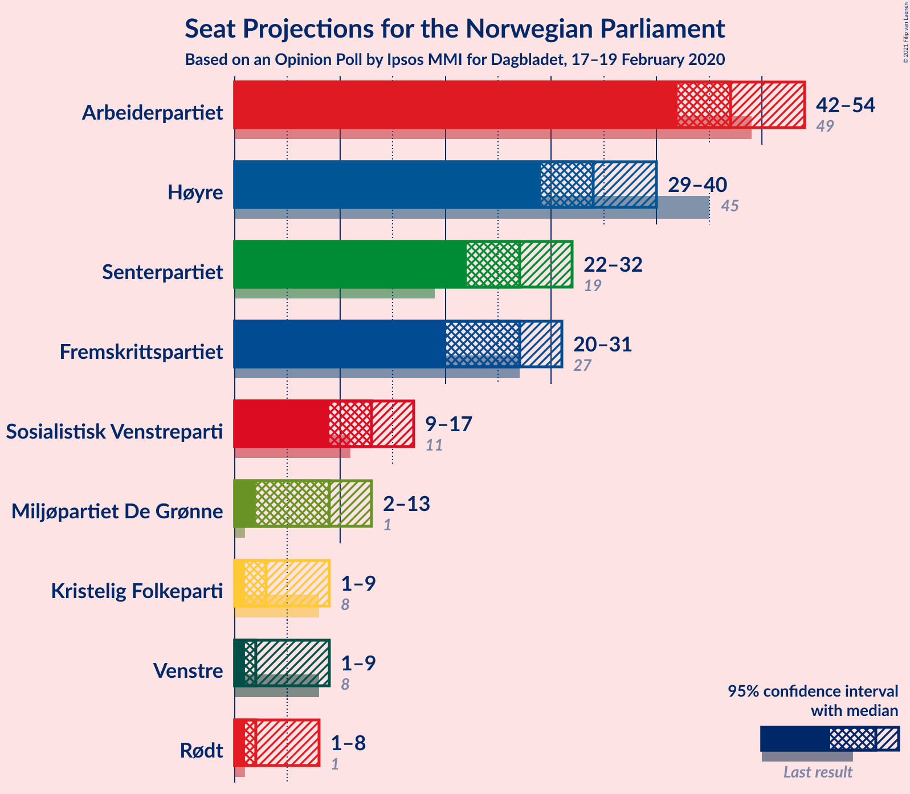

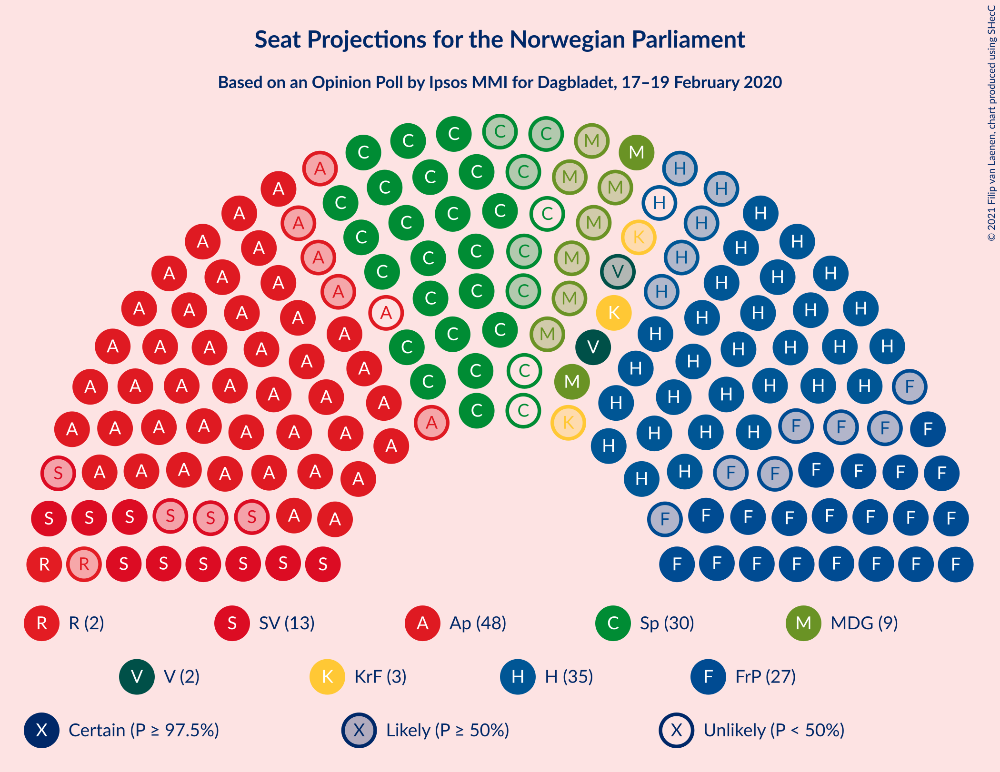

### Confidence Intervals

| Party | Last Result | Median | 80% Confidence Interval | 90% Confidence Interval | 95% Confidence Interval | 99% Confidence Interval |
|:-----:|:-----------:|:------:|:-----------------------:|:-----------------------:|:-----------------------:|:-----------------------:|
| <a href="#arbeiderpartiet">Arbeiderpartiet</a> | 49 | 47 | 44–52 |43–53 |43–55 |41–55 |
| <a href="#høyre">Høyre</a> | 45 | 35 | 30–36 |29–38 |28–39 |27–41 |
| <a href="#senterpartiet">Senterpartiet</a> | 19 | 26 | 24–29 |24–31 |23–33 |21–34 |
| <a href="#fremskrittspartiet">Fremskrittspartiet</a> | 27 | 27 | 23–29 |22–30 |22–31 |19–33 |
| <a href="#sosialistisk-venstreparti">Sosialistisk Venstreparti</a> | 11 | 13 | 10–16 |10–16 |10–17 |9–17 |
| <a href="#miljøpartiet-de-grønne">Miljøpartiet De Grønne</a> | 1 | 10 | 7–12 |7–13 |3–13 |2–14 |
| <a href="#kristelig-folkeparti">Kristelig Folkeparti</a> | 8 | 3 | 1–8 |1–8 |1–9 |1–10 |
| <a href="#rødt">Rødt</a> | 1 | 2 | 1–7 |1–8 |1–9 |1–10 |
| <a href="#venstre">Venstre</a> | 8 | 2 | 2 |2–8 |1–8 |1–10 |

### Arbeiderpartiet

*For a full overview of the results for this party, see the [Arbeiderpartiet](party-arbeiderpartiet.html) page.*

| Number of Seats | Probability | Accumulated | Special Marks |
|:---------------:|:-----------:|:-----------:|:-------------:|
| 38 | 0% | 100% |  |
| 39 | 0.1% | 99.9% |  |
| 40 | 0.1% | 99.9% |  |
| 41 | 0.9% | 99.8% |  |
| 42 | 1.2% | 98.9% |  |
| 43 | 3% | 98% |  |
| 44 | 16% | 94% |  |
| 45 | 11% | 78% |  |
| 46 | 8% | 67% |  |
| 47 | 13% | 59% | Median |
| 48 | 18% | 46% |  |
| 49 | 3% | 28% | Last Result |
| 50 | 3% | 25% |  |
| 51 | 3% | 22% |  |
| 52 | 14% | 19% |  |
| 53 | 2% | 5% |  |
| 54 | 0.7% | 3% |  |
| 55 | 2% | 3% |  |
| 56 | 0.1% | 0.2% |  |
| 57 | 0% | 0.2% |  |
| 58 | 0% | 0.1% |  |
| 59 | 0% | 0.1% |  |
| 60 | 0.1% | 0.1% |  |
| 61 | 0% | 0% |  |

### Høyre

*For a full overview of the results for this party, see the [Høyre](party-høyre.html) page.*

| Number of Seats | Probability | Accumulated | Special Marks |
|:---------------:|:-----------:|:-----------:|:-------------:|
| 24 | 0% | 100% |  |
| 25 | 0% | 99.9% |  |
| 26 | 0.1% | 99.9% |  |
| 27 | 0.6% | 99.8% |  |
| 28 | 2% | 99.2% |  |
| 29 | 3% | 97% |  |
| 30 | 5% | 95% |  |
| 31 | 3% | 89% |  |
| 32 | 2% | 86% |  |
| 33 | 22% | 84% |  |
| 34 | 12% | 63% |  |
| 35 | 35% | 50% | Median |
| 36 | 6% | 15% |  |
| 37 | 4% | 9% |  |
| 38 | 1.3% | 5% |  |
| 39 | 3% | 4% |  |
| 40 | 0.3% | 1.0% |  |
| 41 | 0.3% | 0.7% |  |
| 42 | 0.2% | 0.4% |  |
| 43 | 0% | 0.1% |  |
| 44 | 0.1% | 0.1% |  |
| 45 | 0% | 0% | Last Result |

### Senterpartiet

*For a full overview of the results for this party, see the [Senterpartiet](party-senterpartiet.html) page.*

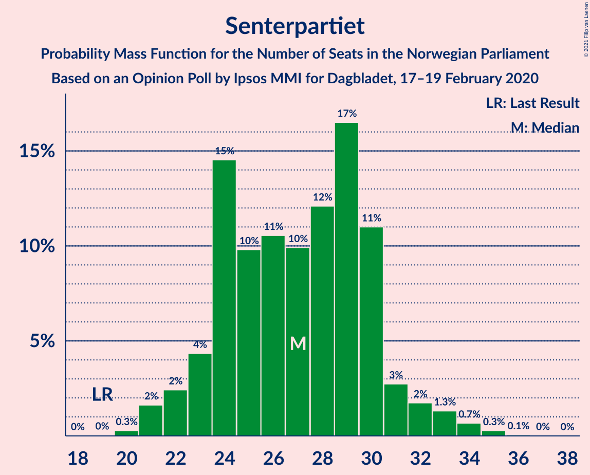

| Number of Seats | Probability | Accumulated | Special Marks |
|:---------------:|:-----------:|:-----------:|:-------------:|
| 19 | 0.1% | 100% | Last Result |
| 20 | 0.2% | 99.9% |  |
| 21 | 0.7% | 99.8% |  |
| 22 | 1.4% | 99.0% |  |
| 23 | 2% | 98% |  |
| 24 | 28% | 95% |  |
| 25 | 11% | 67% |  |
| 26 | 19% | 56% | Median |
| 27 | 4% | 37% |  |
| 28 | 18% | 34% |  |
| 29 | 8% | 16% |  |
| 30 | 3% | 8% |  |
| 31 | 0.8% | 5% |  |
| 32 | 2% | 5% |  |
| 33 | 2% | 3% |  |
| 34 | 0.3% | 0.8% |  |
| 35 | 0.4% | 0.5% |  |
| 36 | 0% | 0% |  |

### Fremskrittspartiet

*For a full overview of the results for this party, see the [Fremskrittspartiet](party-fremskrittspartiet.html) page.*

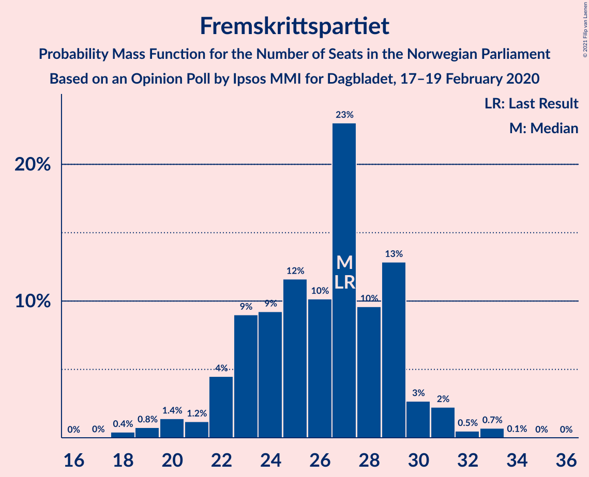

| Number of Seats | Probability | Accumulated | Special Marks |
|:---------------:|:-----------:|:-----------:|:-------------:|
| 18 | 0.1% | 100% |  |
| 19 | 0.5% | 99.9% |  |
| 20 | 0.7% | 99.4% |  |
| 21 | 0.8% | 98.7% |  |
| 22 | 4% | 98% |  |
| 23 | 12% | 93% |  |
| 24 | 4% | 82% |  |
| 25 | 8% | 77% |  |
| 26 | 5% | 69% |  |
| 27 | 32% | 63% | Last Result, Median |
| 28 | 8% | 31% |  |
| 29 | 15% | 23% |  |
| 30 | 4% | 7% |  |
| 31 | 1.4% | 4% |  |
| 32 | 0.1% | 2% |  |
| 33 | 2% | 2% |  |
| 34 | 0% | 0% |  |

### Sosialistisk Venstreparti

*For a full overview of the results for this party, see the [Sosialistisk Venstreparti](party-sosialistiskvenstreparti.html) page.*

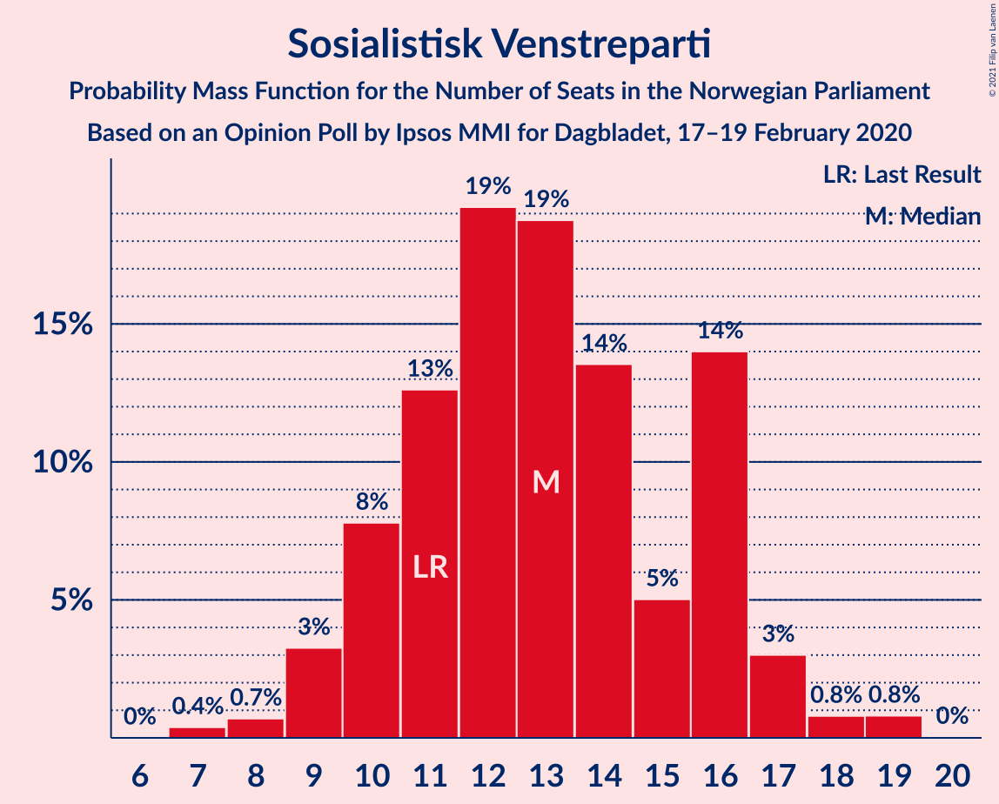

| Number of Seats | Probability | Accumulated | Special Marks |
|:---------------:|:-----------:|:-----------:|:-------------:|
| 7 | 0.1% | 100% |  |
| 8 | 0.4% | 99.9% |  |
| 9 | 1.3% | 99.5% |  |
| 10 | 10% | 98% |  |
| 11 | 3% | 88% | Last Result |
| 12 | 22% | 85% |  |
| 13 | 25% | 63% | Median |
| 14 | 13% | 38% |  |
| 15 | 2% | 25% |  |
| 16 | 21% | 23% |  |
| 17 | 2% | 3% |  |
| 18 | 0.3% | 0.5% |  |
| 19 | 0.1% | 0.2% |  |
| 20 | 0.1% | 0.1% |  |
| 21 | 0% | 0% |  |

### Miljøpartiet De Grønne

*For a full overview of the results for this party, see the [Miljøpartiet De Grønne](party-miljøpartietdegrønne.html) page.*

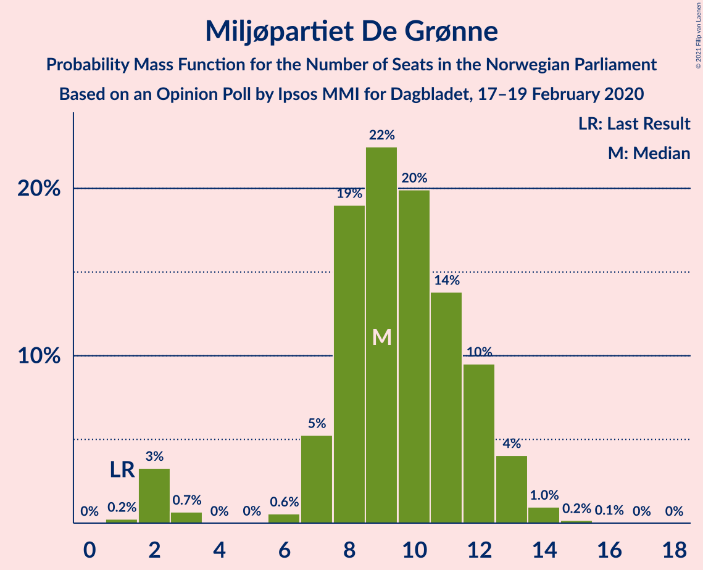

| Number of Seats | Probability | Accumulated | Special Marks |
|:---------------:|:-----------:|:-----------:|:-------------:|
| 1 | 0.1% | 100% | Last Result |
| 2 | 2% | 99.9% |  |
| 3 | 1.0% | 98% |  |
| 4 | 0% | 97% |  |
| 5 | 0% | 97% |  |
| 6 | 0.2% | 97% |  |
| 7 | 7% | 96% |  |
| 8 | 17% | 89% |  |
| 9 | 22% | 72% |  |
| 10 | 18% | 50% | Median |
| 11 | 6% | 32% |  |
| 12 | 18% | 26% |  |
| 13 | 7% | 8% |  |
| 14 | 0.9% | 1.1% |  |
| 15 | 0.1% | 0.2% |  |
| 16 | 0.1% | 0.1% |  |
| 17 | 0% | 0% |  |

### Kristelig Folkeparti

*For a full overview of the results for this party, see the [Kristelig Folkeparti](party-kristeligfolkeparti.html) page.*

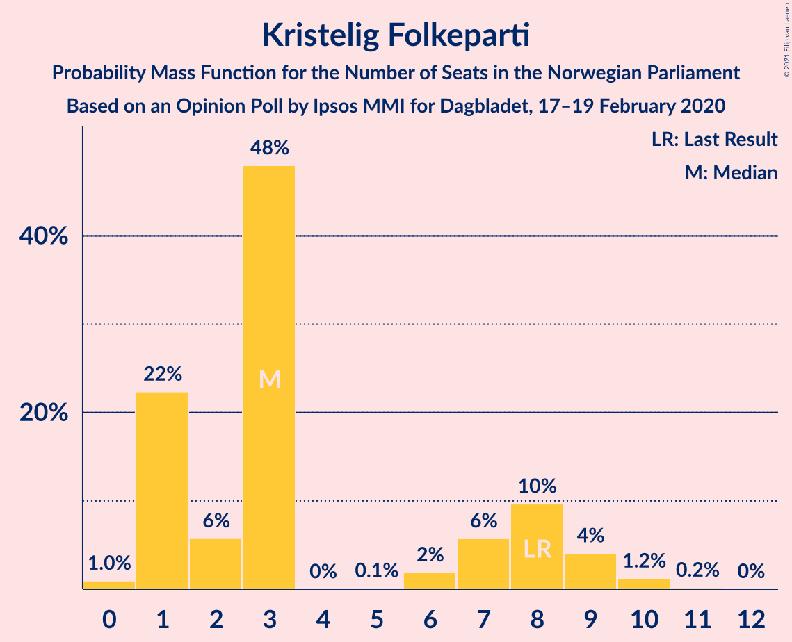

| Number of Seats | Probability | Accumulated | Special Marks |
|:---------------:|:-----------:|:-----------:|:-------------:|
| 0 | 0.4% | 100% |  |
| 1 | 25% | 99.6% |  |
| 2 | 6% | 74% |  |
| 3 | 48% | 68% | Median |
| 4 | 0% | 21% |  |
| 5 | 0% | 21% |  |
| 6 | 1.1% | 21% |  |
| 7 | 6% | 19% |  |
| 8 | 8% | 13% | Last Result |
| 9 | 4% | 5% |  |
| 10 | 1.1% | 1.3% |  |
| 11 | 0.2% | 0.2% |  |
| 12 | 0% | 0% |  |

### Rødt

*For a full overview of the results for this party, see the [Rødt](party-rødt.html) page.*

| Number of Seats | Probability | Accumulated | Special Marks |
|:---------------:|:-----------:|:-----------:|:-------------:|
| 1 | 14% | 100% | Last Result |
| 2 | 54% | 86% | Median |
| 3 | 0% | 32% |  |
| 4 | 0% | 32% |  |
| 5 | 0% | 32% |  |
| 6 | 9% | 32% |  |
| 7 | 15% | 24% |  |
| 8 | 4% | 9% |  |
| 9 | 2% | 5% |  |
| 10 | 2% | 2% |  |
| 11 | 0% | 0.1% |  |
| 12 | 0% | 0% |  |

### Venstre

*For a full overview of the results for this party, see the [Venstre](party-venstre.html) page.*

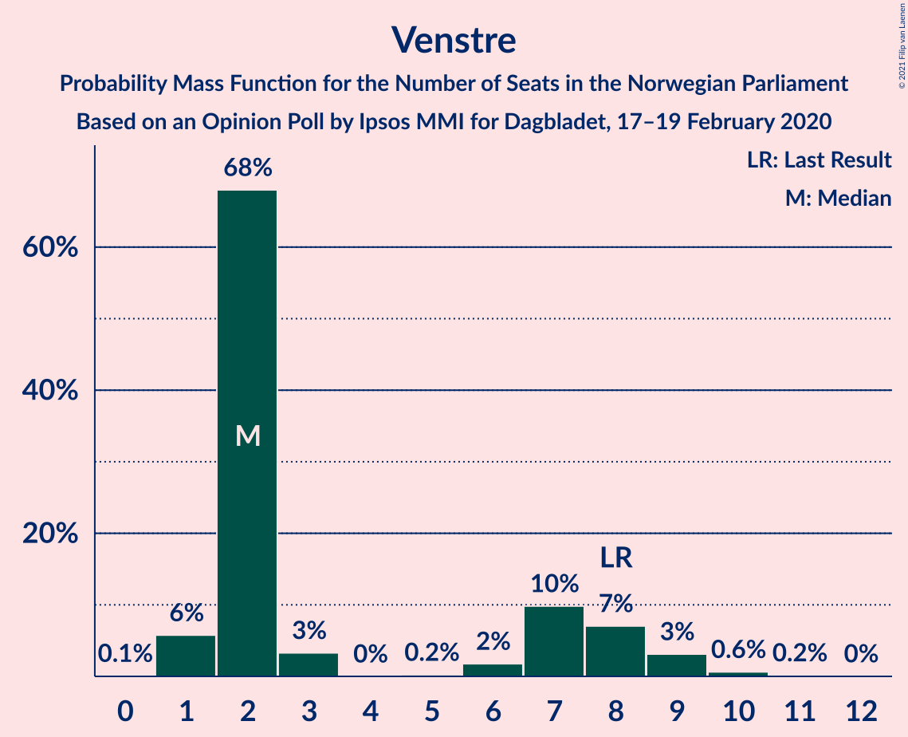

| Number of Seats | Probability | Accumulated | Special Marks |
|:---------------:|:-----------:|:-----------:|:-------------:|
| 0 | 0.1% | 100% |  |
| 1 | 4% | 99.9% |  |
| 2 | 88% | 96% | Median |
| 3 | 0.4% | 8% |  |
| 4 | 0% | 8% |  |
| 5 | 0.2% | 8% |  |
| 6 | 0.6% | 7% |  |
| 7 | 2% | 7% |  |
| 8 | 3% | 5% | Last Result |
| 9 | 1.2% | 2% |  |
| 10 | 0.8% | 0.9% |  |
| 11 | 0.2% | 0.2% |  |
| 12 | 0% | 0% |  |

## Coalitions

### Confidence Intervals

| Coalition | Last Result | Median | Majority? | 80% Confidence Interval | 90% Confidence Interval | 95% Confidence Interval | 99% Confidence Interval |
|:---------:|:-----------:|:------:|:---------:|:-----------------------:|:-----------------------:|:-----------------------:|:-----------------------:|
| Arbeiderpartiet – Senterpartiet – Sosialistisk Venstreparti – Miljøpartiet De Grønne – Kristelig Folkeparti | 88 | 101 | 100% | 93–106 | 91–109 | 91–109 | 90–110 |
| Arbeiderpartiet – Senterpartiet – Sosialistisk Venstreparti – Miljøpartiet De Grønne – Rødt | 81 | 101 | 100% | 96–104 | 93–108 | 91–109 | 89–112 |
| Arbeiderpartiet – Senterpartiet – Sosialistisk Venstreparti – Miljøpartiet De Grønne | 80 | 98 | 99.9% | 90–101 | 90–103 | 88–106 | 87–107 |
| Høyre – Senterpartiet – Fremskrittspartiet – Kristelig Folkeparti – Venstre | 107 | 93 | 99.0% | 88–98 | 86–100 | 86–102 | 82–104 |
| Arbeiderpartiet – Senterpartiet – Sosialistisk Venstreparti – Rødt | 80 | 90 | 95% | 86–95 | 84–98 | 82–98 | 81–101 |
| Arbeiderpartiet – Senterpartiet – Miljøpartiet De Grønne – Kristelig Folkeparti | 77 | 87 | 75% | 81–93 | 81–94 | 81–95 | 78–98 |
| Arbeiderpartiet – Senterpartiet – Sosialistisk Venstreparti | 79 | 87 | 75% | 80–91 | 80–94 | 80–95 | 78–96 |
| Arbeiderpartiet – Senterpartiet – Kristelig Folkeparti | 76 | 78 | 4% | 71–83 | 71–83 | 71–87 | 69–89 |
| Høyre – Fremskrittspartiet – Miljøpartiet De Grønne – Kristelig Folkeparti – Venstre | 89 | 76 | 2% | 70–81 | 69–82 | 69–84 | 66–88 |
| Arbeiderpartiet – Senterpartiet | 68 | 73 | 0.3% | 68–78 | 68–80 | 67–80 | 66–83 |
| Høyre – Fremskrittspartiet – Kristelig Folkeparti – Venstre | 88 | 67 | 0% | 61–72 | 61–73 | 60–75 | 57–80 |
| Høyre – Fremskrittspartiet – Venstre | 80 | 64 | 0% | 58–66 | 57–69 | 57–71 | 54–72 |
| Arbeiderpartiet – Sosialistisk Venstreparti | 60 | 60 | 0% | 56–65 | 55–65 | 54–68 | 52–71 |
| Høyre – Fremskrittspartiet | 72 | 62 | 0% | 56–64 | 55–65 | 53–68 | 52–70 |
| Høyre – Kristelig Folkeparti – Venstre | 61 | 39 | 0% | 37–45 | 35–48 | 35–48 | 32–51 |
| Senterpartiet – Kristelig Folkeparti – Venstre | 35 | 30 | 0% | 29–38 | 29–40 | 29–41 | 26–44 |

### Arbeiderpartiet – Senterpartiet – Sosialistisk Venstreparti – Miljøpartiet De Grønne – Kristelig Folkeparti

| Number of Seats | Probability | Accumulated | Special Marks |
|:---------------:|:-----------:|:-----------:|:-------------:|
| 86 | 0% | 100% |  |
| 87 | 0% | 99.9% |  |
| 88 | 0.2% | 99.9% | Last Result |
| 89 | 0.1% | 99.8% |  |
| 90 | 0.3% | 99.6% |  |
| 91 | 5% | 99.3% |  |
| 92 | 1.4% | 94% |  |
| 93 | 9% | 93% |  |
| 94 | 1.1% | 84% |  |
| 95 | 3% | 83% |  |
| 96 | 3% | 79% |  |
| 97 | 2% | 76% |  |
| 98 | 10% | 74% |  |
| 99 | 1.2% | 64% | Median |
| 100 | 5% | 63% |  |
| 101 | 16% | 57% |  |
| 102 | 5% | 41% |  |
| 103 | 22% | 36% |  |
| 104 | 3% | 14% |  |
| 105 | 0.7% | 12% |  |
| 106 | 4% | 11% |  |
| 107 | 0.3% | 7% |  |
| 108 | 1.3% | 7% |  |
| 109 | 3% | 5% |  |
| 110 | 2% | 2% |  |
| 111 | 0.1% | 0.3% |  |
| 112 | 0.1% | 0.2% |  |
| 113 | 0% | 0% |  |

### Arbeiderpartiet – Senterpartiet – Sosialistisk Venstreparti – Miljøpartiet De Grønne – Rødt

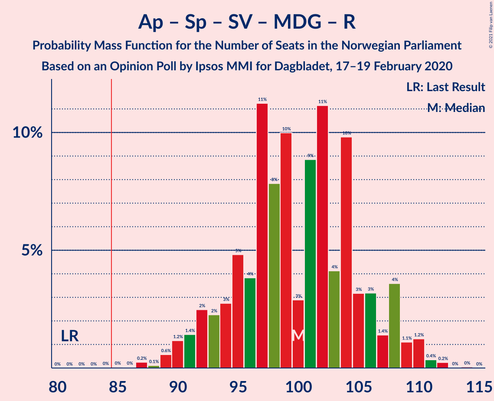

| Number of Seats | Probability | Accumulated | Special Marks |
|:---------------:|:-----------:|:-----------:|:-------------:|
| 81 | 0% | 100% | Last Result |
| 82 | 0% | 100% |  |
| 83 | 0% | 100% |  |
| 84 | 0% | 100% |  |
| 85 | 0% | 100% | Majority |
| 86 | 0% | 100% |  |
| 87 | 0.1% | 99.9% |  |
| 88 | 0.1% | 99.9% |  |
| 89 | 0.9% | 99.8% |  |
| 90 | 1.2% | 98.8% |  |
| 91 | 1.3% | 98% |  |
| 92 | 0.9% | 96% |  |
| 93 | 1.4% | 96% |  |
| 94 | 2% | 94% |  |
| 95 | 1.4% | 92% |  |
| 96 | 3% | 90% |  |
| 97 | 18% | 87% |  |
| 98 | 4% | 69% | Median |
| 99 | 6% | 65% |  |
| 100 | 1.4% | 59% |  |
| 101 | 11% | 58% |  |
| 102 | 32% | 47% |  |
| 103 | 2% | 16% |  |
| 104 | 4% | 13% |  |
| 105 | 3% | 10% |  |
| 106 | 0.6% | 6% |  |
| 107 | 0.6% | 6% |  |
| 108 | 2% | 5% |  |
| 109 | 2% | 3% |  |
| 110 | 0.2% | 0.8% |  |
| 111 | 0% | 0.6% |  |
| 112 | 0.5% | 0.5% |  |
| 113 | 0% | 0% |  |

### Arbeiderpartiet – Senterpartiet – Sosialistisk Venstreparti – Miljøpartiet De Grønne

| Number of Seats | Probability | Accumulated | Special Marks |
|:---------------:|:-----------:|:-----------:|:-------------:|
| 80 | 0% | 100% | Last Result |
| 81 | 0% | 100% |  |
| 82 | 0% | 100% |  |
| 83 | 0% | 99.9% |  |
| 84 | 0% | 99.9% |  |
| 85 | 0.2% | 99.9% | Majority |
| 86 | 0.1% | 99.7% |  |
| 87 | 1.4% | 99.6% |  |
| 88 | 1.3% | 98% |  |
| 89 | 2% | 97% |  |
| 90 | 15% | 95% |  |
| 91 | 1.5% | 81% |  |
| 92 | 2% | 79% |  |
| 93 | 3% | 77% |  |
| 94 | 2% | 74% |  |
| 95 | 15% | 72% |  |
| 96 | 4% | 58% | Median |
| 97 | 3% | 54% |  |
| 98 | 5% | 51% |  |
| 99 | 3% | 46% |  |
| 100 | 32% | 43% |  |
| 101 | 2% | 11% |  |
| 102 | 2% | 8% |  |
| 103 | 3% | 7% |  |
| 104 | 1.0% | 4% |  |
| 105 | 0.1% | 3% |  |
| 106 | 2% | 3% |  |
| 107 | 0.5% | 0.6% |  |
| 108 | 0.1% | 0.2% |  |
| 109 | 0.1% | 0.1% |  |
| 110 | 0% | 0% |  |

### Høyre – Senterpartiet – Fremskrittspartiet – Kristelig Folkeparti – Venstre

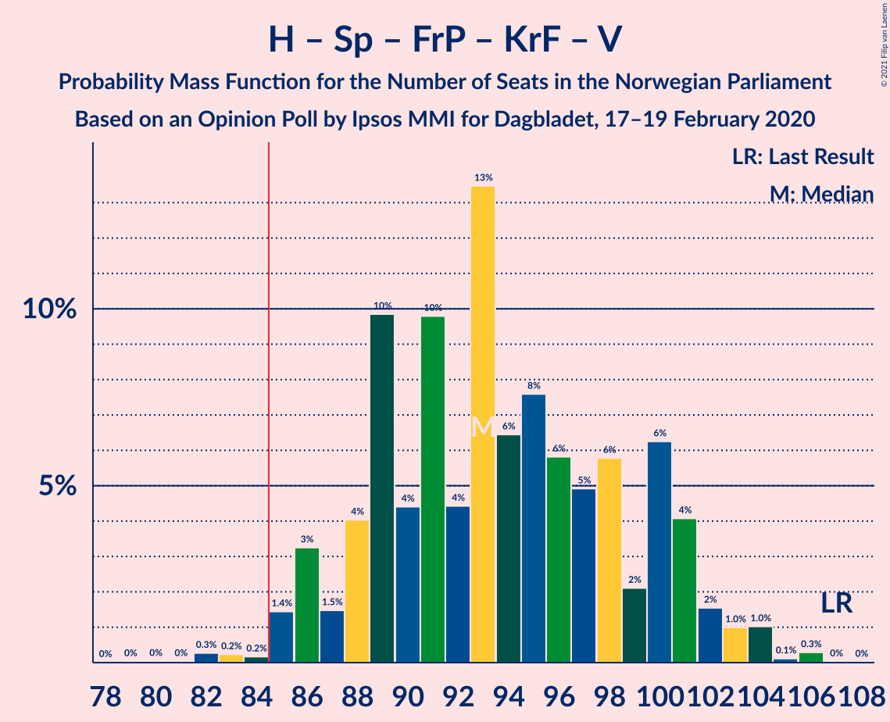

| Number of Seats | Probability | Accumulated | Special Marks |
|:---------------:|:-----------:|:-----------:|:-------------:|
| 79 | 0% | 100% |  |
| 80 | 0% | 99.9% |  |
| 81 | 0% | 99.9% |  |
| 82 | 0.6% | 99.9% |  |
| 83 | 0.1% | 99.3% |  |
| 84 | 0.1% | 99.1% |  |
| 85 | 0.2% | 99.0% | Majority |
| 86 | 4% | 98.8% |  |
| 87 | 0.8% | 94% |  |
| 88 | 5% | 94% |  |
| 89 | 17% | 89% |  |
| 90 | 1.0% | 72% |  |
| 91 | 17% | 71% |  |
| 92 | 2% | 53% |  |
| 93 | 22% | 52% | Median |
| 94 | 4% | 30% |  |
| 95 | 3% | 26% |  |
| 96 | 4% | 23% |  |
| 97 | 8% | 19% |  |
| 98 | 1.2% | 11% |  |
| 99 | 2% | 10% |  |
| 100 | 3% | 8% |  |
| 101 | 2% | 5% |  |
| 102 | 1.2% | 3% |  |
| 103 | 0.6% | 1.5% |  |
| 104 | 0.5% | 0.9% |  |
| 105 | 0.1% | 0.4% |  |
| 106 | 0.2% | 0.3% |  |
| 107 | 0% | 0.1% | Last Result |
| 108 | 0% | 0% |  |

### Arbeiderpartiet – Senterpartiet – Sosialistisk Venstreparti – Rødt

| Number of Seats | Probability | Accumulated | Special Marks |
|:---------------:|:-----------:|:-----------:|:-------------:|
| 78 | 0% | 100% |  |
| 79 | 0.1% | 99.9% |  |
| 80 | 0.1% | 99.9% | Last Result |
| 81 | 1.0% | 99.7% |  |
| 82 | 2% | 98.7% |  |
| 83 | 1.0% | 97% |  |
| 84 | 1.2% | 96% |  |
| 85 | 3% | 95% | Majority |
| 86 | 4% | 92% |  |
| 87 | 13% | 88% |  |
| 88 | 5% | 75% | Median |
| 89 | 2% | 70% |  |
| 90 | 25% | 68% |  |
| 91 | 3% | 43% |  |
| 92 | 5% | 41% |  |
| 93 | 22% | 36% |  |
| 94 | 2% | 14% |  |
| 95 | 3% | 12% |  |
| 96 | 3% | 9% |  |
| 97 | 2% | 7% |  |
| 98 | 4% | 5% |  |
| 99 | 0% | 1.2% |  |
| 100 | 0.3% | 1.1% |  |
| 101 | 0.5% | 0.8% |  |
| 102 | 0.1% | 0.3% |  |
| 103 | 0.1% | 0.2% |  |
| 104 | 0.1% | 0.1% |  |
| 105 | 0% | 0% |  |

### Arbeiderpartiet – Senterpartiet – Miljøpartiet De Grønne – Kristelig Folkeparti

| Number of Seats | Probability | Accumulated | Special Marks |
|:---------------:|:-----------:|:-----------:|:-------------:|
| 74 | 0% | 100% |  |
| 75 | 0% | 99.9% |  |
| 76 | 0.1% | 99.9% |  |
| 77 | 0.3% | 99.8% | Last Result |
| 78 | 0.4% | 99.6% |  |
| 79 | 1.0% | 99.2% |  |
| 80 | 0.6% | 98% |  |
| 81 | 15% | 98% |  |
| 82 | 4% | 83% |  |
| 83 | 1.2% | 79% |  |
| 84 | 3% | 78% |  |
| 85 | 2% | 75% | Majority |
| 86 | 14% | 73% | Median |
| 87 | 20% | 59% |  |
| 88 | 15% | 40% |  |
| 89 | 8% | 24% |  |
| 90 | 0.9% | 17% |  |
| 91 | 2% | 16% |  |
| 92 | 3% | 14% |  |
| 93 | 4% | 11% |  |
| 94 | 4% | 7% |  |
| 95 | 2% | 3% |  |
| 96 | 0.2% | 1.5% |  |
| 97 | 0.3% | 1.3% |  |
| 98 | 0.8% | 1.0% |  |
| 99 | 0% | 0.2% |  |
| 100 | 0% | 0.2% |  |
| 101 | 0.1% | 0.1% |  |
| 102 | 0% | 0% |  |

### Arbeiderpartiet – Senterpartiet – Sosialistisk Venstreparti

| Number of Seats | Probability | Accumulated | Special Marks |
|:---------------:|:-----------:|:-----------:|:-------------:|
| 75 | 0.1% | 100% |  |
| 76 | 0.1% | 99.9% |  |
| 77 | 0.1% | 99.9% |  |
| 78 | 0.4% | 99.7% |  |
| 79 | 1.0% | 99.3% | Last Result |
| 80 | 10% | 98% |  |
| 81 | 2% | 88% |  |
| 82 | 2% | 86% |  |
| 83 | 7% | 85% |  |
| 84 | 3% | 78% |  |
| 85 | 7% | 75% | Majority |
| 86 | 6% | 68% | Median |
| 87 | 12% | 62% |  |
| 88 | 21% | 50% |  |
| 89 | 3% | 29% |  |
| 90 | 4% | 27% |  |
| 91 | 15% | 23% |  |
| 92 | 0.5% | 8% |  |
| 93 | 1.2% | 7% |  |
| 94 | 2% | 6% |  |
| 95 | 2% | 5% |  |
| 96 | 2% | 2% |  |
| 97 | 0% | 0.3% |  |
| 98 | 0.1% | 0.2% |  |
| 99 | 0% | 0.1% |  |
| 100 | 0% | 0.1% |  |
| 101 | 0% | 0.1% |  |
| 102 | 0.1% | 0.1% |  |
| 103 | 0% | 0% |  |

### Arbeiderpartiet – Senterpartiet – Kristelig Folkeparti

| Number of Seats | Probability | Accumulated | Special Marks |
|:---------------:|:-----------:|:-----------:|:-------------:|
| 66 | 0.1% | 100% |  |
| 67 | 0.1% | 99.9% |  |
| 68 | 0.1% | 99.9% |  |
| 69 | 0.3% | 99.7% |  |
| 70 | 0.5% | 99.4% |  |
| 71 | 10% | 98.9% |  |
| 72 | 0.9% | 89% |  |
| 73 | 7% | 89% |  |
| 74 | 8% | 82% |  |
| 75 | 17% | 74% |  |
| 76 | 2% | 56% | Last Result, Median |
| 77 | 3% | 55% |  |
| 78 | 12% | 52% |  |
| 79 | 18% | 40% |  |
| 80 | 4% | 22% |  |
| 81 | 5% | 18% |  |
| 82 | 2% | 13% |  |
| 83 | 8% | 12% |  |
| 84 | 0.5% | 4% |  |
| 85 | 0.5% | 4% | Majority |
| 86 | 0.4% | 3% |  |
| 87 | 2% | 3% |  |
| 88 | 0.3% | 1.1% |  |
| 89 | 0.6% | 0.8% |  |
| 90 | 0.2% | 0.2% |  |
| 91 | 0% | 0% |  |

### Høyre – Fremskrittspartiet – Miljøpartiet De Grønne – Kristelig Folkeparti – Venstre

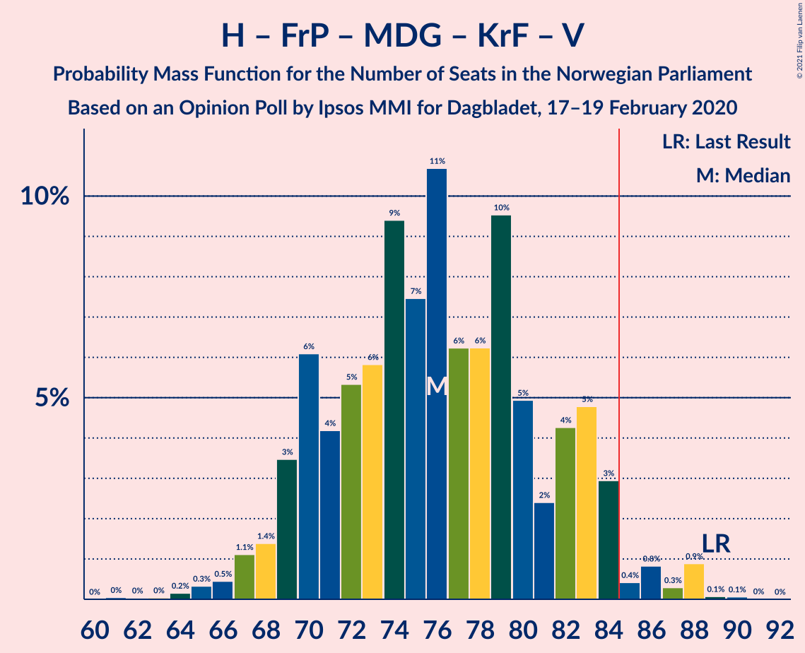

| Number of Seats | Probability | Accumulated | Special Marks |
|:---------------:|:-----------:|:-----------:|:-------------:|
| 61 | 0.1% | 100% |  |
| 62 | 0% | 99.9% |  |
| 63 | 0% | 99.9% |  |
| 64 | 0% | 99.8% |  |
| 65 | 0.2% | 99.8% |  |
| 66 | 0.3% | 99.6% |  |
| 67 | 0.2% | 99.3% |  |
| 68 | 0.6% | 99.2% |  |
| 69 | 8% | 98.5% |  |
| 70 | 1.0% | 91% |  |
| 71 | 6% | 90% |  |
| 72 | 7% | 84% |  |
| 73 | 3% | 77% |  |
| 74 | 4% | 74% |  |
| 75 | 10% | 70% |  |
| 76 | 20% | 60% |  |
| 77 | 5% | 40% | Median |
| 78 | 3% | 35% |  |
| 79 | 20% | 33% |  |
| 80 | 1.0% | 13% |  |
| 81 | 3% | 12% |  |
| 82 | 4% | 8% |  |
| 83 | 0.2% | 4% |  |
| 84 | 2% | 4% |  |
| 85 | 0.4% | 2% | Majority |
| 86 | 0.9% | 2% |  |
| 87 | 0.1% | 0.9% |  |
| 88 | 0.7% | 0.8% |  |
| 89 | 0% | 0.1% | Last Result |
| 90 | 0% | 0.1% |  |
| 91 | 0% | 0% |  |

### Arbeiderpartiet – Senterpartiet

| Number of Seats | Probability | Accumulated | Special Marks |
|:---------------:|:-----------:|:-----------:|:-------------:|
| 63 | 0% | 100% |  |
| 64 | 0.1% | 99.9% |  |
| 65 | 0.2% | 99.9% |  |
| 66 | 1.0% | 99.6% |  |
| 67 | 2% | 98.6% |  |
| 68 | 10% | 97% | Last Result |
| 69 | 2% | 87% |  |
| 70 | 2% | 85% |  |
| 71 | 5% | 83% |  |
| 72 | 20% | 78% |  |
| 73 | 11% | 58% | Median |
| 74 | 5% | 47% |  |
| 75 | 13% | 42% |  |
| 76 | 3% | 29% |  |
| 77 | 2% | 27% |  |
| 78 | 17% | 25% |  |
| 79 | 2% | 7% |  |
| 80 | 4% | 6% |  |
| 81 | 0.8% | 2% |  |
| 82 | 0.2% | 0.8% |  |
| 83 | 0.3% | 0.6% |  |
| 84 | 0.1% | 0.3% |  |
| 85 | 0.1% | 0.3% | Majority |
| 86 | 0% | 0.1% |  |
| 87 | 0% | 0.1% |  |
| 88 | 0.1% | 0.1% |  |
| 89 | 0% | 0% |  |

### Høyre – Fremskrittspartiet – Kristelig Folkeparti – Venstre

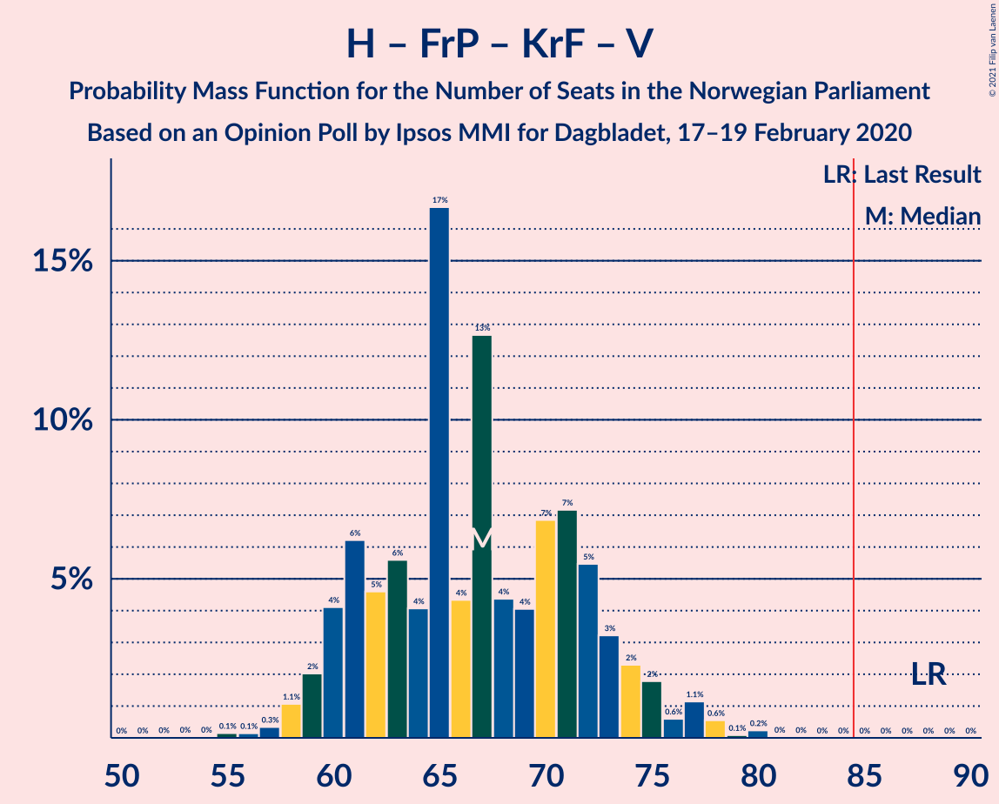

| Number of Seats | Probability | Accumulated | Special Marks |
|:---------------:|:-----------:|:-----------:|:-------------:|
| 56 | 0.3% | 100% |  |
| 57 | 0.6% | 99.7% |  |
| 58 | 0.6% | 99.1% |  |
| 59 | 0.4% | 98% |  |
| 60 | 2% | 98% |  |
| 61 | 10% | 96% |  |
| 62 | 1.1% | 86% |  |
| 63 | 5% | 84% |  |
| 64 | 4% | 80% |  |
| 65 | 18% | 76% |  |
| 66 | 3% | 58% |  |
| 67 | 32% | 55% | Median |
| 68 | 4% | 23% |  |
| 69 | 2% | 19% |  |
| 70 | 2% | 17% |  |
| 71 | 4% | 15% |  |
| 72 | 4% | 11% |  |
| 73 | 3% | 7% |  |
| 74 | 0.6% | 4% |  |
| 75 | 1.4% | 3% |  |
| 76 | 0.5% | 2% |  |
| 77 | 0.3% | 1.2% |  |
| 78 | 0.1% | 0.9% |  |
| 79 | 0% | 0.8% |  |
| 80 | 0.7% | 0.8% |  |
| 81 | 0% | 0.1% |  |
| 82 | 0% | 0% |  |
| 83 | 0% | 0% |  |
| 84 | 0% | 0% |  |
| 85 | 0% | 0% | Majority |
| 86 | 0% | 0% |  |
| 87 | 0% | 0% |  |
| 88 | 0% | 0% | Last Result |

### Høyre – Fremskrittspartiet – Venstre

| Number of Seats | Probability | Accumulated | Special Marks |
|:---------------:|:-----------:|:-----------:|:-------------:|
| 51 | 0.1% | 100% |  |
| 52 | 0.1% | 99.9% |  |
| 53 | 0.1% | 99.9% |  |
| 54 | 0.5% | 99.8% |  |
| 55 | 1.0% | 99.2% |  |
| 56 | 0.5% | 98% |  |
| 57 | 4% | 98% |  |
| 58 | 13% | 94% |  |
| 59 | 2% | 80% |  |
| 60 | 2% | 78% |  |
| 61 | 8% | 76% |  |
| 62 | 10% | 68% |  |
| 63 | 3% | 59% |  |
| 64 | 27% | 56% | Median |
| 65 | 5% | 29% |  |
| 66 | 16% | 25% |  |
| 67 | 0.9% | 8% |  |
| 68 | 2% | 7% |  |
| 69 | 1.1% | 6% |  |
| 70 | 2% | 4% |  |
| 71 | 0.2% | 3% |  |
| 72 | 2% | 2% |  |
| 73 | 0.2% | 0.4% |  |
| 74 | 0% | 0.2% |  |
| 75 | 0.1% | 0.2% |  |
| 76 | 0% | 0.1% |  |
| 77 | 0% | 0% |  |
| 78 | 0% | 0% |  |
| 79 | 0% | 0% |  |
| 80 | 0% | 0% | Last Result |

### Arbeiderpartiet – Sosialistisk Venstreparti

| Number of Seats | Probability | Accumulated | Special Marks |
|:---------------:|:-----------:|:-----------:|:-------------:|
| 50 | 0.1% | 100% |  |
| 51 | 0.4% | 99.9% |  |
| 52 | 0.3% | 99.5% |  |
| 53 | 0.7% | 99.3% |  |
| 54 | 1.4% | 98.5% |  |
| 55 | 7% | 97% |  |
| 56 | 11% | 90% |  |
| 57 | 7% | 79% |  |
| 58 | 4% | 72% |  |
| 59 | 14% | 69% |  |
| 60 | 8% | 55% | Last Result, Median |
| 61 | 2% | 46% |  |
| 62 | 3% | 44% |  |
| 63 | 3% | 42% |  |
| 64 | 18% | 38% |  |
| 65 | 16% | 21% |  |
| 66 | 0.4% | 5% |  |
| 67 | 0.8% | 4% |  |
| 68 | 1.4% | 4% |  |
| 69 | 0.1% | 2% |  |
| 70 | 0% | 2% |  |
| 71 | 2% | 2% |  |
| 72 | 0% | 0.1% |  |
| 73 | 0% | 0.1% |  |
| 74 | 0.1% | 0.1% |  |
| 75 | 0% | 0% |  |

### Høyre – Fremskrittspartiet

| Number of Seats | Probability | Accumulated | Special Marks |
|:---------------:|:-----------:|:-----------:|:-------------:|
| 49 | 0.1% | 100% |  |
| 50 | 0.1% | 99.8% |  |
| 51 | 0.2% | 99.8% |  |
| 52 | 1.3% | 99.6% |  |
| 53 | 1.1% | 98% |  |
| 54 | 1.2% | 97% |  |
| 55 | 4% | 96% |  |
| 56 | 14% | 92% |  |
| 57 | 2% | 78% |  |
| 58 | 3% | 76% |  |
| 59 | 8% | 73% |  |
| 60 | 10% | 65% |  |
| 61 | 3% | 55% |  |
| 62 | 25% | 52% | Median |
| 63 | 5% | 27% |  |
| 64 | 17% | 22% |  |
| 65 | 0.5% | 5% |  |
| 66 | 1.2% | 5% |  |
| 67 | 0.5% | 3% |  |
| 68 | 2% | 3% |  |
| 69 | 0.1% | 1.3% |  |
| 70 | 1.2% | 1.2% |  |
| 71 | 0% | 0.1% |  |
| 72 | 0% | 0% | Last Result |

### Høyre – Kristelig Folkeparti – Venstre

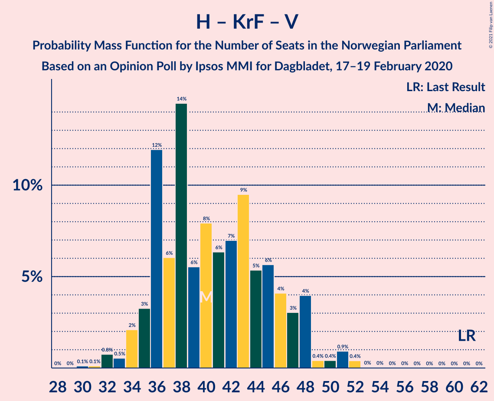

| Number of Seats | Probability | Accumulated | Special Marks |
|:---------------:|:-----------:|:-----------:|:-------------:|
| 31 | 0% | 100% |  |
| 32 | 0.6% | 99.9% |  |
| 33 | 0.2% | 99.3% |  |
| 34 | 1.3% | 99.1% |  |
| 35 | 3% | 98% |  |
| 36 | 0.6% | 95% |  |
| 37 | 8% | 94% |  |
| 38 | 36% | 87% |  |
| 39 | 4% | 50% |  |
| 40 | 21% | 46% | Median |
| 41 | 2% | 25% |  |
| 42 | 4% | 23% |  |
| 43 | 4% | 19% |  |
| 44 | 3% | 15% |  |
| 45 | 4% | 12% |  |
| 46 | 2% | 7% |  |
| 47 | 0.6% | 6% |  |
| 48 | 3% | 5% |  |
| 49 | 0.4% | 2% |  |
| 50 | 0.9% | 2% |  |
| 51 | 0.4% | 0.6% |  |
| 52 | 0.2% | 0.2% |  |
| 53 | 0% | 0.1% |  |
| 54 | 0% | 0% |  |
| 55 | 0% | 0% |  |
| 56 | 0% | 0% |  |
| 57 | 0% | 0% |  |
| 58 | 0% | 0% |  |
| 59 | 0% | 0% |  |
| 60 | 0% | 0% |  |
| 61 | 0% | 0% | Last Result |

### Senterpartiet – Kristelig Folkeparti – Venstre

| Number of Seats | Probability | Accumulated | Special Marks |
|:---------------:|:-----------:|:-----------:|:-------------:|
| 25 | 0.2% | 100% |  |
| 26 | 0.5% | 99.8% |  |
| 27 | 0.6% | 99.3% |  |
| 28 | 0.5% | 98.7% |  |
| 29 | 45% | 98% |  |
| 30 | 4% | 53% |  |
| 31 | 7% | 49% | Median |
| 32 | 2% | 42% |  |
| 33 | 11% | 40% |  |
| 34 | 5% | 29% |  |
| 35 | 3% | 24% | Last Result |
| 36 | 3% | 21% |  |
| 37 | 1.0% | 18% |  |
| 38 | 10% | 17% |  |
| 39 | 1.0% | 7% |  |
| 40 | 2% | 6% |  |
| 41 | 3% | 4% |  |
| 42 | 0.3% | 1.5% |  |
| 43 | 0.4% | 1.1% |  |
| 44 | 0.3% | 0.7% |  |
| 45 | 0.1% | 0.4% |  |
| 46 | 0.2% | 0.3% |  |
| 47 | 0% | 0.1% |  |
| 48 | 0% | 0.1% |  |
| 49 | 0% | 0% |  |

## Technical Information

### Opinion Poll

+ **Polling firm:** Ipsos MMI
+ **Commissioner(s):** Dagbladet
+ **Fieldwork period:** 17–19 February 2020

### Calculations

+ **Sample size:** 726
+ **Simulations done:** 131,072
+ **Error estimate:** 2.04%

