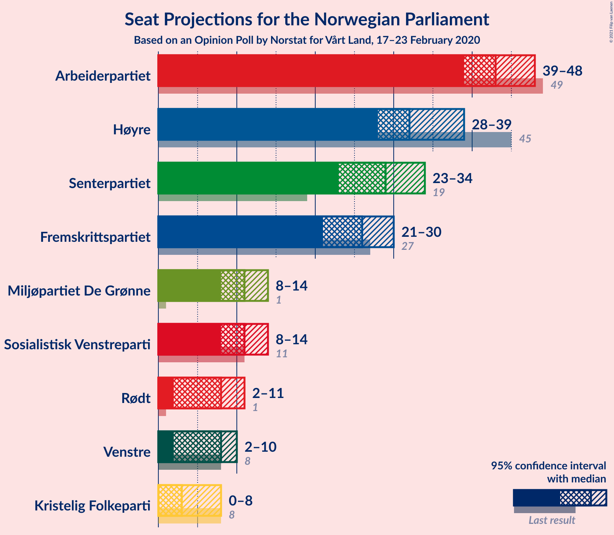
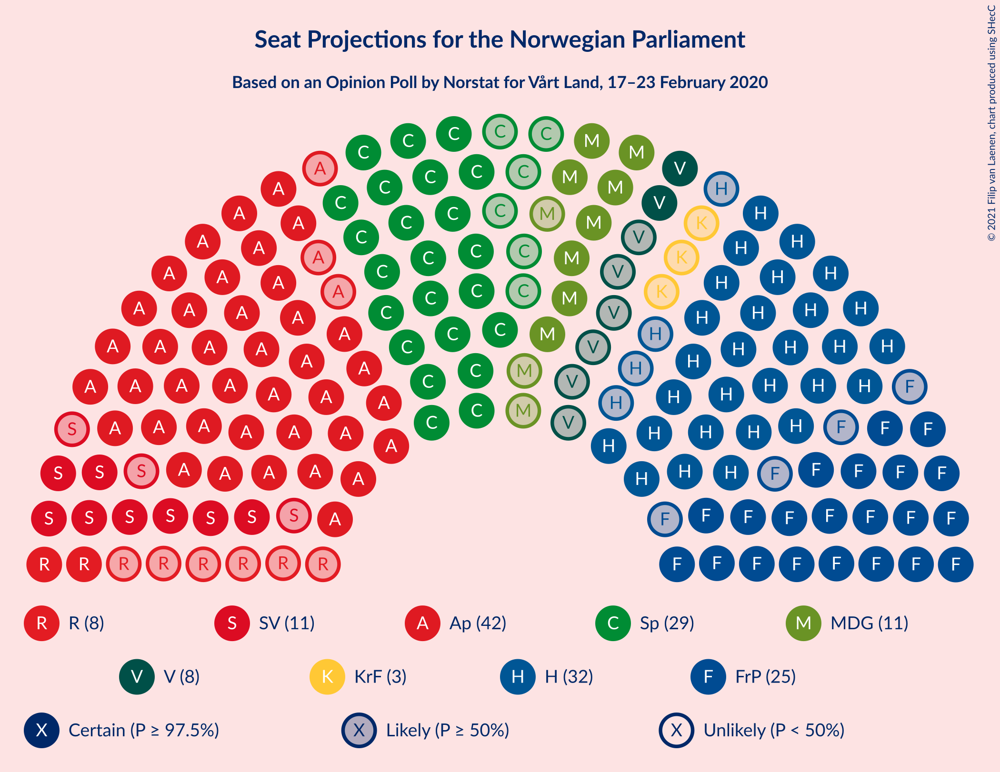
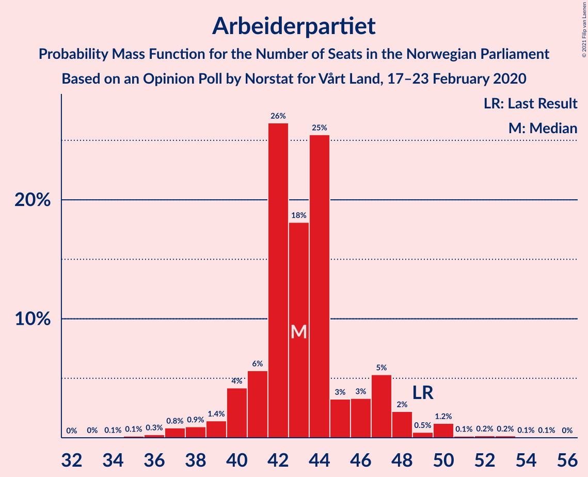
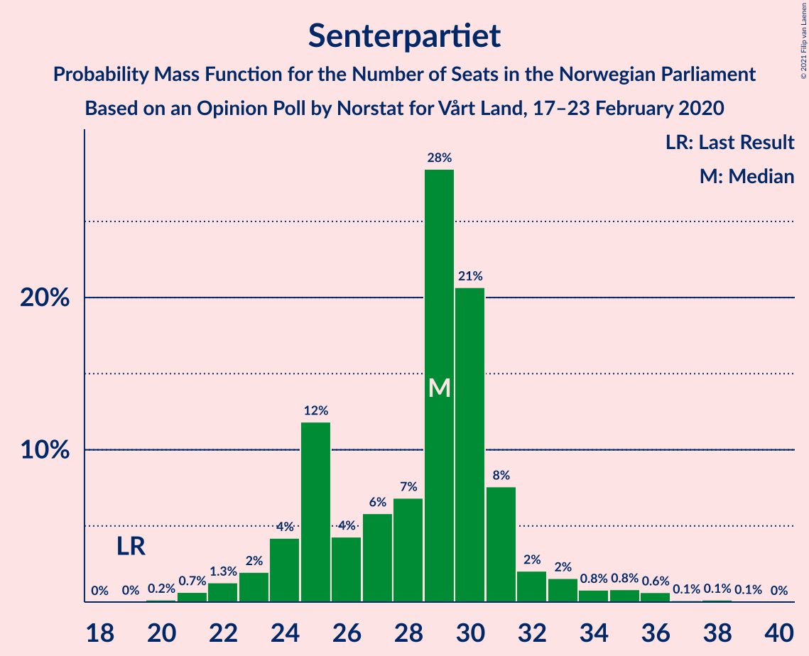
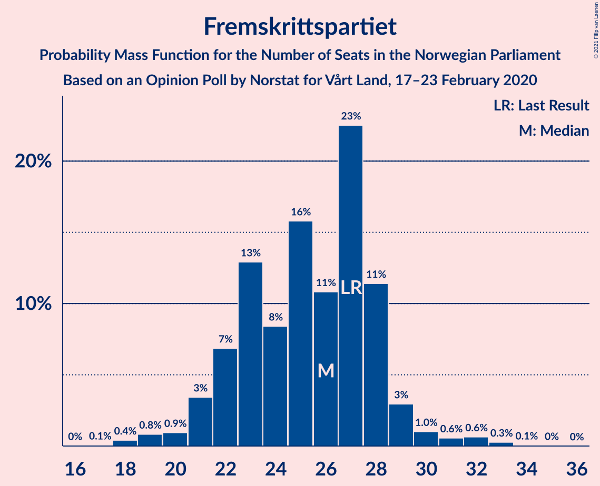
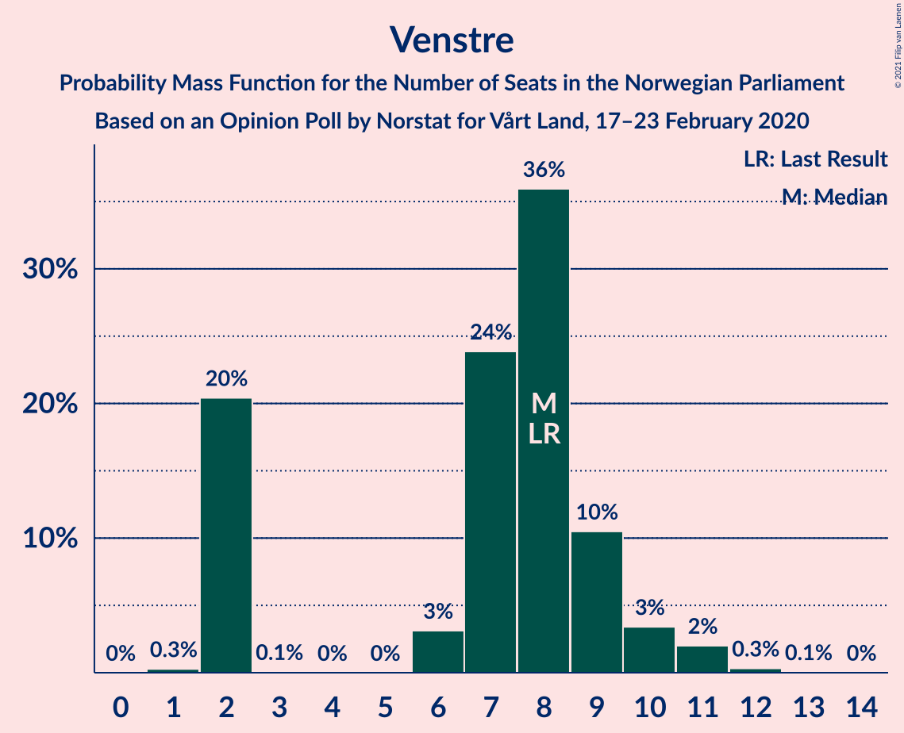
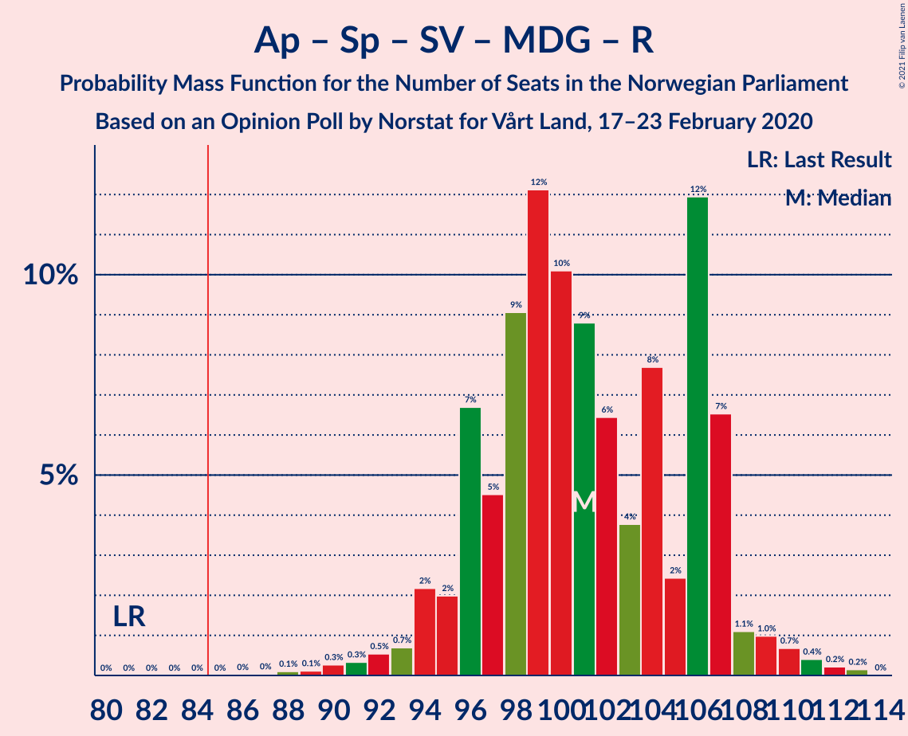
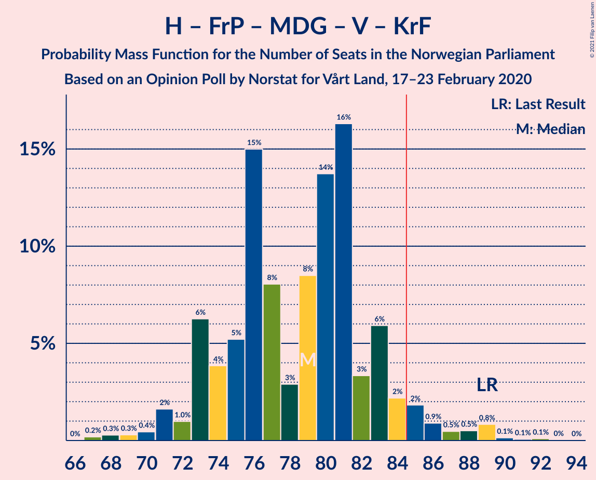

# Opinion Poll by Norstat for Vårt Land, 17–23 February 2020

<a href="#voting-intentions">Voting Intentions</a> | <a href="#seats">Seats</a> | <a href="#coalitions">Coalitions</a> | <a href="#technical-information">Technical Information</a>

## Voting Intentions

### Confidence Intervals

| Party | Last Result | Poll Result | 80% Confidence Interval | 90% Confidence Interval | 95% Confidence Interval | 99% Confidence Interval |
|:-----:|:-----------:|:-----------:|:-----------------------:|:-----------------------:|:-----------------------:|:-----------------------:|
| Arbeiderpartiet | 27.4% | 24.0% | 21.9–26.3% |21.4–27.0% |20.9–27.5% |19.9–28.7% |
| Høyre | 25.0% | 18.9% | 17.1–21.1% |16.5–21.7% |16.1–22.2% |15.2–23.3% |
| Senterpartiet | 10.3% | 15.8% | 14.0–17.8% |13.5–18.3% |13.1–18.8% |12.3–19.8% |
| Fremskrittspartiet | 15.2% | 14.3% | 12.7–16.3% |12.2–16.8% |11.8–17.3% |11.1–18.3% |
| Sosialistisk Venstreparti | 6.0% | 6.5% | 5.4–8.0% |5.1–8.4% |4.8–8.7% |4.4–9.5% |
| Miljøpartiet De Grønne | 3.2% | 6.4% | 5.3–7.8% |5.0–8.2% |4.7–8.6% |4.2–9.3% |
| Rødt | 2.4% | 4.8% | 3.8–6.1% |3.6–6.4% |3.4–6.8% |3.0–7.4% |
| Venstre | 4.4% | 4.5% | 3.6–5.7% |3.3–6.1% |3.1–6.4% |2.7–7.0% |
| Kristelig Folkeparti | 4.2% | 3.5% | 2.7–4.6% |2.5–5.0% |2.3–5.3% |2.0–5.9% |

*Note:* The poll result column reflects the actual value used in the calculations. Published results may vary slightly, and in addition be rounded to fewer digits.

## Seats

### Confidence Intervals

| Party | Last Result | Median | 80% Confidence Interval | 90% Confidence Interval | 95% Confidence Interval | 99% Confidence Interval |
|:-----:|:-----------:|:------:|:-----------------------:|:-----------------------:|:-----------------------:|:-----------------------:|
| <a href="#arbeiderpartiet">Arbeiderpartiet</a> | 49 | 43 | 41–46 |40–47 |38–48 |36–52 |
| <a href="#høyre">Høyre</a> | 45 | 32 | 29–37 |28–37 |28–39 |26–40 |
| <a href="#senterpartiet">Senterpartiet</a> | 19 | 29 | 24–31 |24–32 |23–35 |22–37 |
| <a href="#fremskrittspartiet">Fremskrittspartiet</a> | 27 | 25 | 22–27 |21–29 |20–30 |19–33 |
| <a href="#sosialistisk-venstreparti">Sosialistisk Venstreparti</a> | 11 | 11 | 9–14 |8–14 |8–15 |7–16 |
| <a href="#miljøpartiet-de-grønne">Miljøpartiet De Grønne</a> | 1 | 11 | 8–12 |8–14 |8–15 |7–15 |
| <a href="#rødt">Rødt</a> | 1 | 10 | 2–10 |2–11 |2–11 |1–12 |
| <a href="#venstre">Venstre</a> | 8 | 8 | 2–9 |2–10 |2–10 |2–12 |
| <a href="#kristelig-folkeparti">Kristelig Folkeparti</a> | 8 | 3 | 1–7 |1–8 |1–9 |0–9 |

### Arbeiderpartiet

*For a full overview of the results for this party, see the [Arbeiderpartiet](party-arbeiderpartiet.html) page.*

| Number of Seats | Probability | Accumulated | Special Marks |
|:---------------:|:-----------:|:-----------:|:-------------:|
| 34 | 0.2% | 100% |  |
| 35 | 0.2% | 99.8% |  |
| 36 | 0.2% | 99.6% |  |
| 37 | 0.6% | 99.4% |  |
| 38 | 2% | 98.9% |  |
| 39 | 2% | 97% |  |
| 40 | 3% | 95% |  |
| 41 | 6% | 92% |  |
| 42 | 34% | 85% |  |
| 43 | 4% | 51% | Median |
| 44 | 25% | 47% |  |
| 45 | 4% | 21% |  |
| 46 | 8% | 17% |  |
| 47 | 5% | 9% |  |
| 48 | 1.2% | 3% |  |
| 49 | 0.7% | 2% | Last Result |
| 50 | 0.5% | 1.3% |  |
| 51 | 0% | 0.8% |  |
| 52 | 0.4% | 0.7% |  |
| 53 | 0.1% | 0.3% |  |
| 54 | 0% | 0.3% |  |
| 55 | 0.2% | 0.2% |  |
| 56 | 0% | 0% |  |

### Høyre

*For a full overview of the results for this party, see the [Høyre](party-høyre.html) page.*

| Number of Seats | Probability | Accumulated | Special Marks |
|:---------------:|:-----------:|:-----------:|:-------------:|
| 23 | 0.1% | 100% |  |
| 24 | 0.2% | 99.9% |  |
| 25 | 0.1% | 99.7% |  |
| 26 | 0.4% | 99.6% |  |
| 27 | 0.7% | 99.1% |  |
| 28 | 7% | 98% |  |
| 29 | 24% | 91% |  |
| 30 | 10% | 67% |  |
| 31 | 3% | 56% |  |
| 32 | 8% | 53% | Median |
| 33 | 23% | 45% |  |
| 34 | 6% | 22% |  |
| 35 | 2% | 16% |  |
| 36 | 3% | 14% |  |
| 37 | 6% | 11% |  |
| 38 | 2% | 5% |  |
| 39 | 1.0% | 3% |  |
| 40 | 2% | 2% |  |
| 41 | 0.1% | 0.2% |  |
| 42 | 0.1% | 0.1% |  |
| 43 | 0% | 0% |  |
| 44 | 0% | 0% |  |
| 45 | 0% | 0% | Last Result |

### Senterpartiet

*For a full overview of the results for this party, see the [Senterpartiet](party-senterpartiet.html) page.*

| Number of Seats | Probability | Accumulated | Special Marks |
|:---------------:|:-----------:|:-----------:|:-------------:|
| 19 | 0% | 100% | Last Result |
| 20 | 0.1% | 100% |  |
| 21 | 0.3% | 99.9% |  |
| 22 | 0.8% | 99.5% |  |
| 23 | 3% | 98.7% |  |
| 24 | 7% | 96% |  |
| 25 | 3% | 89% |  |
| 26 | 4% | 86% |  |
| 27 | 3% | 82% |  |
| 28 | 16% | 79% |  |
| 29 | 26% | 63% | Median |
| 30 | 7% | 37% |  |
| 31 | 21% | 30% |  |
| 32 | 5% | 9% |  |
| 33 | 0.7% | 4% |  |
| 34 | 1.2% | 4% |  |
| 35 | 0.6% | 3% |  |
| 36 | 1.4% | 2% |  |
| 37 | 0.2% | 0.6% |  |
| 38 | 0.2% | 0.4% |  |
| 39 | 0.1% | 0.1% |  |
| 40 | 0% | 0% |  |

### Fremskrittspartiet

*For a full overview of the results for this party, see the [Fremskrittspartiet](party-fremskrittspartiet.html) page.*

| Number of Seats | Probability | Accumulated | Special Marks |
|:---------------:|:-----------:|:-----------:|:-------------:|
| 17 | 0.1% | 100% |  |
| 18 | 0.3% | 99.9% |  |
| 19 | 1.5% | 99.6% |  |
| 20 | 2% | 98% |  |
| 21 | 4% | 96% |  |
| 22 | 20% | 93% |  |
| 23 | 11% | 73% |  |
| 24 | 3% | 62% |  |
| 25 | 10% | 60% | Median |
| 26 | 16% | 49% |  |
| 27 | 23% | 33% | Last Result |
| 28 | 3% | 10% |  |
| 29 | 4% | 7% |  |
| 30 | 1.0% | 3% |  |
| 31 | 0.8% | 2% |  |
| 32 | 0.1% | 0.8% |  |
| 33 | 0.6% | 0.7% |  |
| 34 | 0% | 0.1% |  |
| 35 | 0% | 0% |  |

### Sosialistisk Venstreparti

*For a full overview of the results for this party, see the [Sosialistisk Venstreparti](party-sosialistiskvenstreparti.html) page.*

| Number of Seats | Probability | Accumulated | Special Marks |
|:---------------:|:-----------:|:-----------:|:-------------:|
| 1 | 0.1% | 100% |  |
| 2 | 0.1% | 99.9% |  |
| 3 | 0% | 99.9% |  |
| 4 | 0% | 99.9% |  |
| 5 | 0% | 99.9% |  |
| 6 | 0% | 99.9% |  |
| 7 | 1.4% | 99.8% |  |
| 8 | 4% | 98% |  |
| 9 | 17% | 95% |  |
| 10 | 10% | 78% |  |
| 11 | 30% | 68% | Last Result, Median |
| 12 | 11% | 38% |  |
| 13 | 8% | 27% |  |
| 14 | 16% | 19% |  |
| 15 | 1.3% | 3% |  |
| 16 | 1.3% | 2% |  |
| 17 | 0.2% | 0.4% |  |
| 18 | 0.2% | 0.2% |  |
| 19 | 0% | 0% |  |

### Miljøpartiet De Grønne

*For a full overview of the results for this party, see the [Miljøpartiet De Grønne](party-miljøpartietdegrønne.html) page.*

| Number of Seats | Probability | Accumulated | Special Marks |
|:---------------:|:-----------:|:-----------:|:-------------:|
| 1 | 0% | 100% | Last Result |
| 2 | 0.1% | 100% |  |
| 3 | 0% | 99.9% |  |
| 4 | 0% | 99.9% |  |
| 5 | 0% | 99.9% |  |
| 6 | 0% | 99.9% |  |
| 7 | 0.5% | 99.9% |  |
| 8 | 14% | 99.4% |  |
| 9 | 12% | 86% |  |
| 10 | 18% | 73% |  |
| 11 | 37% | 55% | Median |
| 12 | 9% | 19% |  |
| 13 | 3% | 9% |  |
| 14 | 4% | 7% |  |
| 15 | 3% | 3% |  |
| 16 | 0.1% | 0.3% |  |
| 17 | 0.2% | 0.2% |  |
| 18 | 0% | 0% |  |

### Rødt

*For a full overview of the results for this party, see the [Rødt](party-rødt.html) page.*

| Number of Seats | Probability | Accumulated | Special Marks |
|:---------------:|:-----------:|:-----------:|:-------------:|
| 1 | 1.2% | 100% | Last Result |
| 2 | 13% | 98.8% |  |
| 3 | 0% | 86% |  |
| 4 | 0% | 86% |  |
| 5 | 0% | 86% |  |
| 6 | 2% | 86% |  |
| 7 | 11% | 85% |  |
| 8 | 10% | 74% |  |
| 9 | 11% | 63% |  |
| 10 | 46% | 53% | Median |
| 11 | 6% | 7% |  |
| 12 | 0.8% | 0.9% |  |
| 13 | 0.1% | 0.1% |  |
| 14 | 0.1% | 0.1% |  |
| 15 | 0% | 0% |  |

### Venstre

*For a full overview of the results for this party, see the [Venstre](party-venstre.html) page.*

| Number of Seats | Probability | Accumulated | Special Marks |
|:---------------:|:-----------:|:-----------:|:-------------:|
| 1 | 0.4% | 100% |  |
| 2 | 23% | 99.6% |  |
| 3 | 0% | 77% |  |
| 4 | 0% | 77% |  |
| 5 | 0% | 77% |  |
| 6 | 2% | 77% |  |
| 7 | 5% | 75% |  |
| 8 | 44% | 70% | Last Result, Median |
| 9 | 18% | 26% |  |
| 10 | 6% | 8% |  |
| 11 | 1.1% | 2% |  |
| 12 | 0.7% | 0.7% |  |
| 13 | 0% | 0.1% |  |
| 14 | 0% | 0% |  |

### Kristelig Folkeparti

*For a full overview of the results for this party, see the [Kristelig Folkeparti](party-kristeligfolkeparti.html) page.*

| Number of Seats | Probability | Accumulated | Special Marks |
|:---------------:|:-----------:|:-----------:|:-------------:|
| 0 | 1.5% | 100% |  |
| 1 | 23% | 98.5% |  |
| 2 | 9% | 76% |  |
| 3 | 46% | 67% | Median |
| 4 | 0% | 21% |  |
| 5 | 0% | 21% |  |
| 6 | 4% | 21% |  |
| 7 | 8% | 17% |  |
| 8 | 4% | 9% | Last Result |
| 9 | 4% | 4% |  |
| 10 | 0.4% | 0.5% |  |
| 11 | 0% | 0.1% |  |
| 12 | 0% | 0% |  |

## Coalitions

### Confidence Intervals

| Coalition | Last Result | Median | Majority? | 80% Confidence Interval | 90% Confidence Interval | 95% Confidence Interval | 99% Confidence Interval |
|:---------:|:-----------:|:------:|:---------:|:-----------------------:|:-----------------------:|:-----------------------:|:-----------------------:|
| Arbeiderpartiet – Senterpartiet – Sosialistisk Venstreparti – Miljøpartiet De Grønne – Rødt | 81 | 103 | 100% | 96–107 | 95–107 | 94–107 | 91–111 |
| Arbeiderpartiet – Senterpartiet – Sosialistisk Venstreparti – Miljøpartiet De Grønne – Kristelig Folkeparti | 88 | 98 | 100% | 91–102 | 91–106 | 90–106 | 87–109 |
| Høyre – Senterpartiet – Fremskrittspartiet – Venstre – Kristelig Folkeparti | 107 | 96 | 99.8% | 91–101 | 90–103 | 89–104 | 86–106 |
| Arbeiderpartiet – Senterpartiet – Sosialistisk Venstreparti – Miljøpartiet De Grønne | 80 | 95 | 99.5% | 89–97 | 87–98 | 86–101 | 84–104 |
| Arbeiderpartiet – Senterpartiet – Sosialistisk Venstreparti – Rødt | 80 | 91 | 96% | 86–96 | 85–98 | 84–98 | 79–102 |
| Arbeiderpartiet – Senterpartiet – Miljøpartiet De Grønne – Kristelig Folkeparti | 77 | 85 | 69% | 80–91 | 78–95 | 78–95 | 76–97 |
| Arbeiderpartiet – Senterpartiet – Sosialistisk Venstreparti | 79 | 84 | 43% | 79–88 | 77–88 | 77–90 | 74–94 |
| Høyre – Fremskrittspartiet – Miljøpartiet De Grønne – Venstre – Kristelig Folkeparti | 89 | 78 | 4% | 73–83 | 71–84 | 71–85 | 67–90 |
| Arbeiderpartiet – Senterpartiet – Kristelig Folkeparti | 76 | 76 | 1.0% | 70–80 | 69–83 | 69–84 | 66–87 |
| Arbeiderpartiet – Senterpartiet | 68 | 71 | 0% | 67–75 | 66–76 | 66–78 | 63–80 |
| Høyre – Fremskrittspartiet – Venstre – Kristelig Folkeparti | 88 | 66 | 0% | 62–73 | 62–74 | 62–75 | 58–78 |
| Høyre – Fremskrittspartiet – Venstre | 80 | 63 | 0% | 59–69 | 57–70 | 53–72 | 53–75 |
| Høyre – Fremskrittspartiet | 72 | 58 | 0% | 51–61 | 51–63 | 51–66 | 49–66 |
| Arbeiderpartiet – Sosialistisk Venstreparti | 60 | 55 | 0% | 51–58 | 50–60 | 48–60 | 46–66 |
| Høyre – Venstre – Kristelig Folkeparti | 61 | 42 | 0% | 38–47 | 37–48 | 37–49 | 34–52 |
| Senterpartiet – Venstre – Kristelig Folkeparti | 35 | 40 | 0% | 33–44 | 32–46 | 29–46 | 28–49 |

### Arbeiderpartiet – Senterpartiet – Sosialistisk Venstreparti – Miljøpartiet De Grønne – Rødt

| Number of Seats | Probability | Accumulated | Special Marks |
|:---------------:|:-----------:|:-----------:|:-------------:|
| 81 | 0% | 100% | Last Result |
| 82 | 0% | 100% |  |
| 83 | 0% | 100% |  |
| 84 | 0% | 100% |  |
| 85 | 0% | 100% | Majority |
| 86 | 0% | 100% |  |
| 87 | 0.1% | 100% |  |
| 88 | 0.3% | 99.9% |  |
| 89 | 0% | 99.6% |  |
| 90 | 0.1% | 99.6% |  |
| 91 | 0% | 99.5% |  |
| 92 | 0.5% | 99.5% |  |
| 93 | 0.6% | 98.9% |  |
| 94 | 2% | 98% |  |
| 95 | 4% | 96% |  |
| 96 | 4% | 92% |  |
| 97 | 6% | 89% |  |
| 98 | 12% | 83% |  |
| 99 | 1.0% | 71% |  |
| 100 | 13% | 70% |  |
| 101 | 2% | 57% |  |
| 102 | 3% | 55% |  |
| 103 | 3% | 53% |  |
| 104 | 15% | 50% | Median |
| 105 | 5% | 35% |  |
| 106 | 7% | 30% |  |
| 107 | 21% | 23% |  |
| 108 | 0.8% | 2% |  |
| 109 | 0.3% | 1.4% |  |
| 110 | 0.4% | 1.1% |  |
| 111 | 0.2% | 0.7% |  |
| 112 | 0.4% | 0.5% |  |
| 113 | 0.1% | 0.1% |  |
| 114 | 0% | 0% |  |

### Arbeiderpartiet – Senterpartiet – Sosialistisk Venstreparti – Miljøpartiet De Grønne – Kristelig Folkeparti

| Number of Seats | Probability | Accumulated | Special Marks |
|:---------------:|:-----------:|:-----------:|:-------------:|
| 86 | 0.1% | 100% |  |
| 87 | 0.9% | 99.9% |  |
| 88 | 0.5% | 99.1% | Last Result |
| 89 | 0.5% | 98.5% |  |
| 90 | 2% | 98% |  |
| 91 | 12% | 96% |  |
| 92 | 8% | 84% |  |
| 93 | 2% | 76% |  |
| 94 | 4% | 74% |  |
| 95 | 5% | 70% |  |
| 96 | 3% | 65% |  |
| 97 | 10% | 62% | Median |
| 98 | 7% | 51% |  |
| 99 | 6% | 45% |  |
| 100 | 25% | 38% |  |
| 101 | 2% | 13% |  |
| 102 | 2% | 11% |  |
| 103 | 3% | 10% |  |
| 104 | 0.7% | 7% |  |
| 105 | 1.0% | 6% |  |
| 106 | 4% | 5% |  |
| 107 | 0.6% | 2% |  |
| 108 | 0.5% | 1.1% |  |
| 109 | 0.2% | 0.6% |  |
| 110 | 0% | 0.4% |  |
| 111 | 0.1% | 0.4% |  |
| 112 | 0.2% | 0.3% |  |
| 113 | 0% | 0% |  |

### Høyre – Senterpartiet – Fremskrittspartiet – Venstre – Kristelig Folkeparti

| Number of Seats | Probability | Accumulated | Special Marks |
|:---------------:|:-----------:|:-----------:|:-------------:|
| 83 | 0.1% | 100% |  |
| 84 | 0% | 99.9% |  |
| 85 | 0.3% | 99.8% | Majority |
| 86 | 0.1% | 99.6% |  |
| 87 | 0.3% | 99.5% |  |
| 88 | 1.5% | 99.2% |  |
| 89 | 0.6% | 98% |  |
| 90 | 6% | 97% |  |
| 91 | 5% | 91% |  |
| 92 | 3% | 86% |  |
| 93 | 23% | 84% |  |
| 94 | 8% | 61% |  |
| 95 | 3% | 53% |  |
| 96 | 9% | 51% |  |
| 97 | 4% | 41% | Median |
| 98 | 16% | 37% |  |
| 99 | 0.9% | 22% |  |
| 100 | 7% | 21% |  |
| 101 | 5% | 14% |  |
| 102 | 0.8% | 8% |  |
| 103 | 4% | 8% |  |
| 104 | 2% | 3% |  |
| 105 | 0.4% | 2% |  |
| 106 | 1.0% | 1.3% |  |
| 107 | 0.1% | 0.3% | Last Result |
| 108 | 0% | 0.1% |  |
| 109 | 0% | 0.1% |  |
| 110 | 0% | 0.1% |  |
| 111 | 0% | 0.1% |  |
| 112 | 0% | 0% |  |

### Arbeiderpartiet – Senterpartiet – Sosialistisk Venstreparti – Miljøpartiet De Grønne

| Number of Seats | Probability | Accumulated | Special Marks |
|:---------------:|:-----------:|:-----------:|:-------------:|
| 80 | 0% | 100% | Last Result |
| 81 | 0.2% | 100% |  |
| 82 | 0% | 99.7% |  |
| 83 | 0.1% | 99.7% |  |
| 84 | 0.2% | 99.6% |  |
| 85 | 0.3% | 99.5% | Majority |
| 86 | 4% | 99.2% |  |
| 87 | 4% | 95% |  |
| 88 | 2% | 92% |  |
| 89 | 9% | 90% |  |
| 90 | 12% | 81% |  |
| 91 | 2% | 69% |  |
| 92 | 3% | 67% |  |
| 93 | 3% | 64% |  |
| 94 | 9% | 61% | Median |
| 95 | 2% | 52% |  |
| 96 | 13% | 50% |  |
| 97 | 28% | 37% |  |
| 98 | 4% | 9% |  |
| 99 | 0.5% | 5% |  |
| 100 | 1.1% | 4% |  |
| 101 | 1.1% | 3% |  |
| 102 | 0.8% | 2% |  |
| 103 | 0.4% | 1.2% |  |
| 104 | 0.3% | 0.8% |  |
| 105 | 0.4% | 0.5% |  |
| 106 | 0% | 0.1% |  |
| 107 | 0% | 0% |  |

### Arbeiderpartiet – Senterpartiet – Sosialistisk Venstreparti – Rødt

| Number of Seats | Probability | Accumulated | Special Marks |
|:---------------:|:-----------:|:-----------:|:-------------:|
| 77 | 0.2% | 100% |  |
| 78 | 0.1% | 99.7% |  |
| 79 | 0.2% | 99.7% |  |
| 80 | 0.3% | 99.5% | Last Result |
| 81 | 0.2% | 99.2% |  |
| 82 | 0.1% | 98.9% |  |
| 83 | 0.5% | 98.8% |  |
| 84 | 2% | 98% |  |
| 85 | 2% | 96% | Majority |
| 86 | 7% | 94% |  |
| 87 | 4% | 87% |  |
| 88 | 8% | 83% |  |
| 89 | 2% | 75% |  |
| 90 | 18% | 73% |  |
| 91 | 5% | 54% |  |
| 92 | 2% | 49% |  |
| 93 | 15% | 47% | Median |
| 94 | 2% | 32% |  |
| 95 | 3% | 30% |  |
| 96 | 20% | 26% |  |
| 97 | 0.3% | 6% |  |
| 98 | 5% | 6% |  |
| 99 | 0.3% | 1.0% |  |
| 100 | 0.1% | 0.7% |  |
| 101 | 0.1% | 0.6% |  |
| 102 | 0.5% | 0.6% |  |
| 103 | 0% | 0% |  |

### Arbeiderpartiet – Senterpartiet – Miljøpartiet De Grønne – Kristelig Folkeparti

| Number of Seats | Probability | Accumulated | Special Marks |
|:---------------:|:-----------:|:-----------:|:-------------:|
| 74 | 0% | 100% |  |
| 75 | 0.1% | 99.9% |  |
| 76 | 0.7% | 99.9% |  |
| 77 | 0.5% | 99.2% | Last Result |
| 78 | 6% | 98.7% |  |
| 79 | 0.7% | 93% |  |
| 80 | 3% | 92% |  |
| 81 | 2% | 90% |  |
| 82 | 12% | 87% |  |
| 83 | 5% | 75% |  |
| 84 | 1.0% | 70% |  |
| 85 | 20% | 69% | Majority |
| 86 | 8% | 49% | Median |
| 87 | 3% | 41% |  |
| 88 | 3% | 38% |  |
| 89 | 24% | 35% |  |
| 90 | 0.8% | 11% |  |
| 91 | 1.2% | 10% |  |
| 92 | 1.2% | 9% |  |
| 93 | 0.9% | 8% |  |
| 94 | 2% | 7% |  |
| 95 | 4% | 5% |  |
| 96 | 0.5% | 1.2% |  |
| 97 | 0.2% | 0.7% |  |
| 98 | 0.4% | 0.5% |  |
| 99 | 0% | 0.1% |  |
| 100 | 0% | 0% |  |

### Arbeiderpartiet – Senterpartiet – Sosialistisk Venstreparti

| Number of Seats | Probability | Accumulated | Special Marks |
|:---------------:|:-----------:|:-----------:|:-------------:|
| 70 | 0.2% | 100% |  |
| 71 | 0% | 99.8% |  |
| 72 | 0.1% | 99.8% |  |
| 73 | 0% | 99.7% |  |
| 74 | 0.4% | 99.7% |  |
| 75 | 0.4% | 99.2% |  |
| 76 | 1.1% | 98.8% |  |
| 77 | 6% | 98% |  |
| 78 | 2% | 92% |  |
| 79 | 2% | 90% | Last Result |
| 80 | 19% | 88% |  |
| 81 | 5% | 69% |  |
| 82 | 5% | 65% |  |
| 83 | 8% | 60% | Median |
| 84 | 9% | 52% |  |
| 85 | 5% | 43% | Majority |
| 86 | 24% | 38% |  |
| 87 | 3% | 14% |  |
| 88 | 7% | 11% |  |
| 89 | 0.8% | 4% |  |
| 90 | 1.1% | 3% |  |
| 91 | 0.4% | 2% |  |
| 92 | 0.7% | 2% |  |
| 93 | 0.4% | 1.0% |  |
| 94 | 0.6% | 0.6% |  |
| 95 | 0% | 0.1% |  |
| 96 | 0% | 0% |  |

### Høyre – Fremskrittspartiet – Miljøpartiet De Grønne – Venstre – Kristelig Folkeparti

| Number of Seats | Probability | Accumulated | Special Marks |
|:---------------:|:-----------:|:-----------:|:-------------:|
| 67 | 0.5% | 100% |  |
| 68 | 0.1% | 99.4% |  |
| 69 | 0.1% | 99.4% |  |
| 70 | 0.3% | 99.3% |  |
| 71 | 5% | 99.0% |  |
| 72 | 0.3% | 94% |  |
| 73 | 20% | 94% |  |
| 74 | 3% | 74% |  |
| 75 | 2% | 70% |  |
| 76 | 15% | 68% |  |
| 77 | 2% | 53% |  |
| 78 | 5% | 51% |  |
| 79 | 18% | 46% | Median |
| 80 | 2% | 27% |  |
| 81 | 8% | 25% |  |
| 82 | 4% | 17% |  |
| 83 | 7% | 13% |  |
| 84 | 2% | 6% |  |
| 85 | 2% | 4% | Majority |
| 86 | 0.5% | 2% |  |
| 87 | 0.1% | 1.2% |  |
| 88 | 0.2% | 1.1% |  |
| 89 | 0.3% | 0.8% | Last Result |
| 90 | 0.2% | 0.5% |  |
| 91 | 0.1% | 0.3% |  |
| 92 | 0.2% | 0.3% |  |
| 93 | 0% | 0% |  |

### Arbeiderpartiet – Senterpartiet – Kristelig Folkeparti

| Number of Seats | Probability | Accumulated | Special Marks |
|:---------------:|:-----------:|:-----------:|:-------------:|
| 63 | 0% | 100% |  |
| 64 | 0.1% | 99.9% |  |
| 65 | 0.2% | 99.9% |  |
| 66 | 0.9% | 99.7% |  |
| 67 | 0.3% | 98.8% |  |
| 68 | 0.9% | 98.5% |  |
| 69 | 7% | 98% |  |
| 70 | 4% | 90% |  |
| 71 | 2% | 86% |  |
| 72 | 14% | 85% |  |
| 73 | 5% | 71% |  |
| 74 | 11% | 66% |  |
| 75 | 5% | 55% | Median |
| 76 | 2% | 50% | Last Result |
| 77 | 9% | 48% |  |
| 78 | 27% | 40% |  |
| 79 | 3% | 13% |  |
| 80 | 2% | 10% |  |
| 81 | 0.7% | 9% |  |
| 82 | 0.9% | 8% |  |
| 83 | 4% | 7% |  |
| 84 | 2% | 3% |  |
| 85 | 0.1% | 1.0% | Majority |
| 86 | 0.2% | 0.8% |  |
| 87 | 0.1% | 0.6% |  |
| 88 | 0.4% | 0.4% |  |
| 89 | 0% | 0% |  |

### Arbeiderpartiet – Senterpartiet

| Number of Seats | Probability | Accumulated | Special Marks |
|:---------------:|:-----------:|:-----------:|:-------------:|
| 60 | 0% | 100% |  |
| 61 | 0.2% | 99.9% |  |
| 62 | 0.2% | 99.7% |  |
| 63 | 0.1% | 99.5% |  |
| 64 | 0.5% | 99.4% |  |
| 65 | 0.9% | 98.9% |  |
| 66 | 6% | 98% |  |
| 67 | 4% | 92% |  |
| 68 | 5% | 88% | Last Result |
| 69 | 4% | 84% |  |
| 70 | 5% | 79% |  |
| 71 | 25% | 75% |  |
| 72 | 4% | 49% | Median |
| 73 | 4% | 46% |  |
| 74 | 10% | 42% |  |
| 75 | 23% | 32% |  |
| 76 | 6% | 9% |  |
| 77 | 0.6% | 3% |  |
| 78 | 0.7% | 3% |  |
| 79 | 1.0% | 2% |  |
| 80 | 0.7% | 1.1% |  |
| 81 | 0.2% | 0.5% |  |
| 82 | 0.1% | 0.3% |  |
| 83 | 0.2% | 0.3% |  |
| 84 | 0% | 0% |  |

### Høyre – Fremskrittspartiet – Venstre – Kristelig Folkeparti

| Number of Seats | Probability | Accumulated | Special Marks |
|:---------------:|:-----------:|:-----------:|:-------------:|
| 56 | 0.1% | 100% |  |
| 57 | 0.4% | 99.9% |  |
| 58 | 0.2% | 99.5% |  |
| 59 | 0.4% | 99.3% |  |
| 60 | 0.3% | 98.9% |  |
| 61 | 0.8% | 98.6% |  |
| 62 | 21% | 98% |  |
| 63 | 7% | 77% |  |
| 64 | 5% | 70% |  |
| 65 | 15% | 65% |  |
| 66 | 3% | 50% |  |
| 67 | 3% | 47% |  |
| 68 | 2% | 45% | Median |
| 69 | 13% | 43% |  |
| 70 | 1.0% | 30% |  |
| 71 | 12% | 29% |  |
| 72 | 6% | 17% |  |
| 73 | 4% | 11% |  |
| 74 | 4% | 8% |  |
| 75 | 2% | 4% |  |
| 76 | 0.6% | 2% |  |
| 77 | 0.5% | 1.1% |  |
| 78 | 0% | 0.5% |  |
| 79 | 0.1% | 0.5% |  |
| 80 | 0% | 0.4% |  |
| 81 | 0.3% | 0.4% |  |
| 82 | 0.1% | 0.1% |  |
| 83 | 0% | 0% |  |
| 84 | 0% | 0% |  |
| 85 | 0% | 0% | Majority |
| 86 | 0% | 0% |  |
| 87 | 0% | 0% |  |
| 88 | 0% | 0% | Last Result |

### Høyre – Fremskrittspartiet – Venstre

| Number of Seats | Probability | Accumulated | Special Marks |
|:---------------:|:-----------:|:-----------:|:-------------:|
| 49 | 0.1% | 100% |  |
| 50 | 0% | 99.9% |  |
| 51 | 0% | 99.9% |  |
| 52 | 0% | 99.9% |  |
| 53 | 3% | 99.9% |  |
| 54 | 1.4% | 97% |  |
| 55 | 0.4% | 96% |  |
| 56 | 0.5% | 96% |  |
| 57 | 1.1% | 95% |  |
| 58 | 2% | 94% |  |
| 59 | 18% | 92% |  |
| 60 | 7% | 74% |  |
| 61 | 0.5% | 67% |  |
| 62 | 15% | 67% |  |
| 63 | 5% | 51% |  |
| 64 | 5% | 47% |  |
| 65 | 2% | 42% | Median |
| 66 | 3% | 40% |  |
| 67 | 3% | 37% |  |
| 68 | 17% | 33% |  |
| 69 | 10% | 16% |  |
| 70 | 3% | 6% |  |
| 71 | 0.5% | 4% |  |
| 72 | 1.1% | 3% |  |
| 73 | 1.0% | 2% |  |
| 74 | 0.3% | 0.9% |  |
| 75 | 0.3% | 0.6% |  |
| 76 | 0.3% | 0.3% |  |
| 77 | 0% | 0% |  |
| 78 | 0% | 0% |  |
| 79 | 0% | 0% |  |
| 80 | 0% | 0% | Last Result |

### Høyre – Fremskrittspartiet

| Number of Seats | Probability | Accumulated | Special Marks |
|:---------------:|:-----------:|:-----------:|:-------------:|
| 46 | 0% | 100% |  |
| 47 | 0.1% | 99.9% |  |
| 48 | 0.1% | 99.8% |  |
| 49 | 0.8% | 99.8% |  |
| 50 | 0.5% | 99.0% |  |
| 51 | 20% | 98% |  |
| 52 | 2% | 79% |  |
| 53 | 6% | 77% |  |
| 54 | 12% | 70% |  |
| 55 | 2% | 59% |  |
| 56 | 4% | 57% |  |
| 57 | 0.7% | 52% | Median |
| 58 | 9% | 52% |  |
| 59 | 3% | 43% |  |
| 60 | 22% | 39% |  |
| 61 | 7% | 17% |  |
| 62 | 3% | 10% |  |
| 63 | 2% | 7% |  |
| 64 | 0.7% | 5% |  |
| 65 | 1.5% | 4% |  |
| 66 | 2% | 3% |  |
| 67 | 0.2% | 0.4% |  |
| 68 | 0% | 0.1% |  |
| 69 | 0% | 0.1% |  |
| 70 | 0% | 0.1% |  |
| 71 | 0% | 0.1% |  |
| 72 | 0% | 0% | Last Result |

### Arbeiderpartiet – Sosialistisk Venstreparti

| Number of Seats | Probability | Accumulated | Special Marks |
|:---------------:|:-----------:|:-----------:|:-------------:|
| 43 | 0% | 100% |  |
| 44 | 0.1% | 99.9% |  |
| 45 | 0.2% | 99.9% |  |
| 46 | 0.3% | 99.7% |  |
| 47 | 0.3% | 99.4% |  |
| 48 | 2% | 99.1% |  |
| 49 | 1.4% | 97% |  |
| 50 | 2% | 95% |  |
| 51 | 16% | 94% |  |
| 52 | 6% | 78% |  |
| 53 | 2% | 72% |  |
| 54 | 15% | 69% | Median |
| 55 | 21% | 54% |  |
| 56 | 13% | 33% |  |
| 57 | 5% | 20% |  |
| 58 | 6% | 15% |  |
| 59 | 2% | 9% |  |
| 60 | 5% | 7% | Last Result |
| 61 | 0.2% | 2% |  |
| 62 | 0.6% | 1.4% |  |
| 63 | 0.1% | 0.9% |  |
| 64 | 0% | 0.7% |  |
| 65 | 0.1% | 0.7% |  |
| 66 | 0.2% | 0.6% |  |
| 67 | 0% | 0.4% |  |
| 68 | 0.3% | 0.4% |  |
| 69 | 0% | 0% |  |

### Høyre – Venstre – Kristelig Folkeparti

| Number of Seats | Probability | Accumulated | Special Marks |
|:---------------:|:-----------:|:-----------:|:-------------:|
| 31 | 0.2% | 100% |  |
| 32 | 0.1% | 99.8% |  |
| 33 | 0.2% | 99.7% |  |
| 34 | 0.7% | 99.5% |  |
| 35 | 0.3% | 98.8% |  |
| 36 | 0.7% | 98.5% |  |
| 37 | 8% | 98% |  |
| 38 | 2% | 90% |  |
| 39 | 9% | 88% |  |
| 40 | 20% | 79% |  |
| 41 | 7% | 59% |  |
| 42 | 20% | 53% |  |
| 43 | 3% | 33% | Median |
| 44 | 2% | 30% |  |
| 45 | 9% | 28% |  |
| 46 | 7% | 19% |  |
| 47 | 2% | 12% |  |
| 48 | 5% | 10% |  |
| 49 | 3% | 5% |  |
| 50 | 0.2% | 2% |  |
| 51 | 0.3% | 2% |  |
| 52 | 1.0% | 1.5% |  |
| 53 | 0.2% | 0.4% |  |
| 54 | 0.1% | 0.2% |  |
| 55 | 0% | 0.1% |  |
| 56 | 0.1% | 0.1% |  |
| 57 | 0% | 0% |  |
| 58 | 0% | 0% |  |
| 59 | 0% | 0% |  |
| 60 | 0% | 0% |  |
| 61 | 0% | 0% | Last Result |

### Senterpartiet – Venstre – Kristelig Folkeparti

| Number of Seats | Probability | Accumulated | Special Marks |
|:---------------:|:-----------:|:-----------:|:-------------:|
| 25 | 0.1% | 100% |  |
| 26 | 0.1% | 99.9% |  |
| 27 | 0% | 99.8% |  |
| 28 | 1.0% | 99.8% |  |
| 29 | 2% | 98.8% |  |
| 30 | 0.5% | 97% |  |
| 31 | 0.9% | 96% |  |
| 32 | 0.9% | 95% |  |
| 33 | 7% | 94% |  |
| 34 | 3% | 88% |  |
| 35 | 4% | 84% | Last Result |
| 36 | 6% | 81% |  |
| 37 | 1.5% | 74% |  |
| 38 | 15% | 73% |  |
| 39 | 5% | 58% |  |
| 40 | 14% | 53% | Median |
| 41 | 8% | 39% |  |
| 42 | 19% | 30% |  |
| 43 | 0.3% | 12% |  |
| 44 | 1.2% | 11% |  |
| 45 | 3% | 10% |  |
| 46 | 5% | 7% |  |
| 47 | 0.8% | 2% |  |
| 48 | 0.5% | 1.2% |  |
| 49 | 0.2% | 0.7% |  |
| 50 | 0% | 0.5% |  |
| 51 | 0% | 0.5% |  |
| 52 | 0.2% | 0.4% |  |
| 53 | 0.2% | 0.2% |  |
| 54 | 0% | 0% |  |

## Technical Information

### Opinion Poll

+ **Polling firm:** Norstat
+ **Commissioner(s):** Vårt Land
+ **Fieldwork period:** 17–23 February 2020

### Calculations

+ **Sample size:** 628
+ **Simulations done:** 131,072
+ **Error estimate:** 3.17%

