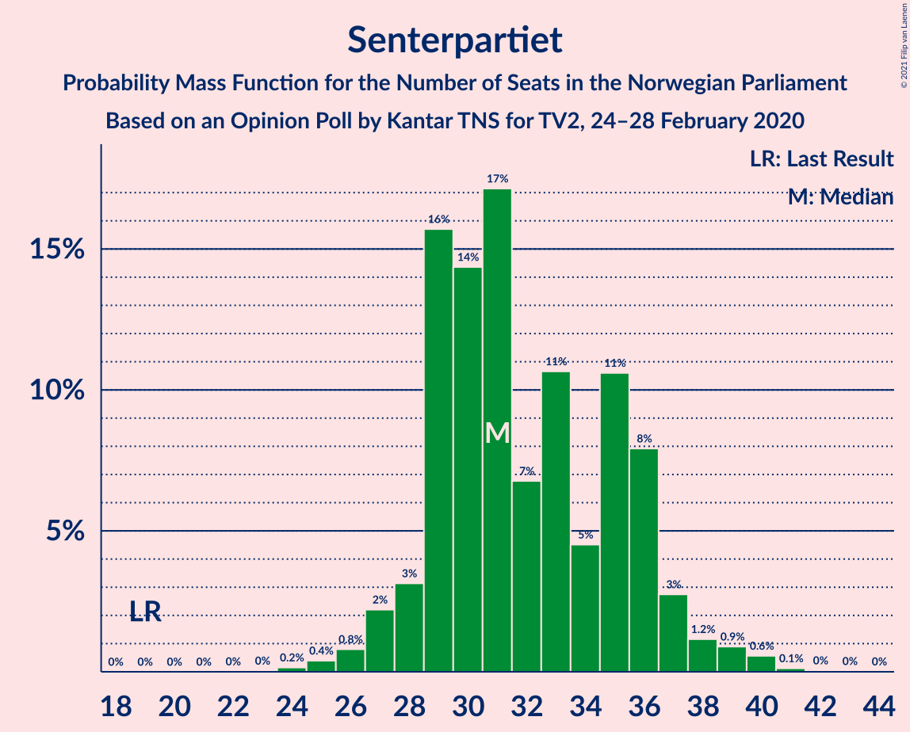
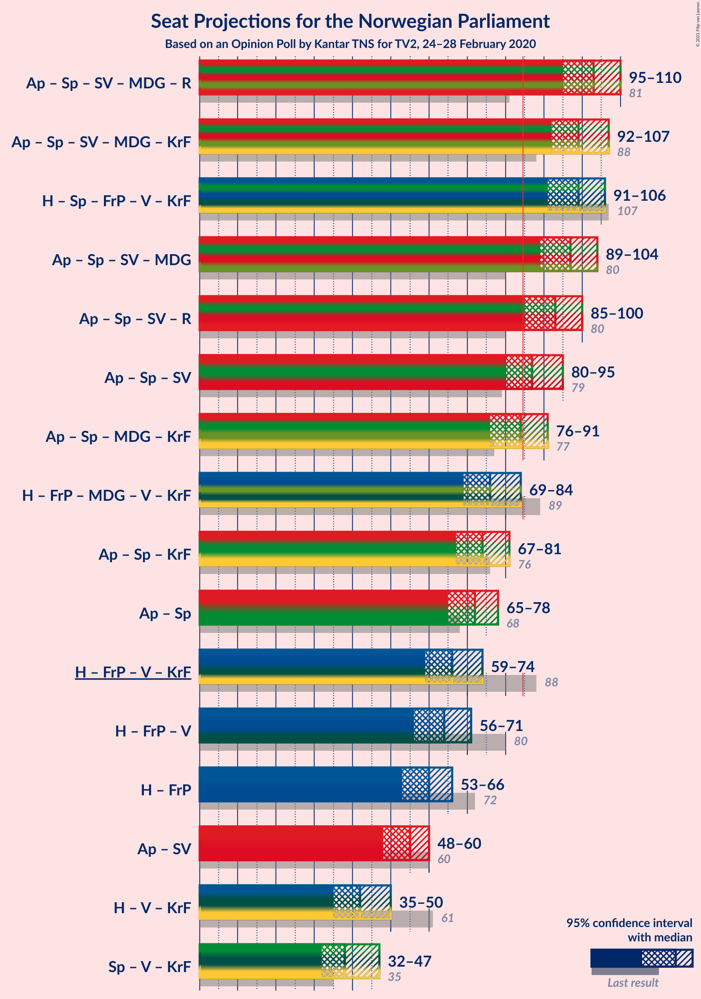
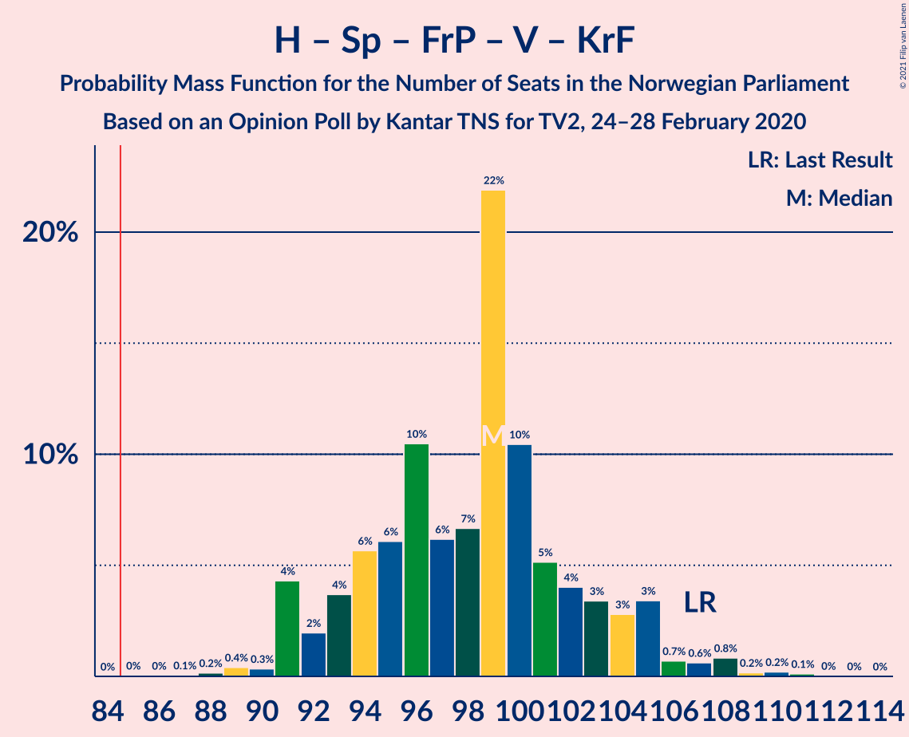
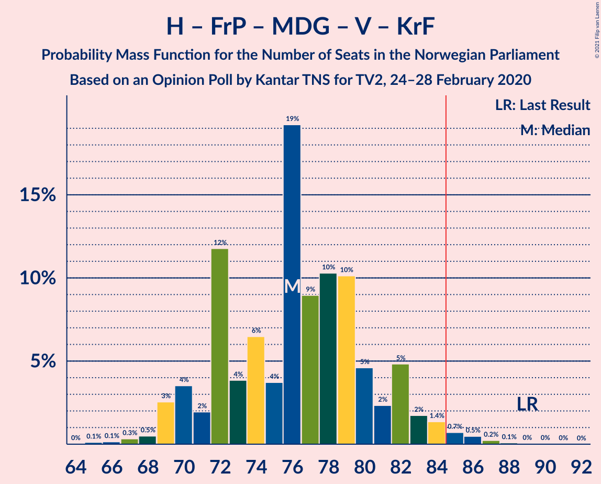
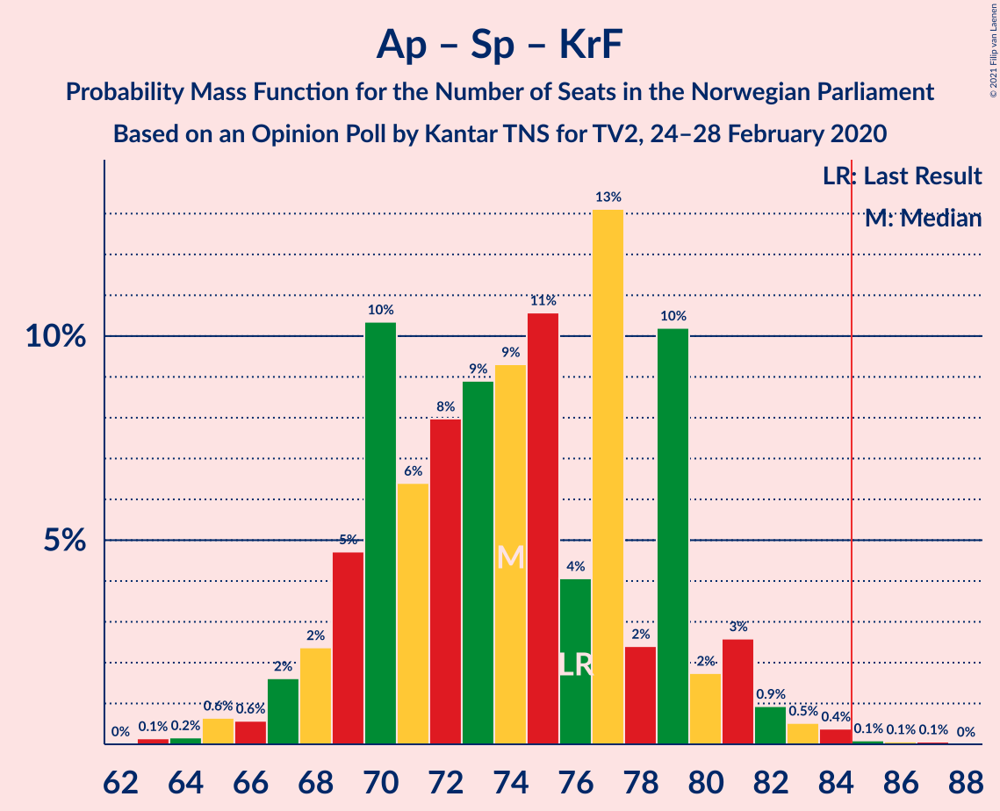
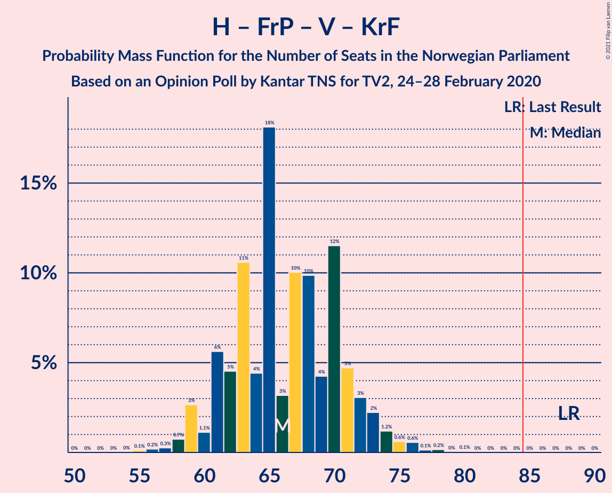
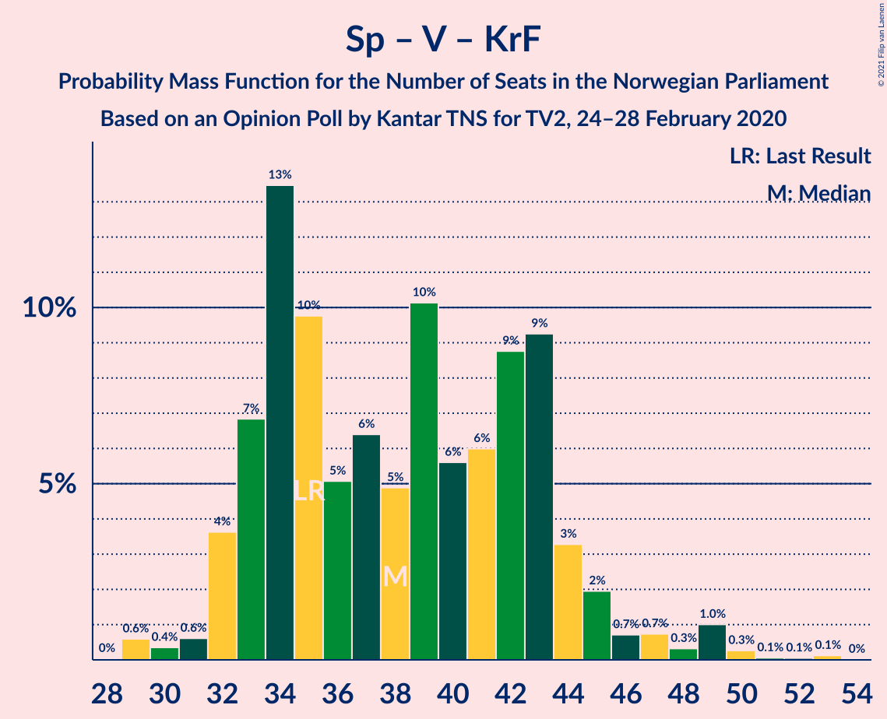

# Opinion Poll by Kantar TNS for TV2, 24–28 February 2020

<a href="#voting-intentions">Voting Intentions</a> | <a href="#seats">Seats</a> | <a href="#coalitions">Coalitions</a> | <a href="#technical-information">Technical Information</a>

## Voting Intentions

### Confidence Intervals

| Party | Last Result | Poll Result | 80% Confidence Interval | 90% Confidence Interval | 95% Confidence Interval | 99% Confidence Interval |
|:-----:|:-----------:|:-----------:|:-----------------------:|:-----------------------:|:-----------------------:|:-----------------------:|
| Arbeiderpartiet | 27.4% | 21.5% | 19.7–23.5% |19.2–24.1% |18.7–24.6% |17.9–25.6% |
| Høyre | 25.0% | 19.8% | 18.0–21.7% |17.5–22.3% |17.1–22.8% |16.3–23.8% |
| Senterpartiet | 10.3% | 17.5% | 15.9–19.4% |15.4–20.0% |15.0–20.4% |14.2–21.4% |
| Fremskrittspartiet | 15.2% | 13.7% | 12.2–15.4% |11.8–15.9% |11.4–16.3% |10.7–17.2% |
| Sosialistisk Venstreparti | 6.0% | 8.5% | 7.3–10.0% |7.0–10.3% |6.7–10.7% |6.2–11.4% |
| Miljøpartiet De Grønne | 3.2% | 5.6% | 4.6–6.8% |4.4–7.1% |4.1–7.5% |3.7–8.1% |
| Rødt | 2.4% | 4.1% | 3.3–5.2% |3.1–5.5% |2.9–5.8% |2.6–6.4% |
| Venstre | 4.4% | 3.7% | 3.0–4.8% |2.8–5.1% |2.6–5.3% |2.3–5.9% |
| Kristelig Folkeparti | 4.2% | 3.1% | 2.4–4.0% |2.2–4.3% |2.0–4.5% |1.8–5.1% |

*Note:* The poll result column reflects the actual value used in the calculations. Published results may vary slightly, and in addition be rounded to fewer digits.

## Seats

### Confidence Intervals

| Party | Last Result | Median | 80% Confidence Interval | 90% Confidence Interval | 95% Confidence Interval | 99% Confidence Interval |
|:-----:|:-----------:|:------:|:-----------------------:|:-----------------------:|:-----------------------:|:-----------------------:|
| <a href="#arbeiderpartiet">Arbeiderpartiet</a> | 49 | 40 | 36–42 |36–43 |34–44 |32–45 |
| <a href="#høyre">Høyre</a> | 45 | 34 | 32–40 |30–40 |29–41 |29–42 |
| <a href="#senterpartiet">Senterpartiet</a> | 19 | 33 | 29–35 |27–36 |27–37 |26–39 |
| <a href="#fremskrittspartiet">Fremskrittspartiet</a> | 27 | 23 | 21–28 |21–29 |20–30 |19–30 |
| <a href="#sosialistisk-venstreparti">Sosialistisk Venstreparti</a> | 11 | 15 | 13–17 |12–18 |12–20 |11–21 |
| <a href="#miljøpartiet-de-grønne">Miljøpartiet De Grønne</a> | 1 | 11 | 9–12 |8–12 |7–13 |2–14 |
| <a href="#rødt">Rødt</a> | 1 | 8 | 2–9 |1–10 |1–10 |1–11 |
| <a href="#venstre">Venstre</a> | 8 | 2 | 2–8 |2–9 |2–10 |1–10 |
| <a href="#kristelig-folkeparti">Kristelig Folkeparti</a> | 8 | 1 | 1–8 |1–8 |0–8 |0–8 |

### Arbeiderpartiet

*For a full overview of the results for this party, see the [Arbeiderpartiet](party-arbeiderpartiet.html) page.*

| Number of Seats | Probability | Accumulated | Special Marks |
|:---------------:|:-----------:|:-----------:|:-------------:|
| 30 | 0.1% | 100% |  |
| 31 | 0.2% | 99.8% |  |
| 32 | 0.2% | 99.7% |  |
| 33 | 1.2% | 99.5% |  |
| 34 | 1.5% | 98% |  |
| 35 | 0.4% | 97% |  |
| 36 | 9% | 96% |  |
| 37 | 22% | 87% |  |
| 38 | 3% | 64% |  |
| 39 | 9% | 62% |  |
| 40 | 12% | 53% | Median |
| 41 | 16% | 41% |  |
| 42 | 16% | 24% |  |
| 43 | 4% | 9% |  |
| 44 | 3% | 4% |  |
| 45 | 1.4% | 2% |  |
| 46 | 0.1% | 0.3% |  |
| 47 | 0.1% | 0.3% |  |
| 48 | 0.1% | 0.2% |  |
| 49 | 0% | 0% | Last Result |

### Høyre

*For a full overview of the results for this party, see the [Høyre](party-høyre.html) page.*

| Number of Seats | Probability | Accumulated | Special Marks |
|:---------------:|:-----------:|:-----------:|:-------------:|
| 27 | 0.1% | 100% |  |
| 28 | 0.1% | 99.9% |  |
| 29 | 3% | 99.8% |  |
| 30 | 3% | 97% |  |
| 31 | 1.1% | 94% |  |
| 32 | 7% | 92% |  |
| 33 | 9% | 85% |  |
| 34 | 37% | 76% | Median |
| 35 | 1.3% | 40% |  |
| 36 | 12% | 38% |  |
| 37 | 6% | 26% |  |
| 38 | 3% | 20% |  |
| 39 | 2% | 17% |  |
| 40 | 10% | 15% |  |
| 41 | 4% | 5% |  |
| 42 | 0.4% | 0.9% |  |
| 43 | 0.1% | 0.5% |  |
| 44 | 0% | 0.3% |  |
| 45 | 0.1% | 0.3% | Last Result |
| 46 | 0.2% | 0.2% |  |
| 47 | 0% | 0% |  |

### Senterpartiet

*For a full overview of the results for this party, see the [Senterpartiet](party-senterpartiet.html) page.*

| Number of Seats | Probability | Accumulated | Special Marks |
|:---------------:|:-----------:|:-----------:|:-------------:|
| 19 | 0% | 100% | Last Result |
| 20 | 0% | 100% |  |
| 21 | 0% | 100% |  |
| 22 | 0% | 100% |  |
| 23 | 0.1% | 100% |  |
| 24 | 0.1% | 99.9% |  |
| 25 | 0.2% | 99.8% |  |
| 26 | 1.3% | 99.5% |  |
| 27 | 3% | 98% |  |
| 28 | 2% | 95% |  |
| 29 | 8% | 93% |  |
| 30 | 27% | 85% |  |
| 31 | 2% | 58% |  |
| 32 | 5% | 56% |  |
| 33 | 13% | 51% | Median |
| 34 | 3% | 38% |  |
| 35 | 28% | 34% |  |
| 36 | 2% | 6% |  |
| 37 | 2% | 4% |  |
| 38 | 1.3% | 2% |  |
| 39 | 0.9% | 1.2% |  |
| 40 | 0.1% | 0.3% |  |
| 41 | 0.1% | 0.2% |  |
| 42 | 0.1% | 0.1% |  |
| 43 | 0% | 0% |  |

### Fremskrittspartiet

*For a full overview of the results for this party, see the [Fremskrittspartiet](party-fremskrittspartiet.html) page.*

| Number of Seats | Probability | Accumulated | Special Marks |
|:---------------:|:-----------:|:-----------:|:-------------:|
| 17 | 0.1% | 100% |  |
| 18 | 0.3% | 99.9% |  |
| 19 | 0.5% | 99.6% |  |
| 20 | 2% | 99.1% |  |
| 21 | 9% | 97% |  |
| 22 | 9% | 87% |  |
| 23 | 36% | 78% | Median |
| 24 | 10% | 42% |  |
| 25 | 4% | 32% |  |
| 26 | 13% | 27% |  |
| 27 | 4% | 15% | Last Result |
| 28 | 5% | 11% |  |
| 29 | 3% | 6% |  |
| 30 | 2% | 3% |  |
| 31 | 0.4% | 0.5% |  |
| 32 | 0.1% | 0.1% |  |
| 33 | 0% | 0% |  |

### Sosialistisk Venstreparti

*For a full overview of the results for this party, see the [Sosialistisk Venstreparti](party-sosialistiskvenstreparti.html) page.*

| Number of Seats | Probability | Accumulated | Special Marks |
|:---------------:|:-----------:|:-----------:|:-------------:|
| 9 | 0.1% | 100% |  |
| 10 | 0.2% | 99.9% |  |
| 11 | 2% | 99.7% | Last Result |
| 12 | 6% | 98% |  |
| 13 | 21% | 92% |  |
| 14 | 16% | 71% |  |
| 15 | 14% | 55% | Median |
| 16 | 16% | 41% |  |
| 17 | 19% | 26% |  |
| 18 | 3% | 7% |  |
| 19 | 0.6% | 4% |  |
| 20 | 2% | 3% |  |
| 21 | 1.4% | 2% |  |
| 22 | 0.1% | 0.3% |  |
| 23 | 0.3% | 0.3% |  |
| 24 | 0% | 0% |  |

### Miljøpartiet De Grønne

*For a full overview of the results for this party, see the [Miljøpartiet De Grønne](party-miljøpartietdegrønne.html) page.*

| Number of Seats | Probability | Accumulated | Special Marks |
|:---------------:|:-----------:|:-----------:|:-------------:|
| 1 | 0.1% | 100% | Last Result |
| 2 | 1.4% | 99.9% |  |
| 3 | 0.5% | 98.6% |  |
| 4 | 0% | 98% |  |
| 5 | 0% | 98% |  |
| 6 | 0% | 98% |  |
| 7 | 1.2% | 98% |  |
| 8 | 4% | 97% |  |
| 9 | 14% | 93% |  |
| 10 | 25% | 78% |  |
| 11 | 37% | 53% | Median |
| 12 | 12% | 16% |  |
| 13 | 2% | 3% |  |
| 14 | 1.3% | 2% |  |
| 15 | 0.2% | 0.2% |  |
| 16 | 0% | 0.1% |  |
| 17 | 0% | 0% |  |

### Rødt

*For a full overview of the results for this party, see the [Rødt](party-rødt.html) page.*

| Number of Seats | Probability | Accumulated | Special Marks |
|:---------------:|:-----------:|:-----------:|:-------------:|
| 1 | 6% | 100% | Last Result |
| 2 | 27% | 94% |  |
| 3 | 0% | 67% |  |
| 4 | 0% | 67% |  |
| 5 | 0% | 67% |  |
| 6 | 1.0% | 67% |  |
| 7 | 5% | 66% |  |
| 8 | 43% | 61% | Median |
| 9 | 9% | 17% |  |
| 10 | 8% | 9% |  |
| 11 | 0.3% | 0.6% |  |
| 12 | 0.3% | 0.3% |  |
| 13 | 0% | 0% |  |

### Venstre

*For a full overview of the results for this party, see the [Venstre](party-venstre.html) page.*

| Number of Seats | Probability | Accumulated | Special Marks |
|:---------------:|:-----------:|:-----------:|:-------------:|
| 1 | 2% | 100% |  |
| 2 | 55% | 98% | Median |
| 3 | 0.2% | 43% |  |
| 4 | 0% | 43% |  |
| 5 | 0% | 43% |  |
| 6 | 1.2% | 43% |  |
| 7 | 28% | 42% |  |
| 8 | 6% | 13% | Last Result |
| 9 | 3% | 7% |  |
| 10 | 4% | 4% |  |
| 11 | 0.1% | 0.1% |  |
| 12 | 0% | 0% |  |

### Kristelig Folkeparti

*For a full overview of the results for this party, see the [Kristelig Folkeparti](party-kristeligfolkeparti.html) page.*

| Number of Seats | Probability | Accumulated | Special Marks |
|:---------------:|:-----------:|:-----------:|:-------------:|
| 0 | 4% | 100% |  |
| 1 | 48% | 96% | Median |
| 2 | 20% | 48% |  |
| 3 | 13% | 28% |  |
| 4 | 0% | 15% |  |
| 5 | 0% | 15% |  |
| 6 | 0.4% | 15% |  |
| 7 | 3% | 15% |  |
| 8 | 11% | 12% | Last Result |
| 9 | 0.3% | 0.3% |  |
| 10 | 0% | 0.1% |  |
| 11 | 0% | 0% |  |

## Coalitions

### Confidence Intervals

| Coalition | Last Result | Median | Majority? | 80% Confidence Interval | 90% Confidence Interval | 95% Confidence Interval | 99% Confidence Interval |
|:---------:|:-----------:|:------:|:---------:|:-----------------------:|:-----------------------:|:-----------------------:|:-----------------------:|
| Arbeiderpartiet – Senterpartiet – Sosialistisk Venstreparti – Miljøpartiet De Grønne – Rødt | 81 | 104 | 100% | 97–108 | 96–110 | 95–110 | 93–112 |
| Høyre – Senterpartiet – Fremskrittspartiet – Venstre – Kristelig Folkeparti | 107 | 99 | 100% | 91–105 | 91–105 | 91–108 | 89–109 |
| Arbeiderpartiet – Senterpartiet – Sosialistisk Venstreparti – Miljøpartiet De Grønne – Kristelig Folkeparti | 88 | 99 | 100% | 95–103 | 92–105 | 92–106 | 88–109 |
| Arbeiderpartiet – Senterpartiet – Sosialistisk Venstreparti – Miljøpartiet De Grønne | 80 | 97 | 99.9% | 93–100 | 91–101 | 89–102 | 86–105 |
| Arbeiderpartiet – Senterpartiet – Sosialistisk Venstreparti – Rødt | 80 | 93 | 98% | 87–97 | 86–100 | 85–100 | 83–102 |
| Arbeiderpartiet – Senterpartiet – Sosialistisk Venstreparti | 79 | 86 | 84% | 83–90 | 82–92 | 80–94 | 77–95 |
| Arbeiderpartiet – Senterpartiet – Miljøpartiet De Grønne – Kristelig Folkeparti | 77 | 84 | 46% | 80–89 | 78–90 | 77–91 | 74–94 |
| Høyre – Fremskrittspartiet – Miljøpartiet De Grønne – Venstre – Kristelig Folkeparti | 89 | 76 | 2% | 71–82 | 69–83 | 69–84 | 67–86 |
| Arbeiderpartiet – Senterpartiet – Kristelig Folkeparti | 76 | 73 | 0.4% | 70–79 | 69–80 | 67–81 | 65–84 |
| Arbeiderpartiet – Senterpartiet | 68 | 72 | 0% | 68–76 | 67–77 | 65–78 | 63–79 |
| Høyre – Fremskrittspartiet – Venstre – Kristelig Folkeparti | 88 | 65 | 0% | 61–72 | 59–73 | 59–73 | 57–76 |
| Høyre – Fremskrittspartiet – Venstre | 80 | 64 | 0% | 59–68 | 56–70 | 56–71 | 55–74 |
| Høyre – Fremskrittspartiet | 72 | 58 | 0% | 55–63 | 54–64 | 53–66 | 51–71 |
| Arbeiderpartiet – Sosialistisk Venstreparti | 60 | 55 | 0% | 50–59 | 50–59 | 48–61 | 47–62 |
| Høyre – Venstre – Kristelig Folkeparti | 61 | 42 | 0% | 37–46 | 37–47 | 35–49 | 34–51 |
| Senterpartiet – Venstre – Kristelig Folkeparti | 35 | 40 | 0% | 33–43 | 33–45 | 32–47 | 29–49 |

### Arbeiderpartiet – Senterpartiet – Sosialistisk Venstreparti – Miljøpartiet De Grønne – Rødt

| Number of Seats | Probability | Accumulated | Special Marks |
|:---------------:|:-----------:|:-----------:|:-------------:|
| 81 | 0% | 100% | Last Result |
| 82 | 0% | 100% |  |
| 83 | 0% | 100% |  |
| 84 | 0% | 100% |  |
| 85 | 0% | 100% | Majority |
| 86 | 0% | 100% |  |
| 87 | 0% | 100% |  |
| 88 | 0% | 100% |  |
| 89 | 0% | 100% |  |
| 90 | 0% | 99.9% |  |
| 91 | 0% | 99.9% |  |
| 92 | 0.2% | 99.9% |  |
| 93 | 0.8% | 99.6% |  |
| 94 | 0.3% | 98.8% |  |
| 95 | 1.2% | 98.6% |  |
| 96 | 3% | 97% |  |
| 97 | 8% | 94% |  |
| 98 | 4% | 86% |  |
| 99 | 8% | 82% |  |
| 100 | 5% | 74% |  |
| 101 | 3% | 69% |  |
| 102 | 7% | 66% |  |
| 103 | 3% | 59% |  |
| 104 | 21% | 56% |  |
| 105 | 8% | 35% |  |
| 106 | 2% | 27% |  |
| 107 | 4% | 25% | Median |
| 108 | 14% | 21% |  |
| 109 | 0.5% | 7% |  |
| 110 | 6% | 6% |  |
| 111 | 0.2% | 0.8% |  |
| 112 | 0.2% | 0.6% |  |
| 113 | 0.3% | 0.4% |  |
| 114 | 0% | 0.1% |  |
| 115 | 0% | 0% |  |

### Høyre – Senterpartiet – Fremskrittspartiet – Venstre – Kristelig Folkeparti

| Number of Seats | Probability | Accumulated | Special Marks |
|:---------------:|:-----------:|:-----------:|:-------------:|
| 86 | 0.1% | 100% |  |
| 87 | 0.1% | 99.9% |  |
| 88 | 0% | 99.8% |  |
| 89 | 0.6% | 99.8% |  |
| 90 | 0.5% | 99.2% |  |
| 91 | 12% | 98.7% |  |
| 92 | 0.5% | 86% |  |
| 93 | 2% | 86% | Median |
| 94 | 16% | 84% |  |
| 95 | 3% | 68% |  |
| 96 | 2% | 65% |  |
| 97 | 3% | 63% |  |
| 98 | 6% | 60% |  |
| 99 | 6% | 54% |  |
| 100 | 23% | 48% |  |
| 101 | 3% | 24% |  |
| 102 | 5% | 21% |  |
| 103 | 3% | 17% |  |
| 104 | 2% | 14% |  |
| 105 | 8% | 12% |  |
| 106 | 0.7% | 4% |  |
| 107 | 0.3% | 3% | Last Result |
| 108 | 2% | 3% |  |
| 109 | 0.3% | 0.5% |  |
| 110 | 0.1% | 0.2% |  |
| 111 | 0% | 0.1% |  |
| 112 | 0.1% | 0.1% |  |
| 113 | 0% | 0% |  |

### Arbeiderpartiet – Senterpartiet – Sosialistisk Venstreparti – Miljøpartiet De Grønne – Kristelig Folkeparti

| Number of Seats | Probability | Accumulated | Special Marks |
|:---------------:|:-----------:|:-----------:|:-------------:|
| 86 | 0% | 100% |  |
| 87 | 0% | 99.9% |  |
| 88 | 0.6% | 99.9% | Last Result |
| 89 | 0.6% | 99.3% |  |
| 90 | 0.5% | 98.8% |  |
| 91 | 0.7% | 98% |  |
| 92 | 4% | 98% |  |
| 93 | 0.6% | 94% |  |
| 94 | 1.1% | 93% |  |
| 95 | 2% | 92% |  |
| 96 | 4% | 90% |  |
| 97 | 20% | 86% |  |
| 98 | 11% | 66% |  |
| 99 | 9% | 55% |  |
| 100 | 4% | 47% | Median |
| 101 | 7% | 43% |  |
| 102 | 15% | 36% |  |
| 103 | 15% | 21% |  |
| 104 | 1.1% | 7% |  |
| 105 | 3% | 6% |  |
| 106 | 0.7% | 3% |  |
| 107 | 1.3% | 2% |  |
| 108 | 0.3% | 1.0% |  |
| 109 | 0.5% | 0.7% |  |
| 110 | 0.1% | 0.2% |  |
| 111 | 0% | 0.1% |  |
| 112 | 0% | 0.1% |  |
| 113 | 0% | 0.1% |  |
| 114 | 0% | 0% |  |

### Arbeiderpartiet – Senterpartiet – Sosialistisk Venstreparti – Miljøpartiet De Grønne

| Number of Seats | Probability | Accumulated | Special Marks |
|:---------------:|:-----------:|:-----------:|:-------------:|
| 80 | 0% | 100% | Last Result |
| 81 | 0% | 100% |  |
| 82 | 0% | 100% |  |
| 83 | 0% | 100% |  |
| 84 | 0% | 100% |  |
| 85 | 0.2% | 99.9% | Majority |
| 86 | 0.5% | 99.7% |  |
| 87 | 0.1% | 99.3% |  |
| 88 | 1.5% | 99.2% |  |
| 89 | 0.6% | 98% |  |
| 90 | 0.4% | 97% |  |
| 91 | 4% | 97% |  |
| 92 | 0.4% | 93% |  |
| 93 | 3% | 92% |  |
| 94 | 4% | 89% |  |
| 95 | 11% | 85% |  |
| 96 | 21% | 74% |  |
| 97 | 15% | 53% |  |
| 98 | 5% | 38% |  |
| 99 | 3% | 32% | Median |
| 100 | 23% | 29% |  |
| 101 | 2% | 6% |  |
| 102 | 1.5% | 4% |  |
| 103 | 0.5% | 2% |  |
| 104 | 0.2% | 2% |  |
| 105 | 1.4% | 2% |  |
| 106 | 0.1% | 0.4% |  |
| 107 | 0.1% | 0.3% |  |
| 108 | 0.1% | 0.2% |  |
| 109 | 0% | 0.1% |  |
| 110 | 0% | 0% |  |

### Arbeiderpartiet – Senterpartiet – Sosialistisk Venstreparti – Rødt

| Number of Seats | Probability | Accumulated | Special Marks |
|:---------------:|:-----------:|:-----------:|:-------------:|
| 80 | 0% | 100% | Last Result |
| 81 | 0.1% | 99.9% |  |
| 82 | 0.3% | 99.8% |  |
| 83 | 0.2% | 99.5% |  |
| 84 | 1.3% | 99.3% |  |
| 85 | 1.4% | 98% | Majority |
| 86 | 2% | 97% |  |
| 87 | 12% | 95% |  |
| 88 | 0.9% | 83% |  |
| 89 | 7% | 82% |  |
| 90 | 2% | 75% |  |
| 91 | 7% | 73% |  |
| 92 | 3% | 65% |  |
| 93 | 29% | 63% |  |
| 94 | 3% | 34% |  |
| 95 | 4% | 31% |  |
| 96 | 4% | 27% | Median |
| 97 | 14% | 24% |  |
| 98 | 1.0% | 10% |  |
| 99 | 2% | 9% |  |
| 100 | 5% | 7% |  |
| 101 | 0.4% | 1.2% |  |
| 102 | 0.3% | 0.8% |  |
| 103 | 0.3% | 0.5% |  |
| 104 | 0.2% | 0.2% |  |
| 105 | 0% | 0% |  |

### Arbeiderpartiet – Senterpartiet – Sosialistisk Venstreparti

| Number of Seats | Probability | Accumulated | Special Marks |
|:---------------:|:-----------:|:-----------:|:-------------:|
| 76 | 0.2% | 100% |  |
| 77 | 1.0% | 99.7% |  |
| 78 | 0.3% | 98.7% |  |
| 79 | 0.9% | 98% | Last Result |
| 80 | 0.5% | 98% |  |
| 81 | 0.5% | 97% |  |
| 82 | 4% | 97% |  |
| 83 | 6% | 93% |  |
| 84 | 3% | 87% |  |
| 85 | 34% | 84% | Majority |
| 86 | 6% | 51% |  |
| 87 | 9% | 44% |  |
| 88 | 3% | 36% | Median |
| 89 | 14% | 33% |  |
| 90 | 10% | 19% |  |
| 91 | 4% | 9% |  |
| 92 | 2% | 5% |  |
| 93 | 0.6% | 3% |  |
| 94 | 1.0% | 3% |  |
| 95 | 1.4% | 2% |  |
| 96 | 0.1% | 0.4% |  |
| 97 | 0% | 0.2% |  |
| 98 | 0% | 0.2% |  |
| 99 | 0.1% | 0.2% |  |
| 100 | 0% | 0.1% |  |
| 101 | 0% | 0.1% |  |
| 102 | 0.1% | 0.1% |  |
| 103 | 0% | 0% |  |

### Arbeiderpartiet – Senterpartiet – Miljøpartiet De Grønne – Kristelig Folkeparti

| Number of Seats | Probability | Accumulated | Special Marks |
|:---------------:|:-----------:|:-----------:|:-------------:|
| 72 | 0% | 100% |  |
| 73 | 0.3% | 99.9% |  |
| 74 | 0.2% | 99.6% |  |
| 75 | 0.2% | 99.3% |  |
| 76 | 2% | 99.2% |  |
| 77 | 0.3% | 98% | Last Result |
| 78 | 5% | 97% |  |
| 79 | 3% | 93% |  |
| 80 | 3% | 90% |  |
| 81 | 3% | 87% |  |
| 82 | 6% | 84% |  |
| 83 | 12% | 78% |  |
| 84 | 20% | 66% |  |
| 85 | 15% | 46% | Median, Majority |
| 86 | 5% | 31% |  |
| 87 | 9% | 26% |  |
| 88 | 3% | 17% |  |
| 89 | 7% | 13% |  |
| 90 | 2% | 6% |  |
| 91 | 2% | 4% |  |
| 92 | 0.8% | 2% |  |
| 93 | 0.3% | 1.0% |  |
| 94 | 0.5% | 0.7% |  |
| 95 | 0.1% | 0.2% |  |
| 96 | 0% | 0.1% |  |
| 97 | 0% | 0.1% |  |
| 98 | 0% | 0% |  |

### Høyre – Fremskrittspartiet – Miljøpartiet De Grønne – Venstre – Kristelig Folkeparti

| Number of Seats | Probability | Accumulated | Special Marks |
|:---------------:|:-----------:|:-----------:|:-------------:|
| 65 | 0.2% | 100% |  |
| 66 | 0.3% | 99.8% |  |
| 67 | 0.4% | 99.5% |  |
| 68 | 0.5% | 99.1% |  |
| 69 | 5% | 98.7% |  |
| 70 | 2% | 93% |  |
| 71 | 1.1% | 91% | Median |
| 72 | 14% | 90% |  |
| 73 | 4% | 76% |  |
| 74 | 4% | 72% |  |
| 75 | 3% | 68% |  |
| 76 | 29% | 65% |  |
| 77 | 3% | 36% |  |
| 78 | 8% | 33% |  |
| 79 | 1.0% | 26% |  |
| 80 | 7% | 25% |  |
| 81 | 0.9% | 18% |  |
| 82 | 12% | 17% |  |
| 83 | 2% | 5% |  |
| 84 | 1.4% | 3% |  |
| 85 | 1.3% | 2% | Majority |
| 86 | 0.2% | 0.6% |  |
| 87 | 0.3% | 0.4% |  |
| 88 | 0.1% | 0.2% |  |
| 89 | 0% | 0.1% | Last Result |
| 90 | 0% | 0% |  |

### Arbeiderpartiet – Senterpartiet – Kristelig Folkeparti

| Number of Seats | Probability | Accumulated | Special Marks |
|:---------------:|:-----------:|:-----------:|:-------------:|
| 63 | 0.2% | 100% |  |
| 64 | 0.1% | 99.7% |  |
| 65 | 0.2% | 99.6% |  |
| 66 | 0.4% | 99.4% |  |
| 67 | 2% | 99.0% |  |
| 68 | 2% | 97% |  |
| 69 | 5% | 95% |  |
| 70 | 4% | 91% |  |
| 71 | 11% | 86% |  |
| 72 | 7% | 75% |  |
| 73 | 19% | 68% |  |
| 74 | 15% | 49% | Median |
| 75 | 1.5% | 34% |  |
| 76 | 3% | 33% | Last Result |
| 77 | 11% | 30% |  |
| 78 | 3% | 18% |  |
| 79 | 9% | 15% |  |
| 80 | 2% | 6% |  |
| 81 | 3% | 5% |  |
| 82 | 0.5% | 2% |  |
| 83 | 0.8% | 1.3% |  |
| 84 | 0.2% | 0.5% |  |
| 85 | 0% | 0.4% | Majority |
| 86 | 0.1% | 0.3% |  |
| 87 | 0.2% | 0.2% |  |
| 88 | 0% | 0% |  |

### Arbeiderpartiet – Senterpartiet

| Number of Seats | Probability | Accumulated | Special Marks |
|:---------------:|:-----------:|:-----------:|:-------------:|
| 61 | 0% | 100% |  |
| 62 | 0.1% | 99.9% |  |
| 63 | 0.4% | 99.8% |  |
| 64 | 0.3% | 99.4% |  |
| 65 | 2% | 99.1% |  |
| 66 | 2% | 97% |  |
| 67 | 2% | 95% |  |
| 68 | 5% | 93% | Last Result |
| 69 | 13% | 88% |  |
| 70 | 15% | 75% |  |
| 71 | 3% | 61% |  |
| 72 | 31% | 57% |  |
| 73 | 5% | 26% | Median |
| 74 | 2% | 21% |  |
| 75 | 2% | 19% |  |
| 76 | 11% | 17% |  |
| 77 | 3% | 6% |  |
| 78 | 2% | 3% |  |
| 79 | 0.7% | 1.2% |  |
| 80 | 0.2% | 0.5% |  |
| 81 | 0.1% | 0.3% |  |
| 82 | 0.1% | 0.2% |  |
| 83 | 0% | 0% |  |

### Høyre – Fremskrittspartiet – Venstre – Kristelig Folkeparti

| Number of Seats | Probability | Accumulated | Special Marks |
|:---------------:|:-----------:|:-----------:|:-------------:|
| 55 | 0% | 100% |  |
| 56 | 0.3% | 99.9% |  |
| 57 | 0.3% | 99.6% |  |
| 58 | 0.2% | 99.3% |  |
| 59 | 6% | 99.1% |  |
| 60 | 0.5% | 94% | Median |
| 61 | 14% | 93% |  |
| 62 | 4% | 78% |  |
| 63 | 3% | 75% |  |
| 64 | 8% | 72% |  |
| 65 | 21% | 64% |  |
| 66 | 3% | 43% |  |
| 67 | 7% | 40% |  |
| 68 | 3% | 33% |  |
| 69 | 4% | 30% |  |
| 70 | 8% | 26% |  |
| 71 | 4% | 18% |  |
| 72 | 8% | 14% |  |
| 73 | 3% | 6% |  |
| 74 | 1.2% | 2% |  |
| 75 | 0.3% | 1.3% |  |
| 76 | 0.8% | 1.0% |  |
| 77 | 0.1% | 0.3% |  |
| 78 | 0% | 0.1% |  |
| 79 | 0% | 0.1% |  |
| 80 | 0% | 0.1% |  |
| 81 | 0% | 0% |  |
| 82 | 0% | 0% |  |
| 83 | 0% | 0% |  |
| 84 | 0% | 0% |  |
| 85 | 0% | 0% | Majority |
| 86 | 0% | 0% |  |
| 87 | 0% | 0% |  |
| 88 | 0% | 0% | Last Result |

### Høyre – Fremskrittspartiet – Venstre

| Number of Seats | Probability | Accumulated | Special Marks |
|:---------------:|:-----------:|:-----------:|:-------------:|
| 52 | 0% | 100% |  |
| 53 | 0.1% | 99.9% |  |
| 54 | 0.3% | 99.9% |  |
| 55 | 0.6% | 99.6% |  |
| 56 | 5% | 99.0% |  |
| 57 | 0.7% | 94% |  |
| 58 | 1.1% | 93% |  |
| 59 | 13% | 92% | Median |
| 60 | 3% | 79% |  |
| 61 | 4% | 75% |  |
| 62 | 4% | 72% |  |
| 63 | 9% | 67% |  |
| 64 | 29% | 58% |  |
| 65 | 2% | 29% |  |
| 66 | 8% | 26% |  |
| 67 | 1.1% | 18% |  |
| 68 | 8% | 17% |  |
| 69 | 4% | 9% |  |
| 70 | 2% | 6% |  |
| 71 | 2% | 4% |  |
| 72 | 0.5% | 2% |  |
| 73 | 0.8% | 1.5% |  |
| 74 | 0.5% | 0.7% |  |
| 75 | 0% | 0.2% |  |
| 76 | 0% | 0.1% |  |
| 77 | 0.1% | 0.1% |  |
| 78 | 0% | 0% |  |
| 79 | 0% | 0% |  |
| 80 | 0% | 0% | Last Result |

### Høyre – Fremskrittspartiet

| Number of Seats | Probability | Accumulated | Special Marks |
|:---------------:|:-----------:|:-----------:|:-------------:|
| 48 | 0.1% | 100% |  |
| 49 | 0% | 99.9% |  |
| 50 | 0.1% | 99.9% |  |
| 51 | 0.3% | 99.8% |  |
| 52 | 0.5% | 99.5% |  |
| 53 | 2% | 99.0% |  |
| 54 | 7% | 97% |  |
| 55 | 3% | 90% |  |
| 56 | 2% | 87% |  |
| 57 | 31% | 85% | Median |
| 58 | 7% | 54% |  |
| 59 | 5% | 48% |  |
| 60 | 3% | 43% |  |
| 61 | 15% | 40% |  |
| 62 | 13% | 26% |  |
| 63 | 3% | 13% |  |
| 64 | 6% | 10% |  |
| 65 | 0.9% | 4% |  |
| 66 | 1.1% | 3% |  |
| 67 | 0.2% | 2% |  |
| 68 | 0.3% | 2% |  |
| 69 | 0.7% | 2% |  |
| 70 | 0.1% | 0.8% |  |
| 71 | 0.4% | 0.7% |  |
| 72 | 0.3% | 0.3% | Last Result |
| 73 | 0% | 0% |  |

### Arbeiderpartiet – Sosialistisk Venstreparti

| Number of Seats | Probability | Accumulated | Special Marks |
|:---------------:|:-----------:|:-----------:|:-------------:|
| 44 | 0.1% | 100% |  |
| 45 | 0.2% | 99.9% |  |
| 46 | 0.1% | 99.7% |  |
| 47 | 0.2% | 99.6% |  |
| 48 | 2% | 99.5% |  |
| 49 | 0.9% | 97% |  |
| 50 | 19% | 97% |  |
| 51 | 5% | 78% |  |
| 52 | 9% | 73% |  |
| 53 | 7% | 64% |  |
| 54 | 3% | 57% |  |
| 55 | 17% | 54% | Median |
| 56 | 8% | 38% |  |
| 57 | 7% | 29% |  |
| 58 | 5% | 22% |  |
| 59 | 13% | 17% |  |
| 60 | 0.2% | 4% | Last Result |
| 61 | 2% | 4% |  |
| 62 | 1.4% | 2% |  |
| 63 | 0.1% | 0.3% |  |
| 64 | 0% | 0.3% |  |
| 65 | 0.1% | 0.2% |  |
| 66 | 0% | 0.1% |  |
| 67 | 0% | 0.1% |  |
| 68 | 0.1% | 0.1% |  |
| 69 | 0% | 0% |  |

### Høyre – Venstre – Kristelig Folkeparti

| Number of Seats | Probability | Accumulated | Special Marks |
|:---------------:|:-----------:|:-----------:|:-------------:|
| 32 | 0.4% | 100% |  |
| 33 | 0.1% | 99.6% |  |
| 34 | 2% | 99.5% |  |
| 35 | 0.5% | 98% |  |
| 36 | 1.4% | 97% |  |
| 37 | 7% | 96% | Median |
| 38 | 15% | 89% |  |
| 39 | 1.4% | 74% |  |
| 40 | 4% | 73% |  |
| 41 | 7% | 69% |  |
| 42 | 22% | 62% |  |
| 43 | 9% | 40% |  |
| 44 | 8% | 31% |  |
| 45 | 3% | 23% |  |
| 46 | 15% | 20% |  |
| 47 | 1.1% | 5% |  |
| 48 | 0.1% | 4% |  |
| 49 | 1.4% | 4% |  |
| 50 | 2% | 2% |  |
| 51 | 0.6% | 0.8% |  |
| 52 | 0.1% | 0.2% |  |
| 53 | 0.1% | 0.1% |  |
| 54 | 0% | 0% |  |
| 55 | 0% | 0% |  |
| 56 | 0% | 0% |  |
| 57 | 0% | 0% |  |
| 58 | 0% | 0% |  |
| 59 | 0% | 0% |  |
| 60 | 0% | 0% |  |
| 61 | 0% | 0% | Last Result |

### Senterpartiet – Venstre – Kristelig Folkeparti

| Number of Seats | Probability | Accumulated | Special Marks |
|:---------------:|:-----------:|:-----------:|:-------------:|
| 28 | 0% | 100% |  |
| 29 | 0.8% | 99.9% |  |
| 30 | 0.5% | 99.1% |  |
| 31 | 0.3% | 98.6% |  |
| 32 | 3% | 98% |  |
| 33 | 8% | 96% |  |
| 34 | 13% | 88% |  |
| 35 | 4% | 75% | Last Result |
| 36 | 3% | 71% | Median |
| 37 | 6% | 68% |  |
| 38 | 7% | 61% |  |
| 39 | 5% | 55% |  |
| 40 | 7% | 50% |  |
| 41 | 5% | 44% |  |
| 42 | 2% | 39% |  |
| 43 | 27% | 37% |  |
| 44 | 2% | 10% |  |
| 45 | 4% | 7% |  |
| 46 | 1.1% | 4% |  |
| 47 | 2% | 3% |  |
| 48 | 0.2% | 1.1% |  |
| 49 | 0.4% | 0.8% |  |
| 50 | 0.3% | 0.4% |  |
| 51 | 0% | 0.1% |  |
| 52 | 0% | 0.1% |  |
| 53 | 0% | 0% |  |

## Technical Information

### Opinion Poll

+ **Polling firm:** Kantar TNS
+ **Commissioner(s):** TV2
+ **Fieldwork period:** 24–28 February 2020

### Calculations

+ **Sample size:** 753
+ **Simulations done:** 131,072
+ **Error estimate:** 1.62%

