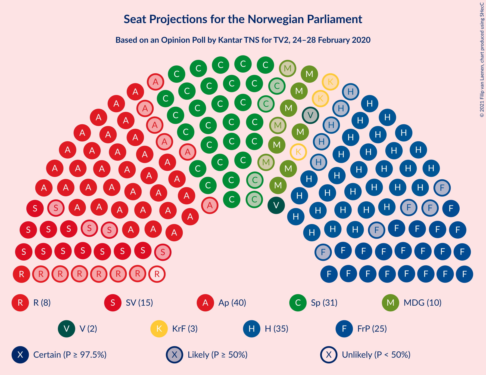
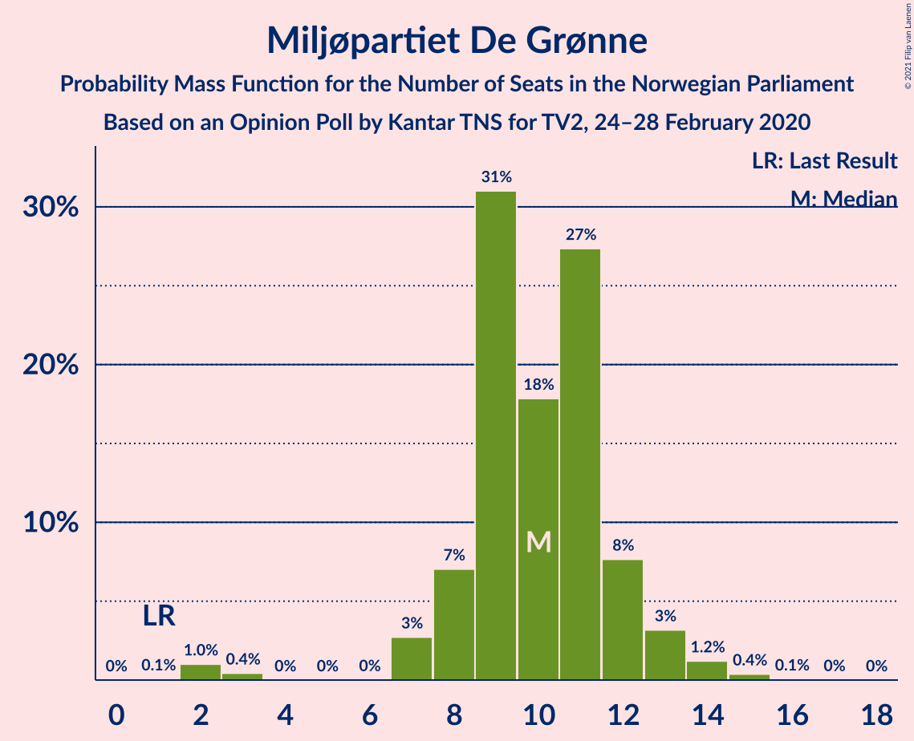
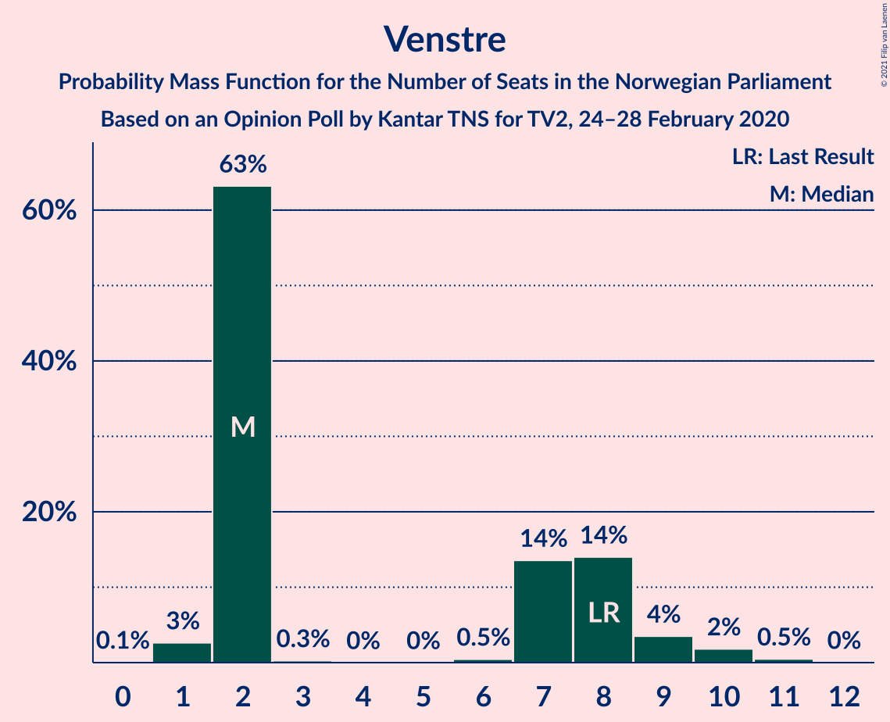
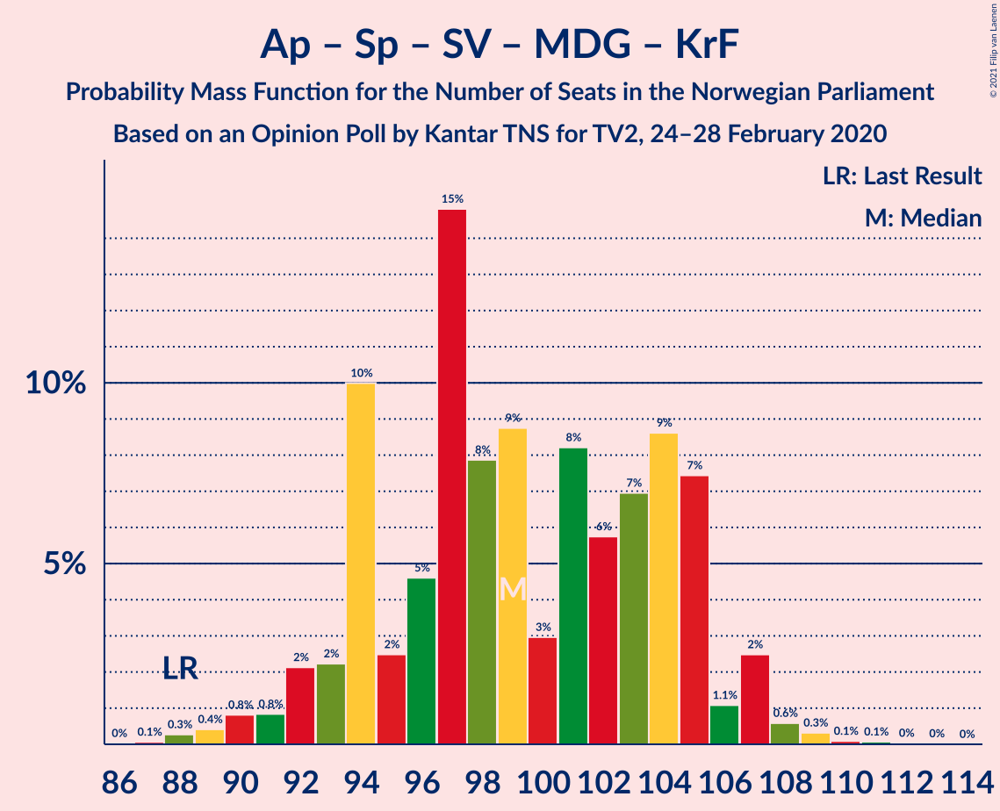
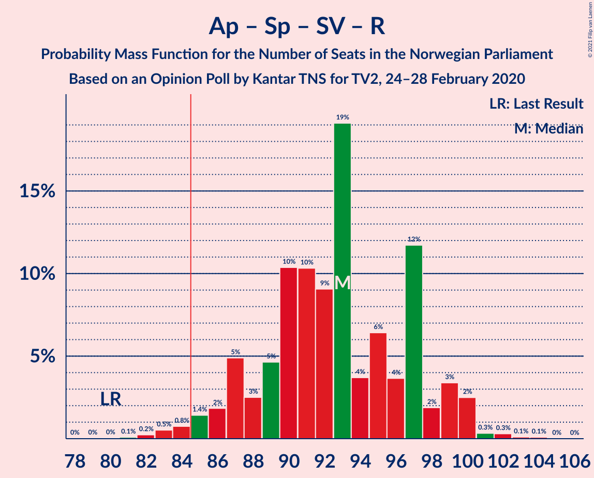
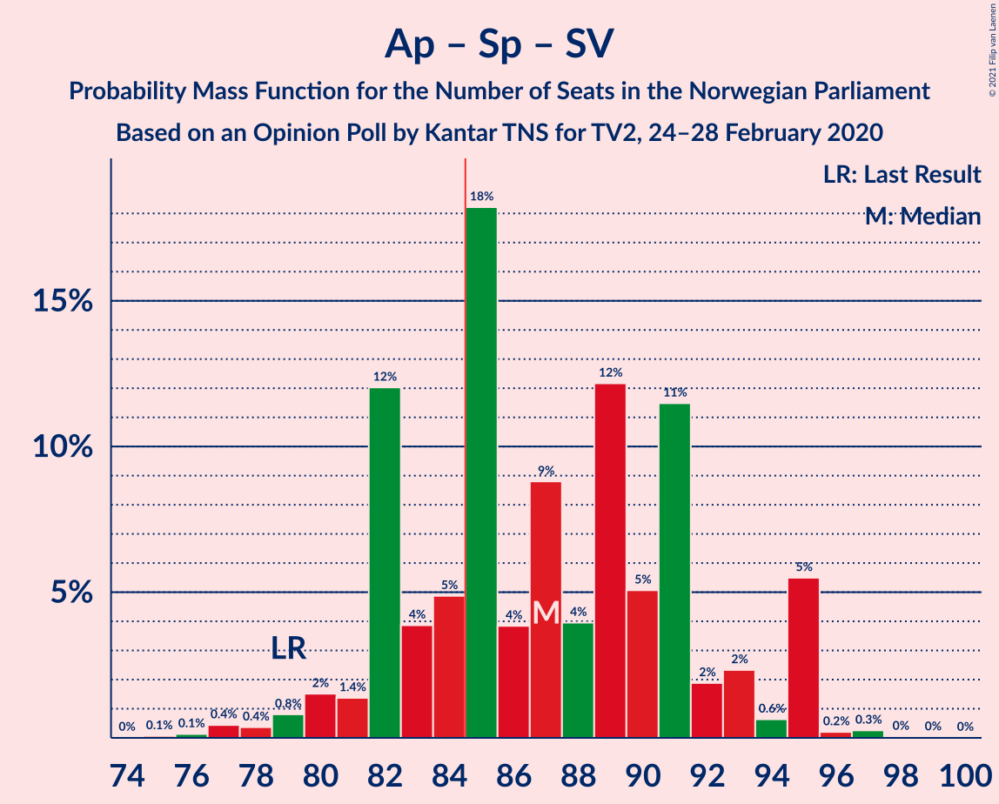
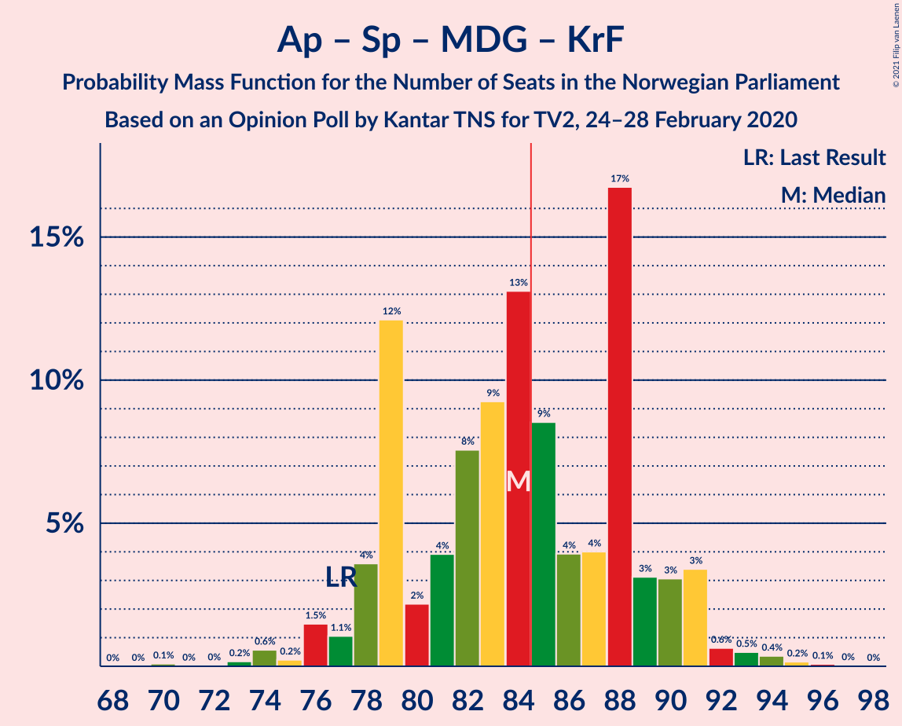
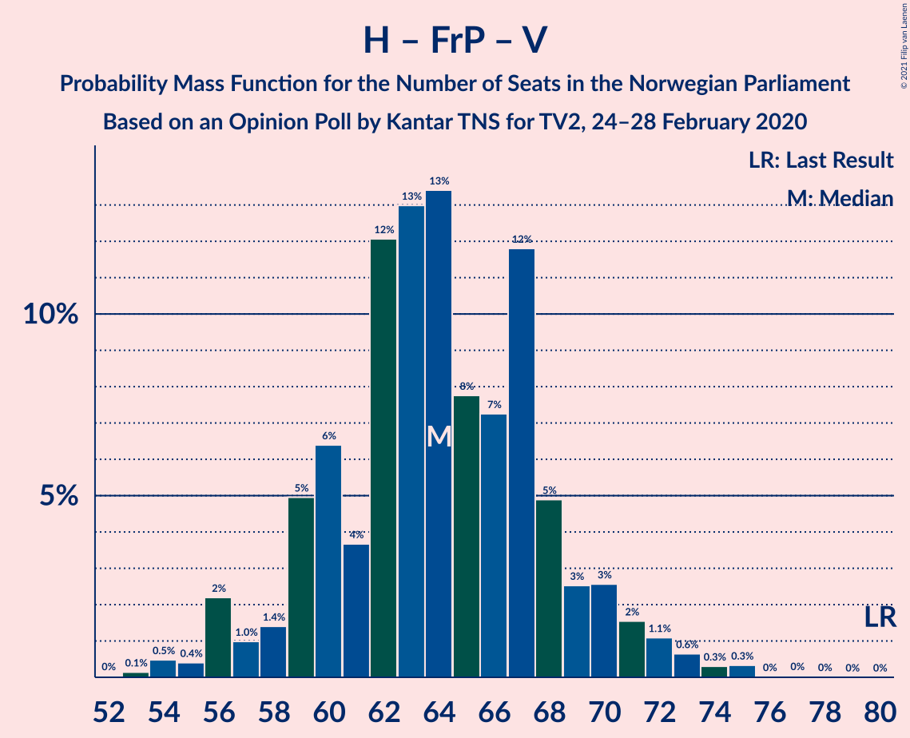
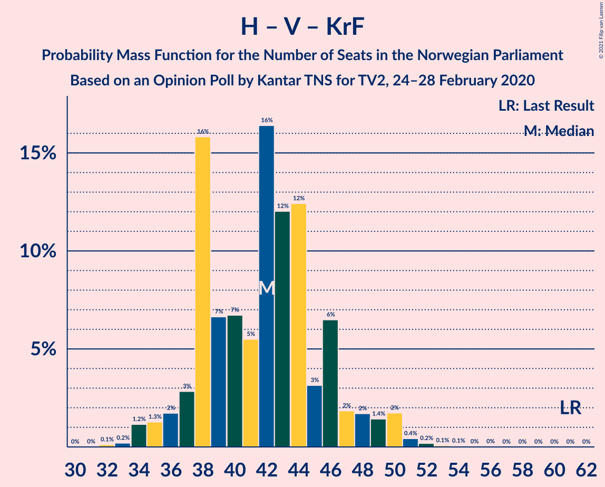

# Opinion Poll by Kantar TNS for TV2, 24–28 February 2020

<a href="#voting-intentions">Voting Intentions</a> | <a href="#seats">Seats</a> | <a href="#coalitions">Coalitions</a> | <a href="#technical-information">Technical Information</a>

## Voting Intentions

### Confidence Intervals

| Party | Last Result | Poll Result | 80% Confidence Interval | 90% Confidence Interval | 95% Confidence Interval | 99% Confidence Interval |
|:-----:|:-----------:|:-----------:|:-----------------------:|:-----------------------:|:-----------------------:|:-----------------------:|
| Arbeiderpartiet | 27.4% | 21.5% | 19.7–23.5% |19.2–24.1% |18.7–24.6% |17.9–25.6% |
| Høyre | 25.0% | 19.8% | 18.0–21.7% |17.5–22.3% |17.1–22.8% |16.3–23.8% |
| Senterpartiet | 10.3% | 17.5% | 15.9–19.4% |15.4–20.0% |15.0–20.4% |14.2–21.4% |
| Fremskrittspartiet | 15.2% | 13.7% | 12.2–15.4% |11.8–15.9% |11.4–16.3% |10.7–17.2% |
| Sosialistisk Venstreparti | 6.0% | 8.5% | 7.3–10.0% |7.0–10.3% |6.7–10.7% |6.2–11.4% |
| Miljøpartiet De Grønne | 3.2% | 5.6% | 4.6–6.8% |4.4–7.1% |4.1–7.5% |3.7–8.1% |
| Rødt | 2.4% | 4.1% | 3.3–5.2% |3.1–5.5% |2.9–5.8% |2.6–6.4% |
| Venstre | 4.4% | 3.7% | 3.0–4.8% |2.8–5.1% |2.6–5.3% |2.3–5.9% |
| Kristelig Folkeparti | 4.2% | 3.1% | 2.4–4.0% |2.2–4.3% |2.0–4.5% |1.8–5.1% |

*Note:* The poll result column reflects the actual value used in the calculations. Published results may vary slightly, and in addition be rounded to fewer digits.

## Seats

### Confidence Intervals

| Party | Last Result | Median | 80% Confidence Interval | 90% Confidence Interval | 95% Confidence Interval | 99% Confidence Interval |
|:-----:|:-----------:|:------:|:-----------------------:|:-----------------------:|:-----------------------:|:-----------------------:|
| <a href="#arbeiderpartiet">Arbeiderpartiet</a> | 49 | 40 | 36–44 |35–44 |34–44 |33–46 |
| <a href="#høyre">Høyre</a> | 45 | 35 | 32–39 |31–40 |30–41 |28–43 |
| <a href="#senterpartiet">Senterpartiet</a> | 19 | 31 | 29–36 |28–37 |27–38 |25–40 |
| <a href="#fremskrittspartiet">Fremskrittspartiet</a> | 27 | 25 | 21–27 |20–29 |20–29 |18–31 |
| <a href="#sosialistisk-venstreparti">Sosialistisk Venstreparti</a> | 11 | 15 | 13–17 |12–18 |11–19 |10–21 |
| <a href="#miljøpartiet-de-grønne">Miljøpartiet De Grønne</a> | 1 | 10 | 8–12 |8–12 |7–13 |2–14 |
| <a href="#rødt">Rødt</a> | 1 | 7 | 2–9 |2–10 |1–10 |1–11 |
| <a href="#venstre">Venstre</a> | 8 | 2 | 2–8 |2–9 |1–9 |1–11 |
| <a href="#kristelig-folkeparti">Kristelig Folkeparti</a> | 8 | 2 | 1–3 |0–8 |0–8 |0–9 |

### Arbeiderpartiet

*For a full overview of the results for this party, see the [Arbeiderpartiet](party-arbeiderpartiet.html) page.*

| Number of Seats | Probability | Accumulated | Special Marks |
|:---------------:|:-----------:|:-----------:|:-------------:|
| 30 | 0.1% | 100% |  |
| 31 | 0.1% | 99.9% |  |
| 32 | 0.2% | 99.7% |  |
| 33 | 2% | 99.5% |  |
| 34 | 0.9% | 98% |  |
| 35 | 3% | 97% |  |
| 36 | 6% | 94% |  |
| 37 | 10% | 88% |  |
| 38 | 11% | 78% |  |
| 39 | 9% | 67% |  |
| 40 | 9% | 57% | Median |
| 41 | 15% | 48% |  |
| 42 | 14% | 33% |  |
| 43 | 5% | 19% |  |
| 44 | 12% | 13% |  |
| 45 | 1.1% | 2% |  |
| 46 | 0.2% | 0.6% |  |
| 47 | 0.2% | 0.4% |  |
| 48 | 0.1% | 0.1% |  |
| 49 | 0% | 0% | Last Result |

### Høyre

*For a full overview of the results for this party, see the [Høyre](party-høyre.html) page.*

| Number of Seats | Probability | Accumulated | Special Marks |
|:---------------:|:-----------:|:-----------:|:-------------:|
| 26 | 0.1% | 100% |  |
| 27 | 0.1% | 99.9% |  |
| 28 | 0.4% | 99.9% |  |
| 29 | 1.0% | 99.4% |  |
| 30 | 3% | 98% |  |
| 31 | 4% | 96% |  |
| 32 | 9% | 92% |  |
| 33 | 9% | 83% |  |
| 34 | 15% | 74% |  |
| 35 | 11% | 59% | Median |
| 36 | 11% | 47% |  |
| 37 | 7% | 37% |  |
| 38 | 11% | 29% |  |
| 39 | 10% | 18% |  |
| 40 | 4% | 8% |  |
| 41 | 2% | 4% |  |
| 42 | 0.8% | 2% |  |
| 43 | 0.3% | 0.8% |  |
| 44 | 0.1% | 0.5% |  |
| 45 | 0.2% | 0.3% | Last Result |
| 46 | 0.1% | 0.1% |  |
| 47 | 0% | 0% |  |

### Senterpartiet

*For a full overview of the results for this party, see the [Senterpartiet](party-senterpartiet.html) page.*

| Number of Seats | Probability | Accumulated | Special Marks |
|:---------------:|:-----------:|:-----------:|:-------------:|
| 19 | 0% | 100% | Last Result |
| 20 | 0% | 100% |  |
| 21 | 0% | 100% |  |
| 22 | 0% | 100% |  |
| 23 | 0% | 100% |  |
| 24 | 0.2% | 99.9% |  |
| 25 | 0.4% | 99.8% |  |
| 26 | 0.8% | 99.4% |  |
| 27 | 2% | 98.6% |  |
| 28 | 3% | 96% |  |
| 29 | 16% | 93% |  |
| 30 | 14% | 78% |  |
| 31 | 17% | 63% | Median |
| 32 | 7% | 46% |  |
| 33 | 11% | 39% |  |
| 34 | 5% | 29% |  |
| 35 | 11% | 24% |  |
| 36 | 8% | 13% |  |
| 37 | 3% | 6% |  |
| 38 | 1.2% | 3% |  |
| 39 | 0.9% | 2% |  |
| 40 | 0.6% | 0.8% |  |
| 41 | 0.1% | 0.2% |  |
| 42 | 0% | 0.1% |  |
| 43 | 0% | 0% |  |

### Fremskrittspartiet

*For a full overview of the results for this party, see the [Fremskrittspartiet](party-fremskrittspartiet.html) page.*

| Number of Seats | Probability | Accumulated | Special Marks |
|:---------------:|:-----------:|:-----------:|:-------------:|
| 17 | 0.1% | 100% |  |
| 18 | 1.0% | 99.9% |  |
| 19 | 1.0% | 98.9% |  |
| 20 | 4% | 98% |  |
| 21 | 5% | 94% |  |
| 22 | 5% | 89% |  |
| 23 | 21% | 84% |  |
| 24 | 10% | 64% |  |
| 25 | 19% | 54% | Median |
| 26 | 16% | 35% |  |
| 27 | 9% | 19% | Last Result |
| 28 | 3% | 10% |  |
| 29 | 4% | 6% |  |
| 30 | 1.5% | 2% |  |
| 31 | 0.4% | 0.7% |  |
| 32 | 0.2% | 0.3% |  |
| 33 | 0% | 0.1% |  |
| 34 | 0% | 0% |  |

### Sosialistisk Venstreparti

*For a full overview of the results for this party, see the [Sosialistisk Venstreparti](party-sosialistiskvenstreparti.html) page.*

| Number of Seats | Probability | Accumulated | Special Marks |
|:---------------:|:-----------:|:-----------:|:-------------:|
| 9 | 0.1% | 100% |  |
| 10 | 0.7% | 99.9% |  |
| 11 | 2% | 99.2% | Last Result |
| 12 | 4% | 97% |  |
| 13 | 17% | 94% |  |
| 14 | 14% | 77% |  |
| 15 | 18% | 63% | Median |
| 16 | 20% | 45% |  |
| 17 | 16% | 25% |  |
| 18 | 5% | 9% |  |
| 19 | 2% | 4% |  |
| 20 | 1.0% | 2% |  |
| 21 | 0.6% | 0.8% |  |
| 22 | 0.1% | 0.2% |  |
| 23 | 0.1% | 0.1% |  |
| 24 | 0% | 0% |  |

### Miljøpartiet De Grønne

*For a full overview of the results for this party, see the [Miljøpartiet De Grønne](party-miljøpartietdegrønne.html) page.*

| Number of Seats | Probability | Accumulated | Special Marks |
|:---------------:|:-----------:|:-----------:|:-------------:|
| 1 | 0.1% | 100% | Last Result |
| 2 | 1.0% | 99.9% |  |
| 3 | 0.4% | 98.9% |  |
| 4 | 0% | 98% |  |
| 5 | 0% | 98% |  |
| 6 | 0% | 98% |  |
| 7 | 3% | 98% |  |
| 8 | 7% | 96% |  |
| 9 | 31% | 89% |  |
| 10 | 18% | 58% | Median |
| 11 | 27% | 40% |  |
| 12 | 8% | 12% |  |
| 13 | 3% | 5% |  |
| 14 | 1.2% | 2% |  |
| 15 | 0.4% | 0.5% |  |
| 16 | 0.1% | 0.1% |  |
| 17 | 0% | 0% |  |

### Rødt

*For a full overview of the results for this party, see the [Rødt](party-rødt.html) page.*

| Number of Seats | Probability | Accumulated | Special Marks |
|:---------------:|:-----------:|:-----------:|:-------------:|
| 1 | 4% | 100% | Last Result |
| 2 | 35% | 96% |  |
| 3 | 0% | 60% |  |
| 4 | 0% | 60% |  |
| 5 | 0% | 60% |  |
| 6 | 0.4% | 60% |  |
| 7 | 13% | 60% | Median |
| 8 | 33% | 47% |  |
| 9 | 9% | 14% |  |
| 10 | 4% | 5% |  |
| 11 | 1.2% | 1.4% |  |
| 12 | 0.2% | 0.2% |  |
| 13 | 0.1% | 0.1% |  |
| 14 | 0% | 0% |  |

### Venstre

*For a full overview of the results for this party, see the [Venstre](party-venstre.html) page.*

| Number of Seats | Probability | Accumulated | Special Marks |
|:---------------:|:-----------:|:-----------:|:-------------:|
| 0 | 0.1% | 100% |  |
| 1 | 3% | 99.9% |  |
| 2 | 63% | 97% | Median |
| 3 | 0.3% | 34% |  |
| 4 | 0% | 34% |  |
| 5 | 0% | 34% |  |
| 6 | 0.5% | 34% |  |
| 7 | 14% | 33% |  |
| 8 | 14% | 20% | Last Result |
| 9 | 4% | 6% |  |
| 10 | 2% | 2% |  |
| 11 | 0.5% | 0.5% |  |
| 12 | 0% | 0% |  |

### Kristelig Folkeparti

*For a full overview of the results for this party, see the [Kristelig Folkeparti](party-kristeligfolkeparti.html) page.*

| Number of Seats | Probability | Accumulated | Special Marks |
|:---------------:|:-----------:|:-----------:|:-------------:|
| 0 | 7% | 100% |  |
| 1 | 35% | 93% |  |
| 2 | 18% | 58% | Median |
| 3 | 31% | 40% |  |
| 4 | 0% | 9% |  |
| 5 | 0% | 9% |  |
| 6 | 0.2% | 9% |  |
| 7 | 4% | 9% |  |
| 8 | 4% | 5% | Last Result |
| 9 | 0.6% | 0.6% |  |
| 10 | 0.1% | 0.1% |  |
| 11 | 0% | 0% |  |

## Coalitions

### Confidence Intervals

| Coalition | Last Result | Median | Majority? | 80% Confidence Interval | 90% Confidence Interval | 95% Confidence Interval | 99% Confidence Interval |
|:---------:|:-----------:|:------:|:---------:|:-----------------------:|:-----------------------:|:-----------------------:|:-----------------------:|
| Arbeiderpartiet – Senterpartiet – Sosialistisk Venstreparti – Miljøpartiet De Grønne – Rødt | 81 | 103 | 100% | 98–108 | 96–108 | 95–110 | 93–111 |
| Arbeiderpartiet – Senterpartiet – Sosialistisk Venstreparti – Miljøpartiet De Grønne – Kristelig Folkeparti | 88 | 99 | 100% | 94–105 | 93–105 | 92–107 | 89–109 |
| Høyre – Senterpartiet – Fremskrittspartiet – Venstre – Kristelig Folkeparti | 107 | 99 | 100% | 93–103 | 91–105 | 91–106 | 89–109 |
| Arbeiderpartiet – Senterpartiet – Sosialistisk Venstreparti – Miljøpartiet De Grønne | 80 | 97 | 99.9% | 91–102 | 91–104 | 89–104 | 86–106 |
| Arbeiderpartiet – Senterpartiet – Sosialistisk Venstreparti – Rødt | 80 | 93 | 98% | 88–97 | 87–99 | 85–100 | 83–102 |
| Arbeiderpartiet – Senterpartiet – Sosialistisk Venstreparti | 79 | 87 | 74% | 82–92 | 82–95 | 80–95 | 77–96 |
| Arbeiderpartiet – Senterpartiet – Miljøpartiet De Grønne – Kristelig Folkeparti | 77 | 84 | 45% | 79–89 | 78–91 | 76–91 | 74–94 |
| Høyre – Fremskrittspartiet – Miljøpartiet De Grønne – Venstre – Kristelig Folkeparti | 89 | 76 | 2% | 72–81 | 70–82 | 69–84 | 67–86 |
| Arbeiderpartiet – Senterpartiet – Kristelig Folkeparti | 76 | 74 | 0.2% | 69–79 | 68–80 | 67–81 | 65–84 |
| Arbeiderpartiet – Senterpartiet | 68 | 72 | 0% | 67–77 | 66–78 | 65–78 | 63–79 |
| Høyre – Fremskrittspartiet – Venstre – Kristelig Folkeparti | 88 | 66 | 0% | 61–71 | 60–72 | 59–74 | 57–76 |
| Høyre – Fremskrittspartiet – Venstre | 80 | 64 | 0% | 59–68 | 58–70 | 56–71 | 54–74 |
| Høyre – Fremskrittspartiet | 72 | 60 | 0% | 55–65 | 54–65 | 53–66 | 50–70 |
| Arbeiderpartiet – Sosialistisk Venstreparti | 60 | 55 | 0% | 50–60 | 50–60 | 48–60 | 47–63 |
| Høyre – Venstre – Kristelig Folkeparti | 61 | 42 | 0% | 38–46 | 37–48 | 35–50 | 34–51 |
| Senterpartiet – Venstre – Kristelig Folkeparti | 35 | 38 | 0% | 33–43 | 32–45 | 32–47 | 29–50 |

### Arbeiderpartiet – Senterpartiet – Sosialistisk Venstreparti – Miljøpartiet De Grønne – Rødt

| Number of Seats | Probability | Accumulated | Special Marks |
|:---------------:|:-----------:|:-----------:|:-------------:|
| 81 | 0% | 100% | Last Result |
| 82 | 0% | 100% |  |
| 83 | 0% | 100% |  |
| 84 | 0% | 100% |  |
| 85 | 0% | 100% | Majority |
| 86 | 0% | 100% |  |
| 87 | 0% | 100% |  |
| 88 | 0% | 100% |  |
| 89 | 0.1% | 100% |  |
| 90 | 0% | 99.9% |  |
| 91 | 0.2% | 99.9% |  |
| 92 | 0.2% | 99.7% |  |
| 93 | 0.7% | 99.5% |  |
| 94 | 0.6% | 98.9% |  |
| 95 | 1.3% | 98% |  |
| 96 | 2% | 97% |  |
| 97 | 3% | 95% |  |
| 98 | 5% | 91% |  |
| 99 | 12% | 87% |  |
| 100 | 5% | 75% |  |
| 101 | 10% | 71% |  |
| 102 | 10% | 61% |  |
| 103 | 3% | 51% | Median |
| 104 | 18% | 48% |  |
| 105 | 4% | 29% |  |
| 106 | 10% | 25% |  |
| 107 | 4% | 15% |  |
| 108 | 6% | 10% |  |
| 109 | 1.1% | 5% |  |
| 110 | 3% | 4% |  |
| 111 | 0.7% | 1.2% |  |
| 112 | 0.2% | 0.5% |  |
| 113 | 0.2% | 0.3% |  |
| 114 | 0.1% | 0.1% |  |
| 115 | 0% | 0% |  |

### Arbeiderpartiet – Senterpartiet – Sosialistisk Venstreparti – Miljøpartiet De Grønne – Kristelig Folkeparti

| Number of Seats | Probability | Accumulated | Special Marks |
|:---------------:|:-----------:|:-----------:|:-------------:|
| 87 | 0.1% | 100% |  |
| 88 | 0.3% | 99.9% | Last Result |
| 89 | 0.4% | 99.6% |  |
| 90 | 0.8% | 99.2% |  |
| 91 | 0.8% | 98% |  |
| 92 | 2% | 98% |  |
| 93 | 2% | 95% |  |
| 94 | 10% | 93% |  |
| 95 | 2% | 83% |  |
| 96 | 5% | 81% |  |
| 97 | 15% | 76% |  |
| 98 | 8% | 61% | Median |
| 99 | 9% | 53% |  |
| 100 | 3% | 45% |  |
| 101 | 8% | 42% |  |
| 102 | 6% | 33% |  |
| 103 | 7% | 28% |  |
| 104 | 9% | 21% |  |
| 105 | 7% | 12% |  |
| 106 | 1.1% | 5% |  |
| 107 | 2% | 4% |  |
| 108 | 0.6% | 1.1% |  |
| 109 | 0.3% | 0.6% |  |
| 110 | 0.1% | 0.2% |  |
| 111 | 0.1% | 0.1% |  |
| 112 | 0% | 0.1% |  |
| 113 | 0% | 0% |  |

### Høyre – Senterpartiet – Fremskrittspartiet – Venstre – Kristelig Folkeparti

| Number of Seats | Probability | Accumulated | Special Marks |
|:---------------:|:-----------:|:-----------:|:-------------:|
| 85 | 0% | 100% | Majority |
| 86 | 0% | 99.9% |  |
| 87 | 0.1% | 99.9% |  |
| 88 | 0.2% | 99.9% |  |
| 89 | 0.4% | 99.7% |  |
| 90 | 0.3% | 99.3% |  |
| 91 | 4% | 98.9% |  |
| 92 | 2% | 95% |  |
| 93 | 4% | 93% |  |
| 94 | 6% | 89% |  |
| 95 | 6% | 83% | Median |
| 96 | 10% | 77% |  |
| 97 | 6% | 67% |  |
| 98 | 7% | 61% |  |
| 99 | 22% | 54% |  |
| 100 | 10% | 32% |  |
| 101 | 5% | 22% |  |
| 102 | 4% | 16% |  |
| 103 | 3% | 12% |  |
| 104 | 3% | 9% |  |
| 105 | 3% | 6% |  |
| 106 | 0.7% | 3% |  |
| 107 | 0.6% | 2% | Last Result |
| 108 | 0.8% | 1.4% |  |
| 109 | 0.2% | 0.6% |  |
| 110 | 0.2% | 0.4% |  |
| 111 | 0.1% | 0.2% |  |
| 112 | 0% | 0.1% |  |
| 113 | 0% | 0% |  |

### Arbeiderpartiet – Senterpartiet – Sosialistisk Venstreparti – Miljøpartiet De Grønne

| Number of Seats | Probability | Accumulated | Special Marks |
|:---------------:|:-----------:|:-----------:|:-------------:|
| 80 | 0% | 100% | Last Result |
| 81 | 0% | 100% |  |
| 82 | 0% | 100% |  |
| 83 | 0% | 100% |  |
| 84 | 0.1% | 100% |  |
| 85 | 0.1% | 99.9% | Majority |
| 86 | 0.3% | 99.8% |  |
| 87 | 0.3% | 99.5% |  |
| 88 | 1.0% | 99.2% |  |
| 89 | 0.9% | 98% |  |
| 90 | 0.7% | 97% |  |
| 91 | 11% | 97% |  |
| 92 | 3% | 85% |  |
| 93 | 4% | 83% |  |
| 94 | 11% | 79% |  |
| 95 | 5% | 68% |  |
| 96 | 12% | 63% | Median |
| 97 | 7% | 51% |  |
| 98 | 6% | 44% |  |
| 99 | 4% | 38% |  |
| 100 | 12% | 34% |  |
| 101 | 3% | 22% |  |
| 102 | 10% | 19% |  |
| 103 | 1.4% | 9% |  |
| 104 | 7% | 8% |  |
| 105 | 0.7% | 1.3% |  |
| 106 | 0.2% | 0.6% |  |
| 107 | 0.3% | 0.4% |  |
| 108 | 0.1% | 0.2% |  |
| 109 | 0% | 0.1% |  |
| 110 | 0% | 0% |  |

### Arbeiderpartiet – Senterpartiet – Sosialistisk Venstreparti – Rødt

| Number of Seats | Probability | Accumulated | Special Marks |
|:---------------:|:-----------:|:-----------:|:-------------:|
| 79 | 0% | 100% |  |
| 80 | 0% | 99.9% | Last Result |
| 81 | 0.1% | 99.9% |  |
| 82 | 0.2% | 99.8% |  |
| 83 | 0.5% | 99.6% |  |
| 84 | 0.8% | 99.0% |  |
| 85 | 1.4% | 98% | Majority |
| 86 | 2% | 97% |  |
| 87 | 5% | 95% |  |
| 88 | 3% | 90% |  |
| 89 | 5% | 88% |  |
| 90 | 10% | 83% |  |
| 91 | 10% | 73% |  |
| 92 | 9% | 62% |  |
| 93 | 19% | 53% | Median |
| 94 | 4% | 34% |  |
| 95 | 6% | 30% |  |
| 96 | 4% | 24% |  |
| 97 | 12% | 20% |  |
| 98 | 2% | 9% |  |
| 99 | 3% | 7% |  |
| 100 | 2% | 3% |  |
| 101 | 0.3% | 0.9% |  |
| 102 | 0.3% | 0.5% |  |
| 103 | 0.1% | 0.2% |  |
| 104 | 0.1% | 0.1% |  |
| 105 | 0% | 0% |  |

### Arbeiderpartiet – Senterpartiet – Sosialistisk Venstreparti

| Number of Seats | Probability | Accumulated | Special Marks |
|:---------------:|:-----------:|:-----------:|:-------------:|
| 75 | 0.1% | 100% |  |
| 76 | 0.1% | 99.9% |  |
| 77 | 0.4% | 99.8% |  |
| 78 | 0.4% | 99.3% |  |
| 79 | 0.8% | 99.0% | Last Result |
| 80 | 2% | 98% |  |
| 81 | 1.4% | 97% |  |
| 82 | 12% | 95% |  |
| 83 | 4% | 83% |  |
| 84 | 5% | 79% |  |
| 85 | 18% | 74% | Majority |
| 86 | 4% | 56% | Median |
| 87 | 9% | 52% |  |
| 88 | 4% | 44% |  |
| 89 | 12% | 40% |  |
| 90 | 5% | 28% |  |
| 91 | 11% | 22% |  |
| 92 | 2% | 11% |  |
| 93 | 2% | 9% |  |
| 94 | 0.6% | 7% |  |
| 95 | 5% | 6% |  |
| 96 | 0.2% | 0.6% |  |
| 97 | 0.3% | 0.4% |  |
| 98 | 0% | 0.1% |  |
| 99 | 0% | 0.1% |  |
| 100 | 0% | 0% |  |

### Arbeiderpartiet – Senterpartiet – Miljøpartiet De Grønne – Kristelig Folkeparti

| Number of Seats | Probability | Accumulated | Special Marks |
|:---------------:|:-----------:|:-----------:|:-------------:|
| 70 | 0.1% | 100% |  |
| 71 | 0% | 99.9% |  |
| 72 | 0% | 99.9% |  |
| 73 | 0.2% | 99.9% |  |
| 74 | 0.6% | 99.7% |  |
| 75 | 0.2% | 99.1% |  |
| 76 | 1.5% | 98.9% |  |
| 77 | 1.1% | 97% | Last Result |
| 78 | 4% | 96% |  |
| 79 | 12% | 93% |  |
| 80 | 2% | 81% |  |
| 81 | 4% | 78% |  |
| 82 | 8% | 75% |  |
| 83 | 9% | 67% | Median |
| 84 | 13% | 58% |  |
| 85 | 9% | 45% | Majority |
| 86 | 4% | 36% |  |
| 87 | 4% | 32% |  |
| 88 | 17% | 28% |  |
| 89 | 3% | 11% |  |
| 90 | 3% | 8% |  |
| 91 | 3% | 5% |  |
| 92 | 0.6% | 2% |  |
| 93 | 0.5% | 1.1% |  |
| 94 | 0.4% | 0.7% |  |
| 95 | 0.2% | 0.3% |  |
| 96 | 0.1% | 0.1% |  |
| 97 | 0% | 0% |  |

### Høyre – Fremskrittspartiet – Miljøpartiet De Grønne – Venstre – Kristelig Folkeparti

| Number of Seats | Probability | Accumulated | Special Marks |
|:---------------:|:-----------:|:-----------:|:-------------:|
| 64 | 0% | 100% |  |
| 65 | 0.1% | 99.9% |  |
| 66 | 0.1% | 99.8% |  |
| 67 | 0.3% | 99.7% |  |
| 68 | 0.5% | 99.4% |  |
| 69 | 3% | 98.9% |  |
| 70 | 4% | 96% |  |
| 71 | 2% | 93% |  |
| 72 | 12% | 91% |  |
| 73 | 4% | 79% |  |
| 74 | 6% | 75% | Median |
| 75 | 4% | 69% |  |
| 76 | 19% | 65% |  |
| 77 | 9% | 46% |  |
| 78 | 10% | 37% |  |
| 79 | 10% | 27% |  |
| 80 | 5% | 16% |  |
| 81 | 2% | 12% |  |
| 82 | 5% | 10% |  |
| 83 | 2% | 5% |  |
| 84 | 1.4% | 3% |  |
| 85 | 0.7% | 2% | Majority |
| 86 | 0.5% | 0.9% |  |
| 87 | 0.2% | 0.4% |  |
| 88 | 0.1% | 0.2% |  |
| 89 | 0% | 0.1% | Last Result |
| 90 | 0% | 0.1% |  |
| 91 | 0% | 0% |  |

### Arbeiderpartiet – Senterpartiet – Kristelig Folkeparti

| Number of Seats | Probability | Accumulated | Special Marks |
|:---------------:|:-----------:|:-----------:|:-------------:|
| 63 | 0.1% | 100% |  |
| 64 | 0.2% | 99.8% |  |
| 65 | 0.6% | 99.7% |  |
| 66 | 0.6% | 99.0% |  |
| 67 | 2% | 98% |  |
| 68 | 2% | 97% |  |
| 69 | 5% | 94% |  |
| 70 | 10% | 90% |  |
| 71 | 6% | 79% |  |
| 72 | 8% | 73% |  |
| 73 | 9% | 65% | Median |
| 74 | 9% | 56% |  |
| 75 | 11% | 47% |  |
| 76 | 4% | 36% | Last Result |
| 77 | 13% | 32% |  |
| 78 | 2% | 19% |  |
| 79 | 10% | 17% |  |
| 80 | 2% | 6% |  |
| 81 | 3% | 5% |  |
| 82 | 0.9% | 2% |  |
| 83 | 0.5% | 1.1% |  |
| 84 | 0.4% | 0.6% |  |
| 85 | 0.1% | 0.2% | Majority |
| 86 | 0.1% | 0.1% |  |
| 87 | 0.1% | 0.1% |  |
| 88 | 0% | 0% |  |

### Arbeiderpartiet – Senterpartiet

| Number of Seats | Probability | Accumulated | Special Marks |
|:---------------:|:-----------:|:-----------:|:-------------:|
| 61 | 0.1% | 100% |  |
| 62 | 0.1% | 99.9% |  |
| 63 | 0.5% | 99.7% |  |
| 64 | 1.1% | 99.2% |  |
| 65 | 2% | 98% |  |
| 66 | 2% | 97% |  |
| 67 | 10% | 95% |  |
| 68 | 6% | 85% | Last Result |
| 69 | 9% | 79% |  |
| 70 | 8% | 70% |  |
| 71 | 6% | 62% | Median |
| 72 | 15% | 56% |  |
| 73 | 6% | 40% |  |
| 74 | 5% | 35% |  |
| 75 | 11% | 30% |  |
| 76 | 8% | 19% |  |
| 77 | 3% | 11% |  |
| 78 | 7% | 8% |  |
| 79 | 0.7% | 1.0% |  |
| 80 | 0.2% | 0.4% |  |
| 81 | 0.1% | 0.2% |  |
| 82 | 0.1% | 0.1% |  |
| 83 | 0% | 0% |  |

### Høyre – Fremskrittspartiet – Venstre – Kristelig Folkeparti

| Number of Seats | Probability | Accumulated | Special Marks |
|:---------------:|:-----------:|:-----------:|:-------------:|
| 55 | 0.1% | 100% |  |
| 56 | 0.2% | 99.9% |  |
| 57 | 0.3% | 99.7% |  |
| 58 | 0.7% | 99.4% |  |
| 59 | 3% | 98.7% |  |
| 60 | 1.1% | 96% |  |
| 61 | 6% | 95% |  |
| 62 | 5% | 89% |  |
| 63 | 11% | 85% |  |
| 64 | 4% | 74% | Median |
| 65 | 18% | 70% |  |
| 66 | 3% | 52% |  |
| 67 | 10% | 48% |  |
| 68 | 10% | 38% |  |
| 69 | 4% | 29% |  |
| 70 | 12% | 24% |  |
| 71 | 5% | 13% |  |
| 72 | 3% | 8% |  |
| 73 | 2% | 5% |  |
| 74 | 1.2% | 3% |  |
| 75 | 0.6% | 2% |  |
| 76 | 0.6% | 1.0% |  |
| 77 | 0.1% | 0.4% |  |
| 78 | 0.2% | 0.3% |  |
| 79 | 0% | 0.1% |  |
| 80 | 0.1% | 0.1% |  |
| 81 | 0% | 0% |  |
| 82 | 0% | 0% |  |
| 83 | 0% | 0% |  |
| 84 | 0% | 0% |  |
| 85 | 0% | 0% | Majority |
| 86 | 0% | 0% |  |
| 87 | 0% | 0% |  |
| 88 | 0% | 0% | Last Result |

### Høyre – Fremskrittspartiet – Venstre

| Number of Seats | Probability | Accumulated | Special Marks |
|:---------------:|:-----------:|:-----------:|:-------------:|
| 52 | 0% | 100% |  |
| 53 | 0.1% | 99.9% |  |
| 54 | 0.5% | 99.8% |  |
| 55 | 0.4% | 99.3% |  |
| 56 | 2% | 98.9% |  |
| 57 | 1.0% | 97% |  |
| 58 | 1.4% | 96% |  |
| 59 | 5% | 94% |  |
| 60 | 6% | 89% |  |
| 61 | 4% | 83% |  |
| 62 | 12% | 79% | Median |
| 63 | 13% | 67% |  |
| 64 | 13% | 54% |  |
| 65 | 8% | 41% |  |
| 66 | 7% | 33% |  |
| 67 | 12% | 26% |  |
| 68 | 5% | 14% |  |
| 69 | 3% | 9% |  |
| 70 | 3% | 7% |  |
| 71 | 2% | 4% |  |
| 72 | 1.1% | 2% |  |
| 73 | 0.6% | 1.4% |  |
| 74 | 0.3% | 0.7% |  |
| 75 | 0.3% | 0.4% |  |
| 76 | 0% | 0.1% |  |
| 77 | 0% | 0.1% |  |
| 78 | 0% | 0% |  |
| 79 | 0% | 0% |  |
| 80 | 0% | 0% | Last Result |

### Høyre – Fremskrittspartiet

| Number of Seats | Probability | Accumulated | Special Marks |
|:---------------:|:-----------:|:-----------:|:-------------:|
| 48 | 0.1% | 100% |  |
| 49 | 0.1% | 99.9% |  |
| 50 | 0.3% | 99.8% |  |
| 51 | 0.5% | 99.5% |  |
| 52 | 1.2% | 99.0% |  |
| 53 | 2% | 98% |  |
| 54 | 4% | 96% |  |
| 55 | 3% | 92% |  |
| 56 | 3% | 89% |  |
| 57 | 15% | 86% |  |
| 58 | 7% | 71% |  |
| 59 | 5% | 64% |  |
| 60 | 12% | 59% | Median |
| 61 | 14% | 47% |  |
| 62 | 10% | 33% |  |
| 63 | 4% | 24% |  |
| 64 | 6% | 20% |  |
| 65 | 10% | 14% |  |
| 66 | 2% | 4% |  |
| 67 | 0.8% | 2% |  |
| 68 | 0.4% | 2% |  |
| 69 | 0.6% | 1.2% |  |
| 70 | 0.1% | 0.6% |  |
| 71 | 0.3% | 0.5% |  |
| 72 | 0.1% | 0.2% | Last Result |
| 73 | 0.1% | 0.1% |  |
| 74 | 0% | 0% |  |

### Arbeiderpartiet – Sosialistisk Venstreparti

| Number of Seats | Probability | Accumulated | Special Marks |
|:---------------:|:-----------:|:-----------:|:-------------:|
| 43 | 0% | 100% |  |
| 44 | 0.1% | 99.9% |  |
| 45 | 0.1% | 99.9% |  |
| 46 | 0.1% | 99.7% |  |
| 47 | 0.5% | 99.6% |  |
| 48 | 2% | 99.1% |  |
| 49 | 1.2% | 97% |  |
| 50 | 8% | 96% |  |
| 51 | 3% | 88% |  |
| 52 | 6% | 85% |  |
| 53 | 13% | 79% |  |
| 54 | 10% | 66% |  |
| 55 | 11% | 56% | Median |
| 56 | 9% | 45% |  |
| 57 | 8% | 35% |  |
| 58 | 7% | 28% |  |
| 59 | 10% | 21% |  |
| 60 | 9% | 11% | Last Result |
| 61 | 1.1% | 2% |  |
| 62 | 0.6% | 1.2% |  |
| 63 | 0.3% | 0.5% |  |
| 64 | 0.1% | 0.2% |  |
| 65 | 0% | 0.1% |  |
| 66 | 0% | 0.1% |  |
| 67 | 0% | 0.1% |  |
| 68 | 0% | 0% |  |

### Høyre – Venstre – Kristelig Folkeparti

| Number of Seats | Probability | Accumulated | Special Marks |
|:---------------:|:-----------:|:-----------:|:-------------:|
| 32 | 0.1% | 100% |  |
| 33 | 0.2% | 99.9% |  |
| 34 | 1.2% | 99.7% |  |
| 35 | 1.3% | 98.5% |  |
| 36 | 2% | 97% |  |
| 37 | 3% | 96% |  |
| 38 | 16% | 93% |  |
| 39 | 7% | 77% | Median |
| 40 | 7% | 70% |  |
| 41 | 5% | 63% |  |
| 42 | 16% | 58% |  |
| 43 | 12% | 42% |  |
| 44 | 12% | 30% |  |
| 45 | 3% | 17% |  |
| 46 | 6% | 14% |  |
| 47 | 2% | 7% |  |
| 48 | 2% | 6% |  |
| 49 | 1.4% | 4% |  |
| 50 | 2% | 3% |  |
| 51 | 0.4% | 0.8% |  |
| 52 | 0.2% | 0.4% |  |
| 53 | 0.1% | 0.2% |  |
| 54 | 0.1% | 0.1% |  |
| 55 | 0% | 0% |  |
| 56 | 0% | 0% |  |
| 57 | 0% | 0% |  |
| 58 | 0% | 0% |  |
| 59 | 0% | 0% |  |
| 60 | 0% | 0% |  |
| 61 | 0% | 0% | Last Result |

### Senterpartiet – Venstre – Kristelig Folkeparti

| Number of Seats | Probability | Accumulated | Special Marks |
|:---------------:|:-----------:|:-----------:|:-------------:|
| 28 | 0% | 100% |  |
| 29 | 0.6% | 99.9% |  |
| 30 | 0.4% | 99.3% |  |
| 31 | 0.6% | 99.0% |  |
| 32 | 4% | 98% |  |
| 33 | 7% | 95% |  |
| 34 | 13% | 88% |  |
| 35 | 10% | 74% | Last Result, Median |
| 36 | 5% | 65% |  |
| 37 | 6% | 60% |  |
| 38 | 5% | 53% |  |
| 39 | 10% | 48% |  |
| 40 | 6% | 38% |  |
| 41 | 6% | 33% |  |
| 42 | 9% | 27% |  |
| 43 | 9% | 18% |  |
| 44 | 3% | 9% |  |
| 45 | 2% | 5% |  |
| 46 | 0.7% | 3% |  |
| 47 | 0.7% | 3% |  |
| 48 | 0.3% | 2% |  |
| 49 | 1.0% | 2% |  |
| 50 | 0.3% | 0.5% |  |
| 51 | 0.1% | 0.3% |  |
| 52 | 0.1% | 0.2% |  |
| 53 | 0.1% | 0.2% |  |
| 54 | 0% | 0% |  |

## Technical Information

### Opinion Poll

+ **Polling firm:** Kantar TNS
+ **Commissioner(s):** TV2
+ **Fieldwork period:** 24–28 February 2020

### Calculations

+ **Sample size:** 753
+ **Simulations done:** 524,288
+ **Error estimate:** 2.50%

