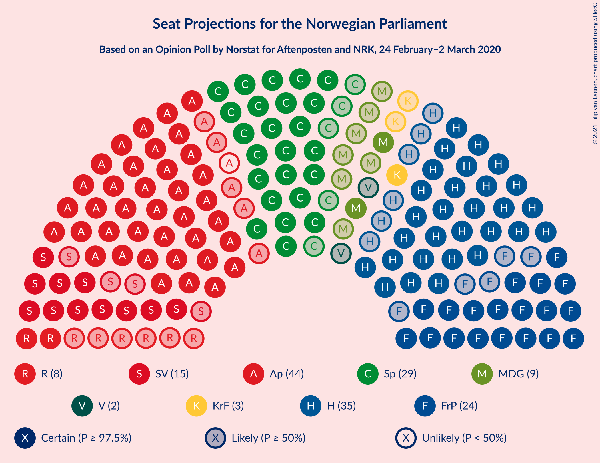
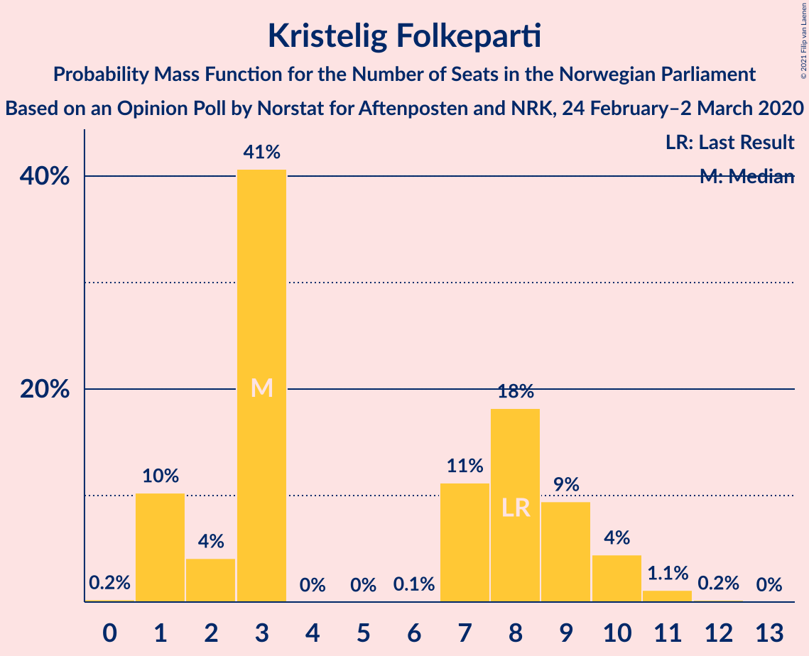
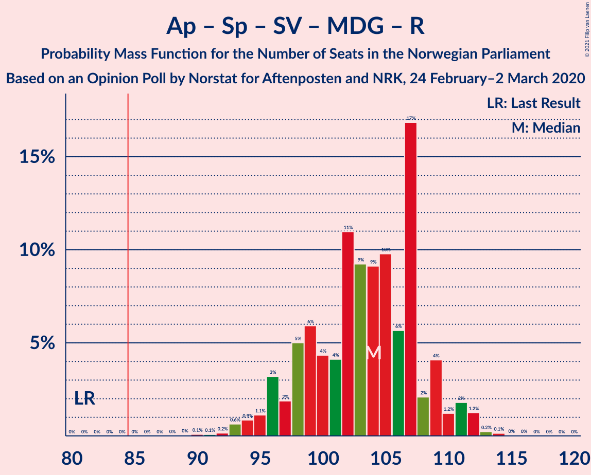
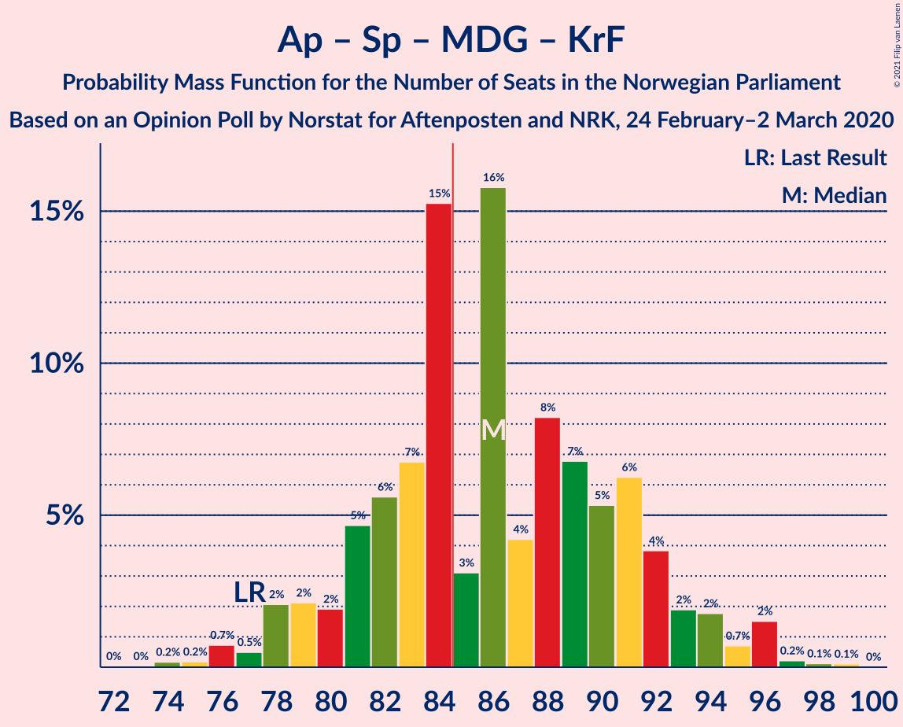
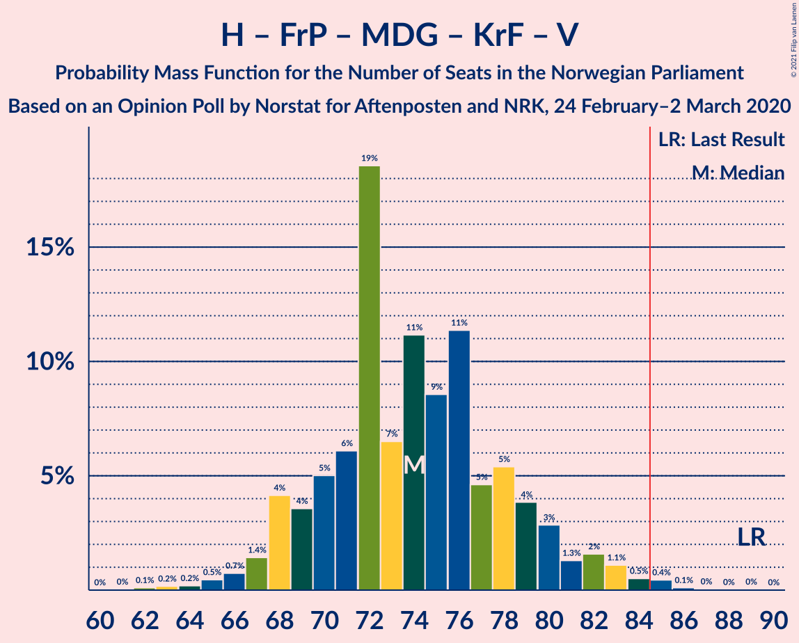
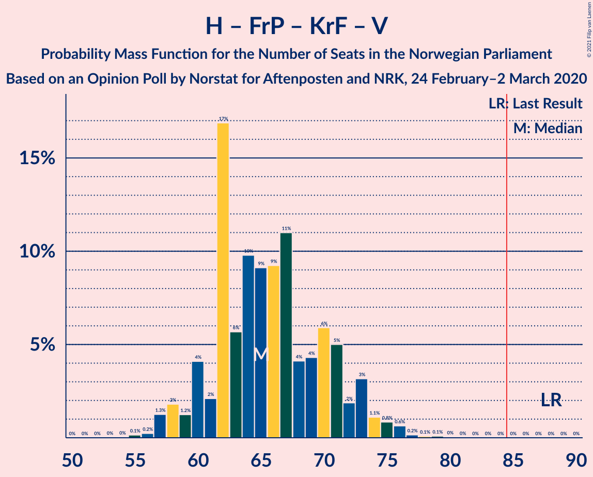
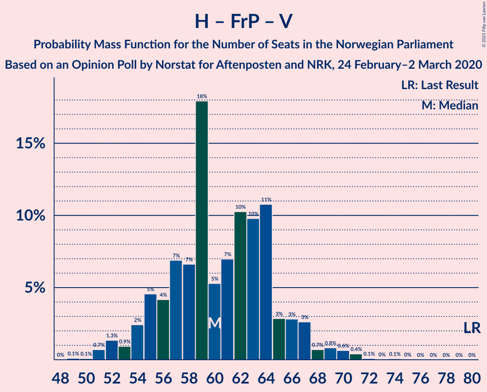
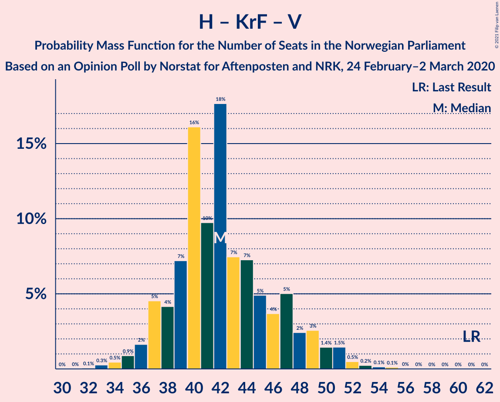

# Opinion Poll by Norstat for Aftenposten and NRK, 24 February–2 March 2020

<a href="#voting-intentions">Voting Intentions</a> | <a href="#seats">Seats</a> | <a href="#coalitions">Coalitions</a> | <a href="#technical-information">Technical Information</a>

## Voting Intentions

### Confidence Intervals

| Party | Last Result | Poll Result | 80% Confidence Interval | 90% Confidence Interval | 95% Confidence Interval | 99% Confidence Interval |
|:-----:|:-----------:|:-----------:|:-----------------------:|:-----------------------:|:-----------------------:|:-----------------------:|
| Arbeiderpartiet | 27.4% | 23.8% | 21.8–25.9% |21.2–26.6% |20.7–27.1% |19.8–28.2% |
| Høyre | 25.0% | 19.9% | 18.0–21.9% |17.5–22.5% |17.0–23.0% |16.2–24.0% |
| Senterpartiet | 10.3% | 16.4% | 14.7–18.3% |14.2–18.9% |13.8–19.3% |13.0–20.3% |
| Fremskrittspartiet | 15.2% | 13.2% | 11.7–15.0% |11.2–15.5% |10.9–15.9% |10.2–16.8% |
| Sosialistisk Venstreparti | 6.0% | 8.4% | 7.2–9.9% |6.8–10.3% |6.6–10.7% |6.0–11.5% |
| Miljøpartiet De Grønne | 3.2% | 4.9% | 4.0–6.2% |3.8–6.5% |3.6–6.8% |3.2–7.5% |
| Rødt | 2.4% | 4.6% | 3.7–5.8% |3.5–6.2% |3.3–6.5% |2.9–7.1% |
| Kristelig Folkeparti | 4.2% | 4.1% | 3.2–5.2% |3.0–5.5% |2.8–5.8% |2.5–6.4% |
| Venstre | 4.4% | 2.8% | 2.1–3.7% |1.9–4.0% |1.8–4.3% |1.5–4.8% |

*Note:* The poll result column reflects the actual value used in the calculations. Published results may vary slightly, and in addition be rounded to fewer digits.

## Seats

### Confidence Intervals

| Party | Last Result | Median | 80% Confidence Interval | 90% Confidence Interval | 95% Confidence Interval | 99% Confidence Interval |
|:-----:|:-----------:|:------:|:-----------------------:|:-----------------------:|:-----------------------:|:-----------------------:|
| <a href="#arbeiderpartiet">Arbeiderpartiet</a> | 49 | 44 | 40–46 |39–48 |37–48 |36–54 |
| <a href="#høyre">Høyre</a> | 45 | 35 | 31–39 |31–39 |29–41 |28–43 |
| <a href="#senterpartiet">Senterpartiet</a> | 19 | 29 | 27–35 |26–35 |24–36 |23–37 |
| <a href="#fremskrittspartiet">Fremskrittspartiet</a> | 27 | 24 | 20–27 |19–28 |18–28 |18–31 |
| <a href="#sosialistisk-venstreparti">Sosialistisk Venstreparti</a> | 11 | 14 | 12–18 |11–18 |10–19 |10–20 |
| <a href="#miljøpartiet-de-grønne">Miljøpartiet De Grønne</a> | 1 | 9 | 7–11 |2–12 |2–13 |1–13 |
| <a href="#rødt">Rødt</a> | 1 | 7 | 2–10 |2–11 |2–11 |1–12 |
| <a href="#kristelig-folkeparti">Kristelig Folkeparti</a> | 8 | 3 | 1–8 |1–9 |1–9 |1–11 |
| <a href="#venstre">Venstre</a> | 8 | 2 | 1–2 |0–2 |0–8 |0–8 |

### Arbeiderpartiet

*For a full overview of the results for this party, see the [Arbeiderpartiet](party-arbeiderpartiet.html) page.*

| Number of Seats | Probability | Accumulated | Special Marks |
|:---------------:|:-----------:|:-----------:|:-------------:|
| 34 | 0.1% | 100% |  |
| 35 | 0.2% | 99.9% |  |
| 36 | 0.3% | 99.7% |  |
| 37 | 3% | 99.5% |  |
| 38 | 0.6% | 96% |  |
| 39 | 5% | 96% |  |
| 40 | 3% | 91% |  |
| 41 | 17% | 88% |  |
| 42 | 9% | 71% |  |
| 43 | 4% | 62% |  |
| 44 | 24% | 58% | Median |
| 45 | 4% | 34% |  |
| 46 | 21% | 30% |  |
| 47 | 3% | 9% |  |
| 48 | 4% | 6% |  |
| 49 | 0.6% | 2% | Last Result |
| 50 | 0.7% | 2% |  |
| 51 | 0.1% | 1.0% |  |
| 52 | 0.3% | 0.9% |  |
| 53 | 0.1% | 0.7% |  |
| 54 | 0.5% | 0.6% |  |
| 55 | 0.1% | 0.1% |  |
| 56 | 0% | 0% |  |

### Høyre

*For a full overview of the results for this party, see the [Høyre](party-høyre.html) page.*

| Number of Seats | Probability | Accumulated | Special Marks |
|:---------------:|:-----------:|:-----------:|:-------------:|
| 25 | 0.1% | 100% |  |
| 26 | 0.1% | 99.9% |  |
| 27 | 0.1% | 99.9% |  |
| 28 | 0.6% | 99.8% |  |
| 29 | 2% | 99.2% |  |
| 30 | 2% | 97% |  |
| 31 | 7% | 96% |  |
| 32 | 18% | 89% |  |
| 33 | 9% | 71% |  |
| 34 | 8% | 62% |  |
| 35 | 9% | 54% | Median |
| 36 | 12% | 45% |  |
| 37 | 19% | 33% |  |
| 38 | 2% | 14% |  |
| 39 | 7% | 12% |  |
| 40 | 2% | 4% |  |
| 41 | 2% | 3% |  |
| 42 | 0.2% | 0.8% |  |
| 43 | 0.1% | 0.6% |  |
| 44 | 0.4% | 0.5% |  |
| 45 | 0% | 0.1% | Last Result |
| 46 | 0% | 0.1% |  |
| 47 | 0% | 0% |  |

### Senterpartiet

*For a full overview of the results for this party, see the [Senterpartiet](party-senterpartiet.html) page.*

| Number of Seats | Probability | Accumulated | Special Marks |
|:---------------:|:-----------:|:-----------:|:-------------:|
| 19 | 0% | 100% | Last Result |
| 20 | 0% | 100% |  |
| 21 | 0.1% | 100% |  |
| 22 | 0.1% | 99.9% |  |
| 23 | 1.4% | 99.8% |  |
| 24 | 1.2% | 98% |  |
| 25 | 1.4% | 97% |  |
| 26 | 5% | 96% |  |
| 27 | 10% | 91% |  |
| 28 | 13% | 81% |  |
| 29 | 23% | 68% | Median |
| 30 | 6% | 46% |  |
| 31 | 8% | 40% |  |
| 32 | 17% | 32% |  |
| 33 | 1.3% | 15% |  |
| 34 | 3% | 13% |  |
| 35 | 8% | 10% |  |
| 36 | 2% | 3% |  |
| 37 | 0.8% | 1.0% |  |
| 38 | 0.1% | 0.2% |  |
| 39 | 0% | 0.1% |  |
| 40 | 0.1% | 0.1% |  |
| 41 | 0% | 0% |  |

### Fremskrittspartiet

*For a full overview of the results for this party, see the [Fremskrittspartiet](party-fremskrittspartiet.html) page.*

| Number of Seats | Probability | Accumulated | Special Marks |
|:---------------:|:-----------:|:-----------:|:-------------:|
| 16 | 0% | 100% |  |
| 17 | 0.3% | 99.9% |  |
| 18 | 2% | 99.6% |  |
| 19 | 7% | 97% |  |
| 20 | 15% | 91% |  |
| 21 | 8% | 76% |  |
| 22 | 5% | 68% |  |
| 23 | 8% | 63% |  |
| 24 | 5% | 55% | Median |
| 25 | 30% | 50% |  |
| 26 | 7% | 19% |  |
| 27 | 7% | 12% | Last Result |
| 28 | 3% | 5% |  |
| 29 | 1.4% | 2% |  |
| 30 | 0.4% | 1.0% |  |
| 31 | 0.5% | 0.6% |  |
| 32 | 0.1% | 0.1% |  |
| 33 | 0% | 0% |  |

### Sosialistisk Venstreparti

*For a full overview of the results for this party, see the [Sosialistisk Venstreparti](party-sosialistiskvenstreparti.html) page.*

| Number of Seats | Probability | Accumulated | Special Marks |
|:---------------:|:-----------:|:-----------:|:-------------:|
| 9 | 0.1% | 100% |  |
| 10 | 4% | 99.9% |  |
| 11 | 2% | 96% | Last Result |
| 12 | 7% | 94% |  |
| 13 | 26% | 87% |  |
| 14 | 24% | 62% | Median |
| 15 | 5% | 38% |  |
| 16 | 11% | 33% |  |
| 17 | 8% | 22% |  |
| 18 | 11% | 14% |  |
| 19 | 1.3% | 3% |  |
| 20 | 1.2% | 1.4% |  |
| 21 | 0.1% | 0.2% |  |
| 22 | 0.1% | 0.1% |  |
| 23 | 0% | 0% |  |

### Miljøpartiet De Grønne

*For a full overview of the results for this party, see the [Miljøpartiet De Grønne](party-miljøpartietdegrønne.html) page.*

| Number of Seats | Probability | Accumulated | Special Marks |
|:---------------:|:-----------:|:-----------:|:-------------:|
| 1 | 0.9% | 100% | Last Result |
| 2 | 6% | 99.1% |  |
| 3 | 0.4% | 93% |  |
| 4 | 0% | 93% |  |
| 5 | 0% | 93% |  |
| 6 | 0% | 93% |  |
| 7 | 4% | 93% |  |
| 8 | 27% | 89% |  |
| 9 | 21% | 62% | Median |
| 10 | 29% | 41% |  |
| 11 | 5% | 12% |  |
| 12 | 3% | 7% |  |
| 13 | 4% | 4% |  |
| 14 | 0.2% | 0.3% |  |
| 15 | 0% | 0% |  |

### Rødt

*For a full overview of the results for this party, see the [Rødt](party-rødt.html) page.*

| Number of Seats | Probability | Accumulated | Special Marks |
|:---------------:|:-----------:|:-----------:|:-------------:|
| 1 | 0.8% | 100% | Last Result |
| 2 | 12% | 99.2% |  |
| 3 | 0% | 87% |  |
| 4 | 0% | 87% |  |
| 5 | 0% | 87% |  |
| 6 | 0.3% | 87% |  |
| 7 | 40% | 87% | Median |
| 8 | 14% | 47% |  |
| 9 | 19% | 33% |  |
| 10 | 9% | 14% |  |
| 11 | 3% | 5% |  |
| 12 | 2% | 2% |  |
| 13 | 0.2% | 0.2% |  |
| 14 | 0% | 0% |  |

### Kristelig Folkeparti

*For a full overview of the results for this party, see the [Kristelig Folkeparti](party-kristeligfolkeparti.html) page.*

| Number of Seats | Probability | Accumulated | Special Marks |
|:---------------:|:-----------:|:-----------:|:-------------:|
| 0 | 0.1% | 100% |  |
| 1 | 16% | 99.9% |  |
| 2 | 3% | 84% |  |
| 3 | 35% | 81% | Median |
| 4 | 0% | 46% |  |
| 5 | 0% | 46% |  |
| 6 | 0.2% | 46% |  |
| 7 | 9% | 46% |  |
| 8 | 28% | 37% | Last Result |
| 9 | 7% | 9% |  |
| 10 | 1.0% | 2% |  |
| 11 | 0.7% | 1.0% |  |
| 12 | 0.3% | 0.3% |  |
| 13 | 0% | 0% |  |

### Venstre

*For a full overview of the results for this party, see the [Venstre](party-venstre.html) page.*

| Number of Seats | Probability | Accumulated | Special Marks |
|:---------------:|:-----------:|:-----------:|:-------------:|
| 0 | 8% | 100% |  |
| 1 | 35% | 92% |  |
| 2 | 52% | 57% | Median |
| 3 | 0% | 5% |  |
| 4 | 0% | 5% |  |
| 5 | 0% | 5% |  |
| 6 | 1.0% | 5% |  |
| 7 | 1.3% | 4% |  |
| 8 | 2% | 3% | Last Result |
| 9 | 0.1% | 0.1% |  |
| 10 | 0% | 0% |  |

## Coalitions

### Confidence Intervals

| Coalition | Last Result | Median | Majority? | 80% Confidence Interval | 90% Confidence Interval | 95% Confidence Interval | 99% Confidence Interval |
|:---------:|:-----------:|:------:|:---------:|:-----------------------:|:-----------------------:|:-----------------------:|:-----------------------:|
| Arbeiderpartiet – Senterpartiet – Sosialistisk Venstreparti – Miljøpartiet De Grønne – Rødt | 81 | 105 | 100% | 98–109 | 96–111 | 95–111 | 93–115 |
| Arbeiderpartiet – Senterpartiet – Sosialistisk Venstreparti – Miljøpartiet De Grønne – Kristelig Folkeparti | 88 | 103 | 100% | 96–107 | 94–108 | 92–109 | 90–111 |
| Arbeiderpartiet – Senterpartiet – Sosialistisk Venstreparti – Miljøpartiet De Grønne | 80 | 96 | 99.7% | 91–101 | 89–102 | 87–105 | 85–107 |
| Høyre – Senterpartiet – Fremskrittspartiet – Kristelig Folkeparti – Venstre | 107 | 95 | 99.8% | 90–99 | 89–101 | 87–103 | 85–109 |
| Arbeiderpartiet – Senterpartiet – Sosialistisk Venstreparti – Rødt | 80 | 96 | 99.7% | 90–100 | 88–102 | 86–103 | 85–107 |
| Arbeiderpartiet – Senterpartiet – Miljøpartiet De Grønne – Kristelig Folkeparti | 77 | 89 | 69% | 79–93 | 79–95 | 77–97 | 76–97 |
| Arbeiderpartiet – Senterpartiet – Sosialistisk Venstreparti | 79 | 88 | 83% | 83–92 | 82–94 | 80–96 | 78–99 |
| Arbeiderpartiet – Senterpartiet – Kristelig Folkeparti | 76 | 79 | 10% | 70–84 | 69–86 | 69–87 | 68–88 |
| Høyre – Fremskrittspartiet – Miljøpartiet De Grønne – Kristelig Folkeparti – Venstre | 89 | 73 | 0.3% | 69–79 | 67–81 | 66–83 | 62–84 |
| Arbeiderpartiet – Senterpartiet | 68 | 75 | 0.1% | 67–78 | 66–79 | 65–80 | 64–83 |
| Høyre – Fremskrittspartiet – Kristelig Folkeparti – Venstre | 88 | 64 | 0% | 60–71 | 58–73 | 58–74 | 54–76 |
| Høyre – Fremskrittspartiet – Venstre | 80 | 59 | 0% | 55–66 | 54–67 | 53–69 | 51–71 |
| Høyre – Fremskrittspartiet | 72 | 57 | 0% | 54–64 | 52–65 | 50–68 | 49–69 |
| Arbeiderpartiet – Sosialistisk Venstreparti | 60 | 58 | 0% | 55–61 | 54–64 | 52–66 | 50–67 |
| Høyre – Kristelig Folkeparti – Venstre | 61 | 41 | 0% | 38–46 | 37–48 | 35–50 | 33–53 |
| Senterpartiet – Kristelig Folkeparti – Venstre | 35 | 37 | 0% | 31–41 | 31–45 | 30–45 | 28–51 |

### Arbeiderpartiet – Senterpartiet – Sosialistisk Venstreparti – Miljøpartiet De Grønne – Rødt

| Number of Seats | Probability | Accumulated | Special Marks |
|:---------------:|:-----------:|:-----------:|:-------------:|
| 81 | 0% | 100% | Last Result |
| 82 | 0% | 100% |  |
| 83 | 0% | 100% |  |
| 84 | 0% | 100% |  |
| 85 | 0% | 100% | Majority |
| 86 | 0% | 100% |  |
| 87 | 0% | 100% |  |
| 88 | 0% | 100% |  |
| 89 | 0% | 100% |  |
| 90 | 0.1% | 100% |  |
| 91 | 0.3% | 99.9% |  |
| 92 | 0.1% | 99.7% |  |
| 93 | 0.2% | 99.6% |  |
| 94 | 0.7% | 99.4% |  |
| 95 | 4% | 98.7% |  |
| 96 | 2% | 95% |  |
| 97 | 0.6% | 93% |  |
| 98 | 4% | 92% |  |
| 99 | 5% | 89% |  |
| 100 | 5% | 84% |  |
| 101 | 1.4% | 79% |  |
| 102 | 3% | 78% |  |
| 103 | 20% | 75% | Median |
| 104 | 3% | 55% |  |
| 105 | 13% | 52% |  |
| 106 | 3% | 39% |  |
| 107 | 21% | 36% |  |
| 108 | 3% | 14% |  |
| 109 | 5% | 12% |  |
| 110 | 1.0% | 6% |  |
| 111 | 4% | 5% |  |
| 112 | 0.3% | 1.0% |  |
| 113 | 0.1% | 0.7% |  |
| 114 | 0.2% | 0.7% |  |
| 115 | 0.5% | 0.5% |  |
| 116 | 0% | 0.1% |  |
| 117 | 0% | 0% |  |

### Arbeiderpartiet – Senterpartiet – Sosialistisk Venstreparti – Miljøpartiet De Grønne – Kristelig Folkeparti

| Number of Seats | Probability | Accumulated | Special Marks |
|:---------------:|:-----------:|:-----------:|:-------------:|
| 88 | 0% | 100% | Last Result |
| 89 | 0.1% | 100% |  |
| 90 | 2% | 99.9% |  |
| 91 | 0.1% | 98% |  |
| 92 | 0.9% | 98% |  |
| 93 | 0.7% | 97% |  |
| 94 | 2% | 96% |  |
| 95 | 1.2% | 94% |  |
| 96 | 10% | 93% |  |
| 97 | 8% | 83% |  |
| 98 | 2% | 75% |  |
| 99 | 3% | 73% | Median |
| 100 | 3% | 70% |  |
| 101 | 3% | 67% |  |
| 102 | 3% | 64% |  |
| 103 | 19% | 60% |  |
| 104 | 23% | 42% |  |
| 105 | 4% | 19% |  |
| 106 | 4% | 15% |  |
| 107 | 3% | 11% |  |
| 108 | 2% | 7% |  |
| 109 | 3% | 5% |  |
| 110 | 0.7% | 1.3% |  |
| 111 | 0.3% | 0.5% |  |
| 112 | 0.1% | 0.3% |  |
| 113 | 0.1% | 0.2% |  |
| 114 | 0% | 0.1% |  |
| 115 | 0% | 0% |  |

### Arbeiderpartiet – Senterpartiet – Sosialistisk Venstreparti – Miljøpartiet De Grønne

| Number of Seats | Probability | Accumulated | Special Marks |
|:---------------:|:-----------:|:-----------:|:-------------:|
| 80 | 0% | 100% | Last Result |
| 81 | 0% | 100% |  |
| 82 | 0% | 100% |  |
| 83 | 0.1% | 100% |  |
| 84 | 0.2% | 99.9% |  |
| 85 | 0.3% | 99.7% | Majority |
| 86 | 0.5% | 99.5% |  |
| 87 | 3% | 99.0% |  |
| 88 | 0.3% | 96% |  |
| 89 | 1.3% | 95% |  |
| 90 | 2% | 94% |  |
| 91 | 2% | 92% |  |
| 92 | 0.9% | 90% |  |
| 93 | 7% | 89% |  |
| 94 | 2% | 82% |  |
| 95 | 10% | 80% |  |
| 96 | 25% | 71% | Median |
| 97 | 8% | 46% |  |
| 98 | 2% | 38% |  |
| 99 | 7% | 36% |  |
| 100 | 18% | 29% |  |
| 101 | 2% | 11% |  |
| 102 | 4% | 8% |  |
| 103 | 1.1% | 5% |  |
| 104 | 0.2% | 4% |  |
| 105 | 2% | 3% |  |
| 106 | 0% | 1.4% |  |
| 107 | 1.0% | 1.3% |  |
| 108 | 0.3% | 0.3% |  |
| 109 | 0% | 0% |  |

### Høyre – Senterpartiet – Fremskrittspartiet – Kristelig Folkeparti – Venstre

| Number of Seats | Probability | Accumulated | Special Marks |
|:---------------:|:-----------:|:-----------:|:-------------:|
| 83 | 0% | 100% |  |
| 84 | 0.1% | 99.9% |  |
| 85 | 0.7% | 99.8% | Majority |
| 86 | 2% | 99.1% |  |
| 87 | 0.9% | 98% |  |
| 88 | 1.3% | 97% |  |
| 89 | 3% | 95% |  |
| 90 | 2% | 92% |  |
| 91 | 2% | 90% |  |
| 92 | 9% | 88% |  |
| 93 | 4% | 78% | Median |
| 94 | 20% | 74% |  |
| 95 | 24% | 54% |  |
| 96 | 5% | 30% |  |
| 97 | 5% | 26% |  |
| 98 | 6% | 20% |  |
| 99 | 5% | 15% |  |
| 100 | 3% | 9% |  |
| 101 | 3% | 6% |  |
| 102 | 0.5% | 3% |  |
| 103 | 0.9% | 3% |  |
| 104 | 0.3% | 2% |  |
| 105 | 0.4% | 2% |  |
| 106 | 0.2% | 1.3% |  |
| 107 | 0% | 1.1% | Last Result |
| 108 | 0% | 1.1% |  |
| 109 | 1.0% | 1.0% |  |
| 110 | 0% | 0.1% |  |
| 111 | 0% | 0% |  |

### Arbeiderpartiet – Senterpartiet – Sosialistisk Venstreparti – Rødt

| Number of Seats | Probability | Accumulated | Special Marks |
|:---------------:|:-----------:|:-----------:|:-------------:|
| 80 | 0% | 100% | Last Result |
| 81 | 0% | 100% |  |
| 82 | 0.2% | 100% |  |
| 83 | 0% | 99.8% |  |
| 84 | 0% | 99.7% |  |
| 85 | 0.4% | 99.7% | Majority |
| 86 | 3% | 99.3% |  |
| 87 | 1.4% | 97% |  |
| 88 | 2% | 95% |  |
| 89 | 3% | 93% |  |
| 90 | 6% | 91% |  |
| 91 | 2% | 85% |  |
| 92 | 3% | 83% |  |
| 93 | 4% | 80% |  |
| 94 | 5% | 76% | Median |
| 95 | 18% | 70% |  |
| 96 | 13% | 52% |  |
| 97 | 21% | 39% |  |
| 98 | 5% | 19% |  |
| 99 | 2% | 14% |  |
| 100 | 4% | 12% |  |
| 101 | 2% | 8% |  |
| 102 | 3% | 6% |  |
| 103 | 2% | 3% |  |
| 104 | 0.2% | 1.4% |  |
| 105 | 0.1% | 1.2% |  |
| 106 | 0.4% | 1.0% |  |
| 107 | 0.6% | 0.6% |  |
| 108 | 0% | 0% |  |

### Arbeiderpartiet – Senterpartiet – Miljøpartiet De Grønne – Kristelig Folkeparti

| Number of Seats | Probability | Accumulated | Special Marks |
|:---------------:|:-----------:|:-----------:|:-------------:|
| 73 | 0% | 100% |  |
| 74 | 0.1% | 99.9% |  |
| 75 | 0.2% | 99.8% |  |
| 76 | 0.4% | 99.6% |  |
| 77 | 2% | 99.2% | Last Result |
| 78 | 0.3% | 97% |  |
| 79 | 12% | 97% |  |
| 80 | 2% | 84% |  |
| 81 | 3% | 82% |  |
| 82 | 2% | 79% |  |
| 83 | 6% | 77% |  |
| 84 | 2% | 71% |  |
| 85 | 3% | 69% | Median, Majority |
| 86 | 1.1% | 66% |  |
| 87 | 4% | 65% |  |
| 88 | 8% | 61% |  |
| 89 | 17% | 54% |  |
| 90 | 5% | 37% |  |
| 91 | 19% | 32% |  |
| 92 | 3% | 13% |  |
| 93 | 1.3% | 10% |  |
| 94 | 3% | 9% |  |
| 95 | 3% | 6% |  |
| 96 | 0.1% | 3% |  |
| 97 | 3% | 3% |  |
| 98 | 0% | 0.2% |  |
| 99 | 0.1% | 0.1% |  |
| 100 | 0% | 0% |  |

### Arbeiderpartiet – Senterpartiet – Sosialistisk Venstreparti

| Number of Seats | Probability | Accumulated | Special Marks |
|:---------------:|:-----------:|:-----------:|:-------------:|
| 75 | 0% | 100% |  |
| 76 | 0% | 99.9% |  |
| 77 | 0.1% | 99.9% |  |
| 78 | 0.4% | 99.8% |  |
| 79 | 1.1% | 99.4% | Last Result |
| 80 | 1.2% | 98% |  |
| 81 | 1.2% | 97% |  |
| 82 | 3% | 96% |  |
| 83 | 5% | 93% |  |
| 84 | 5% | 88% |  |
| 85 | 6% | 83% | Majority |
| 86 | 7% | 76% |  |
| 87 | 9% | 69% | Median |
| 88 | 18% | 60% |  |
| 89 | 5% | 42% |  |
| 90 | 20% | 36% |  |
| 91 | 6% | 16% |  |
| 92 | 3% | 11% |  |
| 93 | 1.4% | 8% |  |
| 94 | 2% | 7% |  |
| 95 | 1.0% | 5% |  |
| 96 | 2% | 4% |  |
| 97 | 0.5% | 2% |  |
| 98 | 0.3% | 1.0% |  |
| 99 | 0.6% | 0.7% |  |
| 100 | 0.1% | 0.1% |  |
| 101 | 0% | 0% |  |

### Arbeiderpartiet – Senterpartiet – Kristelig Folkeparti

| Number of Seats | Probability | Accumulated | Special Marks |
|:---------------:|:-----------:|:-----------:|:-------------:|
| 66 | 0% | 100% |  |
| 67 | 0.1% | 99.9% |  |
| 68 | 1.0% | 99.8% |  |
| 69 | 5% | 98.8% |  |
| 70 | 7% | 94% |  |
| 71 | 1.3% | 88% |  |
| 72 | 3% | 86% |  |
| 73 | 3% | 84% |  |
| 74 | 6% | 81% |  |
| 75 | 4% | 75% |  |
| 76 | 3% | 71% | Last Result, Median |
| 77 | 4% | 68% |  |
| 78 | 7% | 64% |  |
| 79 | 17% | 57% |  |
| 80 | 4% | 40% |  |
| 81 | 4% | 36% |  |
| 82 | 3% | 33% |  |
| 83 | 19% | 30% |  |
| 84 | 1.5% | 11% |  |
| 85 | 3% | 10% | Majority |
| 86 | 3% | 7% |  |
| 87 | 3% | 4% |  |
| 88 | 0.2% | 0.5% |  |
| 89 | 0.1% | 0.3% |  |
| 90 | 0.1% | 0.2% |  |
| 91 | 0.1% | 0.1% |  |
| 92 | 0% | 0% |  |

### Høyre – Fremskrittspartiet – Miljøpartiet De Grønne – Kristelig Folkeparti – Venstre

| Number of Seats | Probability | Accumulated | Special Marks |
|:---------------:|:-----------:|:-----------:|:-------------:|
| 62 | 0.6% | 100% |  |
| 63 | 0.4% | 99.4% |  |
| 64 | 0.1% | 98.9% |  |
| 65 | 0.2% | 98.8% |  |
| 66 | 2% | 98.6% |  |
| 67 | 3% | 97% |  |
| 68 | 2% | 94% |  |
| 69 | 4% | 92% |  |
| 70 | 2% | 88% |  |
| 71 | 5% | 86% |  |
| 72 | 21% | 81% |  |
| 73 | 13% | 61% | Median |
| 74 | 18% | 48% |  |
| 75 | 5% | 30% |  |
| 76 | 4% | 24% |  |
| 77 | 3% | 20% |  |
| 78 | 2% | 17% |  |
| 79 | 6% | 15% |  |
| 80 | 3% | 9% |  |
| 81 | 2% | 7% |  |
| 82 | 1.4% | 5% |  |
| 83 | 3% | 3% |  |
| 84 | 0.4% | 0.7% |  |
| 85 | 0% | 0.3% | Majority |
| 86 | 0% | 0.3% |  |
| 87 | 0.2% | 0.2% |  |
| 88 | 0% | 0% |  |
| 89 | 0% | 0% | Last Result |

### Arbeiderpartiet – Senterpartiet

| Number of Seats | Probability | Accumulated | Special Marks |
|:---------------:|:-----------:|:-----------:|:-------------:|
| 61 | 0.1% | 100% |  |
| 62 | 0% | 99.9% |  |
| 63 | 0.1% | 99.8% |  |
| 64 | 2% | 99.7% |  |
| 65 | 1.1% | 98% |  |
| 66 | 5% | 96% |  |
| 67 | 2% | 92% |  |
| 68 | 2% | 90% | Last Result |
| 69 | 11% | 88% |  |
| 70 | 4% | 77% |  |
| 71 | 2% | 73% |  |
| 72 | 5% | 70% |  |
| 73 | 8% | 65% | Median |
| 74 | 3% | 58% |  |
| 75 | 21% | 55% |  |
| 76 | 18% | 34% |  |
| 77 | 3% | 16% |  |
| 78 | 5% | 13% |  |
| 79 | 6% | 9% |  |
| 80 | 1.1% | 3% |  |
| 81 | 0.2% | 2% |  |
| 82 | 0.4% | 1.4% |  |
| 83 | 0.9% | 1.0% |  |
| 84 | 0% | 0.1% |  |
| 85 | 0.1% | 0.1% | Majority |
| 86 | 0% | 0% |  |

### Høyre – Fremskrittspartiet – Kristelig Folkeparti – Venstre

| Number of Seats | Probability | Accumulated | Special Marks |
|:---------------:|:-----------:|:-----------:|:-------------:|
| 53 | 0.1% | 100% |  |
| 54 | 0.5% | 99.9% |  |
| 55 | 0.2% | 99.5% |  |
| 56 | 0.1% | 99.3% |  |
| 57 | 0.3% | 99.2% |  |
| 58 | 4% | 98.9% |  |
| 59 | 1.1% | 95% |  |
| 60 | 5% | 94% |  |
| 61 | 3% | 88% |  |
| 62 | 21% | 86% |  |
| 63 | 3% | 64% |  |
| 64 | 13% | 61% | Median |
| 65 | 3% | 48% |  |
| 66 | 20% | 45% |  |
| 67 | 3% | 25% |  |
| 68 | 1.4% | 22% |  |
| 69 | 5% | 21% |  |
| 70 | 5% | 16% |  |
| 71 | 4% | 11% |  |
| 72 | 0.6% | 8% |  |
| 73 | 2% | 7% |  |
| 74 | 4% | 5% |  |
| 75 | 0.7% | 1.3% |  |
| 76 | 0.2% | 0.6% |  |
| 77 | 0.1% | 0.4% |  |
| 78 | 0.3% | 0.3% |  |
| 79 | 0.1% | 0.1% |  |
| 80 | 0% | 0% |  |
| 81 | 0% | 0% |  |
| 82 | 0% | 0% |  |
| 83 | 0% | 0% |  |
| 84 | 0% | 0% |  |
| 85 | 0% | 0% | Majority |
| 86 | 0% | 0% |  |
| 87 | 0% | 0% |  |
| 88 | 0% | 0% | Last Result |

### Høyre – Fremskrittspartiet – Venstre

| Number of Seats | Probability | Accumulated | Special Marks |
|:---------------:|:-----------:|:-----------:|:-------------:|
| 49 | 0% | 100% |  |
| 50 | 0.2% | 99.9% |  |
| 51 | 2% | 99.8% |  |
| 52 | 0.3% | 98% |  |
| 53 | 1.2% | 98% |  |
| 54 | 5% | 96% |  |
| 55 | 3% | 91% |  |
| 56 | 5% | 88% |  |
| 57 | 5% | 83% |  |
| 58 | 20% | 78% |  |
| 59 | 18% | 58% |  |
| 60 | 0.8% | 39% |  |
| 61 | 2% | 38% | Median |
| 62 | 4% | 37% |  |
| 63 | 16% | 33% |  |
| 64 | 3% | 17% |  |
| 65 | 1.4% | 14% |  |
| 66 | 8% | 13% |  |
| 67 | 0.8% | 5% |  |
| 68 | 1.0% | 4% |  |
| 69 | 0.8% | 3% |  |
| 70 | 0.3% | 2% |  |
| 71 | 2% | 2% |  |
| 72 | 0.1% | 0.2% |  |
| 73 | 0% | 0.1% |  |
| 74 | 0% | 0% |  |
| 75 | 0% | 0% |  |
| 76 | 0% | 0% |  |
| 77 | 0% | 0% |  |
| 78 | 0% | 0% |  |
| 79 | 0% | 0% |  |
| 80 | 0% | 0% | Last Result |

### Høyre – Fremskrittspartiet

| Number of Seats | Probability | Accumulated | Special Marks |
|:---------------:|:-----------:|:-----------:|:-------------:|
| 47 | 0.2% | 100% |  |
| 48 | 0.1% | 99.7% |  |
| 49 | 2% | 99.6% |  |
| 50 | 0.2% | 98% |  |
| 51 | 1.4% | 97% |  |
| 52 | 4% | 96% |  |
| 53 | 2% | 92% |  |
| 54 | 6% | 90% |  |
| 55 | 4% | 84% |  |
| 56 | 6% | 80% |  |
| 57 | 33% | 75% |  |
| 58 | 3% | 42% |  |
| 59 | 3% | 38% | Median |
| 60 | 5% | 35% |  |
| 61 | 11% | 31% |  |
| 62 | 8% | 20% |  |
| 63 | 2% | 13% |  |
| 64 | 3% | 11% |  |
| 65 | 5% | 8% |  |
| 66 | 0.9% | 4% |  |
| 67 | 0.3% | 3% |  |
| 68 | 0.5% | 3% |  |
| 69 | 2% | 2% |  |
| 70 | 0.1% | 0.2% |  |
| 71 | 0% | 0.1% |  |
| 72 | 0% | 0% | Last Result |

### Arbeiderpartiet – Sosialistisk Venstreparti

| Number of Seats | Probability | Accumulated | Special Marks |
|:---------------:|:-----------:|:-----------:|:-------------:|
| 48 | 0.1% | 100% |  |
| 49 | 0.1% | 99.9% |  |
| 50 | 0.4% | 99.8% |  |
| 51 | 0.9% | 99.4% |  |
| 52 | 1.3% | 98.6% |  |
| 53 | 0.8% | 97% |  |
| 54 | 6% | 96% |  |
| 55 | 11% | 90% |  |
| 56 | 10% | 80% |  |
| 57 | 7% | 70% |  |
| 58 | 20% | 63% | Median |
| 59 | 26% | 43% |  |
| 60 | 5% | 17% | Last Result |
| 61 | 2% | 11% |  |
| 62 | 1.0% | 10% |  |
| 63 | 1.5% | 8% |  |
| 64 | 3% | 7% |  |
| 65 | 0.6% | 4% |  |
| 66 | 2% | 3% |  |
| 67 | 0.7% | 1.0% |  |
| 68 | 0.1% | 0.3% |  |
| 69 | 0% | 0.2% |  |
| 70 | 0.2% | 0.2% |  |
| 71 | 0% | 0% |  |

### Høyre – Kristelig Folkeparti – Venstre

| Number of Seats | Probability | Accumulated | Special Marks |
|:---------------:|:-----------:|:-----------:|:-------------:|
| 32 | 0.1% | 100% |  |
| 33 | 0.6% | 99.9% |  |
| 34 | 1.4% | 99.3% |  |
| 35 | 1.1% | 98% |  |
| 36 | 1.1% | 97% |  |
| 37 | 5% | 96% |  |
| 38 | 3% | 90% |  |
| 39 | 14% | 87% |  |
| 40 | 7% | 73% | Median |
| 41 | 20% | 67% |  |
| 42 | 20% | 47% |  |
| 43 | 9% | 27% |  |
| 44 | 2% | 18% |  |
| 45 | 4% | 16% |  |
| 46 | 4% | 12% |  |
| 47 | 2% | 8% |  |
| 48 | 0.6% | 6% |  |
| 49 | 0.7% | 5% |  |
| 50 | 3% | 4% |  |
| 51 | 0.1% | 2% |  |
| 52 | 1.0% | 2% |  |
| 53 | 0.2% | 0.6% |  |
| 54 | 0.2% | 0.4% |  |
| 55 | 0% | 0.2% |  |
| 56 | 0.1% | 0.1% |  |
| 57 | 0% | 0% |  |
| 58 | 0% | 0% |  |
| 59 | 0% | 0% |  |
| 60 | 0% | 0% |  |
| 61 | 0% | 0% | Last Result |

### Senterpartiet – Kristelig Folkeparti – Venstre

| Number of Seats | Probability | Accumulated | Special Marks |
|:---------------:|:-----------:|:-----------:|:-------------:|
| 26 | 0.2% | 100% |  |
| 27 | 0.2% | 99.8% |  |
| 28 | 1.1% | 99.6% |  |
| 29 | 0.7% | 98% |  |
| 30 | 0.5% | 98% |  |
| 31 | 14% | 97% |  |
| 32 | 3% | 83% |  |
| 33 | 9% | 80% |  |
| 34 | 2% | 71% | Median |
| 35 | 4% | 69% | Last Result |
| 36 | 2% | 65% |  |
| 37 | 18% | 63% |  |
| 38 | 24% | 46% |  |
| 39 | 6% | 22% |  |
| 40 | 1.3% | 16% |  |
| 41 | 5% | 15% |  |
| 42 | 0.8% | 10% |  |
| 43 | 0.3% | 9% |  |
| 44 | 3% | 9% |  |
| 45 | 4% | 6% |  |
| 46 | 0.3% | 2% |  |
| 47 | 0.7% | 2% |  |
| 48 | 0.3% | 1.3% |  |
| 49 | 0% | 1.0% |  |
| 50 | 0% | 0.9% |  |
| 51 | 0.9% | 0.9% |  |
| 52 | 0% | 0% |  |

## Technical Information

### Opinion Poll

+ **Polling firm:** Norstat
+ **Commissioner(s):** Aftenposten and NRK
+ **Fieldwork period:** 24 February–2 March 2020

### Calculations

+ **Sample size:** 690
+ **Simulations done:** 131,072
+ **Error estimate:** 4.42%

