# Opinion Poll by Respons Analyse for VG, 27 February–2 March 2020

<a href="#voting-intentions">Voting Intentions</a> | <a href="#seats">Seats</a> | <a href="#coalitions">Coalitions</a> | <a href="#technical-information">Technical Information</a>

## Voting Intentions

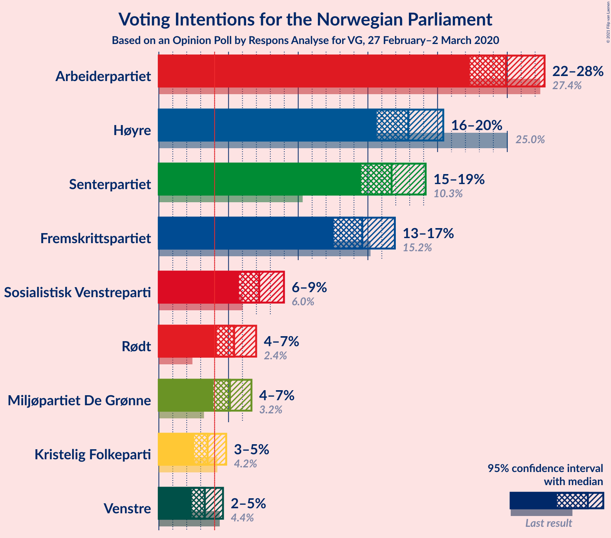

### Confidence Intervals

| Party | Last Result | Poll Result | 80% Confidence Interval | 90% Confidence Interval | 95% Confidence Interval | 99% Confidence Interval |
|:-----:|:-----------:|:-----------:|:-----------------------:|:-----------------------:|:-----------------------:|:-----------------------:|
| Arbeiderpartiet | 27.4% | 24.9% | 23.2–26.7% |22.7–27.2% |22.3–27.7% |21.5–28.6% |
| Høyre | 25.0% | 17.9% | 16.4–19.5% |16.0–20.0% |15.6–20.4% |15.0–21.2% |
| Senterpartiet | 10.3% | 16.7% | 15.3–18.3% |14.9–18.7% |14.5–19.1% |13.9–19.9% |
| Fremskrittspartiet | 15.2% | 14.6% | 13.2–16.1% |12.9–16.6% |12.5–16.9% |11.9–17.7% |
| Sosialistisk Venstreparti | 6.0% | 7.2% | 6.2–8.4% |6.0–8.7% |5.7–9.0% |5.3–9.6% |
| Rødt | 2.4% | 5.4% | 4.6–6.4% |4.3–6.7% |4.2–7.0% |3.8–7.5% |
| Miljøpartiet De Grønne | 3.2% | 5.1% | 4.3–6.1% |4.1–6.4% |3.9–6.6% |3.6–7.2% |
| Kristelig Folkeparti | 4.2% | 3.5% | 2.9–4.4% |2.7–4.6% |2.5–4.8% |2.2–5.3% |
| Venstre | 4.4% | 3.3% | 2.7–4.1% |2.5–4.4% |2.4–4.6% |2.1–5.0% |

*Note:* The poll result column reflects the actual value used in the calculations. Published results may vary slightly, and in addition be rounded to fewer digits.

## Seats

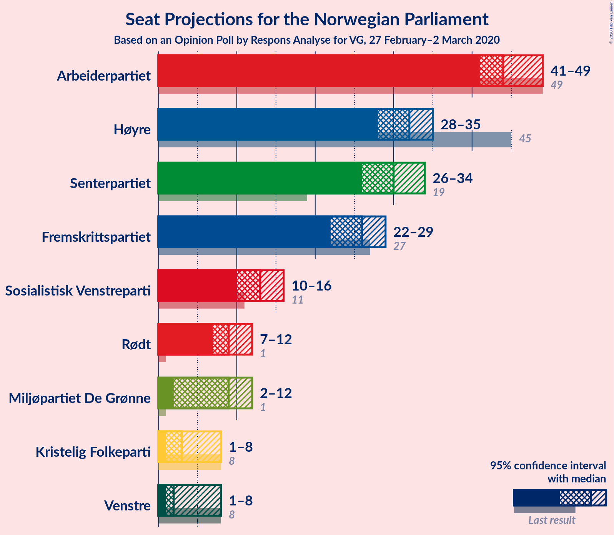

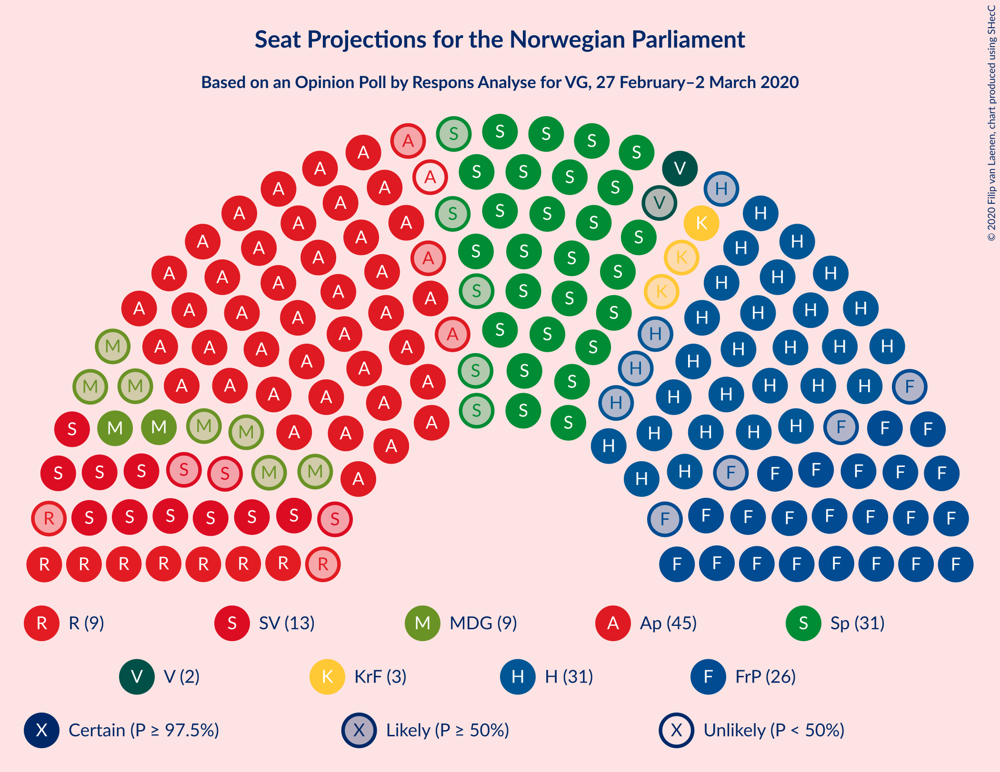

### Confidence Intervals

| Party | Last Result | Median | 80% Confidence Interval | 90% Confidence Interval | 95% Confidence Interval | 99% Confidence Interval |
|:-----:|:-----------:|:------:|:-----------------------:|:-----------------------:|:-----------------------:|:-----------------------:|
| <a href="#arbeiderpartiet">Arbeiderpartiet</a> | 49 | 44 | 42–47 |42–49 |41–49 |40–51 |
| <a href="#høyre">Høyre</a> | 45 | 32 | 29–35 |28–35 |28–35 |26–37 |
| <a href="#senterpartiet">Senterpartiet</a> | 19 | 30 | 28–33 |27–33 |26–34 |24–36 |
| <a href="#fremskrittspartiet">Fremskrittspartiet</a> | 27 | 26 | 24–28 |23–29 |22–29 |20–31 |
| <a href="#sosialistisk-venstreparti">Sosialistisk Venstreparti</a> | 11 | 13 | 11–14 |10–15 |10–16 |9–17 |
| <a href="#rødt">Rødt</a> | 1 | 9 | 8–11 |8–11 |7–12 |2–13 |
| <a href="#miljøpartiet-de-grønne">Miljøpartiet De Grønne</a> | 1 | 9 | 7–11 |7–11 |2–12 |2–13 |
| <a href="#kristelig-folkeparti">Kristelig Folkeparti</a> | 8 | 3 | 1–7 |1–8 |1–8 |0–9 |
| <a href="#venstre">Venstre</a> | 8 | 2 | 1–2 |1–7 |1–8 |1–8 |

### Arbeiderpartiet

*For a full overview of the results for this party, see the [Arbeiderpartiet](party-arbeiderpartiet.html) page.*

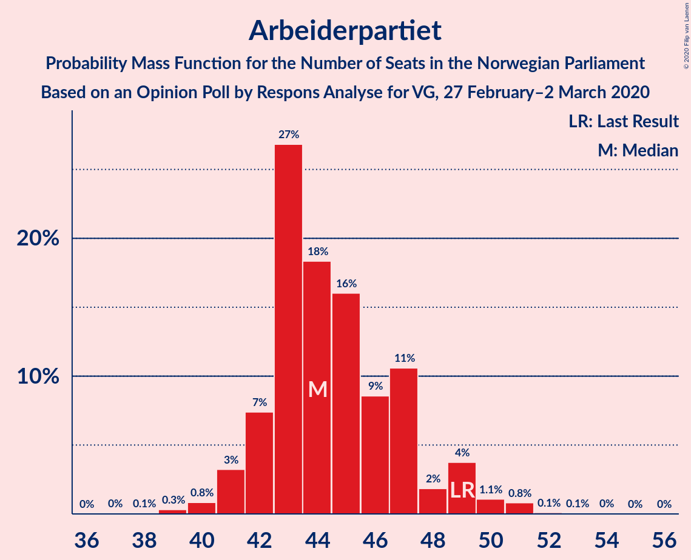

| Number of Seats | Probability | Accumulated | Special Marks |
|:---------------:|:-----------:|:-----------:|:-------------:|
| 37 | 0% | 100% |  |
| 38 | 0.1% | 99.9% |  |
| 39 | 0.3% | 99.9% |  |
| 40 | 0.8% | 99.5% |  |
| 41 | 3% | 98.7% |  |
| 42 | 7% | 95% |  |
| 43 | 27% | 88% |  |
| 44 | 18% | 61% | Median |
| 45 | 16% | 43% |  |
| 46 | 9% | 27% |  |
| 47 | 11% | 18% |  |
| 48 | 2% | 8% |  |
| 49 | 4% | 6% | Last Result |
| 50 | 1.1% | 2% |  |
| 51 | 0.8% | 1.0% |  |
| 52 | 0.1% | 0.2% |  |
| 53 | 0.1% | 0.1% |  |
| 54 | 0% | 0.1% |  |
| 55 | 0% | 0% |  |

### Høyre

*For a full overview of the results for this party, see the [Høyre](party-høyre.html) page.*

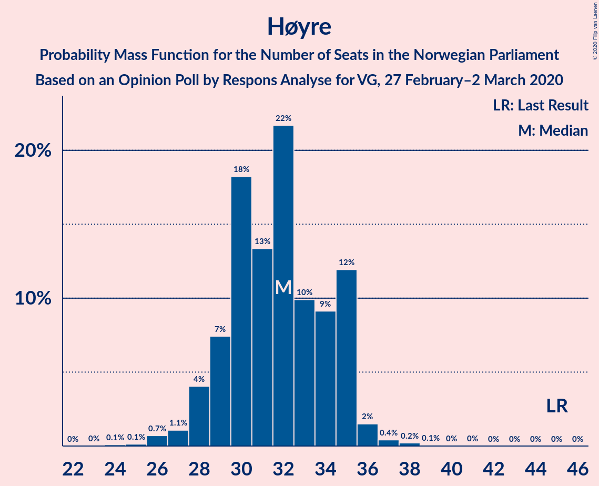

| Number of Seats | Probability | Accumulated | Special Marks |
|:---------------:|:-----------:|:-----------:|:-------------:|
| 24 | 0.1% | 100% |  |
| 25 | 0.1% | 99.9% |  |
| 26 | 0.7% | 99.7% |  |
| 27 | 1.1% | 99.0% |  |
| 28 | 4% | 98% |  |
| 29 | 7% | 94% |  |
| 30 | 18% | 86% |  |
| 31 | 13% | 68% |  |
| 32 | 22% | 55% | Median |
| 33 | 10% | 33% |  |
| 34 | 9% | 23% |  |
| 35 | 12% | 14% |  |
| 36 | 2% | 2% |  |
| 37 | 0.4% | 0.7% |  |
| 38 | 0.2% | 0.3% |  |
| 39 | 0.1% | 0.1% |  |
| 40 | 0% | 0% |  |
| 41 | 0% | 0% |  |
| 42 | 0% | 0% |  |
| 43 | 0% | 0% |  |
| 44 | 0% | 0% |  |
| 45 | 0% | 0% | Last Result |

### Senterpartiet

*For a full overview of the results for this party, see the [Senterpartiet](party-senterpartiet.html) page.*

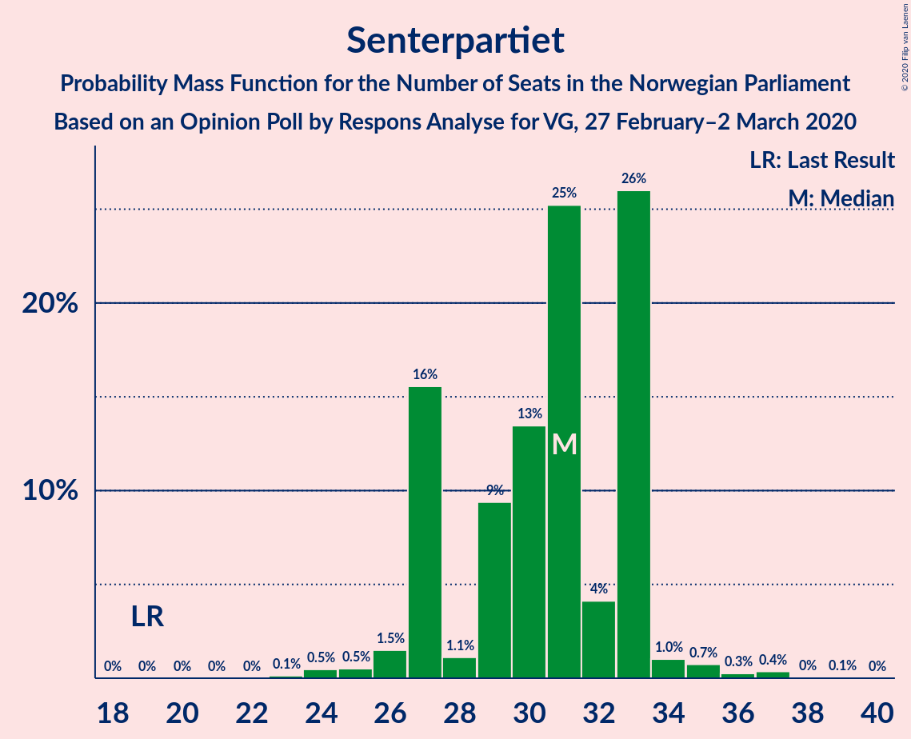

| Number of Seats | Probability | Accumulated | Special Marks |
|:---------------:|:-----------:|:-----------:|:-------------:|
| 19 | 0% | 100% | Last Result |
| 20 | 0% | 100% |  |
| 21 | 0% | 100% |  |
| 22 | 0% | 100% |  |
| 23 | 0.1% | 100% |  |
| 24 | 0.3% | 99.8% |  |
| 25 | 0.6% | 99.5% |  |
| 26 | 1.4% | 98.9% |  |
| 27 | 6% | 97% |  |
| 28 | 12% | 91% |  |
| 29 | 20% | 79% |  |
| 30 | 16% | 58% | Median |
| 31 | 23% | 42% |  |
| 32 | 6% | 19% |  |
| 33 | 9% | 13% |  |
| 34 | 2% | 4% |  |
| 35 | 2% | 2% |  |
| 36 | 0.3% | 0.6% |  |
| 37 | 0.2% | 0.2% |  |
| 38 | 0% | 0.1% |  |
| 39 | 0% | 0.1% |  |
| 40 | 0% | 0% |  |

### Fremskrittspartiet

*For a full overview of the results for this party, see the [Fremskrittspartiet](party-fremskrittspartiet.html) page.*

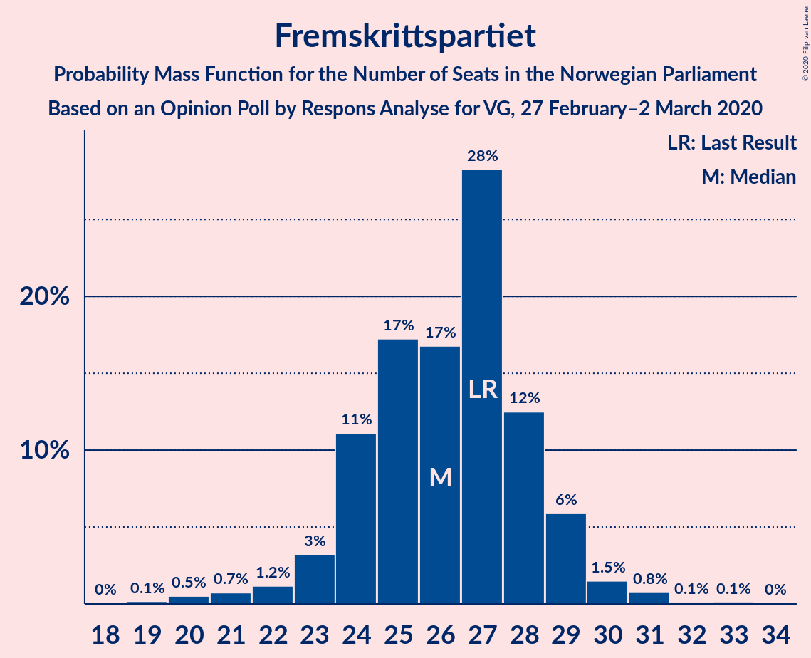

| Number of Seats | Probability | Accumulated | Special Marks |
|:---------------:|:-----------:|:-----------:|:-------------:|
| 19 | 0.1% | 100% |  |
| 20 | 0.5% | 99.8% |  |
| 21 | 0.7% | 99.3% |  |
| 22 | 1.2% | 98.6% |  |
| 23 | 3% | 97% |  |
| 24 | 11% | 94% |  |
| 25 | 17% | 83% |  |
| 26 | 17% | 66% | Median |
| 27 | 28% | 49% | Last Result |
| 28 | 12% | 21% |  |
| 29 | 6% | 8% |  |
| 30 | 1.5% | 2% |  |
| 31 | 0.8% | 1.0% |  |
| 32 | 0.1% | 0.2% |  |
| 33 | 0.1% | 0.1% |  |
| 34 | 0% | 0% |  |

### Sosialistisk Venstreparti

*For a full overview of the results for this party, see the [Sosialistisk Venstreparti](party-sosialistiskvenstreparti.html) page.*

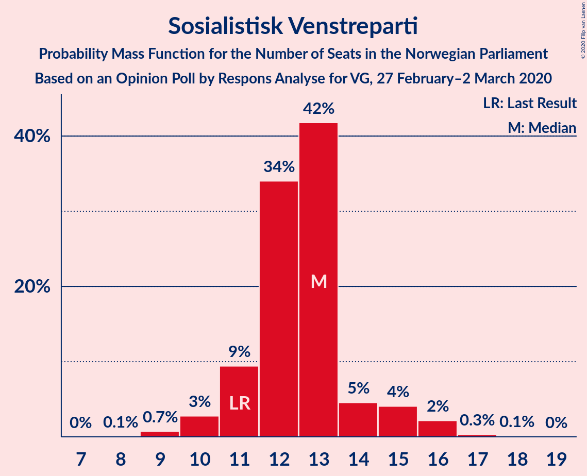

| Number of Seats | Probability | Accumulated | Special Marks |
|:---------------:|:-----------:|:-----------:|:-------------:|
| 8 | 0.1% | 100% |  |
| 9 | 0.6% | 99.9% |  |
| 10 | 9% | 99.3% |  |
| 11 | 15% | 90% | Last Result |
| 12 | 14% | 75% |  |
| 13 | 42% | 61% | Median |
| 14 | 10% | 19% |  |
| 15 | 5% | 9% |  |
| 16 | 3% | 4% |  |
| 17 | 0.8% | 1.0% |  |
| 18 | 0.2% | 0.2% |  |
| 19 | 0% | 0% |  |

### Rødt

*For a full overview of the results for this party, see the [Rødt](party-rødt.html) page.*

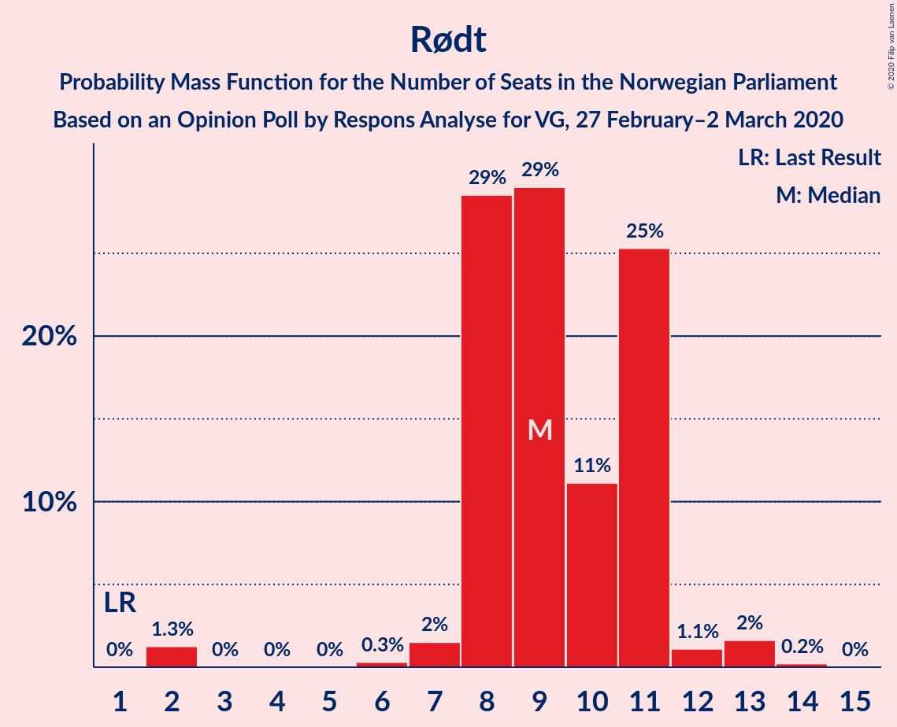

| Number of Seats | Probability | Accumulated | Special Marks |
|:---------------:|:-----------:|:-----------:|:-------------:|
| 1 | 0% | 100% | Last Result |
| 2 | 1.0% | 100% |  |
| 3 | 0% | 99.0% |  |
| 4 | 0% | 99.0% |  |
| 5 | 0% | 99.0% |  |
| 6 | 0.2% | 99.0% |  |
| 7 | 2% | 98.7% |  |
| 8 | 23% | 97% |  |
| 9 | 34% | 74% | Median |
| 10 | 20% | 40% |  |
| 11 | 15% | 20% |  |
| 12 | 3% | 5% |  |
| 13 | 1.2% | 1.5% |  |
| 14 | 0.3% | 0.3% |  |
| 15 | 0% | 0% |  |

### Miljøpartiet De Grønne

*For a full overview of the results for this party, see the [Miljøpartiet De Grønne](party-miljøpartietdegrønne.html) page.*

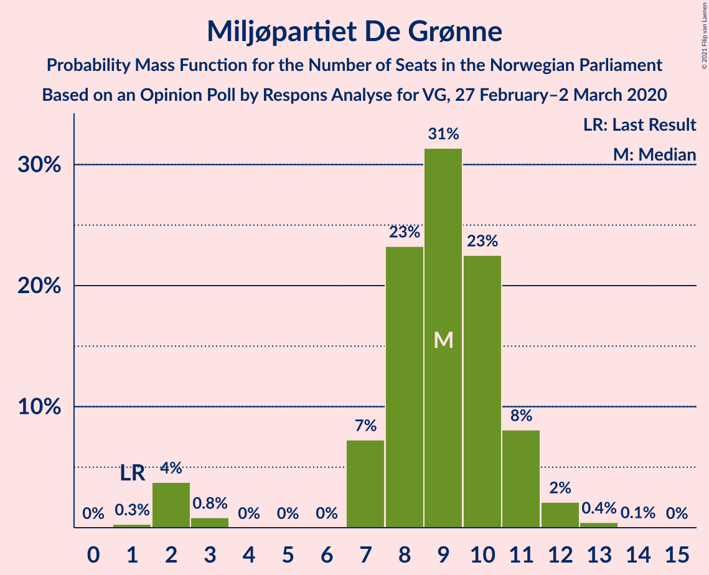

| Number of Seats | Probability | Accumulated | Special Marks |
|:---------------:|:-----------:|:-----------:|:-------------:|
| 1 | 0.3% | 100% | Last Result |
| 2 | 4% | 99.7% |  |
| 3 | 0.8% | 96% |  |
| 4 | 0% | 95% |  |
| 5 | 0% | 95% |  |
| 6 | 0% | 95% |  |
| 7 | 7% | 95% |  |
| 8 | 23% | 88% |  |
| 9 | 31% | 65% | Median |
| 10 | 23% | 33% |  |
| 11 | 8% | 11% |  |
| 12 | 2% | 3% |  |
| 13 | 0.4% | 0.5% |  |
| 14 | 0.1% | 0.1% |  |
| 15 | 0% | 0% |  |

### Kristelig Folkeparti

*For a full overview of the results for this party, see the [Kristelig Folkeparti](party-kristeligfolkeparti.html) page.*

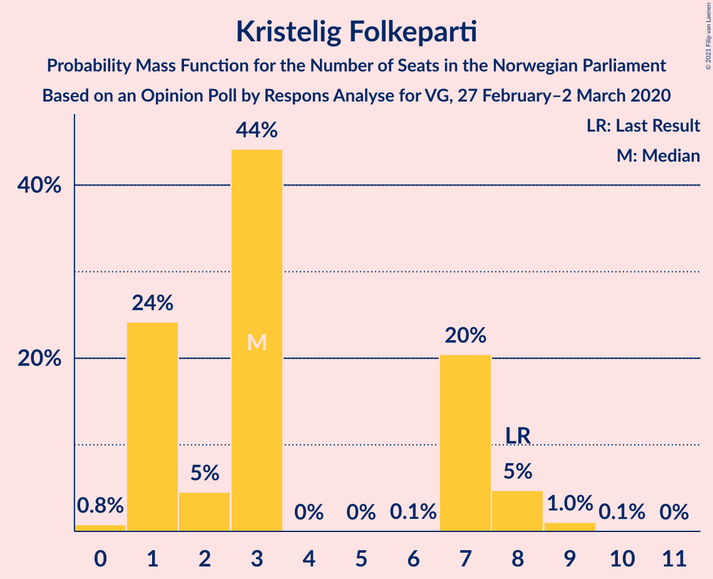

| Number of Seats | Probability | Accumulated | Special Marks |
|:---------------:|:-----------:|:-----------:|:-------------:|
| 0 | 0.8% | 100% |  |
| 1 | 24% | 99.2% |  |
| 2 | 5% | 75% |  |
| 3 | 44% | 70% | Median |
| 4 | 0% | 26% |  |
| 5 | 0% | 26% |  |
| 6 | 0.1% | 26% |  |
| 7 | 20% | 26% |  |
| 8 | 5% | 6% | Last Result |
| 9 | 1.0% | 1.1% |  |
| 10 | 0.1% | 0.1% |  |
| 11 | 0% | 0% |  |

### Venstre

*For a full overview of the results for this party, see the [Venstre](party-venstre.html) page.*

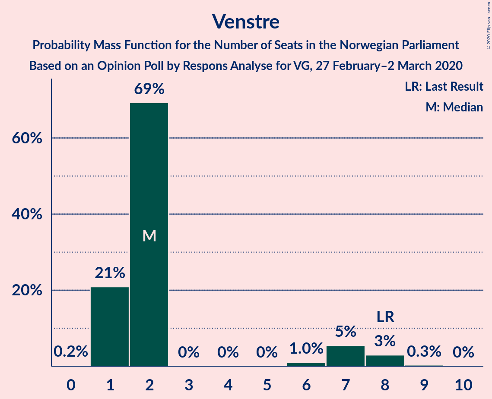

| Number of Seats | Probability | Accumulated | Special Marks |
|:---------------:|:-----------:|:-----------:|:-------------:|
| 0 | 0.2% | 100% |  |
| 1 | 21% | 99.8% |  |
| 2 | 69% | 79% | Median |
| 3 | 0% | 10% |  |
| 4 | 0% | 10% |  |
| 5 | 0% | 10% |  |
| 6 | 1.0% | 10% |  |
| 7 | 5% | 9% |  |
| 8 | 3% | 3% | Last Result |
| 9 | 0.3% | 0.3% |  |
| 10 | 0% | 0% |  |

## Coalitions

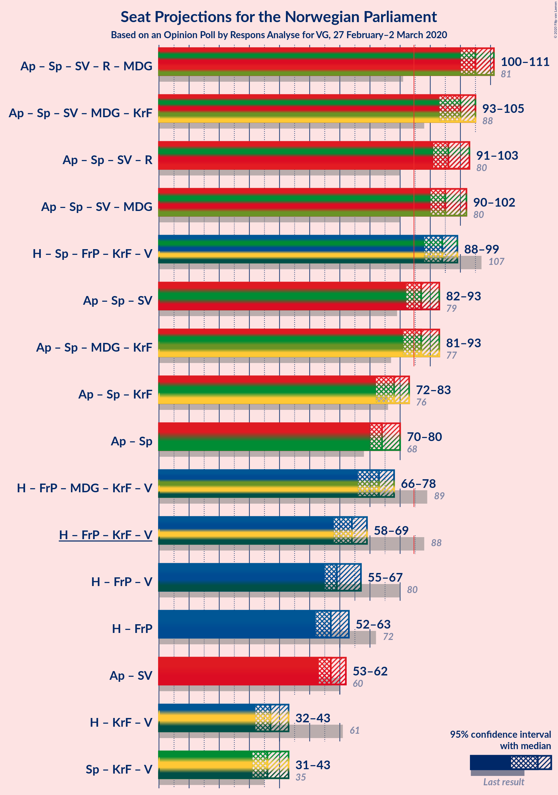

### Confidence Intervals

| Coalition | Last Result | Median | Majority? | 80% Confidence Interval | 90% Confidence Interval | 95% Confidence Interval | 99% Confidence Interval |
|:---------:|:-----------:|:------:|:---------:|:-----------------------:|:-----------------------:|:-----------------------:|:-----------------------:|
| Arbeiderpartiet – Senterpartiet – Sosialistisk Venstreparti – Rødt – Miljøpartiet De Grønne | 81 | 105 | 100% | 101–109 | 100–110 | 100–111 | 97–113 |
| Arbeiderpartiet – Senterpartiet – Sosialistisk Venstreparti – Miljøpartiet De Grønne – Kristelig Folkeparti | 88 | 100 | 100% | 95–102 | 94–104 | 93–105 | 92–107 |
| Arbeiderpartiet – Senterpartiet – Sosialistisk Venstreparti – Rødt | 80 | 96 | 100% | 93–100 | 92–102 | 91–103 | 89–106 |
| Arbeiderpartiet – Senterpartiet – Sosialistisk Venstreparti – Miljøpartiet De Grønne | 80 | 95 | 100% | 92–99 | 91–101 | 90–102 | 88–105 |
| Høyre – Senterpartiet – Fremskrittspartiet – Kristelig Folkeparti – Venstre | 107 | 94 | 99.9% | 90–97 | 89–98 | 88–99 | 86–102 |
| Arbeiderpartiet – Senterpartiet – Sosialistisk Venstreparti | 79 | 87 | 83% | 84–91 | 83–92 | 82–93 | 80–95 |
| Arbeiderpartiet – Senterpartiet – Miljøpartiet De Grønne – Kristelig Folkeparti | 77 | 87 | 72% | 83–91 | 82–91 | 81–93 | 79–95 |
| Arbeiderpartiet – Senterpartiet – Kristelig Folkeparti | 76 | 78 | 2% | 74–82 | 73–82 | 72–83 | 70–86 |
| Arbeiderpartiet – Senterpartiet | 68 | 74 | 0.1% | 71–78 | 70–79 | 70–80 | 68–82 |
| Høyre – Fremskrittspartiet – Miljøpartiet De Grønne – Kristelig Folkeparti – Venstre | 89 | 73 | 0% | 69–76 | 67–77 | 66–78 | 63–80 |
| Høyre – Fremskrittspartiet – Kristelig Folkeparti – Venstre | 88 | 64 | 0% | 60–68 | 59–69 | 58–69 | 56–72 |
| Høyre – Fremskrittspartiet – Venstre | 80 | 59 | 0% | 57–64 | 56–65 | 55–67 | 53–68 |
| Høyre – Fremskrittspartiet | 72 | 57 | 0% | 54–62 | 53–62 | 52–63 | 50–64 |
| Arbeiderpartiet – Sosialistisk Venstreparti | 60 | 57 | 0% | 54–60 | 53–61 | 53–62 | 51–65 |
| Høyre – Kristelig Folkeparti – Venstre | 61 | 37 | 0% | 34–41 | 34–43 | 32–43 | 31–45 |
| Senterpartiet – Kristelig Folkeparti – Venstre | 35 | 36 | 0% | 32–39 | 32–41 | 31–43 | 29–45 |

### Arbeiderpartiet – Senterpartiet – Sosialistisk Venstreparti – Rødt – Miljøpartiet De Grønne

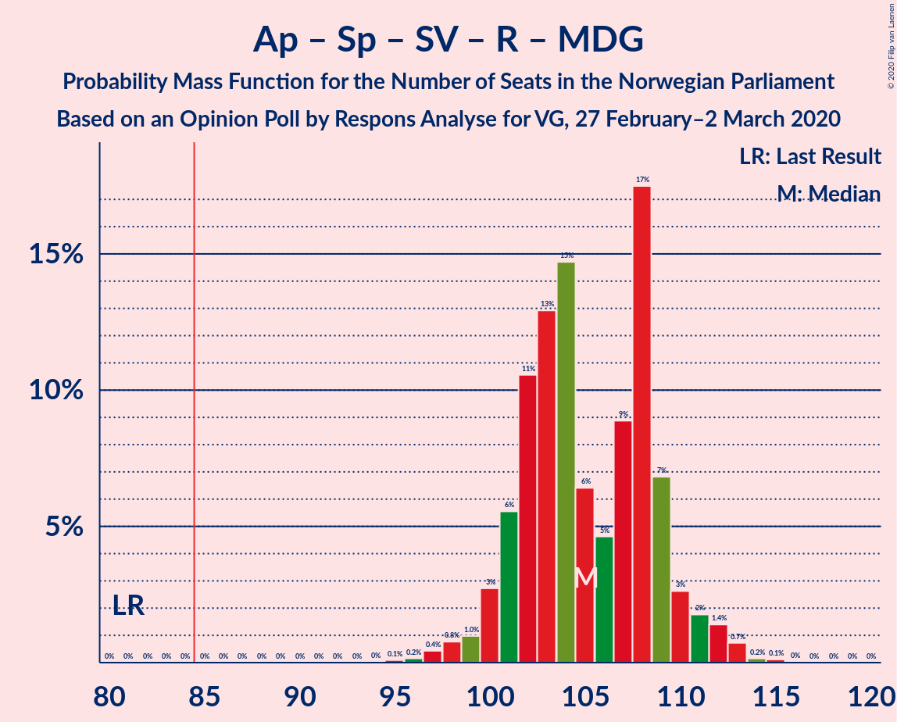

| Number of Seats | Probability | Accumulated | Special Marks |
|:---------------:|:-----------:|:-----------:|:-------------:|
| 81 | 0% | 100% | Last Result |
| 82 | 0% | 100% |  |
| 83 | 0% | 100% |  |
| 84 | 0% | 100% |  |
| 85 | 0% | 100% | Majority |
| 86 | 0% | 100% |  |
| 87 | 0% | 100% |  |
| 88 | 0% | 100% |  |
| 89 | 0% | 100% |  |
| 90 | 0% | 100% |  |
| 91 | 0% | 100% |  |
| 92 | 0% | 100% |  |
| 93 | 0% | 100% |  |
| 94 | 0% | 100% |  |
| 95 | 0.1% | 100% |  |
| 96 | 0.2% | 99.9% |  |
| 97 | 0.4% | 99.7% |  |
| 98 | 0.8% | 99.3% |  |
| 99 | 1.0% | 98.5% |  |
| 100 | 3% | 98% |  |
| 101 | 6% | 95% |  |
| 102 | 11% | 89% |  |
| 103 | 13% | 79% |  |
| 104 | 15% | 66% |  |
| 105 | 6% | 51% | Median |
| 106 | 5% | 45% |  |
| 107 | 9% | 40% |  |
| 108 | 17% | 31% |  |
| 109 | 7% | 14% |  |
| 110 | 3% | 7% |  |
| 111 | 2% | 4% |  |
| 112 | 1.4% | 2% |  |
| 113 | 0.7% | 1.0% |  |
| 114 | 0.2% | 0.3% |  |
| 115 | 0.1% | 0.1% |  |
| 116 | 0% | 0% |  |

### Arbeiderpartiet – Senterpartiet – Sosialistisk Venstreparti – Miljøpartiet De Grønne – Kristelig Folkeparti

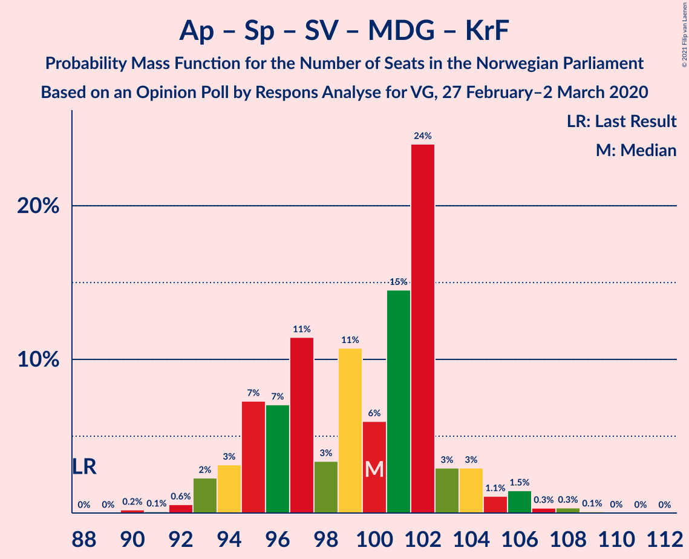

| Number of Seats | Probability | Accumulated | Special Marks |
|:---------------:|:-----------:|:-----------:|:-------------:|
| 88 | 0% | 100% | Last Result |
| 89 | 0% | 100% |  |
| 90 | 0.2% | 100% |  |
| 91 | 0.1% | 99.8% |  |
| 92 | 0.6% | 99.7% |  |
| 93 | 2% | 99.1% |  |
| 94 | 3% | 97% |  |
| 95 | 7% | 94% |  |
| 96 | 7% | 86% |  |
| 97 | 11% | 79% |  |
| 98 | 3% | 68% |  |
| 99 | 11% | 65% | Median |
| 100 | 6% | 54% |  |
| 101 | 15% | 48% |  |
| 102 | 24% | 33% |  |
| 103 | 3% | 9% |  |
| 104 | 3% | 6% |  |
| 105 | 1.1% | 3% |  |
| 106 | 1.5% | 2% |  |
| 107 | 0.3% | 0.8% |  |
| 108 | 0.3% | 0.5% |  |
| 109 | 0.1% | 0.2% |  |
| 110 | 0% | 0.1% |  |
| 111 | 0% | 0% |  |

### Arbeiderpartiet – Senterpartiet – Sosialistisk Venstreparti – Rødt

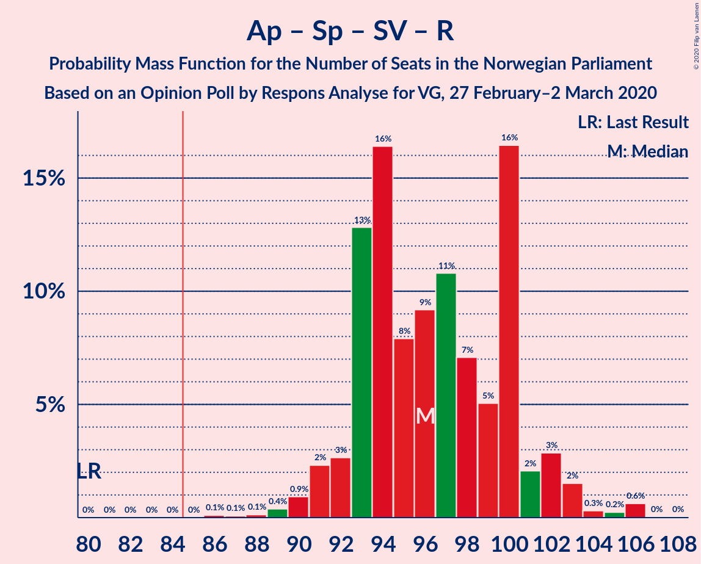

| Number of Seats | Probability | Accumulated | Special Marks |
|:---------------:|:-----------:|:-----------:|:-------------:|
| 80 | 0% | 100% | Last Result |
| 81 | 0% | 100% |  |
| 82 | 0% | 100% |  |
| 83 | 0% | 100% |  |
| 84 | 0% | 100% |  |
| 85 | 0% | 100% | Majority |
| 86 | 0.1% | 100% |  |
| 87 | 0.1% | 99.9% |  |
| 88 | 0.1% | 99.8% |  |
| 89 | 0.4% | 99.7% |  |
| 90 | 0.9% | 99.3% |  |
| 91 | 2% | 98% |  |
| 92 | 3% | 96% |  |
| 93 | 13% | 93% |  |
| 94 | 16% | 81% |  |
| 95 | 8% | 64% |  |
| 96 | 9% | 56% | Median |
| 97 | 11% | 47% |  |
| 98 | 7% | 36% |  |
| 99 | 5% | 29% |  |
| 100 | 16% | 24% |  |
| 101 | 2% | 8% |  |
| 102 | 3% | 6% |  |
| 103 | 2% | 3% |  |
| 104 | 0.3% | 1.2% |  |
| 105 | 0.2% | 0.9% |  |
| 106 | 0.6% | 0.7% |  |
| 107 | 0% | 0.1% |  |
| 108 | 0% | 0% |  |

### Arbeiderpartiet – Senterpartiet – Sosialistisk Venstreparti – Miljøpartiet De Grønne

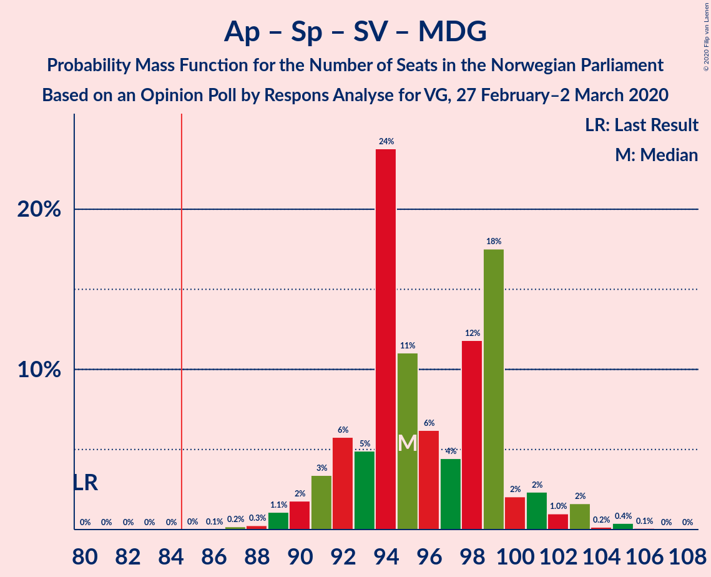

| Number of Seats | Probability | Accumulated | Special Marks |
|:---------------:|:-----------:|:-----------:|:-------------:|
| 80 | 0% | 100% | Last Result |
| 81 | 0% | 100% |  |
| 82 | 0% | 100% |  |
| 83 | 0% | 100% |  |
| 84 | 0% | 100% |  |
| 85 | 0% | 100% | Majority |
| 86 | 0.1% | 100% |  |
| 87 | 0.2% | 99.9% |  |
| 88 | 0.3% | 99.7% |  |
| 89 | 1.1% | 99.5% |  |
| 90 | 2% | 98% |  |
| 91 | 3% | 97% |  |
| 92 | 6% | 93% |  |
| 93 | 5% | 87% |  |
| 94 | 24% | 83% |  |
| 95 | 11% | 59% |  |
| 96 | 6% | 48% | Median |
| 97 | 4% | 41% |  |
| 98 | 12% | 37% |  |
| 99 | 18% | 25% |  |
| 100 | 2% | 8% |  |
| 101 | 2% | 6% |  |
| 102 | 1.0% | 3% |  |
| 103 | 2% | 2% |  |
| 104 | 0.2% | 0.7% |  |
| 105 | 0.4% | 0.5% |  |
| 106 | 0.1% | 0.1% |  |
| 107 | 0% | 0% |  |

### Høyre – Senterpartiet – Fremskrittspartiet – Kristelig Folkeparti – Venstre

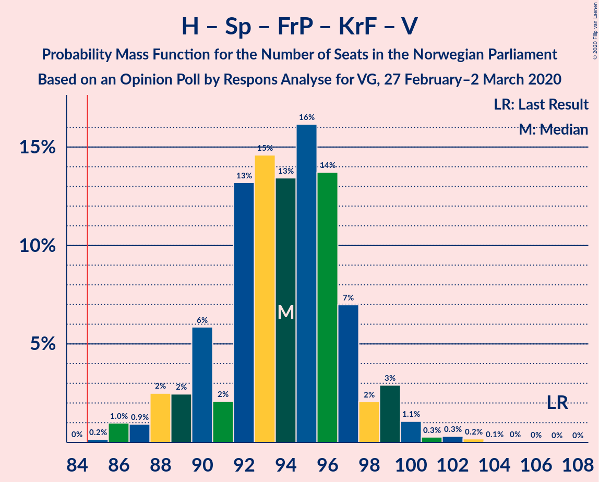

| Number of Seats | Probability | Accumulated | Special Marks |
|:---------------:|:-----------:|:-----------:|:-------------:|
| 84 | 0% | 100% |  |
| 85 | 0.2% | 99.9% | Majority |
| 86 | 1.0% | 99.8% |  |
| 87 | 0.9% | 98.8% |  |
| 88 | 2% | 98% |  |
| 89 | 2% | 95% |  |
| 90 | 6% | 93% |  |
| 91 | 2% | 87% |  |
| 92 | 13% | 85% |  |
| 93 | 15% | 72% | Median |
| 94 | 13% | 57% |  |
| 95 | 16% | 44% |  |
| 96 | 14% | 28% |  |
| 97 | 7% | 14% |  |
| 98 | 2% | 7% |  |
| 99 | 3% | 5% |  |
| 100 | 1.1% | 2% |  |
| 101 | 0.3% | 0.9% |  |
| 102 | 0.3% | 0.6% |  |
| 103 | 0.2% | 0.3% |  |
| 104 | 0.1% | 0.1% |  |
| 105 | 0% | 0.1% |  |
| 106 | 0% | 0% |  |
| 107 | 0% | 0% | Last Result |

### Arbeiderpartiet – Senterpartiet – Sosialistisk Venstreparti

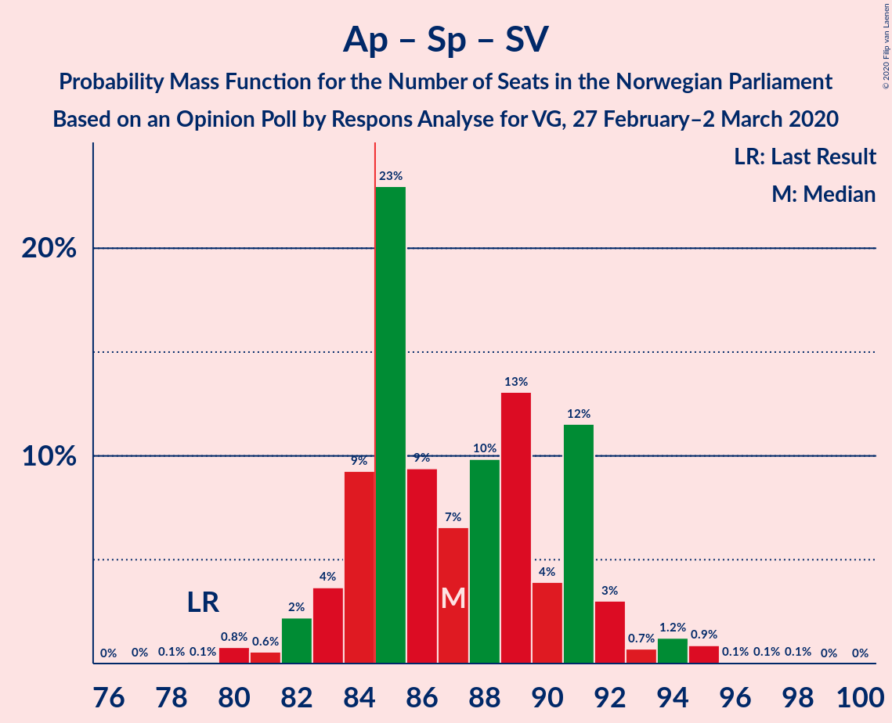

| Number of Seats | Probability | Accumulated | Special Marks |
|:---------------:|:-----------:|:-----------:|:-------------:|
| 78 | 0.1% | 100% |  |
| 79 | 0.1% | 99.9% | Last Result |
| 80 | 0.8% | 99.9% |  |
| 81 | 0.6% | 99.1% |  |
| 82 | 2% | 98.5% |  |
| 83 | 4% | 96% |  |
| 84 | 9% | 93% |  |
| 85 | 23% | 83% | Majority |
| 86 | 9% | 60% |  |
| 87 | 7% | 51% | Median |
| 88 | 10% | 44% |  |
| 89 | 13% | 35% |  |
| 90 | 4% | 21% |  |
| 91 | 12% | 18% |  |
| 92 | 3% | 6% |  |
| 93 | 0.7% | 3% |  |
| 94 | 1.2% | 2% |  |
| 95 | 0.9% | 1.1% |  |
| 96 | 0.1% | 0.2% |  |
| 97 | 0.1% | 0.1% |  |
| 98 | 0.1% | 0.1% |  |
| 99 | 0% | 0% |  |

### Arbeiderpartiet – Senterpartiet – Miljøpartiet De Grønne – Kristelig Folkeparti

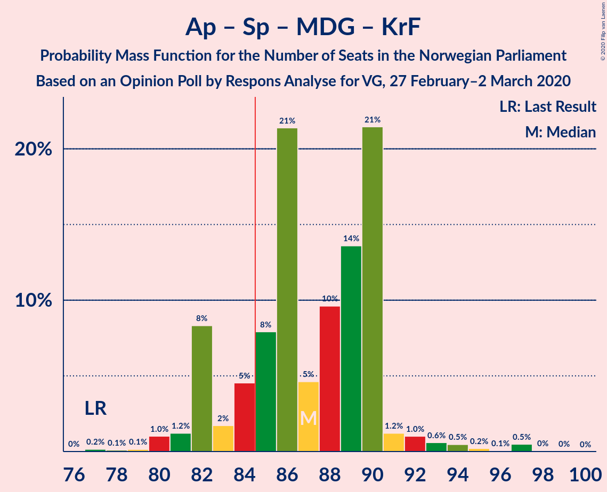

| Number of Seats | Probability | Accumulated | Special Marks |
|:---------------:|:-----------:|:-----------:|:-------------:|
| 76 | 0% | 100% |  |
| 77 | 0.1% | 99.9% | Last Result |
| 78 | 0.2% | 99.9% |  |
| 79 | 0.4% | 99.6% |  |
| 80 | 1.1% | 99.2% |  |
| 81 | 3% | 98% |  |
| 82 | 5% | 95% |  |
| 83 | 3% | 90% |  |
| 84 | 15% | 87% |  |
| 85 | 8% | 72% | Majority |
| 86 | 10% | 65% | Median |
| 87 | 11% | 55% |  |
| 88 | 5% | 44% |  |
| 89 | 19% | 39% |  |
| 90 | 7% | 19% |  |
| 91 | 9% | 13% |  |
| 92 | 1.2% | 4% |  |
| 93 | 0.9% | 3% |  |
| 94 | 1.0% | 2% |  |
| 95 | 0.4% | 0.7% |  |
| 96 | 0.1% | 0.3% |  |
| 97 | 0.2% | 0.2% |  |
| 98 | 0% | 0% |  |

### Arbeiderpartiet – Senterpartiet – Kristelig Folkeparti

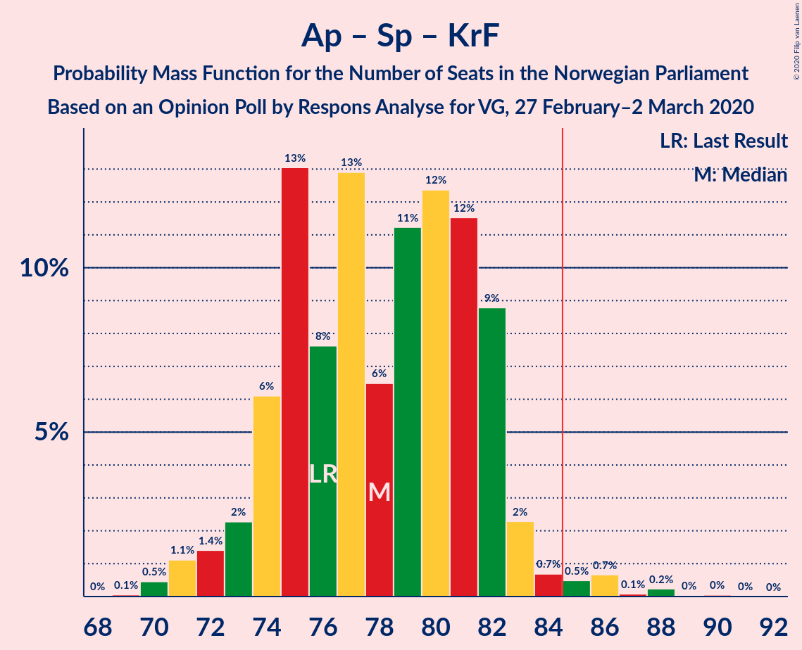

| Number of Seats | Probability | Accumulated | Special Marks |
|:---------------:|:-----------:|:-----------:|:-------------:|
| 69 | 0.1% | 100% |  |
| 70 | 0.5% | 99.9% |  |
| 71 | 1.1% | 99.4% |  |
| 72 | 1.4% | 98% |  |
| 73 | 2% | 97% |  |
| 74 | 6% | 95% |  |
| 75 | 13% | 89% |  |
| 76 | 8% | 75% | Last Result |
| 77 | 13% | 68% | Median |
| 78 | 6% | 55% |  |
| 79 | 11% | 48% |  |
| 80 | 12% | 37% |  |
| 81 | 12% | 25% |  |
| 82 | 9% | 13% |  |
| 83 | 2% | 5% |  |
| 84 | 0.7% | 2% |  |
| 85 | 0.5% | 2% | Majority |
| 86 | 0.7% | 1.1% |  |
| 87 | 0.1% | 0.4% |  |
| 88 | 0.2% | 0.3% |  |
| 89 | 0% | 0.1% |  |
| 90 | 0% | 0.1% |  |
| 91 | 0% | 0% |  |

### Arbeiderpartiet – Senterpartiet

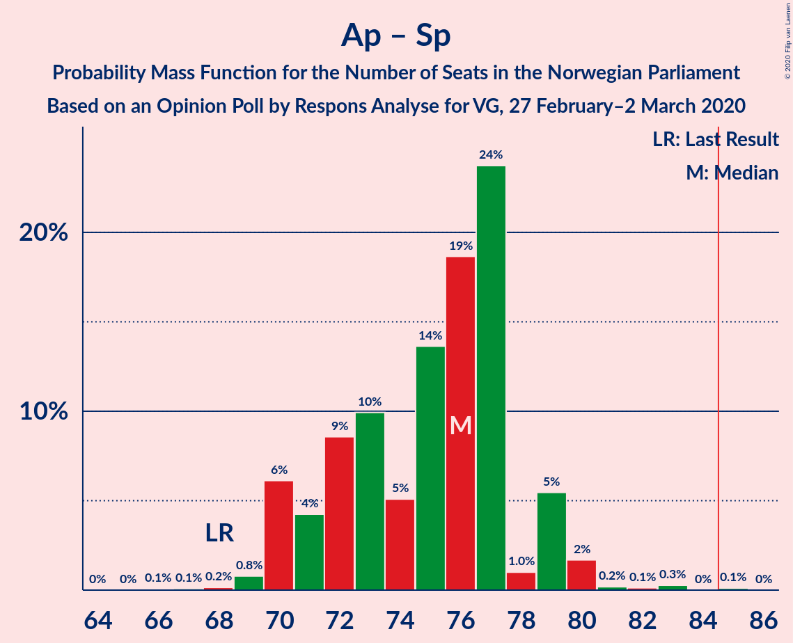

| Number of Seats | Probability | Accumulated | Special Marks |
|:---------------:|:-----------:|:-----------:|:-------------:|
| 65 | 0% | 100% |  |
| 66 | 0% | 99.9% |  |
| 67 | 0.2% | 99.9% |  |
| 68 | 0.6% | 99.7% | Last Result |
| 69 | 0.8% | 99.1% |  |
| 70 | 3% | 98% |  |
| 71 | 6% | 95% |  |
| 72 | 19% | 89% |  |
| 73 | 8% | 70% |  |
| 74 | 12% | 62% | Median |
| 75 | 16% | 50% |  |
| 76 | 10% | 34% |  |
| 77 | 7% | 25% |  |
| 78 | 10% | 18% |  |
| 79 | 3% | 8% |  |
| 80 | 3% | 5% |  |
| 81 | 0.8% | 1.3% |  |
| 82 | 0.3% | 0.5% |  |
| 83 | 0.1% | 0.2% |  |
| 84 | 0% | 0.1% |  |
| 85 | 0.1% | 0.1% | Majority |
| 86 | 0% | 0% |  |

### Høyre – Fremskrittspartiet – Miljøpartiet De Grønne – Kristelig Folkeparti – Venstre

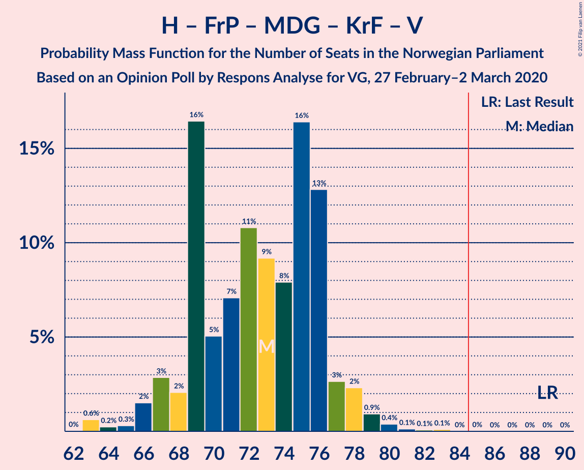

| Number of Seats | Probability | Accumulated | Special Marks |
|:---------------:|:-----------:|:-----------:|:-------------:|
| 62 | 0% | 100% |  |
| 63 | 0.6% | 99.9% |  |
| 64 | 0.2% | 99.3% |  |
| 65 | 0.3% | 99.1% |  |
| 66 | 2% | 98.8% |  |
| 67 | 3% | 97% |  |
| 68 | 2% | 94% |  |
| 69 | 16% | 92% |  |
| 70 | 5% | 76% |  |
| 71 | 7% | 71% |  |
| 72 | 11% | 64% | Median |
| 73 | 9% | 53% |  |
| 74 | 8% | 44% |  |
| 75 | 16% | 36% |  |
| 76 | 13% | 19% |  |
| 77 | 3% | 7% |  |
| 78 | 2% | 4% |  |
| 79 | 0.9% | 2% |  |
| 80 | 0.4% | 0.7% |  |
| 81 | 0.1% | 0.3% |  |
| 82 | 0.1% | 0.2% |  |
| 83 | 0.1% | 0.1% |  |
| 84 | 0% | 0% |  |
| 85 | 0% | 0% | Majority |
| 86 | 0% | 0% |  |
| 87 | 0% | 0% |  |
| 88 | 0% | 0% |  |
| 89 | 0% | 0% | Last Result |

### Høyre – Fremskrittspartiet – Kristelig Folkeparti – Venstre

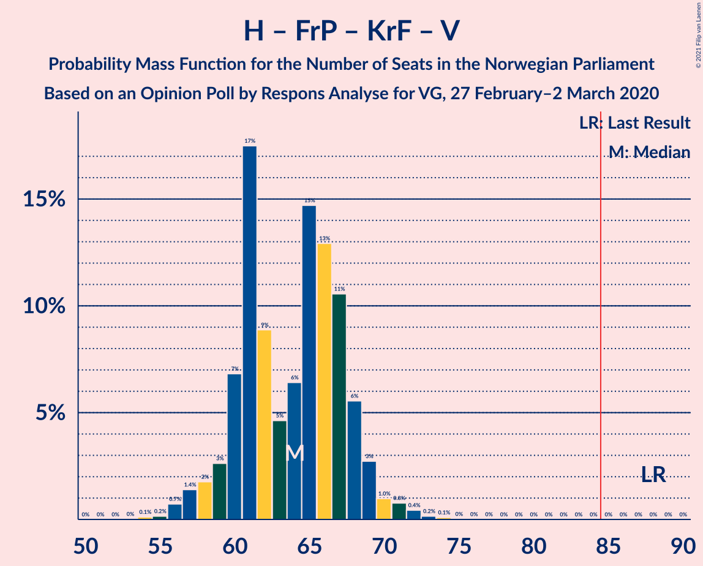

| Number of Seats | Probability | Accumulated | Special Marks |
|:---------------:|:-----------:|:-----------:|:-------------:|
| 54 | 0.1% | 100% |  |
| 55 | 0.2% | 99.9% |  |
| 56 | 0.7% | 99.7% |  |
| 57 | 1.4% | 99.0% |  |
| 58 | 2% | 98% |  |
| 59 | 3% | 96% |  |
| 60 | 7% | 93% |  |
| 61 | 17% | 86% |  |
| 62 | 9% | 69% |  |
| 63 | 5% | 60% | Median |
| 64 | 6% | 55% |  |
| 65 | 15% | 49% |  |
| 66 | 13% | 34% |  |
| 67 | 11% | 21% |  |
| 68 | 6% | 11% |  |
| 69 | 3% | 5% |  |
| 70 | 1.0% | 2% |  |
| 71 | 0.8% | 1.5% |  |
| 72 | 0.4% | 0.7% |  |
| 73 | 0.2% | 0.3% |  |
| 74 | 0.1% | 0.1% |  |
| 75 | 0% | 0% |  |
| 76 | 0% | 0% |  |
| 77 | 0% | 0% |  |
| 78 | 0% | 0% |  |
| 79 | 0% | 0% |  |
| 80 | 0% | 0% |  |
| 81 | 0% | 0% |  |
| 82 | 0% | 0% |  |
| 83 | 0% | 0% |  |
| 84 | 0% | 0% |  |
| 85 | 0% | 0% | Majority |
| 86 | 0% | 0% |  |
| 87 | 0% | 0% |  |
| 88 | 0% | 0% | Last Result |

### Høyre – Fremskrittspartiet – Venstre

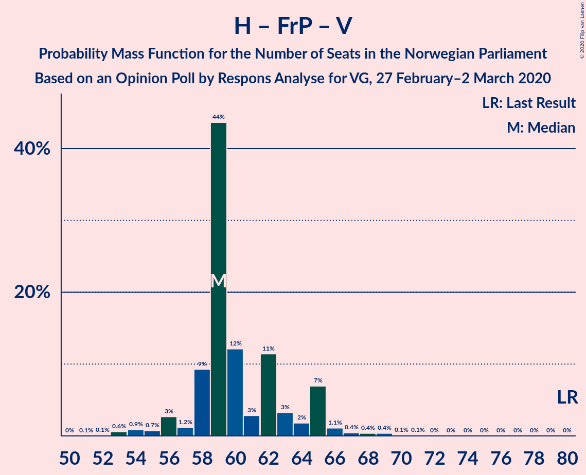

| Number of Seats | Probability | Accumulated | Special Marks |
|:---------------:|:-----------:|:-----------:|:-------------:|
| 51 | 0.1% | 100% |  |
| 52 | 0.4% | 99.9% |  |
| 53 | 1.0% | 99.5% |  |
| 54 | 0.8% | 98.6% |  |
| 55 | 2% | 98% |  |
| 56 | 4% | 96% |  |
| 57 | 4% | 92% |  |
| 58 | 22% | 89% |  |
| 59 | 21% | 66% |  |
| 60 | 7% | 46% | Median |
| 61 | 4% | 39% |  |
| 62 | 7% | 34% |  |
| 63 | 5% | 27% |  |
| 64 | 14% | 23% |  |
| 65 | 5% | 8% |  |
| 66 | 1.0% | 4% |  |
| 67 | 0.8% | 3% |  |
| 68 | 1.4% | 2% |  |
| 69 | 0.3% | 0.4% |  |
| 70 | 0% | 0.1% |  |
| 71 | 0% | 0.1% |  |
| 72 | 0% | 0% |  |
| 73 | 0% | 0% |  |
| 74 | 0% | 0% |  |
| 75 | 0% | 0% |  |
| 76 | 0% | 0% |  |
| 77 | 0% | 0% |  |
| 78 | 0% | 0% |  |
| 79 | 0% | 0% |  |
| 80 | 0% | 0% | Last Result |

### Høyre – Fremskrittspartiet

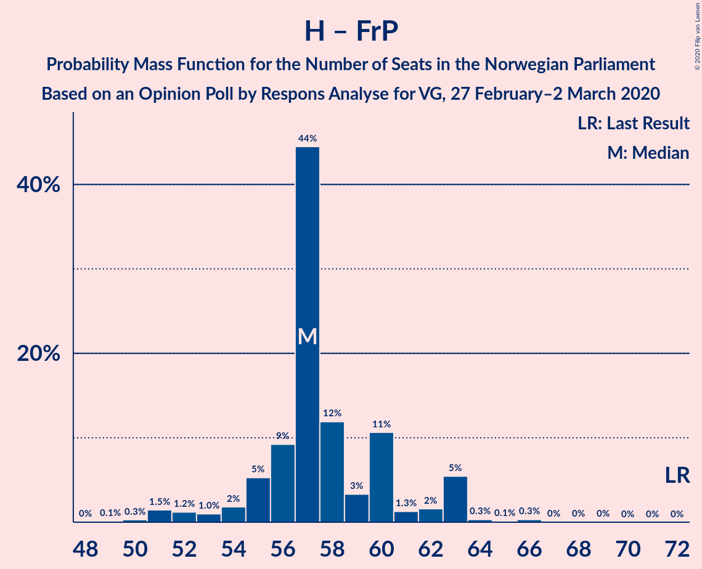

| Number of Seats | Probability | Accumulated | Special Marks |
|:---------------:|:-----------:|:-----------:|:-------------:|
| 48 | 0.1% | 100% |  |
| 49 | 0.1% | 99.9% |  |
| 50 | 0.6% | 99.8% |  |
| 51 | 1.2% | 99.3% |  |
| 52 | 0.7% | 98% |  |
| 53 | 3% | 97% |  |
| 54 | 4% | 94% |  |
| 55 | 5% | 90% |  |
| 56 | 9% | 85% |  |
| 57 | 35% | 76% |  |
| 58 | 6% | 41% | Median |
| 59 | 4% | 34% |  |
| 60 | 7% | 30% |  |
| 61 | 3% | 24% |  |
| 62 | 16% | 21% |  |
| 63 | 4% | 5% |  |
| 64 | 0.4% | 0.8% |  |
| 65 | 0.2% | 0.4% |  |
| 66 | 0.2% | 0.2% |  |
| 67 | 0% | 0.1% |  |
| 68 | 0% | 0% |  |
| 69 | 0% | 0% |  |
| 70 | 0% | 0% |  |
| 71 | 0% | 0% |  |
| 72 | 0% | 0% | Last Result |

### Arbeiderpartiet – Sosialistisk Venstreparti

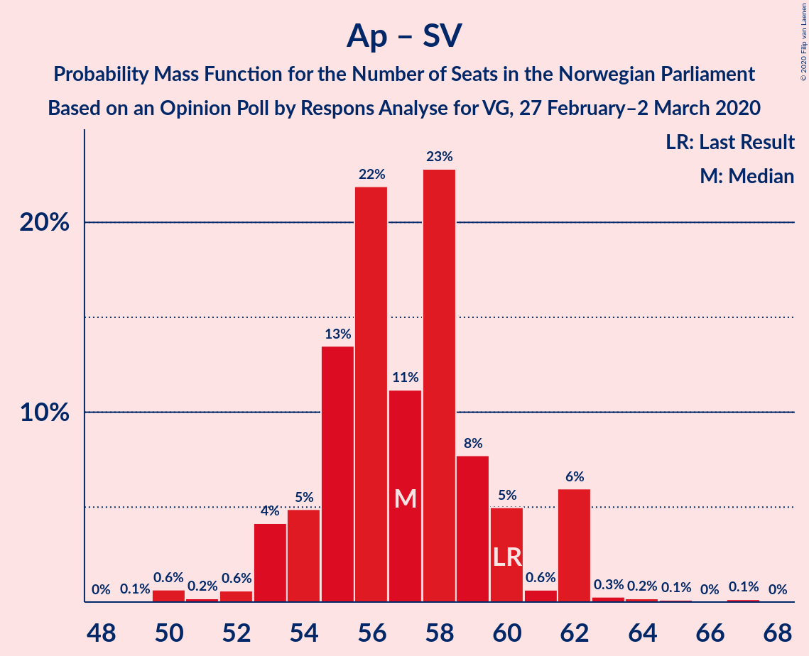

| Number of Seats | Probability | Accumulated | Special Marks |
|:---------------:|:-----------:|:-----------:|:-------------:|
| 49 | 0.1% | 100% |  |
| 50 | 0.3% | 99.9% |  |
| 51 | 0.3% | 99.6% |  |
| 52 | 0.7% | 99.3% |  |
| 53 | 4% | 98.6% |  |
| 54 | 9% | 94% |  |
| 55 | 14% | 86% |  |
| 56 | 17% | 71% |  |
| 57 | 17% | 54% | Median |
| 58 | 9% | 38% |  |
| 59 | 9% | 29% |  |
| 60 | 13% | 20% | Last Result |
| 61 | 3% | 7% |  |
| 62 | 2% | 4% |  |
| 63 | 0.5% | 2% |  |
| 64 | 0.2% | 2% |  |
| 65 | 1.3% | 1.4% |  |
| 66 | 0% | 0.1% |  |
| 67 | 0.1% | 0.1% |  |
| 68 | 0% | 0% |  |

### Høyre – Kristelig Folkeparti – Venstre

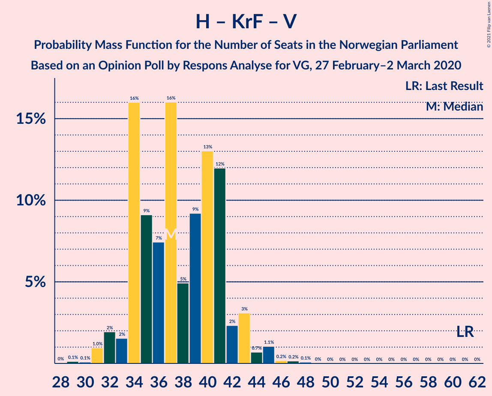

| Number of Seats | Probability | Accumulated | Special Marks |
|:---------------:|:-----------:|:-----------:|:-------------:|
| 29 | 0.1% | 100% |  |
| 30 | 0.1% | 99.8% |  |
| 31 | 1.0% | 99.7% |  |
| 32 | 2% | 98.8% |  |
| 33 | 2% | 97% |  |
| 34 | 16% | 95% |  |
| 35 | 9% | 79% |  |
| 36 | 7% | 70% |  |
| 37 | 16% | 63% | Median |
| 38 | 5% | 47% |  |
| 39 | 9% | 42% |  |
| 40 | 13% | 33% |  |
| 41 | 12% | 20% |  |
| 42 | 2% | 8% |  |
| 43 | 3% | 5% |  |
| 44 | 0.7% | 2% |  |
| 45 | 1.1% | 1.5% |  |
| 46 | 0.2% | 0.4% |  |
| 47 | 0.2% | 0.3% |  |
| 48 | 0.1% | 0.1% |  |
| 49 | 0% | 0% |  |
| 50 | 0% | 0% |  |
| 51 | 0% | 0% |  |
| 52 | 0% | 0% |  |
| 53 | 0% | 0% |  |
| 54 | 0% | 0% |  |
| 55 | 0% | 0% |  |
| 56 | 0% | 0% |  |
| 57 | 0% | 0% |  |
| 58 | 0% | 0% |  |
| 59 | 0% | 0% |  |
| 60 | 0% | 0% |  |
| 61 | 0% | 0% | Last Result |

### Senterpartiet – Kristelig Folkeparti – Venstre

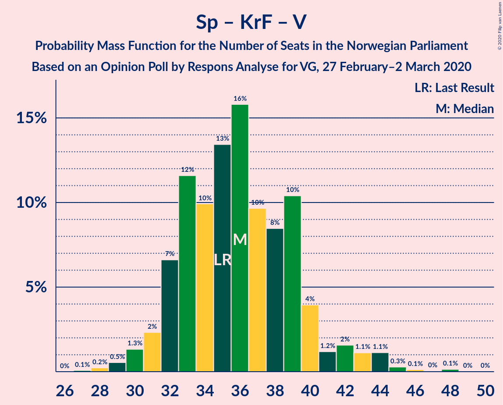

| Number of Seats | Probability | Accumulated | Special Marks |
|:---------------:|:-----------:|:-----------:|:-------------:|
| 27 | 0.1% | 100% |  |
| 28 | 0.2% | 99.9% |  |
| 29 | 0.5% | 99.7% |  |
| 30 | 1.3% | 99.1% |  |
| 31 | 2% | 98% |  |
| 32 | 7% | 95% |  |
| 33 | 12% | 89% |  |
| 34 | 10% | 77% |  |
| 35 | 13% | 67% | Last Result, Median |
| 36 | 16% | 54% |  |
| 37 | 10% | 38% |  |
| 38 | 8% | 28% |  |
| 39 | 10% | 20% |  |
| 40 | 4% | 10% |  |
| 41 | 1.2% | 6% |  |
| 42 | 2% | 4% |  |
| 43 | 1.1% | 3% |  |
| 44 | 1.1% | 2% |  |
| 45 | 0.3% | 0.6% |  |
| 46 | 0.1% | 0.4% |  |
| 47 | 0% | 0.2% |  |
| 48 | 0.1% | 0.2% |  |
| 49 | 0% | 0% |  |

## Technical Information

### Opinion Poll

+ **Polling firm:** Respons Analyse
+ **Commissioner(s):** VG
+ **Fieldwork period:** 27 February–2 March 2020

### Calculations

+ **Sample size:** 1000
+ **Simulations done:** 524,288
+ **Error estimate:** 2.58%

