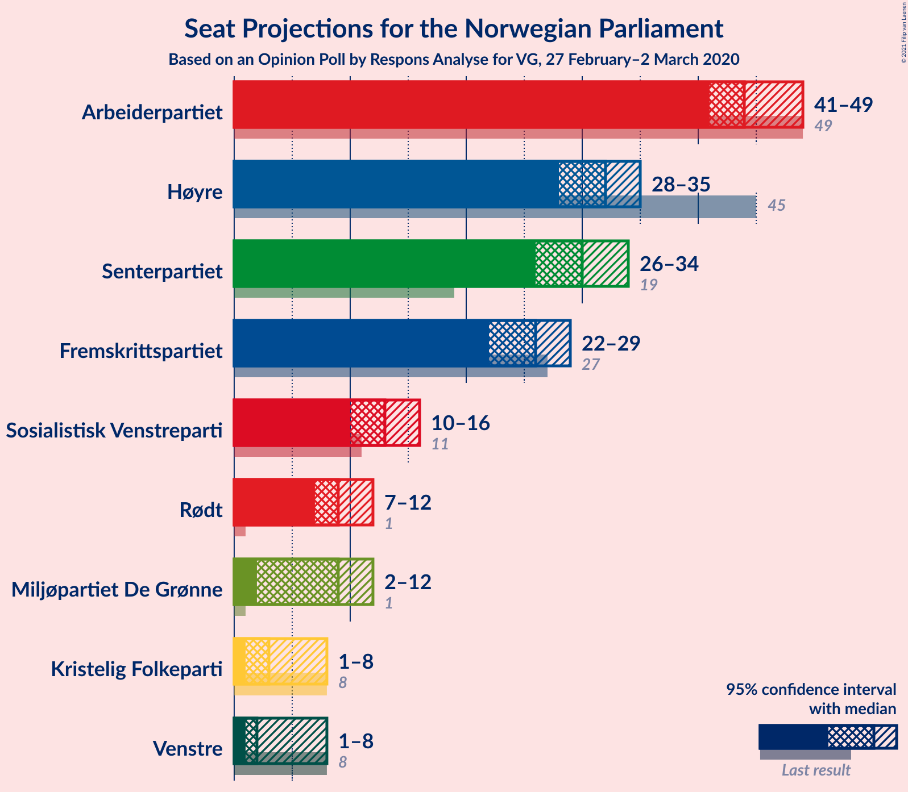
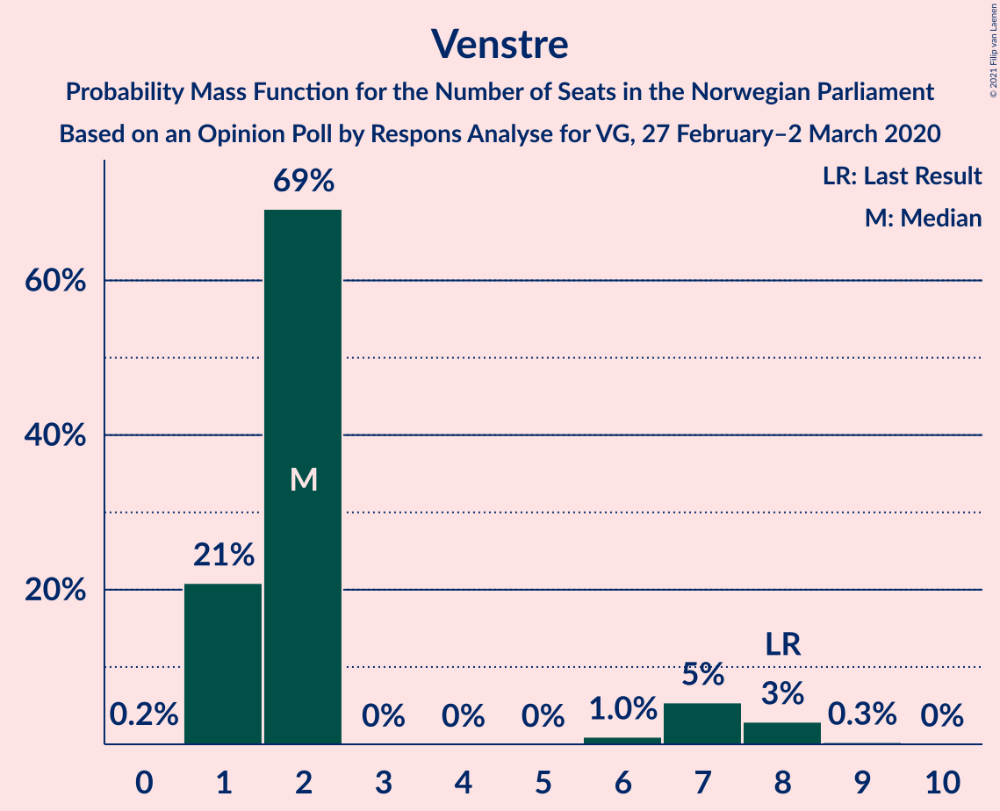
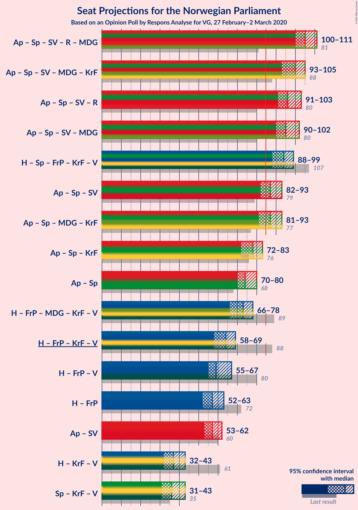
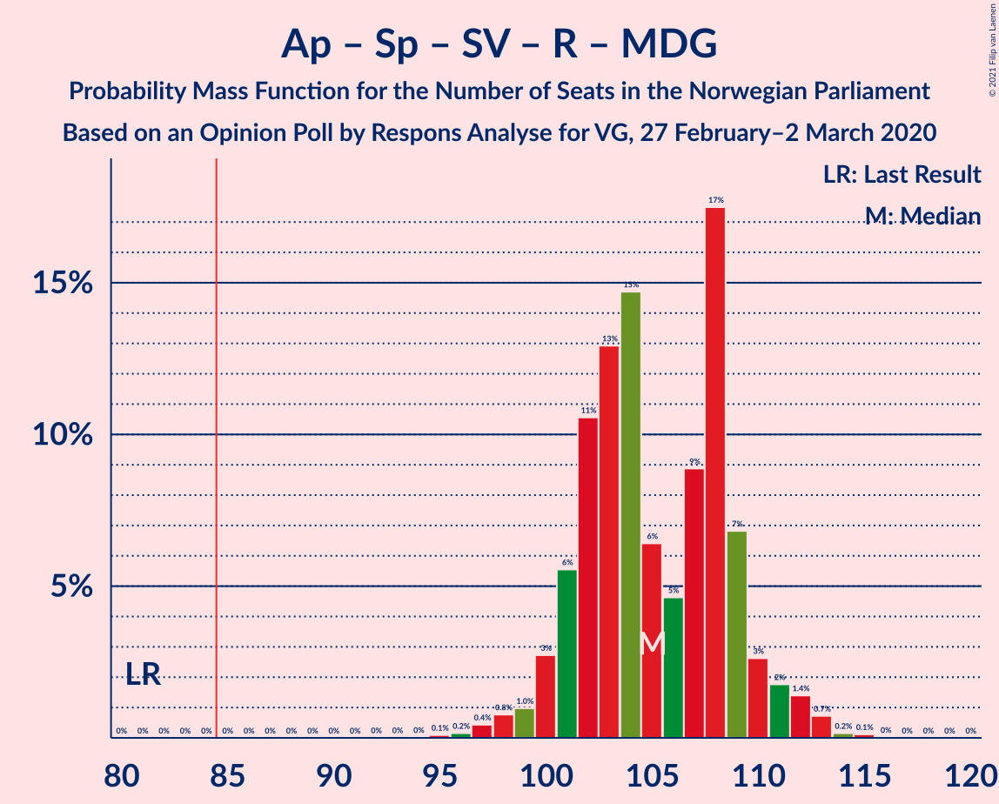
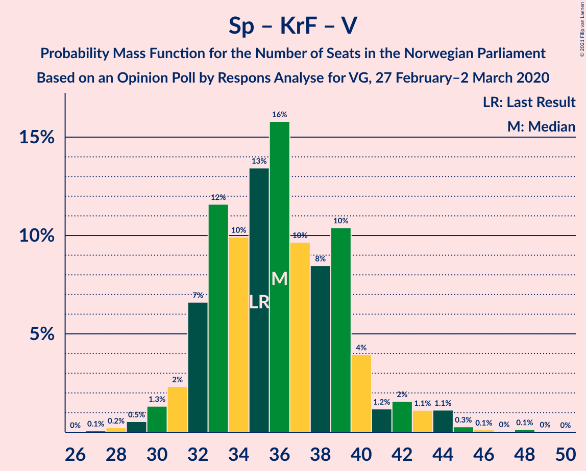

# Opinion Poll by Respons Analyse for VG, 27 February–2 March 2020

<a href="#voting-intentions">Voting Intentions</a> | <a href="#seats">Seats</a> | <a href="#coalitions">Coalitions</a> | <a href="#technical-information">Technical Information</a>

## Voting Intentions

### Confidence Intervals

| Party | Last Result | Poll Result | 80% Confidence Interval | 90% Confidence Interval | 95% Confidence Interval | 99% Confidence Interval |
|:-----:|:-----------:|:-----------:|:-----------------------:|:-----------------------:|:-----------------------:|:-----------------------:|
| Arbeiderpartiet | 27.4% | 24.9% | 23.2–26.7% |22.7–27.2% |22.3–27.7% |21.5–28.6% |
| Høyre | 25.0% | 17.9% | 16.4–19.5% |16.0–20.0% |15.6–20.4% |15.0–21.2% |
| Senterpartiet | 10.3% | 16.7% | 15.3–18.3% |14.9–18.7% |14.5–19.1% |13.9–19.9% |
| Fremskrittspartiet | 15.2% | 14.6% | 13.2–16.1% |12.9–16.6% |12.5–16.9% |11.9–17.7% |
| Sosialistisk Venstreparti | 6.0% | 7.2% | 6.2–8.4% |6.0–8.7% |5.7–9.0% |5.3–9.6% |
| Rødt | 2.4% | 5.4% | 4.6–6.4% |4.3–6.7% |4.2–7.0% |3.8–7.5% |
| Miljøpartiet De Grønne | 3.2% | 5.1% | 4.3–6.1% |4.1–6.4% |3.9–6.6% |3.6–7.2% |
| Kristelig Folkeparti | 4.2% | 3.5% | 2.9–4.4% |2.7–4.6% |2.5–4.8% |2.2–5.3% |
| Venstre | 4.4% | 3.3% | 2.7–4.1% |2.5–4.4% |2.4–4.6% |2.1–5.0% |

*Note:* The poll result column reflects the actual value used in the calculations. Published results may vary slightly, and in addition be rounded to fewer digits.

## Seats

### Confidence Intervals

| Party | Last Result | Median | 80% Confidence Interval | 90% Confidence Interval | 95% Confidence Interval | 99% Confidence Interval |
|:-----:|:-----------:|:------:|:-----------------------:|:-----------------------:|:-----------------------:|:-----------------------:|
| <a href="#arbeiderpartiet">Arbeiderpartiet</a> | 49 | 44 | 42–46 |42–49 |41–49 |40–51 |
| <a href="#høyre">Høyre</a> | 45 | 31 | 30–34 |29–35 |27–36 |26–38 |
| <a href="#senterpartiet">Senterpartiet</a> | 19 | 31 | 27–33 |27–33 |26–33 |24–36 |
| <a href="#fremskrittspartiet">Fremskrittspartiet</a> | 27 | 26 | 24–29 |24–29 |22–30 |21–31 |
| <a href="#sosialistisk-venstreparti">Sosialistisk Venstreparti</a> | 11 | 13 | 11–14 |11–15 |10–16 |9–16 |
| <a href="#rødt">Rødt</a> | 1 | 9 | 8–11 |8–11 |7–12 |2–13 |
| <a href="#miljøpartiet-de-grønne">Miljøpartiet De Grønne</a> | 1 | 9 | 7–11 |2–11 |2–12 |2–12 |
| <a href="#kristelig-folkeparti">Kristelig Folkeparti</a> | 8 | 3 | 1–8 |1–8 |1–8 |0–9 |
| <a href="#venstre">Venstre</a> | 8 | 2 | 2 |2–8 |1–8 |0–8 |

### Arbeiderpartiet

*For a full overview of the results for this party, see the [Arbeiderpartiet](party-arbeiderpartiet.html) page.*

| Number of Seats | Probability | Accumulated | Special Marks |
|:---------------:|:-----------:|:-----------:|:-------------:|
| 36 | 0.1% | 100% |  |
| 37 | 0% | 99.9% |  |
| 38 | 0.1% | 99.9% |  |
| 39 | 0.3% | 99.8% |  |
| 40 | 0.8% | 99.6% |  |
| 41 | 3% | 98.8% |  |
| 42 | 14% | 96% |  |
| 43 | 29% | 82% |  |
| 44 | 4% | 54% | Median |
| 45 | 11% | 50% |  |
| 46 | 30% | 39% |  |
| 47 | 0.6% | 9% |  |
| 48 | 1.3% | 8% |  |
| 49 | 6% | 7% | Last Result |
| 50 | 0.2% | 1.0% |  |
| 51 | 0.6% | 0.8% |  |
| 52 | 0.1% | 0.2% |  |
| 53 | 0% | 0.1% |  |
| 54 | 0% | 0.1% |  |
| 55 | 0% | 0% |  |

### Høyre

*For a full overview of the results for this party, see the [Høyre](party-høyre.html) page.*

| Number of Seats | Probability | Accumulated | Special Marks |
|:---------------:|:-----------:|:-----------:|:-------------:|
| 24 | 0.3% | 100% |  |
| 25 | 0.1% | 99.7% |  |
| 26 | 0.5% | 99.7% |  |
| 27 | 2% | 99.1% |  |
| 28 | 2% | 97% |  |
| 29 | 3% | 95% |  |
| 30 | 27% | 92% |  |
| 31 | 26% | 65% | Median |
| 32 | 12% | 40% |  |
| 33 | 13% | 27% |  |
| 34 | 8% | 14% |  |
| 35 | 2% | 6% |  |
| 36 | 2% | 4% |  |
| 37 | 0.4% | 1.2% |  |
| 38 | 0.6% | 0.7% |  |
| 39 | 0% | 0.1% |  |
| 40 | 0% | 0.1% |  |
| 41 | 0% | 0% |  |
| 42 | 0% | 0% |  |
| 43 | 0% | 0% |  |
| 44 | 0% | 0% |  |
| 45 | 0% | 0% | Last Result |

### Senterpartiet

*For a full overview of the results for this party, see the [Senterpartiet](party-senterpartiet.html) page.*

| Number of Seats | Probability | Accumulated | Special Marks |
|:---------------:|:-----------:|:-----------:|:-------------:|
| 19 | 0% | 100% | Last Result |
| 20 | 0% | 100% |  |
| 21 | 0% | 100% |  |
| 22 | 0% | 100% |  |
| 23 | 0.1% | 100% |  |
| 24 | 0.5% | 99.9% |  |
| 25 | 0.5% | 99.4% |  |
| 26 | 1.5% | 98.9% |  |
| 27 | 16% | 97% |  |
| 28 | 1.1% | 82% |  |
| 29 | 9% | 81% |  |
| 30 | 13% | 71% |  |
| 31 | 25% | 58% | Median |
| 32 | 4% | 33% |  |
| 33 | 26% | 28% |  |
| 34 | 1.0% | 2% |  |
| 35 | 0.7% | 1.5% |  |
| 36 | 0.3% | 0.7% |  |
| 37 | 0.4% | 0.5% |  |
| 38 | 0% | 0.1% |  |
| 39 | 0.1% | 0.1% |  |
| 40 | 0% | 0% |  |

### Fremskrittspartiet

*For a full overview of the results for this party, see the [Fremskrittspartiet](party-fremskrittspartiet.html) page.*

| Number of Seats | Probability | Accumulated | Special Marks |
|:---------------:|:-----------:|:-----------:|:-------------:|
| 19 | 0.1% | 100% |  |
| 20 | 0.3% | 99.8% |  |
| 21 | 1.0% | 99.6% |  |
| 22 | 1.1% | 98.5% |  |
| 23 | 1.2% | 97% |  |
| 24 | 15% | 96% |  |
| 25 | 10% | 81% |  |
| 26 | 30% | 71% | Median |
| 27 | 27% | 41% | Last Result |
| 28 | 4% | 14% |  |
| 29 | 6% | 11% |  |
| 30 | 4% | 5% |  |
| 31 | 0.4% | 0.6% |  |
| 32 | 0.1% | 0.2% |  |
| 33 | 0.1% | 0.1% |  |
| 34 | 0% | 0% |  |

### Sosialistisk Venstreparti

*For a full overview of the results for this party, see the [Sosialistisk Venstreparti](party-sosialistiskvenstreparti.html) page.*

| Number of Seats | Probability | Accumulated | Special Marks |
|:---------------:|:-----------:|:-----------:|:-------------:|
| 8 | 0.1% | 100% |  |
| 9 | 0.7% | 99.9% |  |
| 10 | 3% | 99.2% |  |
| 11 | 9% | 96% | Last Result |
| 12 | 34% | 87% |  |
| 13 | 42% | 53% | Median |
| 14 | 5% | 11% |  |
| 15 | 4% | 7% |  |
| 16 | 2% | 3% |  |
| 17 | 0.3% | 0.4% |  |
| 18 | 0.1% | 0.1% |  |
| 19 | 0% | 0% |  |

### Rødt

*For a full overview of the results for this party, see the [Rødt](party-rødt.html) page.*

| Number of Seats | Probability | Accumulated | Special Marks |
|:---------------:|:-----------:|:-----------:|:-------------:|
| 1 | 0% | 100% | Last Result |
| 2 | 1.3% | 100% |  |
| 3 | 0% | 98.7% |  |
| 4 | 0% | 98.7% |  |
| 5 | 0% | 98.7% |  |
| 6 | 0.3% | 98.7% |  |
| 7 | 2% | 98% |  |
| 8 | 29% | 97% |  |
| 9 | 29% | 68% | Median |
| 10 | 11% | 39% |  |
| 11 | 25% | 28% |  |
| 12 | 1.1% | 3% |  |
| 13 | 2% | 2% |  |
| 14 | 0.2% | 0.2% |  |
| 15 | 0% | 0% |  |

### Miljøpartiet De Grønne

*For a full overview of the results for this party, see the [Miljøpartiet De Grønne](party-miljøpartietdegrønne.html) page.*

| Number of Seats | Probability | Accumulated | Special Marks |
|:---------------:|:-----------:|:-----------:|:-------------:|
| 1 | 0.2% | 100% | Last Result |
| 2 | 7% | 99.8% |  |
| 3 | 0.2% | 93% |  |
| 4 | 0% | 92% |  |
| 5 | 0% | 92% |  |
| 6 | 0% | 92% |  |
| 7 | 6% | 92% |  |
| 8 | 12% | 87% |  |
| 9 | 29% | 75% | Median |
| 10 | 28% | 46% |  |
| 11 | 13% | 17% |  |
| 12 | 4% | 4% |  |
| 13 | 0.1% | 0.1% |  |
| 14 | 0% | 0% |  |

### Kristelig Folkeparti

*For a full overview of the results for this party, see the [Kristelig Folkeparti](party-kristeligfolkeparti.html) page.*

| Number of Seats | Probability | Accumulated | Special Marks |
|:---------------:|:-----------:|:-----------:|:-------------:|
| 0 | 2% | 100% |  |
| 1 | 31% | 98% |  |
| 2 | 8% | 67% |  |
| 3 | 38% | 59% | Median |
| 4 | 0% | 21% |  |
| 5 | 0% | 21% |  |
| 6 | 0% | 21% |  |
| 7 | 10% | 21% |  |
| 8 | 9% | 10% | Last Result |
| 9 | 1.0% | 1.1% |  |
| 10 | 0.1% | 0.1% |  |
| 11 | 0% | 0% |  |

### Venstre

*For a full overview of the results for this party, see the [Venstre](party-venstre.html) page.*

| Number of Seats | Probability | Accumulated | Special Marks |
|:---------------:|:-----------:|:-----------:|:-------------:|
| 0 | 0.7% | 100% |  |
| 1 | 4% | 99.3% |  |
| 2 | 86% | 95% | Median |
| 3 | 0% | 10% |  |
| 4 | 0% | 9% |  |
| 5 | 0% | 9% |  |
| 6 | 0.5% | 9% |  |
| 7 | 3% | 9% |  |
| 8 | 5% | 6% | Last Result |
| 9 | 0.3% | 0.4% |  |
| 10 | 0.1% | 0.1% |  |
| 11 | 0% | 0% |  |

## Coalitions

### Confidence Intervals

| Coalition | Last Result | Median | Majority? | 80% Confidence Interval | 90% Confidence Interval | 95% Confidence Interval | 99% Confidence Interval |
|:---------:|:-----------:|:------:|:---------:|:-----------------------:|:-----------------------:|:-----------------------:|:-----------------------:|
| Arbeiderpartiet – Senterpartiet – Sosialistisk Venstreparti – Rødt – Miljøpartiet De Grønne | 81 | 107 | 100% | 101–109 | 100–109 | 100–110 | 97–113 |
| Arbeiderpartiet – Senterpartiet – Sosialistisk Venstreparti – Miljøpartiet De Grønne – Kristelig Folkeparti | 88 | 99 | 100% | 96–102 | 95–103 | 94–104 | 92–108 |
| Arbeiderpartiet – Senterpartiet – Sosialistisk Venstreparti – Rødt | 80 | 97 | 100% | 93–100 | 93–101 | 92–102 | 89–104 |
| Arbeiderpartiet – Senterpartiet – Sosialistisk Venstreparti – Miljøpartiet De Grønne | 80 | 98 | 100% | 92–99 | 91–100 | 89–101 | 89–103 |
| Høyre – Senterpartiet – Fremskrittspartiet – Kristelig Folkeparti – Venstre | 107 | 93 | 99.9% | 91–96 | 90–97 | 89–99 | 86–102 |
| Arbeiderpartiet – Senterpartiet – Sosialistisk Venstreparti | 79 | 89 | 79% | 84–90 | 82–92 | 82–92 | 80–95 |
| Arbeiderpartiet – Senterpartiet – Miljøpartiet De Grønne – Kristelig Folkeparti | 77 | 87 | 83% | 82–90 | 82–90 | 81–92 | 80–97 |
| Arbeiderpartiet – Senterpartiet – Kristelig Folkeparti | 76 | 78 | 2% | 75–80 | 73–81 | 72–83 | 71–88 |
| Arbeiderpartiet – Senterpartiet | 68 | 76 | 0.1% | 71–77 | 70–79 | 70–79 | 69–82 |
| Høyre – Fremskrittspartiet – Miljøpartiet De Grønne – Kristelig Folkeparti – Venstre | 89 | 72 | 0% | 69–76 | 68–76 | 67–77 | 65–80 |
| Høyre – Fremskrittspartiet – Kristelig Folkeparti – Venstre | 88 | 62 | 0% | 60–68 | 60–69 | 59–69 | 56–72 |
| Høyre – Fremskrittspartiet – Venstre | 80 | 59 | 0% | 58–64 | 56–65 | 56–65 | 53–69 |
| Høyre – Fremskrittspartiet | 72 | 57 | 0% | 55–60 | 54–63 | 52–63 | 51–65 |
| Arbeiderpartiet – Sosialistisk Venstreparti | 60 | 57 | 0% | 54–60 | 53–62 | 53–62 | 50–63 |
| Høyre – Kristelig Folkeparti – Venstre | 61 | 37 | 0% | 34–43 | 34–43 | 33–44 | 31–45 |
| Senterpartiet – Kristelig Folkeparti – Venstre | 35 | 36 | 0% | 33–39 | 32–42 | 31–42 | 29–45 |

### Arbeiderpartiet – Senterpartiet – Sosialistisk Venstreparti – Rødt – Miljøpartiet De Grønne

| Number of Seats | Probability | Accumulated | Special Marks |
|:---------------:|:-----------:|:-----------:|:-------------:|
| 81 | 0% | 100% | Last Result |
| 82 | 0% | 100% |  |
| 83 | 0% | 100% |  |
| 84 | 0% | 100% |  |
| 85 | 0% | 100% | Majority |
| 86 | 0% | 100% |  |
| 87 | 0% | 100% |  |
| 88 | 0% | 100% |  |
| 89 | 0% | 100% |  |
| 90 | 0% | 100% |  |
| 91 | 0% | 100% |  |
| 92 | 0% | 100% |  |
| 93 | 0% | 100% |  |
| 94 | 0% | 100% |  |
| 95 | 0.1% | 100% |  |
| 96 | 0.1% | 99.9% |  |
| 97 | 1.0% | 99.8% |  |
| 98 | 0.5% | 98.8% |  |
| 99 | 0.5% | 98% |  |
| 100 | 4% | 98% |  |
| 101 | 9% | 94% |  |
| 102 | 4% | 85% |  |
| 103 | 10% | 82% |  |
| 104 | 6% | 72% |  |
| 105 | 5% | 66% |  |
| 106 | 5% | 62% | Median |
| 107 | 22% | 57% |  |
| 108 | 10% | 34% |  |
| 109 | 21% | 24% |  |
| 110 | 2% | 3% |  |
| 111 | 0.2% | 2% |  |
| 112 | 0.8% | 1.4% |  |
| 113 | 0.2% | 0.6% |  |
| 114 | 0.3% | 0.4% |  |
| 115 | 0% | 0.1% |  |
| 116 | 0% | 0% |  |

### Arbeiderpartiet – Senterpartiet – Sosialistisk Venstreparti – Miljøpartiet De Grønne – Kristelig Folkeparti

| Number of Seats | Probability | Accumulated | Special Marks |
|:---------------:|:-----------:|:-----------:|:-------------:|
| 88 | 0% | 100% | Last Result |
| 89 | 0% | 100% |  |
| 90 | 0.2% | 100% |  |
| 91 | 0.1% | 99.8% |  |
| 92 | 0.5% | 99.7% |  |
| 93 | 1.0% | 99.3% |  |
| 94 | 2% | 98% |  |
| 95 | 6% | 96% |  |
| 96 | 8% | 90% |  |
| 97 | 2% | 82% |  |
| 98 | 8% | 81% |  |
| 99 | 23% | 72% |  |
| 100 | 8% | 50% | Median |
| 101 | 2% | 42% |  |
| 102 | 34% | 40% |  |
| 103 | 2% | 5% |  |
| 104 | 0.8% | 3% |  |
| 105 | 1.1% | 2% |  |
| 106 | 0.2% | 1.3% |  |
| 107 | 0.3% | 1.0% |  |
| 108 | 0.5% | 0.7% |  |
| 109 | 0.1% | 0.2% |  |
| 110 | 0% | 0% |  |

### Arbeiderpartiet – Senterpartiet – Sosialistisk Venstreparti – Rødt

| Number of Seats | Probability | Accumulated | Special Marks |
|:---------------:|:-----------:|:-----------:|:-------------:|
| 80 | 0% | 100% | Last Result |
| 81 | 0% | 100% |  |
| 82 | 0% | 100% |  |
| 83 | 0% | 100% |  |
| 84 | 0% | 100% |  |
| 85 | 0% | 100% | Majority |
| 86 | 0.4% | 100% |  |
| 87 | 0.1% | 99.6% |  |
| 88 | 0% | 99.6% |  |
| 89 | 0.5% | 99.5% |  |
| 90 | 0.5% | 99.0% |  |
| 91 | 0.8% | 98.5% |  |
| 92 | 2% | 98% |  |
| 93 | 15% | 96% |  |
| 94 | 7% | 81% |  |
| 95 | 6% | 74% |  |
| 96 | 3% | 68% |  |
| 97 | 29% | 65% | Median |
| 98 | 2% | 36% |  |
| 99 | 6% | 33% |  |
| 100 | 19% | 27% |  |
| 101 | 5% | 8% |  |
| 102 | 2% | 3% |  |
| 103 | 0.6% | 1.1% |  |
| 104 | 0.3% | 0.5% |  |
| 105 | 0.1% | 0.2% |  |
| 106 | 0% | 0.2% |  |
| 107 | 0.1% | 0.1% |  |
| 108 | 0% | 0% |  |

### Arbeiderpartiet – Senterpartiet – Sosialistisk Venstreparti – Miljøpartiet De Grønne

| Number of Seats | Probability | Accumulated | Special Marks |
|:---------------:|:-----------:|:-----------:|:-------------:|
| 80 | 0% | 100% | Last Result |
| 81 | 0% | 100% |  |
| 82 | 0% | 100% |  |
| 83 | 0% | 100% |  |
| 84 | 0% | 100% |  |
| 85 | 0% | 100% | Majority |
| 86 | 0.1% | 99.9% |  |
| 87 | 0.2% | 99.9% |  |
| 88 | 0.2% | 99.7% |  |
| 89 | 3% | 99.5% |  |
| 90 | 1.2% | 96% |  |
| 91 | 3% | 95% |  |
| 92 | 9% | 92% |  |
| 93 | 2% | 83% |  |
| 94 | 11% | 81% |  |
| 95 | 6% | 71% |  |
| 96 | 4% | 65% |  |
| 97 | 4% | 60% | Median |
| 98 | 19% | 56% |  |
| 99 | 31% | 37% |  |
| 100 | 3% | 6% |  |
| 101 | 2% | 3% |  |
| 102 | 0.2% | 1.0% |  |
| 103 | 0.3% | 0.8% |  |
| 104 | 0.1% | 0.5% |  |
| 105 | 0.2% | 0.4% |  |
| 106 | 0.2% | 0.2% |  |
| 107 | 0% | 0% |  |

### Høyre – Senterpartiet – Fremskrittspartiet – Kristelig Folkeparti – Venstre

| Number of Seats | Probability | Accumulated | Special Marks |
|:---------------:|:-----------:|:-----------:|:-------------:|
| 84 | 0.1% | 100% |  |
| 85 | 0.2% | 99.9% | Majority |
| 86 | 0.3% | 99.7% |  |
| 87 | 0.2% | 99.5% |  |
| 88 | 0.9% | 99.3% |  |
| 89 | 3% | 98% |  |
| 90 | 3% | 95% |  |
| 91 | 3% | 93% |  |
| 92 | 3% | 90% |  |
| 93 | 43% | 86% | Median |
| 94 | 14% | 43% |  |
| 95 | 8% | 29% |  |
| 96 | 11% | 20% |  |
| 97 | 5% | 9% |  |
| 98 | 1.0% | 5% |  |
| 99 | 1.4% | 4% |  |
| 100 | 1.0% | 2% |  |
| 101 | 0.2% | 1.3% |  |
| 102 | 0.7% | 1.1% |  |
| 103 | 0.4% | 0.4% |  |
| 104 | 0% | 0.1% |  |
| 105 | 0% | 0% |  |
| 106 | 0% | 0% |  |
| 107 | 0% | 0% | Last Result |

### Arbeiderpartiet – Senterpartiet – Sosialistisk Venstreparti

| Number of Seats | Probability | Accumulated | Special Marks |
|:---------------:|:-----------:|:-----------:|:-------------:|
| 78 | 0.1% | 100% |  |
| 79 | 0% | 99.9% | Last Result |
| 80 | 0.5% | 99.9% |  |
| 81 | 0.4% | 99.3% |  |
| 82 | 4% | 99.0% |  |
| 83 | 4% | 95% |  |
| 84 | 12% | 91% |  |
| 85 | 4% | 79% | Majority |
| 86 | 8% | 75% |  |
| 87 | 2% | 66% |  |
| 88 | 9% | 65% | Median |
| 89 | 42% | 55% |  |
| 90 | 4% | 13% |  |
| 91 | 2% | 9% |  |
| 92 | 5% | 7% |  |
| 93 | 0.7% | 1.5% |  |
| 94 | 0.2% | 0.8% |  |
| 95 | 0.3% | 0.5% |  |
| 96 | 0.1% | 0.3% |  |
| 97 | 0% | 0.1% |  |
| 98 | 0.1% | 0.1% |  |
| 99 | 0% | 0% |  |

### Arbeiderpartiet – Senterpartiet – Miljøpartiet De Grønne – Kristelig Folkeparti

| Number of Seats | Probability | Accumulated | Special Marks |
|:---------------:|:-----------:|:-----------:|:-------------:|
| 77 | 0.2% | 100% | Last Result |
| 78 | 0.1% | 99.8% |  |
| 79 | 0.1% | 99.7% |  |
| 80 | 1.0% | 99.5% |  |
| 81 | 1.2% | 98.5% |  |
| 82 | 8% | 97% |  |
| 83 | 2% | 89% |  |
| 84 | 5% | 87% |  |
| 85 | 8% | 83% | Majority |
| 86 | 21% | 75% |  |
| 87 | 5% | 53% | Median |
| 88 | 10% | 49% |  |
| 89 | 14% | 39% |  |
| 90 | 21% | 26% |  |
| 91 | 1.2% | 4% |  |
| 92 | 1.0% | 3% |  |
| 93 | 0.6% | 2% |  |
| 94 | 0.5% | 1.3% |  |
| 95 | 0.2% | 0.8% |  |
| 96 | 0.1% | 0.6% |  |
| 97 | 0.5% | 0.6% |  |
| 98 | 0% | 0.1% |  |
| 99 | 0% | 0% |  |

### Arbeiderpartiet – Senterpartiet – Kristelig Folkeparti

| Number of Seats | Probability | Accumulated | Special Marks |
|:---------------:|:-----------:|:-----------:|:-------------:|
| 69 | 0.1% | 100% |  |
| 70 | 0.1% | 99.9% |  |
| 71 | 2% | 99.8% |  |
| 72 | 3% | 98% |  |
| 73 | 0.5% | 95% |  |
| 74 | 3% | 95% |  |
| 75 | 5% | 92% |  |
| 76 | 5% | 86% | Last Result |
| 77 | 22% | 81% |  |
| 78 | 14% | 59% | Median |
| 79 | 2% | 46% |  |
| 80 | 37% | 44% |  |
| 81 | 3% | 7% |  |
| 82 | 1.0% | 4% |  |
| 83 | 0.6% | 3% |  |
| 84 | 0.3% | 2% |  |
| 85 | 0.8% | 2% | Majority |
| 86 | 0.4% | 1.2% |  |
| 87 | 0.1% | 0.8% |  |
| 88 | 0.6% | 0.7% |  |
| 89 | 0.1% | 0.1% |  |
| 90 | 0% | 0% |  |

### Arbeiderpartiet – Senterpartiet

| Number of Seats | Probability | Accumulated | Special Marks |
|:---------------:|:-----------:|:-----------:|:-------------:|
| 66 | 0.1% | 100% |  |
| 67 | 0.1% | 99.9% |  |
| 68 | 0.2% | 99.8% | Last Result |
| 69 | 0.8% | 99.6% |  |
| 70 | 6% | 98.9% |  |
| 71 | 4% | 93% |  |
| 72 | 9% | 88% |  |
| 73 | 10% | 80% |  |
| 74 | 5% | 70% |  |
| 75 | 14% | 65% | Median |
| 76 | 19% | 51% |  |
| 77 | 24% | 33% |  |
| 78 | 1.0% | 9% |  |
| 79 | 5% | 8% |  |
| 80 | 2% | 2% |  |
| 81 | 0.2% | 0.7% |  |
| 82 | 0.1% | 0.5% |  |
| 83 | 0.3% | 0.4% |  |
| 84 | 0% | 0.1% |  |
| 85 | 0.1% | 0.1% | Majority |
| 86 | 0% | 0% |  |

### Høyre – Fremskrittspartiet – Miljøpartiet De Grønne – Kristelig Folkeparti – Venstre

| Number of Seats | Probability | Accumulated | Special Marks |
|:---------------:|:-----------:|:-----------:|:-------------:|
| 62 | 0.1% | 100% |  |
| 63 | 0% | 99.9% |  |
| 64 | 0.1% | 99.8% |  |
| 65 | 0.3% | 99.8% |  |
| 66 | 0.6% | 99.5% |  |
| 67 | 2% | 98.9% |  |
| 68 | 5% | 97% |  |
| 69 | 19% | 92% |  |
| 70 | 6% | 73% |  |
| 71 | 2% | 67% | Median |
| 72 | 29% | 64% |  |
| 73 | 3% | 35% |  |
| 74 | 6% | 32% |  |
| 75 | 7% | 26% |  |
| 76 | 15% | 19% |  |
| 77 | 2% | 4% |  |
| 78 | 0.8% | 2% |  |
| 79 | 0.5% | 1.5% |  |
| 80 | 0.5% | 1.0% |  |
| 81 | 0% | 0.5% |  |
| 82 | 0.1% | 0.4% |  |
| 83 | 0.4% | 0.4% |  |
| 84 | 0% | 0% |  |
| 85 | 0% | 0% | Majority |
| 86 | 0% | 0% |  |
| 87 | 0% | 0% |  |
| 88 | 0% | 0% |  |
| 89 | 0% | 0% | Last Result |

### Høyre – Fremskrittspartiet – Kristelig Folkeparti – Venstre

| Number of Seats | Probability | Accumulated | Special Marks |
|:---------------:|:-----------:|:-----------:|:-------------:|
| 54 | 0% | 100% |  |
| 55 | 0.3% | 99.9% |  |
| 56 | 0.2% | 99.6% |  |
| 57 | 0.8% | 99.4% |  |
| 58 | 0.2% | 98.6% |  |
| 59 | 2% | 98% |  |
| 60 | 21% | 97% |  |
| 61 | 10% | 76% |  |
| 62 | 22% | 66% | Median |
| 63 | 5% | 43% |  |
| 64 | 5% | 38% |  |
| 65 | 6% | 34% |  |
| 66 | 10% | 28% |  |
| 67 | 4% | 18% |  |
| 68 | 9% | 15% |  |
| 69 | 4% | 6% |  |
| 70 | 0.5% | 2% |  |
| 71 | 0.5% | 2% |  |
| 72 | 1.0% | 1.2% |  |
| 73 | 0.1% | 0.2% |  |
| 74 | 0.1% | 0.1% |  |
| 75 | 0% | 0% |  |
| 76 | 0% | 0% |  |
| 77 | 0% | 0% |  |
| 78 | 0% | 0% |  |
| 79 | 0% | 0% |  |
| 80 | 0% | 0% |  |
| 81 | 0% | 0% |  |
| 82 | 0% | 0% |  |
| 83 | 0% | 0% |  |
| 84 | 0% | 0% |  |
| 85 | 0% | 0% | Majority |
| 86 | 0% | 0% |  |
| 87 | 0% | 0% |  |
| 88 | 0% | 0% | Last Result |

### Høyre – Fremskrittspartiet – Venstre

| Number of Seats | Probability | Accumulated | Special Marks |
|:---------------:|:-----------:|:-----------:|:-------------:|
| 51 | 0.1% | 100% |  |
| 52 | 0.1% | 99.9% |  |
| 53 | 0.6% | 99.8% |  |
| 54 | 0.9% | 99.2% |  |
| 55 | 0.7% | 98% |  |
| 56 | 3% | 98% |  |
| 57 | 1.2% | 95% |  |
| 58 | 9% | 94% |  |
| 59 | 44% | 84% | Median |
| 60 | 12% | 41% |  |
| 61 | 3% | 29% |  |
| 62 | 11% | 26% |  |
| 63 | 3% | 14% |  |
| 64 | 2% | 11% |  |
| 65 | 7% | 9% |  |
| 66 | 1.1% | 2% |  |
| 67 | 0.4% | 1.3% |  |
| 68 | 0.4% | 0.9% |  |
| 69 | 0.4% | 0.5% |  |
| 70 | 0.1% | 0.1% |  |
| 71 | 0.1% | 0.1% |  |
| 72 | 0% | 0% |  |
| 73 | 0% | 0% |  |
| 74 | 0% | 0% |  |
| 75 | 0% | 0% |  |
| 76 | 0% | 0% |  |
| 77 | 0% | 0% |  |
| 78 | 0% | 0% |  |
| 79 | 0% | 0% |  |
| 80 | 0% | 0% | Last Result |

### Høyre – Fremskrittspartiet

| Number of Seats | Probability | Accumulated | Special Marks |
|:---------------:|:-----------:|:-----------:|:-------------:|
| 48 | 0% | 100% |  |
| 49 | 0.1% | 99.9% |  |
| 50 | 0.3% | 99.8% |  |
| 51 | 1.5% | 99.5% |  |
| 52 | 1.2% | 98% |  |
| 53 | 1.0% | 97% |  |
| 54 | 2% | 96% |  |
| 55 | 5% | 94% |  |
| 56 | 9% | 89% |  |
| 57 | 44% | 80% | Median |
| 58 | 12% | 35% |  |
| 59 | 3% | 23% |  |
| 60 | 11% | 20% |  |
| 61 | 1.3% | 9% |  |
| 62 | 2% | 8% |  |
| 63 | 5% | 6% |  |
| 64 | 0.3% | 0.9% |  |
| 65 | 0.1% | 0.6% |  |
| 66 | 0.3% | 0.4% |  |
| 67 | 0% | 0.1% |  |
| 68 | 0% | 0.1% |  |
| 69 | 0% | 0.1% |  |
| 70 | 0% | 0% |  |
| 71 | 0% | 0% |  |
| 72 | 0% | 0% | Last Result |

### Arbeiderpartiet – Sosialistisk Venstreparti

| Number of Seats | Probability | Accumulated | Special Marks |
|:---------------:|:-----------:|:-----------:|:-------------:|
| 49 | 0.1% | 100% |  |
| 50 | 0.6% | 99.9% |  |
| 51 | 0.2% | 99.3% |  |
| 52 | 0.6% | 99.1% |  |
| 53 | 4% | 98% |  |
| 54 | 5% | 94% |  |
| 55 | 13% | 89% |  |
| 56 | 22% | 76% |  |
| 57 | 11% | 54% | Median |
| 58 | 23% | 43% |  |
| 59 | 8% | 20% |  |
| 60 | 5% | 12% | Last Result |
| 61 | 0.6% | 7% |  |
| 62 | 6% | 7% |  |
| 63 | 0.3% | 0.8% |  |
| 64 | 0.2% | 0.5% |  |
| 65 | 0.1% | 0.3% |  |
| 66 | 0% | 0.2% |  |
| 67 | 0.1% | 0.2% |  |
| 68 | 0% | 0% |  |

### Høyre – Kristelig Folkeparti – Venstre

| Number of Seats | Probability | Accumulated | Special Marks |
|:---------------:|:-----------:|:-----------:|:-------------:|
| 30 | 0.2% | 100% |  |
| 31 | 0.6% | 99.8% |  |
| 32 | 0.3% | 99.2% |  |
| 33 | 2% | 98.9% |  |
| 34 | 21% | 97% |  |
| 35 | 22% | 75% |  |
| 36 | 2% | 54% | Median |
| 37 | 19% | 52% |  |
| 38 | 3% | 33% |  |
| 39 | 6% | 29% |  |
| 40 | 6% | 24% |  |
| 41 | 5% | 17% |  |
| 42 | 2% | 13% |  |
| 43 | 9% | 11% |  |
| 44 | 1.4% | 3% |  |
| 45 | 0.7% | 1.1% |  |
| 46 | 0.2% | 0.4% |  |
| 47 | 0% | 0.1% |  |
| 48 | 0.1% | 0.1% |  |
| 49 | 0% | 0% |  |
| 50 | 0% | 0% |  |
| 51 | 0% | 0% |  |
| 52 | 0% | 0% |  |
| 53 | 0% | 0% |  |
| 54 | 0% | 0% |  |
| 55 | 0% | 0% |  |
| 56 | 0% | 0% |  |
| 57 | 0% | 0% |  |
| 58 | 0% | 0% |  |
| 59 | 0% | 0% |  |
| 60 | 0% | 0% |  |
| 61 | 0% | 0% | Last Result |

### Senterpartiet – Kristelig Folkeparti – Venstre

| Number of Seats | Probability | Accumulated | Special Marks |
|:---------------:|:-----------:|:-----------:|:-------------:|
| 27 | 0.1% | 100% |  |
| 28 | 0.4% | 99.9% |  |
| 29 | 0.6% | 99.6% |  |
| 30 | 0.3% | 99.0% |  |
| 31 | 3% | 98.6% |  |
| 32 | 4% | 95% |  |
| 33 | 6% | 92% |  |
| 34 | 6% | 86% |  |
| 35 | 1.4% | 79% | Last Result |
| 36 | 46% | 78% | Median |
| 37 | 8% | 32% |  |
| 38 | 11% | 23% |  |
| 39 | 4% | 13% |  |
| 40 | 3% | 9% |  |
| 41 | 0.7% | 6% |  |
| 42 | 3% | 5% |  |
| 43 | 0.8% | 2% |  |
| 44 | 0.5% | 1.1% |  |
| 45 | 0.2% | 0.6% |  |
| 46 | 0.2% | 0.4% |  |
| 47 | 0.1% | 0.2% |  |
| 48 | 0.1% | 0.1% |  |
| 49 | 0% | 0.1% |  |
| 50 | 0% | 0% |  |

## Technical Information

### Opinion Poll

+ **Polling firm:** Respons Analyse
+ **Commissioner(s):** VG
+ **Fieldwork period:** 27 February–2 March 2020

### Calculations

+ **Sample size:** 1000
+ **Simulations done:** 131,072
+ **Error estimate:** 2.06%

