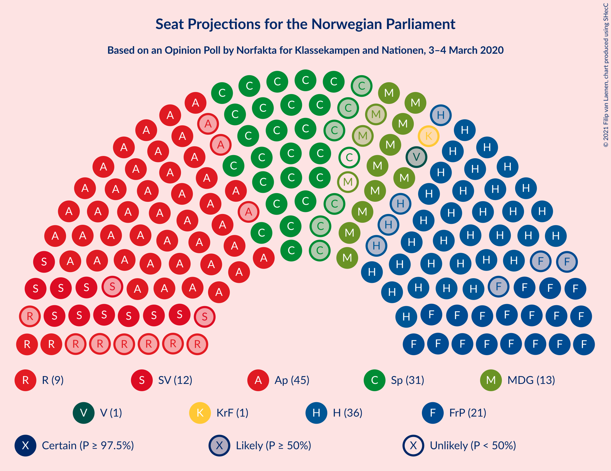
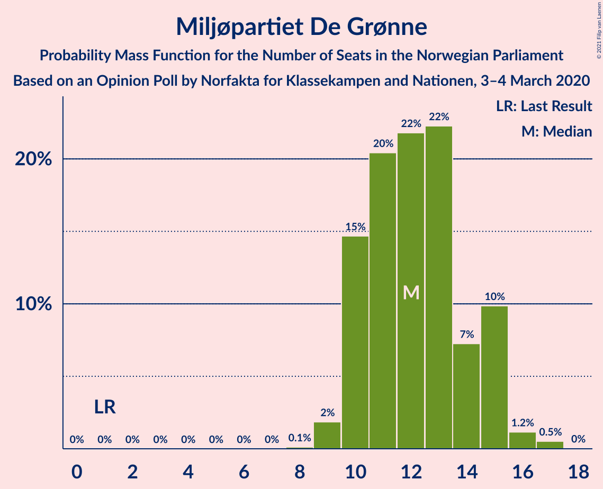
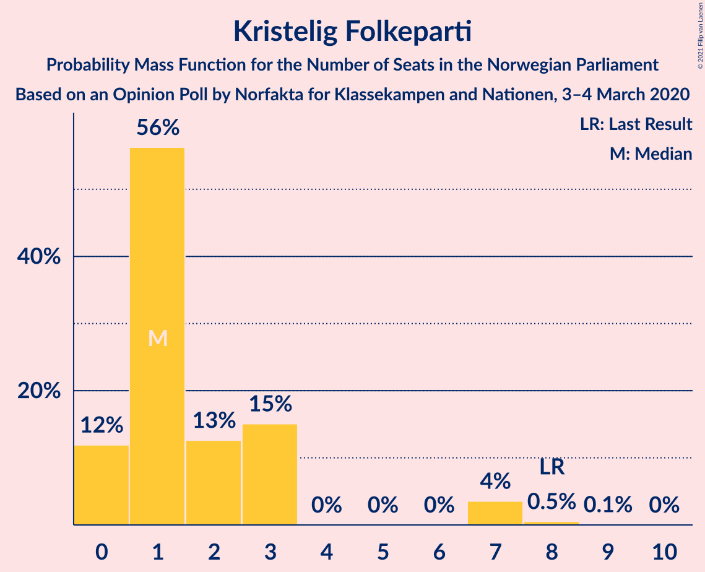
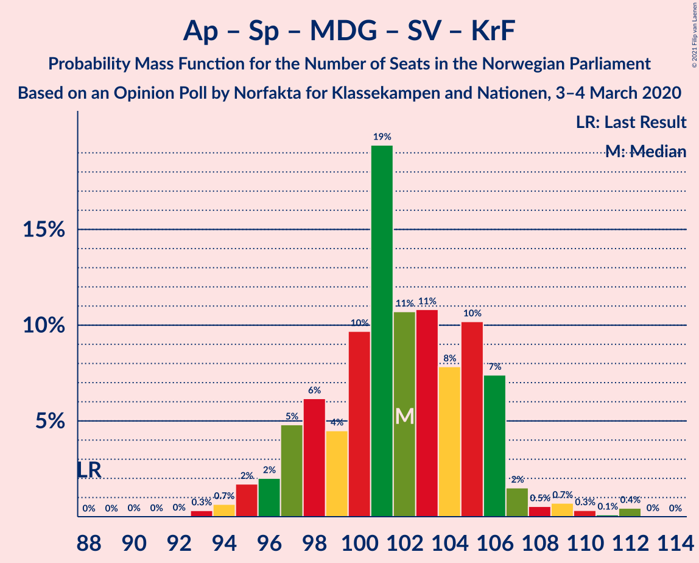
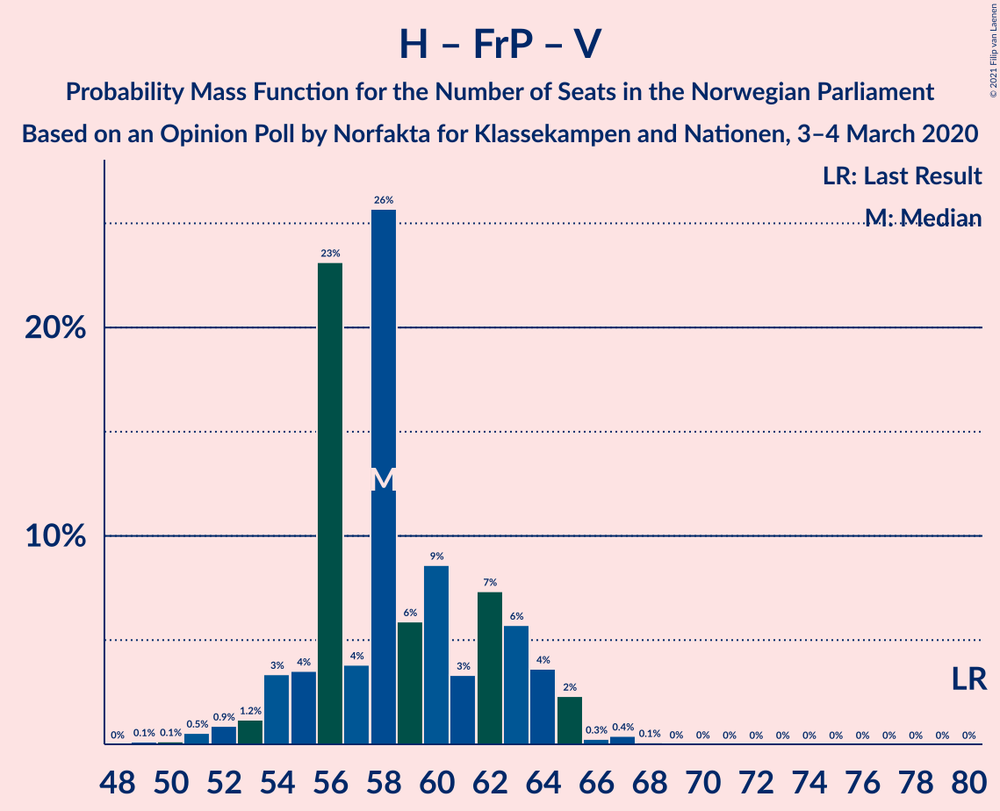

# Opinion Poll by Norfakta for Klassekampen and Nationen, 3–4 March 2020

<a href="#voting-intentions">Voting Intentions</a> | <a href="#seats">Seats</a> | <a href="#coalitions">Coalitions</a> | <a href="#technical-information">Technical Information</a>

## Voting Intentions

### Confidence Intervals

| Party | Last Result | Poll Result | 80% Confidence Interval | 90% Confidence Interval | 95% Confidence Interval | 99% Confidence Interval |
|:-----:|:-----------:|:-----------:|:-----------------------:|:-----------------------:|:-----------------------:|:-----------------------:|
| Arbeiderpartiet | 27.4% | 25.8% | 24.1–27.6% |23.6–28.2% |23.2–28.6% |22.4–29.5% |
| Høyre | 25.0% | 20.6% | 19.0–22.3% |18.6–22.8% |18.2–23.2% |17.5–24.1% |
| Senterpartiet | 10.3% | 15.9% | 14.5–17.5% |14.1–17.9% |13.8–18.3% |13.1–19.1% |
| Fremskrittspartiet | 15.2% | 12.0% | 10.8–13.4% |10.4–13.8% |10.1–14.2% |9.6–14.9% |
| Sosialistisk Venstreparti | 6.0% | 7.0% | 6.1–8.2% |5.8–8.5% |5.6–8.8% |5.2–9.3% |
| Miljøpartiet De Grønne | 3.2% | 7.0% | 6.1–8.2% |5.8–8.5% |5.6–8.8% |5.2–9.3% |
| Rødt | 2.4% | 5.1% | 4.3–6.1% |4.1–6.4% |3.9–6.6% |3.6–7.2% |
| Kristelig Folkeparti | 4.2% | 2.9% | 2.3–3.7% |2.2–3.9% |2.0–4.1% |1.8–4.6% |
| Venstre | 4.4% | 2.5% | 2.0–3.3% |1.8–3.5% |1.7–3.7% |1.5–4.1% |

*Note:* The poll result column reflects the actual value used in the calculations. Published results may vary slightly, and in addition be rounded to fewer digits.

## Seats

### Confidence Intervals

| Party | Last Result | Median | 80% Confidence Interval | 90% Confidence Interval | 95% Confidence Interval | 99% Confidence Interval |
|:-----:|:-----------:|:------:|:-----------------------:|:-----------------------:|:-----------------------:|:-----------------------:|
| <a href="#arbeiderpartiet">Arbeiderpartiet</a> | 49 | 45 | 43–49 |43–51 |42–52 |40–54 |
| <a href="#høyre">Høyre</a> | 45 | 36 | 34–39 |32–40 |32–41 |30–42 |
| <a href="#senterpartiet">Senterpartiet</a> | 19 | 30 | 26–34 |25–34 |24–34 |23–35 |
| <a href="#fremskrittspartiet">Fremskrittspartiet</a> | 27 | 21 | 18–24 |18–24 |18–25 |16–26 |
| <a href="#sosialistisk-venstreparti">Sosialistisk Venstreparti</a> | 11 | 12 | 11–14 |10–15 |10–16 |9–16 |
| <a href="#miljøpartiet-de-grønne">Miljøpartiet De Grønne</a> | 1 | 12 | 10–15 |10–15 |10–15 |9–17 |
| <a href="#rødt">Rødt</a> | 1 | 9 | 7–10 |2–11 |2–11 |2–13 |
| <a href="#kristelig-folkeparti">Kristelig Folkeparti</a> | 8 | 1 | 0–3 |0–3 |0–7 |0–8 |
| <a href="#venstre">Venstre</a> | 8 | 1 | 1–2 |0–2 |0–2 |0–6 |

### Arbeiderpartiet

*For a full overview of the results for this party, see the [Arbeiderpartiet](party-arbeiderpartiet.html) page.*

| Number of Seats | Probability | Accumulated | Special Marks |
|:---------------:|:-----------:|:-----------:|:-------------:|
| 38 | 0.1% | 100% |  |
| 39 | 0.2% | 99.9% |  |
| 40 | 0.6% | 99.7% |  |
| 41 | 1.3% | 99.1% |  |
| 42 | 2% | 98% |  |
| 43 | 10% | 96% |  |
| 44 | 11% | 85% |  |
| 45 | 25% | 75% | Median |
| 46 | 12% | 50% |  |
| 47 | 21% | 38% |  |
| 48 | 3% | 16% |  |
| 49 | 6% | 14% | Last Result |
| 50 | 2% | 8% |  |
| 51 | 2% | 6% |  |
| 52 | 2% | 4% |  |
| 53 | 0.5% | 1.1% |  |
| 54 | 0.4% | 0.6% |  |
| 55 | 0.1% | 0.2% |  |
| 56 | 0.1% | 0.1% |  |
| 57 | 0% | 0% |  |

### Høyre

*For a full overview of the results for this party, see the [Høyre](party-høyre.html) page.*

| Number of Seats | Probability | Accumulated | Special Marks |
|:---------------:|:-----------:|:-----------:|:-------------:|
| 29 | 0.1% | 100% |  |
| 30 | 0.4% | 99.9% |  |
| 31 | 1.0% | 99.5% |  |
| 32 | 5% | 98% |  |
| 33 | 3% | 93% |  |
| 34 | 18% | 91% |  |
| 35 | 11% | 73% |  |
| 36 | 25% | 63% | Median |
| 37 | 8% | 38% |  |
| 38 | 18% | 30% |  |
| 39 | 5% | 11% |  |
| 40 | 3% | 6% |  |
| 41 | 2% | 3% |  |
| 42 | 1.0% | 1.4% |  |
| 43 | 0.3% | 0.4% |  |
| 44 | 0% | 0.1% |  |
| 45 | 0% | 0% | Last Result |

### Senterpartiet

*For a full overview of the results for this party, see the [Senterpartiet](party-senterpartiet.html) page.*

| Number of Seats | Probability | Accumulated | Special Marks |
|:---------------:|:-----------:|:-----------:|:-------------:|
| 19 | 0% | 100% | Last Result |
| 20 | 0% | 100% |  |
| 21 | 0% | 100% |  |
| 22 | 0.1% | 100% |  |
| 23 | 1.2% | 99.9% |  |
| 24 | 3% | 98.7% |  |
| 25 | 5% | 96% |  |
| 26 | 8% | 90% |  |
| 27 | 4% | 83% |  |
| 28 | 9% | 79% |  |
| 29 | 17% | 70% |  |
| 30 | 9% | 53% | Median |
| 31 | 16% | 44% |  |
| 32 | 6% | 29% |  |
| 33 | 5% | 22% |  |
| 34 | 15% | 17% |  |
| 35 | 2% | 2% |  |
| 36 | 0.2% | 0.3% |  |
| 37 | 0.1% | 0.1% |  |
| 38 | 0.1% | 0.1% |  |
| 39 | 0% | 0% |  |

### Fremskrittspartiet

*For a full overview of the results for this party, see the [Fremskrittspartiet](party-fremskrittspartiet.html) page.*

| Number of Seats | Probability | Accumulated | Special Marks |
|:---------------:|:-----------:|:-----------:|:-------------:|
| 15 | 0.1% | 100% |  |
| 16 | 0.4% | 99.8% |  |
| 17 | 2% | 99.5% |  |
| 18 | 9% | 98% |  |
| 19 | 13% | 89% |  |
| 20 | 15% | 76% |  |
| 21 | 28% | 61% | Median |
| 22 | 8% | 33% |  |
| 23 | 9% | 25% |  |
| 24 | 12% | 16% |  |
| 25 | 3% | 5% |  |
| 26 | 1.4% | 2% |  |
| 27 | 0.3% | 0.5% | Last Result |
| 28 | 0.1% | 0.1% |  |
| 29 | 0% | 0% |  |

### Sosialistisk Venstreparti

*For a full overview of the results for this party, see the [Sosialistisk Venstreparti](party-sosialistiskvenstreparti.html) page.*

| Number of Seats | Probability | Accumulated | Special Marks |
|:---------------:|:-----------:|:-----------:|:-------------:|
| 8 | 0.3% | 100% |  |
| 9 | 0.8% | 99.7% |  |
| 10 | 9% | 98.9% |  |
| 11 | 22% | 90% | Last Result |
| 12 | 27% | 68% | Median |
| 13 | 22% | 41% |  |
| 14 | 10% | 19% |  |
| 15 | 6% | 9% |  |
| 16 | 2% | 3% |  |
| 17 | 0.4% | 0.5% |  |
| 18 | 0% | 0.1% |  |
| 19 | 0% | 0% |  |

### Miljøpartiet De Grønne

*For a full overview of the results for this party, see the [Miljøpartiet De Grønne](party-miljøpartietdegrønne.html) page.*

| Number of Seats | Probability | Accumulated | Special Marks |
|:---------------:|:-----------:|:-----------:|:-------------:|
| 1 | 0% | 100% | Last Result |
| 2 | 0% | 100% |  |
| 3 | 0% | 100% |  |
| 4 | 0% | 100% |  |
| 5 | 0% | 100% |  |
| 6 | 0% | 100% |  |
| 7 | 0% | 100% |  |
| 8 | 0.1% | 100% |  |
| 9 | 2% | 99.9% |  |
| 10 | 15% | 98% |  |
| 11 | 20% | 83% |  |
| 12 | 22% | 63% | Median |
| 13 | 22% | 41% |  |
| 14 | 7% | 19% |  |
| 15 | 10% | 12% |  |
| 16 | 1.2% | 2% |  |
| 17 | 0.5% | 0.6% |  |
| 18 | 0% | 0% |  |

### Rødt

*For a full overview of the results for this party, see the [Rødt](party-rødt.html) page.*

| Number of Seats | Probability | Accumulated | Special Marks |
|:---------------:|:-----------:|:-----------:|:-------------:|
| 1 | 0% | 100% | Last Result |
| 2 | 5% | 100% |  |
| 3 | 0% | 95% |  |
| 4 | 0% | 95% |  |
| 5 | 0% | 95% |  |
| 6 | 0% | 95% |  |
| 7 | 8% | 95% |  |
| 8 | 19% | 87% |  |
| 9 | 30% | 68% | Median |
| 10 | 30% | 38% |  |
| 11 | 7% | 8% |  |
| 12 | 1.1% | 2% |  |
| 13 | 0.5% | 0.6% |  |
| 14 | 0% | 0% |  |

### Kristelig Folkeparti

*For a full overview of the results for this party, see the [Kristelig Folkeparti](party-kristeligfolkeparti.html) page.*

| Number of Seats | Probability | Accumulated | Special Marks |
|:---------------:|:-----------:|:-----------:|:-------------:|
| 0 | 12% | 100% |  |
| 1 | 56% | 88% | Median |
| 2 | 13% | 32% |  |
| 3 | 15% | 19% |  |
| 4 | 0% | 4% |  |
| 5 | 0% | 4% |  |
| 6 | 0% | 4% |  |
| 7 | 4% | 4% |  |
| 8 | 0.5% | 0.6% | Last Result |
| 9 | 0.1% | 0.1% |  |
| 10 | 0% | 0% |  |

### Venstre

*For a full overview of the results for this party, see the [Venstre](party-venstre.html) page.*

| Number of Seats | Probability | Accumulated | Special Marks |
|:---------------:|:-----------:|:-----------:|:-------------:|
| 0 | 7% | 100% |  |
| 1 | 57% | 93% | Median |
| 2 | 36% | 36% |  |
| 3 | 0% | 0.5% |  |
| 4 | 0% | 0.5% |  |
| 5 | 0% | 0.5% |  |
| 6 | 0.1% | 0.5% |  |
| 7 | 0.3% | 0.5% |  |
| 8 | 0.1% | 0.1% | Last Result |
| 9 | 0% | 0% |  |

## Coalitions

### Confidence Intervals

| Coalition | Last Result | Median | Majority? | 80% Confidence Interval | 90% Confidence Interval | 95% Confidence Interval | 99% Confidence Interval |
|:---------:|:-----------:|:------:|:---------:|:-----------------------:|:-----------------------:|:-----------------------:|:-----------------------:|
| Arbeiderpartiet – Senterpartiet – Miljøpartiet De Grønne – Sosialistisk Venstreparti – Rødt | 81 | 110 | 100% | 105–112 | 104–113 | 103–114 | 101–116 |
| Arbeiderpartiet – Senterpartiet – Miljøpartiet De Grønne – Sosialistisk Venstreparti – Kristelig Folkeparti | 88 | 102 | 100% | 98–106 | 97–106 | 95–107 | 94–111 |
| Arbeiderpartiet – Senterpartiet – Miljøpartiet De Grønne – Sosialistisk Venstreparti | 80 | 100 | 100% | 96–104 | 95–105 | 94–105 | 91–109 |
| Arbeiderpartiet – Senterpartiet – Sosialistisk Venstreparti – Rødt | 80 | 97 | 100% | 92–100 | 91–101 | 90–102 | 88–104 |
| Arbeiderpartiet – Senterpartiet – Miljøpartiet De Grønne – Kristelig Folkeparti | 77 | 90 | 89% | 84–93 | 83–95 | 83–96 | 82–98 |
| Høyre – Senterpartiet – Fremskrittspartiet – Kristelig Folkeparti – Venstre | 107 | 90 | 95% | 86–93 | 84–94 | 82–95 | 81–97 |
| Arbeiderpartiet – Senterpartiet – Sosialistisk Venstreparti | 79 | 89 | 86% | 84–91 | 83–93 | 82–94 | 79–96 |
| Arbeiderpartiet – Senterpartiet – Kristelig Folkeparti | 76 | 78 | 1.3% | 72–81 | 71–82 | 71–84 | 69–86 |
| Arbeiderpartiet – Senterpartiet | 68 | 76 | 0.1% | 71–79 | 70–80 | 69–81 | 67–83 |
| Høyre – Fremskrittspartiet – Miljøpartiet De Grønne – Kristelig Folkeparti – Venstre | 89 | 72 | 0% | 69–77 | 68–78 | 67–79 | 65–81 |
| Høyre – Fremskrittspartiet – Kristelig Folkeparti – Venstre | 88 | 59 | 0% | 57–64 | 56–65 | 55–66 | 53–68 |
| Arbeiderpartiet – Sosialistisk Venstreparti | 60 | 58 | 0% | 54–61 | 54–63 | 54–65 | 52–66 |
| Høyre – Fremskrittspartiet – Venstre | 80 | 58 | 0% | 56–63 | 54–64 | 53–65 | 51–67 |
| Høyre – Fremskrittspartiet | 72 | 57 | 0% | 54–61 | 52–62 | 52–63 | 50–65 |
| Høyre – Kristelig Folkeparti – Venstre | 61 | 39 | 0% | 36–42 | 35–43 | 34–44 | 33–46 |
| Senterpartiet – Kristelig Folkeparti – Venstre | 35 | 33 | 0% | 28–37 | 27–38 | 27–39 | 25–42 |

### Arbeiderpartiet – Senterpartiet – Miljøpartiet De Grønne – Sosialistisk Venstreparti – Rødt

| Number of Seats | Probability | Accumulated | Special Marks |
|:---------------:|:-----------:|:-----------:|:-------------:|
| 81 | 0% | 100% | Last Result |
| 82 | 0% | 100% |  |
| 83 | 0% | 100% |  |
| 84 | 0% | 100% |  |
| 85 | 0% | 100% | Majority |
| 86 | 0% | 100% |  |
| 87 | 0% | 100% |  |
| 88 | 0% | 100% |  |
| 89 | 0% | 100% |  |
| 90 | 0% | 100% |  |
| 91 | 0% | 100% |  |
| 92 | 0% | 100% |  |
| 93 | 0% | 100% |  |
| 94 | 0% | 100% |  |
| 95 | 0% | 100% |  |
| 96 | 0% | 100% |  |
| 97 | 0% | 100% |  |
| 98 | 0% | 100% |  |
| 99 | 0.2% | 99.9% |  |
| 100 | 0.1% | 99.7% |  |
| 101 | 1.1% | 99.6% |  |
| 102 | 0.6% | 98.5% |  |
| 103 | 3% | 98% |  |
| 104 | 5% | 95% |  |
| 105 | 3% | 90% |  |
| 106 | 13% | 87% |  |
| 107 | 6% | 74% |  |
| 108 | 5% | 69% | Median |
| 109 | 9% | 63% |  |
| 110 | 23% | 54% |  |
| 111 | 7% | 31% |  |
| 112 | 16% | 24% |  |
| 113 | 5% | 8% |  |
| 114 | 2% | 4% |  |
| 115 | 0.5% | 2% |  |
| 116 | 0.6% | 1.1% |  |
| 117 | 0.4% | 0.5% |  |
| 118 | 0.1% | 0.1% |  |
| 119 | 0% | 0% |  |

### Arbeiderpartiet – Senterpartiet – Miljøpartiet De Grønne – Sosialistisk Venstreparti – Kristelig Folkeparti

| Number of Seats | Probability | Accumulated | Special Marks |
|:---------------:|:-----------:|:-----------:|:-------------:|
| 88 | 0% | 100% | Last Result |
| 89 | 0% | 100% |  |
| 90 | 0% | 100% |  |
| 91 | 0% | 100% |  |
| 92 | 0% | 100% |  |
| 93 | 0.3% | 99.9% |  |
| 94 | 0.7% | 99.6% |  |
| 95 | 2% | 98.9% |  |
| 96 | 2% | 97% |  |
| 97 | 5% | 95% |  |
| 98 | 6% | 90% |  |
| 99 | 4% | 84% |  |
| 100 | 10% | 80% | Median |
| 101 | 19% | 70% |  |
| 102 | 11% | 51% |  |
| 103 | 11% | 40% |  |
| 104 | 8% | 29% |  |
| 105 | 10% | 21% |  |
| 106 | 7% | 11% |  |
| 107 | 2% | 4% |  |
| 108 | 0.5% | 2% |  |
| 109 | 0.7% | 2% |  |
| 110 | 0.3% | 0.9% |  |
| 111 | 0.1% | 0.6% |  |
| 112 | 0.4% | 0.5% |  |
| 113 | 0% | 0% |  |

### Arbeiderpartiet – Senterpartiet – Miljøpartiet De Grønne – Sosialistisk Venstreparti

| Number of Seats | Probability | Accumulated | Special Marks |
|:---------------:|:-----------:|:-----------:|:-------------:|
| 80 | 0% | 100% | Last Result |
| 81 | 0% | 100% |  |
| 82 | 0% | 100% |  |
| 83 | 0% | 100% |  |
| 84 | 0% | 100% |  |
| 85 | 0% | 100% | Majority |
| 86 | 0% | 100% |  |
| 87 | 0% | 100% |  |
| 88 | 0% | 100% |  |
| 89 | 0% | 100% |  |
| 90 | 0.1% | 99.9% |  |
| 91 | 0.4% | 99.8% |  |
| 92 | 0.7% | 99.5% |  |
| 93 | 1.2% | 98.8% |  |
| 94 | 2% | 98% |  |
| 95 | 2% | 96% |  |
| 96 | 6% | 94% |  |
| 97 | 10% | 88% |  |
| 98 | 7% | 78% |  |
| 99 | 5% | 71% | Median |
| 100 | 20% | 65% |  |
| 101 | 11% | 46% |  |
| 102 | 9% | 35% |  |
| 103 | 12% | 26% |  |
| 104 | 8% | 14% |  |
| 105 | 4% | 6% |  |
| 106 | 1.0% | 2% |  |
| 107 | 0.5% | 1.4% |  |
| 108 | 0.3% | 0.9% |  |
| 109 | 0.3% | 0.6% |  |
| 110 | 0% | 0.4% |  |
| 111 | 0.3% | 0.4% |  |
| 112 | 0% | 0% |  |

### Arbeiderpartiet – Senterpartiet – Sosialistisk Venstreparti – Rødt

| Number of Seats | Probability | Accumulated | Special Marks |
|:---------------:|:-----------:|:-----------:|:-------------:|
| 80 | 0% | 100% | Last Result |
| 81 | 0% | 100% |  |
| 82 | 0% | 100% |  |
| 83 | 0% | 100% |  |
| 84 | 0% | 100% |  |
| 85 | 0% | 100% | Majority |
| 86 | 0.1% | 100% |  |
| 87 | 0.1% | 99.8% |  |
| 88 | 0.5% | 99.7% |  |
| 89 | 0.8% | 99.2% |  |
| 90 | 2% | 98% |  |
| 91 | 3% | 97% |  |
| 92 | 5% | 93% |  |
| 93 | 3% | 88% |  |
| 94 | 12% | 86% |  |
| 95 | 8% | 73% |  |
| 96 | 8% | 65% | Median |
| 97 | 10% | 57% |  |
| 98 | 9% | 47% |  |
| 99 | 12% | 38% |  |
| 100 | 18% | 26% |  |
| 101 | 4% | 8% |  |
| 102 | 2% | 4% |  |
| 103 | 2% | 2% |  |
| 104 | 0.3% | 0.6% |  |
| 105 | 0.2% | 0.3% |  |
| 106 | 0% | 0% |  |

### Arbeiderpartiet – Senterpartiet – Miljøpartiet De Grønne – Kristelig Folkeparti

| Number of Seats | Probability | Accumulated | Special Marks |
|:---------------:|:-----------:|:-----------:|:-------------:|
| 77 | 0% | 100% | Last Result |
| 78 | 0% | 100% |  |
| 79 | 0% | 100% |  |
| 80 | 0.1% | 99.9% |  |
| 81 | 0.3% | 99.8% |  |
| 82 | 2% | 99.6% |  |
| 83 | 3% | 98% |  |
| 84 | 6% | 95% |  |
| 85 | 5% | 89% | Majority |
| 86 | 3% | 84% |  |
| 87 | 4% | 81% |  |
| 88 | 7% | 77% | Median |
| 89 | 19% | 70% |  |
| 90 | 8% | 51% |  |
| 91 | 18% | 43% |  |
| 92 | 8% | 25% |  |
| 93 | 8% | 17% |  |
| 94 | 2% | 9% |  |
| 95 | 4% | 7% |  |
| 96 | 1.0% | 3% |  |
| 97 | 0.9% | 1.5% |  |
| 98 | 0.1% | 0.6% |  |
| 99 | 0.3% | 0.5% |  |
| 100 | 0% | 0.2% |  |
| 101 | 0% | 0.1% |  |
| 102 | 0.1% | 0.1% |  |
| 103 | 0% | 0% |  |

### Høyre – Senterpartiet – Fremskrittspartiet – Kristelig Folkeparti – Venstre

| Number of Seats | Probability | Accumulated | Special Marks |
|:---------------:|:-----------:|:-----------:|:-------------:|
| 80 | 0.1% | 100% |  |
| 81 | 0.4% | 99.9% |  |
| 82 | 3% | 99.5% |  |
| 83 | 0.8% | 97% |  |
| 84 | 1.2% | 96% |  |
| 85 | 3% | 95% | Majority |
| 86 | 8% | 92% |  |
| 87 | 4% | 83% |  |
| 88 | 7% | 80% |  |
| 89 | 13% | 73% | Median |
| 90 | 17% | 60% |  |
| 91 | 14% | 43% |  |
| 92 | 8% | 29% |  |
| 93 | 12% | 21% |  |
| 94 | 4% | 9% |  |
| 95 | 3% | 5% |  |
| 96 | 1.4% | 2% |  |
| 97 | 0.4% | 0.7% |  |
| 98 | 0.2% | 0.3% |  |
| 99 | 0.1% | 0.1% |  |
| 100 | 0% | 0% |  |
| 101 | 0% | 0% |  |
| 102 | 0% | 0% |  |
| 103 | 0% | 0% |  |
| 104 | 0% | 0% |  |
| 105 | 0% | 0% |  |
| 106 | 0% | 0% |  |
| 107 | 0% | 0% | Last Result |

### Arbeiderpartiet – Senterpartiet – Sosialistisk Venstreparti

| Number of Seats | Probability | Accumulated | Special Marks |
|:---------------:|:-----------:|:-----------:|:-------------:|
| 77 | 0% | 100% |  |
| 78 | 0.1% | 99.9% |  |
| 79 | 0.8% | 99.9% | Last Result |
| 80 | 0.5% | 99.1% |  |
| 81 | 0.9% | 98.6% |  |
| 82 | 2% | 98% |  |
| 83 | 4% | 96% |  |
| 84 | 5% | 91% |  |
| 85 | 10% | 86% | Majority |
| 86 | 9% | 76% |  |
| 87 | 5% | 67% | Median |
| 88 | 6% | 62% |  |
| 89 | 16% | 56% |  |
| 90 | 26% | 39% |  |
| 91 | 4% | 13% |  |
| 92 | 4% | 10% |  |
| 93 | 3% | 6% |  |
| 94 | 2% | 3% |  |
| 95 | 0.4% | 1.0% |  |
| 96 | 0.1% | 0.6% |  |
| 97 | 0.4% | 0.4% |  |
| 98 | 0% | 0.1% |  |
| 99 | 0% | 0% |  |

### Arbeiderpartiet – Senterpartiet – Kristelig Folkeparti

| Number of Seats | Probability | Accumulated | Special Marks |
|:---------------:|:-----------:|:-----------:|:-------------:|
| 67 | 0.1% | 100% |  |
| 68 | 0.2% | 99.9% |  |
| 69 | 0.7% | 99.7% |  |
| 70 | 1.3% | 99.0% |  |
| 71 | 3% | 98% |  |
| 72 | 7% | 94% |  |
| 73 | 5% | 88% |  |
| 74 | 4% | 83% |  |
| 75 | 4% | 79% |  |
| 76 | 10% | 75% | Last Result, Median |
| 77 | 13% | 65% |  |
| 78 | 9% | 52% |  |
| 79 | 19% | 42% |  |
| 80 | 11% | 23% |  |
| 81 | 3% | 12% |  |
| 82 | 4% | 9% |  |
| 83 | 2% | 5% |  |
| 84 | 2% | 3% |  |
| 85 | 0.6% | 1.3% | Majority |
| 86 | 0.4% | 0.7% |  |
| 87 | 0.2% | 0.3% |  |
| 88 | 0% | 0.1% |  |
| 89 | 0% | 0.1% |  |
| 90 | 0% | 0.1% |  |
| 91 | 0.1% | 0.1% |  |
| 92 | 0% | 0% |  |

### Arbeiderpartiet – Senterpartiet

| Number of Seats | Probability | Accumulated | Special Marks |
|:---------------:|:-----------:|:-----------:|:-------------:|
| 65 | 0% | 100% |  |
| 66 | 0.1% | 99.9% |  |
| 67 | 0.9% | 99.8% |  |
| 68 | 0.6% | 98.9% | Last Result |
| 69 | 2% | 98% |  |
| 70 | 3% | 96% |  |
| 71 | 5% | 93% |  |
| 72 | 8% | 88% |  |
| 73 | 6% | 79% |  |
| 74 | 9% | 74% |  |
| 75 | 5% | 64% | Median |
| 76 | 10% | 59% |  |
| 77 | 8% | 49% |  |
| 78 | 21% | 40% |  |
| 79 | 12% | 19% |  |
| 80 | 3% | 7% |  |
| 81 | 2% | 4% |  |
| 82 | 2% | 2% |  |
| 83 | 0.2% | 0.7% |  |
| 84 | 0.3% | 0.4% |  |
| 85 | 0% | 0.1% | Majority |
| 86 | 0% | 0.1% |  |
| 87 | 0% | 0% |  |

### Høyre – Fremskrittspartiet – Miljøpartiet De Grønne – Kristelig Folkeparti – Venstre

| Number of Seats | Probability | Accumulated | Special Marks |
|:---------------:|:-----------:|:-----------:|:-------------:|
| 64 | 0.2% | 100% |  |
| 65 | 0.3% | 99.7% |  |
| 66 | 2% | 99.4% |  |
| 67 | 2% | 98% |  |
| 68 | 4% | 96% |  |
| 69 | 18% | 92% |  |
| 70 | 12% | 74% |  |
| 71 | 9% | 62% | Median |
| 72 | 10% | 53% |  |
| 73 | 8% | 43% |  |
| 74 | 8% | 35% |  |
| 75 | 12% | 27% |  |
| 76 | 3% | 14% |  |
| 77 | 5% | 12% |  |
| 78 | 3% | 7% |  |
| 79 | 2% | 3% |  |
| 80 | 0.8% | 2% |  |
| 81 | 0.5% | 0.8% |  |
| 82 | 0.1% | 0.3% |  |
| 83 | 0.1% | 0.2% |  |
| 84 | 0% | 0% |  |
| 85 | 0% | 0% | Majority |
| 86 | 0% | 0% |  |
| 87 | 0% | 0% |  |
| 88 | 0% | 0% |  |
| 89 | 0% | 0% | Last Result |

### Høyre – Fremskrittspartiet – Kristelig Folkeparti – Venstre

| Number of Seats | Probability | Accumulated | Special Marks |
|:---------------:|:-----------:|:-----------:|:-------------:|
| 51 | 0.1% | 100% |  |
| 52 | 0.4% | 99.9% |  |
| 53 | 0.6% | 99.5% |  |
| 54 | 0.5% | 98.9% |  |
| 55 | 2% | 98% |  |
| 56 | 5% | 96% |  |
| 57 | 16% | 92% |  |
| 58 | 7% | 76% |  |
| 59 | 23% | 69% | Median |
| 60 | 9% | 46% |  |
| 61 | 5% | 37% |  |
| 62 | 6% | 31% |  |
| 63 | 13% | 26% |  |
| 64 | 3% | 13% |  |
| 65 | 5% | 10% |  |
| 66 | 3% | 5% |  |
| 67 | 0.6% | 2% |  |
| 68 | 1.1% | 1.5% |  |
| 69 | 0.1% | 0.4% |  |
| 70 | 0.2% | 0.3% |  |
| 71 | 0% | 0.1% |  |
| 72 | 0% | 0% |  |
| 73 | 0% | 0% |  |
| 74 | 0% | 0% |  |
| 75 | 0% | 0% |  |
| 76 | 0% | 0% |  |
| 77 | 0% | 0% |  |
| 78 | 0% | 0% |  |
| 79 | 0% | 0% |  |
| 80 | 0% | 0% |  |
| 81 | 0% | 0% |  |
| 82 | 0% | 0% |  |
| 83 | 0% | 0% |  |
| 84 | 0% | 0% |  |
| 85 | 0% | 0% | Majority |
| 86 | 0% | 0% |  |
| 87 | 0% | 0% |  |
| 88 | 0% | 0% | Last Result |

### Arbeiderpartiet – Sosialistisk Venstreparti

| Number of Seats | Probability | Accumulated | Special Marks |
|:---------------:|:-----------:|:-----------:|:-------------:|
| 50 | 0.1% | 100% |  |
| 51 | 0.1% | 99.9% |  |
| 52 | 0.4% | 99.7% |  |
| 53 | 2% | 99.3% |  |
| 54 | 9% | 98% |  |
| 55 | 2% | 89% |  |
| 56 | 16% | 86% |  |
| 57 | 15% | 71% | Median |
| 58 | 7% | 56% |  |
| 59 | 21% | 49% |  |
| 60 | 12% | 28% | Last Result |
| 61 | 6% | 16% |  |
| 62 | 2% | 9% |  |
| 63 | 2% | 7% |  |
| 64 | 1.3% | 5% |  |
| 65 | 1.1% | 3% |  |
| 66 | 2% | 2% |  |
| 67 | 0.2% | 0.3% |  |
| 68 | 0.1% | 0.1% |  |
| 69 | 0.1% | 0.1% |  |
| 70 | 0% | 0% |  |

### Høyre – Fremskrittspartiet – Venstre

| Number of Seats | Probability | Accumulated | Special Marks |
|:---------------:|:-----------:|:-----------:|:-------------:|
| 49 | 0.1% | 100% |  |
| 50 | 0.1% | 99.9% |  |
| 51 | 0.5% | 99.7% |  |
| 52 | 0.9% | 99.2% |  |
| 53 | 1.2% | 98% |  |
| 54 | 3% | 97% |  |
| 55 | 4% | 94% |  |
| 56 | 23% | 90% |  |
| 57 | 4% | 67% |  |
| 58 | 26% | 63% | Median |
| 59 | 6% | 38% |  |
| 60 | 9% | 32% |  |
| 61 | 3% | 23% |  |
| 62 | 7% | 20% |  |
| 63 | 6% | 12% |  |
| 64 | 4% | 7% |  |
| 65 | 2% | 3% |  |
| 66 | 0.3% | 0.8% |  |
| 67 | 0.4% | 0.5% |  |
| 68 | 0.1% | 0.1% |  |
| 69 | 0% | 0% |  |
| 70 | 0% | 0% |  |
| 71 | 0% | 0% |  |
| 72 | 0% | 0% |  |
| 73 | 0% | 0% |  |
| 74 | 0% | 0% |  |
| 75 | 0% | 0% |  |
| 76 | 0% | 0% |  |
| 77 | 0% | 0% |  |
| 78 | 0% | 0% |  |
| 79 | 0% | 0% |  |
| 80 | 0% | 0% | Last Result |

### Høyre – Fremskrittspartiet

| Number of Seats | Probability | Accumulated | Special Marks |
|:---------------:|:-----------:|:-----------:|:-------------:|
| 48 | 0% | 100% |  |
| 49 | 0.2% | 99.9% |  |
| 50 | 0.5% | 99.7% |  |
| 51 | 1.1% | 99.2% |  |
| 52 | 3% | 98% |  |
| 53 | 3% | 95% |  |
| 54 | 9% | 92% |  |
| 55 | 16% | 83% |  |
| 56 | 7% | 67% |  |
| 57 | 26% | 60% | Median |
| 58 | 7% | 34% |  |
| 59 | 6% | 28% |  |
| 60 | 3% | 22% |  |
| 61 | 10% | 19% |  |
| 62 | 6% | 9% |  |
| 63 | 2% | 3% |  |
| 64 | 0.8% | 1.5% |  |
| 65 | 0.3% | 0.7% |  |
| 66 | 0.2% | 0.4% |  |
| 67 | 0.2% | 0.2% |  |
| 68 | 0% | 0% |  |
| 69 | 0% | 0% |  |
| 70 | 0% | 0% |  |
| 71 | 0% | 0% |  |
| 72 | 0% | 0% | Last Result |

### Høyre – Kristelig Folkeparti – Venstre

| Number of Seats | Probability | Accumulated | Special Marks |
|:---------------:|:-----------:|:-----------:|:-------------:|
| 32 | 0.1% | 100% |  |
| 33 | 1.2% | 99.8% |  |
| 34 | 1.3% | 98.6% |  |
| 35 | 3% | 97% |  |
| 36 | 11% | 95% |  |
| 37 | 8% | 84% |  |
| 38 | 20% | 76% | Median |
| 39 | 15% | 56% |  |
| 40 | 22% | 41% |  |
| 41 | 5% | 18% |  |
| 42 | 5% | 14% |  |
| 43 | 4% | 9% |  |
| 44 | 2% | 4% |  |
| 45 | 2% | 2% |  |
| 46 | 0.6% | 0.9% |  |
| 47 | 0.1% | 0.3% |  |
| 48 | 0.1% | 0.2% |  |
| 49 | 0% | 0% |  |
| 50 | 0% | 0% |  |
| 51 | 0% | 0% |  |
| 52 | 0% | 0% |  |
| 53 | 0% | 0% |  |
| 54 | 0% | 0% |  |
| 55 | 0% | 0% |  |
| 56 | 0% | 0% |  |
| 57 | 0% | 0% |  |
| 58 | 0% | 0% |  |
| 59 | 0% | 0% |  |
| 60 | 0% | 0% |  |
| 61 | 0% | 0% | Last Result |

### Senterpartiet – Kristelig Folkeparti – Venstre

| Number of Seats | Probability | Accumulated | Special Marks |
|:---------------:|:-----------:|:-----------:|:-------------:|
| 24 | 0.1% | 100% |  |
| 25 | 0.8% | 99.9% |  |
| 26 | 1.3% | 99.2% |  |
| 27 | 3% | 98% |  |
| 28 | 7% | 95% |  |
| 29 | 4% | 88% |  |
| 30 | 10% | 84% |  |
| 31 | 10% | 74% |  |
| 32 | 9% | 64% | Median |
| 33 | 15% | 55% |  |
| 34 | 8% | 40% |  |
| 35 | 11% | 32% | Last Result |
| 36 | 11% | 21% |  |
| 37 | 5% | 10% |  |
| 38 | 1.5% | 6% |  |
| 39 | 3% | 4% |  |
| 40 | 0.3% | 1.3% |  |
| 41 | 0.5% | 1.0% |  |
| 42 | 0.4% | 0.5% |  |
| 43 | 0.1% | 0.1% |  |
| 44 | 0.1% | 0.1% |  |
| 45 | 0% | 0% |  |

## Technical Information

### Opinion Poll

+ **Polling firm:** Norfakta
+ **Commissioner(s):** Klassekampen and Nationen
+ **Fieldwork period:** 3–4 March 2020

### Calculations

+ **Sample size:** 1000
+ **Simulations done:** 524,288
+ **Error estimate:** 2.76%

