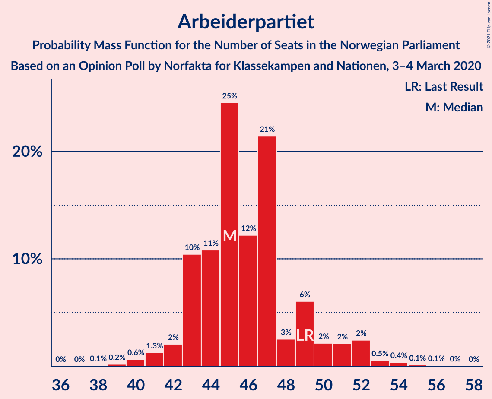
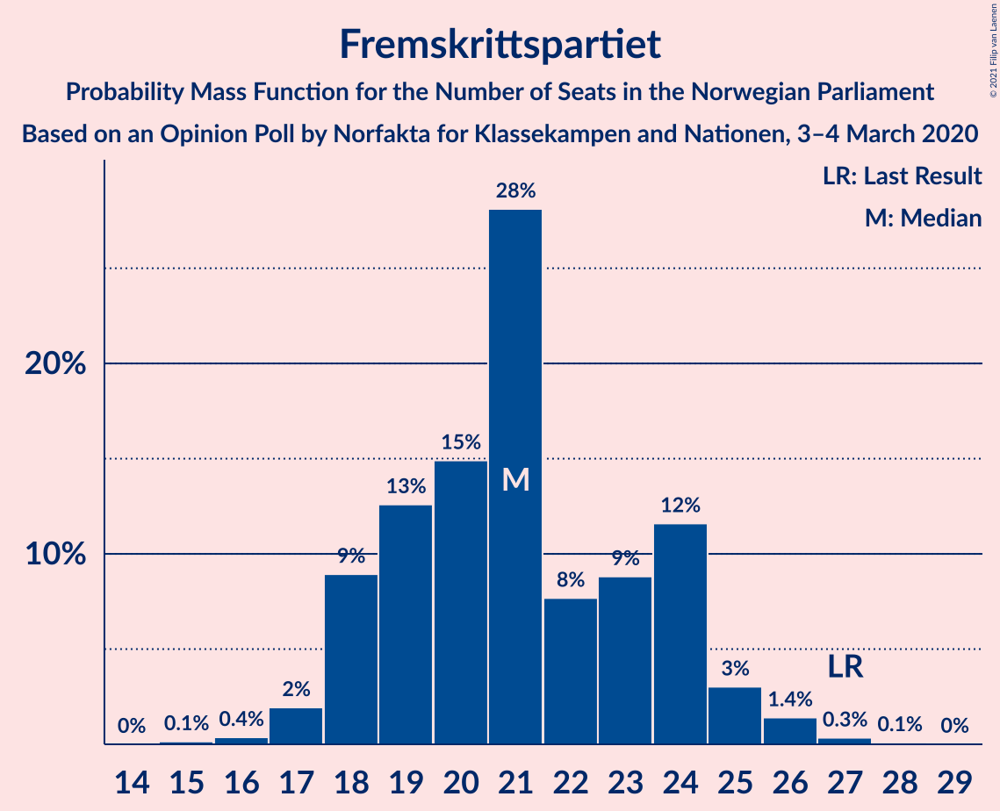
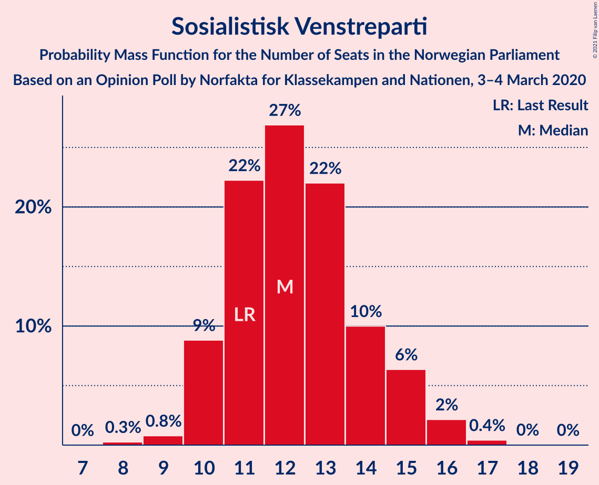
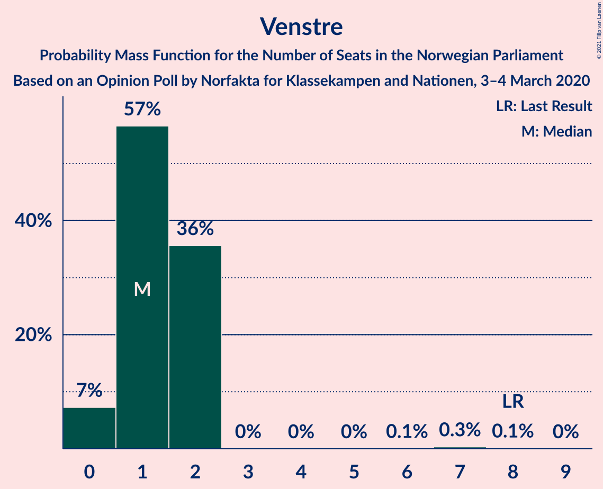
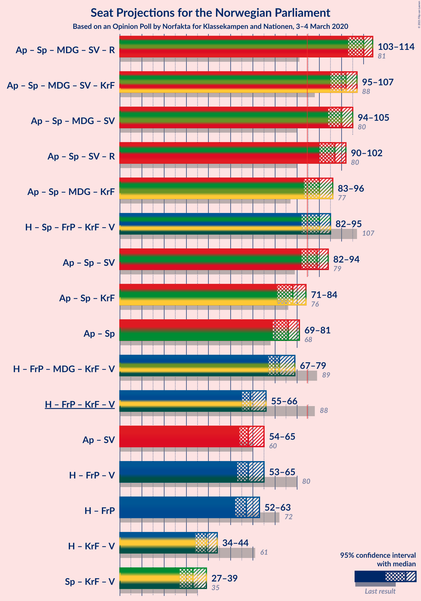
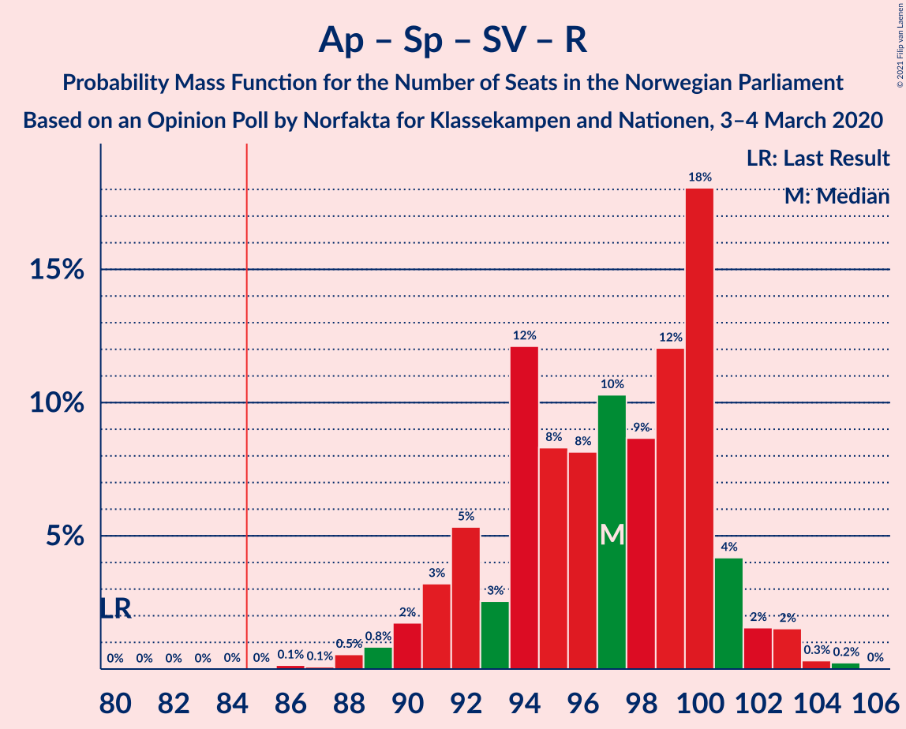
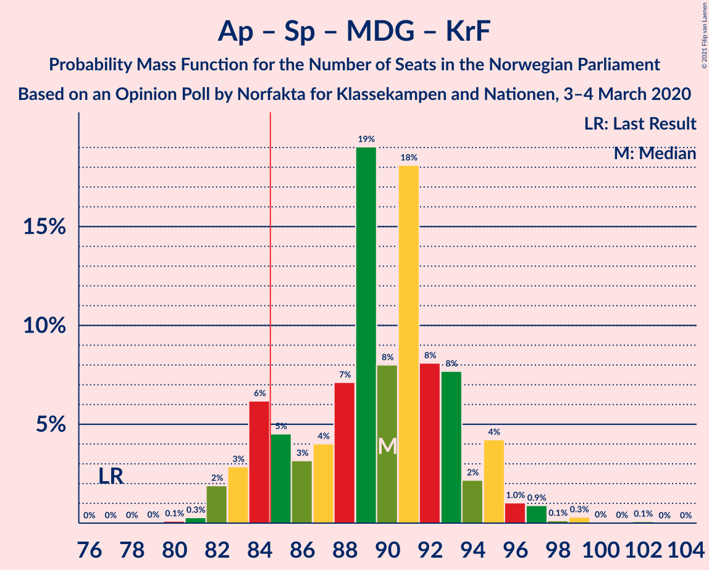
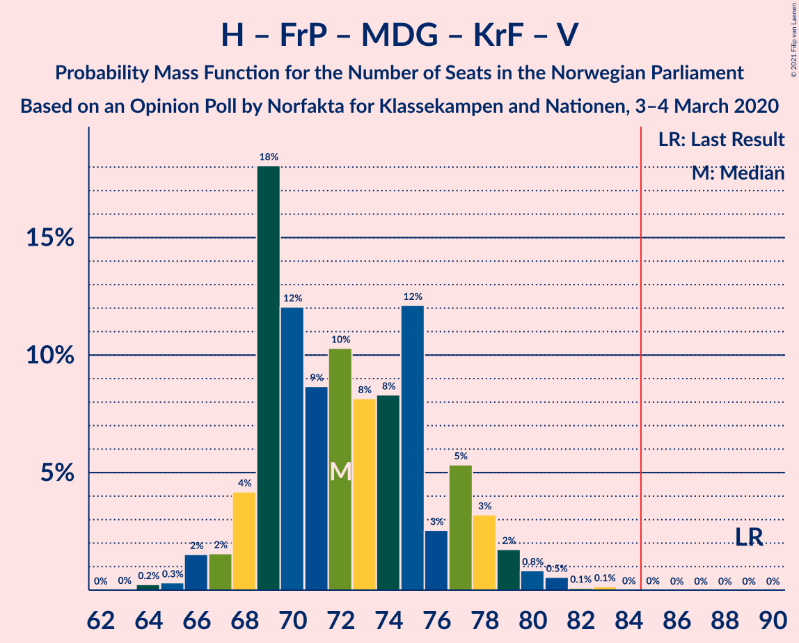
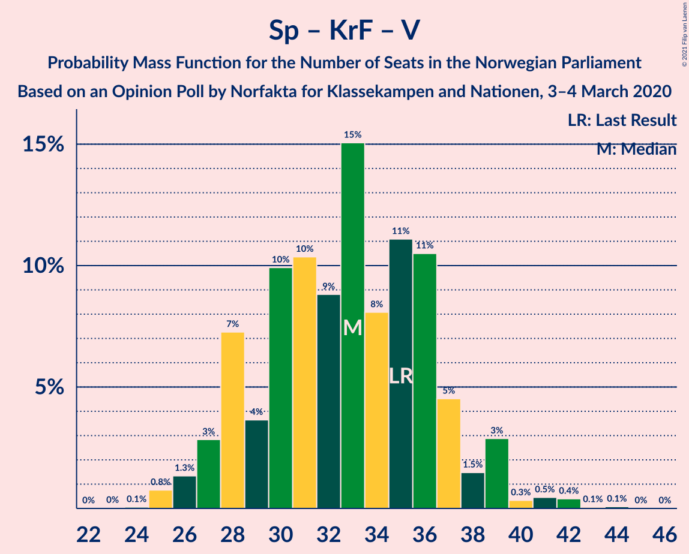

# Opinion Poll by Norfakta for Klasskampen and Nationen, 3–4 March 2020

<a href="#voting-intentions">Voting Intentions</a> | <a href="#seats">Seats</a> | <a href="#coalitions">Coalitions</a> | <a href="#technical-information">Technical Information</a>

## Voting Intentions

### Confidence Intervals

| Party | Last Result | Poll Result | 80% Confidence Interval | 90% Confidence Interval | 95% Confidence Interval | 99% Confidence Interval |
|:-----:|:-----------:|:-----------:|:-----------------------:|:-----------------------:|:-----------------------:|:-----------------------:|
| Arbeiderpartiet | 27.4% | 25.8% | 24.1–27.6% |23.6–28.2% |23.2–28.6% |22.4–29.5% |
| Høyre | 25.0% | 20.6% | 19.0–22.3% |18.6–22.8% |18.2–23.2% |17.5–24.1% |
| Senterpartiet | 10.3% | 15.9% | 14.5–17.5% |14.1–17.9% |13.8–18.3% |13.1–19.1% |
| Fremskrittspartiet | 15.2% | 12.0% | 10.8–13.4% |10.4–13.8% |10.1–14.2% |9.6–14.9% |
| Sosialistisk Venstreparti | 6.0% | 7.0% | 6.1–8.2% |5.8–8.5% |5.6–8.8% |5.2–9.3% |
| Miljøpartiet De Grønne | 3.2% | 7.0% | 6.1–8.2% |5.8–8.5% |5.6–8.8% |5.2–9.3% |
| Rødt | 2.4% | 5.1% | 4.3–6.1% |4.1–6.4% |3.9–6.6% |3.6–7.2% |
| Kristelig Folkeparti | 4.2% | 2.9% | 2.3–3.7% |2.2–3.9% |2.0–4.1% |1.8–4.6% |
| Venstre | 4.4% | 2.5% | 2.0–3.3% |1.8–3.5% |1.7–3.7% |1.5–4.1% |

*Note:* The poll result column reflects the actual value used in the calculations. Published results may vary slightly, and in addition be rounded to fewer digits.

## Seats

### Confidence Intervals

| Party | Last Result | Median | 80% Confidence Interval | 90% Confidence Interval | 95% Confidence Interval | 99% Confidence Interval |
|:-----:|:-----------:|:------:|:-----------------------:|:-----------------------:|:-----------------------:|:-----------------------:|
| <a href="#arbeiderpartiet">Arbeiderpartiet</a> | 49 | 45 | 43–45 |43–45 |42–45 |40–50 |
| <a href="#høyre">Høyre</a> | 45 | 38 | 37–38 |37–38 |35–38 |30–40 |
| <a href="#senterpartiet">Senterpartiet</a> | 19 | 26 | 24–27 |24–29 |24–29 |24–33 |
| <a href="#fremskrittspartiet">Fremskrittspartiet</a> | 27 | 23 | 23–24 |21–24 |21–24 |19–27 |
| <a href="#sosialistisk-venstreparti">Sosialistisk Venstreparti</a> | 11 | 15 | 14–15 |14–15 |13–15 |10–15 |
| <a href="#miljøpartiet-de-grønne">Miljøpartiet De Grønne</a> | 1 | 11 | 11–14 |11–14 |11–16 |10–16 |
| <a href="#rødt">Rødt</a> | 1 | 9 | 8–9 |8–10 |8–10 |2–11 |
| <a href="#kristelig-folkeparti">Kristelig Folkeparti</a> | 8 | 1 | 1–2 |1–2 |0–3 |0–7 |
| <a href="#venstre">Venstre</a> | 8 | 1 | 0–1 |0–2 |0–2 |0–2 |

### Arbeiderpartiet

*For a full overview of the results for this party, see the [Arbeiderpartiet](party-arbeiderpartiet.html) page.*

| Number of Seats | Probability | Accumulated | Special Marks |
|:---------------:|:-----------:|:-----------:|:-------------:|
| 38 | 0% | 100% |  |
| 39 | 0.1% | 99.9% |  |
| 40 | 2% | 99.8% |  |
| 41 | 0.5% | 98% |  |
| 42 | 1.2% | 98% |  |
| 43 | 24% | 96% |  |
| 44 | 4% | 72% |  |
| 45 | 66% | 68% | Median |
| 46 | 1.0% | 2% |  |
| 47 | 0.4% | 1.4% |  |
| 48 | 0.1% | 1.1% |  |
| 49 | 0.3% | 1.0% | Last Result |
| 50 | 0.4% | 0.7% |  |
| 51 | 0.1% | 0.3% |  |
| 52 | 0% | 0.3% |  |
| 53 | 0% | 0.3% |  |
| 54 | 0.1% | 0.2% |  |
| 55 | 0.2% | 0.2% |  |
| 56 | 0% | 0% |  |

### Høyre

*For a full overview of the results for this party, see the [Høyre](party-høyre.html) page.*

| Number of Seats | Probability | Accumulated | Special Marks |
|:---------------:|:-----------:|:-----------:|:-------------:|
| 29 | 0.2% | 100% |  |
| 30 | 0.5% | 99.8% |  |
| 31 | 1.2% | 99.4% |  |
| 32 | 0% | 98% |  |
| 33 | 0% | 98% |  |
| 34 | 0.2% | 98% |  |
| 35 | 0.5% | 98% |  |
| 36 | 1.2% | 97% |  |
| 37 | 22% | 96% |  |
| 38 | 73% | 74% | Median |
| 39 | 0.2% | 1.4% |  |
| 40 | 0.9% | 1.2% |  |
| 41 | 0.3% | 0.3% |  |
| 42 | 0% | 0% |  |
| 43 | 0% | 0% |  |
| 44 | 0% | 0% |  |
| 45 | 0% | 0% | Last Result |

### Senterpartiet

*For a full overview of the results for this party, see the [Senterpartiet](party-senterpartiet.html) page.*

| Number of Seats | Probability | Accumulated | Special Marks |
|:---------------:|:-----------:|:-----------:|:-------------:|
| 19 | 0% | 100% | Last Result |
| 20 | 0% | 100% |  |
| 21 | 0% | 100% |  |
| 22 | 0.5% | 100% |  |
| 23 | 0% | 99.5% |  |
| 24 | 19% | 99.5% |  |
| 25 | 2% | 81% |  |
| 26 | 48% | 78% | Median |
| 27 | 24% | 30% |  |
| 28 | 0.4% | 6% |  |
| 29 | 3% | 5% |  |
| 30 | 0.4% | 2% |  |
| 31 | 0.4% | 2% |  |
| 32 | 0.2% | 1.4% |  |
| 33 | 1.1% | 1.3% |  |
| 34 | 0% | 0.2% |  |
| 35 | 0.1% | 0.2% |  |
| 36 | 0% | 0.1% |  |
| 37 | 0% | 0% |  |

### Fremskrittspartiet

*For a full overview of the results for this party, see the [Fremskrittspartiet](party-fremskrittspartiet.html) page.*

| Number of Seats | Probability | Accumulated | Special Marks |
|:---------------:|:-----------:|:-----------:|:-------------:|
| 19 | 0.5% | 100% |  |
| 20 | 1.4% | 99.4% |  |
| 21 | 3% | 98% |  |
| 22 | 0.4% | 95% |  |
| 23 | 48% | 94% | Median |
| 24 | 44% | 46% |  |
| 25 | 0.7% | 2% |  |
| 26 | 1.0% | 2% |  |
| 27 | 0.7% | 0.7% | Last Result |
| 28 | 0% | 0% |  |

### Sosialistisk Venstreparti

*For a full overview of the results for this party, see the [Sosialistisk Venstreparti](party-sosialistiskvenstreparti.html) page.*

| Number of Seats | Probability | Accumulated | Special Marks |
|:---------------:|:-----------:|:-----------:|:-------------:|
| 9 | 0.3% | 100% |  |
| 10 | 1.1% | 99.7% |  |
| 11 | 0.4% | 98.6% | Last Result |
| 12 | 0.3% | 98% |  |
| 13 | 0.6% | 98% |  |
| 14 | 47% | 97% |  |
| 15 | 50% | 50% | Median |
| 16 | 0.1% | 0.1% |  |
| 17 | 0% | 0.1% |  |
| 18 | 0% | 0% |  |

### Miljøpartiet De Grønne

*For a full overview of the results for this party, see the [Miljøpartiet De Grønne](party-miljøpartietdegrønne.html) page.*

| Number of Seats | Probability | Accumulated | Special Marks |
|:---------------:|:-----------:|:-----------:|:-------------:|
| 1 | 0% | 100% | Last Result |
| 2 | 0% | 100% |  |
| 3 | 0% | 100% |  |
| 4 | 0% | 100% |  |
| 5 | 0% | 100% |  |
| 6 | 0% | 100% |  |
| 7 | 0% | 100% |  |
| 8 | 0.1% | 100% |  |
| 9 | 0.1% | 99.9% |  |
| 10 | 1.3% | 99.8% |  |
| 11 | 50% | 98% | Median |
| 12 | 0.3% | 49% |  |
| 13 | 20% | 48% |  |
| 14 | 24% | 28% |  |
| 15 | 0.1% | 3% |  |
| 16 | 3% | 3% |  |
| 17 | 0.1% | 0.1% |  |
| 18 | 0% | 0% |  |

### Rødt

*For a full overview of the results for this party, see the [Rødt](party-rødt.html) page.*

| Number of Seats | Probability | Accumulated | Special Marks |
|:---------------:|:-----------:|:-----------:|:-------------:|
| 1 | 0% | 100% | Last Result |
| 2 | 1.5% | 100% |  |
| 3 | 0% | 98% |  |
| 4 | 0% | 98% |  |
| 5 | 0% | 98% |  |
| 6 | 0% | 98% |  |
| 7 | 0.4% | 98% |  |
| 8 | 25% | 98% |  |
| 9 | 67% | 73% | Median |
| 10 | 4% | 6% |  |
| 11 | 1.3% | 2% |  |
| 12 | 0.3% | 0.3% |  |
| 13 | 0% | 0% |  |

### Kristelig Folkeparti

*For a full overview of the results for this party, see the [Kristelig Folkeparti](party-kristeligfolkeparti.html) page.*

| Number of Seats | Probability | Accumulated | Special Marks |
|:---------------:|:-----------:|:-----------:|:-------------:|
| 0 | 4% | 100% |  |
| 1 | 73% | 96% | Median |
| 2 | 18% | 23% |  |
| 3 | 4% | 5% |  |
| 4 | 0% | 1.0% |  |
| 5 | 0% | 1.0% |  |
| 6 | 0% | 1.0% |  |
| 7 | 0.9% | 1.0% |  |
| 8 | 0.1% | 0.2% | Last Result |
| 9 | 0% | 0% |  |

### Venstre

*For a full overview of the results for this party, see the [Venstre](party-venstre.html) page.*

| Number of Seats | Probability | Accumulated | Special Marks |
|:---------------:|:-----------:|:-----------:|:-------------:|
| 0 | 25% | 100% |  |
| 1 | 67% | 75% | Median |
| 2 | 7% | 7% |  |
| 3 | 0% | 0.2% |  |
| 4 | 0% | 0.2% |  |
| 5 | 0% | 0.2% |  |
| 6 | 0% | 0.2% |  |
| 7 | 0.1% | 0.1% |  |
| 8 | 0.1% | 0.1% | Last Result |
| 9 | 0% | 0% |  |

## Coalitions

### Confidence Intervals

| Coalition | Last Result | Median | Majority? | 80% Confidence Interval | 90% Confidence Interval | 95% Confidence Interval | 99% Confidence Interval |
|:---------:|:-----------:|:------:|:---------:|:-----------------------:|:-----------------------:|:-----------------------:|:-----------------------:|
| Arbeiderpartiet – Senterpartiet – Miljøpartiet De Grønne – Sosialistisk Venstreparti – Rødt | 81 | 106 | 100% | 105–106 | 105–106 | 104–107 | 99–115 |
| Arbeiderpartiet – Senterpartiet – Miljøpartiet De Grønne – Sosialistisk Venstreparti – Kristelig Folkeparti | 88 | 98 | 100% | 98–99 | 98–100 | 96–105 | 93–108 |
| Arbeiderpartiet – Senterpartiet – Miljøpartiet De Grønne – Sosialistisk Venstreparti | 80 | 97 | 100% | 96–98 | 96–98 | 95–102 | 90–105 |
| Arbeiderpartiet – Senterpartiet – Sosialistisk Venstreparti – Rødt | 80 | 95 | 99.7% | 92–95 | 92–95 | 91–95 | 88–102 |
| Høyre – Senterpartiet – Fremskrittspartiet – Kristelig Folkeparti – Venstre | 107 | 89 | 99.4% | 88–90 | 88–91 | 86–92 | 84–97 |
| Arbeiderpartiet – Senterpartiet – Miljøpartiet De Grønne – Kristelig Folkeparti | 77 | 83 | 31% | 83–85 | 83–86 | 82–90 | 80–95 |
| Arbeiderpartiet – Senterpartiet – Sosialistisk Venstreparti | 79 | 86 | 52% | 83–86 | 83–86 | 82–86 | 80–92 |
| Høyre – Fremskrittspartiet – Miljøpartiet De Grønne – Kristelig Folkeparti – Venstre | 89 | 74 | 0.3% | 74–77 | 74–77 | 74–78 | 67–81 |
| Arbeiderpartiet – Senterpartiet – Kristelig Folkeparti | 76 | 72 | 0.4% | 71–72 | 70–73 | 69–78 | 69–83 |
| Arbeiderpartiet – Senterpartiet | 68 | 71 | 0.1% | 69–71 | 69–71 | 68–75 | 68–79 |
| Høyre – Fremskrittspartiet – Kristelig Folkeparti – Venstre | 88 | 63 | 0% | 63–64 | 63–64 | 62–65 | 54–70 |
| Høyre – Fremskrittspartiet – Venstre | 80 | 62 | 0% | 62 | 61–62 | 59–63 | 51–67 |
| Høyre – Fremskrittspartiet | 72 | 61 | 0% | 61–62 | 59–62 | 57–62 | 51–65 |
| Arbeiderpartiet – Sosialistisk Venstreparti | 60 | 59 | 0% | 57–60 | 57–60 | 55–60 | 53–64 |
| Høyre – Kristelig Folkeparti – Venstre | 61 | 40 | 0% | 39–40 | 39–41 | 37–43 | 34–46 |
| Senterpartiet – Kristelig Folkeparti – Venstre | 35 | 28 | 0% | 27–28 | 27–31 | 27–35 | 27–38 |

### Arbeiderpartiet – Senterpartiet – Miljøpartiet De Grønne – Sosialistisk Venstreparti – Rødt

| Number of Seats | Probability | Accumulated | Special Marks |
|:---------------:|:-----------:|:-----------:|:-------------:|
| 81 | 0% | 100% | Last Result |
| 82 | 0% | 100% |  |
| 83 | 0% | 100% |  |
| 84 | 0% | 100% |  |
| 85 | 0% | 100% | Majority |
| 86 | 0% | 100% |  |
| 87 | 0% | 100% |  |
| 88 | 0% | 100% |  |
| 89 | 0% | 100% |  |
| 90 | 0% | 100% |  |
| 91 | 0% | 100% |  |
| 92 | 0% | 100% |  |
| 93 | 0% | 100% |  |
| 94 | 0% | 100% |  |
| 95 | 0% | 100% |  |
| 96 | 0% | 100% |  |
| 97 | 0% | 100% |  |
| 98 | 0.3% | 100% |  |
| 99 | 0.6% | 99.7% |  |
| 100 | 0.1% | 99.1% |  |
| 101 | 0.4% | 99.0% |  |
| 102 | 0.2% | 98.6% |  |
| 103 | 0.1% | 98% |  |
| 104 | 1.0% | 98% |  |
| 105 | 16% | 97% |  |
| 106 | 76% | 81% | Median |
| 107 | 3% | 5% |  |
| 108 | 0% | 2% |  |
| 109 | 0.1% | 2% |  |
| 110 | 0.1% | 2% |  |
| 111 | 0.1% | 2% |  |
| 112 | 0.1% | 2% |  |
| 113 | 0.3% | 2% |  |
| 114 | 0.1% | 1.3% |  |
| 115 | 1.1% | 1.2% |  |
| 116 | 0% | 0% |  |

### Arbeiderpartiet – Senterpartiet – Miljøpartiet De Grønne – Sosialistisk Venstreparti – Kristelig Folkeparti

| Number of Seats | Probability | Accumulated | Special Marks |
|:---------------:|:-----------:|:-----------:|:-------------:|
| 88 | 0% | 100% | Last Result |
| 89 | 0% | 100% |  |
| 90 | 0% | 100% |  |
| 91 | 0% | 100% |  |
| 92 | 0% | 100% |  |
| 93 | 0.6% | 100% |  |
| 94 | 0.1% | 99.3% |  |
| 95 | 0.9% | 99.3% |  |
| 96 | 3% | 98% |  |
| 97 | 0% | 95% |  |
| 98 | 64% | 95% | Median |
| 99 | 25% | 31% |  |
| 100 | 3% | 6% |  |
| 101 | 0.1% | 4% |  |
| 102 | 0.1% | 4% |  |
| 103 | 0.4% | 3% |  |
| 104 | 0.4% | 3% |  |
| 105 | 1.0% | 3% |  |
| 106 | 0.2% | 2% |  |
| 107 | 0.1% | 1.4% |  |
| 108 | 1.1% | 1.3% |  |
| 109 | 0% | 0.2% |  |
| 110 | 0.1% | 0.2% |  |
| 111 | 0% | 0.1% |  |
| 112 | 0% | 0% |  |

### Arbeiderpartiet – Senterpartiet – Miljøpartiet De Grønne – Sosialistisk Venstreparti

| Number of Seats | Probability | Accumulated | Special Marks |
|:---------------:|:-----------:|:-----------:|:-------------:|
| 80 | 0% | 100% | Last Result |
| 81 | 0% | 100% |  |
| 82 | 0% | 100% |  |
| 83 | 0% | 100% |  |
| 84 | 0% | 100% |  |
| 85 | 0% | 100% | Majority |
| 86 | 0% | 100% |  |
| 87 | 0% | 100% |  |
| 88 | 0% | 100% |  |
| 89 | 0% | 100% |  |
| 90 | 0.6% | 100% |  |
| 91 | 0% | 99.4% |  |
| 92 | 0.1% | 99.4% |  |
| 93 | 0.5% | 99.3% |  |
| 94 | 0.1% | 98.8% |  |
| 95 | 1.3% | 98.8% |  |
| 96 | 20% | 97% |  |
| 97 | 48% | 78% | Median |
| 98 | 26% | 30% |  |
| 99 | 0.2% | 3% |  |
| 100 | 0.2% | 3% |  |
| 101 | 0.1% | 3% |  |
| 102 | 1.0% | 3% |  |
| 103 | 0.4% | 2% |  |
| 104 | 0.1% | 1.4% |  |
| 105 | 1.1% | 1.3% |  |
| 106 | 0.1% | 0.3% |  |
| 107 | 0% | 0.2% |  |
| 108 | 0.1% | 0.2% |  |
| 109 | 0% | 0.1% |  |
| 110 | 0% | 0.1% |  |
| 111 | 0% | 0% |  |

### Arbeiderpartiet – Senterpartiet – Sosialistisk Venstreparti – Rødt

| Number of Seats | Probability | Accumulated | Special Marks |
|:---------------:|:-----------:|:-----------:|:-------------:|
| 80 | 0% | 100% | Last Result |
| 81 | 0% | 100% |  |
| 82 | 0% | 100% |  |
| 83 | 0% | 100% |  |
| 84 | 0.3% | 100% |  |
| 85 | 0% | 99.7% | Majority |
| 86 | 0% | 99.7% |  |
| 87 | 0% | 99.7% |  |
| 88 | 0.9% | 99.7% |  |
| 89 | 0.7% | 98.8% |  |
| 90 | 0.2% | 98% |  |
| 91 | 3% | 98% |  |
| 92 | 40% | 95% |  |
| 93 | 2% | 55% |  |
| 94 | 0.4% | 52% |  |
| 95 | 50% | 52% | Median |
| 96 | 0.5% | 2% |  |
| 97 | 0.1% | 2% |  |
| 98 | 0% | 2% |  |
| 99 | 0.1% | 2% |  |
| 100 | 0.2% | 2% |  |
| 101 | 0.1% | 1.4% |  |
| 102 | 1.1% | 1.3% |  |
| 103 | 0.1% | 0.2% |  |
| 104 | 0.1% | 0.1% |  |
| 105 | 0% | 0% |  |

### Høyre – Senterpartiet – Fremskrittspartiet – Kristelig Folkeparti – Venstre

| Number of Seats | Probability | Accumulated | Special Marks |
|:---------------:|:-----------:|:-----------:|:-------------:|
| 82 | 0.1% | 100% |  |
| 83 | 0% | 99.9% |  |
| 84 | 0.5% | 99.9% |  |
| 85 | 0.2% | 99.4% | Majority |
| 86 | 2% | 99.2% |  |
| 87 | 1.4% | 97% |  |
| 88 | 17% | 96% |  |
| 89 | 48% | 78% | Median |
| 90 | 25% | 30% |  |
| 91 | 0.2% | 5% |  |
| 92 | 3% | 5% |  |
| 93 | 0.2% | 2% |  |
| 94 | 0.2% | 2% |  |
| 95 | 0.6% | 2% |  |
| 96 | 0.4% | 1.0% |  |
| 97 | 0.5% | 0.6% |  |
| 98 | 0.1% | 0.2% |  |
| 99 | 0.1% | 0.1% |  |
| 100 | 0% | 0% |  |
| 101 | 0% | 0% |  |
| 102 | 0% | 0% |  |
| 103 | 0% | 0% |  |
| 104 | 0% | 0% |  |
| 105 | 0% | 0% |  |
| 106 | 0% | 0% |  |
| 107 | 0% | 0% | Last Result |

### Arbeiderpartiet – Senterpartiet – Miljøpartiet De Grønne – Kristelig Folkeparti

| Number of Seats | Probability | Accumulated | Special Marks |
|:---------------:|:-----------:|:-----------:|:-------------:|
| 77 | 0% | 100% | Last Result |
| 78 | 0% | 100% |  |
| 79 | 0% | 100% |  |
| 80 | 0.9% | 100% |  |
| 81 | 0.1% | 99.1% |  |
| 82 | 3% | 99.0% |  |
| 83 | 48% | 96% | Median |
| 84 | 16% | 48% |  |
| 85 | 24% | 31% | Majority |
| 86 | 3% | 7% |  |
| 87 | 0% | 4% |  |
| 88 | 0.6% | 4% |  |
| 89 | 0.1% | 3% |  |
| 90 | 0.9% | 3% |  |
| 91 | 0.1% | 2% |  |
| 92 | 0.2% | 2% |  |
| 93 | 0.4% | 2% |  |
| 94 | 1.0% | 2% |  |
| 95 | 0.2% | 0.6% |  |
| 96 | 0.2% | 0.4% |  |
| 97 | 0.1% | 0.3% |  |
| 98 | 0.1% | 0.2% |  |
| 99 | 0% | 0.1% |  |
| 100 | 0% | 0.1% |  |
| 101 | 0% | 0.1% |  |
| 102 | 0% | 0% |  |

### Arbeiderpartiet – Senterpartiet – Sosialistisk Venstreparti

| Number of Seats | Probability | Accumulated | Special Marks |
|:---------------:|:-----------:|:-----------:|:-------------:|
| 79 | 0% | 100% | Last Result |
| 80 | 0.7% | 100% |  |
| 81 | 0.1% | 99.2% |  |
| 82 | 3% | 99.2% |  |
| 83 | 19% | 96% |  |
| 84 | 25% | 78% |  |
| 85 | 0.9% | 52% | Majority |
| 86 | 49% | 51% | Median |
| 87 | 0.3% | 2% |  |
| 88 | 0.1% | 2% |  |
| 89 | 0.2% | 2% |  |
| 90 | 0.3% | 2% |  |
| 91 | 0.2% | 2% |  |
| 92 | 1.0% | 1.4% |  |
| 93 | 0.1% | 0.4% |  |
| 94 | 0.1% | 0.3% |  |
| 95 | 0.1% | 0.2% |  |
| 96 | 0% | 0.1% |  |
| 97 | 0% | 0.1% |  |
| 98 | 0.1% | 0.1% |  |
| 99 | 0% | 0% |  |

### Høyre – Fremskrittspartiet – Miljøpartiet De Grønne – Kristelig Folkeparti – Venstre

| Number of Seats | Probability | Accumulated | Special Marks |
|:---------------:|:-----------:|:-----------:|:-------------:|
| 65 | 0.1% | 100% |  |
| 66 | 0.1% | 99.9% |  |
| 67 | 1.1% | 99.8% |  |
| 68 | 0.1% | 98.7% |  |
| 69 | 0.2% | 98.6% |  |
| 70 | 0.1% | 98% |  |
| 71 | 0% | 98% |  |
| 72 | 0.1% | 98% |  |
| 73 | 0.5% | 98% |  |
| 74 | 50% | 98% | Median |
| 75 | 0.4% | 48% |  |
| 76 | 2% | 48% |  |
| 77 | 40% | 45% |  |
| 78 | 3% | 5% |  |
| 79 | 0.2% | 2% |  |
| 80 | 0.7% | 2% |  |
| 81 | 0.9% | 1.2% |  |
| 82 | 0% | 0.3% |  |
| 83 | 0% | 0.3% |  |
| 84 | 0% | 0.3% |  |
| 85 | 0.3% | 0.3% | Majority |
| 86 | 0% | 0% |  |
| 87 | 0% | 0% |  |
| 88 | 0% | 0% |  |
| 89 | 0% | 0% | Last Result |

### Arbeiderpartiet – Senterpartiet – Kristelig Folkeparti

| Number of Seats | Probability | Accumulated | Special Marks |
|:---------------:|:-----------:|:-----------:|:-------------:|
| 69 | 3% | 100% |  |
| 70 | 2% | 97% |  |
| 71 | 41% | 94% |  |
| 72 | 48% | 53% | Median |
| 73 | 0.6% | 5% |  |
| 74 | 1.2% | 5% |  |
| 75 | 0.3% | 3% |  |
| 76 | 0.4% | 3% | Last Result |
| 77 | 0.1% | 3% |  |
| 78 | 0.3% | 3% |  |
| 79 | 0.3% | 2% |  |
| 80 | 0.1% | 2% |  |
| 81 | 1.0% | 2% |  |
| 82 | 0.3% | 0.9% |  |
| 83 | 0.2% | 0.6% |  |
| 84 | 0% | 0.4% |  |
| 85 | 0.2% | 0.4% | Majority |
| 86 | 0.1% | 0.2% |  |
| 87 | 0.1% | 0.1% |  |
| 88 | 0.1% | 0.1% |  |
| 89 | 0% | 0% |  |

### Arbeiderpartiet – Senterpartiet

| Number of Seats | Probability | Accumulated | Special Marks |
|:---------------:|:-----------:|:-----------:|:-------------:|
| 67 | 0.1% | 100% |  |
| 68 | 3% | 99.8% | Last Result |
| 69 | 20% | 97% |  |
| 70 | 25% | 78% |  |
| 71 | 50% | 53% | Median |
| 72 | 0.2% | 3% |  |
| 73 | 0.1% | 3% |  |
| 74 | 0.1% | 3% |  |
| 75 | 0.3% | 3% |  |
| 76 | 0.5% | 2% |  |
| 77 | 0.3% | 2% |  |
| 78 | 1.0% | 2% |  |
| 79 | 0.1% | 0.6% |  |
| 80 | 0.1% | 0.4% |  |
| 81 | 0.1% | 0.3% |  |
| 82 | 0% | 0.3% |  |
| 83 | 0% | 0.2% |  |
| 84 | 0.1% | 0.2% |  |
| 85 | 0% | 0.1% | Majority |
| 86 | 0.1% | 0.1% |  |
| 87 | 0% | 0% |  |

### Høyre – Fremskrittspartiet – Kristelig Folkeparti – Venstre

| Number of Seats | Probability | Accumulated | Special Marks |
|:---------------:|:-----------:|:-----------:|:-------------:|
| 54 | 1.1% | 100% |  |
| 55 | 0.1% | 98.8% |  |
| 56 | 0.3% | 98.7% |  |
| 57 | 0.1% | 98% |  |
| 58 | 0.1% | 98% |  |
| 59 | 0.1% | 98% |  |
| 60 | 0.1% | 98% |  |
| 61 | 0% | 98% |  |
| 62 | 3% | 98% |  |
| 63 | 76% | 95% | Median |
| 64 | 16% | 19% |  |
| 65 | 1.0% | 3% |  |
| 66 | 0.1% | 2% |  |
| 67 | 0.2% | 2% |  |
| 68 | 0.4% | 1.4% |  |
| 69 | 0.1% | 1.0% |  |
| 70 | 0.6% | 0.9% |  |
| 71 | 0.3% | 0.3% |  |
| 72 | 0% | 0% |  |
| 73 | 0% | 0% |  |
| 74 | 0% | 0% |  |
| 75 | 0% | 0% |  |
| 76 | 0% | 0% |  |
| 77 | 0% | 0% |  |
| 78 | 0% | 0% |  |
| 79 | 0% | 0% |  |
| 80 | 0% | 0% |  |
| 81 | 0% | 0% |  |
| 82 | 0% | 0% |  |
| 83 | 0% | 0% |  |
| 84 | 0% | 0% |  |
| 85 | 0% | 0% | Majority |
| 86 | 0% | 0% |  |
| 87 | 0% | 0% |  |
| 88 | 0% | 0% | Last Result |

### Høyre – Fremskrittspartiet – Venstre

| Number of Seats | Probability | Accumulated | Special Marks |
|:---------------:|:-----------:|:-----------:|:-------------:|
| 49 | 0.1% | 100% |  |
| 50 | 0% | 99.9% |  |
| 51 | 1.2% | 99.9% |  |
| 52 | 0.1% | 98.7% |  |
| 53 | 0.1% | 98.6% |  |
| 54 | 0% | 98.6% |  |
| 55 | 0.2% | 98.5% |  |
| 56 | 0.5% | 98% |  |
| 57 | 0.1% | 98% |  |
| 58 | 0% | 98% |  |
| 59 | 0.4% | 98% |  |
| 60 | 2% | 97% |  |
| 61 | 0.8% | 95% |  |
| 62 | 89% | 94% | Median |
| 63 | 4% | 5% |  |
| 64 | 0.2% | 1.2% |  |
| 65 | 0.1% | 1.1% |  |
| 66 | 0.1% | 1.0% |  |
| 67 | 0.6% | 0.9% |  |
| 68 | 0.3% | 0.4% |  |
| 69 | 0% | 0% |  |
| 70 | 0% | 0% |  |
| 71 | 0% | 0% |  |
| 72 | 0% | 0% |  |
| 73 | 0% | 0% |  |
| 74 | 0% | 0% |  |
| 75 | 0% | 0% |  |
| 76 | 0% | 0% |  |
| 77 | 0% | 0% |  |
| 78 | 0% | 0% |  |
| 79 | 0% | 0% |  |
| 80 | 0% | 0% | Last Result |

### Høyre – Fremskrittspartiet

| Number of Seats | Probability | Accumulated | Special Marks |
|:---------------:|:-----------:|:-----------:|:-------------:|
| 48 | 0.1% | 100% |  |
| 49 | 0% | 99.9% |  |
| 50 | 0.3% | 99.9% |  |
| 51 | 1.0% | 99.6% |  |
| 52 | 0% | 98.6% |  |
| 53 | 0.1% | 98.6% |  |
| 54 | 0.4% | 98.5% |  |
| 55 | 0.3% | 98% |  |
| 56 | 0.1% | 98% |  |
| 57 | 0.5% | 98% |  |
| 58 | 2% | 97% |  |
| 59 | 0.4% | 95% |  |
| 60 | 0.8% | 95% |  |
| 61 | 68% | 94% | Median |
| 62 | 25% | 26% |  |
| 63 | 0.1% | 1.1% |  |
| 64 | 0% | 1.0% |  |
| 65 | 0.6% | 1.0% |  |
| 66 | 0.3% | 0.4% |  |
| 67 | 0.1% | 0.1% |  |
| 68 | 0% | 0% |  |
| 69 | 0% | 0% |  |
| 70 | 0% | 0% |  |
| 71 | 0% | 0% |  |
| 72 | 0% | 0% | Last Result |

### Arbeiderpartiet – Sosialistisk Venstreparti

| Number of Seats | Probability | Accumulated | Special Marks |
|:---------------:|:-----------:|:-----------:|:-------------:|
| 50 | 0.1% | 100% |  |
| 51 | 0.1% | 99.9% |  |
| 52 | 0% | 99.8% |  |
| 53 | 0.4% | 99.8% |  |
| 54 | 2% | 99.5% |  |
| 55 | 1.2% | 98% |  |
| 56 | 1.2% | 96% |  |
| 57 | 25% | 95% |  |
| 58 | 3% | 71% |  |
| 59 | 18% | 68% |  |
| 60 | 48% | 50% | Last Result, Median |
| 61 | 0.9% | 2% |  |
| 62 | 0.2% | 1.1% |  |
| 63 | 0.1% | 0.8% |  |
| 64 | 0.3% | 0.7% |  |
| 65 | 0.2% | 0.4% |  |
| 66 | 0.1% | 0.2% |  |
| 67 | 0.1% | 0.1% |  |
| 68 | 0% | 0% |  |

### Høyre – Kristelig Folkeparti – Venstre

| Number of Seats | Probability | Accumulated | Special Marks |
|:---------------:|:-----------:|:-----------:|:-------------:|
| 32 | 0.1% | 100% |  |
| 33 | 0.1% | 99.9% |  |
| 34 | 1.1% | 99.8% |  |
| 35 | 0.1% | 98.7% |  |
| 36 | 0.1% | 98.6% |  |
| 37 | 1.0% | 98% |  |
| 38 | 0.5% | 97% |  |
| 39 | 28% | 97% |  |
| 40 | 64% | 69% | Median |
| 41 | 2% | 5% |  |
| 42 | 0.3% | 3% |  |
| 43 | 0.9% | 3% |  |
| 44 | 0.8% | 2% |  |
| 45 | 0.1% | 0.8% |  |
| 46 | 0.3% | 0.7% |  |
| 47 | 0.3% | 0.4% |  |
| 48 | 0% | 0% |  |
| 49 | 0% | 0% |  |
| 50 | 0% | 0% |  |
| 51 | 0% | 0% |  |
| 52 | 0% | 0% |  |
| 53 | 0% | 0% |  |
| 54 | 0% | 0% |  |
| 55 | 0% | 0% |  |
| 56 | 0% | 0% |  |
| 57 | 0% | 0% |  |
| 58 | 0% | 0% |  |
| 59 | 0% | 0% |  |
| 60 | 0% | 0% |  |
| 61 | 0% | 0% | Last Result |

### Senterpartiet – Kristelig Folkeparti – Venstre

| Number of Seats | Probability | Accumulated | Special Marks |
|:---------------:|:-----------:|:-----------:|:-------------:|
| 23 | 0.1% | 100% |  |
| 24 | 0% | 99.9% |  |
| 25 | 0% | 99.9% |  |
| 26 | 0.1% | 99.9% |  |
| 27 | 18% | 99.9% |  |
| 28 | 74% | 82% | Median |
| 29 | 1.1% | 8% |  |
| 30 | 2% | 7% |  |
| 31 | 2% | 5% |  |
| 32 | 0.3% | 3% |  |
| 33 | 0% | 3% |  |
| 34 | 0.1% | 3% |  |
| 35 | 0.2% | 3% | Last Result |
| 36 | 1.1% | 2% |  |
| 37 | 0.5% | 1.2% |  |
| 38 | 0.3% | 0.7% |  |
| 39 | 0.3% | 0.5% |  |
| 40 | 0.1% | 0.2% |  |
| 41 | 0% | 0.1% |  |
| 42 | 0% | 0% |  |

## Technical Information

### Opinion Poll

+ **Polling firm:** Norfakta
+ **Commissioner(s):** Klasskampen and Nationen
+ **Fieldwork period:** 3–4 March 2020

### Calculations

+ **Sample size:** 1000
+ **Simulations done:** 16,384
+ **Error estimate:** 2.73%

