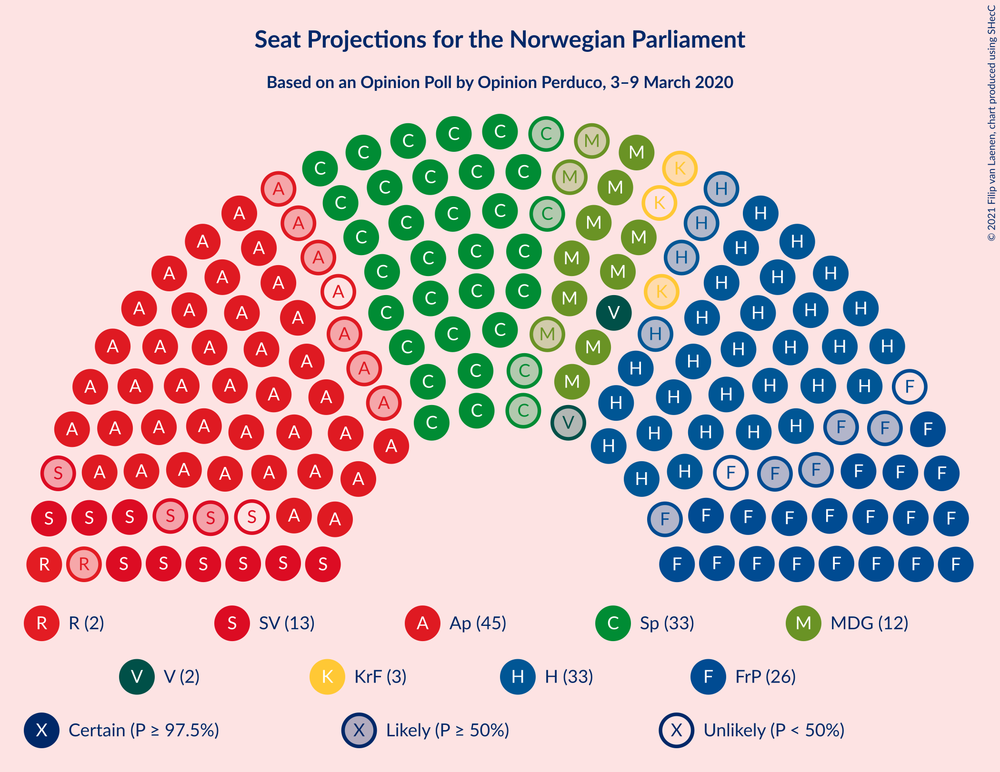
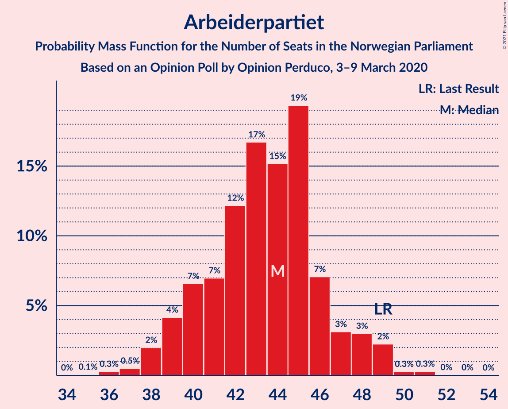
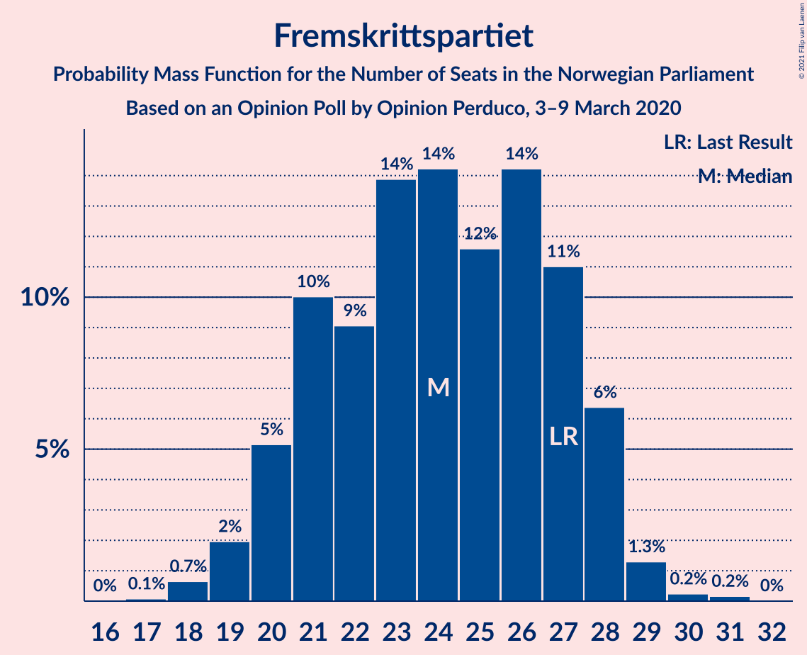
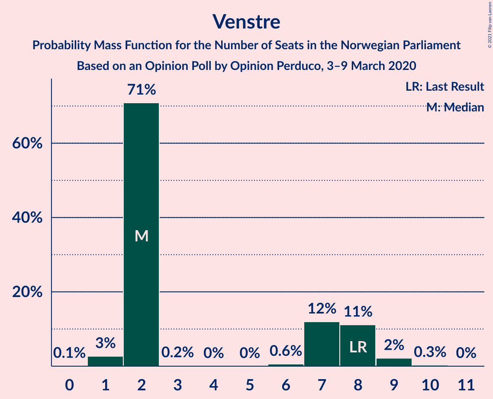
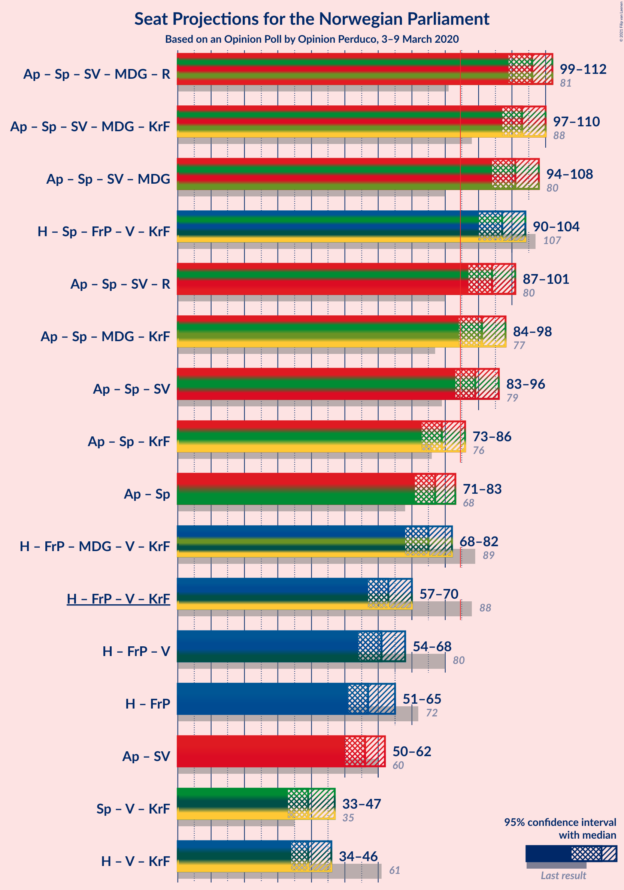
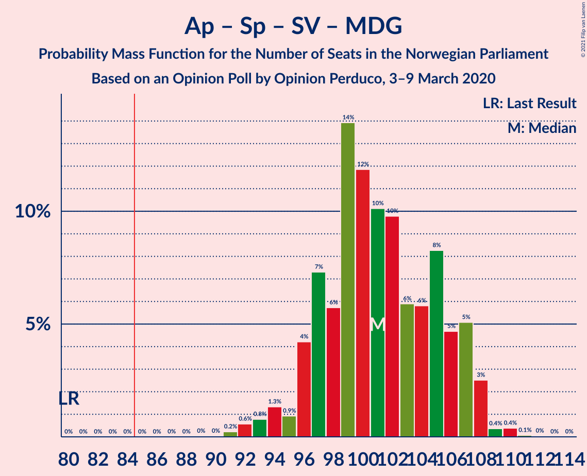
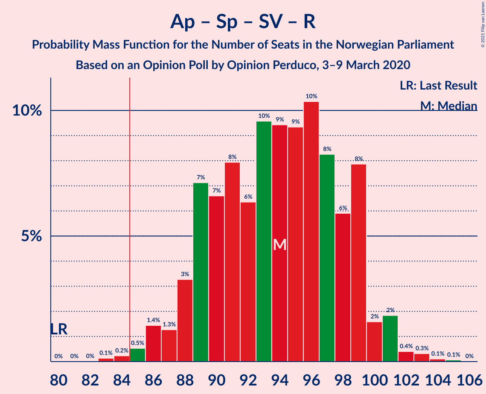
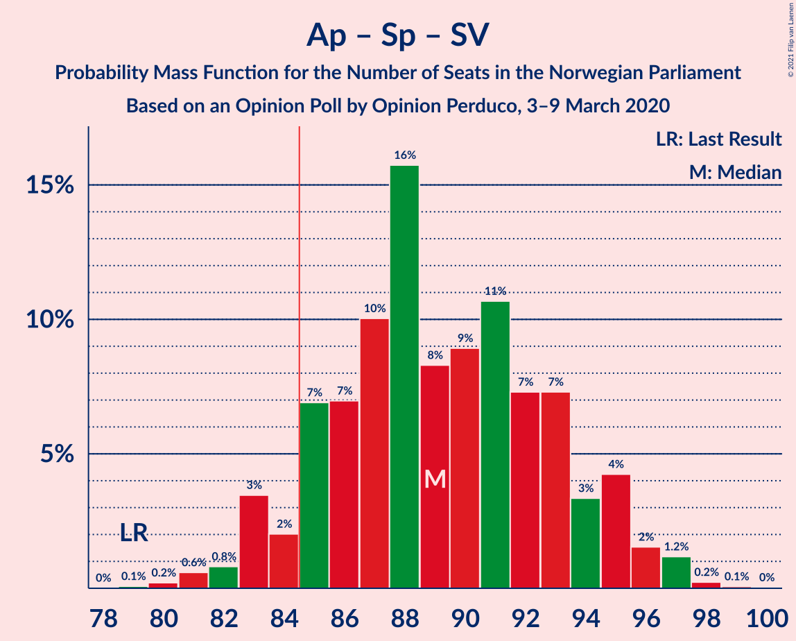
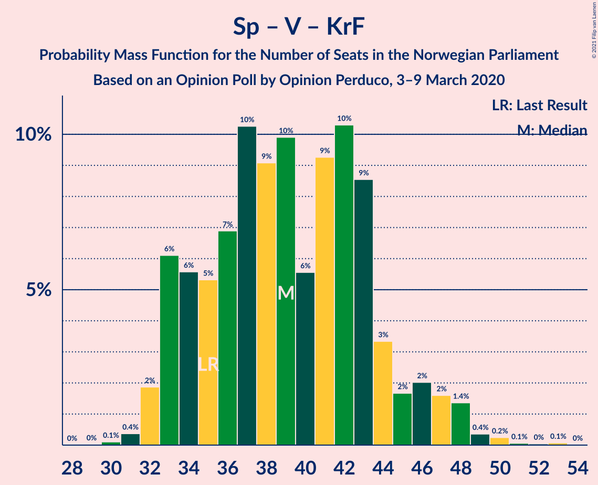

# Opinion Poll by Opinion Perduco, 3–9 March 2020

<a href="#voting-intentions">Voting Intentions</a> | <a href="#seats">Seats</a> | <a href="#coalitions">Coalitions</a> | <a href="#technical-information">Technical Information</a>

## Voting Intentions

### Confidence Intervals

| Party | Last Result | Poll Result | 80% Confidence Interval | 90% Confidence Interval | 95% Confidence Interval | 99% Confidence Interval |
|:-----:|:-----------:|:-----------:|:-----------------------:|:-----------------------:|:-----------------------:|:-----------------------:|
| Arbeiderpartiet | 27.4% | 24.0% | 22.3–25.8% |21.8–26.4% |21.4–26.8% |20.6–27.7% |
| Høyre | 25.0% | 18.9% | 17.3–20.6% |16.9–21.0% |16.5–21.5% |15.8–22.3% |
| Senterpartiet | 10.3% | 18.4% | 16.8–20.0% |16.4–20.5% |16.0–20.9% |15.3–21.7% |
| Fremskrittspartiet | 15.2% | 13.5% | 12.2–15.0% |11.8–15.4% |11.5–15.8% |10.9–16.6% |
| Sosialistisk Venstreparti | 6.0% | 6.9% | 6.0–8.1% |5.7–8.4% |5.5–8.7% |5.0–9.3% |
| Miljøpartiet De Grønne | 3.2% | 6.7% | 5.8–7.8% |5.5–8.2% |5.3–8.5% |4.9–9.0% |
| Rødt | 2.4% | 3.9% | 3.2–4.8% |3.0–5.1% |2.9–5.3% |2.6–5.8% |
| Venstre | 4.4% | 3.5% | 2.9–4.4% |2.7–4.6% |2.5–4.9% |2.2–5.3% |
| Kristelig Folkeparti | 4.2% | 3.1% | 2.5–3.9% |2.3–4.2% |2.2–4.4% |1.9–4.8% |

*Note:* The poll result column reflects the actual value used in the calculations. Published results may vary slightly, and in addition be rounded to fewer digits.

## Seats

### Confidence Intervals

| Party | Last Result | Median | 80% Confidence Interval | 90% Confidence Interval | 95% Confidence Interval | 99% Confidence Interval |
|:-----:|:-----------:|:------:|:-----------------------:|:-----------------------:|:-----------------------:|:-----------------------:|
| <a href="#arbeiderpartiet">Arbeiderpartiet</a> | 49 | 44 | 40–47 |40–48 |38–49 |37–50 |
| <a href="#høyre">Høyre</a> | 45 | 33 | 30–38 |29–38 |29–38 |27–40 |
| <a href="#senterpartiet">Senterpartiet</a> | 19 | 33 | 30–37 |29–39 |29–39 |28–40 |
| <a href="#fremskrittspartiet">Fremskrittspartiet</a> | 27 | 24 | 21–27 |20–28 |20–28 |19–29 |
| <a href="#sosialistisk-venstreparti">Sosialistisk Venstreparti</a> | 11 | 12 | 10–14 |10–15 |9–16 |9–17 |
| <a href="#miljøpartiet-de-grønne">Miljøpartiet De Grønne</a> | 1 | 12 | 10–14 |10–15 |9–15 |9–16 |
| <a href="#rødt">Rødt</a> | 1 | 2 | 2–9 |1–9 |1–9 |1–10 |
| <a href="#venstre">Venstre</a> | 8 | 2 | 2–8 |2–8 |2–8 |1–9 |
| <a href="#kristelig-folkeparti">Kristelig Folkeparti</a> | 8 | 2 | 1–3 |1–7 |0–7 |0–8 |

### Arbeiderpartiet

*For a full overview of the results for this party, see the [Arbeiderpartiet](party-arbeiderpartiet.html) page.*

| Number of Seats | Probability | Accumulated | Special Marks |
|:---------------:|:-----------:|:-----------:|:-------------:|
| 35 | 0.1% | 100% |  |
| 36 | 0.3% | 99.9% |  |
| 37 | 0.7% | 99.6% |  |
| 38 | 2% | 98.9% |  |
| 39 | 2% | 97% |  |
| 40 | 9% | 95% |  |
| 41 | 7% | 86% |  |
| 42 | 9% | 79% |  |
| 43 | 13% | 70% |  |
| 44 | 21% | 57% | Median |
| 45 | 19% | 36% |  |
| 46 | 5% | 16% |  |
| 47 | 3% | 11% |  |
| 48 | 4% | 9% |  |
| 49 | 4% | 5% | Last Result |
| 50 | 0.2% | 0.6% |  |
| 51 | 0.3% | 0.4% |  |
| 52 | 0% | 0.1% |  |
| 53 | 0% | 0.1% |  |
| 54 | 0% | 0% |  |

### Høyre

*For a full overview of the results for this party, see the [Høyre](party-høyre.html) page.*

| Number of Seats | Probability | Accumulated | Special Marks |
|:---------------:|:-----------:|:-----------:|:-------------:|
| 25 | 0.1% | 100% |  |
| 26 | 0.1% | 99.8% |  |
| 27 | 0.3% | 99.8% |  |
| 28 | 1.0% | 99.4% |  |
| 29 | 5% | 98% |  |
| 30 | 5% | 93% |  |
| 31 | 12% | 89% |  |
| 32 | 15% | 76% |  |
| 33 | 15% | 61% | Median |
| 34 | 11% | 47% |  |
| 35 | 11% | 36% |  |
| 36 | 7% | 25% |  |
| 37 | 2% | 18% |  |
| 38 | 15% | 16% |  |
| 39 | 0.6% | 2% |  |
| 40 | 0.5% | 0.9% |  |
| 41 | 0.3% | 0.4% |  |
| 42 | 0% | 0.1% |  |
| 43 | 0% | 0% |  |
| 44 | 0% | 0% |  |
| 45 | 0% | 0% | Last Result |

### Senterpartiet

*For a full overview of the results for this party, see the [Senterpartiet](party-senterpartiet.html) page.*

| Number of Seats | Probability | Accumulated | Special Marks |
|:---------------:|:-----------:|:-----------:|:-------------:|
| 19 | 0% | 100% | Last Result |
| 20 | 0% | 100% |  |
| 21 | 0% | 100% |  |
| 22 | 0% | 100% |  |
| 23 | 0% | 100% |  |
| 24 | 0% | 100% |  |
| 25 | 0.1% | 100% |  |
| 26 | 0.1% | 99.9% |  |
| 27 | 0.2% | 99.8% |  |
| 28 | 0.6% | 99.6% |  |
| 29 | 6% | 99.0% |  |
| 30 | 17% | 93% |  |
| 31 | 8% | 76% |  |
| 32 | 11% | 68% |  |
| 33 | 7% | 57% | Median |
| 34 | 19% | 50% |  |
| 35 | 8% | 30% |  |
| 36 | 3% | 22% |  |
| 37 | 9% | 19% |  |
| 38 | 5% | 10% |  |
| 39 | 4% | 5% |  |
| 40 | 1.0% | 1.2% |  |
| 41 | 0.2% | 0.2% |  |
| 42 | 0% | 0.1% |  |
| 43 | 0% | 0% |  |

### Fremskrittspartiet

*For a full overview of the results for this party, see the [Fremskrittspartiet](party-fremskrittspartiet.html) page.*

| Number of Seats | Probability | Accumulated | Special Marks |
|:---------------:|:-----------:|:-----------:|:-------------:|
| 17 | 0.1% | 100% |  |
| 18 | 0.3% | 99.9% |  |
| 19 | 1.3% | 99.5% |  |
| 20 | 7% | 98% |  |
| 21 | 12% | 91% |  |
| 22 | 7% | 79% |  |
| 23 | 9% | 72% |  |
| 24 | 13% | 63% | Median |
| 25 | 12% | 50% |  |
| 26 | 15% | 38% |  |
| 27 | 16% | 23% | Last Result |
| 28 | 5% | 7% |  |
| 29 | 2% | 2% |  |
| 30 | 0.2% | 0.4% |  |
| 31 | 0.1% | 0.2% |  |
| 32 | 0% | 0% |  |

### Sosialistisk Venstreparti

*For a full overview of the results for this party, see the [Sosialistisk Venstreparti](party-sosialistiskvenstreparti.html) page.*

| Number of Seats | Probability | Accumulated | Special Marks |
|:---------------:|:-----------:|:-----------:|:-------------:|
| 8 | 0.3% | 100% |  |
| 9 | 3% | 99.6% |  |
| 10 | 9% | 96% |  |
| 11 | 17% | 87% | Last Result |
| 12 | 22% | 70% | Median |
| 13 | 28% | 48% |  |
| 14 | 12% | 20% |  |
| 15 | 6% | 9% |  |
| 16 | 2% | 3% |  |
| 17 | 0.6% | 0.7% |  |
| 18 | 0.1% | 0.2% |  |
| 19 | 0% | 0% |  |

### Miljøpartiet De Grønne

*For a full overview of the results for this party, see the [Miljøpartiet De Grønne](party-miljøpartietdegrønne.html) page.*

| Number of Seats | Probability | Accumulated | Special Marks |
|:---------------:|:-----------:|:-----------:|:-------------:|
| 1 | 0% | 100% | Last Result |
| 2 | 0% | 100% |  |
| 3 | 0% | 100% |  |
| 4 | 0% | 100% |  |
| 5 | 0% | 100% |  |
| 6 | 0% | 100% |  |
| 7 | 0% | 100% |  |
| 8 | 0.4% | 100% |  |
| 9 | 3% | 99.6% |  |
| 10 | 9% | 96% |  |
| 11 | 27% | 87% |  |
| 12 | 28% | 60% | Median |
| 13 | 20% | 32% |  |
| 14 | 7% | 12% |  |
| 15 | 4% | 5% |  |
| 16 | 2% | 2% |  |
| 17 | 0.1% | 0.1% |  |
| 18 | 0% | 0% |  |

### Rødt

*For a full overview of the results for this party, see the [Rødt](party-rødt.html) page.*

| Number of Seats | Probability | Accumulated | Special Marks |
|:---------------:|:-----------:|:-----------:|:-------------:|
| 1 | 8% | 100% | Last Result |
| 2 | 50% | 92% | Median |
| 3 | 0% | 42% |  |
| 4 | 0% | 42% |  |
| 5 | 0% | 42% |  |
| 6 | 0.3% | 42% |  |
| 7 | 14% | 42% |  |
| 8 | 15% | 28% |  |
| 9 | 12% | 13% |  |
| 10 | 1.3% | 2% |  |
| 11 | 0.3% | 0.3% |  |
| 12 | 0% | 0% |  |

### Venstre

*For a full overview of the results for this party, see the [Venstre](party-venstre.html) page.*

| Number of Seats | Probability | Accumulated | Special Marks |
|:---------------:|:-----------:|:-----------:|:-------------:|
| 0 | 0.1% | 100% |  |
| 1 | 2% | 99.9% |  |
| 2 | 74% | 98% | Median |
| 3 | 0% | 24% |  |
| 4 | 0% | 24% |  |
| 5 | 0% | 24% |  |
| 6 | 0.7% | 24% |  |
| 7 | 7% | 23% |  |
| 8 | 14% | 16% | Last Result |
| 9 | 2% | 2% |  |
| 10 | 0.3% | 0.3% |  |
| 11 | 0% | 0% |  |

### Kristelig Folkeparti

*For a full overview of the results for this party, see the [Kristelig Folkeparti](party-kristeligfolkeparti.html) page.*

| Number of Seats | Probability | Accumulated | Special Marks |
|:---------------:|:-----------:|:-----------:|:-------------:|
| 0 | 5% | 100% |  |
| 1 | 44% | 95% |  |
| 2 | 17% | 51% | Median |
| 3 | 27% | 35% |  |
| 4 | 0% | 8% |  |
| 5 | 0% | 8% |  |
| 6 | 0.7% | 8% |  |
| 7 | 5% | 7% |  |
| 8 | 2% | 2% | Last Result |
| 9 | 0.1% | 0.2% |  |
| 10 | 0% | 0% |  |

## Coalitions

### Confidence Intervals

| Coalition | Last Result | Median | Majority? | 80% Confidence Interval | 90% Confidence Interval | 95% Confidence Interval | 99% Confidence Interval |
|:---------:|:-----------:|:------:|:---------:|:-----------------------:|:-----------------------:|:-----------------------:|:-----------------------:|
| Arbeiderpartiet – Senterpartiet – Sosialistisk Venstreparti – Miljøpartiet De Grønne – Rødt | 81 | 106 | 100% | 101–111 | 100–112 | 99–112 | 96–114 |
| Arbeiderpartiet – Senterpartiet – Sosialistisk Venstreparti – Miljøpartiet De Grønne – Kristelig Folkeparti | 88 | 103 | 100% | 99–108 | 98–109 | 97–111 | 94–112 |
| Arbeiderpartiet – Senterpartiet – Sosialistisk Venstreparti – Miljøpartiet De Grønne | 80 | 101 | 100% | 97–106 | 96–107 | 94–108 | 92–110 |
| Høyre – Senterpartiet – Fremskrittspartiet – Venstre – Kristelig Folkeparti | 107 | 97 | 100% | 93–100 | 91–103 | 90–104 | 87–107 |
| Arbeiderpartiet – Senterpartiet – Sosialistisk Venstreparti – Rødt | 80 | 94 | 99.6% | 89–99 | 88–99 | 86–100 | 85–102 |
| Arbeiderpartiet – Senterpartiet – Miljøpartiet De Grønne – Kristelig Folkeparti | 77 | 91 | 97% | 87–97 | 85–97 | 84–98 | 82–100 |
| Arbeiderpartiet – Senterpartiet – Sosialistisk Venstreparti | 79 | 89 | 94% | 85–94 | 84–95 | 83–96 | 81–97 |
| Arbeiderpartiet – Senterpartiet – Kristelig Folkeparti | 76 | 79 | 5% | 75–84 | 74–84 | 73–87 | 71–88 |
| Arbeiderpartiet – Senterpartiet | 68 | 77 | 0.4% | 73–81 | 72–82 | 71–83 | 69–84 |
| Høyre – Fremskrittspartiet – Miljøpartiet De Grønne – Venstre – Kristelig Folkeparti | 89 | 75 | 0.4% | 70–80 | 70–81 | 69–83 | 67–84 |
| Høyre – Fremskrittspartiet – Venstre – Kristelig Folkeparti | 88 | 63 | 0% | 58–68 | 57–69 | 57–70 | 55–73 |
| Høyre – Fremskrittspartiet – Venstre | 80 | 61 | 0% | 56–67 | 54–67 | 54–68 | 53–70 |
| Høyre – Fremskrittspartiet | 72 | 57 | 0% | 52–64 | 52–65 | 51–65 | 50–66 |
| Arbeiderpartiet – Sosialistisk Venstreparti | 60 | 56 | 0% | 52–60 | 51–62 | 50–62 | 48–63 |
| Senterpartiet – Venstre – Kristelig Folkeparti | 35 | 39 | 0% | 33–44 | 33–45 | 32–47 | 32–50 |
| Høyre – Venstre – Kristelig Folkeparti | 61 | 39 | 0% | 35–43 | 34–44 | 33–45 | 32–48 |

### Arbeiderpartiet – Senterpartiet – Sosialistisk Venstreparti – Miljøpartiet De Grønne – Rødt

| Number of Seats | Probability | Accumulated | Special Marks |
|:---------------:|:-----------:|:-----------:|:-------------:|
| 81 | 0% | 100% | Last Result |
| 82 | 0% | 100% |  |
| 83 | 0% | 100% |  |
| 84 | 0% | 100% |  |
| 85 | 0% | 100% | Majority |
| 86 | 0% | 100% |  |
| 87 | 0% | 100% |  |
| 88 | 0% | 100% |  |
| 89 | 0% | 100% |  |
| 90 | 0% | 100% |  |
| 91 | 0% | 100% |  |
| 92 | 0% | 100% |  |
| 93 | 0% | 100% |  |
| 94 | 0% | 100% |  |
| 95 | 0.1% | 100% |  |
| 96 | 0.4% | 99.9% |  |
| 97 | 0.5% | 99.5% |  |
| 98 | 1.1% | 99.0% |  |
| 99 | 2% | 98% |  |
| 100 | 3% | 96% |  |
| 101 | 13% | 93% |  |
| 102 | 7% | 80% |  |
| 103 | 6% | 73% | Median |
| 104 | 8% | 67% |  |
| 105 | 4% | 58% |  |
| 106 | 10% | 54% |  |
| 107 | 8% | 44% |  |
| 108 | 11% | 36% |  |
| 109 | 7% | 25% |  |
| 110 | 6% | 18% |  |
| 111 | 4% | 12% |  |
| 112 | 7% | 8% |  |
| 113 | 0.4% | 1.3% |  |
| 114 | 0.5% | 0.9% |  |
| 115 | 0.3% | 0.4% |  |
| 116 | 0.1% | 0.1% |  |
| 117 | 0% | 0% |  |

### Arbeiderpartiet – Senterpartiet – Sosialistisk Venstreparti – Miljøpartiet De Grønne – Kristelig Folkeparti

| Number of Seats | Probability | Accumulated | Special Marks |
|:---------------:|:-----------:|:-----------:|:-------------:|
| 88 | 0% | 100% | Last Result |
| 89 | 0% | 100% |  |
| 90 | 0% | 100% |  |
| 91 | 0% | 100% |  |
| 92 | 0% | 100% |  |
| 93 | 0.2% | 99.9% |  |
| 94 | 1.1% | 99.7% |  |
| 95 | 0.5% | 98.6% |  |
| 96 | 0.3% | 98% |  |
| 97 | 1.0% | 98% |  |
| 98 | 3% | 97% |  |
| 99 | 5% | 94% |  |
| 100 | 15% | 89% |  |
| 101 | 11% | 74% |  |
| 102 | 10% | 63% |  |
| 103 | 12% | 53% | Median |
| 104 | 5% | 42% |  |
| 105 | 6% | 36% |  |
| 106 | 6% | 30% |  |
| 107 | 5% | 24% |  |
| 108 | 10% | 20% |  |
| 109 | 5% | 9% |  |
| 110 | 1.4% | 4% |  |
| 111 | 2% | 3% |  |
| 112 | 0.3% | 0.7% |  |
| 113 | 0.3% | 0.4% |  |
| 114 | 0.1% | 0.1% |  |
| 115 | 0% | 0% |  |

### Arbeiderpartiet – Senterpartiet – Sosialistisk Venstreparti – Miljøpartiet De Grønne

| Number of Seats | Probability | Accumulated | Special Marks |
|:---------------:|:-----------:|:-----------:|:-------------:|
| 80 | 0% | 100% | Last Result |
| 81 | 0% | 100% |  |
| 82 | 0% | 100% |  |
| 83 | 0% | 100% |  |
| 84 | 0% | 100% |  |
| 85 | 0% | 100% | Majority |
| 86 | 0% | 100% |  |
| 87 | 0% | 100% |  |
| 88 | 0% | 100% |  |
| 89 | 0% | 100% |  |
| 90 | 0% | 100% |  |
| 91 | 0.2% | 99.9% |  |
| 92 | 0.5% | 99.8% |  |
| 93 | 1.2% | 99.2% |  |
| 94 | 1.3% | 98% |  |
| 95 | 1.0% | 97% |  |
| 96 | 3% | 96% |  |
| 97 | 3% | 92% |  |
| 98 | 7% | 89% |  |
| 99 | 20% | 83% |  |
| 100 | 9% | 63% |  |
| 101 | 13% | 54% | Median |
| 102 | 10% | 41% |  |
| 103 | 3% | 31% |  |
| 104 | 7% | 28% |  |
| 105 | 7% | 21% |  |
| 106 | 6% | 14% |  |
| 107 | 3% | 8% |  |
| 108 | 4% | 5% |  |
| 109 | 0.3% | 1.0% |  |
| 110 | 0.5% | 0.7% |  |
| 111 | 0.1% | 0.2% |  |
| 112 | 0.1% | 0.1% |  |
| 113 | 0% | 0% |  |

### Høyre – Senterpartiet – Fremskrittspartiet – Venstre – Kristelig Folkeparti

| Number of Seats | Probability | Accumulated | Special Marks |
|:---------------:|:-----------:|:-----------:|:-------------:|
| 86 | 0% | 100% |  |
| 87 | 0.5% | 99.9% |  |
| 88 | 0.3% | 99.5% |  |
| 89 | 0.6% | 99.1% |  |
| 90 | 3% | 98.5% |  |
| 91 | 3% | 96% |  |
| 92 | 2% | 93% |  |
| 93 | 10% | 91% |  |
| 94 | 7% | 81% | Median |
| 95 | 11% | 74% |  |
| 96 | 9% | 63% |  |
| 97 | 12% | 54% |  |
| 98 | 11% | 42% |  |
| 99 | 17% | 31% |  |
| 100 | 4% | 14% |  |
| 101 | 2% | 10% |  |
| 102 | 2% | 8% |  |
| 103 | 2% | 6% |  |
| 104 | 3% | 4% |  |
| 105 | 0.6% | 2% |  |
| 106 | 0.4% | 0.9% |  |
| 107 | 0.5% | 0.5% | Last Result |
| 108 | 0% | 0% |  |

### Arbeiderpartiet – Senterpartiet – Sosialistisk Venstreparti – Rødt

| Number of Seats | Probability | Accumulated | Special Marks |
|:---------------:|:-----------:|:-----------:|:-------------:|
| 80 | 0% | 100% | Last Result |
| 81 | 0% | 100% |  |
| 82 | 0% | 100% |  |
| 83 | 0.1% | 100% |  |
| 84 | 0.3% | 99.9% |  |
| 85 | 0.5% | 99.6% | Majority |
| 86 | 2% | 99.1% |  |
| 87 | 1.3% | 97% |  |
| 88 | 5% | 96% |  |
| 89 | 10% | 91% |  |
| 90 | 6% | 80% |  |
| 91 | 8% | 75% | Median |
| 92 | 3% | 67% |  |
| 93 | 13% | 64% |  |
| 94 | 7% | 51% |  |
| 95 | 8% | 44% |  |
| 96 | 6% | 36% |  |
| 97 | 10% | 30% |  |
| 98 | 7% | 20% |  |
| 99 | 10% | 13% |  |
| 100 | 2% | 3% |  |
| 101 | 0.9% | 2% |  |
| 102 | 0.5% | 0.8% |  |
| 103 | 0.2% | 0.3% |  |
| 104 | 0.1% | 0.1% |  |
| 105 | 0.1% | 0.1% |  |
| 106 | 0% | 0% |  |

### Arbeiderpartiet – Senterpartiet – Miljøpartiet De Grønne – Kristelig Folkeparti

| Number of Seats | Probability | Accumulated | Special Marks |
|:---------------:|:-----------:|:-----------:|:-------------:|
| 77 | 0% | 100% | Last Result |
| 78 | 0% | 100% |  |
| 79 | 0% | 100% |  |
| 80 | 0% | 100% |  |
| 81 | 0.2% | 100% |  |
| 82 | 0.6% | 99.7% |  |
| 83 | 0.7% | 99.1% |  |
| 84 | 2% | 98% |  |
| 85 | 2% | 97% | Majority |
| 86 | 3% | 94% |  |
| 87 | 2% | 91% |  |
| 88 | 18% | 89% |  |
| 89 | 14% | 71% |  |
| 90 | 4% | 57% |  |
| 91 | 13% | 53% | Median |
| 92 | 6% | 40% |  |
| 93 | 6% | 33% |  |
| 94 | 6% | 28% |  |
| 95 | 9% | 21% |  |
| 96 | 2% | 13% |  |
| 97 | 8% | 11% |  |
| 98 | 1.0% | 3% |  |
| 99 | 1.0% | 2% |  |
| 100 | 0.3% | 0.5% |  |
| 101 | 0.1% | 0.2% |  |
| 102 | 0% | 0.1% |  |
| 103 | 0% | 0% |  |

### Arbeiderpartiet – Senterpartiet – Sosialistisk Venstreparti

| Number of Seats | Probability | Accumulated | Special Marks |
|:---------------:|:-----------:|:-----------:|:-------------:|
| 79 | 0.1% | 100% | Last Result |
| 80 | 0.1% | 99.9% |  |
| 81 | 0.7% | 99.8% |  |
| 82 | 1.1% | 99.2% |  |
| 83 | 2% | 98% |  |
| 84 | 3% | 96% |  |
| 85 | 4% | 94% | Majority |
| 86 | 10% | 90% |  |
| 87 | 12% | 80% |  |
| 88 | 12% | 68% |  |
| 89 | 10% | 56% | Median |
| 90 | 10% | 46% |  |
| 91 | 12% | 35% |  |
| 92 | 6% | 23% |  |
| 93 | 6% | 17% |  |
| 94 | 5% | 11% |  |
| 95 | 2% | 6% |  |
| 96 | 2% | 4% |  |
| 97 | 2% | 2% |  |
| 98 | 0.3% | 0.4% |  |
| 99 | 0.1% | 0.1% |  |
| 100 | 0% | 0.1% |  |
| 101 | 0% | 0% |  |

### Arbeiderpartiet – Senterpartiet – Kristelig Folkeparti

| Number of Seats | Probability | Accumulated | Special Marks |
|:---------------:|:-----------:|:-----------:|:-------------:|
| 69 | 0.1% | 100% |  |
| 70 | 0.3% | 99.9% |  |
| 71 | 0.6% | 99.6% |  |
| 72 | 1.2% | 99.1% |  |
| 73 | 2% | 98% |  |
| 74 | 5% | 95% |  |
| 75 | 4% | 90% |  |
| 76 | 14% | 87% | Last Result |
| 77 | 8% | 73% |  |
| 78 | 13% | 65% |  |
| 79 | 10% | 52% | Median |
| 80 | 9% | 43% |  |
| 81 | 10% | 34% |  |
| 82 | 5% | 24% |  |
| 83 | 6% | 19% |  |
| 84 | 8% | 13% |  |
| 85 | 1.1% | 5% | Majority |
| 86 | 1.2% | 4% |  |
| 87 | 1.5% | 3% |  |
| 88 | 1.0% | 1.2% |  |
| 89 | 0.2% | 0.3% |  |
| 90 | 0.1% | 0.1% |  |
| 91 | 0% | 0% |  |

### Arbeiderpartiet – Senterpartiet

| Number of Seats | Probability | Accumulated | Special Marks |
|:---------------:|:-----------:|:-----------:|:-------------:|
| 67 | 0% | 100% |  |
| 68 | 0.1% | 99.9% | Last Result |
| 69 | 0.9% | 99.9% |  |
| 70 | 0.5% | 99.0% |  |
| 71 | 2% | 98.5% |  |
| 72 | 5% | 96% |  |
| 73 | 6% | 91% |  |
| 74 | 3% | 85% |  |
| 75 | 20% | 82% |  |
| 76 | 8% | 62% |  |
| 77 | 11% | 53% | Median |
| 78 | 8% | 42% |  |
| 79 | 13% | 34% |  |
| 80 | 6% | 21% |  |
| 81 | 9% | 15% |  |
| 82 | 2% | 6% |  |
| 83 | 2% | 3% |  |
| 84 | 1.5% | 2% |  |
| 85 | 0.2% | 0.4% | Majority |
| 86 | 0.1% | 0.2% |  |
| 87 | 0.1% | 0.1% |  |
| 88 | 0% | 0% |  |

### Høyre – Fremskrittspartiet – Miljøpartiet De Grønne – Venstre – Kristelig Folkeparti

| Number of Seats | Probability | Accumulated | Special Marks |
|:---------------:|:-----------:|:-----------:|:-------------:|
| 64 | 0.1% | 100% |  |
| 65 | 0.1% | 99.9% |  |
| 66 | 0.2% | 99.9% |  |
| 67 | 0.5% | 99.7% |  |
| 68 | 0.9% | 99.2% |  |
| 69 | 2% | 98% |  |
| 70 | 10% | 97% |  |
| 71 | 7% | 87% |  |
| 72 | 10% | 80% |  |
| 73 | 6% | 70% | Median |
| 74 | 8% | 64% |  |
| 75 | 7% | 56% |  |
| 76 | 13% | 49% |  |
| 77 | 3% | 36% |  |
| 78 | 8% | 33% |  |
| 79 | 6% | 25% |  |
| 80 | 10% | 20% |  |
| 81 | 5% | 9% |  |
| 82 | 1.3% | 4% |  |
| 83 | 2% | 3% |  |
| 84 | 0.5% | 0.9% |  |
| 85 | 0.3% | 0.4% | Majority |
| 86 | 0.1% | 0.1% |  |
| 87 | 0% | 0% |  |
| 88 | 0% | 0% |  |
| 89 | 0% | 0% | Last Result |

### Høyre – Fremskrittspartiet – Venstre – Kristelig Folkeparti

| Number of Seats | Probability | Accumulated | Special Marks |
|:---------------:|:-----------:|:-----------:|:-------------:|
| 53 | 0.1% | 100% |  |
| 54 | 0.3% | 99.9% |  |
| 55 | 0.5% | 99.6% |  |
| 56 | 0.4% | 99.1% |  |
| 57 | 7% | 98.7% |  |
| 58 | 4% | 92% |  |
| 59 | 6% | 88% |  |
| 60 | 7% | 82% |  |
| 61 | 11% | 75% | Median |
| 62 | 8% | 64% |  |
| 63 | 10% | 56% |  |
| 64 | 4% | 46% |  |
| 65 | 8% | 42% |  |
| 66 | 6% | 33% |  |
| 67 | 7% | 27% |  |
| 68 | 13% | 20% |  |
| 69 | 3% | 7% |  |
| 70 | 2% | 4% |  |
| 71 | 1.1% | 2% |  |
| 72 | 0.5% | 1.0% |  |
| 73 | 0.4% | 0.5% |  |
| 74 | 0.1% | 0.1% |  |
| 75 | 0% | 0% |  |
| 76 | 0% | 0% |  |
| 77 | 0% | 0% |  |
| 78 | 0% | 0% |  |
| 79 | 0% | 0% |  |
| 80 | 0% | 0% |  |
| 81 | 0% | 0% |  |
| 82 | 0% | 0% |  |
| 83 | 0% | 0% |  |
| 84 | 0% | 0% |  |
| 85 | 0% | 0% | Majority |
| 86 | 0% | 0% |  |
| 87 | 0% | 0% |  |
| 88 | 0% | 0% | Last Result |

### Høyre – Fremskrittspartiet – Venstre

| Number of Seats | Probability | Accumulated | Special Marks |
|:---------------:|:-----------:|:-----------:|:-------------:|
| 50 | 0.1% | 100% |  |
| 51 | 0.2% | 99.9% |  |
| 52 | 0.2% | 99.8% |  |
| 53 | 2% | 99.6% |  |
| 54 | 5% | 98% |  |
| 55 | 0.8% | 93% |  |
| 56 | 9% | 93% |  |
| 57 | 3% | 84% |  |
| 58 | 10% | 81% |  |
| 59 | 10% | 71% | Median |
| 60 | 7% | 62% |  |
| 61 | 8% | 54% |  |
| 62 | 9% | 47% |  |
| 63 | 3% | 38% |  |
| 64 | 8% | 34% |  |
| 65 | 5% | 26% |  |
| 66 | 6% | 21% |  |
| 67 | 11% | 14% |  |
| 68 | 0.9% | 3% |  |
| 69 | 1.3% | 2% |  |
| 70 | 0.2% | 0.6% |  |
| 71 | 0.2% | 0.4% |  |
| 72 | 0.2% | 0.2% |  |
| 73 | 0% | 0% |  |
| 74 | 0% | 0% |  |
| 75 | 0% | 0% |  |
| 76 | 0% | 0% |  |
| 77 | 0% | 0% |  |
| 78 | 0% | 0% |  |
| 79 | 0% | 0% |  |
| 80 | 0% | 0% | Last Result |

### Høyre – Fremskrittspartiet

| Number of Seats | Probability | Accumulated | Special Marks |
|:---------------:|:-----------:|:-----------:|:-------------:|
| 48 | 0.1% | 100% |  |
| 49 | 0.2% | 99.8% |  |
| 50 | 1.2% | 99.6% |  |
| 51 | 2% | 98% |  |
| 52 | 6% | 96% |  |
| 53 | 2% | 90% |  |
| 54 | 11% | 87% |  |
| 55 | 4% | 77% |  |
| 56 | 13% | 73% |  |
| 57 | 11% | 60% | Median |
| 58 | 7% | 48% |  |
| 59 | 10% | 41% |  |
| 60 | 7% | 31% |  |
| 61 | 3% | 24% |  |
| 62 | 5% | 21% |  |
| 63 | 3% | 16% |  |
| 64 | 5% | 14% |  |
| 65 | 9% | 9% |  |
| 66 | 0.2% | 0.6% |  |
| 67 | 0.3% | 0.5% |  |
| 68 | 0.1% | 0.2% |  |
| 69 | 0% | 0% |  |
| 70 | 0% | 0% |  |
| 71 | 0% | 0% |  |
| 72 | 0% | 0% | Last Result |

### Arbeiderpartiet – Sosialistisk Venstreparti

| Number of Seats | Probability | Accumulated | Special Marks |
|:---------------:|:-----------:|:-----------:|:-------------:|
| 47 | 0.2% | 100% |  |
| 48 | 0.4% | 99.8% |  |
| 49 | 0.9% | 99.3% |  |
| 50 | 2% | 98% |  |
| 51 | 5% | 97% |  |
| 52 | 4% | 92% |  |
| 53 | 11% | 88% |  |
| 54 | 9% | 77% |  |
| 55 | 12% | 69% |  |
| 56 | 7% | 57% | Median |
| 57 | 26% | 50% |  |
| 58 | 8% | 24% |  |
| 59 | 5% | 16% |  |
| 60 | 3% | 11% | Last Result |
| 61 | 1.5% | 8% |  |
| 62 | 5% | 7% |  |
| 63 | 2% | 2% |  |
| 64 | 0% | 0.1% |  |
| 65 | 0% | 0.1% |  |
| 66 | 0% | 0.1% |  |
| 67 | 0% | 0% |  |

### Senterpartiet – Venstre – Kristelig Folkeparti

| Number of Seats | Probability | Accumulated | Special Marks |
|:---------------:|:-----------:|:-----------:|:-------------:|
| 30 | 0.2% | 100% |  |
| 31 | 0.2% | 99.8% |  |
| 32 | 3% | 99.6% |  |
| 33 | 11% | 97% |  |
| 34 | 5% | 86% |  |
| 35 | 6% | 81% | Last Result |
| 36 | 7% | 74% |  |
| 37 | 10% | 67% | Median |
| 38 | 5% | 57% |  |
| 39 | 8% | 53% |  |
| 40 | 6% | 44% |  |
| 41 | 7% | 38% |  |
| 42 | 10% | 31% |  |
| 43 | 9% | 21% |  |
| 44 | 6% | 12% |  |
| 45 | 1.4% | 6% |  |
| 46 | 1.1% | 5% |  |
| 47 | 1.2% | 4% |  |
| 48 | 2% | 2% |  |
| 49 | 0.2% | 0.8% |  |
| 50 | 0.4% | 0.6% |  |
| 51 | 0.1% | 0.1% |  |
| 52 | 0% | 0.1% |  |
| 53 | 0% | 0% |  |

### Høyre – Venstre – Kristelig Folkeparti

| Number of Seats | Probability | Accumulated | Special Marks |
|:---------------:|:-----------:|:-----------:|:-------------:|
| 30 | 0.1% | 100% |  |
| 31 | 0.1% | 99.9% |  |
| 32 | 0.5% | 99.8% |  |
| 33 | 2% | 99.3% |  |
| 34 | 7% | 97% |  |
| 35 | 10% | 90% |  |
| 36 | 8% | 80% |  |
| 37 | 8% | 72% | Median |
| 38 | 4% | 64% |  |
| 39 | 12% | 61% |  |
| 40 | 6% | 49% |  |
| 41 | 20% | 43% |  |
| 42 | 9% | 23% |  |
| 43 | 6% | 14% |  |
| 44 | 4% | 9% |  |
| 45 | 2% | 4% |  |
| 46 | 0.6% | 2% |  |
| 47 | 1.1% | 2% |  |
| 48 | 0.6% | 0.8% |  |
| 49 | 0.1% | 0.2% |  |
| 50 | 0.1% | 0.1% |  |
| 51 | 0% | 0% |  |
| 52 | 0% | 0% |  |
| 53 | 0% | 0% |  |
| 54 | 0% | 0% |  |
| 55 | 0% | 0% |  |
| 56 | 0% | 0% |  |
| 57 | 0% | 0% |  |
| 58 | 0% | 0% |  |
| 59 | 0% | 0% |  |
| 60 | 0% | 0% |  |
| 61 | 0% | 0% | Last Result |

## Technical Information

### Opinion Poll

+ **Polling firm:** Opinion Perduco
+ **Commissioner(s):** —
+ **Fieldwork period:** 3–9 March 2020

### Calculations

+ **Sample size:** 970
+ **Simulations done:** 524,288
+ **Error estimate:** 3.31%

