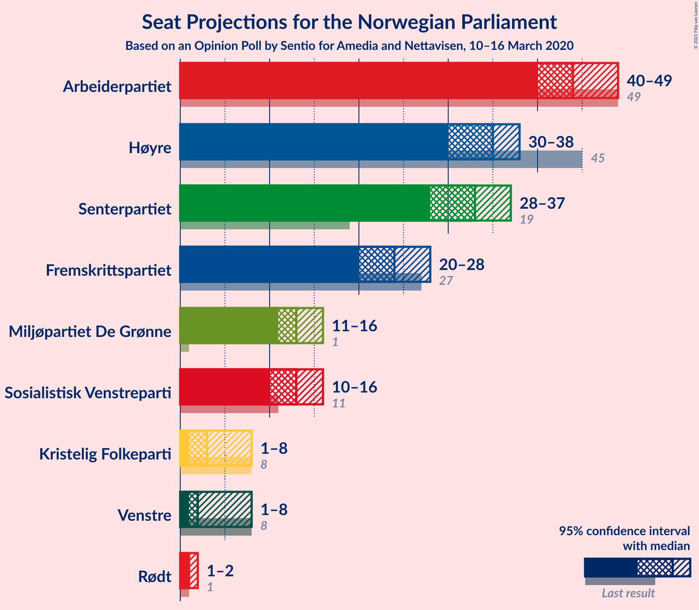
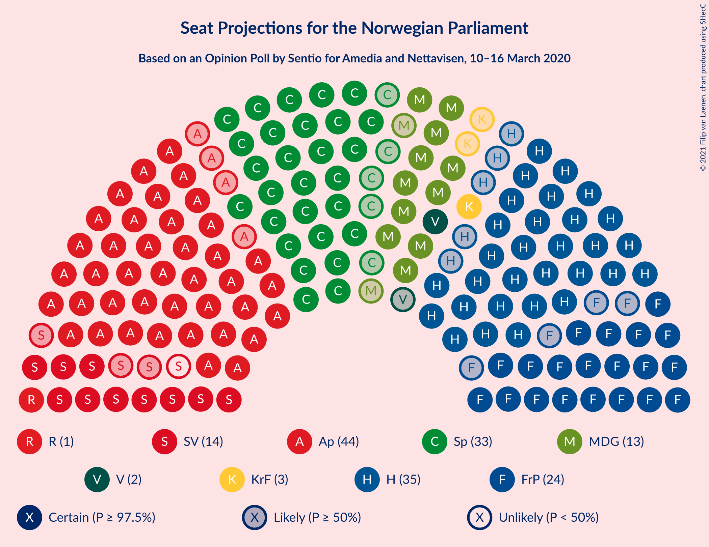
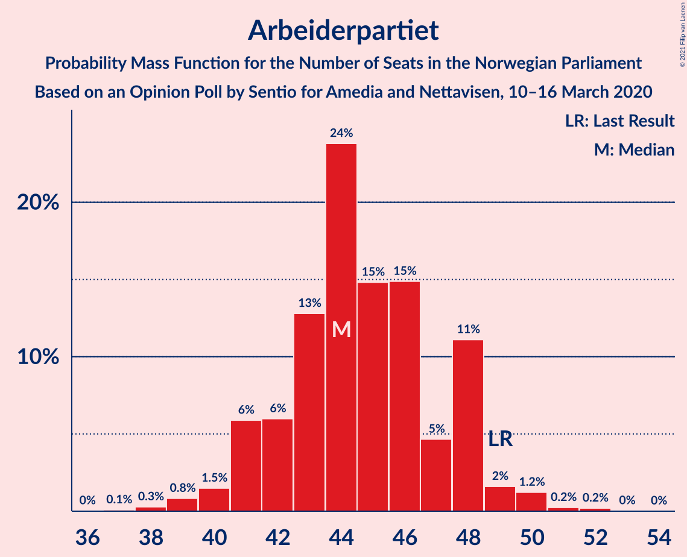
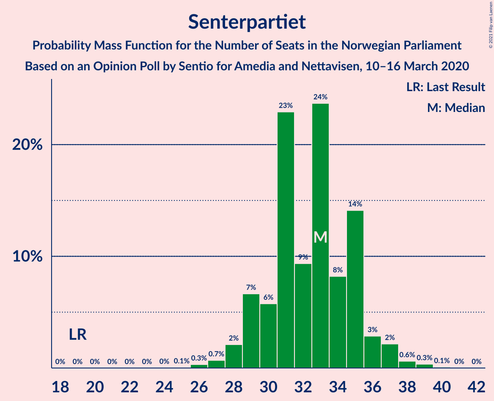
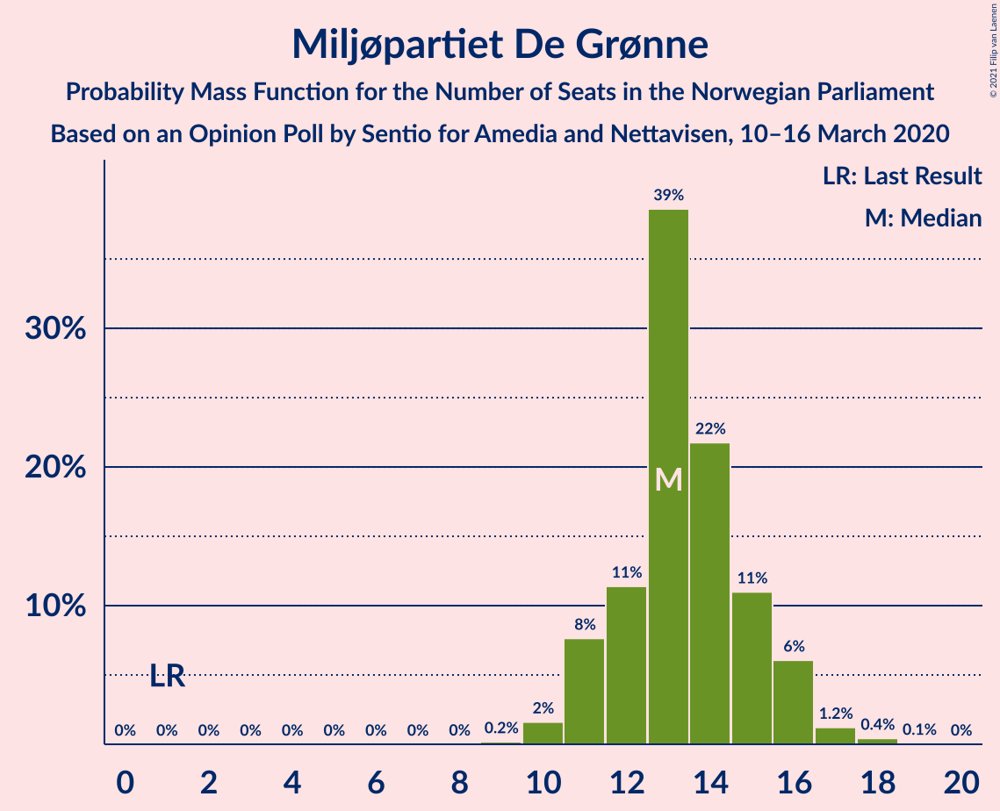
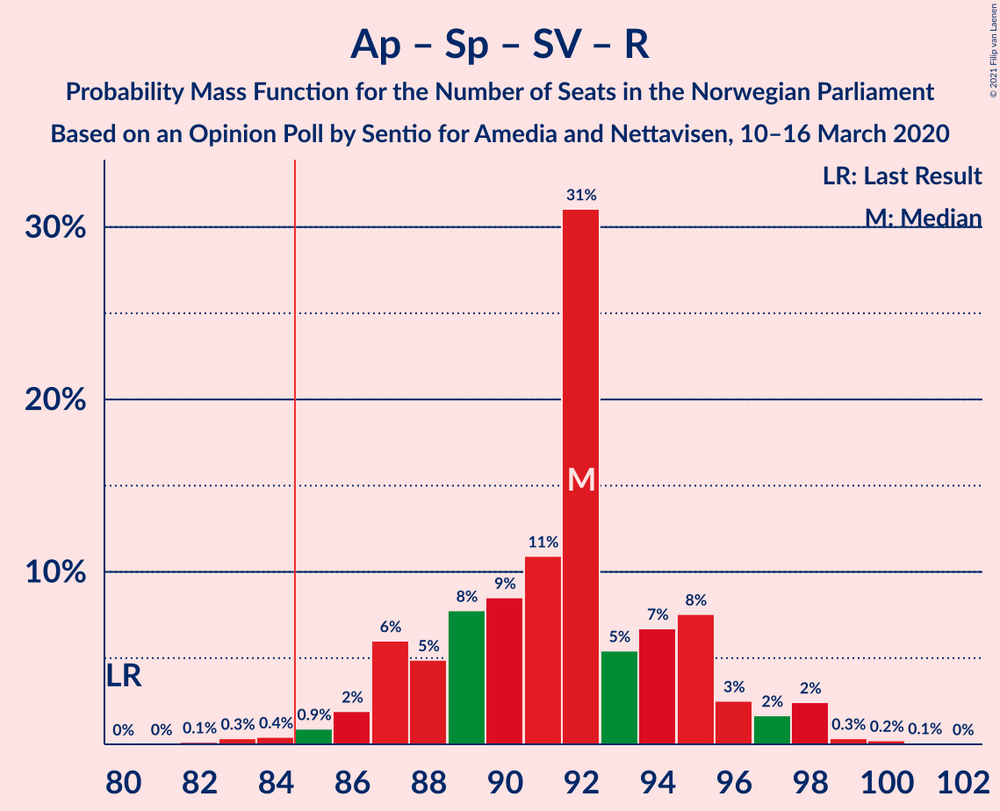
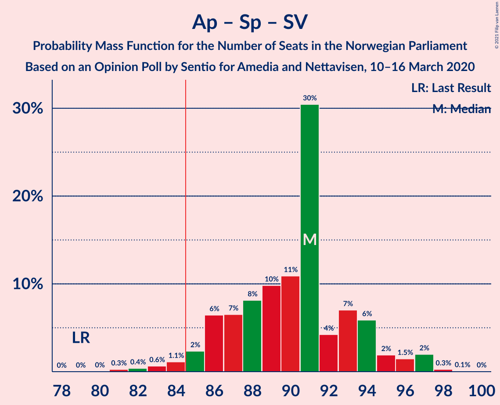
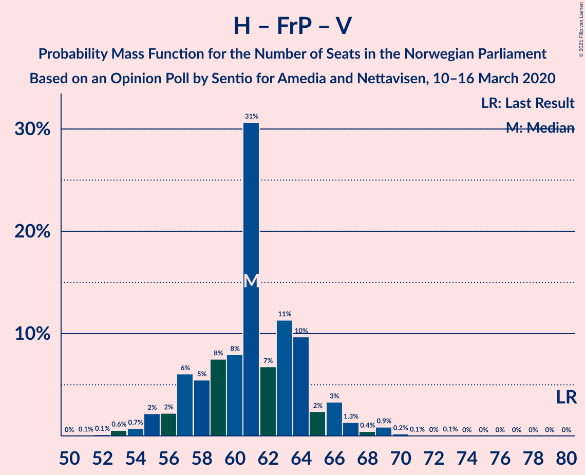

# Opinion Poll by Sentio for Nettavisen and Amedia, 10–16 March 2020

<a href="#voting-intentions">Voting Intentions</a> | <a href="#seats">Seats</a> | <a href="#coalitions">Coalitions</a> | <a href="#technical-information">Technical Information</a>

## Voting Intentions

### Confidence Intervals

| Party | Last Result | Poll Result | 80% Confidence Interval | 90% Confidence Interval | 95% Confidence Interval | 99% Confidence Interval |
|:-----:|:-----------:|:-----------:|:-----------------------:|:-----------------------:|:-----------------------:|:-----------------------:|
| Arbeiderpartiet | 27.4% | 24.3% | 22.6–26.1% |22.1–26.6% |21.7–27.1% |21.0–27.9% |
| Høyre | 25.0% | 18.8% | 17.3–20.5% |16.9–20.9% |16.5–21.4% |15.8–22.2% |
| Senterpartiet | 10.3% | 17.5% | 16.0–19.1% |15.6–19.6% |15.3–20.0% |14.6–20.8% |
| Fremskrittspartiet | 15.2% | 13.0% | 11.7–14.5% |11.4–14.9% |11.1–15.2% |10.5–16.0% |
| Miljøpartiet De Grønne | 3.2% | 7.3% | 6.3–8.5% |6.1–8.8% |5.8–9.1% |5.4–9.7% |
| Sosialistisk Venstreparti | 6.0% | 7.1% | 6.2–8.3% |5.9–8.6% |5.7–8.9% |5.2–9.4% |
| Venstre | 4.4% | 3.4% | 2.8–4.3% |2.6–4.5% |2.4–4.7% |2.2–5.2% |
| Kristelig Folkeparti | 4.2% | 3.4% | 2.8–4.3% |2.6–4.5% |2.4–4.7% |2.2–5.2% |
| Rødt | 2.4% | 2.7% | 2.1–3.5% |2.0–3.7% |1.9–3.9% |1.6–4.3% |

*Note:* The poll result column reflects the actual value used in the calculations. Published results may vary slightly, and in addition be rounded to fewer digits.

## Seats

### Confidence Intervals

| Party | Last Result | Median | 80% Confidence Interval | 90% Confidence Interval | 95% Confidence Interval | 99% Confidence Interval |
|:-----:|:-----------:|:------:|:-----------------------:|:-----------------------:|:-----------------------:|:-----------------------:|
| <a href="#arbeiderpartiet">Arbeiderpartiet</a> | 49 | 44 | 42–48 |41–48 |41–49 |39–50 |
| <a href="#høyre">Høyre</a> | 45 | 35 | 32–37 |31–38 |30–38 |29–41 |
| <a href="#senterpartiet">Senterpartiet</a> | 19 | 33 | 30–35 |29–36 |28–36 |27–38 |
| <a href="#fremskrittspartiet">Fremskrittspartiet</a> | 27 | 24 | 22–26 |20–27 |20–28 |19–29 |
| <a href="#miljøpartiet-de-grønne">Miljøpartiet De Grønne</a> | 1 | 13 | 12–15 |11–16 |11–16 |10–17 |
| <a href="#sosialistisk-venstreparti">Sosialistisk Venstreparti</a> | 11 | 13 | 12–15 |11–15 |11–16 |10–17 |
| <a href="#venstre">Venstre</a> | 8 | 2 | 2–7 |2–8 |1–8 |1–9 |
| <a href="#kristelig-folkeparti">Kristelig Folkeparti</a> | 8 | 3 | 2–3 |1–7 |1–8 |1–9 |
| <a href="#rødt">Rødt</a> | 1 | 1 | 1–2 |1–2 |1–2 |1–8 |

### Arbeiderpartiet

*For a full overview of the results for this party, see the [Arbeiderpartiet](party-arbeiderpartiet.html) page.*

| Number of Seats | Probability | Accumulated | Special Marks |
|:---------------:|:-----------:|:-----------:|:-------------:|
| 37 | 0.1% | 100% |  |
| 38 | 0.3% | 99.9% |  |
| 39 | 0.5% | 99.6% |  |
| 40 | 1.4% | 99.2% |  |
| 41 | 7% | 98% |  |
| 42 | 2% | 91% |  |
| 43 | 15% | 88% |  |
| 44 | 30% | 73% | Median |
| 45 | 8% | 44% |  |
| 46 | 14% | 35% |  |
| 47 | 4% | 22% |  |
| 48 | 14% | 17% |  |
| 49 | 1.2% | 3% | Last Result |
| 50 | 1.4% | 2% |  |
| 51 | 0.2% | 0.3% |  |
| 52 | 0.1% | 0.1% |  |
| 53 | 0% | 0% |  |

### Høyre

*For a full overview of the results for this party, see the [Høyre](party-høyre.html) page.*

| Number of Seats | Probability | Accumulated | Special Marks |
|:---------------:|:-----------:|:-----------:|:-------------:|
| 27 | 0.1% | 100% |  |
| 28 | 0.4% | 99.9% |  |
| 29 | 0.8% | 99.6% |  |
| 30 | 1.5% | 98.8% |  |
| 31 | 5% | 97% |  |
| 32 | 5% | 92% |  |
| 33 | 16% | 87% |  |
| 34 | 12% | 71% |  |
| 35 | 40% | 59% | Median |
| 36 | 6% | 19% |  |
| 37 | 8% | 13% |  |
| 38 | 3% | 6% |  |
| 39 | 0.9% | 2% |  |
| 40 | 0.5% | 1.2% |  |
| 41 | 0.5% | 0.7% |  |
| 42 | 0% | 0.1% |  |
| 43 | 0.1% | 0.1% |  |
| 44 | 0% | 0% |  |
| 45 | 0% | 0% | Last Result |

### Senterpartiet

*For a full overview of the results for this party, see the [Senterpartiet](party-senterpartiet.html) page.*

| Number of Seats | Probability | Accumulated | Special Marks |
|:---------------:|:-----------:|:-----------:|:-------------:|
| 19 | 0% | 100% | Last Result |
| 20 | 0% | 100% |  |
| 21 | 0% | 100% |  |
| 22 | 0% | 100% |  |
| 23 | 0% | 100% |  |
| 24 | 0% | 100% |  |
| 25 | 0% | 100% |  |
| 26 | 0.4% | 99.9% |  |
| 27 | 0.9% | 99.6% |  |
| 28 | 1.5% | 98.7% |  |
| 29 | 3% | 97% |  |
| 30 | 5% | 94% |  |
| 31 | 24% | 89% |  |
| 32 | 7% | 65% |  |
| 33 | 37% | 57% | Median |
| 34 | 6% | 21% |  |
| 35 | 9% | 15% |  |
| 36 | 3% | 6% |  |
| 37 | 1.3% | 2% |  |
| 38 | 0.5% | 1.0% |  |
| 39 | 0.4% | 0.5% |  |
| 40 | 0.1% | 0.1% |  |
| 41 | 0% | 0% |  |

### Fremskrittspartiet

*For a full overview of the results for this party, see the [Fremskrittspartiet](party-fremskrittspartiet.html) page.*

| Number of Seats | Probability | Accumulated | Special Marks |
|:---------------:|:-----------:|:-----------:|:-------------:|
| 18 | 0.3% | 100% |  |
| 19 | 0.7% | 99.6% |  |
| 20 | 5% | 98.9% |  |
| 21 | 3% | 94% |  |
| 22 | 11% | 91% |  |
| 23 | 6% | 80% |  |
| 24 | 46% | 74% | Median |
| 25 | 9% | 28% |  |
| 26 | 12% | 19% |  |
| 27 | 3% | 7% | Last Result |
| 28 | 4% | 4% |  |
| 29 | 0.4% | 0.5% |  |
| 30 | 0.1% | 0.1% |  |
| 31 | 0.1% | 0.1% |  |
| 32 | 0% | 0% |  |

### Miljøpartiet De Grønne

*For a full overview of the results for this party, see the [Miljøpartiet De Grønne](party-miljøpartietdegrønne.html) page.*

| Number of Seats | Probability | Accumulated | Special Marks |
|:---------------:|:-----------:|:-----------:|:-------------:|
| 1 | 0% | 100% | Last Result |
| 2 | 0% | 100% |  |
| 3 | 0% | 100% |  |
| 4 | 0% | 100% |  |
| 5 | 0% | 100% |  |
| 6 | 0% | 100% |  |
| 7 | 0% | 100% |  |
| 8 | 0% | 100% |  |
| 9 | 0.1% | 100% |  |
| 10 | 2% | 99.9% |  |
| 11 | 6% | 98% |  |
| 12 | 9% | 92% |  |
| 13 | 46% | 84% | Median |
| 14 | 22% | 38% |  |
| 15 | 10% | 16% |  |
| 16 | 5% | 6% |  |
| 17 | 1.2% | 2% |  |
| 18 | 0.4% | 0.5% |  |
| 19 | 0% | 0% |  |

### Sosialistisk Venstreparti

*For a full overview of the results for this party, see the [Sosialistisk Venstreparti](party-sosialistiskvenstreparti.html) page.*

| Number of Seats | Probability | Accumulated | Special Marks |
|:---------------:|:-----------:|:-----------:|:-------------:|
| 9 | 0.5% | 100% |  |
| 10 | 2% | 99.5% |  |
| 11 | 7% | 98% | Last Result |
| 12 | 30% | 91% |  |
| 13 | 19% | 61% | Median |
| 14 | 31% | 42% |  |
| 15 | 7% | 11% |  |
| 16 | 3% | 3% |  |
| 17 | 0.4% | 0.6% |  |
| 18 | 0.1% | 0.1% |  |
| 19 | 0% | 0% |  |

### Venstre

*For a full overview of the results for this party, see the [Venstre](party-venstre.html) page.*

| Number of Seats | Probability | Accumulated | Special Marks |
|:---------------:|:-----------:|:-----------:|:-------------:|
| 1 | 3% | 100% |  |
| 2 | 84% | 97% | Median |
| 3 | 2% | 13% |  |
| 4 | 0% | 10% |  |
| 5 | 0% | 10% |  |
| 6 | 0% | 10% |  |
| 7 | 2% | 10% |  |
| 8 | 7% | 8% | Last Result |
| 9 | 1.4% | 2% |  |
| 10 | 0.1% | 0.1% |  |
| 11 | 0% | 0% |  |

### Kristelig Folkeparti

*For a full overview of the results for this party, see the [Kristelig Folkeparti](party-kristeligfolkeparti.html) page.*

| Number of Seats | Probability | Accumulated | Special Marks |
|:---------------:|:-----------:|:-----------:|:-------------:|
| 0 | 0.4% | 100% |  |
| 1 | 9% | 99.6% |  |
| 2 | 11% | 91% |  |
| 3 | 72% | 80% | Median |
| 4 | 0% | 7% |  |
| 5 | 0% | 7% |  |
| 6 | 0% | 7% |  |
| 7 | 4% | 7% |  |
| 8 | 2% | 4% | Last Result |
| 9 | 1.2% | 1.3% |  |
| 10 | 0.1% | 0.1% |  |
| 11 | 0% | 0% |  |

### Rødt

*For a full overview of the results for this party, see the [Rødt](party-rødt.html) page.*

| Number of Seats | Probability | Accumulated | Special Marks |
|:---------------:|:-----------:|:-----------:|:-------------:|
| 0 | 0.1% | 100% |  |
| 1 | 82% | 99.9% | Last Result, Median |
| 2 | 17% | 18% |  |
| 3 | 0% | 1.3% |  |
| 4 | 0% | 1.3% |  |
| 5 | 0% | 1.3% |  |
| 6 | 0% | 1.3% |  |
| 7 | 0.7% | 1.3% |  |
| 8 | 0.6% | 0.6% |  |
| 9 | 0% | 0% |  |

## Coalitions

### Confidence Intervals

| Coalition | Last Result | Median | Majority? | 80% Confidence Interval | 90% Confidence Interval | 95% Confidence Interval | 99% Confidence Interval |
|:---------:|:-----------:|:------:|:---------:|:-----------------------:|:-----------------------:|:-----------------------:|:-----------------------:|
| Arbeiderpartiet – Senterpartiet – Miljøpartiet De Grønne – Sosialistisk Venstreparti – Kristelig Folkeparti | 88 | 107 | 100% | 104–110 | 102–111 | 101–112 | 98–114 |
| Arbeiderpartiet – Senterpartiet – Miljøpartiet De Grønne – Sosialistisk Venstreparti – Rødt | 81 | 105 | 100% | 102–108 | 100–109 | 99–110 | 96–112 |
| Arbeiderpartiet – Senterpartiet – Miljøpartiet De Grønne – Sosialistisk Venstreparti | 80 | 104 | 100% | 100–107 | 99–108 | 98–108 | 95–110 |
| Høyre – Senterpartiet – Fremskrittspartiet – Kristelig Folkeparti – Venstre | 107 | 97 | 100% | 93–100 | 92–101 | 91–101 | 89–104 |
| Arbeiderpartiet – Senterpartiet – Miljøpartiet De Grønne – Kristelig Folkeparti | 77 | 93 | 99.6% | 91–96 | 90–98 | 88–100 | 85–101 |
| Arbeiderpartiet – Senterpartiet – Sosialistisk Venstreparti – Rødt | 80 | 92 | 98.9% | 88–95 | 87–95 | 86–97 | 83–99 |
| Arbeiderpartiet – Senterpartiet – Sosialistisk Venstreparti | 79 | 91 | 98% | 87–93 | 86–94 | 85–96 | 82–97 |
| Arbeiderpartiet – Senterpartiet – Kristelig Folkeparti | 76 | 80 | 4% | 78–82 | 77–84 | 75–86 | 72–89 |
| Høyre – Fremskrittspartiet – Miljøpartiet De Grønne – Kristelig Folkeparti – Venstre | 89 | 77 | 1.1% | 74–81 | 73–82 | 72–83 | 70–86 |
| Arbeiderpartiet – Senterpartiet | 68 | 77 | 0.5% | 74–80 | 73–81 | 72–82 | 70–85 |
| Høyre – Fremskrittspartiet – Kristelig Folkeparti – Venstre | 88 | 64 | 0% | 61–67 | 60–69 | 58–70 | 57–73 |
| Høyre – Fremskrittspartiet – Venstre | 80 | 61 | 0% | 58–64 | 57–66 | 55–66 | 54–69 |
| Høyre – Fremskrittspartiet | 72 | 59 | 0% | 55–61 | 53–62 | 53–63 | 51–65 |
| Arbeiderpartiet – Sosialistisk Venstreparti | 60 | 58 | 0% | 54–60 | 54–61 | 53–62 | 51–64 |
| Høyre – Kristelig Folkeparti – Venstre | 61 | 40 | 0% | 37–43 | 36–45 | 36–46 | 34–48 |
| Senterpartiet – Kristelig Folkeparti – Venstre | 35 | 38 | 0% | 36–41 | 34–43 | 34–46 | 31–49 |

### Arbeiderpartiet – Senterpartiet – Miljøpartiet De Grønne – Sosialistisk Venstreparti – Kristelig Folkeparti

| Number of Seats | Probability | Accumulated | Special Marks |
|:---------------:|:-----------:|:-----------:|:-------------:|
| 88 | 0% | 100% | Last Result |
| 89 | 0% | 100% |  |
| 90 | 0% | 100% |  |
| 91 | 0% | 100% |  |
| 92 | 0% | 100% |  |
| 93 | 0% | 100% |  |
| 94 | 0% | 100% |  |
| 95 | 0.1% | 100% |  |
| 96 | 0.1% | 99.9% |  |
| 97 | 0.1% | 99.8% |  |
| 98 | 0.4% | 99.7% |  |
| 99 | 0.4% | 99.4% |  |
| 100 | 0.5% | 98.9% |  |
| 101 | 1.4% | 98% |  |
| 102 | 4% | 97% |  |
| 103 | 3% | 93% |  |
| 104 | 6% | 90% |  |
| 105 | 13% | 84% |  |
| 106 | 4% | 71% | Median |
| 107 | 45% | 67% |  |
| 108 | 6% | 22% |  |
| 109 | 3% | 16% |  |
| 110 | 5% | 13% |  |
| 111 | 5% | 8% |  |
| 112 | 0.9% | 3% |  |
| 113 | 2% | 2% |  |
| 114 | 0.4% | 0.6% |  |
| 115 | 0.2% | 0.2% |  |
| 116 | 0% | 0.1% |  |
| 117 | 0% | 0% |  |

### Arbeiderpartiet – Senterpartiet – Miljøpartiet De Grønne – Sosialistisk Venstreparti – Rødt

| Number of Seats | Probability | Accumulated | Special Marks |
|:---------------:|:-----------:|:-----------:|:-------------:|
| 81 | 0% | 100% | Last Result |
| 82 | 0% | 100% |  |
| 83 | 0% | 100% |  |
| 84 | 0% | 100% |  |
| 85 | 0% | 100% | Majority |
| 86 | 0% | 100% |  |
| 87 | 0% | 100% |  |
| 88 | 0% | 100% |  |
| 89 | 0% | 100% |  |
| 90 | 0% | 100% |  |
| 91 | 0% | 100% |  |
| 92 | 0% | 100% |  |
| 93 | 0% | 100% |  |
| 94 | 0.1% | 100% |  |
| 95 | 0.2% | 99.9% |  |
| 96 | 0.2% | 99.7% |  |
| 97 | 0.5% | 99.4% |  |
| 98 | 0.7% | 98.9% |  |
| 99 | 1.2% | 98% |  |
| 100 | 3% | 97% |  |
| 101 | 3% | 94% |  |
| 102 | 6% | 91% |  |
| 103 | 10% | 85% |  |
| 104 | 5% | 74% | Median |
| 105 | 41% | 69% |  |
| 106 | 7% | 28% |  |
| 107 | 6% | 21% |  |
| 108 | 6% | 15% |  |
| 109 | 5% | 9% |  |
| 110 | 2% | 4% |  |
| 111 | 2% | 2% |  |
| 112 | 0.3% | 0.7% |  |
| 113 | 0.2% | 0.4% |  |
| 114 | 0.2% | 0.2% |  |
| 115 | 0% | 0% |  |

### Arbeiderpartiet – Senterpartiet – Miljøpartiet De Grønne – Sosialistisk Venstreparti

| Number of Seats | Probability | Accumulated | Special Marks |
|:---------------:|:-----------:|:-----------:|:-------------:|
| 80 | 0% | 100% | Last Result |
| 81 | 0% | 100% |  |
| 82 | 0% | 100% |  |
| 83 | 0% | 100% |  |
| 84 | 0% | 100% |  |
| 85 | 0% | 100% | Majority |
| 86 | 0% | 100% |  |
| 87 | 0% | 100% |  |
| 88 | 0% | 100% |  |
| 89 | 0% | 100% |  |
| 90 | 0% | 100% |  |
| 91 | 0% | 100% |  |
| 92 | 0% | 100% |  |
| 93 | 0.1% | 99.9% |  |
| 94 | 0.3% | 99.8% |  |
| 95 | 0.5% | 99.6% |  |
| 96 | 0.6% | 99.1% |  |
| 97 | 0.7% | 98.5% |  |
| 98 | 2% | 98% |  |
| 99 | 3% | 96% |  |
| 100 | 4% | 93% |  |
| 101 | 6% | 89% |  |
| 102 | 10% | 83% |  |
| 103 | 7% | 73% | Median |
| 104 | 42% | 66% |  |
| 105 | 9% | 24% |  |
| 106 | 4% | 16% |  |
| 107 | 4% | 12% |  |
| 108 | 5% | 8% |  |
| 109 | 1.0% | 2% |  |
| 110 | 1.1% | 2% |  |
| 111 | 0.2% | 0.4% |  |
| 112 | 0.1% | 0.2% |  |
| 113 | 0.1% | 0.1% |  |
| 114 | 0% | 0% |  |

### Høyre – Senterpartiet – Fremskrittspartiet – Kristelig Folkeparti – Venstre

| Number of Seats | Probability | Accumulated | Special Marks |
|:---------------:|:-----------:|:-----------:|:-------------:|
| 87 | 0.1% | 100% |  |
| 88 | 0.1% | 99.9% |  |
| 89 | 1.0% | 99.7% |  |
| 90 | 1.0% | 98.8% |  |
| 91 | 2% | 98% |  |
| 92 | 1.5% | 96% |  |
| 93 | 6% | 95% |  |
| 94 | 7% | 88% |  |
| 95 | 20% | 81% |  |
| 96 | 4% | 61% |  |
| 97 | 27% | 56% | Median |
| 98 | 5% | 30% |  |
| 99 | 12% | 25% |  |
| 100 | 5% | 13% |  |
| 101 | 5% | 8% |  |
| 102 | 1.3% | 2% |  |
| 103 | 0.7% | 1.2% |  |
| 104 | 0.3% | 0.5% |  |
| 105 | 0.1% | 0.2% |  |
| 106 | 0% | 0.1% |  |
| 107 | 0% | 0% | Last Result |

### Arbeiderpartiet – Senterpartiet – Miljøpartiet De Grønne – Kristelig Folkeparti

| Number of Seats | Probability | Accumulated | Special Marks |
|:---------------:|:-----------:|:-----------:|:-------------:|
| 77 | 0% | 100% | Last Result |
| 78 | 0% | 100% |  |
| 79 | 0% | 100% |  |
| 80 | 0% | 100% |  |
| 81 | 0% | 100% |  |
| 82 | 0.1% | 100% |  |
| 83 | 0.1% | 99.9% |  |
| 84 | 0.2% | 99.8% |  |
| 85 | 0.3% | 99.6% | Majority |
| 86 | 0.3% | 99.3% |  |
| 87 | 0.7% | 98.9% |  |
| 88 | 1.2% | 98% |  |
| 89 | 1.0% | 97% |  |
| 90 | 4% | 96% |  |
| 91 | 8% | 92% |  |
| 92 | 8% | 84% |  |
| 93 | 34% | 76% | Median |
| 94 | 8% | 42% |  |
| 95 | 15% | 34% |  |
| 96 | 10% | 19% |  |
| 97 | 2% | 9% |  |
| 98 | 3% | 6% |  |
| 99 | 0.8% | 3% |  |
| 100 | 2% | 3% |  |
| 101 | 0.6% | 1.0% |  |
| 102 | 0.1% | 0.4% |  |
| 103 | 0.2% | 0.2% |  |
| 104 | 0% | 0% |  |

### Arbeiderpartiet – Senterpartiet – Sosialistisk Venstreparti – Rødt

| Number of Seats | Probability | Accumulated | Special Marks |
|:---------------:|:-----------:|:-----------:|:-------------:|
| 80 | 0% | 100% | Last Result |
| 81 | 0% | 100% |  |
| 82 | 0.2% | 100% |  |
| 83 | 0.4% | 99.8% |  |
| 84 | 0.4% | 99.3% |  |
| 85 | 0.8% | 98.9% | Majority |
| 86 | 1.1% | 98% |  |
| 87 | 4% | 97% |  |
| 88 | 5% | 93% |  |
| 89 | 9% | 88% |  |
| 90 | 9% | 79% |  |
| 91 | 8% | 71% | Median |
| 92 | 42% | 63% |  |
| 93 | 5% | 21% |  |
| 94 | 3% | 16% |  |
| 95 | 8% | 13% |  |
| 96 | 2% | 5% |  |
| 97 | 2% | 3% |  |
| 98 | 0.8% | 1.5% |  |
| 99 | 0.4% | 0.6% |  |
| 100 | 0.1% | 0.3% |  |
| 101 | 0.1% | 0.2% |  |
| 102 | 0% | 0% |  |

### Arbeiderpartiet – Senterpartiet – Sosialistisk Venstreparti

| Number of Seats | Probability | Accumulated | Special Marks |
|:---------------:|:-----------:|:-----------:|:-------------:|
| 79 | 0% | 100% | Last Result |
| 80 | 0.1% | 100% |  |
| 81 | 0.4% | 99.9% |  |
| 82 | 0.4% | 99.6% |  |
| 83 | 0.5% | 99.2% |  |
| 84 | 1.0% | 98.7% |  |
| 85 | 1.1% | 98% | Majority |
| 86 | 5% | 97% |  |
| 87 | 5% | 92% |  |
| 88 | 9% | 87% |  |
| 89 | 11% | 78% |  |
| 90 | 7% | 67% | Median |
| 91 | 43% | 60% |  |
| 92 | 3% | 17% |  |
| 93 | 5% | 14% |  |
| 94 | 5% | 9% |  |
| 95 | 1.3% | 4% |  |
| 96 | 2% | 3% |  |
| 97 | 0.4% | 0.6% |  |
| 98 | 0.1% | 0.2% |  |
| 99 | 0.1% | 0.1% |  |
| 100 | 0% | 0% |  |

### Arbeiderpartiet – Senterpartiet – Kristelig Folkeparti

| Number of Seats | Probability | Accumulated | Special Marks |
|:---------------:|:-----------:|:-----------:|:-------------:|
| 70 | 0.1% | 100% |  |
| 71 | 0.3% | 99.9% |  |
| 72 | 0.5% | 99.6% |  |
| 73 | 0.7% | 99.1% |  |
| 74 | 0.8% | 98% |  |
| 75 | 0.7% | 98% |  |
| 76 | 0.7% | 97% | Last Result |
| 77 | 5% | 96% |  |
| 78 | 7% | 91% |  |
| 79 | 20% | 84% |  |
| 80 | 28% | 64% | Median |
| 81 | 7% | 36% |  |
| 82 | 21% | 30% |  |
| 83 | 2% | 9% |  |
| 84 | 2% | 7% |  |
| 85 | 1.2% | 4% | Majority |
| 86 | 1.4% | 3% |  |
| 87 | 0.7% | 2% |  |
| 88 | 0.5% | 1.1% |  |
| 89 | 0.4% | 0.6% |  |
| 90 | 0.2% | 0.2% |  |
| 91 | 0% | 0% |  |

### Høyre – Fremskrittspartiet – Miljøpartiet De Grønne – Kristelig Folkeparti – Venstre

| Number of Seats | Probability | Accumulated | Special Marks |
|:---------------:|:-----------:|:-----------:|:-------------:|
| 67 | 0% | 100% |  |
| 68 | 0.1% | 99.9% |  |
| 69 | 0.2% | 99.8% |  |
| 70 | 0.4% | 99.7% |  |
| 71 | 0.8% | 99.3% |  |
| 72 | 2% | 98% |  |
| 73 | 2% | 96% |  |
| 74 | 8% | 94% |  |
| 75 | 3% | 86% |  |
| 76 | 5% | 83% |  |
| 77 | 42% | 78% | Median |
| 78 | 8% | 37% |  |
| 79 | 8% | 29% |  |
| 80 | 9% | 20% |  |
| 81 | 5% | 12% |  |
| 82 | 4% | 7% |  |
| 83 | 1.1% | 3% |  |
| 84 | 0.7% | 2% |  |
| 85 | 0.4% | 1.1% | Majority |
| 86 | 0.4% | 0.6% |  |
| 87 | 0.2% | 0.2% |  |
| 88 | 0% | 0% |  |
| 89 | 0% | 0% | Last Result |

### Arbeiderpartiet – Senterpartiet

| Number of Seats | Probability | Accumulated | Special Marks |
|:---------------:|:-----------:|:-----------:|:-------------:|
| 67 | 0.1% | 100% |  |
| 68 | 0.1% | 99.9% | Last Result |
| 69 | 0.2% | 99.8% |  |
| 70 | 0.7% | 99.6% |  |
| 71 | 1.0% | 98.9% |  |
| 72 | 2% | 98% |  |
| 73 | 2% | 96% |  |
| 74 | 5% | 94% |  |
| 75 | 7% | 89% |  |
| 76 | 16% | 83% |  |
| 77 | 33% | 67% | Median |
| 78 | 2% | 34% |  |
| 79 | 20% | 32% |  |
| 80 | 6% | 12% |  |
| 81 | 4% | 6% |  |
| 82 | 0.7% | 3% |  |
| 83 | 1.2% | 2% |  |
| 84 | 0.3% | 0.8% |  |
| 85 | 0.4% | 0.5% | Majority |
| 86 | 0.1% | 0.1% |  |
| 87 | 0% | 0% |  |

### Høyre – Fremskrittspartiet – Kristelig Folkeparti – Venstre

| Number of Seats | Probability | Accumulated | Special Marks |
|:---------------:|:-----------:|:-----------:|:-------------:|
| 55 | 0.2% | 100% |  |
| 56 | 0.2% | 99.8% |  |
| 57 | 0.3% | 99.6% |  |
| 58 | 2% | 99.2% |  |
| 59 | 2% | 97% |  |
| 60 | 5% | 96% |  |
| 61 | 6% | 90% |  |
| 62 | 6% | 85% |  |
| 63 | 7% | 79% |  |
| 64 | 41% | 71% | Median |
| 65 | 5% | 30% |  |
| 66 | 10% | 25% |  |
| 67 | 6% | 15% |  |
| 68 | 3% | 9% |  |
| 69 | 3% | 6% |  |
| 70 | 1.2% | 3% |  |
| 71 | 0.6% | 2% |  |
| 72 | 0.5% | 1.1% |  |
| 73 | 0.2% | 0.5% |  |
| 74 | 0.2% | 0.3% |  |
| 75 | 0.1% | 0.1% |  |
| 76 | 0% | 0% |  |
| 77 | 0% | 0% |  |
| 78 | 0% | 0% |  |
| 79 | 0% | 0% |  |
| 80 | 0% | 0% |  |
| 81 | 0% | 0% |  |
| 82 | 0% | 0% |  |
| 83 | 0% | 0% |  |
| 84 | 0% | 0% |  |
| 85 | 0% | 0% | Majority |
| 86 | 0% | 0% |  |
| 87 | 0% | 0% |  |
| 88 | 0% | 0% | Last Result |

### Høyre – Fremskrittspartiet – Venstre

| Number of Seats | Probability | Accumulated | Special Marks |
|:---------------:|:-----------:|:-----------:|:-------------:|
| 51 | 0% | 100% |  |
| 52 | 0.1% | 99.9% |  |
| 53 | 0.4% | 99.9% |  |
| 54 | 0.5% | 99.5% |  |
| 55 | 2% | 99.0% |  |
| 56 | 1.4% | 97% |  |
| 57 | 5% | 95% |  |
| 58 | 6% | 90% |  |
| 59 | 6% | 84% |  |
| 60 | 4% | 78% |  |
| 61 | 45% | 74% | Median |
| 62 | 3% | 29% |  |
| 63 | 12% | 26% |  |
| 64 | 6% | 14% |  |
| 65 | 3% | 8% |  |
| 66 | 3% | 5% |  |
| 67 | 0.9% | 2% |  |
| 68 | 0.4% | 1.2% |  |
| 69 | 0.3% | 0.8% |  |
| 70 | 0.3% | 0.5% |  |
| 71 | 0.1% | 0.2% |  |
| 72 | 0% | 0.1% |  |
| 73 | 0.1% | 0.1% |  |
| 74 | 0% | 0% |  |
| 75 | 0% | 0% |  |
| 76 | 0% | 0% |  |
| 77 | 0% | 0% |  |
| 78 | 0% | 0% |  |
| 79 | 0% | 0% |  |
| 80 | 0% | 0% | Last Result |

### Høyre – Fremskrittspartiet

| Number of Seats | Probability | Accumulated | Special Marks |
|:---------------:|:-----------:|:-----------:|:-------------:|
| 49 | 0.1% | 100% |  |
| 50 | 0.3% | 99.8% |  |
| 51 | 0.7% | 99.5% |  |
| 52 | 1.2% | 98.8% |  |
| 53 | 3% | 98% |  |
| 54 | 2% | 95% |  |
| 55 | 5% | 93% |  |
| 56 | 7% | 87% |  |
| 57 | 6% | 80% |  |
| 58 | 7% | 73% |  |
| 59 | 45% | 67% | Median |
| 60 | 5% | 22% |  |
| 61 | 10% | 17% |  |
| 62 | 5% | 8% |  |
| 63 | 0.7% | 3% |  |
| 64 | 1.2% | 2% |  |
| 65 | 0.4% | 0.9% |  |
| 66 | 0.2% | 0.5% |  |
| 67 | 0.2% | 0.3% |  |
| 68 | 0% | 0.1% |  |
| 69 | 0% | 0% |  |
| 70 | 0% | 0% |  |
| 71 | 0% | 0% |  |
| 72 | 0% | 0% | Last Result |

### Arbeiderpartiet – Sosialistisk Venstreparti

| Number of Seats | Probability | Accumulated | Special Marks |
|:---------------:|:-----------:|:-----------:|:-------------:|
| 49 | 0.1% | 100% |  |
| 50 | 0.3% | 99.9% |  |
| 51 | 0.7% | 99.6% |  |
| 52 | 0.7% | 99.0% |  |
| 53 | 2% | 98% |  |
| 54 | 8% | 96% |  |
| 55 | 8% | 88% |  |
| 56 | 10% | 81% |  |
| 57 | 5% | 71% | Median |
| 58 | 31% | 65% |  |
| 59 | 3% | 34% |  |
| 60 | 22% | 31% | Last Result |
| 61 | 6% | 9% |  |
| 62 | 2% | 3% |  |
| 63 | 1.1% | 2% |  |
| 64 | 0.4% | 0.6% |  |
| 65 | 0.1% | 0.2% |  |
| 66 | 0.1% | 0.2% |  |
| 67 | 0% | 0% |  |

### Høyre – Kristelig Folkeparti – Venstre

| Number of Seats | Probability | Accumulated | Special Marks |
|:---------------:|:-----------:|:-----------:|:-------------:|
| 32 | 0.1% | 100% |  |
| 33 | 0.1% | 99.9% |  |
| 34 | 0.7% | 99.8% |  |
| 35 | 1.2% | 99.1% |  |
| 36 | 3% | 98% |  |
| 37 | 6% | 95% |  |
| 38 | 12% | 88% |  |
| 39 | 7% | 76% |  |
| 40 | 39% | 69% | Median |
| 41 | 7% | 30% |  |
| 42 | 9% | 23% |  |
| 43 | 4% | 13% |  |
| 44 | 1.5% | 9% |  |
| 45 | 4% | 7% |  |
| 46 | 2% | 3% |  |
| 47 | 0.9% | 2% |  |
| 48 | 0.5% | 0.9% |  |
| 49 | 0.3% | 0.4% |  |
| 50 | 0.1% | 0.2% |  |
| 51 | 0.1% | 0.1% |  |
| 52 | 0% | 0% |  |
| 53 | 0% | 0% |  |
| 54 | 0% | 0% |  |
| 55 | 0% | 0% |  |
| 56 | 0% | 0% |  |
| 57 | 0% | 0% |  |
| 58 | 0% | 0% |  |
| 59 | 0% | 0% |  |
| 60 | 0% | 0% |  |
| 61 | 0% | 0% | Last Result |

### Senterpartiet – Kristelig Folkeparti – Venstre

| Number of Seats | Probability | Accumulated | Special Marks |
|:---------------:|:-----------:|:-----------:|:-------------:|
| 29 | 0.1% | 100% |  |
| 30 | 0.2% | 99.9% |  |
| 31 | 0.4% | 99.7% |  |
| 32 | 0.6% | 99.3% |  |
| 33 | 1.1% | 98.7% |  |
| 34 | 3% | 98% |  |
| 35 | 5% | 95% | Last Result |
| 36 | 20% | 90% |  |
| 37 | 6% | 70% |  |
| 38 | 38% | 64% | Median |
| 39 | 5% | 26% |  |
| 40 | 5% | 21% |  |
| 41 | 6% | 16% |  |
| 42 | 1.4% | 10% |  |
| 43 | 4% | 8% |  |
| 44 | 0.9% | 5% |  |
| 45 | 1.0% | 4% |  |
| 46 | 1.5% | 3% |  |
| 47 | 0.6% | 1.4% |  |
| 48 | 0.1% | 0.9% |  |
| 49 | 0.4% | 0.7% |  |
| 50 | 0.3% | 0.3% |  |
| 51 | 0% | 0.1% |  |
| 52 | 0.1% | 0.1% |  |
| 53 | 0% | 0% |  |

## Technical Information

### Opinion Poll

+ **Polling firm:** Sentio
+ **Commissioner(s):** Nettavisen and Amedia
+ **Fieldwork period:** 10–16 March 2020

### Calculations

+ **Sample size:** 1000
+ **Simulations done:** 524,288
+ **Error estimate:** 1.94%

