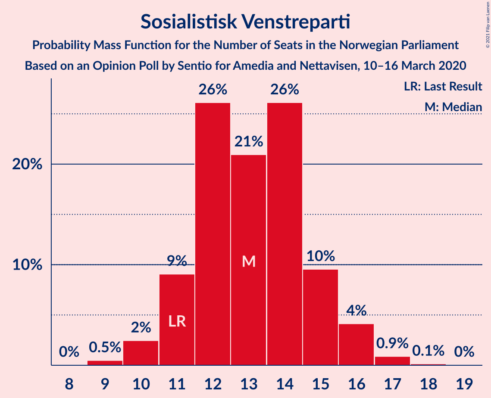
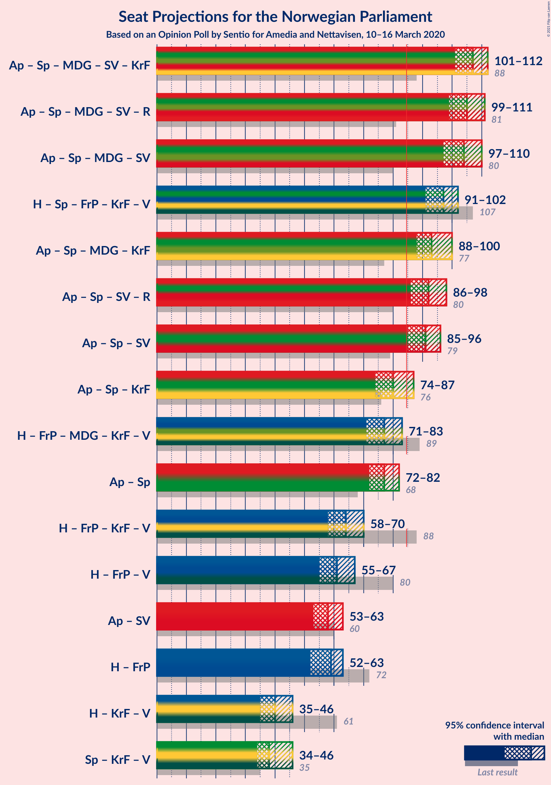
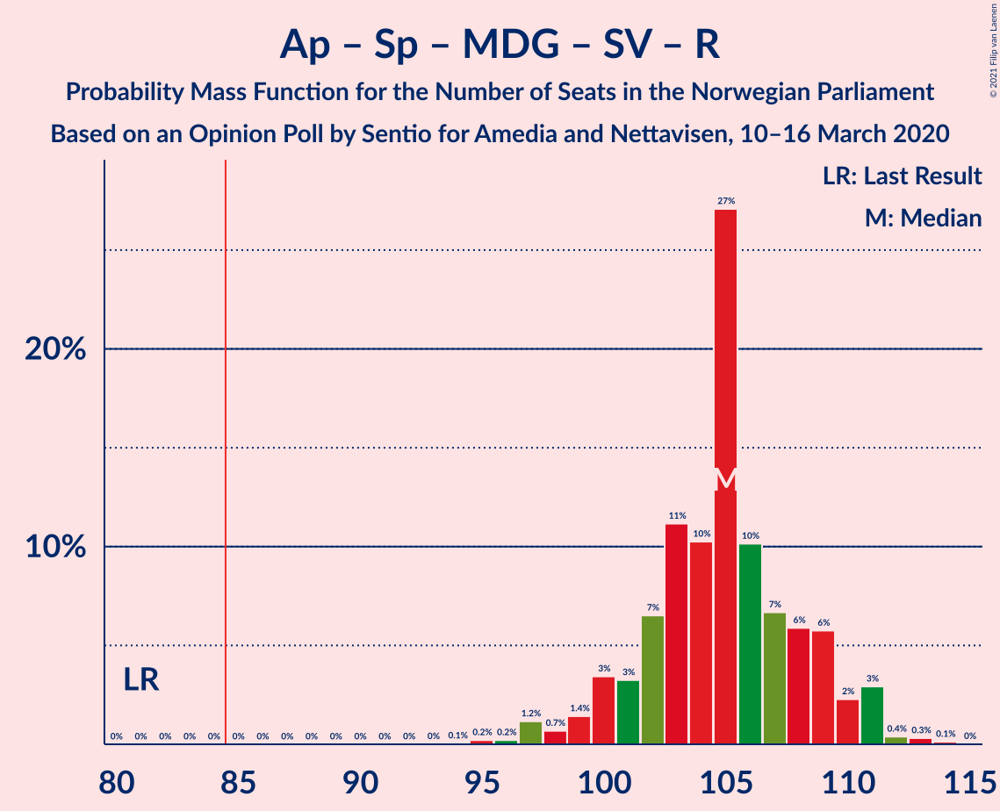
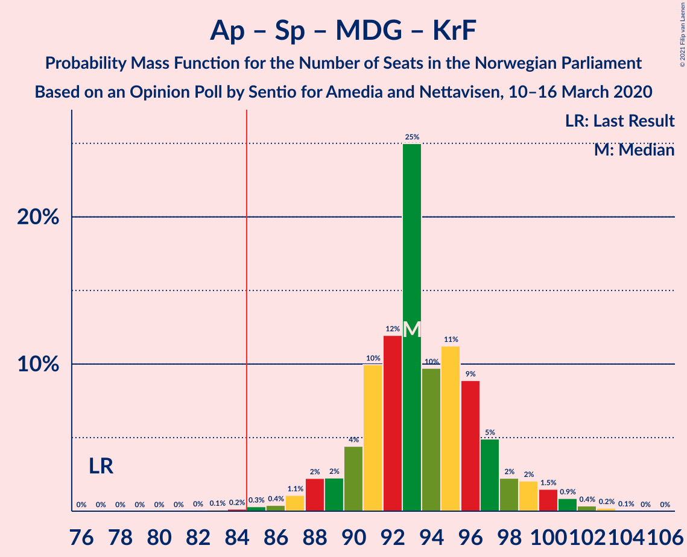
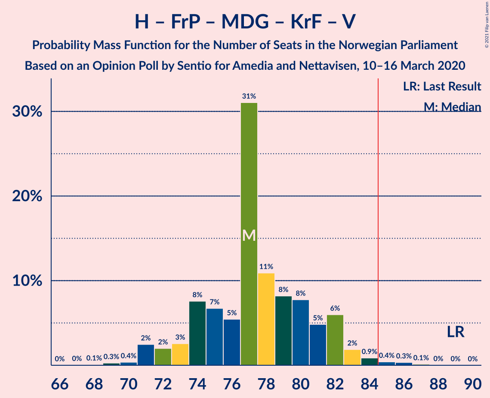
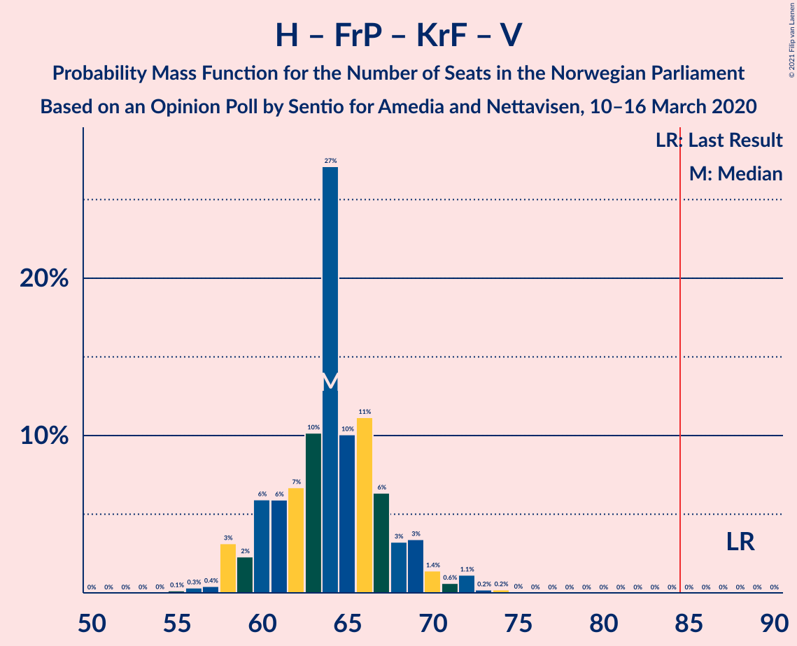
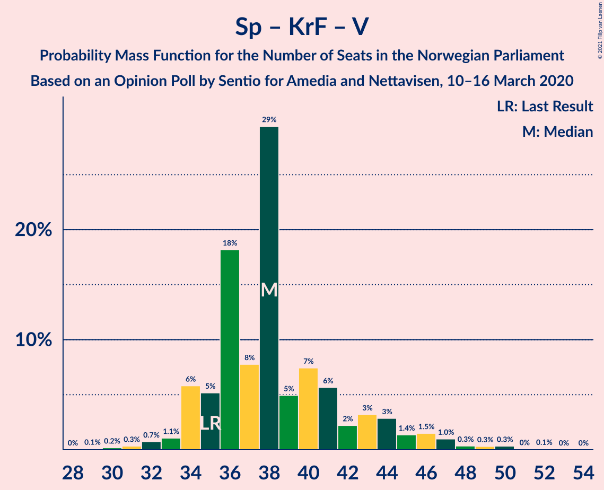

# Opinion Poll by Sentio for Nettavisen and Amedia, 10–16 March 2020

<a href="#voting-intentions">Voting Intentions</a> | <a href="#seats">Seats</a> | <a href="#coalitions">Coalitions</a> | <a href="#technical-information">Technical Information</a>

## Voting Intentions

### Confidence Intervals

| Party | Last Result | Poll Result | 80% Confidence Interval | 90% Confidence Interval | 95% Confidence Interval | 99% Confidence Interval |
|:-----:|:-----------:|:-----------:|:-----------------------:|:-----------------------:|:-----------------------:|:-----------------------:|
| Arbeiderpartiet | 27.4% | 24.3% | 22.6–26.1% |22.1–26.6% |21.7–27.1% |21.0–27.9% |
| Høyre | 25.0% | 18.8% | 17.3–20.5% |16.9–20.9% |16.5–21.4% |15.8–22.2% |
| Senterpartiet | 10.3% | 17.5% | 16.0–19.1% |15.6–19.6% |15.3–20.0% |14.6–20.8% |
| Fremskrittspartiet | 15.2% | 13.0% | 11.7–14.5% |11.4–14.9% |11.1–15.2% |10.5–16.0% |
| Miljøpartiet De Grønne | 3.2% | 7.3% | 6.3–8.5% |6.1–8.8% |5.8–9.1% |5.4–9.7% |
| Sosialistisk Venstreparti | 6.0% | 7.1% | 6.2–8.3% |5.9–8.6% |5.7–8.9% |5.2–9.4% |
| Venstre | 4.4% | 3.4% | 2.8–4.3% |2.6–4.5% |2.4–4.7% |2.2–5.2% |
| Kristelig Folkeparti | 4.2% | 3.4% | 2.8–4.3% |2.6–4.5% |2.4–4.7% |2.2–5.2% |
| Rødt | 2.4% | 2.7% | 2.1–3.5% |2.0–3.7% |1.9–3.9% |1.6–4.3% |

*Note:* The poll result column reflects the actual value used in the calculations. Published results may vary slightly, and in addition be rounded to fewer digits.

## Seats

### Confidence Intervals

| Party | Last Result | Median | 80% Confidence Interval | 90% Confidence Interval | 95% Confidence Interval | 99% Confidence Interval |
|:-----:|:-----------:|:------:|:-----------------------:|:-----------------------:|:-----------------------:|:-----------------------:|
| <a href="#arbeiderpartiet">Arbeiderpartiet</a> | 49 | 44 | 41–46 |41–47 |41–48 |38–50 |
| <a href="#høyre">Høyre</a> | 45 | 34 | 31–38 |31–38 |30–40 |28–41 |
| <a href="#senterpartiet">Senterpartiet</a> | 19 | 34 | 29–36 |29–36 |27–37 |27–38 |
| <a href="#fremskrittspartiet">Fremskrittspartiet</a> | 27 | 23 | 20–26 |20–27 |20–27 |19–28 |
| <a href="#miljøpartiet-de-grønne">Miljøpartiet De Grønne</a> | 1 | 13 | 11–15 |11–16 |10–16 |10–18 |
| <a href="#sosialistisk-venstreparti">Sosialistisk Venstreparti</a> | 11 | 13 | 11–15 |11–15 |11–16 |9–17 |
| <a href="#venstre">Venstre</a> | 8 | 2 | 2–3 |2–8 |2–9 |1–9 |
| <a href="#kristelig-folkeparti">Kristelig Folkeparti</a> | 8 | 3 | 1–7 |1–8 |1–8 |0–9 |
| <a href="#rødt">Rødt</a> | 1 | 1 | 1–2 |1–2 |1–2 |1–7 |

### Arbeiderpartiet

*For a full overview of the results for this party, see the [Arbeiderpartiet](party-arbeiderpartiet.html) page.*

| Number of Seats | Probability | Accumulated | Special Marks |
|:---------------:|:-----------:|:-----------:|:-------------:|
| 37 | 0.2% | 100% |  |
| 38 | 0.4% | 99.8% |  |
| 39 | 0.5% | 99.4% |  |
| 40 | 0.8% | 99.0% |  |
| 41 | 20% | 98% |  |
| 42 | 3% | 78% |  |
| 43 | 11% | 75% |  |
| 44 | 15% | 64% | Median |
| 45 | 6% | 49% |  |
| 46 | 35% | 43% |  |
| 47 | 5% | 8% |  |
| 48 | 1.1% | 3% |  |
| 49 | 1.1% | 2% | Last Result |
| 50 | 0.5% | 0.6% |  |
| 51 | 0.1% | 0.2% |  |
| 52 | 0.1% | 0.1% |  |
| 53 | 0% | 0% |  |

### Høyre

*For a full overview of the results for this party, see the [Høyre](party-høyre.html) page.*

| Number of Seats | Probability | Accumulated | Special Marks |
|:---------------:|:-----------:|:-----------:|:-------------:|
| 27 | 0% | 100% |  |
| 28 | 0.5% | 99.9% |  |
| 29 | 0.8% | 99.4% |  |
| 30 | 1.4% | 98.6% |  |
| 31 | 9% | 97% |  |
| 32 | 5% | 89% |  |
| 33 | 26% | 83% |  |
| 34 | 11% | 57% | Median |
| 35 | 13% | 46% |  |
| 36 | 15% | 34% |  |
| 37 | 6% | 19% |  |
| 38 | 9% | 13% |  |
| 39 | 1.4% | 4% |  |
| 40 | 1.0% | 3% |  |
| 41 | 1.5% | 2% |  |
| 42 | 0% | 0.1% |  |
| 43 | 0.1% | 0.1% |  |
| 44 | 0% | 0% |  |
| 45 | 0% | 0% | Last Result |

### Senterpartiet

*For a full overview of the results for this party, see the [Senterpartiet](party-senterpartiet.html) page.*

| Number of Seats | Probability | Accumulated | Special Marks |
|:---------------:|:-----------:|:-----------:|:-------------:|
| 19 | 0% | 100% | Last Result |
| 20 | 0% | 100% |  |
| 21 | 0% | 100% |  |
| 22 | 0% | 100% |  |
| 23 | 0% | 100% |  |
| 24 | 0% | 100% |  |
| 25 | 0% | 100% |  |
| 26 | 0.2% | 99.9% |  |
| 27 | 2% | 99.7% |  |
| 28 | 1.2% | 97% |  |
| 29 | 6% | 96% |  |
| 30 | 4% | 90% |  |
| 31 | 8% | 86% |  |
| 32 | 4% | 78% |  |
| 33 | 23% | 74% |  |
| 34 | 13% | 51% | Median |
| 35 | 28% | 38% |  |
| 36 | 6% | 10% |  |
| 37 | 3% | 4% |  |
| 38 | 0.7% | 1.1% |  |
| 39 | 0.3% | 0.4% |  |
| 40 | 0.1% | 0.1% |  |
| 41 | 0% | 0% |  |

### Fremskrittspartiet

*For a full overview of the results for this party, see the [Fremskrittspartiet](party-fremskrittspartiet.html) page.*

| Number of Seats | Probability | Accumulated | Special Marks |
|:---------------:|:-----------:|:-----------:|:-------------:|
| 17 | 0% | 100% |  |
| 18 | 0.2% | 99.9% |  |
| 19 | 0.5% | 99.7% |  |
| 20 | 10% | 99.2% |  |
| 21 | 3% | 90% |  |
| 22 | 25% | 86% |  |
| 23 | 15% | 61% | Median |
| 24 | 7% | 46% |  |
| 25 | 24% | 39% |  |
| 26 | 10% | 15% |  |
| 27 | 4% | 5% | Last Result |
| 28 | 1.4% | 2% |  |
| 29 | 0.2% | 0.3% |  |
| 30 | 0% | 0.1% |  |
| 31 | 0% | 0% |  |

### Miljøpartiet De Grønne

*For a full overview of the results for this party, see the [Miljøpartiet De Grønne](party-miljøpartietdegrønne.html) page.*

| Number of Seats | Probability | Accumulated | Special Marks |
|:---------------:|:-----------:|:-----------:|:-------------:|
| 1 | 0% | 100% | Last Result |
| 2 | 0% | 100% |  |
| 3 | 0% | 100% |  |
| 4 | 0% | 100% |  |
| 5 | 0% | 100% |  |
| 6 | 0% | 100% |  |
| 7 | 0% | 100% |  |
| 8 | 0% | 100% |  |
| 9 | 0.1% | 100% |  |
| 10 | 3% | 99.9% |  |
| 11 | 8% | 97% |  |
| 12 | 21% | 89% |  |
| 13 | 20% | 68% | Median |
| 14 | 36% | 49% |  |
| 15 | 7% | 13% |  |
| 16 | 3% | 6% |  |
| 17 | 0.8% | 2% |  |
| 18 | 1.5% | 2% |  |
| 19 | 0% | 0% |  |

### Sosialistisk Venstreparti

*For a full overview of the results for this party, see the [Sosialistisk Venstreparti](party-sosialistiskvenstreparti.html) page.*

| Number of Seats | Probability | Accumulated | Special Marks |
|:---------------:|:-----------:|:-----------:|:-------------:|
| 9 | 0.8% | 100% |  |
| 10 | 2% | 99.2% |  |
| 11 | 8% | 98% | Last Result |
| 12 | 32% | 90% |  |
| 13 | 21% | 57% | Median |
| 14 | 7% | 37% |  |
| 15 | 24% | 29% |  |
| 16 | 4% | 5% |  |
| 17 | 0.6% | 0.7% |  |
| 18 | 0.1% | 0.1% |  |
| 19 | 0.1% | 0.1% |  |
| 20 | 0% | 0% |  |

### Venstre

*For a full overview of the results for this party, see the [Venstre](party-venstre.html) page.*

| Number of Seats | Probability | Accumulated | Special Marks |
|:---------------:|:-----------:|:-----------:|:-------------:|
| 0 | 0.1% | 100% |  |
| 1 | 2% | 99.9% |  |
| 2 | 79% | 98% | Median |
| 3 | 11% | 19% |  |
| 4 | 0% | 8% |  |
| 5 | 0% | 8% |  |
| 6 | 0% | 8% |  |
| 7 | 1.4% | 8% |  |
| 8 | 2% | 6% | Last Result |
| 9 | 4% | 4% |  |
| 10 | 0.2% | 0.3% |  |
| 11 | 0% | 0% |  |

### Kristelig Folkeparti

*For a full overview of the results for this party, see the [Kristelig Folkeparti](party-kristeligfolkeparti.html) page.*

| Number of Seats | Probability | Accumulated | Special Marks |
|:---------------:|:-----------:|:-----------:|:-------------:|
| 0 | 0.5% | 100% |  |
| 1 | 16% | 99.5% |  |
| 2 | 18% | 84% |  |
| 3 | 51% | 65% | Median |
| 4 | 0% | 14% |  |
| 5 | 0% | 14% |  |
| 6 | 0% | 14% |  |
| 7 | 6% | 14% |  |
| 8 | 6% | 8% | Last Result |
| 9 | 2% | 2% |  |
| 10 | 0% | 0.1% |  |
| 11 | 0% | 0% |  |

### Rødt

*For a full overview of the results for this party, see the [Rødt](party-rødt.html) page.*

| Number of Seats | Probability | Accumulated | Special Marks |
|:---------------:|:-----------:|:-----------:|:-------------:|
| 1 | 75% | 100% | Last Result, Median |
| 2 | 24% | 25% |  |
| 3 | 0% | 0.9% |  |
| 4 | 0% | 0.9% |  |
| 5 | 0% | 0.9% |  |
| 6 | 0% | 0.9% |  |
| 7 | 0.6% | 0.9% |  |
| 8 | 0.3% | 0.4% |  |
| 9 | 0% | 0% |  |

## Coalitions

### Confidence Intervals

| Coalition | Last Result | Median | Majority? | 80% Confidence Interval | 90% Confidence Interval | 95% Confidence Interval | 99% Confidence Interval |
|:---------:|:-----------:|:------:|:---------:|:-----------------------:|:-----------------------:|:-----------------------:|:-----------------------:|
| Arbeiderpartiet – Senterpartiet – Miljøpartiet De Grønne – Sosialistisk Venstreparti – Kristelig Folkeparti | 88 | 106 | 100% | 103–111 | 102–111 | 101–112 | 98–114 |
| Arbeiderpartiet – Senterpartiet – Miljøpartiet De Grønne – Sosialistisk Venstreparti – Rødt | 81 | 105 | 100% | 101–109 | 100–109 | 99–109 | 97–112 |
| Arbeiderpartiet – Senterpartiet – Miljøpartiet De Grønne – Sosialistisk Venstreparti | 80 | 103 | 100% | 100–108 | 98–108 | 97–108 | 95–111 |
| Høyre – Senterpartiet – Fremskrittspartiet – Kristelig Folkeparti – Venstre | 107 | 97 | 100% | 93–101 | 92–101 | 91–101 | 89–104 |
| Arbeiderpartiet – Senterpartiet – Miljøpartiet De Grønne – Kristelig Folkeparti | 77 | 93 | 99.8% | 90–98 | 89–98 | 88–100 | 85–101 |
| Arbeiderpartiet – Senterpartiet – Sosialistisk Venstreparti – Rødt | 80 | 92 | 98.5% | 88–95 | 87–95 | 86–98 | 83–100 |
| Arbeiderpartiet – Senterpartiet – Sosialistisk Venstreparti | 79 | 91 | 97% | 87–94 | 86–94 | 84–96 | 81–97 |
| Arbeiderpartiet – Senterpartiet – Kristelig Folkeparti | 76 | 81 | 5% | 78–84 | 76–84 | 74–87 | 72–90 |
| Høyre – Fremskrittspartiet – Miljøpartiet De Grønne – Kristelig Folkeparti – Venstre | 89 | 77 | 1.4% | 74–81 | 72–82 | 71–83 | 69–86 |
| Arbeiderpartiet – Senterpartiet | 68 | 78 | 1.1% | 73–81 | 72–81 | 72–81 | 70–85 |
| Høyre – Fremskrittspartiet – Kristelig Folkeparti – Venstre | 88 | 64 | 0% | 60–68 | 60–69 | 58–70 | 56–72 |
| Høyre – Fremskrittspartiet – Venstre | 80 | 61 | 0% | 57–64 | 56–65 | 55–66 | 53–69 |
| Høyre – Fremskrittspartiet | 72 | 58 | 0% | 55–62 | 53–62 | 53–64 | 51–65 |
| Arbeiderpartiet – Sosialistisk Venstreparti | 60 | 57 | 0% | 54–61 | 53–61 | 53–62 | 50–63 |
| Høyre – Kristelig Folkeparti – Venstre | 61 | 41 | 0% | 38–43 | 36–45 | 36–46 | 34–48 |
| Senterpartiet – Kristelig Folkeparti – Venstre | 35 | 39 | 0% | 36–42 | 35–43 | 34–45 | 31–49 |

### Arbeiderpartiet – Senterpartiet – Miljøpartiet De Grønne – Sosialistisk Venstreparti – Kristelig Folkeparti

| Number of Seats | Probability | Accumulated | Special Marks |
|:---------------:|:-----------:|:-----------:|:-------------:|
| 88 | 0% | 100% | Last Result |
| 89 | 0% | 100% |  |
| 90 | 0% | 100% |  |
| 91 | 0% | 100% |  |
| 92 | 0% | 100% |  |
| 93 | 0% | 100% |  |
| 94 | 0% | 100% |  |
| 95 | 0% | 100% |  |
| 96 | 0.1% | 100% |  |
| 97 | 0.1% | 99.8% |  |
| 98 | 0.4% | 99.8% |  |
| 99 | 0.3% | 99.4% |  |
| 100 | 0.8% | 99.1% |  |
| 101 | 1.4% | 98% |  |
| 102 | 3% | 97% |  |
| 103 | 5% | 94% |  |
| 104 | 7% | 88% |  |
| 105 | 28% | 82% |  |
| 106 | 4% | 54% |  |
| 107 | 12% | 49% | Median |
| 108 | 3% | 38% |  |
| 109 | 1.1% | 35% |  |
| 110 | 10% | 34% |  |
| 111 | 19% | 24% |  |
| 112 | 2% | 4% |  |
| 113 | 2% | 2% |  |
| 114 | 0.6% | 0.8% |  |
| 115 | 0.1% | 0.2% |  |
| 116 | 0% | 0.1% |  |
| 117 | 0.1% | 0.1% |  |
| 118 | 0% | 0% |  |

### Arbeiderpartiet – Senterpartiet – Miljøpartiet De Grønne – Sosialistisk Venstreparti – Rødt

| Number of Seats | Probability | Accumulated | Special Marks |
|:---------------:|:-----------:|:-----------:|:-------------:|
| 81 | 0% | 100% | Last Result |
| 82 | 0% | 100% |  |
| 83 | 0% | 100% |  |
| 84 | 0% | 100% |  |
| 85 | 0% | 100% | Majority |
| 86 | 0% | 100% |  |
| 87 | 0% | 100% |  |
| 88 | 0% | 100% |  |
| 89 | 0% | 100% |  |
| 90 | 0% | 100% |  |
| 91 | 0% | 100% |  |
| 92 | 0% | 100% |  |
| 93 | 0% | 100% |  |
| 94 | 0.2% | 100% |  |
| 95 | 0.1% | 99.8% |  |
| 96 | 0.1% | 99.8% |  |
| 97 | 0.9% | 99.7% |  |
| 98 | 1.1% | 98.8% |  |
| 99 | 0.9% | 98% |  |
| 100 | 3% | 97% |  |
| 101 | 7% | 94% |  |
| 102 | 6% | 87% |  |
| 103 | 13% | 81% |  |
| 104 | 17% | 67% |  |
| 105 | 9% | 50% | Median |
| 106 | 2% | 41% |  |
| 107 | 3% | 39% |  |
| 108 | 14% | 35% |  |
| 109 | 19% | 22% |  |
| 110 | 0.9% | 2% |  |
| 111 | 0.4% | 1.4% |  |
| 112 | 0.5% | 1.0% |  |
| 113 | 0.4% | 0.5% |  |
| 114 | 0% | 0.1% |  |
| 115 | 0.1% | 0.1% |  |
| 116 | 0% | 0% |  |

### Arbeiderpartiet – Senterpartiet – Miljøpartiet De Grønne – Sosialistisk Venstreparti

| Number of Seats | Probability | Accumulated | Special Marks |
|:---------------:|:-----------:|:-----------:|:-------------:|
| 80 | 0% | 100% | Last Result |
| 81 | 0% | 100% |  |
| 82 | 0% | 100% |  |
| 83 | 0% | 100% |  |
| 84 | 0% | 100% |  |
| 85 | 0% | 100% | Majority |
| 86 | 0% | 100% |  |
| 87 | 0% | 100% |  |
| 88 | 0% | 100% |  |
| 89 | 0% | 100% |  |
| 90 | 0% | 100% |  |
| 91 | 0% | 100% |  |
| 92 | 0.1% | 100% |  |
| 93 | 0.1% | 99.9% |  |
| 94 | 0.1% | 99.8% |  |
| 95 | 0.3% | 99.7% |  |
| 96 | 1.4% | 99.4% |  |
| 97 | 0.8% | 98% |  |
| 98 | 3% | 97% |  |
| 99 | 3% | 94% |  |
| 100 | 8% | 91% |  |
| 101 | 4% | 83% |  |
| 102 | 12% | 79% |  |
| 103 | 23% | 67% |  |
| 104 | 4% | 44% | Median |
| 105 | 3% | 40% |  |
| 106 | 7% | 37% |  |
| 107 | 9% | 30% |  |
| 108 | 19% | 21% |  |
| 109 | 0.7% | 2% |  |
| 110 | 0.3% | 0.9% |  |
| 111 | 0.4% | 0.6% |  |
| 112 | 0.1% | 0.2% |  |
| 113 | 0% | 0.1% |  |
| 114 | 0.1% | 0.1% |  |
| 115 | 0% | 0% |  |

### Høyre – Senterpartiet – Fremskrittspartiet – Kristelig Folkeparti – Venstre

| Number of Seats | Probability | Accumulated | Special Marks |
|:---------------:|:-----------:|:-----------:|:-------------:|
| 86 | 0% | 100% |  |
| 87 | 0.1% | 99.9% |  |
| 88 | 0.3% | 99.8% |  |
| 89 | 0.2% | 99.6% |  |
| 90 | 0.1% | 99.4% |  |
| 91 | 3% | 99.3% |  |
| 92 | 3% | 96% |  |
| 93 | 19% | 93% |  |
| 94 | 4% | 74% |  |
| 95 | 5% | 70% |  |
| 96 | 11% | 65% | Median |
| 97 | 7% | 54% |  |
| 98 | 7% | 48% |  |
| 99 | 11% | 41% |  |
| 100 | 16% | 30% |  |
| 101 | 12% | 14% |  |
| 102 | 0.3% | 2% |  |
| 103 | 0.5% | 2% |  |
| 104 | 0.7% | 1.0% |  |
| 105 | 0.2% | 0.3% |  |
| 106 | 0.1% | 0.1% |  |
| 107 | 0% | 0.1% | Last Result |
| 108 | 0% | 0% |  |

### Arbeiderpartiet – Senterpartiet – Miljøpartiet De Grønne – Kristelig Folkeparti

| Number of Seats | Probability | Accumulated | Special Marks |
|:---------------:|:-----------:|:-----------:|:-------------:|
| 77 | 0% | 100% | Last Result |
| 78 | 0% | 100% |  |
| 79 | 0% | 100% |  |
| 80 | 0% | 100% |  |
| 81 | 0% | 100% |  |
| 82 | 0.1% | 100% |  |
| 83 | 0% | 99.9% |  |
| 84 | 0.1% | 99.9% |  |
| 85 | 0.4% | 99.8% | Majority |
| 86 | 0.3% | 99.4% |  |
| 87 | 0.7% | 99.1% |  |
| 88 | 3% | 98% |  |
| 89 | 0.6% | 96% |  |
| 90 | 6% | 95% |  |
| 91 | 7% | 89% |  |
| 92 | 20% | 82% |  |
| 93 | 15% | 62% |  |
| 94 | 6% | 47% | Median |
| 95 | 4% | 41% |  |
| 96 | 22% | 37% |  |
| 97 | 2% | 15% |  |
| 98 | 9% | 13% |  |
| 99 | 1.1% | 4% |  |
| 100 | 2% | 3% |  |
| 101 | 1.2% | 1.4% |  |
| 102 | 0.1% | 0.2% |  |
| 103 | 0% | 0.1% |  |
| 104 | 0.1% | 0.1% |  |
| 105 | 0% | 0% |  |

### Arbeiderpartiet – Senterpartiet – Sosialistisk Venstreparti – Rødt

| Number of Seats | Probability | Accumulated | Special Marks |
|:---------------:|:-----------:|:-----------:|:-------------:|
| 80 | 0% | 100% | Last Result |
| 81 | 0% | 100% |  |
| 82 | 0.3% | 100% |  |
| 83 | 0.9% | 99.7% |  |
| 84 | 0.3% | 98.8% |  |
| 85 | 0.7% | 98.5% | Majority |
| 86 | 1.0% | 98% |  |
| 87 | 2% | 97% |  |
| 88 | 7% | 95% |  |
| 89 | 6% | 88% |  |
| 90 | 17% | 82% |  |
| 91 | 10% | 65% |  |
| 92 | 11% | 54% | Median |
| 93 | 10% | 43% |  |
| 94 | 9% | 33% |  |
| 95 | 19% | 24% |  |
| 96 | 0.8% | 5% |  |
| 97 | 1.3% | 4% |  |
| 98 | 2% | 3% |  |
| 99 | 0.1% | 0.7% |  |
| 100 | 0.1% | 0.5% |  |
| 101 | 0.4% | 0.5% |  |
| 102 | 0% | 0% |  |

### Arbeiderpartiet – Senterpartiet – Sosialistisk Venstreparti

| Number of Seats | Probability | Accumulated | Special Marks |
|:---------------:|:-----------:|:-----------:|:-------------:|
| 79 | 0% | 100% | Last Result |
| 80 | 0% | 100% |  |
| 81 | 1.0% | 100% |  |
| 82 | 0.2% | 98.9% |  |
| 83 | 0.3% | 98.8% |  |
| 84 | 1.4% | 98% |  |
| 85 | 1.2% | 97% | Majority |
| 86 | 5% | 96% |  |
| 87 | 7% | 91% |  |
| 88 | 5% | 84% |  |
| 89 | 20% | 79% |  |
| 90 | 7% | 59% |  |
| 91 | 12% | 52% | Median |
| 92 | 9% | 40% |  |
| 93 | 8% | 31% |  |
| 94 | 19% | 23% |  |
| 95 | 0.8% | 4% |  |
| 96 | 3% | 3% |  |
| 97 | 0.3% | 0.6% |  |
| 98 | 0.1% | 0.3% |  |
| 99 | 0.1% | 0.2% |  |
| 100 | 0% | 0.1% |  |
| 101 | 0% | 0% |  |

### Arbeiderpartiet – Senterpartiet – Kristelig Folkeparti

| Number of Seats | Probability | Accumulated | Special Marks |
|:---------------:|:-----------:|:-----------:|:-------------:|
| 70 | 0.2% | 100% |  |
| 71 | 0.1% | 99.8% |  |
| 72 | 0.4% | 99.6% |  |
| 73 | 1.0% | 99.2% |  |
| 74 | 1.5% | 98% |  |
| 75 | 2% | 97% |  |
| 76 | 0.7% | 95% | Last Result |
| 77 | 4% | 94% |  |
| 78 | 5% | 90% |  |
| 79 | 24% | 86% |  |
| 80 | 6% | 62% |  |
| 81 | 17% | 56% | Median |
| 82 | 24% | 38% |  |
| 83 | 2% | 14% |  |
| 84 | 8% | 13% |  |
| 85 | 0.5% | 5% | Majority |
| 86 | 1.2% | 4% |  |
| 87 | 0.7% | 3% |  |
| 88 | 1.2% | 2% |  |
| 89 | 0.4% | 1.1% |  |
| 90 | 0.7% | 0.7% |  |
| 91 | 0% | 0% |  |

### Høyre – Fremskrittspartiet – Miljøpartiet De Grønne – Kristelig Folkeparti – Venstre

| Number of Seats | Probability | Accumulated | Special Marks |
|:---------------:|:-----------:|:-----------:|:-------------:|
| 68 | 0.5% | 100% |  |
| 69 | 0.2% | 99.5% |  |
| 70 | 0.1% | 99.3% |  |
| 71 | 2% | 99.1% |  |
| 72 | 4% | 97% |  |
| 73 | 0.9% | 93% |  |
| 74 | 19% | 92% |  |
| 75 | 9% | 73% | Median |
| 76 | 10% | 64% |  |
| 77 | 11% | 54% |  |
| 78 | 10% | 43% |  |
| 79 | 14% | 32% |  |
| 80 | 6% | 18% |  |
| 81 | 7% | 12% |  |
| 82 | 2% | 5% |  |
| 83 | 1.0% | 3% |  |
| 84 | 0.7% | 2% |  |
| 85 | 0.3% | 1.4% | Majority |
| 86 | 0.9% | 1.2% |  |
| 87 | 0.3% | 0.3% |  |
| 88 | 0% | 0% |  |
| 89 | 0% | 0% | Last Result |

### Arbeiderpartiet – Senterpartiet

| Number of Seats | Probability | Accumulated | Special Marks |
|:---------------:|:-----------:|:-----------:|:-------------:|
| 68 | 0.2% | 100% | Last Result |
| 69 | 0.1% | 99.8% |  |
| 70 | 0.5% | 99.7% |  |
| 71 | 2% | 99.1% |  |
| 72 | 6% | 98% |  |
| 73 | 3% | 92% |  |
| 74 | 5% | 89% |  |
| 75 | 6% | 84% |  |
| 76 | 16% | 78% |  |
| 77 | 11% | 62% |  |
| 78 | 0.9% | 51% | Median |
| 79 | 28% | 50% |  |
| 80 | 8% | 22% |  |
| 81 | 12% | 14% |  |
| 82 | 0.6% | 2% |  |
| 83 | 0.2% | 2% |  |
| 84 | 0.4% | 1.5% |  |
| 85 | 0.9% | 1.1% | Majority |
| 86 | 0.1% | 0.1% |  |
| 87 | 0% | 0% |  |

### Høyre – Fremskrittspartiet – Kristelig Folkeparti – Venstre

| Number of Seats | Probability | Accumulated | Special Marks |
|:---------------:|:-----------:|:-----------:|:-------------:|
| 54 | 0.1% | 100% |  |
| 55 | 0.1% | 99.9% |  |
| 56 | 0.4% | 99.9% |  |
| 57 | 0.5% | 99.5% |  |
| 58 | 2% | 98.9% |  |
| 59 | 0.9% | 97% |  |
| 60 | 21% | 96% |  |
| 61 | 14% | 75% |  |
| 62 | 4% | 62% | Median |
| 63 | 2% | 58% |  |
| 64 | 9% | 56% |  |
| 65 | 16% | 47% |  |
| 66 | 13% | 31% |  |
| 67 | 5% | 18% |  |
| 68 | 7% | 13% |  |
| 69 | 3% | 6% |  |
| 70 | 0.9% | 3% |  |
| 71 | 1.1% | 2% |  |
| 72 | 0.8% | 1.1% |  |
| 73 | 0.1% | 0.3% |  |
| 74 | 0.1% | 0.2% |  |
| 75 | 0.2% | 0.2% |  |
| 76 | 0% | 0% |  |
| 77 | 0% | 0% |  |
| 78 | 0% | 0% |  |
| 79 | 0% | 0% |  |
| 80 | 0% | 0% |  |
| 81 | 0% | 0% |  |
| 82 | 0% | 0% |  |
| 83 | 0% | 0% |  |
| 84 | 0% | 0% |  |
| 85 | 0% | 0% | Majority |
| 86 | 0% | 0% |  |
| 87 | 0% | 0% |  |
| 88 | 0% | 0% | Last Result |

### Høyre – Fremskrittspartiet – Venstre

| Number of Seats | Probability | Accumulated | Special Marks |
|:---------------:|:-----------:|:-----------:|:-------------:|
| 51 | 0.1% | 100% |  |
| 52 | 0% | 99.9% |  |
| 53 | 0.4% | 99.9% |  |
| 54 | 0.6% | 99.4% |  |
| 55 | 3% | 98.8% |  |
| 56 | 2% | 96% |  |
| 57 | 20% | 94% |  |
| 58 | 12% | 73% |  |
| 59 | 0.9% | 62% | Median |
| 60 | 10% | 61% |  |
| 61 | 6% | 51% |  |
| 62 | 8% | 45% |  |
| 63 | 21% | 37% |  |
| 64 | 7% | 16% |  |
| 65 | 4% | 9% |  |
| 66 | 3% | 5% |  |
| 67 | 0.6% | 2% |  |
| 68 | 0.6% | 1.2% |  |
| 69 | 0.3% | 0.5% |  |
| 70 | 0.1% | 0.3% |  |
| 71 | 0.1% | 0.2% |  |
| 72 | 0.1% | 0.1% |  |
| 73 | 0% | 0% |  |
| 74 | 0% | 0% |  |
| 75 | 0% | 0% |  |
| 76 | 0% | 0% |  |
| 77 | 0% | 0% |  |
| 78 | 0% | 0% |  |
| 79 | 0% | 0% |  |
| 80 | 0% | 0% | Last Result |

### Høyre – Fremskrittspartiet

| Number of Seats | Probability | Accumulated | Special Marks |
|:---------------:|:-----------:|:-----------:|:-------------:|
| 49 | 0.3% | 100% |  |
| 50 | 0.1% | 99.7% |  |
| 51 | 0.6% | 99.5% |  |
| 52 | 1.3% | 99.0% |  |
| 53 | 4% | 98% |  |
| 54 | 3% | 94% |  |
| 55 | 20% | 91% |  |
| 56 | 15% | 71% |  |
| 57 | 1.3% | 56% | Median |
| 58 | 9% | 55% |  |
| 59 | 5% | 46% |  |
| 60 | 19% | 40% |  |
| 61 | 10% | 21% |  |
| 62 | 7% | 11% |  |
| 63 | 0.4% | 4% |  |
| 64 | 3% | 3% |  |
| 65 | 0.3% | 0.6% |  |
| 66 | 0.1% | 0.2% |  |
| 67 | 0.1% | 0.1% |  |
| 68 | 0.1% | 0.1% |  |
| 69 | 0% | 0% |  |
| 70 | 0% | 0% |  |
| 71 | 0% | 0% |  |
| 72 | 0% | 0% | Last Result |

### Arbeiderpartiet – Sosialistisk Venstreparti

| Number of Seats | Probability | Accumulated | Special Marks |
|:---------------:|:-----------:|:-----------:|:-------------:|
| 49 | 0.1% | 100% |  |
| 50 | 0.6% | 99.9% |  |
| 51 | 0.2% | 99.2% |  |
| 52 | 1.2% | 99.0% |  |
| 53 | 6% | 98% |  |
| 54 | 12% | 91% |  |
| 55 | 4% | 79% |  |
| 56 | 14% | 75% |  |
| 57 | 13% | 61% | Median |
| 58 | 19% | 48% |  |
| 59 | 2% | 29% |  |
| 60 | 4% | 27% | Last Result |
| 61 | 20% | 23% |  |
| 62 | 2% | 3% |  |
| 63 | 0.6% | 1.0% |  |
| 64 | 0.2% | 0.3% |  |
| 65 | 0.1% | 0.2% |  |
| 66 | 0% | 0.1% |  |
| 67 | 0% | 0% |  |

### Høyre – Kristelig Folkeparti – Venstre

| Number of Seats | Probability | Accumulated | Special Marks |
|:---------------:|:-----------:|:-----------:|:-------------:|
| 32 | 0.1% | 100% |  |
| 33 | 0.2% | 99.9% |  |
| 34 | 0.5% | 99.7% |  |
| 35 | 0.3% | 99.2% |  |
| 36 | 4% | 98.8% |  |
| 37 | 5% | 95% |  |
| 38 | 27% | 90% |  |
| 39 | 6% | 63% | Median |
| 40 | 6% | 57% |  |
| 41 | 23% | 51% |  |
| 42 | 12% | 28% |  |
| 43 | 7% | 16% |  |
| 44 | 3% | 9% |  |
| 45 | 2% | 6% |  |
| 46 | 2% | 4% |  |
| 47 | 1.3% | 2% |  |
| 48 | 0.3% | 0.7% |  |
| 49 | 0.1% | 0.4% |  |
| 50 | 0.1% | 0.3% |  |
| 51 | 0.2% | 0.2% |  |
| 52 | 0% | 0% |  |
| 53 | 0% | 0% |  |
| 54 | 0% | 0% |  |
| 55 | 0% | 0% |  |
| 56 | 0% | 0% |  |
| 57 | 0% | 0% |  |
| 58 | 0% | 0% |  |
| 59 | 0% | 0% |  |
| 60 | 0% | 0% |  |
| 61 | 0% | 0% | Last Result |

### Senterpartiet – Kristelig Folkeparti – Venstre

| Number of Seats | Probability | Accumulated | Special Marks |
|:---------------:|:-----------:|:-----------:|:-------------:|
| 29 | 0.1% | 100% |  |
| 30 | 0.1% | 99.9% |  |
| 31 | 0.3% | 99.8% |  |
| 32 | 0.8% | 99.5% |  |
| 33 | 0.4% | 98.7% |  |
| 34 | 3% | 98% |  |
| 35 | 3% | 95% | Last Result |
| 36 | 4% | 93% |  |
| 37 | 11% | 88% |  |
| 38 | 25% | 77% |  |
| 39 | 12% | 52% | Median |
| 40 | 15% | 40% |  |
| 41 | 14% | 25% |  |
| 42 | 3% | 11% |  |
| 43 | 4% | 8% |  |
| 44 | 1.0% | 4% |  |
| 45 | 0.9% | 3% |  |
| 46 | 0.6% | 2% |  |
| 47 | 0.1% | 1.3% |  |
| 48 | 0.1% | 1.3% |  |
| 49 | 0.8% | 1.2% |  |
| 50 | 0.1% | 0.4% |  |
| 51 | 0.1% | 0.3% |  |
| 52 | 0.2% | 0.2% |  |
| 53 | 0% | 0% |  |

## Technical Information

### Opinion Poll

+ **Polling firm:** Sentio
+ **Commissioner(s):** Nettavisen and Amedia
+ **Fieldwork period:** 10–16 March 2020

### Calculations

+ **Sample size:** 1000
+ **Simulations done:** 131,072
+ **Error estimate:** 3.22%

