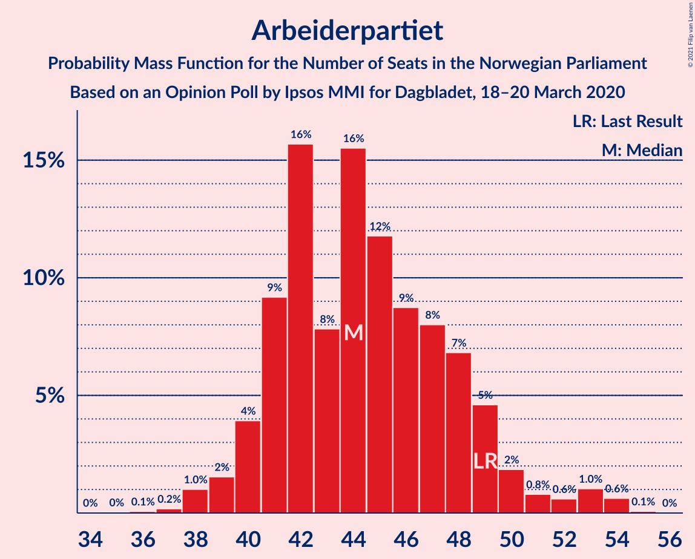
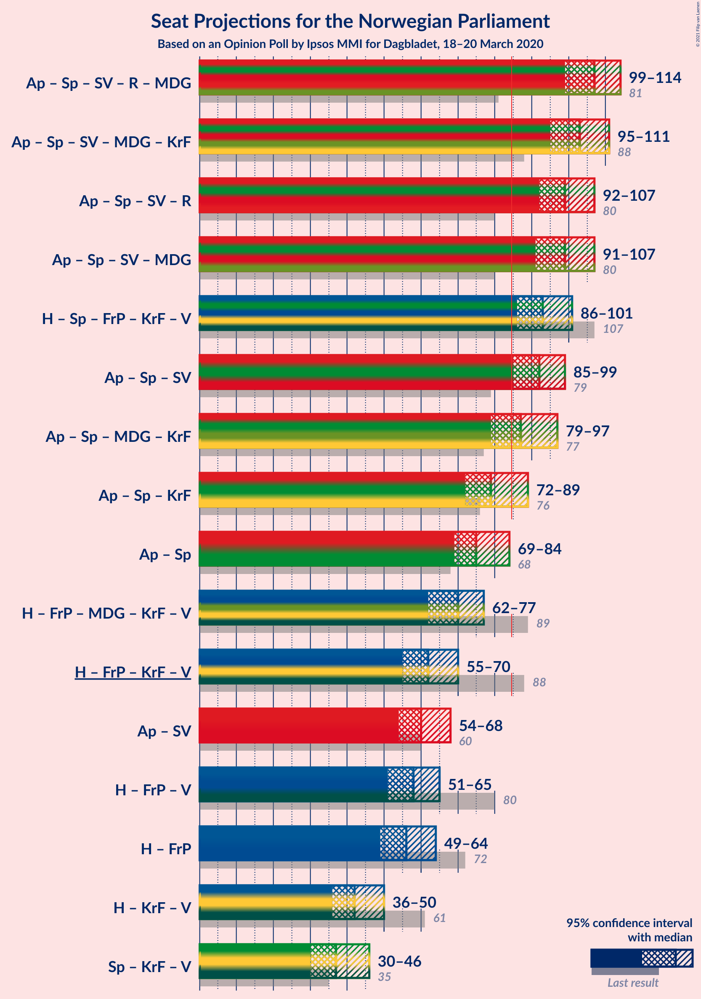
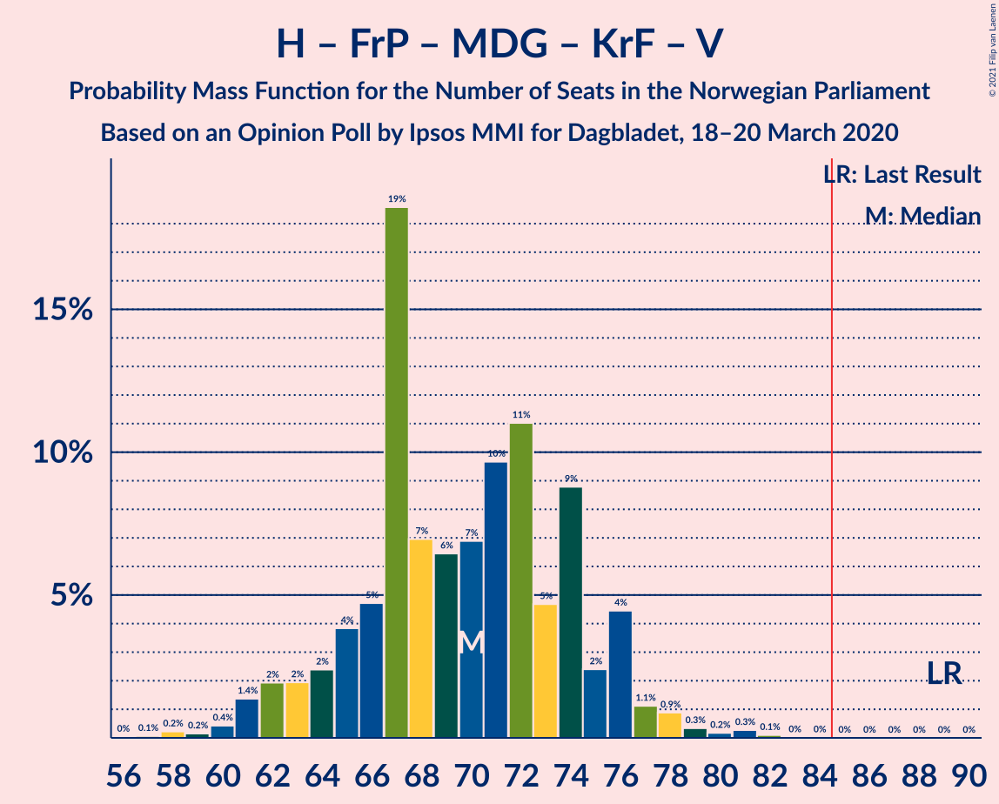
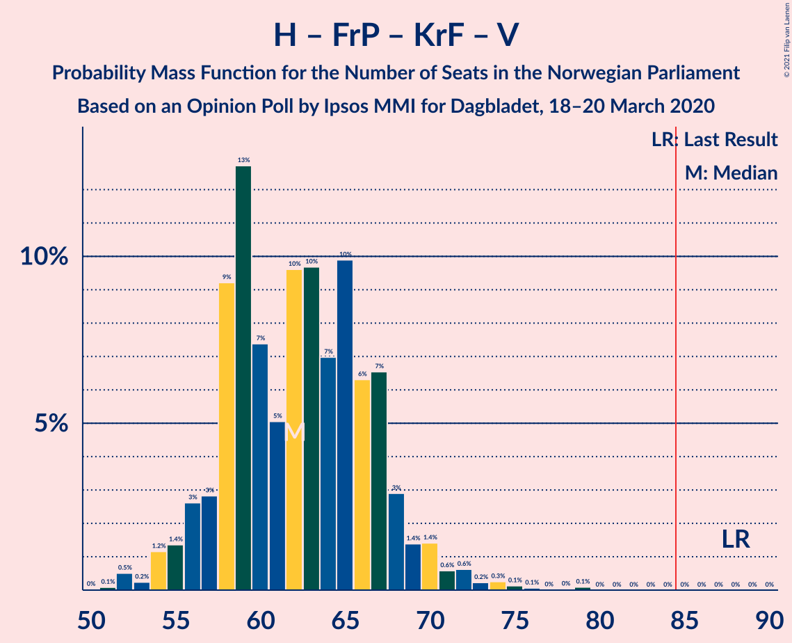
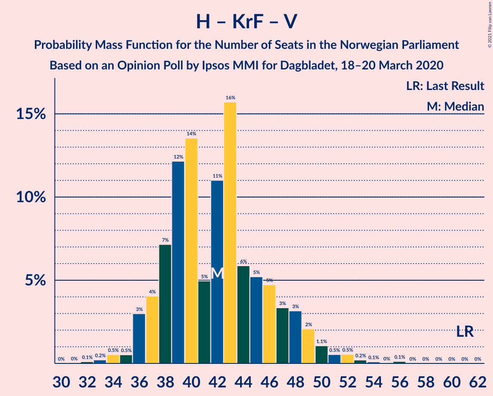

# Opinion Poll by Ipsos MMI for Dagbladet, 18–20 March 2020

<a href="#voting-intentions">Voting Intentions</a> | <a href="#seats">Seats</a> | <a href="#coalitions">Coalitions</a> | <a href="#technical-information">Technical Information</a>

## Voting Intentions

### Confidence Intervals

| Party | Last Result | Poll Result | 80% Confidence Interval | 90% Confidence Interval | 95% Confidence Interval | 99% Confidence Interval |
|:-----:|:-----------:|:-----------:|:-----------------------:|:-----------------------:|:-----------------------:|:-----------------------:|
| Arbeiderpartiet | 27.4% | 25.0% | 22.9–27.2% |22.3–27.9% |21.8–28.4% |20.8–29.6% |
| Høyre | 25.0% | 20.8% | 18.9–23.0% |18.3–23.6% |17.8–24.1% |17.0–25.2% |
| Senterpartiet | 10.3% | 17.4% | 15.6–19.4% |15.1–20.0% |14.7–20.5% |13.9–21.5% |
| Fremskrittspartiet | 15.2% | 11.4% | 9.9–13.2% |9.5–13.7% |9.2–14.1% |8.5–15.0% |
| Sosialistisk Venstreparti | 6.0% | 8.9% | 7.6–10.5% |7.3–11.0% |7.0–11.4% |6.4–12.2% |
| Rødt | 2.4% | 4.8% | 3.9–6.0% |3.6–6.4% |3.4–6.7% |3.0–7.4% |
| Miljøpartiet De Grønne | 3.2% | 4.5% | 3.6–5.7% |3.3–6.0% |3.1–6.4% |2.7–7.0% |
| Kristelig Folkeparti | 4.2% | 3.7% | 2.9–4.8% |2.7–5.2% |2.5–5.5% |2.2–6.1% |
| Venstre | 4.4% | 2.6% | 2.0–3.6% |1.8–3.9% |1.6–4.2% |1.4–4.7% |

*Note:* The poll result column reflects the actual value used in the calculations. Published results may vary slightly, and in addition be rounded to fewer digits.

## Seats

### Confidence Intervals

| Party | Last Result | Median | 80% Confidence Interval | 90% Confidence Interval | 95% Confidence Interval | 99% Confidence Interval |
|:-----:|:-----------:|:------:|:-----------------------:|:-----------------------:|:-----------------------:|:-----------------------:|
| <a href="#arbeiderpartiet">Arbeiderpartiet</a> | 49 | 44 | 41–48 |40–50 |39–51 |38–54 |
| <a href="#høyre">Høyre</a> | 45 | 36 | 33–40 |32–41 |31–43 |29–45 |
| <a href="#senterpartiet">Senterpartiet</a> | 19 | 32 | 28–35 |26–36 |25–37 |24–39 |
| <a href="#fremskrittspartiet">Fremskrittspartiet</a> | 27 | 20 | 17–24 |16–24 |16–25 |15–26 |
| <a href="#sosialistisk-venstreparti">Sosialistisk Venstreparti</a> | 11 | 16 | 13–18 |12–19 |12–20 |11–21 |
| <a href="#rødt">Rødt</a> | 1 | 8 | 2–11 |2–11 |2–12 |2–13 |
| <a href="#miljøpartiet-de-grønne">Miljøpartiet De Grønne</a> | 1 | 8 | 2–10 |1–11 |1–11 |1–12 |
| <a href="#kristelig-folkeparti">Kristelig Folkeparti</a> | 8 | 3 | 1–8 |1–9 |1–9 |0–10 |
| <a href="#venstre">Venstre</a> | 8 | 2 | 1–2 |0–2 |0–7 |0–8 |

### Arbeiderpartiet

*For a full overview of the results for this party, see the [Arbeiderpartiet](party-arbeiderpartiet.html) page.*

| Number of Seats | Probability | Accumulated | Special Marks |
|:---------------:|:-----------:|:-----------:|:-------------:|
| 35 | 0% | 100% |  |
| 36 | 0.1% | 99.9% |  |
| 37 | 0.2% | 99.9% |  |
| 38 | 1.0% | 99.7% |  |
| 39 | 2% | 98.7% |  |
| 40 | 4% | 97% |  |
| 41 | 9% | 93% |  |
| 42 | 16% | 84% |  |
| 43 | 8% | 68% |  |
| 44 | 16% | 61% | Median |
| 45 | 12% | 45% |  |
| 46 | 9% | 33% |  |
| 47 | 8% | 24% |  |
| 48 | 7% | 16% |  |
| 49 | 5% | 10% | Last Result |
| 50 | 2% | 5% |  |
| 51 | 0.8% | 3% |  |
| 52 | 0.6% | 2% |  |
| 53 | 1.0% | 2% |  |
| 54 | 0.6% | 0.7% |  |
| 55 | 0.1% | 0.1% |  |
| 56 | 0% | 0% |  |

### Høyre

*For a full overview of the results for this party, see the [Høyre](party-høyre.html) page.*

| Number of Seats | Probability | Accumulated | Special Marks |
|:---------------:|:-----------:|:-----------:|:-------------:|
| 28 | 0.2% | 100% |  |
| 29 | 0.5% | 99.8% |  |
| 30 | 0.7% | 99.3% |  |
| 31 | 3% | 98.6% |  |
| 32 | 4% | 95% |  |
| 33 | 10% | 92% |  |
| 34 | 16% | 82% |  |
| 35 | 7% | 66% |  |
| 36 | 16% | 59% | Median |
| 37 | 8% | 43% |  |
| 38 | 16% | 35% |  |
| 39 | 8% | 20% |  |
| 40 | 5% | 12% |  |
| 41 | 2% | 6% |  |
| 42 | 2% | 5% |  |
| 43 | 2% | 3% |  |
| 44 | 0.4% | 1.2% |  |
| 45 | 0.5% | 0.8% | Last Result |
| 46 | 0.2% | 0.3% |  |
| 47 | 0.1% | 0.1% |  |
| 48 | 0% | 0.1% |  |
| 49 | 0% | 0% |  |

### Senterpartiet

*For a full overview of the results for this party, see the [Senterpartiet](party-senterpartiet.html) page.*

| Number of Seats | Probability | Accumulated | Special Marks |
|:---------------:|:-----------:|:-----------:|:-------------:|
| 19 | 0% | 100% | Last Result |
| 20 | 0% | 100% |  |
| 21 | 0% | 100% |  |
| 22 | 0% | 100% |  |
| 23 | 0.3% | 100% |  |
| 24 | 0.7% | 99.7% |  |
| 25 | 2% | 99.0% |  |
| 26 | 2% | 97% |  |
| 27 | 3% | 95% |  |
| 28 | 13% | 92% |  |
| 29 | 8% | 79% |  |
| 30 | 9% | 70% |  |
| 31 | 9% | 61% |  |
| 32 | 11% | 52% | Median |
| 33 | 14% | 41% |  |
| 34 | 15% | 27% |  |
| 35 | 3% | 12% |  |
| 36 | 4% | 9% |  |
| 37 | 2% | 5% |  |
| 38 | 1.3% | 2% |  |
| 39 | 0.8% | 1.1% |  |
| 40 | 0.2% | 0.3% |  |
| 41 | 0.1% | 0.1% |  |
| 42 | 0% | 0.1% |  |
| 43 | 0% | 0% |  |

### Fremskrittspartiet

*For a full overview of the results for this party, see the [Fremskrittspartiet](party-fremskrittspartiet.html) page.*

| Number of Seats | Probability | Accumulated | Special Marks |
|:---------------:|:-----------:|:-----------:|:-------------:|
| 13 | 0.2% | 100% |  |
| 14 | 0.3% | 99.8% |  |
| 15 | 2% | 99.5% |  |
| 16 | 3% | 98% |  |
| 17 | 7% | 94% |  |
| 18 | 9% | 87% |  |
| 19 | 21% | 78% |  |
| 20 | 14% | 58% | Median |
| 21 | 13% | 43% |  |
| 22 | 9% | 30% |  |
| 23 | 9% | 22% |  |
| 24 | 7% | 12% |  |
| 25 | 2% | 5% |  |
| 26 | 2% | 2% |  |
| 27 | 0.3% | 0.5% | Last Result |
| 28 | 0.1% | 0.2% |  |
| 29 | 0.1% | 0.1% |  |
| 30 | 0% | 0% |  |

### Sosialistisk Venstreparti

*For a full overview of the results for this party, see the [Sosialistisk Venstreparti](party-sosialistiskvenstreparti.html) page.*

| Number of Seats | Probability | Accumulated | Special Marks |
|:---------------:|:-----------:|:-----------:|:-------------:|
| 10 | 0.3% | 100% |  |
| 11 | 1.2% | 99.7% | Last Result |
| 12 | 5% | 98.6% |  |
| 13 | 11% | 93% |  |
| 14 | 13% | 82% |  |
| 15 | 13% | 69% |  |
| 16 | 16% | 56% | Median |
| 17 | 10% | 40% |  |
| 18 | 22% | 29% |  |
| 19 | 3% | 8% |  |
| 20 | 3% | 4% |  |
| 21 | 0.9% | 1.3% |  |
| 22 | 0.3% | 0.4% |  |
| 23 | 0.1% | 0.2% |  |
| 24 | 0.1% | 0.1% |  |
| 25 | 0% | 0% |  |

### Rødt

*For a full overview of the results for this party, see the [Rødt](party-rødt.html) page.*

| Number of Seats | Probability | Accumulated | Special Marks |
|:---------------:|:-----------:|:-----------:|:-------------:|
| 1 | 0.3% | 100% | Last Result |
| 2 | 17% | 99.7% |  |
| 3 | 0% | 83% |  |
| 4 | 0% | 83% |  |
| 5 | 0% | 83% |  |
| 6 | 0.2% | 83% |  |
| 7 | 13% | 83% |  |
| 8 | 25% | 70% | Median |
| 9 | 21% | 45% |  |
| 10 | 14% | 24% |  |
| 11 | 6% | 10% |  |
| 12 | 3% | 4% |  |
| 13 | 0.6% | 0.8% |  |
| 14 | 0.1% | 0.2% |  |
| 15 | 0% | 0% |  |

### Miljøpartiet De Grønne

*For a full overview of the results for this party, see the [Miljøpartiet De Grønne](party-miljøpartietdegrønne.html) page.*

| Number of Seats | Probability | Accumulated | Special Marks |
|:---------------:|:-----------:|:-----------:|:-------------:|
| 1 | 6% | 100% | Last Result |
| 2 | 7% | 94% |  |
| 3 | 1.0% | 87% |  |
| 4 | 0% | 86% |  |
| 5 | 0% | 86% |  |
| 6 | 0% | 86% |  |
| 7 | 19% | 86% |  |
| 8 | 35% | 67% | Median |
| 9 | 21% | 32% |  |
| 10 | 5% | 12% |  |
| 11 | 5% | 6% |  |
| 12 | 0.9% | 1.1% |  |
| 13 | 0.1% | 0.2% |  |
| 14 | 0.1% | 0.1% |  |
| 15 | 0% | 0% |  |

### Kristelig Folkeparti

*For a full overview of the results for this party, see the [Kristelig Folkeparti](party-kristeligfolkeparti.html) page.*

| Number of Seats | Probability | Accumulated | Special Marks |
|:---------------:|:-----------:|:-----------:|:-------------:|
| 0 | 0.7% | 100% |  |
| 1 | 28% | 99.3% |  |
| 2 | 7% | 71% |  |
| 3 | 29% | 64% | Median |
| 4 | 0% | 35% |  |
| 5 | 0% | 35% |  |
| 6 | 0.2% | 35% |  |
| 7 | 16% | 35% |  |
| 8 | 13% | 19% | Last Result |
| 9 | 4% | 6% |  |
| 10 | 1.2% | 2% |  |
| 11 | 0.4% | 0.4% |  |
| 12 | 0% | 0.1% |  |
| 13 | 0% | 0% |  |

### Venstre

*For a full overview of the results for this party, see the [Venstre](party-venstre.html) page.*

| Number of Seats | Probability | Accumulated | Special Marks |
|:---------------:|:-----------:|:-----------:|:-------------:|
| 0 | 10% | 100% |  |
| 1 | 35% | 90% |  |
| 2 | 50% | 55% | Median |
| 3 | 0.3% | 5% |  |
| 4 | 0% | 4% |  |
| 5 | 0% | 4% |  |
| 6 | 0.1% | 4% |  |
| 7 | 3% | 4% |  |
| 8 | 1.0% | 1.2% | Last Result |
| 9 | 0.2% | 0.2% |  |
| 10 | 0% | 0% |  |

## Coalitions

### Confidence Intervals

| Coalition | Last Result | Median | Majority? | 80% Confidence Interval | 90% Confidence Interval | 95% Confidence Interval | 99% Confidence Interval |
|:---------:|:-----------:|:------:|:---------:|:-----------------------:|:-----------------------:|:-----------------------:|:-----------------------:|
| Arbeiderpartiet – Senterpartiet – Sosialistisk Venstreparti – Rødt – Miljøpartiet De Grønne | 81 | 107 | 100% | 102–111 | 101–113 | 99–114 | 95–117 |
| Arbeiderpartiet – Senterpartiet – Sosialistisk Venstreparti – Miljøpartiet De Grønne – Kristelig Folkeparti | 88 | 103 | 100% | 98–109 | 96–110 | 95–111 | 93–113 |
| Arbeiderpartiet – Senterpartiet – Sosialistisk Venstreparti – Rødt | 80 | 99 | 100% | 95–104 | 93–106 | 92–107 | 89–110 |
| Arbeiderpartiet – Senterpartiet – Sosialistisk Venstreparti – Miljøpartiet De Grønne | 80 | 99 | 100% | 94–104 | 92–106 | 91–107 | 88–109 |
| Høyre – Senterpartiet – Fremskrittspartiet – Kristelig Folkeparti – Venstre | 107 | 93 | 98.9% | 88–98 | 87–100 | 86–101 | 83–104 |
| Arbeiderpartiet – Senterpartiet – Sosialistisk Venstreparti | 79 | 92 | 98% | 87–97 | 85–98 | 85–99 | 81–102 |
| Arbeiderpartiet – Senterpartiet – Miljøpartiet De Grønne – Kristelig Folkeparti | 77 | 87 | 72% | 82–93 | 80–95 | 79–97 | 76–99 |
| Arbeiderpartiet – Senterpartiet – Kristelig Folkeparti | 76 | 79 | 15% | 75–86 | 73–88 | 72–89 | 70–90 |
| Arbeiderpartiet – Senterpartiet | 68 | 75 | 1.4% | 71–81 | 70–83 | 69–84 | 66–86 |
| Høyre – Fremskrittspartiet – Miljøpartiet De Grønne – Kristelig Folkeparti – Venstre | 89 | 70 | 0% | 65–74 | 63–76 | 62–77 | 59–80 |
| Høyre – Fremskrittspartiet – Kristelig Folkeparti – Venstre | 88 | 62 | 0% | 58–67 | 56–68 | 55–70 | 52–74 |
| Arbeiderpartiet – Sosialistisk Venstreparti | 60 | 60 | 0% | 56–65 | 55–66 | 54–68 | 52–70 |
| Høyre – Fremskrittspartiet – Venstre | 80 | 58 | 0% | 54–63 | 52–64 | 51–65 | 49–68 |
| Høyre – Fremskrittspartiet | 72 | 56 | 0% | 52–61 | 50–63 | 49–64 | 47–67 |
| Høyre – Kristelig Folkeparti – Venstre | 61 | 42 | 0% | 38–47 | 37–48 | 36–50 | 34–52 |
| Senterpartiet – Kristelig Folkeparti – Venstre | 35 | 37 | 0% | 32–43 | 31–45 | 30–46 | 29–48 |

### Arbeiderpartiet – Senterpartiet – Sosialistisk Venstreparti – Rødt – Miljøpartiet De Grønne

| Number of Seats | Probability | Accumulated | Special Marks |
|:---------------:|:-----------:|:-----------:|:-------------:|
| 81 | 0% | 100% | Last Result |
| 82 | 0% | 100% |  |
| 83 | 0% | 100% |  |
| 84 | 0% | 100% |  |
| 85 | 0% | 100% | Majority |
| 86 | 0% | 100% |  |
| 87 | 0% | 100% |  |
| 88 | 0% | 100% |  |
| 89 | 0% | 100% |  |
| 90 | 0.1% | 100% |  |
| 91 | 0% | 99.9% |  |
| 92 | 0% | 99.9% |  |
| 93 | 0.1% | 99.9% |  |
| 94 | 0.1% | 99.8% |  |
| 95 | 0.3% | 99.7% |  |
| 96 | 0.2% | 99.4% |  |
| 97 | 0.6% | 99.2% |  |
| 98 | 0.6% | 98.6% |  |
| 99 | 1.4% | 98% |  |
| 100 | 1.4% | 97% |  |
| 101 | 3% | 95% |  |
| 102 | 7% | 92% |  |
| 103 | 6% | 86% |  |
| 104 | 10% | 79% |  |
| 105 | 7% | 70% |  |
| 106 | 10% | 63% |  |
| 107 | 10% | 53% |  |
| 108 | 5% | 43% | Median |
| 109 | 7% | 38% |  |
| 110 | 13% | 31% |  |
| 111 | 9% | 18% |  |
| 112 | 3% | 9% |  |
| 113 | 3% | 6% |  |
| 114 | 1.4% | 3% |  |
| 115 | 1.2% | 2% |  |
| 116 | 0.2% | 0.9% |  |
| 117 | 0.5% | 0.7% |  |
| 118 | 0.1% | 0.1% |  |
| 119 | 0% | 0.1% |  |
| 120 | 0% | 0% |  |

### Arbeiderpartiet – Senterpartiet – Sosialistisk Venstreparti – Miljøpartiet De Grønne – Kristelig Folkeparti

| Number of Seats | Probability | Accumulated | Special Marks |
|:---------------:|:-----------:|:-----------:|:-------------:|
| 88 | 0% | 100% | Last Result |
| 89 | 0% | 100% |  |
| 90 | 0.1% | 99.9% |  |
| 91 | 0.1% | 99.9% |  |
| 92 | 0.2% | 99.8% |  |
| 93 | 0.5% | 99.6% |  |
| 94 | 0.8% | 99.0% |  |
| 95 | 2% | 98% |  |
| 96 | 1.3% | 96% |  |
| 97 | 2% | 95% |  |
| 98 | 2% | 92% |  |
| 99 | 9% | 90% |  |
| 100 | 8% | 81% |  |
| 101 | 7% | 73% |  |
| 102 | 14% | 66% |  |
| 103 | 8% | 52% | Median |
| 104 | 10% | 44% |  |
| 105 | 4% | 34% |  |
| 106 | 9% | 30% |  |
| 107 | 5% | 21% |  |
| 108 | 6% | 16% |  |
| 109 | 2% | 11% |  |
| 110 | 4% | 8% |  |
| 111 | 2% | 4% |  |
| 112 | 0.4% | 2% |  |
| 113 | 1.2% | 2% |  |
| 114 | 0.3% | 0.5% |  |
| 115 | 0.1% | 0.2% |  |
| 116 | 0% | 0.1% |  |
| 117 | 0% | 0% |  |

### Arbeiderpartiet – Senterpartiet – Sosialistisk Venstreparti – Rødt

| Number of Seats | Probability | Accumulated | Special Marks |
|:---------------:|:-----------:|:-----------:|:-------------:|
| 80 | 0% | 100% | Last Result |
| 81 | 0% | 100% |  |
| 82 | 0% | 100% |  |
| 83 | 0% | 100% |  |
| 84 | 0% | 100% |  |
| 85 | 0% | 100% | Majority |
| 86 | 0% | 100% |  |
| 87 | 0.1% | 100% |  |
| 88 | 0.3% | 99.9% |  |
| 89 | 0.2% | 99.6% |  |
| 90 | 0.3% | 99.4% |  |
| 91 | 0.9% | 99.1% |  |
| 92 | 1.1% | 98% |  |
| 93 | 4% | 97% |  |
| 94 | 2% | 93% |  |
| 95 | 9% | 90% |  |
| 96 | 5% | 81% |  |
| 97 | 11% | 77% |  |
| 98 | 10% | 66% |  |
| 99 | 7% | 56% |  |
| 100 | 6% | 49% | Median |
| 101 | 7% | 43% |  |
| 102 | 19% | 36% |  |
| 103 | 5% | 17% |  |
| 104 | 4% | 12% |  |
| 105 | 2% | 9% |  |
| 106 | 2% | 6% |  |
| 107 | 2% | 4% |  |
| 108 | 1.4% | 2% |  |
| 109 | 0.4% | 0.9% |  |
| 110 | 0.2% | 0.5% |  |
| 111 | 0.2% | 0.4% |  |
| 112 | 0.1% | 0.1% |  |
| 113 | 0% | 0.1% |  |
| 114 | 0% | 0% |  |

### Arbeiderpartiet – Senterpartiet – Sosialistisk Venstreparti – Miljøpartiet De Grønne

| Number of Seats | Probability | Accumulated | Special Marks |
|:---------------:|:-----------:|:-----------:|:-------------:|
| 80 | 0% | 100% | Last Result |
| 81 | 0% | 100% |  |
| 82 | 0% | 100% |  |
| 83 | 0% | 100% |  |
| 84 | 0% | 100% |  |
| 85 | 0% | 100% | Majority |
| 86 | 0.1% | 99.9% |  |
| 87 | 0.4% | 99.9% |  |
| 88 | 0.3% | 99.5% |  |
| 89 | 0.5% | 99.2% |  |
| 90 | 0.8% | 98.6% |  |
| 91 | 1.2% | 98% |  |
| 92 | 2% | 97% |  |
| 93 | 3% | 95% |  |
| 94 | 4% | 92% |  |
| 95 | 6% | 88% |  |
| 96 | 9% | 82% |  |
| 97 | 9% | 73% |  |
| 98 | 8% | 64% |  |
| 99 | 8% | 56% |  |
| 100 | 5% | 48% | Median |
| 101 | 17% | 42% |  |
| 102 | 6% | 25% |  |
| 103 | 5% | 20% |  |
| 104 | 5% | 14% |  |
| 105 | 3% | 10% |  |
| 106 | 3% | 6% |  |
| 107 | 2% | 4% |  |
| 108 | 1.1% | 2% |  |
| 109 | 0.5% | 0.6% |  |
| 110 | 0.1% | 0.2% |  |
| 111 | 0.1% | 0.1% |  |
| 112 | 0% | 0.1% |  |
| 113 | 0% | 0% |  |

### Høyre – Senterpartiet – Fremskrittspartiet – Kristelig Folkeparti – Venstre

| Number of Seats | Probability | Accumulated | Special Marks |
|:---------------:|:-----------:|:-----------:|:-------------:|
| 81 | 0.1% | 100% |  |
| 82 | 0.2% | 99.9% |  |
| 83 | 0.2% | 99.7% |  |
| 84 | 0.6% | 99.5% |  |
| 85 | 0.7% | 98.9% | Majority |
| 86 | 1.0% | 98% |  |
| 87 | 3% | 97% |  |
| 88 | 5% | 94% |  |
| 89 | 4% | 89% |  |
| 90 | 7% | 85% |  |
| 91 | 6% | 78% |  |
| 92 | 13% | 72% |  |
| 93 | 10% | 59% | Median |
| 94 | 6% | 49% |  |
| 95 | 12% | 43% |  |
| 96 | 7% | 32% |  |
| 97 | 8% | 25% |  |
| 98 | 7% | 16% |  |
| 99 | 3% | 10% |  |
| 100 | 3% | 7% |  |
| 101 | 1.2% | 4% |  |
| 102 | 1.0% | 2% |  |
| 103 | 0.6% | 1.5% |  |
| 104 | 0.5% | 0.9% |  |
| 105 | 0.2% | 0.4% |  |
| 106 | 0.1% | 0.2% |  |
| 107 | 0% | 0.2% | Last Result |
| 108 | 0.1% | 0.1% |  |
| 109 | 0% | 0% |  |

### Arbeiderpartiet – Senterpartiet – Sosialistisk Venstreparti

| Number of Seats | Probability | Accumulated | Special Marks |
|:---------------:|:-----------:|:-----------:|:-------------:|
| 79 | 0.1% | 100% | Last Result |
| 80 | 0.1% | 99.9% |  |
| 81 | 0.2% | 99.7% |  |
| 82 | 0.5% | 99.5% |  |
| 83 | 0.6% | 99.0% |  |
| 84 | 0.6% | 98% |  |
| 85 | 3% | 98% | Majority |
| 86 | 3% | 94% |  |
| 87 | 4% | 92% |  |
| 88 | 7% | 88% |  |
| 89 | 13% | 80% |  |
| 90 | 7% | 67% |  |
| 91 | 6% | 61% |  |
| 92 | 13% | 55% | Median |
| 93 | 14% | 42% |  |
| 94 | 6% | 29% |  |
| 95 | 7% | 23% |  |
| 96 | 4% | 15% |  |
| 97 | 3% | 11% |  |
| 98 | 3% | 7% |  |
| 99 | 2% | 5% |  |
| 100 | 1.4% | 2% |  |
| 101 | 0.4% | 1.0% |  |
| 102 | 0.2% | 0.5% |  |
| 103 | 0.1% | 0.3% |  |
| 104 | 0% | 0.2% |  |
| 105 | 0.1% | 0.1% |  |
| 106 | 0% | 0.1% |  |
| 107 | 0% | 0% |  |

### Arbeiderpartiet – Senterpartiet – Miljøpartiet De Grønne – Kristelig Folkeparti

| Number of Seats | Probability | Accumulated | Special Marks |
|:---------------:|:-----------:|:-----------:|:-------------:|
| 73 | 0.1% | 100% |  |
| 74 | 0.1% | 99.9% |  |
| 75 | 0.1% | 99.8% |  |
| 76 | 0.2% | 99.7% |  |
| 77 | 0.5% | 99.4% | Last Result |
| 78 | 0.5% | 98.9% |  |
| 79 | 2% | 98% |  |
| 80 | 2% | 96% |  |
| 81 | 3% | 94% |  |
| 82 | 4% | 90% |  |
| 83 | 3% | 86% |  |
| 84 | 11% | 83% |  |
| 85 | 8% | 72% | Majority |
| 86 | 11% | 64% |  |
| 87 | 4% | 53% | Median |
| 88 | 12% | 48% |  |
| 89 | 4% | 37% |  |
| 90 | 7% | 33% |  |
| 91 | 8% | 26% |  |
| 92 | 5% | 18% |  |
| 93 | 5% | 13% |  |
| 94 | 2% | 8% |  |
| 95 | 1.2% | 6% |  |
| 96 | 2% | 5% |  |
| 97 | 2% | 3% |  |
| 98 | 0.4% | 1.0% |  |
| 99 | 0.4% | 0.5% |  |
| 100 | 0.1% | 0.2% |  |
| 101 | 0.1% | 0.1% |  |
| 102 | 0% | 0% |  |

### Arbeiderpartiet – Senterpartiet – Kristelig Folkeparti

| Number of Seats | Probability | Accumulated | Special Marks |
|:---------------:|:-----------:|:-----------:|:-------------:|
| 67 | 0% | 100% |  |
| 68 | 0% | 99.9% |  |
| 69 | 0.3% | 99.9% |  |
| 70 | 0.5% | 99.6% |  |
| 71 | 0.9% | 99.2% |  |
| 72 | 3% | 98% |  |
| 73 | 4% | 95% |  |
| 74 | 1.0% | 92% |  |
| 75 | 1.3% | 91% |  |
| 76 | 12% | 89% | Last Result |
| 77 | 8% | 77% |  |
| 78 | 13% | 69% |  |
| 79 | 6% | 56% | Median |
| 80 | 5% | 50% |  |
| 81 | 11% | 44% |  |
| 82 | 7% | 34% |  |
| 83 | 6% | 27% |  |
| 84 | 6% | 21% |  |
| 85 | 2% | 15% | Majority |
| 86 | 5% | 13% |  |
| 87 | 2% | 7% |  |
| 88 | 2% | 6% |  |
| 89 | 2% | 3% |  |
| 90 | 0.8% | 1.2% |  |
| 91 | 0.2% | 0.5% |  |
| 92 | 0.1% | 0.3% |  |
| 93 | 0.1% | 0.2% |  |
| 94 | 0% | 0.1% |  |
| 95 | 0% | 0.1% |  |
| 96 | 0% | 0% |  |

### Arbeiderpartiet – Senterpartiet

| Number of Seats | Probability | Accumulated | Special Marks |
|:---------------:|:-----------:|:-----------:|:-------------:|
| 64 | 0.1% | 100% |  |
| 65 | 0.1% | 99.9% |  |
| 66 | 0.4% | 99.8% |  |
| 67 | 0.4% | 99.3% |  |
| 68 | 1.0% | 98.9% | Last Result |
| 69 | 3% | 98% |  |
| 70 | 3% | 95% |  |
| 71 | 3% | 92% |  |
| 72 | 3% | 89% |  |
| 73 | 8% | 86% |  |
| 74 | 14% | 78% |  |
| 75 | 17% | 64% |  |
| 76 | 8% | 47% | Median |
| 77 | 9% | 39% |  |
| 78 | 7% | 30% |  |
| 79 | 6% | 23% |  |
| 80 | 5% | 16% |  |
| 81 | 2% | 11% |  |
| 82 | 4% | 9% |  |
| 83 | 3% | 5% |  |
| 84 | 1.2% | 3% |  |
| 85 | 0.9% | 1.4% | Majority |
| 86 | 0.2% | 0.5% |  |
| 87 | 0.1% | 0.3% |  |
| 88 | 0.1% | 0.2% |  |
| 89 | 0.1% | 0.1% |  |
| 90 | 0% | 0.1% |  |
| 91 | 0% | 0% |  |

### Høyre – Fremskrittspartiet – Miljøpartiet De Grønne – Kristelig Folkeparti – Venstre

| Number of Seats | Probability | Accumulated | Special Marks |
|:---------------:|:-----------:|:-----------:|:-------------:|
| 56 | 0% | 100% |  |
| 57 | 0.1% | 99.9% |  |
| 58 | 0.2% | 99.9% |  |
| 59 | 0.2% | 99.6% |  |
| 60 | 0.4% | 99.5% |  |
| 61 | 1.4% | 99.1% |  |
| 62 | 2% | 98% |  |
| 63 | 2% | 96% |  |
| 64 | 2% | 94% |  |
| 65 | 4% | 91% |  |
| 66 | 5% | 88% |  |
| 67 | 19% | 83% |  |
| 68 | 7% | 64% |  |
| 69 | 6% | 57% | Median |
| 70 | 7% | 51% |  |
| 71 | 10% | 44% |  |
| 72 | 11% | 34% |  |
| 73 | 5% | 23% |  |
| 74 | 9% | 19% |  |
| 75 | 2% | 10% |  |
| 76 | 4% | 7% |  |
| 77 | 1.1% | 3% |  |
| 78 | 0.9% | 2% |  |
| 79 | 0.3% | 0.9% |  |
| 80 | 0.2% | 0.6% |  |
| 81 | 0.3% | 0.4% |  |
| 82 | 0.1% | 0.1% |  |
| 83 | 0% | 0% |  |
| 84 | 0% | 0% |  |
| 85 | 0% | 0% | Majority |
| 86 | 0% | 0% |  |
| 87 | 0% | 0% |  |
| 88 | 0% | 0% |  |
| 89 | 0% | 0% | Last Result |

### Høyre – Fremskrittspartiet – Kristelig Folkeparti – Venstre

| Number of Seats | Probability | Accumulated | Special Marks |
|:---------------:|:-----------:|:-----------:|:-------------:|
| 50 | 0% | 100% |  |
| 51 | 0.1% | 99.9% |  |
| 52 | 0.5% | 99.9% |  |
| 53 | 0.2% | 99.3% |  |
| 54 | 1.2% | 99.1% |  |
| 55 | 1.4% | 98% |  |
| 56 | 3% | 97% |  |
| 57 | 3% | 94% |  |
| 58 | 9% | 91% |  |
| 59 | 13% | 82% |  |
| 60 | 7% | 69% |  |
| 61 | 5% | 62% | Median |
| 62 | 10% | 57% |  |
| 63 | 10% | 47% |  |
| 64 | 7% | 37% |  |
| 65 | 10% | 30% |  |
| 66 | 6% | 21% |  |
| 67 | 7% | 14% |  |
| 68 | 3% | 8% |  |
| 69 | 1.4% | 5% |  |
| 70 | 1.4% | 3% |  |
| 71 | 0.6% | 2% |  |
| 72 | 0.6% | 1.4% |  |
| 73 | 0.2% | 0.8% |  |
| 74 | 0.3% | 0.6% |  |
| 75 | 0.1% | 0.3% |  |
| 76 | 0.1% | 0.2% |  |
| 77 | 0% | 0.1% |  |
| 78 | 0% | 0.1% |  |
| 79 | 0.1% | 0.1% |  |
| 80 | 0% | 0% |  |
| 81 | 0% | 0% |  |
| 82 | 0% | 0% |  |
| 83 | 0% | 0% |  |
| 84 | 0% | 0% |  |
| 85 | 0% | 0% | Majority |
| 86 | 0% | 0% |  |
| 87 | 0% | 0% |  |
| 88 | 0% | 0% | Last Result |

### Arbeiderpartiet – Sosialistisk Venstreparti

| Number of Seats | Probability | Accumulated | Special Marks |
|:---------------:|:-----------:|:-----------:|:-------------:|
| 50 | 0.1% | 100% |  |
| 51 | 0.2% | 99.9% |  |
| 52 | 0.4% | 99.7% |  |
| 53 | 0.6% | 99.3% |  |
| 54 | 1.4% | 98.7% |  |
| 55 | 3% | 97% |  |
| 56 | 6% | 94% |  |
| 57 | 8% | 88% |  |
| 58 | 8% | 80% |  |
| 59 | 15% | 72% |  |
| 60 | 16% | 57% | Last Result, Median |
| 61 | 12% | 41% |  |
| 62 | 7% | 29% |  |
| 63 | 4% | 22% |  |
| 64 | 6% | 17% |  |
| 65 | 4% | 12% |  |
| 66 | 3% | 7% |  |
| 67 | 1.5% | 5% |  |
| 68 | 1.5% | 3% |  |
| 69 | 1.4% | 2% |  |
| 70 | 0.2% | 0.5% |  |
| 71 | 0.2% | 0.3% |  |
| 72 | 0.1% | 0.2% |  |
| 73 | 0.1% | 0.1% |  |
| 74 | 0% | 0% |  |

### Høyre – Fremskrittspartiet – Venstre

| Number of Seats | Probability | Accumulated | Special Marks |
|:---------------:|:-----------:|:-----------:|:-------------:|
| 46 | 0% | 100% |  |
| 47 | 0.1% | 99.9% |  |
| 48 | 0.2% | 99.8% |  |
| 49 | 0.6% | 99.6% |  |
| 50 | 1.0% | 99.0% |  |
| 51 | 2% | 98% |  |
| 52 | 1.4% | 96% |  |
| 53 | 3% | 94% |  |
| 54 | 5% | 91% |  |
| 55 | 9% | 86% |  |
| 56 | 9% | 77% |  |
| 57 | 10% | 68% |  |
| 58 | 14% | 57% | Median |
| 59 | 9% | 44% |  |
| 60 | 10% | 35% |  |
| 61 | 7% | 25% |  |
| 62 | 7% | 19% |  |
| 63 | 4% | 12% |  |
| 64 | 3% | 8% |  |
| 65 | 2% | 4% |  |
| 66 | 0.8% | 2% |  |
| 67 | 0.7% | 2% |  |
| 68 | 0.4% | 0.9% |  |
| 69 | 0.1% | 0.5% |  |
| 70 | 0.1% | 0.3% |  |
| 71 | 0.1% | 0.2% |  |
| 72 | 0.1% | 0.1% |  |
| 73 | 0% | 0% |  |
| 74 | 0% | 0% |  |
| 75 | 0% | 0% |  |
| 76 | 0% | 0% |  |
| 77 | 0% | 0% |  |
| 78 | 0% | 0% |  |
| 79 | 0% | 0% |  |
| 80 | 0% | 0% | Last Result |

### Høyre – Fremskrittspartiet

| Number of Seats | Probability | Accumulated | Special Marks |
|:---------------:|:-----------:|:-----------:|:-------------:|
| 45 | 0% | 100% |  |
| 46 | 0.1% | 99.9% |  |
| 47 | 0.4% | 99.8% |  |
| 48 | 1.0% | 99.4% |  |
| 49 | 2% | 98% |  |
| 50 | 2% | 96% |  |
| 51 | 3% | 95% |  |
| 52 | 3% | 92% |  |
| 53 | 9% | 89% |  |
| 54 | 5% | 80% |  |
| 55 | 16% | 75% |  |
| 56 | 10% | 59% | Median |
| 57 | 14% | 49% |  |
| 58 | 8% | 35% |  |
| 59 | 8% | 28% |  |
| 60 | 7% | 20% |  |
| 61 | 4% | 13% |  |
| 62 | 4% | 9% |  |
| 63 | 3% | 6% |  |
| 64 | 1.2% | 3% |  |
| 65 | 0.8% | 2% |  |
| 66 | 0.3% | 0.8% |  |
| 67 | 0.2% | 0.5% |  |
| 68 | 0.1% | 0.3% |  |
| 69 | 0.2% | 0.3% |  |
| 70 | 0% | 0.1% |  |
| 71 | 0.1% | 0.1% |  |
| 72 | 0% | 0% | Last Result |

### Høyre – Kristelig Folkeparti – Venstre

| Number of Seats | Probability | Accumulated | Special Marks |
|:---------------:|:-----------:|:-----------:|:-------------:|
| 32 | 0.1% | 100% |  |
| 33 | 0.2% | 99.9% |  |
| 34 | 0.5% | 99.6% |  |
| 35 | 0.5% | 99.1% |  |
| 36 | 3% | 98.6% |  |
| 37 | 4% | 96% |  |
| 38 | 7% | 92% |  |
| 39 | 12% | 84% |  |
| 40 | 14% | 72% |  |
| 41 | 5% | 59% | Median |
| 42 | 11% | 54% |  |
| 43 | 16% | 43% |  |
| 44 | 6% | 27% |  |
| 45 | 5% | 21% |  |
| 46 | 5% | 16% |  |
| 47 | 3% | 11% |  |
| 48 | 3% | 8% |  |
| 49 | 2% | 5% |  |
| 50 | 1.1% | 3% |  |
| 51 | 0.5% | 2% |  |
| 52 | 0.5% | 1.0% |  |
| 53 | 0.2% | 0.5% |  |
| 54 | 0.1% | 0.2% |  |
| 55 | 0% | 0.2% |  |
| 56 | 0.1% | 0.1% |  |
| 57 | 0% | 0% |  |
| 58 | 0% | 0% |  |
| 59 | 0% | 0% |  |
| 60 | 0% | 0% |  |
| 61 | 0% | 0% | Last Result |

### Senterpartiet – Kristelig Folkeparti – Venstre

| Number of Seats | Probability | Accumulated | Special Marks |
|:---------------:|:-----------:|:-----------:|:-------------:|
| 26 | 0% | 100% |  |
| 27 | 0.2% | 99.9% |  |
| 28 | 0.2% | 99.7% |  |
| 29 | 1.2% | 99.6% |  |
| 30 | 3% | 98% |  |
| 31 | 3% | 95% |  |
| 32 | 5% | 92% |  |
| 33 | 9% | 87% |  |
| 34 | 5% | 79% |  |
| 35 | 16% | 74% | Last Result |
| 36 | 7% | 58% |  |
| 37 | 8% | 51% | Median |
| 38 | 8% | 42% |  |
| 39 | 6% | 34% |  |
| 40 | 4% | 28% |  |
| 41 | 4% | 23% |  |
| 42 | 6% | 19% |  |
| 43 | 5% | 13% |  |
| 44 | 3% | 8% |  |
| 45 | 2% | 6% |  |
| 46 | 2% | 4% |  |
| 47 | 1.0% | 2% |  |
| 48 | 0.3% | 0.7% |  |
| 49 | 0.2% | 0.4% |  |
| 50 | 0.2% | 0.3% |  |
| 51 | 0.1% | 0.1% |  |
| 52 | 0% | 0% |  |

## Technical Information

### Opinion Poll

+ **Polling firm:** Ipsos MMI
+ **Commissioner(s):** Dagbladet
+ **Fieldwork period:** 18–20 March 2020

### Calculations

+ **Sample size:** 649
+ **Simulations done:** 1,048,576
+ **Error estimate:** 2.50%

