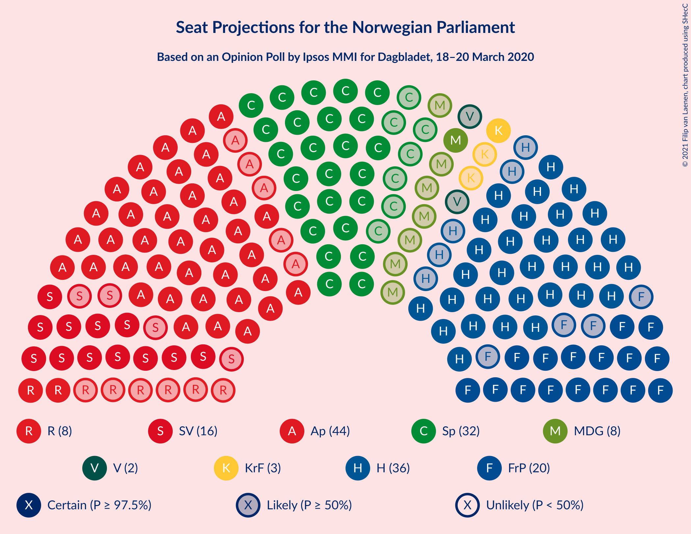
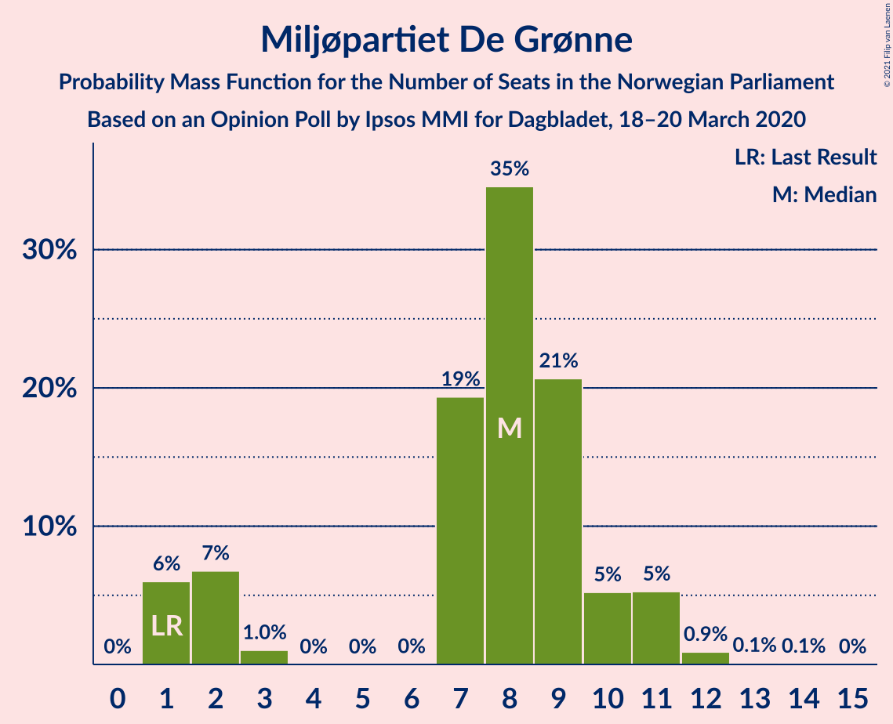
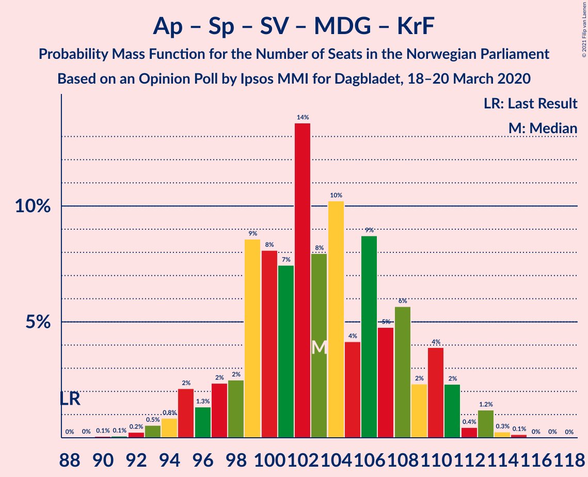
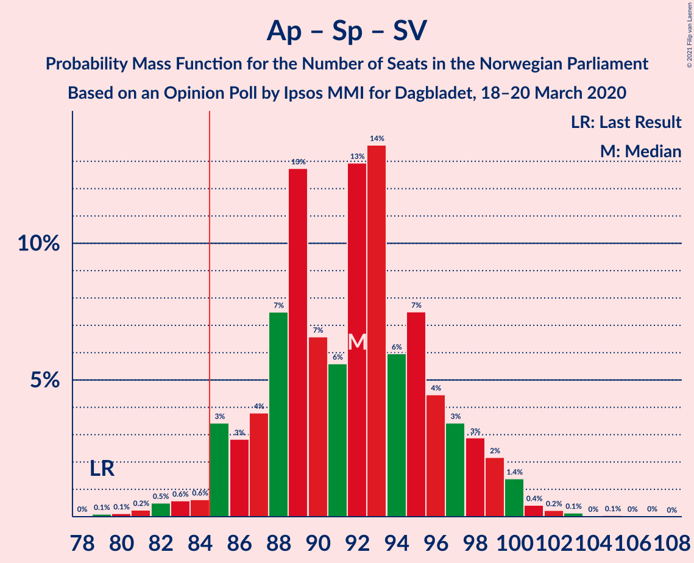
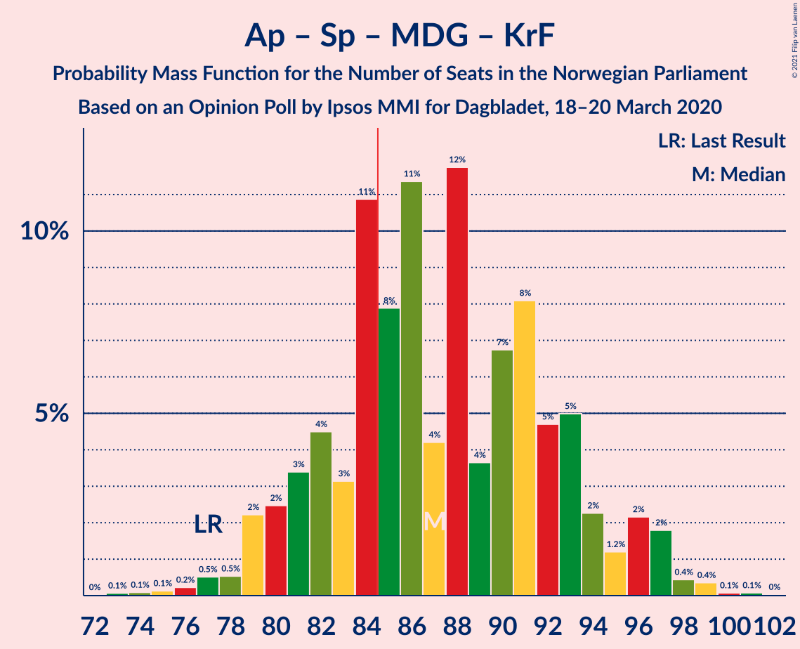
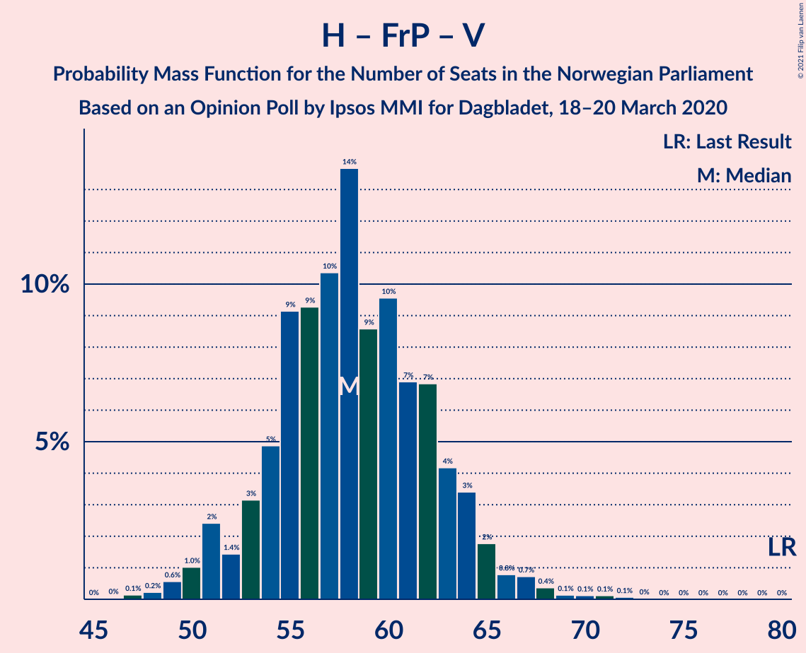

# Opinion Poll by Ipsos MMI for Dagbladet, 18–20 March 2020

<a href="#voting-intentions">Voting Intentions</a> | <a href="#seats">Seats</a> | <a href="#coalitions">Coalitions</a> | <a href="#technical-information">Technical Information</a>

## Voting Intentions

### Confidence Intervals

| Party | Last Result | Poll Result | 80% Confidence Interval | 90% Confidence Interval | 95% Confidence Interval | 99% Confidence Interval |
|:-----:|:-----------:|:-----------:|:-----------------------:|:-----------------------:|:-----------------------:|:-----------------------:|
| Arbeiderpartiet | 27.4% | 25.0% | 22.9–27.2% |22.3–27.9% |21.8–28.4% |20.8–29.6% |
| Høyre | 25.0% | 20.8% | 18.9–23.0% |18.3–23.6% |17.8–24.1% |17.0–25.2% |
| Senterpartiet | 10.3% | 17.4% | 15.6–19.4% |15.1–20.0% |14.7–20.5% |13.9–21.5% |
| Fremskrittspartiet | 15.2% | 11.4% | 9.9–13.2% |9.5–13.7% |9.2–14.1% |8.5–15.0% |
| Sosialistisk Venstreparti | 6.0% | 8.9% | 7.6–10.5% |7.3–11.0% |7.0–11.4% |6.4–12.2% |
| Rødt | 2.4% | 4.8% | 3.9–6.0% |3.6–6.4% |3.4–6.7% |3.0–7.4% |
| Miljøpartiet De Grønne | 3.2% | 4.5% | 3.6–5.7% |3.3–6.0% |3.1–6.4% |2.7–7.0% |
| Kristelig Folkeparti | 4.2% | 3.7% | 2.9–4.8% |2.7–5.2% |2.5–5.5% |2.2–6.1% |
| Venstre | 4.4% | 2.6% | 2.0–3.6% |1.8–3.9% |1.6–4.2% |1.4–4.7% |

*Note:* The poll result column reflects the actual value used in the calculations. Published results may vary slightly, and in addition be rounded to fewer digits.

## Seats

### Confidence Intervals

| Party | Last Result | Median | 80% Confidence Interval | 90% Confidence Interval | 95% Confidence Interval | 99% Confidence Interval |
|:-----:|:-----------:|:------:|:-----------------------:|:-----------------------:|:-----------------------:|:-----------------------:|
| <a href="#arbeiderpartiet">Arbeiderpartiet</a> | 49 | 43 | 40–48 |40–50 |39–52 |38–53 |
| <a href="#høyre">Høyre</a> | 45 | 37 | 33–40 |32–42 |31–43 |29–45 |
| <a href="#senterpartiet">Senterpartiet</a> | 19 | 32 | 28–36 |27–37 |27–38 |24–40 |
| <a href="#fremskrittspartiet">Fremskrittspartiet</a> | 27 | 19 | 17–24 |16–24 |15–26 |15–26 |
| <a href="#sosialistisk-venstreparti">Sosialistisk Venstreparti</a> | 11 | 16 | 13–18 |13–19 |12–20 |11–21 |
| <a href="#rødt">Rødt</a> | 1 | 8 | 2–10 |2–11 |2–11 |2–13 |
| <a href="#miljøpartiet-de-grønne">Miljøpartiet De Grønne</a> | 1 | 8 | 2–9 |1–11 |1–11 |1–12 |
| <a href="#kristelig-folkeparti">Kristelig Folkeparti</a> | 8 | 3 | 1–8 |1–9 |1–9 |1–10 |
| <a href="#venstre">Venstre</a> | 8 | 1 | 0–2 |0–2 |0–7 |0–8 |

### Arbeiderpartiet

*For a full overview of the results for this party, see the [Arbeiderpartiet](party-arbeiderpartiet.html) page.*

| Number of Seats | Probability | Accumulated | Special Marks |
|:---------------:|:-----------:|:-----------:|:-------------:|
| 35 | 0% | 100% |  |
| 36 | 0.1% | 99.9% |  |
| 37 | 0.2% | 99.8% |  |
| 38 | 2% | 99.6% |  |
| 39 | 2% | 98% |  |
| 40 | 6% | 96% |  |
| 41 | 8% | 90% |  |
| 42 | 27% | 82% |  |
| 43 | 8% | 55% | Median |
| 44 | 7% | 47% |  |
| 45 | 8% | 41% |  |
| 46 | 9% | 32% |  |
| 47 | 11% | 24% |  |
| 48 | 3% | 13% |  |
| 49 | 5% | 10% | Last Result |
| 50 | 1.3% | 5% |  |
| 51 | 0.8% | 4% |  |
| 52 | 1.0% | 3% |  |
| 53 | 2% | 2% |  |
| 54 | 0.3% | 0.4% |  |
| 55 | 0.1% | 0.1% |  |
| 56 | 0% | 0.1% |  |
| 57 | 0% | 0% |  |

### Høyre

*For a full overview of the results for this party, see the [Høyre](party-høyre.html) page.*

| Number of Seats | Probability | Accumulated | Special Marks |
|:---------------:|:-----------:|:-----------:|:-------------:|
| 28 | 0.2% | 100% |  |
| 29 | 0.6% | 99.7% |  |
| 30 | 0.7% | 99.2% |  |
| 31 | 3% | 98% |  |
| 32 | 2% | 96% |  |
| 33 | 9% | 94% |  |
| 34 | 12% | 85% |  |
| 35 | 6% | 74% |  |
| 36 | 13% | 68% |  |
| 37 | 8% | 54% | Median |
| 38 | 26% | 46% |  |
| 39 | 9% | 21% |  |
| 40 | 4% | 12% |  |
| 41 | 1.3% | 8% |  |
| 42 | 3% | 7% |  |
| 43 | 2% | 4% |  |
| 44 | 0.5% | 2% |  |
| 45 | 0.8% | 1.3% | Last Result |
| 46 | 0.3% | 0.5% |  |
| 47 | 0.1% | 0.2% |  |
| 48 | 0% | 0.1% |  |
| 49 | 0.1% | 0.1% |  |
| 50 | 0% | 0% |  |

### Senterpartiet

*For a full overview of the results for this party, see the [Senterpartiet](party-senterpartiet.html) page.*

| Number of Seats | Probability | Accumulated | Special Marks |
|:---------------:|:-----------:|:-----------:|:-------------:|
| 19 | 0% | 100% | Last Result |
| 20 | 0% | 100% |  |
| 21 | 0% | 100% |  |
| 22 | 0.1% | 100% |  |
| 23 | 0.3% | 99.9% |  |
| 24 | 0.5% | 99.6% |  |
| 25 | 0.3% | 99.1% |  |
| 26 | 1.1% | 98.8% |  |
| 27 | 4% | 98% |  |
| 28 | 17% | 93% |  |
| 29 | 7% | 76% |  |
| 30 | 10% | 69% |  |
| 31 | 5% | 60% |  |
| 32 | 10% | 55% | Median |
| 33 | 19% | 45% |  |
| 34 | 12% | 26% |  |
| 35 | 2% | 14% |  |
| 36 | 6% | 13% |  |
| 37 | 3% | 7% |  |
| 38 | 2% | 4% |  |
| 39 | 1.2% | 2% |  |
| 40 | 0.3% | 0.5% |  |
| 41 | 0.1% | 0.2% |  |
| 42 | 0% | 0.1% |  |
| 43 | 0% | 0% |  |

### Fremskrittspartiet

*For a full overview of the results for this party, see the [Fremskrittspartiet](party-fremskrittspartiet.html) page.*

| Number of Seats | Probability | Accumulated | Special Marks |
|:---------------:|:-----------:|:-----------:|:-------------:|
| 13 | 0.1% | 100% |  |
| 14 | 0.3% | 99.9% |  |
| 15 | 3% | 99.5% |  |
| 16 | 3% | 97% |  |
| 17 | 9% | 94% |  |
| 18 | 8% | 85% |  |
| 19 | 29% | 77% | Median |
| 20 | 12% | 49% |  |
| 21 | 8% | 37% |  |
| 22 | 14% | 29% |  |
| 23 | 3% | 15% |  |
| 24 | 8% | 12% |  |
| 25 | 1.4% | 4% |  |
| 26 | 2% | 3% |  |
| 27 | 0.2% | 0.3% | Last Result |
| 28 | 0.1% | 0.2% |  |
| 29 | 0.1% | 0.1% |  |
| 30 | 0% | 0% |  |

### Sosialistisk Venstreparti

*For a full overview of the results for this party, see the [Sosialistisk Venstreparti](party-sosialistiskvenstreparti.html) page.*

| Number of Seats | Probability | Accumulated | Special Marks |
|:---------------:|:-----------:|:-----------:|:-------------:|
| 10 | 0.3% | 100% |  |
| 11 | 1.1% | 99.7% | Last Result |
| 12 | 3% | 98.5% |  |
| 13 | 8% | 95% |  |
| 14 | 15% | 87% |  |
| 15 | 11% | 71% |  |
| 16 | 18% | 61% | Median |
| 17 | 7% | 43% |  |
| 18 | 28% | 35% |  |
| 19 | 3% | 8% |  |
| 20 | 3% | 5% |  |
| 21 | 1.0% | 1.5% |  |
| 22 | 0.2% | 0.5% |  |
| 23 | 0.2% | 0.3% |  |
| 24 | 0.1% | 0.1% |  |
| 25 | 0% | 0% |  |

### Rødt

*For a full overview of the results for this party, see the [Rødt](party-rødt.html) page.*

| Number of Seats | Probability | Accumulated | Special Marks |
|:---------------:|:-----------:|:-----------:|:-------------:|
| 1 | 0.3% | 100% | Last Result |
| 2 | 10% | 99.7% |  |
| 3 | 0% | 90% |  |
| 4 | 0% | 90% |  |
| 5 | 0% | 90% |  |
| 6 | 0.2% | 90% |  |
| 7 | 7% | 90% |  |
| 8 | 35% | 82% | Median |
| 9 | 24% | 47% |  |
| 10 | 15% | 23% |  |
| 11 | 5% | 8% |  |
| 12 | 2% | 2% |  |
| 13 | 0.4% | 0.5% |  |
| 14 | 0.2% | 0.2% |  |
| 15 | 0% | 0% |  |

### Miljøpartiet De Grønne

*For a full overview of the results for this party, see the [Miljøpartiet De Grønne](party-miljøpartietdegrønne.html) page.*

| Number of Seats | Probability | Accumulated | Special Marks |
|:---------------:|:-----------:|:-----------:|:-------------:|
| 1 | 7% | 100% | Last Result |
| 2 | 7% | 93% |  |
| 3 | 1.4% | 86% |  |
| 4 | 0% | 85% |  |
| 5 | 0% | 85% |  |
| 6 | 0% | 85% |  |
| 7 | 23% | 85% |  |
| 8 | 33% | 61% | Median |
| 9 | 21% | 28% |  |
| 10 | 2% | 7% |  |
| 11 | 4% | 5% |  |
| 12 | 1.1% | 1.3% |  |
| 13 | 0.1% | 0.2% |  |
| 14 | 0.1% | 0.1% |  |
| 15 | 0% | 0% |  |

### Kristelig Folkeparti

*For a full overview of the results for this party, see the [Kristelig Folkeparti](party-kristeligfolkeparti.html) page.*

| Number of Seats | Probability | Accumulated | Special Marks |
|:---------------:|:-----------:|:-----------:|:-------------:|
| 0 | 0.4% | 100% |  |
| 1 | 33% | 99.6% |  |
| 2 | 6% | 67% |  |
| 3 | 29% | 61% | Median |
| 4 | 0% | 32% |  |
| 5 | 0% | 32% |  |
| 6 | 0.3% | 32% |  |
| 7 | 14% | 32% |  |
| 8 | 13% | 18% | Last Result |
| 9 | 4% | 5% |  |
| 10 | 0.8% | 1.1% |  |
| 11 | 0.3% | 0.3% |  |
| 12 | 0% | 0% |  |

### Venstre

*For a full overview of the results for this party, see the [Venstre](party-venstre.html) page.*

| Number of Seats | Probability | Accumulated | Special Marks |
|:---------------:|:-----------:|:-----------:|:-------------:|
| 0 | 13% | 100% |  |
| 1 | 38% | 87% | Median |
| 2 | 46% | 48% |  |
| 3 | 0% | 3% |  |
| 4 | 0% | 3% |  |
| 5 | 0% | 3% |  |
| 6 | 0.1% | 3% |  |
| 7 | 1.5% | 3% |  |
| 8 | 0.8% | 1.1% | Last Result |
| 9 | 0.2% | 0.3% |  |
| 10 | 0% | 0% |  |

## Coalitions

### Confidence Intervals

| Coalition | Last Result | Median | Majority? | 80% Confidence Interval | 90% Confidence Interval | 95% Confidence Interval | 99% Confidence Interval |
|:---------:|:-----------:|:------:|:---------:|:-----------------------:|:-----------------------:|:-----------------------:|:-----------------------:|
| Arbeiderpartiet – Senterpartiet – Sosialistisk Venstreparti – Rødt – Miljøpartiet De Grønne | 81 | 107 | 100% | 102–111 | 101–112 | 99–114 | 95–117 |
| Arbeiderpartiet – Senterpartiet – Sosialistisk Venstreparti – Miljøpartiet De Grønne – Kristelig Folkeparti | 88 | 102 | 100% | 98–108 | 96–110 | 95–111 | 92–113 |
| Arbeiderpartiet – Senterpartiet – Sosialistisk Venstreparti – Rødt | 80 | 101 | 100% | 95–104 | 94–107 | 92–108 | 90–110 |
| Arbeiderpartiet – Senterpartiet – Sosialistisk Venstreparti – Miljøpartiet De Grønne | 80 | 100 | 100% | 94–103 | 93–106 | 91–107 | 88–109 |
| Høyre – Senterpartiet – Fremskrittspartiet – Kristelig Folkeparti – Venstre | 107 | 93 | 98.9% | 89–99 | 87–100 | 86–102 | 83–105 |
| Arbeiderpartiet – Senterpartiet – Sosialistisk Venstreparti | 79 | 92 | 98% | 87–97 | 86–99 | 85–100 | 82–101 |
| Arbeiderpartiet – Senterpartiet – Miljøpartiet De Grønne – Kristelig Folkeparti | 77 | 86 | 69% | 81–92 | 79–94 | 79–96 | 75–99 |
| Arbeiderpartiet – Senterpartiet – Kristelig Folkeparti | 76 | 78 | 11% | 76–85 | 73–87 | 72–89 | 70–90 |
| Arbeiderpartiet – Senterpartiet | 68 | 75 | 1.4% | 73–80 | 70–83 | 69–83 | 67–85 |
| Høyre – Fremskrittspartiet – Miljøpartiet De Grønne – Kristelig Folkeparti – Venstre | 89 | 68 | 0% | 65–74 | 62–75 | 61–77 | 59–79 |
| Høyre – Fremskrittspartiet – Kristelig Folkeparti – Venstre | 88 | 62 | 0% | 58–67 | 57–68 | 55–70 | 52–74 |
| Arbeiderpartiet – Sosialistisk Venstreparti | 60 | 60 | 0% | 56–65 | 55–66 | 54–68 | 52–69 |
| Høyre – Fremskrittspartiet – Venstre | 80 | 58 | 0% | 54–62 | 53–64 | 51–65 | 49–69 |
| Høyre – Fremskrittspartiet | 72 | 57 | 0% | 53–61 | 51–62 | 50–63 | 47–67 |
| Høyre – Kristelig Folkeparti – Venstre | 61 | 42 | 0% | 38–47 | 37–48 | 36–50 | 34–53 |
| Senterpartiet – Kristelig Folkeparti – Venstre | 35 | 36 | 0% | 33–43 | 31–44 | 30–46 | 29–49 |

### Arbeiderpartiet – Senterpartiet – Sosialistisk Venstreparti – Rødt – Miljøpartiet De Grønne

| Number of Seats | Probability | Accumulated | Special Marks |
|:---------------:|:-----------:|:-----------:|:-------------:|
| 81 | 0% | 100% | Last Result |
| 82 | 0% | 100% |  |
| 83 | 0% | 100% |  |
| 84 | 0% | 100% |  |
| 85 | 0% | 100% | Majority |
| 86 | 0% | 100% |  |
| 87 | 0% | 100% |  |
| 88 | 0% | 100% |  |
| 89 | 0% | 100% |  |
| 90 | 0.2% | 100% |  |
| 91 | 0% | 99.8% |  |
| 92 | 0% | 99.8% |  |
| 93 | 0.1% | 99.8% |  |
| 94 | 0.2% | 99.7% |  |
| 95 | 0% | 99.5% |  |
| 96 | 0.1% | 99.5% |  |
| 97 | 1.0% | 99.4% |  |
| 98 | 0.7% | 98% |  |
| 99 | 1.2% | 98% |  |
| 100 | 1.1% | 97% |  |
| 101 | 1.2% | 95% |  |
| 102 | 7% | 94% |  |
| 103 | 6% | 87% |  |
| 104 | 13% | 81% |  |
| 105 | 7% | 68% |  |
| 106 | 7% | 61% |  |
| 107 | 5% | 54% | Median |
| 108 | 3% | 50% |  |
| 109 | 8% | 46% |  |
| 110 | 22% | 38% |  |
| 111 | 11% | 16% |  |
| 112 | 1.2% | 5% |  |
| 113 | 1.2% | 4% |  |
| 114 | 0.7% | 3% |  |
| 115 | 1.1% | 2% |  |
| 116 | 0.3% | 0.9% |  |
| 117 | 0.5% | 0.6% |  |
| 118 | 0% | 0.1% |  |
| 119 | 0% | 0% |  |

### Arbeiderpartiet – Senterpartiet – Sosialistisk Venstreparti – Miljøpartiet De Grønne – Kristelig Folkeparti

| Number of Seats | Probability | Accumulated | Special Marks |
|:---------------:|:-----------:|:-----------:|:-------------:|
| 88 | 0% | 100% | Last Result |
| 89 | 0% | 100% |  |
| 90 | 0.1% | 99.9% |  |
| 91 | 0.1% | 99.8% |  |
| 92 | 0.3% | 99.8% |  |
| 93 | 0.5% | 99.5% |  |
| 94 | 0.5% | 99.0% |  |
| 95 | 3% | 98% |  |
| 96 | 2% | 95% |  |
| 97 | 3% | 93% |  |
| 98 | 2% | 91% |  |
| 99 | 9% | 88% |  |
| 100 | 4% | 79% |  |
| 101 | 7% | 75% |  |
| 102 | 20% | 69% | Median |
| 103 | 11% | 48% |  |
| 104 | 12% | 37% |  |
| 105 | 5% | 25% |  |
| 106 | 7% | 20% |  |
| 107 | 1.1% | 13% |  |
| 108 | 3% | 12% |  |
| 109 | 2% | 9% |  |
| 110 | 4% | 7% |  |
| 111 | 1.1% | 3% |  |
| 112 | 0.2% | 2% |  |
| 113 | 2% | 2% |  |
| 114 | 0.3% | 0.5% |  |
| 115 | 0.1% | 0.2% |  |
| 116 | 0% | 0% |  |

### Arbeiderpartiet – Senterpartiet – Sosialistisk Venstreparti – Rødt

| Number of Seats | Probability | Accumulated | Special Marks |
|:---------------:|:-----------:|:-----------:|:-------------:|
| 80 | 0% | 100% | Last Result |
| 81 | 0% | 100% |  |
| 82 | 0% | 100% |  |
| 83 | 0% | 100% |  |
| 84 | 0% | 100% |  |
| 85 | 0% | 100% | Majority |
| 86 | 0% | 100% |  |
| 87 | 0% | 100% |  |
| 88 | 0.3% | 99.9% |  |
| 89 | 0.2% | 99.7% |  |
| 90 | 0.4% | 99.5% |  |
| 91 | 0.9% | 99.1% |  |
| 92 | 1.3% | 98% |  |
| 93 | 1.5% | 97% |  |
| 94 | 3% | 95% |  |
| 95 | 8% | 93% |  |
| 96 | 3% | 85% |  |
| 97 | 15% | 81% |  |
| 98 | 6% | 66% |  |
| 99 | 5% | 60% | Median |
| 100 | 4% | 56% |  |
| 101 | 7% | 52% |  |
| 102 | 32% | 45% |  |
| 103 | 2% | 13% |  |
| 104 | 3% | 11% |  |
| 105 | 1.3% | 8% |  |
| 106 | 1.5% | 7% |  |
| 107 | 2% | 5% |  |
| 108 | 3% | 3% |  |
| 109 | 0.2% | 0.8% |  |
| 110 | 0.1% | 0.6% |  |
| 111 | 0.3% | 0.5% |  |
| 112 | 0.1% | 0.2% |  |
| 113 | 0% | 0.1% |  |
| 114 | 0.1% | 0.1% |  |
| 115 | 0% | 0% |  |

### Arbeiderpartiet – Senterpartiet – Sosialistisk Venstreparti – Miljøpartiet De Grønne

| Number of Seats | Probability | Accumulated | Special Marks |
|:---------------:|:-----------:|:-----------:|:-------------:|
| 80 | 0% | 100% | Last Result |
| 81 | 0% | 100% |  |
| 82 | 0% | 100% |  |
| 83 | 0% | 100% |  |
| 84 | 0% | 100% |  |
| 85 | 0% | 100% | Majority |
| 86 | 0% | 100% |  |
| 87 | 0.3% | 99.9% |  |
| 88 | 0.4% | 99.6% |  |
| 89 | 0.6% | 99.2% |  |
| 90 | 0.8% | 98.6% |  |
| 91 | 0.4% | 98% |  |
| 92 | 2% | 97% |  |
| 93 | 3% | 95% |  |
| 94 | 7% | 92% |  |
| 95 | 4% | 85% |  |
| 96 | 14% | 81% |  |
| 97 | 7% | 67% |  |
| 98 | 4% | 60% |  |
| 99 | 5% | 56% | Median |
| 100 | 3% | 51% |  |
| 101 | 31% | 48% |  |
| 102 | 5% | 17% |  |
| 103 | 3% | 12% |  |
| 104 | 2% | 9% |  |
| 105 | 2% | 7% |  |
| 106 | 0.5% | 5% |  |
| 107 | 3% | 5% |  |
| 108 | 0.4% | 1.3% |  |
| 109 | 0.7% | 0.8% |  |
| 110 | 0.1% | 0.1% |  |
| 111 | 0% | 0.1% |  |
| 112 | 0% | 0% |  |

### Høyre – Senterpartiet – Fremskrittspartiet – Kristelig Folkeparti – Venstre

| Number of Seats | Probability | Accumulated | Special Marks |
|:---------------:|:-----------:|:-----------:|:-------------:|
| 81 | 0% | 100% |  |
| 82 | 0.2% | 99.9% |  |
| 83 | 0.3% | 99.8% |  |
| 84 | 0.6% | 99.5% |  |
| 85 | 0.5% | 98.9% | Majority |
| 86 | 1.3% | 98% |  |
| 87 | 3% | 97% |  |
| 88 | 3% | 94% |  |
| 89 | 3% | 91% |  |
| 90 | 11% | 89% |  |
| 91 | 3% | 78% |  |
| 92 | 17% | 75% | Median |
| 93 | 13% | 58% |  |
| 94 | 6% | 46% |  |
| 95 | 12% | 40% |  |
| 96 | 6% | 28% |  |
| 97 | 4% | 22% |  |
| 98 | 7% | 18% |  |
| 99 | 5% | 11% |  |
| 100 | 2% | 6% |  |
| 101 | 0.9% | 4% |  |
| 102 | 2% | 3% |  |
| 103 | 0.8% | 2% |  |
| 104 | 0.4% | 0.9% |  |
| 105 | 0.2% | 0.6% |  |
| 106 | 0% | 0.4% |  |
| 107 | 0.1% | 0.3% | Last Result |
| 108 | 0.2% | 0.3% |  |
| 109 | 0% | 0% |  |

### Arbeiderpartiet – Senterpartiet – Sosialistisk Venstreparti

| Number of Seats | Probability | Accumulated | Special Marks |
|:---------------:|:-----------:|:-----------:|:-------------:|
| 79 | 0% | 100% | Last Result |
| 80 | 0% | 100% |  |
| 81 | 0.4% | 99.9% |  |
| 82 | 0.7% | 99.5% |  |
| 83 | 0.4% | 98.9% |  |
| 84 | 0.5% | 98% |  |
| 85 | 2% | 98% | Majority |
| 86 | 3% | 96% |  |
| 87 | 7% | 93% |  |
| 88 | 4% | 86% |  |
| 89 | 14% | 82% |  |
| 90 | 8% | 68% |  |
| 91 | 3% | 60% | Median |
| 92 | 13% | 57% |  |
| 93 | 21% | 44% |  |
| 94 | 6% | 24% |  |
| 95 | 5% | 18% |  |
| 96 | 2% | 13% |  |
| 97 | 3% | 11% |  |
| 98 | 2% | 8% |  |
| 99 | 3% | 6% |  |
| 100 | 1.4% | 3% |  |
| 101 | 0.7% | 1.2% |  |
| 102 | 0.2% | 0.5% |  |
| 103 | 0.1% | 0.3% |  |
| 104 | 0% | 0.2% |  |
| 105 | 0.1% | 0.2% |  |
| 106 | 0.1% | 0.1% |  |
| 107 | 0% | 0% |  |

### Arbeiderpartiet – Senterpartiet – Miljøpartiet De Grønne – Kristelig Folkeparti

| Number of Seats | Probability | Accumulated | Special Marks |
|:---------------:|:-----------:|:-----------:|:-------------:|
| 72 | 0% | 100% |  |
| 73 | 0.1% | 99.9% |  |
| 74 | 0.2% | 99.8% |  |
| 75 | 0.2% | 99.7% |  |
| 76 | 0.1% | 99.4% |  |
| 77 | 0.5% | 99.4% | Last Result |
| 78 | 0.3% | 98.8% |  |
| 79 | 4% | 98.5% |  |
| 80 | 4% | 95% |  |
| 81 | 2% | 91% |  |
| 82 | 2% | 88% |  |
| 83 | 0.8% | 86% |  |
| 84 | 16% | 85% |  |
| 85 | 10% | 69% | Majority |
| 86 | 17% | 59% | Median |
| 87 | 3% | 41% |  |
| 88 | 11% | 39% |  |
| 89 | 3% | 28% |  |
| 90 | 7% | 25% |  |
| 91 | 5% | 18% |  |
| 92 | 3% | 13% |  |
| 93 | 2% | 10% |  |
| 94 | 3% | 8% |  |
| 95 | 0.7% | 5% |  |
| 96 | 2% | 4% |  |
| 97 | 1.1% | 2% |  |
| 98 | 0.2% | 0.9% |  |
| 99 | 0.5% | 0.7% |  |
| 100 | 0.1% | 0.2% |  |
| 101 | 0.1% | 0.1% |  |
| 102 | 0% | 0% |  |

### Arbeiderpartiet – Senterpartiet – Kristelig Folkeparti

| Number of Seats | Probability | Accumulated | Special Marks |
|:---------------:|:-----------:|:-----------:|:-------------:|
| 69 | 0.4% | 100% |  |
| 70 | 0.3% | 99.6% |  |
| 71 | 0.7% | 99.3% |  |
| 72 | 2% | 98.6% |  |
| 73 | 1.5% | 96% |  |
| 74 | 0.8% | 95% |  |
| 75 | 0.6% | 94% |  |
| 76 | 16% | 93% | Last Result |
| 77 | 12% | 77% |  |
| 78 | 19% | 65% | Median |
| 79 | 6% | 46% |  |
| 80 | 3% | 41% |  |
| 81 | 12% | 38% |  |
| 82 | 6% | 26% |  |
| 83 | 6% | 21% |  |
| 84 | 4% | 15% |  |
| 85 | 2% | 11% | Majority |
| 86 | 3% | 9% |  |
| 87 | 2% | 6% |  |
| 88 | 0.7% | 4% |  |
| 89 | 2% | 4% |  |
| 90 | 0.7% | 1.2% |  |
| 91 | 0.3% | 0.5% |  |
| 92 | 0.1% | 0.1% |  |
| 93 | 0.1% | 0.1% |  |
| 94 | 0% | 0% |  |

### Arbeiderpartiet – Senterpartiet

| Number of Seats | Probability | Accumulated | Special Marks |
|:---------------:|:-----------:|:-----------:|:-------------:|
| 65 | 0.1% | 100% |  |
| 66 | 0.3% | 99.9% |  |
| 67 | 0.3% | 99.5% |  |
| 68 | 1.1% | 99.2% | Last Result |
| 69 | 2% | 98% |  |
| 70 | 1.3% | 96% |  |
| 71 | 1.2% | 95% |  |
| 72 | 2% | 93% |  |
| 73 | 6% | 91% |  |
| 74 | 20% | 85% |  |
| 75 | 29% | 65% | Median |
| 76 | 6% | 36% |  |
| 77 | 11% | 30% |  |
| 78 | 5% | 19% |  |
| 79 | 2% | 14% |  |
| 80 | 3% | 12% |  |
| 81 | 2% | 9% |  |
| 82 | 2% | 7% |  |
| 83 | 3% | 5% |  |
| 84 | 0.9% | 2% |  |
| 85 | 0.9% | 1.4% | Majority |
| 86 | 0.3% | 0.4% |  |
| 87 | 0.1% | 0.2% |  |
| 88 | 0.1% | 0.1% |  |
| 89 | 0% | 0% |  |

### Høyre – Fremskrittspartiet – Miljøpartiet De Grønne – Kristelig Folkeparti – Venstre

| Number of Seats | Probability | Accumulated | Special Marks |
|:---------------:|:-----------:|:-----------:|:-------------:|
| 55 | 0.1% | 100% |  |
| 56 | 0% | 99.9% |  |
| 57 | 0.1% | 99.9% |  |
| 58 | 0.3% | 99.8% |  |
| 59 | 0.1% | 99.5% |  |
| 60 | 0.2% | 99.4% |  |
| 61 | 3% | 99.2% |  |
| 62 | 2% | 97% |  |
| 63 | 1.5% | 95% |  |
| 64 | 1.3% | 93% |  |
| 65 | 3% | 92% |  |
| 66 | 2% | 89% |  |
| 67 | 32% | 87% |  |
| 68 | 7% | 55% | Median |
| 69 | 4% | 48% |  |
| 70 | 5% | 44% |  |
| 71 | 6% | 40% |  |
| 72 | 15% | 34% |  |
| 73 | 3% | 19% |  |
| 74 | 8% | 15% |  |
| 75 | 3% | 7% |  |
| 76 | 1.5% | 5% |  |
| 77 | 1.3% | 3% |  |
| 78 | 0.9% | 2% |  |
| 79 | 0.4% | 0.9% |  |
| 80 | 0.2% | 0.5% |  |
| 81 | 0.3% | 0.3% |  |
| 82 | 0% | 0.1% |  |
| 83 | 0% | 0% |  |
| 84 | 0% | 0% |  |
| 85 | 0% | 0% | Majority |
| 86 | 0% | 0% |  |
| 87 | 0% | 0% |  |
| 88 | 0% | 0% |  |
| 89 | 0% | 0% | Last Result |

### Høyre – Fremskrittspartiet – Kristelig Folkeparti – Venstre

| Number of Seats | Probability | Accumulated | Special Marks |
|:---------------:|:-----------:|:-----------:|:-------------:|
| 51 | 0% | 100% |  |
| 52 | 0.5% | 99.9% |  |
| 53 | 0.3% | 99.4% |  |
| 54 | 1.1% | 99.1% |  |
| 55 | 0.7% | 98% |  |
| 56 | 1.2% | 97% |  |
| 57 | 1.2% | 96% |  |
| 58 | 11% | 95% |  |
| 59 | 22% | 84% |  |
| 60 | 8% | 62% | Median |
| 61 | 3% | 54% |  |
| 62 | 5% | 50% |  |
| 63 | 7% | 46% |  |
| 64 | 7% | 39% |  |
| 65 | 13% | 32% |  |
| 66 | 6% | 19% |  |
| 67 | 7% | 13% |  |
| 68 | 1.2% | 6% |  |
| 69 | 1.1% | 5% |  |
| 70 | 1.2% | 3% |  |
| 71 | 0.7% | 2% |  |
| 72 | 1.0% | 2% |  |
| 73 | 0.1% | 0.6% |  |
| 74 | 0% | 0.5% |  |
| 75 | 0.2% | 0.5% |  |
| 76 | 0.1% | 0.3% |  |
| 77 | 0% | 0.2% |  |
| 78 | 0% | 0.2% |  |
| 79 | 0.2% | 0.2% |  |
| 80 | 0% | 0% |  |
| 81 | 0% | 0% |  |
| 82 | 0% | 0% |  |
| 83 | 0% | 0% |  |
| 84 | 0% | 0% |  |
| 85 | 0% | 0% | Majority |
| 86 | 0% | 0% |  |
| 87 | 0% | 0% |  |
| 88 | 0% | 0% | Last Result |

### Arbeiderpartiet – Sosialistisk Venstreparti

| Number of Seats | Probability | Accumulated | Special Marks |
|:---------------:|:-----------:|:-----------:|:-------------:|
| 50 | 0.1% | 100% |  |
| 51 | 0.3% | 99.9% |  |
| 52 | 0.2% | 99.5% |  |
| 53 | 0.5% | 99.3% |  |
| 54 | 3% | 98.9% |  |
| 55 | 5% | 96% |  |
| 56 | 7% | 91% |  |
| 57 | 3% | 85% |  |
| 58 | 7% | 81% |  |
| 59 | 12% | 75% | Median |
| 60 | 27% | 63% | Last Result |
| 61 | 14% | 36% |  |
| 62 | 4% | 22% |  |
| 63 | 2% | 18% |  |
| 64 | 5% | 16% |  |
| 65 | 6% | 11% |  |
| 66 | 0.7% | 5% |  |
| 67 | 0.8% | 4% |  |
| 68 | 1.5% | 4% |  |
| 69 | 2% | 2% |  |
| 70 | 0.2% | 0.5% |  |
| 71 | 0.2% | 0.3% |  |
| 72 | 0.1% | 0.1% |  |
| 73 | 0% | 0% |  |

### Høyre – Fremskrittspartiet – Venstre

| Number of Seats | Probability | Accumulated | Special Marks |
|:---------------:|:-----------:|:-----------:|:-------------:|
| 47 | 0.3% | 100% |  |
| 48 | 0.2% | 99.7% |  |
| 49 | 0.4% | 99.6% |  |
| 50 | 0.5% | 99.2% |  |
| 51 | 2% | 98.7% |  |
| 52 | 1.1% | 97% |  |
| 53 | 3% | 96% |  |
| 54 | 4% | 93% |  |
| 55 | 12% | 89% |  |
| 56 | 6% | 77% |  |
| 57 | 7% | 71% | Median |
| 58 | 26% | 63% |  |
| 59 | 6% | 38% |  |
| 60 | 7% | 32% |  |
| 61 | 4% | 25% |  |
| 62 | 11% | 20% |  |
| 63 | 4% | 9% |  |
| 64 | 3% | 6% |  |
| 65 | 0.9% | 3% |  |
| 66 | 0.9% | 2% |  |
| 67 | 0.4% | 1.3% |  |
| 68 | 0.3% | 0.9% |  |
| 69 | 0.2% | 0.6% |  |
| 70 | 0.1% | 0.4% |  |
| 71 | 0.2% | 0.3% |  |
| 72 | 0% | 0.1% |  |
| 73 | 0% | 0.1% |  |
| 74 | 0% | 0% |  |
| 75 | 0% | 0% |  |
| 76 | 0% | 0% |  |
| 77 | 0% | 0% |  |
| 78 | 0% | 0% |  |
| 79 | 0% | 0% |  |
| 80 | 0% | 0% | Last Result |

### Høyre – Fremskrittspartiet

| Number of Seats | Probability | Accumulated | Special Marks |
|:---------------:|:-----------:|:-----------:|:-------------:|
| 46 | 0.1% | 100% |  |
| 47 | 0.4% | 99.9% |  |
| 48 | 0.5% | 99.5% |  |
| 49 | 1.1% | 99.0% |  |
| 50 | 2% | 98% |  |
| 51 | 2% | 96% |  |
| 52 | 3% | 94% |  |
| 53 | 6% | 91% |  |
| 54 | 3% | 85% |  |
| 55 | 17% | 82% |  |
| 56 | 12% | 65% | Median |
| 57 | 20% | 53% |  |
| 58 | 8% | 33% |  |
| 59 | 3% | 25% |  |
| 60 | 11% | 22% |  |
| 61 | 3% | 11% |  |
| 62 | 4% | 8% |  |
| 63 | 2% | 4% |  |
| 64 | 0.6% | 2% |  |
| 65 | 0.8% | 2% |  |
| 66 | 0.3% | 0.9% |  |
| 67 | 0.1% | 0.5% |  |
| 68 | 0.1% | 0.5% |  |
| 69 | 0.3% | 0.4% |  |
| 70 | 0% | 0.1% |  |
| 71 | 0% | 0.1% |  |
| 72 | 0% | 0% | Last Result |

### Høyre – Kristelig Folkeparti – Venstre

| Number of Seats | Probability | Accumulated | Special Marks |
|:---------------:|:-----------:|:-----------:|:-------------:|
| 32 | 0.1% | 100% |  |
| 33 | 0.2% | 99.8% |  |
| 34 | 0.5% | 99.6% |  |
| 35 | 0.4% | 99.2% |  |
| 36 | 2% | 98.7% |  |
| 37 | 4% | 96% |  |
| 38 | 3% | 92% |  |
| 39 | 12% | 89% |  |
| 40 | 19% | 77% |  |
| 41 | 4% | 58% | Median |
| 42 | 10% | 54% |  |
| 43 | 18% | 44% |  |
| 44 | 4% | 26% |  |
| 45 | 4% | 21% |  |
| 46 | 6% | 17% |  |
| 47 | 4% | 11% |  |
| 48 | 3% | 7% |  |
| 49 | 0.7% | 3% |  |
| 50 | 0.9% | 3% |  |
| 51 | 0.2% | 2% |  |
| 52 | 1.0% | 2% |  |
| 53 | 0.2% | 0.6% |  |
| 54 | 0.2% | 0.4% |  |
| 55 | 0% | 0.2% |  |
| 56 | 0.2% | 0.2% |  |
| 57 | 0% | 0% |  |
| 58 | 0% | 0% |  |
| 59 | 0% | 0% |  |
| 60 | 0% | 0% |  |
| 61 | 0% | 0% | Last Result |

### Senterpartiet – Kristelig Folkeparti – Venstre

| Number of Seats | Probability | Accumulated | Special Marks |
|:---------------:|:-----------:|:-----------:|:-------------:|
| 26 | 0% | 100% |  |
| 27 | 0.1% | 99.9% |  |
| 28 | 0.2% | 99.9% |  |
| 29 | 0.3% | 99.7% |  |
| 30 | 2% | 99.4% |  |
| 31 | 4% | 97% |  |
| 32 | 3% | 93% |  |
| 33 | 11% | 90% |  |
| 34 | 2% | 79% |  |
| 35 | 27% | 77% | Last Result |
| 36 | 4% | 50% | Median |
| 37 | 9% | 46% |  |
| 38 | 5% | 37% |  |
| 39 | 6% | 31% |  |
| 40 | 6% | 25% |  |
| 41 | 5% | 19% |  |
| 42 | 2% | 15% |  |
| 43 | 7% | 13% |  |
| 44 | 2% | 6% |  |
| 45 | 1.0% | 4% |  |
| 46 | 1.1% | 3% |  |
| 47 | 1.2% | 2% |  |
| 48 | 0.2% | 0.8% |  |
| 49 | 0.3% | 0.6% |  |
| 50 | 0.2% | 0.4% |  |
| 51 | 0.1% | 0.2% |  |
| 52 | 0% | 0.1% |  |
| 53 | 0% | 0% |  |

## Technical Information

### Opinion Poll

+ **Polling firm:** Ipsos MMI
+ **Commissioner(s):** Dagbladet
+ **Fieldwork period:** 18–20 March 2020

### Calculations

+ **Sample size:** 649
+ **Simulations done:** 524,288
+ **Error estimate:** 3.19%

