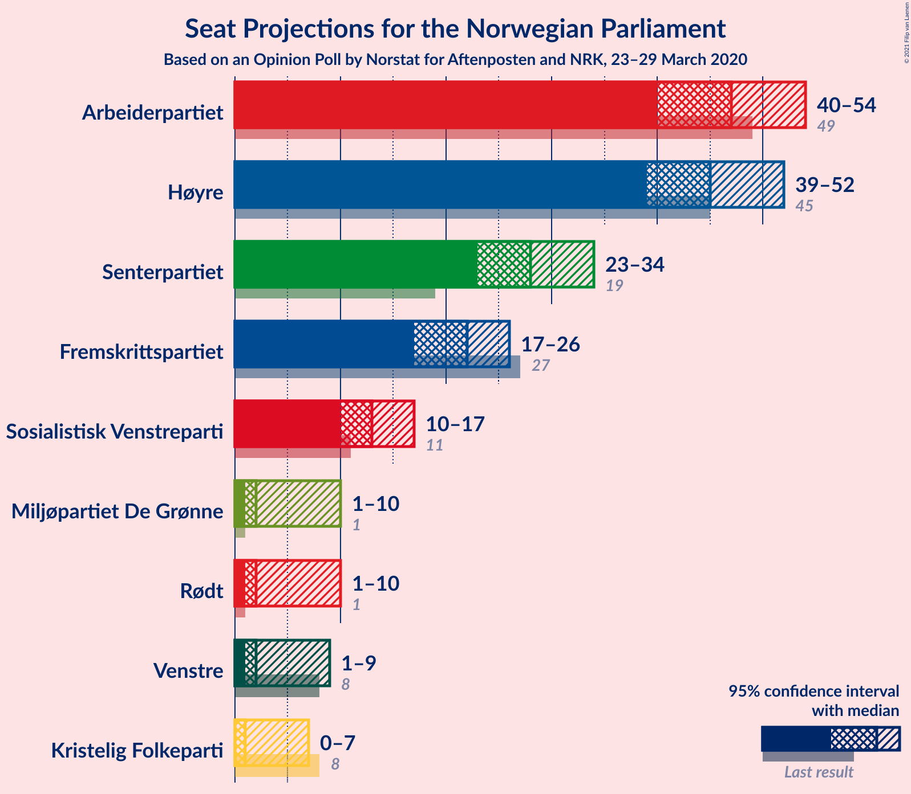
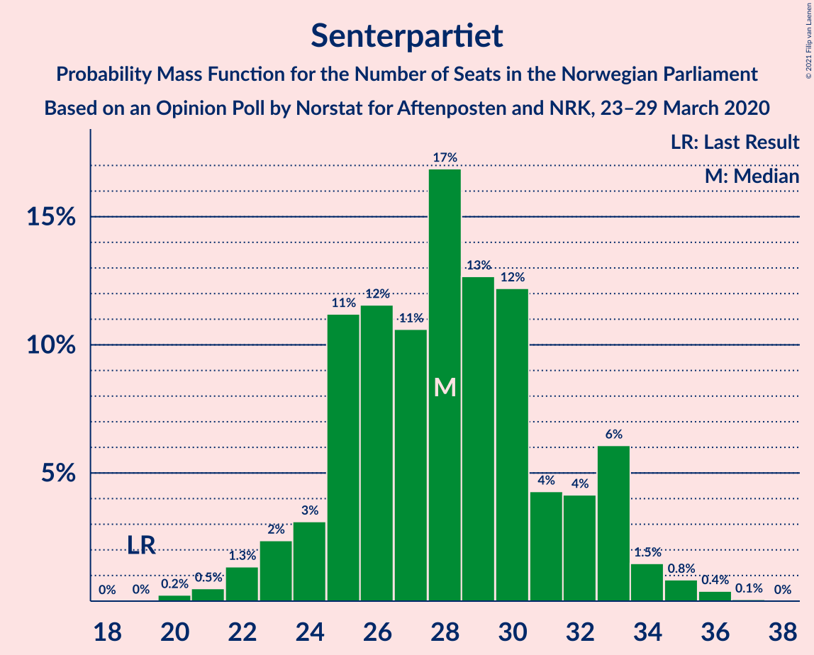
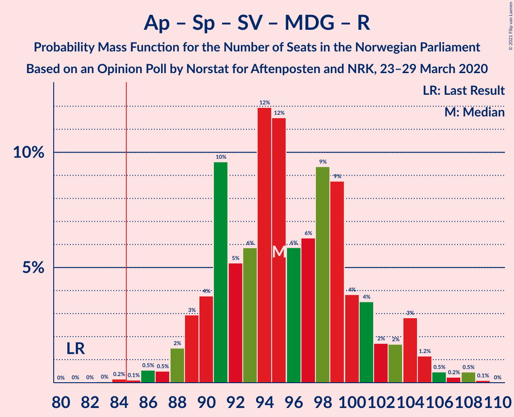
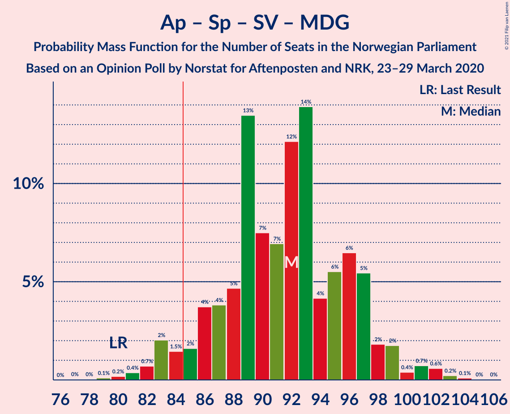
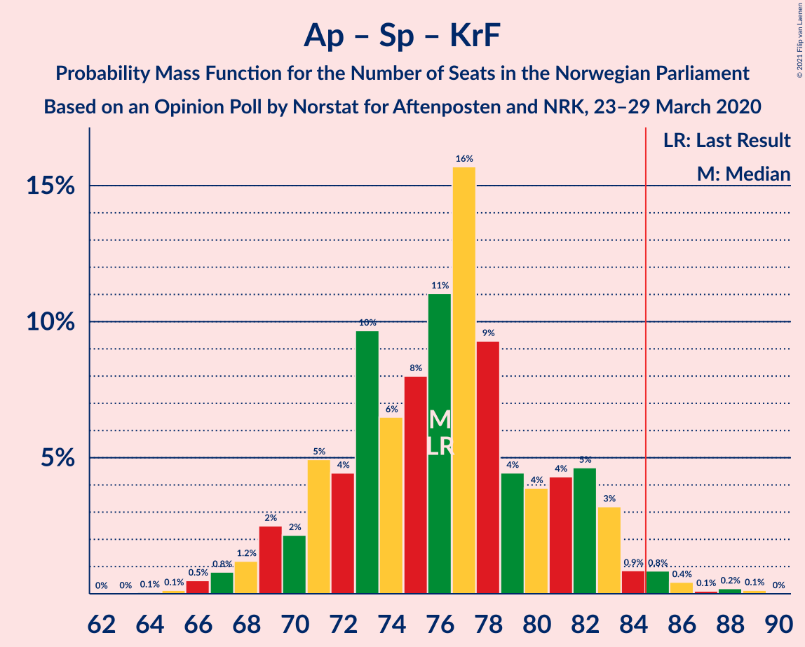
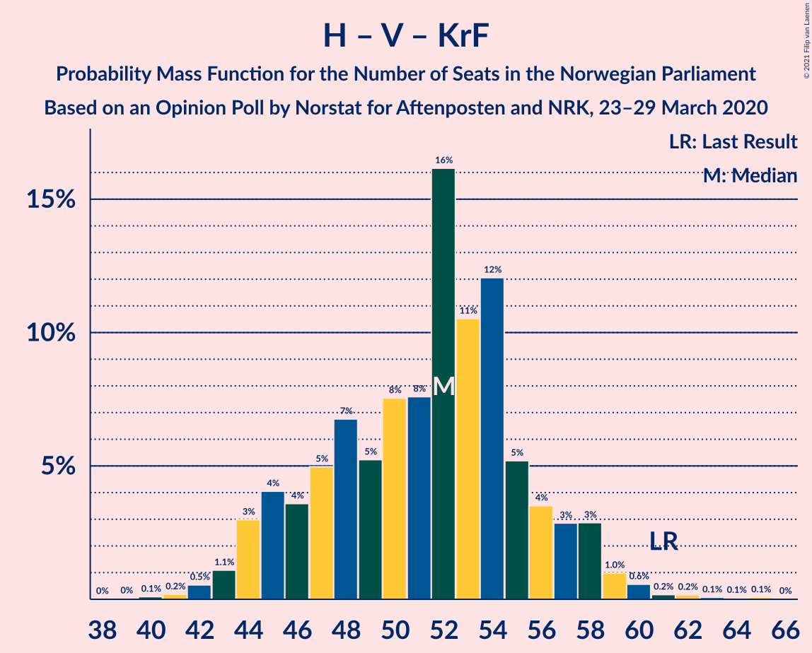

# Opinion Poll by Norstat for Aftenposten and NRK, 23–29 March 2020

<a href="#voting-intentions">Voting Intentions</a> | <a href="#seats">Seats</a> | <a href="#coalitions">Coalitions</a> | <a href="#technical-information">Technical Information</a>

## Voting Intentions

### Confidence Intervals

| Party | Last Result | Poll Result | 80% Confidence Interval | 90% Confidence Interval | 95% Confidence Interval | 99% Confidence Interval |
|:-----:|:-----------:|:-----------:|:-----------------------:|:-----------------------:|:-----------------------:|:-----------------------:|
| Arbeiderpartiet | 27.4% | 25.7% | 23.7–27.8% |23.1–28.4% |22.6–29.0% |21.7–30.0% |
| Høyre | 25.0% | 25.0% | 23.0–27.1% |22.4–27.7% |21.9–28.3% |21.0–29.3% |
| Senterpartiet | 10.3% | 15.3% | 13.7–17.1% |13.2–17.6% |12.8–18.1% |12.1–19.0% |
| Fremskrittspartiet | 15.2% | 12.1% | 10.6–13.8% |10.2–14.2% |9.9–14.7% |9.2–15.5% |
| Sosialistisk Venstreparti | 6.0% | 7.2% | 6.1–8.6% |5.8–9.0% |5.5–9.3% |5.1–10.0% |
| Rødt | 2.4% | 3.7% | 3.0–4.8% |2.8–5.1% |2.6–5.4% |2.3–6.0% |
| Miljøpartiet De Grønne | 3.2% | 3.7% | 3.0–4.8% |2.8–5.1% |2.6–5.4% |2.3–6.0% |
| Venstre | 4.4% | 3.6% | 2.9–4.7% |2.7–5.0% |2.5–5.2% |2.1–5.8% |
| Kristelig Folkeparti | 4.2% | 2.8% | 2.1–3.7% |2.0–4.0% |1.8–4.3% |1.5–4.8% |

*Note:* The poll result column reflects the actual value used in the calculations. Published results may vary slightly, and in addition be rounded to fewer digits.

## Seats

### Confidence Intervals

| Party | Last Result | Median | 80% Confidence Interval | 90% Confidence Interval | 95% Confidence Interval | 99% Confidence Interval |
|:-----:|:-----------:|:------:|:-----------------------:|:-----------------------:|:-----------------------:|:-----------------------:|
| <a href="#arbeiderpartiet">Arbeiderpartiet</a> | 49 | 47 | 42–51 |41–52 |40–53 |39–56 |
| <a href="#høyre">Høyre</a> | 45 | 45 | 41–51 |40–51 |39–51 |37–54 |
| <a href="#senterpartiet">Senterpartiet</a> | 19 | 28 | 25–32 |24–33 |23–34 |21–36 |
| <a href="#fremskrittspartiet">Fremskrittspartiet</a> | 27 | 22 | 19–25 |17–26 |17–27 |16–28 |
| <a href="#sosialistisk-venstreparti">Sosialistisk Venstreparti</a> | 11 | 13 | 11–16 |10–16 |10–17 |9–18 |
| <a href="#rødt">Rødt</a> | 1 | 2 | 1–9 |1–9 |1–10 |1–11 |
| <a href="#miljøpartiet-de-grønne">Miljøpartiet De Grønne</a> | 1 | 2 | 1–9 |1–9 |1–10 |1–11 |
| <a href="#venstre">Venstre</a> | 8 | 2 | 2–8 |1–9 |1–9 |1–10 |
| <a href="#kristelig-folkeparti">Kristelig Folkeparti</a> | 8 | 1 | 0–3 |0–3 |0–7 |0–8 |

### Arbeiderpartiet

*For a full overview of the results for this party, see the [Arbeiderpartiet](party-arbeiderpartiet.html) page.*

| Number of Seats | Probability | Accumulated | Special Marks |
|:---------------:|:-----------:|:-----------:|:-------------:|
| 37 | 0.1% | 100% |  |
| 38 | 0.1% | 99.9% |  |
| 39 | 0.3% | 99.8% |  |
| 40 | 3% | 99.5% |  |
| 41 | 2% | 97% |  |
| 42 | 7% | 95% |  |
| 43 | 5% | 87% |  |
| 44 | 13% | 83% |  |
| 45 | 13% | 70% |  |
| 46 | 5% | 57% |  |
| 47 | 17% | 52% | Median |
| 48 | 8% | 36% |  |
| 49 | 8% | 28% | Last Result |
| 50 | 8% | 20% |  |
| 51 | 6% | 12% |  |
| 52 | 2% | 6% |  |
| 53 | 2% | 4% |  |
| 54 | 0.6% | 2% |  |
| 55 | 0.9% | 1.4% |  |
| 56 | 0.2% | 0.5% |  |
| 57 | 0% | 0.3% |  |
| 58 | 0.2% | 0.2% |  |
| 59 | 0% | 0% |  |

### Høyre

*For a full overview of the results for this party, see the [Høyre](party-høyre.html) page.*

| Number of Seats | Probability | Accumulated | Special Marks |
|:---------------:|:-----------:|:-----------:|:-------------:|
| 35 | 0.1% | 100% |  |
| 36 | 0.3% | 99.9% |  |
| 37 | 1.1% | 99.6% |  |
| 38 | 0.7% | 98% |  |
| 39 | 2% | 98% |  |
| 40 | 3% | 96% |  |
| 41 | 5% | 93% |  |
| 42 | 11% | 88% |  |
| 43 | 4% | 77% |  |
| 44 | 12% | 72% |  |
| 45 | 16% | 61% | Last Result, Median |
| 46 | 12% | 44% |  |
| 47 | 8% | 33% |  |
| 48 | 5% | 24% |  |
| 49 | 4% | 20% |  |
| 50 | 4% | 15% |  |
| 51 | 10% | 11% |  |
| 52 | 0.4% | 1.4% |  |
| 53 | 0.4% | 1.1% |  |
| 54 | 0.3% | 0.7% |  |
| 55 | 0.3% | 0.3% |  |
| 56 | 0.1% | 0.1% |  |
| 57 | 0% | 0% |  |

### Senterpartiet

*For a full overview of the results for this party, see the [Senterpartiet](party-senterpartiet.html) page.*

| Number of Seats | Probability | Accumulated | Special Marks |
|:---------------:|:-----------:|:-----------:|:-------------:|
| 19 | 0% | 100% | Last Result |
| 20 | 0.4% | 100% |  |
| 21 | 0.3% | 99.5% |  |
| 22 | 2% | 99.2% |  |
| 23 | 2% | 98% |  |
| 24 | 4% | 95% |  |
| 25 | 15% | 91% |  |
| 26 | 7% | 77% |  |
| 27 | 12% | 70% |  |
| 28 | 15% | 58% | Median |
| 29 | 16% | 43% |  |
| 30 | 7% | 27% |  |
| 31 | 5% | 20% |  |
| 32 | 8% | 15% |  |
| 33 | 4% | 7% |  |
| 34 | 2% | 3% |  |
| 35 | 0.8% | 1.4% |  |
| 36 | 0.4% | 0.5% |  |
| 37 | 0.1% | 0.1% |  |
| 38 | 0% | 0% |  |

### Fremskrittspartiet

*For a full overview of the results for this party, see the [Fremskrittspartiet](party-fremskrittspartiet.html) page.*

| Number of Seats | Probability | Accumulated | Special Marks |
|:---------------:|:-----------:|:-----------:|:-------------:|
| 15 | 0.1% | 100% |  |
| 16 | 0.4% | 99.9% |  |
| 17 | 5% | 99.5% |  |
| 18 | 3% | 95% |  |
| 19 | 9% | 92% |  |
| 20 | 10% | 83% |  |
| 21 | 14% | 73% |  |
| 22 | 17% | 59% | Median |
| 23 | 17% | 41% |  |
| 24 | 11% | 24% |  |
| 25 | 7% | 13% |  |
| 26 | 4% | 7% |  |
| 27 | 2% | 3% | Last Result |
| 28 | 0.6% | 0.9% |  |
| 29 | 0.1% | 0.3% |  |
| 30 | 0.1% | 0.1% |  |
| 31 | 0% | 0% |  |

### Sosialistisk Venstreparti

*For a full overview of the results for this party, see the [Sosialistisk Venstreparti](party-sosialistiskvenstreparti.html) page.*

| Number of Seats | Probability | Accumulated | Special Marks |
|:---------------:|:-----------:|:-----------:|:-------------:|
| 8 | 0.4% | 100% |  |
| 9 | 1.3% | 99.6% |  |
| 10 | 5% | 98% |  |
| 11 | 9% | 93% | Last Result |
| 12 | 16% | 84% |  |
| 13 | 21% | 68% | Median |
| 14 | 17% | 47% |  |
| 15 | 12% | 30% |  |
| 16 | 15% | 18% |  |
| 17 | 1.2% | 3% |  |
| 18 | 1.0% | 1.5% |  |
| 19 | 0.3% | 0.5% |  |
| 20 | 0.1% | 0.1% |  |
| 21 | 0% | 0% |  |

### Rødt

*For a full overview of the results for this party, see the [Rødt](party-rødt.html) page.*

| Number of Seats | Probability | Accumulated | Special Marks |
|:---------------:|:-----------:|:-----------:|:-------------:|
| 1 | 11% | 100% | Last Result |
| 2 | 53% | 89% | Median |
| 3 | 0% | 37% |  |
| 4 | 0% | 37% |  |
| 5 | 0% | 37% |  |
| 6 | 0% | 37% |  |
| 7 | 8% | 37% |  |
| 8 | 17% | 29% |  |
| 9 | 9% | 12% |  |
| 10 | 2% | 3% |  |
| 11 | 0.5% | 0.8% |  |
| 12 | 0.2% | 0.2% |  |
| 13 | 0.1% | 0.1% |  |
| 14 | 0% | 0% |  |

### Miljøpartiet De Grønne

*For a full overview of the results for this party, see the [Miljøpartiet De Grønne](party-miljøpartietdegrønne.html) page.*

| Number of Seats | Probability | Accumulated | Special Marks |
|:---------------:|:-----------:|:-----------:|:-------------:|
| 1 | 36% | 100% | Last Result |
| 2 | 30% | 64% | Median |
| 3 | 4% | 34% |  |
| 4 | 0% | 30% |  |
| 5 | 0% | 30% |  |
| 6 | 0% | 30% |  |
| 7 | 6% | 30% |  |
| 8 | 8% | 23% |  |
| 9 | 12% | 15% |  |
| 10 | 2% | 4% |  |
| 11 | 1.3% | 1.4% |  |
| 12 | 0.1% | 0.1% |  |
| 13 | 0% | 0% |  |

### Venstre

*For a full overview of the results for this party, see the [Venstre](party-venstre.html) page.*

| Number of Seats | Probability | Accumulated | Special Marks |
|:---------------:|:-----------:|:-----------:|:-------------:|
| 1 | 7% | 100% |  |
| 2 | 47% | 93% | Median |
| 3 | 0.8% | 46% |  |
| 4 | 0% | 45% |  |
| 5 | 0% | 45% |  |
| 6 | 0% | 45% |  |
| 7 | 15% | 45% |  |
| 8 | 24% | 31% | Last Result |
| 9 | 4% | 6% |  |
| 10 | 2% | 2% |  |
| 11 | 0.3% | 0.3% |  |
| 12 | 0% | 0% |  |

### Kristelig Folkeparti

*For a full overview of the results for this party, see the [Kristelig Folkeparti](party-kristeligfolkeparti.html) page.*

| Number of Seats | Probability | Accumulated | Special Marks |
|:---------------:|:-----------:|:-----------:|:-------------:|
| 0 | 23% | 100% |  |
| 1 | 51% | 77% | Median |
| 2 | 7% | 26% |  |
| 3 | 15% | 19% |  |
| 4 | 0% | 4% |  |
| 5 | 0% | 4% |  |
| 6 | 0% | 4% |  |
| 7 | 2% | 4% |  |
| 8 | 2% | 2% | Last Result |
| 9 | 0.2% | 0.2% |  |
| 10 | 0% | 0.1% |  |
| 11 | 0% | 0% |  |

## Coalitions

### Confidence Intervals

| Coalition | Last Result | Median | Majority? | 80% Confidence Interval | 90% Confidence Interval | 95% Confidence Interval | 99% Confidence Interval |
|:---------:|:-----------:|:------:|:---------:|:-----------------------:|:-----------------------:|:-----------------------:|:-----------------------:|
| Høyre – Senterpartiet – Fremskrittspartiet – Venstre – Kristelig Folkeparti | 107 | 102 | 100% | 96–108 | 93–108 | 92–109 | 89–112 |
| Arbeiderpartiet – Senterpartiet – Sosialistisk Venstreparti – Miljøpartiet De Grønne – Rødt | 81 | 96 | 99.6% | 90–101 | 89–103 | 88–105 | 86–108 |
| Arbeiderpartiet – Senterpartiet – Sosialistisk Venstreparti – Miljøpartiet De Grønne – Kristelig Folkeparti | 88 | 93 | 96% | 88–98 | 85–100 | 83–102 | 82–104 |
| Arbeiderpartiet – Senterpartiet – Sosialistisk Venstreparti – Rødt | 80 | 92 | 96% | 87–99 | 85–100 | 83–101 | 82–102 |
| Arbeiderpartiet – Senterpartiet – Sosialistisk Venstreparti – Miljøpartiet De Grønne | 80 | 92 | 94% | 87–97 | 84–98 | 83–99 | 81–103 |
| Arbeiderpartiet – Senterpartiet – Sosialistisk Venstreparti | 79 | 88 | 81% | 82–93 | 81–96 | 80–96 | 77–99 |
| Arbeiderpartiet – Senterpartiet – Miljøpartiet De Grønne – Kristelig Folkeparti | 77 | 79 | 14% | 74–85 | 72–87 | 71–88 | 69–92 |
| Høyre – Fremskrittspartiet – Miljøpartiet De Grønne – Venstre – Kristelig Folkeparti | 89 | 77 | 4% | 70–82 | 69–84 | 68–86 | 67–87 |
| Arbeiderpartiet – Senterpartiet – Kristelig Folkeparti | 76 | 76 | 1.3% | 71–82 | 69–83 | 68–83 | 66–87 |
| Arbeiderpartiet – Senterpartiet | 68 | 75 | 0.5% | 69–80 | 68–82 | 67–83 | 64–84 |
| Høyre – Fremskrittspartiet – Venstre – Kristelig Folkeparti | 88 | 73 | 0.4% | 68–79 | 66–80 | 64–81 | 61–83 |
| Høyre – Fremskrittspartiet – Venstre | 80 | 71 | 0.1% | 66–77 | 64–79 | 62–80 | 60–81 |
| Høyre – Fremskrittspartiet | 72 | 68 | 0% | 62–73 | 60–74 | 59–75 | 56–76 |
| Arbeiderpartiet – Sosialistisk Venstreparti | 60 | 60 | 0% | 55–64 | 54–66 | 53–67 | 50–70 |
| Høyre – Venstre – Kristelig Folkeparti | 61 | 52 | 0% | 46–56 | 45–58 | 44–59 | 42–61 |
| Senterpartiet – Venstre – Kristelig Folkeparti | 35 | 34 | 0% | 29–40 | 28–41 | 27–43 | 25–44 |

### Høyre – Senterpartiet – Fremskrittspartiet – Venstre – Kristelig Folkeparti

| Number of Seats | Probability | Accumulated | Special Marks |
|:---------------:|:-----------:|:-----------:|:-------------:|
| 87 | 0.1% | 100% |  |
| 88 | 0.1% | 99.8% |  |
| 89 | 0.7% | 99.7% |  |
| 90 | 0.9% | 99.0% |  |
| 91 | 0.4% | 98% |  |
| 92 | 2% | 98% |  |
| 93 | 1.1% | 96% |  |
| 94 | 2% | 95% |  |
| 95 | 3% | 93% |  |
| 96 | 4% | 91% |  |
| 97 | 7% | 87% |  |
| 98 | 8% | 80% | Median |
| 99 | 4% | 72% |  |
| 100 | 5% | 68% |  |
| 101 | 5% | 63% |  |
| 102 | 24% | 58% |  |
| 103 | 8% | 34% |  |
| 104 | 5% | 26% |  |
| 105 | 3% | 21% |  |
| 106 | 2% | 18% |  |
| 107 | 4% | 16% | Last Result |
| 108 | 7% | 12% |  |
| 109 | 3% | 4% |  |
| 110 | 0.5% | 2% |  |
| 111 | 0.7% | 1.2% |  |
| 112 | 0.1% | 0.5% |  |
| 113 | 0.3% | 0.4% |  |
| 114 | 0% | 0.1% |  |
| 115 | 0% | 0% |  |

### Arbeiderpartiet – Senterpartiet – Sosialistisk Venstreparti – Miljøpartiet De Grønne – Rødt

| Number of Seats | Probability | Accumulated | Special Marks |
|:---------------:|:-----------:|:-----------:|:-------------:|
| 81 | 0% | 100% | Last Result |
| 82 | 0% | 100% |  |
| 83 | 0% | 100% |  |
| 84 | 0.3% | 99.9% |  |
| 85 | 0.1% | 99.6% | Majority |
| 86 | 0.8% | 99.5% |  |
| 87 | 0.7% | 98.7% |  |
| 88 | 0.8% | 98% |  |
| 89 | 4% | 97% |  |
| 90 | 3% | 93% |  |
| 91 | 8% | 89% |  |
| 92 | 11% | 81% | Median |
| 93 | 4% | 70% |  |
| 94 | 11% | 66% |  |
| 95 | 3% | 55% |  |
| 96 | 9% | 52% |  |
| 97 | 6% | 44% |  |
| 98 | 7% | 37% |  |
| 99 | 9% | 30% |  |
| 100 | 6% | 21% |  |
| 101 | 6% | 15% |  |
| 102 | 3% | 9% |  |
| 103 | 2% | 6% |  |
| 104 | 1.2% | 4% |  |
| 105 | 2% | 3% |  |
| 106 | 0.3% | 1.4% |  |
| 107 | 0.3% | 1.1% |  |
| 108 | 0.7% | 0.8% |  |
| 109 | 0% | 0.1% |  |
| 110 | 0% | 0% |  |

### Arbeiderpartiet – Senterpartiet – Sosialistisk Venstreparti – Miljøpartiet De Grønne – Kristelig Folkeparti

| Number of Seats | Probability | Accumulated | Special Marks |
|:---------------:|:-----------:|:-----------:|:-------------:|
| 80 | 0.1% | 100% |  |
| 81 | 0.1% | 99.8% |  |
| 82 | 0.5% | 99.7% |  |
| 83 | 2% | 99.2% |  |
| 84 | 0.8% | 97% |  |
| 85 | 2% | 96% | Majority |
| 86 | 1.4% | 95% |  |
| 87 | 3% | 94% |  |
| 88 | 4% | 91% | Last Result |
| 89 | 5% | 87% |  |
| 90 | 6% | 82% |  |
| 91 | 14% | 76% | Median |
| 92 | 9% | 61% |  |
| 93 | 7% | 52% |  |
| 94 | 9% | 44% |  |
| 95 | 5% | 35% |  |
| 96 | 7% | 30% |  |
| 97 | 11% | 23% |  |
| 98 | 3% | 12% |  |
| 99 | 2% | 9% |  |
| 100 | 4% | 8% |  |
| 101 | 1.3% | 4% |  |
| 102 | 1.0% | 3% |  |
| 103 | 0.9% | 2% |  |
| 104 | 0.3% | 0.6% |  |
| 105 | 0.1% | 0.3% |  |
| 106 | 0.2% | 0.2% |  |
| 107 | 0% | 0% |  |

### Arbeiderpartiet – Senterpartiet – Sosialistisk Venstreparti – Rødt

| Number of Seats | Probability | Accumulated | Special Marks |
|:---------------:|:-----------:|:-----------:|:-------------:|
| 78 | 0% | 100% |  |
| 79 | 0% | 99.9% |  |
| 80 | 0.2% | 99.9% | Last Result |
| 81 | 0.1% | 99.7% |  |
| 82 | 2% | 99.7% |  |
| 83 | 0.6% | 98% |  |
| 84 | 1.4% | 97% |  |
| 85 | 3% | 96% | Majority |
| 86 | 3% | 93% |  |
| 87 | 9% | 90% |  |
| 88 | 6% | 81% |  |
| 89 | 6% | 76% |  |
| 90 | 14% | 70% | Median |
| 91 | 5% | 56% |  |
| 92 | 9% | 51% |  |
| 93 | 6% | 42% |  |
| 94 | 2% | 36% |  |
| 95 | 6% | 33% |  |
| 96 | 4% | 28% |  |
| 97 | 6% | 24% |  |
| 98 | 6% | 18% |  |
| 99 | 3% | 12% |  |
| 100 | 5% | 9% |  |
| 101 | 3% | 4% |  |
| 102 | 0.7% | 1.2% |  |
| 103 | 0.4% | 0.5% |  |
| 104 | 0.1% | 0.1% |  |
| 105 | 0% | 0.1% |  |
| 106 | 0% | 0% |  |

### Arbeiderpartiet – Senterpartiet – Sosialistisk Venstreparti – Miljøpartiet De Grønne

| Number of Seats | Probability | Accumulated | Special Marks |
|:---------------:|:-----------:|:-----------:|:-------------:|
| 77 | 0.1% | 100% |  |
| 78 | 0% | 99.9% |  |
| 79 | 0.1% | 99.9% |  |
| 80 | 0.2% | 99.8% | Last Result |
| 81 | 0.6% | 99.5% |  |
| 82 | 0.3% | 99.0% |  |
| 83 | 3% | 98.6% |  |
| 84 | 2% | 96% |  |
| 85 | 2% | 94% | Majority |
| 86 | 2% | 92% |  |
| 87 | 6% | 90% |  |
| 88 | 6% | 84% |  |
| 89 | 7% | 79% |  |
| 90 | 14% | 72% | Median |
| 91 | 6% | 58% |  |
| 92 | 15% | 53% |  |
| 93 | 8% | 38% |  |
| 94 | 6% | 31% |  |
| 95 | 7% | 24% |  |
| 96 | 5% | 18% |  |
| 97 | 5% | 13% |  |
| 98 | 3% | 8% |  |
| 99 | 3% | 5% |  |
| 100 | 0.4% | 2% |  |
| 101 | 0.9% | 2% |  |
| 102 | 0.4% | 1.0% |  |
| 103 | 0.3% | 0.5% |  |
| 104 | 0.1% | 0.2% |  |
| 105 | 0.1% | 0.1% |  |
| 106 | 0% | 0% |  |

### Arbeiderpartiet – Senterpartiet – Sosialistisk Venstreparti

| Number of Seats | Probability | Accumulated | Special Marks |
|:---------------:|:-----------:|:-----------:|:-------------:|
| 75 | 0.4% | 100% |  |
| 76 | 0.1% | 99.6% |  |
| 77 | 0.1% | 99.5% |  |
| 78 | 0.6% | 99.4% |  |
| 79 | 0.8% | 98.8% | Last Result |
| 80 | 3% | 98% |  |
| 81 | 3% | 95% |  |
| 82 | 2% | 92% |  |
| 83 | 5% | 90% |  |
| 84 | 3% | 85% |  |
| 85 | 11% | 81% | Majority |
| 86 | 6% | 70% |  |
| 87 | 5% | 64% |  |
| 88 | 18% | 59% | Median |
| 89 | 5% | 42% |  |
| 90 | 9% | 37% |  |
| 91 | 8% | 27% |  |
| 92 | 6% | 19% |  |
| 93 | 4% | 14% |  |
| 94 | 3% | 10% |  |
| 95 | 1.0% | 7% |  |
| 96 | 4% | 6% |  |
| 97 | 0.3% | 2% |  |
| 98 | 0.9% | 2% |  |
| 99 | 0.3% | 0.6% |  |
| 100 | 0.1% | 0.3% |  |
| 101 | 0.3% | 0.3% |  |
| 102 | 0% | 0% |  |

### Arbeiderpartiet – Senterpartiet – Miljøpartiet De Grønne – Kristelig Folkeparti

| Number of Seats | Probability | Accumulated | Special Marks |
|:---------------:|:-----------:|:-----------:|:-------------:|
| 66 | 0.1% | 100% |  |
| 67 | 0.1% | 99.9% |  |
| 68 | 0.1% | 99.8% |  |
| 69 | 0.4% | 99.7% |  |
| 70 | 0.4% | 99.3% |  |
| 71 | 4% | 98.9% |  |
| 72 | 1.1% | 95% |  |
| 73 | 1.4% | 94% |  |
| 74 | 5% | 93% |  |
| 75 | 9% | 88% |  |
| 76 | 3% | 79% |  |
| 77 | 8% | 76% | Last Result |
| 78 | 11% | 67% | Median |
| 79 | 9% | 57% |  |
| 80 | 7% | 47% |  |
| 81 | 5% | 40% |  |
| 82 | 7% | 35% |  |
| 83 | 7% | 28% |  |
| 84 | 8% | 21% |  |
| 85 | 5% | 14% | Majority |
| 86 | 2% | 9% |  |
| 87 | 3% | 7% |  |
| 88 | 1.2% | 4% |  |
| 89 | 1.0% | 2% |  |
| 90 | 0.5% | 1.4% |  |
| 91 | 0.4% | 0.9% |  |
| 92 | 0.3% | 0.6% |  |
| 93 | 0.2% | 0.3% |  |
| 94 | 0.1% | 0.1% |  |
| 95 | 0% | 0% |  |

### Høyre – Fremskrittspartiet – Miljøpartiet De Grønne – Venstre – Kristelig Folkeparti

| Number of Seats | Probability | Accumulated | Special Marks |
|:---------------:|:-----------:|:-----------:|:-------------:|
| 64 | 0% | 100% |  |
| 65 | 0.1% | 99.9% |  |
| 66 | 0.4% | 99.9% |  |
| 67 | 0.7% | 99.5% |  |
| 68 | 3% | 98.8% |  |
| 69 | 5% | 96% |  |
| 70 | 3% | 91% |  |
| 71 | 6% | 88% |  |
| 72 | 6% | 82% | Median |
| 73 | 4% | 76% |  |
| 74 | 6% | 72% |  |
| 75 | 2% | 67% |  |
| 76 | 6% | 64% |  |
| 77 | 9% | 58% |  |
| 78 | 5% | 49% |  |
| 79 | 14% | 44% |  |
| 80 | 6% | 30% |  |
| 81 | 6% | 24% |  |
| 82 | 9% | 19% |  |
| 83 | 3% | 10% |  |
| 84 | 3% | 7% |  |
| 85 | 1.4% | 4% | Majority |
| 86 | 0.6% | 3% |  |
| 87 | 2% | 2% |  |
| 88 | 0.1% | 0.3% |  |
| 89 | 0.2% | 0.3% | Last Result |
| 90 | 0% | 0.1% |  |
| 91 | 0% | 0.1% |  |
| 92 | 0% | 0% |  |

### Arbeiderpartiet – Senterpartiet – Kristelig Folkeparti

| Number of Seats | Probability | Accumulated | Special Marks |
|:---------------:|:-----------:|:-----------:|:-------------:|
| 64 | 0.1% | 100% |  |
| 65 | 0.1% | 99.9% |  |
| 66 | 0.6% | 99.8% |  |
| 67 | 1.0% | 99.1% |  |
| 68 | 0.9% | 98% |  |
| 69 | 4% | 97% |  |
| 70 | 2% | 93% |  |
| 71 | 3% | 91% |  |
| 72 | 7% | 88% |  |
| 73 | 14% | 81% |  |
| 74 | 5% | 68% |  |
| 75 | 4% | 63% |  |
| 76 | 20% | 59% | Last Result, Median |
| 77 | 3% | 39% |  |
| 78 | 11% | 36% |  |
| 79 | 6% | 25% |  |
| 80 | 3% | 19% |  |
| 81 | 5% | 16% |  |
| 82 | 3% | 11% |  |
| 83 | 5% | 8% |  |
| 84 | 1.1% | 2% |  |
| 85 | 0.4% | 1.3% | Majority |
| 86 | 0.4% | 0.9% |  |
| 87 | 0.2% | 0.5% |  |
| 88 | 0.1% | 0.4% |  |
| 89 | 0.2% | 0.3% |  |
| 90 | 0% | 0% |  |

### Arbeiderpartiet – Senterpartiet

| Number of Seats | Probability | Accumulated | Special Marks |
|:---------------:|:-----------:|:-----------:|:-------------:|
| 62 | 0% | 100% |  |
| 63 | 0.1% | 99.9% |  |
| 64 | 0.6% | 99.9% |  |
| 65 | 0.4% | 99.3% |  |
| 66 | 1.1% | 98.9% |  |
| 67 | 0.9% | 98% |  |
| 68 | 3% | 97% | Last Result |
| 69 | 6% | 94% |  |
| 70 | 2% | 88% |  |
| 71 | 6% | 86% |  |
| 72 | 15% | 80% |  |
| 73 | 8% | 64% |  |
| 74 | 6% | 56% |  |
| 75 | 10% | 51% | Median |
| 76 | 8% | 40% |  |
| 77 | 10% | 32% |  |
| 78 | 6% | 22% |  |
| 79 | 5% | 16% |  |
| 80 | 4% | 11% |  |
| 81 | 1.4% | 8% |  |
| 82 | 2% | 6% |  |
| 83 | 4% | 4% |  |
| 84 | 0.3% | 0.8% |  |
| 85 | 0.1% | 0.5% | Majority |
| 86 | 0.1% | 0.3% |  |
| 87 | 0% | 0.3% |  |
| 88 | 0.2% | 0.2% |  |
| 89 | 0% | 0% |  |

### Høyre – Fremskrittspartiet – Venstre – Kristelig Folkeparti

| Number of Seats | Probability | Accumulated | Special Marks |
|:---------------:|:-----------:|:-----------:|:-------------:|
| 60 | 0% | 100% |  |
| 61 | 0.7% | 99.9% |  |
| 62 | 0.3% | 99.2% |  |
| 63 | 0.3% | 98.9% |  |
| 64 | 2% | 98.6% |  |
| 65 | 1.2% | 97% |  |
| 66 | 2% | 96% |  |
| 67 | 3% | 94% |  |
| 68 | 6% | 91% |  |
| 69 | 6% | 85% |  |
| 70 | 9% | 79% | Median |
| 71 | 7% | 70% |  |
| 72 | 6% | 63% |  |
| 73 | 9% | 56% |  |
| 74 | 3% | 48% |  |
| 75 | 11% | 45% |  |
| 76 | 4% | 34% |  |
| 77 | 11% | 30% |  |
| 78 | 8% | 19% |  |
| 79 | 3% | 11% |  |
| 80 | 4% | 7% |  |
| 81 | 0.8% | 3% |  |
| 82 | 0.7% | 2% |  |
| 83 | 0.8% | 1.3% |  |
| 84 | 0.1% | 0.5% |  |
| 85 | 0.3% | 0.4% | Majority |
| 86 | 0% | 0.1% |  |
| 87 | 0% | 0% |  |
| 88 | 0% | 0% | Last Result |

### Høyre – Fremskrittspartiet – Venstre

| Number of Seats | Probability | Accumulated | Special Marks |
|:---------------:|:-----------:|:-----------:|:-------------:|
| 58 | 0% | 100% |  |
| 59 | 0.2% | 99.9% |  |
| 60 | 0.6% | 99.8% |  |
| 61 | 1.1% | 99.1% |  |
| 62 | 0.6% | 98% |  |
| 63 | 2% | 97% |  |
| 64 | 1.4% | 96% |  |
| 65 | 2% | 94% |  |
| 66 | 3% | 92% |  |
| 67 | 7% | 89% |  |
| 68 | 5% | 82% |  |
| 69 | 7% | 77% | Median |
| 70 | 12% | 70% |  |
| 71 | 9% | 58% |  |
| 72 | 6% | 50% |  |
| 73 | 3% | 44% |  |
| 74 | 6% | 41% |  |
| 75 | 8% | 35% |  |
| 76 | 11% | 27% |  |
| 77 | 7% | 16% |  |
| 78 | 3% | 9% |  |
| 79 | 4% | 6% |  |
| 80 | 2% | 3% | Last Result |
| 81 | 0.4% | 0.9% |  |
| 82 | 0.2% | 0.5% |  |
| 83 | 0.1% | 0.2% |  |
| 84 | 0% | 0.1% |  |
| 85 | 0% | 0.1% | Majority |
| 86 | 0% | 0% |  |

### Høyre – Fremskrittspartiet

| Number of Seats | Probability | Accumulated | Special Marks |
|:---------------:|:-----------:|:-----------:|:-------------:|
| 54 | 0% | 100% |  |
| 55 | 0.1% | 99.9% |  |
| 56 | 0.7% | 99.8% |  |
| 57 | 0.5% | 99.2% |  |
| 58 | 0.8% | 98.7% |  |
| 59 | 3% | 98% |  |
| 60 | 1.3% | 95% |  |
| 61 | 3% | 94% |  |
| 62 | 8% | 91% |  |
| 63 | 5% | 83% |  |
| 64 | 4% | 78% |  |
| 65 | 8% | 74% |  |
| 66 | 7% | 66% |  |
| 67 | 5% | 60% | Median |
| 68 | 16% | 54% |  |
| 69 | 9% | 39% |  |
| 70 | 6% | 30% |  |
| 71 | 9% | 24% |  |
| 72 | 3% | 15% | Last Result |
| 73 | 6% | 12% |  |
| 74 | 1.2% | 6% |  |
| 75 | 4% | 5% |  |
| 76 | 0.4% | 0.8% |  |
| 77 | 0.2% | 0.4% |  |
| 78 | 0.1% | 0.2% |  |
| 79 | 0.1% | 0.1% |  |
| 80 | 0% | 0% |  |

### Arbeiderpartiet – Sosialistisk Venstreparti

| Number of Seats | Probability | Accumulated | Special Marks |
|:---------------:|:-----------:|:-----------:|:-------------:|
| 49 | 0.1% | 100% |  |
| 50 | 0.6% | 99.8% |  |
| 51 | 0.5% | 99.2% |  |
| 52 | 0.8% | 98.7% |  |
| 53 | 3% | 98% |  |
| 54 | 2% | 95% |  |
| 55 | 6% | 93% |  |
| 56 | 10% | 87% |  |
| 57 | 5% | 77% |  |
| 58 | 14% | 72% |  |
| 59 | 4% | 58% |  |
| 60 | 9% | 54% | Last Result, Median |
| 61 | 4% | 45% |  |
| 62 | 6% | 41% |  |
| 63 | 21% | 35% |  |
| 64 | 5% | 14% |  |
| 65 | 3% | 9% |  |
| 66 | 2% | 6% |  |
| 67 | 2% | 4% |  |
| 68 | 0.5% | 2% |  |
| 69 | 0.6% | 1.2% |  |
| 70 | 0.3% | 0.6% |  |
| 71 | 0.3% | 0.4% |  |
| 72 | 0% | 0.1% |  |
| 73 | 0% | 0% |  |

### Høyre – Venstre – Kristelig Folkeparti

| Number of Seats | Probability | Accumulated | Special Marks |
|:---------------:|:-----------:|:-----------:|:-------------:|
| 39 | 0% | 100% |  |
| 40 | 0.1% | 99.9% |  |
| 41 | 0.2% | 99.8% |  |
| 42 | 0.4% | 99.6% |  |
| 43 | 0.6% | 99.2% |  |
| 44 | 3% | 98.5% |  |
| 45 | 4% | 95% |  |
| 46 | 4% | 92% |  |
| 47 | 8% | 87% |  |
| 48 | 5% | 80% | Median |
| 49 | 8% | 75% |  |
| 50 | 7% | 67% |  |
| 51 | 7% | 60% |  |
| 52 | 6% | 53% |  |
| 53 | 15% | 46% |  |
| 54 | 12% | 31% |  |
| 55 | 4% | 19% |  |
| 56 | 5% | 14% |  |
| 57 | 4% | 9% |  |
| 58 | 2% | 5% |  |
| 59 | 2% | 3% |  |
| 60 | 0.9% | 1.4% |  |
| 61 | 0.2% | 0.5% | Last Result |
| 62 | 0.1% | 0.3% |  |
| 63 | 0% | 0.1% |  |
| 64 | 0% | 0.1% |  |
| 65 | 0.1% | 0.1% |  |
| 66 | 0% | 0% |  |

### Senterpartiet – Venstre – Kristelig Folkeparti

| Number of Seats | Probability | Accumulated | Special Marks |
|:---------------:|:-----------:|:-----------:|:-------------:|
| 23 | 0.1% | 100% |  |
| 24 | 0.1% | 99.9% |  |
| 25 | 0.8% | 99.8% |  |
| 26 | 1.4% | 99.0% |  |
| 27 | 2% | 98% |  |
| 28 | 3% | 96% |  |
| 29 | 10% | 93% |  |
| 30 | 4% | 84% |  |
| 31 | 6% | 79% | Median |
| 32 | 11% | 74% |  |
| 33 | 8% | 62% |  |
| 34 | 15% | 54% |  |
| 35 | 6% | 40% | Last Result |
| 36 | 8% | 34% |  |
| 37 | 3% | 26% |  |
| 38 | 7% | 22% |  |
| 39 | 3% | 16% |  |
| 40 | 5% | 12% |  |
| 41 | 3% | 8% |  |
| 42 | 0.6% | 5% |  |
| 43 | 3% | 4% |  |
| 44 | 0.7% | 1.1% |  |
| 45 | 0.1% | 0.3% |  |
| 46 | 0.1% | 0.2% |  |
| 47 | 0.1% | 0.1% |  |
| 48 | 0.1% | 0.1% |  |
| 49 | 0% | 0% |  |

## Technical Information

### Opinion Poll

+ **Polling firm:** Norstat
+ **Commissioner(s):** Aftenposten and NRK
+ **Fieldwork period:** 23–29 March 2020

### Calculations

+ **Sample size:** 721
+ **Simulations done:** 524,288
+ **Error estimate:** 2.79%

