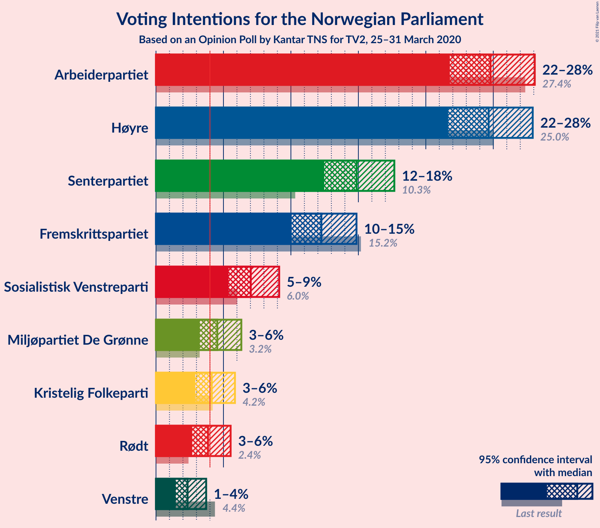
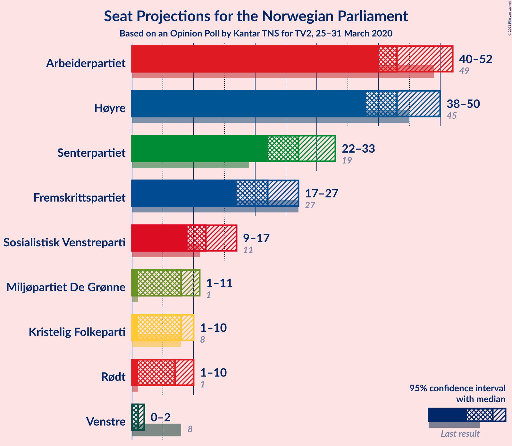
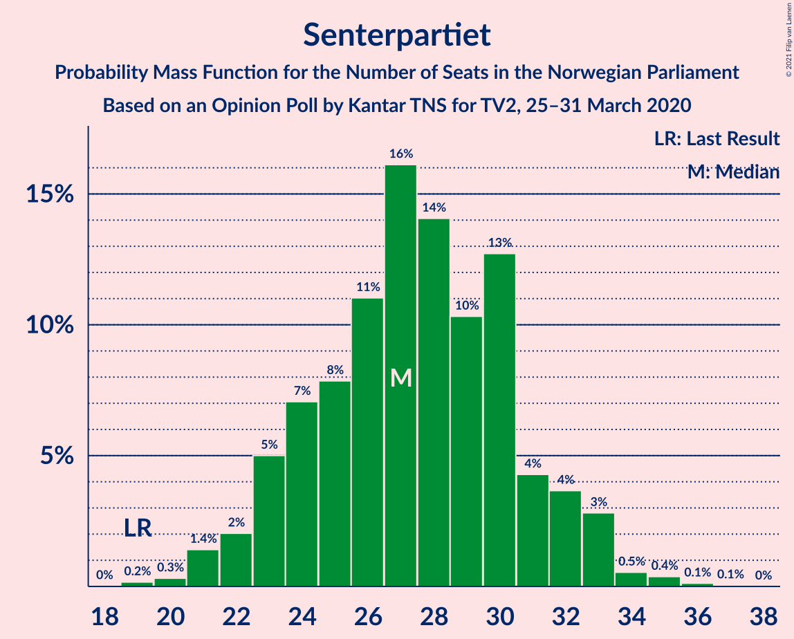
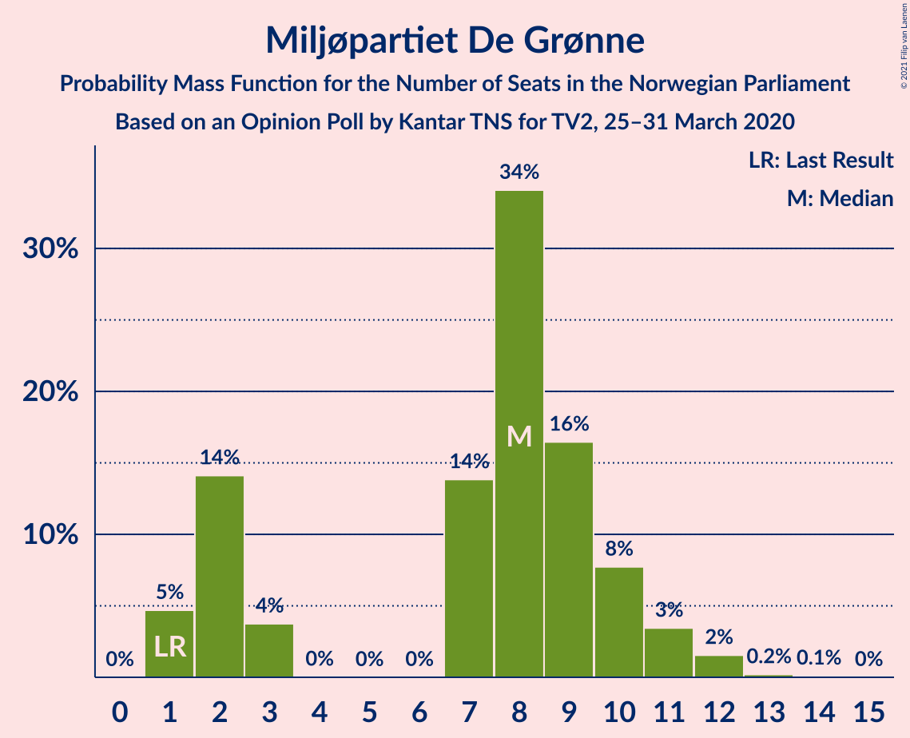
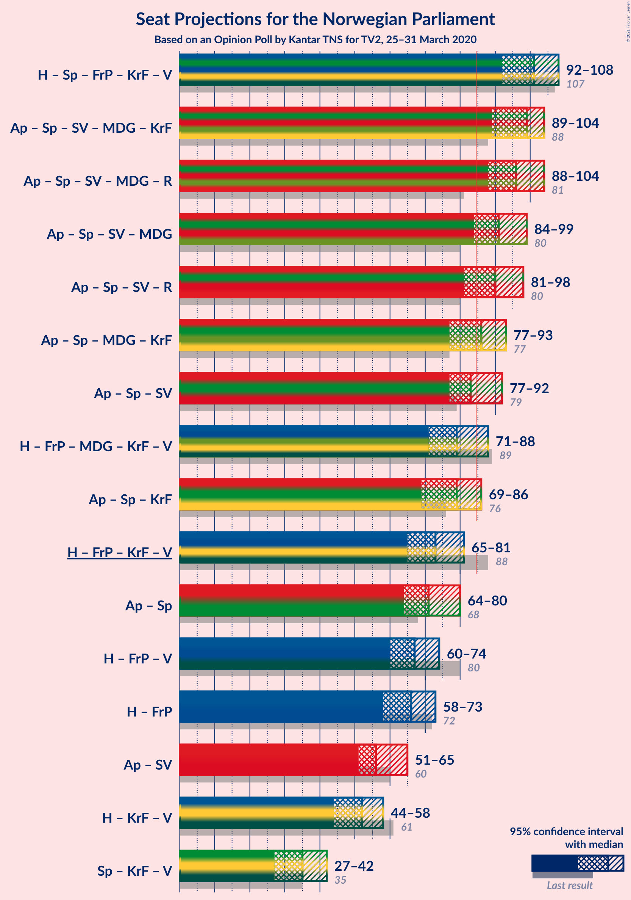
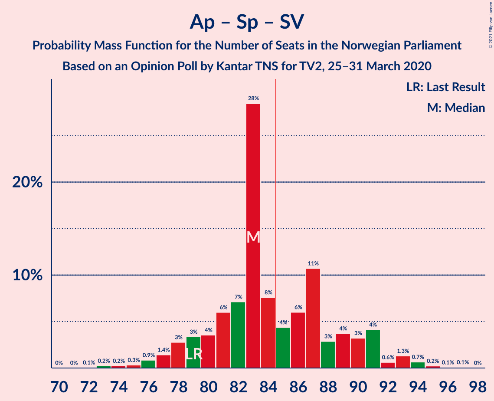
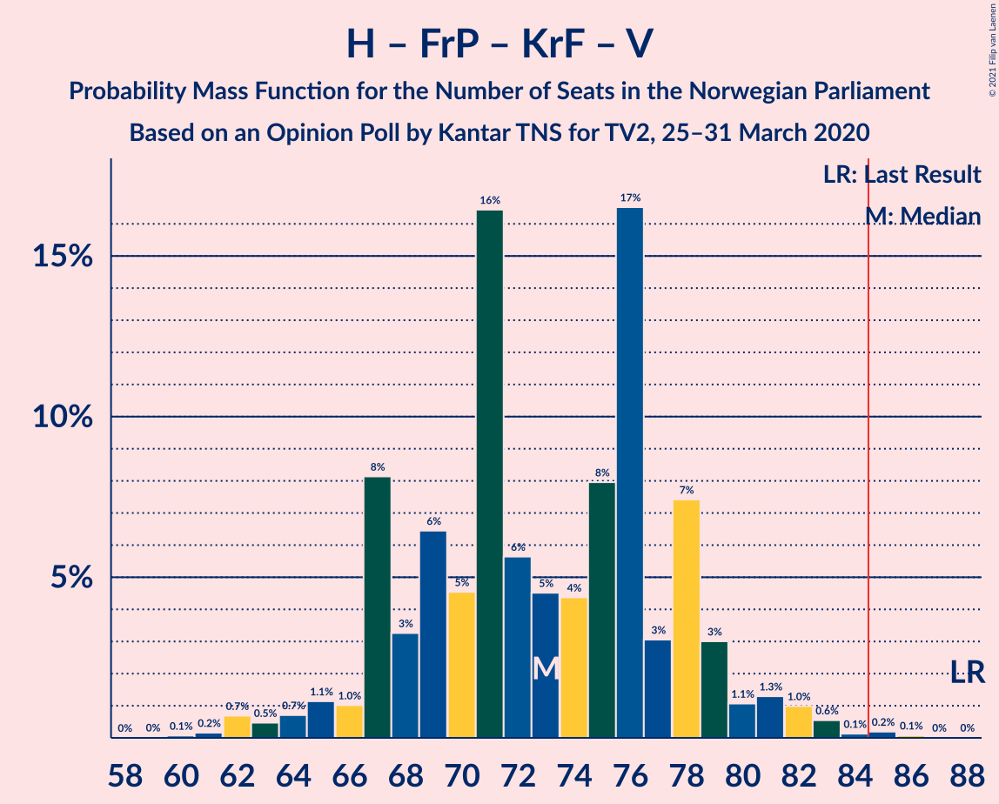
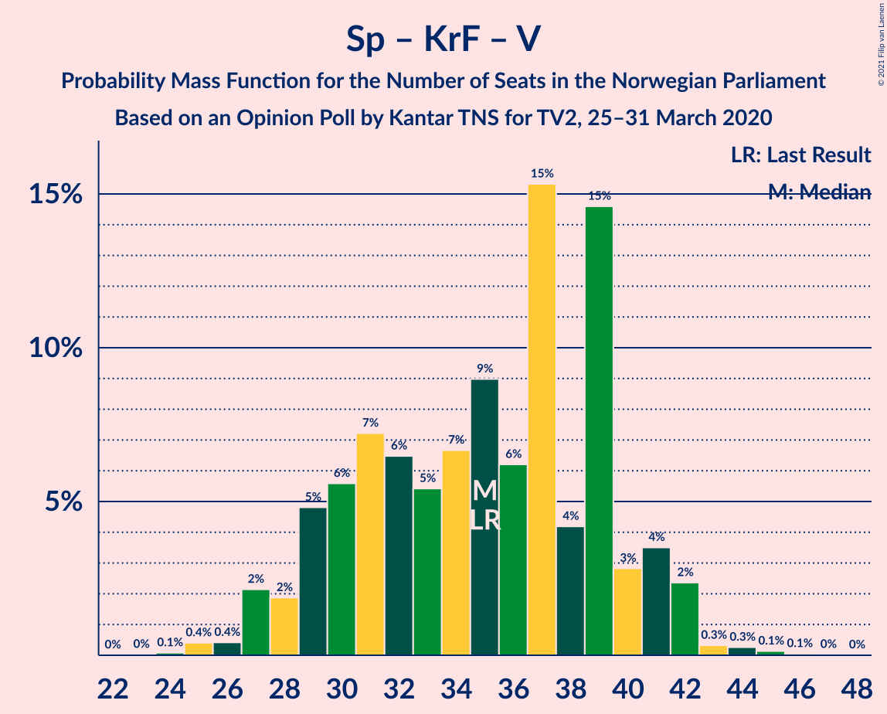

# Opinion Poll by Kantar TNS for TV2, 25–31 March 2020

<a href="#voting-intentions">Voting Intentions</a> | <a href="#seats">Seats</a> | <a href="#coalitions">Coalitions</a> | <a href="#technical-information">Technical Information</a>

## Voting Intentions

### Confidence Intervals

| Party | Last Result | Poll Result | 80% Confidence Interval | 90% Confidence Interval | 95% Confidence Interval | 99% Confidence Interval |
|:-----:|:-----------:|:-----------:|:-----------------------:|:-----------------------:|:-----------------------:|:-----------------------:|
| Arbeiderpartiet | 27.4% | 24.8% | 22.8–26.9% |22.3–27.5% |21.8–28.1% |20.9–29.1% |
| Høyre | 25.0% | 24.7% | 22.7–26.8% |22.1–27.4% |21.7–27.9% |20.7–29.0% |
| Senterpartiet | 10.3% | 14.9% | 13.3–16.7% |12.8–17.2% |12.5–17.7% |11.8–18.6% |
| Fremskrittspartiet | 15.2% | 12.3% | 10.8–13.9% |10.4–14.4% |10.1–14.9% |9.4–15.7% |
| Sosialistisk Venstreparti | 6.0% | 7.0% | 5.9–8.4% |5.6–8.8% |5.4–9.1% |4.9–9.8% |
| Miljøpartiet De Grønne | 3.2% | 4.5% | 3.7–5.7% |3.4–6.0% |3.2–6.3% |2.9–6.9% |
| Kristelig Folkeparti | 4.2% | 4.1% | 3.3–5.2% |3.1–5.6% |2.9–5.9% |2.6–6.4% |
| Rødt | 2.4% | 3.9% | 3.1–4.9% |2.9–5.2% |2.7–5.5% |2.3–6.1% |
| Venstre | 4.4% | 2.3% | 1.8–3.2% |1.6–3.5% |1.5–3.7% |1.2–4.2% |

*Note:* The poll result column reflects the actual value used in the calculations. Published results may vary slightly, and in addition be rounded to fewer digits.

## Seats

### Confidence Intervals

| Party | Last Result | Median | 80% Confidence Interval | 90% Confidence Interval | 95% Confidence Interval | 99% Confidence Interval |
|:-----:|:-----------:|:------:|:-----------------------:|:-----------------------:|:-----------------------:|:-----------------------:|
| <a href="#arbeiderpartiet">Arbeiderpartiet</a> | 49 | 47 | 41–47 |40–48 |39–50 |37–55 |
| <a href="#høyre">Høyre</a> | 45 | 40 | 40–47 |38–48 |38–51 |36–53 |
| <a href="#senterpartiet">Senterpartiet</a> | 19 | 27 | 24–31 |24–33 |22–33 |20–34 |
| <a href="#fremskrittspartiet">Fremskrittspartiet</a> | 27 | 19 | 19–26 |19–26 |19–27 |17–28 |
| <a href="#sosialistisk-venstreparti">Sosialistisk Venstreparti</a> | 11 | 13 | 10–14 |9–15 |9–16 |9–18 |
| <a href="#miljøpartiet-de-grønne">Miljøpartiet De Grønne</a> | 1 | 7 | 2–9 |2–10 |1–11 |1–12 |
| <a href="#kristelig-folkeparti">Kristelig Folkeparti</a> | 8 | 7 | 3–9 |2–10 |1–10 |1–11 |
| <a href="#rødt">Rødt</a> | 1 | 8 | 2–8 |1–8 |1–9 |1–10 |
| <a href="#venstre">Venstre</a> | 8 | 1 | 1–2 |0–2 |0–2 |0–2 |

### Arbeiderpartiet

*For a full overview of the results for this party, see the [Arbeiderpartiet](party-arbeiderpartiet.html) page.*

| Number of Seats | Probability | Accumulated | Special Marks |
|:---------------:|:-----------:|:-----------:|:-------------:|
| 36 | 0.1% | 100% |  |
| 37 | 1.5% | 99.9% |  |
| 38 | 0.5% | 98% |  |
| 39 | 1.4% | 98% |  |
| 40 | 4% | 96% |  |
| 41 | 3% | 93% |  |
| 42 | 6% | 90% |  |
| 43 | 4% | 83% |  |
| 44 | 4% | 79% |  |
| 45 | 3% | 76% |  |
| 46 | 18% | 73% |  |
| 47 | 46% | 55% | Median |
| 48 | 4% | 9% |  |
| 49 | 2% | 5% | Last Result |
| 50 | 0.5% | 3% |  |
| 51 | 0.7% | 2% |  |
| 52 | 0.6% | 1.4% |  |
| 53 | 0.3% | 0.8% |  |
| 54 | 0% | 0.5% |  |
| 55 | 0.3% | 0.5% |  |
| 56 | 0% | 0.2% |  |
| 57 | 0.1% | 0.2% |  |
| 58 | 0% | 0% |  |

### Høyre

*For a full overview of the results for this party, see the [Høyre](party-høyre.html) page.*

| Number of Seats | Probability | Accumulated | Special Marks |
|:---------------:|:-----------:|:-----------:|:-------------:|
| 34 | 0.3% | 100% |  |
| 35 | 0.2% | 99.7% |  |
| 36 | 0.6% | 99.5% |  |
| 37 | 0.9% | 99.0% |  |
| 38 | 5% | 98% |  |
| 39 | 1.2% | 93% |  |
| 40 | 45% | 91% | Median |
| 41 | 2% | 47% |  |
| 42 | 2% | 45% |  |
| 43 | 5% | 42% |  |
| 44 | 12% | 37% |  |
| 45 | 6% | 25% | Last Result |
| 46 | 7% | 18% |  |
| 47 | 1.2% | 11% |  |
| 48 | 5% | 10% |  |
| 49 | 0.9% | 5% |  |
| 50 | 0.8% | 4% |  |
| 51 | 1.2% | 3% |  |
| 52 | 0.1% | 2% |  |
| 53 | 1.4% | 2% |  |
| 54 | 0.2% | 0.3% |  |
| 55 | 0% | 0.1% |  |
| 56 | 0.1% | 0.1% |  |
| 57 | 0% | 0% |  |

### Senterpartiet

*For a full overview of the results for this party, see the [Senterpartiet](party-senterpartiet.html) page.*

| Number of Seats | Probability | Accumulated | Special Marks |
|:---------------:|:-----------:|:-----------:|:-------------:|
| 19 | 0.4% | 100% | Last Result |
| 20 | 0.2% | 99.6% |  |
| 21 | 1.0% | 99.4% |  |
| 22 | 1.2% | 98% |  |
| 23 | 2% | 97% |  |
| 24 | 6% | 96% |  |
| 25 | 6% | 89% |  |
| 26 | 8% | 84% |  |
| 27 | 52% | 76% | Median |
| 28 | 3% | 23% |  |
| 29 | 7% | 20% |  |
| 30 | 2% | 14% |  |
| 31 | 5% | 12% |  |
| 32 | 0.8% | 7% |  |
| 33 | 5% | 6% |  |
| 34 | 0.9% | 1.3% |  |
| 35 | 0.3% | 0.3% |  |
| 36 | 0% | 0% |  |

### Fremskrittspartiet

*For a full overview of the results for this party, see the [Fremskrittspartiet](party-fremskrittspartiet.html) page.*

| Number of Seats | Probability | Accumulated | Special Marks |
|:---------------:|:-----------:|:-----------:|:-------------:|
| 14 | 0.1% | 100% |  |
| 15 | 0.1% | 99.9% |  |
| 16 | 0.1% | 99.8% |  |
| 17 | 0.5% | 99.7% |  |
| 18 | 0.9% | 99.2% |  |
| 19 | 54% | 98% | Median |
| 20 | 4% | 45% |  |
| 21 | 3% | 40% |  |
| 22 | 6% | 37% |  |
| 23 | 6% | 31% |  |
| 24 | 11% | 25% |  |
| 25 | 2% | 14% |  |
| 26 | 9% | 12% |  |
| 27 | 2% | 3% | Last Result |
| 28 | 0.9% | 1.3% |  |
| 29 | 0.1% | 0.3% |  |
| 30 | 0.2% | 0.2% |  |
| 31 | 0% | 0% |  |

### Sosialistisk Venstreparti

*For a full overview of the results for this party, see the [Sosialistisk Venstreparti](party-sosialistiskvenstreparti.html) page.*

| Number of Seats | Probability | Accumulated | Special Marks |
|:---------------:|:-----------:|:-----------:|:-------------:|
| 8 | 0.4% | 100% |  |
| 9 | 5% | 99.6% |  |
| 10 | 9% | 95% |  |
| 11 | 9% | 86% | Last Result |
| 12 | 12% | 76% |  |
| 13 | 50% | 64% | Median |
| 14 | 4% | 14% |  |
| 15 | 6% | 10% |  |
| 16 | 2% | 4% |  |
| 17 | 0.8% | 1.5% |  |
| 18 | 0.6% | 0.6% |  |
| 19 | 0% | 0% |  |

### Miljøpartiet De Grønne

*For a full overview of the results for this party, see the [Miljøpartiet De Grønne](party-miljøpartietdegrønne.html) page.*

| Number of Seats | Probability | Accumulated | Special Marks |
|:---------------:|:-----------:|:-----------:|:-------------:|
| 1 | 3% | 100% | Last Result |
| 2 | 11% | 97% |  |
| 3 | 0.8% | 86% |  |
| 4 | 0% | 85% |  |
| 5 | 0% | 85% |  |
| 6 | 0% | 85% |  |
| 7 | 53% | 85% | Median |
| 8 | 10% | 32% |  |
| 9 | 15% | 23% |  |
| 10 | 4% | 8% |  |
| 11 | 2% | 3% |  |
| 12 | 0.9% | 1.2% |  |
| 13 | 0.2% | 0.3% |  |
| 14 | 0.1% | 0.1% |  |
| 15 | 0% | 0% |  |

### Kristelig Folkeparti

*For a full overview of the results for this party, see the [Kristelig Folkeparti](party-kristeligfolkeparti.html) page.*

| Number of Seats | Probability | Accumulated | Special Marks |
|:---------------:|:-----------:|:-----------:|:-------------:|
| 0 | 0.1% | 100% |  |
| 1 | 3% | 99.9% |  |
| 2 | 6% | 97% |  |
| 3 | 15% | 91% |  |
| 4 | 0% | 76% |  |
| 5 | 0% | 76% |  |
| 6 | 0.1% | 76% |  |
| 7 | 49% | 76% | Median |
| 8 | 5% | 27% | Last Result |
| 9 | 16% | 22% |  |
| 10 | 5% | 6% |  |
| 11 | 0.9% | 1.0% |  |
| 12 | 0.1% | 0.1% |  |
| 13 | 0% | 0% |  |

### Rødt

*For a full overview of the results for this party, see the [Rødt](party-rødt.html) page.*

| Number of Seats | Probability | Accumulated | Special Marks |
|:---------------:|:-----------:|:-----------:|:-------------:|
| 1 | 5% | 100% | Last Result |
| 2 | 33% | 95% |  |
| 3 | 0% | 62% |  |
| 4 | 0% | 62% |  |
| 5 | 0% | 62% |  |
| 6 | 0.1% | 62% |  |
| 7 | 3% | 62% |  |
| 8 | 54% | 59% | Median |
| 9 | 3% | 5% |  |
| 10 | 2% | 2% |  |
| 11 | 0.1% | 0.2% |  |
| 12 | 0% | 0.1% |  |
| 13 | 0% | 0% |  |

### Venstre

*For a full overview of the results for this party, see the [Venstre](party-venstre.html) page.*

| Number of Seats | Probability | Accumulated | Special Marks |
|:---------------:|:-----------:|:-----------:|:-------------:|
| 0 | 6% | 100% |  |
| 1 | 74% | 94% | Median |
| 2 | 19% | 20% |  |
| 3 | 0% | 0.5% |  |
| 4 | 0% | 0.5% |  |
| 5 | 0% | 0.5% |  |
| 6 | 0% | 0.5% |  |
| 7 | 0.3% | 0.5% |  |
| 8 | 0.1% | 0.1% | Last Result |
| 9 | 0% | 0% |  |

## Coalitions

### Confidence Intervals

| Coalition | Last Result | Median | Majority? | 80% Confidence Interval | 90% Confidence Interval | 95% Confidence Interval | 99% Confidence Interval |
|:---------:|:-----------:|:------:|:---------:|:-----------------------:|:-----------------------:|:-----------------------:|:-----------------------:|
| Høyre – Senterpartiet – Fremskrittspartiet – Kristelig Folkeparti – Venstre | 107 | 96 | 100% | 94–106 | 94–107 | 93–108 | 91–112 |
| Arbeiderpartiet – Senterpartiet – Sosialistisk Venstreparti – Miljøpartiet De Grønne – Kristelig Folkeparti | 88 | 101 | 100% | 94–101 | 92–101 | 90–104 | 88–108 |
| Arbeiderpartiet – Senterpartiet – Sosialistisk Venstreparti – Miljøpartiet De Grønne – Rødt | 81 | 100 | 99.2% | 91–102 | 89–102 | 88–102 | 84–105 |
| Arbeiderpartiet – Senterpartiet – Sosialistisk Venstreparti – Miljøpartiet De Grønne | 80 | 94 | 96% | 88–95 | 86–97 | 83–98 | 80–101 |
| Arbeiderpartiet – Senterpartiet – Sosialistisk Venstreparti – Rødt | 80 | 93 | 84% | 84–95 | 81–95 | 80–97 | 78–100 |
| Arbeiderpartiet – Senterpartiet – Miljøpartiet De Grønne – Kristelig Folkeparti | 77 | 88 | 74% | 80–88 | 78–90 | 77–91 | 75–95 |
| Arbeiderpartiet – Senterpartiet – Sosialistisk Venstreparti | 79 | 87 | 65% | 80–89 | 78–91 | 77–91 | 76–93 |
| Høyre – Fremskrittspartiet – Miljøpartiet De Grønne – Kristelig Folkeparti – Venstre | 89 | 76 | 16% | 74–85 | 74–88 | 72–89 | 69–91 |
| Arbeiderpartiet – Senterpartiet – Kristelig Folkeparti | 76 | 81 | 2% | 74–81 | 71–81 | 70–84 | 67–87 |
| Høyre – Fremskrittspartiet – Kristelig Folkeparti – Venstre | 88 | 69 | 0.8% | 67–78 | 67–80 | 67–81 | 64–85 |
| Arbeiderpartiet – Senterpartiet | 68 | 74 | 0% | 68–77 | 66–79 | 64–79 | 62–82 |
| Høyre – Fremskrittspartiet – Venstre | 80 | 64 | 0% | 60–72 | 60–72 | 60–74 | 58–78 |
| Høyre – Fremskrittspartiet | 72 | 62 | 0% | 59–71 | 59–71 | 59–72 | 56–77 |
| Arbeiderpartiet – Sosialistisk Venstreparti | 60 | 60 | 0% | 53–60 | 51–62 | 50–63 | 50–67 |
| Høyre – Kristelig Folkeparti – Venstre | 61 | 48 | 0% | 47–55 | 46–57 | 45–58 | 42–59 |
| Senterpartiet – Kristelig Folkeparti – Venstre | 35 | 35 | 0% | 31–37 | 29–38 | 27–41 | 26–44 |

### Høyre – Senterpartiet – Fremskrittspartiet – Kristelig Folkeparti – Venstre

| Number of Seats | Probability | Accumulated | Special Marks |
|:---------------:|:-----------:|:-----------:|:-------------:|
| 87 | 0% | 100% |  |
| 88 | 0.1% | 99.9% |  |
| 89 | 0.1% | 99.8% |  |
| 90 | 0% | 99.7% |  |
| 91 | 1.2% | 99.7% |  |
| 92 | 0.4% | 98% |  |
| 93 | 1.2% | 98% |  |
| 94 | 44% | 97% | Median |
| 95 | 0.6% | 53% |  |
| 96 | 3% | 52% |  |
| 97 | 2% | 49% |  |
| 98 | 2% | 47% |  |
| 99 | 8% | 45% |  |
| 100 | 2% | 38% |  |
| 101 | 10% | 35% |  |
| 102 | 0.8% | 26% |  |
| 103 | 2% | 25% |  |
| 104 | 9% | 23% |  |
| 105 | 3% | 14% |  |
| 106 | 3% | 11% |  |
| 107 | 5% | 8% | Last Result |
| 108 | 2% | 3% |  |
| 109 | 0.4% | 1.3% |  |
| 110 | 0.1% | 0.9% |  |
| 111 | 0.1% | 0.8% |  |
| 112 | 0.7% | 0.8% |  |
| 113 | 0% | 0.1% |  |
| 114 | 0% | 0% |  |

### Arbeiderpartiet – Senterpartiet – Sosialistisk Venstreparti – Miljøpartiet De Grønne – Kristelig Folkeparti

| Number of Seats | Probability | Accumulated | Special Marks |
|:---------------:|:-----------:|:-----------:|:-------------:|
| 85 | 0% | 100% | Majority |
| 86 | 0% | 99.9% |  |
| 87 | 0.3% | 99.9% |  |
| 88 | 0.2% | 99.6% | Last Result |
| 89 | 0.7% | 99.4% |  |
| 90 | 2% | 98.7% |  |
| 91 | 1.4% | 96% |  |
| 92 | 0.5% | 95% |  |
| 93 | 3% | 95% |  |
| 94 | 4% | 91% |  |
| 95 | 6% | 87% |  |
| 96 | 7% | 81% |  |
| 97 | 2% | 74% |  |
| 98 | 11% | 72% |  |
| 99 | 2% | 61% |  |
| 100 | 6% | 59% |  |
| 101 | 48% | 53% | Median |
| 102 | 0.4% | 4% |  |
| 103 | 1.3% | 4% |  |
| 104 | 0.9% | 3% |  |
| 105 | 0.4% | 2% |  |
| 106 | 0.1% | 1.3% |  |
| 107 | 0.5% | 1.2% |  |
| 108 | 0.4% | 0.7% |  |
| 109 | 0.2% | 0.3% |  |
| 110 | 0.1% | 0.1% |  |
| 111 | 0% | 0% |  |

### Arbeiderpartiet – Senterpartiet – Sosialistisk Venstreparti – Miljøpartiet De Grønne – Rødt

| Number of Seats | Probability | Accumulated | Special Marks |
|:---------------:|:-----------:|:-----------:|:-------------:|
| 81 | 0.1% | 100% | Last Result |
| 82 | 0% | 99.9% |  |
| 83 | 0% | 99.9% |  |
| 84 | 0.7% | 99.9% |  |
| 85 | 0.1% | 99.2% | Majority |
| 86 | 0.2% | 99.2% |  |
| 87 | 0.4% | 99.0% |  |
| 88 | 4% | 98.6% |  |
| 89 | 0.1% | 95% |  |
| 90 | 3% | 95% |  |
| 91 | 8% | 92% |  |
| 92 | 2% | 84% |  |
| 93 | 4% | 82% |  |
| 94 | 4% | 79% |  |
| 95 | 7% | 74% |  |
| 96 | 2% | 67% |  |
| 97 | 4% | 65% |  |
| 98 | 3% | 61% |  |
| 99 | 7% | 58% |  |
| 100 | 3% | 51% |  |
| 101 | 2% | 48% |  |
| 102 | 44% | 46% | Median |
| 103 | 0.4% | 2% |  |
| 104 | 0.3% | 1.1% |  |
| 105 | 0.4% | 0.9% |  |
| 106 | 0.2% | 0.5% |  |
| 107 | 0.1% | 0.3% |  |
| 108 | 0.1% | 0.2% |  |
| 109 | 0.1% | 0.1% |  |
| 110 | 0.1% | 0.1% |  |
| 111 | 0% | 0% |  |

### Arbeiderpartiet – Senterpartiet – Sosialistisk Venstreparti – Miljøpartiet De Grønne

| Number of Seats | Probability | Accumulated | Special Marks |
|:---------------:|:-----------:|:-----------:|:-------------:|
| 79 | 0.1% | 100% |  |
| 80 | 0.8% | 99.9% | Last Result |
| 81 | 0% | 99.1% |  |
| 82 | 0.8% | 99.1% |  |
| 83 | 0.9% | 98% |  |
| 84 | 1.1% | 97% |  |
| 85 | 0.7% | 96% | Majority |
| 86 | 4% | 96% |  |
| 87 | 0.8% | 92% |  |
| 88 | 2% | 91% |  |
| 89 | 13% | 88% |  |
| 90 | 3% | 75% |  |
| 91 | 4% | 73% |  |
| 92 | 7% | 69% |  |
| 93 | 7% | 62% |  |
| 94 | 45% | 55% | Median |
| 95 | 0.7% | 10% |  |
| 96 | 2% | 10% |  |
| 97 | 5% | 8% |  |
| 98 | 1.4% | 3% |  |
| 99 | 0.2% | 2% |  |
| 100 | 1.0% | 2% |  |
| 101 | 0.3% | 0.7% |  |
| 102 | 0.3% | 0.4% |  |
| 103 | 0.1% | 0.1% |  |
| 104 | 0% | 0% |  |

### Arbeiderpartiet – Senterpartiet – Sosialistisk Venstreparti – Rødt

| Number of Seats | Probability | Accumulated | Special Marks |
|:---------------:|:-----------:|:-----------:|:-------------:|
| 77 | 0% | 100% |  |
| 78 | 0.5% | 99.9% |  |
| 79 | 2% | 99.4% |  |
| 80 | 0.7% | 98% | Last Result |
| 81 | 2% | 97% |  |
| 82 | 2% | 95% |  |
| 83 | 1.3% | 93% |  |
| 84 | 7% | 92% |  |
| 85 | 6% | 84% | Majority |
| 86 | 3% | 79% |  |
| 87 | 1.4% | 76% |  |
| 88 | 5% | 75% |  |
| 89 | 3% | 70% |  |
| 90 | 2% | 66% |  |
| 91 | 7% | 64% |  |
| 92 | 2% | 57% |  |
| 93 | 5% | 54% |  |
| 94 | 2% | 49% |  |
| 95 | 44% | 47% | Median |
| 96 | 0.4% | 4% |  |
| 97 | 1.0% | 3% |  |
| 98 | 1.5% | 2% |  |
| 99 | 0.1% | 0.9% |  |
| 100 | 0.4% | 0.8% |  |
| 101 | 0.1% | 0.4% |  |
| 102 | 0.2% | 0.3% |  |
| 103 | 0% | 0% |  |

### Arbeiderpartiet – Senterpartiet – Miljøpartiet De Grønne – Kristelig Folkeparti

| Number of Seats | Probability | Accumulated | Special Marks |
|:---------------:|:-----------:|:-----------:|:-------------:|
| 72 | 0% | 100% |  |
| 73 | 0% | 99.9% |  |
| 74 | 0.2% | 99.9% |  |
| 75 | 0.5% | 99.8% |  |
| 76 | 1.2% | 99.3% |  |
| 77 | 1.1% | 98% | Last Result |
| 78 | 2% | 97% |  |
| 79 | 2% | 95% |  |
| 80 | 4% | 93% |  |
| 81 | 1.3% | 88% |  |
| 82 | 3% | 87% |  |
| 83 | 7% | 84% |  |
| 84 | 3% | 77% |  |
| 85 | 0.8% | 74% | Majority |
| 86 | 2% | 73% |  |
| 87 | 6% | 71% |  |
| 88 | 56% | 65% | Median |
| 89 | 2% | 9% |  |
| 90 | 4% | 7% |  |
| 91 | 0.4% | 3% |  |
| 92 | 1.1% | 2% |  |
| 93 | 0.2% | 1.3% |  |
| 94 | 0.4% | 1.1% |  |
| 95 | 0.4% | 0.7% |  |
| 96 | 0% | 0.3% |  |
| 97 | 0.1% | 0.2% |  |
| 98 | 0.1% | 0.2% |  |
| 99 | 0.1% | 0.1% |  |
| 100 | 0% | 0% |  |

### Arbeiderpartiet – Senterpartiet – Sosialistisk Venstreparti

| Number of Seats | Probability | Accumulated | Special Marks |
|:---------------:|:-----------:|:-----------:|:-------------:|
| 73 | 0.1% | 100% |  |
| 74 | 0.1% | 99.9% |  |
| 75 | 0.2% | 99.8% |  |
| 76 | 1.0% | 99.6% |  |
| 77 | 2% | 98.6% |  |
| 78 | 2% | 96% |  |
| 79 | 1.3% | 94% | Last Result |
| 80 | 7% | 93% |  |
| 81 | 2% | 86% |  |
| 82 | 9% | 84% |  |
| 83 | 7% | 75% |  |
| 84 | 3% | 67% |  |
| 85 | 1.4% | 65% | Majority |
| 86 | 2% | 63% |  |
| 87 | 45% | 62% | Median |
| 88 | 2% | 17% |  |
| 89 | 5% | 15% |  |
| 90 | 2% | 10% |  |
| 91 | 6% | 8% |  |
| 92 | 1.5% | 2% |  |
| 93 | 0.3% | 0.8% |  |
| 94 | 0.3% | 0.5% |  |
| 95 | 0.1% | 0.2% |  |
| 96 | 0% | 0.1% |  |
| 97 | 0% | 0.1% |  |
| 98 | 0% | 0% |  |

### Høyre – Fremskrittspartiet – Miljøpartiet De Grønne – Kristelig Folkeparti – Venstre

| Number of Seats | Probability | Accumulated | Special Marks |
|:---------------:|:-----------:|:-----------:|:-------------:|
| 67 | 0.2% | 100% |  |
| 68 | 0.1% | 99.7% |  |
| 69 | 0.4% | 99.6% |  |
| 70 | 0.1% | 99.2% |  |
| 71 | 1.5% | 99.1% |  |
| 72 | 1.0% | 98% |  |
| 73 | 0.4% | 97% |  |
| 74 | 44% | 96% | Median |
| 75 | 2% | 53% |  |
| 76 | 5% | 51% |  |
| 77 | 2% | 46% |  |
| 78 | 7% | 43% |  |
| 79 | 2% | 36% |  |
| 80 | 3% | 34% |  |
| 81 | 5% | 30% |  |
| 82 | 1.4% | 25% |  |
| 83 | 3% | 24% |  |
| 84 | 6% | 21% |  |
| 85 | 7% | 16% | Majority |
| 86 | 1.3% | 8% |  |
| 87 | 2% | 7% |  |
| 88 | 2% | 5% |  |
| 89 | 0.7% | 3% | Last Result |
| 90 | 2% | 2% |  |
| 91 | 0.5% | 0.6% |  |
| 92 | 0% | 0.1% |  |
| 93 | 0% | 0% |  |

### Arbeiderpartiet – Senterpartiet – Kristelig Folkeparti

| Number of Seats | Probability | Accumulated | Special Marks |
|:---------------:|:-----------:|:-----------:|:-------------:|
| 66 | 0.1% | 100% |  |
| 67 | 0.5% | 99.8% |  |
| 68 | 1.4% | 99.4% |  |
| 69 | 0.5% | 98% |  |
| 70 | 0.3% | 98% |  |
| 71 | 2% | 97% |  |
| 72 | 1.4% | 95% |  |
| 73 | 1.5% | 94% |  |
| 74 | 4% | 92% |  |
| 75 | 1.4% | 88% |  |
| 76 | 4% | 87% | Last Result |
| 77 | 0.5% | 83% |  |
| 78 | 9% | 83% |  |
| 79 | 3% | 74% |  |
| 80 | 8% | 70% |  |
| 81 | 58% | 63% | Median |
| 82 | 1.0% | 5% |  |
| 83 | 0.8% | 4% |  |
| 84 | 0.4% | 3% |  |
| 85 | 2% | 2% | Majority |
| 86 | 0.1% | 0.8% |  |
| 87 | 0.3% | 0.6% |  |
| 88 | 0.1% | 0.4% |  |
| 89 | 0.1% | 0.2% |  |
| 90 | 0% | 0.1% |  |
| 91 | 0.1% | 0.1% |  |
| 92 | 0% | 0% |  |

### Høyre – Fremskrittspartiet – Kristelig Folkeparti – Venstre

| Number of Seats | Probability | Accumulated | Special Marks |
|:---------------:|:-----------:|:-----------:|:-------------:|
| 59 | 0.1% | 100% |  |
| 60 | 0.1% | 99.9% |  |
| 61 | 0.1% | 99.9% |  |
| 62 | 0.1% | 99.8% |  |
| 63 | 0.2% | 99.7% |  |
| 64 | 0.4% | 99.5% |  |
| 65 | 0.3% | 99.1% |  |
| 66 | 0.4% | 98.9% |  |
| 67 | 44% | 98% | Median |
| 68 | 2% | 54% |  |
| 69 | 3% | 52% |  |
| 70 | 7% | 49% |  |
| 71 | 3% | 42% |  |
| 72 | 4% | 39% |  |
| 73 | 2% | 35% |  |
| 74 | 7% | 33% |  |
| 75 | 4% | 26% |  |
| 76 | 4% | 21% |  |
| 77 | 2% | 18% |  |
| 78 | 8% | 16% |  |
| 79 | 3% | 8% |  |
| 80 | 0.1% | 5% |  |
| 81 | 4% | 5% |  |
| 82 | 0.4% | 1.4% |  |
| 83 | 0.2% | 1.0% |  |
| 84 | 0.1% | 0.8% |  |
| 85 | 0.7% | 0.8% | Majority |
| 86 | 0% | 0.1% |  |
| 87 | 0% | 0.1% |  |
| 88 | 0.1% | 0.1% | Last Result |
| 89 | 0% | 0% |  |

### Arbeiderpartiet – Senterpartiet

| Number of Seats | Probability | Accumulated | Special Marks |
|:---------------:|:-----------:|:-----------:|:-------------:|
| 60 | 0.1% | 100% |  |
| 61 | 0% | 99.9% |  |
| 62 | 0.7% | 99.9% |  |
| 63 | 0.1% | 99.2% |  |
| 64 | 3% | 99.1% |  |
| 65 | 0.6% | 96% |  |
| 66 | 2% | 95% |  |
| 67 | 1.2% | 93% |  |
| 68 | 4% | 92% | Last Result |
| 69 | 4% | 88% |  |
| 70 | 1.4% | 84% |  |
| 71 | 8% | 83% |  |
| 72 | 12% | 75% |  |
| 73 | 2% | 63% |  |
| 74 | 45% | 61% | Median |
| 75 | 2% | 16% |  |
| 76 | 3% | 14% |  |
| 77 | 6% | 12% |  |
| 78 | 0.2% | 6% |  |
| 79 | 4% | 6% |  |
| 80 | 0.4% | 1.3% |  |
| 81 | 0.3% | 0.9% |  |
| 82 | 0.4% | 0.6% |  |
| 83 | 0.2% | 0.2% |  |
| 84 | 0% | 0% |  |

### Høyre – Fremskrittspartiet – Venstre

| Number of Seats | Probability | Accumulated | Special Marks |
|:---------------:|:-----------:|:-----------:|:-------------:|
| 54 | 0.1% | 100% |  |
| 55 | 0.1% | 99.9% |  |
| 56 | 0.1% | 99.8% |  |
| 57 | 0.2% | 99.8% |  |
| 58 | 0.3% | 99.6% |  |
| 59 | 0.4% | 99.3% |  |
| 60 | 45% | 98.8% | Median |
| 61 | 0.7% | 54% |  |
| 62 | 2% | 54% |  |
| 63 | 2% | 52% |  |
| 64 | 2% | 50% |  |
| 65 | 5% | 48% |  |
| 66 | 5% | 43% |  |
| 67 | 7% | 38% |  |
| 68 | 3% | 31% |  |
| 69 | 8% | 27% |  |
| 70 | 4% | 19% |  |
| 71 | 5% | 15% |  |
| 72 | 6% | 10% |  |
| 73 | 2% | 5% |  |
| 74 | 1.3% | 3% |  |
| 75 | 0.3% | 2% |  |
| 76 | 0.8% | 2% |  |
| 77 | 0.1% | 0.9% |  |
| 78 | 0.6% | 0.8% |  |
| 79 | 0% | 0.1% |  |
| 80 | 0.1% | 0.1% | Last Result |
| 81 | 0% | 0% |  |

### Høyre – Fremskrittspartiet

| Number of Seats | Probability | Accumulated | Special Marks |
|:---------------:|:-----------:|:-----------:|:-------------:|
| 53 | 0.1% | 100% |  |
| 54 | 0.1% | 99.9% |  |
| 55 | 0.1% | 99.8% |  |
| 56 | 0.2% | 99.7% |  |
| 57 | 0.5% | 99.5% |  |
| 58 | 0.3% | 99.0% |  |
| 59 | 44% | 98.7% | Median |
| 60 | 3% | 55% |  |
| 61 | 0.5% | 52% |  |
| 62 | 2% | 52% |  |
| 63 | 3% | 50% |  |
| 64 | 7% | 47% |  |
| 65 | 7% | 40% |  |
| 66 | 4% | 33% |  |
| 67 | 2% | 29% |  |
| 68 | 8% | 27% |  |
| 69 | 4% | 18% |  |
| 70 | 4% | 15% |  |
| 71 | 6% | 10% |  |
| 72 | 3% | 5% | Last Result |
| 73 | 0.1% | 2% |  |
| 74 | 0.7% | 2% |  |
| 75 | 0.4% | 1.2% |  |
| 76 | 0.1% | 0.8% |  |
| 77 | 0.4% | 0.7% |  |
| 78 | 0.2% | 0.3% |  |
| 79 | 0.1% | 0.1% |  |
| 80 | 0% | 0% |  |

### Arbeiderpartiet – Sosialistisk Venstreparti

| Number of Seats | Probability | Accumulated | Special Marks |
|:---------------:|:-----------:|:-----------:|:-------------:|
| 47 | 0.1% | 100% |  |
| 48 | 0.1% | 99.9% |  |
| 49 | 0% | 99.8% |  |
| 50 | 2% | 99.8% |  |
| 51 | 4% | 97% |  |
| 52 | 0.7% | 93% |  |
| 53 | 5% | 92% |  |
| 54 | 3% | 88% |  |
| 55 | 3% | 85% |  |
| 56 | 10% | 82% |  |
| 57 | 2% | 72% |  |
| 58 | 12% | 70% |  |
| 59 | 5% | 59% |  |
| 60 | 46% | 54% | Last Result, Median |
| 61 | 3% | 8% |  |
| 62 | 2% | 5% |  |
| 63 | 2% | 4% |  |
| 64 | 0.8% | 2% |  |
| 65 | 0.1% | 0.8% |  |
| 66 | 0.1% | 0.7% |  |
| 67 | 0.2% | 0.6% |  |
| 68 | 0.4% | 0.5% |  |
| 69 | 0.1% | 0.1% |  |
| 70 | 0% | 0% |  |

### Høyre – Kristelig Folkeparti – Venstre

| Number of Seats | Probability | Accumulated | Special Marks |
|:---------------:|:-----------:|:-----------:|:-------------:|
| 39 | 0.1% | 100% |  |
| 40 | 0% | 99.9% |  |
| 41 | 0.2% | 99.9% |  |
| 42 | 0.7% | 99.7% |  |
| 43 | 0.4% | 99.0% |  |
| 44 | 0.4% | 98.6% |  |
| 45 | 1.4% | 98% |  |
| 46 | 5% | 97% |  |
| 47 | 3% | 92% |  |
| 48 | 47% | 89% | Median |
| 49 | 3% | 42% |  |
| 50 | 2% | 39% |  |
| 51 | 10% | 37% |  |
| 52 | 1.4% | 27% |  |
| 53 | 4% | 26% |  |
| 54 | 10% | 21% |  |
| 55 | 2% | 12% |  |
| 56 | 4% | 10% |  |
| 57 | 3% | 6% |  |
| 58 | 0.6% | 3% |  |
| 59 | 1.4% | 2% |  |
| 60 | 0.2% | 0.5% |  |
| 61 | 0.1% | 0.3% | Last Result |
| 62 | 0.1% | 0.2% |  |
| 63 | 0% | 0.1% |  |
| 64 | 0% | 0.1% |  |
| 65 | 0.1% | 0.1% |  |
| 66 | 0% | 0% |  |

### Senterpartiet – Kristelig Folkeparti – Venstre

| Number of Seats | Probability | Accumulated | Special Marks |
|:---------------:|:-----------:|:-----------:|:-------------:|
| 23 | 0.1% | 100% |  |
| 24 | 0.2% | 99.9% |  |
| 25 | 0.2% | 99.8% |  |
| 26 | 0.6% | 99.6% |  |
| 27 | 2% | 99.0% |  |
| 28 | 1.5% | 97% |  |
| 29 | 3% | 96% |  |
| 30 | 1.4% | 93% |  |
| 31 | 1.3% | 91% |  |
| 32 | 2% | 90% |  |
| 33 | 2% | 87% |  |
| 34 | 3% | 85% |  |
| 35 | 49% | 82% | Last Result, Median |
| 36 | 17% | 33% |  |
| 37 | 8% | 16% |  |
| 38 | 3% | 7% |  |
| 39 | 0.8% | 4% |  |
| 40 | 0.6% | 3% |  |
| 41 | 0.9% | 3% |  |
| 42 | 0.9% | 2% |  |
| 43 | 0.2% | 0.8% |  |
| 44 | 0.3% | 0.6% |  |
| 45 | 0.2% | 0.3% |  |
| 46 | 0% | 0.1% |  |
| 47 | 0% | 0.1% |  |
| 48 | 0% | 0% |  |

## Technical Information

### Opinion Poll

+ **Polling firm:** Kantar TNS
+ **Commissioner(s):** TV2
+ **Fieldwork period:** 25–31 March 2020

### Calculations

+ **Sample size:** 726
+ **Simulations done:** 131,072
+ **Error estimate:** 3.16%

