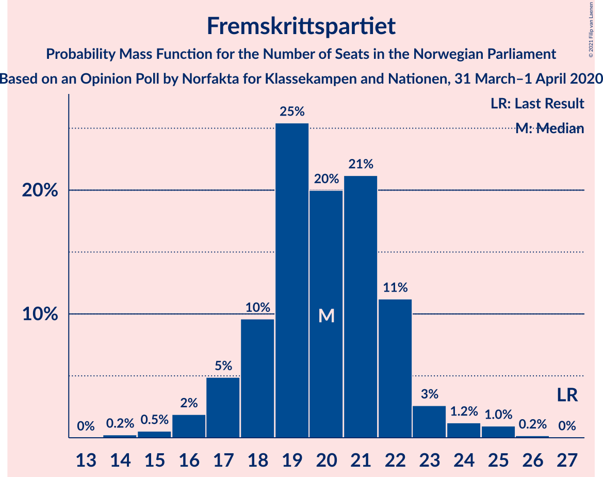
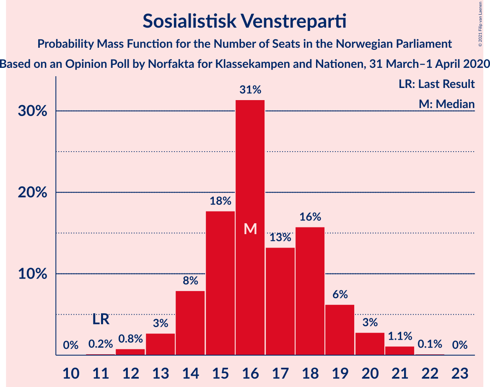
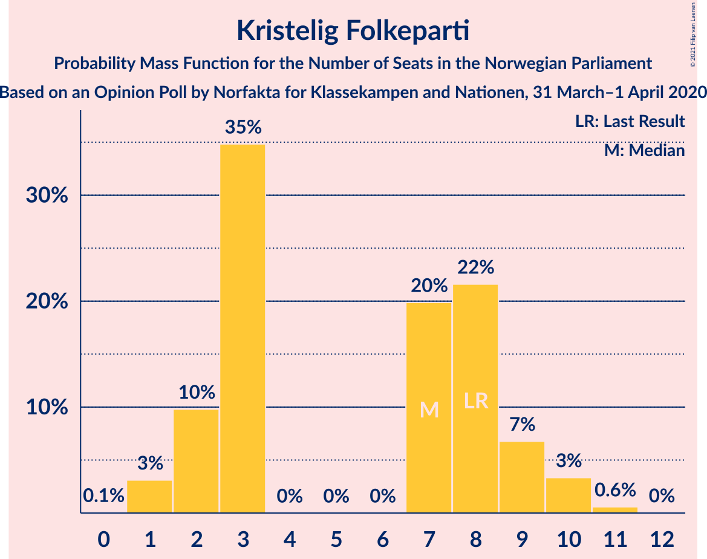
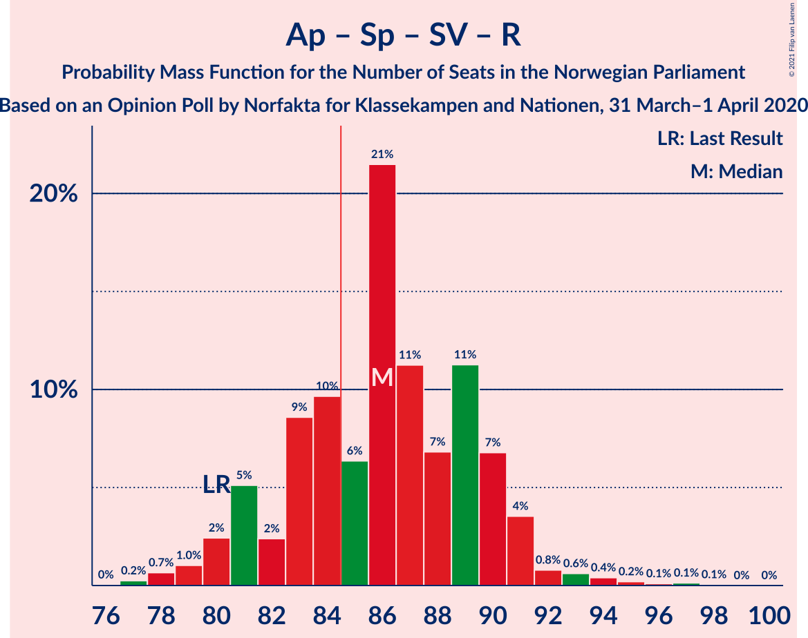
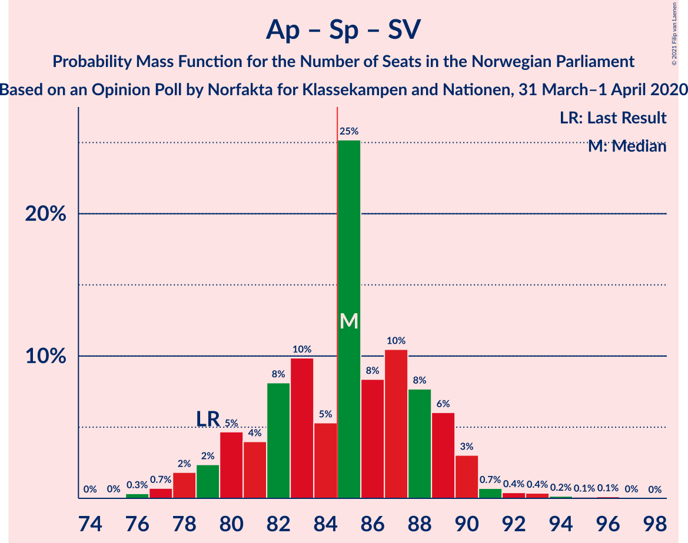
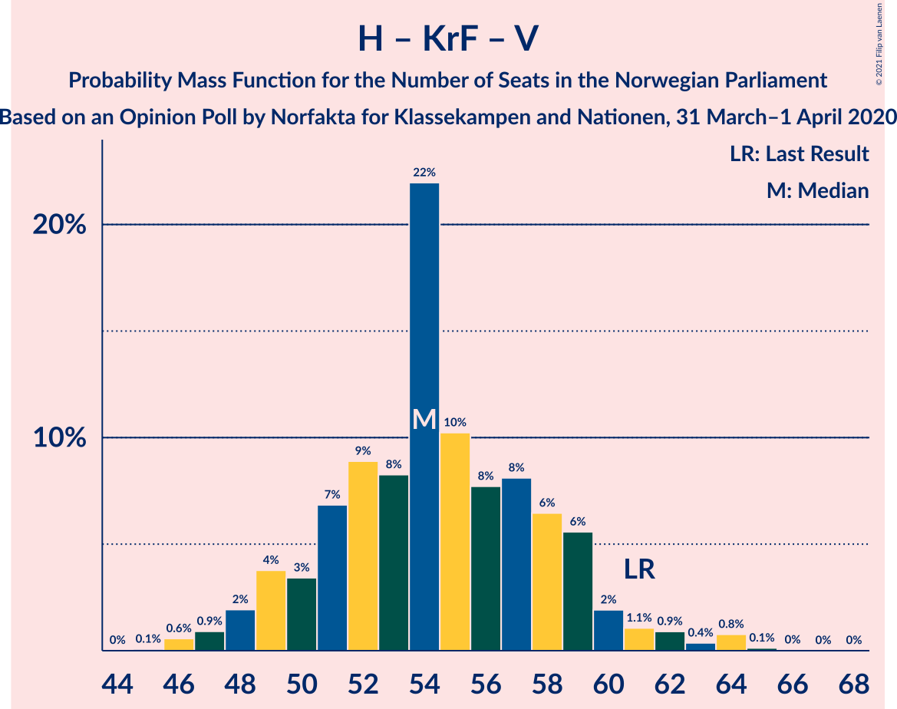
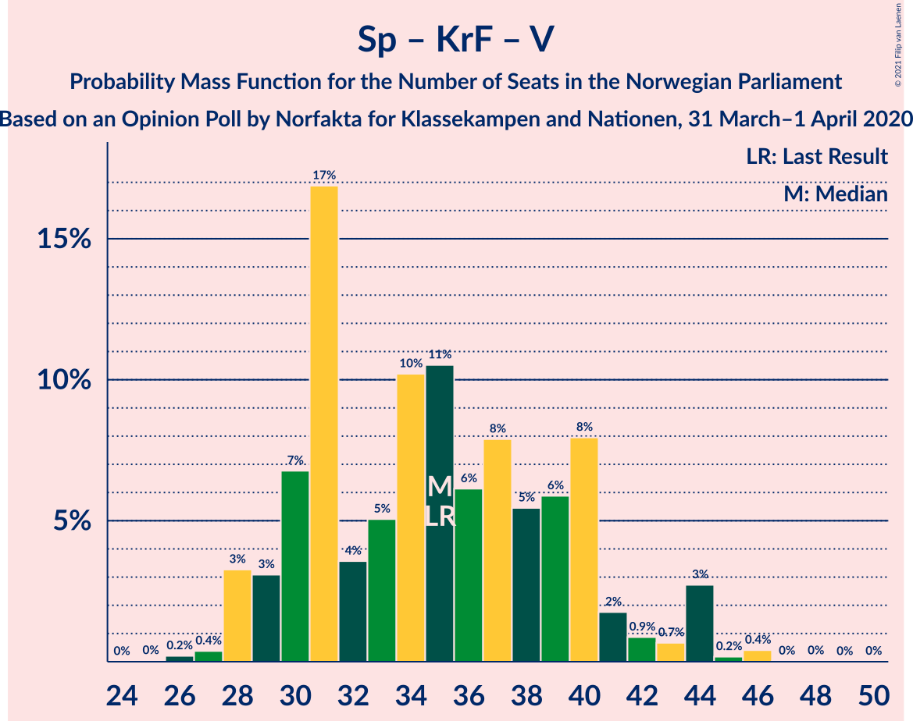

# Opinion Poll by Norfakta for Klasskampen and Nationen, 31 March–1 April 2020

<a href="#voting-intentions">Voting Intentions</a> | <a href="#seats">Seats</a> | <a href="#coalitions">Coalitions</a> | <a href="#technical-information">Technical Information</a>

## Voting Intentions

### Confidence Intervals

| Party | Last Result | Poll Result | 80% Confidence Interval | 90% Confidence Interval | 95% Confidence Interval | 99% Confidence Interval |
|:-----:|:-----------:|:-----------:|:-----------------------:|:-----------------------:|:-----------------------:|:-----------------------:|
| Høyre | 25.0% | 25.9% | 24.2–27.7% |23.7–28.3% |23.3–28.7% |22.5–29.6% |
| Arbeiderpartiet | 27.4% | 23.3% | 21.6–25.1% |21.2–25.6% |20.8–26.0% |20.0–26.9% |
| Senterpartiet | 10.3% | 14.7% | 13.3–16.2% |13.0–16.7% |12.6–17.0% |12.0–17.8% |
| Fremskrittspartiet | 15.2% | 11.1% | 9.9–12.5% |9.6–12.9% |9.3–13.2% |8.7–13.9% |
| Sosialistisk Venstreparti | 6.0% | 9.1% | 8.0–10.4% |7.7–10.7% |7.5–11.1% |7.0–11.7% |
| Miljøpartiet De Grønne | 3.2% | 5.0% | 4.2–6.0% |4.0–6.3% |3.8–6.5% |3.5–7.1% |
| Kristelig Folkeparti | 4.2% | 4.1% | 3.4–5.0% |3.2–5.3% |3.0–5.5% |2.7–6.0% |
| Venstre | 4.4% | 3.3% | 2.7–4.1% |2.5–4.4% |2.4–4.6% |2.1–5.0% |
| Rødt | 2.4% | 2.5% | 2.0–3.3% |1.8–3.5% |1.7–3.7% |1.5–4.1% |

*Note:* The poll result column reflects the actual value used in the calculations. Published results may vary slightly, and in addition be rounded to fewer digits.

## Seats

### Confidence Intervals

| Party | Last Result | Median | 80% Confidence Interval | 90% Confidence Interval | 95% Confidence Interval | 99% Confidence Interval |
|:-----:|:-----------:|:------:|:-----------------------:|:-----------------------:|:-----------------------:|:-----------------------:|
| <a href="#høyre">Høyre</a> | 45 | 46 | 43–49 |42–51 |41–52 |39–53 |
| <a href="#arbeiderpartiet">Arbeiderpartiet</a> | 49 | 42 | 40–45 |38–46 |38–47 |36–48 |
| <a href="#senterpartiet">Senterpartiet</a> | 19 | 26 | 24–30 |23–30 |22–31 |21–33 |
| <a href="#fremskrittspartiet">Fremskrittspartiet</a> | 27 | 20 | 18–22 |17–22 |16–23 |15–25 |
| <a href="#sosialistisk-venstreparti">Sosialistisk Venstreparti</a> | 11 | 16 | 14–19 |14–19 |13–20 |12–21 |
| <a href="#miljøpartiet-de-grønne">Miljøpartiet De Grønne</a> | 1 | 9 | 7–11 |7–11 |2–12 |1–13 |
| <a href="#kristelig-folkeparti">Kristelig Folkeparti</a> | 8 | 7 | 2–9 |2–9 |1–10 |1–11 |
| <a href="#venstre">Venstre</a> | 8 | 2 | 2–7 |1–7 |1–8 |1–8 |
| <a href="#rødt">Rødt</a> | 1 | 1 | 1–2 |1–2 |1–2 |1–2 |

### Høyre

*For a full overview of the results for this party, see the [Høyre](party-høyre.html) page.*

| Number of Seats | Probability | Accumulated | Special Marks |
|:---------------:|:-----------:|:-----------:|:-------------:|
| 37 | 0.1% | 100% |  |
| 38 | 0.2% | 99.9% |  |
| 39 | 0.5% | 99.7% |  |
| 40 | 1.4% | 99.2% |  |
| 41 | 3% | 98% |  |
| 42 | 5% | 95% |  |
| 43 | 9% | 90% |  |
| 44 | 10% | 81% |  |
| 45 | 16% | 71% | Last Result |
| 46 | 15% | 55% | Median |
| 47 | 6% | 40% |  |
| 48 | 5% | 34% |  |
| 49 | 19% | 28% |  |
| 50 | 4% | 9% |  |
| 51 | 3% | 5% |  |
| 52 | 2% | 3% |  |
| 53 | 0.8% | 1.2% |  |
| 54 | 0.4% | 0.5% |  |
| 55 | 0.1% | 0.1% |  |
| 56 | 0% | 0% |  |

### Arbeiderpartiet

*For a full overview of the results for this party, see the [Arbeiderpartiet](party-arbeiderpartiet.html) page.*

| Number of Seats | Probability | Accumulated | Special Marks |
|:---------------:|:-----------:|:-----------:|:-------------:|
| 34 | 0.1% | 100% |  |
| 35 | 0.2% | 99.8% |  |
| 36 | 0.9% | 99.6% |  |
| 37 | 1.2% | 98.7% |  |
| 38 | 3% | 98% |  |
| 39 | 3% | 95% |  |
| 40 | 21% | 92% |  |
| 41 | 21% | 71% |  |
| 42 | 8% | 50% | Median |
| 43 | 18% | 43% |  |
| 44 | 8% | 24% |  |
| 45 | 9% | 16% |  |
| 46 | 5% | 8% |  |
| 47 | 1.3% | 3% |  |
| 48 | 1.0% | 1.4% |  |
| 49 | 0.2% | 0.4% | Last Result |
| 50 | 0.1% | 0.1% |  |
| 51 | 0% | 0% |  |

### Senterpartiet

*For a full overview of the results for this party, see the [Senterpartiet](party-senterpartiet.html) page.*

| Number of Seats | Probability | Accumulated | Special Marks |
|:---------------:|:-----------:|:-----------:|:-------------:|
| 19 | 0% | 100% | Last Result |
| 20 | 0.5% | 100% |  |
| 21 | 0.5% | 99.5% |  |
| 22 | 2% | 99.0% |  |
| 23 | 4% | 97% |  |
| 24 | 11% | 93% |  |
| 25 | 17% | 82% |  |
| 26 | 25% | 65% | Median |
| 27 | 11% | 40% |  |
| 28 | 8% | 29% |  |
| 29 | 6% | 21% |  |
| 30 | 10% | 14% |  |
| 31 | 3% | 4% |  |
| 32 | 1.0% | 2% |  |
| 33 | 0.4% | 0.6% |  |
| 34 | 0.1% | 0.2% |  |
| 35 | 0% | 0.1% |  |
| 36 | 0% | 0% |  |

### Fremskrittspartiet

*For a full overview of the results for this party, see the [Fremskrittspartiet](party-fremskrittspartiet.html) page.*

| Number of Seats | Probability | Accumulated | Special Marks |
|:---------------:|:-----------:|:-----------:|:-------------:|
| 14 | 0.2% | 100% |  |
| 15 | 0.5% | 99.7% |  |
| 16 | 2% | 99.2% |  |
| 17 | 5% | 97% |  |
| 18 | 10% | 92% |  |
| 19 | 25% | 83% |  |
| 20 | 20% | 57% | Median |
| 21 | 21% | 37% |  |
| 22 | 11% | 16% |  |
| 23 | 3% | 5% |  |
| 24 | 1.2% | 2% |  |
| 25 | 1.0% | 1.2% |  |
| 26 | 0.2% | 0.2% |  |
| 27 | 0% | 0% | Last Result |

### Sosialistisk Venstreparti

*For a full overview of the results for this party, see the [Sosialistisk Venstreparti](party-sosialistiskvenstreparti.html) page.*

| Number of Seats | Probability | Accumulated | Special Marks |
|:---------------:|:-----------:|:-----------:|:-------------:|
| 11 | 0.2% | 100% | Last Result |
| 12 | 0.8% | 99.8% |  |
| 13 | 3% | 99.0% |  |
| 14 | 8% | 96% |  |
| 15 | 18% | 88% |  |
| 16 | 31% | 71% | Median |
| 17 | 13% | 39% |  |
| 18 | 16% | 26% |  |
| 19 | 6% | 10% |  |
| 20 | 3% | 4% |  |
| 21 | 1.1% | 1.3% |  |
| 22 | 0.1% | 0.2% |  |
| 23 | 0% | 0% |  |

### Miljøpartiet De Grønne

*For a full overview of the results for this party, see the [Miljøpartiet De Grønne](party-miljøpartietdegrønne.html) page.*

| Number of Seats | Probability | Accumulated | Special Marks |
|:---------------:|:-----------:|:-----------:|:-------------:|
| 1 | 0.5% | 100% | Last Result |
| 2 | 3% | 99.5% |  |
| 3 | 0.1% | 96% |  |
| 4 | 0% | 96% |  |
| 5 | 0% | 96% |  |
| 6 | 0% | 96% |  |
| 7 | 11% | 96% |  |
| 8 | 29% | 85% |  |
| 9 | 25% | 56% | Median |
| 10 | 20% | 30% |  |
| 11 | 8% | 10% |  |
| 12 | 2% | 3% |  |
| 13 | 0.5% | 0.6% |  |
| 14 | 0% | 0.1% |  |
| 15 | 0% | 0% |  |

### Kristelig Folkeparti

*For a full overview of the results for this party, see the [Kristelig Folkeparti](party-kristeligfolkeparti.html) page.*

| Number of Seats | Probability | Accumulated | Special Marks |
|:---------------:|:-----------:|:-----------:|:-------------:|
| 0 | 0.1% | 100% |  |
| 1 | 3% | 99.9% |  |
| 2 | 10% | 97% |  |
| 3 | 35% | 87% |  |
| 4 | 0% | 52% |  |
| 5 | 0% | 52% |  |
| 6 | 0% | 52% |  |
| 7 | 20% | 52% | Median |
| 8 | 22% | 32% | Last Result |
| 9 | 7% | 11% |  |
| 10 | 3% | 4% |  |
| 11 | 0.6% | 0.6% |  |
| 12 | 0% | 0% |  |

### Venstre

*For a full overview of the results for this party, see the [Venstre](party-venstre.html) page.*

| Number of Seats | Probability | Accumulated | Special Marks |
|:---------------:|:-----------:|:-----------:|:-------------:|
| 0 | 0.1% | 100% |  |
| 1 | 10% | 99.9% |  |
| 2 | 71% | 90% | Median |
| 3 | 0.3% | 19% |  |
| 4 | 0% | 19% |  |
| 5 | 0% | 19% |  |
| 6 | 0% | 19% |  |
| 7 | 14% | 19% |  |
| 8 | 4% | 5% | Last Result |
| 9 | 0.4% | 0.4% |  |
| 10 | 0.1% | 0.1% |  |
| 11 | 0% | 0% |  |

### Rødt

*For a full overview of the results for this party, see the [Rødt](party-rødt.html) page.*

| Number of Seats | Probability | Accumulated | Special Marks |
|:---------------:|:-----------:|:-----------:|:-------------:|
| 0 | 0.2% | 100% |  |
| 1 | 78% | 99.8% | Last Result, Median |
| 2 | 21% | 22% |  |
| 3 | 0% | 0.4% |  |
| 4 | 0% | 0.4% |  |
| 5 | 0% | 0.4% |  |
| 6 | 0% | 0.4% |  |
| 7 | 0.3% | 0.4% |  |
| 8 | 0.1% | 0.1% |  |
| 9 | 0% | 0% |  |

## Coalitions

### Confidence Intervals

| Coalition | Last Result | Median | Majority? | 80% Confidence Interval | 90% Confidence Interval | 95% Confidence Interval | 99% Confidence Interval |
|:---------:|:-----------:|:------:|:---------:|:-----------------------:|:-----------------------:|:-----------------------:|:-----------------------:|
| Høyre – Senterpartiet – Fremskrittspartiet – Kristelig Folkeparti – Venstre | 107 | 101 | 100% | 96–105 | 95–106 | 95–107 | 93–109 |
| Arbeiderpartiet – Senterpartiet – Sosialistisk Venstreparti – Miljøpartiet De Grønne – Kristelig Folkeparti | 88 | 99 | 100% | 95–103 | 94–104 | 93–105 | 91–107 |
| Arbeiderpartiet – Senterpartiet – Sosialistisk Venstreparti – Miljøpartiet De Grønne – Rødt | 81 | 94 | 99.9% | 91–99 | 90–100 | 88–101 | 85–103 |
| Arbeiderpartiet – Senterpartiet – Sosialistisk Venstreparti – Miljøpartiet De Grønne | 80 | 93 | 99.0% | 90–98 | 88–99 | 87–100 | 84–102 |
| Arbeiderpartiet – Senterpartiet – Sosialistisk Venstreparti – Rødt | 80 | 86 | 70% | 82–90 | 81–91 | 80–91 | 78–94 |
| Arbeiderpartiet – Senterpartiet – Sosialistisk Venstreparti | 79 | 85 | 63% | 80–89 | 79–89 | 78–90 | 77–93 |
| Høyre – Fremskrittspartiet – Miljøpartiet De Grønne – Kristelig Folkeparti – Venstre | 89 | 83 | 30% | 79–87 | 78–88 | 78–89 | 75–91 |
| Arbeiderpartiet – Senterpartiet – Miljøpartiet De Grønne – Kristelig Folkeparti | 77 | 82 | 29% | 79–87 | 77–88 | 76–89 | 74–91 |
| Høyre – Fremskrittspartiet – Kristelig Folkeparti – Venstre | 88 | 75 | 0.1% | 70–78 | 69–79 | 68–81 | 66–84 |
| Arbeiderpartiet – Senterpartiet – Kristelig Folkeparti | 76 | 74 | 0.1% | 70–78 | 68–80 | 67–81 | 66–83 |
| Arbeiderpartiet – Senterpartiet | 68 | 69 | 0% | 64–72 | 64–73 | 63–75 | 61–77 |
| Høyre – Fremskrittspartiet – Venstre | 80 | 69 | 0% | 65–73 | 64–74 | 63–75 | 61–77 |
| Høyre – Fremskrittspartiet | 72 | 66 | 0% | 62–70 | 61–71 | 59–72 | 58–74 |
| Arbeiderpartiet – Sosialistisk Venstreparti | 60 | 59 | 0% | 55–62 | 54–63 | 53–63 | 51–66 |
| Høyre – Kristelig Folkeparti – Venstre | 61 | 54 | 0% | 50–59 | 49–60 | 48–61 | 46–64 |
| Senterpartiet – Kristelig Folkeparti – Venstre | 35 | 35 | 0% | 30–40 | 29–41 | 28–44 | 27–45 |

### Høyre – Senterpartiet – Fremskrittspartiet – Kristelig Folkeparti – Venstre

| Number of Seats | Probability | Accumulated | Special Marks |
|:---------------:|:-----------:|:-----------:|:-------------:|
| 91 | 0.1% | 100% |  |
| 92 | 0.1% | 99.9% |  |
| 93 | 0.4% | 99.8% |  |
| 94 | 0.7% | 99.4% |  |
| 95 | 7% | 98.6% |  |
| 96 | 2% | 91% |  |
| 97 | 4% | 89% |  |
| 98 | 4% | 85% |  |
| 99 | 10% | 80% |  |
| 100 | 14% | 71% |  |
| 101 | 22% | 57% | Median |
| 102 | 12% | 36% |  |
| 103 | 5% | 24% |  |
| 104 | 7% | 19% |  |
| 105 | 3% | 12% |  |
| 106 | 5% | 9% |  |
| 107 | 2% | 4% | Last Result |
| 108 | 2% | 2% |  |
| 109 | 0.2% | 0.7% |  |
| 110 | 0.4% | 0.5% |  |
| 111 | 0.1% | 0.1% |  |
| 112 | 0% | 0% |  |

### Arbeiderpartiet – Senterpartiet – Sosialistisk Venstreparti – Miljøpartiet De Grønne – Kristelig Folkeparti

| Number of Seats | Probability | Accumulated | Special Marks |
|:---------------:|:-----------:|:-----------:|:-------------:|
| 87 | 0% | 100% |  |
| 88 | 0% | 99.9% | Last Result |
| 89 | 0.1% | 99.9% |  |
| 90 | 0.2% | 99.8% |  |
| 91 | 0.4% | 99.6% |  |
| 92 | 1.2% | 99.2% |  |
| 93 | 2% | 98% |  |
| 94 | 4% | 96% |  |
| 95 | 4% | 92% |  |
| 96 | 16% | 88% |  |
| 97 | 11% | 73% |  |
| 98 | 8% | 62% |  |
| 99 | 11% | 54% |  |
| 100 | 13% | 44% | Median |
| 101 | 9% | 31% |  |
| 102 | 10% | 22% |  |
| 103 | 5% | 11% |  |
| 104 | 2% | 6% |  |
| 105 | 2% | 4% |  |
| 106 | 0.9% | 2% |  |
| 107 | 0.7% | 1.0% |  |
| 108 | 0.1% | 0.3% |  |
| 109 | 0.1% | 0.2% |  |
| 110 | 0% | 0% |  |

### Arbeiderpartiet – Senterpartiet – Sosialistisk Venstreparti – Miljøpartiet De Grønne – Rødt

| Number of Seats | Probability | Accumulated | Special Marks |
|:---------------:|:-----------:|:-----------:|:-------------:|
| 81 | 0% | 100% | Last Result |
| 82 | 0% | 100% |  |
| 83 | 0% | 100% |  |
| 84 | 0.1% | 99.9% |  |
| 85 | 0.8% | 99.9% | Majority |
| 86 | 0.3% | 99.1% |  |
| 87 | 1.0% | 98.8% |  |
| 88 | 1.0% | 98% |  |
| 89 | 2% | 97% |  |
| 90 | 3% | 95% |  |
| 91 | 10% | 92% |  |
| 92 | 7% | 82% |  |
| 93 | 8% | 75% |  |
| 94 | 21% | 67% | Median |
| 95 | 9% | 46% |  |
| 96 | 9% | 37% |  |
| 97 | 5% | 28% |  |
| 98 | 8% | 23% |  |
| 99 | 8% | 16% |  |
| 100 | 2% | 7% |  |
| 101 | 4% | 5% |  |
| 102 | 0.8% | 1.4% |  |
| 103 | 0.1% | 0.6% |  |
| 104 | 0.1% | 0.4% |  |
| 105 | 0.3% | 0.3% |  |
| 106 | 0% | 0% |  |

### Arbeiderpartiet – Senterpartiet – Sosialistisk Venstreparti – Miljøpartiet De Grønne

| Number of Seats | Probability | Accumulated | Special Marks |
|:---------------:|:-----------:|:-----------:|:-------------:|
| 80 | 0% | 100% | Last Result |
| 81 | 0% | 100% |  |
| 82 | 0% | 100% |  |
| 83 | 0.1% | 99.9% |  |
| 84 | 0.9% | 99.9% |  |
| 85 | 0.5% | 99.0% | Majority |
| 86 | 0.9% | 98.5% |  |
| 87 | 1.1% | 98% |  |
| 88 | 2% | 96% |  |
| 89 | 4% | 94% |  |
| 90 | 11% | 91% |  |
| 91 | 6% | 80% |  |
| 92 | 9% | 74% |  |
| 93 | 22% | 65% | Median |
| 94 | 9% | 43% |  |
| 95 | 6% | 34% |  |
| 96 | 8% | 27% |  |
| 97 | 5% | 19% |  |
| 98 | 7% | 14% |  |
| 99 | 3% | 7% |  |
| 100 | 3% | 4% |  |
| 101 | 0.7% | 1.2% |  |
| 102 | 0.1% | 0.5% |  |
| 103 | 0.1% | 0.4% |  |
| 104 | 0.3% | 0.3% |  |
| 105 | 0% | 0% |  |

### Arbeiderpartiet – Senterpartiet – Sosialistisk Venstreparti – Rødt

| Number of Seats | Probability | Accumulated | Special Marks |
|:---------------:|:-----------:|:-----------:|:-------------:|
| 76 | 0% | 100% |  |
| 77 | 0.2% | 99.9% |  |
| 78 | 0.7% | 99.7% |  |
| 79 | 1.0% | 99.0% |  |
| 80 | 2% | 98% | Last Result |
| 81 | 5% | 96% |  |
| 82 | 2% | 90% |  |
| 83 | 9% | 88% |  |
| 84 | 10% | 79% |  |
| 85 | 6% | 70% | Median, Majority |
| 86 | 21% | 63% |  |
| 87 | 11% | 42% |  |
| 88 | 7% | 31% |  |
| 89 | 11% | 24% |  |
| 90 | 7% | 13% |  |
| 91 | 4% | 6% |  |
| 92 | 0.8% | 2% |  |
| 93 | 0.6% | 2% |  |
| 94 | 0.4% | 0.9% |  |
| 95 | 0.2% | 0.5% |  |
| 96 | 0.1% | 0.3% |  |
| 97 | 0.1% | 0.2% |  |
| 98 | 0.1% | 0.1% |  |
| 99 | 0% | 0% |  |

### Arbeiderpartiet – Senterpartiet – Sosialistisk Venstreparti

| Number of Seats | Probability | Accumulated | Special Marks |
|:---------------:|:-----------:|:-----------:|:-------------:|
| 75 | 0% | 100% |  |
| 76 | 0.3% | 99.9% |  |
| 77 | 0.7% | 99.6% |  |
| 78 | 2% | 98.9% |  |
| 79 | 2% | 97% | Last Result |
| 80 | 5% | 95% |  |
| 81 | 4% | 90% |  |
| 82 | 8% | 86% |  |
| 83 | 10% | 78% |  |
| 84 | 5% | 68% | Median |
| 85 | 25% | 63% | Majority |
| 86 | 8% | 37% |  |
| 87 | 10% | 29% |  |
| 88 | 8% | 19% |  |
| 89 | 6% | 11% |  |
| 90 | 3% | 5% |  |
| 91 | 0.7% | 2% |  |
| 92 | 0.4% | 1.2% |  |
| 93 | 0.4% | 0.8% |  |
| 94 | 0.2% | 0.4% |  |
| 95 | 0.1% | 0.3% |  |
| 96 | 0.1% | 0.2% |  |
| 97 | 0% | 0.1% |  |
| 98 | 0% | 0% |  |

### Høyre – Fremskrittspartiet – Miljøpartiet De Grønne – Kristelig Folkeparti – Venstre

| Number of Seats | Probability | Accumulated | Special Marks |
|:---------------:|:-----------:|:-----------:|:-------------:|
| 71 | 0.1% | 100% |  |
| 72 | 0.1% | 99.9% |  |
| 73 | 0.1% | 99.8% |  |
| 74 | 0.2% | 99.7% |  |
| 75 | 0.4% | 99.5% |  |
| 76 | 0.6% | 99.1% |  |
| 77 | 0.8% | 98% |  |
| 78 | 4% | 98% |  |
| 79 | 7% | 94% |  |
| 80 | 11% | 87% |  |
| 81 | 7% | 76% |  |
| 82 | 11% | 69% |  |
| 83 | 21% | 58% |  |
| 84 | 6% | 37% | Median |
| 85 | 10% | 30% | Majority |
| 86 | 9% | 21% |  |
| 87 | 2% | 12% |  |
| 88 | 5% | 10% |  |
| 89 | 2% | 4% | Last Result |
| 90 | 1.0% | 2% |  |
| 91 | 0.7% | 1.0% |  |
| 92 | 0.2% | 0.3% |  |
| 93 | 0% | 0.1% |  |
| 94 | 0% | 0% |  |

### Arbeiderpartiet – Senterpartiet – Miljøpartiet De Grønne – Kristelig Folkeparti

| Number of Seats | Probability | Accumulated | Special Marks |
|:---------------:|:-----------:|:-----------:|:-------------:|
| 72 | 0.1% | 100% |  |
| 73 | 0.2% | 99.9% |  |
| 74 | 0.9% | 99.7% |  |
| 75 | 0.6% | 98.8% |  |
| 76 | 3% | 98% |  |
| 77 | 2% | 95% | Last Result |
| 78 | 2% | 93% |  |
| 79 | 6% | 91% |  |
| 80 | 15% | 85% |  |
| 81 | 11% | 70% |  |
| 82 | 11% | 59% |  |
| 83 | 9% | 48% |  |
| 84 | 10% | 39% | Median |
| 85 | 12% | 29% | Majority |
| 86 | 4% | 16% |  |
| 87 | 5% | 12% |  |
| 88 | 4% | 7% |  |
| 89 | 2% | 4% |  |
| 90 | 1.4% | 2% |  |
| 91 | 0.2% | 0.6% |  |
| 92 | 0.2% | 0.4% |  |
| 93 | 0.1% | 0.2% |  |
| 94 | 0% | 0% |  |

### Høyre – Fremskrittspartiet – Kristelig Folkeparti – Venstre

| Number of Seats | Probability | Accumulated | Special Marks |
|:---------------:|:-----------:|:-----------:|:-------------:|
| 64 | 0.3% | 100% |  |
| 65 | 0.1% | 99.7% |  |
| 66 | 0.1% | 99.6% |  |
| 67 | 0.8% | 99.4% |  |
| 68 | 4% | 98.6% |  |
| 69 | 2% | 95% |  |
| 70 | 8% | 93% |  |
| 71 | 8% | 84% |  |
| 72 | 5% | 77% |  |
| 73 | 9% | 72% |  |
| 74 | 9% | 63% |  |
| 75 | 21% | 54% | Median |
| 76 | 8% | 33% |  |
| 77 | 7% | 25% |  |
| 78 | 10% | 18% |  |
| 79 | 3% | 8% |  |
| 80 | 2% | 5% |  |
| 81 | 1.0% | 3% |  |
| 82 | 1.0% | 2% |  |
| 83 | 0.3% | 1.2% |  |
| 84 | 0.8% | 0.9% |  |
| 85 | 0.1% | 0.1% | Majority |
| 86 | 0% | 0.1% |  |
| 87 | 0% | 0% |  |
| 88 | 0% | 0% | Last Result |

### Arbeiderpartiet – Senterpartiet – Kristelig Folkeparti

| Number of Seats | Probability | Accumulated | Special Marks |
|:---------------:|:-----------:|:-----------:|:-------------:|
| 64 | 0.1% | 100% |  |
| 65 | 0.3% | 99.9% |  |
| 66 | 0.5% | 99.7% |  |
| 67 | 2% | 99.1% |  |
| 68 | 2% | 97% |  |
| 69 | 4% | 95% |  |
| 70 | 4% | 91% |  |
| 71 | 6% | 86% |  |
| 72 | 20% | 80% |  |
| 73 | 9% | 60% |  |
| 74 | 12% | 52% |  |
| 75 | 10% | 40% | Median |
| 76 | 9% | 30% | Last Result |
| 77 | 7% | 21% |  |
| 78 | 5% | 14% |  |
| 79 | 3% | 9% |  |
| 80 | 3% | 6% |  |
| 81 | 1.1% | 3% |  |
| 82 | 1.0% | 2% |  |
| 83 | 0.3% | 0.7% |  |
| 84 | 0.3% | 0.4% |  |
| 85 | 0.1% | 0.1% | Majority |
| 86 | 0% | 0.1% |  |
| 87 | 0% | 0% |  |

### Arbeiderpartiet – Senterpartiet

| Number of Seats | Probability | Accumulated | Special Marks |
|:---------------:|:-----------:|:-----------:|:-------------:|
| 59 | 0.1% | 100% |  |
| 60 | 0.2% | 99.9% |  |
| 61 | 0.5% | 99.7% |  |
| 62 | 1.3% | 99.2% |  |
| 63 | 1.0% | 98% |  |
| 64 | 7% | 97% |  |
| 65 | 7% | 90% |  |
| 66 | 7% | 83% |  |
| 67 | 14% | 76% |  |
| 68 | 7% | 62% | Last Result, Median |
| 69 | 24% | 55% |  |
| 70 | 9% | 31% |  |
| 71 | 8% | 23% |  |
| 72 | 7% | 15% |  |
| 73 | 3% | 8% |  |
| 74 | 2% | 5% |  |
| 75 | 2% | 3% |  |
| 76 | 0.3% | 1.1% |  |
| 77 | 0.6% | 0.7% |  |
| 78 | 0.1% | 0.1% |  |
| 79 | 0% | 0.1% |  |
| 80 | 0% | 0% |  |

### Høyre – Fremskrittspartiet – Venstre

| Number of Seats | Probability | Accumulated | Special Marks |
|:---------------:|:-----------:|:-----------:|:-------------:|
| 58 | 0% | 100% |  |
| 59 | 0.1% | 99.9% |  |
| 60 | 0.2% | 99.8% |  |
| 61 | 0.8% | 99.6% |  |
| 62 | 1.2% | 98.8% |  |
| 63 | 2% | 98% |  |
| 64 | 4% | 95% |  |
| 65 | 4% | 91% |  |
| 66 | 12% | 87% |  |
| 67 | 9% | 75% |  |
| 68 | 13% | 66% | Median |
| 69 | 11% | 54% |  |
| 70 | 7% | 43% |  |
| 71 | 10% | 36% |  |
| 72 | 15% | 25% |  |
| 73 | 3% | 10% |  |
| 74 | 4% | 7% |  |
| 75 | 2% | 3% |  |
| 76 | 1.1% | 2% |  |
| 77 | 0.4% | 0.6% |  |
| 78 | 0.1% | 0.3% |  |
| 79 | 0.1% | 0.2% |  |
| 80 | 0% | 0.1% | Last Result |
| 81 | 0% | 0.1% |  |
| 82 | 0% | 0% |  |

### Høyre – Fremskrittspartiet

| Number of Seats | Probability | Accumulated | Special Marks |
|:---------------:|:-----------:|:-----------:|:-------------:|
| 55 | 0% | 100% |  |
| 56 | 0.1% | 99.9% |  |
| 57 | 0.2% | 99.8% |  |
| 58 | 0.5% | 99.6% |  |
| 59 | 2% | 99.1% |  |
| 60 | 2% | 97% |  |
| 61 | 4% | 96% |  |
| 62 | 8% | 92% |  |
| 63 | 4% | 84% |  |
| 64 | 14% | 80% |  |
| 65 | 12% | 66% |  |
| 66 | 12% | 54% | Median |
| 67 | 7% | 41% |  |
| 68 | 8% | 35% |  |
| 69 | 6% | 27% |  |
| 70 | 14% | 20% |  |
| 71 | 3% | 6% |  |
| 72 | 2% | 4% | Last Result |
| 73 | 0.7% | 1.2% |  |
| 74 | 0.3% | 0.5% |  |
| 75 | 0.1% | 0.2% |  |
| 76 | 0% | 0.1% |  |
| 77 | 0% | 0% |  |

### Arbeiderpartiet – Sosialistisk Venstreparti

| Number of Seats | Probability | Accumulated | Special Marks |
|:---------------:|:-----------:|:-----------:|:-------------:|
| 49 | 0.1% | 100% |  |
| 50 | 0.1% | 99.9% |  |
| 51 | 1.1% | 99.8% |  |
| 52 | 0.7% | 98.7% |  |
| 53 | 2% | 98% |  |
| 54 | 3% | 96% |  |
| 55 | 10% | 93% |  |
| 56 | 9% | 84% |  |
| 57 | 13% | 75% |  |
| 58 | 9% | 62% | Median |
| 59 | 22% | 53% |  |
| 60 | 10% | 31% | Last Result |
| 61 | 8% | 20% |  |
| 62 | 5% | 13% |  |
| 63 | 6% | 8% |  |
| 64 | 1.2% | 2% |  |
| 65 | 0.4% | 0.9% |  |
| 66 | 0.3% | 0.6% |  |
| 67 | 0.1% | 0.3% |  |
| 68 | 0.1% | 0.1% |  |
| 69 | 0% | 0% |  |

### Høyre – Kristelig Folkeparti – Venstre

| Number of Seats | Probability | Accumulated | Special Marks |
|:---------------:|:-----------:|:-----------:|:-------------:|
| 45 | 0.1% | 100% |  |
| 46 | 0.6% | 99.9% |  |
| 47 | 0.9% | 99.3% |  |
| 48 | 2% | 98% |  |
| 49 | 4% | 96% |  |
| 50 | 3% | 93% |  |
| 51 | 7% | 89% |  |
| 52 | 9% | 82% |  |
| 53 | 8% | 74% |  |
| 54 | 22% | 65% |  |
| 55 | 10% | 43% | Median |
| 56 | 8% | 33% |  |
| 57 | 8% | 25% |  |
| 58 | 6% | 17% |  |
| 59 | 6% | 11% |  |
| 60 | 2% | 5% |  |
| 61 | 1.1% | 3% | Last Result |
| 62 | 0.9% | 2% |  |
| 63 | 0.4% | 1.3% |  |
| 64 | 0.8% | 1.0% |  |
| 65 | 0.1% | 0.2% |  |
| 66 | 0% | 0.1% |  |
| 67 | 0% | 0% |  |

### Senterpartiet – Kristelig Folkeparti – Venstre

| Number of Seats | Probability | Accumulated | Special Marks |
|:---------------:|:-----------:|:-----------:|:-------------:|
| 26 | 0.2% | 100% |  |
| 27 | 0.4% | 99.7% |  |
| 28 | 3% | 99.4% |  |
| 29 | 3% | 96% |  |
| 30 | 7% | 93% |  |
| 31 | 17% | 86% |  |
| 32 | 4% | 69% |  |
| 33 | 5% | 66% |  |
| 34 | 10% | 61% |  |
| 35 | 11% | 51% | Last Result, Median |
| 36 | 6% | 40% |  |
| 37 | 8% | 34% |  |
| 38 | 5% | 26% |  |
| 39 | 6% | 21% |  |
| 40 | 8% | 15% |  |
| 41 | 2% | 7% |  |
| 42 | 0.9% | 5% |  |
| 43 | 0.7% | 4% |  |
| 44 | 3% | 3% |  |
| 45 | 0.2% | 0.7% |  |
| 46 | 0.4% | 0.5% |  |
| 47 | 0% | 0.1% |  |
| 48 | 0% | 0.1% |  |
| 49 | 0% | 0% |  |

## Technical Information

### Opinion Poll

+ **Polling firm:** Norfakta
+ **Commissioner(s):** Klasskampen and Nationen
+ **Fieldwork period:** 31 March–1 April 2020

### Calculations

+ **Sample size:** 1000
+ **Simulations done:** 1,048,576
+ **Error estimate:** 0.99%

