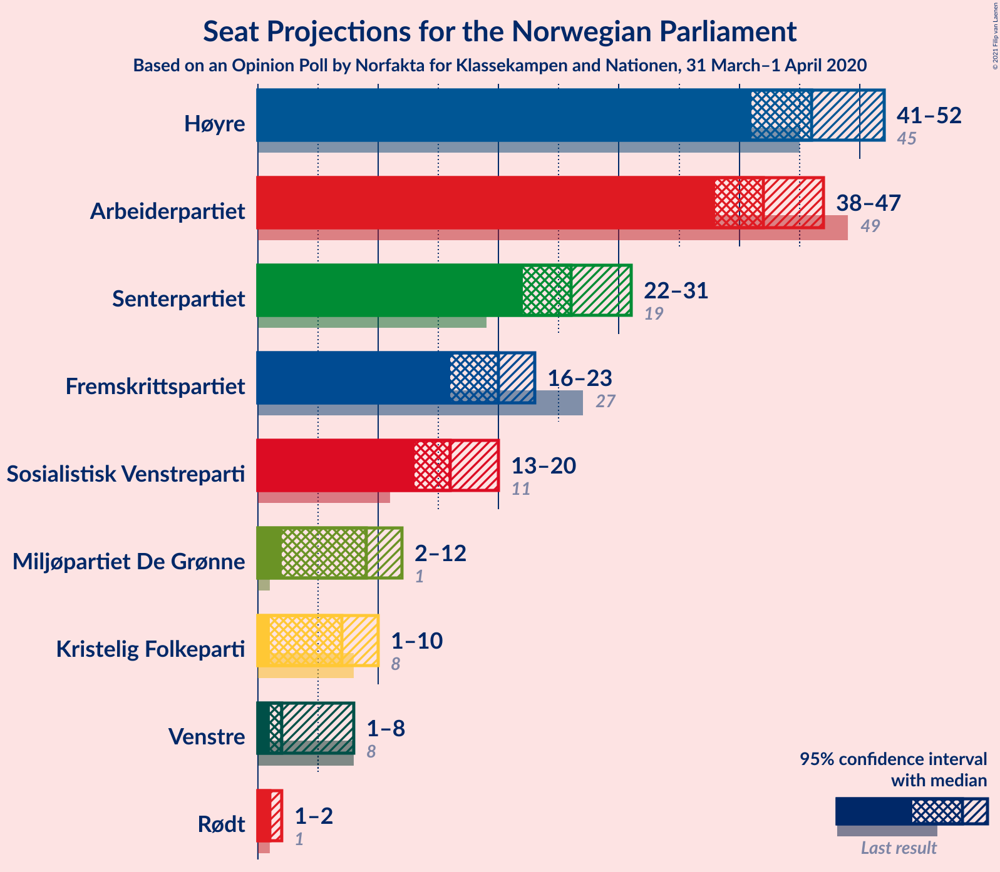
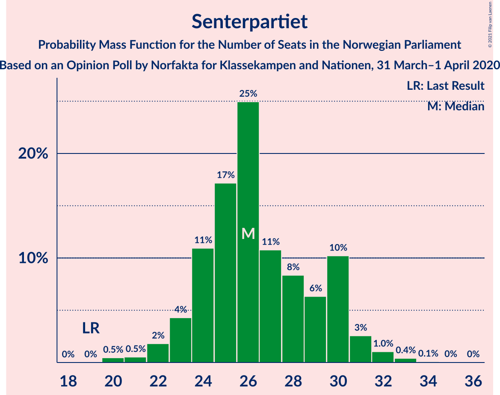
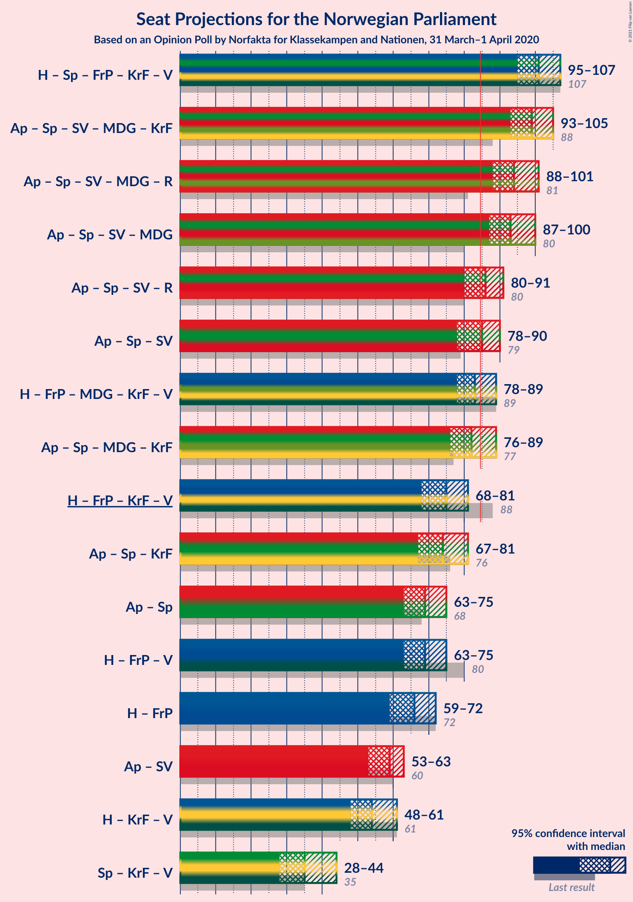
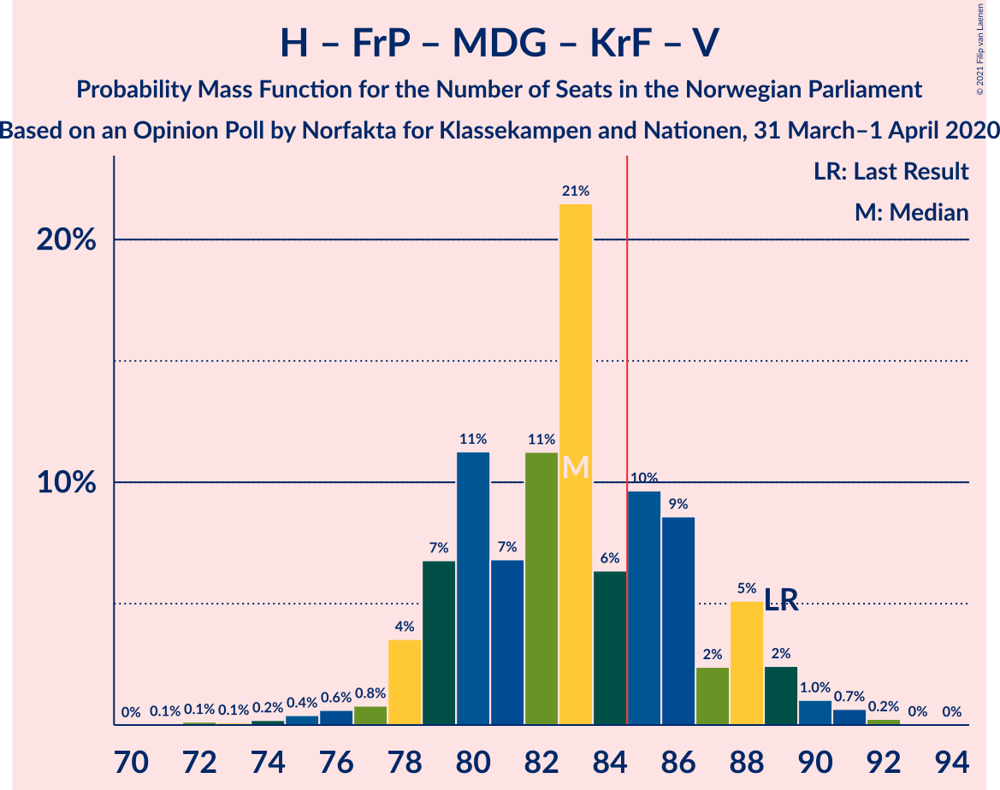
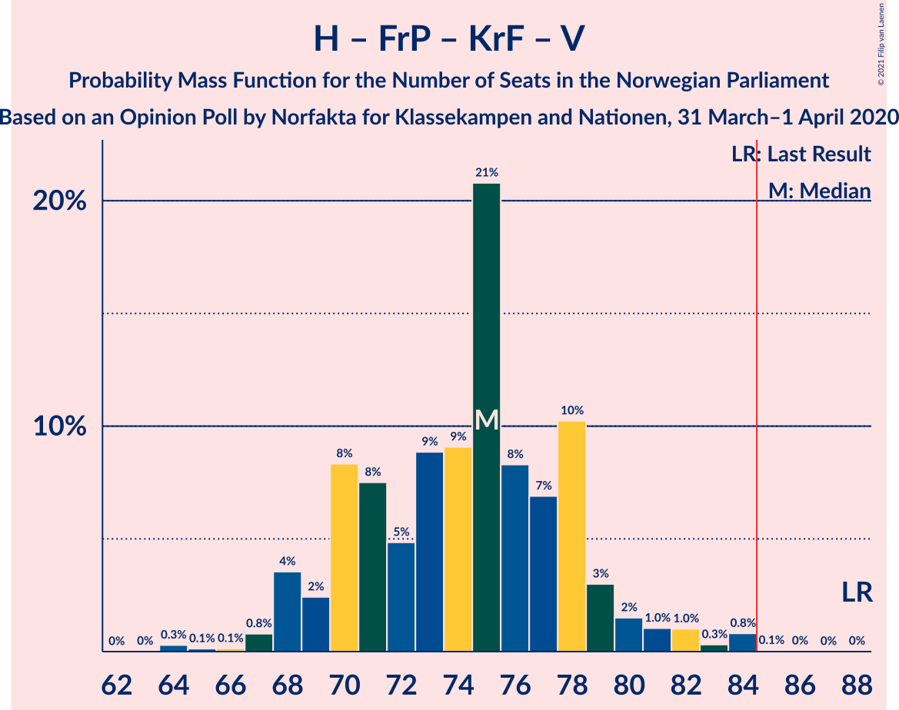
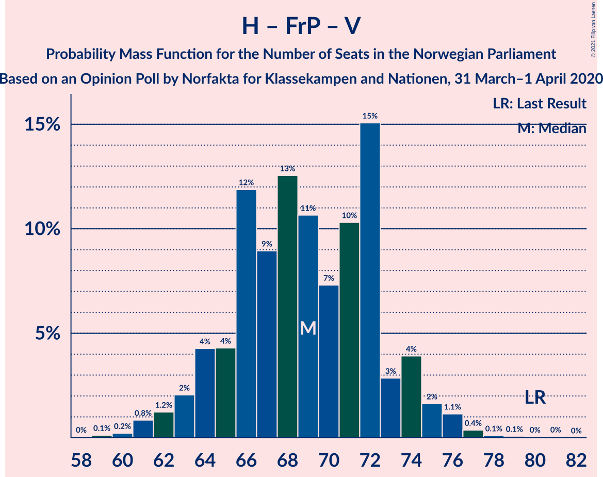

# Opinion Poll by Norfakta for Klasskampen and Nationen, 31 March–1 April 2020

<a href="#voting-intentions">Voting Intentions</a> | <a href="#seats">Seats</a> | <a href="#coalitions">Coalitions</a> | <a href="#technical-information">Technical Information</a>

## Voting Intentions

### Confidence Intervals

| Party | Last Result | Poll Result | 80% Confidence Interval | 90% Confidence Interval | 95% Confidence Interval | 99% Confidence Interval |
|:-----:|:-----------:|:-----------:|:-----------------------:|:-----------------------:|:-----------------------:|:-----------------------:|
| Høyre | 25.0% | 25.9% | 24.2–27.7% |23.7–28.3% |23.3–28.7% |22.5–29.6% |
| Arbeiderpartiet | 27.4% | 23.3% | 21.6–25.1% |21.2–25.6% |20.8–26.0% |20.0–26.9% |
| Senterpartiet | 10.3% | 14.7% | 13.3–16.2% |13.0–16.7% |12.6–17.0% |12.0–17.8% |
| Fremskrittspartiet | 15.2% | 11.1% | 9.9–12.5% |9.6–12.9% |9.3–13.2% |8.7–13.9% |
| Sosialistisk Venstreparti | 6.0% | 9.1% | 8.0–10.4% |7.7–10.7% |7.5–11.1% |7.0–11.7% |
| Miljøpartiet De Grønne | 3.2% | 5.0% | 4.2–6.0% |4.0–6.3% |3.8–6.5% |3.5–7.1% |
| Kristelig Folkeparti | 4.2% | 4.1% | 3.4–5.0% |3.2–5.3% |3.0–5.5% |2.7–6.0% |
| Venstre | 4.4% | 3.3% | 2.7–4.1% |2.5–4.4% |2.4–4.6% |2.1–5.0% |
| Rødt | 2.4% | 2.5% | 2.0–3.3% |1.8–3.5% |1.7–3.7% |1.5–4.1% |

*Note:* The poll result column reflects the actual value used in the calculations. Published results may vary slightly, and in addition be rounded to fewer digits.

## Seats

### Confidence Intervals

| Party | Last Result | Median | 80% Confidence Interval | 90% Confidence Interval | 95% Confidence Interval | 99% Confidence Interval |
|:-----:|:-----------:|:------:|:-----------------------:|:-----------------------:|:-----------------------:|:-----------------------:|
| <a href="#høyre">Høyre</a> | 45 | 46 | 42–49 |41–50 |41–51 |39–53 |
| <a href="#arbeiderpartiet">Arbeiderpartiet</a> | 49 | 41 | 40–45 |39–46 |37–46 |36–49 |
| <a href="#senterpartiet">Senterpartiet</a> | 19 | 26 | 24–30 |23–30 |22–31 |20–33 |
| <a href="#fremskrittspartiet">Fremskrittspartiet</a> | 27 | 20 | 18–22 |17–23 |16–23 |15–25 |
| <a href="#sosialistisk-venstreparti">Sosialistisk Venstreparti</a> | 11 | 16 | 14–18 |14–19 |13–19 |12–21 |
| <a href="#miljøpartiet-de-grønne">Miljøpartiet De Grønne</a> | 1 | 9 | 7–11 |7–11 |2–12 |1–13 |
| <a href="#kristelig-folkeparti">Kristelig Folkeparti</a> | 8 | 7 | 2–8 |2–9 |1–10 |1–11 |
| <a href="#venstre">Venstre</a> | 8 | 2 | 2–7 |1–7 |1–8 |1–9 |
| <a href="#rødt">Rødt</a> | 1 | 1 | 1–2 |1–2 |1–2 |1–2 |

### Høyre

*For a full overview of the results for this party, see the [Høyre](party-høyre.html) page.*

| Number of Seats | Probability | Accumulated | Special Marks |
|:---------------:|:-----------:|:-----------:|:-------------:|
| 37 | 0.1% | 100% |  |
| 38 | 0.2% | 99.9% |  |
| 39 | 0.8% | 99.8% |  |
| 40 | 1.0% | 98.9% |  |
| 41 | 4% | 98% |  |
| 42 | 5% | 94% |  |
| 43 | 5% | 89% |  |
| 44 | 11% | 84% |  |
| 45 | 22% | 74% | Last Result |
| 46 | 21% | 52% | Median |
| 47 | 8% | 30% |  |
| 48 | 5% | 23% |  |
| 49 | 8% | 17% |  |
| 50 | 6% | 9% |  |
| 51 | 1.0% | 3% |  |
| 52 | 1.2% | 2% |  |
| 53 | 0.6% | 1.1% |  |
| 54 | 0.4% | 0.5% |  |
| 55 | 0.1% | 0.1% |  |
| 56 | 0% | 0% |  |

### Arbeiderpartiet

*For a full overview of the results for this party, see the [Arbeiderpartiet](party-arbeiderpartiet.html) page.*

| Number of Seats | Probability | Accumulated | Special Marks |
|:---------------:|:-----------:|:-----------:|:-------------:|
| 34 | 0.1% | 100% |  |
| 35 | 0.2% | 99.9% |  |
| 36 | 0.7% | 99.6% |  |
| 37 | 2% | 99.0% |  |
| 38 | 1.4% | 97% |  |
| 39 | 5% | 96% |  |
| 40 | 24% | 91% |  |
| 41 | 20% | 66% | Median |
| 42 | 7% | 46% |  |
| 43 | 7% | 39% |  |
| 44 | 12% | 32% |  |
| 45 | 15% | 20% |  |
| 46 | 3% | 5% |  |
| 47 | 1.5% | 2% |  |
| 48 | 0.5% | 1.0% |  |
| 49 | 0.3% | 0.5% | Last Result |
| 50 | 0.1% | 0.2% |  |
| 51 | 0% | 0.1% |  |
| 52 | 0% | 0% |  |

### Senterpartiet

*For a full overview of the results for this party, see the [Senterpartiet](party-senterpartiet.html) page.*

| Number of Seats | Probability | Accumulated | Special Marks |
|:---------------:|:-----------:|:-----------:|:-------------:|
| 19 | 0% | 100% | Last Result |
| 20 | 0.8% | 100% |  |
| 21 | 0.5% | 99.1% |  |
| 22 | 2% | 98.6% |  |
| 23 | 3% | 97% |  |
| 24 | 11% | 93% |  |
| 25 | 24% | 83% |  |
| 26 | 14% | 58% | Median |
| 27 | 14% | 44% |  |
| 28 | 11% | 30% |  |
| 29 | 7% | 19% |  |
| 30 | 9% | 12% |  |
| 31 | 2% | 3% |  |
| 32 | 0.6% | 1.3% |  |
| 33 | 0.5% | 0.7% |  |
| 34 | 0.1% | 0.2% |  |
| 35 | 0% | 0.1% |  |
| 36 | 0% | 0% |  |

### Fremskrittspartiet

*For a full overview of the results for this party, see the [Fremskrittspartiet](party-fremskrittspartiet.html) page.*

| Number of Seats | Probability | Accumulated | Special Marks |
|:---------------:|:-----------:|:-----------:|:-------------:|
| 14 | 0.1% | 100% |  |
| 15 | 0.6% | 99.9% |  |
| 16 | 2% | 99.2% |  |
| 17 | 5% | 97% |  |
| 18 | 13% | 92% |  |
| 19 | 29% | 79% |  |
| 20 | 23% | 50% | Median |
| 21 | 7% | 27% |  |
| 22 | 15% | 20% |  |
| 23 | 3% | 5% |  |
| 24 | 1.5% | 2% |  |
| 25 | 0.5% | 0.8% |  |
| 26 | 0.2% | 0.3% |  |
| 27 | 0.1% | 0.1% | Last Result |
| 28 | 0% | 0% |  |

### Sosialistisk Venstreparti

*For a full overview of the results for this party, see the [Sosialistisk Venstreparti](party-sosialistiskvenstreparti.html) page.*

| Number of Seats | Probability | Accumulated | Special Marks |
|:---------------:|:-----------:|:-----------:|:-------------:|
| 11 | 0.2% | 100% | Last Result |
| 12 | 0.9% | 99.8% |  |
| 13 | 2% | 98.8% |  |
| 14 | 8% | 97% |  |
| 15 | 17% | 88% |  |
| 16 | 29% | 72% | Median |
| 17 | 19% | 43% |  |
| 18 | 16% | 24% |  |
| 19 | 6% | 8% |  |
| 20 | 1.4% | 2% |  |
| 21 | 0.6% | 0.8% |  |
| 22 | 0.2% | 0.2% |  |
| 23 | 0% | 0% |  |

### Miljøpartiet De Grønne

*For a full overview of the results for this party, see the [Miljøpartiet De Grønne](party-miljøpartietdegrønne.html) page.*

| Number of Seats | Probability | Accumulated | Special Marks |
|:---------------:|:-----------:|:-----------:|:-------------:|
| 1 | 0.5% | 100% | Last Result |
| 2 | 4% | 99.5% |  |
| 3 | 0% | 95% |  |
| 4 | 0% | 95% |  |
| 5 | 0% | 95% |  |
| 6 | 0% | 95% |  |
| 7 | 13% | 95% |  |
| 8 | 18% | 83% |  |
| 9 | 28% | 65% | Median |
| 10 | 23% | 36% |  |
| 11 | 10% | 13% |  |
| 12 | 2% | 3% |  |
| 13 | 0.8% | 0.8% |  |
| 14 | 0.1% | 0.1% |  |
| 15 | 0% | 0% |  |

### Kristelig Folkeparti

*For a full overview of the results for this party, see the [Kristelig Folkeparti](party-kristeligfolkeparti.html) page.*

| Number of Seats | Probability | Accumulated | Special Marks |
|:---------------:|:-----------:|:-----------:|:-------------:|
| 1 | 4% | 100% |  |
| 2 | 8% | 96% |  |
| 3 | 26% | 88% |  |
| 4 | 0% | 62% |  |
| 5 | 0% | 62% |  |
| 6 | 0% | 62% |  |
| 7 | 26% | 62% | Median |
| 8 | 26% | 36% | Last Result |
| 9 | 6% | 10% |  |
| 10 | 2% | 3% |  |
| 11 | 0.9% | 0.9% |  |
| 12 | 0% | 0% |  |

### Venstre

*For a full overview of the results for this party, see the [Venstre](party-venstre.html) page.*

| Number of Seats | Probability | Accumulated | Special Marks |
|:---------------:|:-----------:|:-----------:|:-------------:|
| 0 | 0.1% | 100% |  |
| 1 | 9% | 99.9% |  |
| 2 | 71% | 91% | Median |
| 3 | 0.2% | 20% |  |
| 4 | 0% | 20% |  |
| 5 | 0% | 20% |  |
| 6 | 0% | 20% |  |
| 7 | 16% | 20% |  |
| 8 | 3% | 4% | Last Result |
| 9 | 0.5% | 0.6% |  |
| 10 | 0.1% | 0.1% |  |
| 11 | 0% | 0% |  |

### Rødt

*For a full overview of the results for this party, see the [Rødt](party-rødt.html) page.*

| Number of Seats | Probability | Accumulated | Special Marks |
|:---------------:|:-----------:|:-----------:|:-------------:|
| 0 | 0.2% | 100% |  |
| 1 | 77% | 99.8% | Last Result, Median |
| 2 | 23% | 23% |  |
| 3 | 0% | 0.5% |  |
| 4 | 0% | 0.5% |  |
| 5 | 0% | 0.5% |  |
| 6 | 0% | 0.5% |  |
| 7 | 0.4% | 0.5% |  |
| 8 | 0.1% | 0.1% |  |
| 9 | 0% | 0% |  |

## Coalitions

### Confidence Intervals

| Coalition | Last Result | Median | Majority? | 80% Confidence Interval | 90% Confidence Interval | 95% Confidence Interval | 99% Confidence Interval |
|:---------:|:-----------:|:------:|:---------:|:-----------------------:|:-----------------------:|:-----------------------:|:-----------------------:|
| Høyre – Senterpartiet – Fremskrittspartiet – Kristelig Folkeparti – Venstre | 107 | 101 | 100% | 95–105 | 95–106 | 95–108 | 93–109 |
| Arbeiderpartiet – Senterpartiet – Sosialistisk Venstreparti – Miljøpartiet De Grønne – Kristelig Folkeparti | 88 | 100 | 100% | 96–102 | 94–104 | 93–105 | 91–107 |
| Arbeiderpartiet – Senterpartiet – Sosialistisk Venstreparti – Miljøpartiet De Grønne – Rødt | 81 | 94 | 99.9% | 91–99 | 89–101 | 87–101 | 85–102 |
| Arbeiderpartiet – Senterpartiet – Sosialistisk Venstreparti – Miljøpartiet De Grønne | 80 | 93 | 98% | 89–98 | 88–100 | 86–100 | 84–101 |
| Arbeiderpartiet – Senterpartiet – Sosialistisk Venstreparti – Rødt | 80 | 86 | 61% | 81–90 | 81–91 | 80–91 | 78–95 |
| Arbeiderpartiet – Senterpartiet – Sosialistisk Venstreparti | 79 | 85 | 52% | 80–89 | 79–90 | 78–90 | 77–94 |
| Arbeiderpartiet – Senterpartiet – Miljøpartiet De Grønne – Kristelig Folkeparti | 77 | 83 | 34% | 79–87 | 77–88 | 76–90 | 74–91 |
| Høyre – Fremskrittspartiet – Miljøpartiet De Grønne – Kristelig Folkeparti – Venstre | 89 | 83 | 39% | 79–88 | 78–88 | 78–89 | 74–91 |
| Høyre – Fremskrittspartiet – Kristelig Folkeparti – Venstre | 88 | 75 | 0.1% | 70–78 | 68–80 | 68–82 | 67–84 |
| Arbeiderpartiet – Senterpartiet – Kristelig Folkeparti | 76 | 74 | 0.1% | 71–79 | 69–80 | 68–81 | 66–84 |
| Arbeiderpartiet – Senterpartiet | 68 | 69 | 0% | 64–72 | 64–74 | 63–75 | 61–77 |
| Høyre – Fremskrittspartiet – Venstre | 80 | 68 | 0% | 65–72 | 64–74 | 62–75 | 60–77 |
| Høyre – Fremskrittspartiet | 72 | 65 | 0% | 62–69 | 60–70 | 59–72 | 57–74 |
| Arbeiderpartiet – Sosialistisk Venstreparti | 60 | 58 | 0% | 55–62 | 54–63 | 52–63 | 51–66 |
| Høyre – Kristelig Folkeparti – Venstre | 61 | 55 | 0% | 50–59 | 49–60 | 49–61 | 47–64 |
| Senterpartiet – Kristelig Folkeparti – Venstre | 35 | 35 | 0% | 30–40 | 30–40 | 29–42 | 27–44 |

### Høyre – Senterpartiet – Fremskrittspartiet – Kristelig Folkeparti – Venstre

| Number of Seats | Probability | Accumulated | Special Marks |
|:---------------:|:-----------:|:-----------:|:-------------:|
| 91 | 0% | 100% |  |
| 92 | 0.2% | 99.9% |  |
| 93 | 0.4% | 99.8% |  |
| 94 | 0.4% | 99.4% |  |
| 95 | 11% | 99.0% |  |
| 96 | 2% | 88% |  |
| 97 | 3% | 85% |  |
| 98 | 6% | 83% |  |
| 99 | 10% | 76% |  |
| 100 | 14% | 66% |  |
| 101 | 11% | 52% | Median |
| 102 | 12% | 41% |  |
| 103 | 6% | 29% |  |
| 104 | 10% | 23% |  |
| 105 | 4% | 12% |  |
| 106 | 4% | 8% |  |
| 107 | 1.4% | 4% | Last Result |
| 108 | 2% | 3% |  |
| 109 | 0.2% | 0.6% |  |
| 110 | 0.2% | 0.4% |  |
| 111 | 0.1% | 0.1% |  |
| 112 | 0% | 0% |  |

### Arbeiderpartiet – Senterpartiet – Sosialistisk Venstreparti – Miljøpartiet De Grønne – Kristelig Folkeparti

| Number of Seats | Probability | Accumulated | Special Marks |
|:---------------:|:-----------:|:-----------:|:-------------:|
| 88 | 0% | 100% | Last Result |
| 89 | 0.1% | 99.9% |  |
| 90 | 0.3% | 99.9% |  |
| 91 | 0.4% | 99.6% |  |
| 92 | 2% | 99.2% |  |
| 93 | 1.2% | 98% |  |
| 94 | 3% | 96% |  |
| 95 | 3% | 93% |  |
| 96 | 5% | 90% |  |
| 97 | 13% | 85% |  |
| 98 | 11% | 72% |  |
| 99 | 9% | 60% | Median |
| 100 | 16% | 51% |  |
| 101 | 11% | 35% |  |
| 102 | 14% | 24% |  |
| 103 | 3% | 10% |  |
| 104 | 3% | 7% |  |
| 105 | 2% | 4% |  |
| 106 | 0.5% | 2% |  |
| 107 | 1.2% | 2% |  |
| 108 | 0.2% | 0.4% |  |
| 109 | 0.2% | 0.2% |  |
| 110 | 0% | 0% |  |

### Arbeiderpartiet – Senterpartiet – Sosialistisk Venstreparti – Miljøpartiet De Grønne – Rødt

| Number of Seats | Probability | Accumulated | Special Marks |
|:---------------:|:-----------:|:-----------:|:-------------:|
| 81 | 0% | 100% | Last Result |
| 82 | 0% | 100% |  |
| 83 | 0% | 100% |  |
| 84 | 0.1% | 99.9% |  |
| 85 | 1.3% | 99.9% | Majority |
| 86 | 0.4% | 98.5% |  |
| 87 | 1.2% | 98% |  |
| 88 | 0.8% | 97% |  |
| 89 | 1.4% | 96% |  |
| 90 | 4% | 95% |  |
| 91 | 16% | 91% |  |
| 92 | 8% | 75% |  |
| 93 | 7% | 67% | Median |
| 94 | 13% | 60% |  |
| 95 | 3% | 47% |  |
| 96 | 12% | 44% |  |
| 97 | 3% | 32% |  |
| 98 | 7% | 29% |  |
| 99 | 13% | 23% |  |
| 100 | 3% | 10% |  |
| 101 | 6% | 7% |  |
| 102 | 0.8% | 1.2% |  |
| 103 | 0.1% | 0.4% |  |
| 104 | 0.2% | 0.3% |  |
| 105 | 0.1% | 0.1% |  |
| 106 | 0% | 0% |  |

### Arbeiderpartiet – Senterpartiet – Sosialistisk Venstreparti – Miljøpartiet De Grønne

| Number of Seats | Probability | Accumulated | Special Marks |
|:---------------:|:-----------:|:-----------:|:-------------:|
| 80 | 0% | 100% | Last Result |
| 81 | 0% | 100% |  |
| 82 | 0% | 100% |  |
| 83 | 0.1% | 99.9% |  |
| 84 | 1.4% | 99.9% |  |
| 85 | 0.4% | 98% | Majority |
| 86 | 1.3% | 98% |  |
| 87 | 0.8% | 97% |  |
| 88 | 2% | 96% |  |
| 89 | 6% | 94% |  |
| 90 | 17% | 88% |  |
| 91 | 6% | 72% |  |
| 92 | 7% | 65% | Median |
| 93 | 13% | 58% |  |
| 94 | 7% | 46% |  |
| 95 | 8% | 39% |  |
| 96 | 5% | 31% |  |
| 97 | 6% | 26% |  |
| 98 | 10% | 19% |  |
| 99 | 3% | 10% |  |
| 100 | 5% | 6% |  |
| 101 | 0.6% | 1.0% |  |
| 102 | 0.1% | 0.3% |  |
| 103 | 0.2% | 0.2% |  |
| 104 | 0% | 0.1% |  |
| 105 | 0% | 0% |  |

### Arbeiderpartiet – Senterpartiet – Sosialistisk Venstreparti – Rødt

| Number of Seats | Probability | Accumulated | Special Marks |
|:---------------:|:-----------:|:-----------:|:-------------:|
| 76 | 0% | 100% |  |
| 77 | 0.2% | 99.9% |  |
| 78 | 0.4% | 99.7% |  |
| 79 | 2% | 99.4% |  |
| 80 | 2% | 98% | Last Result |
| 81 | 6% | 95% |  |
| 82 | 2% | 89% |  |
| 83 | 12% | 86% |  |
| 84 | 13% | 75% | Median |
| 85 | 9% | 61% | Majority |
| 86 | 8% | 53% |  |
| 87 | 10% | 45% |  |
| 88 | 5% | 35% |  |
| 89 | 13% | 30% |  |
| 90 | 10% | 17% |  |
| 91 | 4% | 7% |  |
| 92 | 1.1% | 2% |  |
| 93 | 0.4% | 1.1% |  |
| 94 | 0.2% | 0.8% |  |
| 95 | 0.3% | 0.6% |  |
| 96 | 0.1% | 0.3% |  |
| 97 | 0.2% | 0.2% |  |
| 98 | 0% | 0% |  |

### Arbeiderpartiet – Senterpartiet – Sosialistisk Venstreparti

| Number of Seats | Probability | Accumulated | Special Marks |
|:---------------:|:-----------:|:-----------:|:-------------:|
| 74 | 0% | 100% |  |
| 75 | 0.1% | 99.9% |  |
| 76 | 0.2% | 99.9% |  |
| 77 | 0.5% | 99.7% |  |
| 78 | 3% | 99.3% |  |
| 79 | 3% | 96% | Last Result |
| 80 | 5% | 94% |  |
| 81 | 6% | 88% |  |
| 82 | 9% | 83% |  |
| 83 | 15% | 74% | Median |
| 84 | 7% | 59% |  |
| 85 | 10% | 52% | Majority |
| 86 | 8% | 42% |  |
| 87 | 8% | 33% |  |
| 88 | 10% | 25% |  |
| 89 | 8% | 15% |  |
| 90 | 4% | 6% |  |
| 91 | 1.0% | 2% |  |
| 92 | 0.2% | 0.8% |  |
| 93 | 0.1% | 0.7% |  |
| 94 | 0.2% | 0.6% |  |
| 95 | 0.1% | 0.3% |  |
| 96 | 0.2% | 0.2% |  |
| 97 | 0% | 0% |  |

### Arbeiderpartiet – Senterpartiet – Miljøpartiet De Grønne – Kristelig Folkeparti

| Number of Seats | Probability | Accumulated | Special Marks |
|:---------------:|:-----------:|:-----------:|:-------------:|
| 71 | 0% | 100% |  |
| 72 | 0% | 99.9% |  |
| 73 | 0.2% | 99.9% |  |
| 74 | 1.4% | 99.7% |  |
| 75 | 0.3% | 98% |  |
| 76 | 0.7% | 98% |  |
| 77 | 3% | 97% | Last Result |
| 78 | 2% | 94% |  |
| 79 | 3% | 92% |  |
| 80 | 3% | 89% |  |
| 81 | 16% | 85% |  |
| 82 | 15% | 69% |  |
| 83 | 10% | 54% | Median |
| 84 | 10% | 43% |  |
| 85 | 18% | 34% | Majority |
| 86 | 6% | 16% |  |
| 87 | 3% | 10% |  |
| 88 | 3% | 8% |  |
| 89 | 2% | 5% |  |
| 90 | 2% | 3% |  |
| 91 | 0.4% | 0.8% |  |
| 92 | 0.2% | 0.4% |  |
| 93 | 0.2% | 0.2% |  |
| 94 | 0% | 0% |  |

### Høyre – Fremskrittspartiet – Miljøpartiet De Grønne – Kristelig Folkeparti – Venstre

| Number of Seats | Probability | Accumulated | Special Marks |
|:---------------:|:-----------:|:-----------:|:-------------:|
| 72 | 0.2% | 100% |  |
| 73 | 0.1% | 99.8% |  |
| 74 | 0.3% | 99.7% |  |
| 75 | 0.2% | 99.4% |  |
| 76 | 0.4% | 99.2% |  |
| 77 | 1.1% | 98.9% |  |
| 78 | 4% | 98% |  |
| 79 | 10% | 93% |  |
| 80 | 13% | 83% |  |
| 81 | 5% | 70% |  |
| 82 | 10% | 65% |  |
| 83 | 8% | 55% |  |
| 84 | 9% | 47% | Median |
| 85 | 13% | 39% | Majority |
| 86 | 12% | 25% |  |
| 87 | 2% | 14% |  |
| 88 | 6% | 11% |  |
| 89 | 2% | 5% | Last Result |
| 90 | 2% | 2% |  |
| 91 | 0.4% | 0.6% |  |
| 92 | 0.2% | 0.3% |  |
| 93 | 0% | 0.1% |  |
| 94 | 0% | 0% |  |

### Høyre – Fremskrittspartiet – Kristelig Folkeparti – Venstre

| Number of Seats | Probability | Accumulated | Special Marks |
|:---------------:|:-----------:|:-----------:|:-------------:|
| 64 | 0.1% | 100% |  |
| 65 | 0.2% | 99.9% |  |
| 66 | 0.1% | 99.7% |  |
| 67 | 0.8% | 99.6% |  |
| 68 | 6% | 98.8% |  |
| 69 | 3% | 93% |  |
| 70 | 13% | 90% |  |
| 71 | 7% | 77% |  |
| 72 | 3% | 71% |  |
| 73 | 12% | 68% |  |
| 74 | 3% | 56% |  |
| 75 | 13% | 53% | Median |
| 76 | 7% | 40% |  |
| 77 | 8% | 33% |  |
| 78 | 16% | 25% |  |
| 79 | 4% | 9% |  |
| 80 | 1.4% | 5% |  |
| 81 | 0.8% | 4% |  |
| 82 | 1.2% | 3% |  |
| 83 | 0.4% | 2% |  |
| 84 | 1.3% | 1.5% |  |
| 85 | 0.1% | 0.1% | Majority |
| 86 | 0% | 0.1% |  |
| 87 | 0% | 0% |  |
| 88 | 0% | 0% | Last Result |

### Arbeiderpartiet – Senterpartiet – Kristelig Folkeparti

| Number of Seats | Probability | Accumulated | Special Marks |
|:---------------:|:-----------:|:-----------:|:-------------:|
| 64 | 0.1% | 100% |  |
| 65 | 0.2% | 99.9% |  |
| 66 | 0.5% | 99.7% |  |
| 67 | 0.8% | 99.2% |  |
| 68 | 3% | 98% |  |
| 69 | 2% | 95% |  |
| 70 | 3% | 93% |  |
| 71 | 6% | 90% |  |
| 72 | 13% | 84% |  |
| 73 | 13% | 71% |  |
| 74 | 16% | 58% | Median |
| 75 | 10% | 41% |  |
| 76 | 12% | 31% | Last Result |
| 77 | 4% | 19% |  |
| 78 | 5% | 15% |  |
| 79 | 3% | 10% |  |
| 80 | 4% | 7% |  |
| 81 | 2% | 3% |  |
| 82 | 0.9% | 2% |  |
| 83 | 0.4% | 1.0% |  |
| 84 | 0.5% | 0.6% |  |
| 85 | 0% | 0.1% | Majority |
| 86 | 0.1% | 0.1% |  |
| 87 | 0% | 0% |  |

### Arbeiderpartiet – Senterpartiet

| Number of Seats | Probability | Accumulated | Special Marks |
|:---------------:|:-----------:|:-----------:|:-------------:|
| 59 | 0% | 100% |  |
| 60 | 0.2% | 99.9% |  |
| 61 | 0.2% | 99.7% |  |
| 62 | 2% | 99.5% |  |
| 63 | 1.0% | 98% |  |
| 64 | 10% | 97% |  |
| 65 | 8% | 87% |  |
| 66 | 7% | 79% |  |
| 67 | 15% | 72% | Median |
| 68 | 5% | 57% | Last Result |
| 69 | 19% | 52% |  |
| 70 | 9% | 33% |  |
| 71 | 4% | 24% |  |
| 72 | 12% | 20% |  |
| 73 | 3% | 9% |  |
| 74 | 1.4% | 5% |  |
| 75 | 3% | 4% |  |
| 76 | 0.3% | 0.9% |  |
| 77 | 0.4% | 0.6% |  |
| 78 | 0.1% | 0.1% |  |
| 79 | 0% | 0% |  |

### Høyre – Fremskrittspartiet – Venstre

| Number of Seats | Probability | Accumulated | Special Marks |
|:---------------:|:-----------:|:-----------:|:-------------:|
| 58 | 0% | 100% |  |
| 59 | 0.2% | 99.9% |  |
| 60 | 0.3% | 99.7% |  |
| 61 | 1.2% | 99.4% |  |
| 62 | 1.5% | 98% |  |
| 63 | 2% | 97% |  |
| 64 | 3% | 95% |  |
| 65 | 4% | 92% |  |
| 66 | 13% | 88% |  |
| 67 | 13% | 75% |  |
| 68 | 17% | 62% | Median |
| 69 | 10% | 45% |  |
| 70 | 11% | 36% |  |
| 71 | 13% | 25% |  |
| 72 | 3% | 12% |  |
| 73 | 2% | 8% |  |
| 74 | 3% | 6% |  |
| 75 | 1.2% | 3% |  |
| 76 | 2% | 2% |  |
| 77 | 0.5% | 0.7% |  |
| 78 | 0.1% | 0.2% |  |
| 79 | 0% | 0.1% |  |
| 80 | 0% | 0.1% | Last Result |
| 81 | 0% | 0% |  |

### Høyre – Fremskrittspartiet

| Number of Seats | Probability | Accumulated | Special Marks |
|:---------------:|:-----------:|:-----------:|:-------------:|
| 56 | 0.1% | 100% |  |
| 57 | 0.3% | 99.8% |  |
| 58 | 0.7% | 99.5% |  |
| 59 | 3% | 98.8% |  |
| 60 | 1.4% | 96% |  |
| 61 | 4% | 95% |  |
| 62 | 4% | 91% |  |
| 63 | 6% | 87% |  |
| 64 | 19% | 81% |  |
| 65 | 15% | 63% |  |
| 66 | 15% | 48% | Median |
| 67 | 7% | 33% |  |
| 68 | 12% | 26% |  |
| 69 | 6% | 14% |  |
| 70 | 3% | 8% |  |
| 71 | 2% | 5% |  |
| 72 | 1.2% | 3% | Last Result |
| 73 | 1.1% | 2% |  |
| 74 | 0.2% | 0.5% |  |
| 75 | 0.2% | 0.3% |  |
| 76 | 0% | 0.1% |  |
| 77 | 0% | 0% |  |

### Arbeiderpartiet – Sosialistisk Venstreparti

| Number of Seats | Probability | Accumulated | Special Marks |
|:---------------:|:-----------:|:-----------:|:-------------:|
| 49 | 0.1% | 100% |  |
| 50 | 0.1% | 99.9% |  |
| 51 | 2% | 99.8% |  |
| 52 | 0.8% | 98% |  |
| 53 | 2% | 97% |  |
| 54 | 3% | 95% |  |
| 55 | 7% | 93% |  |
| 56 | 13% | 86% |  |
| 57 | 14% | 73% | Median |
| 58 | 14% | 59% |  |
| 59 | 11% | 45% |  |
| 60 | 15% | 34% | Last Result |
| 61 | 2% | 19% |  |
| 62 | 8% | 17% |  |
| 63 | 7% | 9% |  |
| 64 | 0.6% | 2% |  |
| 65 | 0.6% | 1.1% |  |
| 66 | 0.2% | 0.6% |  |
| 67 | 0.1% | 0.3% |  |
| 68 | 0.2% | 0.2% |  |
| 69 | 0% | 0% |  |

### Høyre – Kristelig Folkeparti – Venstre

| Number of Seats | Probability | Accumulated | Special Marks |
|:---------------:|:-----------:|:-----------:|:-------------:|
| 45 | 0.1% | 100% |  |
| 46 | 0.3% | 99.9% |  |
| 47 | 1.3% | 99.6% |  |
| 48 | 0.5% | 98% |  |
| 49 | 6% | 98% |  |
| 50 | 4% | 92% |  |
| 51 | 10% | 88% |  |
| 52 | 8% | 78% |  |
| 53 | 10% | 71% |  |
| 54 | 8% | 60% |  |
| 55 | 15% | 52% | Median |
| 56 | 8% | 36% |  |
| 57 | 6% | 28% |  |
| 58 | 6% | 23% |  |
| 59 | 10% | 16% |  |
| 60 | 3% | 6% |  |
| 61 | 1.2% | 4% | Last Result |
| 62 | 0.6% | 2% |  |
| 63 | 0.1% | 2% |  |
| 64 | 1.4% | 2% |  |
| 65 | 0.1% | 0.2% |  |
| 66 | 0.1% | 0.1% |  |
| 67 | 0% | 0% |  |

### Senterpartiet – Kristelig Folkeparti – Venstre

| Number of Seats | Probability | Accumulated | Special Marks |
|:---------------:|:-----------:|:-----------:|:-------------:|
| 26 | 0.2% | 100% |  |
| 27 | 0.3% | 99.8% |  |
| 28 | 1.3% | 99.5% |  |
| 29 | 2% | 98% |  |
| 30 | 11% | 96% |  |
| 31 | 7% | 85% |  |
| 32 | 3% | 78% |  |
| 33 | 6% | 75% |  |
| 34 | 15% | 69% |  |
| 35 | 10% | 54% | Last Result, Median |
| 36 | 4% | 44% |  |
| 37 | 11% | 40% |  |
| 38 | 6% | 29% |  |
| 39 | 5% | 23% |  |
| 40 | 14% | 18% |  |
| 41 | 2% | 5% |  |
| 42 | 1.1% | 3% |  |
| 43 | 0.9% | 2% |  |
| 44 | 0.4% | 0.8% |  |
| 45 | 0.2% | 0.4% |  |
| 46 | 0.2% | 0.2% |  |
| 47 | 0% | 0.1% |  |
| 48 | 0% | 0% |  |

## Technical Information

### Opinion Poll

+ **Polling firm:** Norfakta
+ **Commissioner(s):** Klasskampen and Nationen
+ **Fieldwork period:** 31 March–1 April 2020

### Calculations

+ **Sample size:** 1000
+ **Simulations done:** 524,288
+ **Error estimate:** 2.21%

