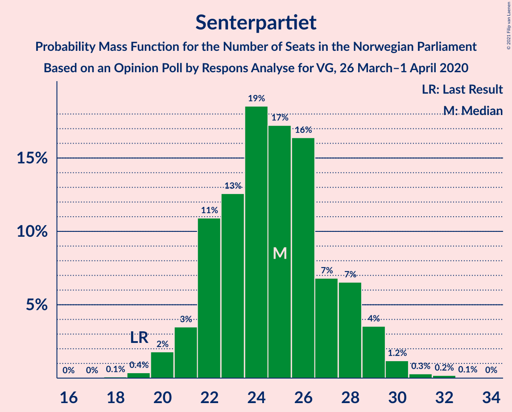
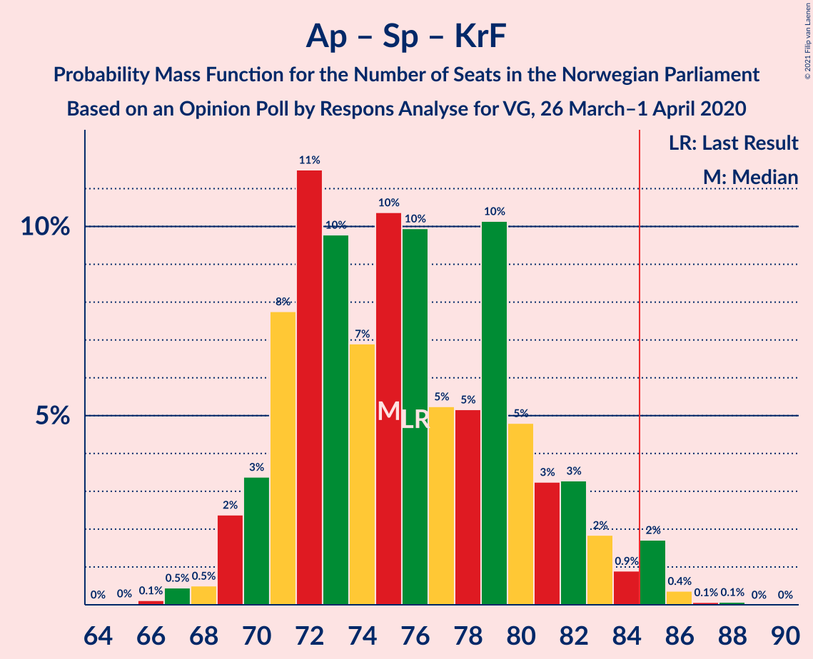
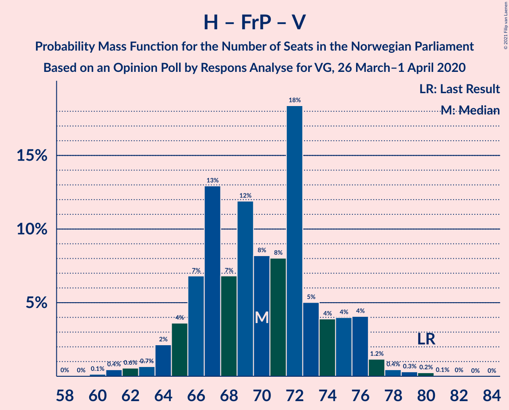
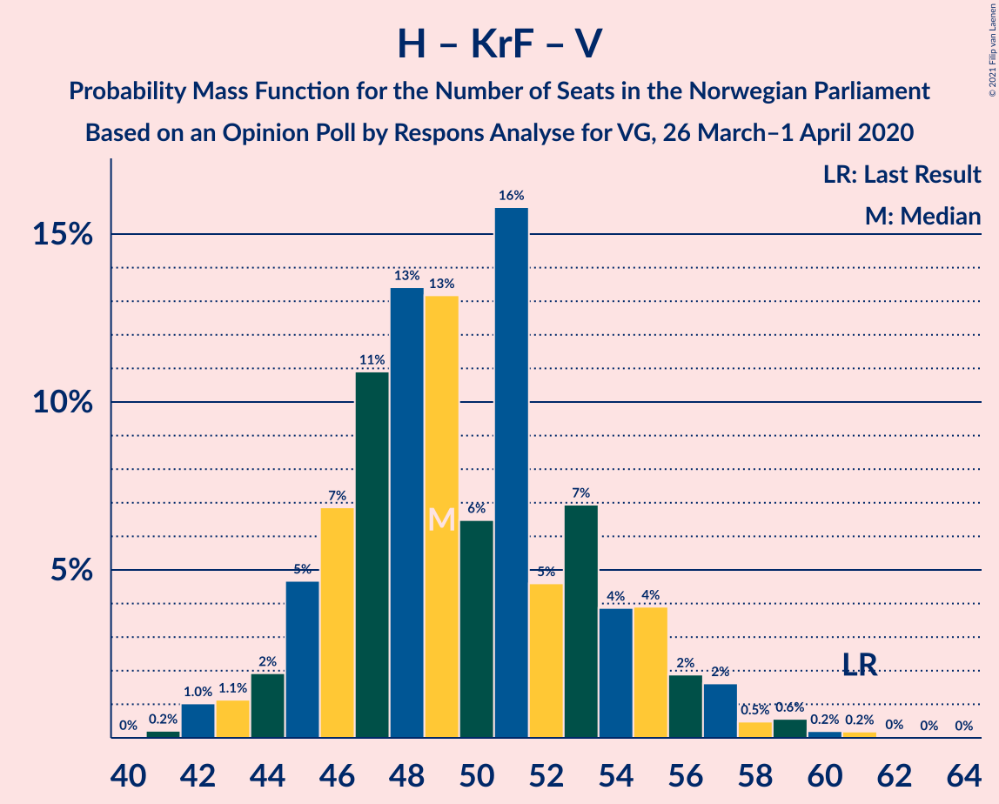

# Opinion Poll by Respons Analyse for VG, 26 March–1 April 2020

<a href="#voting-intentions">Voting Intentions</a> | <a href="#seats">Seats</a> | <a href="#coalitions">Coalitions</a> | <a href="#technical-information">Technical Information</a>

## Voting Intentions

### Confidence Intervals

| Party | Last Result | Poll Result | 80% Confidence Interval | 90% Confidence Interval | 95% Confidence Interval | 99% Confidence Interval |
|:-----:|:-----------:|:-----------:|:-----------------------:|:-----------------------:|:-----------------------:|:-----------------------:|
| Arbeiderpartiet | 27.4% | 26.7% | 25.0–28.6% |24.5–29.1% |24.1–29.5% |23.2–30.4% |
| Høyre | 25.0% | 25.2% | 23.5–27.0% |23.0–27.5% |22.6–28.0% |21.8–28.9% |
| Senterpartiet | 10.3% | 13.5% | 12.2–15.0% |11.8–15.4% |11.5–15.8% |10.9–16.5% |
| Fremskrittspartiet | 15.2% | 12.4% | 11.1–13.8% |10.8–14.2% |10.5–14.6% |9.9–15.3% |
| Sosialistisk Venstreparti | 6.0% | 7.3% | 6.3–8.5% |6.1–8.8% |5.8–9.1% |5.4–9.7% |
| Miljøpartiet De Grønne | 3.2% | 4.2% | 3.5–5.1% |3.3–5.4% |3.1–5.6% |2.8–6.1% |
| Rødt | 2.4% | 3.5% | 2.9–4.4% |2.7–4.6% |2.5–4.8% |2.2–5.3% |
| Kristelig Folkeparti | 4.2% | 3.2% | 2.6–4.0% |2.4–4.3% |2.3–4.5% |2.0–4.9% |
| Venstre | 4.4% | 2.8% | 2.2–3.6% |2.1–3.8% |1.9–4.0% |1.7–4.4% |

*Note:* The poll result column reflects the actual value used in the calculations. Published results may vary slightly, and in addition be rounded to fewer digits.

## Seats

### Confidence Intervals

| Party | Last Result | Median | 80% Confidence Interval | 90% Confidence Interval | 95% Confidence Interval | 99% Confidence Interval |
|:-----:|:-----------:|:------:|:-----------------------:|:-----------------------:|:-----------------------:|:-----------------------:|
| <a href="#arbeiderpartiet">Arbeiderpartiet</a> | 49 | 47 | 45–55 |44–55 |43–55 |42–56 |
| <a href="#høyre">Høyre</a> | 45 | 47 | 43–49 |42–50 |41–51 |39–54 |
| <a href="#senterpartiet">Senterpartiet</a> | 19 | 25 | 22–28 |21–28 |21–28 |20–32 |
| <a href="#fremskrittspartiet">Fremskrittspartiet</a> | 27 | 23 | 20–26 |20–26 |19–27 |18–28 |
| <a href="#sosialistisk-venstreparti">Sosialistisk Venstreparti</a> | 11 | 15 | 12–15 |11–16 |11–16 |10–18 |
| <a href="#miljøpartiet-de-grønne">Miljøpartiet De Grønne</a> | 1 | 8 | 2–9 |1–9 |1–9 |1–10 |
| <a href="#rødt">Rødt</a> | 1 | 2 | 2–7 |1–8 |1–8 |1–9 |
| <a href="#kristelig-folkeparti">Kristelig Folkeparti</a> | 8 | 2 | 1–7 |0–8 |0–8 |0–8 |
| <a href="#venstre">Venstre</a> | 8 | 2 | 1–2 |1–2 |1–2 |1–7 |

### Arbeiderpartiet

*For a full overview of the results for this party, see the [Arbeiderpartiet](party-arbeiderpartiet.html) page.*

| Number of Seats | Probability | Accumulated | Special Marks |
|:---------------:|:-----------:|:-----------:|:-------------:|
| 40 | 0.1% | 100% |  |
| 41 | 0.1% | 99.9% |  |
| 42 | 2% | 99.8% |  |
| 43 | 2% | 98% |  |
| 44 | 3% | 96% |  |
| 45 | 34% | 93% |  |
| 46 | 8% | 60% |  |
| 47 | 4% | 52% | Median |
| 48 | 5% | 47% |  |
| 49 | 13% | 42% | Last Result |
| 50 | 9% | 29% |  |
| 51 | 3% | 20% |  |
| 52 | 3% | 17% |  |
| 53 | 4% | 14% |  |
| 54 | 0.6% | 11% |  |
| 55 | 9% | 10% |  |
| 56 | 0.9% | 1.1% |  |
| 57 | 0.1% | 0.2% |  |
| 58 | 0.1% | 0.1% |  |
| 59 | 0% | 0% |  |

### Høyre

*For a full overview of the results for this party, see the [Høyre](party-høyre.html) page.*

| Number of Seats | Probability | Accumulated | Special Marks |
|:---------------:|:-----------:|:-----------:|:-------------:|
| 38 | 0.1% | 100% |  |
| 39 | 0.6% | 99.9% |  |
| 40 | 0.2% | 99.3% |  |
| 41 | 3% | 99.2% |  |
| 42 | 4% | 97% |  |
| 43 | 3% | 93% |  |
| 44 | 13% | 90% |  |
| 45 | 5% | 76% | Last Result |
| 46 | 5% | 71% |  |
| 47 | 46% | 66% | Median |
| 48 | 10% | 21% |  |
| 49 | 1.4% | 11% |  |
| 50 | 5% | 10% |  |
| 51 | 4% | 5% |  |
| 52 | 0.1% | 1.2% |  |
| 53 | 0.3% | 1.1% |  |
| 54 | 0.8% | 0.8% |  |
| 55 | 0% | 0% |  |

### Senterpartiet

*For a full overview of the results for this party, see the [Senterpartiet](party-senterpartiet.html) page.*

| Number of Seats | Probability | Accumulated | Special Marks |
|:---------------:|:-----------:|:-----------:|:-------------:|
| 18 | 0.1% | 100% |  |
| 19 | 0.2% | 99.9% | Last Result |
| 20 | 1.4% | 99.8% |  |
| 21 | 5% | 98% |  |
| 22 | 14% | 93% |  |
| 23 | 6% | 79% |  |
| 24 | 10% | 73% |  |
| 25 | 35% | 63% | Median |
| 26 | 9% | 28% |  |
| 27 | 4% | 18% |  |
| 28 | 12% | 14% |  |
| 29 | 2% | 2% |  |
| 30 | 0.1% | 0.9% |  |
| 31 | 0.1% | 0.7% |  |
| 32 | 0.6% | 0.6% |  |
| 33 | 0% | 0% |  |

### Fremskrittspartiet

*For a full overview of the results for this party, see the [Fremskrittspartiet](party-fremskrittspartiet.html) page.*

| Number of Seats | Probability | Accumulated | Special Marks |
|:---------------:|:-----------:|:-----------:|:-------------:|
| 17 | 0.4% | 100% |  |
| 18 | 0.8% | 99.6% |  |
| 19 | 2% | 98.8% |  |
| 20 | 11% | 96% |  |
| 21 | 3% | 85% |  |
| 22 | 8% | 82% |  |
| 23 | 44% | 74% | Median |
| 24 | 6% | 30% |  |
| 25 | 5% | 24% |  |
| 26 | 15% | 19% |  |
| 27 | 1.1% | 3% | Last Result |
| 28 | 2% | 2% |  |
| 29 | 0.2% | 0.3% |  |
| 30 | 0.1% | 0.1% |  |
| 31 | 0% | 0% |  |

### Sosialistisk Venstreparti

*For a full overview of the results for this party, see the [Sosialistisk Venstreparti](party-sosialistiskvenstreparti.html) page.*

| Number of Seats | Probability | Accumulated | Special Marks |
|:---------------:|:-----------:|:-----------:|:-------------:|
| 9 | 0.3% | 100% |  |
| 10 | 2% | 99.7% |  |
| 11 | 3% | 98% | Last Result |
| 12 | 7% | 94% |  |
| 13 | 8% | 88% |  |
| 14 | 25% | 79% |  |
| 15 | 48% | 54% | Median |
| 16 | 4% | 6% |  |
| 17 | 1.1% | 2% |  |
| 18 | 0.6% | 0.7% |  |
| 19 | 0.1% | 0.1% |  |
| 20 | 0% | 0% |  |

### Miljøpartiet De Grønne

*For a full overview of the results for this party, see the [Miljøpartiet De Grønne](party-miljøpartietdegrønne.html) page.*

| Number of Seats | Probability | Accumulated | Special Marks |
|:---------------:|:-----------:|:-----------:|:-------------:|
| 1 | 6% | 100% | Last Result |
| 2 | 27% | 94% |  |
| 3 | 5% | 68% |  |
| 4 | 0% | 62% |  |
| 5 | 0% | 62% |  |
| 6 | 0% | 62% |  |
| 7 | 2% | 62% |  |
| 8 | 50% | 60% | Median |
| 9 | 9% | 11% |  |
| 10 | 1.3% | 2% |  |
| 11 | 0.2% | 0.3% |  |
| 12 | 0% | 0% |  |

### Rødt

*For a full overview of the results for this party, see the [Rødt](party-rødt.html) page.*

| Number of Seats | Probability | Accumulated | Special Marks |
|:---------------:|:-----------:|:-----------:|:-------------:|
| 1 | 7% | 100% | Last Result |
| 2 | 82% | 93% | Median |
| 3 | 0% | 11% |  |
| 4 | 0% | 11% |  |
| 5 | 0% | 11% |  |
| 6 | 0% | 11% |  |
| 7 | 5% | 11% |  |
| 8 | 5% | 6% |  |
| 9 | 0.6% | 1.0% |  |
| 10 | 0.3% | 0.3% |  |
| 11 | 0% | 0.1% |  |
| 12 | 0% | 0% |  |

### Kristelig Folkeparti

*For a full overview of the results for this party, see the [Kristelig Folkeparti](party-kristeligfolkeparti.html) page.*

| Number of Seats | Probability | Accumulated | Special Marks |
|:---------------:|:-----------:|:-----------:|:-------------:|
| 0 | 5% | 100% |  |
| 1 | 27% | 95% |  |
| 2 | 45% | 68% | Median |
| 3 | 12% | 22% |  |
| 4 | 0% | 11% |  |
| 5 | 0% | 11% |  |
| 6 | 0% | 11% |  |
| 7 | 4% | 11% |  |
| 8 | 6% | 6% | Last Result |
| 9 | 0.3% | 0.5% |  |
| 10 | 0.2% | 0.2% |  |
| 11 | 0% | 0% |  |

### Venstre

*For a full overview of the results for this party, see the [Venstre](party-venstre.html) page.*

| Number of Seats | Probability | Accumulated | Special Marks |
|:---------------:|:-----------:|:-----------:|:-------------:|
| 0 | 0.1% | 100% |  |
| 1 | 15% | 99.9% |  |
| 2 | 84% | 84% | Median |
| 3 | 0% | 0.7% |  |
| 4 | 0% | 0.7% |  |
| 5 | 0% | 0.7% |  |
| 6 | 0% | 0.7% |  |
| 7 | 0.6% | 0.7% |  |
| 8 | 0% | 0% | Last Result |

## Coalitions

### Confidence Intervals

| Coalition | Last Result | Median | Majority? | 80% Confidence Interval | 90% Confidence Interval | 95% Confidence Interval | 99% Confidence Interval |
|:---------:|:-----------:|:------:|:---------:|:-----------------------:|:-----------------------:|:-----------------------:|:-----------------------:|
| Høyre – Senterpartiet – Fremskrittspartiet – Kristelig Folkeparti – Venstre | 107 | 99 | 100% | 95–101 | 92–103 | 92–104 | 90–106 |
| Arbeiderpartiet – Senterpartiet – Sosialistisk Venstreparti – Miljøpartiet De Grønne – Kristelig Folkeparti | 88 | 95 | 100% | 92–98 | 91–100 | 90–101 | 88–103 |
| Arbeiderpartiet – Senterpartiet – Sosialistisk Venstreparti – Miljøpartiet De Grønne – Rødt | 81 | 95 | 99.9% | 92–99 | 90–100 | 89–101 | 88–102 |
| Arbeiderpartiet – Senterpartiet – Sosialistisk Venstreparti – Miljøpartiet De Grønne | 80 | 93 | 99.3% | 90–94 | 89–97 | 87–98 | 83–99 |
| Arbeiderpartiet – Senterpartiet – Sosialistisk Venstreparti – Rødt | 80 | 87 | 94% | 85–94 | 84–96 | 83–98 | 82–99 |
| Arbeiderpartiet – Senterpartiet – Sosialistisk Venstreparti | 79 | 85 | 84% | 83–92 | 82–92 | 81–92 | 77–97 |
| Arbeiderpartiet – Senterpartiet – Miljøpartiet De Grønne – Kristelig Folkeparti | 77 | 80 | 9% | 78–84 | 77–86 | 76–87 | 73–90 |
| Høyre – Fremskrittspartiet – Miljøpartiet De Grønne – Kristelig Folkeparti – Venstre | 89 | 82 | 6% | 75–84 | 73–85 | 71–86 | 70–87 |
| Arbeiderpartiet – Senterpartiet – Kristelig Folkeparti | 76 | 75 | 0.6% | 71–79 | 69–82 | 69–82 | 67–85 |
| Høyre – Fremskrittspartiet – Kristelig Folkeparti – Venstre | 88 | 74 | 0.1% | 70–77 | 69–79 | 68–80 | 67–81 |
| Arbeiderpartiet – Senterpartiet | 68 | 70 | 0% | 69–77 | 68–79 | 68–79 | 66–82 |
| Høyre – Fremskrittspartiet – Venstre | 80 | 72 | 0% | 68–75 | 66–76 | 65–76 | 62–78 |
| Høyre – Fremskrittspartiet | 72 | 70 | 0% | 66–73 | 64–74 | 63–74 | 60–76 |
| Arbeiderpartiet – Sosialistisk Venstreparti | 60 | 61 | 0% | 59–67 | 57–69 | 57–69 | 53–71 |
| Høyre – Kristelig Folkeparti – Venstre | 61 | 51 | 0% | 47–54 | 46–56 | 45–56 | 44–59 |
| Senterpartiet – Kristelig Folkeparti – Venstre | 35 | 29 | 0% | 25–32 | 25–34 | 25–35 | 23–36 |

### Høyre – Senterpartiet – Fremskrittspartiet – Kristelig Folkeparti – Venstre

| Number of Seats | Probability | Accumulated | Special Marks |
|:---------------:|:-----------:|:-----------:|:-------------:|
| 86 | 0% | 100% |  |
| 87 | 0% | 99.9% |  |
| 88 | 0% | 99.9% |  |
| 89 | 0.2% | 99.9% |  |
| 90 | 0.5% | 99.7% |  |
| 91 | 2% | 99.1% |  |
| 92 | 3% | 98% |  |
| 93 | 0.9% | 95% |  |
| 94 | 3% | 94% |  |
| 95 | 2% | 90% |  |
| 96 | 12% | 88% |  |
| 97 | 5% | 77% |  |
| 98 | 6% | 72% |  |
| 99 | 38% | 66% | Median |
| 100 | 2% | 27% |  |
| 101 | 18% | 25% |  |
| 102 | 2% | 7% |  |
| 103 | 2% | 5% |  |
| 104 | 1.2% | 3% |  |
| 105 | 0.1% | 2% |  |
| 106 | 1.0% | 1.4% |  |
| 107 | 0.1% | 0.5% | Last Result |
| 108 | 0.3% | 0.3% |  |
| 109 | 0% | 0.1% |  |
| 110 | 0% | 0% |  |

### Arbeiderpartiet – Senterpartiet – Sosialistisk Venstreparti – Miljøpartiet De Grønne – Kristelig Folkeparti

| Number of Seats | Probability | Accumulated | Special Marks |
|:---------------:|:-----------:|:-----------:|:-------------:|
| 85 | 0.1% | 100% | Majority |
| 86 | 0.2% | 99.9% |  |
| 87 | 0.1% | 99.7% |  |
| 88 | 0.5% | 99.6% | Last Result |
| 89 | 0.6% | 99.0% |  |
| 90 | 1.4% | 98% |  |
| 91 | 5% | 97% |  |
| 92 | 10% | 92% |  |
| 93 | 2% | 83% |  |
| 94 | 2% | 81% |  |
| 95 | 55% | 79% |  |
| 96 | 5% | 24% |  |
| 97 | 5% | 18% | Median |
| 98 | 5% | 14% |  |
| 99 | 3% | 8% |  |
| 100 | 2% | 5% |  |
| 101 | 3% | 4% |  |
| 102 | 0.3% | 0.9% |  |
| 103 | 0% | 0.5% |  |
| 104 | 0.2% | 0.5% |  |
| 105 | 0.3% | 0.3% |  |
| 106 | 0% | 0% |  |

### Arbeiderpartiet – Senterpartiet – Sosialistisk Venstreparti – Miljøpartiet De Grønne – Rødt

| Number of Seats | Probability | Accumulated | Special Marks |
|:---------------:|:-----------:|:-----------:|:-------------:|
| 81 | 0% | 100% | Last Result |
| 82 | 0% | 100% |  |
| 83 | 0% | 100% |  |
| 84 | 0.1% | 100% |  |
| 85 | 0% | 99.9% | Majority |
| 86 | 0% | 99.9% |  |
| 87 | 0.2% | 99.9% |  |
| 88 | 0.6% | 99.7% |  |
| 89 | 2% | 99.0% |  |
| 90 | 2% | 97% |  |
| 91 | 0.7% | 95% |  |
| 92 | 4% | 94% |  |
| 93 | 6% | 90% |  |
| 94 | 6% | 84% |  |
| 95 | 45% | 78% |  |
| 96 | 18% | 33% |  |
| 97 | 2% | 15% | Median |
| 98 | 2% | 13% |  |
| 99 | 4% | 11% |  |
| 100 | 3% | 7% |  |
| 101 | 2% | 4% |  |
| 102 | 2% | 2% |  |
| 103 | 0.1% | 0.5% |  |
| 104 | 0.2% | 0.3% |  |
| 105 | 0.1% | 0.2% |  |
| 106 | 0% | 0.1% |  |
| 107 | 0.1% | 0.1% |  |
| 108 | 0% | 0% |  |

### Arbeiderpartiet – Senterpartiet – Sosialistisk Venstreparti – Miljøpartiet De Grønne

| Number of Seats | Probability | Accumulated | Special Marks |
|:---------------:|:-----------:|:-----------:|:-------------:|
| 80 | 0% | 100% | Last Result |
| 81 | 0.1% | 100% |  |
| 82 | 0.4% | 99.9% |  |
| 83 | 0.1% | 99.5% |  |
| 84 | 0.2% | 99.4% |  |
| 85 | 0.3% | 99.3% | Majority |
| 86 | 0.8% | 99.0% |  |
| 87 | 2% | 98% |  |
| 88 | 1.3% | 96% |  |
| 89 | 5% | 95% |  |
| 90 | 5% | 91% |  |
| 91 | 8% | 86% |  |
| 92 | 6% | 78% |  |
| 93 | 44% | 72% |  |
| 94 | 19% | 27% |  |
| 95 | 2% | 9% | Median |
| 96 | 0.5% | 7% |  |
| 97 | 2% | 6% |  |
| 98 | 3% | 4% |  |
| 99 | 2% | 2% |  |
| 100 | 0.1% | 0.3% |  |
| 101 | 0.2% | 0.2% |  |
| 102 | 0% | 0% |  |

### Arbeiderpartiet – Senterpartiet – Sosialistisk Venstreparti – Rødt

| Number of Seats | Probability | Accumulated | Special Marks |
|:---------------:|:-----------:|:-----------:|:-------------:|
| 79 | 0.2% | 100% |  |
| 80 | 0.1% | 99.8% | Last Result |
| 81 | 0.1% | 99.7% |  |
| 82 | 2% | 99.6% |  |
| 83 | 0.4% | 98% |  |
| 84 | 4% | 97% |  |
| 85 | 6% | 94% | Majority |
| 86 | 0.9% | 88% |  |
| 87 | 40% | 87% |  |
| 88 | 3% | 46% |  |
| 89 | 1.2% | 44% | Median |
| 90 | 2% | 42% |  |
| 91 | 4% | 40% |  |
| 92 | 6% | 36% |  |
| 93 | 9% | 30% |  |
| 94 | 15% | 20% |  |
| 95 | 0.5% | 6% |  |
| 96 | 2% | 5% |  |
| 97 | 0.2% | 3% |  |
| 98 | 0.6% | 3% |  |
| 99 | 2% | 2% |  |
| 100 | 0.2% | 0.2% |  |
| 101 | 0% | 0% |  |

### Arbeiderpartiet – Senterpartiet – Sosialistisk Venstreparti

| Number of Seats | Probability | Accumulated | Special Marks |
|:---------------:|:-----------:|:-----------:|:-------------:|
| 76 | 0.2% | 100% |  |
| 77 | 0.7% | 99.8% |  |
| 78 | 0% | 99.1% |  |
| 79 | 0.3% | 99.1% | Last Result |
| 80 | 0.8% | 98.8% |  |
| 81 | 2% | 98% |  |
| 82 | 4% | 96% |  |
| 83 | 6% | 92% |  |
| 84 | 2% | 86% |  |
| 85 | 40% | 84% | Majority |
| 86 | 4% | 45% |  |
| 87 | 3% | 41% | Median |
| 88 | 3% | 37% |  |
| 89 | 4% | 34% |  |
| 90 | 7% | 31% |  |
| 91 | 10% | 24% |  |
| 92 | 12% | 14% |  |
| 93 | 0.4% | 2% |  |
| 94 | 0% | 1.4% |  |
| 95 | 0.2% | 1.4% |  |
| 96 | 0.1% | 1.2% |  |
| 97 | 1.0% | 1.0% |  |
| 98 | 0% | 0% |  |

### Arbeiderpartiet – Senterpartiet – Miljøpartiet De Grønne – Kristelig Folkeparti

| Number of Seats | Probability | Accumulated | Special Marks |
|:---------------:|:-----------:|:-----------:|:-------------:|
| 72 | 0% | 100% |  |
| 73 | 0.5% | 99.9% |  |
| 74 | 0% | 99.5% |  |
| 75 | 0.7% | 99.4% |  |
| 76 | 2% | 98.7% |  |
| 77 | 5% | 97% | Last Result |
| 78 | 7% | 92% |  |
| 79 | 3% | 85% |  |
| 80 | 47% | 82% |  |
| 81 | 10% | 35% |  |
| 82 | 1.2% | 25% | Median |
| 83 | 5% | 24% |  |
| 84 | 10% | 19% |  |
| 85 | 2% | 9% | Majority |
| 86 | 1.4% | 6% |  |
| 87 | 3% | 5% |  |
| 88 | 0.2% | 2% |  |
| 89 | 0.2% | 1.5% |  |
| 90 | 0.8% | 1.3% |  |
| 91 | 0% | 0.5% |  |
| 92 | 0.3% | 0.5% |  |
| 93 | 0% | 0.2% |  |
| 94 | 0.2% | 0.2% |  |
| 95 | 0% | 0% |  |

### Høyre – Fremskrittspartiet – Miljøpartiet De Grønne – Kristelig Folkeparti – Venstre

| Number of Seats | Probability | Accumulated | Special Marks |
|:---------------:|:-----------:|:-----------:|:-------------:|
| 69 | 0.2% | 100% |  |
| 70 | 2% | 99.8% |  |
| 71 | 0.6% | 98% |  |
| 72 | 0.2% | 97% |  |
| 73 | 2% | 97% |  |
| 74 | 0.5% | 95% |  |
| 75 | 15% | 94% |  |
| 76 | 9% | 80% |  |
| 77 | 6% | 70% |  |
| 78 | 4% | 64% |  |
| 79 | 2% | 60% |  |
| 80 | 1.2% | 58% |  |
| 81 | 3% | 56% |  |
| 82 | 40% | 54% | Median |
| 83 | 0.9% | 13% |  |
| 84 | 6% | 12% |  |
| 85 | 4% | 6% | Majority |
| 86 | 0.4% | 3% |  |
| 87 | 2% | 2% |  |
| 88 | 0.1% | 0.4% |  |
| 89 | 0.1% | 0.3% | Last Result |
| 90 | 0.2% | 0.2% |  |
| 91 | 0% | 0% |  |

### Arbeiderpartiet – Senterpartiet – Kristelig Folkeparti

| Number of Seats | Probability | Accumulated | Special Marks |
|:---------------:|:-----------:|:-----------:|:-------------:|
| 66 | 0% | 100% |  |
| 67 | 0.5% | 99.9% |  |
| 68 | 0.2% | 99.5% |  |
| 69 | 5% | 99.3% |  |
| 70 | 0.3% | 95% |  |
| 71 | 7% | 94% |  |
| 72 | 33% | 88% |  |
| 73 | 1.5% | 55% |  |
| 74 | 2% | 53% | Median |
| 75 | 5% | 51% |  |
| 76 | 10% | 46% | Last Result |
| 77 | 3% | 36% |  |
| 78 | 11% | 33% |  |
| 79 | 13% | 22% |  |
| 80 | 3% | 10% |  |
| 81 | 1.4% | 7% |  |
| 82 | 4% | 5% |  |
| 83 | 0.3% | 1.4% |  |
| 84 | 0.5% | 1.1% |  |
| 85 | 0.3% | 0.6% | Majority |
| 86 | 0.2% | 0.3% |  |
| 87 | 0.1% | 0.1% |  |
| 88 | 0% | 0% |  |

### Høyre – Fremskrittspartiet – Kristelig Folkeparti – Venstre

| Number of Seats | Probability | Accumulated | Special Marks |
|:---------------:|:-----------:|:-----------:|:-------------:|
| 62 | 0.1% | 100% |  |
| 63 | 0% | 99.9% |  |
| 64 | 0.1% | 99.9% |  |
| 65 | 0.2% | 99.8% |  |
| 66 | 0.1% | 99.7% |  |
| 67 | 2% | 99.5% |  |
| 68 | 2% | 98% |  |
| 69 | 3% | 96% |  |
| 70 | 4% | 93% |  |
| 71 | 2% | 89% |  |
| 72 | 2% | 87% |  |
| 73 | 18% | 85% |  |
| 74 | 45% | 67% | Median |
| 75 | 6% | 22% |  |
| 76 | 6% | 16% |  |
| 77 | 4% | 10% |  |
| 78 | 0.7% | 6% |  |
| 79 | 2% | 5% |  |
| 80 | 2% | 3% |  |
| 81 | 0.6% | 1.0% |  |
| 82 | 0.2% | 0.3% |  |
| 83 | 0% | 0.1% |  |
| 84 | 0% | 0.1% |  |
| 85 | 0.1% | 0.1% | Majority |
| 86 | 0% | 0% |  |
| 87 | 0% | 0% |  |
| 88 | 0% | 0% | Last Result |

### Arbeiderpartiet – Senterpartiet

| Number of Seats | Probability | Accumulated | Special Marks |
|:---------------:|:-----------:|:-----------:|:-------------:|
| 62 | 0.1% | 100% |  |
| 63 | 0% | 99.9% |  |
| 64 | 0.2% | 99.9% |  |
| 65 | 0.2% | 99.8% |  |
| 66 | 0.5% | 99.6% |  |
| 67 | 0.6% | 99.1% |  |
| 68 | 6% | 98% | Last Result |
| 69 | 8% | 92% |  |
| 70 | 35% | 84% |  |
| 71 | 6% | 50% |  |
| 72 | 1.5% | 44% | Median |
| 73 | 0.9% | 43% |  |
| 74 | 8% | 42% |  |
| 75 | 1.4% | 34% |  |
| 76 | 6% | 32% |  |
| 77 | 19% | 26% |  |
| 78 | 0.3% | 7% |  |
| 79 | 5% | 7% |  |
| 80 | 0.8% | 2% |  |
| 81 | 0.9% | 2% |  |
| 82 | 0.2% | 0.6% |  |
| 83 | 0.4% | 0.4% |  |
| 84 | 0% | 0% |  |

### Høyre – Fremskrittspartiet – Venstre

| Number of Seats | Probability | Accumulated | Special Marks |
|:---------------:|:-----------:|:-----------:|:-------------:|
| 58 | 0.1% | 100% |  |
| 59 | 0% | 99.9% |  |
| 60 | 0% | 99.8% |  |
| 61 | 0.1% | 99.8% |  |
| 62 | 0.3% | 99.8% |  |
| 63 | 0.4% | 99.4% |  |
| 64 | 0.1% | 99.0% |  |
| 65 | 2% | 98.9% |  |
| 66 | 5% | 97% |  |
| 67 | 2% | 92% |  |
| 68 | 4% | 91% |  |
| 69 | 7% | 86% |  |
| 70 | 1.5% | 79% |  |
| 71 | 9% | 78% |  |
| 72 | 53% | 69% | Median |
| 73 | 1.3% | 16% |  |
| 74 | 2% | 15% |  |
| 75 | 6% | 13% |  |
| 76 | 5% | 7% |  |
| 77 | 0.6% | 1.3% |  |
| 78 | 0.5% | 0.7% |  |
| 79 | 0.1% | 0.2% |  |
| 80 | 0% | 0.1% | Last Result |
| 81 | 0.1% | 0.1% |  |
| 82 | 0% | 0% |  |

### Høyre – Fremskrittspartiet

| Number of Seats | Probability | Accumulated | Special Marks |
|:---------------:|:-----------:|:-----------:|:-------------:|
| 56 | 0.1% | 100% |  |
| 57 | 0% | 99.9% |  |
| 58 | 0% | 99.8% |  |
| 59 | 0% | 99.8% |  |
| 60 | 0.3% | 99.8% |  |
| 61 | 0.5% | 99.4% |  |
| 62 | 0.1% | 99.0% |  |
| 63 | 2% | 98.8% |  |
| 64 | 5% | 97% |  |
| 65 | 2% | 92% |  |
| 66 | 4% | 90% |  |
| 67 | 7% | 86% |  |
| 68 | 2% | 79% |  |
| 69 | 8% | 77% |  |
| 70 | 42% | 69% | Median |
| 71 | 13% | 28% |  |
| 72 | 2% | 15% | Last Result |
| 73 | 6% | 13% |  |
| 74 | 6% | 8% |  |
| 75 | 0.6% | 2% |  |
| 76 | 0.8% | 1.3% |  |
| 77 | 0.3% | 0.5% |  |
| 78 | 0% | 0.1% |  |
| 79 | 0% | 0.1% |  |
| 80 | 0.1% | 0.1% |  |
| 81 | 0% | 0% |  |

### Arbeiderpartiet – Sosialistisk Venstreparti

| Number of Seats | Probability | Accumulated | Special Marks |
|:---------------:|:-----------:|:-----------:|:-------------:|
| 52 | 0.3% | 100% |  |
| 53 | 0.5% | 99.7% |  |
| 54 | 0.5% | 99.2% |  |
| 55 | 0.2% | 98.7% |  |
| 56 | 0.3% | 98.5% |  |
| 57 | 4% | 98% |  |
| 58 | 3% | 94% |  |
| 59 | 3% | 91% |  |
| 60 | 35% | 88% | Last Result |
| 61 | 4% | 54% |  |
| 62 | 10% | 50% | Median |
| 63 | 2% | 40% |  |
| 64 | 18% | 38% |  |
| 65 | 6% | 20% |  |
| 66 | 4% | 14% |  |
| 67 | 1.0% | 10% |  |
| 68 | 0.8% | 9% |  |
| 69 | 8% | 9% |  |
| 70 | 0.1% | 0.9% |  |
| 71 | 0.6% | 0.7% |  |
| 72 | 0% | 0.1% |  |
| 73 | 0% | 0.1% |  |
| 74 | 0.1% | 0.1% |  |
| 75 | 0% | 0% |  |

### Høyre – Kristelig Folkeparti – Venstre

| Number of Seats | Probability | Accumulated | Special Marks |
|:---------------:|:-----------:|:-----------:|:-------------:|
| 42 | 0% | 100% |  |
| 43 | 0.2% | 99.9% |  |
| 44 | 2% | 99.7% |  |
| 45 | 3% | 98% |  |
| 46 | 0.5% | 95% |  |
| 47 | 11% | 95% |  |
| 48 | 4% | 83% |  |
| 49 | 6% | 80% |  |
| 50 | 5% | 73% |  |
| 51 | 47% | 69% | Median |
| 52 | 2% | 21% |  |
| 53 | 8% | 19% |  |
| 54 | 4% | 11% |  |
| 55 | 0.9% | 7% |  |
| 56 | 4% | 6% |  |
| 57 | 0.4% | 2% |  |
| 58 | 0.9% | 2% |  |
| 59 | 1.0% | 1.0% |  |
| 60 | 0% | 0.1% |  |
| 61 | 0% | 0% | Last Result |

### Senterpartiet – Kristelig Folkeparti – Venstre

| Number of Seats | Probability | Accumulated | Special Marks |
|:---------------:|:-----------:|:-----------:|:-------------:|
| 22 | 0.2% | 100% |  |
| 23 | 0.7% | 99.7% |  |
| 24 | 0.6% | 99.0% |  |
| 25 | 12% | 98% |  |
| 26 | 5% | 87% |  |
| 27 | 8% | 82% |  |
| 28 | 9% | 75% |  |
| 29 | 36% | 66% | Median |
| 30 | 5% | 30% |  |
| 31 | 13% | 25% |  |
| 32 | 4% | 12% |  |
| 33 | 1.0% | 8% |  |
| 34 | 4% | 7% |  |
| 35 | 3% | 3% | Last Result |
| 36 | 0.3% | 0.6% |  |
| 37 | 0.1% | 0.4% |  |
| 38 | 0.1% | 0.2% |  |
| 39 | 0.1% | 0.2% |  |
| 40 | 0.1% | 0.1% |  |
| 41 | 0% | 0% |  |

## Technical Information

### Opinion Poll

+ **Polling firm:** Respons Analyse
+ **Commissioner(s):** VG
+ **Fieldwork period:** 26 March–1 April 2020

### Calculations

+ **Sample size:** 1000
+ **Simulations done:** 131,072
+ **Error estimate:** 1.40%

