# Opinion Poll by Opinion Perduco, 31 March–5 April 2020

<a href="#voting-intentions">Voting Intentions</a> | <a href="#seats">Seats</a> | <a href="#coalitions">Coalitions</a> | <a href="#technical-information">Technical Information</a>

## Voting Intentions

### Confidence Intervals

| Party | Last Result | Poll Result | 80% Confidence Interval | 90% Confidence Interval | 95% Confidence Interval | 99% Confidence Interval |
|:-----:|:-----------:|:-----------:|:-----------------------:|:-----------------------:|:-----------------------:|:-----------------------:|
| Høyre | 25.0% | 27.3% | 25.5–29.2% |25.0–29.7% |24.6–30.1% |23.8–31.1% |
| Arbeiderpartiet | 27.4% | 25.7% | 24.0–27.5% |23.5–28.1% |23.1–28.5% |22.3–29.4% |
| Senterpartiet | 10.3% | 13.8% | 12.5–15.3% |12.1–15.7% |11.8–16.1% |11.2–16.8% |
| Fremskrittspartiet | 15.2% | 11.6% | 10.4–13.0% |10.0–13.4% |9.8–13.7% |9.2–14.4% |
| Sosialistisk Venstreparti | 6.0% | 5.9% | 5.0–7.0% |4.8–7.3% |4.6–7.5% |4.2–8.1% |
| Miljøpartiet De Grønne | 3.2% | 4.7% | 3.9–5.7% |3.7–6.0% |3.6–6.2% |3.2–6.7% |
| Rødt | 2.4% | 3.7% | 3.0–4.6% |2.9–4.8% |2.7–5.1% |2.4–5.5% |
| Kristelig Folkeparti | 4.2% | 3.0% | 2.4–3.8% |2.2–4.1% |2.1–4.3% |1.9–4.7% |
| Venstre | 4.4% | 2.9% | 2.3–3.7% |2.2–3.9% |2.0–4.1% |1.8–4.6% |

*Note:* The poll result column reflects the actual value used in the calculations. Published results may vary slightly, and in addition be rounded to fewer digits.

## Seats

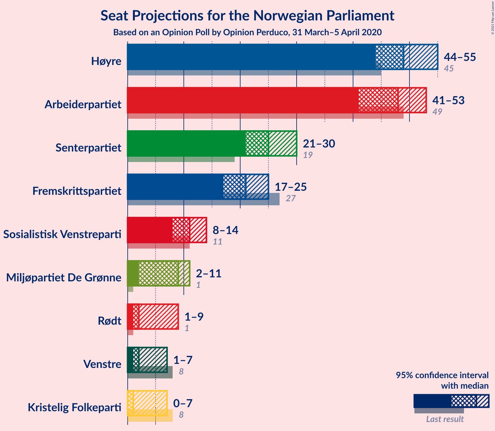

### Confidence Intervals

| Party | Last Result | Median | 80% Confidence Interval | 90% Confidence Interval | 95% Confidence Interval | 99% Confidence Interval |
|:-----:|:-----------:|:------:|:-----------------------:|:-----------------------:|:-----------------------:|:-----------------------:|
| <a href="#høyre">Høyre</a> | 45 | 51 | 46–54 |46–55 |45–56 |43–56 |
| <a href="#arbeiderpartiet">Arbeiderpartiet</a> | 49 | 44 | 43–49 |43–51 |43–53 |42–55 |
| <a href="#senterpartiet">Senterpartiet</a> | 19 | 26 | 22–28 |22–29 |21–30 |21–31 |
| <a href="#fremskrittspartiet">Fremskrittspartiet</a> | 27 | 20 | 19–23 |18–23 |18–24 |17–26 |
| <a href="#sosialistisk-venstreparti">Sosialistisk Venstreparti</a> | 11 | 11 | 9–12 |9–12 |8–13 |8–14 |
| <a href="#miljøpartiet-de-grønne">Miljøpartiet De Grønne</a> | 1 | 8 | 3–10 |2–10 |2–11 |1–12 |
| <a href="#rødt">Rødt</a> | 1 | 7 | 1–8 |1–9 |1–9 |1–10 |
| <a href="#kristelig-folkeparti">Kristelig Folkeparti</a> | 8 | 3 | 1–7 |1–7 |0–7 |0–8 |
| <a href="#venstre">Venstre</a> | 8 | 2 | 1–2 |1–2 |1–2 |1–2 |

### Høyre

*For a full overview of the results for this party, see the [Høyre](party-høyre.html) page.*

| Number of Seats | Probability | Accumulated | Special Marks |
|:---------------:|:-----------:|:-----------:|:-------------:|
| 41 | 0% | 100% |  |
| 42 | 0.1% | 99.9% |  |
| 43 | 1.3% | 99.8% |  |
| 44 | 0.9% | 98% |  |
| 45 | 1.4% | 98% | Last Result |
| 46 | 10% | 96% |  |
| 47 | 24% | 87% |  |
| 48 | 2% | 63% |  |
| 49 | 6% | 61% |  |
| 50 | 2% | 55% |  |
| 51 | 15% | 53% | Median |
| 52 | 5% | 38% |  |
| 53 | 8% | 33% |  |
| 54 | 17% | 25% |  |
| 55 | 4% | 9% |  |
| 56 | 4% | 4% |  |
| 57 | 0.1% | 0.2% |  |
| 58 | 0% | 0% |  |

### Arbeiderpartiet

*For a full overview of the results for this party, see the [Arbeiderpartiet](party-arbeiderpartiet.html) page.*

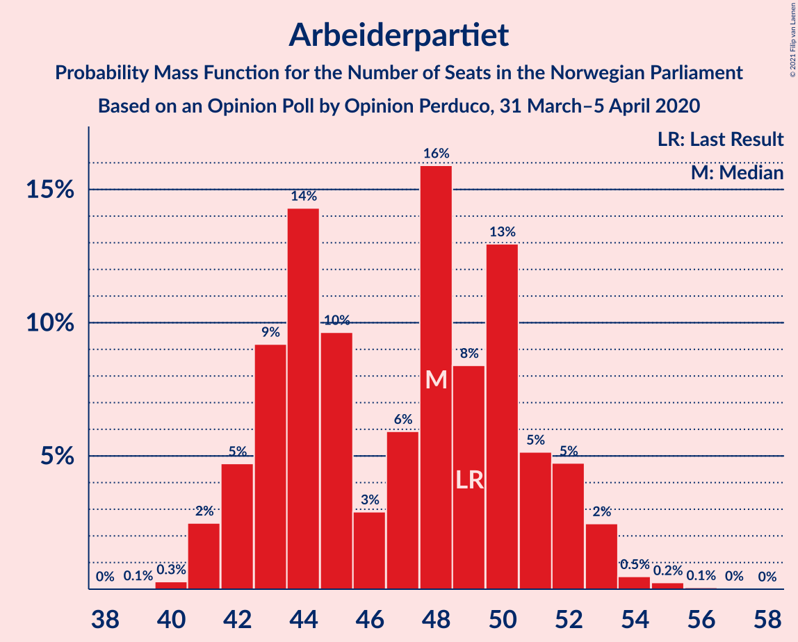

| Number of Seats | Probability | Accumulated | Special Marks |
|:---------------:|:-----------:|:-----------:|:-------------:|
| 40 | 0.1% | 100% |  |
| 41 | 0% | 99.9% |  |
| 42 | 0.4% | 99.9% |  |
| 43 | 17% | 99.5% |  |
| 44 | 38% | 83% | Median |
| 45 | 22% | 45% |  |
| 46 | 8% | 24% |  |
| 47 | 5% | 16% |  |
| 48 | 0.2% | 10% |  |
| 49 | 4% | 10% | Last Result |
| 50 | 0.3% | 6% |  |
| 51 | 0.8% | 5% |  |
| 52 | 1.3% | 5% |  |
| 53 | 1.1% | 3% |  |
| 54 | 1.1% | 2% |  |
| 55 | 0.9% | 1.2% |  |
| 56 | 0.3% | 0.3% |  |
| 57 | 0% | 0% |  |

### Senterpartiet

*For a full overview of the results for this party, see the [Senterpartiet](party-senterpartiet.html) page.*

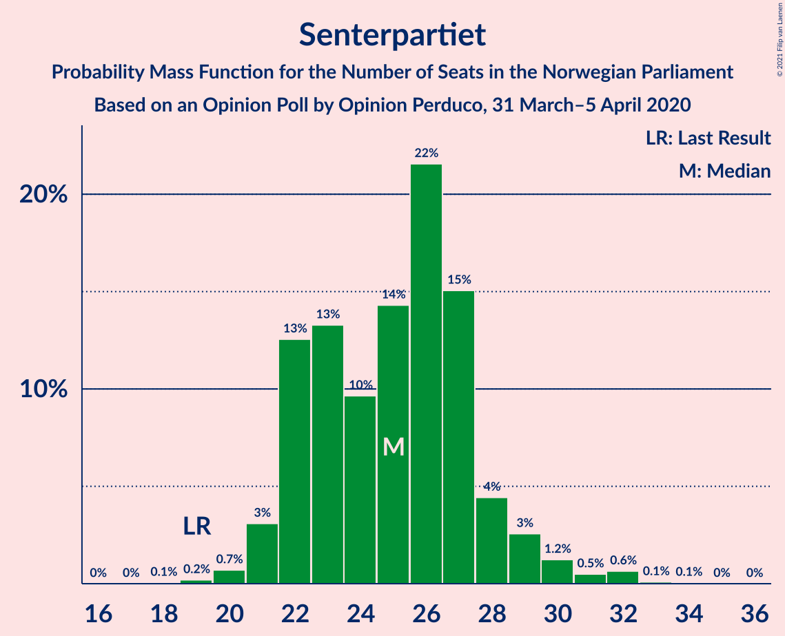

| Number of Seats | Probability | Accumulated | Special Marks |
|:---------------:|:-----------:|:-----------:|:-------------:|
| 19 | 0% | 100% | Last Result |
| 20 | 0.3% | 100% |  |
| 21 | 4% | 99.7% |  |
| 22 | 13% | 95% |  |
| 23 | 12% | 82% |  |
| 24 | 6% | 70% |  |
| 25 | 11% | 64% |  |
| 26 | 10% | 53% | Median |
| 27 | 30% | 43% |  |
| 28 | 5% | 12% |  |
| 29 | 3% | 7% |  |
| 30 | 3% | 4% |  |
| 31 | 0.5% | 0.8% |  |
| 32 | 0.1% | 0.3% |  |
| 33 | 0.1% | 0.2% |  |
| 34 | 0% | 0% |  |

### Fremskrittspartiet

*For a full overview of the results for this party, see the [Fremskrittspartiet](party-fremskrittspartiet.html) page.*

| Number of Seats | Probability | Accumulated | Special Marks |
|:---------------:|:-----------:|:-----------:|:-------------:|
| 16 | 0.1% | 100% |  |
| 17 | 2% | 99.8% |  |
| 18 | 6% | 98% |  |
| 19 | 34% | 91% |  |
| 20 | 22% | 57% | Median |
| 21 | 15% | 35% |  |
| 22 | 9% | 20% |  |
| 23 | 7% | 11% |  |
| 24 | 1.3% | 4% |  |
| 25 | 1.4% | 2% |  |
| 26 | 0.6% | 1.0% |  |
| 27 | 0.2% | 0.4% | Last Result |
| 28 | 0.1% | 0.2% |  |
| 29 | 0% | 0% |  |

### Sosialistisk Venstreparti

*For a full overview of the results for this party, see the [Sosialistisk Venstreparti](party-sosialistiskvenstreparti.html) page.*

| Number of Seats | Probability | Accumulated | Special Marks |
|:---------------:|:-----------:|:-----------:|:-------------:|
| 2 | 0.1% | 100% |  |
| 3 | 0% | 99.9% |  |
| 4 | 0% | 99.9% |  |
| 5 | 0% | 99.9% |  |
| 6 | 0% | 99.9% |  |
| 7 | 0.1% | 99.9% |  |
| 8 | 3% | 99.9% |  |
| 9 | 21% | 97% |  |
| 10 | 21% | 76% |  |
| 11 | 28% | 55% | Last Result, Median |
| 12 | 24% | 27% |  |
| 13 | 2% | 3% |  |
| 14 | 0.8% | 1.0% |  |
| 15 | 0.2% | 0.2% |  |
| 16 | 0% | 0% |  |

### Miljøpartiet De Grønne

*For a full overview of the results for this party, see the [Miljøpartiet De Grønne](party-miljøpartietdegrønne.html) page.*

| Number of Seats | Probability | Accumulated | Special Marks |
|:---------------:|:-----------:|:-----------:|:-------------:|
| 1 | 0.9% | 100% | Last Result |
| 2 | 8% | 99.1% |  |
| 3 | 1.2% | 91% |  |
| 4 | 0.2% | 90% |  |
| 5 | 0% | 90% |  |
| 6 | 0% | 90% |  |
| 7 | 10% | 90% |  |
| 8 | 44% | 79% | Median |
| 9 | 20% | 35% |  |
| 10 | 11% | 15% |  |
| 11 | 3% | 3% |  |
| 12 | 0.7% | 0.8% |  |
| 13 | 0% | 0% |  |

### Rødt

*For a full overview of the results for this party, see the [Rødt](party-rødt.html) page.*

| Number of Seats | Probability | Accumulated | Special Marks |
|:---------------:|:-----------:|:-----------:|:-------------:|
| 1 | 14% | 100% | Last Result |
| 2 | 28% | 86% |  |
| 3 | 0% | 58% |  |
| 4 | 0% | 58% |  |
| 5 | 0% | 58% |  |
| 6 | 0% | 58% |  |
| 7 | 42% | 58% | Median |
| 8 | 9% | 17% |  |
| 9 | 7% | 8% |  |
| 10 | 0.6% | 0.6% |  |
| 11 | 0.1% | 0.1% |  |
| 12 | 0% | 0% |  |

### Kristelig Folkeparti

*For a full overview of the results for this party, see the [Kristelig Folkeparti](party-kristeligfolkeparti.html) page.*

| Number of Seats | Probability | Accumulated | Special Marks |
|:---------------:|:-----------:|:-----------:|:-------------:|
| 0 | 4% | 100% |  |
| 1 | 21% | 96% |  |
| 2 | 8% | 75% |  |
| 3 | 53% | 67% | Median |
| 4 | 0% | 14% |  |
| 5 | 0% | 14% |  |
| 6 | 0% | 14% |  |
| 7 | 12% | 14% |  |
| 8 | 2% | 2% | Last Result |
| 9 | 0.2% | 0.2% |  |
| 10 | 0% | 0% |  |

### Venstre

*For a full overview of the results for this party, see the [Venstre](party-venstre.html) page.*

| Number of Seats | Probability | Accumulated | Special Marks |
|:---------------:|:-----------:|:-----------:|:-------------:|
| 0 | 0.5% | 100% |  |
| 1 | 26% | 99.5% |  |
| 2 | 73% | 74% | Median |
| 3 | 0% | 0.5% |  |
| 4 | 0% | 0.5% |  |
| 5 | 0% | 0.5% |  |
| 6 | 0% | 0.5% |  |
| 7 | 0.3% | 0.5% |  |
| 8 | 0.2% | 0.2% | Last Result |
| 9 | 0% | 0% |  |

## Coalitions

### Confidence Intervals

| Coalition | Last Result | Median | Majority? | 80% Confidence Interval | 90% Confidence Interval | 95% Confidence Interval | 99% Confidence Interval |
|:---------:|:-----------:|:------:|:---------:|:-----------------------:|:-----------------------:|:-----------------------:|:-----------------------:|
| Høyre – Senterpartiet – Fremskrittspartiet – Kristelig Folkeparti – Venstre | 107 | 101 | 100% | 95–105 | 94–108 | 94–109 | 91–110 |
| Arbeiderpartiet – Senterpartiet – Sosialistisk Venstreparti – Miljøpartiet De Grønne – Rødt | 81 | 94 | 99.8% | 89–99 | 87–100 | 85–100 | 85–103 |
| Arbeiderpartiet – Senterpartiet – Sosialistisk Venstreparti – Miljøpartiet De Grønne – Kristelig Folkeparti | 88 | 93 | 98.9% | 86–96 | 86–96 | 85–98 | 84–102 |
| Arbeiderpartiet – Senterpartiet – Sosialistisk Venstreparti – Miljøpartiet De Grønne | 80 | 90 | 78% | 83–93 | 83–94 | 82–96 | 82–99 |
| Arbeiderpartiet – Senterpartiet – Sosialistisk Venstreparti – Rødt | 80 | 86 | 54% | 81–90 | 80–92 | 80–93 | 78–98 |
| Høyre – Fremskrittspartiet – Miljøpartiet De Grønne – Kristelig Folkeparti – Venstre | 89 | 83 | 46% | 79–88 | 77–89 | 76–89 | 71–91 |
| Arbeiderpartiet – Senterpartiet – Sosialistisk Venstreparti | 79 | 82 | 11% | 75–85 | 75–87 | 75–89 | 75–91 |
| Arbeiderpartiet – Senterpartiet – Miljøpartiet De Grønne – Kristelig Folkeparti | 77 | 82 | 21% | 77–85 | 77–87 | 75–88 | 74–91 |
| Høyre – Fremskrittspartiet – Kristelig Folkeparti – Venstre | 88 | 75 | 0.2% | 70–80 | 69–82 | 69–84 | 66–84 |
| Arbeiderpartiet – Senterpartiet – Kristelig Folkeparti | 76 | 74 | 0% | 69–77 | 69–78 | 69–80 | 67–83 |
| Høyre – Fremskrittspartiet – Venstre | 80 | 72 | 0% | 67–77 | 67–79 | 66–80 | 64–81 |
| Arbeiderpartiet – Senterpartiet | 68 | 71 | 0% | 66–73 | 66–78 | 66–79 | 66–81 |
| Høyre – Fremskrittspartiet | 72 | 70 | 0% | 66–75 | 65–77 | 64–78 | 62–79 |
| Arbeiderpartiet – Sosialistisk Venstreparti | 60 | 56 | 0% | 53–59 | 52–61 | 52–64 | 52–65 |
| Høyre – Kristelig Folkeparti – Venstre | 61 | 55 | 0% | 51–59 | 49–60 | 48–61 | 46–61 |
| Senterpartiet – Kristelig Folkeparti – Venstre | 35 | 30 | 0% | 27–33 | 26–34 | 26–34 | 25–38 |

### Høyre – Senterpartiet – Fremskrittspartiet – Kristelig Folkeparti – Venstre

| Number of Seats | Probability | Accumulated | Special Marks |
|:---------------:|:-----------:|:-----------:|:-------------:|
| 87 | 0.3% | 100% |  |
| 88 | 0% | 99.7% |  |
| 89 | 0.1% | 99.7% |  |
| 90 | 0% | 99.6% |  |
| 91 | 0.5% | 99.5% |  |
| 92 | 0.4% | 99.0% |  |
| 93 | 0.8% | 98.6% |  |
| 94 | 3% | 98% |  |
| 95 | 6% | 94% |  |
| 96 | 4% | 88% |  |
| 97 | 4% | 84% |  |
| 98 | 19% | 80% |  |
| 99 | 3% | 61% |  |
| 100 | 2% | 58% |  |
| 101 | 12% | 56% |  |
| 102 | 20% | 45% | Median |
| 103 | 3% | 25% |  |
| 104 | 12% | 22% |  |
| 105 | 2% | 10% |  |
| 106 | 3% | 9% |  |
| 107 | 0.7% | 6% | Last Result |
| 108 | 0.7% | 5% |  |
| 109 | 4% | 5% |  |
| 110 | 0.6% | 0.7% |  |
| 111 | 0% | 0.1% |  |
| 112 | 0% | 0.1% |  |
| 113 | 0% | 0% |  |

### Arbeiderpartiet – Senterpartiet – Sosialistisk Venstreparti – Miljøpartiet De Grønne – Rødt

| Number of Seats | Probability | Accumulated | Special Marks |
|:---------------:|:-----------:|:-----------:|:-------------:|
| 81 | 0% | 100% | Last Result |
| 82 | 0% | 100% |  |
| 83 | 0% | 100% |  |
| 84 | 0.2% | 100% |  |
| 85 | 3% | 99.8% | Majority |
| 86 | 0.6% | 96% |  |
| 87 | 3% | 96% |  |
| 88 | 0.8% | 93% |  |
| 89 | 4% | 92% |  |
| 90 | 18% | 88% |  |
| 91 | 7% | 70% |  |
| 92 | 7% | 63% |  |
| 93 | 0.6% | 57% |  |
| 94 | 10% | 56% |  |
| 95 | 8% | 46% |  |
| 96 | 1.2% | 37% | Median |
| 97 | 5% | 36% |  |
| 98 | 20% | 31% |  |
| 99 | 3% | 12% |  |
| 100 | 6% | 8% |  |
| 101 | 1.0% | 2% |  |
| 102 | 0.3% | 1.3% |  |
| 103 | 0.4% | 0.9% |  |
| 104 | 0.1% | 0.5% |  |
| 105 | 0.2% | 0.4% |  |
| 106 | 0.1% | 0.1% |  |
| 107 | 0% | 0% |  |

### Arbeiderpartiet – Senterpartiet – Sosialistisk Venstreparti – Miljøpartiet De Grønne – Kristelig Folkeparti

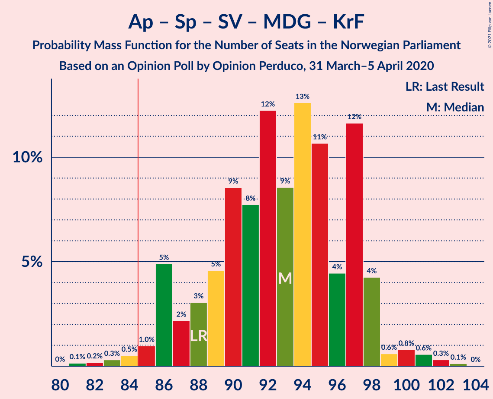

| Number of Seats | Probability | Accumulated | Special Marks |
|:---------------:|:-----------:|:-----------:|:-------------:|
| 81 | 0% | 100% |  |
| 82 | 0% | 99.9% |  |
| 83 | 0.4% | 99.9% |  |
| 84 | 0.6% | 99.5% |  |
| 85 | 2% | 98.9% | Majority |
| 86 | 17% | 97% |  |
| 87 | 2% | 80% |  |
| 88 | 2% | 79% | Last Result |
| 89 | 4% | 76% |  |
| 90 | 4% | 73% |  |
| 91 | 9% | 68% |  |
| 92 | 9% | 59% | Median |
| 93 | 4% | 50% |  |
| 94 | 22% | 46% |  |
| 95 | 7% | 24% |  |
| 96 | 13% | 17% |  |
| 97 | 1.5% | 4% |  |
| 98 | 1.2% | 3% |  |
| 99 | 0.4% | 1.4% |  |
| 100 | 0.3% | 1.0% |  |
| 101 | 0.1% | 0.7% |  |
| 102 | 0.3% | 0.6% |  |
| 103 | 0.3% | 0.4% |  |
| 104 | 0% | 0% |  |

### Arbeiderpartiet – Senterpartiet – Sosialistisk Venstreparti – Miljøpartiet De Grønne

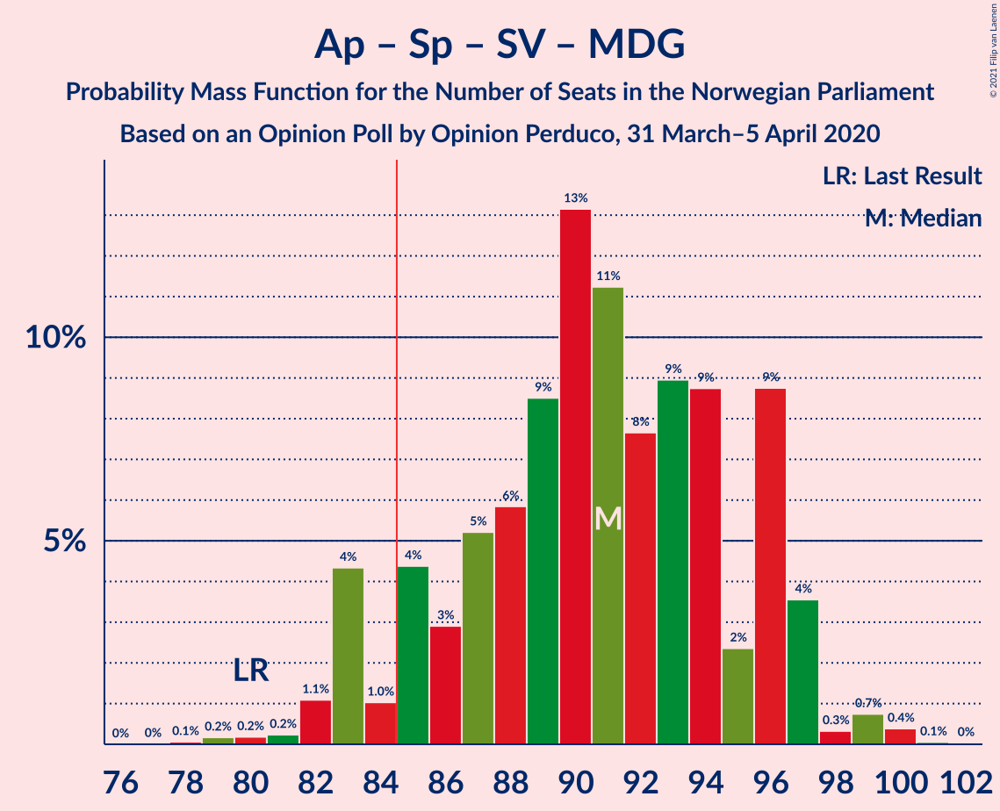

| Number of Seats | Probability | Accumulated | Special Marks |
|:---------------:|:-----------:|:-----------:|:-------------:|
| 79 | 0% | 100% |  |
| 80 | 0% | 99.9% | Last Result |
| 81 | 0% | 99.9% |  |
| 82 | 3% | 99.9% |  |
| 83 | 19% | 97% |  |
| 84 | 0.2% | 78% |  |
| 85 | 3% | 78% | Majority |
| 86 | 4% | 74% |  |
| 87 | 4% | 70% |  |
| 88 | 7% | 66% |  |
| 89 | 2% | 59% | Median |
| 90 | 12% | 57% |  |
| 91 | 22% | 45% |  |
| 92 | 6% | 23% |  |
| 93 | 12% | 17% |  |
| 94 | 0.7% | 5% |  |
| 95 | 2% | 4% |  |
| 96 | 0.7% | 3% |  |
| 97 | 1.3% | 2% |  |
| 98 | 0.3% | 0.8% |  |
| 99 | 0.4% | 0.5% |  |
| 100 | 0% | 0.2% |  |
| 101 | 0% | 0.1% |  |
| 102 | 0.1% | 0.1% |  |
| 103 | 0% | 0% |  |

### Arbeiderpartiet – Senterpartiet – Sosialistisk Venstreparti – Rødt

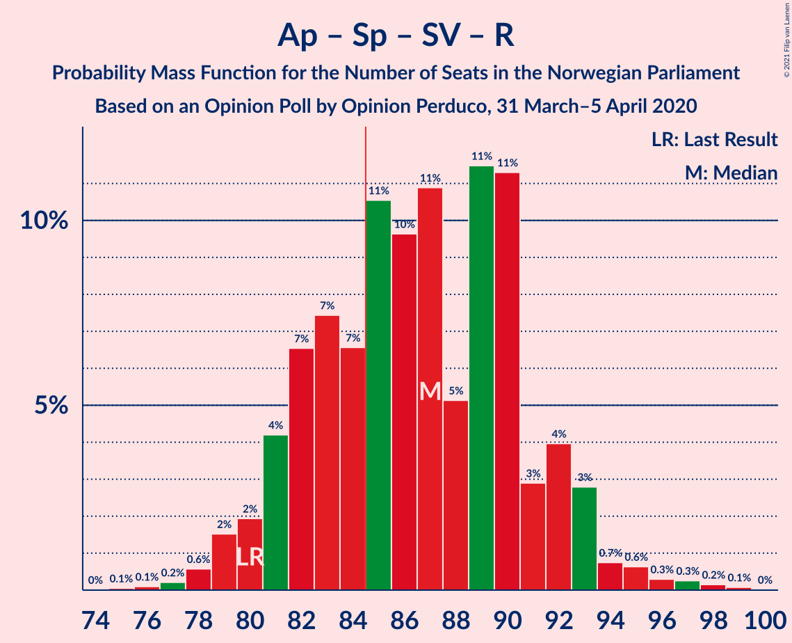

| Number of Seats | Probability | Accumulated | Special Marks |
|:---------------:|:-----------:|:-----------:|:-------------:|
| 77 | 0.1% | 100% |  |
| 78 | 1.5% | 99.8% |  |
| 79 | 0.6% | 98% |  |
| 80 | 4% | 98% | Last Result |
| 81 | 7% | 94% |  |
| 82 | 16% | 87% |  |
| 83 | 5% | 70% |  |
| 84 | 10% | 65% |  |
| 85 | 1.0% | 54% | Majority |
| 86 | 5% | 54% |  |
| 87 | 8% | 49% |  |
| 88 | 4% | 41% | Median |
| 89 | 6% | 37% |  |
| 90 | 22% | 31% |  |
| 91 | 3% | 10% |  |
| 92 | 1.2% | 6% |  |
| 93 | 3% | 5% |  |
| 94 | 0.4% | 2% |  |
| 95 | 0.2% | 1.5% |  |
| 96 | 0.5% | 1.3% |  |
| 97 | 0.2% | 0.8% |  |
| 98 | 0.1% | 0.6% |  |
| 99 | 0.4% | 0.4% |  |
| 100 | 0% | 0.1% |  |
| 101 | 0% | 0% |  |

### Høyre – Fremskrittspartiet – Miljøpartiet De Grønne – Kristelig Folkeparti – Venstre

| Number of Seats | Probability | Accumulated | Special Marks |
|:---------------:|:-----------:|:-----------:|:-------------:|
| 69 | 0% | 100% |  |
| 70 | 0.4% | 99.9% |  |
| 71 | 0.1% | 99.6% |  |
| 72 | 0.2% | 99.4% |  |
| 73 | 0.5% | 99.2% |  |
| 74 | 0.2% | 98.7% |  |
| 75 | 0.4% | 98.5% |  |
| 76 | 3% | 98% |  |
| 77 | 1.2% | 95% |  |
| 78 | 3% | 94% |  |
| 79 | 22% | 90% |  |
| 80 | 6% | 69% |  |
| 81 | 4% | 63% |  |
| 82 | 8% | 59% |  |
| 83 | 5% | 51% |  |
| 84 | 1.0% | 46% | Median |
| 85 | 10% | 46% | Majority |
| 86 | 5% | 35% |  |
| 87 | 16% | 30% |  |
| 88 | 7% | 13% |  |
| 89 | 4% | 6% | Last Result |
| 90 | 0.6% | 2% |  |
| 91 | 1.5% | 2% |  |
| 92 | 0.1% | 0.2% |  |
| 93 | 0% | 0% |  |

### Arbeiderpartiet – Senterpartiet – Sosialistisk Venstreparti

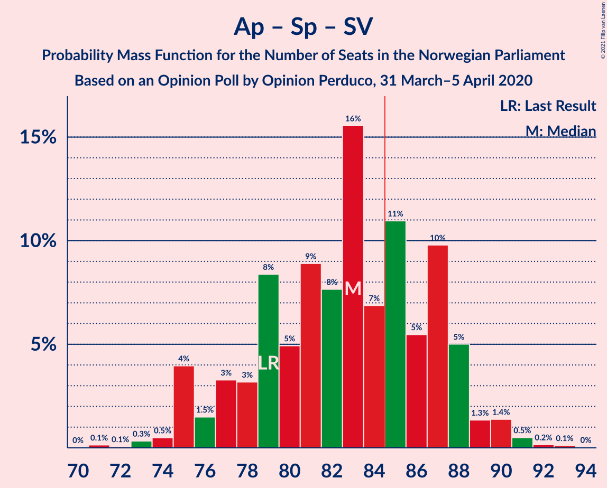

| Number of Seats | Probability | Accumulated | Special Marks |
|:---------------:|:-----------:|:-----------:|:-------------:|
| 73 | 0.1% | 100% |  |
| 74 | 0.3% | 99.9% |  |
| 75 | 16% | 99.5% |  |
| 76 | 2% | 84% |  |
| 77 | 0.2% | 82% |  |
| 78 | 5% | 82% |  |
| 79 | 8% | 77% | Last Result |
| 80 | 10% | 69% |  |
| 81 | 7% | 59% | Median |
| 82 | 8% | 52% |  |
| 83 | 28% | 45% |  |
| 84 | 5% | 16% |  |
| 85 | 3% | 11% | Majority |
| 86 | 2% | 8% |  |
| 87 | 2% | 6% |  |
| 88 | 0.9% | 4% |  |
| 89 | 0.8% | 3% |  |
| 90 | 1.2% | 2% |  |
| 91 | 0.6% | 0.8% |  |
| 92 | 0.1% | 0.2% |  |
| 93 | 0.1% | 0.1% |  |
| 94 | 0% | 0% |  |

### Arbeiderpartiet – Senterpartiet – Miljøpartiet De Grønne – Kristelig Folkeparti

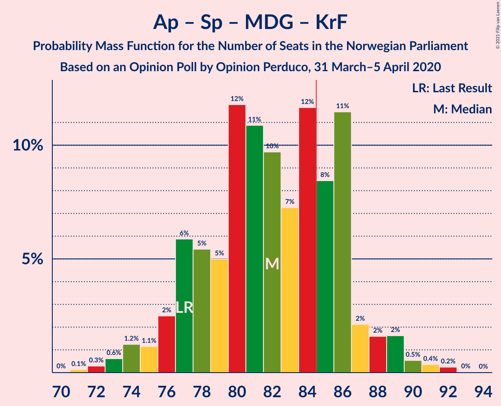

| Number of Seats | Probability | Accumulated | Special Marks |
|:---------------:|:-----------:|:-----------:|:-------------:|
| 72 | 0% | 100% |  |
| 73 | 0.3% | 99.9% |  |
| 74 | 2% | 99.6% |  |
| 75 | 1.0% | 98% |  |
| 76 | 0.9% | 97% |  |
| 77 | 19% | 96% | Last Result |
| 78 | 3% | 77% |  |
| 79 | 5% | 75% |  |
| 80 | 8% | 69% |  |
| 81 | 6% | 61% | Median |
| 82 | 26% | 55% |  |
| 83 | 7% | 30% |  |
| 84 | 1.3% | 23% |  |
| 85 | 15% | 21% | Majority |
| 86 | 1.2% | 7% |  |
| 87 | 2% | 5% |  |
| 88 | 2% | 3% |  |
| 89 | 0.4% | 1.1% |  |
| 90 | 0.1% | 0.7% |  |
| 91 | 0.2% | 0.6% |  |
| 92 | 0.3% | 0.4% |  |
| 93 | 0.1% | 0.1% |  |
| 94 | 0% | 0% |  |

### Høyre – Fremskrittspartiet – Kristelig Folkeparti – Venstre

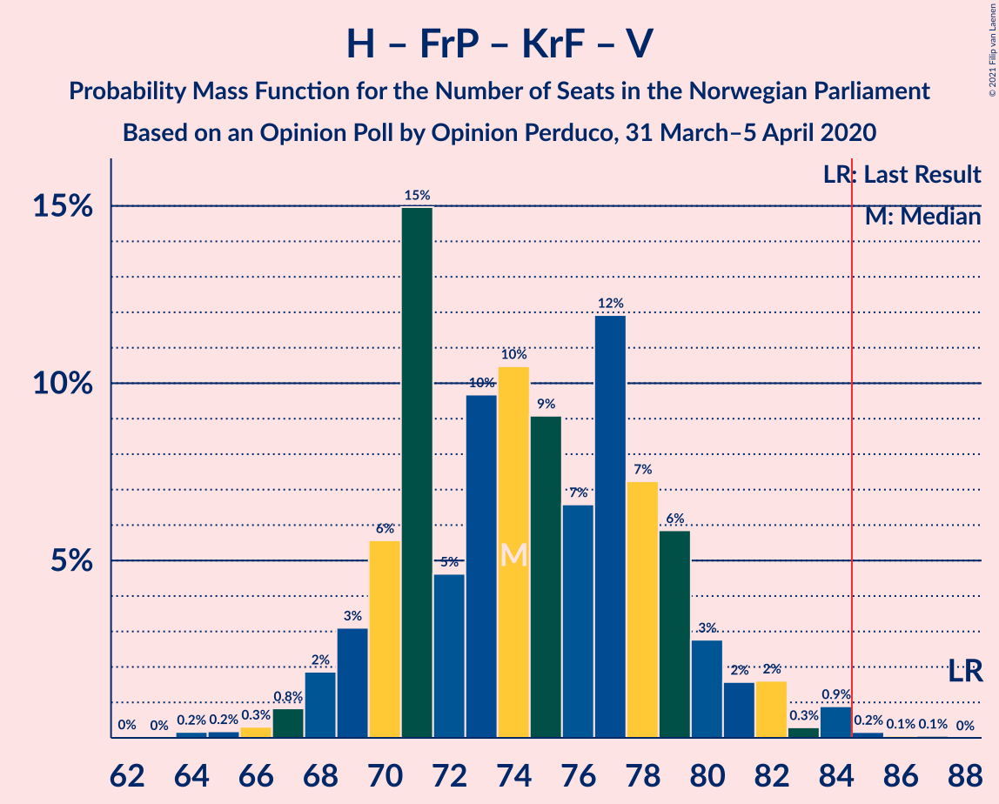

| Number of Seats | Probability | Accumulated | Special Marks |
|:---------------:|:-----------:|:-----------:|:-------------:|
| 63 | 0.1% | 100% |  |
| 64 | 0.2% | 99.9% |  |
| 65 | 0.1% | 99.6% |  |
| 66 | 0.4% | 99.5% |  |
| 67 | 0.3% | 99.1% |  |
| 68 | 1.0% | 98.7% |  |
| 69 | 6% | 98% |  |
| 70 | 3% | 92% |  |
| 71 | 20% | 88% |  |
| 72 | 5% | 69% |  |
| 73 | 1.2% | 64% |  |
| 74 | 8% | 63% |  |
| 75 | 10% | 54% |  |
| 76 | 0.6% | 44% | Median |
| 77 | 7% | 43% |  |
| 78 | 7% | 37% |  |
| 79 | 18% | 30% |  |
| 80 | 4% | 12% |  |
| 81 | 0.8% | 8% |  |
| 82 | 3% | 7% |  |
| 83 | 0.6% | 4% |  |
| 84 | 3% | 4% |  |
| 85 | 0.2% | 0.2% | Majority |
| 86 | 0% | 0% |  |
| 87 | 0% | 0% |  |
| 88 | 0% | 0% | Last Result |

### Arbeiderpartiet – Senterpartiet – Kristelig Folkeparti

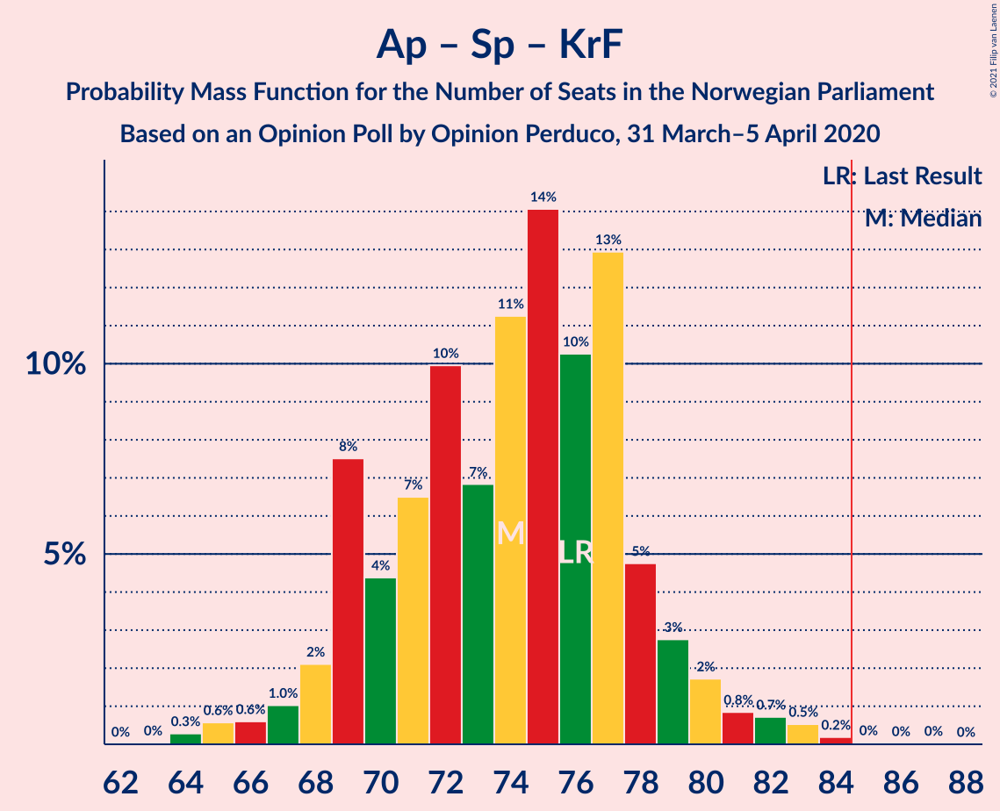

| Number of Seats | Probability | Accumulated | Special Marks |
|:---------------:|:-----------:|:-----------:|:-------------:|
| 64 | 0.1% | 100% |  |
| 65 | 0% | 99.9% |  |
| 66 | 0.1% | 99.9% |  |
| 67 | 0.7% | 99.8% |  |
| 68 | 2% | 99.0% |  |
| 69 | 19% | 98% |  |
| 70 | 2% | 79% |  |
| 71 | 2% | 77% |  |
| 72 | 15% | 75% |  |
| 73 | 3% | 60% | Median |
| 74 | 22% | 57% |  |
| 75 | 10% | 34% |  |
| 76 | 9% | 25% | Last Result |
| 77 | 8% | 16% |  |
| 78 | 3% | 8% |  |
| 79 | 1.1% | 5% |  |
| 80 | 1.5% | 4% |  |
| 81 | 1.0% | 2% |  |
| 82 | 0.6% | 1.2% |  |
| 83 | 0.5% | 0.6% |  |
| 84 | 0% | 0% |  |

### Høyre – Fremskrittspartiet – Venstre

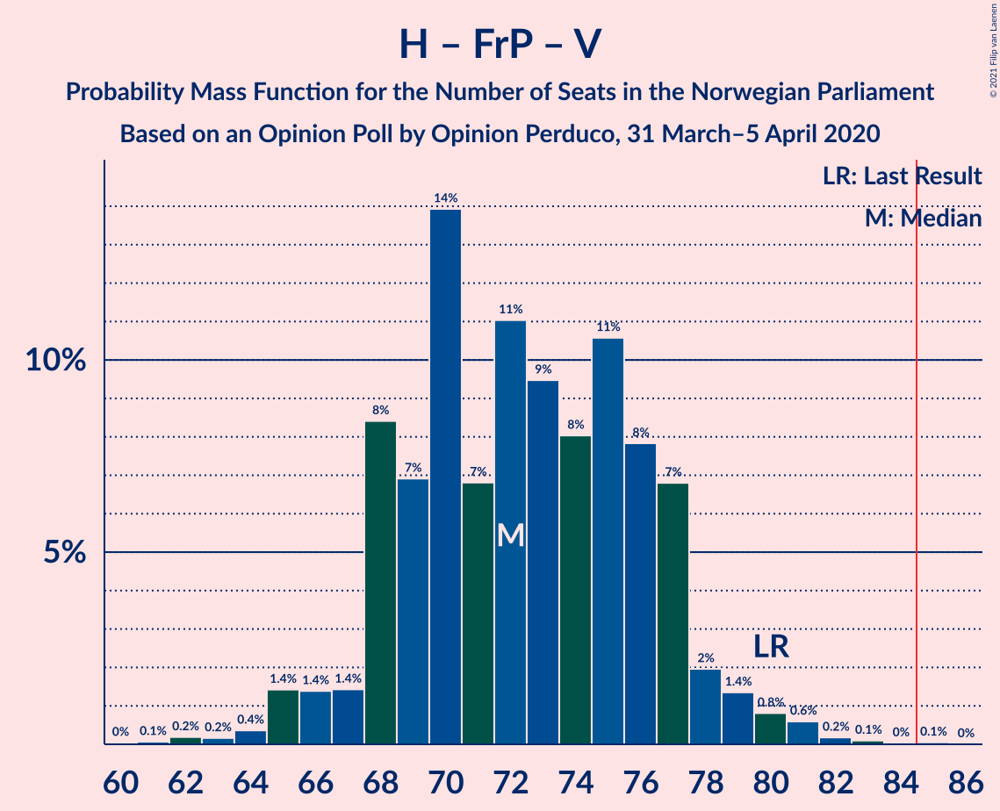

| Number of Seats | Probability | Accumulated | Special Marks |
|:---------------:|:-----------:|:-----------:|:-------------:|
| 62 | 0.1% | 100% |  |
| 63 | 0.3% | 99.8% |  |
| 64 | 0.5% | 99.6% |  |
| 65 | 0.8% | 99.1% |  |
| 66 | 0.9% | 98% |  |
| 67 | 9% | 97% |  |
| 68 | 24% | 89% |  |
| 69 | 2% | 64% |  |
| 70 | 2% | 62% |  |
| 71 | 9% | 61% |  |
| 72 | 9% | 52% |  |
| 73 | 0.6% | 43% | Median |
| 74 | 0.8% | 43% |  |
| 75 | 4% | 42% |  |
| 76 | 26% | 38% |  |
| 77 | 4% | 12% |  |
| 78 | 2% | 7% |  |
| 79 | 2% | 6% |  |
| 80 | 2% | 4% | Last Result |
| 81 | 1.3% | 2% |  |
| 82 | 0.2% | 0.3% |  |
| 83 | 0% | 0% |  |

### Arbeiderpartiet – Senterpartiet

| Number of Seats | Probability | Accumulated | Special Marks |
|:---------------:|:-----------:|:-----------:|:-------------:|
| 63 | 0.1% | 100% |  |
| 64 | 0.1% | 99.9% |  |
| 65 | 0.1% | 99.8% |  |
| 66 | 17% | 99.7% |  |
| 67 | 3% | 83% |  |
| 68 | 3% | 80% | Last Result |
| 69 | 8% | 78% |  |
| 70 | 15% | 69% | Median |
| 71 | 29% | 54% |  |
| 72 | 9% | 25% |  |
| 73 | 9% | 16% |  |
| 74 | 0.5% | 7% |  |
| 75 | 0.5% | 7% |  |
| 76 | 0.6% | 6% |  |
| 77 | 0.5% | 6% |  |
| 78 | 2% | 5% |  |
| 79 | 1.2% | 3% |  |
| 80 | 0.9% | 2% |  |
| 81 | 0.6% | 0.7% |  |
| 82 | 0.1% | 0.1% |  |
| 83 | 0% | 0% |  |

### Høyre – Fremskrittspartiet

| Number of Seats | Probability | Accumulated | Special Marks |
|:---------------:|:-----------:|:-----------:|:-------------:|
| 61 | 0.4% | 100% |  |
| 62 | 0.3% | 99.5% |  |
| 63 | 1.0% | 99.2% |  |
| 64 | 1.0% | 98% |  |
| 65 | 6% | 97% |  |
| 66 | 24% | 91% |  |
| 67 | 5% | 67% |  |
| 68 | 2% | 62% |  |
| 69 | 4% | 61% |  |
| 70 | 13% | 56% |  |
| 71 | 0.8% | 44% | Median |
| 72 | 0.7% | 43% | Last Result |
| 73 | 5% | 42% |  |
| 74 | 13% | 37% |  |
| 75 | 16% | 24% |  |
| 76 | 2% | 8% |  |
| 77 | 2% | 6% |  |
| 78 | 2% | 4% |  |
| 79 | 1.3% | 2% |  |
| 80 | 0.2% | 0.3% |  |
| 81 | 0% | 0% |  |

### Arbeiderpartiet – Sosialistisk Venstreparti

| Number of Seats | Probability | Accumulated | Special Marks |
|:---------------:|:-----------:|:-----------:|:-------------:|
| 49 | 0% | 100% |  |
| 50 | 0% | 99.9% |  |
| 51 | 0.4% | 99.9% |  |
| 52 | 8% | 99.5% |  |
| 53 | 10% | 91% |  |
| 54 | 11% | 81% |  |
| 55 | 11% | 70% | Median |
| 56 | 35% | 59% |  |
| 57 | 13% | 25% |  |
| 58 | 1.4% | 12% |  |
| 59 | 4% | 10% |  |
| 60 | 0.9% | 6% | Last Result |
| 61 | 2% | 5% |  |
| 62 | 0.3% | 3% |  |
| 63 | 0.3% | 3% |  |
| 64 | 1.0% | 3% |  |
| 65 | 1.4% | 2% |  |
| 66 | 0% | 0.1% |  |
| 67 | 0.1% | 0.1% |  |
| 68 | 0% | 0% |  |

### Høyre – Kristelig Folkeparti – Venstre

| Number of Seats | Probability | Accumulated | Special Marks |
|:---------------:|:-----------:|:-----------:|:-------------:|
| 45 | 0.2% | 100% |  |
| 46 | 0.8% | 99.8% |  |
| 47 | 1.0% | 99.0% |  |
| 48 | 1.0% | 98% |  |
| 49 | 3% | 97% |  |
| 50 | 2% | 94% |  |
| 51 | 5% | 92% |  |
| 52 | 23% | 87% |  |
| 53 | 1.4% | 64% |  |
| 54 | 2% | 62% |  |
| 55 | 13% | 60% |  |
| 56 | 9% | 47% | Median |
| 57 | 11% | 38% |  |
| 58 | 11% | 28% |  |
| 59 | 11% | 17% |  |
| 60 | 2% | 6% |  |
| 61 | 4% | 4% | Last Result |
| 62 | 0.3% | 0.4% |  |
| 63 | 0.1% | 0.1% |  |
| 64 | 0% | 0% |  |

### Senterpartiet – Kristelig Folkeparti – Venstre

| Number of Seats | Probability | Accumulated | Special Marks |
|:---------------:|:-----------:|:-----------:|:-------------:|
| 22 | 0.2% | 100% |  |
| 23 | 0.1% | 99.8% |  |
| 24 | 0.1% | 99.7% |  |
| 25 | 2% | 99.6% |  |
| 26 | 3% | 98% |  |
| 27 | 22% | 95% |  |
| 28 | 8% | 73% |  |
| 29 | 6% | 65% |  |
| 30 | 10% | 59% |  |
| 31 | 6% | 50% | Median |
| 32 | 32% | 43% |  |
| 33 | 6% | 12% |  |
| 34 | 4% | 5% |  |
| 35 | 0.3% | 2% | Last Result |
| 36 | 0.3% | 1.2% |  |
| 37 | 0.1% | 1.0% |  |
| 38 | 0.5% | 0.8% |  |
| 39 | 0.1% | 0.3% |  |
| 40 | 0.1% | 0.2% |  |
| 41 | 0% | 0.1% |  |
| 42 | 0.1% | 0.1% |  |
| 43 | 0% | 0% |  |

## Technical Information

### Opinion Poll

+ **Polling firm:** Opinion Perduco
+ **Commissioner(s):** —
+ **Fieldwork period:** 31 March–5 April 2020

### Calculations

+ **Sample size:** 1000
+ **Simulations done:** 131,072
+ **Error estimate:** 2.85%

