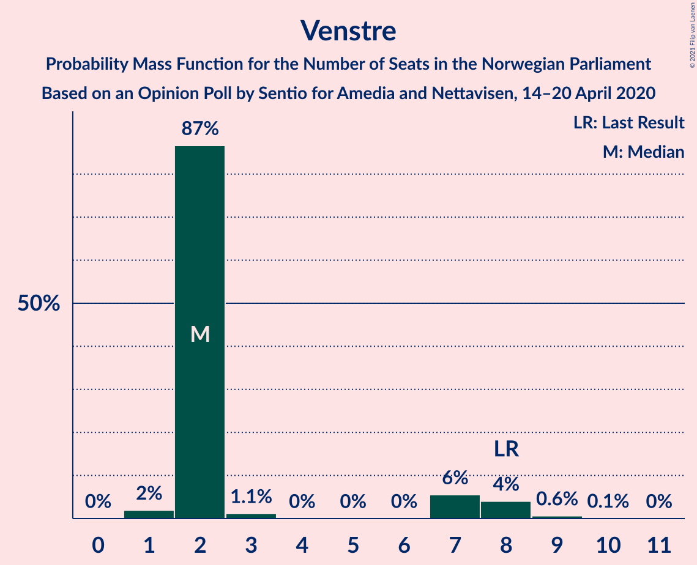
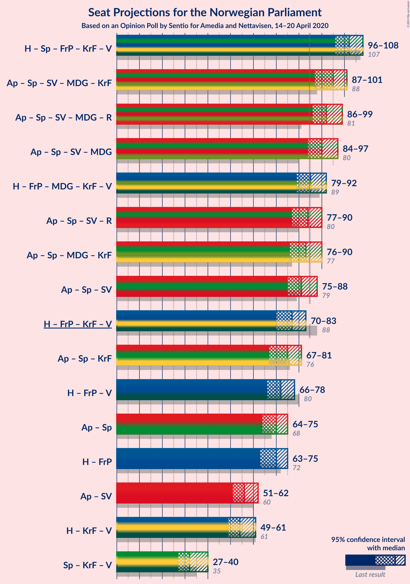
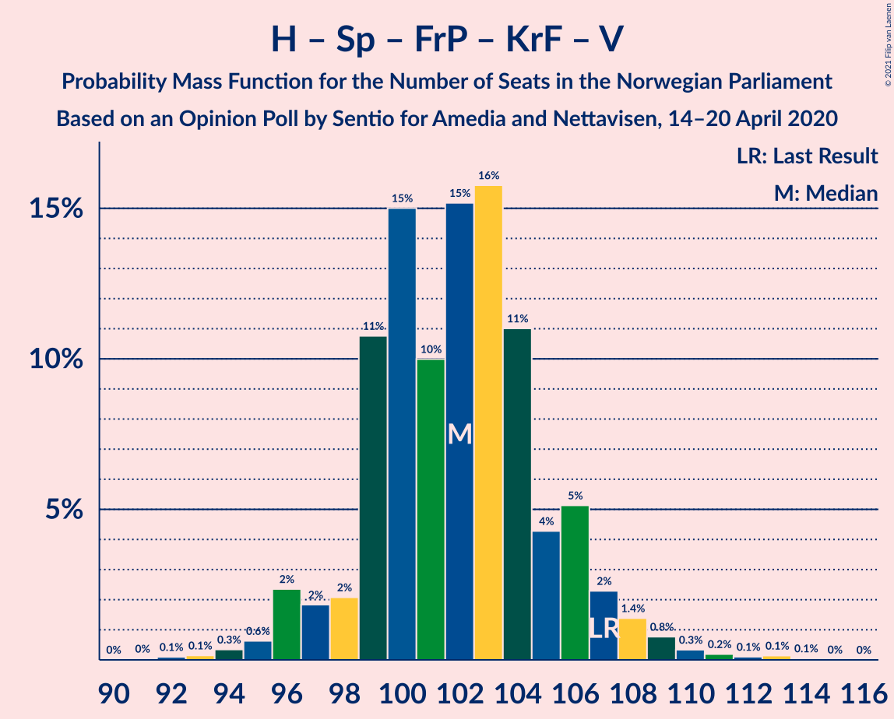
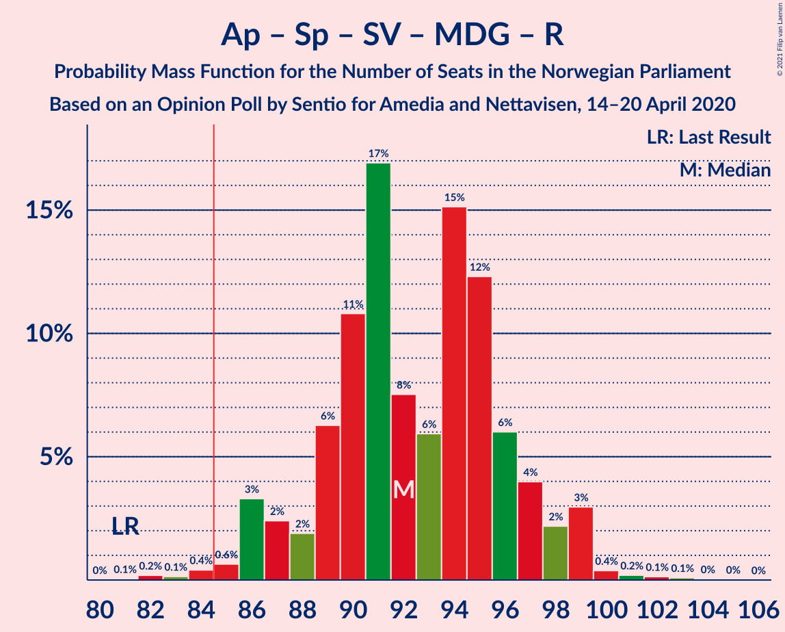
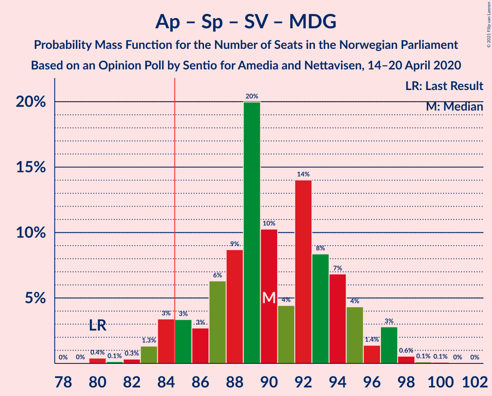
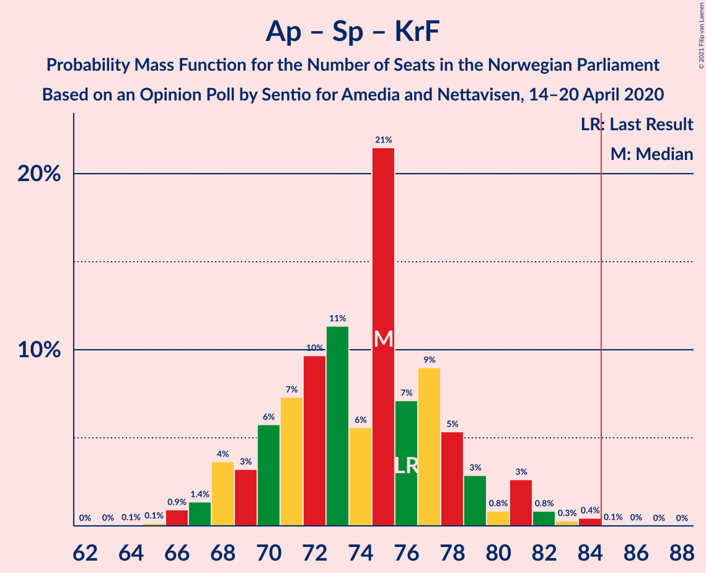

# Opinion Poll by Sentio for Amedia and Nettavisen, 14–20 April 2020

<a href="#voting-intentions">Voting Intentions</a> | <a href="#seats">Seats</a> | <a href="#coalitions">Coalitions</a> | <a href="#technical-information">Technical Information</a>

## Voting Intentions

### Confidence Intervals

| Party | Last Result | Poll Result | 80% Confidence Interval | 90% Confidence Interval | 95% Confidence Interval | 99% Confidence Interval |
|:-----:|:-----------:|:-----------:|:-----------------------:|:-----------------------:|:-----------------------:|:-----------------------:|
| Høyre | 25.0% | 26.6% | 24.9–28.5% |24.4–29.0% |23.9–29.4% |23.1–30.3% |
| Arbeiderpartiet | 27.4% | 24.5% | 22.8–26.3% |22.3–26.8% |21.9–27.3% |21.1–28.2% |
| Senterpartiet | 10.3% | 14.0% | 12.7–15.5% |12.3–15.9% |12.0–16.3% |11.4–17.0% |
| Fremskrittspartiet | 15.2% | 12.0% | 10.8–13.4% |10.4–13.8% |10.1–14.2% |9.6–14.9% |
| Sosialistisk Venstreparti | 6.0% | 6.5% | 5.6–7.6% |5.3–7.9% |5.1–8.2% |4.7–8.8% |
| Miljøpartiet De Grønne | 3.2% | 4.9% | 4.1–5.9% |3.9–6.2% |3.7–6.4% |3.4–6.9% |
| Kristelig Folkeparti | 4.2% | 3.7% | 3.0–4.6% |2.9–4.8% |2.7–5.1% |2.4–5.5% |
| Venstre | 4.4% | 3.3% | 2.7–4.1% |2.5–4.4% |2.4–4.6% |2.1–5.0% |
| Rødt | 2.4% | 3.2% | 2.6–4.0% |2.4–4.3% |2.3–4.5% |2.0–4.9% |

*Note:* The poll result column reflects the actual value used in the calculations. Published results may vary slightly, and in addition be rounded to fewer digits.

## Seats

### Confidence Intervals

| Party | Last Result | Median | 80% Confidence Interval | 90% Confidence Interval | 95% Confidence Interval | 99% Confidence Interval |
|:-----:|:-----------:|:------:|:-----------------------:|:-----------------------:|:-----------------------:|:-----------------------:|
| <a href="#høyre">Høyre</a> | 45 | 48 | 46–51 |44–52 |43–52 |41–53 |
| <a href="#arbeiderpartiet">Arbeiderpartiet</a> | 49 | 45 | 41–48 |41–49 |40–50 |38–52 |
| <a href="#senterpartiet">Senterpartiet</a> | 19 | 26 | 24–29 |23–30 |23–30 |21–32 |
| <a href="#fremskrittspartiet">Fremskrittspartiet</a> | 27 | 21 | 19–24 |18–25 |18–26 |17–26 |
| <a href="#sosialistisk-venstreparti">Sosialistisk Venstreparti</a> | 11 | 11 | 10–13 |9–14 |9–14 |8–16 |
| <a href="#miljøpartiet-de-grønne">Miljøpartiet De Grønne</a> | 1 | 9 | 8–11 |3–11 |2–11 |2–13 |
| <a href="#kristelig-folkeparti">Kristelig Folkeparti</a> | 8 | 3 | 1–8 |1–8 |1–9 |1–10 |
| <a href="#venstre">Venstre</a> | 8 | 2 | 2 |1–2 |1–7 |1–8 |
| <a href="#rødt">Rødt</a> | 1 | 2 | 1–7 |1–7 |1–8 |1–9 |

### Høyre

*For a full overview of the results for this party, see the [Høyre](party-høyre.html) page.*

| Number of Seats | Probability | Accumulated | Special Marks |
|:---------------:|:-----------:|:-----------:|:-------------:|
| 40 | 0.3% | 100% |  |
| 41 | 0.2% | 99.6% |  |
| 42 | 1.3% | 99.4% |  |
| 43 | 2% | 98% |  |
| 44 | 2% | 97% |  |
| 45 | 4% | 95% | Last Result |
| 46 | 24% | 91% |  |
| 47 | 2% | 67% |  |
| 48 | 19% | 65% | Median |
| 49 | 18% | 46% |  |
| 50 | 4% | 28% |  |
| 51 | 17% | 25% |  |
| 52 | 6% | 8% |  |
| 53 | 1.3% | 2% |  |
| 54 | 0.2% | 0.4% |  |
| 55 | 0.1% | 0.2% |  |
| 56 | 0.1% | 0.1% |  |
| 57 | 0% | 0% |  |

### Arbeiderpartiet

*For a full overview of the results for this party, see the [Arbeiderpartiet](party-arbeiderpartiet.html) page.*

| Number of Seats | Probability | Accumulated | Special Marks |
|:---------------:|:-----------:|:-----------:|:-------------:|
| 37 | 0.1% | 100% |  |
| 38 | 0.5% | 99.9% |  |
| 39 | 0.2% | 99.4% |  |
| 40 | 3% | 99.2% |  |
| 41 | 21% | 96% |  |
| 42 | 5% | 74% |  |
| 43 | 2% | 70% |  |
| 44 | 9% | 67% |  |
| 45 | 35% | 59% | Median |
| 46 | 9% | 24% |  |
| 47 | 4% | 15% |  |
| 48 | 5% | 11% |  |
| 49 | 2% | 6% | Last Result |
| 50 | 3% | 4% |  |
| 51 | 0.2% | 0.8% |  |
| 52 | 0.4% | 0.6% |  |
| 53 | 0.1% | 0.2% |  |
| 54 | 0.1% | 0.2% |  |
| 55 | 0% | 0% |  |

### Senterpartiet

*For a full overview of the results for this party, see the [Senterpartiet](party-senterpartiet.html) page.*

| Number of Seats | Probability | Accumulated | Special Marks |
|:---------------:|:-----------:|:-----------:|:-------------:|
| 19 | 0.1% | 100% | Last Result |
| 20 | 0.3% | 99.9% |  |
| 21 | 0.3% | 99.6% |  |
| 22 | 0.5% | 99.3% |  |
| 23 | 8% | 98.9% |  |
| 24 | 21% | 91% |  |
| 25 | 20% | 70% |  |
| 26 | 27% | 51% | Median |
| 27 | 12% | 24% |  |
| 28 | 0.8% | 12% |  |
| 29 | 5% | 11% |  |
| 30 | 5% | 6% |  |
| 31 | 0.2% | 0.8% |  |
| 32 | 0.2% | 0.6% |  |
| 33 | 0.2% | 0.4% |  |
| 34 | 0.2% | 0.2% |  |
| 35 | 0% | 0% |  |

### Fremskrittspartiet

*For a full overview of the results for this party, see the [Fremskrittspartiet](party-fremskrittspartiet.html) page.*

| Number of Seats | Probability | Accumulated | Special Marks |
|:---------------:|:-----------:|:-----------:|:-------------:|
| 15 | 0.1% | 100% |  |
| 16 | 0.3% | 99.9% |  |
| 17 | 0.4% | 99.6% |  |
| 18 | 8% | 99.2% |  |
| 19 | 12% | 91% |  |
| 20 | 14% | 79% |  |
| 21 | 19% | 65% | Median |
| 22 | 25% | 45% |  |
| 23 | 6% | 20% |  |
| 24 | 4% | 13% |  |
| 25 | 6% | 9% |  |
| 26 | 3% | 3% |  |
| 27 | 0.1% | 0.2% | Last Result |
| 28 | 0.1% | 0.1% |  |
| 29 | 0% | 0% |  |

### Sosialistisk Venstreparti

*For a full overview of the results for this party, see the [Sosialistisk Venstreparti](party-sosialistiskvenstreparti.html) page.*

| Number of Seats | Probability | Accumulated | Special Marks |
|:---------------:|:-----------:|:-----------:|:-------------:|
| 8 | 0.7% | 100% |  |
| 9 | 4% | 99.2% |  |
| 10 | 29% | 95% |  |
| 11 | 18% | 65% | Last Result, Median |
| 12 | 29% | 47% |  |
| 13 | 12% | 18% |  |
| 14 | 4% | 6% |  |
| 15 | 2% | 2% |  |
| 16 | 0.6% | 0.7% |  |
| 17 | 0.1% | 0.1% |  |
| 18 | 0% | 0% |  |

### Miljøpartiet De Grønne

*For a full overview of the results for this party, see the [Miljøpartiet De Grønne](party-miljøpartietdegrønne.html) page.*

| Number of Seats | Probability | Accumulated | Special Marks |
|:---------------:|:-----------:|:-----------:|:-------------:|
| 1 | 0.4% | 100% | Last Result |
| 2 | 2% | 99.6% |  |
| 3 | 2% | 97% |  |
| 4 | 0% | 95% |  |
| 5 | 0% | 95% |  |
| 6 | 0% | 95% |  |
| 7 | 1.4% | 95% |  |
| 8 | 30% | 93% |  |
| 9 | 34% | 63% | Median |
| 10 | 18% | 30% |  |
| 11 | 10% | 12% |  |
| 12 | 0.7% | 2% |  |
| 13 | 0.8% | 0.8% |  |
| 14 | 0% | 0% |  |

### Kristelig Folkeparti

*For a full overview of the results for this party, see the [Kristelig Folkeparti](party-kristeligfolkeparti.html) page.*

| Number of Seats | Probability | Accumulated | Special Marks |
|:---------------:|:-----------:|:-----------:|:-------------:|
| 0 | 0.1% | 100% |  |
| 1 | 16% | 99.9% |  |
| 2 | 8% | 84% |  |
| 3 | 39% | 76% | Median |
| 4 | 0% | 37% |  |
| 5 | 0% | 37% |  |
| 6 | 0.3% | 37% |  |
| 7 | 16% | 36% |  |
| 8 | 16% | 21% | Last Result |
| 9 | 4% | 5% |  |
| 10 | 0.7% | 0.9% |  |
| 11 | 0.2% | 0.2% |  |
| 12 | 0% | 0% |  |

### Venstre

*For a full overview of the results for this party, see the [Venstre](party-venstre.html) page.*

| Number of Seats | Probability | Accumulated | Special Marks |
|:---------------:|:-----------:|:-----------:|:-------------:|
| 0 | 0.1% | 100% |  |
| 1 | 8% | 99.9% |  |
| 2 | 89% | 92% | Median |
| 3 | 0% | 3% |  |
| 4 | 0% | 3% |  |
| 5 | 0% | 3% |  |
| 6 | 0.3% | 3% |  |
| 7 | 2% | 3% |  |
| 8 | 0.8% | 0.9% | Last Result |
| 9 | 0.1% | 0.1% |  |
| 10 | 0% | 0% |  |

### Rødt

*For a full overview of the results for this party, see the [Rødt](party-rødt.html) page.*

| Number of Seats | Probability | Accumulated | Special Marks |
|:---------------:|:-----------:|:-----------:|:-------------:|
| 1 | 30% | 100% | Last Result |
| 2 | 42% | 70% | Median |
| 3 | 0% | 29% |  |
| 4 | 0% | 29% |  |
| 5 | 0% | 29% |  |
| 6 | 0.3% | 29% |  |
| 7 | 25% | 28% |  |
| 8 | 2% | 3% |  |
| 9 | 0.5% | 0.5% |  |
| 10 | 0% | 0% |  |

## Coalitions

### Confidence Intervals

| Coalition | Last Result | Median | Majority? | 80% Confidence Interval | 90% Confidence Interval | 95% Confidence Interval | 99% Confidence Interval |
|:---------:|:-----------:|:------:|:---------:|:-----------------------:|:-----------------------:|:-----------------------:|:-----------------------:|
| Høyre – Senterpartiet – Fremskrittspartiet – Kristelig Folkeparti – Venstre | 107 | 102 | 100% | 98–106 | 96–106 | 95–106 | 95–109 |
| Arbeiderpartiet – Senterpartiet – Sosialistisk Venstreparti – Miljøpartiet De Grønne – Kristelig Folkeparti | 88 | 94 | 99.8% | 90–98 | 90–99 | 90–100 | 87–102 |
| Arbeiderpartiet – Senterpartiet – Sosialistisk Venstreparti – Miljøpartiet De Grønne – Rødt | 81 | 94 | 99.9% | 89–97 | 89–98 | 89–99 | 86–100 |
| Arbeiderpartiet – Senterpartiet – Sosialistisk Venstreparti – Miljøpartiet De Grønne | 80 | 90 | 98.6% | 87–95 | 87–95 | 86–97 | 82–98 |
| Arbeiderpartiet – Senterpartiet – Sosialistisk Venstreparti – Rødt | 80 | 85 | 55% | 80–88 | 80–89 | 80–90 | 78–93 |
| Høyre – Fremskrittspartiet – Miljøpartiet De Grønne – Kristelig Folkeparti – Venstre | 89 | 84 | 45% | 81–89 | 80–89 | 79–89 | 76–91 |
| Arbeiderpartiet – Senterpartiet – Miljøpartiet De Grønne – Kristelig Folkeparti | 77 | 83 | 21% | 78–87 | 78–88 | 77–89 | 75–90 |
| Arbeiderpartiet – Senterpartiet – Sosialistisk Venstreparti | 79 | 81 | 12% | 78–85 | 78–86 | 78–87 | 75–90 |
| Arbeiderpartiet – Senterpartiet – Kristelig Folkeparti | 76 | 75 | 0.1% | 69–78 | 69–78 | 69–81 | 68–83 |
| Høyre – Fremskrittspartiet – Kristelig Folkeparti – Venstre | 88 | 75 | 0.1% | 72–80 | 71–80 | 70–80 | 69–83 |
| Høyre – Fremskrittspartiet – Venstre | 80 | 72 | 0% | 68–75 | 68–76 | 67–76 | 65–78 |
| Arbeiderpartiet – Senterpartiet | 68 | 69 | 0% | 66–74 | 66–74 | 66–75 | 64–78 |
| Høyre – Fremskrittspartiet | 72 | 70 | 0% | 66–73 | 66–74 | 64–75 | 61–77 |
| Arbeiderpartiet – Sosialistisk Venstreparti | 60 | 55 | 0% | 52–60 | 52–61 | 52–62 | 51–64 |
| Høyre – Kristelig Folkeparti – Venstre | 61 | 54 | 0% | 51–58 | 50–59 | 48–60 | 46–61 |
| Senterpartiet – Kristelig Folkeparti – Venstre | 35 | 31 | 0% | 29–36 | 28–36 | 28–38 | 26–41 |

### Høyre – Senterpartiet – Fremskrittspartiet – Kristelig Folkeparti – Venstre

| Number of Seats | Probability | Accumulated | Special Marks |
|:---------------:|:-----------:|:-----------:|:-------------:|
| 91 | 0% | 100% |  |
| 92 | 0.1% | 99.9% |  |
| 93 | 0.1% | 99.8% |  |
| 94 | 0.1% | 99.7% |  |
| 95 | 3% | 99.6% |  |
| 96 | 4% | 96% |  |
| 97 | 1.1% | 92% |  |
| 98 | 2% | 91% |  |
| 99 | 19% | 89% |  |
| 100 | 13% | 70% | Median |
| 101 | 7% | 57% |  |
| 102 | 14% | 50% |  |
| 103 | 10% | 37% |  |
| 104 | 4% | 26% |  |
| 105 | 9% | 22% |  |
| 106 | 12% | 13% |  |
| 107 | 0.6% | 2% | Last Result |
| 108 | 0.7% | 1.2% |  |
| 109 | 0.2% | 0.5% |  |
| 110 | 0.1% | 0.3% |  |
| 111 | 0.1% | 0.2% |  |
| 112 | 0.1% | 0.1% |  |
| 113 | 0% | 0% |  |

### Arbeiderpartiet – Senterpartiet – Sosialistisk Venstreparti – Miljøpartiet De Grønne – Kristelig Folkeparti

| Number of Seats | Probability | Accumulated | Special Marks |
|:---------------:|:-----------:|:-----------:|:-------------:|
| 83 | 0.2% | 100% |  |
| 84 | 0% | 99.8% |  |
| 85 | 0% | 99.8% | Majority |
| 86 | 0.2% | 99.8% |  |
| 87 | 0.9% | 99.6% |  |
| 88 | 0.4% | 98.8% | Last Result |
| 89 | 0.4% | 98% |  |
| 90 | 10% | 98% |  |
| 91 | 3% | 88% |  |
| 92 | 6% | 86% |  |
| 93 | 10% | 80% |  |
| 94 | 27% | 70% | Median |
| 95 | 15% | 42% |  |
| 96 | 10% | 27% |  |
| 97 | 3% | 17% |  |
| 98 | 6% | 14% |  |
| 99 | 5% | 8% |  |
| 100 | 2% | 3% |  |
| 101 | 0.6% | 1.4% |  |
| 102 | 0.3% | 0.8% |  |
| 103 | 0.2% | 0.4% |  |
| 104 | 0% | 0.2% |  |
| 105 | 0.2% | 0.2% |  |
| 106 | 0% | 0% |  |

### Arbeiderpartiet – Senterpartiet – Sosialistisk Venstreparti – Miljøpartiet De Grønne – Rødt

| Number of Seats | Probability | Accumulated | Special Marks |
|:---------------:|:-----------:|:-----------:|:-------------:|
| 81 | 0% | 100% | Last Result |
| 82 | 0% | 100% |  |
| 83 | 0% | 100% |  |
| 84 | 0% | 100% |  |
| 85 | 0.2% | 99.9% | Majority |
| 86 | 0.4% | 99.7% |  |
| 87 | 0.4% | 99.3% |  |
| 88 | 0.8% | 98.9% |  |
| 89 | 14% | 98% |  |
| 90 | 8% | 84% |  |
| 91 | 2% | 76% |  |
| 92 | 5% | 74% |  |
| 93 | 17% | 69% | Median |
| 94 | 31% | 52% |  |
| 95 | 4% | 21% |  |
| 96 | 2% | 17% |  |
| 97 | 7% | 15% |  |
| 98 | 5% | 8% |  |
| 99 | 2% | 3% |  |
| 100 | 0.4% | 0.7% |  |
| 101 | 0.2% | 0.3% |  |
| 102 | 0.1% | 0.1% |  |
| 103 | 0% | 0% |  |

### Arbeiderpartiet – Senterpartiet – Sosialistisk Venstreparti – Miljøpartiet De Grønne

| Number of Seats | Probability | Accumulated | Special Marks |
|:---------------:|:-----------:|:-----------:|:-------------:|
| 80 | 0.2% | 100% | Last Result |
| 81 | 0.1% | 99.8% |  |
| 82 | 0.3% | 99.7% |  |
| 83 | 0.3% | 99.4% |  |
| 84 | 0.5% | 99.1% |  |
| 85 | 0.7% | 98.6% | Majority |
| 86 | 1.0% | 98% |  |
| 87 | 32% | 97% |  |
| 88 | 9% | 65% |  |
| 89 | 5% | 56% |  |
| 90 | 4% | 51% |  |
| 91 | 12% | 47% | Median |
| 92 | 13% | 34% |  |
| 93 | 8% | 22% |  |
| 94 | 3% | 14% |  |
| 95 | 7% | 11% |  |
| 96 | 1.4% | 4% |  |
| 97 | 1.3% | 3% |  |
| 98 | 1.0% | 1.3% |  |
| 99 | 0.1% | 0.2% |  |
| 100 | 0.1% | 0.1% |  |
| 101 | 0% | 0% |  |

### Arbeiderpartiet – Senterpartiet – Sosialistisk Venstreparti – Rødt

| Number of Seats | Probability | Accumulated | Special Marks |
|:---------------:|:-----------:|:-----------:|:-------------:|
| 76 | 0% | 100% |  |
| 77 | 0.1% | 99.9% |  |
| 78 | 0.5% | 99.8% |  |
| 79 | 0.5% | 99.3% |  |
| 80 | 14% | 98.8% | Last Result |
| 81 | 4% | 85% |  |
| 82 | 5% | 81% |  |
| 83 | 13% | 76% |  |
| 84 | 8% | 63% | Median |
| 85 | 19% | 55% | Majority |
| 86 | 19% | 36% |  |
| 87 | 5% | 17% |  |
| 88 | 3% | 12% |  |
| 89 | 5% | 9% |  |
| 90 | 1.4% | 4% |  |
| 91 | 2% | 2% |  |
| 92 | 0% | 0.6% |  |
| 93 | 0.2% | 0.6% |  |
| 94 | 0.3% | 0.4% |  |
| 95 | 0.1% | 0.1% |  |
| 96 | 0% | 0% |  |

### Høyre – Fremskrittspartiet – Miljøpartiet De Grønne – Kristelig Folkeparti – Venstre

| Number of Seats | Probability | Accumulated | Special Marks |
|:---------------:|:-----------:|:-----------:|:-------------:|
| 74 | 0.1% | 100% |  |
| 75 | 0.3% | 99.9% |  |
| 76 | 0.2% | 99.6% |  |
| 77 | 0% | 99.4% |  |
| 78 | 2% | 99.4% |  |
| 79 | 1.4% | 98% |  |
| 80 | 5% | 96% |  |
| 81 | 3% | 91% |  |
| 82 | 5% | 88% |  |
| 83 | 19% | 83% | Median |
| 84 | 19% | 64% |  |
| 85 | 8% | 45% | Majority |
| 86 | 13% | 37% |  |
| 87 | 5% | 24% |  |
| 88 | 4% | 19% |  |
| 89 | 14% | 15% | Last Result |
| 90 | 0.5% | 1.2% |  |
| 91 | 0.5% | 0.7% |  |
| 92 | 0.1% | 0.2% |  |
| 93 | 0% | 0.1% |  |
| 94 | 0% | 0% |  |

### Arbeiderpartiet – Senterpartiet – Miljøpartiet De Grønne – Kristelig Folkeparti

| Number of Seats | Probability | Accumulated | Special Marks |
|:---------------:|:-----------:|:-----------:|:-------------:|
| 73 | 0.2% | 100% |  |
| 74 | 0.1% | 99.8% |  |
| 75 | 0.9% | 99.7% |  |
| 76 | 0.2% | 98.8% |  |
| 77 | 2% | 98.5% | Last Result |
| 78 | 12% | 97% |  |
| 79 | 1.4% | 85% |  |
| 80 | 4% | 84% |  |
| 81 | 9% | 80% |  |
| 82 | 3% | 71% |  |
| 83 | 18% | 68% | Median |
| 84 | 29% | 50% |  |
| 85 | 3% | 21% | Majority |
| 86 | 3% | 17% |  |
| 87 | 5% | 14% |  |
| 88 | 6% | 9% |  |
| 89 | 2% | 3% |  |
| 90 | 0.9% | 1.4% |  |
| 91 | 0.1% | 0.5% |  |
| 92 | 0.1% | 0.4% |  |
| 93 | 0.1% | 0.2% |  |
| 94 | 0.1% | 0.1% |  |
| 95 | 0% | 0% |  |

### Arbeiderpartiet – Senterpartiet – Sosialistisk Venstreparti

| Number of Seats | Probability | Accumulated | Special Marks |
|:---------------:|:-----------:|:-----------:|:-------------:|
| 72 | 0% | 100% |  |
| 73 | 0% | 99.9% |  |
| 74 | 0.2% | 99.9% |  |
| 75 | 0.2% | 99.7% |  |
| 76 | 0.2% | 99.4% |  |
| 77 | 0.9% | 99.3% |  |
| 78 | 19% | 98% |  |
| 79 | 17% | 79% | Last Result |
| 80 | 9% | 62% |  |
| 81 | 6% | 54% |  |
| 82 | 13% | 48% | Median |
| 83 | 16% | 34% |  |
| 84 | 6% | 18% |  |
| 85 | 3% | 12% | Majority |
| 86 | 6% | 10% |  |
| 87 | 2% | 4% |  |
| 88 | 0.7% | 2% |  |
| 89 | 0.5% | 1.4% |  |
| 90 | 0.6% | 0.9% |  |
| 91 | 0.1% | 0.3% |  |
| 92 | 0.1% | 0.2% |  |
| 93 | 0% | 0.1% |  |
| 94 | 0.1% | 0.1% |  |
| 95 | 0% | 0% |  |

### Arbeiderpartiet – Senterpartiet – Kristelig Folkeparti

| Number of Seats | Probability | Accumulated | Special Marks |
|:---------------:|:-----------:|:-----------:|:-------------:|
| 65 | 0.1% | 100% |  |
| 66 | 0.1% | 99.9% |  |
| 67 | 0.3% | 99.8% |  |
| 68 | 0.8% | 99.6% |  |
| 69 | 9% | 98.8% |  |
| 70 | 2% | 90% |  |
| 71 | 7% | 88% |  |
| 72 | 6% | 81% |  |
| 73 | 15% | 75% |  |
| 74 | 8% | 60% | Median |
| 75 | 19% | 53% |  |
| 76 | 16% | 34% | Last Result |
| 77 | 6% | 18% |  |
| 78 | 7% | 11% |  |
| 79 | 0.5% | 4% |  |
| 80 | 1.1% | 4% |  |
| 81 | 1.2% | 3% |  |
| 82 | 0.6% | 1.5% |  |
| 83 | 0.5% | 0.9% |  |
| 84 | 0.3% | 0.4% |  |
| 85 | 0% | 0.1% | Majority |
| 86 | 0% | 0% |  |

### Høyre – Fremskrittspartiet – Kristelig Folkeparti – Venstre

| Number of Seats | Probability | Accumulated | Special Marks |
|:---------------:|:-----------:|:-----------:|:-------------:|
| 67 | 0.1% | 100% |  |
| 68 | 0.2% | 99.9% |  |
| 69 | 0.4% | 99.7% |  |
| 70 | 2% | 99.3% |  |
| 71 | 5% | 97% |  |
| 72 | 7% | 92% |  |
| 73 | 2% | 85% |  |
| 74 | 4% | 83% | Median |
| 75 | 31% | 79% |  |
| 76 | 17% | 48% |  |
| 77 | 5% | 31% |  |
| 78 | 2% | 26% |  |
| 79 | 8% | 24% |  |
| 80 | 14% | 16% |  |
| 81 | 0.8% | 2% |  |
| 82 | 0.4% | 1.1% |  |
| 83 | 0.4% | 0.7% |  |
| 84 | 0.2% | 0.3% |  |
| 85 | 0% | 0.1% | Majority |
| 86 | 0% | 0% |  |
| 87 | 0% | 0% |  |
| 88 | 0% | 0% | Last Result |

### Høyre – Fremskrittspartiet – Venstre

| Number of Seats | Probability | Accumulated | Special Marks |
|:---------------:|:-----------:|:-----------:|:-------------:|
| 62 | 0.3% | 100% |  |
| 63 | 0% | 99.7% |  |
| 64 | 0.1% | 99.7% |  |
| 65 | 0.4% | 99.6% |  |
| 66 | 0.4% | 99.2% |  |
| 67 | 1.4% | 98.8% |  |
| 68 | 20% | 97% |  |
| 69 | 8% | 77% |  |
| 70 | 4% | 69% |  |
| 71 | 3% | 66% | Median |
| 72 | 30% | 63% |  |
| 73 | 13% | 34% |  |
| 74 | 4% | 21% |  |
| 75 | 11% | 17% |  |
| 76 | 5% | 7% |  |
| 77 | 0.4% | 1.4% |  |
| 78 | 0.9% | 1.1% |  |
| 79 | 0.1% | 0.2% |  |
| 80 | 0% | 0.1% | Last Result |
| 81 | 0.1% | 0.1% |  |
| 82 | 0% | 0% |  |

### Arbeiderpartiet – Senterpartiet

| Number of Seats | Probability | Accumulated | Special Marks |
|:---------------:|:-----------:|:-----------:|:-------------:|
| 61 | 0.1% | 100% |  |
| 62 | 0.1% | 99.9% |  |
| 63 | 0.1% | 99.8% |  |
| 64 | 0.3% | 99.7% |  |
| 65 | 1.1% | 99.4% |  |
| 66 | 12% | 98% |  |
| 67 | 12% | 87% |  |
| 68 | 4% | 75% | Last Result |
| 69 | 22% | 71% |  |
| 70 | 8% | 50% |  |
| 71 | 10% | 41% | Median |
| 72 | 15% | 31% |  |
| 73 | 3% | 16% |  |
| 74 | 9% | 14% |  |
| 75 | 3% | 4% |  |
| 76 | 0.8% | 1.5% |  |
| 77 | 0.1% | 0.7% |  |
| 78 | 0.3% | 0.6% |  |
| 79 | 0.1% | 0.3% |  |
| 80 | 0.1% | 0.1% |  |
| 81 | 0% | 0% |  |

### Høyre – Fremskrittspartiet

| Number of Seats | Probability | Accumulated | Special Marks |
|:---------------:|:-----------:|:-----------:|:-------------:|
| 59 | 0% | 100% |  |
| 60 | 0.4% | 99.9% |  |
| 61 | 0.1% | 99.5% |  |
| 62 | 0.1% | 99.4% |  |
| 63 | 0.7% | 99.3% |  |
| 64 | 1.1% | 98.6% |  |
| 65 | 1.4% | 97% |  |
| 66 | 20% | 96% |  |
| 67 | 9% | 76% |  |
| 68 | 3% | 68% |  |
| 69 | 1.5% | 64% | Median |
| 70 | 30% | 63% |  |
| 71 | 12% | 33% |  |
| 72 | 3% | 20% | Last Result |
| 73 | 11% | 17% |  |
| 74 | 2% | 6% |  |
| 75 | 4% | 5% |  |
| 76 | 0.1% | 0.9% |  |
| 77 | 0.7% | 0.8% |  |
| 78 | 0% | 0.1% |  |
| 79 | 0.1% | 0.1% |  |
| 80 | 0% | 0% |  |

### Arbeiderpartiet – Sosialistisk Venstreparti

| Number of Seats | Probability | Accumulated | Special Marks |
|:---------------:|:-----------:|:-----------:|:-------------:|
| 48 | 0.1% | 100% |  |
| 49 | 0.2% | 99.9% |  |
| 50 | 0.2% | 99.7% |  |
| 51 | 2% | 99.5% |  |
| 52 | 13% | 98% |  |
| 53 | 9% | 85% |  |
| 54 | 14% | 76% |  |
| 55 | 24% | 61% |  |
| 56 | 2% | 38% | Median |
| 57 | 14% | 36% |  |
| 58 | 5% | 22% |  |
| 59 | 5% | 17% |  |
| 60 | 4% | 12% | Last Result |
| 61 | 3% | 8% |  |
| 62 | 2% | 4% |  |
| 63 | 2% | 2% |  |
| 64 | 0.2% | 0.6% |  |
| 65 | 0.2% | 0.4% |  |
| 66 | 0.1% | 0.2% |  |
| 67 | 0.1% | 0.1% |  |
| 68 | 0% | 0% |  |

### Høyre – Kristelig Folkeparti – Venstre

| Number of Seats | Probability | Accumulated | Special Marks |
|:---------------:|:-----------:|:-----------:|:-------------:|
| 45 | 0.1% | 100% |  |
| 46 | 0.8% | 99.9% |  |
| 47 | 0.3% | 99.1% |  |
| 48 | 2% | 98.8% |  |
| 49 | 2% | 97% |  |
| 50 | 1.0% | 95% |  |
| 51 | 11% | 94% |  |
| 52 | 3% | 83% |  |
| 53 | 10% | 80% | Median |
| 54 | 21% | 71% |  |
| 55 | 15% | 50% |  |
| 56 | 11% | 35% |  |
| 57 | 4% | 24% |  |
| 58 | 11% | 20% |  |
| 59 | 6% | 9% |  |
| 60 | 2% | 3% |  |
| 61 | 0.5% | 0.8% | Last Result |
| 62 | 0.1% | 0.4% |  |
| 63 | 0% | 0.2% |  |
| 64 | 0.1% | 0.2% |  |
| 65 | 0% | 0.1% |  |
| 66 | 0% | 0% |  |

### Senterpartiet – Kristelig Folkeparti – Venstre

| Number of Seats | Probability | Accumulated | Special Marks |
|:---------------:|:-----------:|:-----------:|:-------------:|
| 24 | 0% | 100% |  |
| 25 | 0.2% | 99.9% |  |
| 26 | 0.3% | 99.7% |  |
| 27 | 0.2% | 99.4% |  |
| 28 | 9% | 99.2% |  |
| 29 | 7% | 91% |  |
| 30 | 22% | 84% |  |
| 31 | 13% | 62% | Median |
| 32 | 4% | 49% |  |
| 33 | 16% | 45% |  |
| 34 | 5% | 29% |  |
| 35 | 10% | 24% | Last Result |
| 36 | 11% | 14% |  |
| 37 | 0.5% | 3% |  |
| 38 | 1.1% | 3% |  |
| 39 | 0.6% | 1.5% |  |
| 40 | 0.1% | 0.9% |  |
| 41 | 0.3% | 0.8% |  |
| 42 | 0% | 0.5% |  |
| 43 | 0.3% | 0.4% |  |
| 44 | 0.1% | 0.2% |  |
| 45 | 0% | 0% |  |

## Technical Information

### Opinion Poll

+ **Polling firm:** Sentio
+ **Commissioner(s):** Amedia and Nettavisen
+ **Fieldwork period:** 14–20 April 2020

### Calculations

+ **Sample size:** 1000
+ **Simulations done:** 131,072
+ **Error estimate:** 2.48%

