# Opinion Poll by Sentio for Amedia and Nettavisen, 14–20 April 2020

<a href="#voting-intentions">Voting Intentions</a> | <a href="#seats">Seats</a> | <a href="#coalitions">Coalitions</a> | <a href="#technical-information">Technical Information</a>

## Voting Intentions

### Confidence Intervals

| Party | Last Result | Poll Result | 80% Confidence Interval | 90% Confidence Interval | 95% Confidence Interval | 99% Confidence Interval |
|:-----:|:-----------:|:-----------:|:-----------------------:|:-----------------------:|:-----------------------:|:-----------------------:|
| Høyre | 25.0% | 26.6% | 24.9–28.5% |24.4–29.0% |23.9–29.4% |23.1–30.3% |
| Arbeiderpartiet | 27.4% | 24.5% | 22.8–26.3% |22.3–26.8% |21.9–27.3% |21.1–28.2% |
| Senterpartiet | 10.3% | 14.0% | 12.7–15.5% |12.3–15.9% |12.0–16.3% |11.4–17.0% |
| Fremskrittspartiet | 15.2% | 12.0% | 10.8–13.4% |10.4–13.8% |10.1–14.2% |9.6–14.9% |
| Sosialistisk Venstreparti | 6.0% | 6.5% | 5.6–7.6% |5.3–7.9% |5.1–8.2% |4.7–8.8% |
| Miljøpartiet De Grønne | 3.2% | 4.9% | 4.1–5.9% |3.9–6.2% |3.7–6.4% |3.4–6.9% |
| Kristelig Folkeparti | 4.2% | 3.7% | 3.0–4.6% |2.9–4.8% |2.7–5.1% |2.4–5.5% |
| Venstre | 4.4% | 3.3% | 2.7–4.1% |2.5–4.4% |2.4–4.6% |2.1–5.0% |
| Rødt | 2.4% | 3.2% | 2.6–4.0% |2.4–4.3% |2.3–4.5% |2.0–4.9% |

*Note:* The poll result column reflects the actual value used in the calculations. Published results may vary slightly, and in addition be rounded to fewer digits.

## Seats

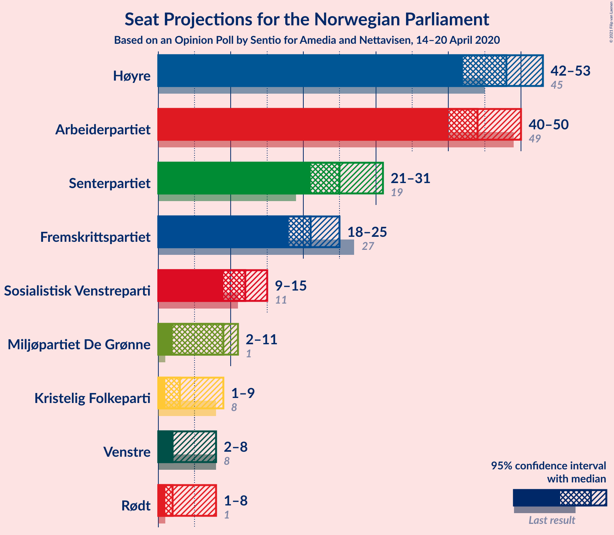

### Confidence Intervals

| Party | Last Result | Median | 80% Confidence Interval | 90% Confidence Interval | 95% Confidence Interval | 99% Confidence Interval |
|:-----:|:-----------:|:------:|:-----------------------:|:-----------------------:|:-----------------------:|:-----------------------:|
| <a href="#høyre">Høyre</a> | 45 | 48 | 45–51 |44–52 |42–53 |41–55 |
| <a href="#arbeiderpartiet">Arbeiderpartiet</a> | 49 | 44 | 41–47 |40–48 |40–50 |39–51 |
| <a href="#senterpartiet">Senterpartiet</a> | 19 | 25 | 23–28 |22–29 |21–31 |20–31 |
| <a href="#fremskrittspartiet">Fremskrittspartiet</a> | 27 | 21 | 19–24 |18–25 |18–25 |17–27 |
| <a href="#sosialistisk-venstreparti">Sosialistisk Venstreparti</a> | 11 | 12 | 10–14 |10–14 |9–15 |8–16 |
| <a href="#miljøpartiet-de-grønne">Miljøpartiet De Grønne</a> | 1 | 9 | 7–10 |4–11 |2–11 |2–12 |
| <a href="#kristelig-folkeparti">Kristelig Folkeparti</a> | 8 | 3 | 1–8 |1–9 |1–9 |1–10 |
| <a href="#venstre">Venstre</a> | 8 | 2 | 2–7 |2–7 |2–8 |1–9 |
| <a href="#rødt">Rødt</a> | 1 | 2 | 1–7 |1–7 |1–8 |1–9 |

### Høyre

*For a full overview of the results for this party, see the [Høyre](party-høyre.html) page.*

| Number of Seats | Probability | Accumulated | Special Marks |
|:---------------:|:-----------:|:-----------:|:-------------:|
| 39 | 0.1% | 100% |  |
| 40 | 0.3% | 99.9% |  |
| 41 | 0.5% | 99.7% |  |
| 42 | 3% | 99.2% |  |
| 43 | 1.5% | 97% |  |
| 44 | 4% | 95% |  |
| 45 | 7% | 91% | Last Result |
| 46 | 13% | 84% |  |
| 47 | 12% | 71% |  |
| 48 | 21% | 60% | Median |
| 49 | 12% | 38% |  |
| 50 | 12% | 27% |  |
| 51 | 6% | 15% |  |
| 52 | 5% | 9% |  |
| 53 | 3% | 5% |  |
| 54 | 0.9% | 1.5% |  |
| 55 | 0.4% | 0.6% |  |
| 56 | 0.1% | 0.2% |  |
| 57 | 0% | 0.1% |  |
| 58 | 0% | 0% |  |

### Arbeiderpartiet

*For a full overview of the results for this party, see the [Arbeiderpartiet](party-arbeiderpartiet.html) page.*

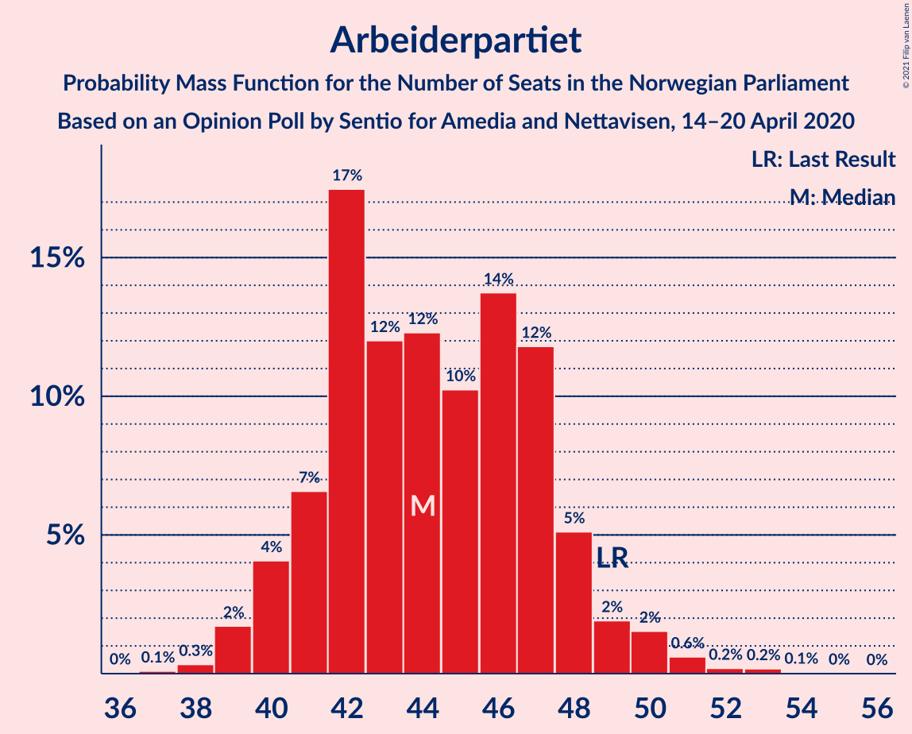

| Number of Seats | Probability | Accumulated | Special Marks |
|:---------------:|:-----------:|:-----------:|:-------------:|
| 37 | 0.1% | 100% |  |
| 38 | 0.3% | 99.9% |  |
| 39 | 2% | 99.5% |  |
| 40 | 4% | 98% |  |
| 41 | 7% | 94% |  |
| 42 | 17% | 87% |  |
| 43 | 12% | 70% |  |
| 44 | 12% | 58% | Median |
| 45 | 10% | 45% |  |
| 46 | 14% | 35% |  |
| 47 | 12% | 21% |  |
| 48 | 5% | 10% |  |
| 49 | 2% | 4% | Last Result |
| 50 | 2% | 3% |  |
| 51 | 0.6% | 1.1% |  |
| 52 | 0.2% | 0.4% |  |
| 53 | 0.2% | 0.3% |  |
| 54 | 0.1% | 0.1% |  |
| 55 | 0% | 0% |  |

### Senterpartiet

*For a full overview of the results for this party, see the [Senterpartiet](party-senterpartiet.html) page.*

| Number of Seats | Probability | Accumulated | Special Marks |
|:---------------:|:-----------:|:-----------:|:-------------:|
| 19 | 0.2% | 100% | Last Result |
| 20 | 0.7% | 99.8% |  |
| 21 | 3% | 99.1% |  |
| 22 | 4% | 96% |  |
| 23 | 10% | 93% |  |
| 24 | 8% | 82% |  |
| 25 | 30% | 74% | Median |
| 26 | 19% | 44% |  |
| 27 | 11% | 24% |  |
| 28 | 5% | 13% |  |
| 29 | 5% | 8% |  |
| 30 | 0.9% | 4% |  |
| 31 | 2% | 3% |  |
| 32 | 0.2% | 0.4% |  |
| 33 | 0.1% | 0.2% |  |
| 34 | 0.1% | 0.1% |  |
| 35 | 0% | 0% |  |

### Fremskrittspartiet

*For a full overview of the results for this party, see the [Fremskrittspartiet](party-fremskrittspartiet.html) page.*

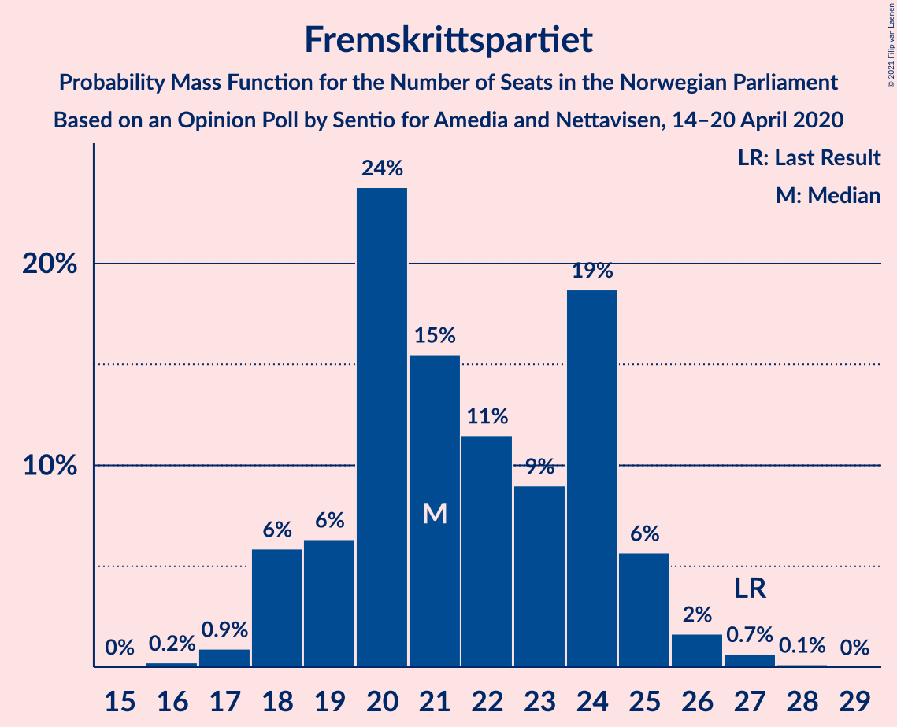

| Number of Seats | Probability | Accumulated | Special Marks |
|:---------------:|:-----------:|:-----------:|:-------------:|
| 16 | 0.2% | 100% |  |
| 17 | 0.9% | 99.7% |  |
| 18 | 6% | 98.8% |  |
| 19 | 6% | 93% |  |
| 20 | 24% | 87% |  |
| 21 | 15% | 63% | Median |
| 22 | 11% | 47% |  |
| 23 | 9% | 36% |  |
| 24 | 19% | 27% |  |
| 25 | 6% | 8% |  |
| 26 | 2% | 2% |  |
| 27 | 0.7% | 0.8% | Last Result |
| 28 | 0.1% | 0.2% |  |
| 29 | 0% | 0% |  |

### Sosialistisk Venstreparti

*For a full overview of the results for this party, see the [Sosialistisk Venstreparti](party-sosialistiskvenstreparti.html) page.*

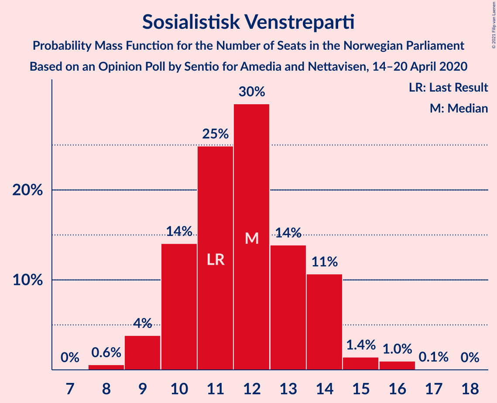

| Number of Seats | Probability | Accumulated | Special Marks |
|:---------------:|:-----------:|:-----------:|:-------------:|
| 8 | 0.6% | 100% |  |
| 9 | 4% | 99.4% |  |
| 10 | 14% | 96% |  |
| 11 | 25% | 82% | Last Result |
| 12 | 30% | 57% | Median |
| 13 | 14% | 27% |  |
| 14 | 11% | 13% |  |
| 15 | 1.4% | 3% |  |
| 16 | 1.0% | 1.1% |  |
| 17 | 0.1% | 0.1% |  |
| 18 | 0% | 0% |  |

### Miljøpartiet De Grønne

*For a full overview of the results for this party, see the [Miljøpartiet De Grønne](party-miljøpartietdegrønne.html) page.*

| Number of Seats | Probability | Accumulated | Special Marks |
|:---------------:|:-----------:|:-----------:|:-------------:|
| 1 | 0.1% | 100% | Last Result |
| 2 | 3% | 99.9% |  |
| 3 | 1.2% | 97% |  |
| 4 | 0.8% | 96% |  |
| 5 | 0% | 95% |  |
| 6 | 0% | 95% |  |
| 7 | 5% | 95% |  |
| 8 | 27% | 90% |  |
| 9 | 27% | 62% | Median |
| 10 | 26% | 35% |  |
| 11 | 8% | 9% |  |
| 12 | 0.9% | 1.4% |  |
| 13 | 0.4% | 0.5% |  |
| 14 | 0.1% | 0.1% |  |
| 15 | 0% | 0% |  |

### Kristelig Folkeparti

*For a full overview of the results for this party, see the [Kristelig Folkeparti](party-kristeligfolkeparti.html) page.*

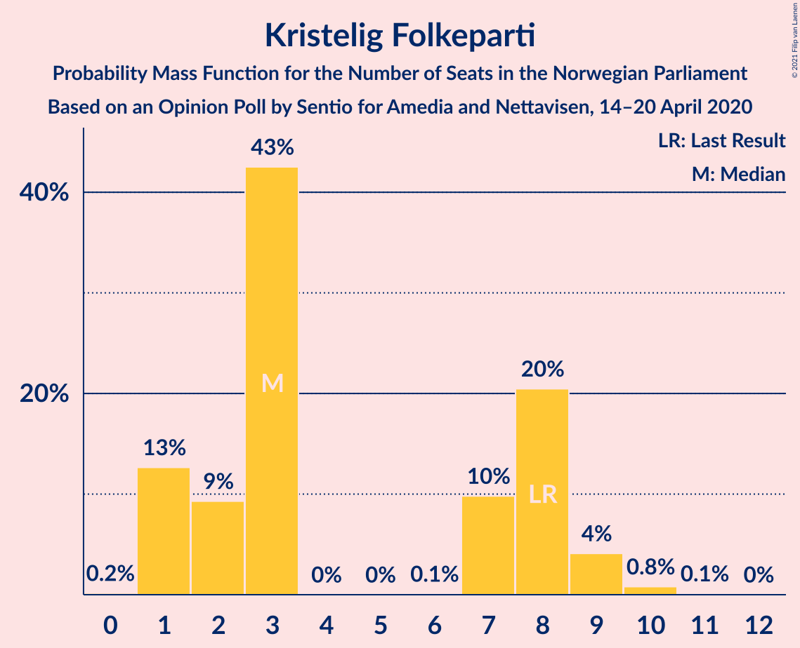

| Number of Seats | Probability | Accumulated | Special Marks |
|:---------------:|:-----------:|:-----------:|:-------------:|
| 0 | 0.2% | 100% |  |
| 1 | 13% | 99.8% |  |
| 2 | 9% | 87% |  |
| 3 | 43% | 78% | Median |
| 4 | 0% | 35% |  |
| 5 | 0% | 35% |  |
| 6 | 0.1% | 35% |  |
| 7 | 10% | 35% |  |
| 8 | 20% | 25% | Last Result |
| 9 | 4% | 5% |  |
| 10 | 0.8% | 0.9% |  |
| 11 | 0.1% | 0.1% |  |
| 12 | 0% | 0% |  |

### Venstre

*For a full overview of the results for this party, see the [Venstre](party-venstre.html) page.*

| Number of Seats | Probability | Accumulated | Special Marks |
|:---------------:|:-----------:|:-----------:|:-------------:|
| 1 | 2% | 100% |  |
| 2 | 87% | 98% | Median |
| 3 | 1.1% | 11% |  |
| 4 | 0% | 10% |  |
| 5 | 0% | 10% |  |
| 6 | 0% | 10% |  |
| 7 | 6% | 10% |  |
| 8 | 4% | 5% | Last Result |
| 9 | 0.6% | 0.7% |  |
| 10 | 0.1% | 0.1% |  |
| 11 | 0% | 0% |  |

### Rødt

*For a full overview of the results for this party, see the [Rødt](party-rødt.html) page.*

| Number of Seats | Probability | Accumulated | Special Marks |
|:---------------:|:-----------:|:-----------:|:-------------:|
| 1 | 27% | 100% | Last Result |
| 2 | 63% | 73% | Median |
| 3 | 0% | 11% |  |
| 4 | 0% | 11% |  |
| 5 | 0% | 11% |  |
| 6 | 0.1% | 11% |  |
| 7 | 7% | 11% |  |
| 8 | 3% | 4% |  |
| 9 | 0.8% | 0.8% |  |
| 10 | 0% | 0% |  |

## Coalitions

### Confidence Intervals

| Coalition | Last Result | Median | Majority? | 80% Confidence Interval | 90% Confidence Interval | 95% Confidence Interval | 99% Confidence Interval |
|:---------:|:-----------:|:------:|:---------:|:-----------------------:|:-----------------------:|:-----------------------:|:-----------------------:|
| Høyre – Senterpartiet – Fremskrittspartiet – Kristelig Folkeparti – Venstre | 107 | 102 | 100% | 99–106 | 97–107 | 96–108 | 94–111 |
| Arbeiderpartiet – Senterpartiet – Sosialistisk Venstreparti – Miljøpartiet De Grønne – Kristelig Folkeparti | 88 | 95 | 99.7% | 90–99 | 89–99 | 87–101 | 86–103 |
| Arbeiderpartiet – Senterpartiet – Sosialistisk Venstreparti – Miljøpartiet De Grønne – Rødt | 81 | 92 | 99.2% | 89–97 | 87–98 | 86–99 | 84–100 |
| Arbeiderpartiet – Senterpartiet – Sosialistisk Venstreparti – Miljøpartiet De Grønne | 80 | 90 | 94% | 86–94 | 84–96 | 84–97 | 80–98 |
| Høyre – Fremskrittspartiet – Miljøpartiet De Grønne – Kristelig Folkeparti – Venstre | 89 | 85 | 55% | 81–89 | 80–91 | 79–92 | 77–93 |
| Arbeiderpartiet – Senterpartiet – Sosialistisk Venstreparti – Rødt | 80 | 84 | 45% | 80–88 | 78–89 | 77–90 | 76–92 |
| Arbeiderpartiet – Senterpartiet – Miljøpartiet De Grønne – Kristelig Folkeparti | 77 | 83 | 33% | 78–87 | 77–88 | 76–90 | 74–91 |
| Arbeiderpartiet – Senterpartiet – Sosialistisk Venstreparti | 79 | 81 | 16% | 77–86 | 76–87 | 75–88 | 74–89 |
| Høyre – Fremskrittspartiet – Kristelig Folkeparti – Venstre | 88 | 77 | 0.8% | 72–80 | 71–82 | 70–83 | 69–85 |
| Arbeiderpartiet – Senterpartiet – Kristelig Folkeparti | 76 | 75 | 0.1% | 70–78 | 68–80 | 67–81 | 66–84 |
| Høyre – Fremskrittspartiet – Venstre | 80 | 72 | 0% | 68–76 | 67–77 | 66–78 | 63–81 |
| Arbeiderpartiet – Senterpartiet | 68 | 70 | 0% | 66–74 | 65–75 | 64–75 | 62–78 |
| Høyre – Fremskrittspartiet | 72 | 70 | 0% | 65–74 | 64–74 | 63–75 | 61–78 |
| Arbeiderpartiet – Sosialistisk Venstreparti | 60 | 56 | 0% | 53–60 | 51–61 | 51–62 | 49–63 |
| Høyre – Kristelig Folkeparti – Venstre | 61 | 54 | 0% | 51–59 | 50–60 | 49–61 | 47–64 |
| Senterpartiet – Kristelig Folkeparti – Venstre | 35 | 32 | 0% | 28–36 | 28–38 | 27–40 | 26–42 |

### Høyre – Senterpartiet – Fremskrittspartiet – Kristelig Folkeparti – Venstre

| Number of Seats | Probability | Accumulated | Special Marks |
|:---------------:|:-----------:|:-----------:|:-------------:|
| 91 | 0% | 100% |  |
| 92 | 0.1% | 99.9% |  |
| 93 | 0.1% | 99.8% |  |
| 94 | 0.3% | 99.7% |  |
| 95 | 0.6% | 99.3% |  |
| 96 | 2% | 98.7% |  |
| 97 | 2% | 96% |  |
| 98 | 2% | 95% |  |
| 99 | 11% | 92% | Median |
| 100 | 15% | 82% |  |
| 101 | 10% | 67% |  |
| 102 | 15% | 57% |  |
| 103 | 16% | 41% |  |
| 104 | 11% | 26% |  |
| 105 | 4% | 15% |  |
| 106 | 5% | 10% |  |
| 107 | 2% | 5% | Last Result |
| 108 | 1.4% | 3% |  |
| 109 | 0.8% | 2% |  |
| 110 | 0.3% | 0.8% |  |
| 111 | 0.2% | 0.5% |  |
| 112 | 0.1% | 0.3% |  |
| 113 | 0.1% | 0.2% |  |
| 114 | 0.1% | 0.1% |  |
| 115 | 0% | 0% |  |

### Arbeiderpartiet – Senterpartiet – Sosialistisk Venstreparti – Miljøpartiet De Grønne – Kristelig Folkeparti

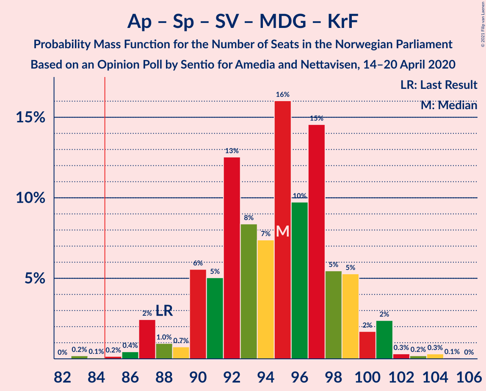

| Number of Seats | Probability | Accumulated | Special Marks |
|:---------------:|:-----------:|:-----------:|:-------------:|
| 83 | 0.2% | 100% |  |
| 84 | 0.1% | 99.8% |  |
| 85 | 0.2% | 99.7% | Majority |
| 86 | 0.4% | 99.5% |  |
| 87 | 2% | 99.1% |  |
| 88 | 1.0% | 97% | Last Result |
| 89 | 0.7% | 96% |  |
| 90 | 6% | 95% |  |
| 91 | 5% | 89% |  |
| 92 | 13% | 84% |  |
| 93 | 8% | 72% | Median |
| 94 | 7% | 63% |  |
| 95 | 16% | 56% |  |
| 96 | 10% | 40% |  |
| 97 | 15% | 30% |  |
| 98 | 5% | 16% |  |
| 99 | 5% | 10% |  |
| 100 | 2% | 5% |  |
| 101 | 2% | 3% |  |
| 102 | 0.3% | 0.9% |  |
| 103 | 0.2% | 0.6% |  |
| 104 | 0.3% | 0.4% |  |
| 105 | 0.1% | 0.1% |  |
| 106 | 0% | 0% |  |

### Arbeiderpartiet – Senterpartiet – Sosialistisk Venstreparti – Miljøpartiet De Grønne – Rødt

| Number of Seats | Probability | Accumulated | Special Marks |
|:---------------:|:-----------:|:-----------:|:-------------:|
| 81 | 0.1% | 100% | Last Result |
| 82 | 0.2% | 99.9% |  |
| 83 | 0.1% | 99.7% |  |
| 84 | 0.4% | 99.6% |  |
| 85 | 0.6% | 99.2% | Majority |
| 86 | 3% | 98.5% |  |
| 87 | 2% | 95% |  |
| 88 | 2% | 93% |  |
| 89 | 6% | 91% |  |
| 90 | 11% | 85% |  |
| 91 | 17% | 74% |  |
| 92 | 8% | 57% | Median |
| 93 | 6% | 49% |  |
| 94 | 15% | 43% |  |
| 95 | 12% | 28% |  |
| 96 | 6% | 16% |  |
| 97 | 4% | 10% |  |
| 98 | 2% | 6% |  |
| 99 | 3% | 4% |  |
| 100 | 0.4% | 0.9% |  |
| 101 | 0.2% | 0.5% |  |
| 102 | 0.1% | 0.3% |  |
| 103 | 0.1% | 0.2% |  |
| 104 | 0% | 0.1% |  |
| 105 | 0% | 0% |  |

### Arbeiderpartiet – Senterpartiet – Sosialistisk Venstreparti – Miljøpartiet De Grønne

| Number of Seats | Probability | Accumulated | Special Marks |
|:---------------:|:-----------:|:-----------:|:-------------:|
| 78 | 0% | 100% |  |
| 79 | 0% | 99.9% |  |
| 80 | 0.4% | 99.9% | Last Result |
| 81 | 0.1% | 99.5% |  |
| 82 | 0.3% | 99.3% |  |
| 83 | 1.3% | 99.0% |  |
| 84 | 3% | 98% |  |
| 85 | 3% | 94% | Majority |
| 86 | 3% | 91% |  |
| 87 | 6% | 88% |  |
| 88 | 9% | 82% |  |
| 89 | 20% | 73% |  |
| 90 | 10% | 53% | Median |
| 91 | 4% | 43% |  |
| 92 | 14% | 39% |  |
| 93 | 8% | 25% |  |
| 94 | 7% | 16% |  |
| 95 | 4% | 9% |  |
| 96 | 1.4% | 5% |  |
| 97 | 3% | 4% |  |
| 98 | 0.6% | 0.8% |  |
| 99 | 0.1% | 0.3% |  |
| 100 | 0.1% | 0.2% |  |
| 101 | 0% | 0.1% |  |
| 102 | 0% | 0% |  |

### Høyre – Fremskrittspartiet – Miljøpartiet De Grønne – Kristelig Folkeparti – Venstre

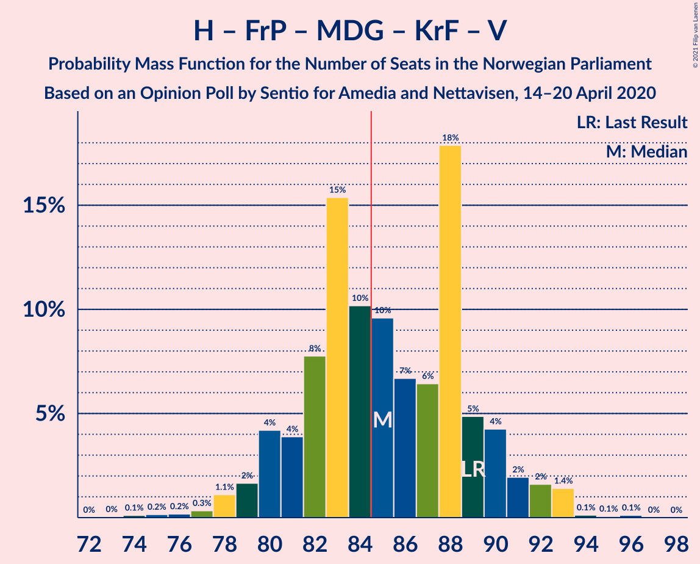

| Number of Seats | Probability | Accumulated | Special Marks |
|:---------------:|:-----------:|:-----------:|:-------------:|
| 73 | 0% | 100% |  |
| 74 | 0.1% | 99.9% |  |
| 75 | 0.2% | 99.8% |  |
| 76 | 0.2% | 99.7% |  |
| 77 | 0.3% | 99.5% |  |
| 78 | 1.1% | 99.2% |  |
| 79 | 2% | 98% |  |
| 80 | 4% | 96% |  |
| 81 | 4% | 92% |  |
| 82 | 8% | 88% |  |
| 83 | 15% | 81% | Median |
| 84 | 10% | 65% |  |
| 85 | 10% | 55% | Majority |
| 86 | 7% | 45% |  |
| 87 | 6% | 39% |  |
| 88 | 18% | 32% |  |
| 89 | 5% | 14% | Last Result |
| 90 | 4% | 10% |  |
| 91 | 2% | 5% |  |
| 92 | 2% | 3% |  |
| 93 | 1.4% | 2% |  |
| 94 | 0.1% | 0.3% |  |
| 95 | 0.1% | 0.2% |  |
| 96 | 0.1% | 0.1% |  |
| 97 | 0% | 0% |  |

### Arbeiderpartiet – Senterpartiet – Sosialistisk Venstreparti – Rødt

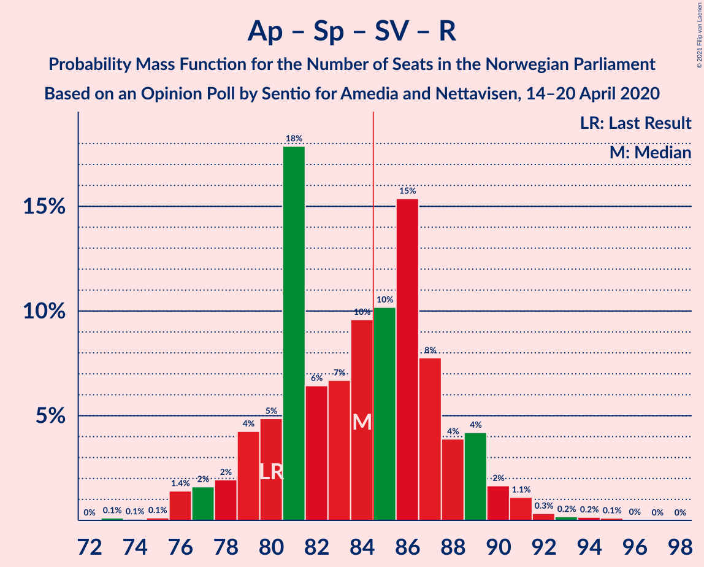

| Number of Seats | Probability | Accumulated | Special Marks |
|:---------------:|:-----------:|:-----------:|:-------------:|
| 73 | 0.1% | 100% |  |
| 74 | 0.1% | 99.9% |  |
| 75 | 0.1% | 99.8% |  |
| 76 | 1.4% | 99.7% |  |
| 77 | 2% | 98% |  |
| 78 | 2% | 97% |  |
| 79 | 4% | 95% |  |
| 80 | 5% | 90% | Last Result |
| 81 | 18% | 86% |  |
| 82 | 6% | 68% |  |
| 83 | 7% | 61% | Median |
| 84 | 10% | 55% |  |
| 85 | 10% | 45% | Majority |
| 86 | 15% | 35% |  |
| 87 | 8% | 19% |  |
| 88 | 4% | 12% |  |
| 89 | 4% | 8% |  |
| 90 | 2% | 4% |  |
| 91 | 1.1% | 2% |  |
| 92 | 0.3% | 0.8% |  |
| 93 | 0.2% | 0.5% |  |
| 94 | 0.2% | 0.3% |  |
| 95 | 0.1% | 0.2% |  |
| 96 | 0% | 0.1% |  |
| 97 | 0% | 0% |  |

### Arbeiderpartiet – Senterpartiet – Miljøpartiet De Grønne – Kristelig Folkeparti

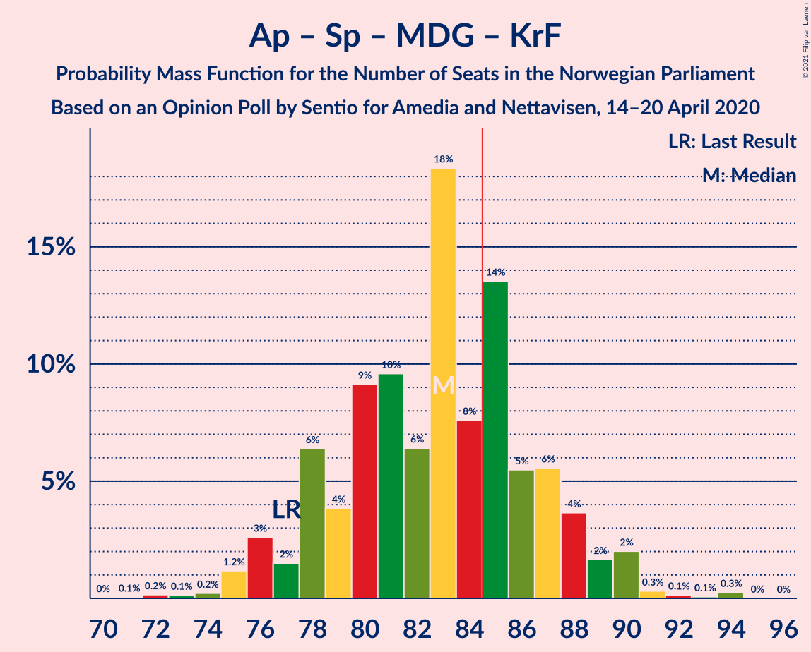

| Number of Seats | Probability | Accumulated | Special Marks |
|:---------------:|:-----------:|:-----------:|:-------------:|
| 71 | 0.1% | 100% |  |
| 72 | 0.2% | 99.9% |  |
| 73 | 0.1% | 99.7% |  |
| 74 | 0.2% | 99.6% |  |
| 75 | 1.2% | 99.4% |  |
| 76 | 3% | 98% |  |
| 77 | 2% | 96% | Last Result |
| 78 | 6% | 94% |  |
| 79 | 4% | 88% |  |
| 80 | 9% | 84% |  |
| 81 | 10% | 75% | Median |
| 82 | 6% | 65% |  |
| 83 | 18% | 59% |  |
| 84 | 8% | 40% |  |
| 85 | 14% | 33% | Majority |
| 86 | 5% | 19% |  |
| 87 | 6% | 14% |  |
| 88 | 4% | 8% |  |
| 89 | 2% | 4% |  |
| 90 | 2% | 3% |  |
| 91 | 0.3% | 0.8% |  |
| 92 | 0.1% | 0.5% |  |
| 93 | 0.1% | 0.3% |  |
| 94 | 0.3% | 0.3% |  |
| 95 | 0% | 0% |  |

### Arbeiderpartiet – Senterpartiet – Sosialistisk Venstreparti

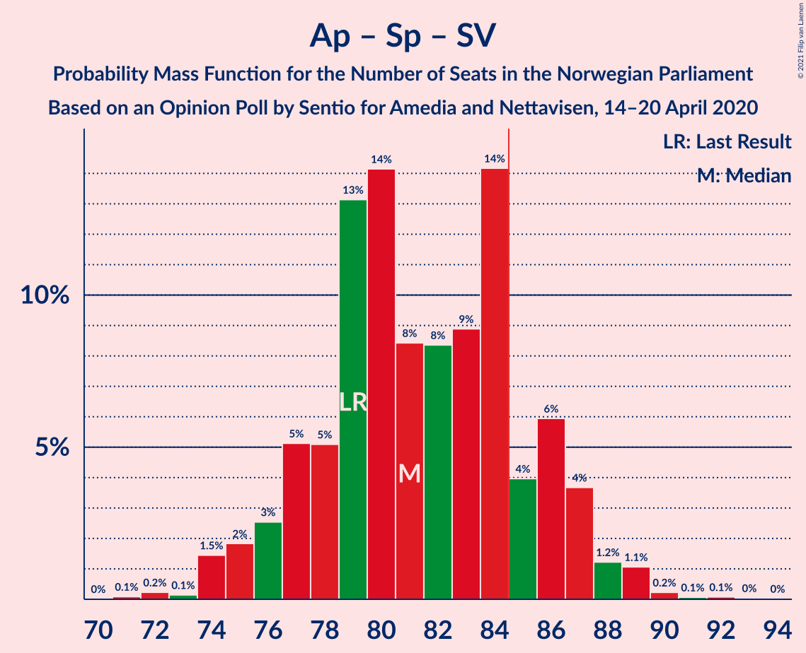

| Number of Seats | Probability | Accumulated | Special Marks |
|:---------------:|:-----------:|:-----------:|:-------------:|
| 71 | 0.1% | 100% |  |
| 72 | 0.2% | 99.9% |  |
| 73 | 0.1% | 99.7% |  |
| 74 | 1.5% | 99.5% |  |
| 75 | 2% | 98% |  |
| 76 | 3% | 96% |  |
| 77 | 5% | 94% |  |
| 78 | 5% | 89% |  |
| 79 | 13% | 83% | Last Result |
| 80 | 14% | 70% |  |
| 81 | 8% | 56% | Median |
| 82 | 8% | 48% |  |
| 83 | 9% | 39% |  |
| 84 | 14% | 30% |  |
| 85 | 4% | 16% | Majority |
| 86 | 6% | 12% |  |
| 87 | 4% | 6% |  |
| 88 | 1.2% | 3% |  |
| 89 | 1.1% | 2% |  |
| 90 | 0.2% | 0.4% |  |
| 91 | 0.1% | 0.2% |  |
| 92 | 0.1% | 0.1% |  |
| 93 | 0% | 0.1% |  |
| 94 | 0% | 0% |  |

### Høyre – Fremskrittspartiet – Kristelig Folkeparti – Venstre

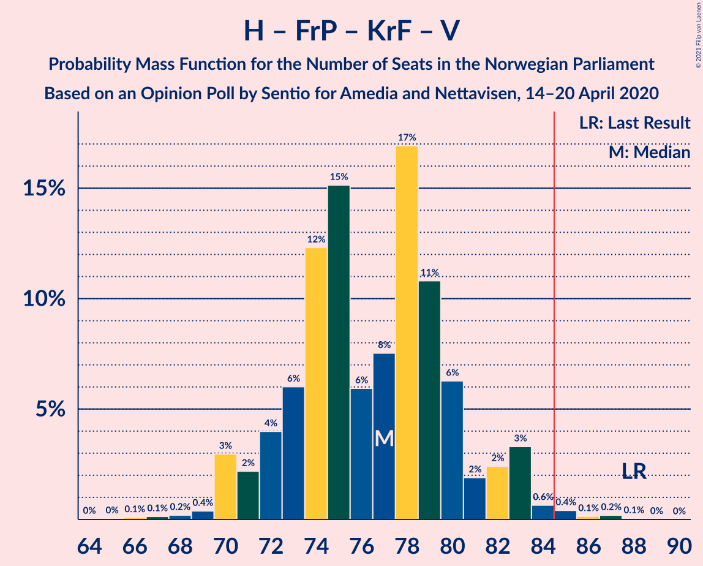

| Number of Seats | Probability | Accumulated | Special Marks |
|:---------------:|:-----------:|:-----------:|:-------------:|
| 65 | 0% | 100% |  |
| 66 | 0.1% | 99.9% |  |
| 67 | 0.1% | 99.8% |  |
| 68 | 0.2% | 99.7% |  |
| 69 | 0.4% | 99.5% |  |
| 70 | 3% | 99.1% |  |
| 71 | 2% | 96% |  |
| 72 | 4% | 94% |  |
| 73 | 6% | 90% |  |
| 74 | 12% | 84% | Median |
| 75 | 15% | 72% |  |
| 76 | 6% | 57% |  |
| 77 | 8% | 51% |  |
| 78 | 17% | 43% |  |
| 79 | 11% | 26% |  |
| 80 | 6% | 15% |  |
| 81 | 2% | 9% |  |
| 82 | 2% | 7% |  |
| 83 | 3% | 5% |  |
| 84 | 0.6% | 1.5% |  |
| 85 | 0.4% | 0.8% | Majority |
| 86 | 0.1% | 0.4% |  |
| 87 | 0.2% | 0.3% |  |
| 88 | 0.1% | 0.1% | Last Result |
| 89 | 0% | 0% |  |

### Arbeiderpartiet – Senterpartiet – Kristelig Folkeparti

| Number of Seats | Probability | Accumulated | Special Marks |
|:---------------:|:-----------:|:-----------:|:-------------:|
| 64 | 0.1% | 100% |  |
| 65 | 0.1% | 99.9% |  |
| 66 | 0.9% | 99.8% |  |
| 67 | 1.4% | 98.8% |  |
| 68 | 4% | 97% |  |
| 69 | 3% | 94% |  |
| 70 | 6% | 91% |  |
| 71 | 7% | 85% |  |
| 72 | 10% | 78% | Median |
| 73 | 11% | 68% |  |
| 74 | 6% | 57% |  |
| 75 | 21% | 51% |  |
| 76 | 7% | 29% | Last Result |
| 77 | 9% | 22% |  |
| 78 | 5% | 13% |  |
| 79 | 3% | 8% |  |
| 80 | 0.8% | 5% |  |
| 81 | 3% | 4% |  |
| 82 | 0.8% | 2% |  |
| 83 | 0.3% | 0.8% |  |
| 84 | 0.4% | 0.6% |  |
| 85 | 0.1% | 0.1% | Majority |
| 86 | 0% | 0.1% |  |
| 87 | 0% | 0% |  |

### Høyre – Fremskrittspartiet – Venstre

| Number of Seats | Probability | Accumulated | Special Marks |
|:---------------:|:-----------:|:-----------:|:-------------:|
| 61 | 0% | 100% |  |
| 62 | 0.2% | 99.9% |  |
| 63 | 0.4% | 99.8% |  |
| 64 | 0.3% | 99.4% |  |
| 65 | 0.5% | 99.2% |  |
| 66 | 2% | 98.7% |  |
| 67 | 4% | 96% |  |
| 68 | 6% | 92% |  |
| 69 | 4% | 87% |  |
| 70 | 14% | 82% |  |
| 71 | 10% | 68% | Median |
| 72 | 16% | 58% |  |
| 73 | 8% | 41% |  |
| 74 | 7% | 33% |  |
| 75 | 9% | 26% |  |
| 76 | 10% | 17% |  |
| 77 | 3% | 7% |  |
| 78 | 2% | 4% |  |
| 79 | 0.6% | 2% |  |
| 80 | 0.7% | 1.3% | Last Result |
| 81 | 0.4% | 0.6% |  |
| 82 | 0.1% | 0.2% |  |
| 83 | 0% | 0.2% |  |
| 84 | 0.1% | 0.1% |  |
| 85 | 0% | 0% | Majority |

### Arbeiderpartiet – Senterpartiet

| Number of Seats | Probability | Accumulated | Special Marks |
|:---------------:|:-----------:|:-----------:|:-------------:|
| 60 | 0% | 100% |  |
| 61 | 0.2% | 99.9% |  |
| 62 | 0.2% | 99.7% |  |
| 63 | 1.2% | 99.5% |  |
| 64 | 2% | 98% |  |
| 65 | 5% | 96% |  |
| 66 | 7% | 91% |  |
| 67 | 12% | 84% |  |
| 68 | 11% | 72% | Last Result |
| 69 | 11% | 61% | Median |
| 70 | 11% | 50% |  |
| 71 | 6% | 39% |  |
| 72 | 14% | 33% |  |
| 73 | 7% | 19% |  |
| 74 | 6% | 12% |  |
| 75 | 4% | 7% |  |
| 76 | 0.8% | 2% |  |
| 77 | 0.8% | 2% |  |
| 78 | 0.7% | 0.9% |  |
| 79 | 0.1% | 0.3% |  |
| 80 | 0.1% | 0.1% |  |
| 81 | 0% | 0% |  |

### Høyre – Fremskrittspartiet

| Number of Seats | Probability | Accumulated | Special Marks |
|:---------------:|:-----------:|:-----------:|:-------------:|
| 58 | 0.1% | 100% |  |
| 59 | 0.1% | 99.9% |  |
| 60 | 0.3% | 99.9% |  |
| 61 | 1.3% | 99.6% |  |
| 62 | 0.4% | 98% |  |
| 63 | 0.7% | 98% |  |
| 64 | 3% | 97% |  |
| 65 | 4% | 94% |  |
| 66 | 5% | 89% |  |
| 67 | 6% | 84% |  |
| 68 | 16% | 79% |  |
| 69 | 10% | 63% | Median |
| 70 | 17% | 52% |  |
| 71 | 9% | 36% |  |
| 72 | 7% | 27% | Last Result |
| 73 | 7% | 20% |  |
| 74 | 9% | 13% |  |
| 75 | 2% | 4% |  |
| 76 | 0.4% | 2% |  |
| 77 | 0.4% | 1.1% |  |
| 78 | 0.4% | 0.7% |  |
| 79 | 0.2% | 0.3% |  |
| 80 | 0% | 0% |  |

### Arbeiderpartiet – Sosialistisk Venstreparti

| Number of Seats | Probability | Accumulated | Special Marks |
|:---------------:|:-----------:|:-----------:|:-------------:|
| 47 | 0% | 100% |  |
| 48 | 0.2% | 99.9% |  |
| 49 | 0.3% | 99.8% |  |
| 50 | 1.3% | 99.5% |  |
| 51 | 4% | 98% |  |
| 52 | 4% | 94% |  |
| 53 | 7% | 91% |  |
| 54 | 16% | 84% |  |
| 55 | 16% | 68% |  |
| 56 | 8% | 52% | Median |
| 57 | 17% | 44% |  |
| 58 | 5% | 27% |  |
| 59 | 12% | 23% |  |
| 60 | 4% | 10% | Last Result |
| 61 | 3% | 6% |  |
| 62 | 1.3% | 3% |  |
| 63 | 0.9% | 1.4% |  |
| 64 | 0.2% | 0.4% |  |
| 65 | 0.2% | 0.3% |  |
| 66 | 0% | 0.1% |  |
| 67 | 0% | 0% |  |

### Høyre – Kristelig Folkeparti – Venstre

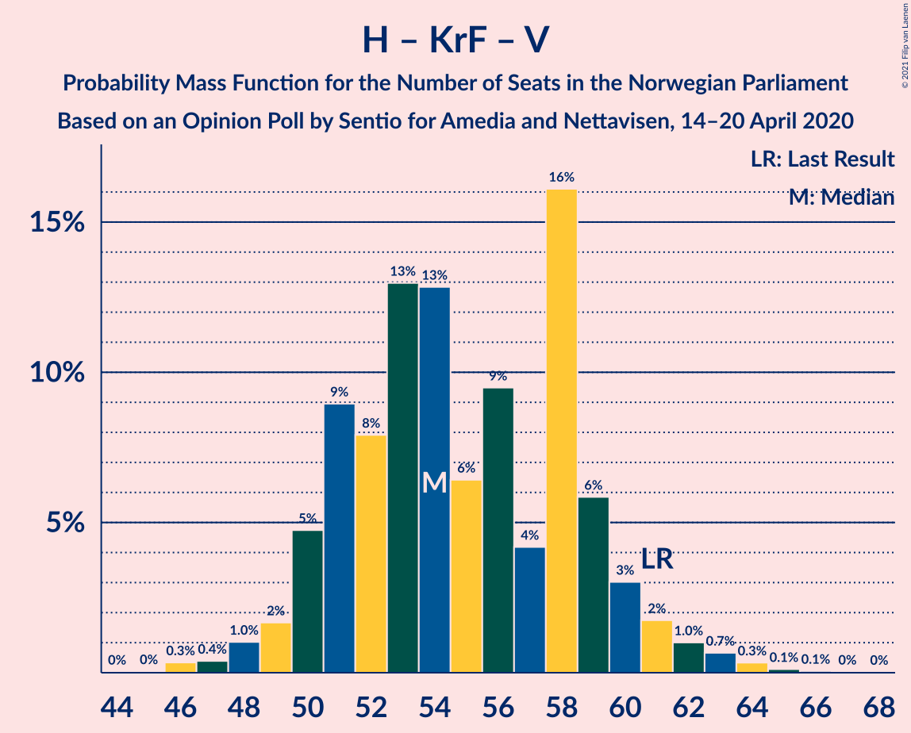

| Number of Seats | Probability | Accumulated | Special Marks |
|:---------------:|:-----------:|:-----------:|:-------------:|
| 45 | 0% | 100% |  |
| 46 | 0.3% | 99.9% |  |
| 47 | 0.4% | 99.6% |  |
| 48 | 1.0% | 99.2% |  |
| 49 | 2% | 98% |  |
| 50 | 5% | 96% |  |
| 51 | 9% | 92% |  |
| 52 | 8% | 83% |  |
| 53 | 13% | 75% | Median |
| 54 | 13% | 62% |  |
| 55 | 6% | 49% |  |
| 56 | 9% | 43% |  |
| 57 | 4% | 33% |  |
| 58 | 16% | 29% |  |
| 59 | 6% | 13% |  |
| 60 | 3% | 7% |  |
| 61 | 2% | 4% | Last Result |
| 62 | 1.0% | 2% |  |
| 63 | 0.7% | 1.2% |  |
| 64 | 0.3% | 0.6% |  |
| 65 | 0.1% | 0.2% |  |
| 66 | 0.1% | 0.1% |  |
| 67 | 0% | 0.1% |  |
| 68 | 0% | 0% |  |

### Senterpartiet – Kristelig Folkeparti – Venstre

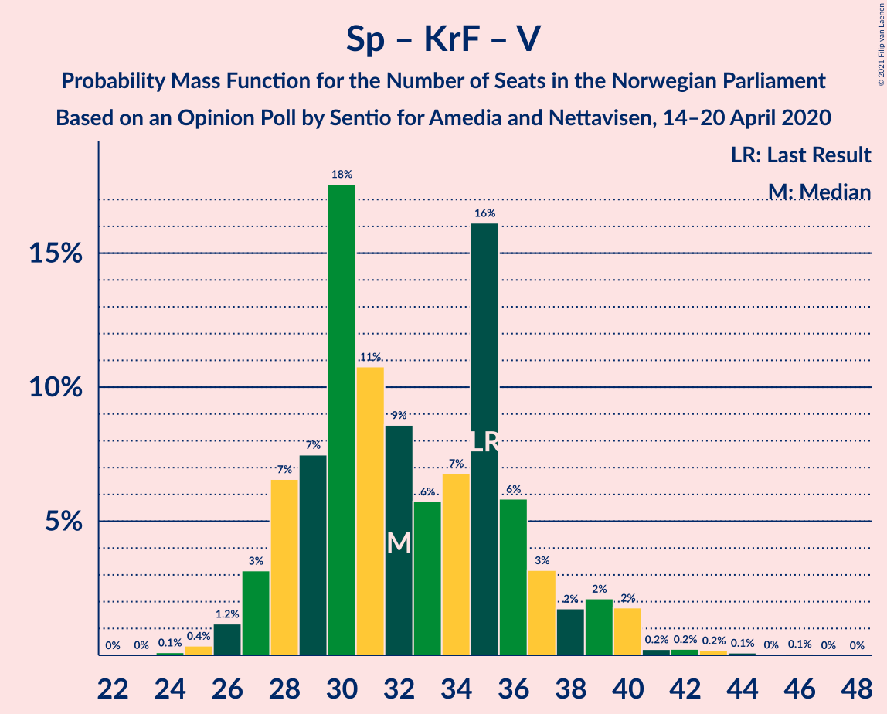

| Number of Seats | Probability | Accumulated | Special Marks |
|:---------------:|:-----------:|:-----------:|:-------------:|
| 24 | 0.1% | 100% |  |
| 25 | 0.4% | 99.9% |  |
| 26 | 1.2% | 99.5% |  |
| 27 | 3% | 98% |  |
| 28 | 7% | 95% |  |
| 29 | 7% | 89% |  |
| 30 | 18% | 81% | Median |
| 31 | 11% | 64% |  |
| 32 | 9% | 53% |  |
| 33 | 6% | 44% |  |
| 34 | 7% | 38% |  |
| 35 | 16% | 32% | Last Result |
| 36 | 6% | 16% |  |
| 37 | 3% | 10% |  |
| 38 | 2% | 6% |  |
| 39 | 2% | 5% |  |
| 40 | 2% | 3% |  |
| 41 | 0.2% | 0.8% |  |
| 42 | 0.2% | 0.6% |  |
| 43 | 0.2% | 0.4% |  |
| 44 | 0.1% | 0.2% |  |
| 45 | 0% | 0.1% |  |
| 46 | 0.1% | 0.1% |  |
| 47 | 0% | 0% |  |

## Technical Information

### Opinion Poll

+ **Polling firm:** Sentio
+ **Commissioner(s):** Amedia and Nettavisen
+ **Fieldwork period:** 14–20 April 2020

### Calculations

+ **Sample size:** 1000
+ **Simulations done:** 1,048,576
+ **Error estimate:** 1.72%

