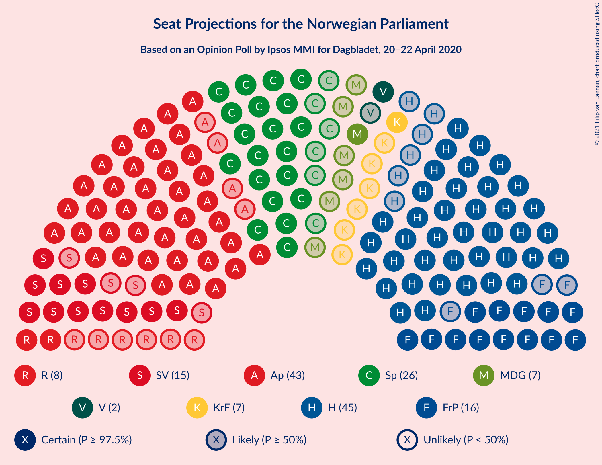
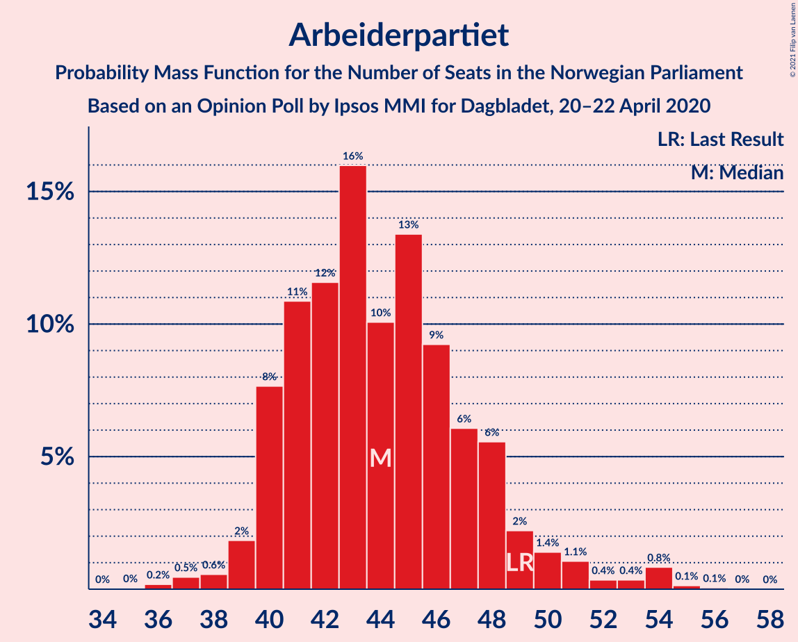
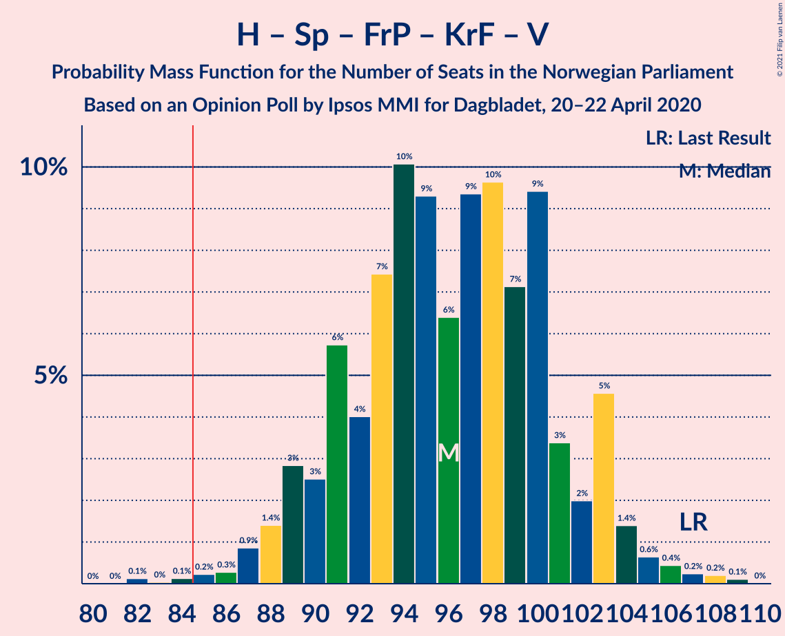
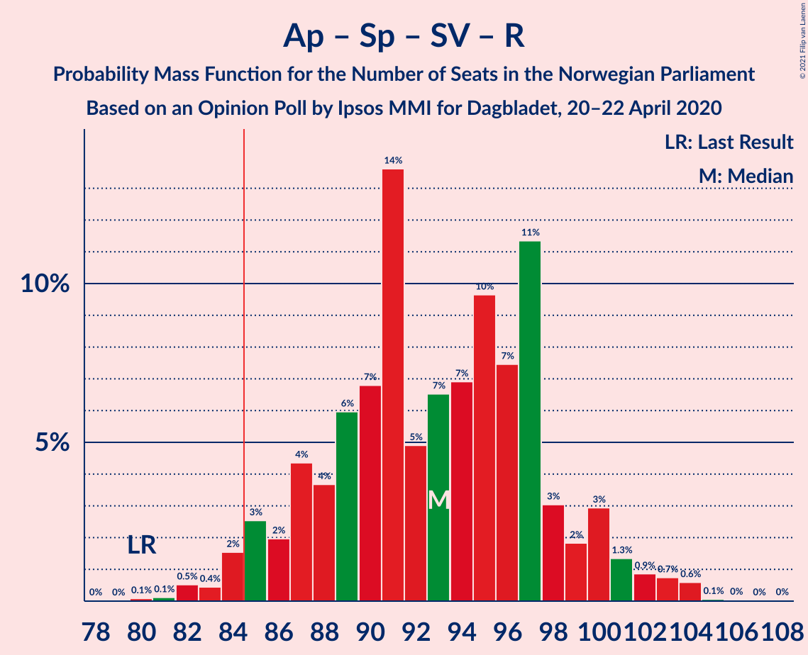
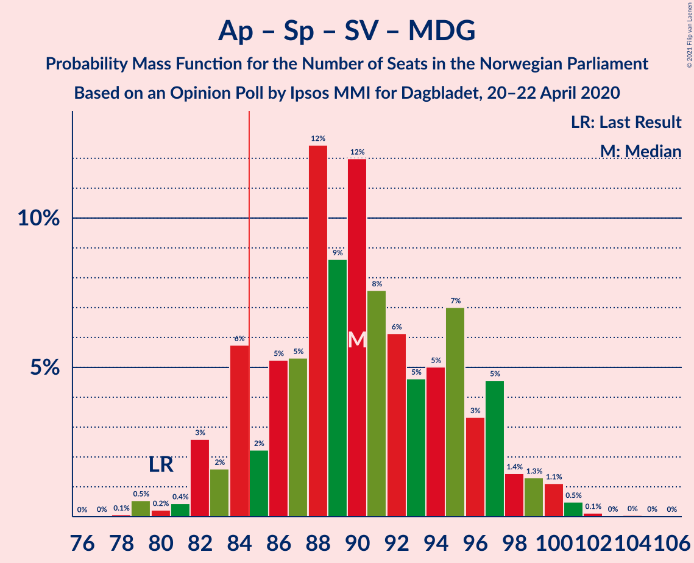
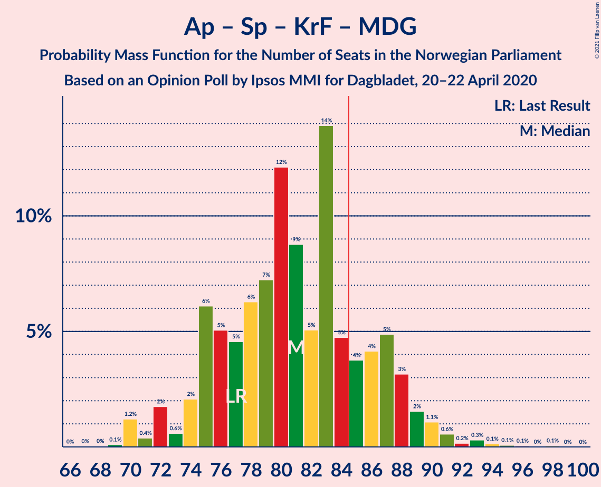

# Opinion Poll by Ipsos MMI for Dagbladet, 20–22 April 2020

<a href="#voting-intentions">Voting Intentions</a> | <a href="#seats">Seats</a> | <a href="#coalitions">Coalitions</a> | <a href="#technical-information">Technical Information</a>

## Voting Intentions

### Confidence Intervals

| Party | Last Result | Poll Result | 80% Confidence Interval | 90% Confidence Interval | 95% Confidence Interval | 99% Confidence Interval |
|:-----:|:-----------:|:-----------:|:-----------------------:|:-----------------------:|:-----------------------:|:-----------------------:|
| Høyre | 25.0% | 25.3% | 23.3–27.4% |22.7–28.0% |22.2–28.6% |21.3–29.6% |
| Arbeiderpartiet | 27.4% | 24.4% | 22.5–26.6% |21.9–27.2% |21.4–27.7% |20.5–28.8% |
| Senterpartiet | 10.3% | 14.2% | 12.7–16.0% |12.2–16.5% |11.9–17.0% |11.2–17.9% |
| Fremskrittspartiet | 15.2% | 9.7% | 8.4–11.2% |8.0–11.7% |7.7–12.0% |7.1–12.8% |
| Sosialistisk Venstreparti | 6.0% | 8.6% | 7.4–10.0% |7.0–10.5% |6.7–10.8% |6.2–11.6% |
| Rødt | 2.4% | 4.8% | 3.9–6.0% |3.7–6.4% |3.5–6.7% |3.1–7.3% |
| Miljøpartiet De Grønne | 3.2% | 4.1% | 3.3–5.3% |3.1–5.6% |2.9–5.9% |2.6–6.4% |
| Kristelig Folkeparti | 4.2% | 4.1% | 3.3–5.3% |3.1–5.6% |2.9–5.9% |2.6–6.4% |
| Venstre | 4.4% | 3.0% | 2.4–4.0% |2.2–4.3% |2.0–4.6% |1.7–5.1% |

*Note:* The poll result column reflects the actual value used in the calculations. Published results may vary slightly, and in addition be rounded to fewer digits.

## Seats

### Confidence Intervals

| Party | Last Result | Median | 80% Confidence Interval | 90% Confidence Interval | 95% Confidence Interval | 99% Confidence Interval |
|:-----:|:-----------:|:------:|:-----------------------:|:-----------------------:|:-----------------------:|:-----------------------:|
| <a href="#høyre">Høyre</a> | 45 | 46 | 41–49 |39–51 |39–51 |37–54 |
| <a href="#arbeiderpartiet">Arbeiderpartiet</a> | 49 | 45 | 41–47 |40–50 |39–51 |36–56 |
| <a href="#senterpartiet">Senterpartiet</a> | 19 | 26 | 23–31 |21–31 |20–32 |19–34 |
| <a href="#fremskrittspartiet">Fremskrittspartiet</a> | 27 | 16 | 15–19 |14–20 |14–21 |12–22 |
| <a href="#sosialistisk-venstreparti">Sosialistisk Venstreparti</a> | 11 | 15 | 13–16 |12–18 |11–19 |11–20 |
| <a href="#rødt">Rødt</a> | 1 | 9 | 7–11 |2–11 |2–12 |2–12 |
| <a href="#miljøpartiet-de-grønne">Miljøpartiet De Grønne</a> | 1 | 3 | 1–9 |1–9 |1–9 |1–11 |
| <a href="#kristelig-folkeparti">Kristelig Folkeparti</a> | 8 | 7 | 2–9 |1–9 |1–10 |1–11 |
| <a href="#venstre">Venstre</a> | 8 | 2 | 1–7 |1–7 |1–8 |0–8 |

### Høyre

*For a full overview of the results for this party, see the [Høyre](party-høyre.html) page.*

| Number of Seats | Probability | Accumulated | Special Marks |
|:---------------:|:-----------:|:-----------:|:-------------:|
| 35 | 0.1% | 100% |  |
| 36 | 0.2% | 99.9% |  |
| 37 | 0.8% | 99.7% |  |
| 38 | 0.6% | 99.0% |  |
| 39 | 4% | 98% |  |
| 40 | 2% | 95% |  |
| 41 | 8% | 92% |  |
| 42 | 11% | 85% |  |
| 43 | 3% | 73% |  |
| 44 | 4% | 70% |  |
| 45 | 7% | 67% | Last Result |
| 46 | 34% | 59% | Median |
| 47 | 10% | 25% |  |
| 48 | 2% | 15% |  |
| 49 | 3% | 13% |  |
| 50 | 1.2% | 10% |  |
| 51 | 6% | 9% |  |
| 52 | 1.0% | 2% |  |
| 53 | 0.8% | 1.5% |  |
| 54 | 0.4% | 0.7% |  |
| 55 | 0.2% | 0.3% |  |
| 56 | 0.1% | 0.1% |  |
| 57 | 0% | 0% |  |

### Arbeiderpartiet

*For a full overview of the results for this party, see the [Arbeiderpartiet](party-arbeiderpartiet.html) page.*

| Number of Seats | Probability | Accumulated | Special Marks |
|:---------------:|:-----------:|:-----------:|:-------------:|
| 36 | 0.7% | 100% |  |
| 37 | 0.1% | 99.3% |  |
| 38 | 0.6% | 99.2% |  |
| 39 | 4% | 98.6% |  |
| 40 | 4% | 95% |  |
| 41 | 15% | 91% |  |
| 42 | 6% | 76% |  |
| 43 | 12% | 70% |  |
| 44 | 7% | 58% |  |
| 45 | 2% | 52% | Median |
| 46 | 31% | 49% |  |
| 47 | 9% | 18% |  |
| 48 | 0.9% | 9% |  |
| 49 | 2% | 8% | Last Result |
| 50 | 3% | 6% |  |
| 51 | 1.3% | 3% |  |
| 52 | 0.5% | 2% |  |
| 53 | 0.1% | 1.1% |  |
| 54 | 0.4% | 1.0% |  |
| 55 | 0% | 0.6% |  |
| 56 | 0.5% | 0.6% |  |
| 57 | 0% | 0% |  |

### Senterpartiet

*For a full overview of the results for this party, see the [Senterpartiet](party-senterpartiet.html) page.*

| Number of Seats | Probability | Accumulated | Special Marks |
|:---------------:|:-----------:|:-----------:|:-------------:|
| 18 | 0.3% | 100% |  |
| 19 | 1.1% | 99.7% | Last Result |
| 20 | 2% | 98.6% |  |
| 21 | 2% | 96% |  |
| 22 | 4% | 94% |  |
| 23 | 10% | 90% |  |
| 24 | 6% | 80% |  |
| 25 | 15% | 74% |  |
| 26 | 33% | 59% | Median |
| 27 | 4% | 26% |  |
| 28 | 1.4% | 21% |  |
| 29 | 3% | 20% |  |
| 30 | 4% | 16% |  |
| 31 | 7% | 12% |  |
| 32 | 3% | 5% |  |
| 33 | 1.0% | 2% |  |
| 34 | 0.1% | 0.5% |  |
| 35 | 0.3% | 0.4% |  |
| 36 | 0% | 0.1% |  |
| 37 | 0% | 0% |  |

### Fremskrittspartiet

*For a full overview of the results for this party, see the [Fremskrittspartiet](party-fremskrittspartiet.html) page.*

| Number of Seats | Probability | Accumulated | Special Marks |
|:---------------:|:-----------:|:-----------:|:-------------:|
| 10 | 0.4% | 100% |  |
| 11 | 0.1% | 99.6% |  |
| 12 | 0.2% | 99.5% |  |
| 13 | 0.6% | 99.3% |  |
| 14 | 5% | 98.7% |  |
| 15 | 10% | 94% |  |
| 16 | 43% | 84% | Median |
| 17 | 17% | 41% |  |
| 18 | 6% | 24% |  |
| 19 | 10% | 18% |  |
| 20 | 4% | 8% |  |
| 21 | 3% | 4% |  |
| 22 | 0.7% | 1.1% |  |
| 23 | 0.2% | 0.4% |  |
| 24 | 0.1% | 0.2% |  |
| 25 | 0.2% | 0.2% |  |
| 26 | 0% | 0% |  |
| 27 | 0% | 0% | Last Result |

### Sosialistisk Venstreparti

*For a full overview of the results for this party, see the [Sosialistisk Venstreparti](party-sosialistiskvenstreparti.html) page.*

| Number of Seats | Probability | Accumulated | Special Marks |
|:---------------:|:-----------:|:-----------:|:-------------:|
| 10 | 0.3% | 100% |  |
| 11 | 4% | 99.7% | Last Result |
| 12 | 5% | 96% |  |
| 13 | 8% | 90% |  |
| 14 | 10% | 82% |  |
| 15 | 42% | 72% | Median |
| 16 | 23% | 30% |  |
| 17 | 1.2% | 7% |  |
| 18 | 0.6% | 6% |  |
| 19 | 4% | 5% |  |
| 20 | 1.3% | 1.4% |  |
| 21 | 0.1% | 0.1% |  |
| 22 | 0% | 0% |  |

### Rødt

*For a full overview of the results for this party, see the [Rødt](party-rødt.html) page.*

| Number of Seats | Probability | Accumulated | Special Marks |
|:---------------:|:-----------:|:-----------:|:-------------:|
| 1 | 0.2% | 100% | Last Result |
| 2 | 6% | 99.8% |  |
| 3 | 0% | 93% |  |
| 4 | 0% | 93% |  |
| 5 | 0% | 93% |  |
| 6 | 0% | 93% |  |
| 7 | 8% | 93% |  |
| 8 | 18% | 85% |  |
| 9 | 25% | 67% | Median |
| 10 | 33% | 43% |  |
| 11 | 5% | 10% |  |
| 12 | 4% | 5% |  |
| 13 | 0.2% | 0.4% |  |
| 14 | 0.2% | 0.2% |  |
| 15 | 0% | 0% |  |

### Miljøpartiet De Grønne

*For a full overview of the results for this party, see the [Miljøpartiet De Grønne](party-miljøpartietdegrønne.html) page.*

| Number of Seats | Probability | Accumulated | Special Marks |
|:---------------:|:-----------:|:-----------:|:-------------:|
| 1 | 34% | 100% | Last Result |
| 2 | 16% | 66% |  |
| 3 | 0.5% | 50% | Median |
| 4 | 0% | 49% |  |
| 5 | 0% | 49% |  |
| 6 | 0% | 49% |  |
| 7 | 12% | 49% |  |
| 8 | 27% | 37% |  |
| 9 | 8% | 10% |  |
| 10 | 1.1% | 2% |  |
| 11 | 0.6% | 0.7% |  |
| 12 | 0.1% | 0.1% |  |
| 13 | 0.1% | 0.1% |  |
| 14 | 0% | 0% |  |

### Kristelig Folkeparti

*For a full overview of the results for this party, see the [Kristelig Folkeparti](party-kristeligfolkeparti.html) page.*

| Number of Seats | Probability | Accumulated | Special Marks |
|:---------------:|:-----------:|:-----------:|:-------------:|
| 0 | 0.2% | 100% |  |
| 1 | 6% | 99.8% |  |
| 2 | 6% | 94% |  |
| 3 | 21% | 88% |  |
| 4 | 0% | 67% |  |
| 5 | 0% | 67% |  |
| 6 | 0% | 67% |  |
| 7 | 40% | 67% | Median |
| 8 | 14% | 27% | Last Result |
| 9 | 10% | 13% |  |
| 10 | 3% | 4% |  |
| 11 | 0.3% | 0.7% |  |
| 12 | 0.4% | 0.4% |  |
| 13 | 0% | 0% |  |

### Venstre

*For a full overview of the results for this party, see the [Venstre](party-venstre.html) page.*

| Number of Seats | Probability | Accumulated | Special Marks |
|:---------------:|:-----------:|:-----------:|:-------------:|
| 0 | 0.7% | 100% |  |
| 1 | 21% | 99.3% |  |
| 2 | 63% | 78% | Median |
| 3 | 0% | 15% |  |
| 4 | 0% | 15% |  |
| 5 | 0% | 15% |  |
| 6 | 0.1% | 15% |  |
| 7 | 12% | 15% |  |
| 8 | 3% | 3% | Last Result |
| 9 | 0.2% | 0.2% |  |
| 10 | 0% | 0% |  |

## Coalitions

### Confidence Intervals

| Coalition | Last Result | Median | Majority? | 80% Confidence Interval | 90% Confidence Interval | 95% Confidence Interval | 99% Confidence Interval |
|:---------:|:-----------:|:------:|:---------:|:-----------------------:|:-----------------------:|:-----------------------:|:-----------------------:|
| Arbeiderpartiet – Senterpartiet – Sosialistisk Venstreparti – Rødt – Miljøpartiet De Grønne | 81 | 98 | 100% | 91–105 | 89–105 | 89–106 | 88–108 |
| Høyre – Senterpartiet – Fremskrittspartiet – Kristelig Folkeparti – Venstre | 107 | 97 | 99.8% | 90–101 | 89–105 | 89–105 | 86–106 |
| Arbeiderpartiet – Senterpartiet – Sosialistisk Venstreparti – Kristelig Folkeparti – Miljøpartiet De Grønne | 88 | 95 | 99.9% | 90–102 | 88–105 | 88–105 | 86–109 |
| Arbeiderpartiet – Senterpartiet – Sosialistisk Venstreparti – Rødt | 80 | 96 | 98.7% | 87–97 | 87–98 | 85–100 | 83–104 |
| Arbeiderpartiet – Senterpartiet – Sosialistisk Venstreparti – Miljøpartiet De Grønne | 80 | 88 | 88% | 82–96 | 81–97 | 81–97 | 80–102 |
| Arbeiderpartiet – Senterpartiet – Sosialistisk Venstreparti | 79 | 87 | 71% | 79–88 | 79–90 | 78–92 | 75–96 |
| Arbeiderpartiet – Senterpartiet – Kristelig Folkeparti – Miljøpartiet De Grønne | 77 | 80 | 16% | 75–87 | 75–89 | 74–89 | 71–94 |
| Arbeiderpartiet – Senterpartiet – Kristelig Folkeparti | 76 | 77 | 2% | 70–80 | 69–81 | 69–84 | 66–88 |
| Høyre – Fremskrittspartiet – Kristelig Folkeparti – Miljøpartiet De Grønne – Venstre | 89 | 73 | 1.3% | 72–82 | 71–82 | 69–84 | 65–86 |
| Høyre – Fremskrittspartiet – Kristelig Folkeparti – Venstre | 88 | 71 | 0% | 64–78 | 64–80 | 63–80 | 60–81 |
| Arbeiderpartiet – Senterpartiet | 68 | 72 | 0% | 66–73 | 64–75 | 63–77 | 61–82 |
| Høyre – Fremskrittspartiet – Venstre | 80 | 64 | 0% | 58–71 | 57–73 | 57–73 | 56–74 |
| Høyre – Fremskrittspartiet | 72 | 62 | 0% | 57–66 | 55–69 | 55–69 | 54–72 |
| Arbeiderpartiet – Sosialistisk Venstreparti | 60 | 60 | 0% | 54–63 | 54–66 | 54–66 | 50–71 |
| Høyre – Kristelig Folkeparti – Venstre | 61 | 55 | 0% | 47–59 | 47–65 | 46–65 | 44–65 |
| Senterpartiet – Kristelig Folkeparti – Venstre | 35 | 35 | 0% | 29–40 | 28–41 | 27–43 | 25–44 |

### Arbeiderpartiet – Senterpartiet – Sosialistisk Venstreparti – Rødt – Miljøpartiet De Grønne

| Number of Seats | Probability | Accumulated | Special Marks |
|:---------------:|:-----------:|:-----------:|:-------------:|
| 81 | 0% | 100% | Last Result |
| 82 | 0% | 100% |  |
| 83 | 0% | 100% |  |
| 84 | 0% | 100% |  |
| 85 | 0.1% | 100% | Majority |
| 86 | 0% | 99.9% |  |
| 87 | 0.1% | 99.8% |  |
| 88 | 0.4% | 99.7% |  |
| 89 | 6% | 99.3% |  |
| 90 | 1.3% | 93% |  |
| 91 | 3% | 92% |  |
| 92 | 2% | 89% |  |
| 93 | 2% | 87% |  |
| 94 | 2% | 85% |  |
| 95 | 2% | 83% |  |
| 96 | 6% | 81% |  |
| 97 | 2% | 76% |  |
| 98 | 31% | 74% | Median |
| 99 | 6% | 43% |  |
| 100 | 4% | 37% |  |
| 101 | 3% | 33% |  |
| 102 | 1.4% | 30% |  |
| 103 | 15% | 28% |  |
| 104 | 2% | 13% |  |
| 105 | 8% | 11% |  |
| 106 | 2% | 3% |  |
| 107 | 0.5% | 1.2% |  |
| 108 | 0.2% | 0.7% |  |
| 109 | 0.3% | 0.5% |  |
| 110 | 0.1% | 0.1% |  |
| 111 | 0% | 0.1% |  |
| 112 | 0.1% | 0.1% |  |
| 113 | 0% | 0% |  |

### Høyre – Senterpartiet – Fremskrittspartiet – Kristelig Folkeparti – Venstre

| Number of Seats | Probability | Accumulated | Special Marks |
|:---------------:|:-----------:|:-----------:|:-------------:|
| 82 | 0.1% | 100% |  |
| 83 | 0% | 99.9% |  |
| 84 | 0.1% | 99.9% |  |
| 85 | 0.3% | 99.8% | Majority |
| 86 | 0.2% | 99.5% |  |
| 87 | 0.9% | 99.4% |  |
| 88 | 0.4% | 98% |  |
| 89 | 7% | 98% |  |
| 90 | 2% | 91% |  |
| 91 | 0.4% | 89% |  |
| 92 | 5% | 89% |  |
| 93 | 6% | 84% |  |
| 94 | 3% | 78% |  |
| 95 | 4% | 74% |  |
| 96 | 11% | 70% |  |
| 97 | 35% | 59% | Median |
| 98 | 6% | 24% |  |
| 99 | 2% | 18% |  |
| 100 | 6% | 16% |  |
| 101 | 0.6% | 10% |  |
| 102 | 0.6% | 10% |  |
| 103 | 1.2% | 9% |  |
| 104 | 0.3% | 8% |  |
| 105 | 7% | 8% |  |
| 106 | 0.3% | 0.6% |  |
| 107 | 0.2% | 0.3% | Last Result |
| 108 | 0% | 0.2% |  |
| 109 | 0.1% | 0.1% |  |
| 110 | 0% | 0% |  |

### Arbeiderpartiet – Senterpartiet – Sosialistisk Venstreparti – Kristelig Folkeparti – Miljøpartiet De Grønne

| Number of Seats | Probability | Accumulated | Special Marks |
|:---------------:|:-----------:|:-----------:|:-------------:|
| 83 | 0.1% | 100% |  |
| 84 | 0% | 99.9% |  |
| 85 | 0.1% | 99.9% | Majority |
| 86 | 0.3% | 99.8% |  |
| 87 | 0.2% | 99.4% |  |
| 88 | 6% | 99.2% | Last Result |
| 89 | 2% | 93% |  |
| 90 | 5% | 92% |  |
| 91 | 6% | 87% |  |
| 92 | 2% | 81% |  |
| 93 | 1.2% | 79% |  |
| 94 | 3% | 78% |  |
| 95 | 36% | 75% |  |
| 96 | 9% | 39% | Median |
| 97 | 1.4% | 31% |  |
| 98 | 2% | 29% |  |
| 99 | 7% | 27% |  |
| 100 | 6% | 20% |  |
| 101 | 2% | 14% |  |
| 102 | 6% | 13% |  |
| 103 | 0.9% | 6% |  |
| 104 | 0.3% | 5% |  |
| 105 | 4% | 5% |  |
| 106 | 0.2% | 1.0% |  |
| 107 | 0.1% | 0.8% |  |
| 108 | 0.1% | 0.7% |  |
| 109 | 0.2% | 0.7% |  |
| 110 | 0.1% | 0.5% |  |
| 111 | 0.4% | 0.4% |  |
| 112 | 0% | 0% |  |

### Arbeiderpartiet – Senterpartiet – Sosialistisk Venstreparti – Rødt

| Number of Seats | Probability | Accumulated | Special Marks |
|:---------------:|:-----------:|:-----------:|:-------------:|
| 80 | 0% | 100% | Last Result |
| 81 | 0.1% | 100% |  |
| 82 | 0.1% | 99.8% |  |
| 83 | 0.6% | 99.7% |  |
| 84 | 0.4% | 99.1% |  |
| 85 | 2% | 98.7% | Majority |
| 86 | 1.2% | 97% |  |
| 87 | 8% | 95% |  |
| 88 | 7% | 88% |  |
| 89 | 3% | 81% |  |
| 90 | 3% | 78% |  |
| 91 | 5% | 76% |  |
| 92 | 2% | 71% |  |
| 93 | 2% | 68% |  |
| 94 | 5% | 66% |  |
| 95 | 8% | 61% | Median |
| 96 | 8% | 53% |  |
| 97 | 37% | 45% |  |
| 98 | 4% | 8% |  |
| 99 | 1.0% | 4% |  |
| 100 | 1.2% | 3% |  |
| 101 | 0.4% | 2% |  |
| 102 | 0.6% | 1.4% |  |
| 103 | 0.3% | 0.8% |  |
| 104 | 0.3% | 0.5% |  |
| 105 | 0.1% | 0.2% |  |
| 106 | 0% | 0.1% |  |
| 107 | 0% | 0.1% |  |
| 108 | 0% | 0% |  |

### Arbeiderpartiet – Senterpartiet – Sosialistisk Venstreparti – Miljøpartiet De Grønne

| Number of Seats | Probability | Accumulated | Special Marks |
|:---------------:|:-----------:|:-----------:|:-------------:|
| 78 | 0% | 100% |  |
| 79 | 0.1% | 99.9% |  |
| 80 | 1.0% | 99.9% | Last Result |
| 81 | 6% | 98.8% |  |
| 82 | 3% | 93% |  |
| 83 | 1.3% | 90% |  |
| 84 | 0.3% | 88% |  |
| 85 | 0.4% | 88% | Majority |
| 86 | 2% | 88% |  |
| 87 | 5% | 85% |  |
| 88 | 37% | 80% |  |
| 89 | 4% | 43% | Median |
| 90 | 1.0% | 39% |  |
| 91 | 2% | 38% |  |
| 92 | 1.4% | 36% |  |
| 93 | 2% | 34% |  |
| 94 | 13% | 32% |  |
| 95 | 2% | 19% |  |
| 96 | 10% | 17% |  |
| 97 | 5% | 7% |  |
| 98 | 0.7% | 2% |  |
| 99 | 0.3% | 2% |  |
| 100 | 0.3% | 1.4% |  |
| 101 | 0.4% | 1.1% |  |
| 102 | 0.5% | 0.7% |  |
| 103 | 0% | 0.2% |  |
| 104 | 0% | 0.2% |  |
| 105 | 0% | 0.1% |  |
| 106 | 0.1% | 0.1% |  |
| 107 | 0% | 0% |  |

### Arbeiderpartiet – Senterpartiet – Sosialistisk Venstreparti

| Number of Seats | Probability | Accumulated | Special Marks |
|:---------------:|:-----------:|:-----------:|:-------------:|
| 72 | 0.1% | 100% |  |
| 73 | 0% | 99.9% |  |
| 74 | 0.2% | 99.9% |  |
| 75 | 0.9% | 99.7% |  |
| 76 | 0.1% | 98.7% |  |
| 77 | 0.3% | 98.6% |  |
| 78 | 3% | 98% |  |
| 79 | 9% | 96% | Last Result |
| 80 | 9% | 87% |  |
| 81 | 1.4% | 78% |  |
| 82 | 3% | 76% |  |
| 83 | 1.5% | 73% |  |
| 84 | 0.9% | 72% |  |
| 85 | 2% | 71% | Majority |
| 86 | 13% | 69% | Median |
| 87 | 38% | 56% |  |
| 88 | 9% | 19% |  |
| 89 | 4% | 9% |  |
| 90 | 0.9% | 5% |  |
| 91 | 2% | 4% |  |
| 92 | 0.7% | 3% |  |
| 93 | 0.7% | 2% |  |
| 94 | 0.8% | 1.4% |  |
| 95 | 0% | 0.6% |  |
| 96 | 0.1% | 0.6% |  |
| 97 | 0.1% | 0.5% |  |
| 98 | 0.1% | 0.4% |  |
| 99 | 0.2% | 0.3% |  |
| 100 | 0% | 0% |  |

### Arbeiderpartiet – Senterpartiet – Kristelig Folkeparti – Miljøpartiet De Grønne

| Number of Seats | Probability | Accumulated | Special Marks |
|:---------------:|:-----------:|:-----------:|:-------------:|
| 68 | 0% | 100% |  |
| 69 | 0.2% | 99.9% |  |
| 70 | 0.2% | 99.7% |  |
| 71 | 0.1% | 99.5% |  |
| 72 | 0.3% | 99.4% |  |
| 73 | 0.1% | 99.1% |  |
| 74 | 2% | 99.0% |  |
| 75 | 11% | 97% |  |
| 76 | 0.6% | 86% |  |
| 77 | 8% | 86% | Last Result |
| 78 | 3% | 78% |  |
| 79 | 5% | 75% |  |
| 80 | 31% | 70% |  |
| 81 | 5% | 39% | Median |
| 82 | 2% | 35% |  |
| 83 | 8% | 33% |  |
| 84 | 9% | 25% |  |
| 85 | 1.0% | 16% | Majority |
| 86 | 1.2% | 15% |  |
| 87 | 5% | 14% |  |
| 88 | 4% | 9% |  |
| 89 | 4% | 5% |  |
| 90 | 0.1% | 2% |  |
| 91 | 0.7% | 2% |  |
| 92 | 0.2% | 0.9% |  |
| 93 | 0.1% | 0.7% |  |
| 94 | 0.2% | 0.6% |  |
| 95 | 0% | 0.4% |  |
| 96 | 0% | 0.4% |  |
| 97 | 0% | 0.4% |  |
| 98 | 0% | 0.4% |  |
| 99 | 0.4% | 0.4% |  |
| 100 | 0% | 0% |  |

### Arbeiderpartiet – Senterpartiet – Kristelig Folkeparti

| Number of Seats | Probability | Accumulated | Special Marks |
|:---------------:|:-----------:|:-----------:|:-------------:|
| 63 | 0.2% | 100% |  |
| 64 | 0.1% | 99.8% |  |
| 65 | 0% | 99.7% |  |
| 66 | 0.4% | 99.7% |  |
| 67 | 0.5% | 99.3% |  |
| 68 | 0.6% | 98.8% |  |
| 69 | 6% | 98% |  |
| 70 | 2% | 92% |  |
| 71 | 7% | 90% |  |
| 72 | 3% | 83% |  |
| 73 | 10% | 80% |  |
| 74 | 3% | 70% |  |
| 75 | 7% | 67% |  |
| 76 | 9% | 60% | Last Result |
| 77 | 1.2% | 50% |  |
| 78 | 1.3% | 49% | Median |
| 79 | 33% | 48% |  |
| 80 | 8% | 15% |  |
| 81 | 3% | 7% |  |
| 82 | 0.8% | 4% |  |
| 83 | 0.4% | 4% |  |
| 84 | 0.9% | 3% |  |
| 85 | 0.6% | 2% | Majority |
| 86 | 1.0% | 2% |  |
| 87 | 0.2% | 0.7% |  |
| 88 | 0% | 0.5% |  |
| 89 | 0% | 0.5% |  |
| 90 | 0% | 0.5% |  |
| 91 | 0.4% | 0.4% |  |
| 92 | 0% | 0% |  |

### Høyre – Fremskrittspartiet – Kristelig Folkeparti – Miljøpartiet De Grønne – Venstre

| Number of Seats | Probability | Accumulated | Special Marks |
|:---------------:|:-----------:|:-----------:|:-------------:|
| 62 | 0% | 100% |  |
| 63 | 0% | 99.9% |  |
| 64 | 0.1% | 99.9% |  |
| 65 | 0.3% | 99.8% |  |
| 66 | 0.3% | 99.5% |  |
| 67 | 0.7% | 99.2% |  |
| 68 | 0.4% | 98.5% |  |
| 69 | 1.2% | 98% |  |
| 70 | 1.0% | 97% |  |
| 71 | 4% | 96% |  |
| 72 | 37% | 92% |  |
| 73 | 8% | 55% |  |
| 74 | 8% | 47% | Median |
| 75 | 5% | 39% |  |
| 76 | 2% | 34% |  |
| 77 | 2% | 32% |  |
| 78 | 5% | 29% |  |
| 79 | 3% | 24% |  |
| 80 | 3% | 22% |  |
| 81 | 7% | 19% |  |
| 82 | 8% | 12% |  |
| 83 | 1.2% | 5% |  |
| 84 | 2% | 3% |  |
| 85 | 0.4% | 1.3% | Majority |
| 86 | 0.6% | 0.9% |  |
| 87 | 0.1% | 0.3% |  |
| 88 | 0.1% | 0.2% |  |
| 89 | 0% | 0% | Last Result |

### Høyre – Fremskrittspartiet – Kristelig Folkeparti – Venstre

| Number of Seats | Probability | Accumulated | Special Marks |
|:---------------:|:-----------:|:-----------:|:-------------:|
| 57 | 0.1% | 100% |  |
| 58 | 0% | 99.9% |  |
| 59 | 0.1% | 99.9% |  |
| 60 | 0.4% | 99.9% |  |
| 61 | 0.2% | 99.5% |  |
| 62 | 0.5% | 99.3% |  |
| 63 | 2% | 98.7% |  |
| 64 | 8% | 97% |  |
| 65 | 2% | 88% |  |
| 66 | 15% | 87% |  |
| 67 | 1.4% | 72% |  |
| 68 | 3% | 70% |  |
| 69 | 4% | 67% |  |
| 70 | 6% | 63% |  |
| 71 | 31% | 57% | Median |
| 72 | 2% | 26% |  |
| 73 | 6% | 24% |  |
| 74 | 2% | 19% |  |
| 75 | 2% | 17% |  |
| 76 | 2% | 15% |  |
| 77 | 2% | 13% |  |
| 78 | 3% | 11% |  |
| 79 | 1.3% | 8% |  |
| 80 | 6% | 7% |  |
| 81 | 0.4% | 0.7% |  |
| 82 | 0.1% | 0.3% |  |
| 83 | 0% | 0.2% |  |
| 84 | 0.1% | 0.1% |  |
| 85 | 0% | 0% | Majority |
| 86 | 0% | 0% |  |
| 87 | 0% | 0% |  |
| 88 | 0% | 0% | Last Result |

### Arbeiderpartiet – Senterpartiet

| Number of Seats | Probability | Accumulated | Special Marks |
|:---------------:|:-----------:|:-----------:|:-------------:|
| 59 | 0% | 100% |  |
| 60 | 0.2% | 99.9% |  |
| 61 | 1.0% | 99.7% |  |
| 62 | 0.5% | 98.7% |  |
| 63 | 3% | 98% |  |
| 64 | 2% | 95% |  |
| 65 | 3% | 93% |  |
| 66 | 12% | 91% |  |
| 67 | 3% | 78% |  |
| 68 | 3% | 76% | Last Result |
| 69 | 3% | 73% |  |
| 70 | 7% | 69% |  |
| 71 | 8% | 62% | Median |
| 72 | 41% | 54% |  |
| 73 | 4% | 14% |  |
| 74 | 4% | 9% |  |
| 75 | 0.5% | 5% |  |
| 76 | 2% | 5% |  |
| 77 | 0.8% | 3% |  |
| 78 | 0.6% | 2% |  |
| 79 | 0.7% | 2% |  |
| 80 | 0.2% | 1.1% |  |
| 81 | 0.1% | 0.9% |  |
| 82 | 0.7% | 0.8% |  |
| 83 | 0.1% | 0.1% |  |
| 84 | 0% | 0% |  |

### Høyre – Fremskrittspartiet – Venstre

| Number of Seats | Probability | Accumulated | Special Marks |
|:---------------:|:-----------:|:-----------:|:-------------:|
| 52 | 0% | 100% |  |
| 53 | 0.1% | 99.9% |  |
| 54 | 0.2% | 99.9% |  |
| 55 | 0.1% | 99.7% |  |
| 56 | 2% | 99.6% |  |
| 57 | 4% | 98% |  |
| 58 | 5% | 94% |  |
| 59 | 3% | 89% |  |
| 60 | 2% | 86% |  |
| 61 | 9% | 84% |  |
| 62 | 3% | 76% |  |
| 63 | 6% | 72% |  |
| 64 | 32% | 67% | Median |
| 65 | 5% | 35% |  |
| 66 | 0.8% | 30% |  |
| 67 | 8% | 29% |  |
| 68 | 2% | 21% |  |
| 69 | 0.8% | 19% |  |
| 70 | 8% | 18% |  |
| 71 | 2% | 10% |  |
| 72 | 1.4% | 8% |  |
| 73 | 6% | 7% |  |
| 74 | 0.4% | 0.8% |  |
| 75 | 0.2% | 0.4% |  |
| 76 | 0.2% | 0.3% |  |
| 77 | 0% | 0.1% |  |
| 78 | 0% | 0% |  |
| 79 | 0% | 0% |  |
| 80 | 0% | 0% | Last Result |

### Høyre – Fremskrittspartiet

| Number of Seats | Probability | Accumulated | Special Marks |
|:---------------:|:-----------:|:-----------:|:-------------:|
| 50 | 0.1% | 100% |  |
| 51 | 0.1% | 99.9% |  |
| 52 | 0.1% | 99.8% |  |
| 53 | 0.1% | 99.7% |  |
| 54 | 2% | 99.6% |  |
| 55 | 4% | 98% |  |
| 56 | 0.3% | 94% |  |
| 57 | 8% | 93% |  |
| 58 | 2% | 86% |  |
| 59 | 7% | 84% |  |
| 60 | 4% | 77% |  |
| 61 | 7% | 73% |  |
| 62 | 31% | 65% | Median |
| 63 | 12% | 35% |  |
| 64 | 0.9% | 23% |  |
| 65 | 4% | 22% |  |
| 66 | 12% | 18% |  |
| 67 | 0.3% | 6% |  |
| 68 | 0.6% | 6% |  |
| 69 | 3% | 5% |  |
| 70 | 0.9% | 2% |  |
| 71 | 0.4% | 1.1% |  |
| 72 | 0.1% | 0.6% | Last Result |
| 73 | 0.2% | 0.5% |  |
| 74 | 0.2% | 0.3% |  |
| 75 | 0% | 0% |  |

### Arbeiderpartiet – Sosialistisk Venstreparti

| Number of Seats | Probability | Accumulated | Special Marks |
|:---------------:|:-----------:|:-----------:|:-------------:|
| 48 | 0.1% | 100% |  |
| 49 | 0% | 99.9% |  |
| 50 | 0.7% | 99.8% |  |
| 51 | 0.1% | 99.1% |  |
| 52 | 0.2% | 99.1% |  |
| 53 | 0.5% | 98.9% |  |
| 54 | 13% | 98% |  |
| 55 | 2% | 85% |  |
| 56 | 7% | 84% |  |
| 57 | 12% | 77% |  |
| 58 | 6% | 64% |  |
| 59 | 2% | 58% |  |
| 60 | 7% | 56% | Last Result, Median |
| 61 | 31% | 49% |  |
| 62 | 3% | 18% |  |
| 63 | 8% | 15% |  |
| 64 | 2% | 7% |  |
| 65 | 0.5% | 6% |  |
| 66 | 3% | 5% |  |
| 67 | 0.2% | 2% |  |
| 68 | 0.3% | 1.4% |  |
| 69 | 0% | 1.1% |  |
| 70 | 0.1% | 1.1% |  |
| 71 | 0.9% | 0.9% |  |
| 72 | 0% | 0% |  |

### Høyre – Kristelig Folkeparti – Venstre

| Number of Seats | Probability | Accumulated | Special Marks |
|:---------------:|:-----------:|:-----------:|:-------------:|
| 42 | 0.2% | 100% |  |
| 43 | 0.2% | 99.8% |  |
| 44 | 0.6% | 99.6% |  |
| 45 | 1.4% | 99.0% |  |
| 46 | 2% | 98% |  |
| 47 | 7% | 96% |  |
| 48 | 6% | 89% |  |
| 49 | 3% | 83% |  |
| 50 | 11% | 80% |  |
| 51 | 4% | 70% |  |
| 52 | 5% | 66% |  |
| 53 | 5% | 61% |  |
| 54 | 2% | 56% |  |
| 55 | 30% | 54% | Median |
| 56 | 2% | 24% |  |
| 57 | 7% | 22% |  |
| 58 | 4% | 15% |  |
| 59 | 1.2% | 11% |  |
| 60 | 0.6% | 10% |  |
| 61 | 2% | 9% | Last Result |
| 62 | 1.1% | 7% |  |
| 63 | 0.4% | 6% |  |
| 64 | 0.1% | 6% |  |
| 65 | 6% | 6% |  |
| 66 | 0.1% | 0.2% |  |
| 67 | 0.1% | 0.1% |  |
| 68 | 0% | 0% |  |

### Senterpartiet – Kristelig Folkeparti – Venstre

| Number of Seats | Probability | Accumulated | Special Marks |
|:---------------:|:-----------:|:-----------:|:-------------:|
| 23 | 0.1% | 100% |  |
| 24 | 0.1% | 99.9% |  |
| 25 | 0.5% | 99.7% |  |
| 26 | 0.4% | 99.3% |  |
| 27 | 4% | 98.9% |  |
| 28 | 2% | 95% |  |
| 29 | 4% | 93% |  |
| 30 | 9% | 89% |  |
| 31 | 3% | 80% |  |
| 32 | 5% | 77% |  |
| 33 | 9% | 71% |  |
| 34 | 3% | 63% |  |
| 35 | 35% | 60% | Last Result, Median |
| 36 | 0.7% | 25% |  |
| 37 | 1.4% | 24% |  |
| 38 | 4% | 23% |  |
| 39 | 6% | 19% |  |
| 40 | 5% | 13% |  |
| 41 | 4% | 8% |  |
| 42 | 2% | 4% |  |
| 43 | 2% | 3% |  |
| 44 | 0.4% | 0.7% |  |
| 45 | 0.2% | 0.3% |  |
| 46 | 0.1% | 0.2% |  |
| 47 | 0% | 0.1% |  |
| 48 | 0% | 0% |  |

## Technical Information

### Opinion Poll

+ **Polling firm:** Ipsos MMI
+ **Commissioner(s):** Dagbladet
+ **Fieldwork period:** 20–22 April 2020

### Calculations

+ **Sample size:** 724
+ **Simulations done:** 131,072
+ **Error estimate:** 2.90%

