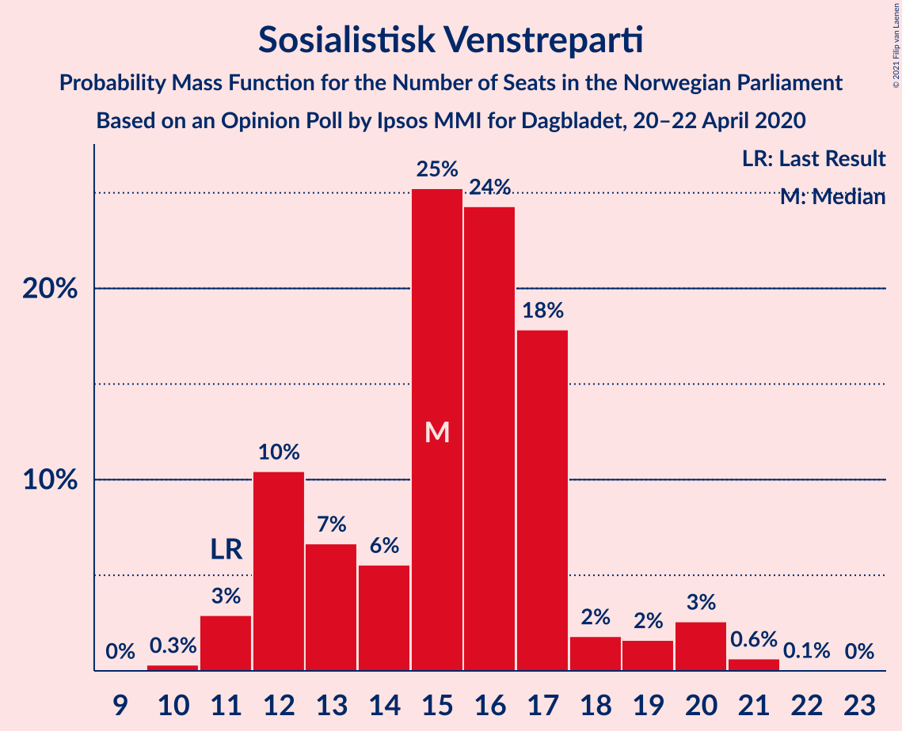
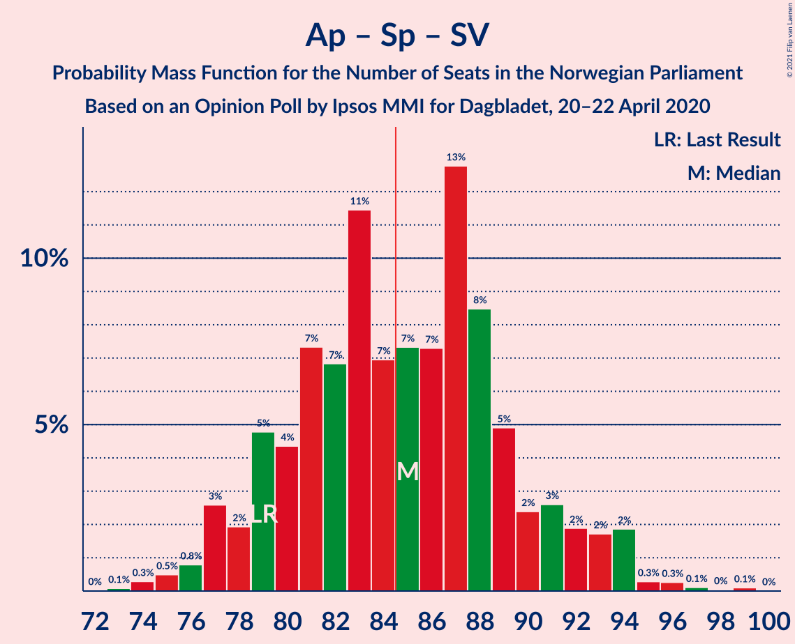
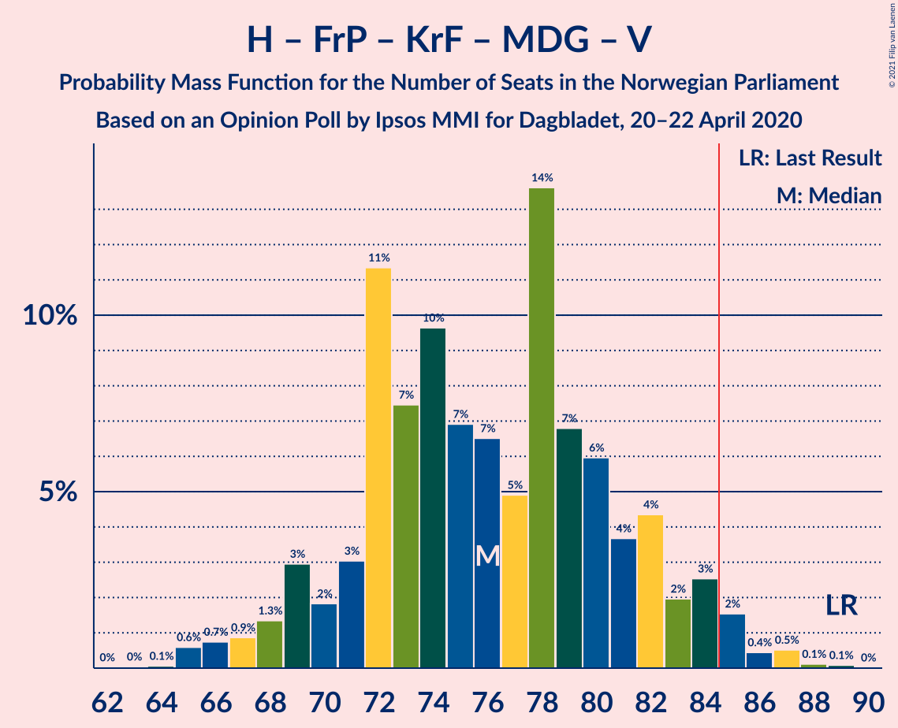
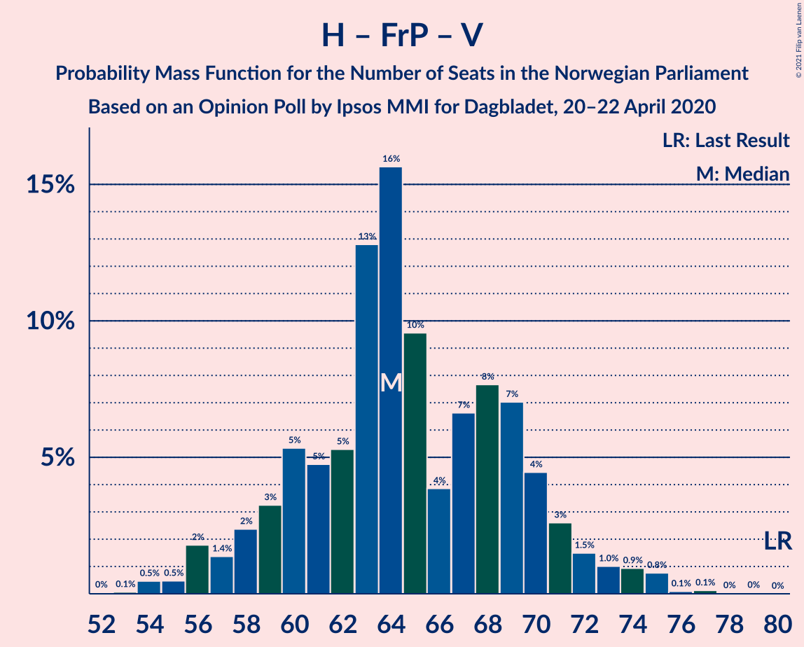

# Opinion Poll by Ipsos MMI for Dagbladet, 20–22 April 2020

<a href="#voting-intentions">Voting Intentions</a> | <a href="#seats">Seats</a> | <a href="#coalitions">Coalitions</a> | <a href="#technical-information">Technical Information</a>

## Voting Intentions

### Confidence Intervals

| Party | Last Result | Poll Result | 80% Confidence Interval | 90% Confidence Interval | 95% Confidence Interval | 99% Confidence Interval |
|:-----:|:-----------:|:-----------:|:-----------------------:|:-----------------------:|:-----------------------:|:-----------------------:|
| Høyre | 25.0% | 25.3% | 23.3–27.4% |22.7–28.0% |22.2–28.6% |21.3–29.6% |
| Arbeiderpartiet | 27.4% | 24.4% | 22.5–26.6% |21.9–27.2% |21.4–27.7% |20.5–28.8% |
| Senterpartiet | 10.3% | 14.2% | 12.7–16.0% |12.2–16.5% |11.9–17.0% |11.2–17.9% |
| Fremskrittspartiet | 15.2% | 9.7% | 8.4–11.2% |8.0–11.7% |7.7–12.0% |7.1–12.8% |
| Sosialistisk Venstreparti | 6.0% | 8.6% | 7.4–10.0% |7.0–10.5% |6.7–10.8% |6.2–11.6% |
| Rødt | 2.4% | 4.8% | 3.9–6.0% |3.7–6.4% |3.5–6.7% |3.1–7.3% |
| Miljøpartiet De Grønne | 3.2% | 4.1% | 3.3–5.3% |3.1–5.6% |2.9–5.9% |2.6–6.4% |
| Kristelig Folkeparti | 4.2% | 4.1% | 3.3–5.3% |3.1–5.6% |2.9–5.9% |2.6–6.4% |
| Venstre | 4.4% | 3.0% | 2.4–4.0% |2.2–4.3% |2.0–4.6% |1.7–5.1% |

*Note:* The poll result column reflects the actual value used in the calculations. Published results may vary slightly, and in addition be rounded to fewer digits.

## Seats

### Confidence Intervals

| Party | Last Result | Median | 80% Confidence Interval | 90% Confidence Interval | 95% Confidence Interval | 99% Confidence Interval |
|:-----:|:-----------:|:------:|:-----------------------:|:-----------------------:|:-----------------------:|:-----------------------:|
| <a href="#høyre">Høyre</a> | 45 | 46 | 39–51 |39–51 |39–51 |37–53 |
| <a href="#arbeiderpartiet">Arbeiderpartiet</a> | 49 | 42 | 39–50 |39–50 |39–51 |36–54 |
| <a href="#senterpartiet">Senterpartiet</a> | 19 | 25 | 22–32 |20–32 |20–33 |19–34 |
| <a href="#fremskrittspartiet">Fremskrittspartiet</a> | 27 | 16 | 15–20 |14–21 |14–21 |12–23 |
| <a href="#sosialistisk-venstreparti">Sosialistisk Venstreparti</a> | 11 | 14 | 12–19 |12–19 |11–19 |11–20 |
| <a href="#rødt">Rødt</a> | 1 | 8 | 2–11 |2–12 |2–12 |2–13 |
| <a href="#miljøpartiet-de-grønne">Miljøpartiet De Grønne</a> | 1 | 8 | 2–9 |1–9 |1–9 |1–10 |
| <a href="#kristelig-folkeparti">Kristelig Folkeparti</a> | 8 | 7 | 2–9 |2–9 |2–10 |1–10 |
| <a href="#venstre">Venstre</a> | 8 | 2 | 1–7 |1–8 |1–8 |0–8 |

### Høyre

*For a full overview of the results for this party, see the [Høyre](party-høyre.html) page.*

| Number of Seats | Probability | Accumulated | Special Marks |
|:---------------:|:-----------:|:-----------:|:-------------:|
| 35 | 0.1% | 100% |  |
| 36 | 0.3% | 99.9% |  |
| 37 | 0.5% | 99.5% |  |
| 38 | 0.5% | 99.0% |  |
| 39 | 9% | 98.5% |  |
| 40 | 1.0% | 89% |  |
| 41 | 7% | 88% |  |
| 42 | 7% | 82% |  |
| 43 | 3% | 75% |  |
| 44 | 7% | 72% |  |
| 45 | 5% | 66% | Last Result |
| 46 | 15% | 61% | Median |
| 47 | 22% | 46% |  |
| 48 | 3% | 24% |  |
| 49 | 1.3% | 21% |  |
| 50 | 2% | 19% |  |
| 51 | 15% | 17% |  |
| 52 | 2% | 2% |  |
| 53 | 0.1% | 0.5% |  |
| 54 | 0.2% | 0.4% |  |
| 55 | 0% | 0.2% |  |
| 56 | 0.2% | 0.2% |  |
| 57 | 0% | 0% |  |

### Arbeiderpartiet

*For a full overview of the results for this party, see the [Arbeiderpartiet](party-arbeiderpartiet.html) page.*

| Number of Seats | Probability | Accumulated | Special Marks |
|:---------------:|:-----------:|:-----------:|:-------------:|
| 36 | 2% | 100% |  |
| 37 | 0.1% | 98% |  |
| 38 | 0.5% | 98% |  |
| 39 | 8% | 98% |  |
| 40 | 8% | 89% |  |
| 41 | 24% | 81% |  |
| 42 | 9% | 57% | Median |
| 43 | 15% | 48% |  |
| 44 | 4% | 33% |  |
| 45 | 4% | 29% |  |
| 46 | 5% | 25% |  |
| 47 | 5% | 21% |  |
| 48 | 1.2% | 16% |  |
| 49 | 3% | 15% | Last Result |
| 50 | 8% | 11% |  |
| 51 | 2% | 4% |  |
| 52 | 0.6% | 2% |  |
| 53 | 0.1% | 1.1% |  |
| 54 | 0.8% | 1.0% |  |
| 55 | 0% | 0.2% |  |
| 56 | 0.1% | 0.1% |  |
| 57 | 0% | 0% |  |

### Senterpartiet

*For a full overview of the results for this party, see the [Senterpartiet](party-senterpartiet.html) page.*

| Number of Seats | Probability | Accumulated | Special Marks |
|:---------------:|:-----------:|:-----------:|:-------------:|
| 18 | 0.4% | 100% |  |
| 19 | 1.2% | 99.6% | Last Result |
| 20 | 4% | 98% |  |
| 21 | 3% | 94% |  |
| 22 | 2% | 91% |  |
| 23 | 23% | 89% |  |
| 24 | 12% | 66% |  |
| 25 | 15% | 54% | Median |
| 26 | 2% | 38% |  |
| 27 | 10% | 37% |  |
| 28 | 2% | 27% |  |
| 29 | 4% | 25% |  |
| 30 | 9% | 22% |  |
| 31 | 2% | 13% |  |
| 32 | 8% | 11% |  |
| 33 | 2% | 3% |  |
| 34 | 0.3% | 0.5% |  |
| 35 | 0.1% | 0.2% |  |
| 36 | 0.1% | 0.1% |  |
| 37 | 0% | 0% |  |

### Fremskrittspartiet

*For a full overview of the results for this party, see the [Fremskrittspartiet](party-fremskrittspartiet.html) page.*

| Number of Seats | Probability | Accumulated | Special Marks |
|:---------------:|:-----------:|:-----------:|:-------------:|
| 10 | 0.1% | 100% |  |
| 11 | 0.2% | 99.9% |  |
| 12 | 0.2% | 99.7% |  |
| 13 | 0.7% | 99.5% |  |
| 14 | 8% | 98.8% |  |
| 15 | 22% | 91% |  |
| 16 | 23% | 70% | Median |
| 17 | 16% | 46% |  |
| 18 | 2% | 30% |  |
| 19 | 16% | 28% |  |
| 20 | 4% | 11% |  |
| 21 | 6% | 7% |  |
| 22 | 1.1% | 2% |  |
| 23 | 0.3% | 0.6% |  |
| 24 | 0.1% | 0.3% |  |
| 25 | 0.1% | 0.2% |  |
| 26 | 0% | 0% |  |
| 27 | 0% | 0% | Last Result |

### Sosialistisk Venstreparti

*For a full overview of the results for this party, see the [Sosialistisk Venstreparti](party-sosialistiskvenstreparti.html) page.*

| Number of Seats | Probability | Accumulated | Special Marks |
|:---------------:|:-----------:|:-----------:|:-------------:|
| 10 | 0.3% | 100% |  |
| 11 | 2% | 99.7% | Last Result |
| 12 | 11% | 97% |  |
| 13 | 18% | 86% |  |
| 14 | 19% | 68% | Median |
| 15 | 8% | 49% |  |
| 16 | 27% | 40% |  |
| 17 | 2% | 13% |  |
| 18 | 1.1% | 11% |  |
| 19 | 8% | 10% |  |
| 20 | 2% | 2% |  |
| 21 | 0% | 0.1% |  |
| 22 | 0% | 0.1% |  |
| 23 | 0% | 0.1% |  |
| 24 | 0.1% | 0.1% |  |
| 25 | 0% | 0% |  |

### Rødt

*For a full overview of the results for this party, see the [Rødt](party-rødt.html) page.*

| Number of Seats | Probability | Accumulated | Special Marks |
|:---------------:|:-----------:|:-----------:|:-------------:|
| 1 | 0.3% | 100% | Last Result |
| 2 | 12% | 99.7% |  |
| 3 | 0% | 87% |  |
| 4 | 0% | 87% |  |
| 5 | 0% | 87% |  |
| 6 | 0.1% | 87% |  |
| 7 | 18% | 87% |  |
| 8 | 36% | 70% | Median |
| 9 | 13% | 34% |  |
| 10 | 9% | 20% |  |
| 11 | 5% | 11% |  |
| 12 | 5% | 6% |  |
| 13 | 0.2% | 0.7% |  |
| 14 | 0.4% | 0.4% |  |
| 15 | 0% | 0% |  |

### Miljøpartiet De Grønne

*For a full overview of the results for this party, see the [Miljøpartiet De Grønne](party-miljøpartietdegrønne.html) page.*

| Number of Seats | Probability | Accumulated | Special Marks |
|:---------------:|:-----------:|:-----------:|:-------------:|
| 1 | 8% | 100% | Last Result |
| 2 | 25% | 92% |  |
| 3 | 0.6% | 67% |  |
| 4 | 0% | 67% |  |
| 5 | 0% | 67% |  |
| 6 | 0% | 67% |  |
| 7 | 14% | 67% |  |
| 8 | 31% | 52% | Median |
| 9 | 19% | 21% |  |
| 10 | 2% | 2% |  |
| 11 | 0.3% | 0.4% |  |
| 12 | 0.1% | 0.1% |  |
| 13 | 0% | 0% |  |

### Kristelig Folkeparti

*For a full overview of the results for this party, see the [Kristelig Folkeparti](party-kristeligfolkeparti.html) page.*

| Number of Seats | Probability | Accumulated | Special Marks |
|:---------------:|:-----------:|:-----------:|:-------------:|
| 0 | 0.3% | 100% |  |
| 1 | 2% | 99.7% |  |
| 2 | 14% | 98% |  |
| 3 | 29% | 84% |  |
| 4 | 0% | 55% |  |
| 5 | 0% | 55% |  |
| 6 | 0% | 55% |  |
| 7 | 27% | 55% | Median |
| 8 | 5% | 28% | Last Result |
| 9 | 18% | 23% |  |
| 10 | 4% | 4% |  |
| 11 | 0.4% | 0.5% |  |
| 12 | 0.1% | 0.1% |  |
| 13 | 0% | 0% |  |

### Venstre

*For a full overview of the results for this party, see the [Venstre](party-venstre.html) page.*

| Number of Seats | Probability | Accumulated | Special Marks |
|:---------------:|:-----------:|:-----------:|:-------------:|
| 0 | 1.4% | 100% |  |
| 1 | 25% | 98.6% |  |
| 2 | 42% | 74% | Median |
| 3 | 0% | 32% |  |
| 4 | 0% | 32% |  |
| 5 | 0% | 32% |  |
| 6 | 0.1% | 32% |  |
| 7 | 27% | 32% |  |
| 8 | 5% | 5% | Last Result |
| 9 | 0.2% | 0.2% |  |
| 10 | 0% | 0% |  |

## Coalitions

### Confidence Intervals

| Coalition | Last Result | Median | Majority? | 80% Confidence Interval | 90% Confidence Interval | 95% Confidence Interval | 99% Confidence Interval |
|:---------:|:-----------:|:------:|:---------:|:-----------------------:|:-----------------------:|:-----------------------:|:-----------------------:|
| Arbeiderpartiet – Senterpartiet – Sosialistisk Venstreparti – Rødt – Miljøpartiet De Grønne | 81 | 99 | 99.9% | 89–103 | 89–106 | 89–106 | 88–109 |
| Arbeiderpartiet – Senterpartiet – Sosialistisk Venstreparti – Kristelig Folkeparti – Miljøpartiet De Grønne | 88 | 96 | 99.8% | 88–104 | 88–105 | 88–105 | 87–108 |
| Høyre – Senterpartiet – Fremskrittspartiet – Kristelig Folkeparti – Venstre | 107 | 96 | 99.8% | 93–105 | 90–105 | 88–105 | 85–106 |
| Arbeiderpartiet – Senterpartiet – Sosialistisk Venstreparti – Rødt | 80 | 91 | 98% | 87–98 | 85–99 | 85–100 | 83–104 |
| Arbeiderpartiet – Senterpartiet – Sosialistisk Venstreparti – Miljøpartiet De Grønne | 80 | 89 | 81% | 81–97 | 81–97 | 81–98 | 80–101 |
| Arbeiderpartiet – Senterpartiet – Sosialistisk Venstreparti | 79 | 84 | 49% | 79–89 | 78–91 | 75–92 | 75–99 |
| Arbeiderpartiet – Senterpartiet – Kristelig Folkeparti – Miljøpartiet De Grønne | 77 | 80 | 20% | 75–88 | 74–89 | 74–89 | 71–92 |
| Høyre – Fremskrittspartiet – Kristelig Folkeparti – Miljøpartiet De Grønne – Venstre | 89 | 78 | 2% | 71–82 | 70–84 | 69–84 | 65–86 |
| Arbeiderpartiet – Senterpartiet – Kristelig Folkeparti | 76 | 73 | 2% | 69–80 | 69–81 | 68–84 | 66–86 |
| Høyre – Fremskrittspartiet – Kristelig Folkeparti – Venstre | 88 | 70 | 0.1% | 66–80 | 63–80 | 63–80 | 60–81 |
| Arbeiderpartiet – Senterpartiet | 68 | 69 | 0% | 63–74 | 63–76 | 61–77 | 61–82 |
| Høyre – Fremskrittspartiet – Venstre | 80 | 67 | 0% | 58–73 | 57–73 | 57–73 | 55–75 |
| Høyre – Fremskrittspartiet | 72 | 63 | 0% | 56–66 | 55–68 | 55–70 | 54–72 |
| Arbeiderpartiet – Sosialistisk Venstreparti | 60 | 57 | 0% | 54–65 | 54–66 | 54–66 | 50–71 |
| Høyre – Kristelig Folkeparti – Venstre | 61 | 53 | 0% | 48–65 | 45–65 | 45–65 | 43–65 |
| Senterpartiet – Kristelig Folkeparti – Venstre | 35 | 34 | 0% | 28–41 | 27–42 | 27–43 | 25–43 |

### Arbeiderpartiet – Senterpartiet – Sosialistisk Venstreparti – Rødt – Miljøpartiet De Grønne

| Number of Seats | Probability | Accumulated | Special Marks |
|:---------------:|:-----------:|:-----------:|:-------------:|
| 81 | 0% | 100% | Last Result |
| 82 | 0% | 100% |  |
| 83 | 0% | 100% |  |
| 84 | 0.1% | 100% |  |
| 85 | 0.1% | 99.9% | Majority |
| 86 | 0.1% | 99.8% |  |
| 87 | 0.2% | 99.7% |  |
| 88 | 1.0% | 99.5% |  |
| 89 | 14% | 98.5% |  |
| 90 | 1.2% | 84% |  |
| 91 | 2% | 83% |  |
| 92 | 2% | 81% |  |
| 93 | 3% | 79% |  |
| 94 | 5% | 76% |  |
| 95 | 3% | 71% |  |
| 96 | 13% | 68% |  |
| 97 | 2% | 55% | Median |
| 98 | 0.8% | 53% |  |
| 99 | 14% | 52% |  |
| 100 | 4% | 38% |  |
| 101 | 7% | 34% |  |
| 102 | 2% | 27% |  |
| 103 | 15% | 25% |  |
| 104 | 0.4% | 10% |  |
| 105 | 4% | 10% |  |
| 106 | 4% | 5% |  |
| 107 | 0.3% | 1.5% |  |
| 108 | 0.4% | 1.2% |  |
| 109 | 0.6% | 0.7% |  |
| 110 | 0% | 0.1% |  |
| 111 | 0% | 0.1% |  |
| 112 | 0% | 0.1% |  |
| 113 | 0% | 0% |  |

### Arbeiderpartiet – Senterpartiet – Sosialistisk Venstreparti – Kristelig Folkeparti – Miljøpartiet De Grønne

| Number of Seats | Probability | Accumulated | Special Marks |
|:---------------:|:-----------:|:-----------:|:-------------:|
| 83 | 0.1% | 100% |  |
| 84 | 0.1% | 99.9% |  |
| 85 | 0% | 99.8% | Majority |
| 86 | 0.1% | 99.8% |  |
| 87 | 0.3% | 99.7% |  |
| 88 | 14% | 99.3% | Last Result |
| 89 | 2% | 85% |  |
| 90 | 4% | 83% |  |
| 91 | 13% | 78% |  |
| 92 | 2% | 65% |  |
| 93 | 2% | 63% |  |
| 94 | 5% | 61% |  |
| 95 | 4% | 56% |  |
| 96 | 16% | 52% | Median |
| 97 | 3% | 36% |  |
| 98 | 3% | 33% |  |
| 99 | 1.2% | 30% |  |
| 100 | 12% | 29% |  |
| 101 | 4% | 17% |  |
| 102 | 2% | 13% |  |
| 103 | 0.8% | 11% |  |
| 104 | 0.7% | 10% |  |
| 105 | 9% | 10% |  |
| 106 | 0.3% | 1.0% |  |
| 107 | 0.2% | 0.7% |  |
| 108 | 0.1% | 0.6% |  |
| 109 | 0.4% | 0.5% |  |
| 110 | 0.1% | 0.1% |  |
| 111 | 0% | 0% |  |

### Høyre – Senterpartiet – Fremskrittspartiet – Kristelig Folkeparti – Venstre

| Number of Seats | Probability | Accumulated | Special Marks |
|:---------------:|:-----------:|:-----------:|:-------------:|
| 83 | 0% | 100% |  |
| 84 | 0.1% | 99.9% |  |
| 85 | 0.6% | 99.8% | Majority |
| 86 | 0.3% | 99.2% |  |
| 87 | 0.9% | 98.9% |  |
| 88 | 0.6% | 98% |  |
| 89 | 0.4% | 97% |  |
| 90 | 5% | 97% |  |
| 91 | 0.3% | 93% |  |
| 92 | 0.9% | 92% |  |
| 93 | 14% | 91% |  |
| 94 | 8% | 77% |  |
| 95 | 7% | 69% |  |
| 96 | 21% | 61% | Median |
| 97 | 0.4% | 41% |  |
| 98 | 9% | 40% |  |
| 99 | 2% | 31% |  |
| 100 | 7% | 29% |  |
| 101 | 0.8% | 22% |  |
| 102 | 1.0% | 21% |  |
| 103 | 2% | 20% |  |
| 104 | 0.7% | 18% |  |
| 105 | 17% | 18% |  |
| 106 | 0.1% | 0.5% |  |
| 107 | 0.2% | 0.5% | Last Result |
| 108 | 0.1% | 0.2% |  |
| 109 | 0.2% | 0.2% |  |
| 110 | 0% | 0% |  |

### Arbeiderpartiet – Senterpartiet – Sosialistisk Venstreparti – Rødt

| Number of Seats | Probability | Accumulated | Special Marks |
|:---------------:|:-----------:|:-----------:|:-------------:|
| 80 | 0.1% | 100% | Last Result |
| 81 | 0.2% | 99.9% |  |
| 82 | 0.2% | 99.7% |  |
| 83 | 1.1% | 99.6% |  |
| 84 | 0.9% | 98% |  |
| 85 | 4% | 98% | Majority |
| 86 | 3% | 94% |  |
| 87 | 18% | 91% |  |
| 88 | 13% | 73% |  |
| 89 | 2% | 61% | Median |
| 90 | 0.2% | 59% |  |
| 91 | 10% | 59% |  |
| 92 | 5% | 48% |  |
| 93 | 3% | 43% |  |
| 94 | 12% | 40% |  |
| 95 | 8% | 28% |  |
| 96 | 5% | 19% |  |
| 97 | 4% | 15% |  |
| 98 | 4% | 11% |  |
| 99 | 2% | 7% |  |
| 100 | 3% | 5% |  |
| 101 | 1.0% | 2% |  |
| 102 | 0.3% | 1.1% |  |
| 103 | 0.2% | 0.9% |  |
| 104 | 0.6% | 0.7% |  |
| 105 | 0% | 0.1% |  |
| 106 | 0.1% | 0.1% |  |
| 107 | 0% | 0% |  |

### Arbeiderpartiet – Senterpartiet – Sosialistisk Venstreparti – Miljøpartiet De Grønne

| Number of Seats | Probability | Accumulated | Special Marks |
|:---------------:|:-----------:|:-----------:|:-------------:|
| 77 | 0% | 100% |  |
| 78 | 0% | 99.9% |  |
| 79 | 0.1% | 99.9% |  |
| 80 | 1.2% | 99.8% | Last Result |
| 81 | 14% | 98.6% |  |
| 82 | 2% | 84% |  |
| 83 | 0.9% | 82% |  |
| 84 | 0.5% | 81% |  |
| 85 | 0.4% | 81% | Majority |
| 86 | 5% | 80% |  |
| 87 | 5% | 75% |  |
| 88 | 17% | 70% |  |
| 89 | 9% | 53% | Median |
| 90 | 1.4% | 45% |  |
| 91 | 3% | 43% |  |
| 92 | 3% | 40% |  |
| 93 | 3% | 37% |  |
| 94 | 10% | 34% |  |
| 95 | 1.2% | 24% |  |
| 96 | 9% | 23% |  |
| 97 | 11% | 14% |  |
| 98 | 0.6% | 3% |  |
| 99 | 0.4% | 2% |  |
| 100 | 0.6% | 2% |  |
| 101 | 0.8% | 1.2% |  |
| 102 | 0% | 0.4% |  |
| 103 | 0.1% | 0.4% |  |
| 104 | 0% | 0.4% |  |
| 105 | 0% | 0.3% |  |
| 106 | 0.2% | 0.3% |  |
| 107 | 0.1% | 0.1% |  |
| 108 | 0% | 0% |  |

### Arbeiderpartiet – Senterpartiet – Sosialistisk Venstreparti

| Number of Seats | Probability | Accumulated | Special Marks |
|:---------------:|:-----------:|:-----------:|:-------------:|
| 72 | 0.2% | 100% |  |
| 73 | 0% | 99.8% |  |
| 74 | 0.1% | 99.8% |  |
| 75 | 2% | 99.8% |  |
| 76 | 0.2% | 97% |  |
| 77 | 0.5% | 97% |  |
| 78 | 5% | 97% |  |
| 79 | 15% | 92% | Last Result |
| 80 | 15% | 77% |  |
| 81 | 2% | 62% | Median |
| 82 | 6% | 60% |  |
| 83 | 2% | 54% |  |
| 84 | 2% | 51% |  |
| 85 | 4% | 49% | Majority |
| 86 | 13% | 45% |  |
| 87 | 11% | 32% |  |
| 88 | 4% | 20% |  |
| 89 | 9% | 16% |  |
| 90 | 0.5% | 7% |  |
| 91 | 3% | 7% |  |
| 92 | 0.9% | 3% |  |
| 93 | 0.4% | 2% |  |
| 94 | 0.8% | 2% |  |
| 95 | 0.1% | 1.1% |  |
| 96 | 0% | 1.0% |  |
| 97 | 0.2% | 1.0% |  |
| 98 | 0.1% | 0.7% |  |
| 99 | 0.6% | 0.6% |  |
| 100 | 0% | 0% |  |

### Arbeiderpartiet – Senterpartiet – Kristelig Folkeparti – Miljøpartiet De Grønne

| Number of Seats | Probability | Accumulated | Special Marks |
|:---------------:|:-----------:|:-----------:|:-------------:|
| 67 | 0% | 100% |  |
| 68 | 0% | 99.9% |  |
| 69 | 0.1% | 99.9% |  |
| 70 | 0.1% | 99.8% |  |
| 71 | 0.2% | 99.6% |  |
| 72 | 0.2% | 99.5% |  |
| 73 | 0.2% | 99.2% |  |
| 74 | 4% | 99.0% |  |
| 75 | 18% | 95% |  |
| 76 | 1.3% | 77% |  |
| 77 | 17% | 76% | Last Result |
| 78 | 3% | 58% |  |
| 79 | 0.9% | 55% |  |
| 80 | 7% | 54% |  |
| 81 | 7% | 47% |  |
| 82 | 3% | 41% | Median |
| 83 | 2% | 38% |  |
| 84 | 15% | 35% |  |
| 85 | 2% | 20% | Majority |
| 86 | 0.4% | 18% |  |
| 87 | 1.1% | 18% |  |
| 88 | 7% | 17% |  |
| 89 | 8% | 10% |  |
| 90 | 0.2% | 1.1% |  |
| 91 | 0.1% | 0.9% |  |
| 92 | 0.3% | 0.8% |  |
| 93 | 0.1% | 0.4% |  |
| 94 | 0.2% | 0.3% |  |
| 95 | 0% | 0.1% |  |
| 96 | 0% | 0.1% |  |
| 97 | 0% | 0% |  |

### Høyre – Fremskrittspartiet – Kristelig Folkeparti – Miljøpartiet De Grønne – Venstre

| Number of Seats | Probability | Accumulated | Special Marks |
|:---------------:|:-----------:|:-----------:|:-------------:|
| 63 | 0.1% | 100% |  |
| 64 | 0% | 99.9% |  |
| 65 | 0.6% | 99.9% |  |
| 66 | 0.2% | 99.3% |  |
| 67 | 0.3% | 99.1% |  |
| 68 | 1.0% | 98.9% |  |
| 69 | 3% | 98% |  |
| 70 | 2% | 95% |  |
| 71 | 4% | 93% |  |
| 72 | 4% | 89% |  |
| 73 | 5% | 85% |  |
| 74 | 8% | 81% |  |
| 75 | 12% | 72% |  |
| 76 | 3% | 60% |  |
| 77 | 5% | 57% |  |
| 78 | 10% | 52% |  |
| 79 | 0.3% | 41% | Median |
| 80 | 2% | 41% |  |
| 81 | 13% | 39% |  |
| 82 | 18% | 27% |  |
| 83 | 3% | 9% |  |
| 84 | 4% | 6% |  |
| 85 | 0.8% | 2% | Majority |
| 86 | 1.1% | 2% |  |
| 87 | 0.2% | 0.4% |  |
| 88 | 0.2% | 0.3% |  |
| 89 | 0.1% | 0.1% | Last Result |
| 90 | 0% | 0% |  |

### Arbeiderpartiet – Senterpartiet – Kristelig Folkeparti

| Number of Seats | Probability | Accumulated | Special Marks |
|:---------------:|:-----------:|:-----------:|:-------------:|
| 64 | 0.3% | 100% |  |
| 65 | 0.1% | 99.7% |  |
| 66 | 0.9% | 99.7% |  |
| 67 | 0.3% | 98.8% |  |
| 68 | 1.1% | 98.5% |  |
| 69 | 14% | 97% |  |
| 70 | 5% | 84% |  |
| 71 | 5% | 78% |  |
| 72 | 6% | 73% |  |
| 73 | 17% | 67% |  |
| 74 | 4% | 50% | Median |
| 75 | 2% | 45% |  |
| 76 | 15% | 43% | Last Result |
| 77 | 1.4% | 28% |  |
| 78 | 1.4% | 26% |  |
| 79 | 6% | 25% |  |
| 80 | 9% | 19% |  |
| 81 | 5% | 10% |  |
| 82 | 1.4% | 5% |  |
| 83 | 0.6% | 4% |  |
| 84 | 0.6% | 3% |  |
| 85 | 0.8% | 2% | Majority |
| 86 | 1.1% | 2% |  |
| 87 | 0.3% | 0.4% |  |
| 88 | 0% | 0.1% |  |
| 89 | 0% | 0.1% |  |
| 90 | 0% | 0.1% |  |
| 91 | 0% | 0% |  |

### Høyre – Fremskrittspartiet – Kristelig Folkeparti – Venstre

| Number of Seats | Probability | Accumulated | Special Marks |
|:---------------:|:-----------:|:-----------:|:-------------:|
| 57 | 0% | 100% |  |
| 58 | 0% | 99.9% |  |
| 59 | 0% | 99.9% |  |
| 60 | 0.6% | 99.9% |  |
| 61 | 0.4% | 99.3% |  |
| 62 | 0.3% | 98.8% |  |
| 63 | 4% | 98.5% |  |
| 64 | 4% | 95% |  |
| 65 | 0.4% | 90% |  |
| 66 | 15% | 90% |  |
| 67 | 2% | 75% |  |
| 68 | 7% | 73% |  |
| 69 | 4% | 66% |  |
| 70 | 14% | 62% |  |
| 71 | 0.8% | 48% | Median |
| 72 | 2% | 47% |  |
| 73 | 13% | 45% |  |
| 74 | 3% | 32% |  |
| 75 | 5% | 29% |  |
| 76 | 3% | 24% |  |
| 77 | 2% | 21% |  |
| 78 | 2% | 19% |  |
| 79 | 1.2% | 17% |  |
| 80 | 14% | 16% |  |
| 81 | 1.0% | 1.5% |  |
| 82 | 0.2% | 0.5% |  |
| 83 | 0.1% | 0.3% |  |
| 84 | 0.1% | 0.2% |  |
| 85 | 0.1% | 0.1% | Majority |
| 86 | 0% | 0% |  |
| 87 | 0% | 0% |  |
| 88 | 0% | 0% | Last Result |

### Arbeiderpartiet – Senterpartiet

| Number of Seats | Probability | Accumulated | Special Marks |
|:---------------:|:-----------:|:-----------:|:-------------:|
| 60 | 0.1% | 100% |  |
| 61 | 2% | 99.9% |  |
| 62 | 1.0% | 97% |  |
| 63 | 7% | 96% |  |
| 64 | 2% | 89% |  |
| 65 | 0.3% | 87% |  |
| 66 | 28% | 87% |  |
| 67 | 5% | 58% | Median |
| 68 | 0.7% | 53% | Last Result |
| 69 | 7% | 53% |  |
| 70 | 6% | 46% |  |
| 71 | 11% | 40% |  |
| 72 | 5% | 28% |  |
| 73 | 8% | 23% |  |
| 74 | 6% | 14% |  |
| 75 | 0.3% | 8% |  |
| 76 | 4% | 8% |  |
| 77 | 1.3% | 4% |  |
| 78 | 0.1% | 2% |  |
| 79 | 1.0% | 2% |  |
| 80 | 0.3% | 1.1% |  |
| 81 | 0.2% | 0.8% |  |
| 82 | 0.6% | 0.7% |  |
| 83 | 0% | 0% |  |

### Høyre – Fremskrittspartiet – Venstre

| Number of Seats | Probability | Accumulated | Special Marks |
|:---------------:|:-----------:|:-----------:|:-------------:|
| 53 | 0.1% | 100% |  |
| 54 | 0.1% | 99.8% |  |
| 55 | 0.3% | 99.7% |  |
| 56 | 0.1% | 99.5% |  |
| 57 | 9% | 99.3% |  |
| 58 | 0.5% | 90% |  |
| 59 | 6% | 90% |  |
| 60 | 4% | 84% |  |
| 61 | 0.7% | 80% |  |
| 62 | 6% | 80% |  |
| 63 | 8% | 73% |  |
| 64 | 8% | 65% | Median |
| 65 | 1.4% | 57% |  |
| 66 | 1.2% | 56% |  |
| 67 | 17% | 55% |  |
| 68 | 4% | 38% |  |
| 69 | 0.7% | 34% |  |
| 70 | 14% | 33% |  |
| 71 | 2% | 19% |  |
| 72 | 2% | 18% |  |
| 73 | 15% | 15% |  |
| 74 | 0.2% | 0.7% |  |
| 75 | 0.3% | 0.5% |  |
| 76 | 0.1% | 0.2% |  |
| 77 | 0% | 0.1% |  |
| 78 | 0% | 0.1% |  |
| 79 | 0% | 0% |  |
| 80 | 0% | 0% | Last Result |

### Høyre – Fremskrittspartiet

| Number of Seats | Probability | Accumulated | Special Marks |
|:---------------:|:-----------:|:-----------:|:-------------:|
| 50 | 0.1% | 100% |  |
| 51 | 0.1% | 99.9% |  |
| 52 | 0.1% | 99.8% |  |
| 53 | 0.2% | 99.7% |  |
| 54 | 0.5% | 99.6% |  |
| 55 | 9% | 99.0% |  |
| 56 | 0.5% | 90% |  |
| 57 | 6% | 90% |  |
| 58 | 4% | 83% |  |
| 59 | 0.6% | 80% |  |
| 60 | 5% | 79% |  |
| 61 | 11% | 74% |  |
| 62 | 4% | 62% | Median |
| 63 | 19% | 58% |  |
| 64 | 0.9% | 40% |  |
| 65 | 6% | 39% |  |
| 66 | 27% | 32% |  |
| 67 | 0.3% | 5% |  |
| 68 | 0.3% | 5% |  |
| 69 | 2% | 5% |  |
| 70 | 2% | 3% |  |
| 71 | 0.6% | 1.2% |  |
| 72 | 0.1% | 0.6% | Last Result |
| 73 | 0.2% | 0.4% |  |
| 74 | 0.1% | 0.2% |  |
| 75 | 0.1% | 0.1% |  |
| 76 | 0% | 0% |  |

### Arbeiderpartiet – Sosialistisk Venstreparti

| Number of Seats | Probability | Accumulated | Special Marks |
|:---------------:|:-----------:|:-----------:|:-------------:|
| 47 | 0.1% | 100% |  |
| 48 | 0.2% | 99.9% |  |
| 49 | 0% | 99.8% |  |
| 50 | 2% | 99.7% |  |
| 51 | 0.1% | 98% |  |
| 52 | 0.1% | 98% |  |
| 53 | 0.2% | 98% |  |
| 54 | 27% | 98% |  |
| 55 | 2% | 71% |  |
| 56 | 4% | 68% | Median |
| 57 | 22% | 64% |  |
| 58 | 8% | 42% |  |
| 59 | 3% | 34% |  |
| 60 | 5% | 31% | Last Result |
| 61 | 4% | 25% |  |
| 62 | 4% | 21% |  |
| 63 | 2% | 17% |  |
| 64 | 5% | 15% |  |
| 65 | 0.5% | 10% |  |
| 66 | 8% | 10% |  |
| 67 | 0.2% | 2% |  |
| 68 | 0.3% | 1.4% |  |
| 69 | 0% | 1.1% |  |
| 70 | 0% | 1.1% |  |
| 71 | 1.0% | 1.1% |  |
| 72 | 0% | 0.1% |  |
| 73 | 0% | 0% |  |

### Høyre – Kristelig Folkeparti – Venstre

| Number of Seats | Probability | Accumulated | Special Marks |
|:---------------:|:-----------:|:-----------:|:-------------:|
| 42 | 0.3% | 100% |  |
| 43 | 0.4% | 99.7% |  |
| 44 | 1.1% | 99.3% |  |
| 45 | 3% | 98% |  |
| 46 | 4% | 95% |  |
| 47 | 0.3% | 91% |  |
| 48 | 1.4% | 91% |  |
| 49 | 6% | 89% |  |
| 50 | 13% | 83% |  |
| 51 | 9% | 70% |  |
| 52 | 0.7% | 62% |  |
| 53 | 11% | 61% |  |
| 54 | 3% | 50% |  |
| 55 | 6% | 47% | Median |
| 56 | 2% | 41% |  |
| 57 | 16% | 39% |  |
| 58 | 0.7% | 23% |  |
| 59 | 2% | 22% |  |
| 60 | 0.8% | 20% |  |
| 61 | 4% | 20% | Last Result |
| 62 | 0.4% | 16% |  |
| 63 | 1.0% | 16% |  |
| 64 | 0.1% | 15% |  |
| 65 | 14% | 14% |  |
| 66 | 0.2% | 0.2% |  |
| 67 | 0% | 0% |  |

### Senterpartiet – Kristelig Folkeparti – Venstre

| Number of Seats | Probability | Accumulated | Special Marks |
|:---------------:|:-----------:|:-----------:|:-------------:|
| 22 | 0.1% | 100% |  |
| 23 | 0.2% | 99.9% |  |
| 24 | 0.1% | 99.7% |  |
| 25 | 0.9% | 99.6% |  |
| 26 | 0.3% | 98.7% |  |
| 27 | 8% | 98% |  |
| 28 | 5% | 90% |  |
| 29 | 0.5% | 85% |  |
| 30 | 4% | 85% |  |
| 31 | 1.0% | 81% |  |
| 32 | 10% | 80% |  |
| 33 | 19% | 70% |  |
| 34 | 4% | 51% | Median |
| 35 | 9% | 47% | Last Result |
| 36 | 1.3% | 38% |  |
| 37 | 2% | 37% |  |
| 38 | 3% | 35% |  |
| 39 | 16% | 32% |  |
| 40 | 0.5% | 16% |  |
| 41 | 9% | 15% |  |
| 42 | 2% | 6% |  |
| 43 | 4% | 4% |  |
| 44 | 0.2% | 0.5% |  |
| 45 | 0.2% | 0.3% |  |
| 46 | 0% | 0.1% |  |
| 47 | 0% | 0.1% |  |
| 48 | 0% | 0% |  |

## Technical Information

### Opinion Poll

+ **Polling firm:** Ipsos MMI
+ **Commissioner(s):** Dagbladet
+ **Fieldwork period:** 20–22 April 2020

### Calculations

+ **Sample size:** 724
+ **Simulations done:** 65,536
+ **Error estimate:** 4.40%

