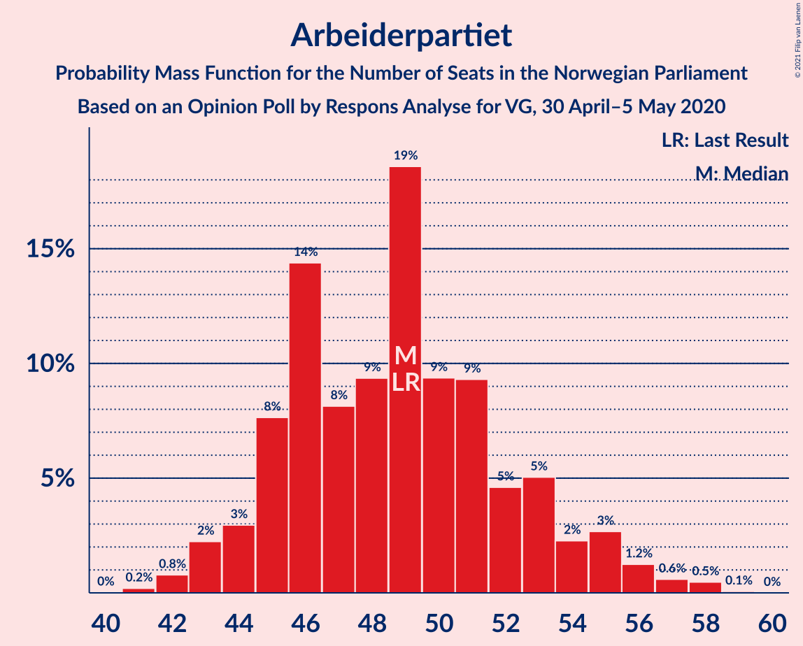
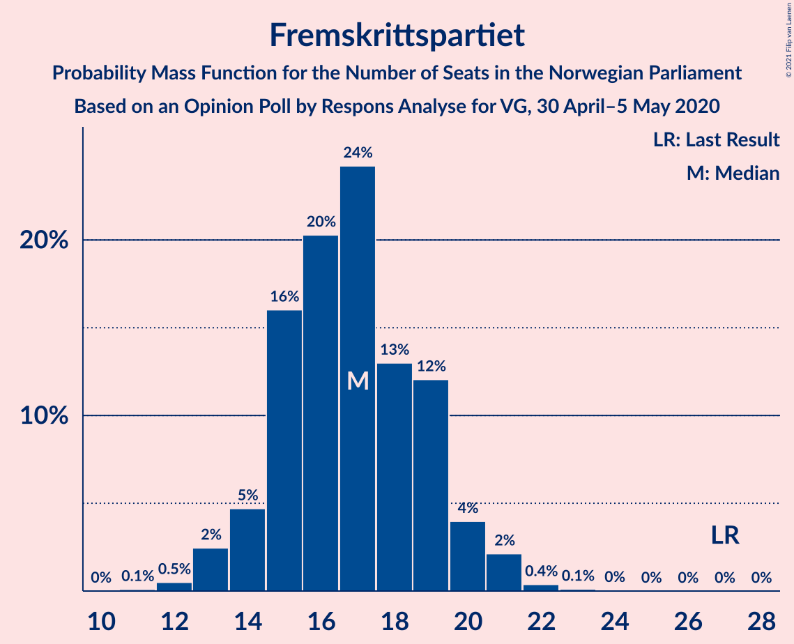
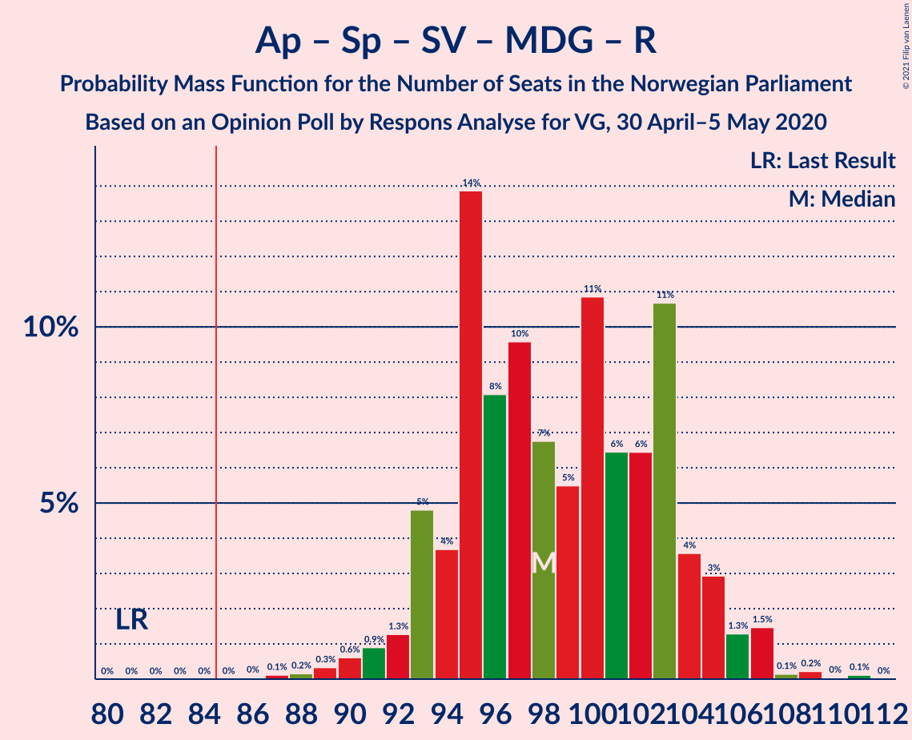
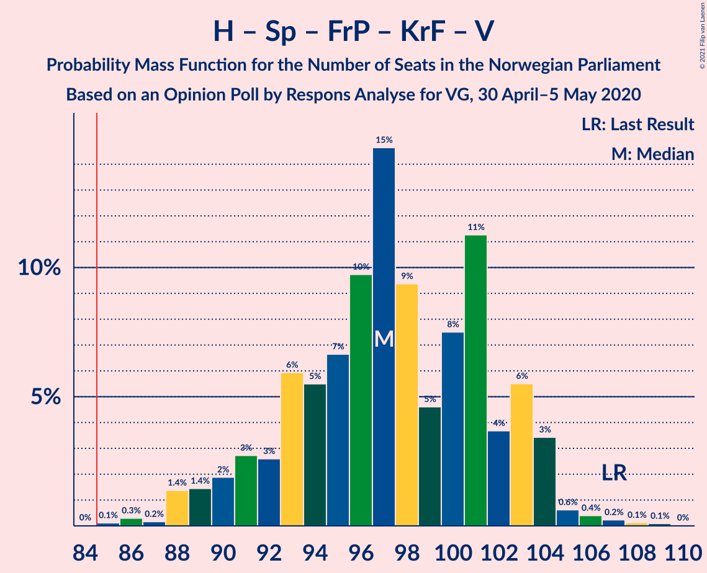
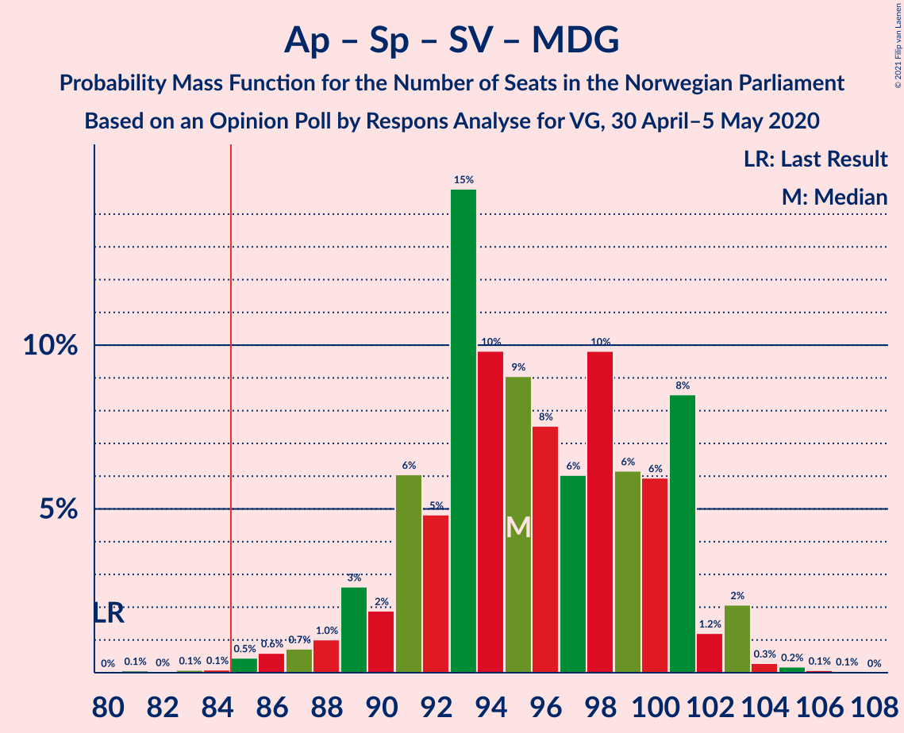
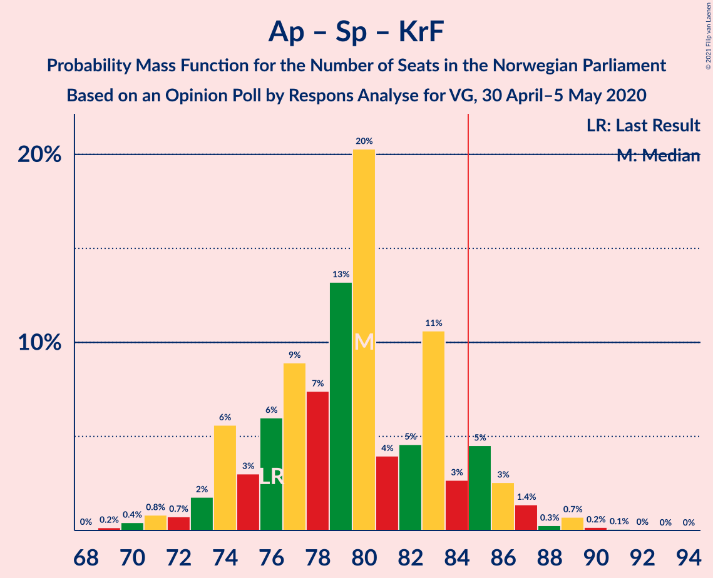

# Opinion Poll by Respons Analyse for VG, 30 April–5 May 2020

<a href="#voting-intentions">Voting Intentions</a> | <a href="#seats">Seats</a> | <a href="#coalitions">Coalitions</a> | <a href="#technical-information">Technical Information</a>

## Voting Intentions

### Confidence Intervals

| Party | Last Result | Poll Result | 80% Confidence Interval | 90% Confidence Interval | 95% Confidence Interval | 99% Confidence Interval |
|:-----:|:-----------:|:-----------:|:-----------------------:|:-----------------------:|:-----------------------:|:-----------------------:|
| Arbeiderpartiet | 27.4% | 27.0% | 25.3–28.9% |24.8–29.4% |24.3–29.8% |23.5–30.7% |
| Høyre | 25.0% | 26.5% | 24.8–28.3% |24.3–28.9% |23.9–29.3% |23.0–30.2% |
| Senterpartiet | 10.3% | 14.7% | 13.3–16.2% |13.0–16.7% |12.6–17.0% |12.0–17.8% |
| Fremskrittspartiet | 15.2% | 9.4% | 8.3–10.7% |8.0–11.1% |7.7–11.4% |7.2–12.0% |
| Sosialistisk Venstreparti | 6.0% | 6.2% | 5.3–7.3% |5.1–7.6% |4.9–7.9% |4.5–8.4% |
| Miljøpartiet De Grønne | 3.2% | 5.0% | 4.2–6.0% |4.0–6.3% |3.8–6.5% |3.5–7.1% |
| Kristelig Folkeparti | 4.2% | 3.6% | 2.9–4.5% |2.8–4.7% |2.6–5.0% |2.3–5.4% |
| Rødt | 2.4% | 3.5% | 2.9–4.4% |2.7–4.6% |2.5–4.8% |2.2–5.3% |
| Venstre | 4.4% | 3.0% | 2.4–3.8% |2.2–4.1% |2.1–4.3% |1.9–4.7% |

*Note:* The poll result column reflects the actual value used in the calculations. Published results may vary slightly, and in addition be rounded to fewer digits.

## Seats

### Confidence Intervals

| Party | Last Result | Median | 80% Confidence Interval | 90% Confidence Interval | 95% Confidence Interval | 99% Confidence Interval |
|:-----:|:-----------:|:------:|:-----------------------:|:-----------------------:|:-----------------------:|:-----------------------:|
| <a href="#arbeiderpartiet">Arbeiderpartiet</a> | 49 | 50 | 44–54 |44–55 |43–56 |41–57 |
| <a href="#høyre">Høyre</a> | 45 | 47 | 42–51 |42–53 |41–54 |40–54 |
| <a href="#senterpartiet">Senterpartiet</a> | 19 | 28 | 25–33 |23–33 |22–33 |20–35 |
| <a href="#fremskrittspartiet">Fremskrittspartiet</a> | 27 | 16 | 15–19 |14–22 |14–22 |13–22 |
| <a href="#sosialistisk-venstreparti">Sosialistisk Venstreparti</a> | 11 | 10 | 9–14 |9–15 |8–15 |8–16 |
| <a href="#miljøpartiet-de-grønne">Miljøpartiet De Grønne</a> | 1 | 8 | 7–9 |2–10 |2–11 |2–12 |
| <a href="#kristelig-folkeparti">Kristelig Folkeparti</a> | 8 | 2 | 1–8 |1–9 |1–9 |0–9 |
| <a href="#rødt">Rødt</a> | 1 | 2 | 1–8 |1–9 |1–9 |1–9 |
| <a href="#venstre">Venstre</a> | 8 | 2 | 1–7 |1–8 |1–8 |1–8 |

### Arbeiderpartiet

*For a full overview of the results for this party, see the [Arbeiderpartiet](party-arbeiderpartiet.html) page.*

| Number of Seats | Probability | Accumulated | Special Marks |
|:---------------:|:-----------:|:-----------:|:-------------:|
| 39 | 0.2% | 100% |  |
| 40 | 0% | 99.8% |  |
| 41 | 0.5% | 99.8% |  |
| 42 | 0.4% | 99.3% |  |
| 43 | 4% | 98.8% |  |
| 44 | 15% | 95% |  |
| 45 | 0.4% | 80% |  |
| 46 | 1.0% | 80% |  |
| 47 | 14% | 79% |  |
| 48 | 0.3% | 64% |  |
| 49 | 0.8% | 64% | Last Result |
| 50 | 15% | 63% | Median |
| 51 | 9% | 48% |  |
| 52 | 4% | 39% |  |
| 53 | 4% | 36% |  |
| 54 | 24% | 31% |  |
| 55 | 4% | 7% |  |
| 56 | 2% | 3% |  |
| 57 | 0.4% | 0.5% |  |
| 58 | 0.1% | 0.2% |  |
| 59 | 0.1% | 0.1% |  |
| 60 | 0% | 0% |  |

### Høyre

*For a full overview of the results for this party, see the [Høyre](party-høyre.html) page.*

| Number of Seats | Probability | Accumulated | Special Marks |
|:---------------:|:-----------:|:-----------:|:-------------:|
| 38 | 0.1% | 100% |  |
| 39 | 0.1% | 99.9% |  |
| 40 | 0.4% | 99.8% |  |
| 41 | 3% | 99.3% |  |
| 42 | 11% | 96% |  |
| 43 | 0.8% | 85% |  |
| 44 | 16% | 84% |  |
| 45 | 11% | 68% | Last Result |
| 46 | 3% | 57% |  |
| 47 | 21% | 55% | Median |
| 48 | 2% | 34% |  |
| 49 | 19% | 32% |  |
| 50 | 2% | 13% |  |
| 51 | 5% | 11% |  |
| 52 | 0.2% | 6% |  |
| 53 | 2% | 6% |  |
| 54 | 4% | 4% |  |
| 55 | 0% | 0.2% |  |
| 56 | 0% | 0.1% |  |
| 57 | 0.1% | 0.1% |  |
| 58 | 0% | 0% |  |

### Senterpartiet

*For a full overview of the results for this party, see the [Senterpartiet](party-senterpartiet.html) page.*

| Number of Seats | Probability | Accumulated | Special Marks |
|:---------------:|:-----------:|:-----------:|:-------------:|
| 19 | 0% | 100% | Last Result |
| 20 | 1.1% | 100% |  |
| 21 | 0.1% | 98.9% |  |
| 22 | 2% | 98.8% |  |
| 23 | 4% | 97% |  |
| 24 | 2% | 92% |  |
| 25 | 15% | 90% |  |
| 26 | 12% | 76% |  |
| 27 | 9% | 63% |  |
| 28 | 16% | 54% | Median |
| 29 | 0.8% | 38% |  |
| 30 | 3% | 37% |  |
| 31 | 0.2% | 34% |  |
| 32 | 24% | 34% |  |
| 33 | 8% | 10% |  |
| 34 | 0.2% | 2% |  |
| 35 | 2% | 2% |  |
| 36 | 0.1% | 0.2% |  |
| 37 | 0% | 0% |  |

### Fremskrittspartiet

*For a full overview of the results for this party, see the [Fremskrittspartiet](party-fremskrittspartiet.html) page.*

| Number of Seats | Probability | Accumulated | Special Marks |
|:---------------:|:-----------:|:-----------:|:-------------:|
| 11 | 0.1% | 100% |  |
| 12 | 0.3% | 99.9% |  |
| 13 | 1.1% | 99.6% |  |
| 14 | 6% | 98.5% |  |
| 15 | 26% | 93% |  |
| 16 | 25% | 67% | Median |
| 17 | 23% | 43% |  |
| 18 | 8% | 19% |  |
| 19 | 4% | 11% |  |
| 20 | 1.2% | 8% |  |
| 21 | 0.3% | 6% |  |
| 22 | 6% | 6% |  |
| 23 | 0.2% | 0.2% |  |
| 24 | 0% | 0% |  |
| 25 | 0% | 0% |  |
| 26 | 0% | 0% |  |
| 27 | 0% | 0% | Last Result |

### Sosialistisk Venstreparti

*For a full overview of the results for this party, see the [Sosialistisk Venstreparti](party-sosialistiskvenstreparti.html) page.*

| Number of Seats | Probability | Accumulated | Special Marks |
|:---------------:|:-----------:|:-----------:|:-------------:|
| 7 | 0.3% | 100% |  |
| 8 | 3% | 99.6% |  |
| 9 | 38% | 96% |  |
| 10 | 18% | 58% | Median |
| 11 | 7% | 40% | Last Result |
| 12 | 22% | 33% |  |
| 13 | 0.4% | 11% |  |
| 14 | 1.2% | 11% |  |
| 15 | 9% | 9% |  |
| 16 | 0.5% | 0.6% |  |
| 17 | 0% | 0% |  |

### Miljøpartiet De Grønne

*For a full overview of the results for this party, see the [Miljøpartiet De Grønne](party-miljøpartietdegrønne.html) page.*

| Number of Seats | Probability | Accumulated | Special Marks |
|:---------------:|:-----------:|:-----------:|:-------------:|
| 1 | 0.4% | 100% | Last Result |
| 2 | 9% | 99.6% |  |
| 3 | 0.9% | 91% |  |
| 4 | 0% | 90% |  |
| 5 | 0% | 90% |  |
| 6 | 0% | 90% |  |
| 7 | 4% | 90% |  |
| 8 | 38% | 86% | Median |
| 9 | 42% | 48% |  |
| 10 | 3% | 6% |  |
| 11 | 3% | 4% |  |
| 12 | 0.7% | 0.9% |  |
| 13 | 0.1% | 0.3% |  |
| 14 | 0.1% | 0.1% |  |
| 15 | 0% | 0% |  |

### Kristelig Folkeparti

*For a full overview of the results for this party, see the [Kristelig Folkeparti](party-kristeligfolkeparti.html) page.*

| Number of Seats | Probability | Accumulated | Special Marks |
|:---------------:|:-----------:|:-----------:|:-------------:|
| 0 | 1.4% | 100% |  |
| 1 | 30% | 98.6% |  |
| 2 | 20% | 68% | Median |
| 3 | 31% | 49% |  |
| 4 | 0% | 17% |  |
| 5 | 0% | 17% |  |
| 6 | 0.1% | 17% |  |
| 7 | 4% | 17% |  |
| 8 | 6% | 13% | Last Result |
| 9 | 7% | 7% |  |
| 10 | 0.2% | 0.2% |  |
| 11 | 0% | 0% |  |

### Rødt

*For a full overview of the results for this party, see the [Rødt](party-rødt.html) page.*

| Number of Seats | Probability | Accumulated | Special Marks |
|:---------------:|:-----------:|:-----------:|:-------------:|
| 1 | 34% | 100% | Last Result |
| 2 | 36% | 66% | Median |
| 3 | 0% | 30% |  |
| 4 | 0% | 30% |  |
| 5 | 0% | 30% |  |
| 6 | 0.1% | 30% |  |
| 7 | 16% | 30% |  |
| 8 | 8% | 14% |  |
| 9 | 6% | 6% |  |
| 10 | 0% | 0.1% |  |
| 11 | 0% | 0% |  |

### Venstre

*For a full overview of the results for this party, see the [Venstre](party-venstre.html) page.*

| Number of Seats | Probability | Accumulated | Special Marks |
|:---------------:|:-----------:|:-----------:|:-------------:|
| 0 | 0.3% | 100% |  |
| 1 | 27% | 99.7% |  |
| 2 | 51% | 73% | Median |
| 3 | 0% | 22% |  |
| 4 | 0% | 22% |  |
| 5 | 0% | 22% |  |
| 6 | 0% | 22% |  |
| 7 | 15% | 22% |  |
| 8 | 6% | 7% | Last Result |
| 9 | 0% | 0.1% |  |
| 10 | 0% | 0% |  |

## Coalitions

### Confidence Intervals

| Coalition | Last Result | Median | Majority? | 80% Confidence Interval | 90% Confidence Interval | 95% Confidence Interval | 99% Confidence Interval |
|:---------:|:-----------:|:------:|:---------:|:-----------------------:|:-----------------------:|:-----------------------:|:-----------------------:|
| Arbeiderpartiet – Senterpartiet – Sosialistisk Venstreparti – Miljøpartiet De Grønne – Kristelig Folkeparti | 88 | 100 | 100% | 95–106 | 95–106 | 93–106 | 91–107 |
| Arbeiderpartiet – Senterpartiet – Sosialistisk Venstreparti – Miljøpartiet De Grønne – Rødt | 81 | 101 | 100% | 95–105 | 92–106 | 92–106 | 90–108 |
| Høyre – Senterpartiet – Fremskrittspartiet – Kristelig Folkeparti – Venstre | 107 | 97 | 100% | 90–103 | 90–104 | 90–105 | 86–106 |
| Arbeiderpartiet – Senterpartiet – Sosialistisk Venstreparti – Miljøpartiet De Grønne | 80 | 96 | 99.6% | 92–103 | 90–104 | 88–105 | 86–105 |
| Arbeiderpartiet – Senterpartiet – Sosialistisk Venstreparti – Rødt | 80 | 92 | 94% | 87–97 | 84–98 | 83–101 | 80–101 |
| Arbeiderpartiet – Senterpartiet – Sosialistisk Venstreparti | 79 | 91 | 83% | 84–95 | 81–95 | 81–96 | 77–96 |
| Arbeiderpartiet – Senterpartiet – Miljøpartiet De Grønne – Kristelig Folkeparti | 77 | 89 | 92% | 85–93 | 84–94 | 82–95 | 79–97 |
| Arbeiderpartiet – Senterpartiet – Kristelig Folkeparti | 76 | 81 | 6% | 77–84 | 77–85 | 76–86 | 72–89 |
| Høyre – Fremskrittspartiet – Miljøpartiet De Grønne – Kristelig Folkeparti – Venstre | 89 | 77 | 6% | 72–82 | 71–85 | 68–86 | 68–89 |
| Arbeiderpartiet – Senterpartiet | 68 | 79 | 2% | 74–82 | 72–82 | 71–84 | 67–85 |
| Høyre – Fremskrittspartiet – Kristelig Folkeparti – Venstre | 88 | 68 | 0% | 64–74 | 63–77 | 63–77 | 61–79 |
| Høyre – Fremskrittspartiet – Venstre | 80 | 66 | 0% | 61–71 | 60–73 | 60–73 | 60–76 |
| Høyre – Fremskrittspartiet | 72 | 64 | 0% | 60–68 | 58–69 | 58–69 | 58–73 |
| Arbeiderpartiet – Sosialistisk Venstreparti | 60 | 61 | 0% | 53–66 | 53–69 | 53–69 | 52–70 |
| Høyre – Kristelig Folkeparti – Venstre | 61 | 52 | 0% | 49–58 | 46–60 | 44–63 | 44–63 |
| Senterpartiet – Kristelig Folkeparti – Venstre | 35 | 34 | 0% | 30–40 | 29–40 | 27–40 | 25–43 |

### Arbeiderpartiet – Senterpartiet – Sosialistisk Venstreparti – Miljøpartiet De Grønne – Kristelig Folkeparti

| Number of Seats | Probability | Accumulated | Special Marks |
|:---------------:|:-----------:|:-----------:|:-------------:|
| 86 | 0.1% | 100% |  |
| 87 | 0% | 99.9% |  |
| 88 | 0% | 99.9% | Last Result |
| 89 | 0.1% | 99.9% |  |
| 90 | 0.1% | 99.8% |  |
| 91 | 0.8% | 99.7% |  |
| 92 | 0.1% | 98.9% |  |
| 93 | 2% | 98.8% |  |
| 94 | 1.1% | 97% |  |
| 95 | 8% | 96% |  |
| 96 | 3% | 88% |  |
| 97 | 22% | 85% |  |
| 98 | 4% | 63% | Median |
| 99 | 3% | 59% |  |
| 100 | 12% | 55% |  |
| 101 | 10% | 43% |  |
| 102 | 17% | 33% |  |
| 103 | 2% | 16% |  |
| 104 | 0.2% | 14% |  |
| 105 | 3% | 14% |  |
| 106 | 10% | 11% |  |
| 107 | 0.5% | 0.8% |  |
| 108 | 0% | 0.2% |  |
| 109 | 0.1% | 0.2% |  |
| 110 | 0% | 0% |  |

### Arbeiderpartiet – Senterpartiet – Sosialistisk Venstreparti – Miljøpartiet De Grønne – Rødt

| Number of Seats | Probability | Accumulated | Special Marks |
|:---------------:|:-----------:|:-----------:|:-------------:|
| 81 | 0% | 100% | Last Result |
| 82 | 0% | 100% |  |
| 83 | 0% | 100% |  |
| 84 | 0% | 100% |  |
| 85 | 0.3% | 100% | Majority |
| 86 | 0.1% | 99.7% |  |
| 87 | 0% | 99.7% |  |
| 88 | 0% | 99.6% |  |
| 89 | 0% | 99.6% |  |
| 90 | 0.2% | 99.6% |  |
| 91 | 1.4% | 99.4% |  |
| 92 | 5% | 98% |  |
| 93 | 0.8% | 93% |  |
| 94 | 0.9% | 92% |  |
| 95 | 9% | 92% |  |
| 96 | 4% | 83% |  |
| 97 | 3% | 79% |  |
| 98 | 2% | 76% | Median |
| 99 | 1.2% | 74% |  |
| 100 | 7% | 73% |  |
| 101 | 45% | 66% |  |
| 102 | 0.3% | 21% |  |
| 103 | 5% | 21% |  |
| 104 | 0.3% | 16% |  |
| 105 | 10% | 16% |  |
| 106 | 5% | 6% |  |
| 107 | 0.1% | 1.1% |  |
| 108 | 1.0% | 1.0% |  |
| 109 | 0% | 0.1% |  |
| 110 | 0% | 0.1% |  |
| 111 | 0% | 0.1% |  |
| 112 | 0% | 0% |  |

### Høyre – Senterpartiet – Fremskrittspartiet – Kristelig Folkeparti – Venstre

| Number of Seats | Probability | Accumulated | Special Marks |
|:---------------:|:-----------:|:-----------:|:-------------:|
| 86 | 0.9% | 100% |  |
| 87 | 0% | 99.0% |  |
| 88 | 0.2% | 99.0% |  |
| 89 | 0% | 98.8% |  |
| 90 | 9% | 98.8% |  |
| 91 | 0.8% | 89% |  |
| 92 | 0.2% | 89% |  |
| 93 | 5% | 88% |  |
| 94 | 11% | 84% |  |
| 95 | 0.7% | 72% | Median |
| 96 | 20% | 72% |  |
| 97 | 2% | 51% |  |
| 98 | 4% | 49% |  |
| 99 | 6% | 46% |  |
| 100 | 27% | 40% |  |
| 101 | 1.4% | 13% |  |
| 102 | 0.8% | 11% |  |
| 103 | 5% | 11% |  |
| 104 | 2% | 6% |  |
| 105 | 2% | 4% |  |
| 106 | 2% | 2% |  |
| 107 | 0% | 0.3% | Last Result |
| 108 | 0.3% | 0.3% |  |
| 109 | 0% | 0% |  |

### Arbeiderpartiet – Senterpartiet – Sosialistisk Venstreparti – Miljøpartiet De Grønne

| Number of Seats | Probability | Accumulated | Special Marks |
|:---------------:|:-----------:|:-----------:|:-------------:|
| 80 | 0% | 100% | Last Result |
| 81 | 0% | 100% |  |
| 82 | 0% | 100% |  |
| 83 | 0% | 100% |  |
| 84 | 0.3% | 99.9% |  |
| 85 | 0.1% | 99.6% | Majority |
| 86 | 0.9% | 99.6% |  |
| 87 | 0.4% | 98.7% |  |
| 88 | 1.2% | 98% |  |
| 89 | 0.6% | 97% |  |
| 90 | 6% | 97% |  |
| 91 | 0.7% | 91% |  |
| 92 | 7% | 90% |  |
| 93 | 1.3% | 83% |  |
| 94 | 26% | 82% |  |
| 95 | 4% | 56% |  |
| 96 | 2% | 52% | Median |
| 97 | 1.2% | 50% |  |
| 98 | 2% | 48% |  |
| 99 | 12% | 46% |  |
| 100 | 21% | 34% |  |
| 101 | 0.1% | 13% |  |
| 102 | 0.4% | 13% |  |
| 103 | 8% | 13% |  |
| 104 | 2% | 5% |  |
| 105 | 3% | 3% |  |
| 106 | 0.1% | 0.1% |  |
| 107 | 0% | 0% |  |

### Arbeiderpartiet – Senterpartiet – Sosialistisk Venstreparti – Rødt

| Number of Seats | Probability | Accumulated | Special Marks |
|:---------------:|:-----------:|:-----------:|:-------------:|
| 77 | 0% | 100% |  |
| 78 | 0.3% | 99.9% |  |
| 79 | 0.1% | 99.7% |  |
| 80 | 0.1% | 99.5% | Last Result |
| 81 | 0% | 99.4% |  |
| 82 | 0.1% | 99.4% |  |
| 83 | 3% | 99.3% |  |
| 84 | 2% | 96% |  |
| 85 | 0.4% | 94% | Majority |
| 86 | 2% | 93% |  |
| 87 | 6% | 92% |  |
| 88 | 3% | 86% |  |
| 89 | 2% | 83% |  |
| 90 | 5% | 82% | Median |
| 91 | 0.4% | 77% |  |
| 92 | 41% | 76% |  |
| 93 | 12% | 35% |  |
| 94 | 3% | 23% |  |
| 95 | 0.6% | 20% |  |
| 96 | 0.5% | 19% |  |
| 97 | 14% | 19% |  |
| 98 | 1.0% | 5% |  |
| 99 | 0% | 4% |  |
| 100 | 0% | 4% |  |
| 101 | 4% | 4% |  |
| 102 | 0% | 0.1% |  |
| 103 | 0% | 0.1% |  |
| 104 | 0% | 0% |  |

### Arbeiderpartiet – Senterpartiet – Sosialistisk Venstreparti

| Number of Seats | Probability | Accumulated | Special Marks |
|:---------------:|:-----------:|:-----------:|:-------------:|
| 74 | 0.1% | 100% |  |
| 75 | 0% | 99.9% |  |
| 76 | 0% | 99.9% |  |
| 77 | 0.5% | 99.9% |  |
| 78 | 0.5% | 99.4% |  |
| 79 | 1.0% | 99.0% | Last Result |
| 80 | 0.2% | 98% |  |
| 81 | 3% | 98% |  |
| 82 | 2% | 94% |  |
| 83 | 0.9% | 93% |  |
| 84 | 8% | 92% |  |
| 85 | 14% | 83% | Majority |
| 86 | 7% | 70% |  |
| 87 | 1.2% | 63% |  |
| 88 | 6% | 62% | Median |
| 89 | 0.9% | 56% |  |
| 90 | 4% | 55% |  |
| 91 | 30% | 51% |  |
| 92 | 8% | 21% |  |
| 93 | 0.1% | 13% |  |
| 94 | 0.5% | 13% |  |
| 95 | 9% | 12% |  |
| 96 | 3% | 3% |  |
| 97 | 0.1% | 0.1% |  |
| 98 | 0% | 0% |  |

### Arbeiderpartiet – Senterpartiet – Miljøpartiet De Grønne – Kristelig Folkeparti

| Number of Seats | Probability | Accumulated | Special Marks |
|:---------------:|:-----------:|:-----------:|:-------------:|
| 76 | 0% | 100% |  |
| 77 | 0.1% | 99.9% | Last Result |
| 78 | 0% | 99.8% |  |
| 79 | 0.6% | 99.8% |  |
| 80 | 0.3% | 99.2% |  |
| 81 | 0.2% | 99.0% |  |
| 82 | 2% | 98.7% |  |
| 83 | 0.3% | 97% |  |
| 84 | 5% | 97% |  |
| 85 | 10% | 92% | Majority |
| 86 | 4% | 82% |  |
| 87 | 3% | 78% |  |
| 88 | 26% | 76% | Median |
| 89 | 8% | 50% |  |
| 90 | 1.1% | 42% |  |
| 91 | 11% | 41% |  |
| 92 | 7% | 30% |  |
| 93 | 16% | 23% |  |
| 94 | 3% | 7% |  |
| 95 | 3% | 3% |  |
| 96 | 0.4% | 0.9% |  |
| 97 | 0.2% | 0.5% |  |
| 98 | 0.2% | 0.3% |  |
| 99 | 0% | 0.1% |  |
| 100 | 0.1% | 0.1% |  |
| 101 | 0% | 0% |  |

### Arbeiderpartiet – Senterpartiet – Kristelig Folkeparti

| Number of Seats | Probability | Accumulated | Special Marks |
|:---------------:|:-----------:|:-----------:|:-------------:|
| 69 | 0.2% | 100% |  |
| 70 | 0.1% | 99.8% |  |
| 71 | 0.1% | 99.7% |  |
| 72 | 0.4% | 99.6% |  |
| 73 | 0.2% | 99.2% |  |
| 74 | 0.1% | 99.0% |  |
| 75 | 1.3% | 98.9% |  |
| 76 | 1.4% | 98% | Last Result |
| 77 | 8% | 96% |  |
| 78 | 0.9% | 88% |  |
| 79 | 17% | 87% |  |
| 80 | 17% | 70% | Median |
| 81 | 3% | 52% |  |
| 82 | 7% | 49% |  |
| 83 | 13% | 42% |  |
| 84 | 23% | 29% |  |
| 85 | 3% | 6% | Majority |
| 86 | 2% | 3% |  |
| 87 | 0.1% | 1.4% |  |
| 88 | 0.7% | 1.4% |  |
| 89 | 0.5% | 0.6% |  |
| 90 | 0% | 0.1% |  |
| 91 | 0% | 0.1% |  |
| 92 | 0.1% | 0.1% |  |
| 93 | 0% | 0% |  |

### Høyre – Fremskrittspartiet – Miljøpartiet De Grønne – Kristelig Folkeparti – Venstre

| Number of Seats | Probability | Accumulated | Special Marks |
|:---------------:|:-----------:|:-----------:|:-------------:|
| 66 | 0% | 100% |  |
| 67 | 0% | 99.9% |  |
| 68 | 4% | 99.9% |  |
| 69 | 0% | 96% |  |
| 70 | 0% | 96% |  |
| 71 | 1.0% | 96% |  |
| 72 | 14% | 95% |  |
| 73 | 0.5% | 81% |  |
| 74 | 0.6% | 81% |  |
| 75 | 3% | 80% | Median |
| 76 | 12% | 77% |  |
| 77 | 41% | 65% |  |
| 78 | 0.4% | 24% |  |
| 79 | 5% | 23% |  |
| 80 | 2% | 18% |  |
| 81 | 3% | 17% |  |
| 82 | 6% | 14% |  |
| 83 | 2% | 8% |  |
| 84 | 0.4% | 7% |  |
| 85 | 2% | 6% | Majority |
| 86 | 3% | 4% |  |
| 87 | 0.1% | 0.7% |  |
| 88 | 0% | 0.6% |  |
| 89 | 0.1% | 0.6% | Last Result |
| 90 | 0.1% | 0.5% |  |
| 91 | 0.3% | 0.3% |  |
| 92 | 0% | 0.1% |  |
| 93 | 0% | 0% |  |

### Arbeiderpartiet – Senterpartiet

| Number of Seats | Probability | Accumulated | Special Marks |
|:---------------:|:-----------:|:-----------:|:-------------:|
| 64 | 0% | 100% |  |
| 65 | 0% | 99.9% |  |
| 66 | 0.2% | 99.9% |  |
| 67 | 0.3% | 99.7% |  |
| 68 | 0.5% | 99.4% | Last Result |
| 69 | 1.0% | 99.0% |  |
| 70 | 0.4% | 98% |  |
| 71 | 2% | 98% |  |
| 72 | 0.6% | 95% |  |
| 73 | 4% | 95% |  |
| 74 | 2% | 91% |  |
| 75 | 7% | 89% |  |
| 76 | 24% | 82% |  |
| 77 | 2% | 59% |  |
| 78 | 2% | 57% | Median |
| 79 | 14% | 55% |  |
| 80 | 17% | 42% |  |
| 81 | 4% | 25% |  |
| 82 | 16% | 20% |  |
| 83 | 0.1% | 5% |  |
| 84 | 3% | 5% |  |
| 85 | 2% | 2% | Majority |
| 86 | 0.2% | 0.2% |  |
| 87 | 0% | 0% |  |

### Høyre – Fremskrittspartiet – Kristelig Folkeparti – Venstre

| Number of Seats | Probability | Accumulated | Special Marks |
|:---------------:|:-----------:|:-----------:|:-------------:|
| 58 | 0% | 100% |  |
| 59 | 0% | 99.9% |  |
| 60 | 0% | 99.9% |  |
| 61 | 1.0% | 99.9% |  |
| 62 | 0.1% | 99.0% |  |
| 63 | 5% | 98.9% |  |
| 64 | 10% | 94% |  |
| 65 | 0.3% | 84% |  |
| 66 | 5% | 84% |  |
| 67 | 0.3% | 79% | Median |
| 68 | 45% | 79% |  |
| 69 | 7% | 34% |  |
| 70 | 1.2% | 27% |  |
| 71 | 2% | 26% |  |
| 72 | 3% | 24% |  |
| 73 | 4% | 21% |  |
| 74 | 9% | 17% |  |
| 75 | 0.9% | 8% |  |
| 76 | 0.8% | 8% |  |
| 77 | 5% | 7% |  |
| 78 | 1.4% | 2% |  |
| 79 | 0.2% | 0.6% |  |
| 80 | 0% | 0.4% |  |
| 81 | 0% | 0.4% |  |
| 82 | 0% | 0.4% |  |
| 83 | 0.1% | 0.3% |  |
| 84 | 0.3% | 0.3% |  |
| 85 | 0% | 0% | Majority |
| 86 | 0% | 0% |  |
| 87 | 0% | 0% |  |
| 88 | 0% | 0% | Last Result |

### Høyre – Fremskrittspartiet – Venstre

| Number of Seats | Probability | Accumulated | Special Marks |
|:---------------:|:-----------:|:-----------:|:-------------:|
| 53 | 0% | 100% |  |
| 54 | 0% | 99.9% |  |
| 55 | 0% | 99.9% |  |
| 56 | 0.1% | 99.9% |  |
| 57 | 0.1% | 99.8% |  |
| 58 | 0.1% | 99.7% |  |
| 59 | 0.1% | 99.6% |  |
| 60 | 7% | 99.6% |  |
| 61 | 9% | 93% |  |
| 62 | 5% | 84% |  |
| 63 | 6% | 79% |  |
| 64 | 0.5% | 72% |  |
| 65 | 16% | 72% | Median |
| 66 | 17% | 56% |  |
| 67 | 16% | 39% |  |
| 68 | 1.3% | 23% |  |
| 69 | 4% | 22% |  |
| 70 | 5% | 17% |  |
| 71 | 3% | 12% |  |
| 72 | 0.1% | 9% |  |
| 73 | 7% | 9% |  |
| 74 | 0.1% | 2% |  |
| 75 | 1.3% | 2% |  |
| 76 | 0.2% | 0.5% |  |
| 77 | 0.3% | 0.3% |  |
| 78 | 0% | 0% |  |
| 79 | 0% | 0% |  |
| 80 | 0% | 0% | Last Result |

### Høyre – Fremskrittspartiet

| Number of Seats | Probability | Accumulated | Special Marks |
|:---------------:|:-----------:|:-----------:|:-------------:|
| 51 | 0.1% | 100% |  |
| 52 | 0% | 99.9% |  |
| 53 | 0% | 99.9% |  |
| 54 | 0.1% | 99.8% |  |
| 55 | 0.1% | 99.7% |  |
| 56 | 0% | 99.6% |  |
| 57 | 0% | 99.6% |  |
| 58 | 6% | 99.5% |  |
| 59 | 2% | 93% |  |
| 60 | 26% | 92% |  |
| 61 | 8% | 65% |  |
| 62 | 0.2% | 57% |  |
| 63 | 3% | 57% | Median |
| 64 | 30% | 54% |  |
| 65 | 7% | 24% |  |
| 66 | 2% | 18% |  |
| 67 | 3% | 16% |  |
| 68 | 7% | 13% |  |
| 69 | 4% | 6% |  |
| 70 | 0.2% | 2% |  |
| 71 | 0.6% | 2% |  |
| 72 | 0.1% | 2% | Last Result |
| 73 | 1.3% | 2% |  |
| 74 | 0.2% | 0.2% |  |
| 75 | 0.1% | 0.1% |  |
| 76 | 0% | 0% |  |

### Arbeiderpartiet – Sosialistisk Venstreparti

| Number of Seats | Probability | Accumulated | Special Marks |
|:---------------:|:-----------:|:-----------:|:-------------:|
| 50 | 0.4% | 100% |  |
| 51 | 0% | 99.6% |  |
| 52 | 0.3% | 99.6% |  |
| 53 | 15% | 99.2% |  |
| 54 | 1.0% | 85% |  |
| 55 | 4% | 84% |  |
| 56 | 0.4% | 80% |  |
| 57 | 4% | 79% |  |
| 58 | 4% | 76% |  |
| 59 | 17% | 72% |  |
| 60 | 3% | 55% | Last Result, Median |
| 61 | 8% | 53% |  |
| 62 | 3% | 44% |  |
| 63 | 20% | 41% |  |
| 64 | 0.5% | 21% |  |
| 65 | 11% | 21% |  |
| 66 | 0.7% | 10% |  |
| 67 | 0.7% | 9% |  |
| 68 | 0.1% | 9% |  |
| 69 | 8% | 9% |  |
| 70 | 0.9% | 0.9% |  |
| 71 | 0% | 0% |  |

### Høyre – Kristelig Folkeparti – Venstre

| Number of Seats | Probability | Accumulated | Special Marks |
|:---------------:|:-----------:|:-----------:|:-------------:|
| 42 | 0.1% | 100% |  |
| 43 | 0% | 99.9% |  |
| 44 | 4% | 99.9% |  |
| 45 | 0.2% | 96% |  |
| 46 | 2% | 96% |  |
| 47 | 0.1% | 94% |  |
| 48 | 0.6% | 94% |  |
| 49 | 12% | 93% |  |
| 50 | 6% | 81% |  |
| 51 | 19% | 74% | Median |
| 52 | 12% | 55% |  |
| 53 | 20% | 44% |  |
| 54 | 0.5% | 23% |  |
| 55 | 3% | 23% |  |
| 56 | 6% | 20% |  |
| 57 | 0.6% | 14% |  |
| 58 | 7% | 13% |  |
| 59 | 1.4% | 7% |  |
| 60 | 1.3% | 5% |  |
| 61 | 0.4% | 4% | Last Result |
| 62 | 0.1% | 4% |  |
| 63 | 3% | 3% |  |
| 64 | 0% | 0.4% |  |
| 65 | 0% | 0.4% |  |
| 66 | 0.1% | 0.4% |  |
| 67 | 0% | 0.3% |  |
| 68 | 0% | 0.3% |  |
| 69 | 0.3% | 0.3% |  |
| 70 | 0% | 0% |  |

### Senterpartiet – Kristelig Folkeparti – Venstre

| Number of Seats | Probability | Accumulated | Special Marks |
|:---------------:|:-----------:|:-----------:|:-------------:|
| 24 | 0% | 100% |  |
| 25 | 0.5% | 99.9% |  |
| 26 | 0.3% | 99.4% |  |
| 27 | 3% | 99.1% |  |
| 28 | 0.9% | 96% |  |
| 29 | 0.4% | 95% |  |
| 30 | 12% | 95% |  |
| 31 | 0.6% | 83% |  |
| 32 | 24% | 83% | Median |
| 33 | 0.1% | 58% |  |
| 34 | 14% | 58% |  |
| 35 | 0.5% | 44% | Last Result |
| 36 | 25% | 43% |  |
| 37 | 3% | 19% |  |
| 38 | 2% | 15% |  |
| 39 | 0.7% | 13% |  |
| 40 | 11% | 13% |  |
| 41 | 0.3% | 2% |  |
| 42 | 0% | 2% |  |
| 43 | 1.3% | 2% |  |
| 44 | 0% | 0.2% |  |
| 45 | 0% | 0.2% |  |
| 46 | 0.1% | 0.2% |  |
| 47 | 0% | 0% |  |

## Technical Information

### Opinion Poll

+ **Polling firm:** Respons Analyse
+ **Commissioner(s):** VG
+ **Fieldwork period:** 30 April–5 May 2020

### Calculations

+ **Sample size:** 1000
+ **Simulations done:** 32,768
+ **Error estimate:** 3.41%

