# Opinion Poll by Norfakta for Klassekampen and Nationen, 5–6 May 2020

<a href="#voting-intentions">Voting Intentions</a> | <a href="#seats">Seats</a> | <a href="#coalitions">Coalitions</a> | <a href="#technical-information">Technical Information</a>

## Voting Intentions

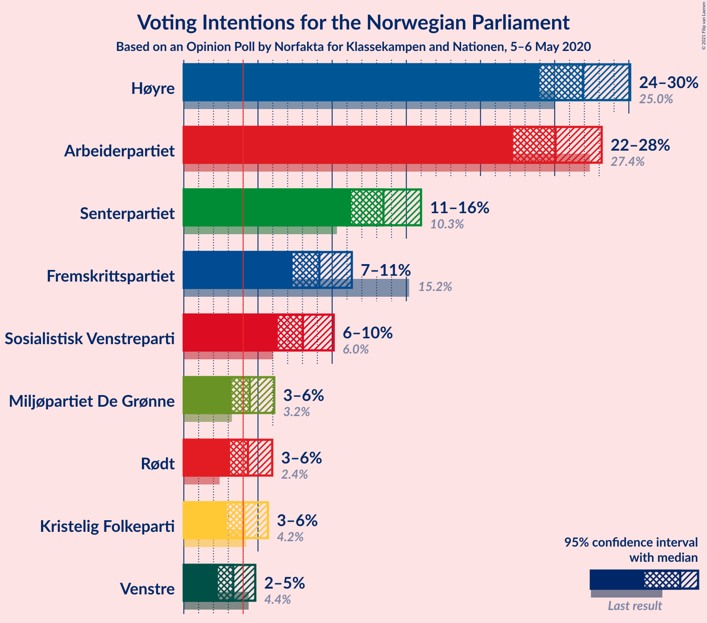

### Confidence Intervals

| Party | Last Result | Poll Result | 80% Confidence Interval | 90% Confidence Interval | 95% Confidence Interval | 99% Confidence Interval |
|:-----:|:-----------:|:-----------:|:-----------------------:|:-----------------------:|:-----------------------:|:-----------------------:|
| Høyre | 25.0% | 26.9% | 25.0–29.0% |24.4–29.6% |24.0–30.1% |23.1–31.1% |
| Arbeiderpartiet | 27.4% | 25.1% | 23.2–27.1% |22.6–27.7% |22.2–28.2% |21.3–29.2% |
| Senterpartiet | 10.3% | 13.5% | 12.0–15.1% |11.6–15.6% |11.3–16.0% |10.6–16.8% |
| Fremskrittspartiet | 15.2% | 9.1% | 8.0–10.6% |7.6–11.0% |7.3–11.3% |6.8–12.0% |
| Sosialistisk Venstreparti | 6.0% | 8.0% | 6.9–9.4% |6.6–9.8% |6.3–10.1% |5.9–10.8% |
| Miljøpartiet De Grønne | 3.2% | 4.4% | 3.6–5.5% |3.4–5.8% |3.2–6.1% |2.9–6.7% |
| Rødt | 2.4% | 4.3% | 3.5–5.4% |3.3–5.7% |3.1–6.0% |2.8–6.5% |
| Kristelig Folkeparti | 4.2% | 4.1% | 3.3–5.1% |3.1–5.4% |2.9–5.7% |2.6–6.2% |
| Venstre | 4.4% | 3.3% | 2.7–4.3% |2.5–4.6% |2.3–4.8% |2.0–5.3% |

*Note:* The poll result column reflects the actual value used in the calculations. Published results may vary slightly, and in addition be rounded to fewer digits.

## Seats

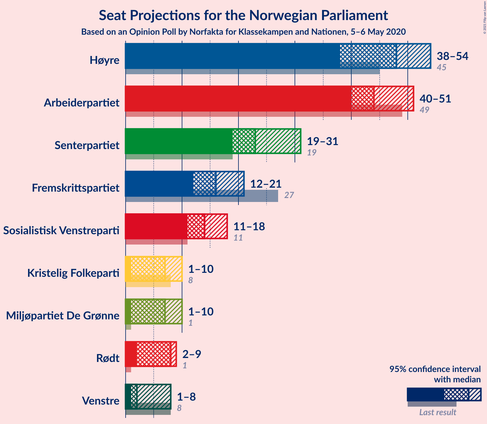

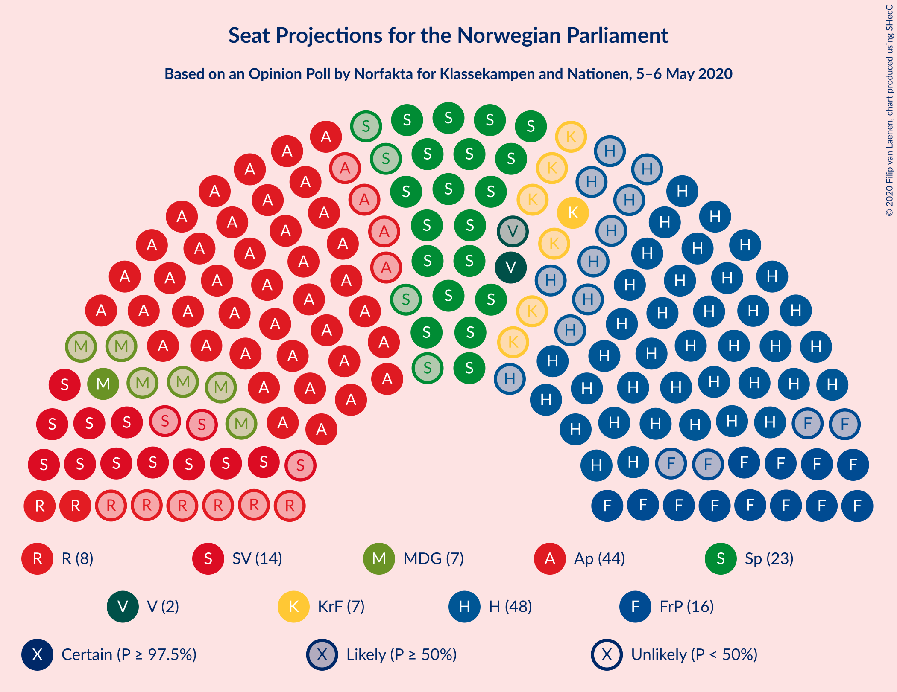

### Confidence Intervals

| Party | Last Result | Median | 80% Confidence Interval | 90% Confidence Interval | 95% Confidence Interval | 99% Confidence Interval |
|:-----:|:-----------:|:------:|:-----------------------:|:-----------------------:|:-----------------------:|:-----------------------:|
| <a href="#høyre">Høyre</a> | 45 | 48 | 44–53 |42–54 |42–55 |39–56 |
| <a href="#arbeiderpartiet">Arbeiderpartiet</a> | 49 | 45 | 41–49 |40–51 |40–52 |39–54 |
| <a href="#senterpartiet">Senterpartiet</a> | 19 | 24 | 20–27 |19–28 |19–30 |18–32 |
| <a href="#fremskrittspartiet">Fremskrittspartiet</a> | 27 | 16 | 13–19 |13–20 |12–20 |10–22 |
| <a href="#sosialistisk-venstreparti">Sosialistisk Venstreparti</a> | 11 | 14 | 11–17 |11–17 |11–18 |10–19 |
| <a href="#miljøpartiet-de-grønne">Miljøpartiet De Grønne</a> | 1 | 8 | 2–9 |2–10 |1–11 |1–12 |
| <a href="#rødt">Rødt</a> | 1 | 7 | 2–9 |2–10 |2–10 |1–11 |
| <a href="#kristelig-folkeparti">Kristelig Folkeparti</a> | 8 | 7 | 3–9 |2–9 |1–10 |1–11 |
| <a href="#venstre">Venstre</a> | 8 | 2 | 2–7 |1–8 |1–8 |1–9 |

### Høyre

*For a full overview of the results for this party, see the [Høyre](party-høyre.html) page.*

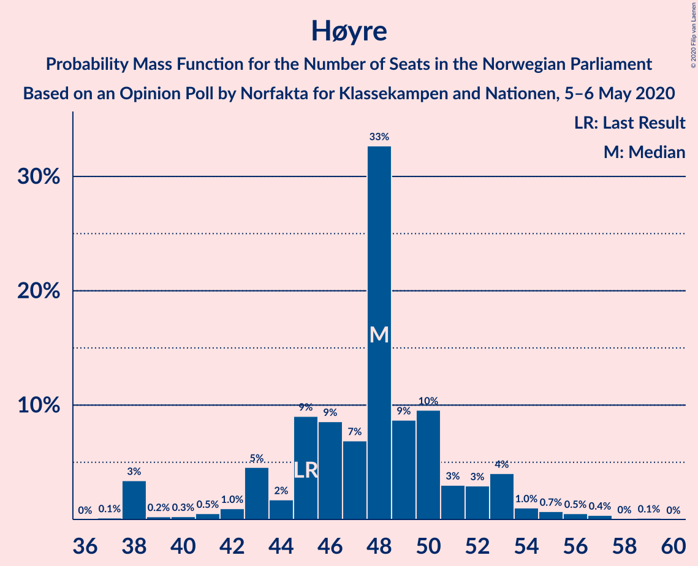

| Number of Seats | Probability | Accumulated | Special Marks |
|:---------------:|:-----------:|:-----------:|:-------------:|
| 37 | 0% | 100% |  |
| 38 | 0.2% | 99.9% |  |
| 39 | 0.3% | 99.8% |  |
| 40 | 0.8% | 99.5% |  |
| 41 | 1.1% | 98.7% |  |
| 42 | 3% | 98% |  |
| 43 | 3% | 94% |  |
| 44 | 3% | 91% |  |
| 45 | 8% | 89% | Last Result |
| 46 | 13% | 81% |  |
| 47 | 8% | 68% |  |
| 48 | 14% | 60% | Median |
| 49 | 10% | 46% |  |
| 50 | 11% | 36% |  |
| 51 | 7% | 25% |  |
| 52 | 4% | 18% |  |
| 53 | 6% | 14% |  |
| 54 | 3% | 8% |  |
| 55 | 3% | 5% |  |
| 56 | 1.1% | 2% |  |
| 57 | 0.3% | 0.5% |  |
| 58 | 0.1% | 0.2% |  |
| 59 | 0% | 0% |  |

### Arbeiderpartiet

*For a full overview of the results for this party, see the [Arbeiderpartiet](party-arbeiderpartiet.html) page.*

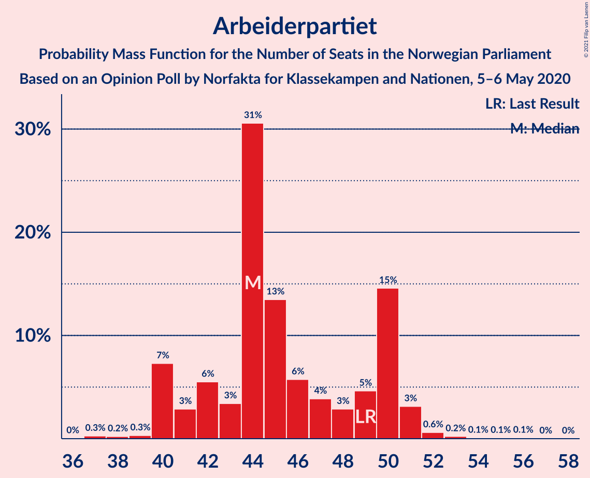

| Number of Seats | Probability | Accumulated | Special Marks |
|:---------------:|:-----------:|:-----------:|:-------------:|
| 36 | 0% | 100% |  |
| 37 | 0.1% | 99.9% |  |
| 38 | 0.3% | 99.8% |  |
| 39 | 0.5% | 99.5% |  |
| 40 | 5% | 99.0% |  |
| 41 | 5% | 94% |  |
| 42 | 11% | 89% |  |
| 43 | 14% | 78% |  |
| 44 | 10% | 64% |  |
| 45 | 12% | 54% | Median |
| 46 | 12% | 42% |  |
| 47 | 5% | 30% |  |
| 48 | 13% | 25% |  |
| 49 | 5% | 13% | Last Result |
| 50 | 2% | 7% |  |
| 51 | 2% | 6% |  |
| 52 | 2% | 3% |  |
| 53 | 0.5% | 1.1% |  |
| 54 | 0.2% | 0.6% |  |
| 55 | 0.1% | 0.4% |  |
| 56 | 0.1% | 0.3% |  |
| 57 | 0.1% | 0.2% |  |
| 58 | 0% | 0% |  |

### Senterpartiet

*For a full overview of the results for this party, see the [Senterpartiet](party-senterpartiet.html) page.*

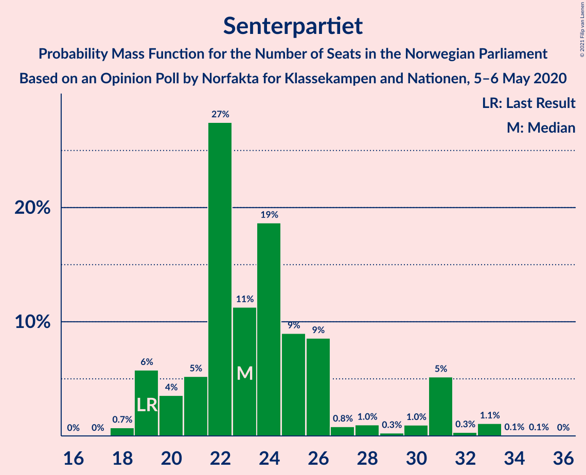

| Number of Seats | Probability | Accumulated | Special Marks |
|:---------------:|:-----------:|:-----------:|:-------------:|
| 17 | 0% | 100% |  |
| 18 | 2% | 99.9% |  |
| 19 | 5% | 98% | Last Result |
| 20 | 5% | 93% |  |
| 21 | 8% | 88% |  |
| 22 | 13% | 80% |  |
| 23 | 12% | 68% |  |
| 24 | 12% | 55% | Median |
| 25 | 12% | 44% |  |
| 26 | 13% | 31% |  |
| 27 | 9% | 18% |  |
| 28 | 4% | 9% |  |
| 29 | 2% | 5% |  |
| 30 | 1.0% | 3% |  |
| 31 | 1.2% | 2% |  |
| 32 | 0.4% | 0.7% |  |
| 33 | 0.2% | 0.4% |  |
| 34 | 0.1% | 0.2% |  |
| 35 | 0% | 0% |  |

### Fremskrittspartiet

*For a full overview of the results for this party, see the [Fremskrittspartiet](party-fremskrittspartiet.html) page.*

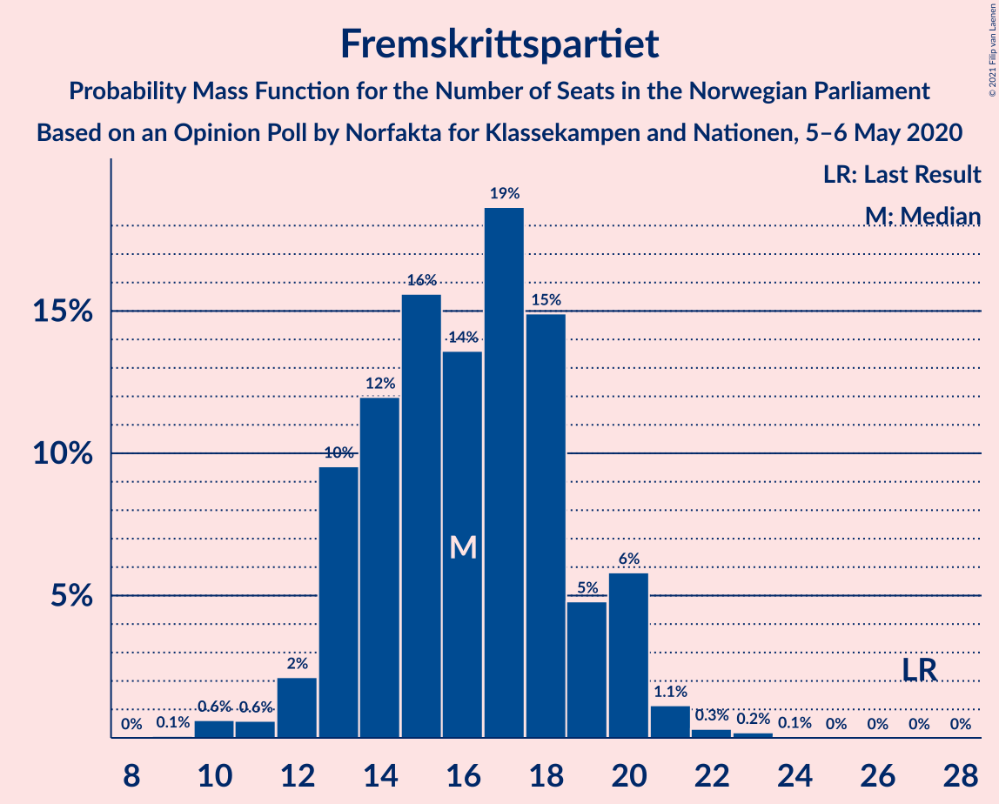

| Number of Seats | Probability | Accumulated | Special Marks |
|:---------------:|:-----------:|:-----------:|:-------------:|
| 9 | 0.1% | 100% |  |
| 10 | 0.6% | 99.9% |  |
| 11 | 0.6% | 99.3% |  |
| 12 | 2% | 98.7% |  |
| 13 | 10% | 97% |  |
| 14 | 12% | 87% |  |
| 15 | 16% | 75% |  |
| 16 | 14% | 59% | Median |
| 17 | 19% | 46% |  |
| 18 | 15% | 27% |  |
| 19 | 5% | 12% |  |
| 20 | 6% | 8% |  |
| 21 | 1.1% | 2% |  |
| 22 | 0.3% | 0.6% |  |
| 23 | 0.2% | 0.2% |  |
| 24 | 0.1% | 0.1% |  |
| 25 | 0% | 0% |  |
| 26 | 0% | 0% |  |
| 27 | 0% | 0% | Last Result |

### Sosialistisk Venstreparti

*For a full overview of the results for this party, see the [Sosialistisk Venstreparti](party-sosialistiskvenstreparti.html) page.*

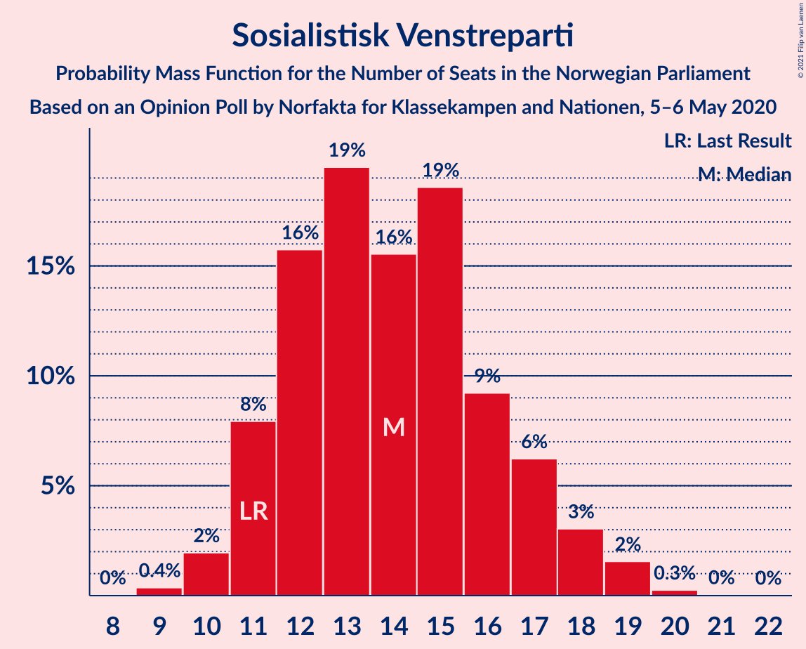

| Number of Seats | Probability | Accumulated | Special Marks |
|:---------------:|:-----------:|:-----------:|:-------------:|
| 9 | 0.4% | 100% |  |
| 10 | 2% | 99.6% |  |
| 11 | 8% | 98% | Last Result |
| 12 | 16% | 90% |  |
| 13 | 19% | 74% |  |
| 14 | 16% | 54% | Median |
| 15 | 19% | 39% |  |
| 16 | 9% | 20% |  |
| 17 | 6% | 11% |  |
| 18 | 3% | 5% |  |
| 19 | 2% | 2% |  |
| 20 | 0.3% | 0.3% |  |
| 21 | 0% | 0.1% |  |
| 22 | 0% | 0% |  |

### Miljøpartiet De Grønne

*For a full overview of the results for this party, see the [Miljøpartiet De Grønne](party-miljøpartietdegrønne.html) page.*

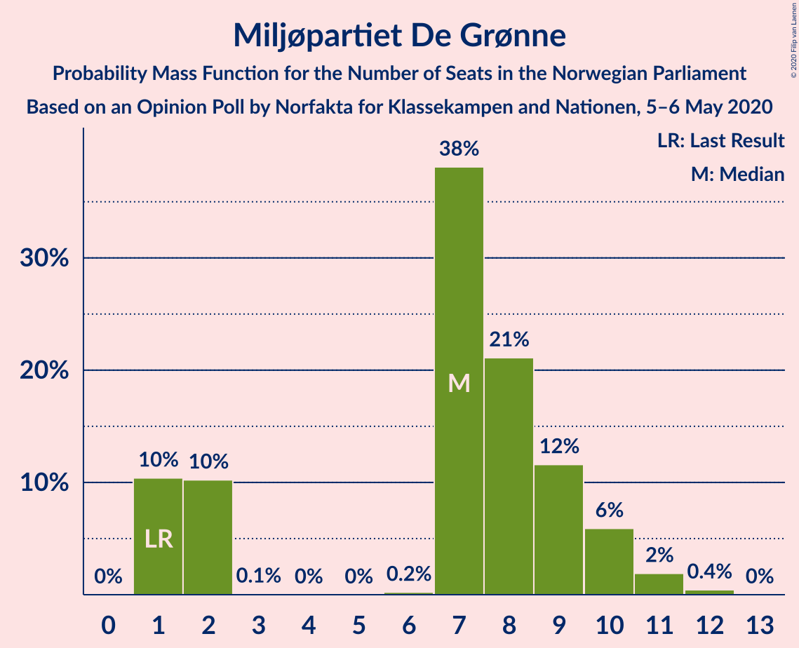

| Number of Seats | Probability | Accumulated | Special Marks |
|:---------------:|:-----------:|:-----------:|:-------------:|
| 1 | 3% | 100% | Last Result |
| 2 | 22% | 97% |  |
| 3 | 1.5% | 76% |  |
| 4 | 0.3% | 74% |  |
| 5 | 0% | 74% |  |
| 6 | 0.1% | 74% |  |
| 7 | 17% | 74% |  |
| 8 | 33% | 56% | Median |
| 9 | 16% | 24% |  |
| 10 | 5% | 8% |  |
| 11 | 2% | 3% |  |
| 12 | 0.4% | 0.5% |  |
| 13 | 0.1% | 0.1% |  |
| 14 | 0% | 0% |  |

### Rødt

*For a full overview of the results for this party, see the [Rødt](party-rødt.html) page.*

| Number of Seats | Probability | Accumulated | Special Marks |
|:---------------:|:-----------:|:-----------:|:-------------:|
| 1 | 0.8% | 100% | Last Result |
| 2 | 28% | 99.2% |  |
| 3 | 0% | 71% |  |
| 4 | 0% | 71% |  |
| 5 | 0% | 71% |  |
| 6 | 0.8% | 71% |  |
| 7 | 22% | 70% | Median |
| 8 | 21% | 48% |  |
| 9 | 18% | 26% |  |
| 10 | 6% | 8% |  |
| 11 | 2% | 2% |  |
| 12 | 0.2% | 0.2% |  |
| 13 | 0% | 0% |  |

### Kristelig Folkeparti

*For a full overview of the results for this party, see the [Kristelig Folkeparti](party-kristeligfolkeparti.html) page.*

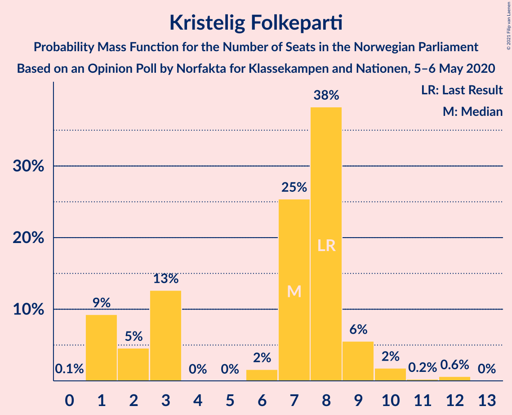

| Number of Seats | Probability | Accumulated | Special Marks |
|:---------------:|:-----------:|:-----------:|:-------------:|
| 0 | 0.1% | 100% |  |
| 1 | 5% | 99.9% |  |
| 2 | 4% | 95% |  |
| 3 | 33% | 91% |  |
| 4 | 0% | 58% |  |
| 5 | 0% | 58% |  |
| 6 | 0.8% | 58% |  |
| 7 | 23% | 57% | Median |
| 8 | 24% | 34% | Last Result |
| 9 | 7% | 11% |  |
| 10 | 3% | 3% |  |
| 11 | 0.6% | 0.8% |  |
| 12 | 0.1% | 0.2% |  |
| 13 | 0% | 0% |  |

### Venstre

*For a full overview of the results for this party, see the [Venstre](party-venstre.html) page.*

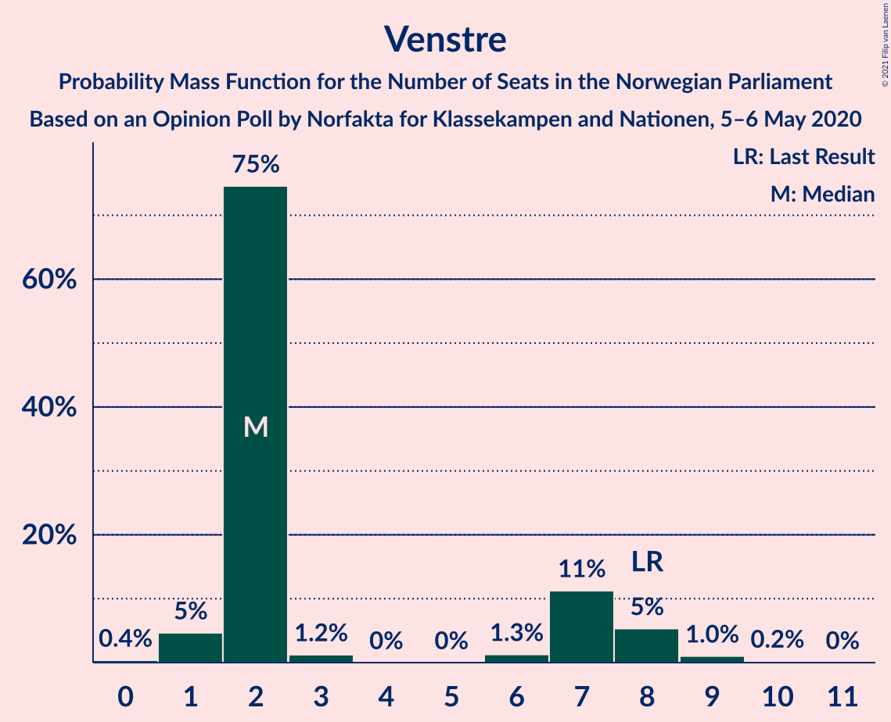

| Number of Seats | Probability | Accumulated | Special Marks |
|:---------------:|:-----------:|:-----------:|:-------------:|
| 0 | 0.4% | 100% |  |
| 1 | 5% | 99.6% |  |
| 2 | 75% | 95% | Median |
| 3 | 1.2% | 20% |  |
| 4 | 0% | 19% |  |
| 5 | 0% | 19% |  |
| 6 | 1.3% | 19% |  |
| 7 | 11% | 18% |  |
| 8 | 5% | 7% | Last Result |
| 9 | 1.0% | 1.3% |  |
| 10 | 0.2% | 0.2% |  |
| 11 | 0% | 0% |  |

## Coalitions

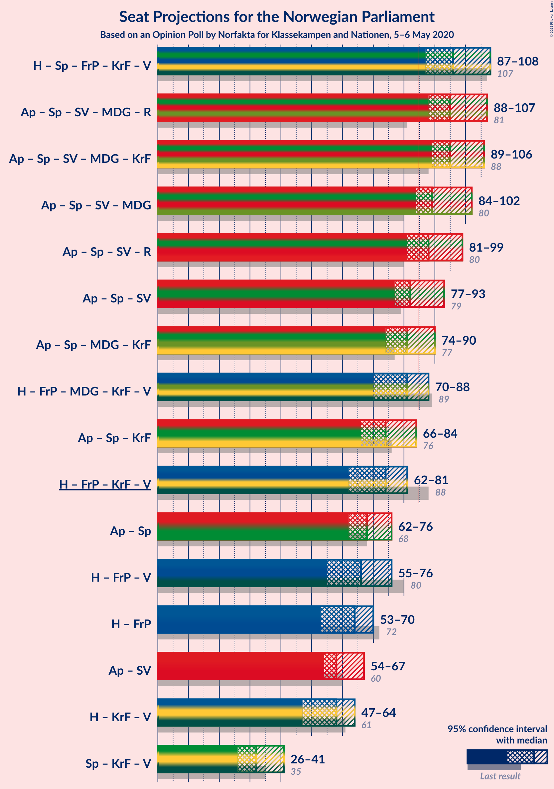

### Confidence Intervals

| Coalition | Last Result | Median | Majority? | 80% Confidence Interval | 90% Confidence Interval | 95% Confidence Interval | 99% Confidence Interval |
|:---------:|:-----------:|:------:|:---------:|:-----------------------:|:-----------------------:|:-----------------------:|:-----------------------:|
| Høyre – Senterpartiet – Fremskrittspartiet – Kristelig Folkeparti – Venstre | 107 | 97 | 99.9% | 91–103 | 89–104 | 89–106 | 87–108 |
| Arbeiderpartiet – Senterpartiet – Sosialistisk Venstreparti – Miljøpartiet De Grønne – Kristelig Folkeparti | 88 | 95 | 99.6% | 91–101 | 88–102 | 87–104 | 85–106 |
| Arbeiderpartiet – Senterpartiet – Sosialistisk Venstreparti – Miljøpartiet De Grønne – Rødt | 81 | 96 | 99.8% | 91–102 | 89–103 | 87–104 | 85–107 |
| Arbeiderpartiet – Senterpartiet – Sosialistisk Venstreparti – Rødt | 80 | 88 | 85% | 83–97 | 82–99 | 81–99 | 78–99 |
| Arbeiderpartiet – Senterpartiet – Sosialistisk Venstreparti – Miljøpartiet De Grønne | 80 | 89 | 86% | 84–95 | 84–96 | 82–98 | 79–101 |
| Arbeiderpartiet – Senterpartiet – Sosialistisk Venstreparti | 79 | 83 | 39% | 77–90 | 76–90 | 76–91 | 74–93 |
| Arbeiderpartiet – Senterpartiet – Miljøpartiet De Grønne – Kristelig Folkeparti | 77 | 81 | 23% | 76–87 | 75–88 | 73–89 | 70–92 |
| Høyre – Fremskrittspartiet – Miljøpartiet De Grønne – Kristelig Folkeparti – Venstre | 89 | 81 | 15% | 72–86 | 70–87 | 70–88 | 70–91 |
| Arbeiderpartiet – Senterpartiet – Kristelig Folkeparti | 76 | 75 | 1.1% | 69–80 | 68–82 | 67–84 | 65–86 |
| Høyre – Fremskrittspartiet – Kristelig Folkeparti – Venstre | 88 | 73 | 0.2% | 67–78 | 66–80 | 65–82 | 62–84 |
| Arbeiderpartiet – Sosialistisk Venstreparti – Miljøpartiet De Grønne – Rødt | 62 | 72 | 0.1% | 66–78 | 65–80 | 63–80 | 61–82 |
| Arbeiderpartiet – Senterpartiet | 68 | 69 | 0% | 64–75 | 63–75 | 61–77 | 60–79 |
| Høyre – Fremskrittspartiet – Venstre | 80 | 67 | 0% | 62–73 | 61–74 | 60–76 | 57–78 |
| Høyre – Fremskrittspartiet | 72 | 64 | 0% | 60–69 | 58–70 | 57–72 | 54–74 |
| Arbeiderpartiet – Sosialistisk Venstreparti | 60 | 58 | 0% | 55–64 | 54–65 | 53–67 | 52–69 |
| Høyre – Kristelig Folkeparti – Venstre | 61 | 57 | 0% | 51–64 | 49–65 | 48–66 | 46–68 |
| Senterpartiet – Kristelig Folkeparti – Venstre | 35 | 32 | 0% | 28–38 | 26–40 | 26–41 | 24–45 |

### Høyre – Senterpartiet – Fremskrittspartiet – Kristelig Folkeparti – Venstre

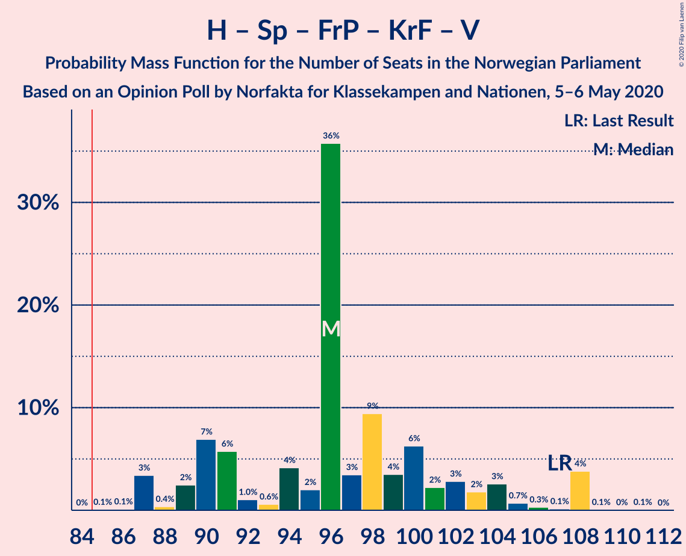

| Number of Seats | Probability | Accumulated | Special Marks |
|:---------------:|:-----------:|:-----------:|:-------------:|
| 83 | 0% | 100% |  |
| 84 | 0% | 99.9% |  |
| 85 | 0.1% | 99.9% | Majority |
| 86 | 0.2% | 99.8% |  |
| 87 | 0.2% | 99.5% |  |
| 88 | 0.8% | 99.4% |  |
| 89 | 5% | 98.5% |  |
| 90 | 3% | 94% |  |
| 91 | 2% | 91% |  |
| 92 | 3% | 89% |  |
| 93 | 5% | 86% |  |
| 94 | 5% | 81% |  |
| 95 | 13% | 76% |  |
| 96 | 8% | 63% |  |
| 97 | 7% | 55% | Median |
| 98 | 8% | 47% |  |
| 99 | 13% | 40% |  |
| 100 | 6% | 26% |  |
| 101 | 8% | 21% |  |
| 102 | 3% | 13% |  |
| 103 | 4% | 10% |  |
| 104 | 3% | 6% |  |
| 105 | 0.7% | 3% |  |
| 106 | 0.8% | 3% |  |
| 107 | 0.9% | 2% | Last Result |
| 108 | 0.9% | 1.1% |  |
| 109 | 0% | 0.2% |  |
| 110 | 0.2% | 0.2% |  |
| 111 | 0% | 0% |  |

### Arbeiderpartiet – Senterpartiet – Sosialistisk Venstreparti – Miljøpartiet De Grønne – Kristelig Folkeparti

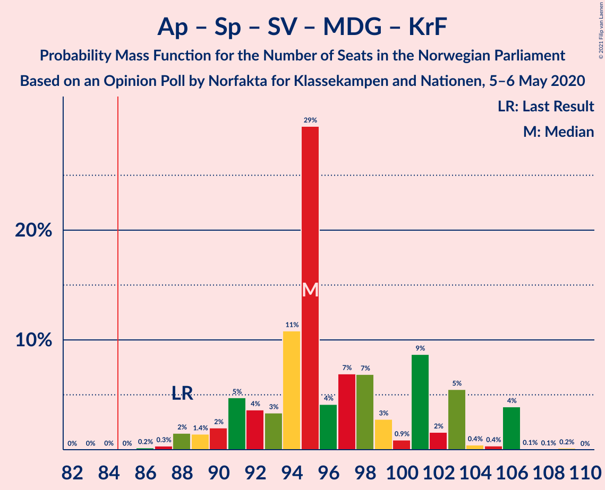

| Number of Seats | Probability | Accumulated | Special Marks |
|:---------------:|:-----------:|:-----------:|:-------------:|
| 82 | 0.1% | 100% |  |
| 83 | 0.1% | 99.9% |  |
| 84 | 0.2% | 99.8% |  |
| 85 | 0.6% | 99.6% | Majority |
| 86 | 0.4% | 99.0% |  |
| 87 | 3% | 98.6% |  |
| 88 | 0.8% | 96% | Last Result |
| 89 | 3% | 95% |  |
| 90 | 2% | 92% |  |
| 91 | 10% | 90% |  |
| 92 | 10% | 80% |  |
| 93 | 6% | 70% |  |
| 94 | 5% | 63% |  |
| 95 | 10% | 59% |  |
| 96 | 13% | 48% |  |
| 97 | 6% | 36% |  |
| 98 | 6% | 30% | Median |
| 99 | 11% | 23% |  |
| 100 | 2% | 13% |  |
| 101 | 4% | 11% |  |
| 102 | 2% | 7% |  |
| 103 | 2% | 5% |  |
| 104 | 2% | 3% |  |
| 105 | 0.4% | 1.3% |  |
| 106 | 0.5% | 0.9% |  |
| 107 | 0.2% | 0.4% |  |
| 108 | 0.1% | 0.2% |  |
| 109 | 0.1% | 0.1% |  |
| 110 | 0% | 0% |  |

### Arbeiderpartiet – Senterpartiet – Sosialistisk Venstreparti – Miljøpartiet De Grønne – Rødt

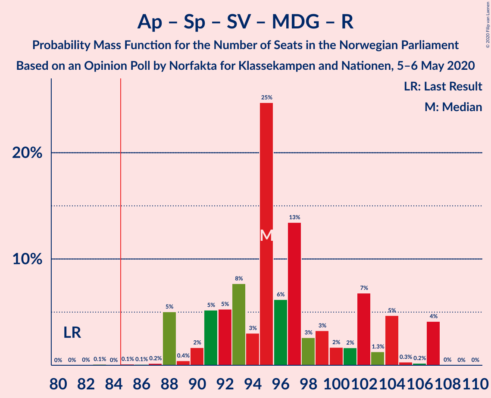

| Number of Seats | Probability | Accumulated | Special Marks |
|:---------------:|:-----------:|:-----------:|:-------------:|
| 81 | 0% | 100% | Last Result |
| 82 | 0% | 100% |  |
| 83 | 0.1% | 100% |  |
| 84 | 0.1% | 99.9% |  |
| 85 | 0.4% | 99.8% | Majority |
| 86 | 1.4% | 99.4% |  |
| 87 | 1.2% | 98% |  |
| 88 | 2% | 97% |  |
| 89 | 2% | 95% |  |
| 90 | 3% | 94% |  |
| 91 | 7% | 91% |  |
| 92 | 9% | 84% |  |
| 93 | 9% | 75% |  |
| 94 | 5% | 66% |  |
| 95 | 10% | 60% |  |
| 96 | 9% | 50% |  |
| 97 | 7% | 41% |  |
| 98 | 4% | 35% | Median |
| 99 | 4% | 31% |  |
| 100 | 4% | 27% |  |
| 101 | 9% | 22% |  |
| 102 | 5% | 13% |  |
| 103 | 4% | 8% |  |
| 104 | 2% | 4% |  |
| 105 | 1.2% | 2% |  |
| 106 | 0.2% | 0.9% |  |
| 107 | 0.5% | 0.7% |  |
| 108 | 0.1% | 0.2% |  |
| 109 | 0.1% | 0.1% |  |
| 110 | 0% | 0% |  |

### Arbeiderpartiet – Senterpartiet – Sosialistisk Venstreparti – Rødt

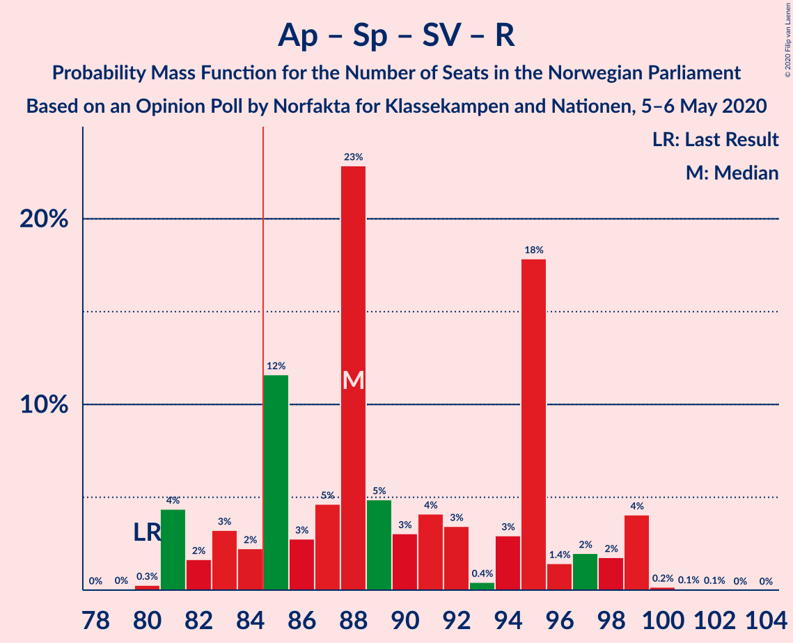

| Number of Seats | Probability | Accumulated | Special Marks |
|:---------------:|:-----------:|:-----------:|:-------------:|
| 77 | 0.1% | 100% |  |
| 78 | 0.3% | 99.8% |  |
| 79 | 0.6% | 99.5% |  |
| 80 | 0.8% | 98.9% | Last Result |
| 81 | 1.4% | 98% |  |
| 82 | 2% | 97% |  |
| 83 | 6% | 94% |  |
| 84 | 4% | 89% |  |
| 85 | 16% | 85% | Majority |
| 86 | 8% | 69% |  |
| 87 | 4% | 61% |  |
| 88 | 9% | 57% |  |
| 89 | 5% | 47% |  |
| 90 | 4% | 43% | Median |
| 91 | 3% | 39% |  |
| 92 | 4% | 36% |  |
| 93 | 4% | 32% |  |
| 94 | 8% | 28% |  |
| 95 | 5% | 19% |  |
| 96 | 3% | 14% |  |
| 97 | 2% | 11% |  |
| 98 | 2% | 9% |  |
| 99 | 6% | 7% |  |
| 100 | 0.2% | 0.5% |  |
| 101 | 0.1% | 0.3% |  |
| 102 | 0.1% | 0.1% |  |
| 103 | 0% | 0.1% |  |
| 104 | 0% | 0% |  |

### Arbeiderpartiet – Senterpartiet – Sosialistisk Venstreparti – Miljøpartiet De Grønne

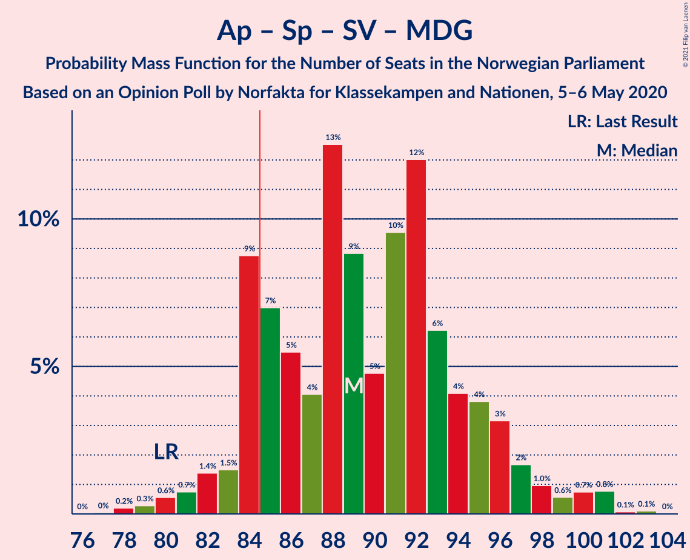

| Number of Seats | Probability | Accumulated | Special Marks |
|:---------------:|:-----------:|:-----------:|:-------------:|
| 77 | 0% | 100% |  |
| 78 | 0.2% | 99.9% |  |
| 79 | 0.3% | 99.7% |  |
| 80 | 0.6% | 99.5% | Last Result |
| 81 | 0.7% | 98.9% |  |
| 82 | 1.4% | 98% |  |
| 83 | 1.5% | 97% |  |
| 84 | 9% | 95% |  |
| 85 | 7% | 86% | Majority |
| 86 | 5% | 80% |  |
| 87 | 4% | 74% |  |
| 88 | 13% | 70% |  |
| 89 | 9% | 57% |  |
| 90 | 5% | 49% |  |
| 91 | 10% | 44% | Median |
| 92 | 12% | 34% |  |
| 93 | 6% | 22% |  |
| 94 | 4% | 16% |  |
| 95 | 4% | 12% |  |
| 96 | 3% | 8% |  |
| 97 | 2% | 5% |  |
| 98 | 1.0% | 3% |  |
| 99 | 0.6% | 2% |  |
| 100 | 0.7% | 2% |  |
| 101 | 0.8% | 1.0% |  |
| 102 | 0.1% | 0.2% |  |
| 103 | 0.1% | 0.1% |  |
| 104 | 0% | 0% |  |

### Arbeiderpartiet – Senterpartiet – Sosialistisk Venstreparti

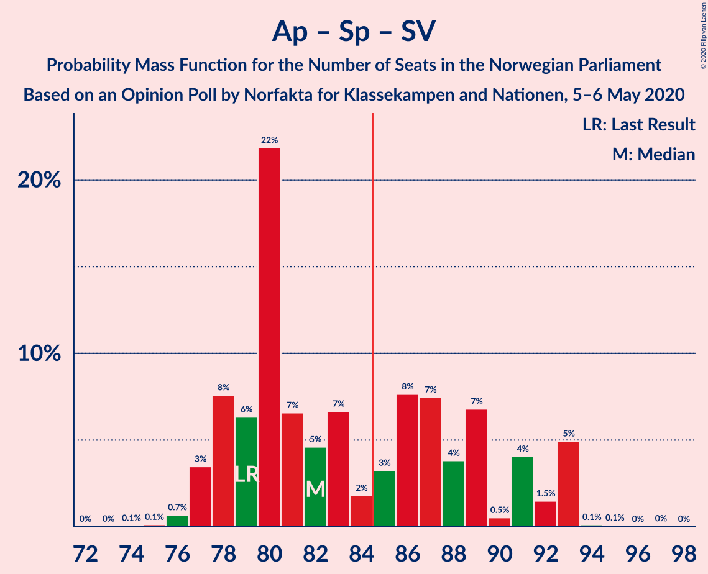

| Number of Seats | Probability | Accumulated | Special Marks |
|:---------------:|:-----------:|:-----------:|:-------------:|
| 71 | 0.1% | 100% |  |
| 72 | 0.1% | 99.9% |  |
| 73 | 0.1% | 99.8% |  |
| 74 | 1.0% | 99.7% |  |
| 75 | 1.1% | 98.7% |  |
| 76 | 6% | 98% |  |
| 77 | 5% | 92% |  |
| 78 | 7% | 87% |  |
| 79 | 8% | 80% | Last Result |
| 80 | 6% | 72% |  |
| 81 | 6% | 65% |  |
| 82 | 6% | 59% |  |
| 83 | 9% | 53% | Median |
| 84 | 4% | 43% |  |
| 85 | 8% | 39% | Majority |
| 86 | 7% | 32% |  |
| 87 | 7% | 25% |  |
| 88 | 4% | 18% |  |
| 89 | 2% | 14% |  |
| 90 | 8% | 12% |  |
| 91 | 2% | 4% |  |
| 92 | 2% | 2% |  |
| 93 | 0.3% | 0.8% |  |
| 94 | 0.1% | 0.5% |  |
| 95 | 0.2% | 0.4% |  |
| 96 | 0% | 0.2% |  |
| 97 | 0.1% | 0.2% |  |
| 98 | 0% | 0.1% |  |
| 99 | 0.1% | 0.1% |  |
| 100 | 0% | 0% |  |

### Arbeiderpartiet – Senterpartiet – Miljøpartiet De Grønne – Kristelig Folkeparti

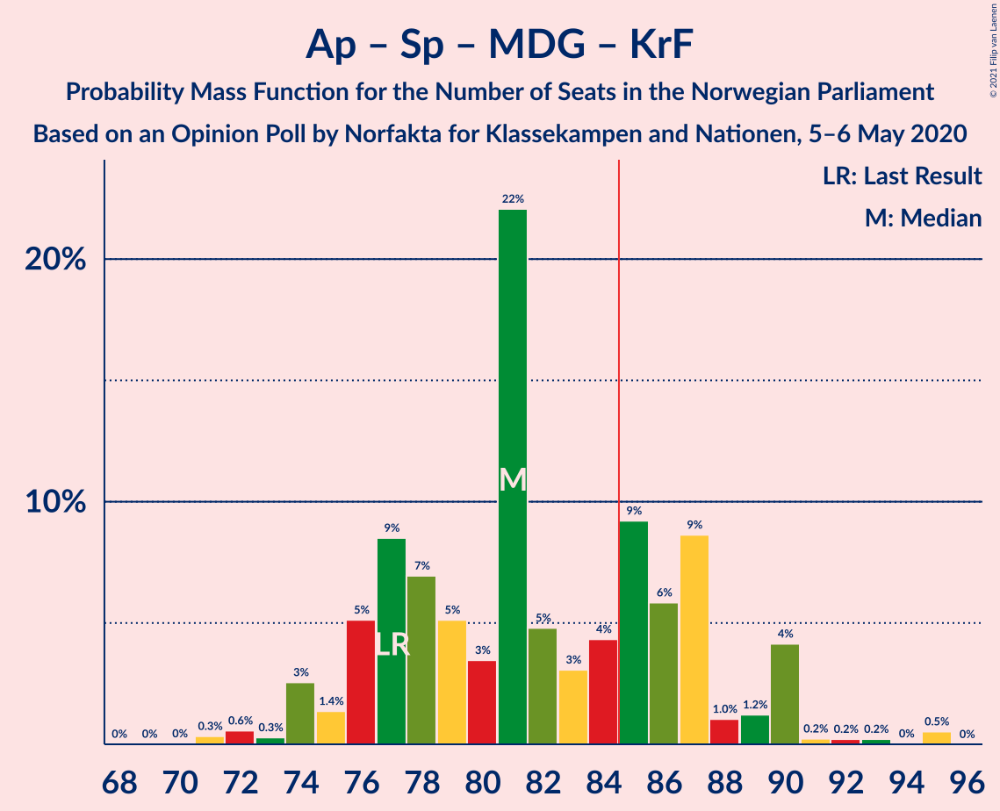

| Number of Seats | Probability | Accumulated | Special Marks |
|:---------------:|:-----------:|:-----------:|:-------------:|
| 68 | 0% | 100% |  |
| 69 | 0.1% | 99.9% |  |
| 70 | 0.5% | 99.9% |  |
| 71 | 0.2% | 99.3% |  |
| 72 | 1.1% | 99.1% |  |
| 73 | 1.2% | 98% |  |
| 74 | 1.2% | 97% |  |
| 75 | 5% | 96% |  |
| 76 | 3% | 91% |  |
| 77 | 6% | 87% | Last Result |
| 78 | 7% | 81% |  |
| 79 | 8% | 74% |  |
| 80 | 10% | 66% |  |
| 81 | 11% | 56% |  |
| 82 | 8% | 45% |  |
| 83 | 7% | 37% |  |
| 84 | 7% | 30% | Median |
| 85 | 4% | 23% | Majority |
| 86 | 5% | 19% |  |
| 87 | 7% | 14% |  |
| 88 | 3% | 7% |  |
| 89 | 1.1% | 4% |  |
| 90 | 1.1% | 2% |  |
| 91 | 0.3% | 1.3% |  |
| 92 | 0.6% | 1.0% |  |
| 93 | 0.2% | 0.4% |  |
| 94 | 0.1% | 0.3% |  |
| 95 | 0% | 0.1% |  |
| 96 | 0.1% | 0.1% |  |
| 97 | 0% | 0% |  |

### Høyre – Fremskrittspartiet – Miljøpartiet De Grønne – Kristelig Folkeparti – Venstre

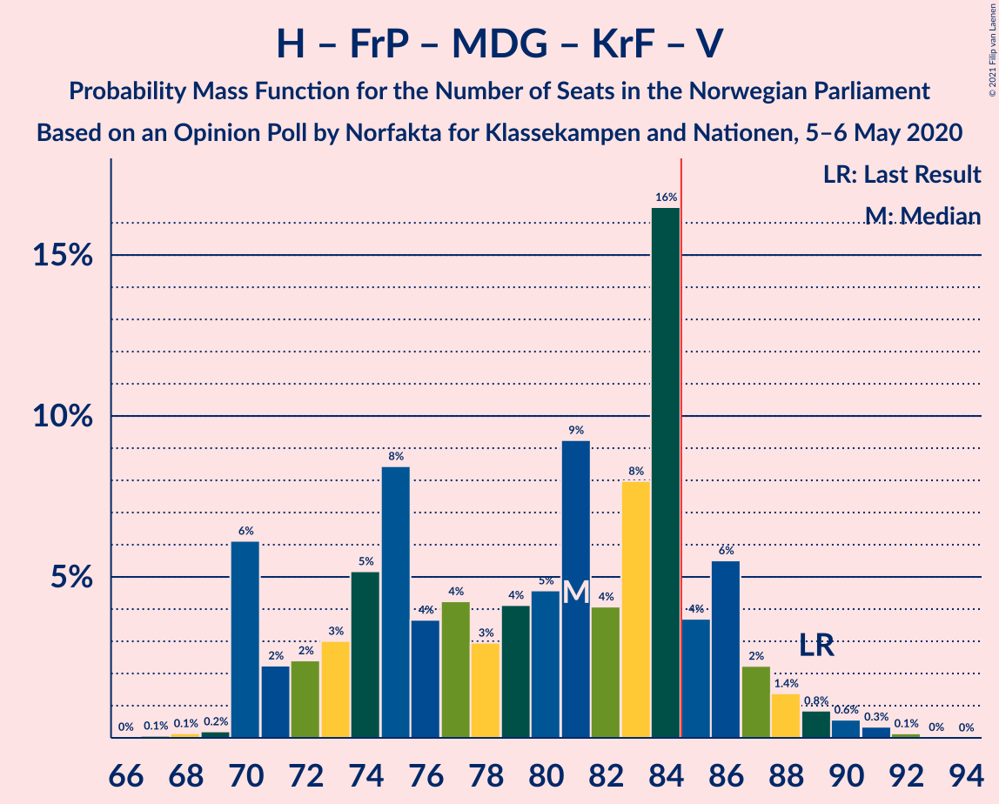

| Number of Seats | Probability | Accumulated | Special Marks |
|:---------------:|:-----------:|:-----------:|:-------------:|
| 66 | 0% | 100% |  |
| 67 | 0.1% | 99.9% |  |
| 68 | 0.1% | 99.9% |  |
| 69 | 0.2% | 99.7% |  |
| 70 | 6% | 99.5% |  |
| 71 | 2% | 93% |  |
| 72 | 2% | 91% |  |
| 73 | 3% | 89% |  |
| 74 | 5% | 86% |  |
| 75 | 8% | 81% |  |
| 76 | 4% | 72% |  |
| 77 | 4% | 68% |  |
| 78 | 3% | 64% |  |
| 79 | 4% | 61% |  |
| 80 | 5% | 57% |  |
| 81 | 9% | 53% | Median |
| 82 | 4% | 43% |  |
| 83 | 8% | 39% |  |
| 84 | 16% | 31% |  |
| 85 | 4% | 15% | Majority |
| 86 | 6% | 11% |  |
| 87 | 2% | 6% |  |
| 88 | 1.4% | 3% |  |
| 89 | 0.8% | 2% | Last Result |
| 90 | 0.6% | 1.1% |  |
| 91 | 0.3% | 0.5% |  |
| 92 | 0.1% | 0.2% |  |
| 93 | 0% | 0% |  |

### Arbeiderpartiet – Senterpartiet – Kristelig Folkeparti

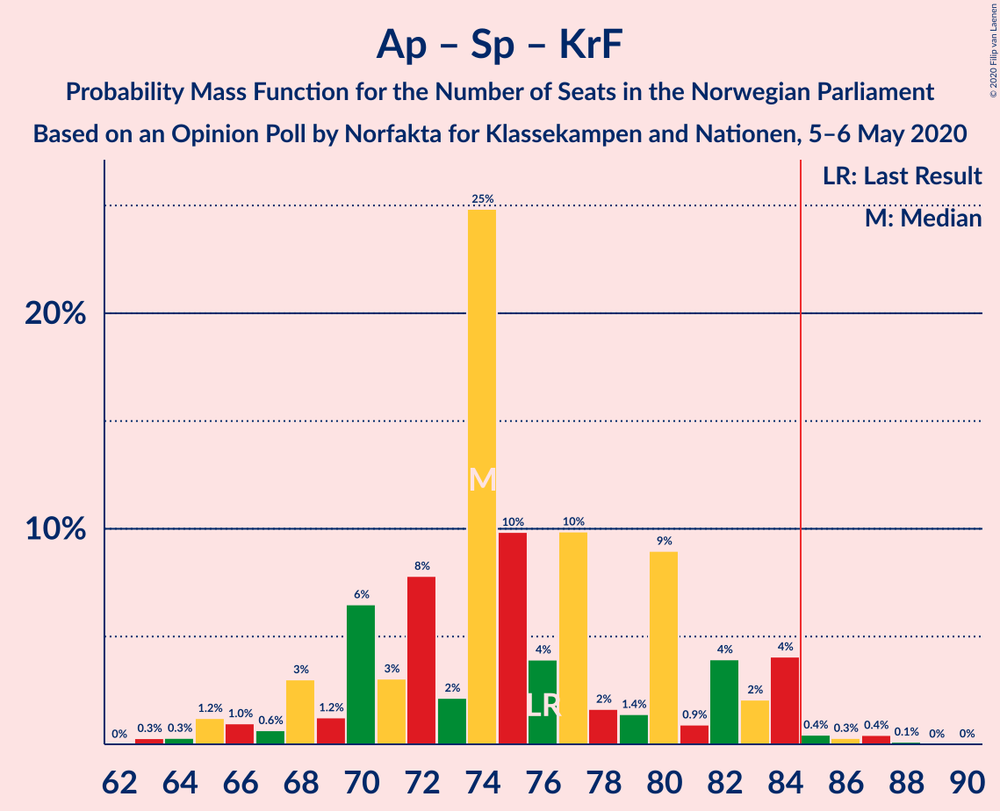

| Number of Seats | Probability | Accumulated | Special Marks |
|:---------------:|:-----------:|:-----------:|:-------------:|
| 63 | 0.2% | 100% |  |
| 64 | 0.2% | 99.7% |  |
| 65 | 0.4% | 99.5% |  |
| 66 | 0.9% | 99.1% |  |
| 67 | 0.9% | 98% |  |
| 68 | 6% | 97% |  |
| 69 | 7% | 91% |  |
| 70 | 4% | 84% |  |
| 71 | 4% | 80% |  |
| 72 | 7% | 76% |  |
| 73 | 7% | 69% |  |
| 74 | 11% | 62% |  |
| 75 | 9% | 51% |  |
| 76 | 7% | 42% | Last Result, Median |
| 77 | 5% | 35% |  |
| 78 | 11% | 30% |  |
| 79 | 7% | 19% |  |
| 80 | 5% | 12% |  |
| 81 | 2% | 7% |  |
| 82 | 1.3% | 6% |  |
| 83 | 2% | 5% |  |
| 84 | 2% | 3% |  |
| 85 | 0.6% | 1.1% | Majority |
| 86 | 0.2% | 0.5% |  |
| 87 | 0.2% | 0.4% |  |
| 88 | 0.1% | 0.2% |  |
| 89 | 0% | 0.1% |  |
| 90 | 0% | 0% |  |

### Høyre – Fremskrittspartiet – Kristelig Folkeparti – Venstre

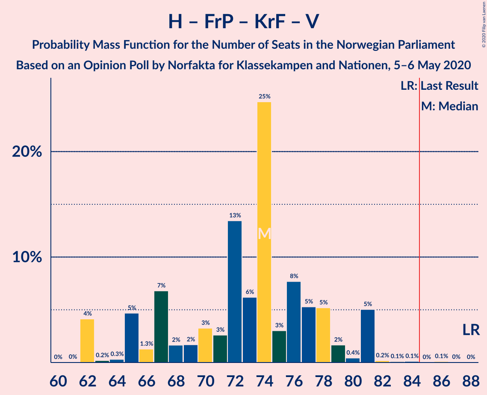

| Number of Seats | Probability | Accumulated | Special Marks |
|:---------------:|:-----------:|:-----------:|:-------------:|
| 60 | 0.1% | 100% |  |
| 61 | 0.1% | 99.9% |  |
| 62 | 0.5% | 99.8% |  |
| 63 | 0.2% | 99.3% |  |
| 64 | 1.2% | 99.1% |  |
| 65 | 2% | 98% |  |
| 66 | 4% | 96% |  |
| 67 | 5% | 92% |  |
| 68 | 9% | 87% |  |
| 69 | 4% | 78% |  |
| 70 | 4% | 73% |  |
| 71 | 4% | 69% |  |
| 72 | 7% | 65% |  |
| 73 | 9% | 59% | Median |
| 74 | 10% | 50% |  |
| 75 | 5% | 40% |  |
| 76 | 9% | 34% |  |
| 77 | 9% | 25% |  |
| 78 | 7% | 16% |  |
| 79 | 3% | 9% |  |
| 80 | 2% | 6% |  |
| 81 | 2% | 5% |  |
| 82 | 1.2% | 3% |  |
| 83 | 1.4% | 2% |  |
| 84 | 0.4% | 0.6% |  |
| 85 | 0.1% | 0.2% | Majority |
| 86 | 0.1% | 0.1% |  |
| 87 | 0% | 0% |  |
| 88 | 0% | 0% | Last Result |

### Arbeiderpartiet – Sosialistisk Venstreparti – Miljøpartiet De Grønne – Rødt

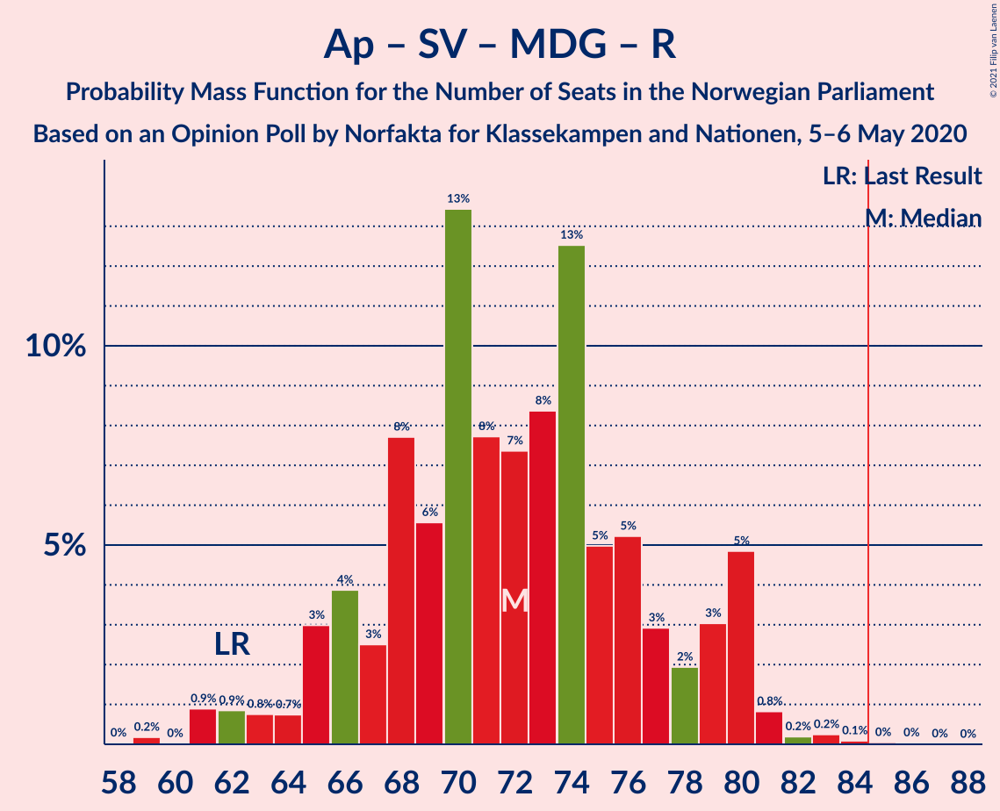

| Number of Seats | Probability | Accumulated | Special Marks |
|:---------------:|:-----------:|:-----------:|:-------------:|
| 59 | 0.2% | 100% |  |
| 60 | 0% | 99.8% |  |
| 61 | 0.9% | 99.8% |  |
| 62 | 0.9% | 98.9% | Last Result |
| 63 | 0.8% | 98% |  |
| 64 | 0.7% | 97% |  |
| 65 | 3% | 97% |  |
| 66 | 4% | 94% |  |
| 67 | 3% | 90% |  |
| 68 | 8% | 87% |  |
| 69 | 6% | 79% |  |
| 70 | 13% | 74% |  |
| 71 | 8% | 60% |  |
| 72 | 7% | 53% |  |
| 73 | 8% | 45% |  |
| 74 | 13% | 37% | Median |
| 75 | 5% | 24% |  |
| 76 | 5% | 19% |  |
| 77 | 3% | 14% |  |
| 78 | 2% | 11% |  |
| 79 | 3% | 9% |  |
| 80 | 5% | 6% |  |
| 81 | 0.8% | 1.5% |  |
| 82 | 0.2% | 0.6% |  |
| 83 | 0.2% | 0.5% |  |
| 84 | 0.1% | 0.2% |  |
| 85 | 0% | 0.1% | Majority |
| 86 | 0% | 0.1% |  |
| 87 | 0% | 0% |  |

### Arbeiderpartiet – Senterpartiet

| Number of Seats | Probability | Accumulated | Special Marks |
|:---------------:|:-----------:|:-----------:|:-------------:|
| 59 | 0.1% | 100% |  |
| 60 | 0.5% | 99.9% |  |
| 61 | 3% | 99.4% |  |
| 62 | 1.3% | 96% |  |
| 63 | 4% | 95% |  |
| 64 | 3% | 91% |  |
| 65 | 8% | 87% |  |
| 66 | 12% | 79% |  |
| 67 | 8% | 67% |  |
| 68 | 8% | 59% | Last Result |
| 69 | 4% | 50% | Median |
| 70 | 8% | 46% |  |
| 71 | 10% | 39% |  |
| 72 | 5% | 28% |  |
| 73 | 8% | 24% |  |
| 74 | 3% | 16% |  |
| 75 | 9% | 13% |  |
| 76 | 1.3% | 4% |  |
| 77 | 2% | 3% |  |
| 78 | 0.5% | 1.2% |  |
| 79 | 0.2% | 0.7% |  |
| 80 | 0.3% | 0.5% |  |
| 81 | 0.1% | 0.2% |  |
| 82 | 0.1% | 0.1% |  |
| 83 | 0% | 0% |  |

### Høyre – Fremskrittspartiet – Venstre

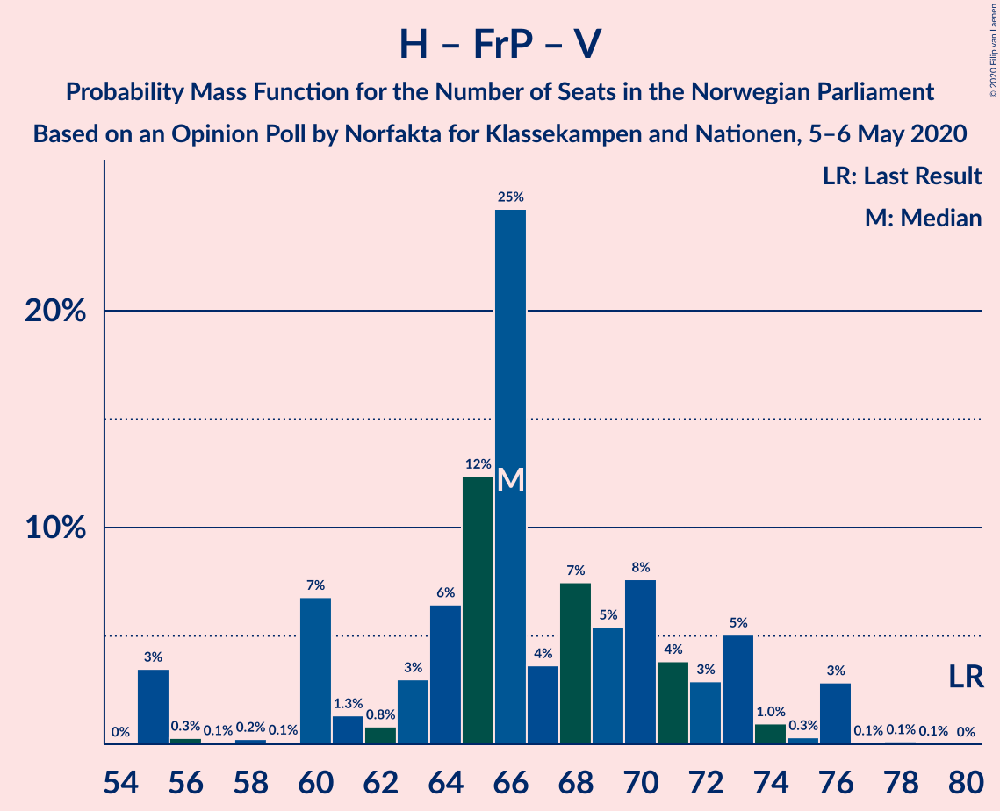

| Number of Seats | Probability | Accumulated | Special Marks |
|:---------------:|:-----------:|:-----------:|:-------------:|
| 54 | 0% | 100% |  |
| 55 | 0.1% | 99.9% |  |
| 56 | 0.1% | 99.8% |  |
| 57 | 0.6% | 99.7% |  |
| 58 | 0.3% | 99.1% |  |
| 59 | 1.1% | 98.7% |  |
| 60 | 3% | 98% |  |
| 61 | 2% | 95% |  |
| 62 | 4% | 93% |  |
| 63 | 5% | 89% |  |
| 64 | 6% | 84% |  |
| 65 | 15% | 78% |  |
| 66 | 8% | 63% | Median |
| 67 | 6% | 55% |  |
| 68 | 9% | 49% |  |
| 69 | 6% | 40% |  |
| 70 | 10% | 34% |  |
| 71 | 11% | 24% |  |
| 72 | 3% | 13% |  |
| 73 | 2% | 10% |  |
| 74 | 4% | 8% |  |
| 75 | 2% | 5% |  |
| 76 | 2% | 3% |  |
| 77 | 0.3% | 0.8% |  |
| 78 | 0.3% | 0.5% |  |
| 79 | 0.1% | 0.2% |  |
| 80 | 0.1% | 0.1% | Last Result |
| 81 | 0% | 0% |  |

### Høyre – Fremskrittspartiet

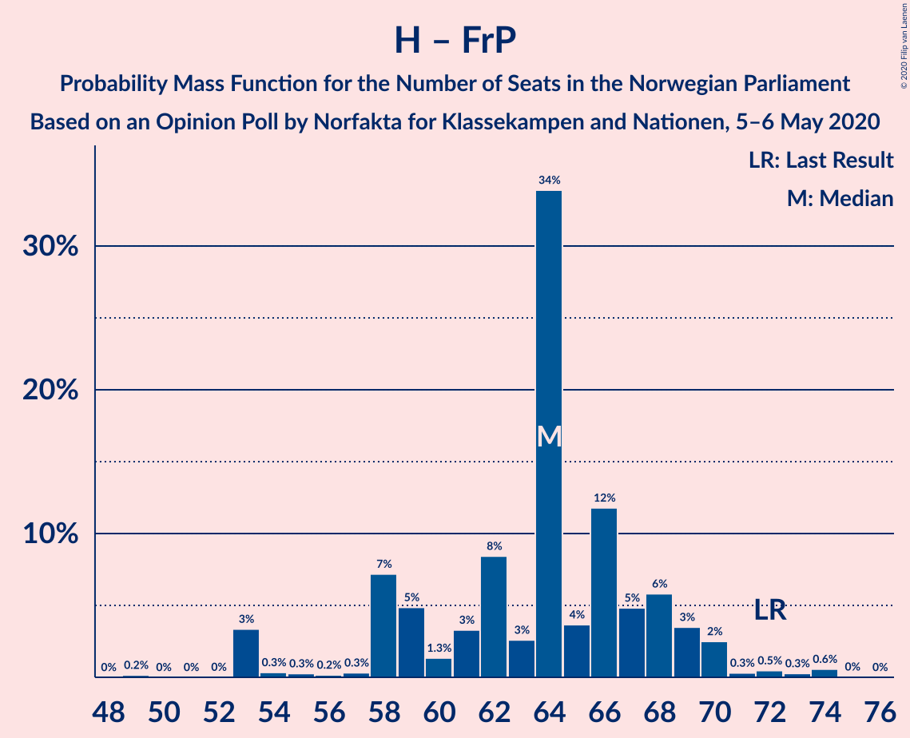

| Number of Seats | Probability | Accumulated | Special Marks |
|:---------------:|:-----------:|:-----------:|:-------------:|
| 51 | 0% | 100% |  |
| 52 | 0.1% | 99.9% |  |
| 53 | 0.2% | 99.9% |  |
| 54 | 0.4% | 99.7% |  |
| 55 | 0.9% | 99.3% |  |
| 56 | 0.6% | 98% |  |
| 57 | 1.4% | 98% |  |
| 58 | 3% | 96% |  |
| 59 | 3% | 94% |  |
| 60 | 4% | 90% |  |
| 61 | 6% | 86% |  |
| 62 | 7% | 80% |  |
| 63 | 18% | 73% |  |
| 64 | 9% | 55% | Median |
| 65 | 6% | 47% |  |
| 66 | 10% | 40% |  |
| 67 | 7% | 31% |  |
| 68 | 8% | 24% |  |
| 69 | 9% | 15% |  |
| 70 | 2% | 6% |  |
| 71 | 1.4% | 4% |  |
| 72 | 0.5% | 3% | Last Result |
| 73 | 1.4% | 2% |  |
| 74 | 0.6% | 0.7% |  |
| 75 | 0% | 0.1% |  |
| 76 | 0% | 0.1% |  |
| 77 | 0.1% | 0.1% |  |
| 78 | 0% | 0% |  |

### Arbeiderpartiet – Sosialistisk Venstreparti

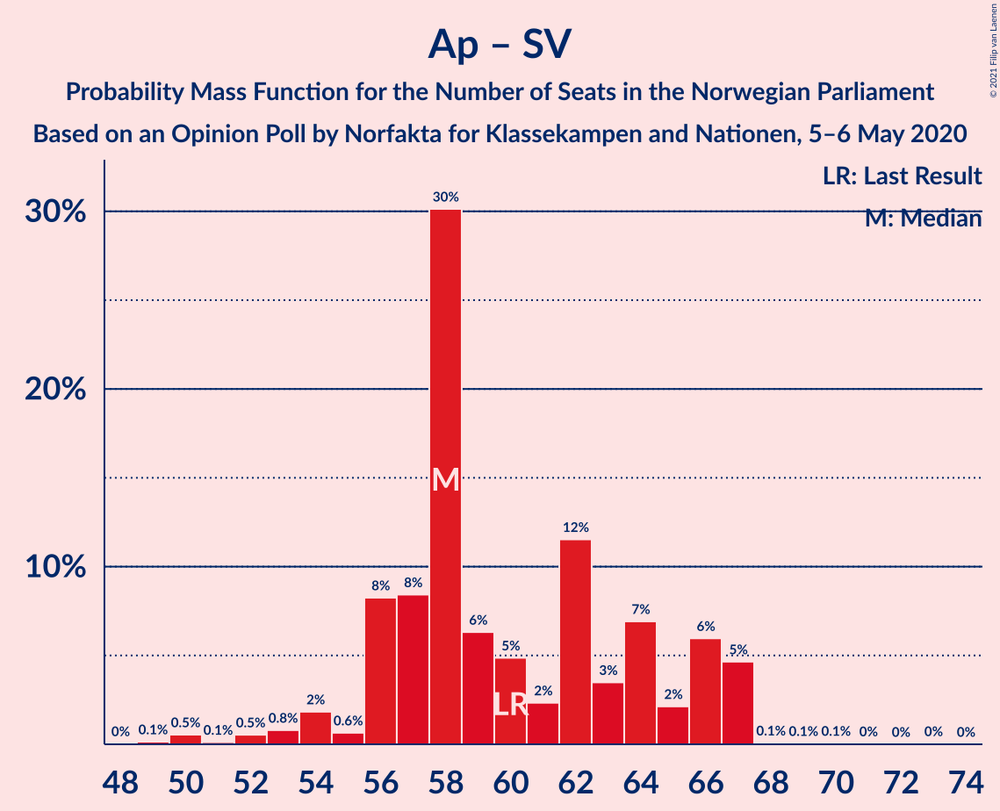

| Number of Seats | Probability | Accumulated | Special Marks |
|:---------------:|:-----------:|:-----------:|:-------------:|
| 49 | 0% | 100% |  |
| 50 | 0.1% | 99.9% |  |
| 51 | 0.2% | 99.8% |  |
| 52 | 0.6% | 99.7% |  |
| 53 | 2% | 99.1% |  |
| 54 | 3% | 97% |  |
| 55 | 13% | 94% |  |
| 56 | 10% | 81% |  |
| 57 | 11% | 71% |  |
| 58 | 12% | 61% |  |
| 59 | 9% | 49% | Median |
| 60 | 8% | 40% | Last Result |
| 61 | 4% | 32% |  |
| 62 | 8% | 28% |  |
| 63 | 9% | 20% |  |
| 64 | 5% | 11% |  |
| 65 | 2% | 7% |  |
| 66 | 2% | 5% |  |
| 67 | 1.0% | 3% |  |
| 68 | 1.2% | 2% |  |
| 69 | 0.2% | 0.6% |  |
| 70 | 0.1% | 0.3% |  |
| 71 | 0.1% | 0.2% |  |
| 72 | 0.1% | 0.1% |  |
| 73 | 0% | 0% |  |

### Høyre – Kristelig Folkeparti – Venstre

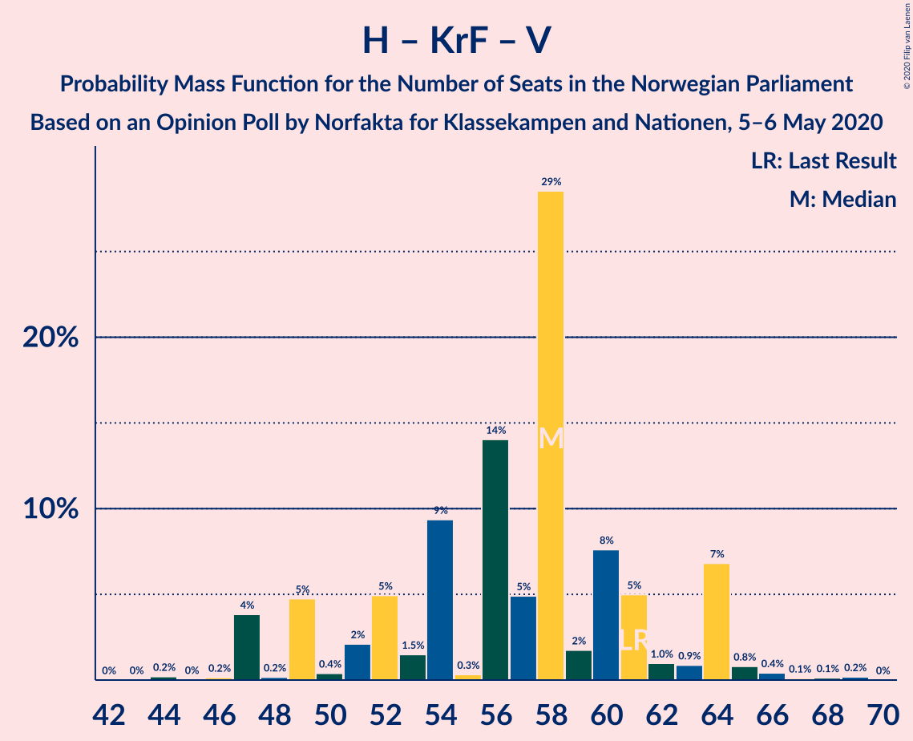

| Number of Seats | Probability | Accumulated | Special Marks |
|:---------------:|:-----------:|:-----------:|:-------------:|
| 44 | 0.1% | 100% |  |
| 45 | 0.1% | 99.9% |  |
| 46 | 0.3% | 99.8% |  |
| 47 | 2% | 99.5% |  |
| 48 | 0.8% | 98% |  |
| 49 | 2% | 97% |  |
| 50 | 2% | 95% |  |
| 51 | 8% | 93% |  |
| 52 | 4% | 85% |  |
| 53 | 6% | 81% |  |
| 54 | 10% | 75% |  |
| 55 | 5% | 65% |  |
| 56 | 6% | 60% |  |
| 57 | 8% | 54% | Median |
| 58 | 7% | 46% |  |
| 59 | 7% | 39% |  |
| 60 | 9% | 32% |  |
| 61 | 4% | 23% | Last Result |
| 62 | 7% | 19% |  |
| 63 | 2% | 12% |  |
| 64 | 4% | 10% |  |
| 65 | 4% | 6% |  |
| 66 | 1.2% | 3% |  |
| 67 | 0.6% | 1.4% |  |
| 68 | 0.4% | 0.8% |  |
| 69 | 0.1% | 0.4% |  |
| 70 | 0.2% | 0.3% |  |
| 71 | 0.1% | 0.1% |  |
| 72 | 0% | 0% |  |

### Senterpartiet – Kristelig Folkeparti – Venstre

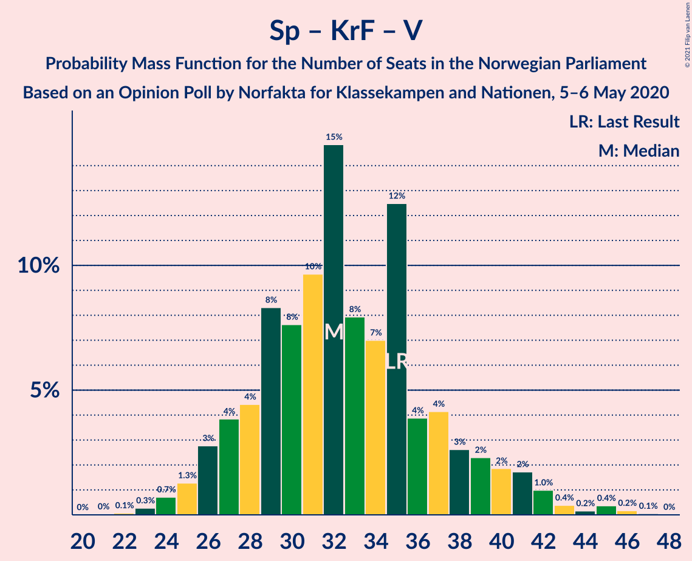

| Number of Seats | Probability | Accumulated | Special Marks |
|:---------------:|:-----------:|:-----------:|:-------------:|
| 22 | 0.1% | 100% |  |
| 23 | 0.3% | 99.9% |  |
| 24 | 0.7% | 99.6% |  |
| 25 | 1.3% | 98.9% |  |
| 26 | 3% | 98% |  |
| 27 | 4% | 95% |  |
| 28 | 4% | 91% |  |
| 29 | 8% | 87% |  |
| 30 | 8% | 78% |  |
| 31 | 10% | 71% |  |
| 32 | 15% | 61% |  |
| 33 | 8% | 46% | Median |
| 34 | 7% | 38% |  |
| 35 | 12% | 31% | Last Result |
| 36 | 4% | 19% |  |
| 37 | 4% | 15% |  |
| 38 | 3% | 11% |  |
| 39 | 2% | 8% |  |
| 40 | 2% | 6% |  |
| 41 | 2% | 4% |  |
| 42 | 1.0% | 2% |  |
| 43 | 0.4% | 1.2% |  |
| 44 | 0.2% | 0.8% |  |
| 45 | 0.4% | 0.6% |  |
| 46 | 0.2% | 0.2% |  |
| 47 | 0.1% | 0.1% |  |
| 48 | 0% | 0% |  |

## Technical Information

### Opinion Poll

+ **Polling firm:** Norfakta
+ **Commissioner(s):** Klassekampen and Nationen
+ **Fieldwork period:** 5–6 May 2020

### Calculations

+ **Sample size:** 810
+ **Simulations done:** 1,048,576
+ **Error estimate:** 1.37%

