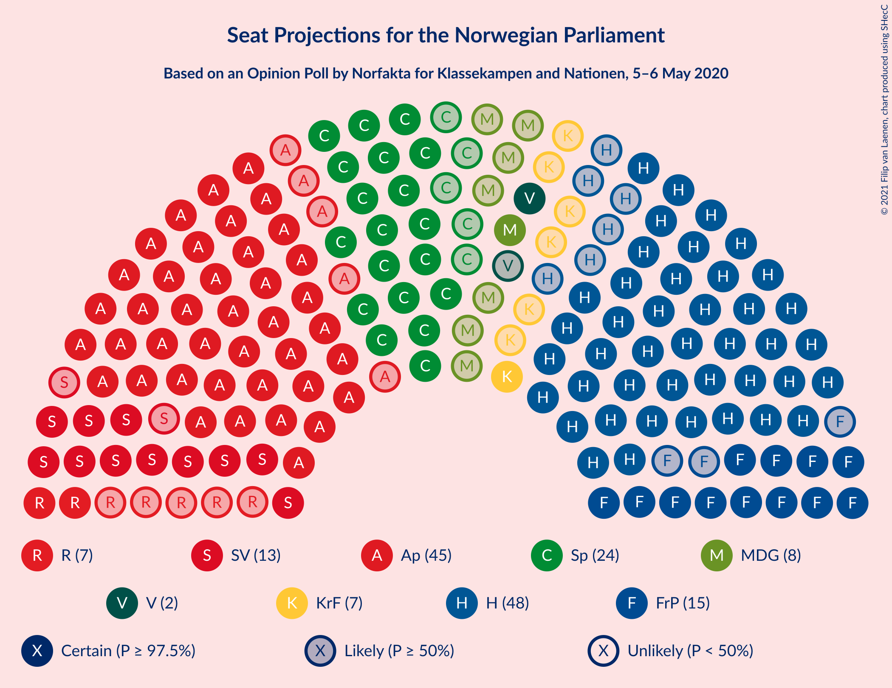
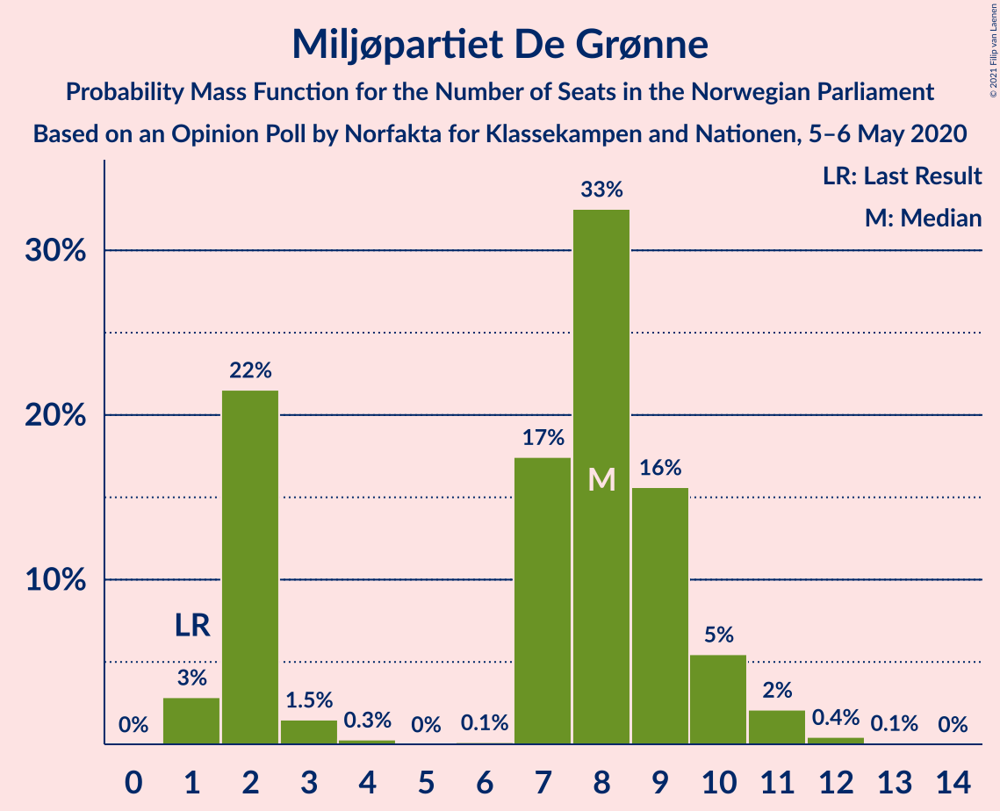
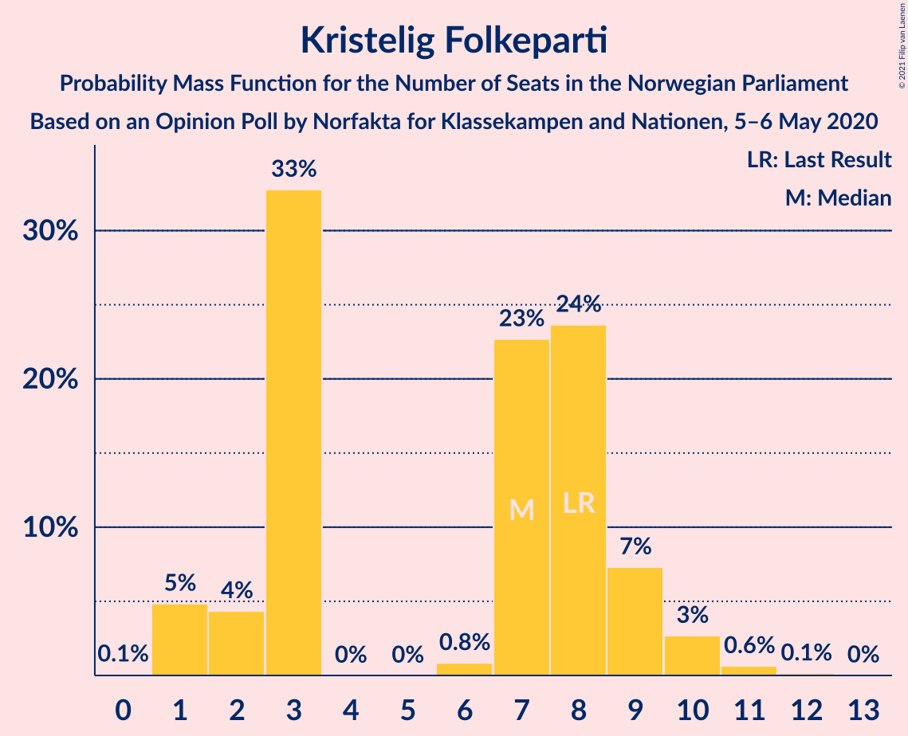
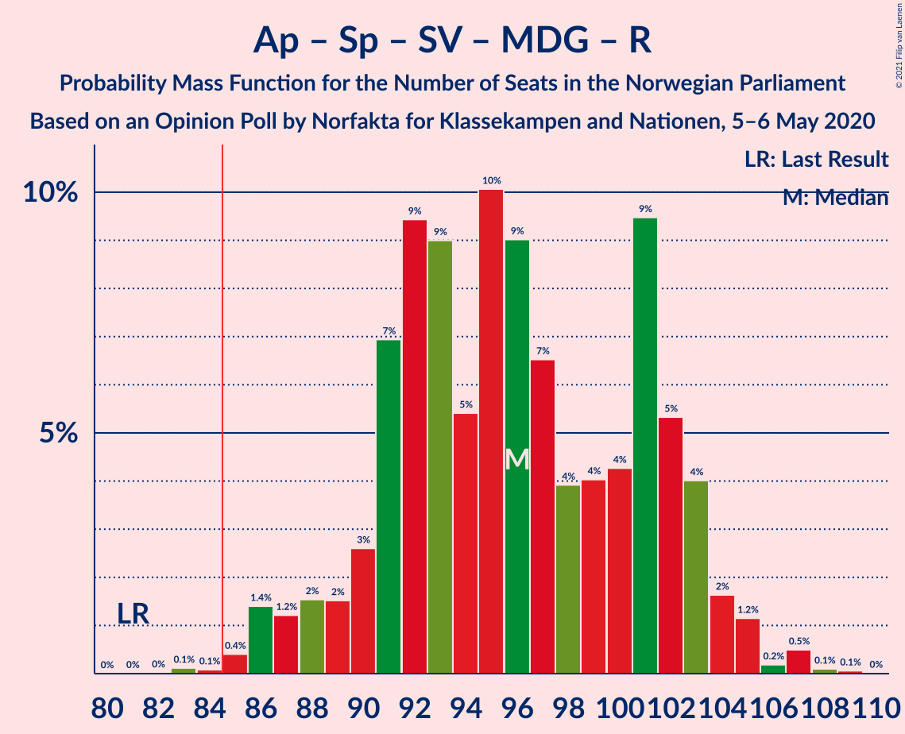
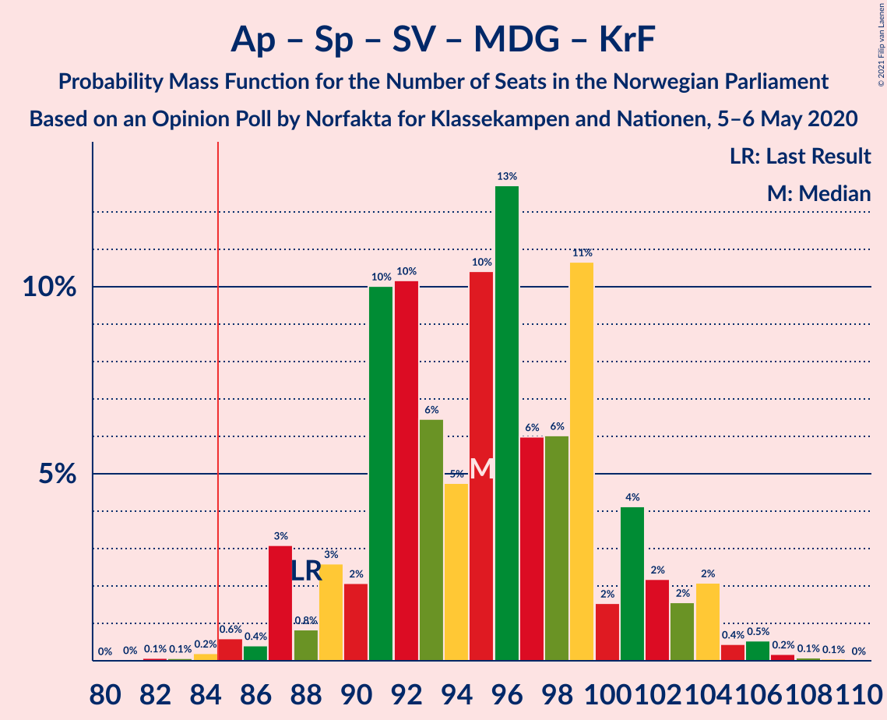

# Opinion Poll by Norfakta for Klassekampen and Nationen, 5–6 May 2020

<a href="#voting-intentions">Voting Intentions</a> | <a href="#seats">Seats</a> | <a href="#coalitions">Coalitions</a> | <a href="#technical-information">Technical Information</a>

## Voting Intentions

### Confidence Intervals

| Party | Last Result | Poll Result | 80% Confidence Interval | 90% Confidence Interval | 95% Confidence Interval | 99% Confidence Interval |
|:-----:|:-----------:|:-----------:|:-----------------------:|:-----------------------:|:-----------------------:|:-----------------------:|
| Høyre | 25.0% | 26.9% | 25.0–29.0% |24.4–29.6% |24.0–30.1% |23.1–31.1% |
| Arbeiderpartiet | 27.4% | 25.1% | 23.2–27.1% |22.6–27.7% |22.2–28.2% |21.3–29.2% |
| Senterpartiet | 10.3% | 13.5% | 12.0–15.1% |11.6–15.6% |11.3–16.0% |10.6–16.8% |
| Fremskrittspartiet | 15.2% | 9.1% | 8.0–10.6% |7.6–11.0% |7.3–11.3% |6.8–12.0% |
| Sosialistisk Venstreparti | 6.0% | 8.0% | 6.9–9.4% |6.6–9.8% |6.3–10.1% |5.9–10.8% |
| Miljøpartiet De Grønne | 3.2% | 4.4% | 3.6–5.5% |3.4–5.8% |3.2–6.1% |2.9–6.7% |
| Rødt | 2.4% | 4.3% | 3.5–5.4% |3.3–5.7% |3.1–6.0% |2.8–6.5% |
| Kristelig Folkeparti | 4.2% | 4.1% | 3.3–5.1% |3.1–5.4% |2.9–5.7% |2.6–6.2% |
| Venstre | 4.4% | 3.3% | 2.7–4.3% |2.5–4.6% |2.3–4.8% |2.0–5.3% |

*Note:* The poll result column reflects the actual value used in the calculations. Published results may vary slightly, and in addition be rounded to fewer digits.

## Seats

### Confidence Intervals

| Party | Last Result | Median | 80% Confidence Interval | 90% Confidence Interval | 95% Confidence Interval | 99% Confidence Interval |
|:-----:|:-----------:|:------:|:-----------------------:|:-----------------------:|:-----------------------:|:-----------------------:|
| <a href="#høyre">Høyre</a> | 45 | 48 | 43–51 |42–53 |38–54 |38–57 |
| <a href="#arbeiderpartiet">Arbeiderpartiet</a> | 49 | 44 | 41–50 |40–50 |40–51 |38–53 |
| <a href="#senterpartiet">Senterpartiet</a> | 19 | 23 | 20–26 |19–31 |19–31 |18–33 |
| <a href="#fremskrittspartiet">Fremskrittspartiet</a> | 27 | 16 | 13–18 |13–20 |12–21 |12–23 |
| <a href="#sosialistisk-venstreparti">Sosialistisk Venstreparti</a> | 11 | 14 | 12–17 |12–18 |11–18 |9–19 |
| <a href="#miljøpartiet-de-grønne">Miljøpartiet De Grønne</a> | 1 | 7 | 1–9 |1–10 |1–10 |1–11 |
| <a href="#rødt">Rødt</a> | 1 | 8 | 2–9 |2–9 |2–9 |1–11 |
| <a href="#kristelig-folkeparti">Kristelig Folkeparti</a> | 8 | 7 | 2–8 |1–9 |1–10 |1–12 |
| <a href="#venstre">Venstre</a> | 8 | 2 | 1–7 |1–7 |1–8 |1–9 |

### Høyre

*For a full overview of the results for this party, see the [Høyre](party-høyre.html) page.*

| Number of Seats | Probability | Accumulated | Special Marks |
|:---------------:|:-----------:|:-----------:|:-------------:|
| 37 | 0.1% | 100% |  |
| 38 | 3% | 99.9% |  |
| 39 | 0.2% | 96% |  |
| 40 | 0.3% | 96% |  |
| 41 | 0.5% | 96% |  |
| 42 | 1.0% | 95% |  |
| 43 | 5% | 94% |  |
| 44 | 2% | 90% |  |
| 45 | 9% | 88% | Last Result |
| 46 | 9% | 79% |  |
| 47 | 7% | 71% |  |
| 48 | 33% | 64% | Median |
| 49 | 9% | 31% |  |
| 50 | 10% | 22% |  |
| 51 | 3% | 13% |  |
| 52 | 3% | 10% |  |
| 53 | 4% | 7% |  |
| 54 | 1.0% | 3% |  |
| 55 | 0.7% | 2% |  |
| 56 | 0.5% | 1.1% |  |
| 57 | 0.4% | 0.5% |  |
| 58 | 0% | 0.2% |  |
| 59 | 0.1% | 0.1% |  |
| 60 | 0% | 0% |  |

### Arbeiderpartiet

*For a full overview of the results for this party, see the [Arbeiderpartiet](party-arbeiderpartiet.html) page.*

| Number of Seats | Probability | Accumulated | Special Marks |
|:---------------:|:-----------:|:-----------:|:-------------:|
| 36 | 0% | 100% |  |
| 37 | 0.3% | 99.9% |  |
| 38 | 0.2% | 99.7% |  |
| 39 | 0.3% | 99.4% |  |
| 40 | 7% | 99.1% |  |
| 41 | 3% | 92% |  |
| 42 | 6% | 89% |  |
| 43 | 3% | 83% |  |
| 44 | 31% | 80% | Median |
| 45 | 13% | 49% |  |
| 46 | 6% | 36% |  |
| 47 | 4% | 30% |  |
| 48 | 3% | 26% |  |
| 49 | 5% | 23% | Last Result |
| 50 | 15% | 19% |  |
| 51 | 3% | 4% |  |
| 52 | 0.6% | 1.1% |  |
| 53 | 0.2% | 0.5% |  |
| 54 | 0.1% | 0.3% |  |
| 55 | 0.1% | 0.2% |  |
| 56 | 0.1% | 0.1% |  |
| 57 | 0% | 0% |  |

### Senterpartiet

*For a full overview of the results for this party, see the [Senterpartiet](party-senterpartiet.html) page.*

| Number of Seats | Probability | Accumulated | Special Marks |
|:---------------:|:-----------:|:-----------:|:-------------:|
| 18 | 0.7% | 100% |  |
| 19 | 6% | 99.3% | Last Result |
| 20 | 4% | 93% |  |
| 21 | 5% | 90% |  |
| 22 | 27% | 85% |  |
| 23 | 11% | 57% | Median |
| 24 | 19% | 46% |  |
| 25 | 9% | 27% |  |
| 26 | 9% | 18% |  |
| 27 | 0.8% | 10% |  |
| 28 | 1.0% | 9% |  |
| 29 | 0.3% | 8% |  |
| 30 | 1.0% | 8% |  |
| 31 | 5% | 7% |  |
| 32 | 0.3% | 2% |  |
| 33 | 1.1% | 1.3% |  |
| 34 | 0.1% | 0.2% |  |
| 35 | 0.1% | 0.1% |  |
| 36 | 0% | 0% |  |

### Fremskrittspartiet

*For a full overview of the results for this party, see the [Fremskrittspartiet](party-fremskrittspartiet.html) page.*

| Number of Seats | Probability | Accumulated | Special Marks |
|:---------------:|:-----------:|:-----------:|:-------------:|
| 10 | 0.1% | 100% |  |
| 11 | 0.4% | 99.9% |  |
| 12 | 4% | 99.5% |  |
| 13 | 9% | 96% |  |
| 14 | 5% | 87% |  |
| 15 | 10% | 81% |  |
| 16 | 38% | 71% | Median |
| 17 | 17% | 33% |  |
| 18 | 8% | 16% |  |
| 19 | 3% | 8% |  |
| 20 | 3% | 6% |  |
| 21 | 1.3% | 3% |  |
| 22 | 0.2% | 1.2% |  |
| 23 | 0.9% | 1.0% |  |
| 24 | 0% | 0.1% |  |
| 25 | 0% | 0.1% |  |
| 26 | 0% | 0% |  |
| 27 | 0% | 0% | Last Result |

### Sosialistisk Venstreparti

*For a full overview of the results for this party, see the [Sosialistisk Venstreparti](party-sosialistiskvenstreparti.html) page.*

| Number of Seats | Probability | Accumulated | Special Marks |
|:---------------:|:-----------:|:-----------:|:-------------:|
| 9 | 0.6% | 100% |  |
| 10 | 1.5% | 99.3% |  |
| 11 | 3% | 98% | Last Result |
| 12 | 8% | 95% |  |
| 13 | 12% | 87% |  |
| 14 | 33% | 75% | Median |
| 15 | 12% | 42% |  |
| 16 | 12% | 30% |  |
| 17 | 9% | 18% |  |
| 18 | 8% | 9% |  |
| 19 | 1.2% | 1.3% |  |
| 20 | 0.1% | 0.1% |  |
| 21 | 0% | 0% |  |

### Miljøpartiet De Grønne

*For a full overview of the results for this party, see the [Miljøpartiet De Grønne](party-miljøpartietdegrønne.html) page.*

| Number of Seats | Probability | Accumulated | Special Marks |
|:---------------:|:-----------:|:-----------:|:-------------:|
| 1 | 10% | 100% | Last Result |
| 2 | 10% | 90% |  |
| 3 | 0.1% | 79% |  |
| 4 | 0% | 79% |  |
| 5 | 0% | 79% |  |
| 6 | 0.2% | 79% |  |
| 7 | 38% | 79% | Median |
| 8 | 21% | 41% |  |
| 9 | 12% | 20% |  |
| 10 | 6% | 8% |  |
| 11 | 2% | 2% |  |
| 12 | 0.4% | 0.5% |  |
| 13 | 0% | 0% |  |

### Rødt

*For a full overview of the results for this party, see the [Rødt](party-rødt.html) page.*

| Number of Seats | Probability | Accumulated | Special Marks |
|:---------------:|:-----------:|:-----------:|:-------------:|
| 1 | 2% | 100% | Last Result |
| 2 | 29% | 98% |  |
| 3 | 0% | 69% |  |
| 4 | 0% | 69% |  |
| 5 | 0% | 69% |  |
| 6 | 0.8% | 69% |  |
| 7 | 14% | 68% |  |
| 8 | 37% | 54% | Median |
| 9 | 15% | 17% |  |
| 10 | 1.1% | 2% |  |
| 11 | 0.8% | 0.9% |  |
| 12 | 0.1% | 0.1% |  |
| 13 | 0.1% | 0.1% |  |
| 14 | 0% | 0% |  |

### Kristelig Folkeparti

*For a full overview of the results for this party, see the [Kristelig Folkeparti](party-kristeligfolkeparti.html) page.*

| Number of Seats | Probability | Accumulated | Special Marks |
|:---------------:|:-----------:|:-----------:|:-------------:|
| 0 | 0.1% | 100% |  |
| 1 | 9% | 99.9% |  |
| 2 | 5% | 91% |  |
| 3 | 13% | 86% |  |
| 4 | 0% | 73% |  |
| 5 | 0% | 73% |  |
| 6 | 2% | 73% |  |
| 7 | 25% | 72% | Median |
| 8 | 38% | 46% | Last Result |
| 9 | 6% | 8% |  |
| 10 | 2% | 3% |  |
| 11 | 0.2% | 0.9% |  |
| 12 | 0.6% | 0.7% |  |
| 13 | 0% | 0% |  |

### Venstre

*For a full overview of the results for this party, see the [Venstre](party-venstre.html) page.*

| Number of Seats | Probability | Accumulated | Special Marks |
|:---------------:|:-----------:|:-----------:|:-------------:|
| 0 | 0.3% | 100% |  |
| 1 | 10% | 99.7% |  |
| 2 | 70% | 89% | Median |
| 3 | 0.2% | 20% |  |
| 4 | 0% | 20% |  |
| 5 | 0% | 20% |  |
| 6 | 3% | 20% |  |
| 7 | 12% | 16% |  |
| 8 | 4% | 4% | Last Result |
| 9 | 0.4% | 0.5% |  |
| 10 | 0.1% | 0.1% |  |
| 11 | 0% | 0% |  |

## Coalitions

### Confidence Intervals

| Coalition | Last Result | Median | Majority? | 80% Confidence Interval | 90% Confidence Interval | 95% Confidence Interval | 99% Confidence Interval |
|:---------:|:-----------:|:------:|:---------:|:-----------------------:|:-----------------------:|:-----------------------:|:-----------------------:|
| Høyre – Senterpartiet – Fremskrittspartiet – Kristelig Folkeparti – Venstre | 107 | 96 | 100% | 90–102 | 89–105 | 87–108 | 87–108 |
| Arbeiderpartiet – Senterpartiet – Sosialistisk Venstreparti – Miljøpartiet De Grønne – Rødt | 81 | 95 | 99.8% | 91–103 | 88–104 | 88–107 | 87–107 |
| Arbeiderpartiet – Senterpartiet – Sosialistisk Venstreparti – Miljøpartiet De Grønne – Kristelig Folkeparti | 88 | 95 | 99.9% | 91–103 | 90–104 | 89–106 | 87–106 |
| Arbeiderpartiet – Senterpartiet – Sosialistisk Venstreparti – Miljøpartiet De Grønne | 80 | 89 | 97% | 86–97 | 85–101 | 84–102 | 80–102 |
| Arbeiderpartiet – Senterpartiet – Sosialistisk Venstreparti – Rødt | 80 | 88 | 88% | 84–95 | 82–98 | 81–99 | 81–99 |
| Arbeiderpartiet – Senterpartiet – Sosialistisk Venstreparti | 79 | 82 | 40% | 78–91 | 78–93 | 77–93 | 76–93 |
| Arbeiderpartiet – Senterpartiet – Miljøpartiet De Grønne – Kristelig Folkeparti | 77 | 81 | 31% | 76–87 | 75–90 | 74–90 | 72–95 |
| Høyre – Fremskrittspartiet – Miljøpartiet De Grønne – Kristelig Folkeparti – Venstre | 89 | 81 | 12% | 74–85 | 71–87 | 70–88 | 70–88 |
| Arbeiderpartiet – Senterpartiet – Kristelig Folkeparti | 76 | 74 | 1.3% | 70–82 | 68–84 | 66–84 | 64–87 |
| Høyre – Fremskrittspartiet – Kristelig Folkeparti – Venstre | 88 | 74 | 0.2% | 66–78 | 65–81 | 62–81 | 62–82 |
| Arbeiderpartiet – Senterpartiet | 68 | 68 | 0% | 64–76 | 62–76 | 62–76 | 61–79 |
| Høyre – Fremskrittspartiet – Venstre | 80 | 66 | 0% | 60–72 | 60–73 | 55–76 | 55–76 |
| Høyre – Fremskrittspartiet | 72 | 64 | 0% | 58–68 | 58–69 | 53–70 | 53–74 |
| Arbeiderpartiet – Sosialistisk Venstreparti | 60 | 58 | 0% | 56–66 | 56–66 | 54–67 | 50–67 |
| Høyre – Kristelig Folkeparti – Venstre | 61 | 58 | 0% | 51–62 | 49–64 | 47–64 | 47–66 |
| Senterpartiet – Kristelig Folkeparti – Venstre | 35 | 32 | 0% | 29–38 | 26–41 | 26–41 | 24–43 |

### Høyre – Senterpartiet – Fremskrittspartiet – Kristelig Folkeparti – Venstre

| Number of Seats | Probability | Accumulated | Special Marks |
|:---------------:|:-----------:|:-----------:|:-------------:|
| 85 | 0.1% | 100% | Majority |
| 86 | 0.1% | 99.9% |  |
| 87 | 3% | 99.8% |  |
| 88 | 0.4% | 96% |  |
| 89 | 2% | 96% |  |
| 90 | 7% | 94% |  |
| 91 | 6% | 87% |  |
| 92 | 1.0% | 81% |  |
| 93 | 0.6% | 80% |  |
| 94 | 4% | 79% |  |
| 95 | 2% | 75% |  |
| 96 | 36% | 73% | Median |
| 97 | 3% | 37% |  |
| 98 | 9% | 34% |  |
| 99 | 4% | 24% |  |
| 100 | 6% | 21% |  |
| 101 | 2% | 15% |  |
| 102 | 3% | 12% |  |
| 103 | 2% | 10% |  |
| 104 | 3% | 8% |  |
| 105 | 0.7% | 5% |  |
| 106 | 0.3% | 4% |  |
| 107 | 0.1% | 4% | Last Result |
| 108 | 4% | 4% |  |
| 109 | 0.1% | 0.2% |  |
| 110 | 0% | 0.1% |  |
| 111 | 0.1% | 0.1% |  |
| 112 | 0% | 0% |  |

### Arbeiderpartiet – Senterpartiet – Sosialistisk Venstreparti – Miljøpartiet De Grønne – Rødt

| Number of Seats | Probability | Accumulated | Special Marks |
|:---------------:|:-----------:|:-----------:|:-------------:|
| 81 | 0% | 100% | Last Result |
| 82 | 0% | 100% |  |
| 83 | 0.1% | 99.9% |  |
| 84 | 0% | 99.8% |  |
| 85 | 0.1% | 99.8% | Majority |
| 86 | 0.1% | 99.7% |  |
| 87 | 0.2% | 99.6% |  |
| 88 | 5% | 99.4% |  |
| 89 | 0.4% | 94% |  |
| 90 | 2% | 94% |  |
| 91 | 5% | 92% |  |
| 92 | 5% | 87% |  |
| 93 | 8% | 82% |  |
| 94 | 3% | 74% |  |
| 95 | 25% | 71% |  |
| 96 | 6% | 46% | Median |
| 97 | 13% | 40% |  |
| 98 | 3% | 27% |  |
| 99 | 3% | 24% |  |
| 100 | 2% | 21% |  |
| 101 | 2% | 19% |  |
| 102 | 7% | 18% |  |
| 103 | 1.3% | 11% |  |
| 104 | 5% | 9% |  |
| 105 | 0.3% | 5% |  |
| 106 | 0.2% | 4% |  |
| 107 | 4% | 4% |  |
| 108 | 0% | 0.1% |  |
| 109 | 0% | 0.1% |  |
| 110 | 0% | 0% |  |

### Arbeiderpartiet – Senterpartiet – Sosialistisk Venstreparti – Miljøpartiet De Grønne – Kristelig Folkeparti

| Number of Seats | Probability | Accumulated | Special Marks |
|:---------------:|:-----------:|:-----------:|:-------------:|
| 83 | 0% | 100% |  |
| 84 | 0% | 99.9% |  |
| 85 | 0% | 99.9% | Majority |
| 86 | 0.2% | 99.9% |  |
| 87 | 0.3% | 99.7% |  |
| 88 | 2% | 99.4% | Last Result |
| 89 | 1.4% | 98% |  |
| 90 | 2% | 96% |  |
| 91 | 5% | 94% |  |
| 92 | 4% | 90% |  |
| 93 | 3% | 86% |  |
| 94 | 11% | 83% |  |
| 95 | 29% | 72% | Median |
| 96 | 4% | 42% |  |
| 97 | 7% | 38% |  |
| 98 | 7% | 31% |  |
| 99 | 3% | 24% |  |
| 100 | 0.9% | 22% |  |
| 101 | 9% | 21% |  |
| 102 | 2% | 12% |  |
| 103 | 5% | 11% |  |
| 104 | 0.4% | 5% |  |
| 105 | 0.4% | 5% |  |
| 106 | 4% | 4% |  |
| 107 | 0.1% | 0.3% |  |
| 108 | 0.1% | 0.2% |  |
| 109 | 0.2% | 0.2% |  |
| 110 | 0% | 0% |  |

### Arbeiderpartiet – Senterpartiet – Sosialistisk Venstreparti – Miljøpartiet De Grønne

| Number of Seats | Probability | Accumulated | Special Marks |
|:---------------:|:-----------:|:-----------:|:-------------:|
| 77 | 0% | 100% |  |
| 78 | 0.1% | 99.9% |  |
| 79 | 0.1% | 99.9% |  |
| 80 | 0.3% | 99.8% | Last Result |
| 81 | 0.6% | 99.5% |  |
| 82 | 0.1% | 98.8% |  |
| 83 | 0.4% | 98.8% |  |
| 84 | 1.0% | 98% |  |
| 85 | 3% | 97% | Majority |
| 86 | 11% | 94% |  |
| 87 | 23% | 83% |  |
| 88 | 9% | 60% | Median |
| 89 | 8% | 51% |  |
| 90 | 10% | 43% |  |
| 91 | 2% | 33% |  |
| 92 | 4% | 31% |  |
| 93 | 3% | 26% |  |
| 94 | 10% | 23% |  |
| 95 | 2% | 13% |  |
| 96 | 1.4% | 12% |  |
| 97 | 0.4% | 10% |  |
| 98 | 0.4% | 10% |  |
| 99 | 4% | 9% |  |
| 100 | 0.2% | 5% |  |
| 101 | 0.3% | 5% |  |
| 102 | 5% | 5% |  |
| 103 | 0.2% | 0.2% |  |
| 104 | 0% | 0% |  |

### Arbeiderpartiet – Senterpartiet – Sosialistisk Venstreparti – Rødt

| Number of Seats | Probability | Accumulated | Special Marks |
|:---------------:|:-----------:|:-----------:|:-------------:|
| 78 | 0% | 100% |  |
| 79 | 0% | 99.9% |  |
| 80 | 0.3% | 99.9% | Last Result |
| 81 | 4% | 99.6% |  |
| 82 | 2% | 95% |  |
| 83 | 3% | 94% |  |
| 84 | 2% | 90% |  |
| 85 | 12% | 88% | Majority |
| 86 | 3% | 77% |  |
| 87 | 5% | 74% |  |
| 88 | 23% | 69% |  |
| 89 | 5% | 46% | Median |
| 90 | 3% | 41% |  |
| 91 | 4% | 38% |  |
| 92 | 3% | 34% |  |
| 93 | 0.4% | 31% |  |
| 94 | 3% | 30% |  |
| 95 | 18% | 27% |  |
| 96 | 1.4% | 10% |  |
| 97 | 2% | 8% |  |
| 98 | 2% | 6% |  |
| 99 | 4% | 4% |  |
| 100 | 0.2% | 0.3% |  |
| 101 | 0.1% | 0.2% |  |
| 102 | 0.1% | 0.1% |  |
| 103 | 0% | 0% |  |

### Arbeiderpartiet – Senterpartiet – Sosialistisk Venstreparti

| Number of Seats | Probability | Accumulated | Special Marks |
|:---------------:|:-----------:|:-----------:|:-------------:|
| 73 | 0% | 100% |  |
| 74 | 0.1% | 99.9% |  |
| 75 | 0.1% | 99.9% |  |
| 76 | 0.7% | 99.8% |  |
| 77 | 3% | 99.1% |  |
| 78 | 8% | 96% |  |
| 79 | 6% | 88% | Last Result |
| 80 | 22% | 82% |  |
| 81 | 7% | 60% | Median |
| 82 | 5% | 53% |  |
| 83 | 7% | 49% |  |
| 84 | 2% | 42% |  |
| 85 | 3% | 40% | Majority |
| 86 | 8% | 37% |  |
| 87 | 7% | 29% |  |
| 88 | 4% | 22% |  |
| 89 | 7% | 18% |  |
| 90 | 0.5% | 11% |  |
| 91 | 4% | 11% |  |
| 92 | 1.5% | 7% |  |
| 93 | 5% | 5% |  |
| 94 | 0.1% | 0.3% |  |
| 95 | 0.1% | 0.1% |  |
| 96 | 0% | 0.1% |  |
| 97 | 0% | 0.1% |  |
| 98 | 0% | 0% |  |

### Arbeiderpartiet – Senterpartiet – Miljøpartiet De Grønne – Kristelig Folkeparti

| Number of Seats | Probability | Accumulated | Special Marks |
|:---------------:|:-----------:|:-----------:|:-------------:|
| 68 | 0% | 100% |  |
| 69 | 0% | 99.9% |  |
| 70 | 0% | 99.9% |  |
| 71 | 0.3% | 99.9% |  |
| 72 | 0.6% | 99.6% |  |
| 73 | 0.3% | 99.0% |  |
| 74 | 3% | 98.7% |  |
| 75 | 1.4% | 96% |  |
| 76 | 5% | 95% |  |
| 77 | 9% | 90% | Last Result |
| 78 | 7% | 81% |  |
| 79 | 5% | 74% |  |
| 80 | 3% | 69% |  |
| 81 | 22% | 66% | Median |
| 82 | 5% | 44% |  |
| 83 | 3% | 39% |  |
| 84 | 4% | 36% |  |
| 85 | 9% | 31% | Majority |
| 86 | 6% | 22% |  |
| 87 | 9% | 16% |  |
| 88 | 1.0% | 8% |  |
| 89 | 1.2% | 7% |  |
| 90 | 4% | 5% |  |
| 91 | 0.2% | 1.3% |  |
| 92 | 0.2% | 1.0% |  |
| 93 | 0.2% | 0.8% |  |
| 94 | 0% | 0.6% |  |
| 95 | 0.5% | 0.6% |  |
| 96 | 0% | 0% |  |

### Høyre – Fremskrittspartiet – Miljøpartiet De Grønne – Kristelig Folkeparti – Venstre

| Number of Seats | Probability | Accumulated | Special Marks |
|:---------------:|:-----------:|:-----------:|:-------------:|
| 67 | 0.1% | 100% |  |
| 68 | 0.1% | 99.9% |  |
| 69 | 0.2% | 99.8% |  |
| 70 | 4% | 99.7% |  |
| 71 | 2% | 96% |  |
| 72 | 2% | 94% |  |
| 73 | 1.4% | 92% |  |
| 74 | 18% | 90% |  |
| 75 | 3% | 73% |  |
| 76 | 0.4% | 70% |  |
| 77 | 3% | 69% |  |
| 78 | 4% | 66% |  |
| 79 | 3% | 62% |  |
| 80 | 5% | 59% | Median |
| 81 | 23% | 54% |  |
| 82 | 5% | 31% |  |
| 83 | 3% | 26% |  |
| 84 | 12% | 23% |  |
| 85 | 2% | 12% | Majority |
| 86 | 3% | 10% |  |
| 87 | 2% | 6% |  |
| 88 | 4% | 5% |  |
| 89 | 0.3% | 0.4% | Last Result |
| 90 | 0% | 0.1% |  |
| 91 | 0% | 0.1% |  |
| 92 | 0% | 0% |  |

### Arbeiderpartiet – Senterpartiet – Kristelig Folkeparti

| Number of Seats | Probability | Accumulated | Special Marks |
|:---------------:|:-----------:|:-----------:|:-------------:|
| 63 | 0.3% | 100% |  |
| 64 | 0.3% | 99.7% |  |
| 65 | 1.2% | 99.4% |  |
| 66 | 1.0% | 98% |  |
| 67 | 0.6% | 97% |  |
| 68 | 3% | 97% |  |
| 69 | 1.2% | 94% |  |
| 70 | 6% | 92% |  |
| 71 | 3% | 86% |  |
| 72 | 8% | 83% |  |
| 73 | 2% | 75% |  |
| 74 | 25% | 73% | Median |
| 75 | 10% | 48% |  |
| 76 | 4% | 38% | Last Result |
| 77 | 10% | 34% |  |
| 78 | 2% | 24% |  |
| 79 | 1.4% | 23% |  |
| 80 | 9% | 21% |  |
| 81 | 0.9% | 12% |  |
| 82 | 4% | 11% |  |
| 83 | 2% | 7% |  |
| 84 | 4% | 5% |  |
| 85 | 0.4% | 1.3% | Majority |
| 86 | 0.3% | 0.9% |  |
| 87 | 0.4% | 0.6% |  |
| 88 | 0.1% | 0.2% |  |
| 89 | 0% | 0.1% |  |
| 90 | 0% | 0% |  |

### Høyre – Fremskrittspartiet – Kristelig Folkeparti – Venstre

| Number of Seats | Probability | Accumulated | Special Marks |
|:---------------:|:-----------:|:-----------:|:-------------:|
| 60 | 0% | 100% |  |
| 61 | 0% | 99.9% |  |
| 62 | 4% | 99.9% |  |
| 63 | 0.2% | 96% |  |
| 64 | 0.3% | 96% |  |
| 65 | 5% | 95% |  |
| 66 | 1.3% | 91% |  |
| 67 | 7% | 89% |  |
| 68 | 2% | 82% |  |
| 69 | 2% | 81% |  |
| 70 | 3% | 79% |  |
| 71 | 3% | 76% |  |
| 72 | 13% | 73% |  |
| 73 | 6% | 60% | Median |
| 74 | 25% | 54% |  |
| 75 | 3% | 29% |  |
| 76 | 8% | 26% |  |
| 77 | 5% | 18% |  |
| 78 | 5% | 13% |  |
| 79 | 2% | 8% |  |
| 80 | 0.4% | 6% |  |
| 81 | 5% | 6% |  |
| 82 | 0.2% | 0.6% |  |
| 83 | 0.1% | 0.4% |  |
| 84 | 0.1% | 0.3% |  |
| 85 | 0% | 0.2% | Majority |
| 86 | 0.1% | 0.2% |  |
| 87 | 0% | 0.1% |  |
| 88 | 0% | 0% | Last Result |

### Arbeiderpartiet – Senterpartiet

| Number of Seats | Probability | Accumulated | Special Marks |
|:---------------:|:-----------:|:-----------:|:-------------:|
| 60 | 0.4% | 100% |  |
| 61 | 0.7% | 99.5% |  |
| 62 | 6% | 98.9% |  |
| 63 | 0.9% | 93% |  |
| 64 | 6% | 92% |  |
| 65 | 3% | 86% |  |
| 66 | 27% | 83% |  |
| 67 | 0.2% | 55% | Median |
| 68 | 11% | 55% | Last Result |
| 69 | 4% | 44% |  |
| 70 | 5% | 41% |  |
| 71 | 3% | 35% |  |
| 72 | 1.4% | 32% |  |
| 73 | 12% | 31% |  |
| 74 | 2% | 18% |  |
| 75 | 5% | 16% |  |
| 76 | 9% | 11% |  |
| 77 | 0.5% | 2% |  |
| 78 | 0.1% | 1.1% |  |
| 79 | 0.8% | 0.9% |  |
| 80 | 0.1% | 0.2% |  |
| 81 | 0.1% | 0.1% |  |
| 82 | 0% | 0% |  |

### Høyre – Fremskrittspartiet – Venstre

| Number of Seats | Probability | Accumulated | Special Marks |
|:---------------:|:-----------:|:-----------:|:-------------:|
| 55 | 3% | 100% |  |
| 56 | 0.3% | 97% |  |
| 57 | 0.1% | 96% |  |
| 58 | 0.2% | 96% |  |
| 59 | 0.1% | 96% |  |
| 60 | 7% | 96% |  |
| 61 | 1.3% | 89% |  |
| 62 | 0.8% | 88% |  |
| 63 | 3% | 87% |  |
| 64 | 6% | 84% |  |
| 65 | 12% | 77% |  |
| 66 | 25% | 65% | Median |
| 67 | 4% | 40% |  |
| 68 | 7% | 37% |  |
| 69 | 5% | 29% |  |
| 70 | 8% | 24% |  |
| 71 | 4% | 16% |  |
| 72 | 3% | 12% |  |
| 73 | 5% | 9% |  |
| 74 | 1.0% | 4% |  |
| 75 | 0.3% | 3% |  |
| 76 | 3% | 3% |  |
| 77 | 0.1% | 0.3% |  |
| 78 | 0.1% | 0.2% |  |
| 79 | 0.1% | 0.1% |  |
| 80 | 0% | 0% | Last Result |

### Høyre – Fremskrittspartiet

| Number of Seats | Probability | Accumulated | Special Marks |
|:---------------:|:-----------:|:-----------:|:-------------:|
| 49 | 0.2% | 100% |  |
| 50 | 0% | 99.8% |  |
| 51 | 0% | 99.8% |  |
| 52 | 0% | 99.8% |  |
| 53 | 3% | 99.8% |  |
| 54 | 0.3% | 96% |  |
| 55 | 0.3% | 96% |  |
| 56 | 0.2% | 96% |  |
| 57 | 0.3% | 96% |  |
| 58 | 7% | 95% |  |
| 59 | 5% | 88% |  |
| 60 | 1.3% | 83% |  |
| 61 | 3% | 82% |  |
| 62 | 8% | 79% |  |
| 63 | 3% | 70% |  |
| 64 | 34% | 68% | Median |
| 65 | 4% | 34% |  |
| 66 | 12% | 30% |  |
| 67 | 5% | 18% |  |
| 68 | 6% | 13% |  |
| 69 | 3% | 8% |  |
| 70 | 2% | 4% |  |
| 71 | 0.3% | 2% |  |
| 72 | 0.5% | 1.4% | Last Result |
| 73 | 0.3% | 0.9% |  |
| 74 | 0.6% | 0.6% |  |
| 75 | 0% | 0.1% |  |
| 76 | 0% | 0% |  |

### Arbeiderpartiet – Sosialistisk Venstreparti

| Number of Seats | Probability | Accumulated | Special Marks |
|:---------------:|:-----------:|:-----------:|:-------------:|
| 49 | 0.1% | 100% |  |
| 50 | 0.5% | 99.8% |  |
| 51 | 0.1% | 99.3% |  |
| 52 | 0.5% | 99.1% |  |
| 53 | 0.8% | 98.6% |  |
| 54 | 2% | 98% |  |
| 55 | 0.6% | 96% |  |
| 56 | 8% | 95% |  |
| 57 | 8% | 87% |  |
| 58 | 30% | 79% | Median |
| 59 | 6% | 49% |  |
| 60 | 5% | 42% | Last Result |
| 61 | 2% | 37% |  |
| 62 | 12% | 35% |  |
| 63 | 3% | 23% |  |
| 64 | 7% | 20% |  |
| 65 | 2% | 13% |  |
| 66 | 6% | 11% |  |
| 67 | 5% | 5% |  |
| 68 | 0.1% | 0.3% |  |
| 69 | 0.1% | 0.2% |  |
| 70 | 0.1% | 0.2% |  |
| 71 | 0% | 0.1% |  |
| 72 | 0% | 0.1% |  |
| 73 | 0% | 0.1% |  |
| 74 | 0% | 0% |  |

### Høyre – Kristelig Folkeparti – Venstre

| Number of Seats | Probability | Accumulated | Special Marks |
|:---------------:|:-----------:|:-----------:|:-------------:|
| 44 | 0.2% | 100% |  |
| 45 | 0% | 99.8% |  |
| 46 | 0.2% | 99.7% |  |
| 47 | 4% | 99.6% |  |
| 48 | 0.2% | 96% |  |
| 49 | 5% | 96% |  |
| 50 | 0.4% | 91% |  |
| 51 | 2% | 90% |  |
| 52 | 5% | 88% |  |
| 53 | 1.5% | 83% |  |
| 54 | 9% | 82% |  |
| 55 | 0.3% | 73% |  |
| 56 | 14% | 72% |  |
| 57 | 5% | 58% | Median |
| 58 | 29% | 53% |  |
| 59 | 2% | 25% |  |
| 60 | 8% | 23% |  |
| 61 | 5% | 15% | Last Result |
| 62 | 1.0% | 10% |  |
| 63 | 0.9% | 9% |  |
| 64 | 7% | 8% |  |
| 65 | 0.8% | 2% |  |
| 66 | 0.4% | 0.9% |  |
| 67 | 0.1% | 0.5% |  |
| 68 | 0.1% | 0.4% |  |
| 69 | 0.2% | 0.2% |  |
| 70 | 0% | 0% |  |

### Senterpartiet – Kristelig Folkeparti – Venstre

| Number of Seats | Probability | Accumulated | Special Marks |
|:---------------:|:-----------:|:-----------:|:-------------:|
| 21 | 0.1% | 100% |  |
| 22 | 0% | 99.9% |  |
| 23 | 0.1% | 99.9% |  |
| 24 | 2% | 99.8% |  |
| 25 | 0.3% | 98% |  |
| 26 | 3% | 98% |  |
| 27 | 2% | 95% |  |
| 28 | 2% | 93% |  |
| 29 | 8% | 91% |  |
| 30 | 4% | 83% |  |
| 31 | 2% | 80% |  |
| 32 | 40% | 78% | Median |
| 33 | 4% | 38% |  |
| 34 | 13% | 34% |  |
| 35 | 3% | 21% | Last Result |
| 36 | 4% | 18% |  |
| 37 | 4% | 14% |  |
| 38 | 1.1% | 10% |  |
| 39 | 1.2% | 9% |  |
| 40 | 2% | 8% |  |
| 41 | 4% | 6% |  |
| 42 | 1.3% | 2% |  |
| 43 | 0.5% | 0.9% |  |
| 44 | 0.1% | 0.4% |  |
| 45 | 0% | 0.2% |  |
| 46 | 0.1% | 0.2% |  |
| 47 | 0% | 0.1% |  |
| 48 | 0.1% | 0.1% |  |
| 49 | 0% | 0% |  |

## Technical Information

### Opinion Poll

+ **Polling firm:** Norfakta
+ **Commissioner(s):** Klassekampen and Nationen
+ **Fieldwork period:** 5–6 May 2020

### Calculations

+ **Sample size:** 810
+ **Simulations done:** 131,072
+ **Error estimate:** 1.77%

