# Opinion Poll by Opinion Perduco, 5–10 May 2020

<a href="#voting-intentions">Voting Intentions</a> | <a href="#seats">Seats</a> | <a href="#coalitions">Coalitions</a> | <a href="#technical-information">Technical Information</a>

## Voting Intentions

### Confidence Intervals

| Party | Last Result | Poll Result | 80% Confidence Interval | 90% Confidence Interval | 95% Confidence Interval | 99% Confidence Interval |
|:-----:|:-----------:|:-----------:|:-----------------------:|:-----------------------:|:-----------------------:|:-----------------------:|
| Høyre | 25.0% | 28.2% | 26.4–30.2% |25.9–30.7% |25.5–31.2% |24.6–32.1% |
| Arbeiderpartiet | 27.4% | 26.7% | 24.9–28.6% |24.4–29.1% |24.0–29.6% |23.2–30.5% |
| Senterpartiet | 10.3% | 12.0% | 10.7–13.4% |10.4–13.8% |10.1–14.2% |9.5–14.9% |
| Fremskrittspartiet | 15.2% | 9.6% | 8.5–10.9% |8.2–11.3% |7.9–11.6% |7.4–12.3% |
| Sosialistisk Venstreparti | 6.0% | 6.6% | 5.7–7.7% |5.4–8.1% |5.2–8.4% |4.8–8.9% |
| Miljøpartiet De Grønne | 3.2% | 5.6% | 4.7–6.6% |4.5–6.9% |4.3–7.2% |3.9–7.7% |
| Rødt | 2.4% | 3.7% | 3.0–4.6% |2.9–4.9% |2.7–5.1% |2.4–5.6% |
| Kristelig Folkeparti | 4.2% | 3.6% | 2.9–4.5% |2.8–4.8% |2.6–5.0% |2.3–5.4% |
| Venstre | 4.4% | 2.7% | 2.1–3.5% |2.0–3.7% |1.8–3.9% |1.6–4.3% |

*Note:* The poll result column reflects the actual value used in the calculations. Published results may vary slightly, and in addition be rounded to fewer digits.

## Seats

### Confidence Intervals

| Party | Last Result | Median | 80% Confidence Interval | 90% Confidence Interval | 95% Confidence Interval | 99% Confidence Interval |
|:-----:|:-----------:|:------:|:-----------------------:|:-----------------------:|:-----------------------:|:-----------------------:|
| <a href="#høyre">Høyre</a> | 45 | 51 | 47–55 |46–55 |45–56 |44–58 |
| <a href="#arbeiderpartiet">Arbeiderpartiet</a> | 49 | 49 | 45–51 |44–53 |43–53 |42–56 |
| <a href="#senterpartiet">Senterpartiet</a> | 19 | 21 | 19–24 |19–26 |18–27 |17–27 |
| <a href="#fremskrittspartiet">Fremskrittspartiet</a> | 27 | 17 | 14–20 |13–20 |12–21 |12–22 |
| <a href="#sosialistisk-venstreparti">Sosialistisk Venstreparti</a> | 11 | 13 | 9–14 |9–15 |9–15 |8–16 |
| <a href="#miljøpartiet-de-grønne">Miljøpartiet De Grønne</a> | 1 | 10 | 8–12 |8–12 |8–13 |2–15 |
| <a href="#rødt">Rødt</a> | 1 | 2 | 1–8 |1–8 |1–9 |1–10 |
| <a href="#kristelig-folkeparti">Kristelig Folkeparti</a> | 8 | 3 | 1–8 |1–8 |1–8 |1–10 |
| <a href="#venstre">Venstre</a> | 8 | 2 | 1–2 |0–2 |0–6 |0–7 |

### Høyre

*For a full overview of the results for this party, see the [Høyre](party-høyre.html) page.*

| Number of Seats | Probability | Accumulated | Special Marks |
|:---------------:|:-----------:|:-----------:|:-------------:|
| 42 | 0.1% | 100% |  |
| 43 | 0.1% | 99.9% |  |
| 44 | 0.4% | 99.8% |  |
| 45 | 2% | 99.4% | Last Result |
| 46 | 4% | 97% |  |
| 47 | 10% | 93% |  |
| 48 | 7% | 83% |  |
| 49 | 7% | 76% |  |
| 50 | 6% | 69% |  |
| 51 | 18% | 62% | Median |
| 52 | 15% | 44% |  |
| 53 | 13% | 29% |  |
| 54 | 4% | 16% |  |
| 55 | 9% | 12% |  |
| 56 | 2% | 3% |  |
| 57 | 0.8% | 2% |  |
| 58 | 0.6% | 0.9% |  |
| 59 | 0.2% | 0.3% |  |
| 60 | 0.1% | 0.1% |  |
| 61 | 0.1% | 0.1% |  |
| 62 | 0% | 0% |  |

### Arbeiderpartiet

*For a full overview of the results for this party, see the [Arbeiderpartiet](party-arbeiderpartiet.html) page.*

| Number of Seats | Probability | Accumulated | Special Marks |
|:---------------:|:-----------:|:-----------:|:-------------:|
| 41 | 0.3% | 100% |  |
| 42 | 0.3% | 99.7% |  |
| 43 | 2% | 99.4% |  |
| 44 | 6% | 97% |  |
| 45 | 2% | 91% |  |
| 46 | 5% | 89% |  |
| 47 | 13% | 84% |  |
| 48 | 13% | 71% |  |
| 49 | 16% | 57% | Last Result, Median |
| 50 | 21% | 41% |  |
| 51 | 11% | 20% |  |
| 52 | 3% | 9% |  |
| 53 | 4% | 6% |  |
| 54 | 0.8% | 2% |  |
| 55 | 0.2% | 1.3% |  |
| 56 | 0.6% | 1.0% |  |
| 57 | 0.3% | 0.5% |  |
| 58 | 0% | 0.2% |  |
| 59 | 0.2% | 0.2% |  |
| 60 | 0% | 0% |  |

### Senterpartiet

*For a full overview of the results for this party, see the [Senterpartiet](party-senterpartiet.html) page.*

| Number of Seats | Probability | Accumulated | Special Marks |
|:---------------:|:-----------:|:-----------:|:-------------:|
| 16 | 0.2% | 100% |  |
| 17 | 0.4% | 99.8% |  |
| 18 | 4% | 99.4% |  |
| 19 | 11% | 95% | Last Result |
| 20 | 32% | 84% |  |
| 21 | 5% | 52% | Median |
| 22 | 19% | 47% |  |
| 23 | 14% | 28% |  |
| 24 | 5% | 14% |  |
| 25 | 3% | 9% |  |
| 26 | 3% | 6% |  |
| 27 | 3% | 3% |  |
| 28 | 0% | 0.1% |  |
| 29 | 0% | 0.1% |  |
| 30 | 0% | 0.1% |  |
| 31 | 0% | 0% |  |

### Fremskrittspartiet

*For a full overview of the results for this party, see the [Fremskrittspartiet](party-fremskrittspartiet.html) page.*

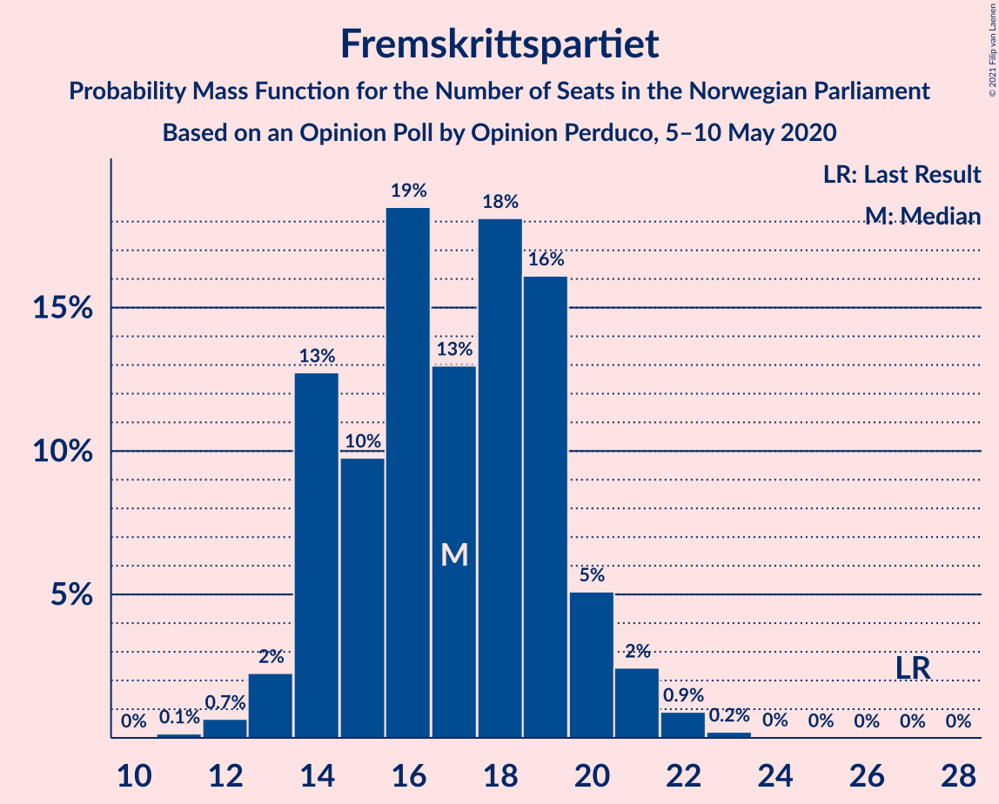

| Number of Seats | Probability | Accumulated | Special Marks |
|:---------------:|:-----------:|:-----------:|:-------------:|
| 11 | 0.1% | 100% |  |
| 12 | 5% | 99.9% |  |
| 13 | 3% | 95% |  |
| 14 | 5% | 93% |  |
| 15 | 13% | 88% |  |
| 16 | 17% | 75% |  |
| 17 | 23% | 58% | Median |
| 18 | 9% | 35% |  |
| 19 | 7% | 26% |  |
| 20 | 16% | 19% |  |
| 21 | 2% | 3% |  |
| 22 | 0.9% | 1.1% |  |
| 23 | 0.1% | 0.2% |  |
| 24 | 0% | 0.1% |  |
| 25 | 0% | 0% |  |
| 26 | 0% | 0% |  |
| 27 | 0% | 0% | Last Result |

### Sosialistisk Venstreparti

*For a full overview of the results for this party, see the [Sosialistisk Venstreparti](party-sosialistiskvenstreparti.html) page.*

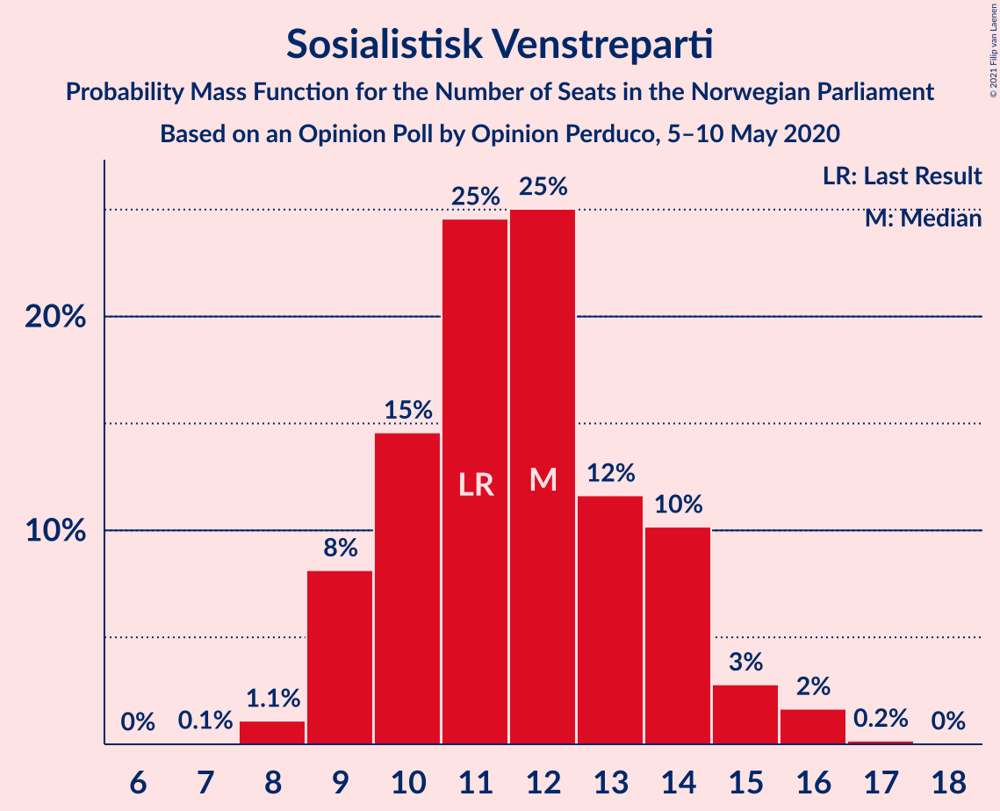

| Number of Seats | Probability | Accumulated | Special Marks |
|:---------------:|:-----------:|:-----------:|:-------------:|
| 7 | 0.2% | 100% |  |
| 8 | 1.1% | 99.8% |  |
| 9 | 13% | 98.7% |  |
| 10 | 7% | 85% |  |
| 11 | 9% | 78% | Last Result |
| 12 | 16% | 69% |  |
| 13 | 25% | 53% | Median |
| 14 | 21% | 28% |  |
| 15 | 7% | 8% |  |
| 16 | 0.4% | 0.6% |  |
| 17 | 0.1% | 0.2% |  |
| 18 | 0.1% | 0.1% |  |
| 19 | 0% | 0% |  |

### Miljøpartiet De Grønne

*For a full overview of the results for this party, see the [Miljøpartiet De Grønne](party-miljøpartietdegrønne.html) page.*

| Number of Seats | Probability | Accumulated | Special Marks |
|:---------------:|:-----------:|:-----------:|:-------------:|
| 1 | 0.4% | 100% | Last Result |
| 2 | 0.6% | 99.6% |  |
| 3 | 0.4% | 99.0% |  |
| 4 | 0% | 98.7% |  |
| 5 | 0% | 98.7% |  |
| 6 | 0% | 98.7% |  |
| 7 | 0.7% | 98.7% |  |
| 8 | 28% | 98% |  |
| 9 | 15% | 70% |  |
| 10 | 27% | 54% | Median |
| 11 | 16% | 27% |  |
| 12 | 8% | 11% |  |
| 13 | 2% | 3% |  |
| 14 | 0.8% | 2% |  |
| 15 | 0.8% | 0.8% |  |
| 16 | 0% | 0% |  |

### Rødt

*For a full overview of the results for this party, see the [Rødt](party-rødt.html) page.*

| Number of Seats | Probability | Accumulated | Special Marks |
|:---------------:|:-----------:|:-----------:|:-------------:|
| 1 | 21% | 100% | Last Result |
| 2 | 48% | 79% | Median |
| 3 | 0% | 32% |  |
| 4 | 0% | 32% |  |
| 5 | 0% | 32% |  |
| 6 | 0.2% | 32% |  |
| 7 | 12% | 31% |  |
| 8 | 15% | 19% |  |
| 9 | 3% | 4% |  |
| 10 | 0.8% | 0.9% |  |
| 11 | 0.1% | 0.1% |  |
| 12 | 0% | 0% |  |

### Kristelig Folkeparti

*For a full overview of the results for this party, see the [Kristelig Folkeparti](party-kristeligfolkeparti.html) page.*

| Number of Seats | Probability | Accumulated | Special Marks |
|:---------------:|:-----------:|:-----------:|:-------------:|
| 0 | 0.4% | 100% |  |
| 1 | 22% | 99.6% |  |
| 2 | 3% | 78% |  |
| 3 | 40% | 74% | Median |
| 4 | 0% | 34% |  |
| 5 | 0% | 34% |  |
| 6 | 0.2% | 34% |  |
| 7 | 13% | 34% |  |
| 8 | 18% | 20% | Last Result |
| 9 | 2% | 2% |  |
| 10 | 0.5% | 0.5% |  |
| 11 | 0% | 0% |  |

### Venstre

*For a full overview of the results for this party, see the [Venstre](party-venstre.html) page.*

| Number of Seats | Probability | Accumulated | Special Marks |
|:---------------:|:-----------:|:-----------:|:-------------:|
| 0 | 7% | 100% |  |
| 1 | 39% | 93% |  |
| 2 | 52% | 55% | Median |
| 3 | 0% | 3% |  |
| 4 | 0% | 3% |  |
| 5 | 0% | 3% |  |
| 6 | 2% | 3% |  |
| 7 | 0.6% | 1.0% |  |
| 8 | 0.2% | 0.4% | Last Result |
| 9 | 0.2% | 0.2% |  |
| 10 | 0% | 0% |  |

## Coalitions

### Confidence Intervals

| Coalition | Last Result | Median | Majority? | 80% Confidence Interval | 90% Confidence Interval | 95% Confidence Interval | 99% Confidence Interval |
|:---------:|:-----------:|:------:|:---------:|:-----------------------:|:-----------------------:|:-----------------------:|:-----------------------:|
| Arbeiderpartiet – Senterpartiet – Sosialistisk Venstreparti – Miljøpartiet De Grønne – Rødt | 81 | 95 | 99.9% | 91–100 | 90–102 | 89–103 | 85–103 |
| Arbeiderpartiet – Senterpartiet – Sosialistisk Venstreparti – Miljøpartiet De Grønne – Kristelig Folkeparti | 88 | 96 | 99.8% | 92–101 | 91–101 | 89–102 | 86–104 |
| Høyre – Senterpartiet – Fremskrittspartiet – Kristelig Folkeparti – Venstre | 107 | 95 | 99.8% | 90–99 | 89–100 | 88–101 | 86–104 |
| Arbeiderpartiet – Senterpartiet – Sosialistisk Venstreparti – Miljøpartiet De Grønne | 80 | 92 | 98% | 89–95 | 86–97 | 85–98 | 82–100 |
| Arbeiderpartiet – Senterpartiet – Sosialistisk Venstreparti – Rødt | 80 | 86 | 59% | 81–91 | 81–93 | 79–94 | 76–95 |
| Arbeiderpartiet – Senterpartiet – Miljøpartiet De Grønne – Kristelig Folkeparti | 77 | 84 | 38% | 79–88 | 79–89 | 78–90 | 75–93 |
| Høyre – Fremskrittspartiet – Miljøpartiet De Grønne – Kristelig Folkeparti – Venstre | 89 | 83 | 41% | 78–88 | 76–88 | 75–90 | 74–93 |
| Arbeiderpartiet – Senterpartiet – Sosialistisk Venstreparti | 79 | 83 | 25% | 79–87 | 76–88 | 75–89 | 73–91 |
| Arbeiderpartiet – Senterpartiet – Kristelig Folkeparti | 76 | 74 | 0.2% | 70–80 | 69–80 | 67–80 | 66–83 |
| Høyre – Fremskrittspartiet – Kristelig Folkeparti – Venstre | 88 | 74 | 0.1% | 69–78 | 67–79 | 66–80 | 66–84 |
| Arbeiderpartiet – Senterpartiet | 68 | 70 | 0% | 67–74 | 65–75 | 64–76 | 62–78 |
| Høyre – Fremskrittspartiet – Venstre | 80 | 69 | 0% | 65–74 | 64–74 | 63–75 | 61–78 |
| Høyre – Fremskrittspartiet | 72 | 67 | 0% | 64–72 | 63–72 | 62–73 | 60–77 |
| Arbeiderpartiet – Sosialistisk Venstreparti | 60 | 61 | 0% | 57–64 | 55–65 | 54–66 | 53–69 |
| Høyre – Kristelig Folkeparti – Venstre | 61 | 57 | 0% | 51–62 | 50–63 | 50–63 | 48–66 |
| Senterpartiet – Kristelig Folkeparti – Venstre | 35 | 27 | 0% | 24–32 | 23–32 | 22–32 | 21–35 |

### Arbeiderpartiet – Senterpartiet – Sosialistisk Venstreparti – Miljøpartiet De Grønne – Rødt

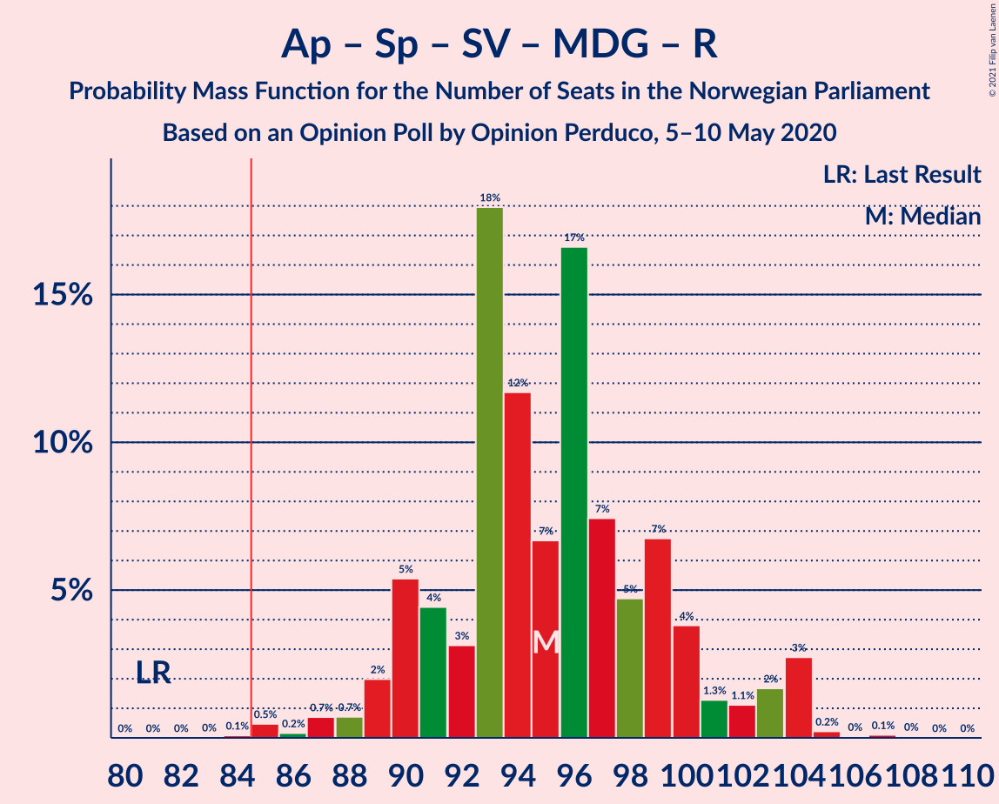

| Number of Seats | Probability | Accumulated | Special Marks |
|:---------------:|:-----------:|:-----------:|:-------------:|
| 81 | 0% | 100% | Last Result |
| 82 | 0% | 100% |  |
| 83 | 0% | 100% |  |
| 84 | 0.1% | 100% |  |
| 85 | 0.6% | 99.9% | Majority |
| 86 | 0.2% | 99.3% |  |
| 87 | 0.4% | 99.1% |  |
| 88 | 1.0% | 98.7% |  |
| 89 | 0.5% | 98% |  |
| 90 | 6% | 97% |  |
| 91 | 2% | 91% |  |
| 92 | 2% | 89% |  |
| 93 | 10% | 87% |  |
| 94 | 22% | 78% |  |
| 95 | 13% | 56% | Median |
| 96 | 7% | 43% |  |
| 97 | 8% | 36% |  |
| 98 | 9% | 27% |  |
| 99 | 5% | 18% |  |
| 100 | 5% | 14% |  |
| 101 | 2% | 9% |  |
| 102 | 2% | 6% |  |
| 103 | 4% | 4% |  |
| 104 | 0.1% | 0.4% |  |
| 105 | 0.2% | 0.3% |  |
| 106 | 0% | 0.1% |  |
| 107 | 0% | 0% |  |

### Arbeiderpartiet – Senterpartiet – Sosialistisk Venstreparti – Miljøpartiet De Grønne – Kristelig Folkeparti

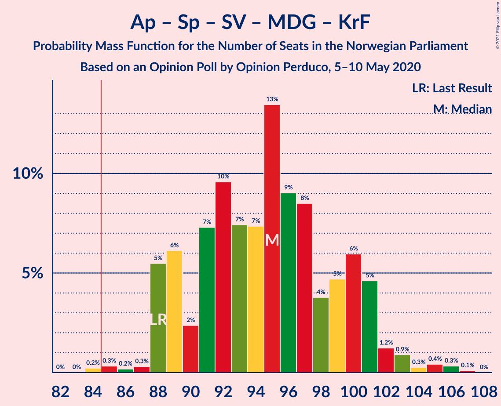

| Number of Seats | Probability | Accumulated | Special Marks |
|:---------------:|:-----------:|:-----------:|:-------------:|
| 84 | 0.1% | 100% |  |
| 85 | 0.1% | 99.8% | Majority |
| 86 | 0.3% | 99.7% |  |
| 87 | 0.2% | 99.4% |  |
| 88 | 0.4% | 99.2% | Last Result |
| 89 | 2% | 98.9% |  |
| 90 | 2% | 97% |  |
| 91 | 2% | 95% |  |
| 92 | 6% | 94% |  |
| 93 | 15% | 88% |  |
| 94 | 9% | 73% |  |
| 95 | 5% | 65% |  |
| 96 | 20% | 59% | Median |
| 97 | 9% | 40% |  |
| 98 | 9% | 30% |  |
| 99 | 5% | 22% |  |
| 100 | 3% | 17% |  |
| 101 | 10% | 14% |  |
| 102 | 2% | 4% |  |
| 103 | 2% | 2% |  |
| 104 | 0.1% | 0.6% |  |
| 105 | 0.2% | 0.4% |  |
| 106 | 0% | 0.2% |  |
| 107 | 0.1% | 0.2% |  |
| 108 | 0% | 0% |  |

### Høyre – Senterpartiet – Fremskrittspartiet – Kristelig Folkeparti – Venstre

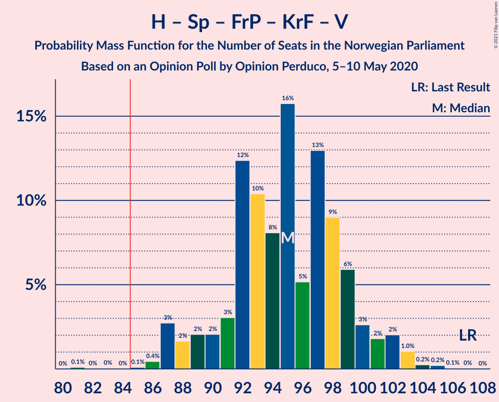

| Number of Seats | Probability | Accumulated | Special Marks |
|:---------------:|:-----------:|:-----------:|:-------------:|
| 83 | 0.1% | 100% |  |
| 84 | 0.2% | 99.9% |  |
| 85 | 0.1% | 99.8% | Majority |
| 86 | 0.7% | 99.6% |  |
| 87 | 0.7% | 98.9% |  |
| 88 | 2% | 98% |  |
| 89 | 6% | 97% |  |
| 90 | 2% | 91% |  |
| 91 | 9% | 89% |  |
| 92 | 8% | 80% |  |
| 93 | 2% | 72% |  |
| 94 | 7% | 70% | Median |
| 95 | 16% | 62% |  |
| 96 | 15% | 46% |  |
| 97 | 6% | 31% |  |
| 98 | 10% | 25% |  |
| 99 | 7% | 14% |  |
| 100 | 4% | 7% |  |
| 101 | 2% | 3% |  |
| 102 | 0.5% | 2% |  |
| 103 | 0.5% | 1.1% |  |
| 104 | 0.2% | 0.6% |  |
| 105 | 0.2% | 0.3% |  |
| 106 | 0% | 0.1% |  |
| 107 | 0.1% | 0.1% | Last Result |
| 108 | 0% | 0% |  |

### Arbeiderpartiet – Senterpartiet – Sosialistisk Venstreparti – Miljøpartiet De Grønne

| Number of Seats | Probability | Accumulated | Special Marks |
|:---------------:|:-----------:|:-----------:|:-------------:|
| 80 | 0.2% | 100% | Last Result |
| 81 | 0.2% | 99.8% |  |
| 82 | 0.1% | 99.6% |  |
| 83 | 1.3% | 99.4% |  |
| 84 | 0.4% | 98% |  |
| 85 | 2% | 98% | Majority |
| 86 | 2% | 96% |  |
| 87 | 2% | 94% |  |
| 88 | 2% | 92% |  |
| 89 | 14% | 91% |  |
| 90 | 8% | 77% |  |
| 91 | 7% | 69% |  |
| 92 | 13% | 62% |  |
| 93 | 27% | 49% | Median |
| 94 | 5% | 22% |  |
| 95 | 8% | 17% |  |
| 96 | 2% | 9% |  |
| 97 | 3% | 7% |  |
| 98 | 2% | 4% |  |
| 99 | 0.9% | 2% |  |
| 100 | 1.2% | 1.5% |  |
| 101 | 0.1% | 0.3% |  |
| 102 | 0.1% | 0.1% |  |
| 103 | 0% | 0.1% |  |
| 104 | 0% | 0% |  |

### Arbeiderpartiet – Senterpartiet – Sosialistisk Venstreparti – Rødt

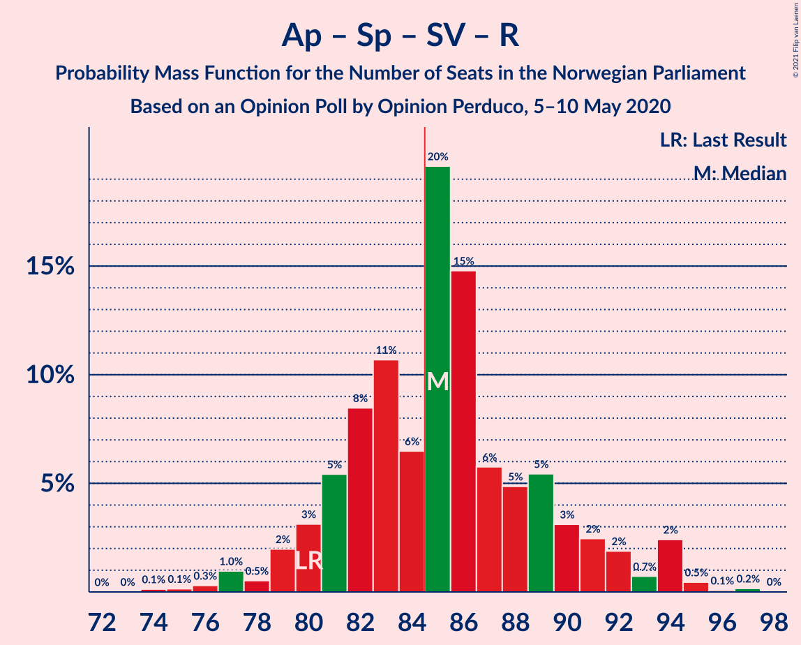

| Number of Seats | Probability | Accumulated | Special Marks |
|:---------------:|:-----------:|:-----------:|:-------------:|
| 74 | 0.2% | 100% |  |
| 75 | 0.2% | 99.8% |  |
| 76 | 0.1% | 99.6% |  |
| 77 | 0.6% | 99.4% |  |
| 78 | 0.4% | 98.8% |  |
| 79 | 1.2% | 98% |  |
| 80 | 0.8% | 97% | Last Result |
| 81 | 7% | 96% |  |
| 82 | 9% | 89% |  |
| 83 | 5% | 80% |  |
| 84 | 16% | 75% |  |
| 85 | 5% | 59% | Median, Majority |
| 86 | 8% | 54% |  |
| 87 | 17% | 46% |  |
| 88 | 8% | 29% |  |
| 89 | 5% | 22% |  |
| 90 | 4% | 17% |  |
| 91 | 5% | 12% |  |
| 92 | 2% | 7% |  |
| 93 | 2% | 5% |  |
| 94 | 1.0% | 3% |  |
| 95 | 2% | 2% |  |
| 96 | 0.2% | 0.2% |  |
| 97 | 0% | 0.1% |  |
| 98 | 0% | 0% |  |

### Arbeiderpartiet – Senterpartiet – Miljøpartiet De Grønne – Kristelig Folkeparti

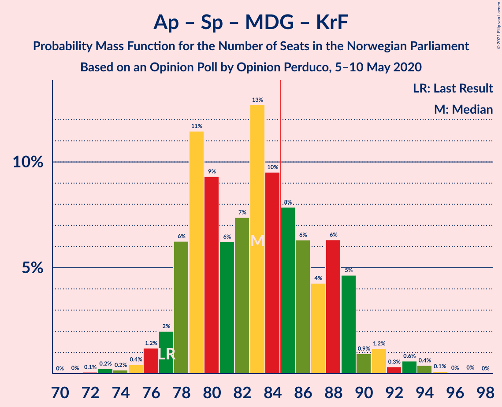

| Number of Seats | Probability | Accumulated | Special Marks |
|:---------------:|:-----------:|:-----------:|:-------------:|
| 71 | 0.1% | 100% |  |
| 72 | 0.1% | 99.9% |  |
| 73 | 0.1% | 99.8% |  |
| 74 | 0% | 99.7% |  |
| 75 | 0.3% | 99.7% |  |
| 76 | 0.9% | 99.3% |  |
| 77 | 0.8% | 98% | Last Result |
| 78 | 1.0% | 98% |  |
| 79 | 9% | 97% |  |
| 80 | 3% | 88% |  |
| 81 | 4% | 85% |  |
| 82 | 16% | 81% |  |
| 83 | 9% | 65% | Median |
| 84 | 18% | 56% |  |
| 85 | 13% | 38% | Majority |
| 86 | 6% | 25% |  |
| 87 | 4% | 19% |  |
| 88 | 8% | 15% |  |
| 89 | 3% | 7% |  |
| 90 | 3% | 4% |  |
| 91 | 0.3% | 1.3% |  |
| 92 | 0.4% | 1.0% |  |
| 93 | 0.4% | 0.6% |  |
| 94 | 0.1% | 0.2% |  |
| 95 | 0% | 0.2% |  |
| 96 | 0.1% | 0.1% |  |
| 97 | 0% | 0% |  |

### Høyre – Fremskrittspartiet – Miljøpartiet De Grønne – Kristelig Folkeparti – Venstre

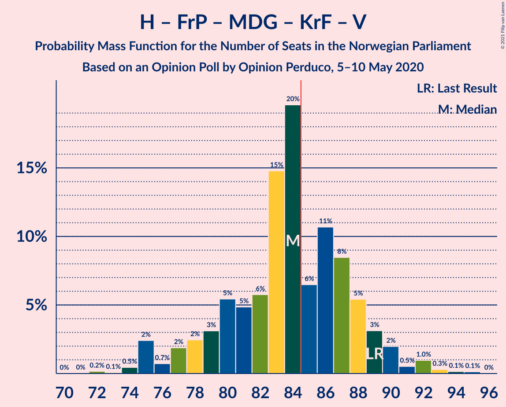

| Number of Seats | Probability | Accumulated | Special Marks |
|:---------------:|:-----------:|:-----------:|:-------------:|
| 72 | 0% | 100% |  |
| 73 | 0.2% | 99.9% |  |
| 74 | 2% | 99.8% |  |
| 75 | 1.0% | 98% |  |
| 76 | 2% | 97% |  |
| 77 | 2% | 95% |  |
| 78 | 5% | 93% |  |
| 79 | 4% | 88% |  |
| 80 | 5% | 83% |  |
| 81 | 8% | 78% |  |
| 82 | 17% | 71% |  |
| 83 | 8% | 54% | Median |
| 84 | 5% | 46% |  |
| 85 | 16% | 41% | Majority |
| 86 | 5% | 25% |  |
| 87 | 9% | 20% |  |
| 88 | 7% | 11% |  |
| 89 | 0.8% | 4% | Last Result |
| 90 | 1.2% | 3% |  |
| 91 | 0.4% | 2% |  |
| 92 | 0.6% | 1.2% |  |
| 93 | 0.1% | 0.6% |  |
| 94 | 0.2% | 0.4% |  |
| 95 | 0.2% | 0.2% |  |
| 96 | 0% | 0% |  |

### Arbeiderpartiet – Senterpartiet – Sosialistisk Venstreparti

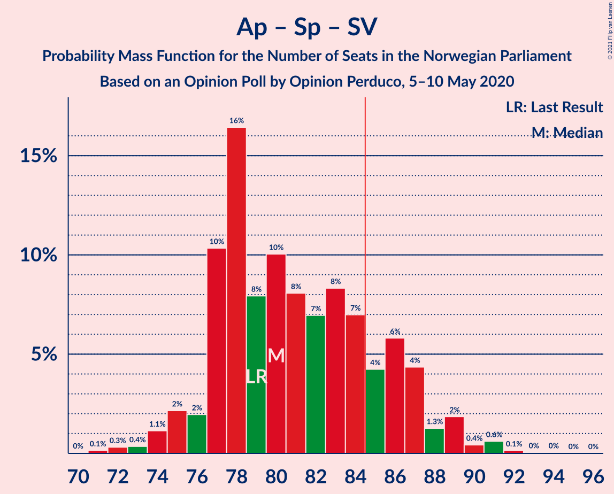

| Number of Seats | Probability | Accumulated | Special Marks |
|:---------------:|:-----------:|:-----------:|:-------------:|
| 72 | 0.4% | 100% |  |
| 73 | 0.3% | 99.6% |  |
| 74 | 1.0% | 99.3% |  |
| 75 | 2% | 98% |  |
| 76 | 2% | 96% |  |
| 77 | 2% | 95% |  |
| 78 | 1.3% | 92% |  |
| 79 | 9% | 91% | Last Result |
| 80 | 15% | 82% |  |
| 81 | 8% | 67% |  |
| 82 | 6% | 59% |  |
| 83 | 17% | 52% | Median |
| 84 | 11% | 35% |  |
| 85 | 11% | 25% | Majority |
| 86 | 1.3% | 13% |  |
| 87 | 6% | 12% |  |
| 88 | 2% | 6% |  |
| 89 | 3% | 5% |  |
| 90 | 0.8% | 2% |  |
| 91 | 0.5% | 0.8% |  |
| 92 | 0.2% | 0.2% |  |
| 93 | 0% | 0% |  |

### Arbeiderpartiet – Senterpartiet – Kristelig Folkeparti

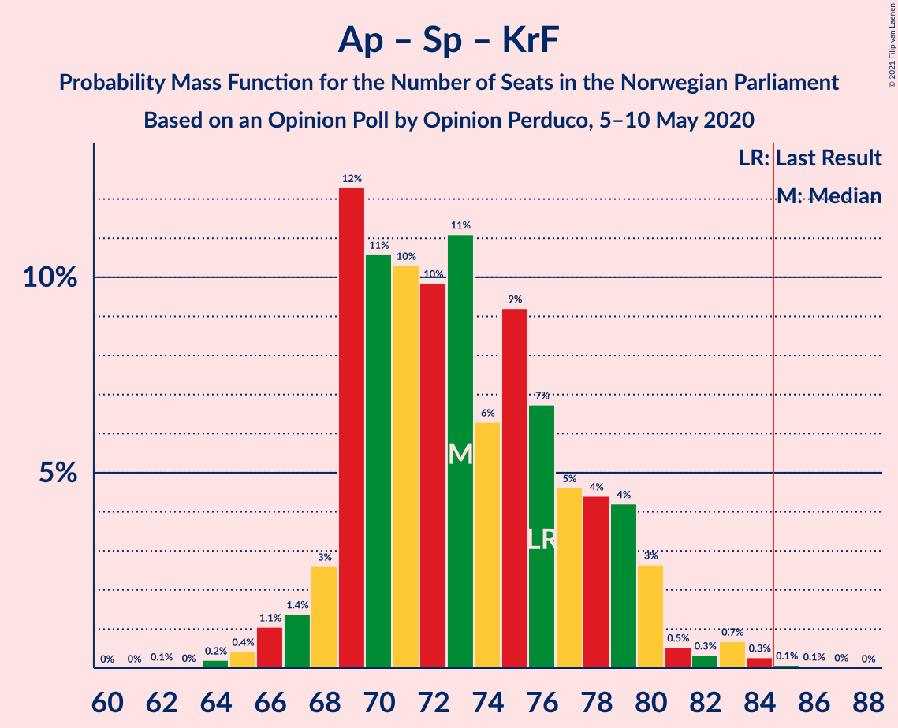

| Number of Seats | Probability | Accumulated | Special Marks |
|:---------------:|:-----------:|:-----------:|:-------------:|
| 62 | 0.1% | 100% |  |
| 63 | 0% | 99.9% |  |
| 64 | 0.1% | 99.9% |  |
| 65 | 0.1% | 99.8% |  |
| 66 | 0.4% | 99.7% |  |
| 67 | 2% | 99.3% |  |
| 68 | 0.7% | 97% |  |
| 69 | 5% | 96% |  |
| 70 | 4% | 91% |  |
| 71 | 7% | 88% |  |
| 72 | 14% | 81% |  |
| 73 | 15% | 67% | Median |
| 74 | 8% | 52% |  |
| 75 | 6% | 44% |  |
| 76 | 15% | 37% | Last Result |
| 77 | 7% | 22% |  |
| 78 | 2% | 15% |  |
| 79 | 2% | 13% |  |
| 80 | 9% | 11% |  |
| 81 | 0.7% | 2% |  |
| 82 | 0.5% | 1.0% |  |
| 83 | 0% | 0.5% |  |
| 84 | 0.3% | 0.5% |  |
| 85 | 0% | 0.2% | Majority |
| 86 | 0% | 0.1% |  |
| 87 | 0% | 0.1% |  |
| 88 | 0.1% | 0.1% |  |
| 89 | 0% | 0% |  |

### Høyre – Fremskrittspartiet – Kristelig Folkeparti – Venstre

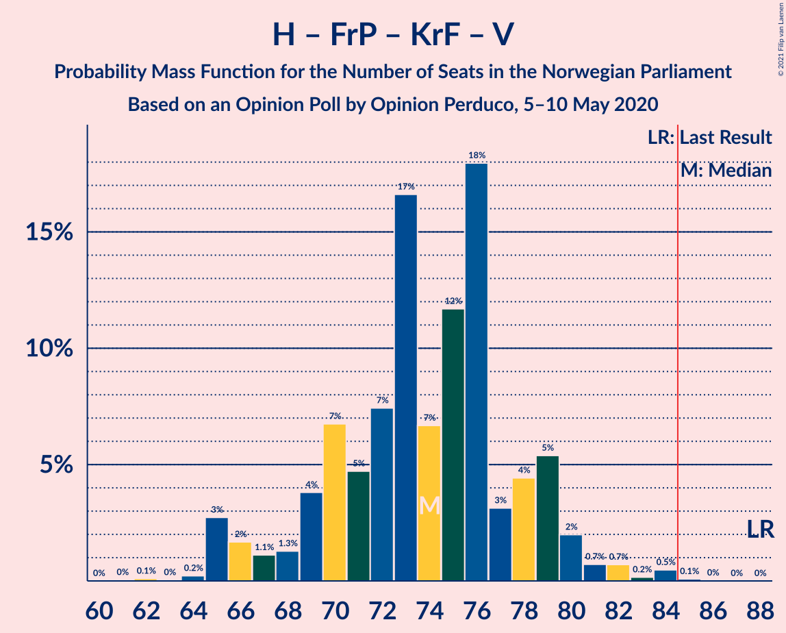

| Number of Seats | Probability | Accumulated | Special Marks |
|:---------------:|:-----------:|:-----------:|:-------------:|
| 63 | 0% | 100% |  |
| 64 | 0.2% | 99.9% |  |
| 65 | 0.1% | 99.7% |  |
| 66 | 4% | 99.6% |  |
| 67 | 2% | 96% |  |
| 68 | 2% | 94% |  |
| 69 | 5% | 91% |  |
| 70 | 5% | 86% |  |
| 71 | 9% | 82% |  |
| 72 | 8% | 73% |  |
| 73 | 7% | 64% | Median |
| 74 | 13% | 57% |  |
| 75 | 22% | 44% |  |
| 76 | 10% | 22% |  |
| 77 | 2% | 13% |  |
| 78 | 2% | 11% |  |
| 79 | 6% | 9% |  |
| 80 | 0.5% | 3% |  |
| 81 | 1.0% | 2% |  |
| 82 | 0.4% | 1.3% |  |
| 83 | 0.2% | 0.9% |  |
| 84 | 0.6% | 0.7% |  |
| 85 | 0.1% | 0.1% | Majority |
| 86 | 0% | 0% |  |
| 87 | 0% | 0% |  |
| 88 | 0% | 0% | Last Result |

### Arbeiderpartiet – Senterpartiet

| Number of Seats | Probability | Accumulated | Special Marks |
|:---------------:|:-----------:|:-----------:|:-------------:|
| 61 | 0.1% | 100% |  |
| 62 | 0.8% | 99.9% |  |
| 63 | 1.4% | 99.0% |  |
| 64 | 2% | 98% |  |
| 65 | 2% | 96% |  |
| 66 | 2% | 94% |  |
| 67 | 3% | 91% |  |
| 68 | 11% | 88% | Last Result |
| 69 | 20% | 77% |  |
| 70 | 21% | 58% | Median |
| 71 | 8% | 36% |  |
| 72 | 10% | 29% |  |
| 73 | 5% | 18% |  |
| 74 | 8% | 13% |  |
| 75 | 2% | 6% |  |
| 76 | 2% | 4% |  |
| 77 | 1.3% | 2% |  |
| 78 | 0.2% | 0.5% |  |
| 79 | 0.1% | 0.3% |  |
| 80 | 0.2% | 0.2% |  |
| 81 | 0% | 0.1% |  |
| 82 | 0% | 0% |  |

### Høyre – Fremskrittspartiet – Venstre

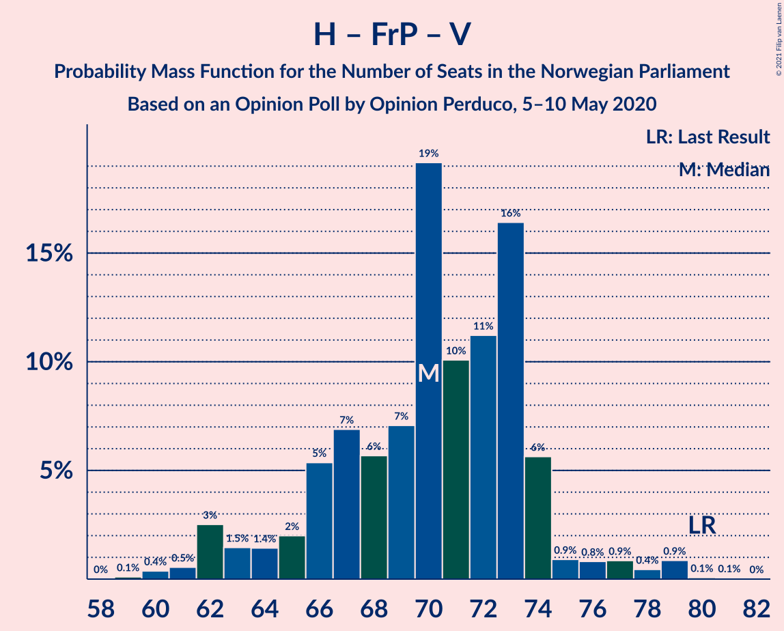

| Number of Seats | Probability | Accumulated | Special Marks |
|:---------------:|:-----------:|:-----------:|:-------------:|
| 59 | 0% | 100% |  |
| 60 | 0% | 99.9% |  |
| 61 | 0.4% | 99.9% |  |
| 62 | 1.1% | 99.5% |  |
| 63 | 2% | 98% |  |
| 64 | 2% | 96% |  |
| 65 | 5% | 94% |  |
| 66 | 15% | 89% |  |
| 67 | 4% | 74% |  |
| 68 | 13% | 70% |  |
| 69 | 12% | 57% |  |
| 70 | 4% | 45% | Median |
| 71 | 8% | 41% |  |
| 72 | 13% | 34% |  |
| 73 | 8% | 21% |  |
| 74 | 7% | 12% |  |
| 75 | 3% | 5% |  |
| 76 | 0.3% | 2% |  |
| 77 | 0.7% | 2% |  |
| 78 | 0.8% | 1.0% |  |
| 79 | 0.2% | 0.2% |  |
| 80 | 0% | 0% | Last Result |

### Høyre – Fremskrittspartiet

| Number of Seats | Probability | Accumulated | Special Marks |
|:---------------:|:-----------:|:-----------:|:-------------:|
| 56 | 0% | 100% |  |
| 57 | 0% | 99.9% |  |
| 58 | 0% | 99.9% |  |
| 59 | 0% | 99.9% |  |
| 60 | 0.4% | 99.9% |  |
| 61 | 2% | 99.4% |  |
| 62 | 2% | 98% |  |
| 63 | 6% | 96% |  |
| 64 | 14% | 90% |  |
| 65 | 7% | 77% |  |
| 66 | 3% | 70% |  |
| 67 | 18% | 67% |  |
| 68 | 5% | 49% | Median |
| 69 | 9% | 44% |  |
| 70 | 4% | 35% |  |
| 71 | 18% | 31% |  |
| 72 | 9% | 13% | Last Result |
| 73 | 3% | 5% |  |
| 74 | 0.5% | 2% |  |
| 75 | 0.4% | 2% |  |
| 76 | 0.3% | 1.2% |  |
| 77 | 0.8% | 0.9% |  |
| 78 | 0% | 0% |  |

### Arbeiderpartiet – Sosialistisk Venstreparti

| Number of Seats | Probability | Accumulated | Special Marks |
|:---------------:|:-----------:|:-----------:|:-------------:|
| 51 | 0% | 100% |  |
| 52 | 0.4% | 99.9% |  |
| 53 | 0.5% | 99.5% |  |
| 54 | 2% | 99.0% |  |
| 55 | 3% | 97% |  |
| 56 | 2% | 94% |  |
| 57 | 3% | 92% |  |
| 58 | 5% | 89% |  |
| 59 | 12% | 85% |  |
| 60 | 17% | 73% | Last Result |
| 61 | 13% | 55% |  |
| 62 | 7% | 42% | Median |
| 63 | 20% | 35% |  |
| 64 | 8% | 15% |  |
| 65 | 4% | 7% |  |
| 66 | 2% | 3% |  |
| 67 | 0.2% | 2% |  |
| 68 | 0.9% | 1.5% |  |
| 69 | 0.3% | 0.6% |  |
| 70 | 0.2% | 0.3% |  |
| 71 | 0% | 0.1% |  |
| 72 | 0% | 0% |  |

### Høyre – Kristelig Folkeparti – Venstre

| Number of Seats | Probability | Accumulated | Special Marks |
|:---------------:|:-----------:|:-----------:|:-------------:|
| 46 | 0.1% | 100% |  |
| 47 | 0.1% | 99.9% |  |
| 48 | 0.9% | 99.8% |  |
| 49 | 1.2% | 99.0% |  |
| 50 | 4% | 98% |  |
| 51 | 4% | 93% |  |
| 52 | 0.9% | 90% |  |
| 53 | 3% | 89% |  |
| 54 | 7% | 86% |  |
| 55 | 15% | 79% |  |
| 56 | 13% | 64% | Median |
| 57 | 15% | 51% |  |
| 58 | 16% | 36% |  |
| 59 | 4% | 20% |  |
| 60 | 2% | 17% |  |
| 61 | 5% | 15% | Last Result |
| 62 | 2% | 10% |  |
| 63 | 6% | 8% |  |
| 64 | 0.5% | 2% |  |
| 65 | 0.3% | 1.1% |  |
| 66 | 0.6% | 0.8% |  |
| 67 | 0.1% | 0.2% |  |
| 68 | 0.1% | 0.1% |  |
| 69 | 0% | 0% |  |

### Senterpartiet – Kristelig Folkeparti – Venstre

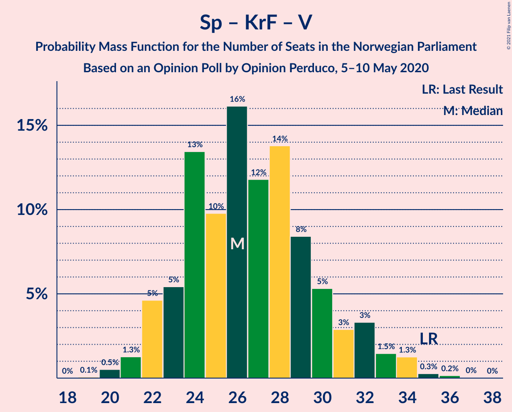

| Number of Seats | Probability | Accumulated | Special Marks |
|:---------------:|:-----------:|:-----------:|:-------------:|
| 19 | 0.1% | 100% |  |
| 20 | 0.1% | 99.9% |  |
| 21 | 2% | 99.8% |  |
| 22 | 3% | 98% |  |
| 23 | 4% | 95% |  |
| 24 | 19% | 91% |  |
| 25 | 9% | 72% |  |
| 26 | 11% | 63% | Median |
| 27 | 11% | 52% |  |
| 28 | 7% | 40% |  |
| 29 | 5% | 33% |  |
| 30 | 9% | 28% |  |
| 31 | 5% | 19% |  |
| 32 | 11% | 13% |  |
| 33 | 0.7% | 2% |  |
| 34 | 0.9% | 2% |  |
| 35 | 0.5% | 0.7% | Last Result |
| 36 | 0.1% | 0.2% |  |
| 37 | 0% | 0.1% |  |
| 38 | 0% | 0.1% |  |
| 39 | 0% | 0% |  |

## Technical Information

### Opinion Poll

+ **Polling firm:** Opinion Perduco
+ **Commissioner(s):** —
+ **Fieldwork period:** 5–10 May 2020

### Calculations

+ **Sample size:** 970
+ **Simulations done:** 131,072
+ **Error estimate:** 2.04%

