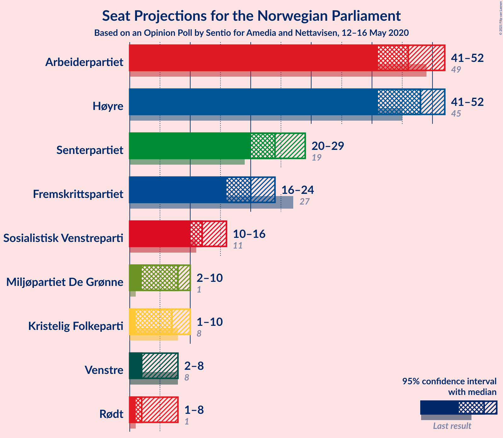
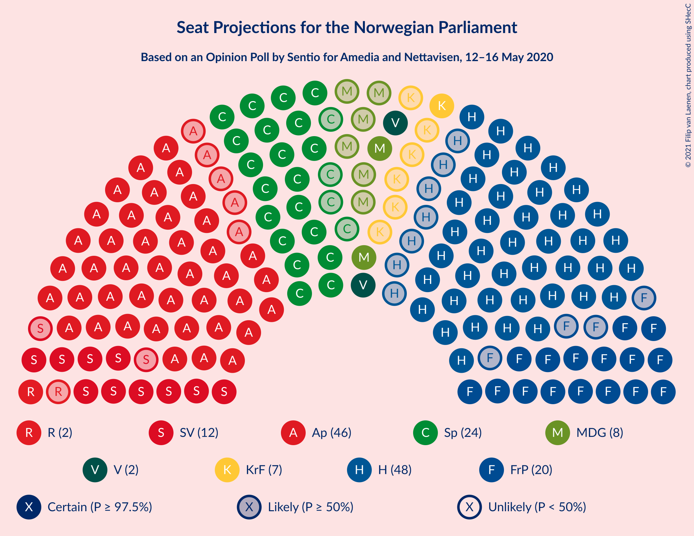
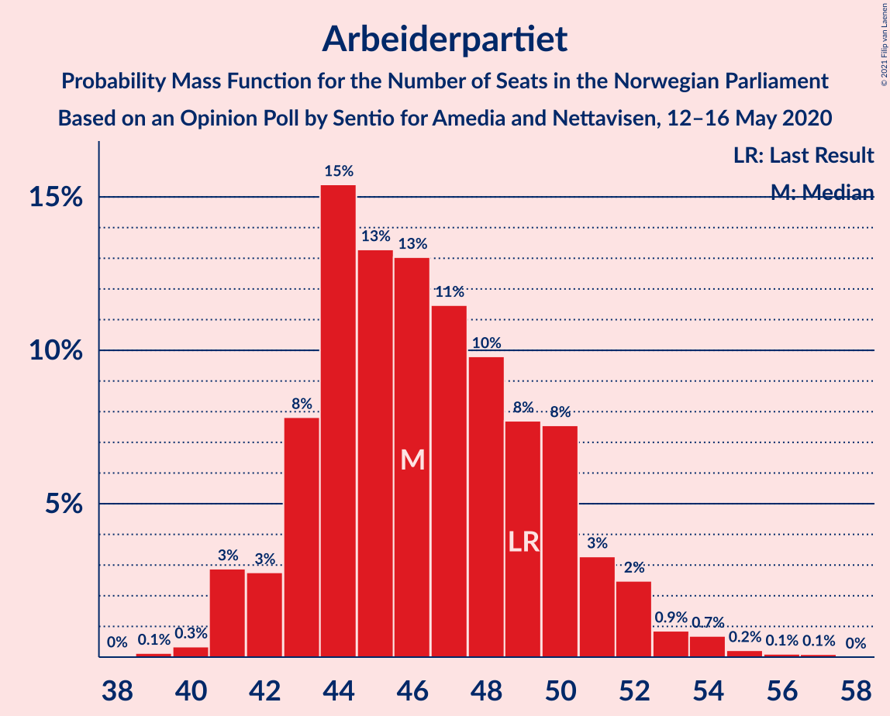
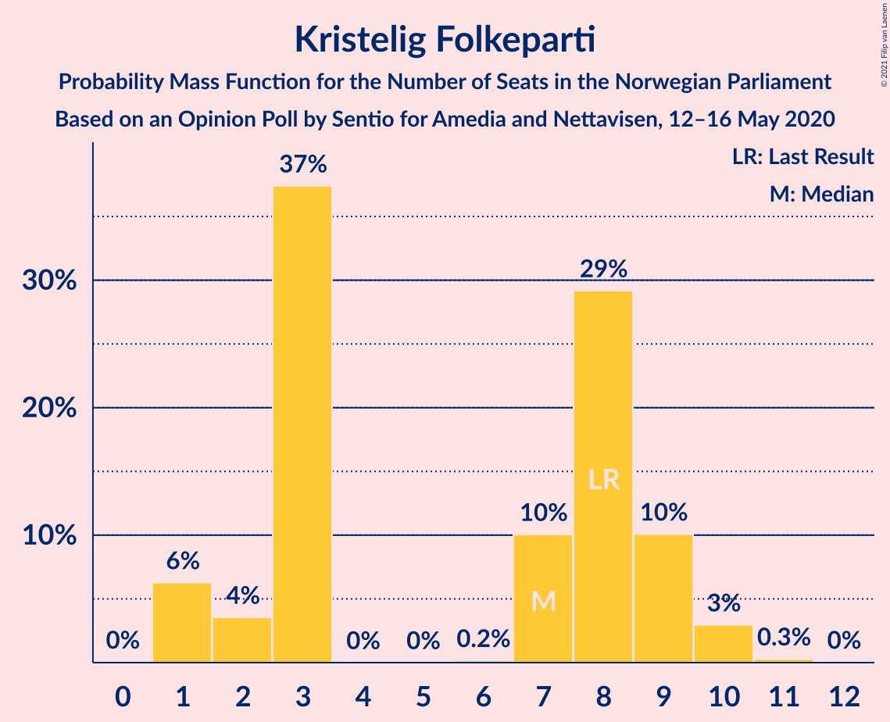
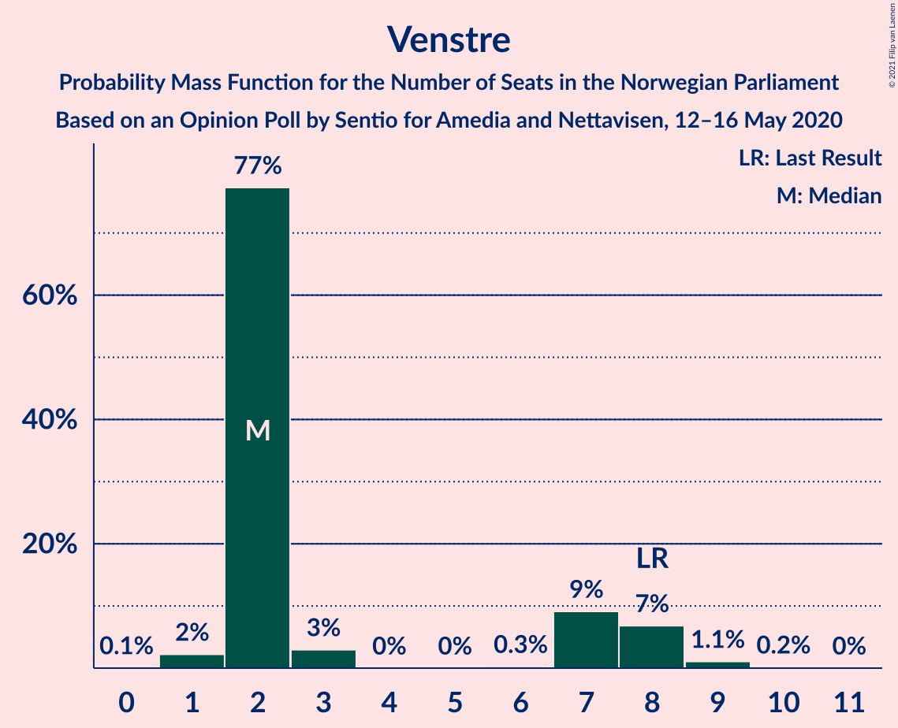
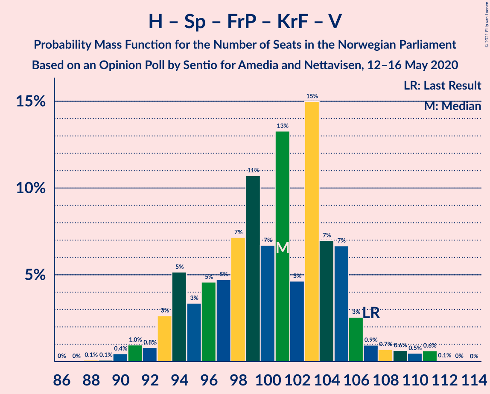
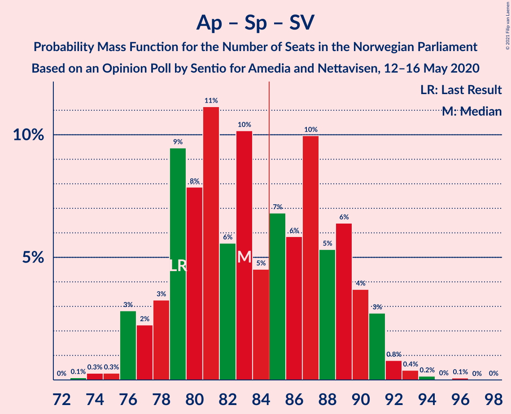
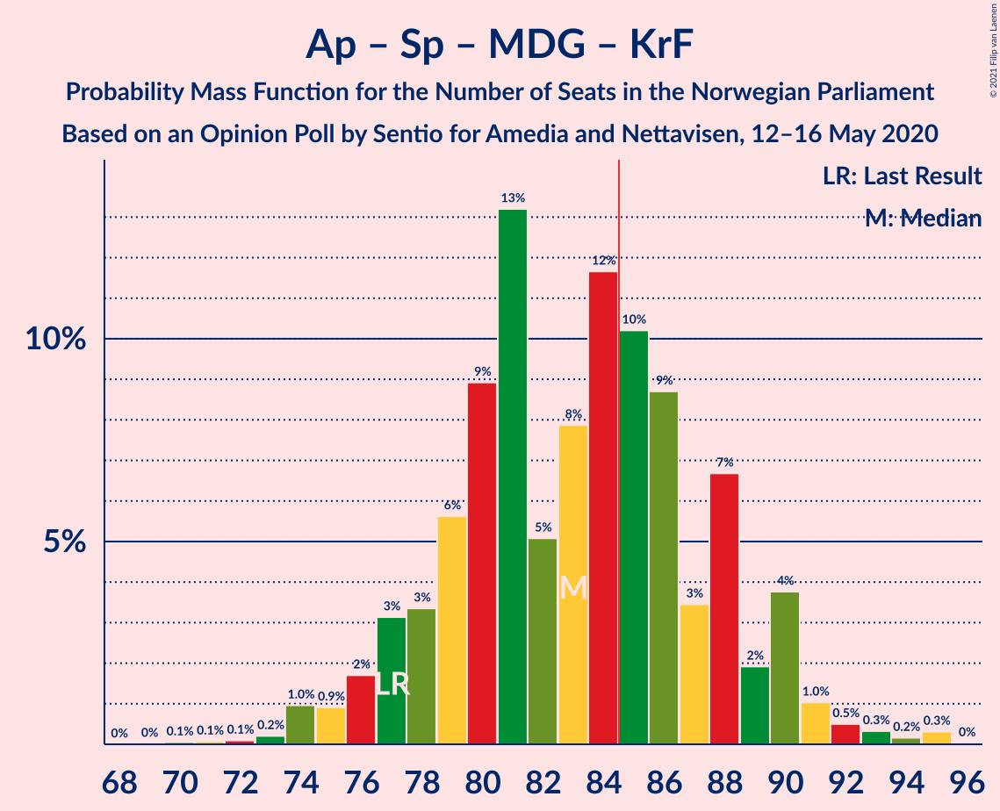
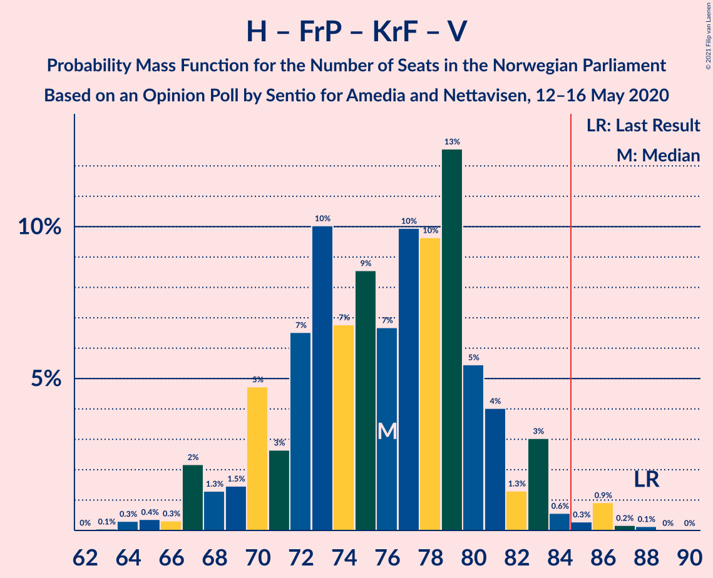
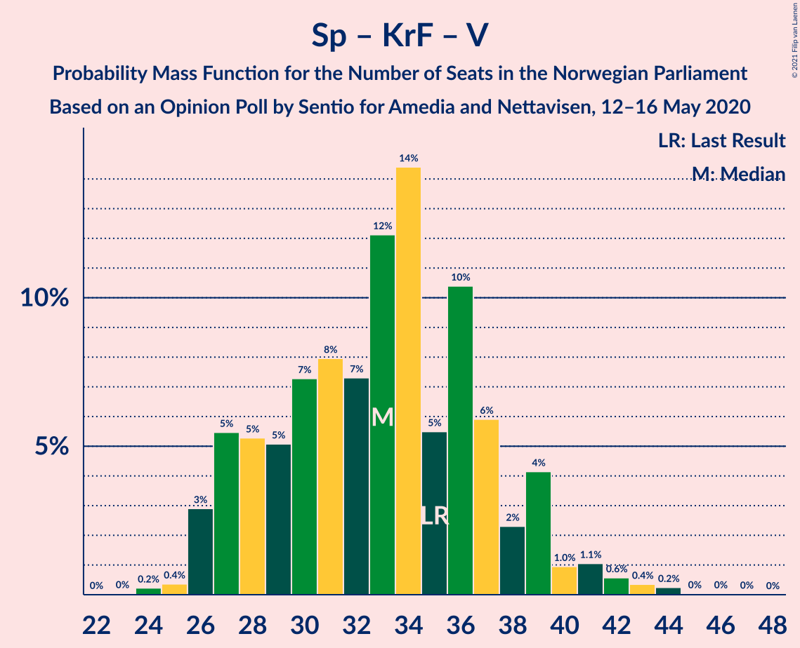

# Opinion Poll by Sentio for Amedia and Nettavisen, 12–16 May 2020

<a href="#voting-intentions">Voting Intentions</a> | <a href="#seats">Seats</a> | <a href="#coalitions">Coalitions</a> | <a href="#technical-information">Technical Information</a>

## Voting Intentions

### Confidence Intervals

| Party | Last Result | Poll Result | 80% Confidence Interval | 90% Confidence Interval | 95% Confidence Interval | 99% Confidence Interval |
|:-----:|:-----------:|:-----------:|:-----------------------:|:-----------------------:|:-----------------------:|:-----------------------:|
| Høyre | 25.0% | 26.0% | 24.3–27.8% |23.8–28.4% |23.4–28.8% |22.6–29.7% |
| Arbeiderpartiet | 27.4% | 25.5% | 23.8–27.3% |23.3–27.8% |22.9–28.3% |22.1–29.2% |
| Senterpartiet | 10.3% | 13.5% | 12.2–15.0% |11.8–15.4% |11.5–15.8% |10.9–16.5% |
| Fremskrittspartiet | 15.2% | 11.0% | 9.8–12.4% |9.5–12.8% |9.2–13.1% |8.7–13.8% |
| Sosialistisk Venstreparti | 6.0% | 7.1% | 6.2–8.3% |5.9–8.6% |5.7–8.9% |5.2–9.4% |
| Miljøpartiet De Grønne | 3.2% | 4.4% | 3.7–5.3% |3.5–5.6% |3.3–5.9% |3.0–6.4% |
| Kristelig Folkeparti | 4.2% | 4.0% | 3.3–4.9% |3.1–5.2% |2.9–5.4% |2.7–5.9% |
| Rødt | 2.4% | 3.3% | 2.7–4.1% |2.5–4.4% |2.4–4.6% |2.1–5.0% |
| Venstre | 4.4% | 3.3% | 2.7–4.1% |2.5–4.4% |2.4–4.6% |2.1–5.0% |

*Note:* The poll result column reflects the actual value used in the calculations. Published results may vary slightly, and in addition be rounded to fewer digits.

## Seats

### Confidence Intervals

| Party | Last Result | Median | 80% Confidence Interval | 90% Confidence Interval | 95% Confidence Interval | 99% Confidence Interval |
|:-----:|:-----------:|:------:|:-----------------------:|:-----------------------:|:-----------------------:|:-----------------------:|
| <a href="#høyre">Høyre</a> | 45 | 48 | 44–52 |42–52 |42–53 |39–55 |
| <a href="#arbeiderpartiet">Arbeiderpartiet</a> | 49 | 46 | 43–51 |42–52 |41–53 |40–55 |
| <a href="#senterpartiet">Senterpartiet</a> | 19 | 24 | 21–28 |21–29 |20–29 |19–32 |
| <a href="#fremskrittspartiet">Fremskrittspartiet</a> | 27 | 20 | 17–22 |17–23 |16–23 |15–26 |
| <a href="#sosialistisk-venstreparti">Sosialistisk Venstreparti</a> | 11 | 12 | 11–15 |10–15 |10–16 |9–18 |
| <a href="#miljøpartiet-de-grønne">Miljøpartiet De Grønne</a> | 1 | 8 | 2–10 |2–10 |1–10 |1–11 |
| <a href="#kristelig-folkeparti">Kristelig Folkeparti</a> | 8 | 3 | 3–9 |1–9 |1–10 |1–10 |
| <a href="#rødt">Rødt</a> | 1 | 2 | 1–8 |1–8 |1–8 |1–9 |
| <a href="#venstre">Venstre</a> | 8 | 2 | 2–8 |1–8 |1–8 |1–9 |

### Høyre

*For a full overview of the results for this party, see the [Høyre](party-høyre.html) page.*

| Number of Seats | Probability | Accumulated | Special Marks |
|:---------------:|:-----------:|:-----------:|:-------------:|
| 38 | 0.1% | 100% |  |
| 39 | 1.2% | 99.9% |  |
| 40 | 0.1% | 98.7% |  |
| 41 | 0.7% | 98.6% |  |
| 42 | 3% | 98% |  |
| 43 | 3% | 94% |  |
| 44 | 8% | 91% |  |
| 45 | 4% | 83% | Last Result |
| 46 | 16% | 78% |  |
| 47 | 11% | 62% |  |
| 48 | 8% | 52% | Median |
| 49 | 24% | 44% |  |
| 50 | 2% | 20% |  |
| 51 | 2% | 18% |  |
| 52 | 13% | 16% |  |
| 53 | 0.7% | 3% |  |
| 54 | 0.1% | 2% |  |
| 55 | 2% | 2% |  |
| 56 | 0% | 0.2% |  |
| 57 | 0% | 0.2% |  |
| 58 | 0.1% | 0.1% |  |
| 59 | 0% | 0% |  |

### Arbeiderpartiet

*For a full overview of the results for this party, see the [Arbeiderpartiet](party-arbeiderpartiet.html) page.*

| Number of Seats | Probability | Accumulated | Special Marks |
|:---------------:|:-----------:|:-----------:|:-------------:|
| 39 | 0.1% | 100% |  |
| 40 | 0.6% | 99.9% |  |
| 41 | 3% | 99.3% |  |
| 42 | 4% | 97% |  |
| 43 | 7% | 93% |  |
| 44 | 7% | 86% |  |
| 45 | 7% | 79% |  |
| 46 | 37% | 72% | Median |
| 47 | 8% | 35% |  |
| 48 | 3% | 27% |  |
| 49 | 9% | 24% | Last Result |
| 50 | 3% | 15% |  |
| 51 | 6% | 12% |  |
| 52 | 1.0% | 6% |  |
| 53 | 4% | 5% |  |
| 54 | 0.6% | 1.3% |  |
| 55 | 0.6% | 0.6% |  |
| 56 | 0% | 0.1% |  |
| 57 | 0% | 0% |  |

### Senterpartiet

*For a full overview of the results for this party, see the [Senterpartiet](party-senterpartiet.html) page.*

| Number of Seats | Probability | Accumulated | Special Marks |
|:---------------:|:-----------:|:-----------:|:-------------:|
| 19 | 1.4% | 100% | Last Result |
| 20 | 3% | 98.6% |  |
| 21 | 8% | 95% |  |
| 22 | 12% | 87% |  |
| 23 | 23% | 75% |  |
| 24 | 16% | 51% | Median |
| 25 | 5% | 36% |  |
| 26 | 3% | 30% |  |
| 27 | 15% | 27% |  |
| 28 | 4% | 12% |  |
| 29 | 6% | 8% |  |
| 30 | 0.3% | 2% |  |
| 31 | 0.1% | 1.4% |  |
| 32 | 0.9% | 1.3% |  |
| 33 | 0.4% | 0.4% |  |
| 34 | 0% | 0% |  |

### Fremskrittspartiet

*For a full overview of the results for this party, see the [Fremskrittspartiet](party-fremskrittspartiet.html) page.*

| Number of Seats | Probability | Accumulated | Special Marks |
|:---------------:|:-----------:|:-----------:|:-------------:|
| 14 | 0.4% | 100% |  |
| 15 | 0.7% | 99.6% |  |
| 16 | 2% | 98.8% |  |
| 17 | 8% | 97% |  |
| 18 | 13% | 89% |  |
| 19 | 24% | 76% |  |
| 20 | 16% | 53% | Median |
| 21 | 24% | 37% |  |
| 22 | 7% | 13% |  |
| 23 | 3% | 6% |  |
| 24 | 2% | 2% |  |
| 25 | 0.4% | 0.9% |  |
| 26 | 0.5% | 0.5% |  |
| 27 | 0% | 0.1% | Last Result |
| 28 | 0% | 0% |  |

### Sosialistisk Venstreparti

*For a full overview of the results for this party, see the [Sosialistisk Venstreparti](party-sosialistiskvenstreparti.html) page.*

| Number of Seats | Probability | Accumulated | Special Marks |
|:---------------:|:-----------:|:-----------:|:-------------:|
| 8 | 0.1% | 100% |  |
| 9 | 0.6% | 99.9% |  |
| 10 | 8% | 99.3% |  |
| 11 | 18% | 91% | Last Result |
| 12 | 40% | 73% | Median |
| 13 | 12% | 34% |  |
| 14 | 11% | 21% |  |
| 15 | 6% | 10% |  |
| 16 | 3% | 4% |  |
| 17 | 0.4% | 2% |  |
| 18 | 1.2% | 1.2% |  |
| 19 | 0% | 0% |  |

### Miljøpartiet De Grønne

*For a full overview of the results for this party, see the [Miljøpartiet De Grønne](party-miljøpartietdegrønne.html) page.*

| Number of Seats | Probability | Accumulated | Special Marks |
|:---------------:|:-----------:|:-----------:|:-------------:|
| 1 | 4% | 100% | Last Result |
| 2 | 11% | 96% |  |
| 3 | 2% | 85% |  |
| 4 | 2% | 84% |  |
| 5 | 0% | 82% |  |
| 6 | 0% | 82% |  |
| 7 | 4% | 82% |  |
| 8 | 41% | 78% | Median |
| 9 | 23% | 37% |  |
| 10 | 14% | 14% |  |
| 11 | 0.5% | 0.7% |  |
| 12 | 0.1% | 0.1% |  |
| 13 | 0% | 0% |  |

### Kristelig Folkeparti

*For a full overview of the results for this party, see the [Kristelig Folkeparti](party-kristeligfolkeparti.html) page.*

| Number of Seats | Probability | Accumulated | Special Marks |
|:---------------:|:-----------:|:-----------:|:-------------:|
| 1 | 7% | 100% |  |
| 2 | 1.4% | 93% |  |
| 3 | 62% | 92% | Median |
| 4 | 0% | 30% |  |
| 5 | 0% | 30% |  |
| 6 | 0% | 30% |  |
| 7 | 6% | 30% |  |
| 8 | 14% | 25% | Last Result |
| 9 | 8% | 11% |  |
| 10 | 3% | 3% |  |
| 11 | 0.2% | 0.2% |  |
| 12 | 0% | 0% |  |

### Rødt

*For a full overview of the results for this party, see the [Rødt](party-rødt.html) page.*

| Number of Seats | Probability | Accumulated | Special Marks |
|:---------------:|:-----------:|:-----------:|:-------------:|
| 1 | 36% | 100% | Last Result |
| 2 | 41% | 64% | Median |
| 3 | 0% | 23% |  |
| 4 | 0% | 23% |  |
| 5 | 0% | 23% |  |
| 6 | 0% | 23% |  |
| 7 | 9% | 23% |  |
| 8 | 12% | 14% |  |
| 9 | 2% | 2% |  |
| 10 | 0.1% | 0.1% |  |
| 11 | 0% | 0% |  |

### Venstre

*For a full overview of the results for this party, see the [Venstre](party-venstre.html) page.*

| Number of Seats | Probability | Accumulated | Special Marks |
|:---------------:|:-----------:|:-----------:|:-------------:|
| 0 | 0.1% | 100% |  |
| 1 | 5% | 99.9% |  |
| 2 | 63% | 94% | Median |
| 3 | 0.2% | 32% |  |
| 4 | 0% | 31% |  |
| 5 | 0% | 31% |  |
| 6 | 0% | 31% |  |
| 7 | 10% | 31% |  |
| 8 | 20% | 22% | Last Result |
| 9 | 1.0% | 1.3% |  |
| 10 | 0.3% | 0.3% |  |
| 11 | 0% | 0% |  |

## Coalitions

### Confidence Intervals

| Coalition | Last Result | Median | Majority? | 80% Confidence Interval | 90% Confidence Interval | 95% Confidence Interval | 99% Confidence Interval |
|:---------:|:-----------:|:------:|:---------:|:-----------------------:|:-----------------------:|:-----------------------:|:-----------------------:|
| Høyre – Senterpartiet – Fremskrittspartiet – Kristelig Folkeparti – Venstre | 107 | 101 | 100% | 94–104 | 94–105 | 93–108 | 90–109 |
| Arbeiderpartiet – Senterpartiet – Sosialistisk Venstreparti – Miljøpartiet De Grønne – Kristelig Folkeparti | 88 | 93 | 99.9% | 92–101 | 89–102 | 88–104 | 88–106 |
| Arbeiderpartiet – Senterpartiet – Sosialistisk Venstreparti – Miljøpartiet De Grønne – Rødt | 81 | 93 | 98% | 90–99 | 87–101 | 87–101 | 82–103 |
| Arbeiderpartiet – Senterpartiet – Sosialistisk Venstreparti – Miljøpartiet De Grønne | 80 | 90 | 97% | 86–96 | 85–97 | 84–97 | 81–100 |
| Arbeiderpartiet – Senterpartiet – Sosialistisk Venstreparti – Rødt | 80 | 86 | 56% | 82–91 | 79–93 | 78–95 | 78–96 |
| Arbeiderpartiet – Senterpartiet – Sosialistisk Venstreparti | 79 | 82 | 34% | 79–88 | 77–90 | 77–92 | 74–93 |
| Arbeiderpartiet – Senterpartiet – Miljøpartiet De Grønne – Kristelig Folkeparti | 77 | 81 | 32% | 79–88 | 77–89 | 76–92 | 74–93 |
| Høyre – Fremskrittspartiet – Miljøpartiet De Grønne – Kristelig Folkeparti – Venstre | 89 | 83 | 44% | 78–87 | 76–90 | 74–91 | 73–91 |
| Arbeiderpartiet – Senterpartiet – Kristelig Folkeparti | 76 | 74 | 3% | 71–81 | 69–83 | 69–85 | 66–87 |
| Høyre – Fremskrittspartiet – Kristelig Folkeparti – Venstre | 88 | 76 | 2% | 70–79 | 68–82 | 68–82 | 66–87 |
| Arbeiderpartiet – Senterpartiet | 68 | 70 | 0% | 67–76 | 64–78 | 64–79 | 62–80 |
| Høyre – Fremskrittspartiet – Venstre | 80 | 72 | 0% | 65–76 | 65–76 | 64–79 | 61–79 |
| Høyre – Fremskrittspartiet | 72 | 67 | 0% | 63–72 | 62–72 | 61–75 | 58–77 |
| Arbeiderpartiet – Sosialistisk Venstreparti | 60 | 58 | 0% | 56–63 | 53–64 | 53–64 | 52–68 |
| Høyre – Kristelig Folkeparti – Venstre | 61 | 57 | 0% | 49–60 | 49–61 | 48–62 | 46–65 |
| Senterpartiet – Kristelig Folkeparti – Venstre | 35 | 33 | 0% | 27–37 | 26–39 | 25–41 | 24–43 |

### Høyre – Senterpartiet – Fremskrittspartiet – Kristelig Folkeparti – Venstre

| Number of Seats | Probability | Accumulated | Special Marks |
|:---------------:|:-----------:|:-----------:|:-------------:|
| 87 | 0.1% | 100% |  |
| 88 | 0% | 99.9% |  |
| 89 | 0% | 99.8% |  |
| 90 | 1.2% | 99.8% |  |
| 91 | 0.6% | 98.6% |  |
| 92 | 0.4% | 98% |  |
| 93 | 0.2% | 98% |  |
| 94 | 10% | 97% |  |
| 95 | 8% | 87% |  |
| 96 | 3% | 80% |  |
| 97 | 10% | 77% | Median |
| 98 | 2% | 67% |  |
| 99 | 1.5% | 65% |  |
| 100 | 12% | 64% |  |
| 101 | 10% | 52% |  |
| 102 | 22% | 42% |  |
| 103 | 5% | 20% |  |
| 104 | 9% | 15% |  |
| 105 | 0.8% | 5% |  |
| 106 | 0.8% | 5% |  |
| 107 | 0.4% | 4% | Last Result |
| 108 | 2% | 3% |  |
| 109 | 1.2% | 2% |  |
| 110 | 0.1% | 0.4% |  |
| 111 | 0.2% | 0.3% |  |
| 112 | 0% | 0.1% |  |
| 113 | 0.1% | 0.1% |  |
| 114 | 0% | 0% |  |

### Arbeiderpartiet – Senterpartiet – Sosialistisk Venstreparti – Miljøpartiet De Grønne – Kristelig Folkeparti

| Number of Seats | Probability | Accumulated | Special Marks |
|:---------------:|:-----------:|:-----------:|:-------------:|
| 84 | 0% | 100% |  |
| 85 | 0.1% | 99.9% | Majority |
| 86 | 0.3% | 99.8% |  |
| 87 | 0% | 99.5% |  |
| 88 | 2% | 99.5% | Last Result |
| 89 | 4% | 97% |  |
| 90 | 0.7% | 93% |  |
| 91 | 2% | 93% |  |
| 92 | 28% | 90% |  |
| 93 | 17% | 62% | Median |
| 94 | 7% | 46% |  |
| 95 | 3% | 39% |  |
| 96 | 3% | 36% |  |
| 97 | 5% | 33% |  |
| 98 | 0.7% | 28% |  |
| 99 | 4% | 27% |  |
| 100 | 8% | 23% |  |
| 101 | 7% | 15% |  |
| 102 | 5% | 9% |  |
| 103 | 1.1% | 4% |  |
| 104 | 0.8% | 3% |  |
| 105 | 0.6% | 2% |  |
| 106 | 0.9% | 1.1% |  |
| 107 | 0.1% | 0.2% |  |
| 108 | 0.1% | 0.1% |  |
| 109 | 0% | 0% |  |

### Arbeiderpartiet – Senterpartiet – Sosialistisk Venstreparti – Miljøpartiet De Grønne – Rødt

| Number of Seats | Probability | Accumulated | Special Marks |
|:---------------:|:-----------:|:-----------:|:-------------:|
| 81 | 0.2% | 100% | Last Result |
| 82 | 1.0% | 99.8% |  |
| 83 | 0.2% | 98.9% |  |
| 84 | 0.2% | 98.7% |  |
| 85 | 0.1% | 98% | Majority |
| 86 | 0.6% | 98% |  |
| 87 | 6% | 98% |  |
| 88 | 0.6% | 92% |  |
| 89 | 0.6% | 91% |  |
| 90 | 22% | 90% |  |
| 91 | 2% | 69% |  |
| 92 | 14% | 67% | Median |
| 93 | 9% | 53% |  |
| 94 | 5% | 45% |  |
| 95 | 5% | 40% |  |
| 96 | 6% | 35% |  |
| 97 | 12% | 28% |  |
| 98 | 4% | 17% |  |
| 99 | 7% | 13% |  |
| 100 | 1.3% | 7% |  |
| 101 | 4% | 5% |  |
| 102 | 0.3% | 0.9% |  |
| 103 | 0.1% | 0.5% |  |
| 104 | 0.5% | 0.5% |  |
| 105 | 0% | 0% |  |

### Arbeiderpartiet – Senterpartiet – Sosialistisk Venstreparti – Miljøpartiet De Grønne

| Number of Seats | Probability | Accumulated | Special Marks |
|:---------------:|:-----------:|:-----------:|:-------------:|
| 79 | 0% | 100% |  |
| 80 | 0.2% | 99.9% | Last Result |
| 81 | 1.3% | 99.7% |  |
| 82 | 0.3% | 98% |  |
| 83 | 0.3% | 98% |  |
| 84 | 0.8% | 98% |  |
| 85 | 4% | 97% | Majority |
| 86 | 5% | 93% |  |
| 87 | 0.9% | 89% |  |
| 88 | 5% | 88% |  |
| 89 | 30% | 83% |  |
| 90 | 16% | 53% | Median |
| 91 | 4% | 37% |  |
| 92 | 8% | 33% |  |
| 93 | 5% | 26% |  |
| 94 | 7% | 21% |  |
| 95 | 3% | 14% |  |
| 96 | 1.5% | 11% |  |
| 97 | 7% | 9% |  |
| 98 | 1.4% | 2% |  |
| 99 | 0.3% | 1.0% |  |
| 100 | 0.5% | 0.7% |  |
| 101 | 0% | 0.2% |  |
| 102 | 0.2% | 0.2% |  |
| 103 | 0% | 0% |  |

### Arbeiderpartiet – Senterpartiet – Sosialistisk Venstreparti – Rødt

| Number of Seats | Probability | Accumulated | Special Marks |
|:---------------:|:-----------:|:-----------:|:-------------:|
| 75 | 0% | 100% |  |
| 76 | 0.2% | 99.9% |  |
| 77 | 0% | 99.7% |  |
| 78 | 5% | 99.7% |  |
| 79 | 0.7% | 95% |  |
| 80 | 1.2% | 94% | Last Result |
| 81 | 2% | 93% |  |
| 82 | 18% | 91% |  |
| 83 | 3% | 73% |  |
| 84 | 14% | 70% | Median |
| 85 | 2% | 56% | Majority |
| 86 | 5% | 54% |  |
| 87 | 6% | 49% |  |
| 88 | 12% | 43% |  |
| 89 | 10% | 31% |  |
| 90 | 9% | 21% |  |
| 91 | 5% | 13% |  |
| 92 | 3% | 8% |  |
| 93 | 1.2% | 5% |  |
| 94 | 2% | 4% |  |
| 95 | 2% | 3% |  |
| 96 | 0.4% | 0.7% |  |
| 97 | 0.1% | 0.3% |  |
| 98 | 0% | 0.2% |  |
| 99 | 0.1% | 0.2% |  |
| 100 | 0% | 0.1% |  |
| 101 | 0% | 0.1% |  |
| 102 | 0% | 0% |  |

### Arbeiderpartiet – Senterpartiet – Sosialistisk Venstreparti

| Number of Seats | Probability | Accumulated | Special Marks |
|:---------------:|:-----------:|:-----------:|:-------------:|
| 73 | 0.1% | 100% |  |
| 74 | 0.5% | 99.9% |  |
| 75 | 0.1% | 99.4% |  |
| 76 | 1.4% | 99.3% |  |
| 77 | 4% | 98% |  |
| 78 | 0.8% | 94% |  |
| 79 | 3% | 93% | Last Result |
| 80 | 9% | 90% |  |
| 81 | 23% | 81% |  |
| 82 | 13% | 58% | Median |
| 83 | 7% | 45% |  |
| 84 | 4% | 38% |  |
| 85 | 9% | 34% | Majority |
| 86 | 2% | 25% |  |
| 87 | 10% | 22% |  |
| 88 | 5% | 13% |  |
| 89 | 1.1% | 7% |  |
| 90 | 3% | 6% |  |
| 91 | 0.2% | 3% |  |
| 92 | 0.4% | 3% |  |
| 93 | 2% | 2% |  |
| 94 | 0.2% | 0.5% |  |
| 95 | 0.2% | 0.3% |  |
| 96 | 0% | 0.1% |  |
| 97 | 0% | 0% |  |

### Arbeiderpartiet – Senterpartiet – Miljøpartiet De Grønne – Kristelig Folkeparti

| Number of Seats | Probability | Accumulated | Special Marks |
|:---------------:|:-----------:|:-----------:|:-------------:|
| 71 | 0% | 100% |  |
| 72 | 0% | 99.9% |  |
| 73 | 0.3% | 99.9% |  |
| 74 | 1.2% | 99.6% |  |
| 75 | 0.3% | 98% |  |
| 76 | 2% | 98% |  |
| 77 | 4% | 96% | Last Result |
| 78 | 2% | 92% |  |
| 79 | 3% | 90% |  |
| 80 | 27% | 87% |  |
| 81 | 13% | 60% | Median |
| 82 | 7% | 47% |  |
| 83 | 7% | 40% |  |
| 84 | 1.2% | 33% |  |
| 85 | 3% | 32% | Majority |
| 86 | 5% | 29% |  |
| 87 | 11% | 24% |  |
| 88 | 3% | 13% |  |
| 89 | 6% | 10% |  |
| 90 | 0.5% | 4% |  |
| 91 | 0.6% | 3% |  |
| 92 | 2% | 3% |  |
| 93 | 0.9% | 1.1% |  |
| 94 | 0% | 0.2% |  |
| 95 | 0.1% | 0.2% |  |
| 96 | 0% | 0.1% |  |
| 97 | 0% | 0% |  |

### Høyre – Fremskrittspartiet – Miljøpartiet De Grønne – Kristelig Folkeparti – Venstre

| Number of Seats | Probability | Accumulated | Special Marks |
|:---------------:|:-----------:|:-----------:|:-------------:|
| 68 | 0% | 100% |  |
| 69 | 0% | 99.9% |  |
| 70 | 0.1% | 99.9% |  |
| 71 | 0% | 99.8% |  |
| 72 | 0.1% | 99.8% |  |
| 73 | 0.4% | 99.7% |  |
| 74 | 2% | 99.3% |  |
| 75 | 2% | 97% |  |
| 76 | 1.2% | 96% |  |
| 77 | 3% | 95% |  |
| 78 | 5% | 92% |  |
| 79 | 9% | 87% |  |
| 80 | 10% | 79% |  |
| 81 | 12% | 69% | Median |
| 82 | 6% | 57% |  |
| 83 | 5% | 51% |  |
| 84 | 2% | 46% |  |
| 85 | 14% | 44% | Majority |
| 86 | 3% | 30% |  |
| 87 | 18% | 27% |  |
| 88 | 2% | 9% |  |
| 89 | 1.2% | 7% | Last Result |
| 90 | 0.7% | 6% |  |
| 91 | 5% | 5% |  |
| 92 | 0% | 0.3% |  |
| 93 | 0.2% | 0.3% |  |
| 94 | 0% | 0.1% |  |
| 95 | 0% | 0% |  |

### Arbeiderpartiet – Senterpartiet – Kristelig Folkeparti

| Number of Seats | Probability | Accumulated | Special Marks |
|:---------------:|:-----------:|:-----------:|:-------------:|
| 66 | 0.5% | 100% |  |
| 67 | 0.3% | 99.5% |  |
| 68 | 0.2% | 99.2% |  |
| 69 | 4% | 99.0% |  |
| 70 | 0.8% | 95% |  |
| 71 | 12% | 94% |  |
| 72 | 21% | 82% |  |
| 73 | 8% | 60% | Median |
| 74 | 5% | 52% |  |
| 75 | 4% | 47% |  |
| 76 | 5% | 43% | Last Result |
| 77 | 5% | 38% |  |
| 78 | 9% | 33% |  |
| 79 | 8% | 24% |  |
| 80 | 3% | 16% |  |
| 81 | 4% | 13% |  |
| 82 | 0.6% | 8% |  |
| 83 | 4% | 8% |  |
| 84 | 1.1% | 4% |  |
| 85 | 0.9% | 3% | Majority |
| 86 | 0.1% | 2% |  |
| 87 | 2% | 2% |  |
| 88 | 0.1% | 0.1% |  |
| 89 | 0% | 0% |  |

### Høyre – Fremskrittspartiet – Kristelig Folkeparti – Venstre

| Number of Seats | Probability | Accumulated | Special Marks |
|:---------------:|:-----------:|:-----------:|:-------------:|
| 65 | 0.5% | 100% |  |
| 66 | 0.1% | 99.5% |  |
| 67 | 0.3% | 99.5% |  |
| 68 | 4% | 99.1% |  |
| 69 | 1.3% | 95% |  |
| 70 | 7% | 93% |  |
| 71 | 4% | 87% |  |
| 72 | 12% | 83% |  |
| 73 | 6% | 72% | Median |
| 74 | 5% | 65% |  |
| 75 | 5% | 60% |  |
| 76 | 9% | 55% |  |
| 77 | 14% | 47% |  |
| 78 | 2% | 33% |  |
| 79 | 22% | 31% |  |
| 80 | 0.6% | 10% |  |
| 81 | 0.6% | 9% |  |
| 82 | 6% | 8% |  |
| 83 | 0.6% | 2% |  |
| 84 | 0.1% | 2% |  |
| 85 | 0.2% | 2% | Majority |
| 86 | 0.2% | 1.3% |  |
| 87 | 1.0% | 1.1% |  |
| 88 | 0.2% | 0.2% | Last Result |
| 89 | 0% | 0% |  |

### Arbeiderpartiet – Senterpartiet

| Number of Seats | Probability | Accumulated | Special Marks |
|:---------------:|:-----------:|:-----------:|:-------------:|
| 61 | 0% | 100% |  |
| 62 | 0.5% | 99.9% |  |
| 63 | 2% | 99.5% |  |
| 64 | 3% | 98% |  |
| 65 | 0.4% | 94% |  |
| 66 | 3% | 94% |  |
| 67 | 2% | 91% |  |
| 68 | 13% | 88% | Last Result |
| 69 | 24% | 75% |  |
| 70 | 12% | 52% | Median |
| 71 | 7% | 40% |  |
| 72 | 3% | 33% |  |
| 73 | 6% | 30% |  |
| 74 | 4% | 24% |  |
| 75 | 3% | 20% |  |
| 76 | 8% | 17% |  |
| 77 | 1.5% | 9% |  |
| 78 | 5% | 7% |  |
| 79 | 2% | 3% |  |
| 80 | 0.3% | 0.6% |  |
| 81 | 0.2% | 0.3% |  |
| 82 | 0% | 0.1% |  |
| 83 | 0% | 0% |  |

### Høyre – Fremskrittspartiet – Venstre

| Number of Seats | Probability | Accumulated | Special Marks |
|:---------------:|:-----------:|:-----------:|:-------------:|
| 59 | 0.1% | 100% |  |
| 60 | 0.1% | 99.9% |  |
| 61 | 0.9% | 99.8% |  |
| 62 | 0.3% | 98.8% |  |
| 63 | 0.9% | 98% |  |
| 64 | 2% | 98% |  |
| 65 | 9% | 96% |  |
| 66 | 1.4% | 87% |  |
| 67 | 13% | 85% |  |
| 68 | 5% | 72% |  |
| 69 | 10% | 67% |  |
| 70 | 3% | 57% | Median |
| 71 | 3% | 53% |  |
| 72 | 3% | 50% |  |
| 73 | 5% | 47% |  |
| 74 | 17% | 42% |  |
| 75 | 2% | 25% |  |
| 76 | 19% | 22% |  |
| 77 | 0.4% | 3% |  |
| 78 | 0.3% | 3% |  |
| 79 | 2% | 3% |  |
| 80 | 0.3% | 0.4% | Last Result |
| 81 | 0% | 0.2% |  |
| 82 | 0.1% | 0.1% |  |
| 83 | 0% | 0% |  |

### Høyre – Fremskrittspartiet

| Number of Seats | Probability | Accumulated | Special Marks |
|:---------------:|:-----------:|:-----------:|:-------------:|
| 56 | 0% | 100% |  |
| 57 | 0.3% | 99.9% |  |
| 58 | 0.1% | 99.6% |  |
| 59 | 0.9% | 99.5% |  |
| 60 | 0.6% | 98.6% |  |
| 61 | 1.1% | 98% |  |
| 62 | 2% | 97% |  |
| 63 | 9% | 95% |  |
| 64 | 3% | 86% |  |
| 65 | 13% | 82% |  |
| 66 | 9% | 69% |  |
| 67 | 14% | 60% |  |
| 68 | 21% | 47% | Median |
| 69 | 3% | 26% |  |
| 70 | 3% | 23% |  |
| 71 | 1.2% | 20% |  |
| 72 | 14% | 19% | Last Result |
| 73 | 1.2% | 4% |  |
| 74 | 0.4% | 3% |  |
| 75 | 0.3% | 3% |  |
| 76 | 0.1% | 2% |  |
| 77 | 2% | 2% |  |
| 78 | 0% | 0.1% |  |
| 79 | 0% | 0% |  |

### Arbeiderpartiet – Sosialistisk Venstreparti

| Number of Seats | Probability | Accumulated | Special Marks |
|:---------------:|:-----------:|:-----------:|:-------------:|
| 50 | 0.1% | 100% |  |
| 51 | 0.1% | 99.9% |  |
| 52 | 0.3% | 99.8% |  |
| 53 | 5% | 99.5% |  |
| 54 | 3% | 95% |  |
| 55 | 2% | 92% |  |
| 56 | 7% | 90% |  |
| 57 | 8% | 83% |  |
| 58 | 32% | 76% | Median |
| 59 | 6% | 44% |  |
| 60 | 11% | 37% | Last Result |
| 61 | 9% | 26% |  |
| 62 | 6% | 17% |  |
| 63 | 2% | 12% |  |
| 64 | 7% | 9% |  |
| 65 | 0.9% | 2% |  |
| 66 | 0.6% | 1.5% |  |
| 67 | 0.2% | 0.8% |  |
| 68 | 0.6% | 0.6% |  |
| 69 | 0% | 0.1% |  |
| 70 | 0% | 0.1% |  |
| 71 | 0% | 0% |  |

### Høyre – Kristelig Folkeparti – Venstre

| Number of Seats | Probability | Accumulated | Special Marks |
|:---------------:|:-----------:|:-----------:|:-------------:|
| 45 | 0.4% | 100% |  |
| 46 | 0.2% | 99.6% |  |
| 47 | 0.4% | 99.4% |  |
| 48 | 4% | 99.0% |  |
| 49 | 7% | 95% |  |
| 50 | 1.3% | 88% |  |
| 51 | 8% | 87% |  |
| 52 | 5% | 78% |  |
| 53 | 4% | 74% | Median |
| 54 | 6% | 70% |  |
| 55 | 4% | 64% |  |
| 56 | 7% | 59% |  |
| 57 | 13% | 52% |  |
| 58 | 6% | 39% |  |
| 59 | 4% | 33% |  |
| 60 | 22% | 29% |  |
| 61 | 4% | 7% | Last Result |
| 62 | 0.3% | 3% |  |
| 63 | 0.6% | 2% |  |
| 64 | 0.3% | 2% |  |
| 65 | 1.0% | 1.4% |  |
| 66 | 0% | 0.4% |  |
| 67 | 0.2% | 0.4% |  |
| 68 | 0.1% | 0.1% |  |
| 69 | 0% | 0% |  |

### Senterpartiet – Kristelig Folkeparti – Venstre

| Number of Seats | Probability | Accumulated | Special Marks |
|:---------------:|:-----------:|:-----------:|:-------------:|
| 24 | 1.0% | 100% |  |
| 25 | 2% | 99.0% |  |
| 26 | 4% | 97% |  |
| 27 | 7% | 93% |  |
| 28 | 4% | 86% |  |
| 29 | 8% | 82% | Median |
| 30 | 1.4% | 74% |  |
| 31 | 4% | 72% |  |
| 32 | 18% | 68% |  |
| 33 | 3% | 51% |  |
| 34 | 25% | 48% |  |
| 35 | 6% | 23% | Last Result |
| 36 | 7% | 17% |  |
| 37 | 1.4% | 10% |  |
| 38 | 3% | 9% |  |
| 39 | 2% | 6% |  |
| 40 | 0.5% | 4% |  |
| 41 | 2% | 3% |  |
| 42 | 0.8% | 1.4% |  |
| 43 | 0.2% | 0.6% |  |
| 44 | 0.1% | 0.4% |  |
| 45 | 0.1% | 0.3% |  |
| 46 | 0.1% | 0.2% |  |
| 47 | 0.1% | 0.2% |  |
| 48 | 0.1% | 0.1% |  |
| 49 | 0% | 0% |  |

## Technical Information

### Opinion Poll

+ **Polling firm:** Sentio
+ **Commissioner(s):** Amedia and Nettavisen
+ **Fieldwork period:** 12–16 May 2020

### Calculations

+ **Sample size:** 1000
+ **Simulations done:** 131,072
+ **Error estimate:** 2.09%

