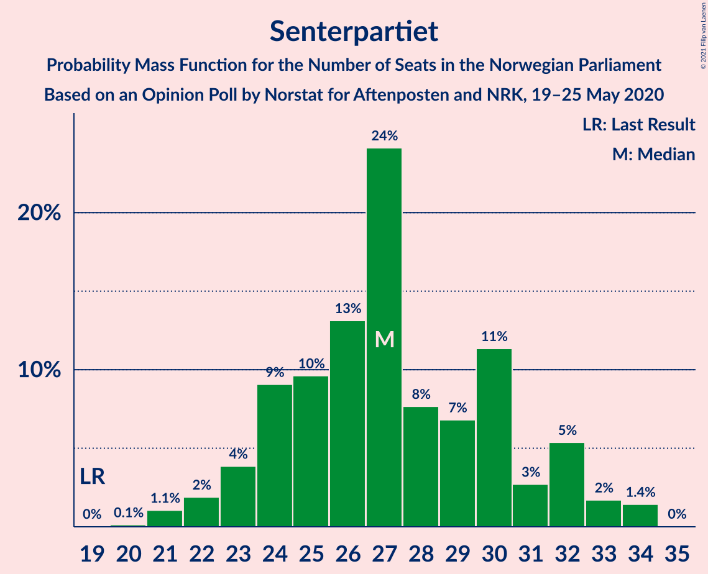
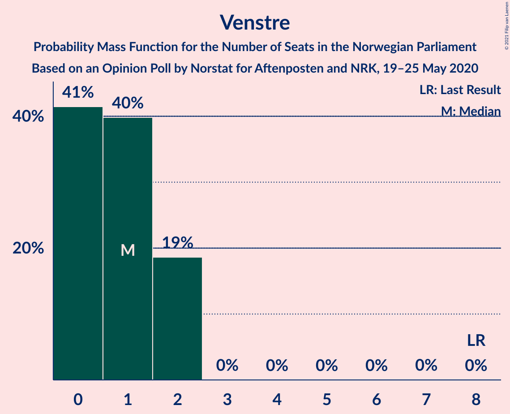
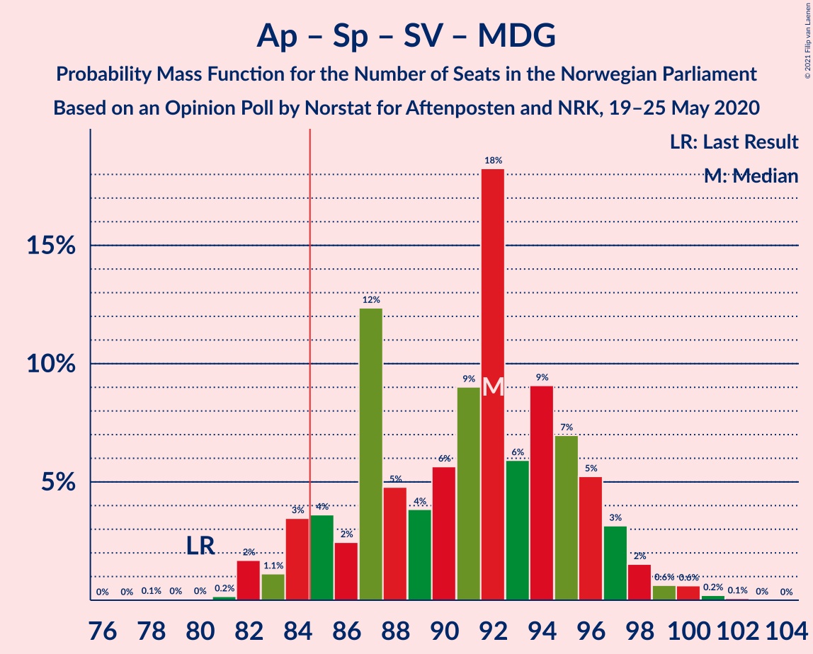
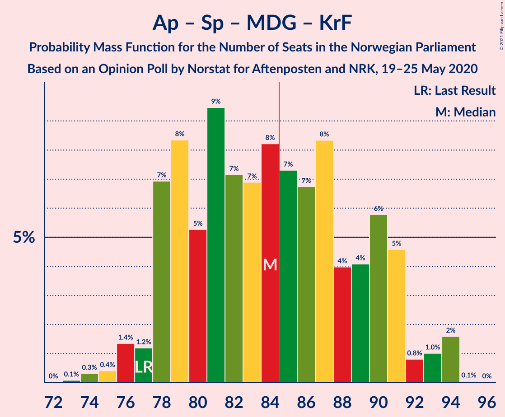
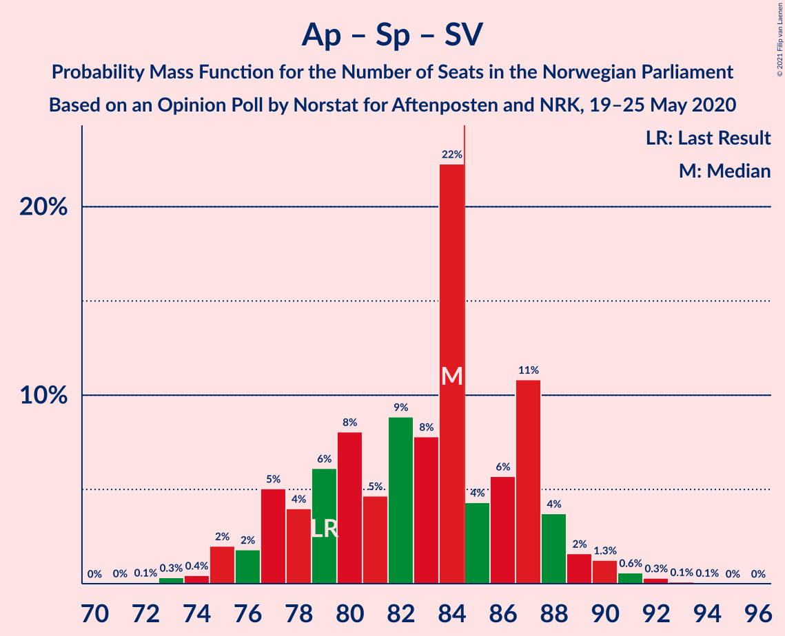
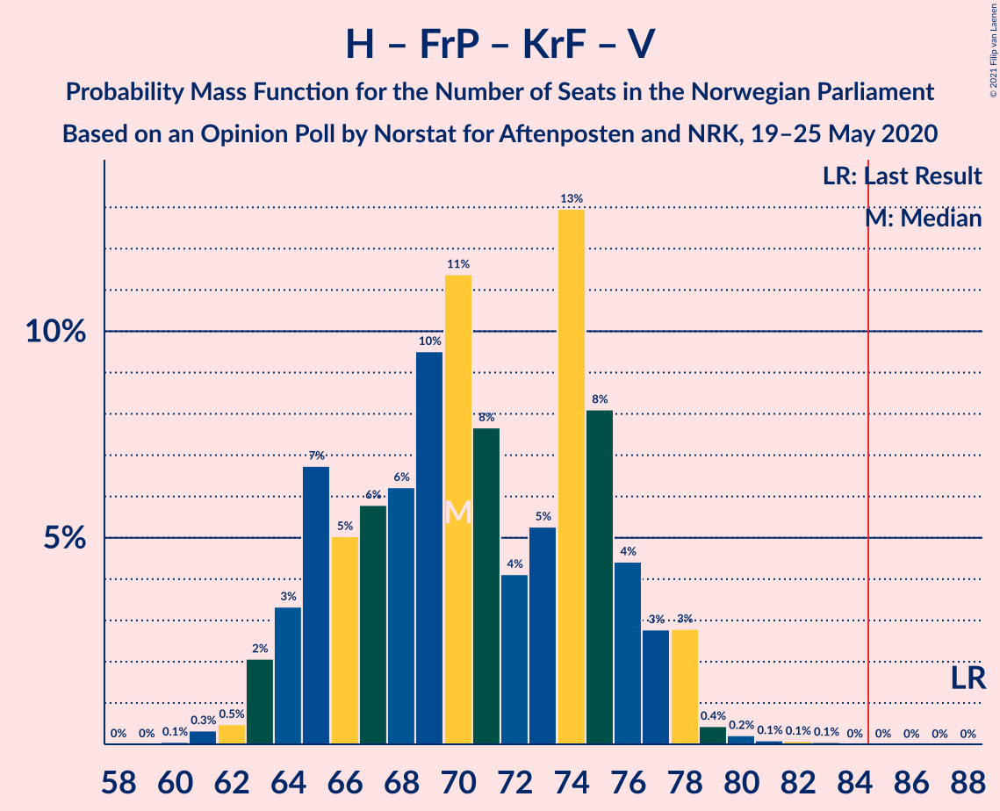
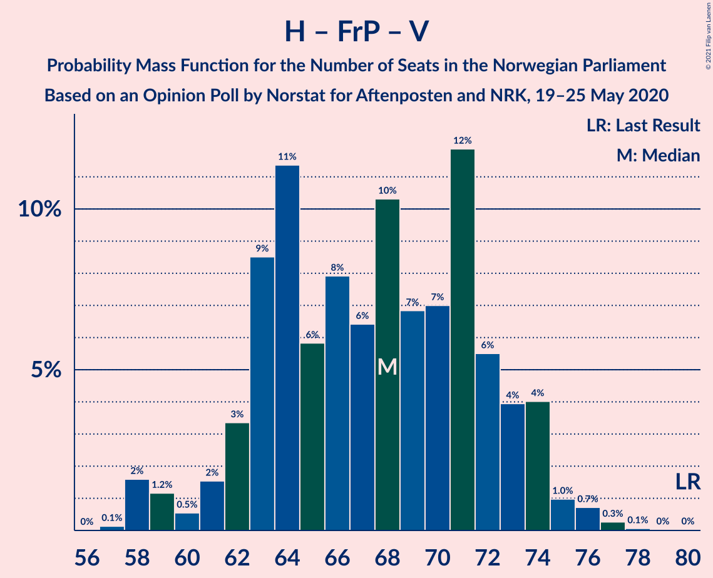
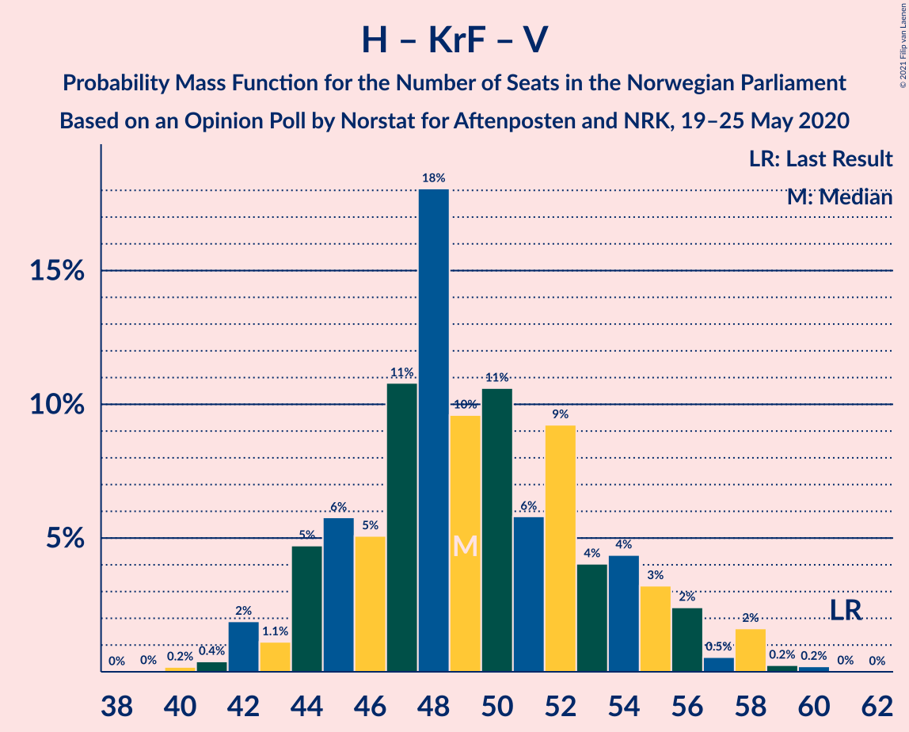

# Opinion Poll by Norstat for Aftenposten and NRK, 19–25 May 2020

<a href="#voting-intentions">Voting Intentions</a> | <a href="#seats">Seats</a> | <a href="#coalitions">Coalitions</a> | <a href="#technical-information">Technical Information</a>

## Voting Intentions

### Confidence Intervals

| Party | Last Result | Poll Result | 80% Confidence Interval | 90% Confidence Interval | 95% Confidence Interval | 99% Confidence Interval |
|:-----:|:-----------:|:-----------:|:-----------------------:|:-----------------------:|:-----------------------:|:-----------------------:|
| Høyre | 25.0% | 26.2% | 24.5–28.1% |24.0–28.7% |23.5–29.1% |22.7–30.0% |
| Arbeiderpartiet | 27.4% | 25.8% | 24.1–27.7% |23.6–28.2% |23.1–28.7% |22.3–29.6% |
| Senterpartiet | 10.3% | 15.0% | 13.6–16.6% |13.3–17.1% |12.9–17.5% |12.3–18.2% |
| Fremskrittspartiet | 15.2% | 12.1% | 10.9–13.6% |10.5–14.0% |10.2–14.4% |9.6–15.1% |
| Sosialistisk Venstreparti | 6.0% | 5.5% | 4.7–6.6% |4.5–6.9% |4.3–7.2% |3.9–7.7% |
| Miljøpartiet De Grønne | 3.2% | 5.0% | 4.2–6.1% |4.0–6.3% |3.8–6.6% |3.4–7.1% |
| Rødt | 2.4% | 4.6% | 3.8–5.6% |3.6–5.9% |3.4–6.1% |3.1–6.6% |
| Kristelig Folkeparti | 4.2% | 3.2% | 2.6–4.1% |2.4–4.3% |2.3–4.6% |2.0–5.0% |
| Venstre | 4.4% | 2.0% | 1.5–2.7% |1.4–2.9% |1.3–3.1% |1.1–3.5% |

*Note:* The poll result column reflects the actual value used in the calculations. Published results may vary slightly, and in addition be rounded to fewer digits.

## Seats

### Confidence Intervals

| Party | Last Result | Median | 80% Confidence Interval | 90% Confidence Interval | 95% Confidence Interval | 99% Confidence Interval |
|:-----:|:-----------:|:------:|:-----------------------:|:-----------------------:|:-----------------------:|:-----------------------:|
| <a href="#høyre">Høyre</a> | 45 | 45 | 42–51 |40–53 |39–53 |39–53 |
| <a href="#arbeiderpartiet">Arbeiderpartiet</a> | 49 | 43 | 41–51 |41–51 |40–52 |39–54 |
| <a href="#senterpartiet">Senterpartiet</a> | 19 | 27 | 24–31 |23–32 |22–33 |21–35 |
| <a href="#fremskrittspartiet">Fremskrittspartiet</a> | 27 | 21 | 19–24 |18–25 |18–25 |16–28 |
| <a href="#sosialistisk-venstreparti">Sosialistisk Venstreparti</a> | 11 | 9 | 8–11 |7–12 |2–13 |2–14 |
| <a href="#miljøpartiet-de-grønne">Miljøpartiet De Grønne</a> | 1 | 9 | 7–11 |2–11 |2–12 |1–13 |
| <a href="#rødt">Rødt</a> | 1 | 9 | 2–11 |2–11 |2–11 |2–11 |
| <a href="#kristelig-folkeparti">Kristelig Folkeparti</a> | 8 | 3 | 1–7 |1–7 |0–8 |0–9 |
| <a href="#venstre">Venstre</a> | 8 | 1 | 1–2 |0–2 |0–2 |0–2 |

### Høyre

*For a full overview of the results for this party, see the [Høyre](party-høyre.html) page.*

| Number of Seats | Probability | Accumulated | Special Marks |
|:---------------:|:-----------:|:-----------:|:-------------:|
| 37 | 0.1% | 100% |  |
| 38 | 0.4% | 99.9% |  |
| 39 | 4% | 99.5% |  |
| 40 | 0.7% | 95% |  |
| 41 | 2% | 95% |  |
| 42 | 20% | 93% |  |
| 43 | 8% | 73% |  |
| 44 | 11% | 65% |  |
| 45 | 7% | 54% | Last Result, Median |
| 46 | 3% | 47% |  |
| 47 | 3% | 44% |  |
| 48 | 5% | 41% |  |
| 49 | 16% | 37% |  |
| 50 | 6% | 20% |  |
| 51 | 7% | 14% |  |
| 52 | 0.2% | 7% |  |
| 53 | 7% | 7% |  |
| 54 | 0.3% | 0.4% |  |
| 55 | 0% | 0.1% |  |
| 56 | 0% | 0.1% |  |
| 57 | 0% | 0.1% |  |
| 58 | 0% | 0% |  |

### Arbeiderpartiet

*For a full overview of the results for this party, see the [Arbeiderpartiet](party-arbeiderpartiet.html) page.*

| Number of Seats | Probability | Accumulated | Special Marks |
|:---------------:|:-----------:|:-----------:|:-------------:|
| 37 | 0.1% | 100% |  |
| 38 | 0% | 99.9% |  |
| 39 | 0.8% | 99.8% |  |
| 40 | 4% | 99.0% |  |
| 41 | 22% | 95% |  |
| 42 | 7% | 74% |  |
| 43 | 18% | 67% | Median |
| 44 | 8% | 49% |  |
| 45 | 11% | 41% |  |
| 46 | 9% | 30% |  |
| 47 | 4% | 20% |  |
| 48 | 2% | 16% |  |
| 49 | 3% | 14% | Last Result |
| 50 | 1.4% | 12% |  |
| 51 | 7% | 10% |  |
| 52 | 2% | 3% |  |
| 53 | 0.2% | 1.2% |  |
| 54 | 0.8% | 1.0% |  |
| 55 | 0.1% | 0.1% |  |
| 56 | 0% | 0% |  |

### Senterpartiet

*For a full overview of the results for this party, see the [Senterpartiet](party-senterpartiet.html) page.*

| Number of Seats | Probability | Accumulated | Special Marks |
|:---------------:|:-----------:|:-----------:|:-------------:|
| 19 | 0% | 100% | Last Result |
| 20 | 0.1% | 100% |  |
| 21 | 2% | 99.9% |  |
| 22 | 2% | 98% |  |
| 23 | 2% | 97% |  |
| 24 | 5% | 94% |  |
| 25 | 25% | 89% |  |
| 26 | 12% | 64% |  |
| 27 | 3% | 52% | Median |
| 28 | 5% | 49% |  |
| 29 | 9% | 44% |  |
| 30 | 21% | 35% |  |
| 31 | 8% | 14% |  |
| 32 | 1.2% | 6% |  |
| 33 | 3% | 5% |  |
| 34 | 0.5% | 2% |  |
| 35 | 1.3% | 1.3% |  |
| 36 | 0.1% | 0.1% |  |
| 37 | 0% | 0% |  |

### Fremskrittspartiet

*For a full overview of the results for this party, see the [Fremskrittspartiet](party-fremskrittspartiet.html) page.*

| Number of Seats | Probability | Accumulated | Special Marks |
|:---------------:|:-----------:|:-----------:|:-------------:|
| 15 | 0% | 100% |  |
| 16 | 0.6% | 99.9% |  |
| 17 | 1.4% | 99.3% |  |
| 18 | 3% | 98% |  |
| 19 | 9% | 95% |  |
| 20 | 29% | 86% |  |
| 21 | 21% | 57% | Median |
| 22 | 18% | 36% |  |
| 23 | 7% | 18% |  |
| 24 | 3% | 12% |  |
| 25 | 6% | 8% |  |
| 26 | 1.2% | 2% |  |
| 27 | 0.3% | 1.2% | Last Result |
| 28 | 0.8% | 0.8% |  |
| 29 | 0% | 0% |  |

### Sosialistisk Venstreparti

*For a full overview of the results for this party, see the [Sosialistisk Venstreparti](party-sosialistiskvenstreparti.html) page.*

| Number of Seats | Probability | Accumulated | Special Marks |
|:---------------:|:-----------:|:-----------:|:-------------:|
| 1 | 0.4% | 100% |  |
| 2 | 4% | 99.6% |  |
| 3 | 0% | 95% |  |
| 4 | 0% | 95% |  |
| 5 | 0% | 95% |  |
| 6 | 0% | 95% |  |
| 7 | 0.7% | 95% |  |
| 8 | 18% | 95% |  |
| 9 | 37% | 76% | Median |
| 10 | 16% | 40% |  |
| 11 | 18% | 24% | Last Result |
| 12 | 3% | 6% |  |
| 13 | 2% | 3% |  |
| 14 | 0.6% | 0.8% |  |
| 15 | 0.1% | 0.2% |  |
| 16 | 0% | 0% |  |

### Miljøpartiet De Grønne

*For a full overview of the results for this party, see the [Miljøpartiet De Grønne](party-miljøpartietdegrønne.html) page.*

| Number of Seats | Probability | Accumulated | Special Marks |
|:---------------:|:-----------:|:-----------:|:-------------:|
| 1 | 1.3% | 100% | Last Result |
| 2 | 5% | 98.7% |  |
| 3 | 0.5% | 94% |  |
| 4 | 0.1% | 93% |  |
| 5 | 0% | 93% |  |
| 6 | 0% | 93% |  |
| 7 | 6% | 93% |  |
| 8 | 10% | 88% |  |
| 9 | 36% | 78% | Median |
| 10 | 26% | 41% |  |
| 11 | 10% | 15% |  |
| 12 | 4% | 5% |  |
| 13 | 1.3% | 1.4% |  |
| 14 | 0.1% | 0.1% |  |
| 15 | 0% | 0% |  |

### Rødt

*For a full overview of the results for this party, see the [Rødt](party-rødt.html) page.*

| Number of Seats | Probability | Accumulated | Special Marks |
|:---------------:|:-----------:|:-----------:|:-------------:|
| 1 | 0.1% | 100% | Last Result |
| 2 | 16% | 99.9% |  |
| 3 | 0% | 84% |  |
| 4 | 0% | 84% |  |
| 5 | 0% | 84% |  |
| 6 | 0% | 84% |  |
| 7 | 9% | 84% |  |
| 8 | 21% | 76% |  |
| 9 | 17% | 55% | Median |
| 10 | 25% | 38% |  |
| 11 | 12% | 12% |  |
| 12 | 0.3% | 0.5% |  |
| 13 | 0.1% | 0.1% |  |
| 14 | 0% | 0% |  |

### Kristelig Folkeparti

*For a full overview of the results for this party, see the [Kristelig Folkeparti](party-kristeligfolkeparti.html) page.*

| Number of Seats | Probability | Accumulated | Special Marks |
|:---------------:|:-----------:|:-----------:|:-------------:|
| 0 | 3% | 100% |  |
| 1 | 39% | 97% |  |
| 2 | 2% | 58% |  |
| 3 | 42% | 56% | Median |
| 4 | 0% | 14% |  |
| 5 | 0% | 14% |  |
| 6 | 0% | 14% |  |
| 7 | 10% | 14% |  |
| 8 | 3% | 4% | Last Result |
| 9 | 0.8% | 0.8% |  |
| 10 | 0% | 0% |  |

### Venstre

*For a full overview of the results for this party, see the [Venstre](party-venstre.html) page.*

| Number of Seats | Probability | Accumulated | Special Marks |
|:---------------:|:-----------:|:-----------:|:-------------:|
| 0 | 7% | 100% |  |
| 1 | 57% | 93% | Median |
| 2 | 36% | 36% |  |
| 3 | 0% | 0% |  |
| 4 | 0% | 0% |  |
| 5 | 0% | 0% |  |
| 6 | 0% | 0% |  |
| 7 | 0% | 0% |  |
| 8 | 0% | 0% | Last Result |

## Coalitions

### Confidence Intervals

| Coalition | Last Result | Median | Majority? | 80% Confidence Interval | 90% Confidence Interval | 95% Confidence Interval | 99% Confidence Interval |
|:---------:|:-----------:|:------:|:---------:|:-----------------------:|:-----------------------:|:-----------------------:|:-----------------------:|
| Arbeiderpartiet – Senterpartiet – Sosialistisk Venstreparti – Miljøpartiet De Grønne – Rødt | 81 | 98 | 100% | 93–103 | 93–104 | 91–105 | 89–107 |
| Høyre – Senterpartiet – Fremskrittspartiet – Kristelig Folkeparti – Venstre | 107 | 99 | 100% | 94–102 | 94–104 | 91–104 | 89–107 |
| Arbeiderpartiet – Senterpartiet – Sosialistisk Venstreparti – Miljøpartiet De Grønne – Kristelig Folkeparti | 88 | 93 | 99.5% | 87–97 | 87–99 | 86–99 | 85–102 |
| Arbeiderpartiet – Senterpartiet – Sosialistisk Venstreparti – Rødt | 80 | 89 | 89% | 84–94 | 82–95 | 82–97 | 81–100 |
| Arbeiderpartiet – Senterpartiet – Sosialistisk Venstreparti – Miljøpartiet De Grønne | 80 | 91 | 78% | 84–94 | 84–94 | 82–96 | 80–100 |
| Arbeiderpartiet – Senterpartiet – Miljøpartiet De Grønne – Kristelig Folkeparti | 77 | 84 | 47% | 78–89 | 77–89 | 75–91 | 74–92 |
| Arbeiderpartiet – Senterpartiet – Sosialistisk Venstreparti | 79 | 82 | 8% | 75–84 | 75–86 | 75–88 | 74–91 |
| Høyre – Fremskrittspartiet – Miljøpartiet De Grønne – Kristelig Folkeparti – Venstre | 89 | 80 | 11% | 75–85 | 74–87 | 72–87 | 69–88 |
| Arbeiderpartiet – Senterpartiet – Kristelig Folkeparti | 76 | 75 | 0.3% | 69–79 | 69–81 | 69–83 | 68–84 |
| Arbeiderpartiet – Senterpartiet | 68 | 73 | 0% | 66–76 | 66–78 | 66–78 | 65–80 |
| Høyre – Fremskrittspartiet – Kristelig Folkeparti – Venstre | 88 | 71 | 0% | 66–76 | 65–76 | 64–78 | 62–80 |
| Høyre – Fremskrittspartiet – Venstre | 80 | 68 | 0% | 63–74 | 63–75 | 61–75 | 59–77 |
| Høyre – Fremskrittspartiet | 72 | 67 | 0% | 62–73 | 61–74 | 60–74 | 58–76 |
| Arbeiderpartiet – Sosialistisk Venstreparti | 60 | 54 | 0% | 50–59 | 49–60 | 48–60 | 44–63 |
| Høyre – Kristelig Folkeparti – Venstre | 61 | 50 | 0% | 46–55 | 45–55 | 44–56 | 41–57 |
| Senterpartiet – Kristelig Folkeparti – Venstre | 35 | 31 | 0% | 27–36 | 26–38 | 25–40 | 24–40 |

### Arbeiderpartiet – Senterpartiet – Sosialistisk Venstreparti – Miljøpartiet De Grønne – Rødt

| Number of Seats | Probability | Accumulated | Special Marks |
|:---------------:|:-----------:|:-----------:|:-------------:|
| 81 | 0% | 100% | Last Result |
| 82 | 0% | 100% |  |
| 83 | 0% | 100% |  |
| 84 | 0% | 100% |  |
| 85 | 0% | 100% | Majority |
| 86 | 0% | 100% |  |
| 87 | 0.1% | 100% |  |
| 88 | 0.2% | 99.9% |  |
| 89 | 0.2% | 99.7% |  |
| 90 | 0.6% | 99.4% |  |
| 91 | 3% | 98.9% |  |
| 92 | 0.9% | 96% |  |
| 93 | 9% | 95% |  |
| 94 | 17% | 86% |  |
| 95 | 10% | 69% |  |
| 96 | 3% | 59% |  |
| 97 | 4% | 56% | Median |
| 98 | 6% | 52% |  |
| 99 | 5% | 46% |  |
| 100 | 2% | 41% |  |
| 101 | 8% | 38% |  |
| 102 | 17% | 31% |  |
| 103 | 5% | 13% |  |
| 104 | 5% | 8% |  |
| 105 | 2% | 3% |  |
| 106 | 0.5% | 1.5% |  |
| 107 | 0.5% | 1.0% |  |
| 108 | 0.3% | 0.5% |  |
| 109 | 0.1% | 0.2% |  |
| 110 | 0.1% | 0.1% |  |
| 111 | 0% | 0% |  |

### Høyre – Senterpartiet – Fremskrittspartiet – Kristelig Folkeparti – Venstre

| Number of Seats | Probability | Accumulated | Special Marks |
|:---------------:|:-----------:|:-----------:|:-------------:|
| 87 | 0% | 100% |  |
| 88 | 0.3% | 99.9% |  |
| 89 | 0.5% | 99.6% |  |
| 90 | 1.0% | 99.1% |  |
| 91 | 2% | 98% |  |
| 92 | 0.2% | 96% |  |
| 93 | 0.5% | 96% |  |
| 94 | 8% | 95% |  |
| 95 | 6% | 88% |  |
| 96 | 2% | 82% |  |
| 97 | 21% | 80% | Median |
| 98 | 8% | 59% |  |
| 99 | 9% | 51% |  |
| 100 | 18% | 43% |  |
| 101 | 6% | 25% |  |
| 102 | 9% | 19% |  |
| 103 | 3% | 10% |  |
| 104 | 4% | 7% |  |
| 105 | 0.3% | 2% |  |
| 106 | 1.2% | 2% |  |
| 107 | 0.4% | 0.8% | Last Result |
| 108 | 0.2% | 0.4% |  |
| 109 | 0.1% | 0.2% |  |
| 110 | 0.1% | 0.1% |  |
| 111 | 0% | 0% |  |

### Arbeiderpartiet – Senterpartiet – Sosialistisk Venstreparti – Miljøpartiet De Grønne – Kristelig Folkeparti

| Number of Seats | Probability | Accumulated | Special Marks |
|:---------------:|:-----------:|:-----------:|:-------------:|
| 82 | 0.1% | 100% |  |
| 83 | 0.2% | 99.8% |  |
| 84 | 0% | 99.6% |  |
| 85 | 2% | 99.5% | Majority |
| 86 | 1.3% | 98% |  |
| 87 | 17% | 96% |  |
| 88 | 1.2% | 79% | Last Result |
| 89 | 5% | 78% |  |
| 90 | 3% | 74% |  |
| 91 | 4% | 71% | Median |
| 92 | 16% | 67% |  |
| 93 | 7% | 52% |  |
| 94 | 13% | 44% |  |
| 95 | 3% | 31% |  |
| 96 | 0.7% | 28% |  |
| 97 | 20% | 27% |  |
| 98 | 0.4% | 8% |  |
| 99 | 5% | 7% |  |
| 100 | 0.9% | 2% |  |
| 101 | 0.4% | 1.1% |  |
| 102 | 0.4% | 0.7% |  |
| 103 | 0.1% | 0.3% |  |
| 104 | 0.1% | 0.2% |  |
| 105 | 0.1% | 0.1% |  |
| 106 | 0% | 0% |  |

### Arbeiderpartiet – Senterpartiet – Sosialistisk Venstreparti – Rødt

| Number of Seats | Probability | Accumulated | Special Marks |
|:---------------:|:-----------:|:-----------:|:-------------:|
| 78 | 0% | 100% |  |
| 79 | 0% | 99.9% |  |
| 80 | 0.2% | 99.9% | Last Result |
| 81 | 0.4% | 99.7% |  |
| 82 | 7% | 99.3% |  |
| 83 | 1.2% | 92% |  |
| 84 | 2% | 91% |  |
| 85 | 16% | 89% | Majority |
| 86 | 12% | 73% |  |
| 87 | 4% | 61% |  |
| 88 | 3% | 57% | Median |
| 89 | 7% | 54% |  |
| 90 | 6% | 47% |  |
| 91 | 3% | 41% |  |
| 92 | 16% | 38% |  |
| 93 | 8% | 22% |  |
| 94 | 4% | 14% |  |
| 95 | 6% | 10% |  |
| 96 | 0.6% | 4% |  |
| 97 | 2% | 4% |  |
| 98 | 1.2% | 2% |  |
| 99 | 0.1% | 0.8% |  |
| 100 | 0.5% | 0.7% |  |
| 101 | 0% | 0.2% |  |
| 102 | 0.2% | 0.2% |  |
| 103 | 0% | 0% |  |

### Arbeiderpartiet – Senterpartiet – Sosialistisk Venstreparti – Miljøpartiet De Grønne

| Number of Seats | Probability | Accumulated | Special Marks |
|:---------------:|:-----------:|:-----------:|:-------------:|
| 78 | 0.1% | 100% |  |
| 79 | 0.2% | 99.9% |  |
| 80 | 0.2% | 99.6% | Last Result |
| 81 | 0.1% | 99.4% |  |
| 82 | 2% | 99.3% |  |
| 83 | 2% | 97% |  |
| 84 | 17% | 96% |  |
| 85 | 2% | 78% | Majority |
| 86 | 5% | 77% |  |
| 87 | 2% | 72% |  |
| 88 | 3% | 69% | Median |
| 89 | 3% | 66% |  |
| 90 | 5% | 64% |  |
| 91 | 15% | 59% |  |
| 92 | 8% | 44% |  |
| 93 | 11% | 35% |  |
| 94 | 19% | 24% |  |
| 95 | 1.3% | 5% |  |
| 96 | 1.0% | 3% |  |
| 97 | 0.6% | 2% |  |
| 98 | 1.0% | 2% |  |
| 99 | 0.2% | 0.8% |  |
| 100 | 0.3% | 0.6% |  |
| 101 | 0.2% | 0.3% |  |
| 102 | 0% | 0.1% |  |
| 103 | 0% | 0% |  |

### Arbeiderpartiet – Senterpartiet – Miljøpartiet De Grønne – Kristelig Folkeparti

| Number of Seats | Probability | Accumulated | Special Marks |
|:---------------:|:-----------:|:-----------:|:-------------:|
| 72 | 0% | 100% |  |
| 73 | 0.1% | 99.9% |  |
| 74 | 0.8% | 99.8% |  |
| 75 | 2% | 99.0% |  |
| 76 | 0.9% | 97% |  |
| 77 | 1.3% | 96% | Last Result |
| 78 | 17% | 95% |  |
| 79 | 2% | 77% |  |
| 80 | 2% | 75% |  |
| 81 | 1.4% | 74% |  |
| 82 | 8% | 72% | Median |
| 83 | 9% | 65% |  |
| 84 | 8% | 55% |  |
| 85 | 6% | 47% | Majority |
| 86 | 25% | 41% |  |
| 87 | 4% | 16% |  |
| 88 | 0.8% | 13% |  |
| 89 | 7% | 12% |  |
| 90 | 1.3% | 4% |  |
| 91 | 2% | 3% |  |
| 92 | 0.6% | 1.1% |  |
| 93 | 0.1% | 0.5% |  |
| 94 | 0.2% | 0.4% |  |
| 95 | 0% | 0.1% |  |
| 96 | 0.1% | 0.1% |  |
| 97 | 0% | 0.1% |  |
| 98 | 0% | 0% |  |

### Arbeiderpartiet – Senterpartiet – Sosialistisk Venstreparti

| Number of Seats | Probability | Accumulated | Special Marks |
|:---------------:|:-----------:|:-----------:|:-------------:|
| 69 | 0.1% | 100% |  |
| 70 | 0% | 99.9% |  |
| 71 | 0.1% | 99.9% |  |
| 72 | 0.1% | 99.7% |  |
| 73 | 0.1% | 99.7% |  |
| 74 | 2% | 99.6% |  |
| 75 | 16% | 98% |  |
| 76 | 2% | 82% |  |
| 77 | 5% | 80% |  |
| 78 | 2% | 75% |  |
| 79 | 5% | 73% | Last Result, Median |
| 80 | 11% | 69% |  |
| 81 | 4% | 57% |  |
| 82 | 9% | 53% |  |
| 83 | 5% | 44% |  |
| 84 | 31% | 39% |  |
| 85 | 1.2% | 8% | Majority |
| 86 | 3% | 7% |  |
| 87 | 1.3% | 5% |  |
| 88 | 2% | 3% |  |
| 89 | 0.7% | 2% |  |
| 90 | 0.4% | 1.0% |  |
| 91 | 0.3% | 0.6% |  |
| 92 | 0.1% | 0.3% |  |
| 93 | 0.1% | 0.2% |  |
| 94 | 0% | 0% |  |

### Høyre – Fremskrittspartiet – Miljøpartiet De Grønne – Kristelig Folkeparti – Venstre

| Number of Seats | Probability | Accumulated | Special Marks |
|:---------------:|:-----------:|:-----------:|:-------------:|
| 67 | 0.2% | 100% |  |
| 68 | 0% | 99.8% |  |
| 69 | 0.5% | 99.8% |  |
| 70 | 0.1% | 99.3% |  |
| 71 | 1.2% | 99.2% |  |
| 72 | 2% | 98% |  |
| 73 | 0.6% | 96% |  |
| 74 | 6% | 96% |  |
| 75 | 4% | 90% |  |
| 76 | 8% | 86% |  |
| 77 | 16% | 78% |  |
| 78 | 3% | 62% |  |
| 79 | 6% | 59% | Median |
| 80 | 7% | 53% |  |
| 81 | 3% | 46% |  |
| 82 | 4% | 43% |  |
| 83 | 12% | 39% |  |
| 84 | 16% | 27% |  |
| 85 | 2% | 11% | Majority |
| 86 | 1.2% | 9% |  |
| 87 | 7% | 8% |  |
| 88 | 0.4% | 0.7% |  |
| 89 | 0.2% | 0.3% | Last Result |
| 90 | 0% | 0.1% |  |
| 91 | 0% | 0.1% |  |
| 92 | 0% | 0% |  |

### Arbeiderpartiet – Senterpartiet – Kristelig Folkeparti

| Number of Seats | Probability | Accumulated | Special Marks |
|:---------------:|:-----------:|:-----------:|:-------------:|
| 65 | 0% | 100% |  |
| 66 | 0.1% | 99.9% |  |
| 67 | 0.1% | 99.9% |  |
| 68 | 1.3% | 99.8% |  |
| 69 | 18% | 98% |  |
| 70 | 0.2% | 81% |  |
| 71 | 1.3% | 80% |  |
| 72 | 12% | 79% |  |
| 73 | 5% | 68% | Median |
| 74 | 9% | 62% |  |
| 75 | 7% | 54% |  |
| 76 | 21% | 47% | Last Result |
| 77 | 7% | 26% |  |
| 78 | 5% | 19% |  |
| 79 | 6% | 14% |  |
| 80 | 3% | 9% |  |
| 81 | 2% | 5% |  |
| 82 | 0.6% | 3% |  |
| 83 | 2% | 3% |  |
| 84 | 0.2% | 0.5% |  |
| 85 | 0.1% | 0.3% | Majority |
| 86 | 0% | 0.2% |  |
| 87 | 0.1% | 0.2% |  |
| 88 | 0.1% | 0.1% |  |
| 89 | 0% | 0% |  |

### Arbeiderpartiet – Senterpartiet

| Number of Seats | Probability | Accumulated | Special Marks |
|:---------------:|:-----------:|:-----------:|:-------------:|
| 63 | 0% | 100% |  |
| 64 | 0.2% | 99.9% |  |
| 65 | 1.1% | 99.7% |  |
| 66 | 17% | 98.6% |  |
| 67 | 3% | 81% |  |
| 68 | 2% | 79% | Last Result |
| 69 | 1.2% | 76% |  |
| 70 | 4% | 75% | Median |
| 71 | 12% | 72% |  |
| 72 | 6% | 60% |  |
| 73 | 25% | 54% |  |
| 74 | 5% | 29% |  |
| 75 | 9% | 24% |  |
| 76 | 8% | 15% |  |
| 77 | 2% | 7% |  |
| 78 | 3% | 5% |  |
| 79 | 0.8% | 2% |  |
| 80 | 0.8% | 1.3% |  |
| 81 | 0.3% | 0.5% |  |
| 82 | 0.2% | 0.2% |  |
| 83 | 0% | 0.1% |  |
| 84 | 0% | 0% |  |

### Høyre – Fremskrittspartiet – Kristelig Folkeparti – Venstre

| Number of Seats | Probability | Accumulated | Special Marks |
|:---------------:|:-----------:|:-----------:|:-------------:|
| 59 | 0.1% | 100% |  |
| 60 | 0.1% | 99.9% |  |
| 61 | 0.3% | 99.8% |  |
| 62 | 0.5% | 99.5% |  |
| 63 | 0.5% | 99.0% |  |
| 64 | 2% | 98.5% |  |
| 65 | 5% | 97% |  |
| 66 | 5% | 92% |  |
| 67 | 17% | 87% |  |
| 68 | 8% | 69% |  |
| 69 | 2% | 62% |  |
| 70 | 5% | 59% | Median |
| 71 | 6% | 54% |  |
| 72 | 4% | 48% |  |
| 73 | 3% | 44% |  |
| 74 | 10% | 41% |  |
| 75 | 17% | 31% |  |
| 76 | 9% | 14% |  |
| 77 | 0.9% | 5% |  |
| 78 | 3% | 4% |  |
| 79 | 0.6% | 1.1% |  |
| 80 | 0.2% | 0.6% |  |
| 81 | 0.2% | 0.3% |  |
| 82 | 0.1% | 0.1% |  |
| 83 | 0% | 0% |  |
| 84 | 0% | 0% |  |
| 85 | 0% | 0% | Majority |
| 86 | 0% | 0% |  |
| 87 | 0% | 0% |  |
| 88 | 0% | 0% | Last Result |

### Høyre – Fremskrittspartiet – Venstre

| Number of Seats | Probability | Accumulated | Special Marks |
|:---------------:|:-----------:|:-----------:|:-------------:|
| 57 | 0.1% | 100% |  |
| 58 | 0.1% | 99.9% |  |
| 59 | 0.3% | 99.8% |  |
| 60 | 1.0% | 99.5% |  |
| 61 | 2% | 98.5% |  |
| 62 | 0.4% | 97% |  |
| 63 | 7% | 96% |  |
| 64 | 21% | 89% |  |
| 65 | 5% | 68% |  |
| 66 | 3% | 63% |  |
| 67 | 6% | 60% | Median |
| 68 | 4% | 53% |  |
| 69 | 4% | 49% |  |
| 70 | 4% | 45% |  |
| 71 | 5% | 41% |  |
| 72 | 18% | 36% |  |
| 73 | 8% | 18% |  |
| 74 | 1.3% | 11% |  |
| 75 | 9% | 9% |  |
| 76 | 0.1% | 0.7% |  |
| 77 | 0.2% | 0.6% |  |
| 78 | 0.2% | 0.4% |  |
| 79 | 0.1% | 0.1% |  |
| 80 | 0% | 0% | Last Result |

### Høyre – Fremskrittspartiet

| Number of Seats | Probability | Accumulated | Special Marks |
|:---------------:|:-----------:|:-----------:|:-------------:|
| 56 | 0.1% | 100% |  |
| 57 | 0.1% | 99.9% |  |
| 58 | 0.5% | 99.8% |  |
| 59 | 0.6% | 99.3% |  |
| 60 | 2% | 98.7% |  |
| 61 | 3% | 97% |  |
| 62 | 19% | 93% |  |
| 63 | 6% | 74% |  |
| 64 | 7% | 68% |  |
| 65 | 6% | 61% |  |
| 66 | 2% | 55% | Median |
| 67 | 4% | 53% |  |
| 68 | 5% | 49% |  |
| 69 | 5% | 44% |  |
| 70 | 3% | 40% |  |
| 71 | 18% | 36% |  |
| 72 | 7% | 18% | Last Result |
| 73 | 3% | 10% |  |
| 74 | 7% | 7% |  |
| 75 | 0.1% | 0.7% |  |
| 76 | 0.3% | 0.6% |  |
| 77 | 0.2% | 0.3% |  |
| 78 | 0% | 0.1% |  |
| 79 | 0% | 0% |  |

### Arbeiderpartiet – Sosialistisk Venstreparti

| Number of Seats | Probability | Accumulated | Special Marks |
|:---------------:|:-----------:|:-----------:|:-------------:|
| 44 | 0.7% | 100% |  |
| 45 | 0% | 99.2% |  |
| 46 | 0.1% | 99.2% |  |
| 47 | 0.2% | 99.1% |  |
| 48 | 3% | 98.9% |  |
| 49 | 3% | 96% |  |
| 50 | 19% | 93% |  |
| 51 | 8% | 74% |  |
| 52 | 2% | 66% | Median |
| 53 | 6% | 64% |  |
| 54 | 29% | 58% |  |
| 55 | 9% | 29% |  |
| 56 | 2% | 20% |  |
| 57 | 4% | 18% |  |
| 58 | 1.2% | 14% |  |
| 59 | 7% | 13% |  |
| 60 | 4% | 6% | Last Result |
| 61 | 0.5% | 2% |  |
| 62 | 0.9% | 1.5% |  |
| 63 | 0.2% | 0.6% |  |
| 64 | 0.2% | 0.4% |  |
| 65 | 0.1% | 0.1% |  |
| 66 | 0% | 0.1% |  |
| 67 | 0% | 0% |  |

### Høyre – Kristelig Folkeparti – Venstre

| Number of Seats | Probability | Accumulated | Special Marks |
|:---------------:|:-----------:|:-----------:|:-------------:|
| 40 | 0.1% | 100% |  |
| 41 | 0.5% | 99.9% |  |
| 42 | 0.5% | 99.4% |  |
| 43 | 0.4% | 98.9% |  |
| 44 | 2% | 98% |  |
| 45 | 7% | 97% |  |
| 46 | 5% | 90% |  |
| 47 | 26% | 85% |  |
| 48 | 4% | 59% |  |
| 49 | 5% | 55% | Median |
| 50 | 4% | 51% |  |
| 51 | 5% | 47% |  |
| 52 | 5% | 42% |  |
| 53 | 22% | 37% |  |
| 54 | 1.4% | 15% |  |
| 55 | 11% | 13% |  |
| 56 | 1.2% | 3% |  |
| 57 | 1.2% | 1.5% |  |
| 58 | 0.1% | 0.3% |  |
| 59 | 0.1% | 0.1% |  |
| 60 | 0% | 0.1% |  |
| 61 | 0% | 0% | Last Result |

### Senterpartiet – Kristelig Folkeparti – Venstre

| Number of Seats | Probability | Accumulated | Special Marks |
|:---------------:|:-----------:|:-----------:|:-------------:|
| 22 | 0.1% | 100% |  |
| 23 | 0.4% | 99.9% |  |
| 24 | 2% | 99.5% |  |
| 25 | 1.4% | 98% |  |
| 26 | 3% | 96% |  |
| 27 | 8% | 93% |  |
| 28 | 9% | 85% |  |
| 29 | 18% | 77% |  |
| 30 | 4% | 58% |  |
| 31 | 8% | 55% | Median |
| 32 | 2% | 46% |  |
| 33 | 11% | 44% |  |
| 34 | 2% | 33% |  |
| 35 | 19% | 31% | Last Result |
| 36 | 5% | 12% |  |
| 37 | 1.0% | 6% |  |
| 38 | 1.1% | 5% |  |
| 39 | 1.3% | 4% |  |
| 40 | 3% | 3% |  |
| 41 | 0.3% | 0.5% |  |
| 42 | 0.1% | 0.2% |  |
| 43 | 0% | 0.1% |  |
| 44 | 0% | 0% |  |

## Technical Information

### Opinion Poll

+ **Polling firm:** Norstat
+ **Commissioner(s):** Aftenposten and NRK
+ **Fieldwork period:** 19–25 May 2020

### Calculations

+ **Sample size:** 957
+ **Simulations done:** 131,072
+ **Error estimate:** 4.92%

