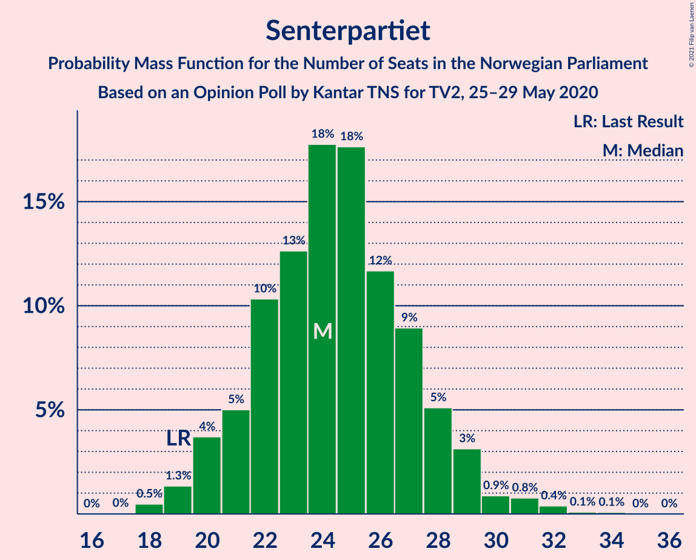
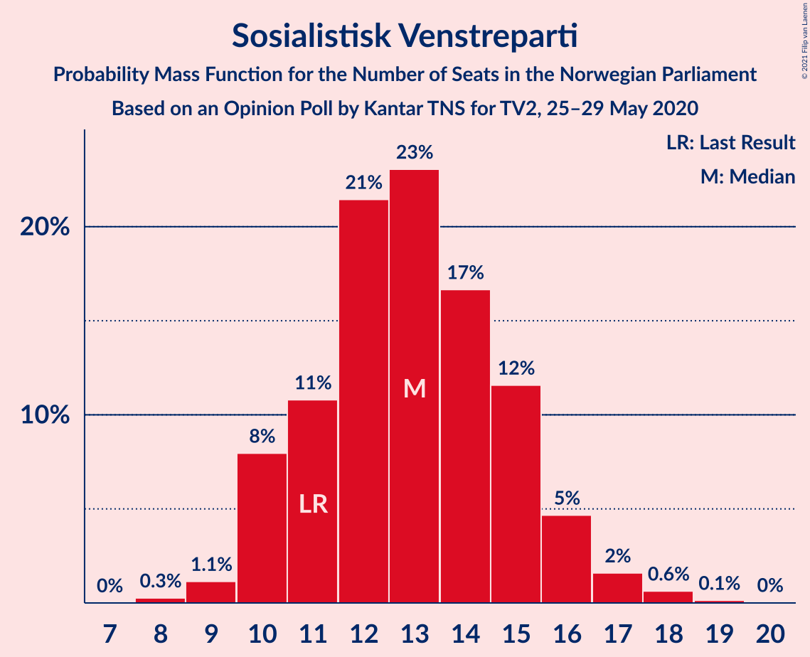
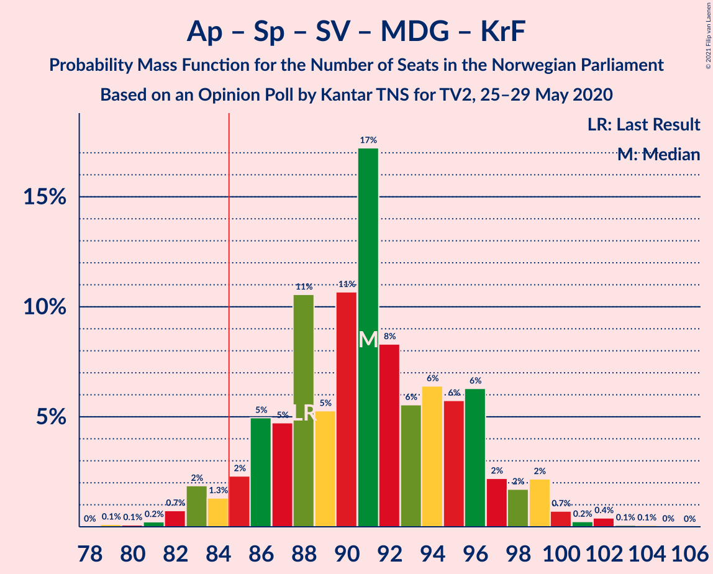
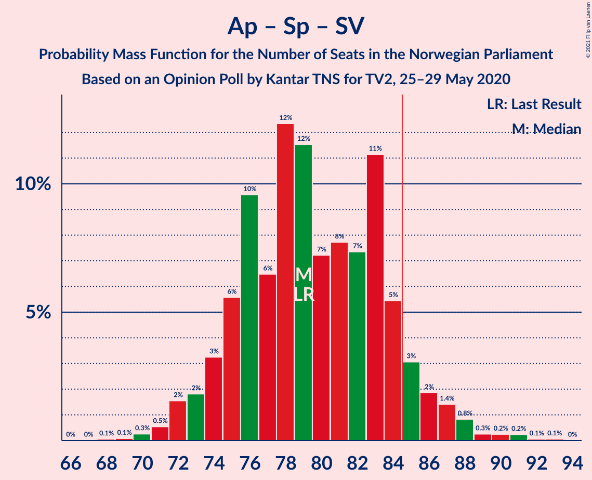
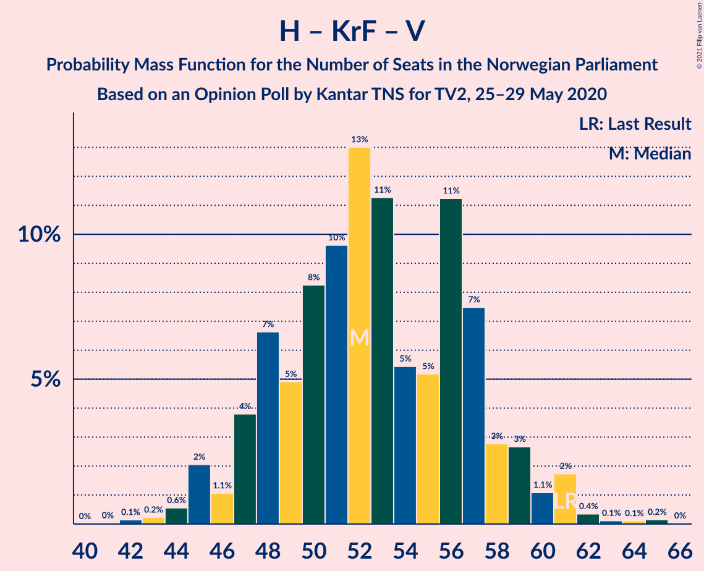
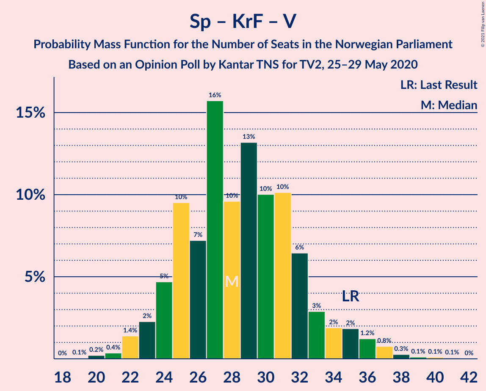

# Opinion Poll by Kantar TNS for TV2, 25–29 May 2020

<a href="#voting-intentions">Voting Intentions</a> | <a href="#seats">Seats</a> | <a href="#coalitions">Coalitions</a> | <a href="#technical-information">Technical Information</a>

## Voting Intentions

### Confidence Intervals

| Party | Last Result | Poll Result | 80% Confidence Interval | 90% Confidence Interval | 95% Confidence Interval | 99% Confidence Interval |
|:-----:|:-----------:|:-----------:|:-----------------------:|:-----------------------:|:-----------------------:|:-----------------------:|
| Høyre | 25.0% | 27.3% | 25.3–29.5% |24.8–30.1% |24.3–30.6% |23.4–31.6% |
| Arbeiderpartiet | 27.4% | 23.4% | 21.6–25.5% |21.0–26.1% |20.6–26.6% |19.7–27.6% |
| Senterpartiet | 10.3% | 13.7% | 12.3–15.4% |11.8–15.9% |11.5–16.4% |10.8–17.2% |
| Fremskrittspartiet | 15.2% | 11.9% | 10.5–13.5% |10.2–14.0% |9.8–14.4% |9.2–15.2% |
| Sosialistisk Venstreparti | 6.0% | 7.3% | 6.2–8.6% |5.9–9.0% |5.6–9.3% |5.2–10.0% |
| Miljøpartiet De Grønne | 3.2% | 4.8% | 3.9–5.9% |3.7–6.2% |3.5–6.5% |3.1–7.1% |
| Rødt | 2.4% | 4.7% | 3.8–5.8% |3.6–6.1% |3.4–6.4% |3.0–7.0% |
| Kristelig Folkeparti | 4.2% | 3.5% | 2.8–4.5% |2.6–4.8% |2.4–5.0% |2.1–5.6% |
| Venstre | 4.4% | 1.6% | 1.1–2.3% |1.0–2.5% |0.9–2.7% |0.7–3.1% |

*Note:* The poll result column reflects the actual value used in the calculations. Published results may vary slightly, and in addition be rounded to fewer digits.

## Seats

### Confidence Intervals

| Party | Last Result | Median | 80% Confidence Interval | 90% Confidence Interval | 95% Confidence Interval | 99% Confidence Interval |
|:-----:|:-----------:|:------:|:-----------------------:|:-----------------------:|:-----------------------:|:-----------------------:|
| <a href="#høyre">Høyre</a> | 45 | 49 | 44–53 |43–54 |43–54 |41–57 |
| <a href="#arbeiderpartiet">Arbeiderpartiet</a> | 49 | 41 | 39–46 |38–47 |37–48 |35–51 |
| <a href="#senterpartiet">Senterpartiet</a> | 19 | 24 | 22–28 |20–30 |20–30 |18–32 |
| <a href="#fremskrittspartiet">Fremskrittspartiet</a> | 27 | 21 | 19–25 |18–27 |18–27 |16–27 |
| <a href="#sosialistisk-venstreparti">Sosialistisk Venstreparti</a> | 11 | 13 | 10–15 |10–15 |10–16 |9–18 |
| <a href="#miljøpartiet-de-grønne">Miljøpartiet De Grønne</a> | 1 | 9 | 2–11 |2–12 |2–12 |1–13 |
| <a href="#rødt">Rødt</a> | 1 | 8 | 2–10 |2–11 |2–11 |1–13 |
| <a href="#kristelig-folkeparti">Kristelig Folkeparti</a> | 8 | 3 | 1–8 |1–8 |1–9 |0–10 |
| <a href="#venstre">Venstre</a> | 8 | 0 | 0–1 |0–1 |0–2 |0–2 |

### Høyre

*For a full overview of the results for this party, see the [Høyre](party-høyre.html) page.*

| Number of Seats | Probability | Accumulated | Special Marks |
|:---------------:|:-----------:|:-----------:|:-------------:|
| 38 | 0.2% | 100% |  |
| 39 | 0.1% | 99.7% |  |
| 40 | 0.1% | 99.6% |  |
| 41 | 0.2% | 99.5% |  |
| 42 | 0.6% | 99.3% |  |
| 43 | 7% | 98.8% |  |
| 44 | 3% | 92% |  |
| 45 | 11% | 89% | Last Result |
| 46 | 7% | 78% |  |
| 47 | 15% | 70% |  |
| 48 | 5% | 56% |  |
| 49 | 4% | 50% | Median |
| 50 | 6% | 47% |  |
| 51 | 11% | 41% |  |
| 52 | 17% | 29% |  |
| 53 | 5% | 13% |  |
| 54 | 6% | 8% |  |
| 55 | 1.2% | 2% |  |
| 56 | 0.2% | 0.8% |  |
| 57 | 0.2% | 0.6% |  |
| 58 | 0% | 0.4% |  |
| 59 | 0.1% | 0.4% |  |
| 60 | 0.3% | 0.3% |  |
| 61 | 0% | 0% |  |

### Arbeiderpartiet

*For a full overview of the results for this party, see the [Arbeiderpartiet](party-arbeiderpartiet.html) page.*

| Number of Seats | Probability | Accumulated | Special Marks |
|:---------------:|:-----------:|:-----------:|:-------------:|
| 32 | 0.1% | 100% |  |
| 33 | 0% | 99.9% |  |
| 34 | 0.1% | 99.9% |  |
| 35 | 1.1% | 99.8% |  |
| 36 | 0.7% | 98.6% |  |
| 37 | 3% | 98% |  |
| 38 | 4% | 95% |  |
| 39 | 6% | 91% |  |
| 40 | 20% | 84% |  |
| 41 | 24% | 65% | Median |
| 42 | 5% | 40% |  |
| 43 | 17% | 36% |  |
| 44 | 5% | 19% |  |
| 45 | 3% | 14% |  |
| 46 | 3% | 10% |  |
| 47 | 3% | 7% |  |
| 48 | 3% | 4% |  |
| 49 | 0.4% | 1.0% | Last Result |
| 50 | 0.1% | 0.7% |  |
| 51 | 0.4% | 0.6% |  |
| 52 | 0.1% | 0.2% |  |
| 53 | 0% | 0.1% |  |
| 54 | 0.1% | 0.1% |  |
| 55 | 0.1% | 0.1% |  |
| 56 | 0% | 0% |  |

### Senterpartiet

*For a full overview of the results for this party, see the [Senterpartiet](party-senterpartiet.html) page.*

| Number of Seats | Probability | Accumulated | Special Marks |
|:---------------:|:-----------:|:-----------:|:-------------:|
| 18 | 0.7% | 100% |  |
| 19 | 2% | 99.3% | Last Result |
| 20 | 5% | 98% |  |
| 21 | 2% | 93% |  |
| 22 | 19% | 91% |  |
| 23 | 20% | 72% |  |
| 24 | 11% | 52% | Median |
| 25 | 16% | 41% |  |
| 26 | 9% | 26% |  |
| 27 | 5% | 16% |  |
| 28 | 4% | 11% |  |
| 29 | 2% | 7% |  |
| 30 | 4% | 6% |  |
| 31 | 0.3% | 2% |  |
| 32 | 1.3% | 2% |  |
| 33 | 0.2% | 0.3% |  |
| 34 | 0% | 0.1% |  |
| 35 | 0.1% | 0.1% |  |
| 36 | 0% | 0% |  |

### Fremskrittspartiet

*For a full overview of the results for this party, see the [Fremskrittspartiet](party-fremskrittspartiet.html) page.*

| Number of Seats | Probability | Accumulated | Special Marks |
|:---------------:|:-----------:|:-----------:|:-------------:|
| 14 | 0.1% | 100% |  |
| 15 | 0.3% | 99.9% |  |
| 16 | 0.8% | 99.7% |  |
| 17 | 1.2% | 98.9% |  |
| 18 | 5% | 98% |  |
| 19 | 12% | 92% |  |
| 20 | 19% | 80% |  |
| 21 | 17% | 61% | Median |
| 22 | 15% | 44% |  |
| 23 | 6% | 28% |  |
| 24 | 5% | 22% |  |
| 25 | 8% | 18% |  |
| 26 | 5% | 10% |  |
| 27 | 5% | 5% | Last Result |
| 28 | 0.1% | 0.3% |  |
| 29 | 0.1% | 0.2% |  |
| 30 | 0% | 0% |  |

### Sosialistisk Venstreparti

*For a full overview of the results for this party, see the [Sosialistisk Venstreparti](party-sosialistiskvenstreparti.html) page.*

| Number of Seats | Probability | Accumulated | Special Marks |
|:---------------:|:-----------:|:-----------:|:-------------:|
| 8 | 0.1% | 100% |  |
| 9 | 1.0% | 99.9% |  |
| 10 | 14% | 98.9% |  |
| 11 | 2% | 85% | Last Result |
| 12 | 14% | 83% |  |
| 13 | 25% | 69% | Median |
| 14 | 12% | 44% |  |
| 15 | 29% | 32% |  |
| 16 | 2% | 4% |  |
| 17 | 0.7% | 2% |  |
| 18 | 1.1% | 1.3% |  |
| 19 | 0.1% | 0.2% |  |
| 20 | 0% | 0% |  |

### Miljøpartiet De Grønne

*For a full overview of the results for this party, see the [Miljøpartiet De Grønne](party-miljøpartietdegrønne.html) page.*

| Number of Seats | Probability | Accumulated | Special Marks |
|:---------------:|:-----------:|:-----------:|:-------------:|
| 1 | 2% | 100% | Last Result |
| 2 | 18% | 98% |  |
| 3 | 0.3% | 81% |  |
| 4 | 0% | 80% |  |
| 5 | 0% | 80% |  |
| 6 | 0% | 80% |  |
| 7 | 5% | 80% |  |
| 8 | 13% | 75% |  |
| 9 | 27% | 62% | Median |
| 10 | 15% | 35% |  |
| 11 | 15% | 20% |  |
| 12 | 5% | 5% |  |
| 13 | 0.6% | 0.7% |  |
| 14 | 0% | 0.1% |  |
| 15 | 0% | 0% |  |

### Rødt

*For a full overview of the results for this party, see the [Rødt](party-rødt.html) page.*

| Number of Seats | Probability | Accumulated | Special Marks |
|:---------------:|:-----------:|:-----------:|:-------------:|
| 1 | 1.4% | 100% | Last Result |
| 2 | 16% | 98.6% |  |
| 3 | 0% | 82% |  |
| 4 | 0% | 82% |  |
| 5 | 0% | 82% |  |
| 6 | 0% | 82% |  |
| 7 | 6% | 82% |  |
| 8 | 39% | 77% | Median |
| 9 | 22% | 37% |  |
| 10 | 9% | 15% |  |
| 11 | 5% | 6% |  |
| 12 | 1.0% | 2% |  |
| 13 | 0.8% | 0.9% |  |
| 14 | 0% | 0.1% |  |
| 15 | 0% | 0% |  |

### Kristelig Folkeparti

*For a full overview of the results for this party, see the [Kristelig Folkeparti](party-kristeligfolkeparti.html) page.*

| Number of Seats | Probability | Accumulated | Special Marks |
|:---------------:|:-----------:|:-----------:|:-------------:|
| 0 | 2% | 100% |  |
| 1 | 12% | 98% |  |
| 2 | 13% | 86% |  |
| 3 | 43% | 73% | Median |
| 4 | 0% | 30% |  |
| 5 | 0% | 30% |  |
| 6 | 0% | 30% |  |
| 7 | 15% | 30% |  |
| 8 | 13% | 15% | Last Result |
| 9 | 2% | 3% |  |
| 10 | 0.7% | 0.7% |  |
| 11 | 0.1% | 0.1% |  |
| 12 | 0% | 0% |  |

### Venstre

*For a full overview of the results for this party, see the [Venstre](party-venstre.html) page.*

| Number of Seats | Probability | Accumulated | Special Marks |
|:---------------:|:-----------:|:-----------:|:-------------:|
| 0 | 77% | 100% | Median |
| 1 | 20% | 23% |  |
| 2 | 3% | 3% |  |
| 3 | 0% | 0% |  |
| 4 | 0% | 0% |  |
| 5 | 0% | 0% |  |
| 6 | 0% | 0% |  |
| 7 | 0% | 0% |  |
| 8 | 0% | 0% | Last Result |

## Coalitions

### Confidence Intervals

| Coalition | Last Result | Median | Majority? | 80% Confidence Interval | 90% Confidence Interval | 95% Confidence Interval | 99% Confidence Interval |
|:---------:|:-----------:|:------:|:---------:|:-----------------------:|:-----------------------:|:-----------------------:|:-----------------------:|
| Høyre – Senterpartiet – Fremskrittspartiet – Kristelig Folkeparti – Venstre | 107 | 97 | 100% | 94–104 | 92–107 | 92–107 | 89–109 |
| Arbeiderpartiet – Senterpartiet – Sosialistisk Venstreparti – Miljøpartiet De Grønne – Rødt | 81 | 94 | 99.7% | 90–99 | 88–100 | 87–101 | 86–105 |
| Arbeiderpartiet – Senterpartiet – Sosialistisk Venstreparti – Miljøpartiet De Grønne – Kristelig Folkeparti | 88 | 91 | 96% | 87–96 | 86–97 | 84–99 | 81–102 |
| Arbeiderpartiet – Senterpartiet – Sosialistisk Venstreparti – Miljøpartiet De Grønne | 80 | 86 | 73% | 82–92 | 81–94 | 80–96 | 78–97 |
| Arbeiderpartiet – Senterpartiet – Sosialistisk Venstreparti – Rødt | 80 | 86 | 76% | 82–91 | 81–93 | 80–95 | 76–98 |
| Høyre – Fremskrittspartiet – Miljøpartiet De Grønne – Kristelig Folkeparti – Venstre | 89 | 83 | 24% | 78–87 | 76–88 | 74–89 | 71–93 |
| Arbeiderpartiet – Senterpartiet – Sosialistisk Venstreparti | 79 | 79 | 8% | 74–83 | 73–86 | 72–87 | 72–89 |
| Arbeiderpartiet – Senterpartiet – Miljøpartiet De Grønne – Kristelig Folkeparti | 77 | 78 | 4% | 73–83 | 72–84 | 71–85 | 68–89 |
| Høyre – Fremskrittspartiet – Kristelig Folkeparti – Venstre | 88 | 75 | 0.2% | 69–79 | 69–81 | 68–82 | 64–83 |
| Høyre – Fremskrittspartiet | 72 | 70 | 0% | 66–75 | 65–77 | 64–79 | 61–80 |
| Høyre – Fremskrittspartiet – Venstre | 80 | 70 | 0% | 66–75 | 65–78 | 64–79 | 61–80 |
| Arbeiderpartiet – Senterpartiet – Kristelig Folkeparti | 76 | 70 | 0.1% | 65–75 | 64–77 | 64–78 | 61–80 |
| Arbeiderpartiet – Senterpartiet | 68 | 66 | 0% | 62–71 | 60–72 | 59–73 | 58–77 |
| Arbeiderpartiet – Sosialistisk Venstreparti | 60 | 55 | 0% | 51–59 | 50–61 | 50–62 | 48–63 |
| Høyre – Kristelig Folkeparti – Venstre | 61 | 53 | 0% | 48–57 | 46–58 | 46–59 | 44–61 |
| Senterpartiet – Kristelig Folkeparti – Venstre | 35 | 28 | 0% | 24–32 | 23–35 | 22–35 | 21–38 |

### Høyre – Senterpartiet – Fremskrittspartiet – Kristelig Folkeparti – Venstre

| Number of Seats | Probability | Accumulated | Special Marks |
|:---------------:|:-----------:|:-----------:|:-------------:|
| 85 | 0.1% | 100% | Majority |
| 86 | 0% | 99.9% |  |
| 87 | 0% | 99.9% |  |
| 88 | 0.1% | 99.9% |  |
| 89 | 1.0% | 99.8% |  |
| 90 | 0.4% | 98.8% |  |
| 91 | 0.9% | 98% |  |
| 92 | 3% | 98% |  |
| 93 | 4% | 94% |  |
| 94 | 3% | 90% |  |
| 95 | 5% | 88% |  |
| 96 | 4% | 83% |  |
| 97 | 30% | 79% | Median |
| 98 | 4% | 49% |  |
| 99 | 6% | 45% |  |
| 100 | 10% | 39% |  |
| 101 | 7% | 29% |  |
| 102 | 5% | 22% |  |
| 103 | 4% | 17% |  |
| 104 | 4% | 13% |  |
| 105 | 2% | 9% |  |
| 106 | 0.3% | 7% |  |
| 107 | 5% | 7% | Last Result |
| 108 | 0.2% | 1.4% |  |
| 109 | 0.9% | 1.2% |  |
| 110 | 0.1% | 0.3% |  |
| 111 | 0% | 0.2% |  |
| 112 | 0% | 0.1% |  |
| 113 | 0.1% | 0.1% |  |
| 114 | 0% | 0% |  |

### Arbeiderpartiet – Senterpartiet – Sosialistisk Venstreparti – Miljøpartiet De Grønne – Rødt

| Number of Seats | Probability | Accumulated | Special Marks |
|:---------------:|:-----------:|:-----------:|:-------------:|
| 80 | 0.1% | 100% |  |
| 81 | 0% | 99.9% | Last Result |
| 82 | 0% | 99.9% |  |
| 83 | 0.1% | 99.9% |  |
| 84 | 0.1% | 99.8% |  |
| 85 | 0.2% | 99.7% | Majority |
| 86 | 1.5% | 99.5% |  |
| 87 | 2% | 98% |  |
| 88 | 2% | 96% |  |
| 89 | 2% | 94% |  |
| 90 | 10% | 92% |  |
| 91 | 3% | 83% |  |
| 92 | 16% | 79% |  |
| 93 | 1.2% | 63% |  |
| 94 | 15% | 62% |  |
| 95 | 5% | 47% | Median |
| 96 | 4% | 42% |  |
| 97 | 17% | 38% |  |
| 98 | 11% | 21% |  |
| 99 | 0.5% | 11% |  |
| 100 | 5% | 10% |  |
| 101 | 2% | 5% |  |
| 102 | 0.4% | 2% |  |
| 103 | 0.9% | 2% |  |
| 104 | 0.3% | 1.1% |  |
| 105 | 0.7% | 0.8% |  |
| 106 | 0.1% | 0.1% |  |
| 107 | 0% | 0% |  |

### Arbeiderpartiet – Senterpartiet – Sosialistisk Venstreparti – Miljøpartiet De Grønne – Kristelig Folkeparti

| Number of Seats | Probability | Accumulated | Special Marks |
|:---------------:|:-----------:|:-----------:|:-------------:|
| 80 | 0.1% | 100% |  |
| 81 | 1.1% | 99.9% |  |
| 82 | 0.3% | 98.8% |  |
| 83 | 0.4% | 98% |  |
| 84 | 2% | 98% |  |
| 85 | 0.4% | 96% | Majority |
| 86 | 3% | 96% |  |
| 87 | 6% | 93% |  |
| 88 | 5% | 87% | Last Result |
| 89 | 24% | 82% |  |
| 90 | 2% | 58% | Median |
| 91 | 20% | 57% |  |
| 92 | 4% | 37% |  |
| 93 | 14% | 33% |  |
| 94 | 6% | 19% |  |
| 95 | 3% | 13% |  |
| 96 | 2% | 10% |  |
| 97 | 4% | 8% |  |
| 98 | 0.9% | 4% |  |
| 99 | 2% | 3% |  |
| 100 | 0.3% | 1.1% |  |
| 101 | 0.2% | 0.8% |  |
| 102 | 0.5% | 0.6% |  |
| 103 | 0.1% | 0.2% |  |
| 104 | 0.1% | 0.1% |  |
| 105 | 0% | 0% |  |

### Arbeiderpartiet – Senterpartiet – Sosialistisk Venstreparti – Miljøpartiet De Grønne

| Number of Seats | Probability | Accumulated | Special Marks |
|:---------------:|:-----------:|:-----------:|:-------------:|
| 76 | 0.1% | 100% |  |
| 77 | 0.2% | 99.9% |  |
| 78 | 1.1% | 99.7% |  |
| 79 | 0.2% | 98.6% |  |
| 80 | 2% | 98% | Last Result |
| 81 | 2% | 96% |  |
| 82 | 8% | 94% |  |
| 83 | 10% | 86% |  |
| 84 | 4% | 76% |  |
| 85 | 7% | 73% | Majority |
| 86 | 17% | 66% |  |
| 87 | 4% | 49% | Median |
| 88 | 7% | 45% |  |
| 89 | 10% | 38% |  |
| 90 | 13% | 28% |  |
| 91 | 4% | 15% |  |
| 92 | 2% | 11% |  |
| 93 | 1.4% | 9% |  |
| 94 | 3% | 8% |  |
| 95 | 1.0% | 4% |  |
| 96 | 2% | 3% |  |
| 97 | 0.4% | 0.8% |  |
| 98 | 0.2% | 0.5% |  |
| 99 | 0.1% | 0.2% |  |
| 100 | 0.1% | 0.1% |  |
| 101 | 0% | 0% |  |

### Arbeiderpartiet – Senterpartiet – Sosialistisk Venstreparti – Rødt

| Number of Seats | Probability | Accumulated | Special Marks |
|:---------------:|:-----------:|:-----------:|:-------------:|
| 74 | 0.1% | 100% |  |
| 75 | 0.1% | 99.9% |  |
| 76 | 0.4% | 99.8% |  |
| 77 | 0.3% | 99.4% |  |
| 78 | 0.5% | 99.2% |  |
| 79 | 0.9% | 98.7% |  |
| 80 | 1.2% | 98% | Last Result |
| 81 | 3% | 97% |  |
| 82 | 9% | 93% |  |
| 83 | 5% | 84% |  |
| 84 | 3% | 79% |  |
| 85 | 21% | 76% | Majority |
| 86 | 12% | 55% | Median |
| 87 | 1.5% | 43% |  |
| 88 | 17% | 42% |  |
| 89 | 3% | 25% |  |
| 90 | 11% | 22% |  |
| 91 | 1.2% | 11% |  |
| 92 | 4% | 9% |  |
| 93 | 2% | 5% |  |
| 94 | 0.4% | 4% |  |
| 95 | 1.2% | 3% |  |
| 96 | 1.1% | 2% |  |
| 97 | 0.6% | 1.1% |  |
| 98 | 0.1% | 0.5% |  |
| 99 | 0.3% | 0.4% |  |
| 100 | 0.1% | 0.1% |  |
| 101 | 0% | 0.1% |  |
| 102 | 0.1% | 0.1% |  |
| 103 | 0% | 0% |  |

### Høyre – Fremskrittspartiet – Miljøpartiet De Grønne – Kristelig Folkeparti – Venstre

| Number of Seats | Probability | Accumulated | Special Marks |
|:---------------:|:-----------:|:-----------:|:-------------:|
| 67 | 0.1% | 100% |  |
| 68 | 0% | 99.9% |  |
| 69 | 0.1% | 99.9% |  |
| 70 | 0.3% | 99.9% |  |
| 71 | 0.1% | 99.6% |  |
| 72 | 0.6% | 99.5% |  |
| 73 | 1.1% | 98.9% |  |
| 74 | 1.2% | 98% |  |
| 75 | 0.4% | 97% |  |
| 76 | 2% | 96% |  |
| 77 | 4% | 95% |  |
| 78 | 1.2% | 91% |  |
| 79 | 11% | 89% |  |
| 80 | 3% | 78% |  |
| 81 | 17% | 75% |  |
| 82 | 1.5% | 58% | Median |
| 83 | 12% | 57% |  |
| 84 | 21% | 45% |  |
| 85 | 3% | 24% | Majority |
| 86 | 5% | 21% |  |
| 87 | 9% | 16% |  |
| 88 | 3% | 7% |  |
| 89 | 1.2% | 3% | Last Result |
| 90 | 0.9% | 2% |  |
| 91 | 0.5% | 1.3% |  |
| 92 | 0.3% | 0.8% |  |
| 93 | 0.4% | 0.6% |  |
| 94 | 0.1% | 0.2% |  |
| 95 | 0.1% | 0.1% |  |
| 96 | 0% | 0% |  |

### Arbeiderpartiet – Senterpartiet – Sosialistisk Venstreparti

| Number of Seats | Probability | Accumulated | Special Marks |
|:---------------:|:-----------:|:-----------:|:-------------:|
| 68 | 0.1% | 100% |  |
| 69 | 0.1% | 99.9% |  |
| 70 | 0.2% | 99.8% |  |
| 71 | 0.1% | 99.6% |  |
| 72 | 4% | 99.5% |  |
| 73 | 1.2% | 96% |  |
| 74 | 7% | 95% |  |
| 75 | 3% | 87% |  |
| 76 | 2% | 85% |  |
| 77 | 22% | 82% |  |
| 78 | 10% | 60% | Median |
| 79 | 7% | 51% | Last Result |
| 80 | 9% | 43% |  |
| 81 | 14% | 34% |  |
| 82 | 3% | 20% |  |
| 83 | 8% | 17% |  |
| 84 | 2% | 10% |  |
| 85 | 2% | 8% | Majority |
| 86 | 2% | 6% |  |
| 87 | 2% | 4% |  |
| 88 | 2% | 2% |  |
| 89 | 0.2% | 0.6% |  |
| 90 | 0.1% | 0.3% |  |
| 91 | 0.1% | 0.3% |  |
| 92 | 0.1% | 0.2% |  |
| 93 | 0.1% | 0.1% |  |
| 94 | 0% | 0% |  |

### Arbeiderpartiet – Senterpartiet – Miljøpartiet De Grønne – Kristelig Folkeparti

| Number of Seats | Probability | Accumulated | Special Marks |
|:---------------:|:-----------:|:-----------:|:-------------:|
| 67 | 0.3% | 100% |  |
| 68 | 0.2% | 99.7% |  |
| 69 | 0.7% | 99.5% |  |
| 70 | 0.3% | 98.8% |  |
| 71 | 2% | 98.5% |  |
| 72 | 3% | 97% |  |
| 73 | 6% | 94% |  |
| 74 | 15% | 89% |  |
| 75 | 1.0% | 74% |  |
| 76 | 17% | 73% |  |
| 77 | 2% | 55% | Last Result, Median |
| 78 | 7% | 54% |  |
| 79 | 13% | 47% |  |
| 80 | 14% | 33% |  |
| 81 | 2% | 19% |  |
| 82 | 6% | 18% |  |
| 83 | 4% | 11% |  |
| 84 | 3% | 7% |  |
| 85 | 1.4% | 4% | Majority |
| 86 | 0.6% | 2% |  |
| 87 | 0.7% | 2% |  |
| 88 | 0.2% | 0.8% |  |
| 89 | 0.5% | 0.7% |  |
| 90 | 0.1% | 0.2% |  |
| 91 | 0% | 0.1% |  |
| 92 | 0% | 0% |  |

### Høyre – Fremskrittspartiet – Kristelig Folkeparti – Venstre

| Number of Seats | Probability | Accumulated | Special Marks |
|:---------------:|:-----------:|:-----------:|:-------------:|
| 63 | 0.1% | 100% |  |
| 64 | 0.7% | 99.9% |  |
| 65 | 0.3% | 99.2% |  |
| 66 | 0.9% | 98.9% |  |
| 67 | 0.4% | 98% |  |
| 68 | 2% | 98% |  |
| 69 | 5% | 95% |  |
| 70 | 0.6% | 90% |  |
| 71 | 11% | 89% |  |
| 72 | 17% | 79% |  |
| 73 | 4% | 62% | Median |
| 74 | 5% | 58% |  |
| 75 | 15% | 53% |  |
| 76 | 1.2% | 38% |  |
| 77 | 16% | 37% |  |
| 78 | 3% | 21% |  |
| 79 | 10% | 17% |  |
| 80 | 2% | 8% |  |
| 81 | 2% | 6% |  |
| 82 | 2% | 4% |  |
| 83 | 1.5% | 2% |  |
| 84 | 0.2% | 0.5% |  |
| 85 | 0.1% | 0.2% | Majority |
| 86 | 0.1% | 0.2% |  |
| 87 | 0% | 0.1% |  |
| 88 | 0% | 0.1% | Last Result |
| 89 | 0.1% | 0.1% |  |
| 90 | 0% | 0% |  |

### Høyre – Fremskrittspartiet

| Number of Seats | Probability | Accumulated | Special Marks |
|:---------------:|:-----------:|:-----------:|:-------------:|
| 58 | 0% | 100% |  |
| 59 | 0% | 99.9% |  |
| 60 | 0.3% | 99.9% |  |
| 61 | 0.3% | 99.6% |  |
| 62 | 1.1% | 99.3% |  |
| 63 | 0.4% | 98% |  |
| 64 | 2% | 98% |  |
| 65 | 2% | 95% |  |
| 66 | 5% | 93% |  |
| 67 | 5% | 88% |  |
| 68 | 18% | 83% |  |
| 69 | 7% | 65% |  |
| 70 | 14% | 58% | Median |
| 71 | 5% | 44% |  |
| 72 | 20% | 39% | Last Result |
| 73 | 6% | 19% |  |
| 74 | 2% | 13% |  |
| 75 | 3% | 12% |  |
| 76 | 2% | 9% |  |
| 77 | 3% | 7% |  |
| 78 | 0.5% | 4% |  |
| 79 | 2% | 4% |  |
| 80 | 1.3% | 1.5% |  |
| 81 | 0.1% | 0.2% |  |
| 82 | 0% | 0.1% |  |
| 83 | 0% | 0% |  |

### Høyre – Fremskrittspartiet – Venstre

| Number of Seats | Probability | Accumulated | Special Marks |
|:---------------:|:-----------:|:-----------:|:-------------:|
| 58 | 0% | 100% |  |
| 59 | 0% | 99.9% |  |
| 60 | 0% | 99.9% |  |
| 61 | 0.5% | 99.8% |  |
| 62 | 0.6% | 99.4% |  |
| 63 | 0.8% | 98.8% |  |
| 64 | 1.3% | 98% |  |
| 65 | 3% | 97% |  |
| 66 | 5% | 94% |  |
| 67 | 5% | 89% |  |
| 68 | 10% | 84% |  |
| 69 | 14% | 73% |  |
| 70 | 14% | 59% | Median |
| 71 | 5% | 45% |  |
| 72 | 20% | 40% |  |
| 73 | 2% | 20% |  |
| 74 | 6% | 18% |  |
| 75 | 3% | 13% |  |
| 76 | 1.3% | 9% |  |
| 77 | 1.1% | 8% |  |
| 78 | 3% | 7% |  |
| 79 | 2% | 4% |  |
| 80 | 1.3% | 2% | Last Result |
| 81 | 0.2% | 0.3% |  |
| 82 | 0.1% | 0.1% |  |
| 83 | 0% | 0% |  |

### Arbeiderpartiet – Senterpartiet – Kristelig Folkeparti

| Number of Seats | Probability | Accumulated | Special Marks |
|:---------------:|:-----------:|:-----------:|:-------------:|
| 59 | 0.1% | 100% |  |
| 60 | 0.1% | 99.9% |  |
| 61 | 0.8% | 99.9% |  |
| 62 | 0.6% | 99.1% |  |
| 63 | 0.6% | 98.5% |  |
| 64 | 3% | 98% |  |
| 65 | 15% | 95% |  |
| 66 | 4% | 79% |  |
| 67 | 9% | 76% |  |
| 68 | 11% | 66% | Median |
| 69 | 4% | 55% |  |
| 70 | 8% | 51% |  |
| 71 | 12% | 43% |  |
| 72 | 4% | 31% |  |
| 73 | 4% | 27% |  |
| 74 | 13% | 24% |  |
| 75 | 2% | 10% |  |
| 76 | 3% | 9% | Last Result |
| 77 | 2% | 6% |  |
| 78 | 2% | 4% |  |
| 79 | 0.6% | 2% |  |
| 80 | 1.4% | 2% |  |
| 81 | 0.2% | 0.4% |  |
| 82 | 0.1% | 0.2% |  |
| 83 | 0% | 0.1% |  |
| 84 | 0% | 0.1% |  |
| 85 | 0% | 0.1% | Majority |
| 86 | 0.1% | 0.1% |  |
| 87 | 0% | 0% |  |

### Arbeiderpartiet – Senterpartiet

| Number of Seats | Probability | Accumulated | Special Marks |
|:---------------:|:-----------:|:-----------:|:-------------:|
| 56 | 0% | 100% |  |
| 57 | 0.1% | 99.9% |  |
| 58 | 0.8% | 99.9% |  |
| 59 | 4% | 99.1% |  |
| 60 | 0.9% | 95% |  |
| 61 | 0.6% | 94% |  |
| 62 | 15% | 94% |  |
| 63 | 4% | 79% |  |
| 64 | 11% | 74% |  |
| 65 | 8% | 64% | Median |
| 66 | 21% | 56% |  |
| 67 | 8% | 35% |  |
| 68 | 8% | 27% | Last Result |
| 69 | 2% | 19% |  |
| 70 | 6% | 17% |  |
| 71 | 5% | 11% |  |
| 72 | 2% | 6% |  |
| 73 | 2% | 5% |  |
| 74 | 1.3% | 2% |  |
| 75 | 0.4% | 1.1% |  |
| 76 | 0.2% | 0.8% |  |
| 77 | 0.3% | 0.5% |  |
| 78 | 0.1% | 0.2% |  |
| 79 | 0.1% | 0.1% |  |
| 80 | 0% | 0% |  |

### Arbeiderpartiet – Sosialistisk Venstreparti

| Number of Seats | Probability | Accumulated | Special Marks |
|:---------------:|:-----------:|:-----------:|:-------------:|
| 44 | 0.1% | 100% |  |
| 45 | 0% | 99.9% |  |
| 46 | 0.1% | 99.9% |  |
| 47 | 0.1% | 99.8% |  |
| 48 | 1.4% | 99.7% |  |
| 49 | 0.3% | 98% |  |
| 50 | 6% | 98% |  |
| 51 | 7% | 92% |  |
| 52 | 7% | 86% |  |
| 53 | 13% | 79% |  |
| 54 | 16% | 66% | Median |
| 55 | 19% | 50% |  |
| 56 | 3% | 31% |  |
| 57 | 4% | 28% |  |
| 58 | 12% | 24% |  |
| 59 | 3% | 12% |  |
| 60 | 4% | 9% | Last Result |
| 61 | 3% | 5% |  |
| 62 | 1.4% | 3% |  |
| 63 | 0.7% | 1.2% |  |
| 64 | 0.2% | 0.5% |  |
| 65 | 0.1% | 0.3% |  |
| 66 | 0% | 0.2% |  |
| 67 | 0.1% | 0.2% |  |
| 68 | 0% | 0.1% |  |
| 69 | 0% | 0% |  |

### Høyre – Kristelig Folkeparti – Venstre

| Number of Seats | Probability | Accumulated | Special Marks |
|:---------------:|:-----------:|:-----------:|:-------------:|
| 42 | 0.1% | 100% |  |
| 43 | 0.2% | 99.9% |  |
| 44 | 0.5% | 99.7% |  |
| 45 | 0.5% | 99.2% |  |
| 46 | 7% | 98.7% |  |
| 47 | 1.1% | 91% |  |
| 48 | 7% | 90% |  |
| 49 | 4% | 83% |  |
| 50 | 5% | 79% |  |
| 51 | 2% | 74% |  |
| 52 | 8% | 72% | Median |
| 53 | 18% | 64% |  |
| 54 | 2% | 47% |  |
| 55 | 17% | 44% |  |
| 56 | 16% | 27% |  |
| 57 | 4% | 12% |  |
| 58 | 3% | 7% |  |
| 59 | 2% | 4% |  |
| 60 | 0.4% | 2% |  |
| 61 | 0.8% | 1.2% | Last Result |
| 62 | 0.2% | 0.5% |  |
| 63 | 0.1% | 0.2% |  |
| 64 | 0.1% | 0.2% |  |
| 65 | 0% | 0.1% |  |
| 66 | 0% | 0.1% |  |
| 67 | 0% | 0% |  |

### Senterpartiet – Kristelig Folkeparti – Venstre

| Number of Seats | Probability | Accumulated | Special Marks |
|:---------------:|:-----------:|:-----------:|:-------------:|
| 19 | 0.1% | 100% |  |
| 20 | 0% | 99.9% |  |
| 21 | 0.5% | 99.9% |  |
| 22 | 2% | 99.4% |  |
| 23 | 3% | 97% |  |
| 24 | 4% | 94% |  |
| 25 | 14% | 90% |  |
| 26 | 4% | 76% |  |
| 27 | 13% | 72% | Median |
| 28 | 10% | 59% |  |
| 29 | 15% | 49% |  |
| 30 | 8% | 34% |  |
| 31 | 8% | 26% |  |
| 32 | 9% | 18% |  |
| 33 | 3% | 9% |  |
| 34 | 1.2% | 6% |  |
| 35 | 3% | 5% | Last Result |
| 36 | 0.9% | 2% |  |
| 37 | 0.3% | 1.1% |  |
| 38 | 0.4% | 0.8% |  |
| 39 | 0.3% | 0.4% |  |
| 40 | 0.1% | 0.1% |  |
| 41 | 0% | 0% |  |

## Technical Information

### Opinion Poll

+ **Polling firm:** Kantar TNS
+ **Commissioner(s):** TV2
+ **Fieldwork period:** 25–29 May 2020

### Calculations

+ **Sample size:** 772
+ **Simulations done:** 131,072
+ **Error estimate:** 2.70%

