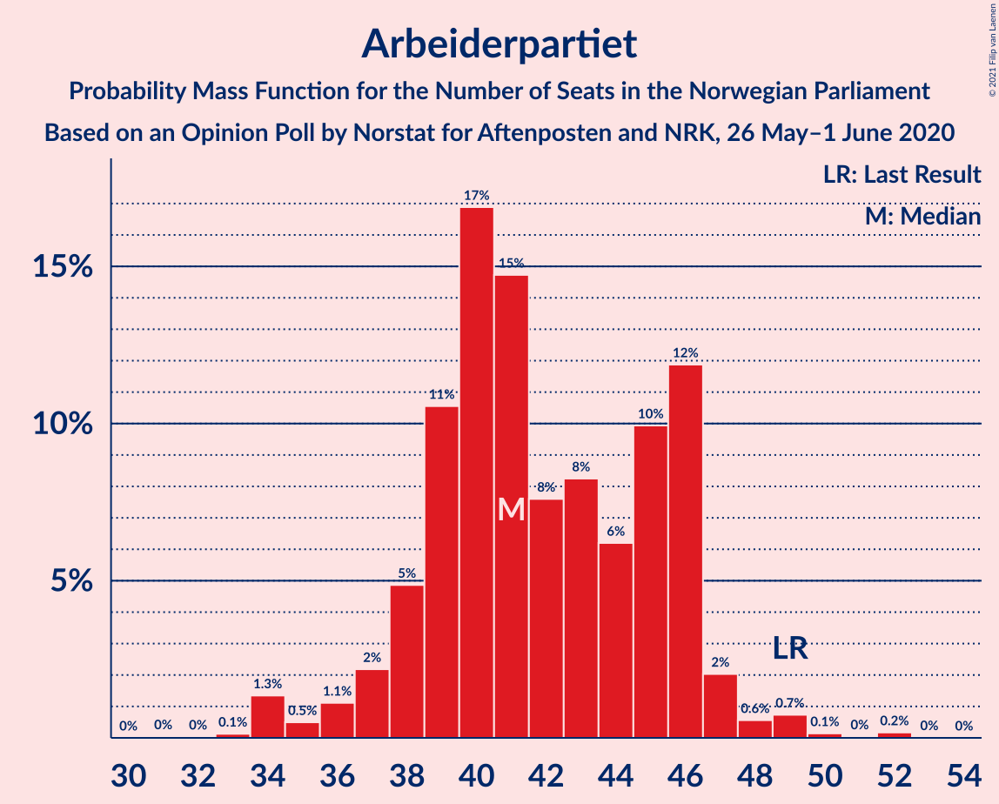
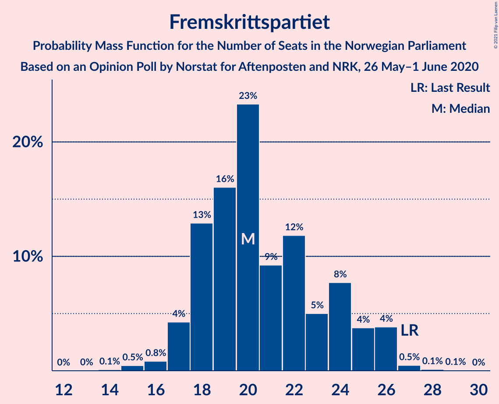
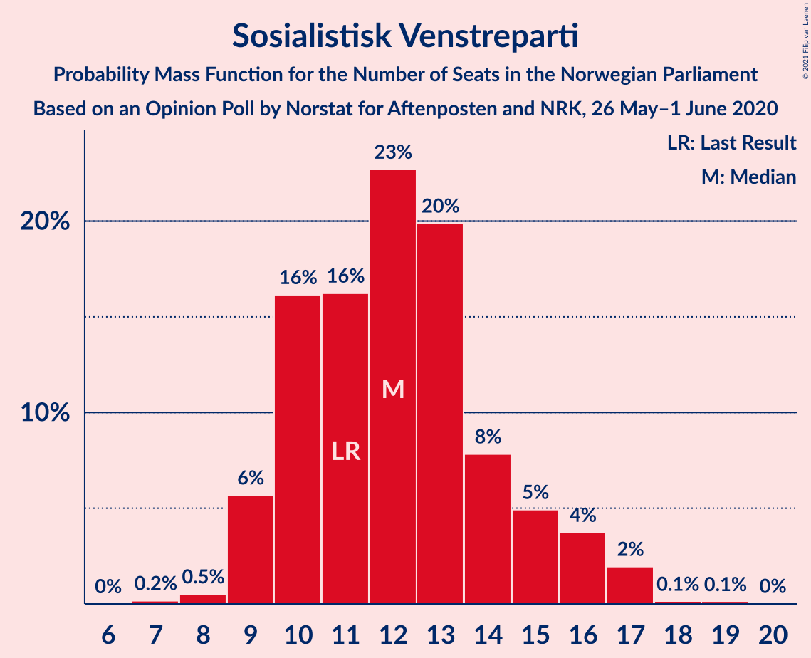
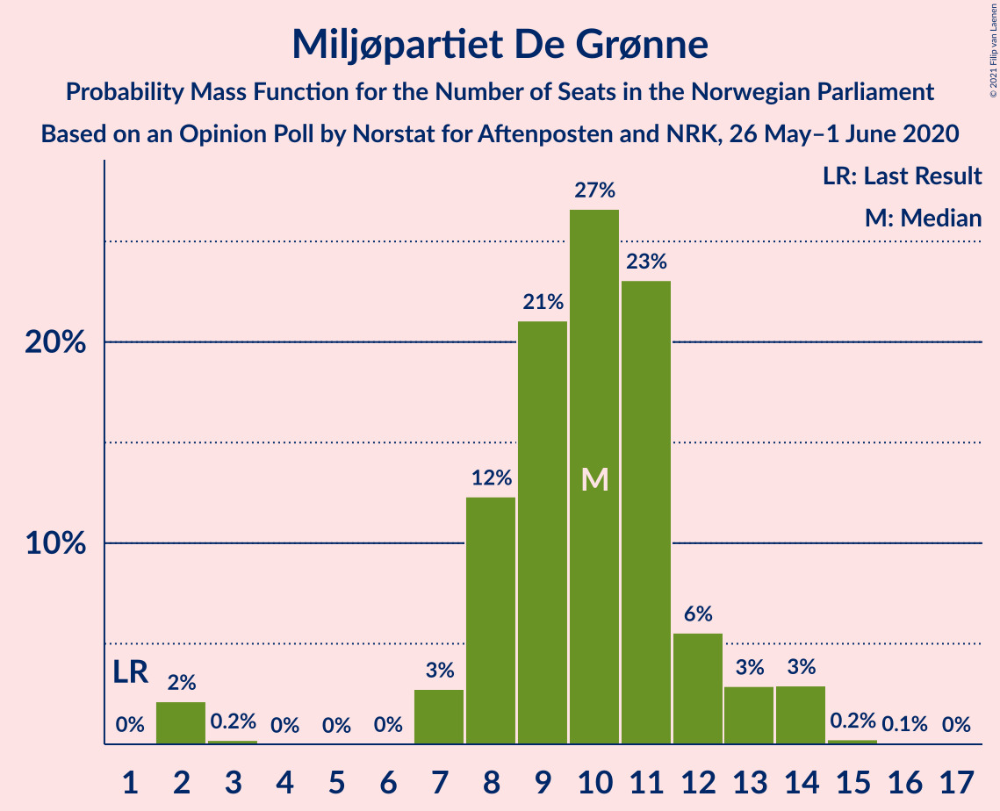
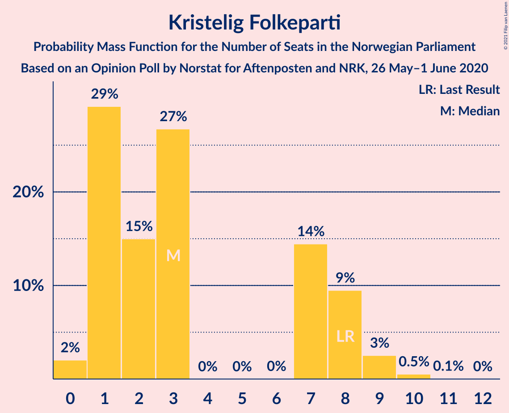
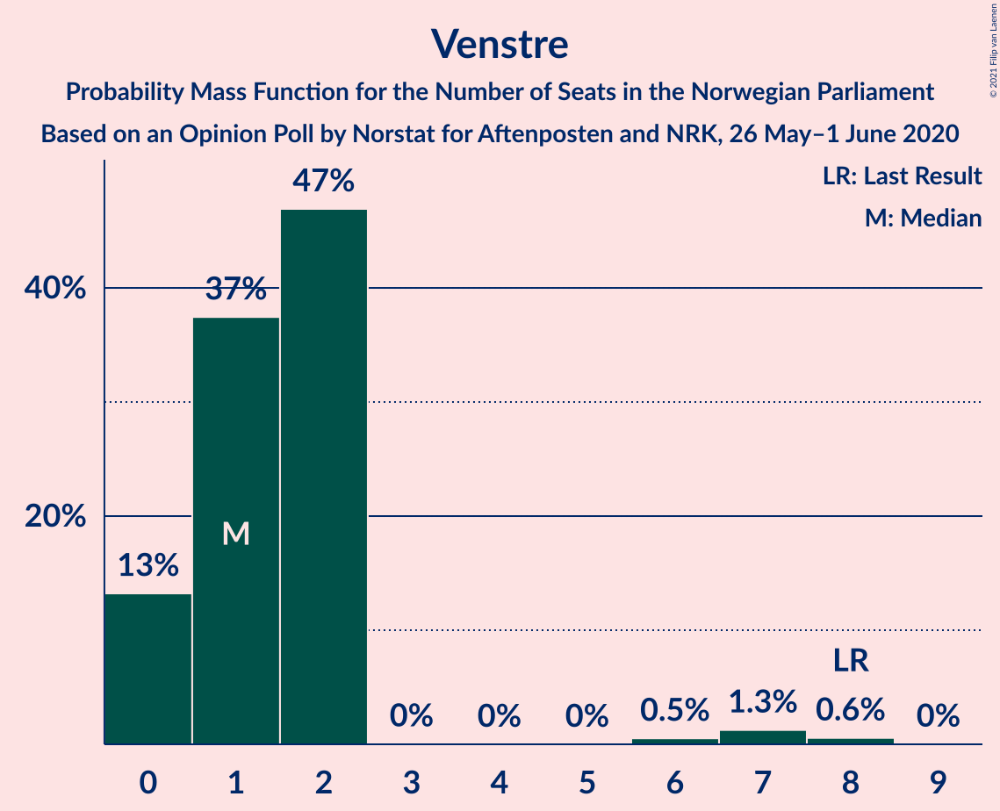

# Opinion Poll by Norstat for Aftenposten and NRK, 26 May–1 June 2020

<a href="#voting-intentions">Voting Intentions</a> | <a href="#seats">Seats</a> | <a href="#coalitions">Coalitions</a> | <a href="#technical-information">Technical Information</a>

## Voting Intentions

### Confidence Intervals

| Party | Last Result | Poll Result | 80% Confidence Interval | 90% Confidence Interval | 95% Confidence Interval | 99% Confidence Interval |
|:-----:|:-----------:|:-----------:|:-----------------------:|:-----------------------:|:-----------------------:|:-----------------------:|
| Høyre | 25.0% | 25.9% | 23.8–28.1% |23.2–28.7% |22.7–29.3% |21.8–30.3% |
| Arbeiderpartiet | 27.4% | 23.4% | 21.4–25.6% |20.9–26.2% |20.4–26.7% |19.5–27.8% |
| Senterpartiet | 10.3% | 14.6% | 13.0–16.4% |12.5–17.0% |12.2–17.4% |11.4–18.4% |
| Fremskrittspartiet | 15.2% | 12.0% | 10.5–13.7% |10.1–14.2% |9.8–14.6% |9.1–15.5% |
| Sosialistisk Venstreparti | 6.0% | 6.9% | 5.8–8.3% |5.5–8.7% |5.3–9.1% |4.8–9.8% |
| Miljøpartiet De Grønne | 3.2% | 5.6% | 4.6–6.9% |4.4–7.3% |4.1–7.6% |3.7–8.3% |
| Rødt | 2.4% | 4.8% | 3.9–6.0% |3.6–6.3% |3.4–6.6% |3.0–7.3% |
| Kristelig Folkeparti | 4.2% | 3.5% | 2.7–4.5% |2.5–4.8% |2.3–5.1% |2.0–5.7% |
| Venstre | 4.4% | 2.5% | 1.8–3.4% |1.7–3.7% |1.5–3.9% |1.3–4.4% |

*Note:* The poll result column reflects the actual value used in the calculations. Published results may vary slightly, and in addition be rounded to fewer digits.

## Seats

### Confidence Intervals

| Party | Last Result | Median | 80% Confidence Interval | 90% Confidence Interval | 95% Confidence Interval | 99% Confidence Interval |
|:-----:|:-----------:|:------:|:-----------------------:|:-----------------------:|:-----------------------:|:-----------------------:|
| <a href="#høyre">Høyre</a> | 45 | 45 | 41–51 |40–52 |39–52 |37–54 |
| <a href="#arbeiderpartiet">Arbeiderpartiet</a> | 49 | 41 | 38–46 |37–46 |36–47 |34–49 |
| <a href="#senterpartiet">Senterpartiet</a> | 19 | 26 | 22–32 |21–32 |21–32 |19–33 |
| <a href="#fremskrittspartiet">Fremskrittspartiet</a> | 27 | 20 | 18–24 |17–25 |17–26 |15–27 |
| <a href="#sosialistisk-venstreparti">Sosialistisk Venstreparti</a> | 11 | 12 | 10–15 |9–16 |9–16 |8–17 |
| <a href="#miljøpartiet-de-grønne">Miljøpartiet De Grønne</a> | 1 | 10 | 8–12 |7–13 |7–14 |2–14 |
| <a href="#rødt">Rødt</a> | 1 | 9 | 2–10 |2–11 |2–11 |1–12 |
| <a href="#kristelig-folkeparti">Kristelig Folkeparti</a> | 8 | 3 | 1–8 |1–8 |1–9 |0–10 |
| <a href="#venstre">Venstre</a> | 8 | 1 | 0–2 |0–2 |0–2 |0–8 |

### Høyre

*For a full overview of the results for this party, see the [Høyre](party-høyre.html) page.*

| Number of Seats | Probability | Accumulated | Special Marks |
|:---------------:|:-----------:|:-----------:|:-------------:|
| 35 | 0% | 100% |  |
| 36 | 0.1% | 99.9% |  |
| 37 | 0.6% | 99.8% |  |
| 38 | 0.6% | 99.3% |  |
| 39 | 1.4% | 98.7% |  |
| 40 | 5% | 97% |  |
| 41 | 8% | 92% |  |
| 42 | 4% | 84% |  |
| 43 | 11% | 80% |  |
| 44 | 7% | 70% |  |
| 45 | 16% | 63% | Last Result, Median |
| 46 | 10% | 47% |  |
| 47 | 13% | 38% |  |
| 48 | 3% | 25% |  |
| 49 | 7% | 22% |  |
| 50 | 3% | 15% |  |
| 51 | 3% | 11% |  |
| 52 | 7% | 8% |  |
| 53 | 0.4% | 1.2% |  |
| 54 | 0.6% | 0.9% |  |
| 55 | 0.1% | 0.3% |  |
| 56 | 0.1% | 0.2% |  |
| 57 | 0.1% | 0.1% |  |
| 58 | 0% | 0% |  |

### Arbeiderpartiet

*For a full overview of the results for this party, see the [Arbeiderpartiet](party-arbeiderpartiet.html) page.*

| Number of Seats | Probability | Accumulated | Special Marks |
|:---------------:|:-----------:|:-----------:|:-------------:|
| 31 | 0% | 100% |  |
| 32 | 0% | 99.9% |  |
| 33 | 0.1% | 99.9% |  |
| 34 | 1.3% | 99.8% |  |
| 35 | 0.5% | 98% |  |
| 36 | 1.1% | 98% |  |
| 37 | 2% | 97% |  |
| 38 | 5% | 95% |  |
| 39 | 11% | 90% |  |
| 40 | 17% | 79% |  |
| 41 | 15% | 62% | Median |
| 42 | 8% | 48% |  |
| 43 | 8% | 40% |  |
| 44 | 6% | 32% |  |
| 45 | 10% | 26% |  |
| 46 | 12% | 16% |  |
| 47 | 2% | 4% |  |
| 48 | 0.6% | 2% |  |
| 49 | 0.7% | 1.1% | Last Result |
| 50 | 0.1% | 0.4% |  |
| 51 | 0% | 0.3% |  |
| 52 | 0.2% | 0.2% |  |
| 53 | 0% | 0% |  |

### Senterpartiet

*For a full overview of the results for this party, see the [Senterpartiet](party-senterpartiet.html) page.*

| Number of Seats | Probability | Accumulated | Special Marks |
|:---------------:|:-----------:|:-----------:|:-------------:|
| 18 | 0.1% | 100% |  |
| 19 | 0.5% | 99.9% | Last Result |
| 20 | 1.4% | 99.3% |  |
| 21 | 4% | 98% |  |
| 22 | 6% | 94% |  |
| 23 | 3% | 89% |  |
| 24 | 9% | 85% |  |
| 25 | 19% | 76% |  |
| 26 | 8% | 57% | Median |
| 27 | 14% | 49% |  |
| 28 | 11% | 35% |  |
| 29 | 6% | 24% |  |
| 30 | 4% | 18% |  |
| 31 | 3% | 13% |  |
| 32 | 9% | 11% |  |
| 33 | 0.9% | 1.3% |  |
| 34 | 0.2% | 0.5% |  |
| 35 | 0.2% | 0.2% |  |
| 36 | 0.1% | 0.1% |  |
| 37 | 0% | 0% |  |

### Fremskrittspartiet

*For a full overview of the results for this party, see the [Fremskrittspartiet](party-fremskrittspartiet.html) page.*

| Number of Seats | Probability | Accumulated | Special Marks |
|:---------------:|:-----------:|:-----------:|:-------------:|
| 14 | 0.1% | 100% |  |
| 15 | 0.5% | 99.9% |  |
| 16 | 0.8% | 99.4% |  |
| 17 | 4% | 98.6% |  |
| 18 | 13% | 94% |  |
| 19 | 16% | 81% |  |
| 20 | 23% | 65% | Median |
| 21 | 9% | 42% |  |
| 22 | 12% | 33% |  |
| 23 | 5% | 21% |  |
| 24 | 8% | 16% |  |
| 25 | 4% | 8% |  |
| 26 | 4% | 5% |  |
| 27 | 0.5% | 0.7% | Last Result |
| 28 | 0.1% | 0.2% |  |
| 29 | 0.1% | 0.1% |  |
| 30 | 0% | 0% |  |

### Sosialistisk Venstreparti

*For a full overview of the results for this party, see the [Sosialistisk Venstreparti](party-sosialistiskvenstreparti.html) page.*

| Number of Seats | Probability | Accumulated | Special Marks |
|:---------------:|:-----------:|:-----------:|:-------------:|
| 7 | 0.2% | 100% |  |
| 8 | 0.5% | 99.8% |  |
| 9 | 6% | 99.3% |  |
| 10 | 16% | 94% |  |
| 11 | 16% | 77% | Last Result |
| 12 | 23% | 61% | Median |
| 13 | 20% | 39% |  |
| 14 | 8% | 19% |  |
| 15 | 5% | 11% |  |
| 16 | 4% | 6% |  |
| 17 | 2% | 2% |  |
| 18 | 0.1% | 0.2% |  |
| 19 | 0.1% | 0.1% |  |
| 20 | 0% | 0% |  |

### Miljøpartiet De Grønne

*For a full overview of the results for this party, see the [Miljøpartiet De Grønne](party-miljøpartietdegrønne.html) page.*

| Number of Seats | Probability | Accumulated | Special Marks |
|:---------------:|:-----------:|:-----------:|:-------------:|
| 1 | 0% | 100% | Last Result |
| 2 | 2% | 100% |  |
| 3 | 0.2% | 98% |  |
| 4 | 0% | 98% |  |
| 5 | 0% | 98% |  |
| 6 | 0% | 98% |  |
| 7 | 3% | 98% |  |
| 8 | 12% | 95% |  |
| 9 | 21% | 82% |  |
| 10 | 27% | 61% | Median |
| 11 | 23% | 35% |  |
| 12 | 6% | 12% |  |
| 13 | 3% | 6% |  |
| 14 | 3% | 3% |  |
| 15 | 0.2% | 0.4% |  |
| 16 | 0.1% | 0.1% |  |
| 17 | 0% | 0% |  |

### Rødt

*For a full overview of the results for this party, see the [Rødt](party-rødt.html) page.*

| Number of Seats | Probability | Accumulated | Special Marks |
|:---------------:|:-----------:|:-----------:|:-------------:|
| 1 | 0.5% | 100% | Last Result |
| 2 | 17% | 99.5% |  |
| 3 | 0% | 82% |  |
| 4 | 0% | 82% |  |
| 5 | 0% | 82% |  |
| 6 | 0% | 82% |  |
| 7 | 19% | 82% |  |
| 8 | 12% | 63% |  |
| 9 | 24% | 50% | Median |
| 10 | 17% | 27% |  |
| 11 | 7% | 9% |  |
| 12 | 2% | 2% |  |
| 13 | 0.2% | 0.4% |  |
| 14 | 0.1% | 0.2% |  |
| 15 | 0.1% | 0.1% |  |
| 16 | 0% | 0% |  |

### Kristelig Folkeparti

*For a full overview of the results for this party, see the [Kristelig Folkeparti](party-kristeligfolkeparti.html) page.*

| Number of Seats | Probability | Accumulated | Special Marks |
|:---------------:|:-----------:|:-----------:|:-------------:|
| 0 | 2% | 100% |  |
| 1 | 29% | 98% |  |
| 2 | 15% | 69% |  |
| 3 | 27% | 54% | Median |
| 4 | 0% | 27% |  |
| 5 | 0% | 27% |  |
| 6 | 0% | 27% |  |
| 7 | 14% | 27% |  |
| 8 | 9% | 13% | Last Result |
| 9 | 3% | 3% |  |
| 10 | 0.5% | 0.6% |  |
| 11 | 0.1% | 0.1% |  |
| 12 | 0% | 0% |  |

### Venstre

*For a full overview of the results for this party, see the [Venstre](party-venstre.html) page.*

| Number of Seats | Probability | Accumulated | Special Marks |
|:---------------:|:-----------:|:-----------:|:-------------:|
| 0 | 13% | 100% |  |
| 1 | 37% | 87% | Median |
| 2 | 47% | 49% |  |
| 3 | 0% | 2% |  |
| 4 | 0% | 2% |  |
| 5 | 0% | 2% |  |
| 6 | 0.5% | 2% |  |
| 7 | 1.3% | 2% |  |
| 8 | 0.6% | 0.6% | Last Result |
| 9 | 0% | 0% |  |

## Coalitions

### Confidence Intervals

| Coalition | Last Result | Median | Majority? | 80% Confidence Interval | 90% Confidence Interval | 95% Confidence Interval | 99% Confidence Interval |
|:---------:|:-----------:|:------:|:---------:|:-----------------------:|:-----------------------:|:-----------------------:|:-----------------------:|
| Arbeiderpartiet – Senterpartiet – Sosialistisk Venstreparti – Miljøpartiet De Grønne – Rødt | 81 | 98 | 99.9% | 92–103 | 91–104 | 90–105 | 88–107 |
| Høyre – Senterpartiet – Fremskrittspartiet – Kristelig Folkeparti – Venstre | 107 | 99 | 100% | 93–101 | 91–103 | 89–104 | 89–108 |
| Arbeiderpartiet – Senterpartiet – Sosialistisk Venstreparti – Miljøpartiet De Grønne – Kristelig Folkeparti | 88 | 93 | 98.8% | 88–100 | 86–100 | 86–101 | 84–104 |
| Arbeiderpartiet – Senterpartiet – Sosialistisk Venstreparti – Miljøpartiet De Grønne | 80 | 91 | 87% | 84–95 | 83–97 | 81–98 | 80–99 |
| Arbeiderpartiet – Senterpartiet – Sosialistisk Venstreparti – Rødt | 80 | 88 | 82% | 83–93 | 81–94 | 80–95 | 78–97 |
| Høyre – Fremskrittspartiet – Miljøpartiet De Grønne – Kristelig Folkeparti – Venstre | 89 | 81 | 18% | 76–86 | 75–88 | 74–89 | 72–91 |
| Arbeiderpartiet – Senterpartiet – Miljøpartiet De Grønne – Kristelig Folkeparti | 77 | 82 | 19% | 76–88 | 74–89 | 73–89 | 71–92 |
| Arbeiderpartiet – Senterpartiet – Sosialistisk Venstreparti | 79 | 81 | 11% | 75–85 | 73–87 | 72–87 | 71–90 |
| Arbeiderpartiet – Senterpartiet – Kristelig Folkeparti | 76 | 72 | 0% | 66–78 | 65–78 | 64–80 | 62–82 |
| Høyre – Fremskrittspartiet – Kristelig Folkeparti – Venstre | 88 | 71 | 0.1% | 66–77 | 65–78 | 64–79 | 62–81 |
| Arbeiderpartiet – Senterpartiet | 68 | 69 | 0% | 63–72 | 62–74 | 61–75 | 59–77 |
| Høyre – Fremskrittspartiet – Venstre | 80 | 68 | 0% | 62–73 | 60–74 | 60–75 | 58–78 |
| Høyre – Fremskrittspartiet | 72 | 66 | 0% | 60–71 | 59–72 | 59–73 | 56–76 |
| Arbeiderpartiet – Sosialistisk Venstreparti | 60 | 54 | 0% | 50–59 | 49–60 | 47–60 | 45–62 |
| Høyre – Kristelig Folkeparti – Venstre | 61 | 50 | 0% | 46–56 | 44–57 | 43–59 | 42–61 |
| Senterpartiet – Kristelig Folkeparti – Venstre | 35 | 31 | 0% | 27–36 | 26–36 | 26–39 | 23–42 |

### Arbeiderpartiet – Senterpartiet – Sosialistisk Venstreparti – Miljøpartiet De Grønne – Rødt

| Number of Seats | Probability | Accumulated | Special Marks |
|:---------------:|:-----------:|:-----------:|:-------------:|
| 81 | 0% | 100% | Last Result |
| 82 | 0% | 100% |  |
| 83 | 0% | 100% |  |
| 84 | 0% | 100% |  |
| 85 | 0% | 99.9% | Majority |
| 86 | 0.2% | 99.9% |  |
| 87 | 0.2% | 99.7% |  |
| 88 | 0.6% | 99.5% |  |
| 89 | 0.9% | 98.9% |  |
| 90 | 0.8% | 98% |  |
| 91 | 4% | 97% |  |
| 92 | 6% | 93% |  |
| 93 | 3% | 87% |  |
| 94 | 3% | 84% |  |
| 95 | 11% | 81% |  |
| 96 | 3% | 70% |  |
| 97 | 13% | 67% |  |
| 98 | 10% | 54% | Median |
| 99 | 6% | 44% |  |
| 100 | 4% | 37% |  |
| 101 | 11% | 33% |  |
| 102 | 12% | 22% |  |
| 103 | 3% | 10% |  |
| 104 | 4% | 7% |  |
| 105 | 2% | 3% |  |
| 106 | 0.8% | 2% |  |
| 107 | 0.4% | 0.8% |  |
| 108 | 0.1% | 0.4% |  |
| 109 | 0.2% | 0.3% |  |
| 110 | 0% | 0.1% |  |
| 111 | 0% | 0% |  |

### Høyre – Senterpartiet – Fremskrittspartiet – Kristelig Folkeparti – Venstre

| Number of Seats | Probability | Accumulated | Special Marks |
|:---------------:|:-----------:|:-----------:|:-------------:|
| 85 | 0.1% | 100% | Majority |
| 86 | 0% | 99.9% |  |
| 87 | 0.2% | 99.9% |  |
| 88 | 0.2% | 99.7% |  |
| 89 | 3% | 99.5% |  |
| 90 | 0.7% | 97% |  |
| 91 | 1.1% | 96% |  |
| 92 | 4% | 95% |  |
| 93 | 8% | 91% |  |
| 94 | 7% | 83% |  |
| 95 | 3% | 76% | Median |
| 96 | 3% | 73% |  |
| 97 | 12% | 70% |  |
| 98 | 6% | 58% |  |
| 99 | 25% | 52% |  |
| 100 | 12% | 27% |  |
| 101 | 6% | 15% |  |
| 102 | 2% | 10% |  |
| 103 | 4% | 8% |  |
| 104 | 2% | 4% |  |
| 105 | 0.7% | 2% |  |
| 106 | 0.5% | 2% |  |
| 107 | 0.5% | 1.3% | Last Result |
| 108 | 0.3% | 0.8% |  |
| 109 | 0.4% | 0.5% |  |
| 110 | 0% | 0.1% |  |
| 111 | 0% | 0% |  |

### Arbeiderpartiet – Senterpartiet – Sosialistisk Venstreparti – Miljøpartiet De Grønne – Kristelig Folkeparti

| Number of Seats | Probability | Accumulated | Special Marks |
|:---------------:|:-----------:|:-----------:|:-------------:|
| 81 | 0% | 100% |  |
| 82 | 0.3% | 99.9% |  |
| 83 | 0.1% | 99.6% |  |
| 84 | 0.7% | 99.5% |  |
| 85 | 0.9% | 98.8% | Majority |
| 86 | 3% | 98% |  |
| 87 | 3% | 95% |  |
| 88 | 2% | 92% | Last Result |
| 89 | 5% | 90% |  |
| 90 | 4% | 85% |  |
| 91 | 7% | 81% |  |
| 92 | 5% | 74% | Median |
| 93 | 22% | 69% |  |
| 94 | 2% | 47% |  |
| 95 | 17% | 45% |  |
| 96 | 5% | 28% |  |
| 97 | 4% | 23% |  |
| 98 | 7% | 19% |  |
| 99 | 1.0% | 12% |  |
| 100 | 8% | 11% |  |
| 101 | 2% | 3% |  |
| 102 | 0.6% | 1.4% |  |
| 103 | 0.1% | 0.7% |  |
| 104 | 0.1% | 0.6% |  |
| 105 | 0.1% | 0.5% |  |
| 106 | 0.3% | 0.4% |  |
| 107 | 0.1% | 0.1% |  |
| 108 | 0% | 0% |  |

### Arbeiderpartiet – Senterpartiet – Sosialistisk Venstreparti – Miljøpartiet De Grønne

| Number of Seats | Probability | Accumulated | Special Marks |
|:---------------:|:-----------:|:-----------:|:-------------:|
| 77 | 0% | 100% |  |
| 78 | 0.1% | 99.9% |  |
| 79 | 0.2% | 99.8% |  |
| 80 | 0.7% | 99.7% | Last Result |
| 81 | 2% | 99.0% |  |
| 82 | 2% | 97% |  |
| 83 | 4% | 95% |  |
| 84 | 4% | 91% |  |
| 85 | 3% | 87% | Majority |
| 86 | 3% | 84% |  |
| 87 | 3% | 81% |  |
| 88 | 5% | 78% |  |
| 89 | 4% | 74% | Median |
| 90 | 18% | 70% |  |
| 91 | 7% | 52% |  |
| 92 | 19% | 45% |  |
| 93 | 11% | 27% |  |
| 94 | 3% | 16% |  |
| 95 | 5% | 13% |  |
| 96 | 2% | 8% |  |
| 97 | 2% | 6% |  |
| 98 | 2% | 3% |  |
| 99 | 0.7% | 1.2% |  |
| 100 | 0.2% | 0.5% |  |
| 101 | 0.1% | 0.3% |  |
| 102 | 0% | 0.2% |  |
| 103 | 0.1% | 0.1% |  |
| 104 | 0% | 0.1% |  |
| 105 | 0% | 0% |  |

### Arbeiderpartiet – Senterpartiet – Sosialistisk Venstreparti – Rødt

| Number of Seats | Probability | Accumulated | Special Marks |
|:---------------:|:-----------:|:-----------:|:-------------:|
| 74 | 0.1% | 100% |  |
| 75 | 0% | 99.9% |  |
| 76 | 0.2% | 99.8% |  |
| 77 | 0.1% | 99.7% |  |
| 78 | 0.4% | 99.6% |  |
| 79 | 0.9% | 99.2% |  |
| 80 | 2% | 98% | Last Result |
| 81 | 2% | 97% |  |
| 82 | 2% | 94% |  |
| 83 | 5% | 92% |  |
| 84 | 5% | 87% |  |
| 85 | 4% | 82% | Majority |
| 86 | 18% | 77% |  |
| 87 | 4% | 59% |  |
| 88 | 10% | 55% | Median |
| 89 | 5% | 45% |  |
| 90 | 9% | 40% |  |
| 91 | 8% | 31% |  |
| 92 | 12% | 24% |  |
| 93 | 2% | 11% |  |
| 94 | 4% | 9% |  |
| 95 | 3% | 4% |  |
| 96 | 0.4% | 1.5% |  |
| 97 | 0.6% | 1.0% |  |
| 98 | 0.2% | 0.5% |  |
| 99 | 0% | 0.2% |  |
| 100 | 0.1% | 0.2% |  |
| 101 | 0% | 0.1% |  |
| 102 | 0% | 0% |  |

### Høyre – Fremskrittspartiet – Miljøpartiet De Grønne – Kristelig Folkeparti – Venstre

| Number of Seats | Probability | Accumulated | Special Marks |
|:---------------:|:-----------:|:-----------:|:-------------:|
| 68 | 0% | 100% |  |
| 69 | 0.1% | 99.9% |  |
| 70 | 0% | 99.8% |  |
| 71 | 0.2% | 99.8% |  |
| 72 | 0.6% | 99.5% |  |
| 73 | 0.4% | 99.0% |  |
| 74 | 3% | 98.5% |  |
| 75 | 4% | 96% |  |
| 76 | 2% | 91% |  |
| 77 | 12% | 89% |  |
| 78 | 8% | 76% |  |
| 79 | 9% | 69% | Median |
| 80 | 5% | 60% |  |
| 81 | 10% | 55% |  |
| 82 | 4% | 45% |  |
| 83 | 18% | 41% |  |
| 84 | 4% | 23% |  |
| 85 | 5% | 18% | Majority |
| 86 | 5% | 13% |  |
| 87 | 2% | 8% |  |
| 88 | 2% | 6% |  |
| 89 | 2% | 3% | Last Result |
| 90 | 0.9% | 2% |  |
| 91 | 0.4% | 0.8% |  |
| 92 | 0.1% | 0.4% |  |
| 93 | 0.2% | 0.3% |  |
| 94 | 0% | 0.2% |  |
| 95 | 0.1% | 0.1% |  |
| 96 | 0% | 0% |  |

### Arbeiderpartiet – Senterpartiet – Miljøpartiet De Grønne – Kristelig Folkeparti

| Number of Seats | Probability | Accumulated | Special Marks |
|:---------------:|:-----------:|:-----------:|:-------------:|
| 69 | 0% | 100% |  |
| 70 | 0.1% | 99.9% |  |
| 71 | 0.4% | 99.8% |  |
| 72 | 0.1% | 99.4% |  |
| 73 | 2% | 99.3% |  |
| 74 | 5% | 97% |  |
| 75 | 2% | 93% |  |
| 76 | 3% | 91% |  |
| 77 | 2% | 88% | Last Result |
| 78 | 7% | 86% |  |
| 79 | 2% | 80% |  |
| 80 | 10% | 78% | Median |
| 81 | 13% | 68% |  |
| 82 | 17% | 54% |  |
| 83 | 12% | 37% |  |
| 84 | 7% | 25% |  |
| 85 | 2% | 19% | Majority |
| 86 | 5% | 16% |  |
| 87 | 1.5% | 12% |  |
| 88 | 2% | 10% |  |
| 89 | 6% | 8% |  |
| 90 | 1.0% | 2% |  |
| 91 | 0.4% | 1.1% |  |
| 92 | 0.6% | 0.7% |  |
| 93 | 0% | 0.1% |  |
| 94 | 0% | 0.1% |  |
| 95 | 0% | 0% |  |

### Arbeiderpartiet – Senterpartiet – Sosialistisk Venstreparti

| Number of Seats | Probability | Accumulated | Special Marks |
|:---------------:|:-----------:|:-----------:|:-------------:|
| 68 | 0.1% | 100% |  |
| 69 | 0.1% | 99.9% |  |
| 70 | 0.1% | 99.8% |  |
| 71 | 0.8% | 99.6% |  |
| 72 | 2% | 98.9% |  |
| 73 | 3% | 97% |  |
| 74 | 4% | 94% |  |
| 75 | 3% | 90% |  |
| 76 | 5% | 87% |  |
| 77 | 2% | 83% |  |
| 78 | 6% | 80% |  |
| 79 | 13% | 74% | Last Result, Median |
| 80 | 5% | 61% |  |
| 81 | 13% | 56% |  |
| 82 | 14% | 42% |  |
| 83 | 5% | 29% |  |
| 84 | 12% | 23% |  |
| 85 | 4% | 11% | Majority |
| 86 | 1.4% | 8% |  |
| 87 | 4% | 6% |  |
| 88 | 0.7% | 2% |  |
| 89 | 0.6% | 1.2% |  |
| 90 | 0.4% | 0.6% |  |
| 91 | 0.1% | 0.2% |  |
| 92 | 0.1% | 0.2% |  |
| 93 | 0% | 0.1% |  |
| 94 | 0% | 0% |  |

### Arbeiderpartiet – Senterpartiet – Kristelig Folkeparti

| Number of Seats | Probability | Accumulated | Special Marks |
|:---------------:|:-----------:|:-----------:|:-------------:|
| 60 | 0% | 100% |  |
| 61 | 0.1% | 99.9% |  |
| 62 | 0.9% | 99.9% |  |
| 63 | 1.4% | 98.9% |  |
| 64 | 0.8% | 98% |  |
| 65 | 4% | 97% |  |
| 66 | 3% | 92% |  |
| 67 | 4% | 89% |  |
| 68 | 5% | 86% |  |
| 69 | 4% | 80% |  |
| 70 | 12% | 76% | Median |
| 71 | 4% | 64% |  |
| 72 | 12% | 60% |  |
| 73 | 21% | 48% |  |
| 74 | 6% | 26% |  |
| 75 | 5% | 20% |  |
| 76 | 5% | 16% | Last Result |
| 77 | 1.0% | 11% |  |
| 78 | 6% | 10% |  |
| 79 | 0.3% | 4% |  |
| 80 | 2% | 3% |  |
| 81 | 0.6% | 2% |  |
| 82 | 0.9% | 1.1% |  |
| 83 | 0.1% | 0.2% |  |
| 84 | 0% | 0.1% |  |
| 85 | 0% | 0% | Majority |

### Høyre – Fremskrittspartiet – Kristelig Folkeparti – Venstre

| Number of Seats | Probability | Accumulated | Special Marks |
|:---------------:|:-----------:|:-----------:|:-------------:|
| 59 | 0% | 100% |  |
| 60 | 0.2% | 99.9% |  |
| 61 | 0.1% | 99.7% |  |
| 62 | 0.4% | 99.6% |  |
| 63 | 0.8% | 99.2% |  |
| 64 | 2% | 98% |  |
| 65 | 4% | 97% |  |
| 66 | 3% | 93% |  |
| 67 | 12% | 90% |  |
| 68 | 11% | 78% |  |
| 69 | 4% | 67% | Median |
| 70 | 6% | 63% |  |
| 71 | 10% | 56% |  |
| 72 | 13% | 46% |  |
| 73 | 3% | 33% |  |
| 74 | 11% | 30% |  |
| 75 | 3% | 19% |  |
| 76 | 3% | 16% |  |
| 77 | 6% | 13% |  |
| 78 | 4% | 7% |  |
| 79 | 0.8% | 3% |  |
| 80 | 0.9% | 2% |  |
| 81 | 0.6% | 1.1% |  |
| 82 | 0.2% | 0.5% |  |
| 83 | 0.2% | 0.3% |  |
| 84 | 0% | 0.1% |  |
| 85 | 0% | 0.1% | Majority |
| 86 | 0% | 0% |  |
| 87 | 0% | 0% |  |
| 88 | 0% | 0% | Last Result |

### Arbeiderpartiet – Senterpartiet

| Number of Seats | Probability | Accumulated | Special Marks |
|:---------------:|:-----------:|:-----------:|:-------------:|
| 56 | 0% | 100% |  |
| 57 | 0.1% | 99.9% |  |
| 58 | 0.1% | 99.9% |  |
| 59 | 0.3% | 99.8% |  |
| 60 | 2% | 99.4% |  |
| 61 | 0.7% | 98% |  |
| 62 | 6% | 97% |  |
| 63 | 2% | 91% |  |
| 64 | 7% | 89% |  |
| 65 | 3% | 82% |  |
| 66 | 7% | 79% |  |
| 67 | 16% | 72% | Median |
| 68 | 6% | 56% | Last Result |
| 69 | 6% | 50% |  |
| 70 | 7% | 44% |  |
| 71 | 15% | 37% |  |
| 72 | 13% | 22% |  |
| 73 | 4% | 9% |  |
| 74 | 1.2% | 5% |  |
| 75 | 3% | 4% |  |
| 76 | 0.4% | 0.9% |  |
| 77 | 0.1% | 0.6% |  |
| 78 | 0.3% | 0.5% |  |
| 79 | 0.1% | 0.2% |  |
| 80 | 0.1% | 0.1% |  |
| 81 | 0% | 0.1% |  |
| 82 | 0% | 0% |  |

### Høyre – Fremskrittspartiet – Venstre

| Number of Seats | Probability | Accumulated | Special Marks |
|:---------------:|:-----------:|:-----------:|:-------------:|
| 55 | 0.1% | 100% |  |
| 56 | 0.3% | 99.9% |  |
| 57 | 0.1% | 99.6% |  |
| 58 | 0.9% | 99.6% |  |
| 59 | 0.4% | 98.7% |  |
| 60 | 4% | 98% |  |
| 61 | 1.3% | 94% |  |
| 62 | 4% | 93% |  |
| 63 | 2% | 88% |  |
| 64 | 6% | 86% |  |
| 65 | 8% | 80% |  |
| 66 | 14% | 72% | Median |
| 67 | 6% | 58% |  |
| 68 | 6% | 52% |  |
| 69 | 17% | 45% |  |
| 70 | 6% | 29% |  |
| 71 | 2% | 23% |  |
| 72 | 11% | 21% |  |
| 73 | 2% | 11% |  |
| 74 | 6% | 9% |  |
| 75 | 1.0% | 3% |  |
| 76 | 1.1% | 2% |  |
| 77 | 0.2% | 0.8% |  |
| 78 | 0.3% | 0.6% |  |
| 79 | 0.2% | 0.3% |  |
| 80 | 0.1% | 0.1% | Last Result |
| 81 | 0% | 0% |  |

### Høyre – Fremskrittspartiet

| Number of Seats | Probability | Accumulated | Special Marks |
|:---------------:|:-----------:|:-----------:|:-------------:|
| 53 | 0% | 100% |  |
| 54 | 0% | 99.9% |  |
| 55 | 0.3% | 99.9% |  |
| 56 | 0.3% | 99.6% |  |
| 57 | 0.8% | 99.3% |  |
| 58 | 0.4% | 98.5% |  |
| 59 | 5% | 98% |  |
| 60 | 4% | 93% |  |
| 61 | 3% | 89% |  |
| 62 | 5% | 86% |  |
| 63 | 8% | 81% |  |
| 64 | 5% | 73% |  |
| 65 | 12% | 68% | Median |
| 66 | 9% | 56% |  |
| 67 | 11% | 47% |  |
| 68 | 2% | 36% |  |
| 69 | 13% | 34% |  |
| 70 | 2% | 20% |  |
| 71 | 10% | 19% |  |
| 72 | 5% | 9% | Last Result |
| 73 | 2% | 4% |  |
| 74 | 0.9% | 2% |  |
| 75 | 0.4% | 1.1% |  |
| 76 | 0.3% | 0.7% |  |
| 77 | 0.2% | 0.4% |  |
| 78 | 0.1% | 0.2% |  |
| 79 | 0.1% | 0.1% |  |
| 80 | 0% | 0% |  |

### Arbeiderpartiet – Sosialistisk Venstreparti

| Number of Seats | Probability | Accumulated | Special Marks |
|:---------------:|:-----------:|:-----------:|:-------------:|
| 43 | 0.1% | 100% |  |
| 44 | 0.4% | 99.9% |  |
| 45 | 0.3% | 99.5% |  |
| 46 | 0.8% | 99.3% |  |
| 47 | 2% | 98% |  |
| 48 | 1.0% | 96% |  |
| 49 | 2% | 95% |  |
| 50 | 13% | 93% |  |
| 51 | 10% | 80% |  |
| 52 | 13% | 70% |  |
| 53 | 5% | 57% | Median |
| 54 | 12% | 53% |  |
| 55 | 5% | 40% |  |
| 56 | 8% | 36% |  |
| 57 | 4% | 28% |  |
| 58 | 8% | 23% |  |
| 59 | 9% | 16% |  |
| 60 | 5% | 7% | Last Result |
| 61 | 0.6% | 1.3% |  |
| 62 | 0.2% | 0.7% |  |
| 63 | 0.1% | 0.4% |  |
| 64 | 0.3% | 0.3% |  |
| 65 | 0% | 0.1% |  |
| 66 | 0% | 0.1% |  |
| 67 | 0% | 0% |  |

### Høyre – Kristelig Folkeparti – Venstre

| Number of Seats | Probability | Accumulated | Special Marks |
|:---------------:|:-----------:|:-----------:|:-------------:|
| 40 | 0.1% | 100% |  |
| 41 | 0.2% | 99.9% |  |
| 42 | 0.5% | 99.8% |  |
| 43 | 4% | 99.2% |  |
| 44 | 2% | 96% |  |
| 45 | 2% | 93% |  |
| 46 | 3% | 91% |  |
| 47 | 12% | 88% |  |
| 48 | 12% | 76% |  |
| 49 | 4% | 64% | Median |
| 50 | 17% | 60% |  |
| 51 | 6% | 43% |  |
| 52 | 11% | 37% |  |
| 53 | 4% | 26% |  |
| 54 | 3% | 22% |  |
| 55 | 7% | 19% |  |
| 56 | 4% | 11% |  |
| 57 | 3% | 8% |  |
| 58 | 2% | 5% |  |
| 59 | 1.2% | 3% |  |
| 60 | 1.2% | 2% |  |
| 61 | 0.5% | 0.7% | Last Result |
| 62 | 0.1% | 0.2% |  |
| 63 | 0% | 0.2% |  |
| 64 | 0.1% | 0.1% |  |
| 65 | 0.1% | 0.1% |  |
| 66 | 0% | 0% |  |

### Senterpartiet – Kristelig Folkeparti – Venstre

| Number of Seats | Probability | Accumulated | Special Marks |
|:---------------:|:-----------:|:-----------:|:-------------:|
| 22 | 0.2% | 100% |  |
| 23 | 0.5% | 99.8% |  |
| 24 | 0.7% | 99.3% |  |
| 25 | 1.0% | 98.7% |  |
| 26 | 7% | 98% |  |
| 27 | 3% | 90% |  |
| 28 | 14% | 87% |  |
| 29 | 5% | 73% |  |
| 30 | 10% | 68% | Median |
| 31 | 11% | 58% |  |
| 32 | 4% | 47% |  |
| 33 | 6% | 43% |  |
| 34 | 21% | 37% |  |
| 35 | 2% | 16% | Last Result |
| 36 | 9% | 14% |  |
| 37 | 2% | 5% |  |
| 38 | 0.9% | 3% |  |
| 39 | 2% | 3% |  |
| 40 | 0.3% | 1.1% |  |
| 41 | 0.2% | 0.8% |  |
| 42 | 0.5% | 0.6% |  |
| 43 | 0.1% | 0.1% |  |
| 44 | 0% | 0.1% |  |
| 45 | 0% | 0% |  |

## Technical Information

### Opinion Poll

+ **Polling firm:** Norstat
+ **Commissioner(s):** Aftenposten and NRK
+ **Fieldwork period:** 26 May–1 June 2020

### Calculations

+ **Sample size:** 692
+ **Simulations done:** 262,144
+ **Error estimate:** 2.61%

