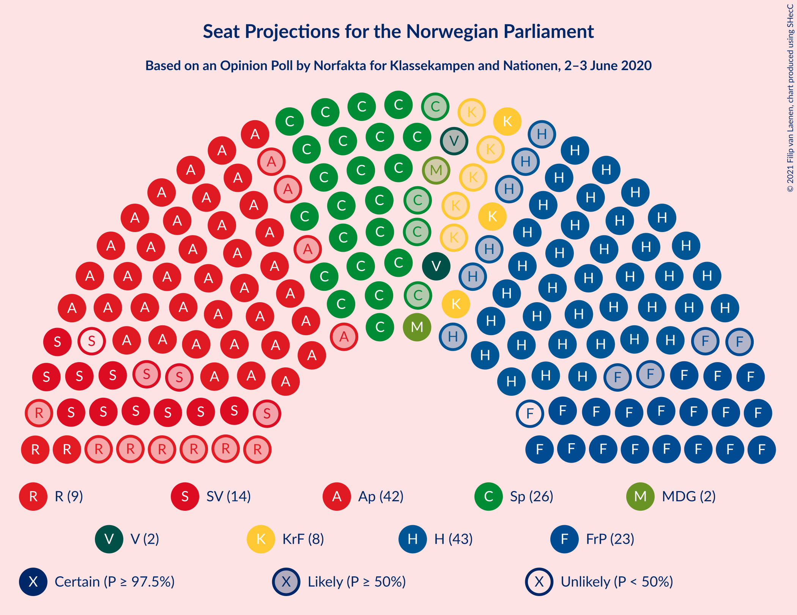
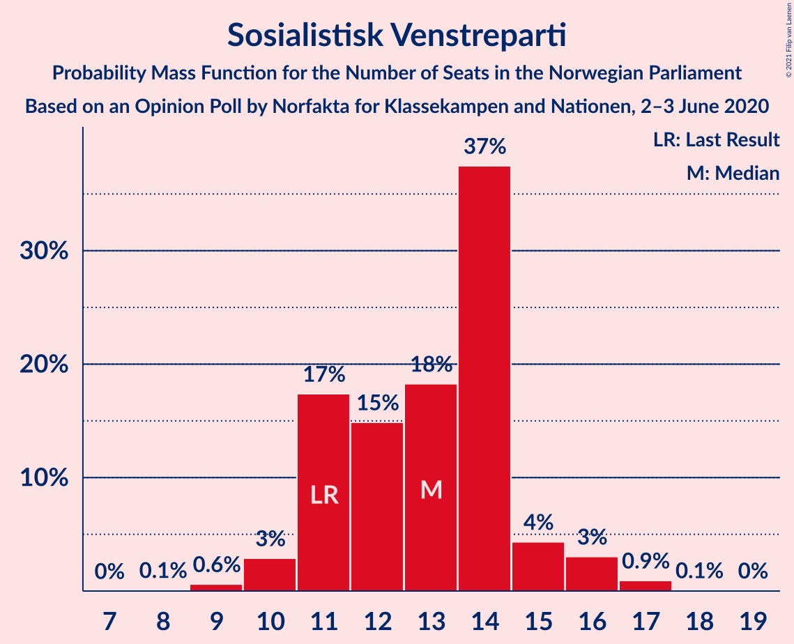
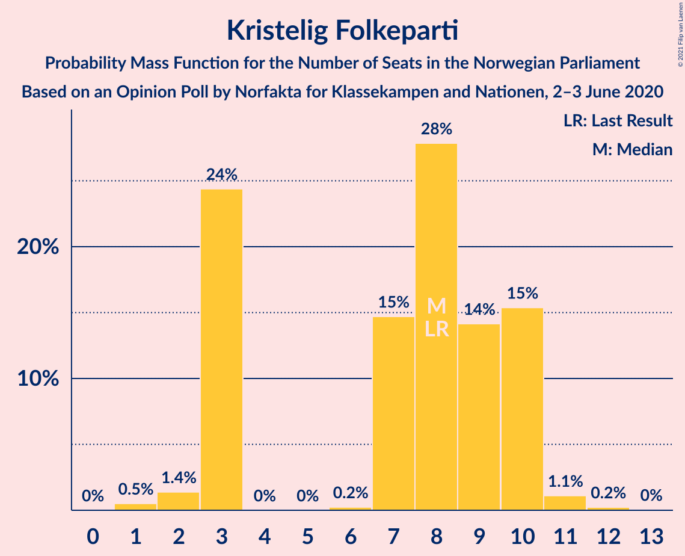
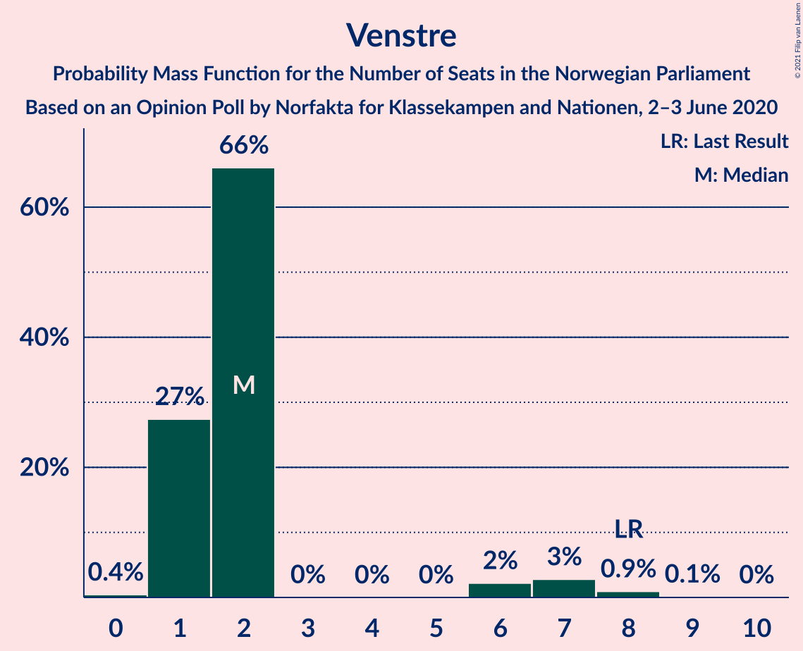
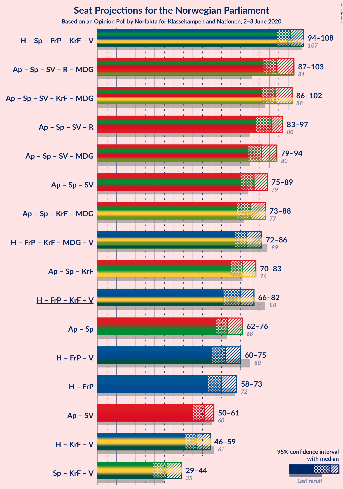

# Opinion Poll by Norfakta for Klassekampen and Nationen, 2–3 June 2020

<a href="#voting-intentions">Voting Intentions</a> | <a href="#seats">Seats</a> | <a href="#coalitions">Coalitions</a> | <a href="#technical-information">Technical Information</a>

## Voting Intentions

### Confidence Intervals

| Party | Last Result | Poll Result | 80% Confidence Interval | 90% Confidence Interval | 95% Confidence Interval | 99% Confidence Interval |
|:-----:|:-----------:|:-----------:|:-----------------------:|:-----------------------:|:-----------------------:|:-----------------------:|
| Høyre | 25.0% | 24.1% | 22.4–25.8% |21.9–26.4% |21.5–26.8% |20.7–27.7% |
| Arbeiderpartiet | 27.4% | 23.5% | 21.8–25.2% |21.3–25.7% |20.9–26.2% |20.1–27.1% |
| Senterpartiet | 10.3% | 14.6% | 13.2–16.1% |12.8–16.5% |12.5–16.9% |11.9–17.6% |
| Fremskrittspartiet | 15.2% | 12.3% | 11.0–13.7% |10.7–14.1% |10.4–14.5% |9.8–15.2% |
| Sosialistisk Venstreparti | 6.0% | 7.2% | 6.2–8.4% |6.0–8.7% |5.7–9.0% |5.3–9.5% |
| Rødt | 2.4% | 4.9% | 4.1–5.9% |3.9–6.2% |3.7–6.4% |3.4–6.9% |
| Kristelig Folkeparti | 4.2% | 4.5% | 3.7–5.5% |3.5–5.7% |3.4–6.0% |3.0–6.5% |
| Miljøpartiet De Grønne | 3.2% | 3.9% | 3.2–4.8% |3.0–5.1% |2.9–5.3% |2.6–5.7% |
| Venstre | 4.4% | 3.0% | 2.4–3.8% |2.2–4.0% |2.1–4.3% |1.8–4.7% |

*Note:* The poll result column reflects the actual value used in the calculations. Published results may vary slightly, and in addition be rounded to fewer digits.

## Seats

### Confidence Intervals

| Party | Last Result | Median | 80% Confidence Interval | 90% Confidence Interval | 95% Confidence Interval | 99% Confidence Interval |
|:-----:|:-----------:|:------:|:-----------------------:|:-----------------------:|:-----------------------:|:-----------------------:|
| <a href="#høyre">Høyre</a> | 45 | 43 | 40–47 |38–48 |37–48 |36–50 |
| <a href="#arbeiderpartiet">Arbeiderpartiet</a> | 49 | 42 | 40–46 |40–47 |38–47 |36–50 |
| <a href="#senterpartiet">Senterpartiet</a> | 19 | 26 | 23–30 |23–31 |22–32 |20–34 |
| <a href="#fremskrittspartiet">Fremskrittspartiet</a> | 27 | 22 | 19–25 |18–25 |18–26 |17–27 |
| <a href="#sosialistisk-venstreparti">Sosialistisk Venstreparti</a> | 11 | 13 | 11–14 |11–15 |10–16 |9–17 |
| <a href="#rødt">Rødt</a> | 1 | 9 | 7–10 |2–11 |2–11 |2–12 |
| <a href="#kristelig-folkeparti">Kristelig Folkeparti</a> | 8 | 8 | 3–10 |3–10 |3–10 |1–11 |
| <a href="#miljøpartiet-de-grønne">Miljøpartiet De Grønne</a> | 1 | 2 | 1–8 |1–9 |1–9 |1–10 |
| <a href="#venstre">Venstre</a> | 8 | 2 | 1–2 |1–6 |1–7 |1–8 |

### Høyre

*For a full overview of the results for this party, see the [Høyre](party-høyre.html) page.*

| Number of Seats | Probability | Accumulated | Special Marks |
|:---------------:|:-----------:|:-----------:|:-------------:|
| 35 | 0.4% | 100% |  |
| 36 | 0.7% | 99.6% |  |
| 37 | 2% | 98.9% |  |
| 38 | 3% | 97% |  |
| 39 | 2% | 94% |  |
| 40 | 6% | 92% |  |
| 41 | 14% | 86% |  |
| 42 | 11% | 72% |  |
| 43 | 24% | 60% | Median |
| 44 | 12% | 37% |  |
| 45 | 5% | 25% | Last Result |
| 46 | 8% | 20% |  |
| 47 | 4% | 12% |  |
| 48 | 5% | 7% |  |
| 49 | 0.3% | 2% |  |
| 50 | 1.3% | 2% |  |
| 51 | 0.3% | 0.4% |  |
| 52 | 0.1% | 0.1% |  |
| 53 | 0% | 0% |  |

### Arbeiderpartiet

*For a full overview of the results for this party, see the [Arbeiderpartiet](party-arbeiderpartiet.html) page.*

| Number of Seats | Probability | Accumulated | Special Marks |
|:---------------:|:-----------:|:-----------:|:-------------:|
| 35 | 0.1% | 100% |  |
| 36 | 0.5% | 99.9% |  |
| 37 | 0.5% | 99.4% |  |
| 38 | 2% | 99.0% |  |
| 39 | 2% | 97% |  |
| 40 | 17% | 95% |  |
| 41 | 14% | 78% |  |
| 42 | 23% | 64% | Median |
| 43 | 16% | 41% |  |
| 44 | 7% | 25% |  |
| 45 | 5% | 18% |  |
| 46 | 7% | 13% |  |
| 47 | 4% | 6% |  |
| 48 | 0.7% | 2% |  |
| 49 | 0.3% | 2% | Last Result |
| 50 | 1.1% | 1.2% |  |
| 51 | 0% | 0.1% |  |
| 52 | 0% | 0% |  |

### Senterpartiet

*For a full overview of the results for this party, see the [Senterpartiet](party-senterpartiet.html) page.*

| Number of Seats | Probability | Accumulated | Special Marks |
|:---------------:|:-----------:|:-----------:|:-------------:|
| 19 | 0.1% | 100% | Last Result |
| 20 | 0.5% | 99.9% |  |
| 21 | 1.1% | 99.4% |  |
| 22 | 3% | 98% |  |
| 23 | 6% | 96% |  |
| 24 | 5% | 90% |  |
| 25 | 19% | 85% |  |
| 26 | 21% | 66% | Median |
| 27 | 13% | 45% |  |
| 28 | 16% | 32% |  |
| 29 | 6% | 17% |  |
| 30 | 3% | 10% |  |
| 31 | 4% | 8% |  |
| 32 | 1.4% | 3% |  |
| 33 | 1.4% | 2% |  |
| 34 | 0.6% | 0.7% |  |
| 35 | 0.1% | 0.1% |  |
| 36 | 0% | 0% |  |

### Fremskrittspartiet

*For a full overview of the results for this party, see the [Fremskrittspartiet](party-fremskrittspartiet.html) page.*

| Number of Seats | Probability | Accumulated | Special Marks |
|:---------------:|:-----------:|:-----------:|:-------------:|
| 16 | 0.3% | 100% |  |
| 17 | 0.8% | 99.7% |  |
| 18 | 4% | 98.9% |  |
| 19 | 6% | 95% |  |
| 20 | 5% | 89% |  |
| 21 | 13% | 84% |  |
| 22 | 24% | 71% | Median |
| 23 | 18% | 47% |  |
| 24 | 14% | 29% |  |
| 25 | 12% | 15% |  |
| 26 | 2% | 3% |  |
| 27 | 1.2% | 2% | Last Result |
| 28 | 0.2% | 0.3% |  |
| 29 | 0.1% | 0.1% |  |
| 30 | 0% | 0% |  |

### Sosialistisk Venstreparti

*For a full overview of the results for this party, see the [Sosialistisk Venstreparti](party-sosialistiskvenstreparti.html) page.*

| Number of Seats | Probability | Accumulated | Special Marks |
|:---------------:|:-----------:|:-----------:|:-------------:|
| 8 | 0.1% | 100% |  |
| 9 | 0.6% | 99.9% |  |
| 10 | 3% | 99.3% |  |
| 11 | 17% | 96% | Last Result |
| 12 | 15% | 79% |  |
| 13 | 18% | 64% | Median |
| 14 | 37% | 46% |  |
| 15 | 4% | 8% |  |
| 16 | 3% | 4% |  |
| 17 | 0.9% | 1.0% |  |
| 18 | 0.1% | 0.1% |  |
| 19 | 0% | 0% |  |

### Rødt

*For a full overview of the results for this party, see the [Rødt](party-rødt.html) page.*

| Number of Seats | Probability | Accumulated | Special Marks |
|:---------------:|:-----------:|:-----------:|:-------------:|
| 1 | 0% | 100% | Last Result |
| 2 | 5% | 100% |  |
| 3 | 0% | 95% |  |
| 4 | 0% | 95% |  |
| 5 | 0% | 95% |  |
| 6 | 0% | 95% |  |
| 7 | 17% | 95% |  |
| 8 | 20% | 78% |  |
| 9 | 30% | 58% | Median |
| 10 | 18% | 28% |  |
| 11 | 8% | 9% |  |
| 12 | 2% | 2% |  |
| 13 | 0.1% | 0.2% |  |
| 14 | 0% | 0% |  |

### Kristelig Folkeparti

*For a full overview of the results for this party, see the [Kristelig Folkeparti](party-kristeligfolkeparti.html) page.*

| Number of Seats | Probability | Accumulated | Special Marks |
|:---------------:|:-----------:|:-----------:|:-------------:|
| 1 | 0.5% | 100% |  |
| 2 | 1.4% | 99.5% |  |
| 3 | 24% | 98% |  |
| 4 | 0% | 74% |  |
| 5 | 0% | 74% |  |
| 6 | 0.2% | 74% |  |
| 7 | 15% | 73% |  |
| 8 | 28% | 59% | Last Result, Median |
| 9 | 14% | 31% |  |
| 10 | 15% | 17% |  |
| 11 | 1.1% | 1.4% |  |
| 12 | 0.2% | 0.3% |  |
| 13 | 0% | 0% |  |

### Miljøpartiet De Grønne

*For a full overview of the results for this party, see the [Miljøpartiet De Grønne](party-miljøpartietdegrønne.html) page.*

| Number of Seats | Probability | Accumulated | Special Marks |
|:---------------:|:-----------:|:-----------:|:-------------:|
| 1 | 16% | 100% | Last Result |
| 2 | 38% | 84% | Median |
| 3 | 7% | 46% |  |
| 4 | 0% | 39% |  |
| 5 | 0% | 39% |  |
| 6 | 2% | 39% |  |
| 7 | 5% | 37% |  |
| 8 | 27% | 32% |  |
| 9 | 5% | 5% |  |
| 10 | 0.6% | 0.8% |  |
| 11 | 0.1% | 0.1% |  |
| 12 | 0% | 0% |  |

### Venstre

*For a full overview of the results for this party, see the [Venstre](party-venstre.html) page.*

| Number of Seats | Probability | Accumulated | Special Marks |
|:---------------:|:-----------:|:-----------:|:-------------:|
| 0 | 0.4% | 100% |  |
| 1 | 27% | 99.6% |  |
| 2 | 66% | 72% | Median |
| 3 | 0% | 6% |  |
| 4 | 0% | 6% |  |
| 5 | 0% | 6% |  |
| 6 | 2% | 6% |  |
| 7 | 3% | 4% |  |
| 8 | 0.9% | 1.1% | Last Result |
| 9 | 0.1% | 0.1% |  |
| 10 | 0% | 0% |  |

## Coalitions

### Confidence Intervals

| Coalition | Last Result | Median | Majority? | 80% Confidence Interval | 90% Confidence Interval | 95% Confidence Interval | 99% Confidence Interval |
|:---------:|:-----------:|:------:|:---------:|:-----------------------:|:-----------------------:|:-----------------------:|:-----------------------:|
| Høyre – Senterpartiet – Fremskrittspartiet – Kristelig Folkeparti – Venstre | 107 | 101 | 100% | 96–105 | 95–106 | 94–108 | 92–111 |
| Arbeiderpartiet – Senterpartiet – Sosialistisk Venstreparti – Rødt – Miljøpartiet De Grønne | 81 | 94 | 99.7% | 90–99 | 89–101 | 87–103 | 85–104 |
| Arbeiderpartiet – Senterpartiet – Sosialistisk Venstreparti – Kristelig Folkeparti – Miljøpartiet De Grønne | 88 | 93 | 99.3% | 88–98 | 87–100 | 86–102 | 84–104 |
| Arbeiderpartiet – Senterpartiet – Sosialistisk Venstreparti – Rødt | 80 | 91 | 95% | 86–95 | 84–97 | 83–97 | 81–99 |
| Arbeiderpartiet – Senterpartiet – Sosialistisk Venstreparti – Miljøpartiet De Grønne | 80 | 86 | 60% | 81–91 | 80–93 | 79–94 | 77–96 |
| Arbeiderpartiet – Senterpartiet – Sosialistisk Venstreparti | 79 | 82 | 23% | 78–87 | 77–87 | 75–89 | 73–91 |
| Arbeiderpartiet – Senterpartiet – Kristelig Folkeparti – Miljøpartiet De Grønne | 77 | 80 | 15% | 75–86 | 74–88 | 73–88 | 71–92 |
| Høyre – Fremskrittspartiet – Kristelig Folkeparti – Miljøpartiet De Grønne – Venstre | 89 | 78 | 5% | 74–83 | 72–85 | 72–86 | 70–88 |
| Arbeiderpartiet – Senterpartiet – Kristelig Folkeparti | 76 | 76 | 0.9% | 71–81 | 70–82 | 70–83 | 68–85 |
| Høyre – Fremskrittspartiet – Kristelig Folkeparti – Venstre | 88 | 75 | 0.3% | 70–79 | 68–80 | 66–82 | 65–84 |
| Arbeiderpartiet – Senterpartiet | 68 | 68 | 0% | 65–73 | 64–74 | 62–76 | 61–78 |
| Høyre – Fremskrittspartiet – Venstre | 80 | 67 | 0% | 63–72 | 61–74 | 60–75 | 58–77 |
| Høyre – Fremskrittspartiet | 72 | 65 | 0% | 61–69 | 59–71 | 58–73 | 55–73 |
| Arbeiderpartiet – Sosialistisk Venstreparti | 60 | 56 | 0% | 51–59 | 51–61 | 50–61 | 49–64 |
| Høyre – Kristelig Folkeparti – Venstre | 61 | 52 | 0% | 47–56 | 46–57 | 46–59 | 44–61 |
| Senterpartiet – Kristelig Folkeparti – Venstre | 35 | 36 | 0% | 31–40 | 30–42 | 29–44 | 27–45 |

### Høyre – Senterpartiet – Fremskrittspartiet – Kristelig Folkeparti – Venstre

| Number of Seats | Probability | Accumulated | Special Marks |
|:---------------:|:-----------:|:-----------:|:-------------:|
| 90 | 0.1% | 100% |  |
| 91 | 0.1% | 99.9% |  |
| 92 | 0.9% | 99.8% |  |
| 93 | 1.0% | 98.9% |  |
| 94 | 2% | 98% |  |
| 95 | 3% | 96% |  |
| 96 | 5% | 94% |  |
| 97 | 6% | 89% |  |
| 98 | 4% | 83% |  |
| 99 | 9% | 79% |  |
| 100 | 11% | 70% |  |
| 101 | 10% | 59% | Median |
| 102 | 21% | 49% |  |
| 103 | 9% | 28% |  |
| 104 | 6% | 19% |  |
| 105 | 8% | 13% |  |
| 106 | 2% | 5% |  |
| 107 | 0.8% | 4% | Last Result |
| 108 | 1.1% | 3% |  |
| 109 | 0.4% | 2% |  |
| 110 | 0.3% | 1.5% |  |
| 111 | 1.1% | 1.2% |  |
| 112 | 0.1% | 0.1% |  |
| 113 | 0% | 0% |  |

### Arbeiderpartiet – Senterpartiet – Sosialistisk Venstreparti – Rødt – Miljøpartiet De Grønne

| Number of Seats | Probability | Accumulated | Special Marks |
|:---------------:|:-----------:|:-----------:|:-------------:|
| 81 | 0% | 100% | Last Result |
| 82 | 0% | 100% |  |
| 83 | 0.1% | 100% |  |
| 84 | 0.2% | 99.9% |  |
| 85 | 0.6% | 99.7% | Majority |
| 86 | 0.6% | 99.2% |  |
| 87 | 1.2% | 98.6% |  |
| 88 | 0.8% | 97% |  |
| 89 | 5% | 97% |  |
| 90 | 4% | 92% |  |
| 91 | 7% | 88% |  |
| 92 | 9% | 81% | Median |
| 93 | 11% | 73% |  |
| 94 | 12% | 62% |  |
| 95 | 12% | 50% |  |
| 96 | 12% | 37% |  |
| 97 | 4% | 26% |  |
| 98 | 6% | 21% |  |
| 99 | 6% | 15% |  |
| 100 | 4% | 9% |  |
| 101 | 2% | 6% |  |
| 102 | 0.7% | 4% |  |
| 103 | 2% | 3% |  |
| 104 | 1.0% | 1.4% |  |
| 105 | 0.4% | 0.5% |  |
| 106 | 0.1% | 0.1% |  |
| 107 | 0% | 0% |  |

### Arbeiderpartiet – Senterpartiet – Sosialistisk Venstreparti – Kristelig Folkeparti – Miljøpartiet De Grønne

| Number of Seats | Probability | Accumulated | Special Marks |
|:---------------:|:-----------:|:-----------:|:-------------:|
| 82 | 0.3% | 100% |  |
| 83 | 0.1% | 99.7% |  |
| 84 | 0.3% | 99.6% |  |
| 85 | 1.0% | 99.3% | Majority |
| 86 | 3% | 98% |  |
| 87 | 1.2% | 95% |  |
| 88 | 5% | 94% | Last Result |
| 89 | 6% | 89% |  |
| 90 | 4% | 82% |  |
| 91 | 4% | 78% | Median |
| 92 | 18% | 74% |  |
| 93 | 8% | 56% |  |
| 94 | 19% | 47% |  |
| 95 | 9% | 28% |  |
| 96 | 3% | 19% |  |
| 97 | 2% | 16% |  |
| 98 | 4% | 14% |  |
| 99 | 3% | 10% |  |
| 100 | 3% | 6% |  |
| 101 | 0.7% | 3% |  |
| 102 | 2% | 3% |  |
| 103 | 0.4% | 1.0% |  |
| 104 | 0.4% | 0.5% |  |
| 105 | 0.1% | 0.1% |  |
| 106 | 0% | 0% |  |

### Arbeiderpartiet – Senterpartiet – Sosialistisk Venstreparti – Rødt

| Number of Seats | Probability | Accumulated | Special Marks |
|:---------------:|:-----------:|:-----------:|:-------------:|
| 78 | 0.1% | 100% |  |
| 79 | 0.1% | 99.9% |  |
| 80 | 0.2% | 99.9% | Last Result |
| 81 | 0.4% | 99.6% |  |
| 82 | 1.0% | 99.2% |  |
| 83 | 1.0% | 98% |  |
| 84 | 2% | 97% |  |
| 85 | 2% | 95% | Majority |
| 86 | 8% | 93% |  |
| 87 | 8% | 85% |  |
| 88 | 11% | 76% |  |
| 89 | 4% | 66% |  |
| 90 | 10% | 61% | Median |
| 91 | 15% | 51% |  |
| 92 | 8% | 36% |  |
| 93 | 6% | 28% |  |
| 94 | 7% | 22% |  |
| 95 | 7% | 15% |  |
| 96 | 2% | 8% |  |
| 97 | 4% | 6% |  |
| 98 | 1.5% | 2% |  |
| 99 | 0.2% | 0.6% |  |
| 100 | 0.1% | 0.4% |  |
| 101 | 0.2% | 0.3% |  |
| 102 | 0% | 0.1% |  |
| 103 | 0.1% | 0.1% |  |
| 104 | 0% | 0% |  |

### Arbeiderpartiet – Senterpartiet – Sosialistisk Venstreparti – Miljøpartiet De Grønne

| Number of Seats | Probability | Accumulated | Special Marks |
|:---------------:|:-----------:|:-----------:|:-------------:|
| 75 | 0.1% | 100% |  |
| 76 | 0.1% | 99.9% |  |
| 77 | 0.5% | 99.7% |  |
| 78 | 0.7% | 99.3% |  |
| 79 | 1.3% | 98.6% |  |
| 80 | 3% | 97% | Last Result |
| 81 | 5% | 94% |  |
| 82 | 2% | 89% |  |
| 83 | 9% | 87% | Median |
| 84 | 18% | 78% |  |
| 85 | 6% | 60% | Majority |
| 86 | 11% | 54% |  |
| 87 | 10% | 43% |  |
| 88 | 6% | 33% |  |
| 89 | 9% | 27% |  |
| 90 | 5% | 18% |  |
| 91 | 5% | 13% |  |
| 92 | 2% | 8% |  |
| 93 | 2% | 6% |  |
| 94 | 1.1% | 4% |  |
| 95 | 0.9% | 2% |  |
| 96 | 1.3% | 1.5% |  |
| 97 | 0.1% | 0.2% |  |
| 98 | 0% | 0.2% |  |
| 99 | 0.1% | 0.1% |  |
| 100 | 0% | 0% |  |

### Arbeiderpartiet – Senterpartiet – Sosialistisk Venstreparti

| Number of Seats | Probability | Accumulated | Special Marks |
|:---------------:|:-----------:|:-----------:|:-------------:|
| 71 | 0.1% | 100% |  |
| 72 | 0.2% | 99.9% |  |
| 73 | 0.5% | 99.6% |  |
| 74 | 1.0% | 99.1% |  |
| 75 | 2% | 98% |  |
| 76 | 1.3% | 96% |  |
| 77 | 4% | 95% |  |
| 78 | 7% | 91% |  |
| 79 | 12% | 84% | Last Result |
| 80 | 5% | 72% |  |
| 81 | 8% | 67% | Median |
| 82 | 25% | 59% |  |
| 83 | 5% | 35% |  |
| 84 | 7% | 30% |  |
| 85 | 7% | 23% | Majority |
| 86 | 3% | 16% |  |
| 87 | 8% | 13% |  |
| 88 | 2% | 5% |  |
| 89 | 0.9% | 3% |  |
| 90 | 1.1% | 2% |  |
| 91 | 0.5% | 0.8% |  |
| 92 | 0.1% | 0.3% |  |
| 93 | 0% | 0.2% |  |
| 94 | 0.2% | 0.2% |  |
| 95 | 0% | 0% |  |

### Arbeiderpartiet – Senterpartiet – Kristelig Folkeparti – Miljøpartiet De Grønne

| Number of Seats | Probability | Accumulated | Special Marks |
|:---------------:|:-----------:|:-----------:|:-------------:|
| 69 | 0.3% | 100% |  |
| 70 | 0.1% | 99.6% |  |
| 71 | 0.1% | 99.5% |  |
| 72 | 0.8% | 99.4% |  |
| 73 | 3% | 98.6% |  |
| 74 | 4% | 95% |  |
| 75 | 5% | 92% |  |
| 76 | 3% | 87% |  |
| 77 | 7% | 84% | Last Result |
| 78 | 12% | 77% | Median |
| 79 | 10% | 64% |  |
| 80 | 16% | 54% |  |
| 81 | 5% | 38% |  |
| 82 | 6% | 33% |  |
| 83 | 6% | 28% |  |
| 84 | 7% | 22% |  |
| 85 | 5% | 15% | Majority |
| 86 | 2% | 10% |  |
| 87 | 3% | 8% |  |
| 88 | 3% | 5% |  |
| 89 | 0.2% | 2% |  |
| 90 | 1.0% | 2% |  |
| 91 | 0.3% | 0.8% |  |
| 92 | 0.4% | 0.6% |  |
| 93 | 0.1% | 0.1% |  |
| 94 | 0% | 0% |  |

### Høyre – Fremskrittspartiet – Kristelig Folkeparti – Miljøpartiet De Grønne – Venstre

| Number of Seats | Probability | Accumulated | Special Marks |
|:---------------:|:-----------:|:-----------:|:-------------:|
| 66 | 0.1% | 100% |  |
| 67 | 0% | 99.9% |  |
| 68 | 0.2% | 99.9% |  |
| 69 | 0.1% | 99.7% |  |
| 70 | 0.2% | 99.6% |  |
| 71 | 1.5% | 99.4% |  |
| 72 | 4% | 98% |  |
| 73 | 2% | 94% |  |
| 74 | 7% | 92% |  |
| 75 | 7% | 85% |  |
| 76 | 6% | 78% |  |
| 77 | 8% | 71% | Median |
| 78 | 15% | 64% |  |
| 79 | 10% | 49% |  |
| 80 | 4% | 39% |  |
| 81 | 11% | 34% |  |
| 82 | 8% | 24% |  |
| 83 | 8% | 15% |  |
| 84 | 2% | 7% |  |
| 85 | 2% | 5% | Majority |
| 86 | 1.0% | 3% |  |
| 87 | 1.0% | 2% |  |
| 88 | 0.4% | 0.8% |  |
| 89 | 0.2% | 0.4% | Last Result |
| 90 | 0.1% | 0.1% |  |
| 91 | 0.1% | 0.1% |  |
| 92 | 0% | 0% |  |

### Arbeiderpartiet – Senterpartiet – Kristelig Folkeparti

| Number of Seats | Probability | Accumulated | Special Marks |
|:---------------:|:-----------:|:-----------:|:-------------:|
| 65 | 0% | 100% |  |
| 66 | 0.1% | 99.9% |  |
| 67 | 0.3% | 99.8% |  |
| 68 | 0.7% | 99.5% |  |
| 69 | 1.2% | 98.8% |  |
| 70 | 4% | 98% |  |
| 71 | 4% | 94% |  |
| 72 | 6% | 89% |  |
| 73 | 9% | 83% |  |
| 74 | 7% | 75% |  |
| 75 | 7% | 68% |  |
| 76 | 21% | 61% | Last Result, Median |
| 77 | 6% | 39% |  |
| 78 | 14% | 33% |  |
| 79 | 5% | 19% |  |
| 80 | 4% | 14% |  |
| 81 | 3% | 10% |  |
| 82 | 4% | 7% |  |
| 83 | 1.2% | 3% |  |
| 84 | 1.4% | 2% |  |
| 85 | 0.6% | 0.9% | Majority |
| 86 | 0.3% | 0.4% |  |
| 87 | 0% | 0% |  |

### Høyre – Fremskrittspartiet – Kristelig Folkeparti – Venstre

| Number of Seats | Probability | Accumulated | Special Marks |
|:---------------:|:-----------:|:-----------:|:-------------:|
| 63 | 0.1% | 100% |  |
| 64 | 0.4% | 99.9% |  |
| 65 | 1.0% | 99.5% |  |
| 66 | 2% | 98.6% |  |
| 67 | 0.7% | 97% |  |
| 68 | 2% | 96% |  |
| 69 | 4% | 94% |  |
| 70 | 6% | 91% |  |
| 71 | 6% | 85% |  |
| 72 | 4% | 79% |  |
| 73 | 12% | 74% |  |
| 74 | 12% | 63% |  |
| 75 | 12% | 50% | Median |
| 76 | 11% | 38% |  |
| 77 | 9% | 27% |  |
| 78 | 6% | 19% |  |
| 79 | 4% | 12% |  |
| 80 | 5% | 8% |  |
| 81 | 0.8% | 3% |  |
| 82 | 1.2% | 3% |  |
| 83 | 0.6% | 1.4% |  |
| 84 | 0.6% | 0.8% |  |
| 85 | 0.2% | 0.3% | Majority |
| 86 | 0.1% | 0.1% |  |
| 87 | 0% | 0% |  |
| 88 | 0% | 0% | Last Result |

### Arbeiderpartiet – Senterpartiet

| Number of Seats | Probability | Accumulated | Special Marks |
|:---------------:|:-----------:|:-----------:|:-------------:|
| 60 | 0.3% | 100% |  |
| 61 | 0.3% | 99.6% |  |
| 62 | 2% | 99.3% |  |
| 63 | 1.1% | 97% |  |
| 64 | 2% | 96% |  |
| 65 | 9% | 94% |  |
| 66 | 8% | 86% |  |
| 67 | 7% | 77% |  |
| 68 | 26% | 70% | Last Result, Median |
| 69 | 6% | 45% |  |
| 70 | 9% | 38% |  |
| 71 | 5% | 30% |  |
| 72 | 6% | 25% |  |
| 73 | 12% | 19% |  |
| 74 | 3% | 7% |  |
| 75 | 1.0% | 4% |  |
| 76 | 2% | 3% |  |
| 77 | 0.3% | 0.9% |  |
| 78 | 0.2% | 0.6% |  |
| 79 | 0.4% | 0.4% |  |
| 80 | 0% | 0.1% |  |
| 81 | 0% | 0% |  |

### Høyre – Fremskrittspartiet – Venstre

| Number of Seats | Probability | Accumulated | Special Marks |
|:---------------:|:-----------:|:-----------:|:-------------:|
| 55 | 0% | 100% |  |
| 56 | 0.1% | 99.9% |  |
| 57 | 0.4% | 99.9% |  |
| 58 | 1.1% | 99.5% |  |
| 59 | 0.1% | 98% |  |
| 60 | 3% | 98% |  |
| 61 | 2% | 95% |  |
| 62 | 3% | 93% |  |
| 63 | 3% | 91% |  |
| 64 | 4% | 88% |  |
| 65 | 3% | 84% |  |
| 66 | 16% | 80% |  |
| 67 | 22% | 64% | Median |
| 68 | 9% | 42% |  |
| 69 | 5% | 33% |  |
| 70 | 14% | 29% |  |
| 71 | 5% | 15% |  |
| 72 | 3% | 10% |  |
| 73 | 2% | 7% |  |
| 74 | 1.1% | 5% |  |
| 75 | 3% | 4% |  |
| 76 | 0.2% | 0.8% |  |
| 77 | 0.5% | 0.6% |  |
| 78 | 0% | 0.2% |  |
| 79 | 0.1% | 0.1% |  |
| 80 | 0% | 0.1% | Last Result |
| 81 | 0% | 0% |  |

### Høyre – Fremskrittspartiet

| Number of Seats | Probability | Accumulated | Special Marks |
|:---------------:|:-----------:|:-----------:|:-------------:|
| 54 | 0.1% | 100% |  |
| 55 | 0.5% | 99.9% |  |
| 56 | 0.2% | 99.4% |  |
| 57 | 1.1% | 99.2% |  |
| 58 | 2% | 98% |  |
| 59 | 3% | 96% |  |
| 60 | 3% | 93% |  |
| 61 | 5% | 91% |  |
| 62 | 4% | 86% |  |
| 63 | 3% | 82% |  |
| 64 | 5% | 78% |  |
| 65 | 31% | 73% | Median |
| 66 | 10% | 42% |  |
| 67 | 5% | 33% |  |
| 68 | 13% | 27% |  |
| 69 | 5% | 14% |  |
| 70 | 0.7% | 9% |  |
| 71 | 3% | 8% |  |
| 72 | 1.0% | 5% | Last Result |
| 73 | 3% | 4% |  |
| 74 | 0.1% | 0.3% |  |
| 75 | 0.1% | 0.2% |  |
| 76 | 0% | 0.1% |  |
| 77 | 0% | 0.1% |  |
| 78 | 0% | 0% |  |

### Arbeiderpartiet – Sosialistisk Venstreparti

| Number of Seats | Probability | Accumulated | Special Marks |
|:---------------:|:-----------:|:-----------:|:-------------:|
| 47 | 0.2% | 100% |  |
| 48 | 0.2% | 99.8% |  |
| 49 | 0.5% | 99.5% |  |
| 50 | 2% | 99.0% |  |
| 51 | 9% | 97% |  |
| 52 | 6% | 88% |  |
| 53 | 9% | 81% |  |
| 54 | 9% | 73% |  |
| 55 | 12% | 64% | Median |
| 56 | 20% | 52% |  |
| 57 | 14% | 32% |  |
| 58 | 3% | 18% |  |
| 59 | 6% | 15% |  |
| 60 | 3% | 9% | Last Result |
| 61 | 4% | 6% |  |
| 62 | 0.5% | 2% |  |
| 63 | 0.5% | 1.5% |  |
| 64 | 0.9% | 1.0% |  |
| 65 | 0.1% | 0.1% |  |
| 66 | 0% | 0% |  |

### Høyre – Kristelig Folkeparti – Venstre

| Number of Seats | Probability | Accumulated | Special Marks |
|:---------------:|:-----------:|:-----------:|:-------------:|
| 42 | 0.2% | 100% |  |
| 43 | 0.2% | 99.8% |  |
| 44 | 1.4% | 99.6% |  |
| 45 | 0.6% | 98% |  |
| 46 | 5% | 98% |  |
| 47 | 4% | 92% |  |
| 48 | 4% | 88% |  |
| 49 | 3% | 84% |  |
| 50 | 7% | 82% |  |
| 51 | 17% | 75% |  |
| 52 | 12% | 58% |  |
| 53 | 14% | 46% | Median |
| 54 | 13% | 32% |  |
| 55 | 4% | 19% |  |
| 56 | 5% | 15% |  |
| 57 | 6% | 10% |  |
| 58 | 2% | 4% |  |
| 59 | 0.6% | 3% |  |
| 60 | 0.3% | 2% |  |
| 61 | 1.5% | 2% | Last Result |
| 62 | 0.2% | 0.2% |  |
| 63 | 0% | 0.1% |  |
| 64 | 0% | 0% |  |

### Senterpartiet – Kristelig Folkeparti – Venstre

| Number of Seats | Probability | Accumulated | Special Marks |
|:---------------:|:-----------:|:-----------:|:-------------:|
| 26 | 0.1% | 100% |  |
| 27 | 0.5% | 99.8% |  |
| 28 | 1.4% | 99.3% |  |
| 29 | 0.6% | 98% |  |
| 30 | 5% | 97% |  |
| 31 | 7% | 92% |  |
| 32 | 5% | 85% |  |
| 33 | 4% | 79% |  |
| 34 | 11% | 75% |  |
| 35 | 12% | 64% | Last Result |
| 36 | 11% | 51% | Median |
| 37 | 17% | 41% |  |
| 38 | 6% | 23% |  |
| 39 | 5% | 17% |  |
| 40 | 4% | 12% |  |
| 41 | 2% | 7% |  |
| 42 | 2% | 6% |  |
| 43 | 0.8% | 4% |  |
| 44 | 2% | 3% |  |
| 45 | 0.5% | 0.9% |  |
| 46 | 0.1% | 0.4% |  |
| 47 | 0.2% | 0.3% |  |
| 48 | 0% | 0% |  |

## Technical Information

### Opinion Poll

+ **Polling firm:** Norfakta
+ **Commissioner(s):** Klassekampen and Nationen
+ **Fieldwork period:** 2–3 June 2020

### Calculations

+ **Sample size:** 1002
+ **Simulations done:** 524,288
+ **Error estimate:** 1.01%

