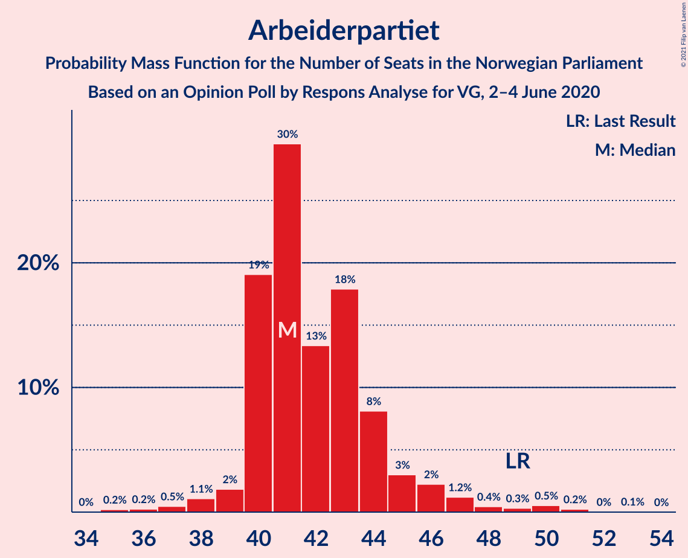
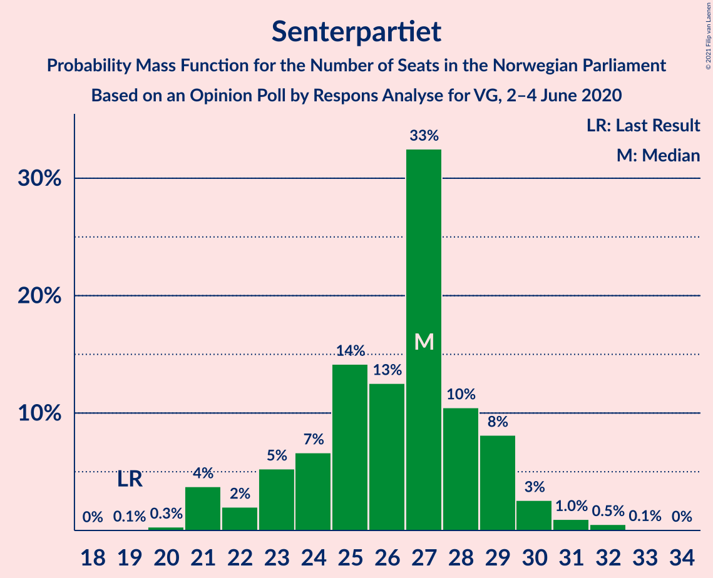
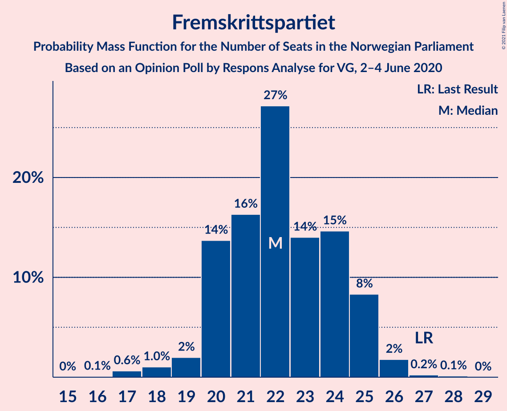
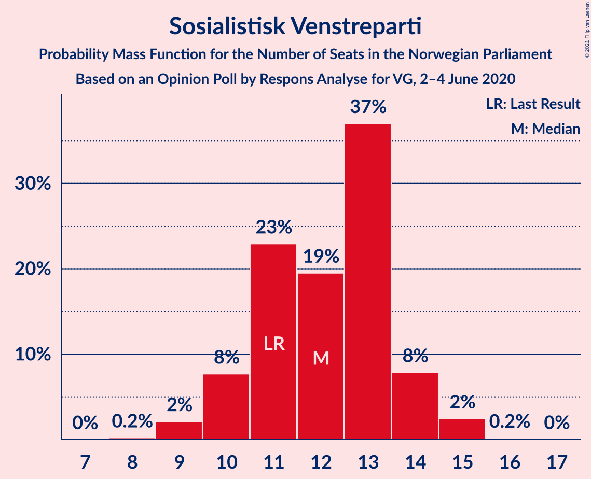
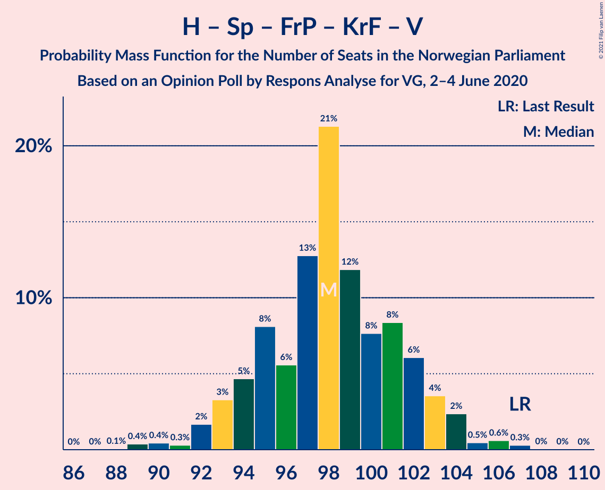
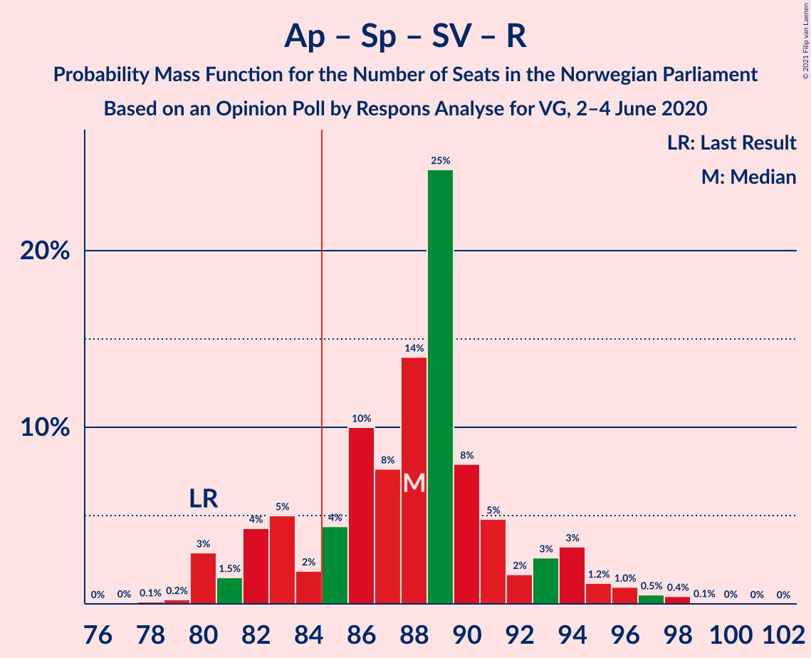

# Opinion Poll by Respons Analyse for VG, 2–4 June 2020

<a href="#voting-intentions">Voting Intentions</a> | <a href="#seats">Seats</a> | <a href="#coalitions">Coalitions</a> | <a href="#technical-information">Technical Information</a>

## Voting Intentions

### Confidence Intervals

| Party | Last Result | Poll Result | 80% Confidence Interval | 90% Confidence Interval | 95% Confidence Interval | 99% Confidence Interval |
|:-----:|:-----------:|:-----------:|:-----------------------:|:-----------------------:|:-----------------------:|:-----------------------:|
| Høyre | 25.0% | 24.2% | 22.5–26.0% |22.0–26.5% |21.6–26.9% |20.8–27.8% |
| Arbeiderpartiet | 27.4% | 23.5% | 21.8–25.2% |21.3–25.7% |20.9–26.2% |20.1–27.1% |
| Senterpartiet | 10.3% | 14.5% | 13.1–16.0% |12.7–16.4% |12.4–16.8% |11.8–17.5% |
| Fremskrittspartiet | 15.2% | 12.4% | 11.1–13.8% |10.8–14.2% |10.5–14.6% |9.9–15.3% |
| Sosialistisk Venstreparti | 6.0% | 6.8% | 5.9–7.9% |5.6–8.2% |5.4–8.5% |5.0–9.1% |
| Miljøpartiet De Grønne | 3.2% | 5.3% | 4.5–6.3% |4.3–6.6% |4.1–6.9% |3.7–7.4% |
| Rødt | 2.4% | 4.7% | 3.9–5.7% |3.7–5.9% |3.5–6.2% |3.2–6.7% |
| Kristelig Folkeparti | 4.2% | 3.7% | 3.0–4.6% |2.8–4.8% |2.7–5.1% |2.4–5.5% |
| Venstre | 4.4% | 3.1% | 2.5–3.9% |2.3–4.2% |2.2–4.4% |1.9–4.8% |

*Note:* The poll result column reflects the actual value used in the calculations. Published results may vary slightly, and in addition be rounded to fewer digits.

## Seats

### Confidence Intervals

| Party | Last Result | Median | 80% Confidence Interval | 90% Confidence Interval | 95% Confidence Interval | 99% Confidence Interval |
|:-----:|:-----------:|:------:|:-----------------------:|:-----------------------:|:-----------------------:|:-----------------------:|
| <a href="#høyre">Høyre</a> | 45 | 44 | 41–45 |39–46 |38–47 |36–48 |
| <a href="#arbeiderpartiet">Arbeiderpartiet</a> | 49 | 41 | 40–43 |40–44 |40–46 |39–51 |
| <a href="#senterpartiet">Senterpartiet</a> | 19 | 27 | 24–28 |23–29 |21–30 |21–31 |
| <a href="#fremskrittspartiet">Fremskrittspartiet</a> | 27 | 22 | 21–24 |20–25 |20–26 |18–26 |
| <a href="#sosialistisk-venstreparti">Sosialistisk Venstreparti</a> | 11 | 13 | 11–14 |11–14 |10–15 |9–15 |
| <a href="#miljøpartiet-de-grønne">Miljøpartiet De Grønne</a> | 1 | 9 | 8–11 |8–12 |7–12 |2–13 |
| <a href="#rødt">Rødt</a> | 1 | 8 | 7–10 |2–10 |2–11 |2–11 |
| <a href="#kristelig-folkeparti">Kristelig Folkeparti</a> | 8 | 3 | 2–7 |2–8 |1–8 |1–10 |
| <a href="#venstre">Venstre</a> | 8 | 2 | 1–2 |1–2 |1–6 |1–8 |

### Høyre

*For a full overview of the results for this party, see the [Høyre](party-høyre.html) page.*

| Number of Seats | Probability | Accumulated | Special Marks |
|:---------------:|:-----------:|:-----------:|:-------------:|
| 35 | 0.1% | 100% |  |
| 36 | 1.1% | 99.9% |  |
| 37 | 0.8% | 98.8% |  |
| 38 | 0.6% | 98% |  |
| 39 | 3% | 97% |  |
| 40 | 3% | 95% |  |
| 41 | 10% | 91% |  |
| 42 | 3% | 81% |  |
| 43 | 10% | 78% |  |
| 44 | 55% | 68% | Median |
| 45 | 5% | 13% | Last Result |
| 46 | 4% | 9% |  |
| 47 | 3% | 5% |  |
| 48 | 2% | 2% |  |
| 49 | 0.1% | 0.1% |  |
| 50 | 0% | 0.1% |  |
| 51 | 0% | 0% |  |

### Arbeiderpartiet

*For a full overview of the results for this party, see the [Arbeiderpartiet](party-arbeiderpartiet.html) page.*

| Number of Seats | Probability | Accumulated | Special Marks |
|:---------------:|:-----------:|:-----------:|:-------------:|
| 36 | 0% | 100% |  |
| 37 | 0.2% | 99.9% |  |
| 38 | 0.2% | 99.7% |  |
| 39 | 0.2% | 99.5% |  |
| 40 | 24% | 99.3% |  |
| 41 | 57% | 75% | Median |
| 42 | 5% | 18% |  |
| 43 | 4% | 12% |  |
| 44 | 4% | 9% |  |
| 45 | 2% | 5% |  |
| 46 | 0.5% | 3% |  |
| 47 | 0.2% | 2% |  |
| 48 | 0.2% | 2% |  |
| 49 | 0.8% | 2% | Last Result |
| 50 | 0.8% | 1.3% |  |
| 51 | 0.5% | 0.5% |  |
| 52 | 0% | 0.1% |  |
| 53 | 0% | 0.1% |  |
| 54 | 0% | 0% |  |

### Senterpartiet

*For a full overview of the results for this party, see the [Senterpartiet](party-senterpartiet.html) page.*

| Number of Seats | Probability | Accumulated | Special Marks |
|:---------------:|:-----------:|:-----------:|:-------------:|
| 19 | 0.1% | 100% | Last Result |
| 20 | 0.1% | 99.9% |  |
| 21 | 3% | 99.8% |  |
| 22 | 2% | 97% |  |
| 23 | 5% | 96% |  |
| 24 | 6% | 91% |  |
| 25 | 10% | 84% |  |
| 26 | 4% | 75% |  |
| 27 | 53% | 71% | Median |
| 28 | 10% | 18% |  |
| 29 | 4% | 8% |  |
| 30 | 2% | 4% |  |
| 31 | 1.4% | 2% |  |
| 32 | 0.1% | 0.2% |  |
| 33 | 0.1% | 0.1% |  |
| 34 | 0% | 0% |  |

### Fremskrittspartiet

*For a full overview of the results for this party, see the [Fremskrittspartiet](party-fremskrittspartiet.html) page.*

| Number of Seats | Probability | Accumulated | Special Marks |
|:---------------:|:-----------:|:-----------:|:-------------:|
| 17 | 0.3% | 100% |  |
| 18 | 0.8% | 99.6% |  |
| 19 | 0.8% | 98.9% |  |
| 20 | 3% | 98% |  |
| 21 | 13% | 95% |  |
| 22 | 51% | 82% | Median |
| 23 | 4% | 31% |  |
| 24 | 17% | 27% |  |
| 25 | 6% | 9% |  |
| 26 | 3% | 4% |  |
| 27 | 0.1% | 0.2% | Last Result |
| 28 | 0.1% | 0.1% |  |
| 29 | 0% | 0% |  |

### Sosialistisk Venstreparti

*For a full overview of the results for this party, see the [Sosialistisk Venstreparti](party-sosialistiskvenstreparti.html) page.*

| Number of Seats | Probability | Accumulated | Special Marks |
|:---------------:|:-----------:|:-----------:|:-------------:|
| 8 | 0.3% | 100% |  |
| 9 | 0.8% | 99.7% |  |
| 10 | 3% | 98.9% |  |
| 11 | 14% | 96% | Last Result |
| 12 | 17% | 82% |  |
| 13 | 53% | 65% | Median |
| 14 | 8% | 11% |  |
| 15 | 3% | 3% |  |
| 16 | 0.2% | 0.2% |  |
| 17 | 0% | 0% |  |

### Miljøpartiet De Grønne

*For a full overview of the results for this party, see the [Miljøpartiet De Grønne](party-miljøpartietdegrønne.html) page.*

| Number of Seats | Probability | Accumulated | Special Marks |
|:---------------:|:-----------:|:-----------:|:-------------:|
| 1 | 0.2% | 100% | Last Result |
| 2 | 0.9% | 99.8% |  |
| 3 | 0.2% | 98.9% |  |
| 4 | 0% | 98.7% |  |
| 5 | 0% | 98.7% |  |
| 6 | 0.4% | 98.7% |  |
| 7 | 2% | 98% |  |
| 8 | 7% | 96% |  |
| 9 | 57% | 89% | Median |
| 10 | 13% | 32% |  |
| 11 | 11% | 19% |  |
| 12 | 6% | 7% |  |
| 13 | 0.9% | 1.0% |  |
| 14 | 0.1% | 0.1% |  |
| 15 | 0% | 0% |  |

### Rødt

*For a full overview of the results for this party, see the [Rødt](party-rødt.html) page.*

| Number of Seats | Probability | Accumulated | Special Marks |
|:---------------:|:-----------:|:-----------:|:-------------:|
| 1 | 0% | 100% | Last Result |
| 2 | 8% | 100% |  |
| 3 | 0% | 92% |  |
| 4 | 0% | 92% |  |
| 5 | 0% | 92% |  |
| 6 | 0.2% | 92% |  |
| 7 | 11% | 92% |  |
| 8 | 58% | 81% | Median |
| 9 | 12% | 23% |  |
| 10 | 8% | 11% |  |
| 11 | 3% | 3% |  |
| 12 | 0.3% | 0.4% |  |
| 13 | 0.1% | 0.1% |  |
| 14 | 0% | 0% |  |

### Kristelig Folkeparti

*For a full overview of the results for this party, see the [Kristelig Folkeparti](party-kristeligfolkeparti.html) page.*

| Number of Seats | Probability | Accumulated | Special Marks |
|:---------------:|:-----------:|:-----------:|:-------------:|
| 0 | 0.3% | 100% |  |
| 1 | 5% | 99.7% |  |
| 2 | 12% | 95% |  |
| 3 | 65% | 83% | Median |
| 4 | 0% | 18% |  |
| 5 | 0% | 18% |  |
| 6 | 2% | 18% |  |
| 7 | 8% | 16% |  |
| 8 | 6% | 8% | Last Result |
| 9 | 1.1% | 2% |  |
| 10 | 1.0% | 1.0% |  |
| 11 | 0% | 0% |  |

### Venstre

*For a full overview of the results for this party, see the [Venstre](party-venstre.html) page.*

| Number of Seats | Probability | Accumulated | Special Marks |
|:---------------:|:-----------:|:-----------:|:-------------:|
| 0 | 0.2% | 100% |  |
| 1 | 11% | 99.8% |  |
| 2 | 84% | 89% | Median |
| 3 | 0% | 5% |  |
| 4 | 0% | 5% |  |
| 5 | 0% | 5% |  |
| 6 | 2% | 5% |  |
| 7 | 2% | 2% |  |
| 8 | 0.8% | 0.9% | Last Result |
| 9 | 0.1% | 0.1% |  |
| 10 | 0% | 0% |  |

## Coalitions

### Confidence Intervals

| Coalition | Last Result | Median | Majority? | 80% Confidence Interval | 90% Confidence Interval | 95% Confidence Interval | 99% Confidence Interval |
|:---------:|:-----------:|:------:|:---------:|:-----------------------:|:-----------------------:|:-----------------------:|:-----------------------:|
| Høyre – Senterpartiet – Fremskrittspartiet – Kristelig Folkeparti – Venstre | 107 | 98 | 100% | 95–102 | 93–104 | 92–104 | 89–106 |
| Arbeiderpartiet – Senterpartiet – Sosialistisk Venstreparti – Miljøpartiet De Grønne – Rødt | 81 | 98 | 100% | 92–102 | 92–102 | 89–104 | 88–107 |
| Arbeiderpartiet – Senterpartiet – Sosialistisk Venstreparti – Miljøpartiet De Grønne – Kristelig Folkeparti | 88 | 93 | 99.9% | 90–98 | 87–98 | 87–100 | 86–103 |
| Arbeiderpartiet – Senterpartiet – Sosialistisk Venstreparti – Miljøpartiet De Grønne | 80 | 90 | 91% | 85–94 | 84–95 | 81–95 | 81–98 |
| Arbeiderpartiet – Senterpartiet – Sosialistisk Venstreparti – Rødt | 80 | 89 | 87% | 82–91 | 82–94 | 80–94 | 80–97 |
| Høyre – Fremskrittspartiet – Miljøpartiet De Grønne – Kristelig Folkeparti – Venstre | 89 | 80 | 13% | 78–87 | 75–87 | 75–89 | 72–89 |
| Arbeiderpartiet – Senterpartiet – Miljøpartiet De Grønne – Kristelig Folkeparti | 77 | 80 | 13% | 77–85 | 76–86 | 75–88 | 74–91 |
| Arbeiderpartiet – Senterpartiet – Sosialistisk Venstreparti | 79 | 81 | 6% | 76–83 | 74–85 | 73–87 | 72–89 |
| Høyre – Fremskrittspartiet – Kristelig Folkeparti – Venstre | 88 | 71 | 0% | 67–77 | 67–77 | 65–80 | 62–81 |
| Arbeiderpartiet – Senterpartiet – Kristelig Folkeparti | 76 | 71 | 0% | 67–75 | 67–77 | 66–78 | 66–81 |
| Arbeiderpartiet – Senterpartiet | 68 | 68 | 0% | 64–70 | 63–73 | 62–74 | 61–76 |
| Høyre – Fremskrittspartiet – Venstre | 80 | 68 | 0% | 64–71 | 63–73 | 61–74 | 59–74 |
| Høyre – Fremskrittspartiet | 72 | 66 | 0% | 62–68 | 61–71 | 59–71 | 57–72 |
| Arbeiderpartiet – Sosialistisk Venstreparti | 60 | 54 | 0% | 51–55 | 51–57 | 51–59 | 50–63 |
| Høyre – Kristelig Folkeparti – Venstre | 61 | 49 | 0% | 46–53 | 45–54 | 44–57 | 41–58 |
| Senterpartiet – Kristelig Folkeparti – Venstre | 35 | 32 | 0% | 29–36 | 28–37 | 27–39 | 25–42 |

### Høyre – Senterpartiet – Fremskrittspartiet – Kristelig Folkeparti – Venstre

| Number of Seats | Probability | Accumulated | Special Marks |
|:---------------:|:-----------:|:-----------:|:-------------:|
| 88 | 0.1% | 100% |  |
| 89 | 0.5% | 99.9% |  |
| 90 | 0.3% | 99.4% |  |
| 91 | 0.2% | 99.1% |  |
| 92 | 1.5% | 98.9% |  |
| 93 | 2% | 97% |  |
| 94 | 2% | 95% |  |
| 95 | 11% | 93% |  |
| 96 | 3% | 82% |  |
| 97 | 8% | 78% |  |
| 98 | 46% | 71% | Median |
| 99 | 5% | 25% |  |
| 100 | 4% | 20% |  |
| 101 | 6% | 16% |  |
| 102 | 3% | 10% |  |
| 103 | 2% | 7% |  |
| 104 | 5% | 6% |  |
| 105 | 0.3% | 1.1% |  |
| 106 | 0.5% | 0.8% |  |
| 107 | 0.2% | 0.3% | Last Result |
| 108 | 0% | 0.1% |  |
| 109 | 0% | 0% |  |

### Arbeiderpartiet – Senterpartiet – Sosialistisk Venstreparti – Miljøpartiet De Grønne – Rødt

| Number of Seats | Probability | Accumulated | Special Marks |
|:---------------:|:-----------:|:-----------:|:-------------:|
| 81 | 0% | 100% | Last Result |
| 82 | 0% | 100% |  |
| 83 | 0% | 100% |  |
| 84 | 0% | 100% |  |
| 85 | 0% | 100% | Majority |
| 86 | 0% | 100% |  |
| 87 | 0.2% | 99.9% |  |
| 88 | 0.5% | 99.8% |  |
| 89 | 2% | 99.3% |  |
| 90 | 0.4% | 97% |  |
| 91 | 0.6% | 97% |  |
| 92 | 8% | 96% |  |
| 93 | 0.2% | 88% |  |
| 94 | 6% | 88% |  |
| 95 | 2% | 82% |  |
| 96 | 4% | 80% |  |
| 97 | 10% | 76% |  |
| 98 | 45% | 66% | Median |
| 99 | 3% | 21% |  |
| 100 | 3% | 19% |  |
| 101 | 3% | 16% |  |
| 102 | 9% | 12% |  |
| 103 | 0.3% | 4% |  |
| 104 | 2% | 3% |  |
| 105 | 0.4% | 1.2% |  |
| 106 | 0.3% | 0.8% |  |
| 107 | 0.1% | 0.5% |  |
| 108 | 0.4% | 0.4% |  |
| 109 | 0% | 0% |  |

### Arbeiderpartiet – Senterpartiet – Sosialistisk Venstreparti – Miljøpartiet De Grønne – Kristelig Folkeparti

| Number of Seats | Probability | Accumulated | Special Marks |
|:---------------:|:-----------:|:-----------:|:-------------:|
| 83 | 0% | 100% |  |
| 84 | 0% | 99.9% |  |
| 85 | 0.1% | 99.9% | Majority |
| 86 | 2% | 99.9% |  |
| 87 | 3% | 98% |  |
| 88 | 3% | 95% | Last Result |
| 89 | 0.2% | 92% |  |
| 90 | 9% | 92% |  |
| 91 | 6% | 83% |  |
| 92 | 5% | 77% |  |
| 93 | 45% | 72% | Median |
| 94 | 2% | 27% |  |
| 95 | 2% | 25% |  |
| 96 | 3% | 23% |  |
| 97 | 9% | 20% |  |
| 98 | 8% | 12% |  |
| 99 | 0.8% | 4% |  |
| 100 | 1.4% | 3% |  |
| 101 | 0.5% | 2% |  |
| 102 | 0.5% | 1.3% |  |
| 103 | 0.4% | 0.8% |  |
| 104 | 0.2% | 0.4% |  |
| 105 | 0% | 0.2% |  |
| 106 | 0.2% | 0.2% |  |
| 107 | 0% | 0% |  |

### Arbeiderpartiet – Senterpartiet – Sosialistisk Venstreparti – Miljøpartiet De Grønne

| Number of Seats | Probability | Accumulated | Special Marks |
|:---------------:|:-----------:|:-----------:|:-------------:|
| 79 | 0% | 100% |  |
| 80 | 0.1% | 99.9% | Last Result |
| 81 | 3% | 99.9% |  |
| 82 | 0.5% | 97% |  |
| 83 | 0.2% | 97% |  |
| 84 | 6% | 96% |  |
| 85 | 2% | 91% | Majority |
| 86 | 0.8% | 89% |  |
| 87 | 3% | 88% |  |
| 88 | 10% | 85% |  |
| 89 | 3% | 74% |  |
| 90 | 52% | 72% | Median |
| 91 | 3% | 19% |  |
| 92 | 3% | 17% |  |
| 93 | 0.6% | 14% |  |
| 94 | 3% | 13% |  |
| 95 | 8% | 10% |  |
| 96 | 0.3% | 2% |  |
| 97 | 0.6% | 2% |  |
| 98 | 0.8% | 1.2% |  |
| 99 | 0% | 0.5% |  |
| 100 | 0.3% | 0.4% |  |
| 101 | 0% | 0.1% |  |
| 102 | 0% | 0% |  |

### Arbeiderpartiet – Senterpartiet – Sosialistisk Venstreparti – Rødt

| Number of Seats | Probability | Accumulated | Special Marks |
|:---------------:|:-----------:|:-----------:|:-------------:|
| 77 | 0% | 100% |  |
| 78 | 0.2% | 99.9% |  |
| 79 | 0.3% | 99.8% |  |
| 80 | 2% | 99.5% | Last Result |
| 81 | 0.4% | 97% |  |
| 82 | 8% | 97% |  |
| 83 | 0.8% | 89% |  |
| 84 | 0.7% | 88% |  |
| 85 | 5% | 87% | Majority |
| 86 | 8% | 82% |  |
| 87 | 0.9% | 74% |  |
| 88 | 8% | 73% |  |
| 89 | 45% | 66% | Median |
| 90 | 8% | 20% |  |
| 91 | 5% | 13% |  |
| 92 | 1.3% | 8% |  |
| 93 | 1.0% | 7% |  |
| 94 | 3% | 6% |  |
| 95 | 0.9% | 2% |  |
| 96 | 0.3% | 1.3% |  |
| 97 | 0.5% | 1.0% |  |
| 98 | 0.4% | 0.5% |  |
| 99 | 0% | 0% |  |

### Høyre – Fremskrittspartiet – Miljøpartiet De Grønne – Kristelig Folkeparti – Venstre

| Number of Seats | Probability | Accumulated | Special Marks |
|:---------------:|:-----------:|:-----------:|:-------------:|
| 71 | 0.4% | 100% |  |
| 72 | 0.5% | 99.5% |  |
| 73 | 0.3% | 99.0% |  |
| 74 | 0.9% | 98.7% |  |
| 75 | 3% | 98% |  |
| 76 | 1.0% | 94% |  |
| 77 | 1.3% | 93% |  |
| 78 | 5% | 92% |  |
| 79 | 8% | 87% |  |
| 80 | 45% | 80% | Median |
| 81 | 8% | 34% |  |
| 82 | 0.9% | 27% |  |
| 83 | 8% | 26% |  |
| 84 | 5% | 18% |  |
| 85 | 0.7% | 13% | Majority |
| 86 | 0.8% | 12% |  |
| 87 | 8% | 11% |  |
| 88 | 0.4% | 3% |  |
| 89 | 2% | 3% | Last Result |
| 90 | 0.3% | 0.5% |  |
| 91 | 0.2% | 0.2% |  |
| 92 | 0% | 0.1% |  |
| 93 | 0% | 0% |  |

### Arbeiderpartiet – Senterpartiet – Miljøpartiet De Grønne – Kristelig Folkeparti

| Number of Seats | Probability | Accumulated | Special Marks |
|:---------------:|:-----------:|:-----------:|:-------------:|
| 71 | 0.1% | 100% |  |
| 72 | 0.1% | 99.9% |  |
| 73 | 0% | 99.9% |  |
| 74 | 2% | 99.8% |  |
| 75 | 2% | 98% |  |
| 76 | 4% | 96% |  |
| 77 | 3% | 93% | Last Result |
| 78 | 8% | 90% |  |
| 79 | 2% | 82% |  |
| 80 | 50% | 79% | Median |
| 81 | 4% | 30% |  |
| 82 | 2% | 26% |  |
| 83 | 1.4% | 25% |  |
| 84 | 10% | 23% |  |
| 85 | 6% | 13% | Majority |
| 86 | 3% | 7% |  |
| 87 | 1.3% | 4% |  |
| 88 | 0.6% | 3% |  |
| 89 | 0.6% | 2% |  |
| 90 | 0.7% | 2% |  |
| 91 | 0.5% | 0.8% |  |
| 92 | 0.3% | 0.3% |  |
| 93 | 0.1% | 0.1% |  |
| 94 | 0% | 0% |  |

### Arbeiderpartiet – Senterpartiet – Sosialistisk Venstreparti

| Number of Seats | Probability | Accumulated | Special Marks |
|:---------------:|:-----------:|:-----------:|:-------------:|
| 71 | 0.2% | 100% |  |
| 72 | 2% | 99.8% |  |
| 73 | 0.3% | 98% |  |
| 74 | 4% | 97% |  |
| 75 | 0.8% | 94% |  |
| 76 | 4% | 93% |  |
| 77 | 8% | 89% |  |
| 78 | 4% | 81% |  |
| 79 | 2% | 77% | Last Result |
| 80 | 9% | 75% |  |
| 81 | 46% | 66% | Median |
| 82 | 3% | 20% |  |
| 83 | 9% | 16% |  |
| 84 | 2% | 8% |  |
| 85 | 2% | 6% | Majority |
| 86 | 0.9% | 3% |  |
| 87 | 0.7% | 3% |  |
| 88 | 1.0% | 2% |  |
| 89 | 0.4% | 0.9% |  |
| 90 | 0.3% | 0.5% |  |
| 91 | 0.1% | 0.1% |  |
| 92 | 0.1% | 0.1% |  |
| 93 | 0% | 0% |  |

### Høyre – Fremskrittspartiet – Kristelig Folkeparti – Venstre

| Number of Seats | Probability | Accumulated | Special Marks |
|:---------------:|:-----------:|:-----------:|:-------------:|
| 61 | 0.4% | 100% |  |
| 62 | 0.1% | 99.6% |  |
| 63 | 0.3% | 99.5% |  |
| 64 | 0.4% | 99.2% |  |
| 65 | 2% | 98.8% |  |
| 66 | 0.3% | 97% |  |
| 67 | 9% | 96% |  |
| 68 | 3% | 88% |  |
| 69 | 3% | 84% |  |
| 70 | 3% | 81% |  |
| 71 | 45% | 79% | Median |
| 72 | 10% | 34% |  |
| 73 | 4% | 24% |  |
| 74 | 2% | 20% |  |
| 75 | 6% | 18% |  |
| 76 | 0.2% | 12% |  |
| 77 | 8% | 12% |  |
| 78 | 0.6% | 4% |  |
| 79 | 0.4% | 3% |  |
| 80 | 2% | 3% |  |
| 81 | 0.5% | 0.7% |  |
| 82 | 0.2% | 0.2% |  |
| 83 | 0% | 0.1% |  |
| 84 | 0% | 0% |  |
| 85 | 0% | 0% | Majority |
| 86 | 0% | 0% |  |
| 87 | 0% | 0% |  |
| 88 | 0% | 0% | Last Result |

### Arbeiderpartiet – Senterpartiet – Kristelig Folkeparti

| Number of Seats | Probability | Accumulated | Special Marks |
|:---------------:|:-----------:|:-----------:|:-------------:|
| 63 | 0.1% | 100% |  |
| 64 | 0% | 99.9% |  |
| 65 | 0.1% | 99.9% |  |
| 66 | 5% | 99.8% |  |
| 67 | 10% | 95% |  |
| 68 | 0.9% | 85% |  |
| 69 | 4% | 84% |  |
| 70 | 1.1% | 80% |  |
| 71 | 47% | 79% | Median |
| 72 | 10% | 32% |  |
| 73 | 4% | 22% |  |
| 74 | 2% | 18% |  |
| 75 | 8% | 16% |  |
| 76 | 1.2% | 8% | Last Result |
| 77 | 3% | 7% |  |
| 78 | 1.2% | 4% |  |
| 79 | 0.4% | 2% |  |
| 80 | 0.5% | 2% |  |
| 81 | 1.0% | 1.5% |  |
| 82 | 0.1% | 0.5% |  |
| 83 | 0.4% | 0.4% |  |
| 84 | 0% | 0% |  |

### Arbeiderpartiet – Senterpartiet

| Number of Seats | Probability | Accumulated | Special Marks |
|:---------------:|:-----------:|:-----------:|:-------------:|
| 60 | 0.1% | 100% |  |
| 61 | 2% | 99.9% |  |
| 62 | 0.4% | 98% |  |
| 63 | 5% | 97% |  |
| 64 | 5% | 92% |  |
| 65 | 7% | 88% |  |
| 66 | 3% | 81% |  |
| 67 | 3% | 78% |  |
| 68 | 52% | 75% | Last Result, Median |
| 69 | 11% | 23% |  |
| 70 | 4% | 13% |  |
| 71 | 2% | 9% |  |
| 72 | 2% | 7% |  |
| 73 | 1.1% | 5% |  |
| 74 | 3% | 4% |  |
| 75 | 0.9% | 2% |  |
| 76 | 0.3% | 0.8% |  |
| 77 | 0.1% | 0.4% |  |
| 78 | 0.3% | 0.4% |  |
| 79 | 0% | 0.1% |  |
| 80 | 0.1% | 0.1% |  |
| 81 | 0% | 0% |  |

### Høyre – Fremskrittspartiet – Venstre

| Number of Seats | Probability | Accumulated | Special Marks |
|:---------------:|:-----------:|:-----------:|:-------------:|
| 56 | 0.1% | 100% |  |
| 57 | 0% | 99.9% |  |
| 58 | 0% | 99.9% |  |
| 59 | 0.6% | 99.8% |  |
| 60 | 0.9% | 99.2% |  |
| 61 | 1.1% | 98% |  |
| 62 | 1.2% | 97% |  |
| 63 | 1.1% | 96% |  |
| 64 | 11% | 95% |  |
| 65 | 4% | 84% |  |
| 66 | 1.4% | 81% |  |
| 67 | 4% | 79% |  |
| 68 | 46% | 76% | Median |
| 69 | 5% | 30% |  |
| 70 | 13% | 25% |  |
| 71 | 2% | 11% |  |
| 72 | 3% | 9% |  |
| 73 | 2% | 6% |  |
| 74 | 4% | 4% |  |
| 75 | 0.2% | 0.3% |  |
| 76 | 0.1% | 0.2% |  |
| 77 | 0.1% | 0.1% |  |
| 78 | 0.1% | 0.1% |  |
| 79 | 0% | 0% |  |
| 80 | 0% | 0% | Last Result |

### Høyre – Fremskrittspartiet

| Number of Seats | Probability | Accumulated | Special Marks |
|:---------------:|:-----------:|:-----------:|:-------------:|
| 54 | 0.1% | 100% |  |
| 55 | 0% | 99.9% |  |
| 56 | 0.1% | 99.8% |  |
| 57 | 0.8% | 99.7% |  |
| 58 | 1.1% | 99.0% |  |
| 59 | 0.7% | 98% |  |
| 60 | 1.0% | 97% |  |
| 61 | 2% | 96% |  |
| 62 | 10% | 94% |  |
| 63 | 4% | 85% |  |
| 64 | 3% | 81% |  |
| 65 | 2% | 78% |  |
| 66 | 47% | 76% | Median |
| 67 | 5% | 29% |  |
| 68 | 15% | 24% |  |
| 69 | 2% | 9% |  |
| 70 | 0.7% | 7% |  |
| 71 | 5% | 6% |  |
| 72 | 1.3% | 2% | Last Result |
| 73 | 0.1% | 0.2% |  |
| 74 | 0% | 0.1% |  |
| 75 | 0% | 0.1% |  |
| 76 | 0% | 0.1% |  |
| 77 | 0% | 0% |  |

### Arbeiderpartiet – Sosialistisk Venstreparti

| Number of Seats | Probability | Accumulated | Special Marks |
|:---------------:|:-----------:|:-----------:|:-------------:|
| 47 | 0% | 100% |  |
| 48 | 0.1% | 99.9% |  |
| 49 | 0.2% | 99.8% |  |
| 50 | 1.3% | 99.6% |  |
| 51 | 9% | 98% |  |
| 52 | 9% | 89% |  |
| 53 | 10% | 80% |  |
| 54 | 49% | 70% | Median |
| 55 | 12% | 20% |  |
| 56 | 2% | 8% |  |
| 57 | 3% | 6% |  |
| 58 | 0.7% | 4% |  |
| 59 | 0.4% | 3% |  |
| 60 | 0.9% | 2% | Last Result |
| 61 | 0.3% | 1.5% |  |
| 62 | 0.2% | 1.2% |  |
| 63 | 0.9% | 1.0% |  |
| 64 | 0% | 0.1% |  |
| 65 | 0% | 0.1% |  |
| 66 | 0% | 0% |  |

### Høyre – Kristelig Folkeparti – Venstre

| Number of Seats | Probability | Accumulated | Special Marks |
|:---------------:|:-----------:|:-----------:|:-------------:|
| 41 | 1.4% | 100% |  |
| 42 | 0.1% | 98.6% |  |
| 43 | 0.3% | 98% |  |
| 44 | 2% | 98% |  |
| 45 | 4% | 97% |  |
| 46 | 9% | 93% |  |
| 47 | 2% | 84% |  |
| 48 | 12% | 82% |  |
| 49 | 48% | 70% | Median |
| 50 | 1.1% | 22% |  |
| 51 | 5% | 21% |  |
| 52 | 3% | 15% |  |
| 53 | 7% | 12% |  |
| 54 | 0.8% | 5% |  |
| 55 | 0.6% | 4% |  |
| 56 | 0.8% | 4% |  |
| 57 | 0.5% | 3% |  |
| 58 | 2% | 2% |  |
| 59 | 0.1% | 0.1% |  |
| 60 | 0% | 0% |  |
| 61 | 0% | 0% | Last Result |

### Senterpartiet – Kristelig Folkeparti – Venstre

| Number of Seats | Probability | Accumulated | Special Marks |
|:---------------:|:-----------:|:-----------:|:-------------:|
| 24 | 0.1% | 100% |  |
| 25 | 0.6% | 99.9% |  |
| 26 | 0.3% | 99.3% |  |
| 27 | 2% | 99.1% |  |
| 28 | 5% | 97% |  |
| 29 | 9% | 92% |  |
| 30 | 3% | 83% |  |
| 31 | 2% | 80% |  |
| 32 | 47% | 78% | Median |
| 33 | 12% | 31% |  |
| 34 | 5% | 19% |  |
| 35 | 3% | 14% | Last Result |
| 36 | 6% | 11% |  |
| 37 | 1.2% | 5% |  |
| 38 | 1.0% | 4% |  |
| 39 | 2% | 3% |  |
| 40 | 0.3% | 1.0% |  |
| 41 | 0.2% | 0.7% |  |
| 42 | 0.4% | 0.5% |  |
| 43 | 0.1% | 0.2% |  |
| 44 | 0% | 0.1% |  |
| 45 | 0% | 0.1% |  |
| 46 | 0.1% | 0.1% |  |
| 47 | 0% | 0% |  |

## Technical Information

### Opinion Poll

+ **Polling firm:** Respons Analyse
+ **Commissioner(s):** VG
+ **Fieldwork period:** 2–4 June 2020

### Calculations

+ **Sample size:** 1002
+ **Simulations done:** 131,072
+ **Error estimate:** 1.57%

