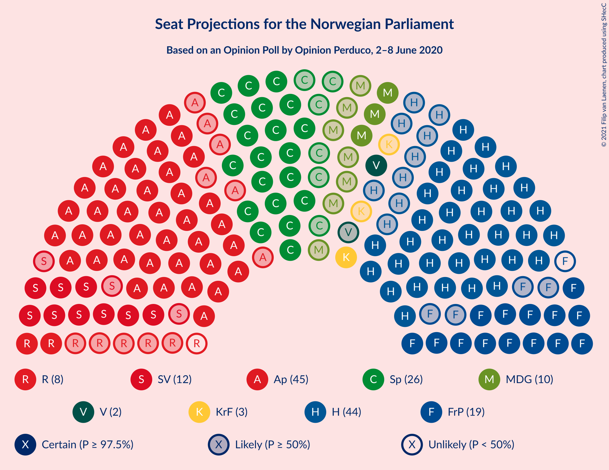
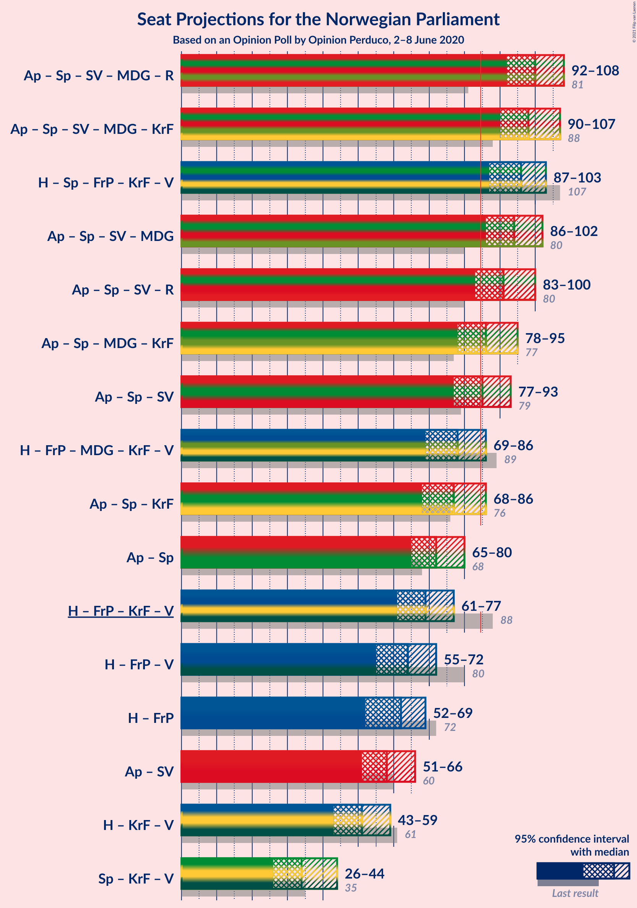
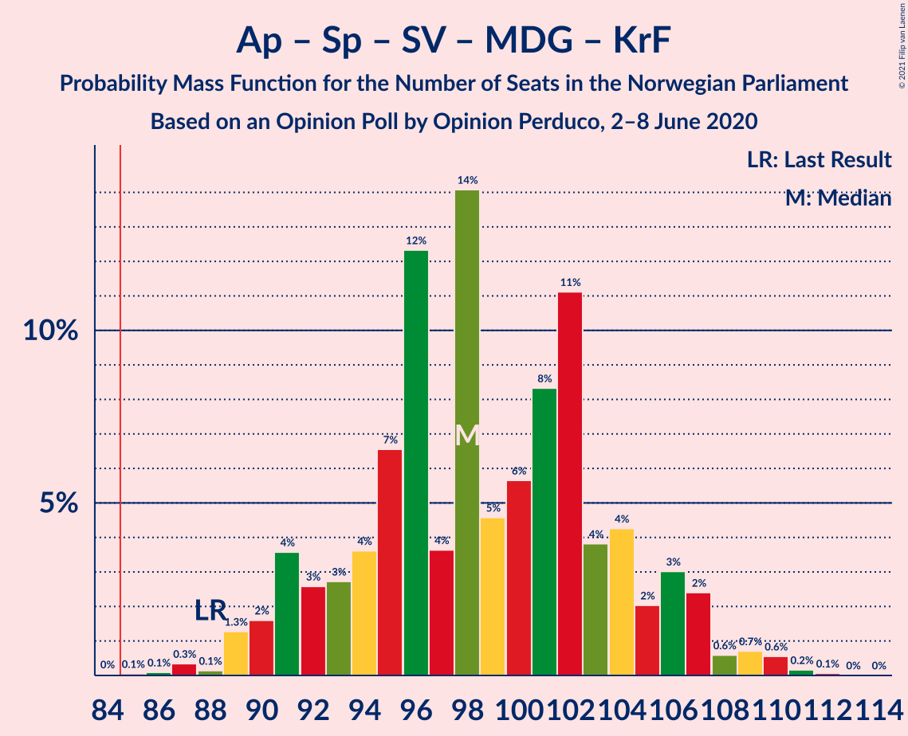
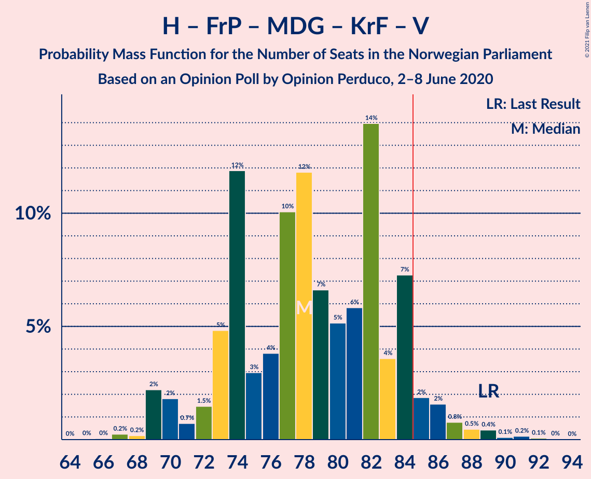

# Opinion Poll by Opinion Perduco, 2–8 June 2020

<a href="#voting-intentions">Voting Intentions</a> | <a href="#seats">Seats</a> | <a href="#coalitions">Coalitions</a> | <a href="#technical-information">Technical Information</a>

## Voting Intentions

### Confidence Intervals

| Party | Last Result | Poll Result | 80% Confidence Interval | 90% Confidence Interval | 95% Confidence Interval | 99% Confidence Interval |
|:-----:|:-----------:|:-----------:|:-----------------------:|:-----------------------:|:-----------------------:|:-----------------------:|
| Arbeiderpartiet | 27.4% | 25.2% | 23.2–27.4% |22.6–28.0% |22.1–28.6% |21.2–29.6% |
| Høyre | 25.0% | 24.4% | 22.4–26.5% |21.8–27.1% |21.3–27.7% |20.4–28.7% |
| Senterpartiet | 10.3% | 14.6% | 13.0–16.5% |12.6–17.0% |12.2–17.4% |11.5–18.4% |
| Fremskrittspartiet | 15.2% | 10.5% | 9.1–12.1% |8.7–12.5% |8.4–13.0% |7.8–13.8% |
| Sosialistisk Venstreparti | 6.0% | 7.2% | 6.1–8.6% |5.7–9.0% |5.5–9.3% |5.0–10.0% |
| Miljøpartiet De Grønne | 3.2% | 5.6% | 4.6–6.9% |4.3–7.2% |4.1–7.6% |3.7–8.2% |
| Rødt | 2.4% | 4.3% | 3.5–5.5% |3.2–5.8% |3.0–6.1% |2.7–6.7% |
| Kristelig Folkeparti | 4.2% | 3.9% | 3.1–5.0% |2.9–5.3% |2.7–5.6% |2.3–6.2% |
| Venstre | 4.4% | 3.4% | 2.7–4.5% |2.5–4.8% |2.3–5.1% |2.0–5.6% |

*Note:* The poll result column reflects the actual value used in the calculations. Published results may vary slightly, and in addition be rounded to fewer digits.

## Seats

### Confidence Intervals

| Party | Last Result | Median | 80% Confidence Interval | 90% Confidence Interval | 95% Confidence Interval | 99% Confidence Interval |
|:-----:|:-----------:|:------:|:-----------------------:|:-----------------------:|:-----------------------:|:-----------------------:|
| <a href="#arbeiderpartiet">Arbeiderpartiet</a> | 49 | 45 | 41–49 |40–51 |40–52 |38–55 |
| <a href="#høyre">Høyre</a> | 45 | 43 | 36–47 |35–50 |35–50 |34–51 |
| <a href="#senterpartiet">Senterpartiet</a> | 19 | 27 | 21–32 |20–33 |20–34 |19–36 |
| <a href="#fremskrittspartiet">Fremskrittspartiet</a> | 27 | 17 | 15–21 |14–21 |14–22 |12–24 |
| <a href="#sosialistisk-venstreparti">Sosialistisk Venstreparti</a> | 11 | 13 | 11–16 |10–16 |9–17 |9–19 |
| <a href="#miljøpartiet-de-grønne">Miljøpartiet De Grønne</a> | 1 | 10 | 8–11 |2–12 |2–13 |2–14 |
| <a href="#rødt">Rødt</a> | 1 | 8 | 2–10 |2–10 |2–11 |1–11 |
| <a href="#kristelig-folkeparti">Kristelig Folkeparti</a> | 8 | 7 | 2–9 |1–9 |1–10 |1–10 |
| <a href="#venstre">Venstre</a> | 8 | 2 | 1–7 |1–7 |1–8 |0–9 |

### Arbeiderpartiet

*For a full overview of the results for this party, see the [Arbeiderpartiet](party-arbeiderpartiet.html) page.*

| Number of Seats | Probability | Accumulated | Special Marks |
|:---------------:|:-----------:|:-----------:|:-------------:|
| 36 | 0.1% | 100% |  |
| 37 | 0.2% | 99.9% |  |
| 38 | 0.5% | 99.7% |  |
| 39 | 0.7% | 99.2% |  |
| 40 | 5% | 98% |  |
| 41 | 4% | 93% |  |
| 42 | 10% | 90% |  |
| 43 | 4% | 80% |  |
| 44 | 23% | 76% |  |
| 45 | 7% | 53% | Median |
| 46 | 6% | 47% |  |
| 47 | 24% | 40% |  |
| 48 | 4% | 16% |  |
| 49 | 4% | 12% | Last Result |
| 50 | 3% | 9% |  |
| 51 | 3% | 6% |  |
| 52 | 1.1% | 3% |  |
| 53 | 1.0% | 2% |  |
| 54 | 0.6% | 1.3% |  |
| 55 | 0.3% | 0.7% |  |
| 56 | 0.1% | 0.4% |  |
| 57 | 0.2% | 0.3% |  |
| 58 | 0.1% | 0.1% |  |
| 59 | 0% | 0% |  |

### Høyre

*For a full overview of the results for this party, see the [Høyre](party-høyre.html) page.*

| Number of Seats | Probability | Accumulated | Special Marks |
|:---------------:|:-----------:|:-----------:|:-------------:|
| 32 | 0.1% | 100% |  |
| 33 | 0.4% | 99.9% |  |
| 34 | 0.3% | 99.6% |  |
| 35 | 9% | 99.3% |  |
| 36 | 8% | 90% |  |
| 37 | 9% | 82% |  |
| 38 | 0.8% | 73% |  |
| 39 | 6% | 72% |  |
| 40 | 2% | 67% |  |
| 41 | 3% | 64% |  |
| 42 | 8% | 61% |  |
| 43 | 7% | 54% | Median |
| 44 | 25% | 47% |  |
| 45 | 2% | 22% | Last Result |
| 46 | 3% | 20% |  |
| 47 | 7% | 17% |  |
| 48 | 1.0% | 10% |  |
| 49 | 0.9% | 9% |  |
| 50 | 6% | 8% |  |
| 51 | 2% | 2% |  |
| 52 | 0.2% | 0.2% |  |
| 53 | 0% | 0% |  |

### Senterpartiet

*For a full overview of the results for this party, see the [Senterpartiet](party-senterpartiet.html) page.*

| Number of Seats | Probability | Accumulated | Special Marks |
|:---------------:|:-----------:|:-----------:|:-------------:|
| 18 | 0.3% | 100% |  |
| 19 | 1.4% | 99.7% | Last Result |
| 20 | 6% | 98% |  |
| 21 | 3% | 92% |  |
| 22 | 1.5% | 89% |  |
| 23 | 9% | 87% |  |
| 24 | 3% | 78% |  |
| 25 | 5% | 74% |  |
| 26 | 17% | 70% |  |
| 27 | 3% | 52% | Median |
| 28 | 26% | 49% |  |
| 29 | 6% | 23% |  |
| 30 | 4% | 17% |  |
| 31 | 3% | 13% |  |
| 32 | 5% | 10% |  |
| 33 | 2% | 5% |  |
| 34 | 2% | 3% |  |
| 35 | 0.4% | 2% |  |
| 36 | 1.2% | 1.5% |  |
| 37 | 0.2% | 0.3% |  |
| 38 | 0.1% | 0.1% |  |
| 39 | 0% | 0% |  |

### Fremskrittspartiet

*For a full overview of the results for this party, see the [Fremskrittspartiet](party-fremskrittspartiet.html) page.*

| Number of Seats | Probability | Accumulated | Special Marks |
|:---------------:|:-----------:|:-----------:|:-------------:|
| 11 | 0.1% | 100% |  |
| 12 | 0.9% | 99.9% |  |
| 13 | 0.8% | 99.0% |  |
| 14 | 4% | 98% |  |
| 15 | 26% | 94% |  |
| 16 | 7% | 68% |  |
| 17 | 14% | 61% | Median |
| 18 | 17% | 47% |  |
| 19 | 10% | 29% |  |
| 20 | 8% | 19% |  |
| 21 | 6% | 11% |  |
| 22 | 3% | 5% |  |
| 23 | 1.2% | 2% |  |
| 24 | 0.4% | 0.8% |  |
| 25 | 0.3% | 0.4% |  |
| 26 | 0% | 0.1% |  |
| 27 | 0.1% | 0.1% | Last Result |
| 28 | 0% | 0% |  |

### Sosialistisk Venstreparti

*For a full overview of the results for this party, see the [Sosialistisk Venstreparti](party-sosialistiskvenstreparti.html) page.*

| Number of Seats | Probability | Accumulated | Special Marks |
|:---------------:|:-----------:|:-----------:|:-------------:|
| 8 | 0.4% | 100% |  |
| 9 | 2% | 99.6% |  |
| 10 | 7% | 97% |  |
| 11 | 17% | 90% | Last Result |
| 12 | 18% | 73% |  |
| 13 | 14% | 55% | Median |
| 14 | 11% | 41% |  |
| 15 | 6% | 30% |  |
| 16 | 20% | 24% |  |
| 17 | 3% | 4% |  |
| 18 | 0.2% | 1.1% |  |
| 19 | 0.8% | 0.9% |  |
| 20 | 0.1% | 0.1% |  |
| 21 | 0% | 0% |  |

### Miljøpartiet De Grønne

*For a full overview of the results for this party, see the [Miljøpartiet De Grønne](party-miljøpartietdegrønne.html) page.*

| Number of Seats | Probability | Accumulated | Special Marks |
|:---------------:|:-----------:|:-----------:|:-------------:|
| 1 | 0.3% | 100% | Last Result |
| 2 | 5% | 99.7% |  |
| 3 | 0.1% | 95% |  |
| 4 | 0% | 95% |  |
| 5 | 0% | 95% |  |
| 6 | 0.1% | 95% |  |
| 7 | 2% | 95% |  |
| 8 | 22% | 92% |  |
| 9 | 16% | 71% |  |
| 10 | 31% | 55% | Median |
| 11 | 14% | 24% |  |
| 12 | 6% | 10% |  |
| 13 | 3% | 4% |  |
| 14 | 0.5% | 0.9% |  |
| 15 | 0.3% | 0.4% |  |
| 16 | 0.1% | 0.1% |  |
| 17 | 0% | 0% |  |

### Rødt

*For a full overview of the results for this party, see the [Rødt](party-rødt.html) page.*

| Number of Seats | Probability | Accumulated | Special Marks |
|:---------------:|:-----------:|:-----------:|:-------------:|
| 1 | 2% | 100% | Last Result |
| 2 | 17% | 98% |  |
| 3 | 0% | 82% |  |
| 4 | 0% | 82% |  |
| 5 | 0% | 82% |  |
| 6 | 2% | 82% |  |
| 7 | 23% | 80% |  |
| 8 | 25% | 56% | Median |
| 9 | 19% | 32% |  |
| 10 | 10% | 13% |  |
| 11 | 3% | 3% |  |
| 12 | 0.2% | 0.3% |  |
| 13 | 0% | 0% |  |

### Kristelig Folkeparti

*For a full overview of the results for this party, see the [Kristelig Folkeparti](party-kristeligfolkeparti.html) page.*

| Number of Seats | Probability | Accumulated | Special Marks |
|:---------------:|:-----------:|:-----------:|:-------------:|
| 0 | 0.3% | 100% |  |
| 1 | 9% | 99.7% |  |
| 2 | 5% | 91% |  |
| 3 | 27% | 85% |  |
| 4 | 0% | 58% |  |
| 5 | 0% | 58% |  |
| 6 | 2% | 58% |  |
| 7 | 27% | 57% | Median |
| 8 | 19% | 29% | Last Result |
| 9 | 8% | 10% |  |
| 10 | 2% | 3% |  |
| 11 | 0.2% | 0.3% |  |
| 12 | 0.1% | 0.1% |  |
| 13 | 0% | 0% |  |

### Venstre

*For a full overview of the results for this party, see the [Venstre](party-venstre.html) page.*

| Number of Seats | Probability | Accumulated | Special Marks |
|:---------------:|:-----------:|:-----------:|:-------------:|
| 0 | 0.8% | 100% |  |
| 1 | 20% | 99.2% |  |
| 2 | 63% | 79% | Median |
| 3 | 0% | 17% |  |
| 4 | 0% | 17% |  |
| 5 | 0% | 17% |  |
| 6 | 4% | 17% |  |
| 7 | 9% | 13% |  |
| 8 | 4% | 4% | Last Result |
| 9 | 0.6% | 0.9% |  |
| 10 | 0.2% | 0.2% |  |
| 11 | 0.1% | 0.1% |  |
| 12 | 0% | 0% |  |

## Coalitions

### Confidence Intervals

| Coalition | Last Result | Median | Majority? | 80% Confidence Interval | 90% Confidence Interval | 95% Confidence Interval | 99% Confidence Interval |
|:---------:|:-----------:|:------:|:---------:|:-----------------------:|:-----------------------:|:-----------------------:|:-----------------------:|
| Arbeiderpartiet – Senterpartiet – Sosialistisk Venstreparti – Miljøpartiet De Grønne – Rødt | 81 | 102 | 100% | 95–107 | 95–107 | 93–109 | 90–111 |
| Arbeiderpartiet – Senterpartiet – Sosialistisk Venstreparti – Miljøpartiet De Grønne – Kristelig Folkeparti | 88 | 101 | 99.8% | 94–106 | 93–107 | 91–108 | 87–110 |
| Høyre – Senterpartiet – Fremskrittspartiet – Kristelig Folkeparti – Venstre | 107 | 93 | 98.5% | 91–100 | 88–101 | 87–103 | 83–108 |
| Arbeiderpartiet – Senterpartiet – Sosialistisk Venstreparti – Miljøpartiet De Grønne | 80 | 96 | 99.3% | 88–99 | 87–101 | 86–103 | 84–104 |
| Arbeiderpartiet – Senterpartiet – Sosialistisk Venstreparti – Rødt | 80 | 93 | 96% | 87–97 | 86–100 | 84–100 | 80–101 |
| Arbeiderpartiet – Senterpartiet – Miljøpartiet De Grønne – Kristelig Folkeparti | 77 | 85 | 67% | 80–94 | 79–95 | 79–96 | 76–99 |
| Arbeiderpartiet – Senterpartiet – Sosialistisk Venstreparti | 79 | 86 | 60% | 79–90 | 78–91 | 77–93 | 74–95 |
| Arbeiderpartiet – Senterpartiet – Kristelig Folkeparti | 76 | 77 | 10% | 71–84 | 70–86 | 69–87 | 67–88 |
| Høyre – Fremskrittspartiet – Miljøpartiet De Grønne – Kristelig Folkeparti – Venstre | 89 | 76 | 4% | 72–82 | 69–83 | 69–85 | 68–89 |
| Arbeiderpartiet – Senterpartiet | 68 | 72 | 0.1% | 66–77 | 65–79 | 64–80 | 63–82 |
| Høyre – Fremskrittspartiet – Kristelig Folkeparti – Venstre | 88 | 67 | 0% | 62–74 | 62–74 | 60–76 | 58–79 |
| Høyre – Fremskrittspartiet – Venstre | 80 | 61 | 0% | 56–67 | 55–69 | 55–74 | 53–76 |
| Høyre – Fremskrittspartiet | 72 | 59 | 0% | 54–65 | 53–66 | 52–69 | 50–72 |
| Arbeiderpartiet – Sosialistisk Venstreparti | 60 | 58 | 0% | 55–63 | 52–64 | 51–65 | 50–69 |
| Høyre – Kristelig Folkeparti – Venstre | 61 | 49 | 0% | 45–57 | 44–59 | 44–59 | 41–61 |
| Senterpartiet – Kristelig Folkeparti – Venstre | 35 | 34 | 0% | 29–41 | 28–42 | 27–44 | 24–48 |

### Arbeiderpartiet – Senterpartiet – Sosialistisk Venstreparti – Miljøpartiet De Grønne – Rødt

| Number of Seats | Probability | Accumulated | Special Marks |
|:---------------:|:-----------:|:-----------:|:-------------:|
| 81 | 0% | 100% | Last Result |
| 82 | 0% | 100% |  |
| 83 | 0% | 100% |  |
| 84 | 0% | 100% |  |
| 85 | 0% | 100% | Majority |
| 86 | 0.1% | 100% |  |
| 87 | 0% | 99.9% |  |
| 88 | 0.2% | 99.9% |  |
| 89 | 0.1% | 99.6% |  |
| 90 | 0.4% | 99.6% |  |
| 91 | 0.2% | 99.1% |  |
| 92 | 1.1% | 98.9% |  |
| 93 | 1.0% | 98% |  |
| 94 | 2% | 97% |  |
| 95 | 6% | 95% |  |
| 96 | 6% | 89% |  |
| 97 | 1.2% | 83% |  |
| 98 | 9% | 82% |  |
| 99 | 8% | 73% |  |
| 100 | 9% | 65% |  |
| 101 | 5% | 57% |  |
| 102 | 6% | 51% |  |
| 103 | 1.2% | 45% | Median |
| 104 | 6% | 44% |  |
| 105 | 24% | 38% |  |
| 106 | 2% | 14% |  |
| 107 | 8% | 12% |  |
| 108 | 1.4% | 4% |  |
| 109 | 0.2% | 3% |  |
| 110 | 1.4% | 2% |  |
| 111 | 0.8% | 1.0% |  |
| 112 | 0.1% | 0.2% |  |
| 113 | 0.1% | 0.1% |  |
| 114 | 0% | 0% |  |

### Arbeiderpartiet – Senterpartiet – Sosialistisk Venstreparti – Miljøpartiet De Grønne – Kristelig Folkeparti

| Number of Seats | Probability | Accumulated | Special Marks |
|:---------------:|:-----------:|:-----------:|:-------------:|
| 82 | 0.1% | 100% |  |
| 83 | 0% | 99.9% |  |
| 84 | 0.1% | 99.9% |  |
| 85 | 0.1% | 99.8% | Majority |
| 86 | 0.1% | 99.7% |  |
| 87 | 0.2% | 99.6% |  |
| 88 | 0.1% | 99.4% | Last Result |
| 89 | 0.2% | 99.4% |  |
| 90 | 0.3% | 99.2% |  |
| 91 | 2% | 99.0% |  |
| 92 | 0.7% | 97% |  |
| 93 | 3% | 96% |  |
| 94 | 7% | 93% |  |
| 95 | 7% | 87% |  |
| 96 | 11% | 80% |  |
| 97 | 3% | 69% |  |
| 98 | 4% | 66% |  |
| 99 | 4% | 62% |  |
| 100 | 7% | 58% |  |
| 101 | 18% | 51% |  |
| 102 | 3% | 32% | Median |
| 103 | 2% | 29% |  |
| 104 | 10% | 28% |  |
| 105 | 2% | 17% |  |
| 106 | 9% | 15% |  |
| 107 | 3% | 7% |  |
| 108 | 2% | 4% |  |
| 109 | 0.8% | 2% |  |
| 110 | 1.4% | 2% |  |
| 111 | 0.1% | 0.3% |  |
| 112 | 0.1% | 0.1% |  |
| 113 | 0% | 0% |  |

### Høyre – Senterpartiet – Fremskrittspartiet – Kristelig Folkeparti – Venstre

| Number of Seats | Probability | Accumulated | Special Marks |
|:---------------:|:-----------:|:-----------:|:-------------:|
| 81 | 0.1% | 100% |  |
| 82 | 0% | 99.9% |  |
| 83 | 0.5% | 99.9% |  |
| 84 | 0.8% | 99.4% |  |
| 85 | 0.1% | 98.5% | Majority |
| 86 | 0.7% | 98% |  |
| 87 | 2% | 98% |  |
| 88 | 2% | 95% |  |
| 89 | 0.4% | 94% |  |
| 90 | 1.4% | 93% |  |
| 91 | 11% | 92% |  |
| 92 | 25% | 81% |  |
| 93 | 6% | 56% |  |
| 94 | 9% | 50% |  |
| 95 | 11% | 41% |  |
| 96 | 3% | 30% | Median |
| 97 | 11% | 27% |  |
| 98 | 2% | 16% |  |
| 99 | 3% | 14% |  |
| 100 | 2% | 11% |  |
| 101 | 4% | 9% |  |
| 102 | 0.9% | 5% |  |
| 103 | 2% | 4% |  |
| 104 | 0.9% | 2% |  |
| 105 | 0.2% | 1.0% |  |
| 106 | 0.1% | 0.8% |  |
| 107 | 0.1% | 0.6% | Last Result |
| 108 | 0.1% | 0.5% |  |
| 109 | 0.4% | 0.4% |  |
| 110 | 0% | 0% |  |

### Arbeiderpartiet – Senterpartiet – Sosialistisk Venstreparti – Miljøpartiet De Grønne

| Number of Seats | Probability | Accumulated | Special Marks |
|:---------------:|:-----------:|:-----------:|:-------------:|
| 80 | 0% | 100% | Last Result |
| 81 | 0.2% | 100% |  |
| 82 | 0.1% | 99.8% |  |
| 83 | 0.2% | 99.7% |  |
| 84 | 0.2% | 99.5% |  |
| 85 | 0.9% | 99.3% | Majority |
| 86 | 1.2% | 98% |  |
| 87 | 6% | 97% |  |
| 88 | 8% | 91% |  |
| 89 | 1.4% | 83% |  |
| 90 | 4% | 81% |  |
| 91 | 5% | 77% |  |
| 92 | 2% | 72% |  |
| 93 | 9% | 70% |  |
| 94 | 6% | 61% |  |
| 95 | 5% | 55% | Median |
| 96 | 11% | 50% |  |
| 97 | 5% | 39% |  |
| 98 | 21% | 34% |  |
| 99 | 7% | 13% |  |
| 100 | 1.1% | 6% |  |
| 101 | 0.8% | 5% |  |
| 102 | 2% | 5% |  |
| 103 | 2% | 3% |  |
| 104 | 0.4% | 0.9% |  |
| 105 | 0.2% | 0.4% |  |
| 106 | 0.1% | 0.3% |  |
| 107 | 0.1% | 0.2% |  |
| 108 | 0% | 0.1% |  |
| 109 | 0% | 0% |  |

### Arbeiderpartiet – Senterpartiet – Sosialistisk Venstreparti – Rødt

| Number of Seats | Probability | Accumulated | Special Marks |
|:---------------:|:-----------:|:-----------:|:-------------:|
| 76 | 0% | 100% |  |
| 77 | 0% | 99.9% |  |
| 78 | 0% | 99.9% |  |
| 79 | 0.2% | 99.9% |  |
| 80 | 0.3% | 99.7% | Last Result |
| 81 | 1.2% | 99.4% |  |
| 82 | 0.2% | 98% |  |
| 83 | 0.4% | 98% |  |
| 84 | 1.2% | 98% |  |
| 85 | 1.3% | 96% | Majority |
| 86 | 3% | 95% |  |
| 87 | 8% | 92% |  |
| 88 | 9% | 84% |  |
| 89 | 10% | 76% |  |
| 90 | 3% | 66% |  |
| 91 | 3% | 63% |  |
| 92 | 9% | 60% |  |
| 93 | 4% | 51% | Median |
| 94 | 0.5% | 47% |  |
| 95 | 30% | 46% |  |
| 96 | 6% | 17% |  |
| 97 | 2% | 11% |  |
| 98 | 0.6% | 8% |  |
| 99 | 1.1% | 8% |  |
| 100 | 6% | 7% |  |
| 101 | 0.3% | 0.7% |  |
| 102 | 0.2% | 0.4% |  |
| 103 | 0.1% | 0.3% |  |
| 104 | 0.2% | 0.2% |  |
| 105 | 0% | 0% |  |

### Arbeiderpartiet – Senterpartiet – Miljøpartiet De Grønne – Kristelig Folkeparti

| Number of Seats | Probability | Accumulated | Special Marks |
|:---------------:|:-----------:|:-----------:|:-------------:|
| 71 | 0.1% | 100% |  |
| 72 | 0.1% | 99.9% |  |
| 73 | 0% | 99.8% |  |
| 74 | 0% | 99.8% |  |
| 75 | 0.2% | 99.8% |  |
| 76 | 0.4% | 99.6% |  |
| 77 | 0.3% | 99.3% | Last Result |
| 78 | 0.4% | 98.9% |  |
| 79 | 5% | 98.5% |  |
| 80 | 10% | 94% |  |
| 81 | 5% | 83% |  |
| 82 | 6% | 78% |  |
| 83 | 1.3% | 72% |  |
| 84 | 4% | 71% |  |
| 85 | 18% | 67% | Majority |
| 86 | 3% | 49% |  |
| 87 | 2% | 46% |  |
| 88 | 9% | 44% |  |
| 89 | 5% | 35% | Median |
| 90 | 3% | 30% |  |
| 91 | 0.9% | 28% |  |
| 92 | 2% | 27% |  |
| 93 | 10% | 24% |  |
| 94 | 6% | 14% |  |
| 95 | 5% | 9% |  |
| 96 | 3% | 4% |  |
| 97 | 0.1% | 0.9% |  |
| 98 | 0.2% | 0.8% |  |
| 99 | 0.5% | 0.6% |  |
| 100 | 0.1% | 0.1% |  |
| 101 | 0% | 0% |  |

### Arbeiderpartiet – Senterpartiet – Sosialistisk Venstreparti

| Number of Seats | Probability | Accumulated | Special Marks |
|:---------------:|:-----------:|:-----------:|:-------------:|
| 72 | 0.1% | 100% |  |
| 73 | 0.1% | 99.9% |  |
| 74 | 0.3% | 99.8% |  |
| 75 | 0.3% | 99.5% |  |
| 76 | 1.0% | 99.1% |  |
| 77 | 1.0% | 98% |  |
| 78 | 4% | 97% |  |
| 79 | 8% | 94% | Last Result |
| 80 | 5% | 85% |  |
| 81 | 2% | 80% |  |
| 82 | 9% | 78% |  |
| 83 | 4% | 68% |  |
| 84 | 4% | 65% |  |
| 85 | 4% | 60% | Median, Majority |
| 86 | 13% | 56% |  |
| 87 | 8% | 43% |  |
| 88 | 18% | 35% |  |
| 89 | 1.1% | 17% |  |
| 90 | 7% | 16% |  |
| 91 | 5% | 9% |  |
| 92 | 1.3% | 4% |  |
| 93 | 0.5% | 3% |  |
| 94 | 2% | 2% |  |
| 95 | 0.4% | 0.8% |  |
| 96 | 0.3% | 0.4% |  |
| 97 | 0% | 0.1% |  |
| 98 | 0% | 0.1% |  |
| 99 | 0% | 0% |  |

### Arbeiderpartiet – Senterpartiet – Kristelig Folkeparti

| Number of Seats | Probability | Accumulated | Special Marks |
|:---------------:|:-----------:|:-----------:|:-------------:|
| 62 | 0.1% | 100% |  |
| 63 | 0% | 99.9% |  |
| 64 | 0.1% | 99.9% |  |
| 65 | 0.1% | 99.9% |  |
| 66 | 0.2% | 99.7% |  |
| 67 | 0.3% | 99.6% |  |
| 68 | 0.8% | 99.2% |  |
| 69 | 3% | 98% |  |
| 70 | 5% | 96% |  |
| 71 | 2% | 90% |  |
| 72 | 6% | 88% |  |
| 73 | 4% | 82% |  |
| 74 | 7% | 78% |  |
| 75 | 18% | 71% |  |
| 76 | 2% | 53% | Last Result |
| 77 | 2% | 51% |  |
| 78 | 9% | 49% |  |
| 79 | 5% | 40% | Median |
| 80 | 7% | 36% |  |
| 81 | 3% | 29% |  |
| 82 | 2% | 26% |  |
| 83 | 13% | 24% |  |
| 84 | 1.2% | 11% |  |
| 85 | 1.4% | 10% | Majority |
| 86 | 5% | 8% |  |
| 87 | 2% | 3% |  |
| 88 | 0.5% | 0.9% |  |
| 89 | 0.2% | 0.3% |  |
| 90 | 0.1% | 0.2% |  |
| 91 | 0% | 0% |  |

### Høyre – Fremskrittspartiet – Miljøpartiet De Grønne – Kristelig Folkeparti – Venstre

| Number of Seats | Probability | Accumulated | Special Marks |
|:---------------:|:-----------:|:-----------:|:-------------:|
| 65 | 0.2% | 100% |  |
| 66 | 0.1% | 99.8% |  |
| 67 | 0.2% | 99.7% |  |
| 68 | 0.3% | 99.6% |  |
| 69 | 6% | 99.3% |  |
| 70 | 1.1% | 93% |  |
| 71 | 0.6% | 92% |  |
| 72 | 2% | 92% |  |
| 73 | 6% | 89% |  |
| 74 | 30% | 83% |  |
| 75 | 0.5% | 54% |  |
| 76 | 4% | 53% |  |
| 77 | 9% | 49% |  |
| 78 | 3% | 40% |  |
| 79 | 3% | 37% | Median |
| 80 | 10% | 34% |  |
| 81 | 9% | 24% |  |
| 82 | 8% | 16% |  |
| 83 | 3% | 8% |  |
| 84 | 1.3% | 5% |  |
| 85 | 1.2% | 4% | Majority |
| 86 | 0.4% | 2% |  |
| 87 | 0.2% | 2% |  |
| 88 | 1.2% | 2% |  |
| 89 | 0.3% | 0.6% | Last Result |
| 90 | 0.2% | 0.3% |  |
| 91 | 0% | 0.1% |  |
| 92 | 0% | 0.1% |  |
| 93 | 0% | 0.1% |  |
| 94 | 0% | 0% |  |

### Arbeiderpartiet – Senterpartiet

| Number of Seats | Probability | Accumulated | Special Marks |
|:---------------:|:-----------:|:-----------:|:-------------:|
| 60 | 0% | 100% |  |
| 61 | 0.2% | 99.9% |  |
| 62 | 0.1% | 99.7% |  |
| 63 | 0.4% | 99.6% |  |
| 64 | 2% | 99.2% |  |
| 65 | 6% | 97% |  |
| 66 | 5% | 91% |  |
| 67 | 7% | 87% |  |
| 68 | 6% | 79% | Last Result |
| 69 | 0.9% | 73% |  |
| 70 | 8% | 72% |  |
| 71 | 3% | 65% |  |
| 72 | 17% | 61% | Median |
| 73 | 7% | 44% |  |
| 74 | 3% | 37% |  |
| 75 | 16% | 35% |  |
| 76 | 6% | 19% |  |
| 77 | 3% | 13% |  |
| 78 | 4% | 9% |  |
| 79 | 1.1% | 5% |  |
| 80 | 3% | 4% |  |
| 81 | 0.3% | 0.9% |  |
| 82 | 0.3% | 0.6% |  |
| 83 | 0% | 0.3% |  |
| 84 | 0.1% | 0.2% |  |
| 85 | 0% | 0.1% | Majority |
| 86 | 0.1% | 0.1% |  |
| 87 | 0% | 0% |  |

### Høyre – Fremskrittspartiet – Kristelig Folkeparti – Venstre

| Number of Seats | Probability | Accumulated | Special Marks |
|:---------------:|:-----------:|:-----------:|:-------------:|
| 56 | 0.1% | 100% |  |
| 57 | 0.1% | 99.9% |  |
| 58 | 0.8% | 99.8% |  |
| 59 | 1.4% | 99.0% |  |
| 60 | 0.2% | 98% |  |
| 61 | 1.4% | 97% |  |
| 62 | 8% | 96% |  |
| 63 | 2% | 88% |  |
| 64 | 24% | 86% |  |
| 65 | 6% | 62% |  |
| 66 | 1.2% | 56% |  |
| 67 | 6% | 55% |  |
| 68 | 5% | 49% |  |
| 69 | 9% | 43% | Median |
| 70 | 8% | 35% |  |
| 71 | 9% | 27% |  |
| 72 | 1.2% | 18% |  |
| 73 | 6% | 17% |  |
| 74 | 6% | 11% |  |
| 75 | 2% | 5% |  |
| 76 | 1.0% | 3% |  |
| 77 | 1.1% | 2% |  |
| 78 | 0.2% | 1.1% |  |
| 79 | 0.4% | 0.9% |  |
| 80 | 0.1% | 0.4% |  |
| 81 | 0.2% | 0.4% |  |
| 82 | 0% | 0.1% |  |
| 83 | 0.1% | 0.1% |  |
| 84 | 0% | 0% |  |
| 85 | 0% | 0% | Majority |
| 86 | 0% | 0% |  |
| 87 | 0% | 0% |  |
| 88 | 0% | 0% | Last Result |

### Høyre – Fremskrittspartiet – Venstre

| Number of Seats | Probability | Accumulated | Special Marks |
|:---------------:|:-----------:|:-----------:|:-------------:|
| 53 | 1.4% | 100% |  |
| 54 | 0.2% | 98.6% |  |
| 55 | 5% | 98% |  |
| 56 | 9% | 93% |  |
| 57 | 2% | 84% |  |
| 58 | 3% | 82% |  |
| 59 | 2% | 79% |  |
| 60 | 4% | 77% |  |
| 61 | 26% | 73% |  |
| 62 | 7% | 47% | Median |
| 63 | 6% | 40% |  |
| 64 | 10% | 34% |  |
| 65 | 3% | 24% |  |
| 66 | 5% | 21% |  |
| 67 | 8% | 16% |  |
| 68 | 1.5% | 7% |  |
| 69 | 2% | 6% |  |
| 70 | 0.2% | 4% |  |
| 71 | 0.9% | 4% |  |
| 72 | 0.2% | 3% |  |
| 73 | 0% | 3% |  |
| 74 | 1.2% | 3% |  |
| 75 | 0.6% | 1.5% |  |
| 76 | 0.4% | 0.9% |  |
| 77 | 0.2% | 0.5% |  |
| 78 | 0.3% | 0.3% |  |
| 79 | 0% | 0.1% |  |
| 80 | 0% | 0.1% | Last Result |
| 81 | 0% | 0% |  |

### Høyre – Fremskrittspartiet

| Number of Seats | Probability | Accumulated | Special Marks |
|:---------------:|:-----------:|:-----------:|:-------------:|
| 48 | 0.1% | 100% |  |
| 49 | 0.2% | 99.9% |  |
| 50 | 0.1% | 99.6% |  |
| 51 | 2% | 99.5% |  |
| 52 | 0.9% | 98% |  |
| 53 | 6% | 97% |  |
| 54 | 11% | 90% |  |
| 55 | 2% | 79% |  |
| 56 | 5% | 77% |  |
| 57 | 5% | 72% |  |
| 58 | 2% | 67% |  |
| 59 | 20% | 65% |  |
| 60 | 8% | 45% | Median |
| 61 | 4% | 36% |  |
| 62 | 11% | 33% |  |
| 63 | 1.3% | 22% |  |
| 64 | 8% | 21% |  |
| 65 | 6% | 13% |  |
| 66 | 2% | 7% |  |
| 67 | 2% | 4% |  |
| 68 | 0.4% | 3% |  |
| 69 | 0.9% | 3% |  |
| 70 | 0.1% | 2% |  |
| 71 | 0.1% | 1.4% |  |
| 72 | 1.0% | 1.3% | Last Result |
| 73 | 0% | 0.3% |  |
| 74 | 0.3% | 0.3% |  |
| 75 | 0% | 0% |  |

### Arbeiderpartiet – Sosialistisk Venstreparti

| Number of Seats | Probability | Accumulated | Special Marks |
|:---------------:|:-----------:|:-----------:|:-------------:|
| 46 | 0.1% | 100% |  |
| 47 | 0% | 99.9% |  |
| 48 | 0.1% | 99.9% |  |
| 49 | 0.1% | 99.8% |  |
| 50 | 1.1% | 99.7% |  |
| 51 | 1.3% | 98.6% |  |
| 52 | 2% | 97% |  |
| 53 | 2% | 95% |  |
| 54 | 3% | 93% |  |
| 55 | 2% | 90% |  |
| 56 | 18% | 88% |  |
| 57 | 8% | 70% |  |
| 58 | 17% | 62% | Median |
| 59 | 6% | 45% |  |
| 60 | 20% | 39% | Last Result |
| 61 | 1.5% | 19% |  |
| 62 | 4% | 17% |  |
| 63 | 7% | 14% |  |
| 64 | 4% | 7% |  |
| 65 | 2% | 4% |  |
| 66 | 0.5% | 2% |  |
| 67 | 0.4% | 1.3% |  |
| 68 | 0.2% | 1.0% |  |
| 69 | 0.5% | 0.8% |  |
| 70 | 0.2% | 0.2% |  |
| 71 | 0% | 0.1% |  |
| 72 | 0% | 0% |  |

### Høyre – Kristelig Folkeparti – Venstre

| Number of Seats | Probability | Accumulated | Special Marks |
|:---------------:|:-----------:|:-----------:|:-------------:|
| 39 | 0.2% | 100% |  |
| 40 | 0.1% | 99.8% |  |
| 41 | 0.8% | 99.7% |  |
| 42 | 0.6% | 98.8% |  |
| 43 | 0.4% | 98% |  |
| 44 | 6% | 98% |  |
| 45 | 9% | 92% |  |
| 46 | 9% | 83% |  |
| 47 | 5% | 74% |  |
| 48 | 3% | 70% |  |
| 49 | 22% | 67% |  |
| 50 | 3% | 45% |  |
| 51 | 7% | 42% |  |
| 52 | 8% | 35% | Median |
| 53 | 4% | 26% |  |
| 54 | 3% | 22% |  |
| 55 | 3% | 19% |  |
| 56 | 6% | 16% |  |
| 57 | 2% | 10% |  |
| 58 | 0.5% | 8% |  |
| 59 | 6% | 7% |  |
| 60 | 1.1% | 2% |  |
| 61 | 0.4% | 0.8% | Last Result |
| 62 | 0.2% | 0.4% |  |
| 63 | 0% | 0.2% |  |
| 64 | 0.1% | 0.2% |  |
| 65 | 0% | 0.1% |  |
| 66 | 0% | 0% |  |

### Senterpartiet – Kristelig Folkeparti – Venstre

| Number of Seats | Probability | Accumulated | Special Marks |
|:---------------:|:-----------:|:-----------:|:-------------:|
| 24 | 0.8% | 100% |  |
| 25 | 0.3% | 99.1% |  |
| 26 | 0.4% | 98.8% |  |
| 27 | 2% | 98% |  |
| 28 | 2% | 96% |  |
| 29 | 10% | 94% |  |
| 30 | 5% | 84% |  |
| 31 | 2% | 79% |  |
| 32 | 7% | 77% |  |
| 33 | 20% | 70% |  |
| 34 | 3% | 51% |  |
| 35 | 3% | 47% | Last Result |
| 36 | 5% | 44% | Median |
| 37 | 4% | 39% |  |
| 38 | 16% | 35% |  |
| 39 | 3% | 19% |  |
| 40 | 3% | 16% |  |
| 41 | 7% | 13% |  |
| 42 | 1.1% | 6% |  |
| 43 | 2% | 5% |  |
| 44 | 2% | 3% |  |
| 45 | 0.2% | 2% |  |
| 46 | 0.8% | 2% |  |
| 47 | 0.4% | 0.9% |  |
| 48 | 0.1% | 0.5% |  |
| 49 | 0% | 0.5% |  |
| 50 | 0.4% | 0.4% |  |
| 51 | 0.1% | 0.1% |  |
| 52 | 0% | 0% |  |

## Technical Information

### Opinion Poll

+ **Polling firm:** Opinion Perduco
+ **Commissioner(s):** —
+ **Fieldwork period:** 2–8 June 2020

### Calculations

+ **Sample size:** 698
+ **Simulations done:** 131,072
+ **Error estimate:** 2.45%

