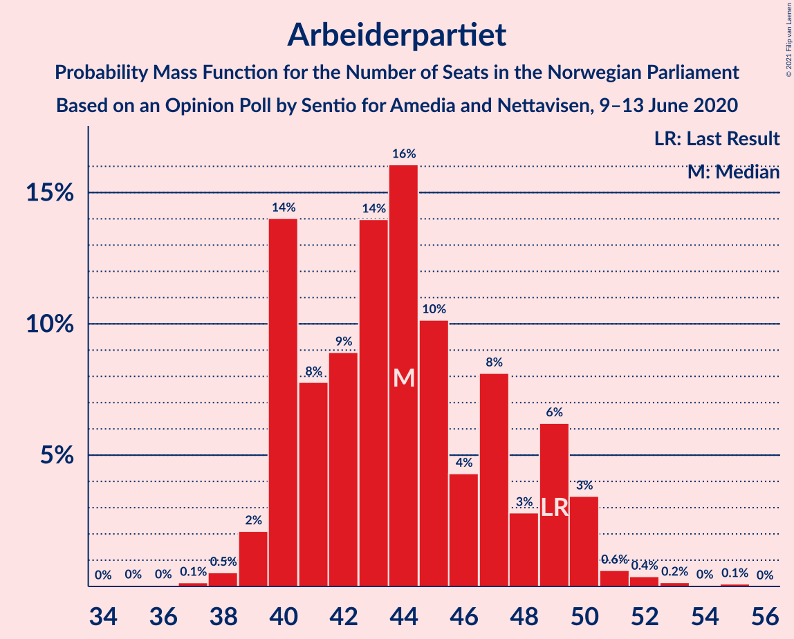
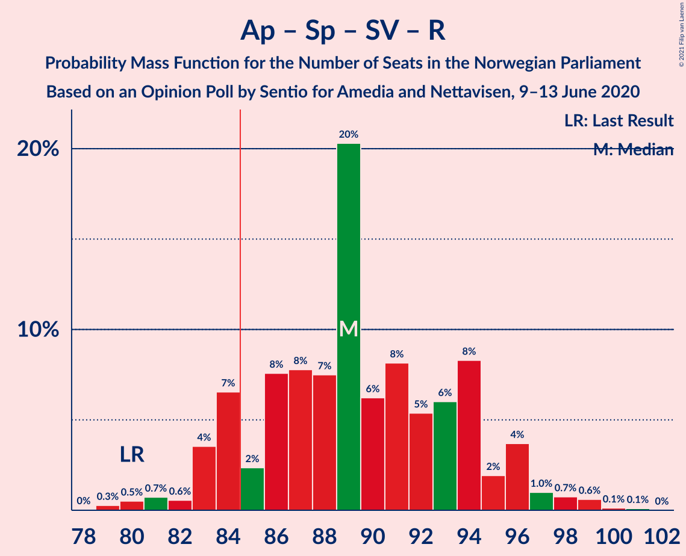
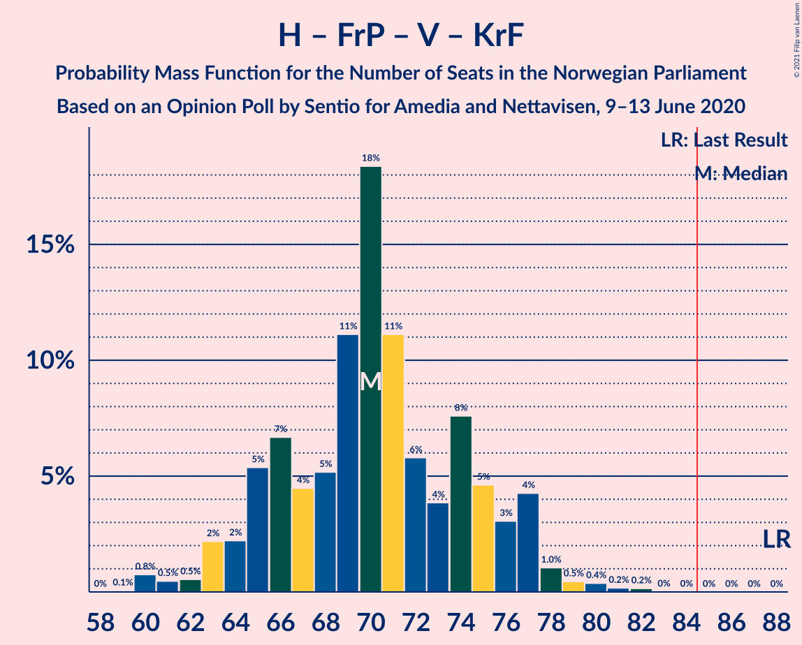
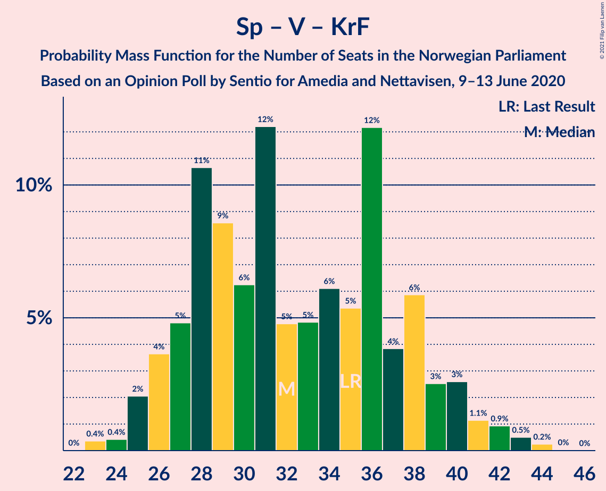

# Opinion Poll by Sentio for Amedia and Nettavisen, 9–13 June 2020

<a href="#voting-intentions">Voting Intentions</a> | <a href="#seats">Seats</a> | <a href="#coalitions">Coalitions</a> | <a href="#technical-information">Technical Information</a>

## Voting Intentions

### Confidence Intervals

| Party | Last Result | Poll Result | 80% Confidence Interval | 90% Confidence Interval | 95% Confidence Interval | 99% Confidence Interval |
|:-----:|:-----------:|:-----------:|:-----------------------:|:-----------------------:|:-----------------------:|:-----------------------:|
| Arbeiderpartiet | 27.4% | 24.2% | 22.5–26.0% |22.1–26.5% |21.6–27.0% |20.9–27.8% |
| Høyre | 25.0% | 24.2% | 22.5–26.0% |22.1–26.5% |21.6–27.0% |20.9–27.8% |
| Senterpartiet | 10.3% | 14.0% | 12.7–15.5% |12.3–15.9% |12.0–16.3% |11.4–17.0% |
| Fremskrittspartiet | 15.2% | 11.3% | 10.1–12.7% |9.8–13.1% |9.5–13.4% |8.9–14.1% |
| Sosialistisk Venstreparti | 6.0% | 6.9% | 6.0–8.0% |5.7–8.4% |5.5–8.7% |5.1–9.2% |
| Miljøpartiet De Grønne | 3.2% | 5.4% | 4.6–6.4% |4.3–6.7% |4.2–7.0% |3.8–7.5% |
| Rødt | 2.4% | 5.1% | 4.3–6.1% |4.1–6.4% |3.9–6.6% |3.6–7.2% |
| Venstre | 4.4% | 4.4% | 3.7–5.3% |3.5–5.6% |3.3–5.9% |3.0–6.4% |
| Kristelig Folkeparti | 4.2% | 2.5% | 2.0–3.3% |1.8–3.5% |1.7–3.7% |1.5–4.1% |

*Note:* The poll result column reflects the actual value used in the calculations. Published results may vary slightly, and in addition be rounded to fewer digits.

## Seats

### Confidence Intervals

| Party | Last Result | Median | 80% Confidence Interval | 90% Confidence Interval | 95% Confidence Interval | 99% Confidence Interval |
|:-----:|:-----------:|:------:|:-----------------------:|:-----------------------:|:-----------------------:|:-----------------------:|
| <a href="#arbeiderpartiet">Arbeiderpartiet</a> | 49 | 43 | 40–47 |40–49 |40–50 |39–52 |
| <a href="#høyre">Høyre</a> | 45 | 44 | 37–46 |37–46 |36–47 |35–48 |
| <a href="#senterpartiet">Senterpartiet</a> | 19 | 25 | 22–30 |21–31 |20–31 |19–34 |
| <a href="#fremskrittspartiet">Fremskrittspartiet</a> | 27 | 21 | 17–23 |17–23 |17–25 |16–25 |
| <a href="#sosialistisk-venstreparti">Sosialistisk Venstreparti</a> | 11 | 11 | 10–14 |9–14 |9–15 |9–16 |
| <a href="#miljøpartiet-de-grønne">Miljøpartiet De Grønne</a> | 1 | 9 | 8–12 |8–12 |8–12 |2–13 |
| <a href="#rødt">Rødt</a> | 1 | 9 | 8–11 |7–11 |7–12 |2–12 |
| <a href="#venstre">Venstre</a> | 8 | 7 | 2–9 |2–9 |2–10 |2–10 |
| <a href="#kristelig-folkeparti">Kristelig Folkeparti</a> | 8 | 1 | 0–2 |0–2 |0–3 |0–3 |

### Arbeiderpartiet

*For a full overview of the results for this party, see the [Arbeiderpartiet](party-arbeiderpartiet.html) page.*

| Number of Seats | Probability | Accumulated | Special Marks |
|:---------------:|:-----------:|:-----------:|:-------------:|
| 36 | 0% | 100% |  |
| 37 | 0.1% | 99.9% |  |
| 38 | 0.1% | 99.8% |  |
| 39 | 1.4% | 99.7% |  |
| 40 | 21% | 98% |  |
| 41 | 8% | 78% |  |
| 42 | 11% | 70% |  |
| 43 | 11% | 59% | Median |
| 44 | 22% | 48% |  |
| 45 | 7% | 26% |  |
| 46 | 3% | 18% |  |
| 47 | 8% | 15% |  |
| 48 | 2% | 7% |  |
| 49 | 0.9% | 6% | Last Result |
| 50 | 3% | 5% |  |
| 51 | 1.1% | 2% |  |
| 52 | 0.2% | 0.6% |  |
| 53 | 0.2% | 0.3% |  |
| 54 | 0% | 0.1% |  |
| 55 | 0.1% | 0.1% |  |
| 56 | 0% | 0% |  |

### Høyre

*For a full overview of the results for this party, see the [Høyre](party-høyre.html) page.*

| Number of Seats | Probability | Accumulated | Special Marks |
|:---------------:|:-----------:|:-----------:|:-------------:|
| 34 | 0.1% | 100% |  |
| 35 | 0.6% | 99.9% |  |
| 36 | 3% | 99.3% |  |
| 37 | 6% | 96% |  |
| 38 | 2% | 89% |  |
| 39 | 3% | 88% |  |
| 40 | 5% | 85% |  |
| 41 | 6% | 80% |  |
| 42 | 8% | 74% |  |
| 43 | 12% | 66% |  |
| 44 | 21% | 54% | Median |
| 45 | 14% | 32% | Last Result |
| 46 | 15% | 18% |  |
| 47 | 2% | 3% |  |
| 48 | 0.9% | 1.3% |  |
| 49 | 0.3% | 0.4% |  |
| 50 | 0.1% | 0.1% |  |
| 51 | 0% | 0.1% |  |
| 52 | 0% | 0% |  |

### Senterpartiet

*For a full overview of the results for this party, see the [Senterpartiet](party-senterpartiet.html) page.*

| Number of Seats | Probability | Accumulated | Special Marks |
|:---------------:|:-----------:|:-----------:|:-------------:|
| 19 | 0.6% | 100% | Last Result |
| 20 | 3% | 99.4% |  |
| 21 | 7% | 97% |  |
| 22 | 18% | 90% |  |
| 23 | 5% | 73% |  |
| 24 | 6% | 68% |  |
| 25 | 14% | 62% | Median |
| 26 | 6% | 48% |  |
| 27 | 17% | 42% |  |
| 28 | 12% | 25% |  |
| 29 | 0.7% | 13% |  |
| 30 | 4% | 12% |  |
| 31 | 6% | 8% |  |
| 32 | 0.7% | 2% |  |
| 33 | 0.8% | 2% |  |
| 34 | 0.8% | 0.8% |  |
| 35 | 0% | 0% |  |

### Fremskrittspartiet

*For a full overview of the results for this party, see the [Fremskrittspartiet](party-fremskrittspartiet.html) page.*

| Number of Seats | Probability | Accumulated | Special Marks |
|:---------------:|:-----------:|:-----------:|:-------------:|
| 14 | 0% | 100% |  |
| 15 | 0.2% | 99.9% |  |
| 16 | 1.4% | 99.8% |  |
| 17 | 9% | 98% |  |
| 18 | 10% | 90% |  |
| 19 | 7% | 80% |  |
| 20 | 8% | 72% |  |
| 21 | 29% | 65% | Median |
| 22 | 21% | 36% |  |
| 23 | 10% | 14% |  |
| 24 | 1.1% | 4% |  |
| 25 | 3% | 3% |  |
| 26 | 0.1% | 0.1% |  |
| 27 | 0.1% | 0.1% | Last Result |
| 28 | 0% | 0% |  |

### Sosialistisk Venstreparti

*For a full overview of the results for this party, see the [Sosialistisk Venstreparti](party-sosialistiskvenstreparti.html) page.*

| Number of Seats | Probability | Accumulated | Special Marks |
|:---------------:|:-----------:|:-----------:|:-------------:|
| 8 | 0.3% | 100% |  |
| 9 | 7% | 99.7% |  |
| 10 | 15% | 93% |  |
| 11 | 30% | 78% | Last Result, Median |
| 12 | 20% | 48% |  |
| 13 | 12% | 28% |  |
| 14 | 11% | 16% |  |
| 15 | 3% | 5% |  |
| 16 | 2% | 2% |  |
| 17 | 0.1% | 0.1% |  |
| 18 | 0% | 0% |  |

### Miljøpartiet De Grønne

*For a full overview of the results for this party, see the [Miljøpartiet De Grønne](party-miljøpartietdegrønne.html) page.*

| Number of Seats | Probability | Accumulated | Special Marks |
|:---------------:|:-----------:|:-----------:|:-------------:|
| 1 | 0.1% | 100% | Last Result |
| 2 | 0.8% | 99.9% |  |
| 3 | 0.2% | 99.1% |  |
| 4 | 0% | 98.9% |  |
| 5 | 0% | 98.9% |  |
| 6 | 0% | 98.9% |  |
| 7 | 1.0% | 98.9% |  |
| 8 | 30% | 98% |  |
| 9 | 27% | 68% | Median |
| 10 | 10% | 41% |  |
| 11 | 20% | 31% |  |
| 12 | 9% | 11% |  |
| 13 | 1.5% | 2% |  |
| 14 | 0.1% | 0.1% |  |
| 15 | 0% | 0% |  |

### Rødt

*For a full overview of the results for this party, see the [Rødt](party-rødt.html) page.*

| Number of Seats | Probability | Accumulated | Special Marks |
|:---------------:|:-----------:|:-----------:|:-------------:|
| 1 | 0% | 100% | Last Result |
| 2 | 2% | 100% |  |
| 3 | 0% | 98% |  |
| 4 | 0% | 98% |  |
| 5 | 0% | 98% |  |
| 6 | 0% | 98% |  |
| 7 | 7% | 98% |  |
| 8 | 15% | 91% |  |
| 9 | 36% | 76% | Median |
| 10 | 26% | 40% |  |
| 11 | 10% | 14% |  |
| 12 | 4% | 4% |  |
| 13 | 0.1% | 0.2% |  |
| 14 | 0% | 0% |  |

### Venstre

*For a full overview of the results for this party, see the [Venstre](party-venstre.html) page.*

| Number of Seats | Probability | Accumulated | Special Marks |
|:---------------:|:-----------:|:-----------:|:-------------:|
| 1 | 0.2% | 100% |  |
| 2 | 39% | 99.8% |  |
| 3 | 0.1% | 61% |  |
| 4 | 0% | 61% |  |
| 5 | 0% | 61% |  |
| 6 | 0% | 61% |  |
| 7 | 26% | 61% | Median |
| 8 | 24% | 35% | Last Result |
| 9 | 7% | 10% |  |
| 10 | 2% | 3% |  |
| 11 | 0.4% | 0.5% |  |
| 12 | 0% | 0% |  |

### Kristelig Folkeparti

*For a full overview of the results for this party, see the [Kristelig Folkeparti](party-kristeligfolkeparti.html) page.*

| Number of Seats | Probability | Accumulated | Special Marks |
|:---------------:|:-----------:|:-----------:|:-------------:|
| 0 | 16% | 100% |  |
| 1 | 74% | 84% | Median |
| 2 | 8% | 10% |  |
| 3 | 2% | 3% |  |
| 4 | 0% | 0.3% |  |
| 5 | 0% | 0.3% |  |
| 6 | 0% | 0.3% |  |
| 7 | 0.2% | 0.2% |  |
| 8 | 0% | 0% | Last Result |

## Coalitions

### Confidence Intervals

| Coalition | Last Result | Median | Majority? | 80% Confidence Interval | 90% Confidence Interval | 95% Confidence Interval | 99% Confidence Interval |
|:---------:|:-----------:|:------:|:---------:|:-----------------------:|:-----------------------:|:-----------------------:|:-----------------------:|
| Arbeiderpartiet – Senterpartiet – Sosialistisk Venstreparti – Miljøpartiet De Grønne – Rødt | 81 | 99 | 100% | 95–104 | 95–105 | 93–105 | 91–107 |
| Høyre – Senterpartiet – Fremskrittspartiet – Venstre – Kristelig Folkeparti | 107 | 95 | 100% | 91–101 | 89–101 | 87–101 | 87–103 |
| Arbeiderpartiet – Senterpartiet – Sosialistisk Venstreparti – Miljøpartiet De Grønne – Kristelig Folkeparti | 88 | 91 | 97% | 87–96 | 85–97 | 84–98 | 82–100 |
| Arbeiderpartiet – Senterpartiet – Sosialistisk Venstreparti – Miljøpartiet De Grønne | 80 | 90 | 96% | 86–95 | 85–95 | 83–97 | 82–99 |
| Arbeiderpartiet – Senterpartiet – Sosialistisk Venstreparti – Rødt | 80 | 89 | 91% | 85–94 | 84–96 | 83–96 | 81–98 |
| Arbeiderpartiet – Senterpartiet – Sosialistisk Venstreparti | 79 | 80 | 16% | 76–85 | 76–87 | 74–88 | 72–90 |
| Høyre – Fremskrittspartiet – Miljøpartiet De Grønne – Venstre – Kristelig Folkeparti | 89 | 80 | 9% | 75–84 | 73–85 | 73–86 | 71–88 |
| Arbeiderpartiet – Senterpartiet – Miljøpartiet De Grønne – Kristelig Folkeparti | 77 | 79 | 12% | 76–85 | 74–85 | 72–85 | 70–89 |
| Arbeiderpartiet – Senterpartiet – Kristelig Folkeparti | 76 | 69 | 0% | 66–75 | 64–76 | 63–77 | 60–79 |
| Høyre – Fremskrittspartiet – Venstre – Kristelig Folkeparti | 88 | 70 | 0% | 65–74 | 64–74 | 64–76 | 62–78 |
| Arbeiderpartiet – Senterpartiet | 68 | 68 | 0% | 64–74 | 64–75 | 63–75 | 60–78 |
| Høyre – Fremskrittspartiet – Venstre | 80 | 69 | 0% | 65–73 | 63–74 | 63–75 | 61–78 |
| Høyre – Fremskrittspartiet | 72 | 63 | 0% | 59–67 | 56–67 | 55–68 | 54–71 |
| Arbeiderpartiet – Sosialistisk Venstreparti | 60 | 54 | 0% | 51–59 | 50–62 | 50–63 | 49–64 |
| Høyre – Venstre – Kristelig Folkeparti | 61 | 49 | 0% | 45–54 | 44–54 | 44–55 | 43–56 |
| Senterpartiet – Venstre – Kristelig Folkeparti | 35 | 31 | 0% | 27–38 | 26–40 | 26–40 | 24–43 |

### Arbeiderpartiet – Senterpartiet – Sosialistisk Venstreparti – Miljøpartiet De Grønne – Rødt

| Number of Seats | Probability | Accumulated | Special Marks |
|:---------------:|:-----------:|:-----------:|:-------------:|
| 81 | 0% | 100% | Last Result |
| 82 | 0% | 100% |  |
| 83 | 0% | 100% |  |
| 84 | 0% | 100% |  |
| 85 | 0% | 100% | Majority |
| 86 | 0% | 100% |  |
| 87 | 0.1% | 100% |  |
| 88 | 0.1% | 99.9% |  |
| 89 | 0.1% | 99.8% |  |
| 90 | 0.1% | 99.7% |  |
| 91 | 0.9% | 99.5% |  |
| 92 | 0.6% | 98.6% |  |
| 93 | 1.0% | 98% |  |
| 94 | 2% | 97% |  |
| 95 | 20% | 96% |  |
| 96 | 5% | 76% |  |
| 97 | 2% | 71% | Median |
| 98 | 11% | 69% |  |
| 99 | 17% | 58% |  |
| 100 | 11% | 41% |  |
| 101 | 5% | 30% |  |
| 102 | 2% | 25% |  |
| 103 | 14% | 24% |  |
| 104 | 4% | 10% |  |
| 105 | 3% | 6% |  |
| 106 | 1.4% | 2% |  |
| 107 | 0.5% | 0.9% |  |
| 108 | 0.2% | 0.4% |  |
| 109 | 0.2% | 0.2% |  |
| 110 | 0% | 0.1% |  |
| 111 | 0% | 0% |  |

### Høyre – Senterpartiet – Fremskrittspartiet – Venstre – Kristelig Folkeparti

| Number of Seats | Probability | Accumulated | Special Marks |
|:---------------:|:-----------:|:-----------:|:-------------:|
| 85 | 0.1% | 100% | Majority |
| 86 | 0.1% | 99.8% |  |
| 87 | 4% | 99.7% |  |
| 88 | 0.6% | 96% |  |
| 89 | 1.1% | 95% |  |
| 90 | 4% | 94% |  |
| 91 | 5% | 90% |  |
| 92 | 10% | 85% |  |
| 93 | 12% | 76% |  |
| 94 | 6% | 64% |  |
| 95 | 10% | 58% |  |
| 96 | 7% | 48% |  |
| 97 | 8% | 41% |  |
| 98 | 11% | 33% | Median |
| 99 | 6% | 23% |  |
| 100 | 0.6% | 16% |  |
| 101 | 14% | 16% |  |
| 102 | 0.7% | 1.3% |  |
| 103 | 0.2% | 0.6% |  |
| 104 | 0.2% | 0.4% |  |
| 105 | 0% | 0.2% |  |
| 106 | 0.2% | 0.2% |  |
| 107 | 0% | 0% | Last Result |

### Arbeiderpartiet – Senterpartiet – Sosialistisk Venstreparti – Miljøpartiet De Grønne – Kristelig Folkeparti

| Number of Seats | Probability | Accumulated | Special Marks |
|:---------------:|:-----------:|:-----------:|:-------------:|
| 79 | 0.1% | 100% |  |
| 80 | 0% | 99.9% |  |
| 81 | 0.1% | 99.9% |  |
| 82 | 0.9% | 99.8% |  |
| 83 | 0.8% | 98.8% |  |
| 84 | 1.0% | 98% |  |
| 85 | 3% | 97% | Majority |
| 86 | 0.3% | 94% |  |
| 87 | 17% | 94% |  |
| 88 | 8% | 77% | Last Result |
| 89 | 5% | 68% | Median |
| 90 | 10% | 64% |  |
| 91 | 12% | 54% |  |
| 92 | 10% | 42% |  |
| 93 | 2% | 32% |  |
| 94 | 14% | 30% |  |
| 95 | 5% | 15% |  |
| 96 | 4% | 10% |  |
| 97 | 2% | 6% |  |
| 98 | 2% | 4% |  |
| 99 | 1.2% | 2% |  |
| 100 | 0.3% | 0.6% |  |
| 101 | 0.1% | 0.3% |  |
| 102 | 0.2% | 0.2% |  |
| 103 | 0% | 0% |  |

### Arbeiderpartiet – Senterpartiet – Sosialistisk Venstreparti – Miljøpartiet De Grønne

| Number of Seats | Probability | Accumulated | Special Marks |
|:---------------:|:-----------:|:-----------:|:-------------:|
| 79 | 0.2% | 100% |  |
| 80 | 0.1% | 99.8% | Last Result |
| 81 | 0.1% | 99.7% |  |
| 82 | 2% | 99.5% |  |
| 83 | 0.8% | 98% |  |
| 84 | 0.3% | 97% |  |
| 85 | 3% | 96% | Majority |
| 86 | 13% | 94% |  |
| 87 | 15% | 81% |  |
| 88 | 2% | 67% | Median |
| 89 | 11% | 64% |  |
| 90 | 12% | 54% |  |
| 91 | 11% | 42% |  |
| 92 | 2% | 31% |  |
| 93 | 12% | 29% |  |
| 94 | 6% | 17% |  |
| 95 | 6% | 10% |  |
| 96 | 0.6% | 4% |  |
| 97 | 1.4% | 4% |  |
| 98 | 1.5% | 2% |  |
| 99 | 0.5% | 0.8% |  |
| 100 | 0.1% | 0.3% |  |
| 101 | 0.2% | 0.2% |  |
| 102 | 0% | 0% |  |

### Arbeiderpartiet – Senterpartiet – Sosialistisk Venstreparti – Rødt

| Number of Seats | Probability | Accumulated | Special Marks |
|:---------------:|:-----------:|:-----------:|:-------------:|
| 79 | 0.1% | 100% |  |
| 80 | 0% | 99.9% | Last Result |
| 81 | 0.9% | 99.9% |  |
| 82 | 0.1% | 99.0% |  |
| 83 | 1.4% | 98.8% |  |
| 84 | 6% | 97% |  |
| 85 | 1.4% | 91% | Majority |
| 86 | 6% | 90% |  |
| 87 | 14% | 84% |  |
| 88 | 9% | 69% | Median |
| 89 | 11% | 61% |  |
| 90 | 9% | 49% |  |
| 91 | 18% | 40% |  |
| 92 | 2% | 22% |  |
| 93 | 3% | 20% |  |
| 94 | 8% | 17% |  |
| 95 | 3% | 10% |  |
| 96 | 5% | 7% |  |
| 97 | 0.8% | 2% |  |
| 98 | 0.5% | 0.8% |  |
| 99 | 0.2% | 0.3% |  |
| 100 | 0.1% | 0.2% |  |
| 101 | 0.1% | 0.1% |  |
| 102 | 0% | 0% |  |

### Arbeiderpartiet – Senterpartiet – Sosialistisk Venstreparti

| Number of Seats | Probability | Accumulated | Special Marks |
|:---------------:|:-----------:|:-----------:|:-------------:|
| 71 | 0.2% | 100% |  |
| 72 | 0.8% | 99.8% |  |
| 73 | 0.1% | 99.0% |  |
| 74 | 2% | 98.9% |  |
| 75 | 1.4% | 96% |  |
| 76 | 5% | 95% |  |
| 77 | 5% | 90% |  |
| 78 | 26% | 85% |  |
| 79 | 4% | 59% | Last Result, Median |
| 80 | 5% | 54% |  |
| 81 | 13% | 50% |  |
| 82 | 14% | 37% |  |
| 83 | 5% | 23% |  |
| 84 | 2% | 19% |  |
| 85 | 7% | 16% | Majority |
| 86 | 3% | 9% |  |
| 87 | 3% | 6% |  |
| 88 | 0.9% | 3% |  |
| 89 | 1.4% | 2% |  |
| 90 | 0.6% | 0.8% |  |
| 91 | 0.2% | 0.3% |  |
| 92 | 0% | 0.1% |  |
| 93 | 0% | 0% |  |

### Høyre – Fremskrittspartiet – Miljøpartiet De Grønne – Venstre – Kristelig Folkeparti

| Number of Seats | Probability | Accumulated | Special Marks |
|:---------------:|:-----------:|:-----------:|:-------------:|
| 68 | 0.1% | 100% |  |
| 69 | 0.1% | 99.9% |  |
| 70 | 0.2% | 99.8% |  |
| 71 | 0.5% | 99.7% |  |
| 72 | 0.8% | 99.2% |  |
| 73 | 5% | 98% |  |
| 74 | 3% | 93% |  |
| 75 | 8% | 90% |  |
| 76 | 3% | 83% |  |
| 77 | 2% | 80% |  |
| 78 | 18% | 78% |  |
| 79 | 9% | 60% |  |
| 80 | 11% | 51% |  |
| 81 | 9% | 39% |  |
| 82 | 14% | 31% | Median |
| 83 | 6% | 16% |  |
| 84 | 1.4% | 10% |  |
| 85 | 6% | 9% | Majority |
| 86 | 1.4% | 3% |  |
| 87 | 0.1% | 1.2% |  |
| 88 | 0.9% | 1.0% |  |
| 89 | 0% | 0.1% | Last Result |
| 90 | 0.1% | 0.1% |  |
| 91 | 0% | 0% |  |

### Arbeiderpartiet – Senterpartiet – Miljøpartiet De Grønne – Kristelig Folkeparti

| Number of Seats | Probability | Accumulated | Special Marks |
|:---------------:|:-----------:|:-----------:|:-------------:|
| 67 | 0.1% | 100% |  |
| 68 | 0% | 99.9% |  |
| 69 | 0.1% | 99.9% |  |
| 70 | 1.4% | 99.7% |  |
| 71 | 0.2% | 98% |  |
| 72 | 1.4% | 98% |  |
| 73 | 2% | 97% |  |
| 74 | 3% | 95% |  |
| 75 | 2% | 93% |  |
| 76 | 14% | 90% |  |
| 77 | 17% | 77% | Last Result |
| 78 | 7% | 60% | Median |
| 79 | 12% | 53% |  |
| 80 | 10% | 41% |  |
| 81 | 4% | 31% |  |
| 82 | 4% | 28% |  |
| 83 | 10% | 24% |  |
| 84 | 2% | 14% |  |
| 85 | 10% | 12% | Majority |
| 86 | 0.7% | 2% |  |
| 87 | 0.4% | 1.5% |  |
| 88 | 0.3% | 1.1% |  |
| 89 | 0.6% | 0.8% |  |
| 90 | 0.1% | 0.1% |  |
| 91 | 0.1% | 0.1% |  |
| 92 | 0% | 0% |  |

### Arbeiderpartiet – Senterpartiet – Kristelig Folkeparti

| Number of Seats | Probability | Accumulated | Special Marks |
|:---------------:|:-----------:|:-----------:|:-------------:|
| 60 | 0.6% | 100% |  |
| 61 | 0.2% | 99.4% |  |
| 62 | 0.8% | 99.2% |  |
| 63 | 2% | 98% |  |
| 64 | 2% | 97% |  |
| 65 | 2% | 95% |  |
| 66 | 13% | 92% |  |
| 67 | 4% | 79% |  |
| 68 | 22% | 76% |  |
| 69 | 5% | 53% | Median |
| 70 | 7% | 48% |  |
| 71 | 16% | 41% |  |
| 72 | 3% | 25% |  |
| 73 | 5% | 23% |  |
| 74 | 4% | 17% |  |
| 75 | 4% | 13% |  |
| 76 | 5% | 9% | Last Result |
| 77 | 2% | 4% |  |
| 78 | 0.3% | 1.4% |  |
| 79 | 0.9% | 1.1% |  |
| 80 | 0.2% | 0.2% |  |
| 81 | 0% | 0.1% |  |
| 82 | 0% | 0% |  |

### Høyre – Fremskrittspartiet – Venstre – Kristelig Folkeparti

| Number of Seats | Probability | Accumulated | Special Marks |
|:---------------:|:-----------:|:-----------:|:-------------:|
| 59 | 0% | 100% |  |
| 60 | 0.2% | 99.9% |  |
| 61 | 0.2% | 99.8% |  |
| 62 | 0.5% | 99.6% |  |
| 63 | 1.4% | 99.1% |  |
| 64 | 3% | 98% |  |
| 65 | 4% | 94% |  |
| 66 | 14% | 90% |  |
| 67 | 2% | 76% |  |
| 68 | 5% | 75% |  |
| 69 | 11% | 70% |  |
| 70 | 17% | 59% |  |
| 71 | 11% | 42% |  |
| 72 | 2% | 31% |  |
| 73 | 5% | 29% | Median |
| 74 | 20% | 24% |  |
| 75 | 2% | 4% |  |
| 76 | 1.0% | 3% |  |
| 77 | 0.6% | 2% |  |
| 78 | 0.9% | 1.4% |  |
| 79 | 0.1% | 0.5% |  |
| 80 | 0.1% | 0.3% |  |
| 81 | 0.1% | 0.2% |  |
| 82 | 0.1% | 0.1% |  |
| 83 | 0% | 0% |  |
| 84 | 0% | 0% |  |
| 85 | 0% | 0% | Majority |
| 86 | 0% | 0% |  |
| 87 | 0% | 0% |  |
| 88 | 0% | 0% | Last Result |

### Arbeiderpartiet – Senterpartiet

| Number of Seats | Probability | Accumulated | Special Marks |
|:---------------:|:-----------:|:-----------:|:-------------:|
| 60 | 0.6% | 100% |  |
| 61 | 0.4% | 99.4% |  |
| 62 | 0.9% | 99.0% |  |
| 63 | 3% | 98% |  |
| 64 | 5% | 95% |  |
| 65 | 6% | 90% |  |
| 66 | 8% | 84% |  |
| 67 | 23% | 75% |  |
| 68 | 6% | 53% | Last Result, Median |
| 69 | 6% | 47% |  |
| 70 | 15% | 41% |  |
| 71 | 4% | 26% |  |
| 72 | 5% | 22% |  |
| 73 | 4% | 17% |  |
| 74 | 4% | 13% |  |
| 75 | 7% | 9% |  |
| 76 | 0.6% | 2% |  |
| 77 | 0.3% | 1.4% |  |
| 78 | 0.9% | 1.1% |  |
| 79 | 0.2% | 0.2% |  |
| 80 | 0.1% | 0.1% |  |
| 81 | 0% | 0% |  |

### Høyre – Fremskrittspartiet – Venstre

| Number of Seats | Probability | Accumulated | Special Marks |
|:---------------:|:-----------:|:-----------:|:-------------:|
| 59 | 0.2% | 100% |  |
| 60 | 0.2% | 99.8% |  |
| 61 | 0.3% | 99.6% |  |
| 62 | 1.1% | 99.3% |  |
| 63 | 6% | 98% |  |
| 64 | 1.4% | 93% |  |
| 65 | 15% | 91% |  |
| 66 | 1.4% | 76% |  |
| 67 | 5% | 74% |  |
| 68 | 12% | 69% |  |
| 69 | 16% | 57% |  |
| 70 | 10% | 41% |  |
| 71 | 3% | 31% |  |
| 72 | 4% | 28% | Median |
| 73 | 14% | 24% |  |
| 74 | 5% | 9% |  |
| 75 | 2% | 4% |  |
| 76 | 0.7% | 2% |  |
| 77 | 0.2% | 1.1% |  |
| 78 | 0.6% | 0.9% |  |
| 79 | 0.1% | 0.3% |  |
| 80 | 0.1% | 0.2% | Last Result |
| 81 | 0% | 0.1% |  |
| 82 | 0.1% | 0.1% |  |
| 83 | 0% | 0% |  |

### Høyre – Fremskrittspartiet

| Number of Seats | Probability | Accumulated | Special Marks |
|:---------------:|:-----------:|:-----------:|:-------------:|
| 52 | 0.1% | 100% |  |
| 53 | 0.1% | 99.9% |  |
| 54 | 0.9% | 99.8% |  |
| 55 | 2% | 98.8% |  |
| 56 | 2% | 96% |  |
| 57 | 0.8% | 95% |  |
| 58 | 4% | 94% |  |
| 59 | 4% | 90% |  |
| 60 | 0.7% | 86% |  |
| 61 | 10% | 85% |  |
| 62 | 2% | 75% |  |
| 63 | 23% | 73% |  |
| 64 | 4% | 50% |  |
| 65 | 18% | 46% | Median |
| 66 | 6% | 28% |  |
| 67 | 19% | 22% |  |
| 68 | 0.7% | 3% |  |
| 69 | 1.2% | 2% |  |
| 70 | 0.6% | 1.2% |  |
| 71 | 0.1% | 0.6% |  |
| 72 | 0.3% | 0.5% | Last Result |
| 73 | 0.2% | 0.2% |  |
| 74 | 0% | 0% |  |

### Arbeiderpartiet – Sosialistisk Venstreparti

| Number of Seats | Probability | Accumulated | Special Marks |
|:---------------:|:-----------:|:-----------:|:-------------:|
| 48 | 0.4% | 100% |  |
| 49 | 0.6% | 99.6% |  |
| 50 | 4% | 99.0% |  |
| 51 | 12% | 95% |  |
| 52 | 2% | 83% |  |
| 53 | 11% | 80% |  |
| 54 | 20% | 69% | Median |
| 55 | 11% | 49% |  |
| 56 | 11% | 37% |  |
| 57 | 4% | 27% |  |
| 58 | 8% | 23% |  |
| 59 | 6% | 15% |  |
| 60 | 1.0% | 8% | Last Result |
| 61 | 2% | 7% |  |
| 62 | 0.9% | 5% |  |
| 63 | 3% | 4% |  |
| 64 | 0.8% | 1.1% |  |
| 65 | 0.2% | 0.3% |  |
| 66 | 0.1% | 0.1% |  |
| 67 | 0% | 0% |  |

### Høyre – Venstre – Kristelig Folkeparti

| Number of Seats | Probability | Accumulated | Special Marks |
|:---------------:|:-----------:|:-----------:|:-------------:|
| 41 | 0.1% | 100% |  |
| 42 | 0.1% | 99.9% |  |
| 43 | 0.3% | 99.8% |  |
| 44 | 5% | 99.5% |  |
| 45 | 5% | 95% |  |
| 46 | 7% | 89% |  |
| 47 | 14% | 82% |  |
| 48 | 15% | 68% |  |
| 49 | 10% | 53% |  |
| 50 | 5% | 42% |  |
| 51 | 10% | 37% |  |
| 52 | 2% | 27% | Median |
| 53 | 14% | 25% |  |
| 54 | 7% | 12% |  |
| 55 | 3% | 4% |  |
| 56 | 1.0% | 1.5% |  |
| 57 | 0.2% | 0.5% |  |
| 58 | 0.1% | 0.3% |  |
| 59 | 0% | 0.2% |  |
| 60 | 0.1% | 0.2% |  |
| 61 | 0% | 0.1% | Last Result |
| 62 | 0% | 0% |  |

### Senterpartiet – Venstre – Kristelig Folkeparti

| Number of Seats | Probability | Accumulated | Special Marks |
|:---------------:|:-----------:|:-----------:|:-------------:|
| 23 | 0% | 100% |  |
| 24 | 0.7% | 99.9% |  |
| 25 | 0.9% | 99.3% |  |
| 26 | 3% | 98% |  |
| 27 | 6% | 95% |  |
| 28 | 10% | 89% |  |
| 29 | 15% | 79% |  |
| 30 | 13% | 63% |  |
| 31 | 8% | 50% |  |
| 32 | 2% | 42% |  |
| 33 | 1.4% | 41% | Median |
| 34 | 9% | 39% |  |
| 35 | 5% | 30% | Last Result |
| 36 | 12% | 25% |  |
| 37 | 2% | 13% |  |
| 38 | 3% | 11% |  |
| 39 | 2% | 8% |  |
| 40 | 5% | 6% |  |
| 41 | 0.3% | 1.2% |  |
| 42 | 0.1% | 0.8% |  |
| 43 | 0.7% | 0.7% |  |
| 44 | 0% | 0% |  |

## Technical Information

### Opinion Poll

+ **Polling firm:** Sentio
+ **Commissioner(s):** Amedia and Nettavisen
+ **Fieldwork period:** 9–13 June 2020

### Calculations

+ **Sample size:** 1000
+ **Simulations done:** 131,072
+ **Error estimate:** 2.41%

