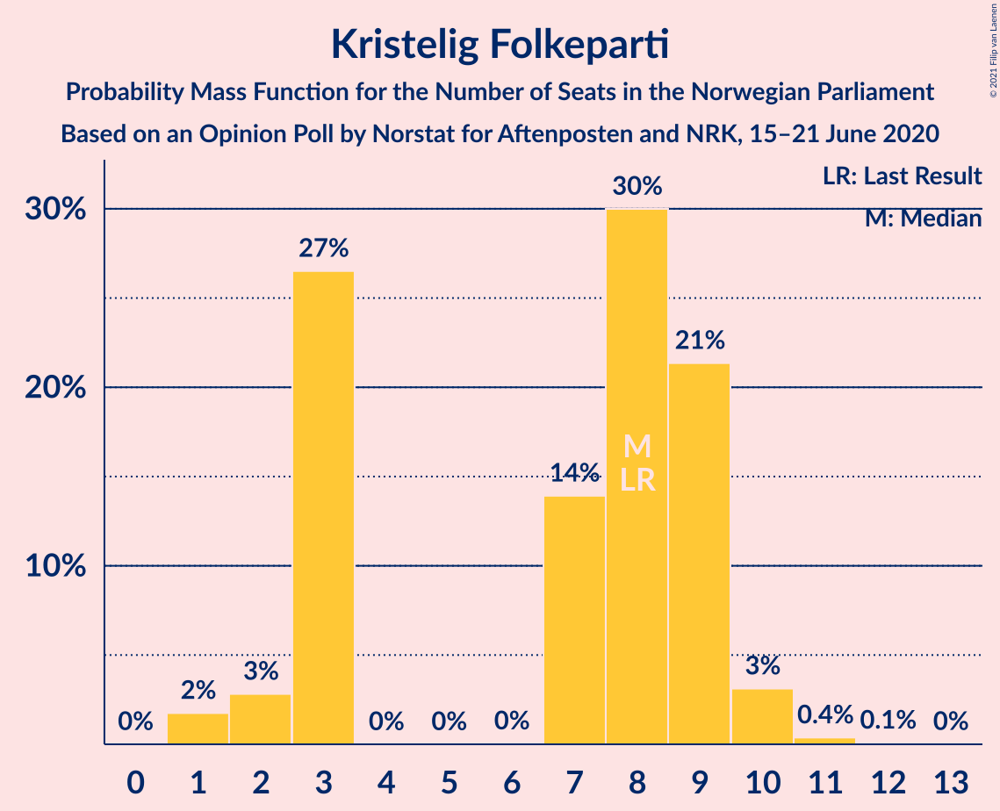
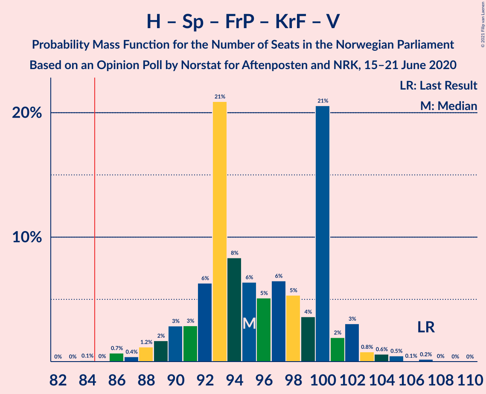
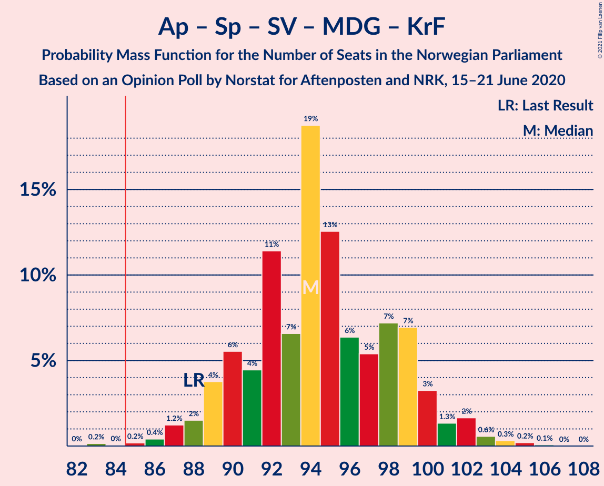
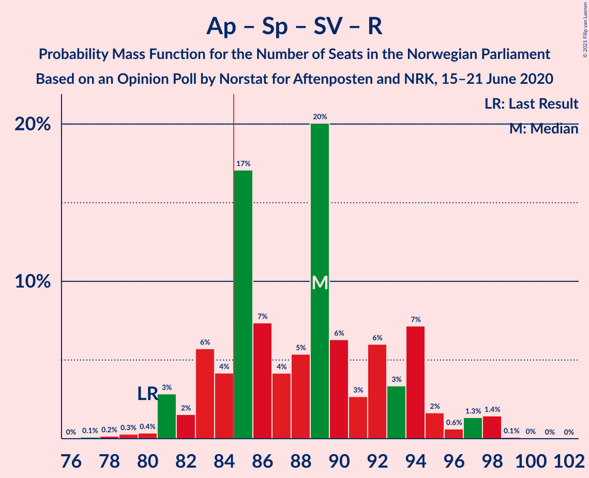
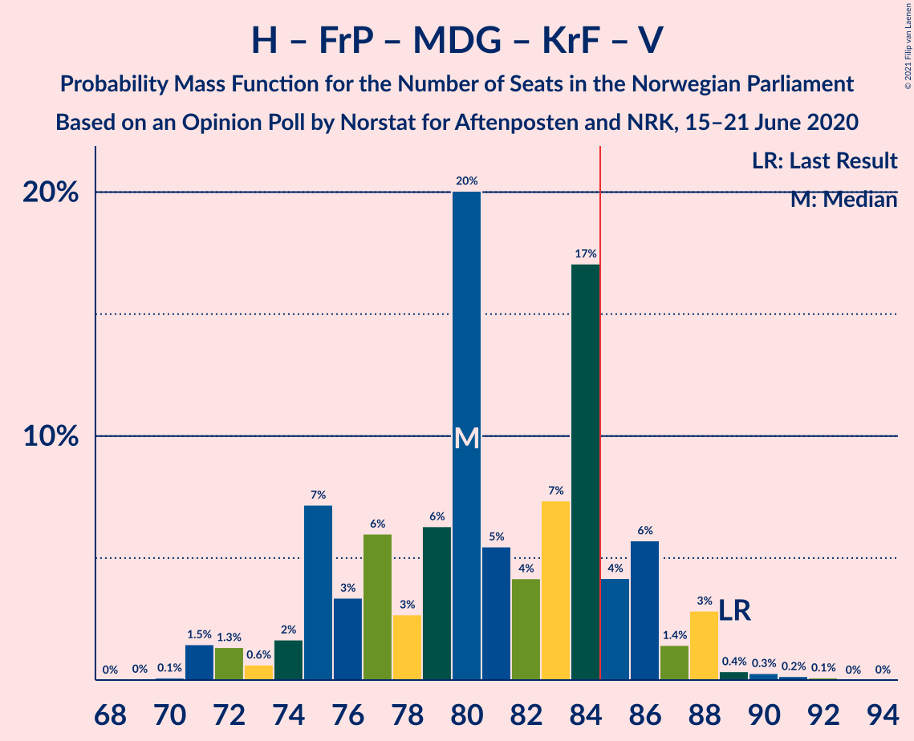
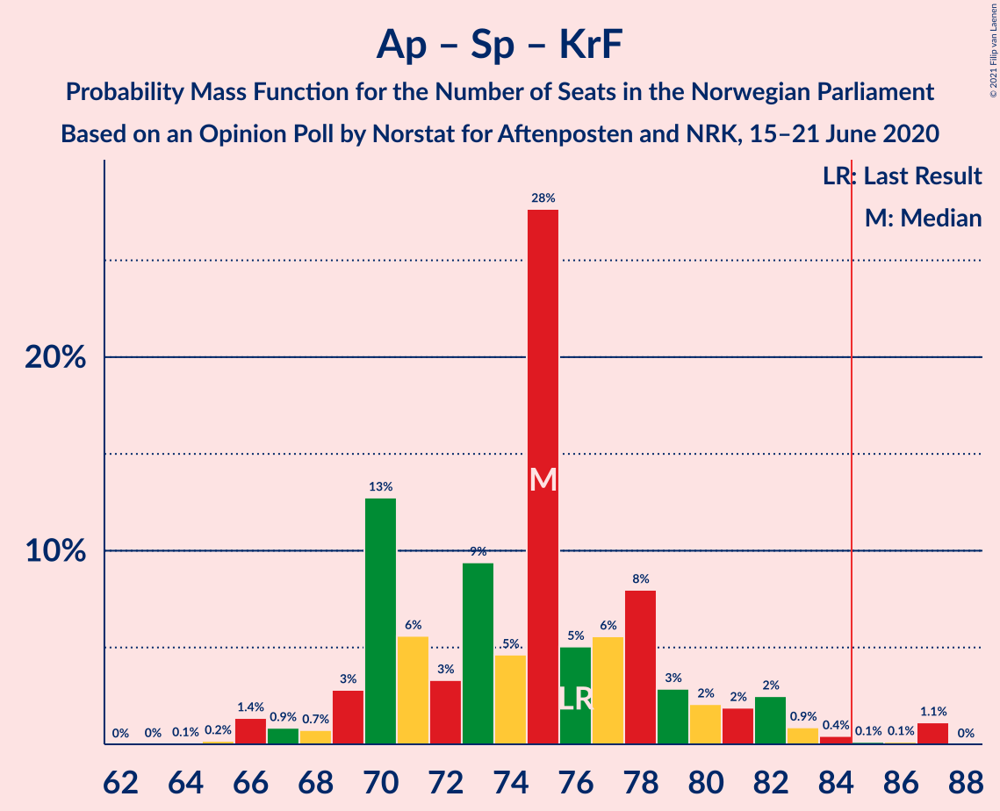
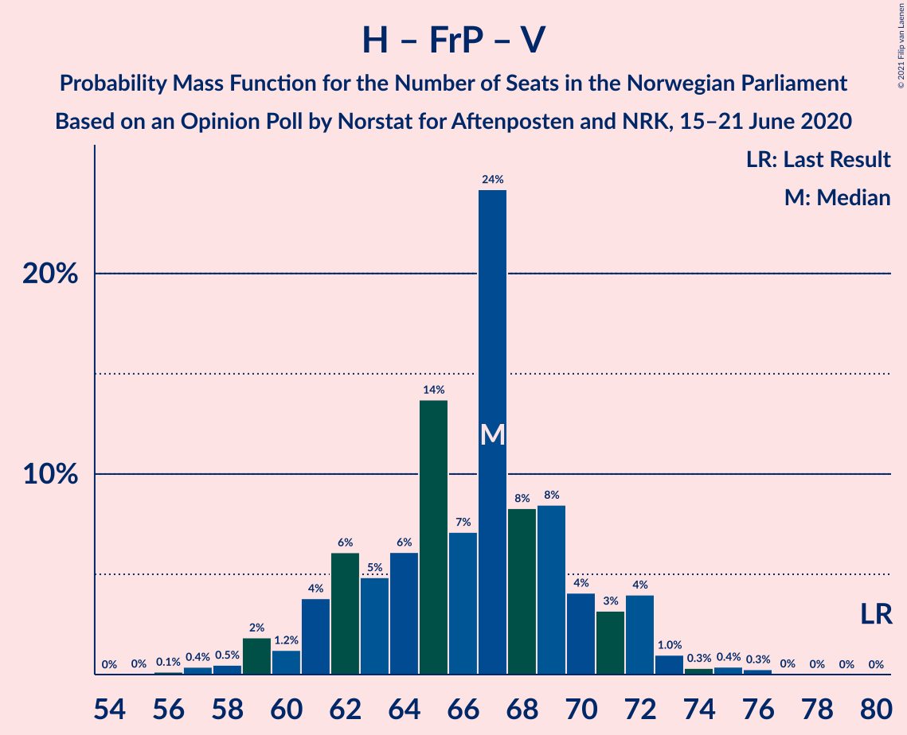

# Opinion Poll by Norstat for Aftenposten and NRK, 15–21 June 2020

<a href="#voting-intentions">Voting Intentions</a> | <a href="#seats">Seats</a> | <a href="#coalitions">Coalitions</a> | <a href="#technical-information">Technical Information</a>

## Voting Intentions

### Confidence Intervals

| Party | Last Result | Poll Result | 80% Confidence Interval | 90% Confidence Interval | 95% Confidence Interval | 99% Confidence Interval |
|:-----:|:-----------:|:-----------:|:-----------------------:|:-----------------------:|:-----------------------:|:-----------------------:|
| Arbeiderpartiet | 27.4% | 24.9% | 23.2–26.7% |22.7–27.2% |22.3–27.7% |21.5–28.6% |
| Høyre | 25.0% | 24.8% | 23.1–26.6% |22.6–27.1% |22.2–27.6% |21.4–28.5% |
| Senterpartiet | 10.3% | 13.0% | 11.7–14.5% |11.4–14.9% |11.1–15.2% |10.5–16.0% |
| Fremskrittspartiet | 15.2% | 11.5% | 10.3–12.9% |10.0–13.3% |9.7–13.6% |9.1–14.3% |
| Sosialistisk Venstreparti | 6.0% | 6.8% | 5.9–7.9% |5.6–8.3% |5.4–8.5% |5.0–9.1% |
| Rødt | 2.4% | 4.9% | 4.1–5.9% |3.9–6.2% |3.7–6.4% |3.4–6.9% |
| Miljøpartiet De Grønne | 3.2% | 4.8% | 4.0–5.8% |3.8–6.1% |3.6–6.3% |3.3–6.8% |
| Kristelig Folkeparti | 4.2% | 4.3% | 3.6–5.2% |3.4–5.5% |3.2–5.7% |2.9–6.2% |
| Venstre | 4.4% | 2.7% | 2.1–3.5% |2.0–3.7% |1.9–3.9% |1.6–4.3% |

*Note:* The poll result column reflects the actual value used in the calculations. Published results may vary slightly, and in addition be rounded to fewer digits.

## Seats

### Confidence Intervals

| Party | Last Result | Median | 80% Confidence Interval | 90% Confidence Interval | 95% Confidence Interval | 99% Confidence Interval |
|:-----:|:-----------:|:------:|:-----------------------:|:-----------------------:|:-----------------------:|:-----------------------:|
| <a href="#arbeiderpartiet">Arbeiderpartiet</a> | 49 | 45 | 42–49 |41–52 |41–52 |39–55 |
| <a href="#høyre">Høyre</a> | 45 | 45 | 40–48 |39–49 |39–49 |37–52 |
| <a href="#senterpartiet">Senterpartiet</a> | 19 | 23 | 19–27 |19–28 |19–30 |18–31 |
| <a href="#fremskrittspartiet">Fremskrittspartiet</a> | 27 | 20 | 18–23 |17–24 |17–25 |15–26 |
| <a href="#sosialistisk-venstreparti">Sosialistisk Venstreparti</a> | 11 | 12 | 10–14 |10–15 |9–15 |8–16 |
| <a href="#rødt">Rødt</a> | 1 | 8 | 2–11 |2–11 |2–12 |2–12 |
| <a href="#miljøpartiet-de-grønne">Miljøpartiet De Grønne</a> | 1 | 9 | 2–10 |2–11 |2–11 |1–12 |
| <a href="#kristelig-folkeparti">Kristelig Folkeparti</a> | 8 | 7 | 3–9 |2–9 |2–10 |1–11 |
| <a href="#venstre">Venstre</a> | 8 | 2 | 1–2 |0–2 |0–2 |0–7 |

### Arbeiderpartiet

*For a full overview of the results for this party, see the [Arbeiderpartiet](party-arbeiderpartiet.html) page.*

| Number of Seats | Probability | Accumulated | Special Marks |
|:---------------:|:-----------:|:-----------:|:-------------:|
| 38 | 0.1% | 100% |  |
| 39 | 0.6% | 99.9% |  |
| 40 | 1.4% | 99.3% |  |
| 41 | 4% | 98% |  |
| 42 | 12% | 94% |  |
| 43 | 19% | 82% |  |
| 44 | 6% | 63% |  |
| 45 | 8% | 57% | Median |
| 46 | 17% | 49% |  |
| 47 | 7% | 32% |  |
| 48 | 10% | 25% |  |
| 49 | 6% | 15% | Last Result |
| 50 | 0.8% | 9% |  |
| 51 | 0.8% | 9% |  |
| 52 | 7% | 8% |  |
| 53 | 0.2% | 1.2% |  |
| 54 | 0.5% | 1.1% |  |
| 55 | 0.1% | 0.6% |  |
| 56 | 0.5% | 0.5% |  |
| 57 | 0% | 0% |  |

### Høyre

*For a full overview of the results for this party, see the [Høyre](party-høyre.html) page.*

| Number of Seats | Probability | Accumulated | Special Marks |
|:---------------:|:-----------:|:-----------:|:-------------:|
| 36 | 0.5% | 100% |  |
| 37 | 0.8% | 99.5% |  |
| 38 | 0.6% | 98.8% |  |
| 39 | 3% | 98% |  |
| 40 | 11% | 95% |  |
| 41 | 12% | 84% |  |
| 42 | 5% | 72% |  |
| 43 | 4% | 67% |  |
| 44 | 13% | 63% |  |
| 45 | 12% | 51% | Last Result, Median |
| 46 | 21% | 39% |  |
| 47 | 2% | 18% |  |
| 48 | 8% | 16% |  |
| 49 | 6% | 8% |  |
| 50 | 1.1% | 2% |  |
| 51 | 0.2% | 0.8% |  |
| 52 | 0.5% | 0.6% |  |
| 53 | 0.1% | 0.1% |  |
| 54 | 0% | 0.1% |  |
| 55 | 0% | 0% |  |

### Senterpartiet

*For a full overview of the results for this party, see the [Senterpartiet](party-senterpartiet.html) page.*

| Number of Seats | Probability | Accumulated | Special Marks |
|:---------------:|:-----------:|:-----------:|:-------------:|
| 18 | 2% | 100% |  |
| 19 | 9% | 98% | Last Result |
| 20 | 5% | 89% |  |
| 21 | 15% | 84% |  |
| 22 | 10% | 69% |  |
| 23 | 11% | 59% | Median |
| 24 | 17% | 47% |  |
| 25 | 8% | 31% |  |
| 26 | 4% | 22% |  |
| 27 | 11% | 18% |  |
| 28 | 4% | 8% |  |
| 29 | 0.5% | 3% |  |
| 30 | 1.4% | 3% |  |
| 31 | 1.1% | 1.3% |  |
| 32 | 0.1% | 0.2% |  |
| 33 | 0% | 0% |  |

### Fremskrittspartiet

*For a full overview of the results for this party, see the [Fremskrittspartiet](party-fremskrittspartiet.html) page.*

| Number of Seats | Probability | Accumulated | Special Marks |
|:---------------:|:-----------:|:-----------:|:-------------:|
| 14 | 0% | 100% |  |
| 15 | 0.7% | 99.9% |  |
| 16 | 1.3% | 99.2% |  |
| 17 | 4% | 98% |  |
| 18 | 11% | 94% |  |
| 19 | 5% | 83% |  |
| 20 | 33% | 78% | Median |
| 21 | 21% | 45% |  |
| 22 | 5% | 25% |  |
| 23 | 13% | 20% |  |
| 24 | 3% | 7% |  |
| 25 | 4% | 5% |  |
| 26 | 0.3% | 0.6% |  |
| 27 | 0.3% | 0.3% | Last Result |
| 28 | 0% | 0% |  |

### Sosialistisk Venstreparti

*For a full overview of the results for this party, see the [Sosialistisk Venstreparti](party-sosialistiskvenstreparti.html) page.*

| Number of Seats | Probability | Accumulated | Special Marks |
|:---------------:|:-----------:|:-----------:|:-------------:|
| 7 | 0% | 100% |  |
| 8 | 0.5% | 99.9% |  |
| 9 | 4% | 99.4% |  |
| 10 | 15% | 96% |  |
| 11 | 15% | 80% | Last Result |
| 12 | 26% | 65% | Median |
| 13 | 20% | 39% |  |
| 14 | 12% | 20% |  |
| 15 | 6% | 7% |  |
| 16 | 0.6% | 0.9% |  |
| 17 | 0.3% | 0.3% |  |
| 18 | 0% | 0% |  |

### Rødt

*For a full overview of the results for this party, see the [Rødt](party-rødt.html) page.*

| Number of Seats | Probability | Accumulated | Special Marks |
|:---------------:|:-----------:|:-----------:|:-------------:|
| 1 | 0% | 100% | Last Result |
| 2 | 10% | 100% |  |
| 3 | 0% | 90% |  |
| 4 | 0% | 90% |  |
| 5 | 0% | 90% |  |
| 6 | 0.1% | 90% |  |
| 7 | 16% | 90% |  |
| 8 | 36% | 74% | Median |
| 9 | 14% | 38% |  |
| 10 | 13% | 24% |  |
| 11 | 8% | 11% |  |
| 12 | 2% | 3% |  |
| 13 | 0.2% | 0.2% |  |
| 14 | 0% | 0% |  |

### Miljøpartiet De Grønne

*For a full overview of the results for this party, see the [Miljøpartiet De Grønne](party-miljøpartietdegrønne.html) page.*

| Number of Seats | Probability | Accumulated | Special Marks |
|:---------------:|:-----------:|:-----------:|:-------------:|
| 1 | 2% | 100% | Last Result |
| 2 | 15% | 98% |  |
| 3 | 0.3% | 83% |  |
| 4 | 0% | 83% |  |
| 5 | 0% | 83% |  |
| 6 | 0% | 83% |  |
| 7 | 16% | 83% |  |
| 8 | 14% | 67% |  |
| 9 | 30% | 53% | Median |
| 10 | 18% | 23% |  |
| 11 | 3% | 5% |  |
| 12 | 2% | 2% |  |
| 13 | 0.1% | 0.1% |  |
| 14 | 0% | 0% |  |

### Kristelig Folkeparti

*For a full overview of the results for this party, see the [Kristelig Folkeparti](party-kristeligfolkeparti.html) page.*

| Number of Seats | Probability | Accumulated | Special Marks |
|:---------------:|:-----------:|:-----------:|:-------------:|
| 1 | 1.5% | 100% |  |
| 2 | 6% | 98% |  |
| 3 | 28% | 93% |  |
| 4 | 0% | 65% |  |
| 5 | 0% | 65% |  |
| 6 | 0% | 65% |  |
| 7 | 16% | 65% | Median |
| 8 | 31% | 49% | Last Result |
| 9 | 15% | 18% |  |
| 10 | 2% | 3% |  |
| 11 | 0.9% | 1.1% |  |
| 12 | 0.2% | 0.2% |  |
| 13 | 0% | 0% |  |

### Venstre

*For a full overview of the results for this party, see the [Venstre](party-venstre.html) page.*

| Number of Seats | Probability | Accumulated | Special Marks |
|:---------------:|:-----------:|:-----------:|:-------------:|
| 0 | 8% | 100% |  |
| 1 | 28% | 92% |  |
| 2 | 62% | 64% | Median |
| 3 | 0% | 2% |  |
| 4 | 0% | 1.5% |  |
| 5 | 0% | 1.5% |  |
| 6 | 0.1% | 1.5% |  |
| 7 | 1.1% | 1.3% |  |
| 8 | 0.2% | 0.2% | Last Result |
| 9 | 0% | 0% |  |

## Coalitions

### Confidence Intervals

| Coalition | Last Result | Median | Majority? | 80% Confidence Interval | 90% Confidence Interval | 95% Confidence Interval | 99% Confidence Interval |
|:---------:|:-----------:|:------:|:---------:|:-----------------------:|:-----------------------:|:-----------------------:|:-----------------------:|
| Arbeiderpartiet – Senterpartiet – Sosialistisk Venstreparti – Rødt – Miljøpartiet De Grønne | 81 | 96 | 99.9% | 91–103 | 90–103 | 90–104 | 88–105 |
| Høyre – Senterpartiet – Fremskrittspartiet – Kristelig Folkeparti – Venstre | 107 | 96 | 100% | 91–100 | 90–102 | 89–102 | 87–105 |
| Arbeiderpartiet – Senterpartiet – Sosialistisk Venstreparti – Miljøpartiet De Grønne – Kristelig Folkeparti | 88 | 94 | 99.9% | 90–100 | 89–101 | 88–101 | 86–105 |
| Arbeiderpartiet – Senterpartiet – Sosialistisk Venstreparti – Rødt | 80 | 89 | 78% | 83–94 | 83–98 | 81–98 | 80–98 |
| Arbeiderpartiet – Senterpartiet – Sosialistisk Venstreparti – Miljøpartiet De Grønne | 80 | 89 | 74% | 82–95 | 82–95 | 82–96 | 80–97 |
| Arbeiderpartiet – Senterpartiet – Miljøpartiet De Grønne – Kristelig Folkeparti | 77 | 82 | 28% | 77–89 | 77–89 | 75–91 | 74–94 |
| Arbeiderpartiet – Senterpartiet – Sosialistisk Venstreparti | 79 | 81 | 21% | 75–86 | 73–90 | 73–90 | 72–90 |
| Høyre – Fremskrittspartiet – Miljøpartiet De Grønne – Kristelig Folkeparti – Venstre | 89 | 80 | 22% | 75–86 | 71–86 | 71–87 | 71–89 |
| Arbeiderpartiet – Senterpartiet – Kristelig Folkeparti | 76 | 74 | 6% | 70–82 | 70–87 | 68–87 | 66–87 |
| Høyre – Fremskrittspartiet – Kristelig Folkeparti – Venstre | 88 | 73 | 0.1% | 66–78 | 66–79 | 65–79 | 64–81 |
| Arbeiderpartiet – Senterpartiet | 68 | 69 | 0% | 63–74 | 62–79 | 62–79 | 61–79 |
| Høyre – Fremskrittspartiet – Venstre | 80 | 67 | 0% | 61–71 | 61–71 | 59–71 | 57–74 |
| Høyre – Fremskrittspartiet | 72 | 65 | 0% | 60–69 | 59–69 | 57–70 | 55–72 |
| Arbeiderpartiet – Sosialistisk Venstreparti | 60 | 57 | 0% | 53–62 | 52–63 | 52–63 | 51–65 |
| Høyre – Kristelig Folkeparti – Venstre | 61 | 51 | 0% | 48–58 | 45–58 | 45–59 | 44–60 |
| Senterpartiet – Kristelig Folkeparti – Venstre | 35 | 30 | 0% | 26–36 | 26–36 | 25–40 | 23–41 |

### Arbeiderpartiet – Senterpartiet – Sosialistisk Venstreparti – Rødt – Miljøpartiet De Grønne

| Number of Seats | Probability | Accumulated | Special Marks |
|:---------------:|:-----------:|:-----------:|:-------------:|
| 81 | 0% | 100% | Last Result |
| 82 | 0% | 100% |  |
| 83 | 0% | 100% |  |
| 84 | 0% | 100% |  |
| 85 | 0.1% | 99.9% | Majority |
| 86 | 0.1% | 99.8% |  |
| 87 | 0.2% | 99.8% |  |
| 88 | 0.3% | 99.6% |  |
| 89 | 0.5% | 99.3% |  |
| 90 | 8% | 98.8% |  |
| 91 | 5% | 91% |  |
| 92 | 2% | 87% |  |
| 93 | 14% | 85% |  |
| 94 | 12% | 71% |  |
| 95 | 6% | 58% |  |
| 96 | 4% | 53% |  |
| 97 | 4% | 48% | Median |
| 98 | 9% | 45% |  |
| 99 | 11% | 36% |  |
| 100 | 9% | 25% |  |
| 101 | 2% | 16% |  |
| 102 | 2% | 14% |  |
| 103 | 8% | 13% |  |
| 104 | 4% | 5% |  |
| 105 | 0.3% | 0.7% |  |
| 106 | 0.3% | 0.4% |  |
| 107 | 0.1% | 0.1% |  |
| 108 | 0% | 0% |  |

### Høyre – Senterpartiet – Fremskrittspartiet – Kristelig Folkeparti – Venstre

| Number of Seats | Probability | Accumulated | Special Marks |
|:---------------:|:-----------:|:-----------:|:-------------:|
| 85 | 0% | 100% | Majority |
| 86 | 0.3% | 99.9% |  |
| 87 | 0.6% | 99.7% |  |
| 88 | 0.4% | 99.1% |  |
| 89 | 1.4% | 98.7% |  |
| 90 | 7% | 97% |  |
| 91 | 2% | 90% |  |
| 92 | 12% | 88% |  |
| 93 | 11% | 77% |  |
| 94 | 3% | 66% |  |
| 95 | 5% | 62% |  |
| 96 | 9% | 57% |  |
| 97 | 14% | 48% | Median |
| 98 | 10% | 34% |  |
| 99 | 2% | 24% |  |
| 100 | 12% | 21% |  |
| 101 | 1.0% | 9% |  |
| 102 | 6% | 8% |  |
| 103 | 1.3% | 2% |  |
| 104 | 0.2% | 1.1% |  |
| 105 | 0.6% | 1.0% |  |
| 106 | 0.1% | 0.3% |  |
| 107 | 0.1% | 0.3% | Last Result |
| 108 | 0.2% | 0.2% |  |
| 109 | 0% | 0% |  |

### Arbeiderpartiet – Senterpartiet – Sosialistisk Venstreparti – Miljøpartiet De Grønne – Kristelig Folkeparti

| Number of Seats | Probability | Accumulated | Special Marks |
|:---------------:|:-----------:|:-----------:|:-------------:|
| 82 | 0% | 100% |  |
| 83 | 0% | 99.9% |  |
| 84 | 0% | 99.9% |  |
| 85 | 0.1% | 99.9% | Majority |
| 86 | 0.4% | 99.8% |  |
| 87 | 0.3% | 99.4% |  |
| 88 | 3% | 99.1% | Last Result |
| 89 | 2% | 97% |  |
| 90 | 16% | 95% |  |
| 91 | 4% | 79% |  |
| 92 | 9% | 75% |  |
| 93 | 7% | 66% |  |
| 94 | 17% | 59% |  |
| 95 | 5% | 42% |  |
| 96 | 1.3% | 37% | Median |
| 97 | 8% | 36% |  |
| 98 | 1.4% | 28% |  |
| 99 | 10% | 27% |  |
| 100 | 10% | 17% |  |
| 101 | 5% | 7% |  |
| 102 | 0.8% | 2% |  |
| 103 | 1.1% | 2% |  |
| 104 | 0.1% | 0.6% |  |
| 105 | 0.5% | 0.5% |  |
| 106 | 0% | 0% |  |

### Arbeiderpartiet – Senterpartiet – Sosialistisk Venstreparti – Rødt

| Number of Seats | Probability | Accumulated | Special Marks |
|:---------------:|:-----------:|:-----------:|:-------------:|
| 77 | 0.1% | 100% |  |
| 78 | 0% | 99.9% |  |
| 79 | 0.2% | 99.9% |  |
| 80 | 0.4% | 99.7% | Last Result |
| 81 | 2% | 99.3% |  |
| 82 | 1.4% | 97% |  |
| 83 | 14% | 96% |  |
| 84 | 4% | 82% |  |
| 85 | 9% | 78% | Majority |
| 86 | 6% | 70% |  |
| 87 | 5% | 63% |  |
| 88 | 2% | 58% | Median |
| 89 | 12% | 56% |  |
| 90 | 10% | 44% |  |
| 91 | 4% | 34% |  |
| 92 | 8% | 31% |  |
| 93 | 1.4% | 23% |  |
| 94 | 13% | 21% |  |
| 95 | 0.7% | 8% |  |
| 96 | 0.5% | 7% |  |
| 97 | 0.4% | 7% |  |
| 98 | 6% | 6% |  |
| 99 | 0% | 0.1% |  |
| 100 | 0.1% | 0.1% |  |
| 101 | 0% | 0% |  |

### Arbeiderpartiet – Senterpartiet – Sosialistisk Venstreparti – Miljøpartiet De Grønne

| Number of Seats | Probability | Accumulated | Special Marks |
|:---------------:|:-----------:|:-----------:|:-------------:|
| 77 | 0.2% | 100% |  |
| 78 | 0.2% | 99.8% |  |
| 79 | 0.1% | 99.6% |  |
| 80 | 0.4% | 99.5% | Last Result |
| 81 | 0.6% | 99.1% |  |
| 82 | 10% | 98% |  |
| 83 | 8% | 89% |  |
| 84 | 6% | 80% |  |
| 85 | 7% | 74% | Majority |
| 86 | 4% | 67% |  |
| 87 | 6% | 63% |  |
| 88 | 2% | 57% |  |
| 89 | 8% | 54% | Median |
| 90 | 2% | 46% |  |
| 91 | 14% | 44% |  |
| 92 | 15% | 30% |  |
| 93 | 4% | 15% |  |
| 94 | 1.5% | 12% |  |
| 95 | 6% | 10% |  |
| 96 | 4% | 5% |  |
| 97 | 0.4% | 0.6% |  |
| 98 | 0.1% | 0.3% |  |
| 99 | 0.2% | 0.2% |  |
| 100 | 0% | 0% |  |

### Arbeiderpartiet – Senterpartiet – Miljøpartiet De Grønne – Kristelig Folkeparti

| Number of Seats | Probability | Accumulated | Special Marks |
|:---------------:|:-----------:|:-----------:|:-------------:|
| 70 | 0% | 100% |  |
| 71 | 0% | 99.9% |  |
| 72 | 0% | 99.9% |  |
| 73 | 0.1% | 99.9% |  |
| 74 | 2% | 99.8% |  |
| 75 | 0.9% | 98% |  |
| 76 | 0.4% | 97% |  |
| 77 | 11% | 97% | Last Result |
| 78 | 1.5% | 86% |  |
| 79 | 2% | 85% |  |
| 80 | 20% | 83% |  |
| 81 | 5% | 63% |  |
| 82 | 12% | 58% |  |
| 83 | 5% | 46% |  |
| 84 | 13% | 41% | Median |
| 85 | 3% | 28% | Majority |
| 86 | 8% | 25% |  |
| 87 | 3% | 18% |  |
| 88 | 1.3% | 14% |  |
| 89 | 10% | 13% |  |
| 90 | 0.4% | 3% |  |
| 91 | 0.2% | 3% |  |
| 92 | 1.0% | 2% |  |
| 93 | 0.1% | 1.4% |  |
| 94 | 1.3% | 1.4% |  |
| 95 | 0% | 0% |  |

### Arbeiderpartiet – Senterpartiet – Sosialistisk Venstreparti

| Number of Seats | Probability | Accumulated | Special Marks |
|:---------------:|:-----------:|:-----------:|:-------------:|
| 70 | 0% | 100% |  |
| 71 | 0.3% | 99.9% |  |
| 72 | 0.2% | 99.7% |  |
| 73 | 5% | 99.4% |  |
| 74 | 0.7% | 95% |  |
| 75 | 12% | 94% |  |
| 76 | 0.8% | 82% |  |
| 77 | 7% | 81% |  |
| 78 | 4% | 74% |  |
| 79 | 5% | 70% | Last Result |
| 80 | 10% | 65% | Median |
| 81 | 7% | 54% |  |
| 82 | 15% | 48% |  |
| 83 | 10% | 33% |  |
| 84 | 3% | 23% |  |
| 85 | 3% | 21% | Majority |
| 86 | 10% | 17% |  |
| 87 | 0.3% | 7% |  |
| 88 | 0.6% | 7% |  |
| 89 | 0.3% | 7% |  |
| 90 | 6% | 6% |  |
| 91 | 0% | 0% |  |

### Høyre – Fremskrittspartiet – Miljøpartiet De Grønne – Kristelig Folkeparti – Venstre

| Number of Seats | Probability | Accumulated | Special Marks |
|:---------------:|:-----------:|:-----------:|:-------------:|
| 69 | 0.1% | 100% |  |
| 70 | 0% | 99.9% |  |
| 71 | 6% | 99.9% |  |
| 72 | 0.4% | 94% |  |
| 73 | 0.5% | 93% |  |
| 74 | 0.7% | 93% |  |
| 75 | 14% | 92% |  |
| 76 | 1.4% | 78% |  |
| 77 | 8% | 77% |  |
| 78 | 4% | 69% |  |
| 79 | 10% | 66% |  |
| 80 | 12% | 56% |  |
| 81 | 2% | 44% |  |
| 82 | 5% | 42% |  |
| 83 | 6% | 37% | Median |
| 84 | 9% | 30% |  |
| 85 | 4% | 22% | Majority |
| 86 | 14% | 18% |  |
| 87 | 1.4% | 4% |  |
| 88 | 2% | 2% |  |
| 89 | 0.4% | 0.7% | Last Result |
| 90 | 0.2% | 0.3% |  |
| 91 | 0% | 0.1% |  |
| 92 | 0% | 0.1% |  |
| 93 | 0% | 0% |  |

### Arbeiderpartiet – Senterpartiet – Kristelig Folkeparti

| Number of Seats | Probability | Accumulated | Special Marks |
|:---------------:|:-----------:|:-----------:|:-------------:|
| 64 | 0.1% | 100% |  |
| 65 | 0.2% | 99.9% |  |
| 66 | 0.5% | 99.8% |  |
| 67 | 0.9% | 99.3% |  |
| 68 | 1.0% | 98% |  |
| 69 | 0.8% | 97% |  |
| 70 | 15% | 97% |  |
| 71 | 11% | 82% |  |
| 72 | 7% | 71% |  |
| 73 | 9% | 64% |  |
| 74 | 7% | 56% |  |
| 75 | 14% | 49% | Median |
| 76 | 5% | 35% | Last Result |
| 77 | 6% | 31% |  |
| 78 | 4% | 25% |  |
| 79 | 5% | 20% |  |
| 80 | 4% | 16% |  |
| 81 | 2% | 12% |  |
| 82 | 0.7% | 10% |  |
| 83 | 1.2% | 9% |  |
| 84 | 2% | 8% |  |
| 85 | 0% | 6% | Majority |
| 86 | 0.3% | 6% |  |
| 87 | 6% | 6% |  |
| 88 | 0% | 0% |  |

### Høyre – Fremskrittspartiet – Kristelig Folkeparti – Venstre

| Number of Seats | Probability | Accumulated | Special Marks |
|:---------------:|:-----------:|:-----------:|:-------------:|
| 62 | 0.1% | 100% |  |
| 63 | 0.3% | 99.9% |  |
| 64 | 0.3% | 99.6% |  |
| 65 | 4% | 99.3% |  |
| 66 | 8% | 95% |  |
| 67 | 2% | 87% |  |
| 68 | 2% | 86% |  |
| 69 | 9% | 84% |  |
| 70 | 11% | 75% |  |
| 71 | 9% | 64% |  |
| 72 | 4% | 55% |  |
| 73 | 4% | 51% |  |
| 74 | 6% | 47% | Median |
| 75 | 12% | 42% |  |
| 76 | 14% | 29% |  |
| 77 | 2% | 15% |  |
| 78 | 5% | 13% |  |
| 79 | 8% | 9% |  |
| 80 | 0.5% | 1.1% |  |
| 81 | 0.3% | 0.6% |  |
| 82 | 0.2% | 0.4% |  |
| 83 | 0.1% | 0.2% |  |
| 84 | 0.1% | 0.2% |  |
| 85 | 0% | 0.1% | Majority |
| 86 | 0% | 0% |  |
| 87 | 0% | 0% |  |
| 88 | 0% | 0% | Last Result |

### Arbeiderpartiet – Senterpartiet

| Number of Seats | Probability | Accumulated | Special Marks |
|:---------------:|:-----------:|:-----------:|:-------------:|
| 59 | 0.1% | 100% |  |
| 60 | 0.3% | 99.9% |  |
| 61 | 0.3% | 99.6% |  |
| 62 | 7% | 99.2% |  |
| 63 | 11% | 92% |  |
| 64 | 3% | 81% |  |
| 65 | 2% | 78% |  |
| 66 | 7% | 77% |  |
| 67 | 5% | 70% |  |
| 68 | 11% | 65% | Last Result, Median |
| 69 | 6% | 54% |  |
| 70 | 17% | 48% |  |
| 71 | 12% | 30% |  |
| 72 | 1.1% | 18% |  |
| 73 | 7% | 17% |  |
| 74 | 2% | 11% |  |
| 75 | 0.2% | 9% |  |
| 76 | 2% | 8% |  |
| 77 | 0.4% | 7% |  |
| 78 | 0.2% | 6% |  |
| 79 | 6% | 6% |  |
| 80 | 0% | 0% |  |

### Høyre – Fremskrittspartiet – Venstre

| Number of Seats | Probability | Accumulated | Special Marks |
|:---------------:|:-----------:|:-----------:|:-------------:|
| 55 | 0.1% | 100% |  |
| 56 | 0.2% | 99.9% |  |
| 57 | 0.5% | 99.7% |  |
| 58 | 0.2% | 99.2% |  |
| 59 | 3% | 99.0% |  |
| 60 | 0.5% | 96% |  |
| 61 | 8% | 95% |  |
| 62 | 5% | 87% |  |
| 63 | 4% | 83% |  |
| 64 | 8% | 78% |  |
| 65 | 5% | 71% |  |
| 66 | 6% | 66% |  |
| 67 | 21% | 59% | Median |
| 68 | 12% | 39% |  |
| 69 | 11% | 26% |  |
| 70 | 5% | 16% |  |
| 71 | 9% | 11% |  |
| 72 | 1.2% | 2% |  |
| 73 | 0.4% | 1.1% |  |
| 74 | 0.3% | 0.7% |  |
| 75 | 0.2% | 0.4% |  |
| 76 | 0.1% | 0.2% |  |
| 77 | 0.1% | 0.1% |  |
| 78 | 0% | 0% |  |
| 79 | 0% | 0% |  |
| 80 | 0% | 0% | Last Result |

### Høyre – Fremskrittspartiet

| Number of Seats | Probability | Accumulated | Special Marks |
|:---------------:|:-----------:|:-----------:|:-------------:|
| 53 | 0% | 100% |  |
| 54 | 0% | 99.9% |  |
| 55 | 0.4% | 99.9% |  |
| 56 | 0.5% | 99.5% |  |
| 57 | 2% | 99.0% |  |
| 58 | 2% | 97% |  |
| 59 | 1.3% | 95% |  |
| 60 | 11% | 94% |  |
| 61 | 2% | 83% |  |
| 62 | 10% | 82% |  |
| 63 | 3% | 72% |  |
| 64 | 8% | 69% |  |
| 65 | 13% | 60% | Median |
| 66 | 17% | 47% |  |
| 67 | 13% | 31% |  |
| 68 | 3% | 18% |  |
| 69 | 12% | 15% |  |
| 70 | 1.3% | 3% |  |
| 71 | 0.5% | 1.2% |  |
| 72 | 0.2% | 0.7% | Last Result |
| 73 | 0.3% | 0.5% |  |
| 74 | 0.1% | 0.2% |  |
| 75 | 0.1% | 0.1% |  |
| 76 | 0% | 0% |  |

### Arbeiderpartiet – Sosialistisk Venstreparti

| Number of Seats | Probability | Accumulated | Special Marks |
|:---------------:|:-----------:|:-----------:|:-------------:|
| 49 | 0.3% | 100% |  |
| 50 | 0.1% | 99.7% |  |
| 51 | 1.2% | 99.5% |  |
| 52 | 5% | 98% |  |
| 53 | 9% | 94% |  |
| 54 | 6% | 85% |  |
| 55 | 4% | 79% |  |
| 56 | 19% | 75% |  |
| 57 | 9% | 57% | Median |
| 58 | 12% | 48% |  |
| 59 | 5% | 36% |  |
| 60 | 9% | 31% | Last Result |
| 61 | 5% | 22% |  |
| 62 | 8% | 16% |  |
| 63 | 6% | 8% |  |
| 64 | 0.8% | 2% |  |
| 65 | 0.7% | 1.0% |  |
| 66 | 0% | 0.3% |  |
| 67 | 0.2% | 0.3% |  |
| 68 | 0% | 0.1% |  |
| 69 | 0% | 0% |  |

### Høyre – Kristelig Folkeparti – Venstre

| Number of Seats | Probability | Accumulated | Special Marks |
|:---------------:|:-----------:|:-----------:|:-------------:|
| 42 | 0.1% | 100% |  |
| 43 | 0.2% | 99.9% |  |
| 44 | 0.2% | 99.7% |  |
| 45 | 5% | 99.5% |  |
| 46 | 1.4% | 95% |  |
| 47 | 1.1% | 93% |  |
| 48 | 9% | 92% |  |
| 49 | 10% | 83% |  |
| 50 | 17% | 73% |  |
| 51 | 6% | 56% |  |
| 52 | 9% | 50% |  |
| 53 | 6% | 41% |  |
| 54 | 6% | 35% | Median |
| 55 | 11% | 29% |  |
| 56 | 3% | 18% |  |
| 57 | 1.1% | 15% |  |
| 58 | 11% | 14% |  |
| 59 | 2% | 3% |  |
| 60 | 1.0% | 1.5% |  |
| 61 | 0.2% | 0.5% | Last Result |
| 62 | 0.1% | 0.2% |  |
| 63 | 0.1% | 0.2% |  |
| 64 | 0% | 0% |  |

### Senterpartiet – Kristelig Folkeparti – Venstre

| Number of Seats | Probability | Accumulated | Special Marks |
|:---------------:|:-----------:|:-----------:|:-------------:|
| 22 | 0.1% | 100% |  |
| 23 | 0.6% | 99.9% |  |
| 24 | 0.5% | 99.3% |  |
| 25 | 2% | 98.8% |  |
| 26 | 11% | 97% |  |
| 27 | 3% | 86% |  |
| 28 | 12% | 83% |  |
| 29 | 8% | 71% |  |
| 30 | 13% | 63% |  |
| 31 | 4% | 50% |  |
| 32 | 4% | 46% | Median |
| 33 | 17% | 42% |  |
| 34 | 2% | 25% |  |
| 35 | 4% | 23% | Last Result |
| 36 | 14% | 19% |  |
| 37 | 0.6% | 4% |  |
| 38 | 0.4% | 4% |  |
| 39 | 1.0% | 4% |  |
| 40 | 1.3% | 3% |  |
| 41 | 1.1% | 1.2% |  |
| 42 | 0.1% | 0.1% |  |
| 43 | 0% | 0% |  |

## Technical Information

### Opinion Poll

+ **Polling firm:** Norstat
+ **Commissioner(s):** Aftenposten and NRK
+ **Fieldwork period:** 15–21 June 2020

### Calculations

+ **Sample size:** 1000
+ **Simulations done:** 131,072
+ **Error estimate:** 1.72%

