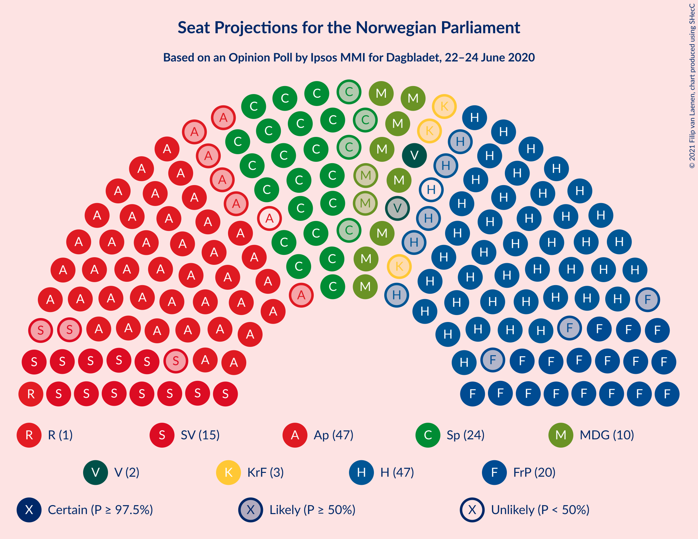
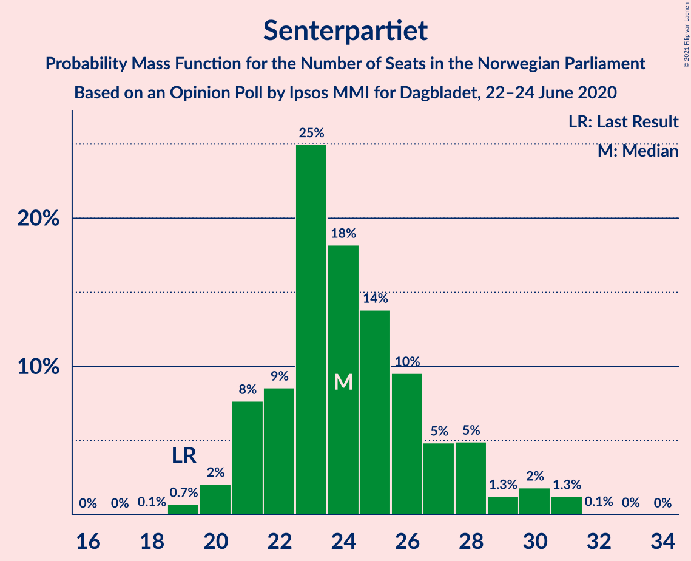
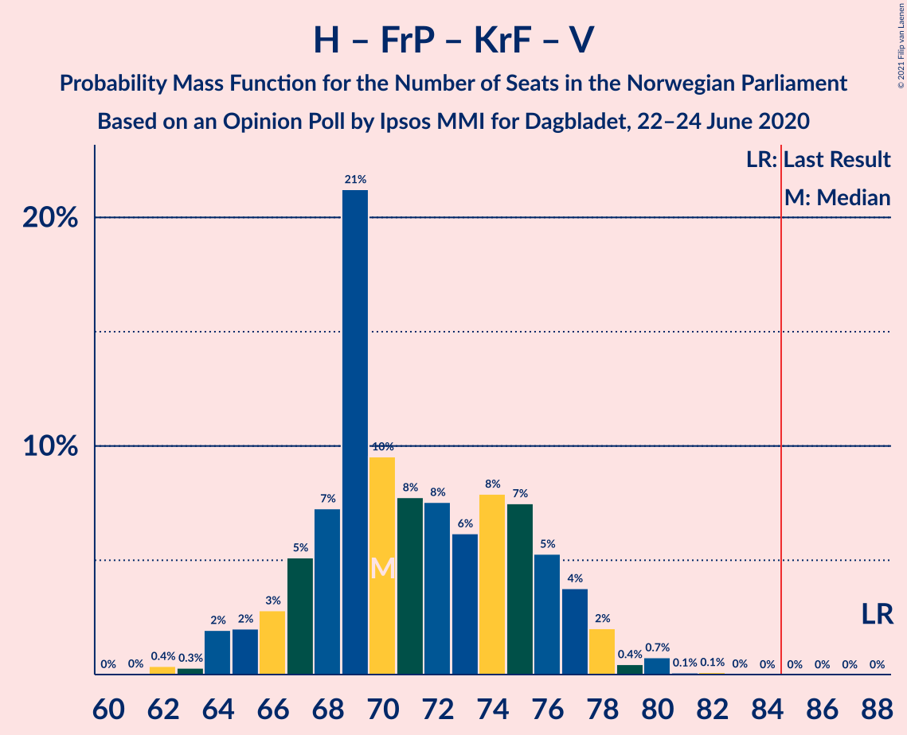
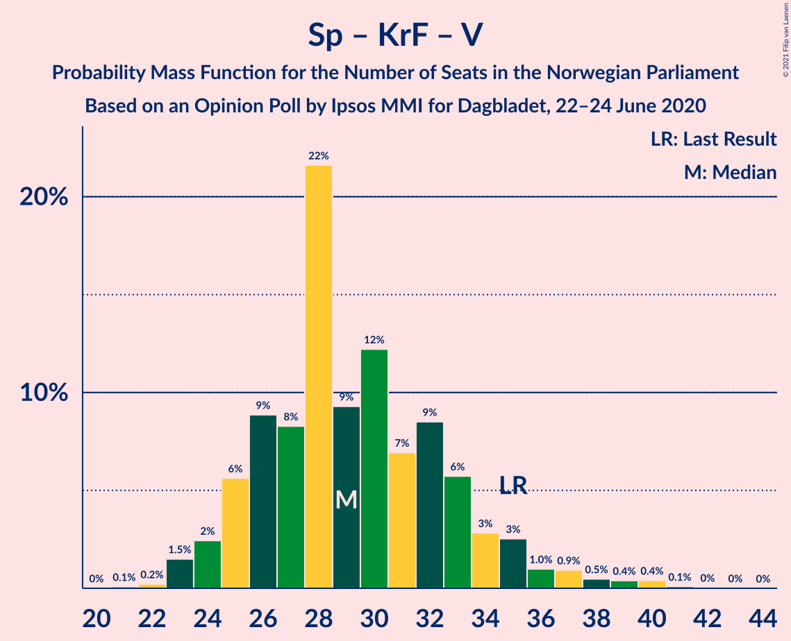

# Opinion Poll by Ipsos MMI for Dagbladet, 22–24 June 2020

<a href="#voting-intentions">Voting Intentions</a> | <a href="#seats">Seats</a> | <a href="#coalitions">Coalitions</a> | <a href="#technical-information">Technical Information</a>

## Voting Intentions

### Confidence Intervals

| Party | Last Result | Poll Result | 80% Confidence Interval | 90% Confidence Interval | 95% Confidence Interval | 99% Confidence Interval |
|:-----:|:-----------:|:-----------:|:-----------------------:|:-----------------------:|:-----------------------:|:-----------------------:|
| Høyre | 25.0% | 25.2% | 23.5–27.0% |23.0–27.5% |22.6–28.0% |21.8–28.9% |
| Arbeiderpartiet | 27.4% | 25.0% | 23.3–26.8% |22.8–27.3% |22.4–27.8% |21.6–28.7% |
| Senterpartiet | 10.3% | 13.3% | 12.0–14.8% |11.6–15.2% |11.3–15.6% |10.7–16.3% |
| Fremskrittspartiet | 15.2% | 11.0% | 9.8–12.4% |9.5–12.8% |9.2–13.1% |8.7–13.8% |
| Sosialistisk Venstreparti | 6.0% | 8.2% | 7.2–9.4% |6.9–9.8% |6.6–10.1% |6.2–10.7% |
| Miljøpartiet De Grønne | 3.2% | 5.9% | 5.0–7.0% |4.8–7.3% |4.6–7.5% |4.2–8.1% |
| Kristelig Folkeparti | 4.2% | 3.2% | 2.6–4.0% |2.4–4.3% |2.3–4.5% |2.0–4.9% |
| Venstre | 4.4% | 3.1% | 2.5–3.9% |2.3–4.2% |2.2–4.4% |1.9–4.8% |
| Rødt | 2.4% | 3.0% | 2.4–3.8% |2.2–4.1% |2.1–4.3% |1.9–4.7% |

*Note:* The poll result column reflects the actual value used in the calculations. Published results may vary slightly, and in addition be rounded to fewer digits.

## Seats

### Confidence Intervals

| Party | Last Result | Median | 80% Confidence Interval | 90% Confidence Interval | 95% Confidence Interval | 99% Confidence Interval |
|:-----:|:-----------:|:------:|:-----------------------:|:-----------------------:|:-----------------------:|:-----------------------:|
| <a href="#høyre">Høyre</a> | 45 | 46 | 43–50 |41–51 |41–52 |39–54 |
| <a href="#arbeiderpartiet">Arbeiderpartiet</a> | 49 | 46 | 43–51 |41–51 |40–52 |40–53 |
| <a href="#senterpartiet">Senterpartiet</a> | 19 | 24 | 21–27 |21–28 |20–30 |19–31 |
| <a href="#fremskrittspartiet">Fremskrittspartiet</a> | 27 | 20 | 18–22 |17–23 |17–24 |15–25 |
| <a href="#sosialistisk-venstreparti">Sosialistisk Venstreparti</a> | 11 | 15 | 13–18 |12–18 |12–19 |11–19 |
| <a href="#miljøpartiet-de-grønne">Miljøpartiet De Grønne</a> | 1 | 10 | 9–13 |8–13 |8–14 |7–15 |
| <a href="#kristelig-folkeparti">Kristelig Folkeparti</a> | 8 | 3 | 1–3 |1–7 |0–8 |0–9 |
| <a href="#venstre">Venstre</a> | 8 | 2 | 1–7 |1–8 |1–8 |0–8 |
| <a href="#rødt">Rødt</a> | 1 | 1 | 1–2 |1–2 |1–7 |1–8 |

### Høyre

*For a full overview of the results for this party, see the [Høyre](party-høyre.html) page.*

| Number of Seats | Probability | Accumulated | Special Marks |
|:---------------:|:-----------:|:-----------:|:-------------:|
| 37 | 0.1% | 100% |  |
| 38 | 0.3% | 99.9% |  |
| 39 | 0.4% | 99.7% |  |
| 40 | 2% | 99.3% |  |
| 41 | 3% | 98% |  |
| 42 | 3% | 95% |  |
| 43 | 9% | 91% |  |
| 44 | 21% | 83% |  |
| 45 | 8% | 62% | Last Result |
| 46 | 11% | 53% | Median |
| 47 | 13% | 43% |  |
| 48 | 7% | 30% |  |
| 49 | 7% | 22% |  |
| 50 | 8% | 16% |  |
| 51 | 5% | 8% |  |
| 52 | 1.4% | 3% |  |
| 53 | 1.4% | 2% |  |
| 54 | 0.4% | 0.5% |  |
| 55 | 0.2% | 0.2% |  |
| 56 | 0% | 0% |  |

### Arbeiderpartiet

*For a full overview of the results for this party, see the [Arbeiderpartiet](party-arbeiderpartiet.html) page.*

| Number of Seats | Probability | Accumulated | Special Marks |
|:---------------:|:-----------:|:-----------:|:-------------:|
| 38 | 0.1% | 100% |  |
| 39 | 0.2% | 99.9% |  |
| 40 | 2% | 99.7% |  |
| 41 | 2% | 97% |  |
| 42 | 3% | 95% |  |
| 43 | 9% | 91% |  |
| 44 | 15% | 83% |  |
| 45 | 7% | 68% |  |
| 46 | 13% | 60% | Median |
| 47 | 13% | 47% |  |
| 48 | 7% | 34% |  |
| 49 | 4% | 27% | Last Result |
| 50 | 8% | 24% |  |
| 51 | 13% | 15% |  |
| 52 | 2% | 3% |  |
| 53 | 0.2% | 0.5% |  |
| 54 | 0.2% | 0.3% |  |
| 55 | 0.1% | 0.1% |  |
| 56 | 0% | 0% |  |

### Senterpartiet

*For a full overview of the results for this party, see the [Senterpartiet](party-senterpartiet.html) page.*

| Number of Seats | Probability | Accumulated | Special Marks |
|:---------------:|:-----------:|:-----------:|:-------------:|
| 18 | 0.1% | 100% |  |
| 19 | 0.7% | 99.9% | Last Result |
| 20 | 2% | 99.2% |  |
| 21 | 8% | 97% |  |
| 22 | 9% | 89% |  |
| 23 | 25% | 81% |  |
| 24 | 18% | 56% | Median |
| 25 | 14% | 38% |  |
| 26 | 10% | 24% |  |
| 27 | 5% | 14% |  |
| 28 | 5% | 9% |  |
| 29 | 1.3% | 5% |  |
| 30 | 2% | 3% |  |
| 31 | 1.3% | 1.4% |  |
| 32 | 0.1% | 0.2% |  |
| 33 | 0% | 0.1% |  |
| 34 | 0% | 0% |  |

### Fremskrittspartiet

*For a full overview of the results for this party, see the [Fremskrittspartiet](party-fremskrittspartiet.html) page.*

| Number of Seats | Probability | Accumulated | Special Marks |
|:---------------:|:-----------:|:-----------:|:-------------:|
| 14 | 0.1% | 100% |  |
| 15 | 0.4% | 99.9% |  |
| 16 | 2% | 99.5% |  |
| 17 | 6% | 98% |  |
| 18 | 10% | 92% |  |
| 19 | 17% | 81% |  |
| 20 | 34% | 65% | Median |
| 21 | 12% | 30% |  |
| 22 | 9% | 19% |  |
| 23 | 6% | 10% |  |
| 24 | 3% | 4% |  |
| 25 | 0.7% | 1.2% |  |
| 26 | 0.4% | 0.5% |  |
| 27 | 0.1% | 0.1% | Last Result |
| 28 | 0% | 0% |  |

### Sosialistisk Venstreparti

*For a full overview of the results for this party, see the [Sosialistisk Venstreparti](party-sosialistiskvenstreparti.html) page.*

| Number of Seats | Probability | Accumulated | Special Marks |
|:---------------:|:-----------:|:-----------:|:-------------:|
| 10 | 0.2% | 100% |  |
| 11 | 1.4% | 99.8% | Last Result |
| 12 | 6% | 98% |  |
| 13 | 8% | 93% |  |
| 14 | 27% | 84% |  |
| 15 | 22% | 57% | Median |
| 16 | 17% | 35% |  |
| 17 | 7% | 17% |  |
| 18 | 7% | 10% |  |
| 19 | 3% | 3% |  |
| 20 | 0.4% | 0.5% |  |
| 21 | 0.1% | 0.1% |  |
| 22 | 0% | 0% |  |

### Miljøpartiet De Grønne

*For a full overview of the results for this party, see the [Miljøpartiet De Grønne](party-miljøpartietdegrønne.html) page.*

| Number of Seats | Probability | Accumulated | Special Marks |
|:---------------:|:-----------:|:-----------:|:-------------:|
| 1 | 0% | 100% | Last Result |
| 2 | 0.1% | 100% |  |
| 3 | 0.2% | 99.9% |  |
| 4 | 0% | 99.6% |  |
| 5 | 0% | 99.6% |  |
| 6 | 0% | 99.6% |  |
| 7 | 0.4% | 99.6% |  |
| 8 | 4% | 99.2% |  |
| 9 | 11% | 95% |  |
| 10 | 42% | 84% | Median |
| 11 | 17% | 41% |  |
| 12 | 13% | 24% |  |
| 13 | 7% | 12% |  |
| 14 | 3% | 4% |  |
| 15 | 0.8% | 1.1% |  |
| 16 | 0.3% | 0.3% |  |
| 17 | 0% | 0% |  |

### Kristelig Folkeparti

*For a full overview of the results for this party, see the [Kristelig Folkeparti](party-kristeligfolkeparti.html) page.*

| Number of Seats | Probability | Accumulated | Special Marks |
|:---------------:|:-----------:|:-----------:|:-------------:|
| 0 | 3% | 100% |  |
| 1 | 30% | 97% |  |
| 2 | 14% | 67% |  |
| 3 | 44% | 53% | Median |
| 4 | 0% | 9% |  |
| 5 | 0% | 9% |  |
| 6 | 0% | 9% |  |
| 7 | 5% | 9% |  |
| 8 | 4% | 5% | Last Result |
| 9 | 1.0% | 1.0% |  |
| 10 | 0.1% | 0.1% |  |
| 11 | 0% | 0% |  |

### Venstre

*For a full overview of the results for this party, see the [Venstre](party-venstre.html) page.*

| Number of Seats | Probability | Accumulated | Special Marks |
|:---------------:|:-----------:|:-----------:|:-------------:|
| 0 | 0.7% | 100% |  |
| 1 | 29% | 99.3% |  |
| 2 | 56% | 70% | Median |
| 3 | 0.2% | 14% |  |
| 4 | 0% | 14% |  |
| 5 | 0% | 14% |  |
| 6 | 0% | 14% |  |
| 7 | 8% | 14% |  |
| 8 | 5% | 5% | Last Result |
| 9 | 0.5% | 0.5% |  |
| 10 | 0% | 0% |  |

### Rødt

*For a full overview of the results for this party, see the [Rødt](party-rødt.html) page.*

| Number of Seats | Probability | Accumulated | Special Marks |
|:---------------:|:-----------:|:-----------:|:-------------:|
| 1 | 55% | 100% | Last Result, Median |
| 2 | 40% | 45% |  |
| 3 | 0% | 5% |  |
| 4 | 0% | 5% |  |
| 5 | 0% | 5% |  |
| 6 | 0% | 5% |  |
| 7 | 3% | 5% |  |
| 8 | 2% | 2% |  |
| 9 | 0.2% | 0.2% |  |
| 10 | 0% | 0% |  |

## Coalitions

### Confidence Intervals

| Coalition | Last Result | Median | Majority? | 80% Confidence Interval | 90% Confidence Interval | 95% Confidence Interval | 99% Confidence Interval |
|:---------:|:-----------:|:------:|:---------:|:-----------------------:|:-----------------------:|:-----------------------:|:-----------------------:|
| Arbeiderpartiet – Senterpartiet – Sosialistisk Venstreparti – Miljøpartiet De Grønne – Kristelig Folkeparti | 88 | 99 | 100% | 94–103 | 93–104 | 92–105 | 90–106 |
| Arbeiderpartiet – Senterpartiet – Sosialistisk Venstreparti – Miljøpartiet De Grønne – Rødt | 81 | 99 | 100% | 93–102 | 92–103 | 91–105 | 89–106 |
| Arbeiderpartiet – Senterpartiet – Sosialistisk Venstreparti – Miljøpartiet De Grønne | 80 | 97 | 99.9% | 91–100 | 91–101 | 90–103 | 87–104 |
| Høyre – Senterpartiet – Fremskrittspartiet – Kristelig Folkeparti – Venstre | 107 | 95 | 100% | 91–100 | 90–101 | 89–102 | 87–104 |
| Arbeiderpartiet – Senterpartiet – Sosialistisk Venstreparti – Rødt | 80 | 88 | 78% | 83–91 | 82–92 | 81–94 | 78–96 |
| Arbeiderpartiet – Senterpartiet – Sosialistisk Venstreparti | 79 | 86 | 63% | 81–89 | 80–90 | 79–92 | 76–94 |
| Arbeiderpartiet – Senterpartiet – Miljøpartiet De Grønne – Kristelig Folkeparti | 77 | 84 | 44% | 80–88 | 78–89 | 77–90 | 75–92 |
| Høyre – Fremskrittspartiet – Miljøpartiet De Grønne – Kristelig Folkeparti – Venstre | 89 | 81 | 22% | 78–86 | 77–87 | 75–88 | 73–91 |
| Arbeiderpartiet – Senterpartiet – Kristelig Folkeparti | 76 | 73 | 0% | 69–77 | 68–79 | 67–79 | 65–82 |
| Høyre – Fremskrittspartiet – Kristelig Folkeparti – Venstre | 88 | 70 | 0% | 67–76 | 66–77 | 64–78 | 63–80 |
| Arbeiderpartiet – Senterpartiet | 68 | 70 | 0% | 67–74 | 65–76 | 64–76 | 62–78 |
| Høyre – Fremskrittspartiet – Venstre | 80 | 68 | 0% | 65–73 | 63–74 | 62–75 | 60–77 |
| Høyre – Fremskrittspartiet | 72 | 66 | 0% | 62–70 | 61–72 | 60–72 | 58–75 |
| Arbeiderpartiet – Sosialistisk Venstreparti | 60 | 61 | 0% | 57–66 | 56–66 | 55–67 | 54–69 |
| Høyre – Kristelig Folkeparti – Venstre | 61 | 50 | 0% | 47–56 | 46–57 | 45–58 | 43–60 |
| Senterpartiet – Kristelig Folkeparti – Venstre | 35 | 29 | 0% | 26–33 | 25–35 | 24–36 | 23–40 |

### Arbeiderpartiet – Senterpartiet – Sosialistisk Venstreparti – Miljøpartiet De Grønne – Kristelig Folkeparti

| Number of Seats | Probability | Accumulated | Special Marks |
|:---------------:|:-----------:|:-----------:|:-------------:|
| 87 | 0% | 100% |  |
| 88 | 0.1% | 99.9% | Last Result |
| 89 | 0.2% | 99.9% |  |
| 90 | 0.2% | 99.7% |  |
| 91 | 1.0% | 99.4% |  |
| 92 | 1.1% | 98% |  |
| 93 | 3% | 97% |  |
| 94 | 5% | 94% |  |
| 95 | 8% | 89% |  |
| 96 | 5% | 81% |  |
| 97 | 13% | 76% |  |
| 98 | 8% | 63% | Median |
| 99 | 13% | 55% |  |
| 100 | 7% | 41% |  |
| 101 | 5% | 35% |  |
| 102 | 19% | 30% |  |
| 103 | 5% | 11% |  |
| 104 | 2% | 6% |  |
| 105 | 3% | 3% |  |
| 106 | 0.4% | 0.9% |  |
| 107 | 0.3% | 0.4% |  |
| 108 | 0.1% | 0.2% |  |
| 109 | 0.1% | 0.1% |  |
| 110 | 0% | 0% |  |

### Arbeiderpartiet – Senterpartiet – Sosialistisk Venstreparti – Miljøpartiet De Grønne – Rødt

| Number of Seats | Probability | Accumulated | Special Marks |
|:---------------:|:-----------:|:-----------:|:-------------:|
| 81 | 0% | 100% | Last Result |
| 82 | 0% | 100% |  |
| 83 | 0% | 100% |  |
| 84 | 0% | 100% |  |
| 85 | 0% | 100% | Majority |
| 86 | 0% | 100% |  |
| 87 | 0.1% | 100% |  |
| 88 | 0.1% | 99.9% |  |
| 89 | 0.7% | 99.8% |  |
| 90 | 0.5% | 99.0% |  |
| 91 | 2% | 98.6% |  |
| 92 | 4% | 97% |  |
| 93 | 5% | 93% |  |
| 94 | 7% | 87% |  |
| 95 | 8% | 80% |  |
| 96 | 6% | 72% | Median |
| 97 | 8% | 66% |  |
| 98 | 8% | 58% |  |
| 99 | 10% | 51% |  |
| 100 | 21% | 41% |  |
| 101 | 7% | 20% |  |
| 102 | 5% | 13% |  |
| 103 | 3% | 7% |  |
| 104 | 2% | 5% |  |
| 105 | 2% | 3% |  |
| 106 | 0.3% | 0.7% |  |
| 107 | 0.4% | 0.4% |  |
| 108 | 0% | 0.1% |  |
| 109 | 0% | 0% |  |

### Arbeiderpartiet – Senterpartiet – Sosialistisk Venstreparti – Miljøpartiet De Grønne

| Number of Seats | Probability | Accumulated | Special Marks |
|:---------------:|:-----------:|:-----------:|:-------------:|
| 80 | 0% | 100% | Last Result |
| 81 | 0% | 100% |  |
| 82 | 0% | 100% |  |
| 83 | 0% | 100% |  |
| 84 | 0.1% | 100% |  |
| 85 | 0.1% | 99.9% | Majority |
| 86 | 0.1% | 99.8% |  |
| 87 | 0.7% | 99.7% |  |
| 88 | 0.7% | 99.0% |  |
| 89 | 0.7% | 98% |  |
| 90 | 2% | 98% |  |
| 91 | 5% | 95% |  |
| 92 | 10% | 90% |  |
| 93 | 4% | 80% |  |
| 94 | 9% | 76% |  |
| 95 | 8% | 67% | Median |
| 96 | 8% | 59% |  |
| 97 | 9% | 51% |  |
| 98 | 10% | 43% |  |
| 99 | 18% | 32% |  |
| 100 | 5% | 14% |  |
| 101 | 4% | 9% |  |
| 102 | 2% | 5% |  |
| 103 | 1.4% | 3% |  |
| 104 | 1.0% | 1.3% |  |
| 105 | 0.2% | 0.3% |  |
| 106 | 0.1% | 0.1% |  |
| 107 | 0% | 0% |  |

### Høyre – Senterpartiet – Fremskrittspartiet – Kristelig Folkeparti – Venstre

| Number of Seats | Probability | Accumulated | Special Marks |
|:---------------:|:-----------:|:-----------:|:-------------:|
| 85 | 0% | 100% | Majority |
| 86 | 0.4% | 99.9% |  |
| 87 | 0.7% | 99.6% |  |
| 88 | 0.8% | 98.9% |  |
| 89 | 3% | 98% |  |
| 90 | 3% | 95% |  |
| 91 | 4% | 93% |  |
| 92 | 14% | 89% |  |
| 93 | 12% | 75% |  |
| 94 | 11% | 62% |  |
| 95 | 4% | 52% | Median |
| 96 | 7% | 47% |  |
| 97 | 6% | 40% |  |
| 98 | 17% | 34% |  |
| 99 | 6% | 17% |  |
| 100 | 3% | 12% |  |
| 101 | 7% | 9% |  |
| 102 | 1.5% | 3% |  |
| 103 | 0.6% | 1.1% |  |
| 104 | 0.4% | 0.5% |  |
| 105 | 0.1% | 0.1% |  |
| 106 | 0% | 0.1% |  |
| 107 | 0% | 0% | Last Result |

### Arbeiderpartiet – Senterpartiet – Sosialistisk Venstreparti – Rødt

| Number of Seats | Probability | Accumulated | Special Marks |
|:---------------:|:-----------:|:-----------:|:-------------:|
| 77 | 0.1% | 100% |  |
| 78 | 0.8% | 99.9% |  |
| 79 | 0.4% | 99.1% |  |
| 80 | 1.0% | 98.7% | Last Result |
| 81 | 2% | 98% |  |
| 82 | 4% | 96% |  |
| 83 | 7% | 91% |  |
| 84 | 6% | 84% |  |
| 85 | 11% | 78% | Majority |
| 86 | 6% | 67% | Median |
| 87 | 10% | 61% |  |
| 88 | 10% | 52% |  |
| 89 | 11% | 42% |  |
| 90 | 17% | 31% |  |
| 91 | 4% | 14% |  |
| 92 | 5% | 10% |  |
| 93 | 2% | 5% |  |
| 94 | 1.4% | 3% |  |
| 95 | 0.9% | 2% |  |
| 96 | 0.6% | 0.8% |  |
| 97 | 0.1% | 0.2% |  |
| 98 | 0% | 0.1% |  |
| 99 | 0% | 0% |  |

### Arbeiderpartiet – Senterpartiet – Sosialistisk Venstreparti

| Number of Seats | Probability | Accumulated | Special Marks |
|:---------------:|:-----------:|:-----------:|:-------------:|
| 74 | 0% | 100% |  |
| 75 | 0.1% | 99.9% |  |
| 76 | 0.8% | 99.9% |  |
| 77 | 0.3% | 99.1% |  |
| 78 | 0.6% | 98.8% |  |
| 79 | 2% | 98% | Last Result |
| 80 | 2% | 96% |  |
| 81 | 6% | 93% |  |
| 82 | 9% | 87% |  |
| 83 | 6% | 78% |  |
| 84 | 9% | 72% |  |
| 85 | 9% | 63% | Median, Majority |
| 86 | 10% | 53% |  |
| 87 | 8% | 44% |  |
| 88 | 10% | 35% |  |
| 89 | 15% | 25% |  |
| 90 | 5% | 10% |  |
| 91 | 2% | 5% |  |
| 92 | 2% | 3% |  |
| 93 | 0.6% | 1.2% |  |
| 94 | 0.5% | 0.6% |  |
| 95 | 0.1% | 0.1% |  |
| 96 | 0% | 0% |  |

### Arbeiderpartiet – Senterpartiet – Miljøpartiet De Grønne – Kristelig Folkeparti

| Number of Seats | Probability | Accumulated | Special Marks |
|:---------------:|:-----------:|:-----------:|:-------------:|
| 73 | 0.1% | 100% |  |
| 74 | 0.2% | 99.9% |  |
| 75 | 0.3% | 99.8% |  |
| 76 | 0.3% | 99.5% |  |
| 77 | 2% | 99.1% | Last Result |
| 78 | 3% | 97% |  |
| 79 | 3% | 94% |  |
| 80 | 4% | 91% |  |
| 81 | 16% | 87% |  |
| 82 | 10% | 71% |  |
| 83 | 7% | 61% | Median |
| 84 | 10% | 54% |  |
| 85 | 11% | 44% | Majority |
| 86 | 7% | 33% |  |
| 87 | 15% | 26% |  |
| 88 | 4% | 11% |  |
| 89 | 5% | 7% |  |
| 90 | 1.0% | 3% |  |
| 91 | 1.2% | 2% |  |
| 92 | 0.3% | 0.5% |  |
| 93 | 0.1% | 0.2% |  |
| 94 | 0% | 0.1% |  |
| 95 | 0% | 0% |  |

### Høyre – Fremskrittspartiet – Miljøpartiet De Grønne – Kristelig Folkeparti – Venstre

| Number of Seats | Probability | Accumulated | Special Marks |
|:---------------:|:-----------:|:-----------:|:-------------:|
| 71 | 0% | 100% |  |
| 72 | 0.1% | 99.9% |  |
| 73 | 0.6% | 99.8% |  |
| 74 | 0.9% | 99.2% |  |
| 75 | 1.4% | 98% |  |
| 76 | 2% | 97% |  |
| 77 | 5% | 95% |  |
| 78 | 4% | 90% |  |
| 79 | 17% | 86% |  |
| 80 | 11% | 69% |  |
| 81 | 10% | 58% | Median |
| 82 | 10% | 48% |  |
| 83 | 6% | 39% |  |
| 84 | 11% | 33% |  |
| 85 | 6% | 22% | Majority |
| 86 | 7% | 16% |  |
| 87 | 4% | 9% |  |
| 88 | 2% | 4% |  |
| 89 | 1.0% | 2% | Last Result |
| 90 | 0.4% | 1.3% |  |
| 91 | 0.8% | 0.9% |  |
| 92 | 0.1% | 0.1% |  |
| 93 | 0% | 0% |  |

### Arbeiderpartiet – Senterpartiet – Kristelig Folkeparti

| Number of Seats | Probability | Accumulated | Special Marks |
|:---------------:|:-----------:|:-----------:|:-------------:|
| 63 | 0.1% | 100% |  |
| 64 | 0.2% | 99.9% |  |
| 65 | 0.6% | 99.7% |  |
| 66 | 1.4% | 99.2% |  |
| 67 | 2% | 98% |  |
| 68 | 3% | 96% |  |
| 69 | 6% | 93% |  |
| 70 | 4% | 87% |  |
| 71 | 16% | 83% |  |
| 72 | 12% | 67% |  |
| 73 | 8% | 55% | Median |
| 74 | 12% | 47% |  |
| 75 | 9% | 35% |  |
| 76 | 4% | 26% | Last Result |
| 77 | 14% | 22% |  |
| 78 | 2% | 7% |  |
| 79 | 4% | 6% |  |
| 80 | 0.7% | 2% |  |
| 81 | 0.2% | 0.9% |  |
| 82 | 0.5% | 0.7% |  |
| 83 | 0.1% | 0.1% |  |
| 84 | 0% | 0% |  |

### Høyre – Fremskrittspartiet – Kristelig Folkeparti – Venstre

| Number of Seats | Probability | Accumulated | Special Marks |
|:---------------:|:-----------:|:-----------:|:-------------:|
| 61 | 0% | 100% |  |
| 62 | 0.4% | 99.9% |  |
| 63 | 0.3% | 99.6% |  |
| 64 | 2% | 99.3% |  |
| 65 | 2% | 97% |  |
| 66 | 3% | 95% |  |
| 67 | 5% | 93% |  |
| 68 | 7% | 87% |  |
| 69 | 21% | 80% |  |
| 70 | 10% | 59% |  |
| 71 | 8% | 49% | Median |
| 72 | 8% | 42% |  |
| 73 | 6% | 34% |  |
| 74 | 8% | 28% |  |
| 75 | 7% | 20% |  |
| 76 | 5% | 13% |  |
| 77 | 4% | 7% |  |
| 78 | 2% | 3% |  |
| 79 | 0.4% | 1.4% |  |
| 80 | 0.7% | 1.0% |  |
| 81 | 0.1% | 0.2% |  |
| 82 | 0.1% | 0.1% |  |
| 83 | 0% | 0% |  |
| 84 | 0% | 0% |  |
| 85 | 0% | 0% | Majority |
| 86 | 0% | 0% |  |
| 87 | 0% | 0% |  |
| 88 | 0% | 0% | Last Result |

### Arbeiderpartiet – Senterpartiet

| Number of Seats | Probability | Accumulated | Special Marks |
|:---------------:|:-----------:|:-----------:|:-------------:|
| 60 | 0% | 100% |  |
| 61 | 0.1% | 99.9% |  |
| 62 | 1.0% | 99.8% |  |
| 63 | 0.5% | 98.8% |  |
| 64 | 1.1% | 98% |  |
| 65 | 3% | 97% |  |
| 66 | 3% | 94% |  |
| 67 | 6% | 91% |  |
| 68 | 12% | 84% | Last Result |
| 69 | 9% | 72% |  |
| 70 | 13% | 63% | Median |
| 71 | 11% | 50% |  |
| 72 | 7% | 39% |  |
| 73 | 6% | 32% |  |
| 74 | 18% | 26% |  |
| 75 | 3% | 8% |  |
| 76 | 3% | 5% |  |
| 77 | 0.3% | 2% |  |
| 78 | 1.5% | 2% |  |
| 79 | 0.2% | 0.3% |  |
| 80 | 0.1% | 0.1% |  |
| 81 | 0% | 0% |  |

### Høyre – Fremskrittspartiet – Venstre

| Number of Seats | Probability | Accumulated | Special Marks |
|:---------------:|:-----------:|:-----------:|:-------------:|
| 57 | 0% | 100% |  |
| 58 | 0% | 99.9% |  |
| 59 | 0.1% | 99.9% |  |
| 60 | 0.3% | 99.8% |  |
| 61 | 0.6% | 99.5% |  |
| 62 | 2% | 98.9% |  |
| 63 | 3% | 97% |  |
| 64 | 5% | 95% |  |
| 65 | 7% | 90% |  |
| 66 | 18% | 83% |  |
| 67 | 6% | 65% |  |
| 68 | 9% | 59% | Median |
| 69 | 12% | 49% |  |
| 70 | 8% | 37% |  |
| 71 | 11% | 30% |  |
| 72 | 6% | 19% |  |
| 73 | 5% | 12% |  |
| 74 | 4% | 8% |  |
| 75 | 2% | 4% |  |
| 76 | 1.1% | 2% |  |
| 77 | 0.6% | 0.8% |  |
| 78 | 0.1% | 0.2% |  |
| 79 | 0.1% | 0.1% |  |
| 80 | 0% | 0% | Last Result |

### Høyre – Fremskrittspartiet

| Number of Seats | Probability | Accumulated | Special Marks |
|:---------------:|:-----------:|:-----------:|:-------------:|
| 55 | 0.1% | 100% |  |
| 56 | 0% | 99.9% |  |
| 57 | 0.3% | 99.8% |  |
| 58 | 0.5% | 99.5% |  |
| 59 | 0.9% | 99.0% |  |
| 60 | 1.5% | 98% |  |
| 61 | 3% | 97% |  |
| 62 | 5% | 94% |  |
| 63 | 8% | 89% |  |
| 64 | 20% | 80% |  |
| 65 | 8% | 60% |  |
| 66 | 9% | 52% | Median |
| 67 | 8% | 43% |  |
| 68 | 11% | 34% |  |
| 69 | 7% | 23% |  |
| 70 | 6% | 16% |  |
| 71 | 4% | 10% |  |
| 72 | 4% | 6% | Last Result |
| 73 | 0.7% | 2% |  |
| 74 | 0.8% | 1.4% |  |
| 75 | 0.5% | 0.6% |  |
| 76 | 0% | 0.1% |  |
| 77 | 0% | 0% |  |

### Arbeiderpartiet – Sosialistisk Venstreparti

| Number of Seats | Probability | Accumulated | Special Marks |
|:---------------:|:-----------:|:-----------:|:-------------:|
| 52 | 0.1% | 100% |  |
| 53 | 0.2% | 99.9% |  |
| 54 | 0.4% | 99.7% |  |
| 55 | 2% | 99.2% |  |
| 56 | 4% | 97% |  |
| 57 | 6% | 93% |  |
| 58 | 7% | 87% |  |
| 59 | 12% | 81% |  |
| 60 | 12% | 68% | Last Result |
| 61 | 9% | 56% | Median |
| 62 | 8% | 47% |  |
| 63 | 7% | 39% |  |
| 64 | 9% | 32% |  |
| 65 | 5% | 22% |  |
| 66 | 14% | 18% |  |
| 67 | 2% | 4% |  |
| 68 | 0.5% | 1.1% |  |
| 69 | 0.2% | 0.5% |  |
| 70 | 0.2% | 0.3% |  |
| 71 | 0% | 0.1% |  |
| 72 | 0% | 0% |  |

### Høyre – Kristelig Folkeparti – Venstre

| Number of Seats | Probability | Accumulated | Special Marks |
|:---------------:|:-----------:|:-----------:|:-------------:|
| 42 | 0.2% | 100% |  |
| 43 | 0.3% | 99.8% |  |
| 44 | 2% | 99.5% |  |
| 45 | 1.5% | 98% |  |
| 46 | 3% | 96% |  |
| 47 | 5% | 94% |  |
| 48 | 9% | 89% |  |
| 49 | 18% | 79% |  |
| 50 | 16% | 62% |  |
| 51 | 6% | 45% | Median |
| 52 | 6% | 40% |  |
| 53 | 5% | 34% |  |
| 54 | 11% | 30% |  |
| 55 | 4% | 18% |  |
| 56 | 8% | 14% |  |
| 57 | 2% | 6% |  |
| 58 | 2% | 3% |  |
| 59 | 0.3% | 1.1% |  |
| 60 | 0.4% | 0.8% |  |
| 61 | 0.1% | 0.4% | Last Result |
| 62 | 0.2% | 0.3% |  |
| 63 | 0% | 0.1% |  |
| 64 | 0% | 0% |  |

### Senterpartiet – Kristelig Folkeparti – Venstre

| Number of Seats | Probability | Accumulated | Special Marks |
|:---------------:|:-----------:|:-----------:|:-------------:|
| 21 | 0.1% | 100% |  |
| 22 | 0.2% | 99.9% |  |
| 23 | 1.5% | 99.7% |  |
| 24 | 2% | 98% |  |
| 25 | 6% | 96% |  |
| 26 | 9% | 90% |  |
| 27 | 8% | 81% |  |
| 28 | 22% | 73% |  |
| 29 | 9% | 51% | Median |
| 30 | 12% | 42% |  |
| 31 | 7% | 30% |  |
| 32 | 9% | 23% |  |
| 33 | 6% | 14% |  |
| 34 | 3% | 9% |  |
| 35 | 3% | 6% | Last Result |
| 36 | 1.0% | 3% |  |
| 37 | 0.9% | 2% |  |
| 38 | 0.5% | 1.4% |  |
| 39 | 0.4% | 0.9% |  |
| 40 | 0.4% | 0.5% |  |
| 41 | 0.1% | 0.1% |  |
| 42 | 0% | 0.1% |  |
| 43 | 0% | 0% |  |

## Technical Information

### Opinion Poll

+ **Polling firm:** Ipsos MMI
+ **Commissioner(s):** Dagbladet
+ **Fieldwork period:** 22–24 June 2020

### Calculations

+ **Sample size:** 1000
+ **Simulations done:** 524,288
+ **Error estimate:** 1.25%

