# Opinion Poll by Ipsos MMI for Dagbladet, 22–24 June 2020

<a href="#voting-intentions">Voting Intentions</a> | <a href="#seats">Seats</a> | <a href="#coalitions">Coalitions</a> | <a href="#technical-information">Technical Information</a>

## Voting Intentions

### Confidence Intervals

| Party | Last Result | Poll Result | 80% Confidence Interval | 90% Confidence Interval | 95% Confidence Interval | 99% Confidence Interval |
|:-----:|:-----------:|:-----------:|:-----------------------:|:-----------------------:|:-----------------------:|:-----------------------:|
| Høyre | 25.0% | 25.2% | 23.5–27.0% |23.0–27.5% |22.6–28.0% |21.8–28.9% |
| Arbeiderpartiet | 27.4% | 25.0% | 23.3–26.8% |22.8–27.3% |22.4–27.8% |21.6–28.7% |
| Senterpartiet | 10.3% | 13.3% | 12.0–14.8% |11.6–15.2% |11.3–15.6% |10.7–16.3% |
| Fremskrittspartiet | 15.2% | 11.0% | 9.8–12.4% |9.5–12.8% |9.2–13.1% |8.7–13.8% |
| Sosialistisk Venstreparti | 6.0% | 8.2% | 7.2–9.4% |6.9–9.8% |6.6–10.1% |6.2–10.7% |
| Miljøpartiet De Grønne | 3.2% | 5.9% | 5.0–7.0% |4.8–7.3% |4.6–7.5% |4.2–8.1% |
| Kristelig Folkeparti | 4.2% | 3.2% | 2.6–4.0% |2.4–4.3% |2.3–4.5% |2.0–4.9% |
| Venstre | 4.4% | 3.1% | 2.5–3.9% |2.3–4.2% |2.2–4.4% |1.9–4.8% |
| Rødt | 2.4% | 3.0% | 2.4–3.8% |2.2–4.1% |2.1–4.3% |1.9–4.7% |

*Note:* The poll result column reflects the actual value used in the calculations. Published results may vary slightly, and in addition be rounded to fewer digits.

## Seats

### Confidence Intervals

| Party | Last Result | Median | 80% Confidence Interval | 90% Confidence Interval | 95% Confidence Interval | 99% Confidence Interval |
|:-----:|:-----------:|:------:|:-----------------------:|:-----------------------:|:-----------------------:|:-----------------------:|
| <a href="#høyre">Høyre</a> | 45 | 46 | 44–50 |42–51 |41–52 |40–54 |
| <a href="#arbeiderpartiet">Arbeiderpartiet</a> | 49 | 48 | 43–51 |43–51 |42–51 |40–52 |
| <a href="#senterpartiet">Senterpartiet</a> | 19 | 23 | 22–27 |21–28 |21–30 |19–31 |
| <a href="#fremskrittspartiet">Fremskrittspartiet</a> | 27 | 20 | 18–22 |17–23 |17–23 |16–25 |
| <a href="#sosialistisk-venstreparti">Sosialistisk Venstreparti</a> | 11 | 15 | 13–18 |12–18 |12–18 |11–19 |
| <a href="#miljøpartiet-de-grønne">Miljøpartiet De Grønne</a> | 1 | 10 | 9–12 |8–12 |8–14 |3–14 |
| <a href="#kristelig-folkeparti">Kristelig Folkeparti</a> | 8 | 3 | 1–3 |1–8 |0–8 |0–9 |
| <a href="#venstre">Venstre</a> | 8 | 2 | 1–2 |1–2 |1–8 |0–8 |
| <a href="#rødt">Rødt</a> | 1 | 1 | 1–2 |1–2 |1–7 |1–8 |

### Høyre

*For a full overview of the results for this party, see the [Høyre](party-høyre.html) page.*

| Number of Seats | Probability | Accumulated | Special Marks |
|:---------------:|:-----------:|:-----------:|:-------------:|
| 38 | 0.3% | 100% |  |
| 39 | 0.2% | 99.7% |  |
| 40 | 0.6% | 99.5% |  |
| 41 | 3% | 98.9% |  |
| 42 | 2% | 96% |  |
| 43 | 2% | 95% |  |
| 44 | 33% | 93% |  |
| 45 | 7% | 60% | Last Result |
| 46 | 6% | 53% | Median |
| 47 | 17% | 47% |  |
| 48 | 8% | 30% |  |
| 49 | 11% | 22% |  |
| 50 | 2% | 11% |  |
| 51 | 6% | 9% |  |
| 52 | 0.6% | 3% |  |
| 53 | 2% | 2% |  |
| 54 | 0.5% | 0.6% |  |
| 55 | 0% | 0.1% |  |
| 56 | 0% | 0% |  |

### Arbeiderpartiet

*For a full overview of the results for this party, see the [Arbeiderpartiet](party-arbeiderpartiet.html) page.*

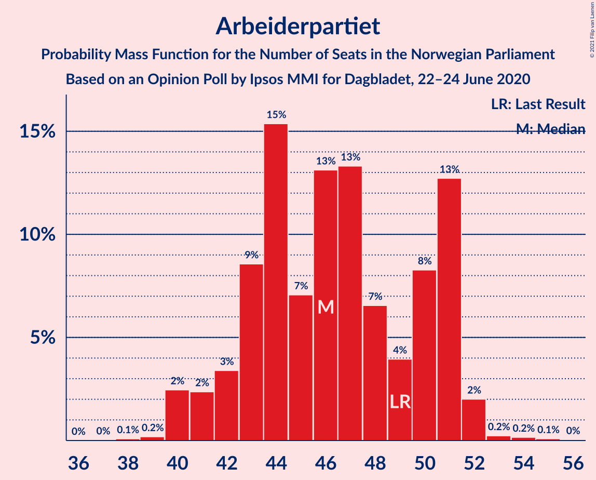

| Number of Seats | Probability | Accumulated | Special Marks |
|:---------------:|:-----------:|:-----------:|:-------------:|
| 38 | 0.1% | 100% |  |
| 39 | 0.1% | 99.9% |  |
| 40 | 0.6% | 99.8% |  |
| 41 | 0.9% | 99.2% |  |
| 42 | 2% | 98% |  |
| 43 | 8% | 96% |  |
| 44 | 10% | 88% |  |
| 45 | 3% | 77% |  |
| 46 | 10% | 74% |  |
| 47 | 14% | 65% |  |
| 48 | 5% | 50% | Median |
| 49 | 5% | 46% | Last Result |
| 50 | 13% | 41% |  |
| 51 | 27% | 28% |  |
| 52 | 0.7% | 0.9% |  |
| 53 | 0.1% | 0.2% |  |
| 54 | 0% | 0.1% |  |
| 55 | 0% | 0.1% |  |
| 56 | 0.1% | 0.1% |  |
| 57 | 0% | 0% |  |

### Senterpartiet

*For a full overview of the results for this party, see the [Senterpartiet](party-senterpartiet.html) page.*

| Number of Seats | Probability | Accumulated | Special Marks |
|:---------------:|:-----------:|:-----------:|:-------------:|
| 18 | 0.1% | 100% |  |
| 19 | 0.8% | 99.9% | Last Result |
| 20 | 1.1% | 99.1% |  |
| 21 | 7% | 98% |  |
| 22 | 11% | 91% |  |
| 23 | 33% | 80% | Median |
| 24 | 18% | 47% |  |
| 25 | 10% | 30% |  |
| 26 | 9% | 19% |  |
| 27 | 4% | 11% |  |
| 28 | 2% | 6% |  |
| 29 | 0.2% | 4% |  |
| 30 | 2% | 4% |  |
| 31 | 2% | 2% |  |
| 32 | 0% | 0.1% |  |
| 33 | 0% | 0% |  |

### Fremskrittspartiet

*For a full overview of the results for this party, see the [Fremskrittspartiet](party-fremskrittspartiet.html) page.*

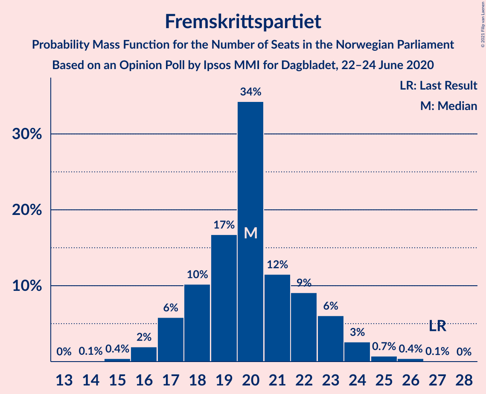

| Number of Seats | Probability | Accumulated | Special Marks |
|:---------------:|:-----------:|:-----------:|:-------------:|
| 14 | 0.1% | 100% |  |
| 15 | 0.3% | 99.9% |  |
| 16 | 0.7% | 99.6% |  |
| 17 | 6% | 98.9% |  |
| 18 | 7% | 93% |  |
| 19 | 14% | 86% |  |
| 20 | 48% | 72% | Median |
| 21 | 5% | 24% |  |
| 22 | 10% | 19% |  |
| 23 | 8% | 10% |  |
| 24 | 1.0% | 2% |  |
| 25 | 0.2% | 0.5% |  |
| 26 | 0.3% | 0.3% |  |
| 27 | 0% | 0% | Last Result |

### Sosialistisk Venstreparti

*For a full overview of the results for this party, see the [Sosialistisk Venstreparti](party-sosialistiskvenstreparti.html) page.*

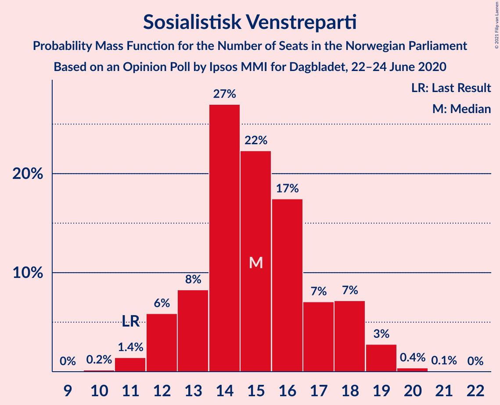

| Number of Seats | Probability | Accumulated | Special Marks |
|:---------------:|:-----------:|:-----------:|:-------------:|
| 10 | 0.2% | 100% |  |
| 11 | 0.4% | 99.8% | Last Result |
| 12 | 8% | 99.4% |  |
| 13 | 5% | 91% |  |
| 14 | 27% | 86% |  |
| 15 | 30% | 59% | Median |
| 16 | 11% | 29% |  |
| 17 | 7% | 18% |  |
| 18 | 11% | 12% |  |
| 19 | 0.7% | 0.9% |  |
| 20 | 0.2% | 0.2% |  |
| 21 | 0% | 0% |  |

### Miljøpartiet De Grønne

*For a full overview of the results for this party, see the [Miljøpartiet De Grønne](party-miljøpartietdegrønne.html) page.*

| Number of Seats | Probability | Accumulated | Special Marks |
|:---------------:|:-----------:|:-----------:|:-------------:|
| 1 | 0% | 100% | Last Result |
| 2 | 0% | 100% |  |
| 3 | 0.5% | 100% |  |
| 4 | 0% | 99.4% |  |
| 5 | 0% | 99.4% |  |
| 6 | 0% | 99.4% |  |
| 7 | 0.6% | 99.4% |  |
| 8 | 5% | 98.8% |  |
| 9 | 7% | 94% |  |
| 10 | 60% | 87% | Median |
| 11 | 17% | 27% |  |
| 12 | 6% | 10% |  |
| 13 | 2% | 4% |  |
| 14 | 2% | 3% |  |
| 15 | 0.1% | 0.2% |  |
| 16 | 0.1% | 0.1% |  |
| 17 | 0% | 0% |  |

### Kristelig Folkeparti

*For a full overview of the results for this party, see the [Kristelig Folkeparti](party-kristeligfolkeparti.html) page.*

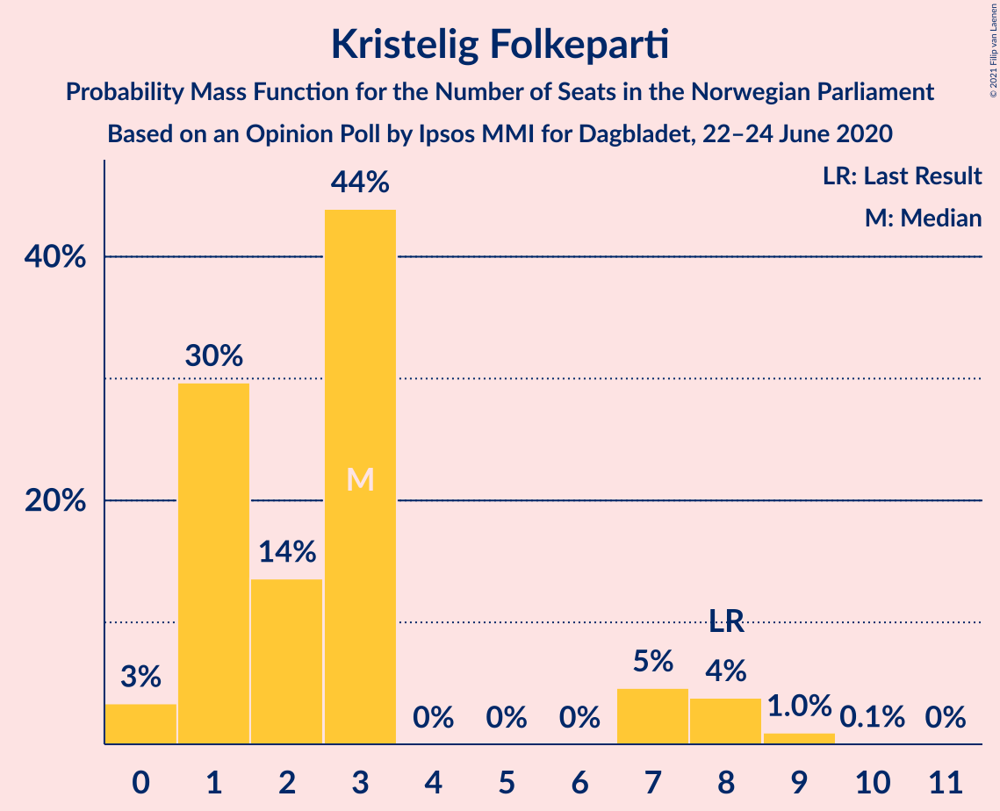

| Number of Seats | Probability | Accumulated | Special Marks |
|:---------------:|:-----------:|:-----------:|:-------------:|
| 0 | 3% | 100% |  |
| 1 | 31% | 97% |  |
| 2 | 9% | 67% |  |
| 3 | 51% | 58% | Median |
| 4 | 0% | 7% |  |
| 5 | 0% | 7% |  |
| 6 | 0% | 7% |  |
| 7 | 1.3% | 7% |  |
| 8 | 4% | 5% | Last Result |
| 9 | 1.3% | 1.4% |  |
| 10 | 0% | 0% |  |

### Venstre

*For a full overview of the results for this party, see the [Venstre](party-venstre.html) page.*

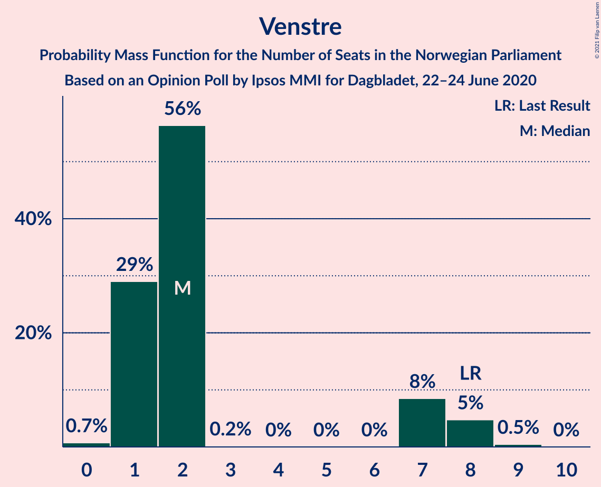

| Number of Seats | Probability | Accumulated | Special Marks |
|:---------------:|:-----------:|:-----------:|:-------------:|
| 0 | 0.6% | 100% |  |
| 1 | 27% | 99.4% |  |
| 2 | 68% | 72% | Median |
| 3 | 0.1% | 5% |  |
| 4 | 0% | 5% |  |
| 5 | 0% | 5% |  |
| 6 | 0% | 5% |  |
| 7 | 1.2% | 5% |  |
| 8 | 3% | 3% | Last Result |
| 9 | 0.4% | 0.5% |  |
| 10 | 0% | 0% |  |

### Rødt

*For a full overview of the results for this party, see the [Rødt](party-rødt.html) page.*

| Number of Seats | Probability | Accumulated | Special Marks |
|:---------------:|:-----------:|:-----------:|:-------------:|
| 1 | 63% | 100% | Last Result, Median |
| 2 | 35% | 37% |  |
| 3 | 0% | 3% |  |
| 4 | 0% | 3% |  |
| 5 | 0% | 3% |  |
| 6 | 0% | 3% |  |
| 7 | 1.1% | 3% |  |
| 8 | 1.4% | 2% |  |
| 9 | 0.2% | 0.3% |  |
| 10 | 0% | 0% |  |

## Coalitions

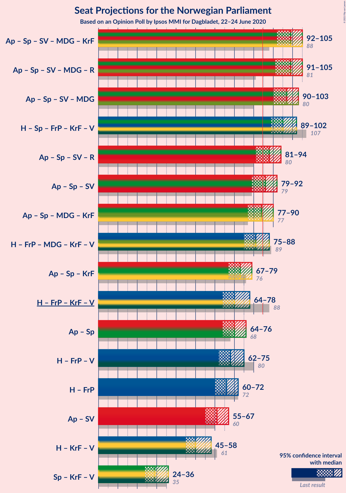

### Confidence Intervals

| Coalition | Last Result | Median | Majority? | 80% Confidence Interval | 90% Confidence Interval | 95% Confidence Interval | 99% Confidence Interval |
|:---------:|:-----------:|:------:|:---------:|:-----------------------:|:-----------------------:|:-----------------------:|:-----------------------:|
| Arbeiderpartiet – Senterpartiet – Sosialistisk Venstreparti – Miljøpartiet De Grønne – Kristelig Folkeparti | 88 | 100 | 100% | 94–103 | 93–103 | 93–104 | 91–106 |
| Arbeiderpartiet – Senterpartiet – Sosialistisk Venstreparti – Miljøpartiet De Grønne – Rødt | 81 | 100 | 100% | 93–102 | 92–102 | 91–103 | 91–105 |
| Arbeiderpartiet – Senterpartiet – Sosialistisk Venstreparti – Miljøpartiet De Grønne | 80 | 98 | 100% | 91–100 | 91–101 | 90–102 | 88–104 |
| Høyre – Senterpartiet – Fremskrittspartiet – Kristelig Folkeparti – Venstre | 107 | 93 | 100% | 91–101 | 90–101 | 90–101 | 87–104 |
| Arbeiderpartiet – Senterpartiet – Sosialistisk Venstreparti – Rødt | 80 | 89 | 81% | 83–92 | 82–92 | 81–94 | 79–95 |
| Arbeiderpartiet – Senterpartiet – Sosialistisk Venstreparti | 79 | 88 | 71% | 81–90 | 81–91 | 79–92 | 77–93 |
| Arbeiderpartiet – Senterpartiet – Miljøpartiet De Grønne – Kristelig Folkeparti | 77 | 85 | 54% | 80–87 | 79–89 | 78–89 | 76–91 |
| Høyre – Fremskrittspartiet – Miljøpartiet De Grønne – Kristelig Folkeparti – Venstre | 89 | 80 | 19% | 77–86 | 77–87 | 75–88 | 73–90 |
| Arbeiderpartiet – Senterpartiet – Kristelig Folkeparti | 76 | 75 | 0% | 71–77 | 69–79 | 67–79 | 65–82 |
| Høyre – Fremskrittspartiet – Kristelig Folkeparti – Venstre | 88 | 69 | 0% | 67–76 | 67–77 | 66–77 | 64–78 |
| Arbeiderpartiet – Senterpartiet | 68 | 71 | 0% | 68–74 | 66–76 | 65–76 | 63–78 |
| Høyre – Fremskrittspartiet – Venstre | 80 | 68 | 0% | 65–73 | 64–74 | 63–74 | 61–77 |
| Høyre – Fremskrittspartiet | 72 | 66 | 0% | 63–71 | 62–72 | 61–72 | 59–75 |
| Arbeiderpartiet – Sosialistisk Venstreparti | 60 | 64 | 0% | 57–66 | 56–66 | 56–66 | 55–70 |
| Høyre – Kristelig Folkeparti – Venstre | 61 | 50 | 0% | 48–56 | 47–57 | 46–58 | 44–60 |
| Senterpartiet – Kristelig Folkeparti – Venstre | 35 | 28 | 0% | 25–32 | 25–34 | 23–35 | 23–39 |

### Arbeiderpartiet – Senterpartiet – Sosialistisk Venstreparti – Miljøpartiet De Grønne – Kristelig Folkeparti

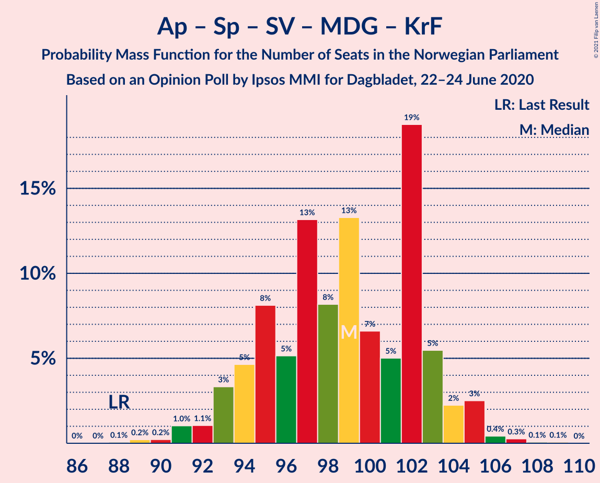

| Number of Seats | Probability | Accumulated | Special Marks |
|:---------------:|:-----------:|:-----------:|:-------------:|
| 88 | 0% | 100% | Last Result |
| 89 | 0.1% | 100% |  |
| 90 | 0.2% | 99.9% |  |
| 91 | 1.4% | 99.7% |  |
| 92 | 0.3% | 98% |  |
| 93 | 3% | 98% |  |
| 94 | 5% | 95% |  |
| 95 | 6% | 89% |  |
| 96 | 4% | 83% |  |
| 97 | 8% | 78% |  |
| 98 | 4% | 70% |  |
| 99 | 16% | 67% | Median |
| 100 | 9% | 50% |  |
| 101 | 2% | 41% |  |
| 102 | 29% | 39% |  |
| 103 | 7% | 10% |  |
| 104 | 1.3% | 3% |  |
| 105 | 1.5% | 2% |  |
| 106 | 0.4% | 0.6% |  |
| 107 | 0.1% | 0.3% |  |
| 108 | 0% | 0.1% |  |
| 109 | 0.1% | 0.1% |  |
| 110 | 0% | 0% |  |

### Arbeiderpartiet – Senterpartiet – Sosialistisk Venstreparti – Miljøpartiet De Grønne – Rødt

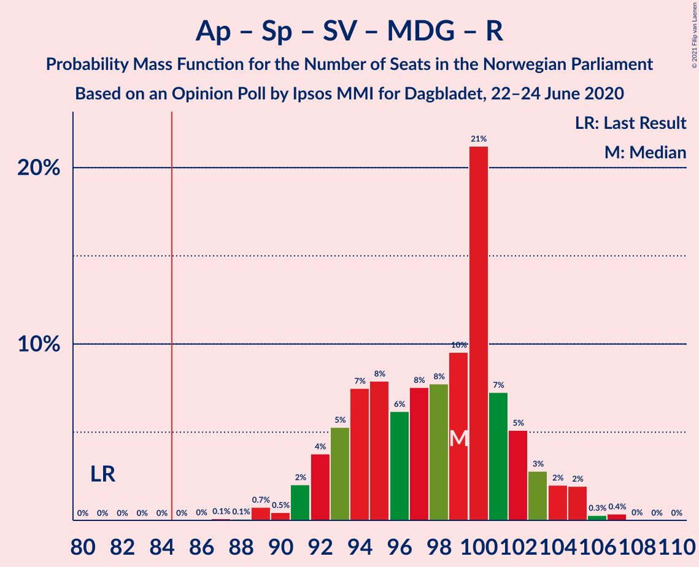

| Number of Seats | Probability | Accumulated | Special Marks |
|:---------------:|:-----------:|:-----------:|:-------------:|
| 81 | 0% | 100% | Last Result |
| 82 | 0% | 100% |  |
| 83 | 0% | 100% |  |
| 84 | 0% | 100% |  |
| 85 | 0% | 100% | Majority |
| 86 | 0% | 100% |  |
| 87 | 0% | 100% |  |
| 88 | 0.1% | 99.9% |  |
| 89 | 0.1% | 99.9% |  |
| 90 | 0.2% | 99.7% |  |
| 91 | 2% | 99.5% |  |
| 92 | 6% | 97% |  |
| 93 | 8% | 91% |  |
| 94 | 2% | 83% |  |
| 95 | 1.5% | 81% |  |
| 96 | 5% | 79% |  |
| 97 | 7% | 75% | Median |
| 98 | 5% | 68% |  |
| 99 | 10% | 63% |  |
| 100 | 40% | 54% |  |
| 101 | 3% | 13% |  |
| 102 | 5% | 10% |  |
| 103 | 3% | 5% |  |
| 104 | 0.8% | 2% |  |
| 105 | 0.5% | 0.9% |  |
| 106 | 0% | 0.4% |  |
| 107 | 0.3% | 0.4% |  |
| 108 | 0% | 0.1% |  |
| 109 | 0% | 0.1% |  |
| 110 | 0% | 0% |  |

### Arbeiderpartiet – Senterpartiet – Sosialistisk Venstreparti – Miljøpartiet De Grønne

| Number of Seats | Probability | Accumulated | Special Marks |
|:---------------:|:-----------:|:-----------:|:-------------:|
| 80 | 0% | 100% | Last Result |
| 81 | 0% | 100% |  |
| 82 | 0% | 100% |  |
| 83 | 0% | 100% |  |
| 84 | 0% | 100% |  |
| 85 | 0% | 100% | Majority |
| 86 | 0.1% | 99.9% |  |
| 87 | 0.2% | 99.9% |  |
| 88 | 0.4% | 99.7% |  |
| 89 | 1.0% | 99.3% |  |
| 90 | 2% | 98% |  |
| 91 | 8% | 96% |  |
| 92 | 7% | 88% |  |
| 93 | 2% | 81% |  |
| 94 | 4% | 78% |  |
| 95 | 6% | 75% |  |
| 96 | 6% | 68% | Median |
| 97 | 4% | 63% |  |
| 98 | 16% | 59% |  |
| 99 | 32% | 43% |  |
| 100 | 6% | 11% |  |
| 101 | 2% | 5% |  |
| 102 | 2% | 3% |  |
| 103 | 0.2% | 0.8% |  |
| 104 | 0.3% | 0.7% |  |
| 105 | 0.3% | 0.3% |  |
| 106 | 0% | 0.1% |  |
| 107 | 0% | 0% |  |

### Høyre – Senterpartiet – Fremskrittspartiet – Kristelig Folkeparti – Venstre

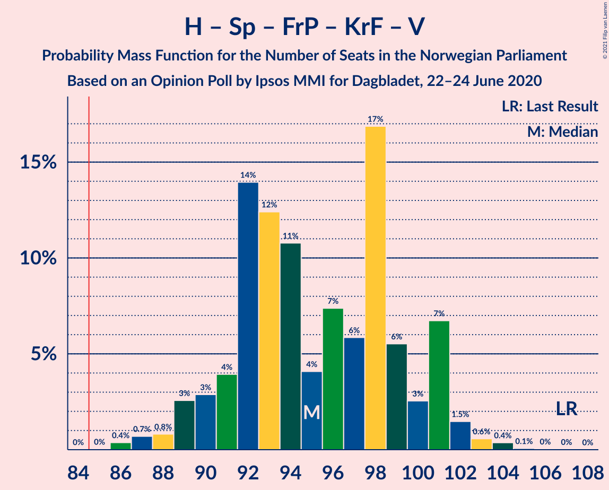

| Number of Seats | Probability | Accumulated | Special Marks |
|:---------------:|:-----------:|:-----------:|:-------------:|
| 85 | 0% | 100% | Majority |
| 86 | 0.3% | 99.9% |  |
| 87 | 0.2% | 99.6% |  |
| 88 | 0.5% | 99.4% |  |
| 89 | 0.7% | 98.9% |  |
| 90 | 3% | 98% |  |
| 91 | 5% | 95% |  |
| 92 | 27% | 90% |  |
| 93 | 13% | 63% |  |
| 94 | 13% | 50% | Median |
| 95 | 4% | 37% |  |
| 96 | 3% | 33% |  |
| 97 | 6% | 30% |  |
| 98 | 5% | 24% |  |
| 99 | 4% | 19% |  |
| 100 | 2% | 15% |  |
| 101 | 13% | 14% |  |
| 102 | 0.2% | 1.3% |  |
| 103 | 0.5% | 1.1% |  |
| 104 | 0.6% | 0.6% |  |
| 105 | 0% | 0.1% |  |
| 106 | 0% | 0% |  |
| 107 | 0% | 0% | Last Result |

### Arbeiderpartiet – Senterpartiet – Sosialistisk Venstreparti – Rødt

| Number of Seats | Probability | Accumulated | Special Marks |
|:---------------:|:-----------:|:-----------:|:-------------:|
| 77 | 0% | 100% |  |
| 78 | 0.3% | 99.9% |  |
| 79 | 0.2% | 99.7% |  |
| 80 | 2% | 99.5% | Last Result |
| 81 | 0.8% | 98% |  |
| 82 | 6% | 97% |  |
| 83 | 8% | 92% |  |
| 84 | 2% | 84% |  |
| 85 | 7% | 81% | Majority |
| 86 | 2% | 74% |  |
| 87 | 5% | 72% | Median |
| 88 | 7% | 67% |  |
| 89 | 13% | 60% |  |
| 90 | 33% | 46% |  |
| 91 | 3% | 14% |  |
| 92 | 7% | 10% |  |
| 93 | 0.8% | 4% |  |
| 94 | 2% | 3% |  |
| 95 | 0.7% | 1.1% |  |
| 96 | 0.4% | 0.5% |  |
| 97 | 0.1% | 0.1% |  |
| 98 | 0% | 0.1% |  |
| 99 | 0% | 0% |  |

### Arbeiderpartiet – Senterpartiet – Sosialistisk Venstreparti

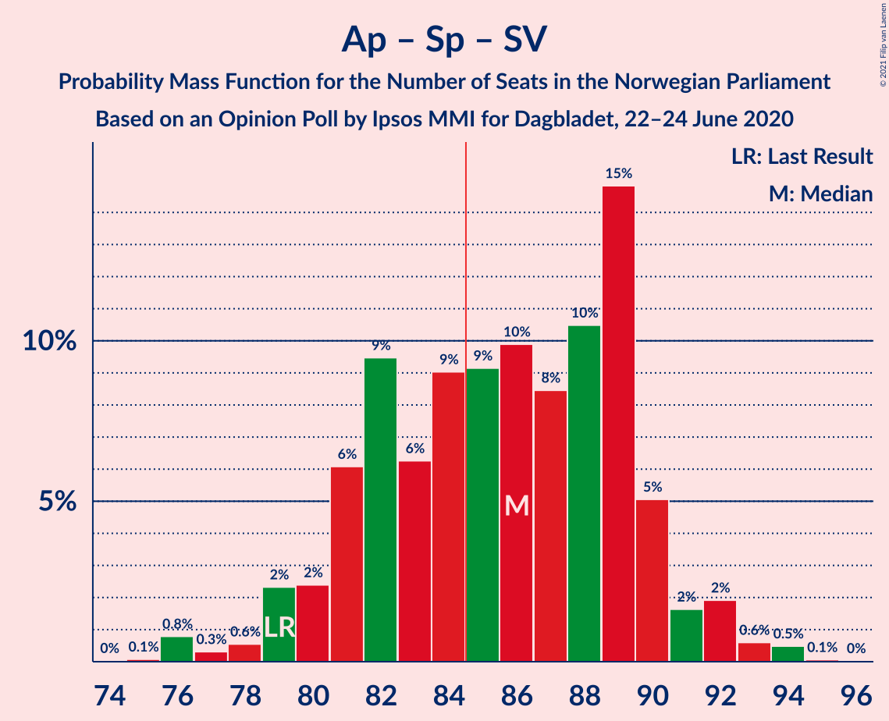

| Number of Seats | Probability | Accumulated | Special Marks |
|:---------------:|:-----------:|:-----------:|:-------------:|
| 75 | 0.1% | 100% |  |
| 76 | 0.2% | 99.9% |  |
| 77 | 0.3% | 99.7% |  |
| 78 | 0.5% | 99.5% |  |
| 79 | 2% | 99.0% | Last Result |
| 80 | 0.8% | 97% |  |
| 81 | 6% | 96% |  |
| 82 | 8% | 90% |  |
| 83 | 7% | 82% |  |
| 84 | 4% | 76% |  |
| 85 | 5% | 71% | Majority |
| 86 | 5% | 66% | Median |
| 87 | 7% | 61% |  |
| 88 | 15% | 54% |  |
| 89 | 28% | 39% |  |
| 90 | 5% | 10% |  |
| 91 | 3% | 5% |  |
| 92 | 1.3% | 3% |  |
| 93 | 0.9% | 1.3% |  |
| 94 | 0.4% | 0.4% |  |
| 95 | 0% | 0.1% |  |
| 96 | 0% | 0% |  |

### Arbeiderpartiet – Senterpartiet – Miljøpartiet De Grønne – Kristelig Folkeparti

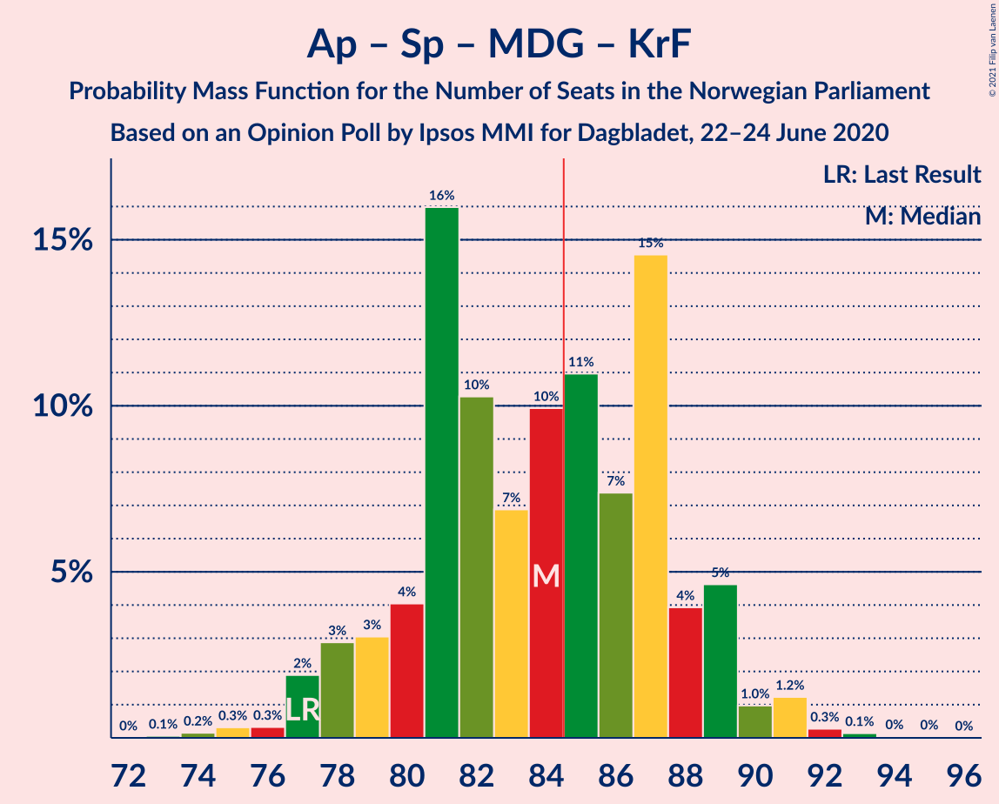

| Number of Seats | Probability | Accumulated | Special Marks |
|:---------------:|:-----------:|:-----------:|:-------------:|
| 74 | 0.1% | 100% |  |
| 75 | 0.3% | 99.9% |  |
| 76 | 0.2% | 99.6% |  |
| 77 | 1.3% | 99.4% | Last Result |
| 78 | 2% | 98% |  |
| 79 | 4% | 96% |  |
| 80 | 3% | 93% |  |
| 81 | 17% | 90% |  |
| 82 | 5% | 73% |  |
| 83 | 8% | 68% |  |
| 84 | 6% | 60% | Median |
| 85 | 12% | 54% | Majority |
| 86 | 3% | 42% |  |
| 87 | 30% | 39% |  |
| 88 | 2% | 9% |  |
| 89 | 6% | 7% |  |
| 90 | 0.2% | 1.1% |  |
| 91 | 0.6% | 0.8% |  |
| 92 | 0% | 0.2% |  |
| 93 | 0.1% | 0.2% |  |
| 94 | 0% | 0.1% |  |
| 95 | 0.1% | 0.1% |  |
| 96 | 0% | 0% |  |

### Høyre – Fremskrittspartiet – Miljøpartiet De Grønne – Kristelig Folkeparti – Venstre

| Number of Seats | Probability | Accumulated | Special Marks |
|:---------------:|:-----------:|:-----------:|:-------------:|
| 71 | 0% | 100% |  |
| 72 | 0.1% | 99.9% |  |
| 73 | 0.4% | 99.8% |  |
| 74 | 0.7% | 99.5% |  |
| 75 | 2% | 98.8% |  |
| 76 | 0.8% | 97% |  |
| 77 | 7% | 96% |  |
| 78 | 3% | 90% |  |
| 79 | 33% | 86% |  |
| 80 | 13% | 54% |  |
| 81 | 7% | 40% | Median |
| 82 | 5% | 33% |  |
| 83 | 2% | 28% |  |
| 84 | 7% | 26% |  |
| 85 | 2% | 19% | Majority |
| 86 | 8% | 16% |  |
| 87 | 6% | 8% |  |
| 88 | 0.8% | 3% |  |
| 89 | 2% | 2% | Last Result |
| 90 | 0.2% | 0.5% |  |
| 91 | 0.3% | 0.3% |  |
| 92 | 0% | 0.1% |  |
| 93 | 0% | 0% |  |

### Arbeiderpartiet – Senterpartiet – Kristelig Folkeparti

| Number of Seats | Probability | Accumulated | Special Marks |
|:---------------:|:-----------:|:-----------:|:-------------:|
| 63 | 0.1% | 100% |  |
| 64 | 0.1% | 99.9% |  |
| 65 | 0.4% | 99.9% |  |
| 66 | 2% | 99.4% |  |
| 67 | 0.5% | 98% |  |
| 68 | 0.7% | 97% |  |
| 69 | 3% | 97% |  |
| 70 | 2% | 93% |  |
| 71 | 19% | 91% |  |
| 72 | 13% | 72% |  |
| 73 | 3% | 59% |  |
| 74 | 5% | 56% | Median |
| 75 | 9% | 50% |  |
| 76 | 4% | 42% | Last Result |
| 77 | 29% | 38% |  |
| 78 | 2% | 9% |  |
| 79 | 5% | 6% |  |
| 80 | 0.3% | 1.0% |  |
| 81 | 0.1% | 0.6% |  |
| 82 | 0.4% | 0.5% |  |
| 83 | 0.1% | 0.1% |  |
| 84 | 0% | 0% |  |

### Høyre – Fremskrittspartiet – Kristelig Folkeparti – Venstre

| Number of Seats | Probability | Accumulated | Special Marks |
|:---------------:|:-----------:|:-----------:|:-------------:|
| 60 | 0% | 100% |  |
| 61 | 0% | 99.9% |  |
| 62 | 0.3% | 99.9% |  |
| 63 | 0% | 99.6% |  |
| 64 | 0.5% | 99.6% |  |
| 65 | 0.8% | 99.1% |  |
| 66 | 3% | 98% |  |
| 67 | 5% | 95% |  |
| 68 | 3% | 90% |  |
| 69 | 40% | 86% |  |
| 70 | 10% | 46% |  |
| 71 | 5% | 37% | Median |
| 72 | 7% | 32% |  |
| 73 | 5% | 25% |  |
| 74 | 1.5% | 21% |  |
| 75 | 2% | 19% |  |
| 76 | 8% | 17% |  |
| 77 | 6% | 9% |  |
| 78 | 2% | 2% |  |
| 79 | 0.2% | 0.4% |  |
| 80 | 0.1% | 0.3% |  |
| 81 | 0.1% | 0.1% |  |
| 82 | 0% | 0.1% |  |
| 83 | 0% | 0% |  |
| 84 | 0% | 0% |  |
| 85 | 0% | 0% | Majority |
| 86 | 0% | 0% |  |
| 87 | 0% | 0% |  |
| 88 | 0% | 0% | Last Result |

### Arbeiderpartiet – Senterpartiet

| Number of Seats | Probability | Accumulated | Special Marks |
|:---------------:|:-----------:|:-----------:|:-------------:|
| 61 | 0.1% | 100% |  |
| 62 | 0.3% | 99.9% |  |
| 63 | 0.2% | 99.6% |  |
| 64 | 1.0% | 99.3% |  |
| 65 | 2% | 98% |  |
| 66 | 2% | 96% |  |
| 67 | 2% | 94% |  |
| 68 | 11% | 92% | Last Result |
| 69 | 7% | 82% |  |
| 70 | 15% | 75% |  |
| 71 | 10% | 60% | Median |
| 72 | 3% | 50% |  |
| 73 | 3% | 46% |  |
| 74 | 35% | 43% |  |
| 75 | 2% | 8% |  |
| 76 | 5% | 7% |  |
| 77 | 0.1% | 2% |  |
| 78 | 1.1% | 1.4% |  |
| 79 | 0.2% | 0.3% |  |
| 80 | 0.1% | 0.1% |  |
| 81 | 0% | 0% |  |

### Høyre – Fremskrittspartiet – Venstre

| Number of Seats | Probability | Accumulated | Special Marks |
|:---------------:|:-----------:|:-----------:|:-------------:|
| 57 | 0.1% | 100% |  |
| 58 | 0.1% | 99.9% |  |
| 59 | 0% | 99.8% |  |
| 60 | 0.1% | 99.8% |  |
| 61 | 0.4% | 99.7% |  |
| 62 | 1.2% | 99.3% |  |
| 63 | 0.9% | 98% |  |
| 64 | 6% | 97% |  |
| 65 | 4% | 91% |  |
| 66 | 29% | 88% |  |
| 67 | 7% | 59% |  |
| 68 | 10% | 52% | Median |
| 69 | 12% | 42% |  |
| 70 | 10% | 31% |  |
| 71 | 5% | 21% |  |
| 72 | 0.6% | 16% |  |
| 73 | 6% | 15% |  |
| 74 | 7% | 9% |  |
| 75 | 0.5% | 2% |  |
| 76 | 0.4% | 1.4% |  |
| 77 | 1.0% | 1.0% |  |
| 78 | 0% | 0.1% |  |
| 79 | 0% | 0% |  |
| 80 | 0% | 0% | Last Result |

### Høyre – Fremskrittspartiet

| Number of Seats | Probability | Accumulated | Special Marks |
|:---------------:|:-----------:|:-----------:|:-------------:|
| 55 | 0.1% | 100% |  |
| 56 | 0% | 99.9% |  |
| 57 | 0.2% | 99.9% |  |
| 58 | 0.1% | 99.6% |  |
| 59 | 0.2% | 99.6% |  |
| 60 | 0.9% | 99.3% |  |
| 61 | 2% | 98% |  |
| 62 | 6% | 96% |  |
| 63 | 3% | 90% |  |
| 64 | 30% | 87% |  |
| 65 | 4% | 57% |  |
| 66 | 11% | 54% | Median |
| 67 | 8% | 43% |  |
| 68 | 12% | 35% |  |
| 69 | 8% | 23% |  |
| 70 | 0.7% | 15% |  |
| 71 | 6% | 14% |  |
| 72 | 7% | 8% | Last Result |
| 73 | 0.4% | 2% |  |
| 74 | 0.4% | 1.3% |  |
| 75 | 0.9% | 0.9% |  |
| 76 | 0% | 0% |  |

### Arbeiderpartiet – Sosialistisk Venstreparti

| Number of Seats | Probability | Accumulated | Special Marks |
|:---------------:|:-----------:|:-----------:|:-------------:|
| 52 | 0.1% | 100% |  |
| 53 | 0.1% | 99.9% |  |
| 54 | 0.2% | 99.8% |  |
| 55 | 0.4% | 99.6% |  |
| 56 | 5% | 99.1% |  |
| 57 | 8% | 95% |  |
| 58 | 5% | 87% |  |
| 59 | 7% | 82% |  |
| 60 | 6% | 75% | Last Result |
| 61 | 4% | 69% |  |
| 62 | 3% | 65% |  |
| 63 | 8% | 62% | Median |
| 64 | 17% | 54% |  |
| 65 | 6% | 37% |  |
| 66 | 29% | 31% |  |
| 67 | 0.9% | 2% |  |
| 68 | 0.2% | 0.8% |  |
| 69 | 0.1% | 0.6% |  |
| 70 | 0.4% | 0.5% |  |
| 71 | 0% | 0.1% |  |
| 72 | 0% | 0% |  |

### Høyre – Kristelig Folkeparti – Venstre

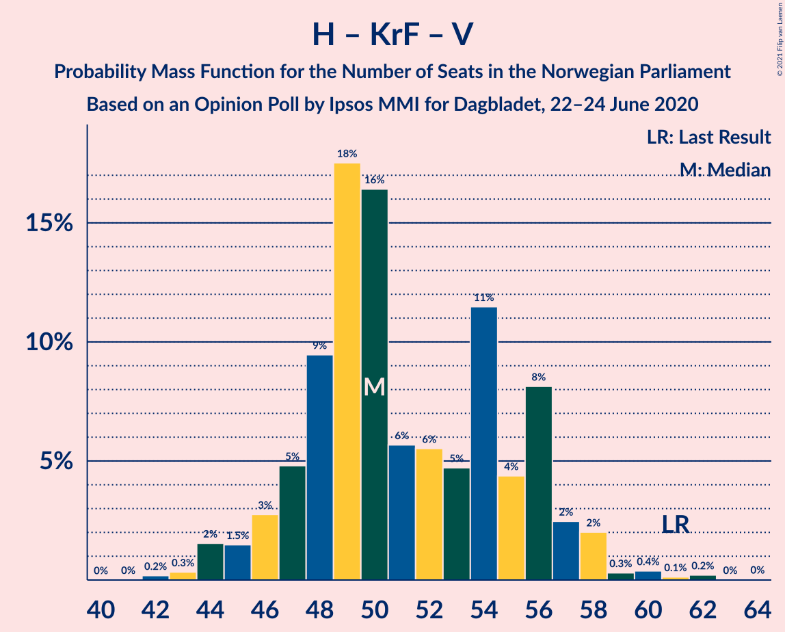

| Number of Seats | Probability | Accumulated | Special Marks |
|:---------------:|:-----------:|:-----------:|:-------------:|
| 42 | 0.3% | 100% |  |
| 43 | 0.1% | 99.7% |  |
| 44 | 0.4% | 99.6% |  |
| 45 | 1.3% | 99.2% |  |
| 46 | 2% | 98% |  |
| 47 | 5% | 96% |  |
| 48 | 3% | 91% |  |
| 49 | 31% | 88% |  |
| 50 | 25% | 57% |  |
| 51 | 6% | 33% | Median |
| 52 | 1.2% | 27% |  |
| 53 | 4% | 26% |  |
| 54 | 8% | 22% |  |
| 55 | 2% | 14% |  |
| 56 | 7% | 13% |  |
| 57 | 3% | 5% |  |
| 58 | 2% | 3% |  |
| 59 | 0.3% | 1.0% |  |
| 60 | 0.6% | 0.8% |  |
| 61 | 0.1% | 0.1% | Last Result |
| 62 | 0.1% | 0.1% |  |
| 63 | 0% | 0% |  |

### Senterpartiet – Kristelig Folkeparti – Venstre

| Number of Seats | Probability | Accumulated | Special Marks |
|:---------------:|:-----------:|:-----------:|:-------------:|
| 21 | 0.1% | 100% |  |
| 22 | 0.2% | 99.9% |  |
| 23 | 3% | 99.7% |  |
| 24 | 0.5% | 97% |  |
| 25 | 8% | 97% |  |
| 26 | 14% | 89% |  |
| 27 | 7% | 74% |  |
| 28 | 30% | 68% | Median |
| 29 | 10% | 38% |  |
| 30 | 8% | 28% |  |
| 31 | 5% | 20% |  |
| 32 | 7% | 15% |  |
| 33 | 3% | 8% |  |
| 34 | 2% | 5% |  |
| 35 | 0.9% | 3% | Last Result |
| 36 | 0.4% | 2% |  |
| 37 | 0.8% | 2% |  |
| 38 | 0.2% | 0.7% |  |
| 39 | 0.4% | 0.5% |  |
| 40 | 0.1% | 0.2% |  |
| 41 | 0% | 0.1% |  |
| 42 | 0% | 0% |  |

## Technical Information

### Opinion Poll

+ **Polling firm:** Ipsos MMI
+ **Commissioner(s):** Dagbladet
+ **Fieldwork period:** 22–24 June 2020

### Calculations

+ **Sample size:** 1000
+ **Simulations done:** 131,072
+ **Error estimate:** 2.04%

