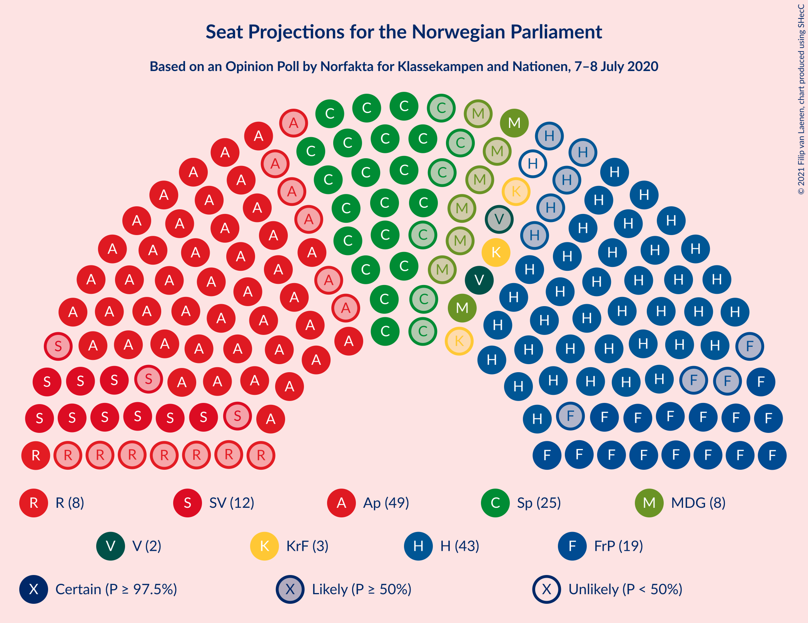
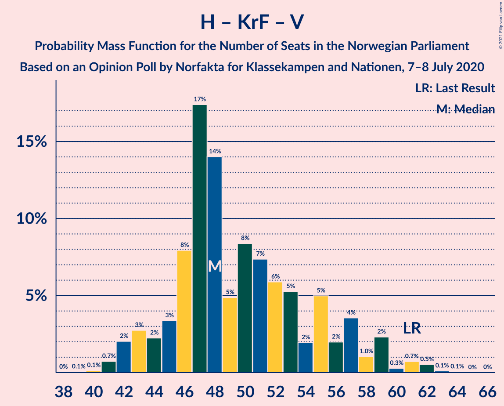

# Opinion Poll by Norfakta for Klassekampen and Nationen, 7–8 July 2020

<a href="#voting-intentions">Voting Intentions</a> | <a href="#seats">Seats</a> | <a href="#coalitions">Coalitions</a> | <a href="#technical-information">Technical Information</a>

## Voting Intentions

### Confidence Intervals

| Party | Last Result | Poll Result | 80% Confidence Interval | 90% Confidence Interval | 95% Confidence Interval | 99% Confidence Interval |
|:-----:|:-----------:|:-----------:|:-----------------------:|:-----------------------:|:-----------------------:|:-----------------------:|
| Arbeiderpartiet | 27.4% | 27.3% | 25.5–29.2% |25.0–29.7% |24.6–30.1% |23.8–31.1% |
| Høyre | 25.0% | 23.9% | 22.2–25.7% |21.8–26.2% |21.4–26.6% |20.6–27.5% |
| Senterpartiet | 10.3% | 13.7% | 12.4–15.2% |12.0–15.6% |11.7–16.0% |11.1–16.7% |
| Fremskrittspartiet | 15.2% | 10.5% | 9.3–11.8% |9.0–12.2% |8.7–12.6% |8.2–13.2% |
| Sosialistisk Venstreparti | 6.0% | 6.9% | 6.0–8.0% |5.7–8.4% |5.5–8.7% |5.1–9.2% |
| Miljøpartiet De Grønne | 3.2% | 4.9% | 4.1–5.9% |3.9–6.2% |3.7–6.4% |3.4–6.9% |
| Rødt | 2.4% | 4.2% | 3.5–5.1% |3.3–5.4% |3.1–5.6% |2.8–6.1% |
| Kristelig Folkeparti | 4.2% | 3.8% | 3.1–4.7% |2.9–5.0% |2.8–5.2% |2.5–5.6% |
| Venstre | 4.4% | 3.5% | 2.9–4.4% |2.7–4.6% |2.5–4.8% |2.2–5.3% |

*Note:* The poll result column reflects the actual value used in the calculations. Published results may vary slightly, and in addition be rounded to fewer digits.

## Seats

### Confidence Intervals

| Party | Last Result | Median | 80% Confidence Interval | 90% Confidence Interval | 95% Confidence Interval | 99% Confidence Interval |
|:-----:|:-----------:|:------:|:-----------------------:|:-----------------------:|:-----------------------:|:-----------------------:|
| <a href="#arbeiderpartiet">Arbeiderpartiet</a> | 49 | 50 | 45–53 |44–55 |44–56 |42–58 |
| <a href="#høyre">Høyre</a> | 45 | 42 | 38–46 |37–47 |37–48 |36–50 |
| <a href="#senterpartiet">Senterpartiet</a> | 19 | 25 | 21–28 |19–30 |19–31 |19–33 |
| <a href="#fremskrittspartiet">Fremskrittspartiet</a> | 27 | 18 | 16–20 |16–21 |15–23 |14–24 |
| <a href="#sosialistisk-venstreparti">Sosialistisk Venstreparti</a> | 11 | 12 | 10–14 |10–14 |9–15 |9–17 |
| <a href="#miljøpartiet-de-grønne">Miljøpartiet De Grønne</a> | 1 | 8 | 7–10 |2–11 |2–11 |1–12 |
| <a href="#rødt">Rødt</a> | 1 | 8 | 2–9 |2–10 |1–10 |1–11 |
| <a href="#kristelig-folkeparti">Kristelig Folkeparti</a> | 8 | 3 | 2–8 |1–8 |1–9 |1–10 |
| <a href="#venstre">Venstre</a> | 8 | 2 | 2–8 |2–8 |1–9 |1–9 |

### Arbeiderpartiet

*For a full overview of the results for this party, see the [Arbeiderpartiet](party-arbeiderpartiet.html) page.*

| Number of Seats | Probability | Accumulated | Special Marks |
|:---------------:|:-----------:|:-----------:|:-------------:|
| 40 | 0.1% | 100% |  |
| 41 | 0.3% | 99.9% |  |
| 42 | 1.0% | 99.6% |  |
| 43 | 0.4% | 98.6% |  |
| 44 | 5% | 98% |  |
| 45 | 6% | 94% |  |
| 46 | 5% | 88% |  |
| 47 | 10% | 82% |  |
| 48 | 6% | 72% |  |
| 49 | 9% | 66% | Last Result |
| 50 | 15% | 57% | Median |
| 51 | 5% | 42% |  |
| 52 | 16% | 37% |  |
| 53 | 13% | 21% |  |
| 54 | 2% | 8% |  |
| 55 | 3% | 6% |  |
| 56 | 1.3% | 4% |  |
| 57 | 1.4% | 2% |  |
| 58 | 0.7% | 0.9% |  |
| 59 | 0.1% | 0.2% |  |
| 60 | 0% | 0.1% |  |
| 61 | 0% | 0% |  |

### Høyre

*For a full overview of the results for this party, see the [Høyre](party-høyre.html) page.*

| Number of Seats | Probability | Accumulated | Special Marks |
|:---------------:|:-----------:|:-----------:|:-------------:|
| 33 | 0.2% | 100% |  |
| 34 | 0.1% | 99.8% |  |
| 35 | 0.2% | 99.7% |  |
| 36 | 1.1% | 99.5% |  |
| 37 | 5% | 98% |  |
| 38 | 10% | 93% |  |
| 39 | 6% | 83% |  |
| 40 | 14% | 77% |  |
| 41 | 6% | 62% |  |
| 42 | 16% | 56% | Median |
| 43 | 10% | 40% |  |
| 44 | 8% | 30% |  |
| 45 | 9% | 21% | Last Result |
| 46 | 5% | 13% |  |
| 47 | 5% | 7% |  |
| 48 | 2% | 3% |  |
| 49 | 0.5% | 1.1% |  |
| 50 | 0.3% | 0.6% |  |
| 51 | 0.2% | 0.3% |  |
| 52 | 0.1% | 0.1% |  |
| 53 | 0% | 0% |  |

### Senterpartiet

*For a full overview of the results for this party, see the [Senterpartiet](party-senterpartiet.html) page.*

| Number of Seats | Probability | Accumulated | Special Marks |
|:---------------:|:-----------:|:-----------:|:-------------:|
| 18 | 0.5% | 100% |  |
| 19 | 6% | 99.5% | Last Result |
| 20 | 1.4% | 94% |  |
| 21 | 12% | 93% |  |
| 22 | 17% | 80% |  |
| 23 | 7% | 63% |  |
| 24 | 5% | 55% |  |
| 25 | 18% | 50% | Median |
| 26 | 5% | 32% |  |
| 27 | 9% | 27% |  |
| 28 | 10% | 19% |  |
| 29 | 2% | 9% |  |
| 30 | 2% | 7% |  |
| 31 | 3% | 5% |  |
| 32 | 0.5% | 1.5% |  |
| 33 | 0.7% | 1.0% |  |
| 34 | 0.2% | 0.3% |  |
| 35 | 0% | 0% |  |

### Fremskrittspartiet

*For a full overview of the results for this party, see the [Fremskrittspartiet](party-fremskrittspartiet.html) page.*

| Number of Seats | Probability | Accumulated | Special Marks |
|:---------------:|:-----------:|:-----------:|:-------------:|
| 12 | 0.1% | 100% |  |
| 13 | 0.2% | 99.9% |  |
| 14 | 1.1% | 99.7% |  |
| 15 | 3% | 98.6% |  |
| 16 | 9% | 96% |  |
| 17 | 32% | 87% |  |
| 18 | 7% | 55% | Median |
| 19 | 25% | 48% |  |
| 20 | 13% | 22% |  |
| 21 | 5% | 10% |  |
| 22 | 2% | 4% |  |
| 23 | 2% | 3% |  |
| 24 | 0.3% | 0.7% |  |
| 25 | 0.3% | 0.4% |  |
| 26 | 0% | 0% |  |
| 27 | 0% | 0% | Last Result |

### Sosialistisk Venstreparti

*For a full overview of the results for this party, see the [Sosialistisk Venstreparti](party-sosialistiskvenstreparti.html) page.*

| Number of Seats | Probability | Accumulated | Special Marks |
|:---------------:|:-----------:|:-----------:|:-------------:|
| 7 | 0.1% | 100% |  |
| 8 | 0.3% | 99.9% |  |
| 9 | 3% | 99.6% |  |
| 10 | 21% | 97% |  |
| 11 | 13% | 75% | Last Result |
| 12 | 18% | 63% | Median |
| 13 | 18% | 45% |  |
| 14 | 23% | 26% |  |
| 15 | 2% | 3% |  |
| 16 | 0.7% | 2% |  |
| 17 | 0.8% | 0.8% |  |
| 18 | 0% | 0.1% |  |
| 19 | 0% | 0% |  |

### Miljøpartiet De Grønne

*For a full overview of the results for this party, see the [Miljøpartiet De Grønne](party-miljøpartietdegrønne.html) page.*

| Number of Seats | Probability | Accumulated | Special Marks |
|:---------------:|:-----------:|:-----------:|:-------------:|
| 1 | 0.7% | 100% | Last Result |
| 2 | 6% | 99.3% |  |
| 3 | 0.3% | 93% |  |
| 4 | 0% | 93% |  |
| 5 | 0% | 93% |  |
| 6 | 0% | 93% |  |
| 7 | 19% | 93% |  |
| 8 | 27% | 74% | Median |
| 9 | 30% | 47% |  |
| 10 | 10% | 17% |  |
| 11 | 6% | 8% |  |
| 12 | 0.9% | 1.2% |  |
| 13 | 0.3% | 0.3% |  |
| 14 | 0% | 0% |  |

### Rødt

*For a full overview of the results for this party, see the [Rødt](party-rødt.html) page.*

| Number of Seats | Probability | Accumulated | Special Marks |
|:---------------:|:-----------:|:-----------:|:-------------:|
| 1 | 4% | 100% | Last Result |
| 2 | 21% | 96% |  |
| 3 | 0% | 75% |  |
| 4 | 0% | 75% |  |
| 5 | 0% | 75% |  |
| 6 | 0.3% | 75% |  |
| 7 | 23% | 74% |  |
| 8 | 32% | 51% | Median |
| 9 | 11% | 19% |  |
| 10 | 7% | 8% |  |
| 11 | 1.3% | 1.3% |  |
| 12 | 0% | 0% |  |

### Kristelig Folkeparti

*For a full overview of the results for this party, see the [Kristelig Folkeparti](party-kristeligfolkeparti.html) page.*

| Number of Seats | Probability | Accumulated | Special Marks |
|:---------------:|:-----------:|:-----------:|:-------------:|
| 0 | 0.1% | 100% |  |
| 1 | 10% | 99.9% |  |
| 2 | 6% | 90% |  |
| 3 | 44% | 84% | Median |
| 4 | 0% | 40% |  |
| 5 | 0% | 40% |  |
| 6 | 0.2% | 40% |  |
| 7 | 18% | 40% |  |
| 8 | 16% | 21% | Last Result |
| 9 | 4% | 5% |  |
| 10 | 0.4% | 0.5% |  |
| 11 | 0.1% | 0.1% |  |
| 12 | 0% | 0% |  |

### Venstre

*For a full overview of the results for this party, see the [Venstre](party-venstre.html) page.*

| Number of Seats | Probability | Accumulated | Special Marks |
|:---------------:|:-----------:|:-----------:|:-------------:|
| 1 | 4% | 100% |  |
| 2 | 69% | 96% | Median |
| 3 | 0.1% | 27% |  |
| 4 | 0% | 27% |  |
| 5 | 0% | 27% |  |
| 6 | 0.3% | 27% |  |
| 7 | 15% | 27% |  |
| 8 | 8% | 12% | Last Result |
| 9 | 4% | 4% |  |
| 10 | 0.1% | 0.1% |  |
| 11 | 0% | 0% |  |

## Coalitions

### Confidence Intervals

| Coalition | Last Result | Median | Majority? | 80% Confidence Interval | 90% Confidence Interval | 95% Confidence Interval | 99% Confidence Interval |
|:---------:|:-----------:|:------:|:---------:|:-----------------------:|:-----------------------:|:-----------------------:|:-----------------------:|
| Arbeiderpartiet – Senterpartiet – Sosialistisk Venstreparti – Miljøpartiet De Grønne – Rødt | 81 | 101 | 100% | 95–105 | 94–107 | 93–109 | 89–110 |
| Arbeiderpartiet – Senterpartiet – Sosialistisk Venstreparti – Miljøpartiet De Grønne – Kristelig Folkeparti | 88 | 99 | 100% | 93–104 | 93–105 | 92–106 | 89–108 |
| Arbeiderpartiet – Senterpartiet – Sosialistisk Venstreparti – Miljøpartiet De Grønne | 80 | 94 | 99.1% | 90–99 | 90–102 | 87–103 | 83–103 |
| Høyre – Senterpartiet – Fremskrittspartiet – Kristelig Folkeparti – Venstre | 107 | 92 | 98% | 88–97 | 86–99 | 86–101 | 82–104 |
| Arbeiderpartiet – Senterpartiet – Sosialistisk Venstreparti – Rødt | 80 | 94 | 98% | 86–97 | 86–98 | 85–100 | 82–101 |
| Arbeiderpartiet – Senterpartiet – Miljøpartiet De Grønne – Kristelig Folkeparti | 77 | 87 | 61% | 82–93 | 80–93 | 79–94 | 77–96 |
| Arbeiderpartiet – Senterpartiet – Sosialistisk Venstreparti | 79 | 86 | 68% | 82–90 | 82–92 | 80–93 | 76–95 |
| Arbeiderpartiet – Senterpartiet – Kristelig Folkeparti | 76 | 78 | 6% | 73–84 | 72–85 | 72–85 | 70–88 |
| Høyre – Fremskrittspartiet – Miljøpartiet De Grønne – Kristelig Folkeparti – Venstre | 89 | 75 | 2% | 72–83 | 71–83 | 69–84 | 68–87 |
| Arbeiderpartiet – Senterpartiet | 68 | 74 | 0.3% | 70–77 | 69–79 | 68–81 | 66–84 |
| Høyre – Fremskrittspartiet – Kristelig Folkeparti – Venstre | 88 | 68 | 0% | 64–74 | 62–75 | 60–76 | 59–80 |
| Høyre – Fremskrittspartiet – Venstre | 80 | 63 | 0% | 57–69 | 56–71 | 56–72 | 55–76 |
| Arbeiderpartiet – Sosialistisk Venstreparti | 60 | 62 | 0% | 57–66 | 57–67 | 55–68 | 54–71 |
| Høyre – Fremskrittspartiet | 72 | 61 | 0% | 55–65 | 54–66 | 54–66 | 52–69 |
| Høyre – Kristelig Folkeparti – Venstre | 61 | 50 | 0% | 45–56 | 44–57 | 43–58 | 41–61 |
| Senterpartiet – Kristelig Folkeparti – Venstre | 35 | 33 | 0% | 27–38 | 27–39 | 26–40 | 25–43 |

### Arbeiderpartiet – Senterpartiet – Sosialistisk Venstreparti – Miljøpartiet De Grønne – Rødt

| Number of Seats | Probability | Accumulated | Special Marks |
|:---------------:|:-----------:|:-----------:|:-------------:|
| 81 | 0% | 100% | Last Result |
| 82 | 0% | 100% |  |
| 83 | 0% | 100% |  |
| 84 | 0% | 100% |  |
| 85 | 0% | 100% | Majority |
| 86 | 0% | 100% |  |
| 87 | 0% | 100% |  |
| 88 | 0.1% | 99.9% |  |
| 89 | 0.4% | 99.8% |  |
| 90 | 0.6% | 99.4% |  |
| 91 | 0.4% | 98.9% |  |
| 92 | 0.8% | 98% |  |
| 93 | 0.5% | 98% |  |
| 94 | 3% | 97% |  |
| 95 | 7% | 95% |  |
| 96 | 4% | 87% |  |
| 97 | 7% | 83% |  |
| 98 | 7% | 77% |  |
| 99 | 6% | 70% |  |
| 100 | 6% | 64% |  |
| 101 | 9% | 59% |  |
| 102 | 9% | 49% |  |
| 103 | 18% | 41% | Median |
| 104 | 6% | 23% |  |
| 105 | 7% | 17% |  |
| 106 | 4% | 10% |  |
| 107 | 1.1% | 5% |  |
| 108 | 0.8% | 4% |  |
| 109 | 0.8% | 3% |  |
| 110 | 2% | 2% |  |
| 111 | 0.3% | 0.4% |  |
| 112 | 0% | 0.1% |  |
| 113 | 0.1% | 0.1% |  |
| 114 | 0% | 0% |  |

### Arbeiderpartiet – Senterpartiet – Sosialistisk Venstreparti – Miljøpartiet De Grønne – Kristelig Folkeparti

| Number of Seats | Probability | Accumulated | Special Marks |
|:---------------:|:-----------:|:-----------:|:-------------:|
| 86 | 0.4% | 100% |  |
| 87 | 0% | 99.6% |  |
| 88 | 0.1% | 99.6% | Last Result |
| 89 | 0.4% | 99.5% |  |
| 90 | 0.3% | 99.1% |  |
| 91 | 0.9% | 98.8% |  |
| 92 | 0.9% | 98% |  |
| 93 | 8% | 97% |  |
| 94 | 3% | 89% |  |
| 95 | 4% | 86% |  |
| 96 | 10% | 81% |  |
| 97 | 5% | 72% |  |
| 98 | 15% | 67% | Median |
| 99 | 8% | 52% |  |
| 100 | 8% | 44% |  |
| 101 | 6% | 35% |  |
| 102 | 10% | 30% |  |
| 103 | 7% | 20% |  |
| 104 | 5% | 13% |  |
| 105 | 3% | 8% |  |
| 106 | 4% | 5% |  |
| 107 | 0.5% | 1.0% |  |
| 108 | 0.1% | 0.5% |  |
| 109 | 0.2% | 0.4% |  |
| 110 | 0.1% | 0.2% |  |
| 111 | 0.1% | 0.1% |  |
| 112 | 0.1% | 0.1% |  |
| 113 | 0% | 0% |  |

### Arbeiderpartiet – Senterpartiet – Sosialistisk Venstreparti – Miljøpartiet De Grønne

| Number of Seats | Probability | Accumulated | Special Marks |
|:---------------:|:-----------:|:-----------:|:-------------:|
| 80 | 0% | 100% | Last Result |
| 81 | 0% | 100% |  |
| 82 | 0.1% | 100% |  |
| 83 | 0.6% | 99.9% |  |
| 84 | 0.2% | 99.3% |  |
| 85 | 0.5% | 99.1% | Majority |
| 86 | 0.7% | 98.6% |  |
| 87 | 0.5% | 98% |  |
| 88 | 0.6% | 97% |  |
| 89 | 0.7% | 97% |  |
| 90 | 10% | 96% |  |
| 91 | 2% | 86% |  |
| 92 | 4% | 84% |  |
| 93 | 16% | 80% |  |
| 94 | 21% | 63% |  |
| 95 | 15% | 42% | Median |
| 96 | 12% | 27% |  |
| 97 | 0.6% | 15% |  |
| 98 | 1.1% | 14% |  |
| 99 | 5% | 13% |  |
| 100 | 1.3% | 8% |  |
| 101 | 2% | 7% |  |
| 102 | 3% | 5% |  |
| 103 | 2% | 3% |  |
| 104 | 0.2% | 0.3% |  |
| 105 | 0.1% | 0.1% |  |
| 106 | 0% | 0% |  |

### Høyre – Senterpartiet – Fremskrittspartiet – Kristelig Folkeparti – Venstre

| Number of Seats | Probability | Accumulated | Special Marks |
|:---------------:|:-----------:|:-----------:|:-------------:|
| 81 | 0.2% | 100% |  |
| 82 | 0.5% | 99.8% |  |
| 83 | 0.3% | 99.3% |  |
| 84 | 0.5% | 99.0% |  |
| 85 | 0.9% | 98% | Majority |
| 86 | 3% | 98% |  |
| 87 | 4% | 95% |  |
| 88 | 13% | 91% |  |
| 89 | 2% | 79% |  |
| 90 | 7% | 77% | Median |
| 91 | 8% | 70% |  |
| 92 | 13% | 62% |  |
| 93 | 10% | 49% |  |
| 94 | 6% | 39% |  |
| 95 | 10% | 33% |  |
| 96 | 9% | 23% |  |
| 97 | 4% | 14% |  |
| 98 | 3% | 10% |  |
| 99 | 3% | 7% |  |
| 100 | 1.0% | 4% |  |
| 101 | 0.9% | 3% |  |
| 102 | 0.9% | 2% |  |
| 103 | 0.3% | 1.5% |  |
| 104 | 0.8% | 1.2% |  |
| 105 | 0.1% | 0.4% |  |
| 106 | 0.1% | 0.3% |  |
| 107 | 0.1% | 0.2% | Last Result |
| 108 | 0% | 0% |  |

### Arbeiderpartiet – Senterpartiet – Sosialistisk Venstreparti – Rødt

| Number of Seats | Probability | Accumulated | Special Marks |
|:---------------:|:-----------:|:-----------:|:-------------:|
| 78 | 0.1% | 100% |  |
| 79 | 0% | 99.9% |  |
| 80 | 0.1% | 99.9% | Last Result |
| 81 | 0.1% | 99.8% |  |
| 82 | 0.5% | 99.7% |  |
| 83 | 0.6% | 99.2% |  |
| 84 | 0.9% | 98.6% |  |
| 85 | 2% | 98% | Majority |
| 86 | 9% | 95% |  |
| 87 | 2% | 87% |  |
| 88 | 2% | 85% |  |
| 89 | 12% | 83% |  |
| 90 | 4% | 71% |  |
| 91 | 3% | 67% |  |
| 92 | 6% | 64% |  |
| 93 | 5% | 58% |  |
| 94 | 10% | 53% |  |
| 95 | 8% | 43% | Median |
| 96 | 16% | 34% |  |
| 97 | 11% | 18% |  |
| 98 | 2% | 7% |  |
| 99 | 2% | 5% |  |
| 100 | 0.6% | 3% |  |
| 101 | 2% | 2% |  |
| 102 | 0.2% | 0.3% |  |
| 103 | 0% | 0.1% |  |
| 104 | 0% | 0.1% |  |
| 105 | 0.1% | 0.1% |  |
| 106 | 0% | 0% |  |

### Arbeiderpartiet – Senterpartiet – Miljøpartiet De Grønne – Kristelig Folkeparti

| Number of Seats | Probability | Accumulated | Special Marks |
|:---------------:|:-----------:|:-----------:|:-------------:|
| 74 | 0% | 100% |  |
| 75 | 0.1% | 99.9% |  |
| 76 | 0.1% | 99.9% |  |
| 77 | 0.5% | 99.8% | Last Result |
| 78 | 0.4% | 99.3% |  |
| 79 | 3% | 98.8% |  |
| 80 | 1.0% | 96% |  |
| 81 | 4% | 95% |  |
| 82 | 3% | 91% |  |
| 83 | 12% | 88% |  |
| 84 | 16% | 76% |  |
| 85 | 5% | 61% | Majority |
| 86 | 5% | 56% | Median |
| 87 | 9% | 51% |  |
| 88 | 4% | 41% |  |
| 89 | 5% | 38% |  |
| 90 | 6% | 33% |  |
| 91 | 13% | 27% |  |
| 92 | 4% | 14% |  |
| 93 | 6% | 11% |  |
| 94 | 4% | 5% |  |
| 95 | 0.4% | 1.1% |  |
| 96 | 0.3% | 0.6% |  |
| 97 | 0.1% | 0.3% |  |
| 98 | 0.1% | 0.2% |  |
| 99 | 0% | 0.1% |  |
| 100 | 0% | 0.1% |  |
| 101 | 0% | 0.1% |  |
| 102 | 0.1% | 0.1% |  |
| 103 | 0% | 0% |  |

### Arbeiderpartiet – Senterpartiet – Sosialistisk Venstreparti

| Number of Seats | Probability | Accumulated | Special Marks |
|:---------------:|:-----------:|:-----------:|:-------------:|
| 74 | 0.1% | 100% |  |
| 75 | 0.1% | 99.9% |  |
| 76 | 0.6% | 99.9% |  |
| 77 | 0.2% | 99.2% |  |
| 78 | 0.2% | 99.1% |  |
| 79 | 1.3% | 98.8% | Last Result |
| 80 | 0.7% | 98% |  |
| 81 | 1.4% | 97% |  |
| 82 | 10% | 96% |  |
| 83 | 3% | 85% |  |
| 84 | 14% | 82% |  |
| 85 | 7% | 68% | Majority |
| 86 | 12% | 61% |  |
| 87 | 11% | 49% | Median |
| 88 | 21% | 37% |  |
| 89 | 2% | 16% |  |
| 90 | 5% | 14% |  |
| 91 | 3% | 9% |  |
| 92 | 2% | 6% |  |
| 93 | 3% | 5% |  |
| 94 | 0.3% | 2% |  |
| 95 | 0.9% | 1.4% |  |
| 96 | 0.2% | 0.5% |  |
| 97 | 0.2% | 0.3% |  |
| 98 | 0% | 0.1% |  |
| 99 | 0% | 0% |  |

### Arbeiderpartiet – Senterpartiet – Kristelig Folkeparti

| Number of Seats | Probability | Accumulated | Special Marks |
|:---------------:|:-----------:|:-----------:|:-------------:|
| 68 | 0.1% | 100% |  |
| 69 | 0.2% | 99.9% |  |
| 70 | 1.0% | 99.7% |  |
| 71 | 0.8% | 98.7% |  |
| 72 | 6% | 98% |  |
| 73 | 3% | 92% |  |
| 74 | 4% | 89% |  |
| 75 | 7% | 85% |  |
| 76 | 2% | 77% | Last Result |
| 77 | 19% | 75% |  |
| 78 | 12% | 56% | Median |
| 79 | 4% | 45% |  |
| 80 | 3% | 41% |  |
| 81 | 7% | 38% |  |
| 82 | 8% | 31% |  |
| 83 | 12% | 24% |  |
| 84 | 6% | 12% |  |
| 85 | 5% | 6% | Majority |
| 86 | 0.5% | 2% |  |
| 87 | 0.4% | 1.1% |  |
| 88 | 0.2% | 0.6% |  |
| 89 | 0% | 0.4% |  |
| 90 | 0.2% | 0.4% |  |
| 91 | 0.1% | 0.2% |  |
| 92 | 0% | 0.1% |  |
| 93 | 0.1% | 0.1% |  |
| 94 | 0% | 0% |  |

### Høyre – Fremskrittspartiet – Miljøpartiet De Grønne – Kristelig Folkeparti – Venstre

| Number of Seats | Probability | Accumulated | Special Marks |
|:---------------:|:-----------:|:-----------:|:-------------:|
| 64 | 0.1% | 100% |  |
| 65 | 0% | 99.9% |  |
| 66 | 0% | 99.9% |  |
| 67 | 0.2% | 99.9% |  |
| 68 | 2% | 99.7% |  |
| 69 | 0.6% | 98% |  |
| 70 | 2% | 97% |  |
| 71 | 2% | 95% |  |
| 72 | 11% | 93% |  |
| 73 | 16% | 82% | Median |
| 74 | 8% | 66% |  |
| 75 | 10% | 57% |  |
| 76 | 5% | 47% |  |
| 77 | 6% | 42% |  |
| 78 | 3% | 36% |  |
| 79 | 4% | 33% |  |
| 80 | 12% | 29% |  |
| 81 | 2% | 17% |  |
| 82 | 2% | 15% |  |
| 83 | 9% | 13% |  |
| 84 | 2% | 5% |  |
| 85 | 0.9% | 2% | Majority |
| 86 | 0.6% | 1.4% |  |
| 87 | 0.5% | 0.8% |  |
| 88 | 0.1% | 0.3% |  |
| 89 | 0.1% | 0.2% | Last Result |
| 90 | 0% | 0.1% |  |
| 91 | 0.1% | 0.1% |  |
| 92 | 0% | 0% |  |

### Arbeiderpartiet – Senterpartiet

| Number of Seats | Probability | Accumulated | Special Marks |
|:---------------:|:-----------:|:-----------:|:-------------:|
| 62 | 0.1% | 100% |  |
| 63 | 0.1% | 99.9% |  |
| 64 | 0% | 99.8% |  |
| 65 | 0.2% | 99.8% |  |
| 66 | 0.6% | 99.6% |  |
| 67 | 0.7% | 99.1% |  |
| 68 | 1.1% | 98% | Last Result |
| 69 | 5% | 97% |  |
| 70 | 5% | 92% |  |
| 71 | 4% | 86% |  |
| 72 | 9% | 83% |  |
| 73 | 4% | 74% |  |
| 74 | 26% | 70% |  |
| 75 | 20% | 43% | Median |
| 76 | 4% | 23% |  |
| 77 | 10% | 19% |  |
| 78 | 1.5% | 9% |  |
| 79 | 3% | 8% |  |
| 80 | 1.3% | 5% |  |
| 81 | 1.5% | 3% |  |
| 82 | 0.4% | 2% |  |
| 83 | 0.8% | 1.4% |  |
| 84 | 0.2% | 0.5% |  |
| 85 | 0.2% | 0.3% | Majority |
| 86 | 0.1% | 0.1% |  |
| 87 | 0% | 0% |  |

### Høyre – Fremskrittspartiet – Kristelig Folkeparti – Venstre

| Number of Seats | Probability | Accumulated | Special Marks |
|:---------------:|:-----------:|:-----------:|:-------------:|
| 56 | 0.1% | 100% |  |
| 57 | 0% | 99.9% |  |
| 58 | 0.3% | 99.9% |  |
| 59 | 2% | 99.6% |  |
| 60 | 0.8% | 98% |  |
| 61 | 0.8% | 97% |  |
| 62 | 1.1% | 96% |  |
| 63 | 4% | 95% |  |
| 64 | 7% | 90% |  |
| 65 | 6% | 83% | Median |
| 66 | 18% | 77% |  |
| 67 | 9% | 59% |  |
| 68 | 9% | 51% |  |
| 69 | 6% | 41% |  |
| 70 | 6% | 36% |  |
| 71 | 7% | 30% |  |
| 72 | 7% | 23% |  |
| 73 | 4% | 17% |  |
| 74 | 7% | 13% |  |
| 75 | 3% | 5% |  |
| 76 | 0.5% | 3% |  |
| 77 | 0.8% | 2% |  |
| 78 | 0.4% | 2% |  |
| 79 | 0.6% | 1.1% |  |
| 80 | 0.4% | 0.6% |  |
| 81 | 0.1% | 0.2% |  |
| 82 | 0% | 0.1% |  |
| 83 | 0% | 0% |  |
| 84 | 0% | 0% |  |
| 85 | 0% | 0% | Majority |
| 86 | 0% | 0% |  |
| 87 | 0% | 0% |  |
| 88 | 0% | 0% | Last Result |

### Høyre – Fremskrittspartiet – Venstre

| Number of Seats | Probability | Accumulated | Special Marks |
|:---------------:|:-----------:|:-----------:|:-------------:|
| 53 | 0.1% | 100% |  |
| 54 | 0.1% | 99.8% |  |
| 55 | 0.3% | 99.7% |  |
| 56 | 5% | 99.4% |  |
| 57 | 5% | 94% |  |
| 58 | 2% | 89% |  |
| 59 | 14% | 88% |  |
| 60 | 2% | 74% |  |
| 61 | 5% | 72% |  |
| 62 | 4% | 67% | Median |
| 63 | 18% | 64% |  |
| 64 | 2% | 46% |  |
| 65 | 7% | 44% |  |
| 66 | 6% | 37% |  |
| 67 | 12% | 31% |  |
| 68 | 6% | 20% |  |
| 69 | 6% | 13% |  |
| 70 | 0.7% | 7% |  |
| 71 | 3% | 7% |  |
| 72 | 2% | 4% |  |
| 73 | 0.3% | 1.2% |  |
| 74 | 0.2% | 0.9% |  |
| 75 | 0.1% | 0.7% |  |
| 76 | 0.4% | 0.5% |  |
| 77 | 0% | 0.1% |  |
| 78 | 0.1% | 0.1% |  |
| 79 | 0% | 0% |  |
| 80 | 0% | 0% | Last Result |

### Arbeiderpartiet – Sosialistisk Venstreparti

| Number of Seats | Probability | Accumulated | Special Marks |
|:---------------:|:-----------:|:-----------:|:-------------:|
| 52 | 0.3% | 100% |  |
| 53 | 0.2% | 99.7% |  |
| 54 | 1.3% | 99.5% |  |
| 55 | 2% | 98% |  |
| 56 | 0.9% | 97% |  |
| 57 | 9% | 96% |  |
| 58 | 4% | 87% |  |
| 59 | 11% | 83% |  |
| 60 | 4% | 72% | Last Result |
| 61 | 15% | 68% |  |
| 62 | 6% | 53% | Median |
| 63 | 20% | 47% |  |
| 64 | 2% | 27% |  |
| 65 | 4% | 25% |  |
| 66 | 14% | 21% |  |
| 67 | 3% | 6% |  |
| 68 | 2% | 4% |  |
| 69 | 1.2% | 2% |  |
| 70 | 0.5% | 1.1% |  |
| 71 | 0.4% | 0.6% |  |
| 72 | 0.1% | 0.1% |  |
| 73 | 0% | 0% |  |

### Høyre – Fremskrittspartiet

| Number of Seats | Probability | Accumulated | Special Marks |
|:---------------:|:-----------:|:-----------:|:-------------:|
| 50 | 0% | 100% |  |
| 51 | 0.2% | 99.9% |  |
| 52 | 0.3% | 99.8% |  |
| 53 | 0.5% | 99.4% |  |
| 54 | 6% | 98.9% |  |
| 55 | 6% | 93% |  |
| 56 | 2% | 87% |  |
| 57 | 16% | 84% |  |
| 58 | 2% | 68% |  |
| 59 | 7% | 65% |  |
| 60 | 7% | 58% | Median |
| 61 | 18% | 52% |  |
| 62 | 9% | 34% |  |
| 63 | 4% | 25% |  |
| 64 | 7% | 21% |  |
| 65 | 5% | 13% |  |
| 66 | 6% | 8% |  |
| 67 | 0.5% | 2% |  |
| 68 | 0.8% | 1.3% |  |
| 69 | 0.2% | 0.5% |  |
| 70 | 0.2% | 0.3% |  |
| 71 | 0.1% | 0.1% |  |
| 72 | 0% | 0% | Last Result |

### Høyre – Kristelig Folkeparti – Venstre

| Number of Seats | Probability | Accumulated | Special Marks |
|:---------------:|:-----------:|:-----------:|:-------------:|
| 38 | 0.1% | 100% |  |
| 39 | 0% | 99.9% |  |
| 40 | 0.3% | 99.9% |  |
| 41 | 1.3% | 99.5% |  |
| 42 | 0.7% | 98% |  |
| 43 | 0.8% | 98% |  |
| 44 | 3% | 97% |  |
| 45 | 4% | 93% |  |
| 46 | 5% | 89% |  |
| 47 | 16% | 84% | Median |
| 48 | 9% | 68% |  |
| 49 | 8% | 59% |  |
| 50 | 14% | 51% |  |
| 51 | 9% | 38% |  |
| 52 | 4% | 29% |  |
| 53 | 5% | 25% |  |
| 54 | 2% | 19% |  |
| 55 | 7% | 18% |  |
| 56 | 2% | 11% |  |
| 57 | 7% | 10% |  |
| 58 | 0.8% | 3% |  |
| 59 | 1.4% | 2% |  |
| 60 | 0.2% | 1.0% |  |
| 61 | 0.3% | 0.8% | Last Result |
| 62 | 0.2% | 0.5% |  |
| 63 | 0.1% | 0.2% |  |
| 64 | 0.1% | 0.2% |  |
| 65 | 0% | 0% |  |

### Senterpartiet – Kristelig Folkeparti – Venstre

| Number of Seats | Probability | Accumulated | Special Marks |
|:---------------:|:-----------:|:-----------:|:-------------:|
| 22 | 0.1% | 100% |  |
| 23 | 0.1% | 99.9% |  |
| 24 | 0.2% | 99.9% |  |
| 25 | 2% | 99.7% |  |
| 26 | 1.4% | 98% |  |
| 27 | 15% | 96% |  |
| 28 | 5% | 81% |  |
| 29 | 9% | 76% |  |
| 30 | 4% | 66% | Median |
| 31 | 4% | 62% |  |
| 32 | 8% | 58% |  |
| 33 | 6% | 50% |  |
| 34 | 3% | 44% |  |
| 35 | 15% | 41% | Last Result |
| 36 | 11% | 26% |  |
| 37 | 2% | 16% |  |
| 38 | 5% | 14% |  |
| 39 | 6% | 9% |  |
| 40 | 0.5% | 3% |  |
| 41 | 0.5% | 2% |  |
| 42 | 1.2% | 2% |  |
| 43 | 0.2% | 0.6% |  |
| 44 | 0.2% | 0.4% |  |
| 45 | 0.2% | 0.2% |  |
| 46 | 0% | 0.1% |  |
| 47 | 0% | 0% |  |

## Technical Information

### Opinion Poll

+ **Polling firm:** Norfakta
+ **Commissioner(s):** Klassekampen and Nationen
+ **Fieldwork period:** 7–8 July 2020

### Calculations

+ **Sample size:** 1000
+ **Simulations done:** 262,144
+ **Error estimate:** 1.62%

