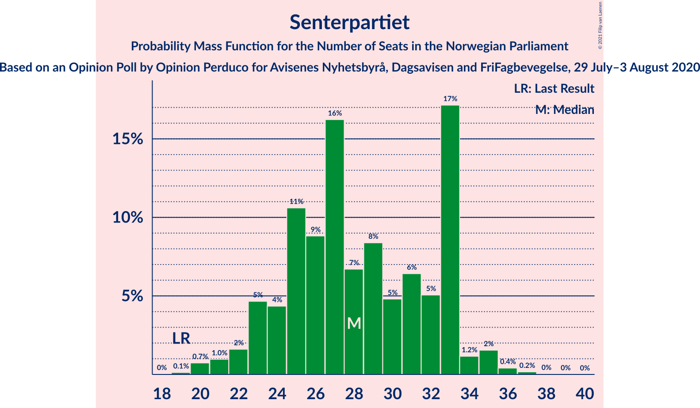
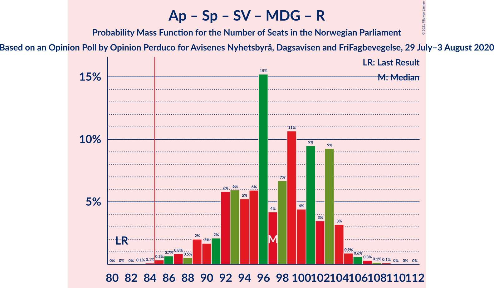
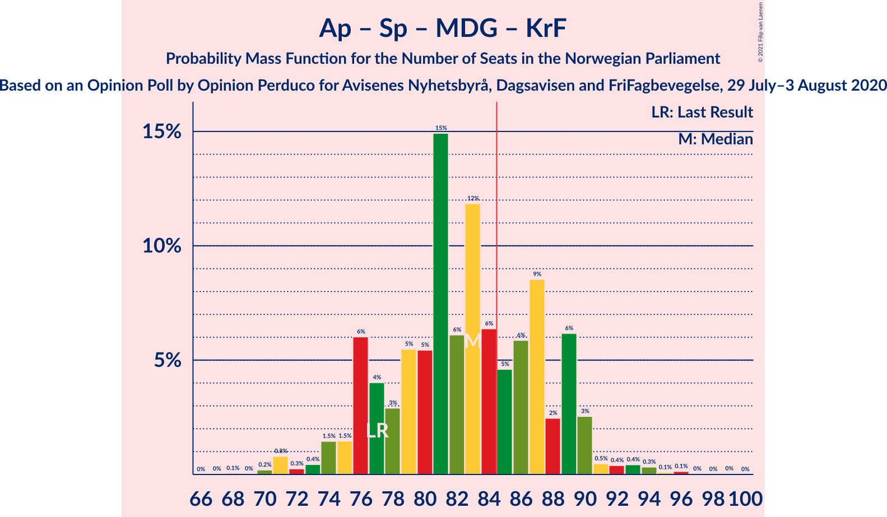
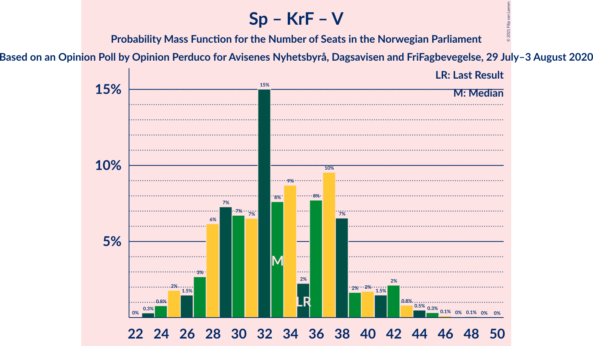

# Opinion Poll by Opinion Perduco for Avisenes Nyhetsbyrå, Dagsavisen and FriFagbevegelse, 29 July–3 August 2020

<a href="#voting-intentions">Voting Intentions</a> | <a href="#seats">Seats</a> | <a href="#coalitions">Coalitions</a> | <a href="#technical-information">Technical Information</a>

## Voting Intentions

### Confidence Intervals

| Party | Last Result | Poll Result | 80% Confidence Interval | 90% Confidence Interval | 95% Confidence Interval | 99% Confidence Interval |
|:-----:|:-----------:|:-----------:|:-----------------------:|:-----------------------:|:-----------------------:|:-----------------------:|
| Høyre | 25.0% | 27.7% | 25.6–30.0% |25.0–30.6% |24.5–31.2% |23.5–32.3% |
| Arbeiderpartiet | 27.4% | 24.6% | 22.6–26.7% |22.0–27.4% |21.5–27.9% |20.6–29.0% |
| Senterpartiet | 10.3% | 15.1% | 13.5–16.9% |13.0–17.5% |12.6–17.9% |11.9–18.9% |
| Fremskrittspartiet | 15.2% | 9.8% | 8.5–11.4% |8.1–11.8% |7.8–12.2% |7.2–13.0% |
| Sosialistisk Venstreparti | 6.0% | 6.0% | 5.0–7.4% |4.7–7.7% |4.5–8.1% |4.1–8.7% |
| Miljøpartiet De Grønne | 3.2% | 4.6% | 3.7–5.8% |3.5–6.1% |3.3–6.4% |2.9–7.0% |
| Rødt | 2.4% | 4.3% | 3.5–5.5% |3.2–5.8% |3.0–6.1% |2.7–6.7% |
| Kristelig Folkeparti | 4.2% | 3.3% | 2.6–4.4% |2.4–4.6% |2.2–4.9% |1.9–5.5% |
| Venstre | 4.4% | 3.2% | 2.5–4.2% |2.3–4.5% |2.1–4.7% |1.8–5.3% |

*Note:* The poll result column reflects the actual value used in the calculations. Published results may vary slightly, and in addition be rounded to fewer digits.

## Seats

### Confidence Intervals

| Party | Last Result | Median | 80% Confidence Interval | 90% Confidence Interval | 95% Confidence Interval | 99% Confidence Interval |
|:-----:|:-----------:|:------:|:-----------------------:|:-----------------------:|:-----------------------:|:-----------------------:|
| <a href="#høyre">Høyre</a> | 45 | 50 | 46–55 |46–56 |44–57 |41–58 |
| <a href="#arbeiderpartiet">Arbeiderpartiet</a> | 49 | 44 | 41–48 |40–49 |39–50 |38–54 |
| <a href="#senterpartiet">Senterpartiet</a> | 19 | 29 | 25–32 |24–33 |23–34 |21–36 |
| <a href="#fremskrittspartiet">Fremskrittspartiet</a> | 27 | 17 | 14–20 |14–21 |13–21 |12–24 |
| <a href="#sosialistisk-venstreparti">Sosialistisk Venstreparti</a> | 11 | 10 | 9–13 |8–14 |8–15 |7–16 |
| <a href="#miljøpartiet-de-grønne">Miljøpartiet De Grønne</a> | 1 | 8 | 2–9 |1–10 |1–12 |1–12 |
| <a href="#rødt">Rødt</a> | 1 | 8 | 2–10 |2–10 |2–11 |1–11 |
| <a href="#kristelig-folkeparti">Kristelig Folkeparti</a> | 8 | 1 | 1–7 |1–8 |0–9 |0–10 |
| <a href="#venstre">Venstre</a> | 8 | 2 | 1–2 |1–7 |1–7 |0–9 |

### Høyre

*For a full overview of the results for this party, see the [Høyre](party-høyre.html) page.*

| Number of Seats | Probability | Accumulated | Special Marks |
|:---------------:|:-----------:|:-----------:|:-------------:|
| 37 | 0% | 100% |  |
| 38 | 0% | 99.9% |  |
| 39 | 0.1% | 99.9% |  |
| 40 | 0.1% | 99.8% |  |
| 41 | 0.4% | 99.7% |  |
| 42 | 0.5% | 99.3% |  |
| 43 | 0.8% | 98.8% |  |
| 44 | 0.9% | 98% |  |
| 45 | 2% | 97% | Last Result |
| 46 | 32% | 95% |  |
| 47 | 5% | 64% |  |
| 48 | 4% | 58% |  |
| 49 | 4% | 54% |  |
| 50 | 3% | 50% | Median |
| 51 | 3% | 47% |  |
| 52 | 5% | 44% |  |
| 53 | 4% | 39% |  |
| 54 | 12% | 35% |  |
| 55 | 17% | 23% |  |
| 56 | 2% | 5% |  |
| 57 | 3% | 3% |  |
| 58 | 0.3% | 0.6% |  |
| 59 | 0.1% | 0.2% |  |
| 60 | 0.1% | 0.2% |  |
| 61 | 0% | 0.1% |  |
| 62 | 0% | 0% |  |

### Arbeiderpartiet

*For a full overview of the results for this party, see the [Arbeiderpartiet](party-arbeiderpartiet.html) page.*

| Number of Seats | Probability | Accumulated | Special Marks |
|:---------------:|:-----------:|:-----------:|:-------------:|
| 35 | 0% | 100% |  |
| 36 | 0.2% | 99.9% |  |
| 37 | 0.2% | 99.7% |  |
| 38 | 1.0% | 99.6% |  |
| 39 | 2% | 98.5% |  |
| 40 | 5% | 97% |  |
| 41 | 5% | 92% |  |
| 42 | 11% | 87% |  |
| 43 | 14% | 76% |  |
| 44 | 28% | 61% | Median |
| 45 | 4% | 33% |  |
| 46 | 5% | 30% |  |
| 47 | 13% | 25% |  |
| 48 | 6% | 12% |  |
| 49 | 2% | 5% | Last Result |
| 50 | 0.9% | 3% |  |
| 51 | 0.6% | 2% |  |
| 52 | 0.6% | 2% |  |
| 53 | 0.4% | 1.2% |  |
| 54 | 0.4% | 0.8% |  |
| 55 | 0.4% | 0.4% |  |
| 56 | 0% | 0.1% |  |
| 57 | 0% | 0.1% |  |
| 58 | 0% | 0% |  |

### Senterpartiet

*For a full overview of the results for this party, see the [Senterpartiet](party-senterpartiet.html) page.*

| Number of Seats | Probability | Accumulated | Special Marks |
|:---------------:|:-----------:|:-----------:|:-------------:|
| 19 | 0.2% | 100% | Last Result |
| 20 | 0.2% | 99.8% |  |
| 21 | 0.6% | 99.6% |  |
| 22 | 1.0% | 99.0% |  |
| 23 | 2% | 98% |  |
| 24 | 5% | 96% |  |
| 25 | 5% | 91% |  |
| 26 | 5% | 86% |  |
| 27 | 11% | 81% |  |
| 28 | 12% | 71% |  |
| 29 | 17% | 59% | Median |
| 30 | 1.2% | 42% |  |
| 31 | 27% | 40% |  |
| 32 | 6% | 13% |  |
| 33 | 3% | 8% |  |
| 34 | 2% | 4% |  |
| 35 | 1.4% | 2% |  |
| 36 | 0.4% | 0.8% |  |
| 37 | 0.3% | 0.3% |  |
| 38 | 0% | 0.1% |  |
| 39 | 0% | 0% |  |

### Fremskrittspartiet

*For a full overview of the results for this party, see the [Fremskrittspartiet](party-fremskrittspartiet.html) page.*

| Number of Seats | Probability | Accumulated | Special Marks |
|:---------------:|:-----------:|:-----------:|:-------------:|
| 10 | 0.1% | 100% |  |
| 11 | 0.2% | 99.9% |  |
| 12 | 1.1% | 99.7% |  |
| 13 | 2% | 98.6% |  |
| 14 | 11% | 97% |  |
| 15 | 2% | 86% |  |
| 16 | 5% | 84% |  |
| 17 | 38% | 79% | Median |
| 18 | 28% | 41% |  |
| 19 | 2% | 13% |  |
| 20 | 5% | 10% |  |
| 21 | 3% | 5% |  |
| 22 | 0.4% | 2% |  |
| 23 | 1.0% | 2% |  |
| 24 | 0.4% | 0.7% |  |
| 25 | 0.2% | 0.3% |  |
| 26 | 0% | 0% |  |
| 27 | 0% | 0% | Last Result |

### Sosialistisk Venstreparti

*For a full overview of the results for this party, see the [Sosialistisk Venstreparti](party-sosialistiskvenstreparti.html) page.*

| Number of Seats | Probability | Accumulated | Special Marks |
|:---------------:|:-----------:|:-----------:|:-------------:|
| 1 | 0.1% | 100% |  |
| 2 | 0.2% | 99.9% |  |
| 3 | 0% | 99.7% |  |
| 4 | 0% | 99.7% |  |
| 5 | 0% | 99.7% |  |
| 6 | 0% | 99.7% |  |
| 7 | 2% | 99.7% |  |
| 8 | 4% | 98% |  |
| 9 | 19% | 94% |  |
| 10 | 26% | 74% | Median |
| 11 | 31% | 48% | Last Result |
| 12 | 5% | 17% |  |
| 13 | 5% | 12% |  |
| 14 | 3% | 7% |  |
| 15 | 3% | 4% |  |
| 16 | 0.9% | 0.9% |  |
| 17 | 0.1% | 0.1% |  |
| 18 | 0% | 0% |  |

### Miljøpartiet De Grønne

*For a full overview of the results for this party, see the [Miljøpartiet De Grønne](party-miljøpartietdegrønne.html) page.*

| Number of Seats | Probability | Accumulated | Special Marks |
|:---------------:|:-----------:|:-----------:|:-------------:|
| 1 | 9% | 100% | Last Result |
| 2 | 4% | 91% |  |
| 3 | 1.2% | 87% |  |
| 4 | 0% | 86% |  |
| 5 | 0% | 86% |  |
| 6 | 0.5% | 86% |  |
| 7 | 30% | 85% |  |
| 8 | 17% | 55% | Median |
| 9 | 29% | 38% |  |
| 10 | 5% | 10% |  |
| 11 | 2% | 4% |  |
| 12 | 2% | 3% |  |
| 13 | 0.1% | 0.2% |  |
| 14 | 0% | 0.1% |  |
| 15 | 0% | 0% |  |

### Rødt

*For a full overview of the results for this party, see the [Rødt](party-rødt.html) page.*

| Number of Seats | Probability | Accumulated | Special Marks |
|:---------------:|:-----------:|:-----------:|:-------------:|
| 1 | 0.9% | 100% | Last Result |
| 2 | 39% | 99.1% |  |
| 3 | 0% | 60% |  |
| 4 | 0% | 60% |  |
| 5 | 0% | 60% |  |
| 6 | 0.2% | 60% |  |
| 7 | 8% | 60% |  |
| 8 | 9% | 52% | Median |
| 9 | 12% | 43% |  |
| 10 | 27% | 30% |  |
| 11 | 3% | 3% |  |
| 12 | 0.2% | 0.3% |  |
| 13 | 0.1% | 0.1% |  |
| 14 | 0% | 0% |  |

### Kristelig Folkeparti

*For a full overview of the results for this party, see the [Kristelig Folkeparti](party-kristeligfolkeparti.html) page.*

| Number of Seats | Probability | Accumulated | Special Marks |
|:---------------:|:-----------:|:-----------:|:-------------:|
| 0 | 4% | 100% |  |
| 1 | 59% | 96% | Median |
| 2 | 4% | 38% |  |
| 3 | 19% | 33% |  |
| 4 | 0% | 14% |  |
| 5 | 0% | 14% |  |
| 6 | 0.6% | 14% |  |
| 7 | 4% | 13% |  |
| 8 | 5% | 9% | Last Result |
| 9 | 3% | 4% |  |
| 10 | 0.7% | 0.8% |  |
| 11 | 0% | 0% |  |

### Venstre

*For a full overview of the results for this party, see the [Venstre](party-venstre.html) page.*

| Number of Seats | Probability | Accumulated | Special Marks |
|:---------------:|:-----------:|:-----------:|:-------------:|
| 0 | 0.8% | 100% |  |
| 1 | 26% | 99.2% |  |
| 2 | 67% | 74% | Median |
| 3 | 0.1% | 6% |  |
| 4 | 0% | 6% |  |
| 5 | 0% | 6% |  |
| 6 | 0.3% | 6% |  |
| 7 | 5% | 6% |  |
| 8 | 0.9% | 2% | Last Result |
| 9 | 0.5% | 0.7% |  |
| 10 | 0.1% | 0.1% |  |
| 11 | 0% | 0% |  |

## Coalitions

### Confidence Intervals

| Coalition | Last Result | Median | Majority? | 80% Confidence Interval | 90% Confidence Interval | 95% Confidence Interval | 99% Confidence Interval |
|:---------:|:-----------:|:------:|:---------:|:-----------------------:|:-----------------------:|:-----------------------:|:-----------------------:|
| Høyre – Senterpartiet – Fremskrittspartiet – Kristelig Folkeparti – Venstre | 107 | 100 | 100% | 96–106 | 94–108 | 94–112 | 88–113 |
| Arbeiderpartiet – Senterpartiet – Sosialistisk Venstreparti – Miljøpartiet De Grønne – Rødt | 81 | 97 | 99.6% | 91–103 | 89–103 | 86–103 | 85–108 |
| Arbeiderpartiet – Senterpartiet – Sosialistisk Venstreparti – Miljøpartiet De Grønne – Kristelig Folkeparti | 88 | 94 | 96% | 89–97 | 86–99 | 84–100 | 83–103 |
| Arbeiderpartiet – Senterpartiet – Sosialistisk Venstreparti – Miljøpartiet De Grønne | 80 | 93 | 89% | 84–95 | 82–97 | 82–97 | 79–101 |
| Arbeiderpartiet – Senterpartiet – Sosialistisk Venstreparti – Rødt | 80 | 90 | 77% | 84–96 | 83–96 | 82–97 | 79–101 |
| Arbeiderpartiet – Senterpartiet – Sosialistisk Venstreparti | 79 | 84 | 47% | 79–86 | 76–89 | 75–89 | 73–93 |
| Arbeiderpartiet – Senterpartiet – Miljøpartiet De Grønne – Kristelig Folkeparti | 77 | 83 | 34% | 77–87 | 75–88 | 74–89 | 71–93 |
| Høyre – Fremskrittspartiet – Miljøpartiet De Grønne – Kristelig Folkeparti – Venstre | 89 | 79 | 23% | 73–85 | 73–86 | 72–87 | 68–90 |
| Høyre – Fremskrittspartiet – Kristelig Folkeparti – Venstre | 88 | 72 | 0.4% | 66–78 | 66–80 | 66–83 | 61–84 |
| Arbeiderpartiet – Senterpartiet – Kristelig Folkeparti | 76 | 76 | 0.7% | 73–80 | 69–80 | 68–82 | 65–86 |
| Arbeiderpartiet – Senterpartiet | 68 | 74 | 0.1% | 68–75 | 66–77 | 66–79 | 63–81 |
| Høyre – Fremskrittspartiet – Venstre | 80 | 69 | 0% | 64–75 | 64–77 | 63–77 | 59–79 |
| Høyre – Fremskrittspartiet | 72 | 66 | 0% | 63–73 | 62–73 | 61–75 | 57–76 |
| Høyre – Kristelig Folkeparti – Venstre | 61 | 55 | 0% | 49–62 | 49–65 | 49–66 | 46–67 |
| Arbeiderpartiet – Sosialistisk Venstreparti | 60 | 55 | 0% | 51–59 | 49–60 | 49–61 | 48–65 |
| Senterpartiet – Kristelig Folkeparti – Venstre | 35 | 34 | 0% | 30–38 | 29–40 | 28–41 | 25–45 |

### Høyre – Senterpartiet – Fremskrittspartiet – Kristelig Folkeparti – Venstre

| Number of Seats | Probability | Accumulated | Special Marks |
|:---------------:|:-----------:|:-----------:|:-------------:|
| 85 | 0.1% | 100% | Majority |
| 86 | 0% | 99.9% |  |
| 87 | 0.3% | 99.9% |  |
| 88 | 0.1% | 99.6% |  |
| 89 | 0.1% | 99.5% |  |
| 90 | 0.2% | 99.4% |  |
| 91 | 0.2% | 99.2% |  |
| 92 | 1.0% | 99.0% |  |
| 93 | 0.4% | 98% |  |
| 94 | 5% | 98% |  |
| 95 | 1.0% | 92% |  |
| 96 | 1.3% | 91% |  |
| 97 | 28% | 90% |  |
| 98 | 3% | 62% |  |
| 99 | 7% | 59% | Median |
| 100 | 2% | 52% |  |
| 101 | 2% | 50% |  |
| 102 | 15% | 48% |  |
| 103 | 4% | 33% |  |
| 104 | 3% | 29% |  |
| 105 | 14% | 26% |  |
| 106 | 6% | 12% |  |
| 107 | 0.4% | 6% | Last Result |
| 108 | 0.4% | 5% |  |
| 109 | 1.1% | 5% |  |
| 110 | 0.5% | 4% |  |
| 111 | 0.4% | 3% |  |
| 112 | 2% | 3% |  |
| 113 | 0.5% | 0.5% |  |
| 114 | 0% | 0% |  |

### Arbeiderpartiet – Senterpartiet – Sosialistisk Venstreparti – Miljøpartiet De Grønne – Rødt

| Number of Seats | Probability | Accumulated | Special Marks |
|:---------------:|:-----------:|:-----------:|:-------------:|
| 81 | 0% | 100% | Last Result |
| 82 | 0% | 100% |  |
| 83 | 0.2% | 100% |  |
| 84 | 0.1% | 99.7% |  |
| 85 | 0.3% | 99.6% | Majority |
| 86 | 3% | 99.4% |  |
| 87 | 1.1% | 97% |  |
| 88 | 0.3% | 96% |  |
| 89 | 2% | 95% |  |
| 90 | 2% | 93% |  |
| 91 | 2% | 91% |  |
| 92 | 2% | 88% |  |
| 93 | 15% | 86% |  |
| 94 | 4% | 71% |  |
| 95 | 15% | 67% |  |
| 96 | 0.9% | 52% |  |
| 97 | 4% | 51% |  |
| 98 | 3% | 47% |  |
| 99 | 5% | 44% | Median |
| 100 | 0.9% | 39% |  |
| 101 | 1.1% | 38% |  |
| 102 | 7% | 37% |  |
| 103 | 28% | 30% |  |
| 104 | 0.3% | 2% |  |
| 105 | 0.5% | 2% |  |
| 106 | 0.7% | 2% |  |
| 107 | 0.2% | 0.8% |  |
| 108 | 0.1% | 0.6% |  |
| 109 | 0.4% | 0.5% |  |
| 110 | 0% | 0.1% |  |
| 111 | 0.1% | 0.1% |  |
| 112 | 0% | 0% |  |

### Arbeiderpartiet – Senterpartiet – Sosialistisk Venstreparti – Miljøpartiet De Grønne – Kristelig Folkeparti

| Number of Seats | Probability | Accumulated | Special Marks |
|:---------------:|:-----------:|:-----------:|:-------------:|
| 80 | 0% | 100% |  |
| 81 | 0.1% | 99.9% |  |
| 82 | 0.3% | 99.8% |  |
| 83 | 2% | 99.5% |  |
| 84 | 2% | 98% |  |
| 85 | 1.2% | 96% | Majority |
| 86 | 2% | 95% |  |
| 87 | 2% | 93% |  |
| 88 | 1.4% | 92% | Last Result |
| 89 | 2% | 90% |  |
| 90 | 5% | 89% |  |
| 91 | 2% | 84% |  |
| 92 | 15% | 82% | Median |
| 93 | 4% | 66% |  |
| 94 | 37% | 63% |  |
| 95 | 2% | 25% |  |
| 96 | 11% | 24% |  |
| 97 | 3% | 13% |  |
| 98 | 2% | 9% |  |
| 99 | 3% | 8% |  |
| 100 | 3% | 5% |  |
| 101 | 0.6% | 2% |  |
| 102 | 0.6% | 1.3% |  |
| 103 | 0.4% | 0.8% |  |
| 104 | 0.1% | 0.3% |  |
| 105 | 0.1% | 0.3% |  |
| 106 | 0.1% | 0.1% |  |
| 107 | 0% | 0% |  |

### Arbeiderpartiet – Senterpartiet – Sosialistisk Venstreparti – Miljøpartiet De Grønne

| Number of Seats | Probability | Accumulated | Special Marks |
|:---------------:|:-----------:|:-----------:|:-------------:|
| 76 | 0.3% | 100% |  |
| 77 | 0% | 99.7% |  |
| 78 | 0.2% | 99.7% |  |
| 79 | 0.2% | 99.5% |  |
| 80 | 0.7% | 99.3% | Last Result |
| 81 | 0.2% | 98.7% |  |
| 82 | 3% | 98% |  |
| 83 | 3% | 95% |  |
| 84 | 4% | 92% |  |
| 85 | 2% | 89% | Majority |
| 86 | 3% | 87% |  |
| 87 | 5% | 84% |  |
| 88 | 3% | 79% |  |
| 89 | 2% | 76% |  |
| 90 | 2% | 73% |  |
| 91 | 14% | 71% | Median |
| 92 | 0.6% | 57% |  |
| 93 | 44% | 57% |  |
| 94 | 2% | 13% |  |
| 95 | 2% | 10% |  |
| 96 | 2% | 8% |  |
| 97 | 4% | 6% |  |
| 98 | 0.6% | 2% |  |
| 99 | 0.6% | 2% |  |
| 100 | 0.1% | 1.0% |  |
| 101 | 0.5% | 0.9% |  |
| 102 | 0.4% | 0.4% |  |
| 103 | 0.1% | 0.1% |  |
| 104 | 0% | 0% |  |

### Arbeiderpartiet – Senterpartiet – Sosialistisk Venstreparti – Rødt

| Number of Seats | Probability | Accumulated | Special Marks |
|:---------------:|:-----------:|:-----------:|:-------------:|
| 76 | 0% | 100% |  |
| 77 | 0.2% | 99.9% |  |
| 78 | 0.1% | 99.7% |  |
| 79 | 0.3% | 99.6% |  |
| 80 | 0.4% | 99.4% | Last Result |
| 81 | 0.4% | 98.9% |  |
| 82 | 2% | 98.5% |  |
| 83 | 3% | 96% |  |
| 84 | 16% | 93% |  |
| 85 | 2% | 77% | Majority |
| 86 | 14% | 76% |  |
| 87 | 2% | 62% |  |
| 88 | 7% | 60% |  |
| 89 | 3% | 53% |  |
| 90 | 1.1% | 50% |  |
| 91 | 5% | 49% | Median |
| 92 | 4% | 44% |  |
| 93 | 5% | 40% |  |
| 94 | 6% | 35% |  |
| 95 | 0.3% | 29% |  |
| 96 | 26% | 29% |  |
| 97 | 0.5% | 3% |  |
| 98 | 2% | 2% |  |
| 99 | 0.1% | 0.8% |  |
| 100 | 0.1% | 0.7% |  |
| 101 | 0.5% | 0.6% |  |
| 102 | 0.1% | 0.1% |  |
| 103 | 0% | 0.1% |  |
| 104 | 0% | 0% |  |

### Arbeiderpartiet – Senterpartiet – Sosialistisk Venstreparti

| Number of Seats | Probability | Accumulated | Special Marks |
|:---------------:|:-----------:|:-----------:|:-------------:|
| 70 | 0% | 100% |  |
| 71 | 0% | 99.9% |  |
| 72 | 0.2% | 99.9% |  |
| 73 | 0.4% | 99.7% |  |
| 74 | 2% | 99.3% |  |
| 75 | 2% | 98% |  |
| 76 | 2% | 95% |  |
| 77 | 0.8% | 93% |  |
| 78 | 2% | 92% |  |
| 79 | 1.3% | 91% | Last Result |
| 80 | 2% | 89% |  |
| 81 | 6% | 87% |  |
| 82 | 17% | 81% |  |
| 83 | 3% | 64% | Median |
| 84 | 14% | 61% |  |
| 85 | 8% | 47% | Majority |
| 86 | 30% | 39% |  |
| 87 | 2% | 9% |  |
| 88 | 0.2% | 8% |  |
| 89 | 5% | 7% |  |
| 90 | 0.4% | 2% |  |
| 91 | 0.9% | 2% |  |
| 92 | 0.1% | 0.9% |  |
| 93 | 0.3% | 0.8% |  |
| 94 | 0.4% | 0.5% |  |
| 95 | 0.1% | 0.1% |  |
| 96 | 0% | 0% |  |

### Arbeiderpartiet – Senterpartiet – Miljøpartiet De Grønne – Kristelig Folkeparti

| Number of Seats | Probability | Accumulated | Special Marks |
|:---------------:|:-----------:|:-----------:|:-------------:|
| 68 | 0.1% | 100% |  |
| 69 | 0% | 99.9% |  |
| 70 | 0.2% | 99.9% |  |
| 71 | 1.4% | 99.7% |  |
| 72 | 0.2% | 98% |  |
| 73 | 0.4% | 98% |  |
| 74 | 0.4% | 98% |  |
| 75 | 3% | 97% |  |
| 76 | 4% | 94% |  |
| 77 | 0.8% | 90% | Last Result |
| 78 | 2% | 89% |  |
| 79 | 1.1% | 87% |  |
| 80 | 2% | 86% |  |
| 81 | 3% | 84% |  |
| 82 | 18% | 81% | Median |
| 83 | 27% | 63% |  |
| 84 | 3% | 37% |  |
| 85 | 15% | 34% | Majority |
| 86 | 6% | 18% |  |
| 87 | 5% | 12% |  |
| 88 | 3% | 7% |  |
| 89 | 2% | 4% |  |
| 90 | 0.9% | 2% |  |
| 91 | 0.4% | 1.2% |  |
| 92 | 0.1% | 0.8% |  |
| 93 | 0.4% | 0.7% |  |
| 94 | 0.2% | 0.4% |  |
| 95 | 0.1% | 0.2% |  |
| 96 | 0% | 0.1% |  |
| 97 | 0% | 0% |  |

### Høyre – Fremskrittspartiet – Miljøpartiet De Grønne – Kristelig Folkeparti – Venstre

| Number of Seats | Probability | Accumulated | Special Marks |
|:---------------:|:-----------:|:-----------:|:-------------:|
| 66 | 0% | 100% |  |
| 67 | 0.1% | 99.9% |  |
| 68 | 0.5% | 99.9% |  |
| 69 | 0.1% | 99.4% |  |
| 70 | 0.1% | 99.3% |  |
| 71 | 2% | 99.2% |  |
| 72 | 0.5% | 98% |  |
| 73 | 26% | 97% |  |
| 74 | 0.3% | 71% |  |
| 75 | 6% | 71% |  |
| 76 | 5% | 65% |  |
| 77 | 4% | 60% |  |
| 78 | 5% | 56% | Median |
| 79 | 1.1% | 51% |  |
| 80 | 3% | 50% |  |
| 81 | 7% | 47% |  |
| 82 | 2% | 40% |  |
| 83 | 14% | 38% |  |
| 84 | 2% | 24% |  |
| 85 | 16% | 23% | Majority |
| 86 | 3% | 7% |  |
| 87 | 2% | 4% |  |
| 88 | 0.4% | 1.5% |  |
| 89 | 0.4% | 1.1% | Last Result |
| 90 | 0.3% | 0.6% |  |
| 91 | 0.1% | 0.4% |  |
| 92 | 0.2% | 0.3% |  |
| 93 | 0% | 0.1% |  |
| 94 | 0% | 0% |  |

### Høyre – Fremskrittspartiet – Kristelig Folkeparti – Venstre

| Number of Seats | Probability | Accumulated | Special Marks |
|:---------------:|:-----------:|:-----------:|:-------------:|
| 58 | 0.1% | 100% |  |
| 59 | 0% | 99.9% |  |
| 60 | 0.4% | 99.9% |  |
| 61 | 0.1% | 99.5% |  |
| 62 | 0.2% | 99.4% |  |
| 63 | 0.7% | 99.2% |  |
| 64 | 0.5% | 98% |  |
| 65 | 0.3% | 98% |  |
| 66 | 28% | 98% |  |
| 67 | 7% | 70% |  |
| 68 | 1.1% | 63% |  |
| 69 | 0.9% | 62% |  |
| 70 | 5% | 61% | Median |
| 71 | 3% | 56% |  |
| 72 | 4% | 53% |  |
| 73 | 0.9% | 49% |  |
| 74 | 15% | 48% |  |
| 75 | 4% | 33% |  |
| 76 | 15% | 29% |  |
| 77 | 2% | 14% |  |
| 78 | 2% | 12% |  |
| 79 | 2% | 9% |  |
| 80 | 2% | 7% |  |
| 81 | 0.3% | 5% |  |
| 82 | 1.1% | 4% |  |
| 83 | 3% | 3% |  |
| 84 | 0.3% | 0.6% |  |
| 85 | 0.1% | 0.4% | Majority |
| 86 | 0.2% | 0.3% |  |
| 87 | 0% | 0% |  |
| 88 | 0% | 0% | Last Result |

### Arbeiderpartiet – Senterpartiet – Kristelig Folkeparti

| Number of Seats | Probability | Accumulated | Special Marks |
|:---------------:|:-----------:|:-----------:|:-------------:|
| 63 | 0.1% | 100% |  |
| 64 | 0.2% | 99.9% |  |
| 65 | 0.2% | 99.6% |  |
| 66 | 0.5% | 99.4% |  |
| 67 | 1.0% | 98.9% |  |
| 68 | 2% | 98% |  |
| 69 | 2% | 96% |  |
| 70 | 2% | 94% |  |
| 71 | 1.2% | 93% |  |
| 72 | 1.4% | 92% |  |
| 73 | 14% | 90% |  |
| 74 | 8% | 77% | Median |
| 75 | 6% | 69% |  |
| 76 | 35% | 63% | Last Result |
| 77 | 9% | 28% |  |
| 78 | 7% | 19% |  |
| 79 | 0.8% | 12% |  |
| 80 | 7% | 11% |  |
| 81 | 1.3% | 5% |  |
| 82 | 2% | 3% |  |
| 83 | 0.4% | 1.4% |  |
| 84 | 0.3% | 1.0% |  |
| 85 | 0.2% | 0.7% | Majority |
| 86 | 0.3% | 0.6% |  |
| 87 | 0.2% | 0.3% |  |
| 88 | 0% | 0.1% |  |
| 89 | 0% | 0.1% |  |
| 90 | 0% | 0.1% |  |
| 91 | 0% | 0% |  |

### Arbeiderpartiet – Senterpartiet

| Number of Seats | Probability | Accumulated | Special Marks |
|:---------------:|:-----------:|:-----------:|:-------------:|
| 61 | 0% | 100% |  |
| 62 | 0.4% | 99.9% |  |
| 63 | 0.3% | 99.5% |  |
| 64 | 0.8% | 99.2% |  |
| 65 | 0.6% | 98% |  |
| 66 | 4% | 98% |  |
| 67 | 1.4% | 94% |  |
| 68 | 4% | 93% | Last Result |
| 69 | 2% | 89% |  |
| 70 | 1.4% | 87% |  |
| 71 | 3% | 85% |  |
| 72 | 20% | 82% |  |
| 73 | 5% | 63% | Median |
| 74 | 11% | 57% |  |
| 75 | 40% | 46% |  |
| 76 | 1.4% | 7% |  |
| 77 | 0.9% | 5% |  |
| 78 | 0.7% | 4% |  |
| 79 | 1.5% | 4% |  |
| 80 | 1.0% | 2% |  |
| 81 | 0.7% | 1.2% |  |
| 82 | 0.1% | 0.5% |  |
| 83 | 0.1% | 0.3% |  |
| 84 | 0.1% | 0.2% |  |
| 85 | 0.1% | 0.1% | Majority |
| 86 | 0% | 0% |  |

### Høyre – Fremskrittspartiet – Venstre

| Number of Seats | Probability | Accumulated | Special Marks |
|:---------------:|:-----------:|:-----------:|:-------------:|
| 56 | 0.1% | 100% |  |
| 57 | 0% | 99.9% |  |
| 58 | 0.1% | 99.9% |  |
| 59 | 0.5% | 99.8% |  |
| 60 | 0.3% | 99.3% |  |
| 61 | 0.4% | 99.0% |  |
| 62 | 0.4% | 98.6% |  |
| 63 | 3% | 98% |  |
| 64 | 8% | 96% |  |
| 65 | 26% | 87% |  |
| 66 | 3% | 61% |  |
| 67 | 4% | 58% |  |
| 68 | 4% | 54% |  |
| 69 | 3% | 50% | Median |
| 70 | 2% | 48% |  |
| 71 | 6% | 45% |  |
| 72 | 2% | 39% |  |
| 73 | 12% | 38% |  |
| 74 | 3% | 26% |  |
| 75 | 17% | 23% |  |
| 76 | 0.9% | 6% |  |
| 77 | 4% | 5% |  |
| 78 | 0.8% | 1.5% |  |
| 79 | 0.2% | 0.7% |  |
| 80 | 0% | 0.4% | Last Result |
| 81 | 0.1% | 0.4% |  |
| 82 | 0.3% | 0.3% |  |
| 83 | 0% | 0.1% |  |
| 84 | 0% | 0% |  |

### Høyre – Fremskrittspartiet

| Number of Seats | Probability | Accumulated | Special Marks |
|:---------------:|:-----------:|:-----------:|:-------------:|
| 54 | 0.1% | 100% |  |
| 55 | 0.2% | 99.9% |  |
| 56 | 0.1% | 99.7% |  |
| 57 | 0.3% | 99.6% |  |
| 58 | 0.5% | 99.3% |  |
| 59 | 0.5% | 98.8% |  |
| 60 | 0.3% | 98% |  |
| 61 | 2% | 98% |  |
| 62 | 4% | 96% |  |
| 63 | 32% | 92% |  |
| 64 | 2% | 60% |  |
| 65 | 3% | 58% |  |
| 66 | 7% | 55% |  |
| 67 | 2% | 48% | Median |
| 68 | 3% | 46% |  |
| 69 | 5% | 43% |  |
| 70 | 3% | 38% |  |
| 71 | 2% | 35% |  |
| 72 | 13% | 33% | Last Result |
| 73 | 16% | 20% |  |
| 74 | 0.5% | 4% |  |
| 75 | 3% | 4% |  |
| 76 | 0.5% | 0.9% |  |
| 77 | 0.1% | 0.3% |  |
| 78 | 0% | 0.2% |  |
| 79 | 0% | 0.2% |  |
| 80 | 0% | 0.1% |  |
| 81 | 0.1% | 0.1% |  |
| 82 | 0% | 0% |  |

### Høyre – Kristelig Folkeparti – Venstre

| Number of Seats | Probability | Accumulated | Special Marks |
|:---------------:|:-----------:|:-----------:|:-------------:|
| 43 | 0.1% | 100% |  |
| 44 | 0.1% | 99.9% |  |
| 45 | 0.1% | 99.8% |  |
| 46 | 0.9% | 99.7% |  |
| 47 | 0.3% | 98.8% |  |
| 48 | 0.7% | 98% |  |
| 49 | 25% | 98% |  |
| 50 | 9% | 73% |  |
| 51 | 3% | 65% |  |
| 52 | 3% | 62% |  |
| 53 | 5% | 59% | Median |
| 54 | 2% | 53% |  |
| 55 | 7% | 51% |  |
| 56 | 12% | 45% |  |
| 57 | 2% | 33% |  |
| 58 | 14% | 31% |  |
| 59 | 1.4% | 18% |  |
| 60 | 3% | 16% |  |
| 61 | 2% | 13% | Last Result |
| 62 | 3% | 12% |  |
| 63 | 0.4% | 9% |  |
| 64 | 2% | 9% |  |
| 65 | 2% | 6% |  |
| 66 | 3% | 4% |  |
| 67 | 0.3% | 0.7% |  |
| 68 | 0.4% | 0.4% |  |
| 69 | 0% | 0.1% |  |
| 70 | 0% | 0% |  |

### Arbeiderpartiet – Sosialistisk Venstreparti

| Number of Seats | Probability | Accumulated | Special Marks |
|:---------------:|:-----------:|:-----------:|:-------------:|
| 42 | 0% | 100% |  |
| 43 | 0% | 99.9% |  |
| 44 | 0% | 99.9% |  |
| 45 | 0% | 99.9% |  |
| 46 | 0.2% | 99.9% |  |
| 47 | 0.2% | 99.7% |  |
| 48 | 0.2% | 99.5% |  |
| 49 | 6% | 99.4% |  |
| 50 | 2% | 93% |  |
| 51 | 6% | 91% |  |
| 52 | 4% | 85% |  |
| 53 | 18% | 82% |  |
| 54 | 3% | 64% | Median |
| 55 | 29% | 61% |  |
| 56 | 11% | 32% |  |
| 57 | 3% | 21% |  |
| 58 | 8% | 18% |  |
| 59 | 1.4% | 11% |  |
| 60 | 5% | 9% | Last Result |
| 61 | 1.5% | 4% |  |
| 62 | 1.1% | 2% |  |
| 63 | 0.4% | 1.4% |  |
| 64 | 0.1% | 1.0% |  |
| 65 | 0.4% | 0.9% |  |
| 66 | 0.1% | 0.5% |  |
| 67 | 0.3% | 0.4% |  |
| 68 | 0.1% | 0.1% |  |
| 69 | 0% | 0% |  |

### Senterpartiet – Kristelig Folkeparti – Venstre

| Number of Seats | Probability | Accumulated | Special Marks |
|:---------------:|:-----------:|:-----------:|:-------------:|
| 23 | 0.2% | 100% |  |
| 24 | 0.1% | 99.8% |  |
| 25 | 0.3% | 99.7% |  |
| 26 | 0.3% | 99.3% |  |
| 27 | 0.4% | 99.0% |  |
| 28 | 3% | 98.5% |  |
| 29 | 5% | 95% |  |
| 30 | 14% | 91% |  |
| 31 | 8% | 77% |  |
| 32 | 13% | 70% | Median |
| 33 | 5% | 56% |  |
| 34 | 29% | 51% |  |
| 35 | 2% | 22% | Last Result |
| 36 | 3% | 20% |  |
| 37 | 4% | 16% |  |
| 38 | 2% | 12% |  |
| 39 | 2% | 10% |  |
| 40 | 4% | 8% |  |
| 41 | 3% | 4% |  |
| 42 | 0.5% | 2% |  |
| 43 | 0.7% | 1.4% |  |
| 44 | 0.2% | 0.7% |  |
| 45 | 0.2% | 0.5% |  |
| 46 | 0.1% | 0.3% |  |
| 47 | 0.1% | 0.2% |  |
| 48 | 0.1% | 0.1% |  |
| 49 | 0% | 0% |  |

## Technical Information

### Opinion Poll

+ **Polling firm:** Opinion Perduco
+ **Commissioner(s):** Avisenes Nyhetsbyrå, Dagsavisen and FriFagbevegelse
+ **Fieldwork period:** 29 July–3 August 2020

### Calculations

+ **Sample size:** 696
+ **Simulations done:** 131,072
+ **Error estimate:** 1.83%

