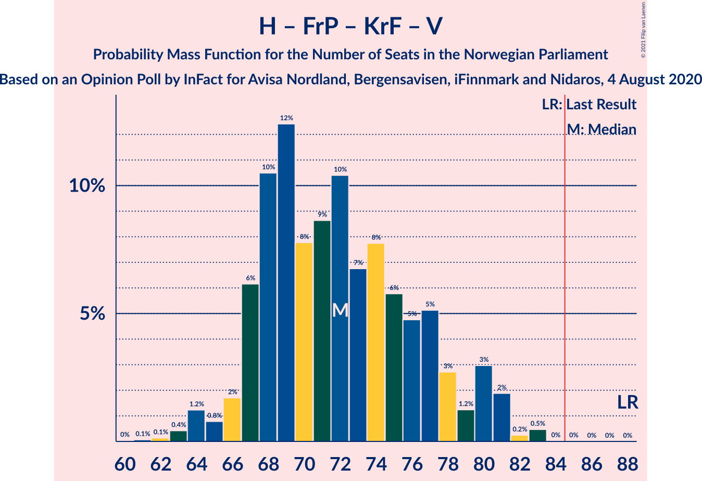
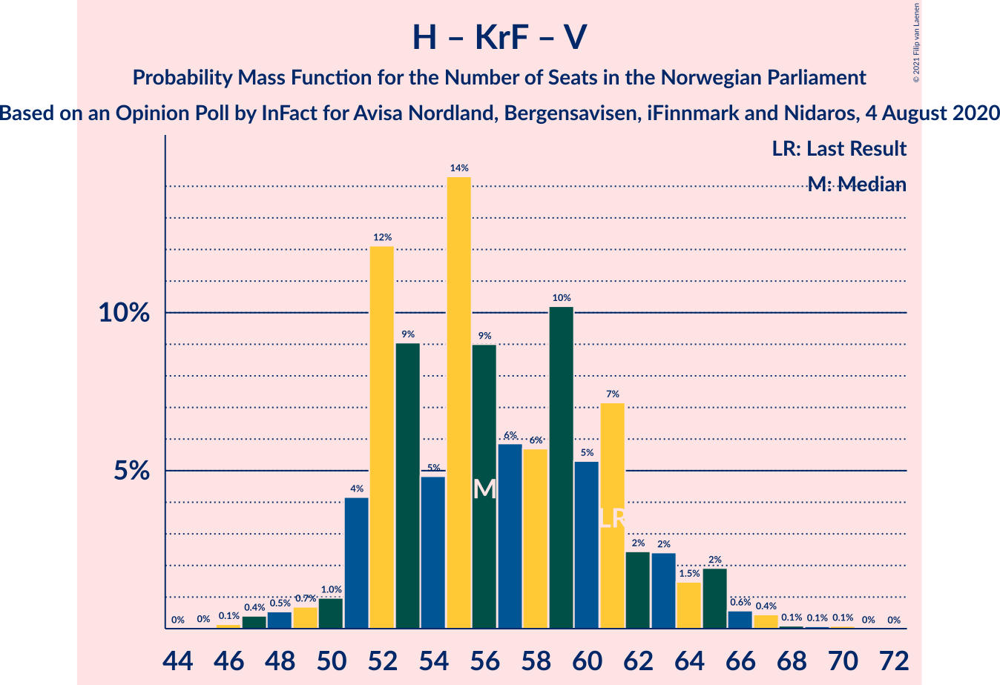

# Opinion Poll by InFact for Avisa Nordland, Bergensavisen, iFinnmark and Nidaros, 4 August 2020

<a href="#voting-intentions">Voting Intentions</a> | <a href="#seats">Seats</a> | <a href="#coalitions">Coalitions</a> | <a href="#technical-information">Technical Information</a>

## Voting Intentions

### Confidence Intervals

| Party | Last Result | Poll Result | 80% Confidence Interval | 90% Confidence Interval | 95% Confidence Interval | 99% Confidence Interval |
|:-----:|:-----------:|:-----------:|:-----------------------:|:-----------------------:|:-----------------------:|:-----------------------:|
| Høyre | 25.0% | 25.1% | 23.4–26.9% |22.9–27.4% |22.5–27.8% |21.7–28.7% |
| Arbeiderpartiet | 27.4% | 21.8% | 20.2–23.5% |19.7–24.0% |19.4–24.4% |18.6–25.3% |
| Senterpartiet | 10.3% | 14.1% | 12.7–15.5% |12.4–16.0% |12.1–16.3% |11.5–17.1% |
| Fremskrittspartiet | 15.2% | 9.3% | 8.2–10.5% |7.9–10.9% |7.7–11.2% |7.2–11.9% |
| Sosialistisk Venstreparti | 6.0% | 7.3% | 6.4–8.5% |6.1–8.8% |5.9–9.1% |5.5–9.7% |
| Rødt | 2.4% | 5.8% | 4.9–6.8% |4.7–7.1% |4.5–7.4% |4.1–7.9% |
| Miljøpartiet De Grønne | 3.2% | 5.4% | 4.6–6.4% |4.3–6.7% |4.1–6.9% |3.8–7.5% |
| Kristelig Folkeparti | 4.2% | 5.2% | 4.4–6.2% |4.2–6.5% |4.0–6.7% |3.6–7.2% |
| Venstre | 4.4% | 3.7% | 3.0–4.6% |2.9–4.8% |2.7–5.1% |2.4–5.5% |

*Note:* The poll result column reflects the actual value used in the calculations. Published results may vary slightly, and in addition be rounded to fewer digits.

## Seats

### Confidence Intervals

| Party | Last Result | Median | 80% Confidence Interval | 90% Confidence Interval | 95% Confidence Interval | 99% Confidence Interval |
|:-----:|:-----------:|:------:|:-----------------------:|:-----------------------:|:-----------------------:|:-----------------------:|
| <a href="#høyre">Høyre</a> | 45 | 44 | 40–49 |39–50 |39–51 |37–53 |
| <a href="#arbeiderpartiet">Arbeiderpartiet</a> | 49 | 41 | 37–44 |36–45 |34–45 |33–47 |
| <a href="#senterpartiet">Senterpartiet</a> | 19 | 26 | 21–30 |21–32 |20–33 |19–35 |
| <a href="#fremskrittspartiet">Fremskrittspartiet</a> | 27 | 16 | 13–18 |12–20 |12–20 |11–22 |
| <a href="#sosialistisk-venstreparti">Sosialistisk Venstreparti</a> | 11 | 12 | 10–14 |10–15 |9–16 |9–17 |
| <a href="#rødt">Rødt</a> | 1 | 10 | 8–11 |7–12 |7–12 |6–13 |
| <a href="#miljøpartiet-de-grønne">Miljøpartiet De Grønne</a> | 1 | 9 | 7–11 |7–11 |7–12 |2–12 |
| <a href="#kristelig-folkeparti">Kristelig Folkeparti</a> | 8 | 9 | 7–10 |7–11 |3–11 |3–12 |
| <a href="#venstre">Venstre</a> | 8 | 2 | 2–7 |2–8 |2–8 |1–9 |

### Høyre

*For a full overview of the results for this party, see the [Høyre](party-høyre.html) page.*

| Number of Seats | Probability | Accumulated | Special Marks |
|:---------------:|:-----------:|:-----------:|:-------------:|
| 35 | 0% | 100% |  |
| 36 | 0.3% | 99.9% |  |
| 37 | 0.4% | 99.7% |  |
| 38 | 2% | 99.3% |  |
| 39 | 3% | 98% |  |
| 40 | 6% | 94% |  |
| 41 | 12% | 89% |  |
| 42 | 11% | 77% |  |
| 43 | 8% | 66% |  |
| 44 | 12% | 57% | Median |
| 45 | 12% | 46% | Last Result |
| 46 | 8% | 34% |  |
| 47 | 6% | 26% |  |
| 48 | 8% | 20% |  |
| 49 | 6% | 12% |  |
| 50 | 3% | 6% |  |
| 51 | 1.1% | 3% |  |
| 52 | 2% | 2% |  |
| 53 | 0.3% | 0.6% |  |
| 54 | 0.1% | 0.3% |  |
| 55 | 0.2% | 0.2% |  |
| 56 | 0% | 0% |  |

### Arbeiderpartiet

*For a full overview of the results for this party, see the [Arbeiderpartiet](party-arbeiderpartiet.html) page.*

| Number of Seats | Probability | Accumulated | Special Marks |
|:---------------:|:-----------:|:-----------:|:-------------:|
| 30 | 0.1% | 100% |  |
| 31 | 0.1% | 99.9% |  |
| 32 | 0.3% | 99.9% |  |
| 33 | 0.5% | 99.6% |  |
| 34 | 2% | 99.1% |  |
| 35 | 2% | 97% |  |
| 36 | 2% | 95% |  |
| 37 | 9% | 93% |  |
| 38 | 7% | 85% |  |
| 39 | 8% | 78% |  |
| 40 | 15% | 69% |  |
| 41 | 25% | 55% | Median |
| 42 | 11% | 29% |  |
| 43 | 4% | 18% |  |
| 44 | 8% | 14% |  |
| 45 | 4% | 6% |  |
| 46 | 2% | 2% |  |
| 47 | 0.5% | 0.7% |  |
| 48 | 0.1% | 0.1% |  |
| 49 | 0% | 0.1% | Last Result |
| 50 | 0% | 0% |  |

### Senterpartiet

*For a full overview of the results for this party, see the [Senterpartiet](party-senterpartiet.html) page.*

| Number of Seats | Probability | Accumulated | Special Marks |
|:---------------:|:-----------:|:-----------:|:-------------:|
| 18 | 0.3% | 100% |  |
| 19 | 2% | 99.7% | Last Result |
| 20 | 3% | 98% |  |
| 21 | 7% | 95% |  |
| 22 | 8% | 89% |  |
| 23 | 13% | 81% |  |
| 24 | 11% | 68% |  |
| 25 | 6% | 57% |  |
| 26 | 10% | 52% | Median |
| 27 | 5% | 42% |  |
| 28 | 6% | 37% |  |
| 29 | 10% | 30% |  |
| 30 | 11% | 21% |  |
| 31 | 3% | 10% |  |
| 32 | 3% | 6% |  |
| 33 | 2% | 3% |  |
| 34 | 0.7% | 1.5% |  |
| 35 | 0.6% | 0.8% |  |
| 36 | 0.1% | 0.2% |  |
| 37 | 0% | 0% |  |

### Fremskrittspartiet

*For a full overview of the results for this party, see the [Fremskrittspartiet](party-fremskrittspartiet.html) page.*

| Number of Seats | Probability | Accumulated | Special Marks |
|:---------------:|:-----------:|:-----------:|:-------------:|
| 10 | 0.2% | 100% |  |
| 11 | 1.0% | 99.8% |  |
| 12 | 6% | 98.8% |  |
| 13 | 11% | 92% |  |
| 14 | 14% | 81% |  |
| 15 | 16% | 67% |  |
| 16 | 22% | 51% | Median |
| 17 | 14% | 29% |  |
| 18 | 5% | 15% |  |
| 19 | 4% | 10% |  |
| 20 | 3% | 6% |  |
| 21 | 2% | 2% |  |
| 22 | 0.4% | 0.5% |  |
| 23 | 0.1% | 0.1% |  |
| 24 | 0% | 0% |  |
| 25 | 0% | 0% |  |
| 26 | 0% | 0% |  |
| 27 | 0% | 0% | Last Result |

### Sosialistisk Venstreparti

*For a full overview of the results for this party, see the [Sosialistisk Venstreparti](party-sosialistiskvenstreparti.html) page.*

| Number of Seats | Probability | Accumulated | Special Marks |
|:---------------:|:-----------:|:-----------:|:-------------:|
| 8 | 0.3% | 100% |  |
| 9 | 2% | 99.7% |  |
| 10 | 8% | 97% |  |
| 11 | 25% | 89% | Last Result |
| 12 | 25% | 64% | Median |
| 13 | 23% | 39% |  |
| 14 | 9% | 17% |  |
| 15 | 5% | 7% |  |
| 16 | 2% | 3% |  |
| 17 | 0.9% | 1.0% |  |
| 18 | 0.1% | 0.1% |  |
| 19 | 0% | 0% |  |

### Rødt

*For a full overview of the results for this party, see the [Rødt](party-rødt.html) page.*

| Number of Seats | Probability | Accumulated | Special Marks |
|:---------------:|:-----------:|:-----------:|:-------------:|
| 1 | 0% | 100% | Last Result |
| 2 | 0.4% | 100% |  |
| 3 | 0% | 99.6% |  |
| 4 | 0% | 99.6% |  |
| 5 | 0% | 99.6% |  |
| 6 | 0.3% | 99.6% |  |
| 7 | 4% | 99.3% |  |
| 8 | 13% | 95% |  |
| 9 | 23% | 82% |  |
| 10 | 38% | 59% | Median |
| 11 | 13% | 21% |  |
| 12 | 6% | 8% |  |
| 13 | 1.3% | 1.5% |  |
| 14 | 0.2% | 0.2% |  |
| 15 | 0% | 0% |  |

### Miljøpartiet De Grønne

*For a full overview of the results for this party, see the [Miljøpartiet De Grønne](party-miljøpartietdegrønne.html) page.*

| Number of Seats | Probability | Accumulated | Special Marks |
|:---------------:|:-----------:|:-----------:|:-------------:|
| 1 | 0.2% | 100% | Last Result |
| 2 | 0.9% | 99.8% |  |
| 3 | 0.2% | 98.9% |  |
| 4 | 0% | 98.7% |  |
| 5 | 0% | 98.7% |  |
| 6 | 0.3% | 98.7% |  |
| 7 | 13% | 98% |  |
| 8 | 22% | 85% |  |
| 9 | 27% | 63% | Median |
| 10 | 24% | 36% |  |
| 11 | 9% | 12% |  |
| 12 | 3% | 3% |  |
| 13 | 0.2% | 0.2% |  |
| 14 | 0.1% | 0.1% |  |
| 15 | 0% | 0% |  |

### Kristelig Folkeparti

*For a full overview of the results for this party, see the [Kristelig Folkeparti](party-kristeligfolkeparti.html) page.*

| Number of Seats | Probability | Accumulated | Special Marks |
|:---------------:|:-----------:|:-----------:|:-------------:|
| 2 | 0.2% | 100% |  |
| 3 | 3% | 99.8% |  |
| 4 | 0% | 97% |  |
| 5 | 0% | 97% |  |
| 6 | 0.4% | 97% |  |
| 7 | 16% | 97% |  |
| 8 | 31% | 81% | Last Result |
| 9 | 30% | 50% | Median |
| 10 | 13% | 20% |  |
| 11 | 5% | 7% |  |
| 12 | 1.3% | 2% |  |
| 13 | 0.2% | 0.2% |  |
| 14 | 0.1% | 0.1% |  |
| 15 | 0% | 0% |  |

### Venstre

*For a full overview of the results for this party, see the [Venstre](party-venstre.html) page.*

| Number of Seats | Probability | Accumulated | Special Marks |
|:---------------:|:-----------:|:-----------:|:-------------:|
| 1 | 2% | 100% |  |
| 2 | 65% | 98% | Median |
| 3 | 0.1% | 33% |  |
| 4 | 0% | 33% |  |
| 5 | 0% | 33% |  |
| 6 | 8% | 33% |  |
| 7 | 19% | 25% |  |
| 8 | 5% | 6% | Last Result |
| 9 | 0.5% | 0.6% |  |
| 10 | 0.1% | 0.1% |  |
| 11 | 0% | 0% |  |

## Coalitions

### Confidence Intervals

| Coalition | Last Result | Median | Majority? | 80% Confidence Interval | 90% Confidence Interval | 95% Confidence Interval | 99% Confidence Interval |
|:---------:|:-----------:|:------:|:---------:|:-----------------------:|:-----------------------:|:-----------------------:|:-----------------------:|
| Høyre – Senterpartiet – Fremskrittspartiet – Kristelig Folkeparti – Venstre | 107 | 98 | 100% | 94–102 | 93–104 | 92–105 | 90–107 |
| Arbeiderpartiet – Senterpartiet – Sosialistisk Venstreparti – Rødt – Miljøpartiet De Grønne | 81 | 97 | 100% | 92–102 | 89–102 | 88–104 | 86–106 |
| Arbeiderpartiet – Senterpartiet – Sosialistisk Venstreparti – Miljøpartiet De Grønne – Kristelig Folkeparti | 88 | 96 | 99.9% | 90–101 | 89–102 | 88–103 | 85–104 |
| Arbeiderpartiet – Senterpartiet – Sosialistisk Venstreparti – Rødt | 80 | 88 | 83% | 83–93 | 82–94 | 80–95 | 78–97 |
| Arbeiderpartiet – Senterpartiet – Sosialistisk Venstreparti – Miljøpartiet De Grønne | 80 | 88 | 77% | 82–92 | 80–93 | 79–94 | 77–96 |
| Arbeiderpartiet – Senterpartiet – Miljøpartiet De Grønne – Kristelig Folkeparti | 77 | 84 | 48% | 78–88 | 76–89 | 76–90 | 73–93 |
| Høyre – Fremskrittspartiet – Miljøpartiet De Grønne – Kristelig Folkeparti – Venstre | 89 | 81 | 16% | 76–86 | 75–87 | 74–89 | 72–91 |
| Arbeiderpartiet – Senterpartiet – Sosialistisk Venstreparti | 79 | 79 | 4% | 74–83 | 72–84 | 71–85 | 68–87 |
| Arbeiderpartiet – Senterpartiet – Kristelig Folkeparti | 76 | 75 | 0.4% | 70–79 | 68–81 | 67–82 | 64–84 |
| Høyre – Fremskrittspartiet – Kristelig Folkeparti – Venstre | 88 | 72 | 0% | 67–77 | 67–80 | 65–81 | 63–83 |
| Arbeiderpartiet – Senterpartiet | 68 | 66 | 0% | 61–71 | 60–73 | 59–74 | 56–76 |
| Høyre – Fremskrittspartiet – Venstre | 80 | 63 | 0% | 59–70 | 58–71 | 57–72 | 55–74 |
| Høyre – Fremskrittspartiet | 72 | 60 | 0% | 56–65 | 54–66 | 54–67 | 52–69 |
| Høyre – Kristelig Folkeparti – Venstre | 61 | 56 | 0% | 52–61 | 51–63 | 50–65 | 47–67 |
| Arbeiderpartiet – Sosialistisk Venstreparti | 60 | 53 | 0% | 49–56 | 48–57 | 46–58 | 44–59 |
| Senterpartiet – Kristelig Folkeparti – Venstre | 35 | 38 | 0% | 33–43 | 32–45 | 31–46 | 28–48 |

### Høyre – Senterpartiet – Fremskrittspartiet – Kristelig Folkeparti – Venstre

| Number of Seats | Probability | Accumulated | Special Marks |
|:---------------:|:-----------:|:-----------:|:-------------:|
| 87 | 0.1% | 100% |  |
| 88 | 0.1% | 99.9% |  |
| 89 | 0.2% | 99.8% |  |
| 90 | 0.4% | 99.6% |  |
| 91 | 0.8% | 99.1% |  |
| 92 | 1.5% | 98% |  |
| 93 | 4% | 97% |  |
| 94 | 7% | 93% |  |
| 95 | 11% | 85% |  |
| 96 | 8% | 74% |  |
| 97 | 12% | 66% | Median |
| 98 | 18% | 54% |  |
| 99 | 8% | 36% |  |
| 100 | 9% | 28% |  |
| 101 | 6% | 19% |  |
| 102 | 4% | 13% |  |
| 103 | 3% | 9% |  |
| 104 | 2% | 6% |  |
| 105 | 2% | 4% |  |
| 106 | 1.3% | 2% |  |
| 107 | 0.3% | 0.7% | Last Result |
| 108 | 0.3% | 0.4% |  |
| 109 | 0% | 0.1% |  |
| 110 | 0.1% | 0.1% |  |
| 111 | 0% | 0% |  |

### Arbeiderpartiet – Senterpartiet – Sosialistisk Venstreparti – Rødt – Miljøpartiet De Grønne

| Number of Seats | Probability | Accumulated | Special Marks |
|:---------------:|:-----------:|:-----------:|:-------------:|
| 81 | 0% | 100% | Last Result |
| 82 | 0% | 100% |  |
| 83 | 0% | 100% |  |
| 84 | 0% | 100% |  |
| 85 | 0% | 100% | Majority |
| 86 | 0.5% | 99.9% |  |
| 87 | 0.3% | 99.5% |  |
| 88 | 2% | 99.2% |  |
| 89 | 3% | 97% |  |
| 90 | 1.2% | 94% |  |
| 91 | 3% | 93% |  |
| 92 | 5% | 90% |  |
| 93 | 5% | 85% |  |
| 94 | 6% | 80% |  |
| 95 | 8% | 75% |  |
| 96 | 7% | 67% |  |
| 97 | 10% | 60% |  |
| 98 | 9% | 50% | Median |
| 99 | 8% | 41% |  |
| 100 | 12% | 33% |  |
| 101 | 10% | 21% |  |
| 102 | 6% | 10% |  |
| 103 | 2% | 4% |  |
| 104 | 0.8% | 3% |  |
| 105 | 1.2% | 2% |  |
| 106 | 0.4% | 0.6% |  |
| 107 | 0.1% | 0.2% |  |
| 108 | 0.1% | 0.1% |  |
| 109 | 0% | 0.1% |  |
| 110 | 0% | 0% |  |

### Arbeiderpartiet – Senterpartiet – Sosialistisk Venstreparti – Miljøpartiet De Grønne – Kristelig Folkeparti

| Number of Seats | Probability | Accumulated | Special Marks |
|:---------------:|:-----------:|:-----------:|:-------------:|
| 83 | 0.1% | 100% |  |
| 84 | 0.1% | 99.9% |  |
| 85 | 0.4% | 99.9% | Majority |
| 86 | 1.0% | 99.5% |  |
| 87 | 0.9% | 98% |  |
| 88 | 2% | 98% | Last Result |
| 89 | 3% | 96% |  |
| 90 | 3% | 93% |  |
| 91 | 5% | 90% |  |
| 92 | 7% | 84% |  |
| 93 | 6% | 77% |  |
| 94 | 3% | 71% |  |
| 95 | 11% | 68% |  |
| 96 | 8% | 57% |  |
| 97 | 8% | 49% | Median |
| 98 | 10% | 41% |  |
| 99 | 12% | 30% |  |
| 100 | 7% | 18% |  |
| 101 | 5% | 11% |  |
| 102 | 2% | 5% |  |
| 103 | 2% | 3% |  |
| 104 | 0.6% | 1.1% |  |
| 105 | 0.3% | 0.4% |  |
| 106 | 0.1% | 0.2% |  |
| 107 | 0% | 0.1% |  |
| 108 | 0% | 0.1% |  |
| 109 | 0% | 0% |  |

### Arbeiderpartiet – Senterpartiet – Sosialistisk Venstreparti – Rødt

| Number of Seats | Probability | Accumulated | Special Marks |
|:---------------:|:-----------:|:-----------:|:-------------:|
| 76 | 0.1% | 100% |  |
| 77 | 0.4% | 99.9% |  |
| 78 | 0.3% | 99.6% |  |
| 79 | 0.5% | 99.2% |  |
| 80 | 2% | 98.8% | Last Result |
| 81 | 2% | 97% |  |
| 82 | 4% | 95% |  |
| 83 | 2% | 92% |  |
| 84 | 6% | 89% |  |
| 85 | 8% | 83% | Majority |
| 86 | 12% | 75% |  |
| 87 | 6% | 64% |  |
| 88 | 13% | 58% |  |
| 89 | 6% | 45% | Median |
| 90 | 12% | 39% |  |
| 91 | 4% | 27% |  |
| 92 | 6% | 22% |  |
| 93 | 10% | 16% |  |
| 94 | 2% | 6% |  |
| 95 | 2% | 4% |  |
| 96 | 0.7% | 2% |  |
| 97 | 1.1% | 1.4% |  |
| 98 | 0.1% | 0.2% |  |
| 99 | 0.1% | 0.1% |  |
| 100 | 0% | 0% |  |

### Arbeiderpartiet – Senterpartiet – Sosialistisk Venstreparti – Miljøpartiet De Grønne

| Number of Seats | Probability | Accumulated | Special Marks |
|:---------------:|:-----------:|:-----------:|:-------------:|
| 75 | 0% | 100% |  |
| 76 | 0.2% | 99.9% |  |
| 77 | 0.4% | 99.8% |  |
| 78 | 0.7% | 99.4% |  |
| 79 | 2% | 98.6% |  |
| 80 | 3% | 96% | Last Result |
| 81 | 2% | 94% |  |
| 82 | 3% | 92% |  |
| 83 | 4% | 89% |  |
| 84 | 7% | 84% |  |
| 85 | 7% | 77% | Majority |
| 86 | 9% | 70% |  |
| 87 | 9% | 61% |  |
| 88 | 8% | 52% | Median |
| 89 | 9% | 43% |  |
| 90 | 12% | 35% |  |
| 91 | 10% | 23% |  |
| 92 | 5% | 13% |  |
| 93 | 4% | 8% |  |
| 94 | 2% | 4% |  |
| 95 | 0.9% | 1.5% |  |
| 96 | 0.3% | 0.6% |  |
| 97 | 0.2% | 0.3% |  |
| 98 | 0.1% | 0.2% |  |
| 99 | 0% | 0.1% |  |
| 100 | 0% | 0% |  |

### Arbeiderpartiet – Senterpartiet – Miljøpartiet De Grønne – Kristelig Folkeparti

| Number of Seats | Probability | Accumulated | Special Marks |
|:---------------:|:-----------:|:-----------:|:-------------:|
| 70 | 0.1% | 100% |  |
| 71 | 0% | 99.9% |  |
| 72 | 0.1% | 99.9% |  |
| 73 | 0.5% | 99.8% |  |
| 74 | 0.3% | 99.3% |  |
| 75 | 1.1% | 99.0% |  |
| 76 | 4% | 98% |  |
| 77 | 2% | 94% | Last Result |
| 78 | 2% | 92% |  |
| 79 | 7% | 90% |  |
| 80 | 5% | 83% |  |
| 81 | 6% | 77% |  |
| 82 | 4% | 71% |  |
| 83 | 8% | 68% |  |
| 84 | 11% | 59% |  |
| 85 | 13% | 48% | Median, Majority |
| 86 | 11% | 35% |  |
| 87 | 8% | 24% |  |
| 88 | 6% | 16% |  |
| 89 | 5% | 9% |  |
| 90 | 2% | 5% |  |
| 91 | 0.8% | 2% |  |
| 92 | 0.6% | 2% |  |
| 93 | 0.8% | 1.1% |  |
| 94 | 0.2% | 0.3% |  |
| 95 | 0% | 0.1% |  |
| 96 | 0% | 0% |  |

### Høyre – Fremskrittspartiet – Miljøpartiet De Grønne – Kristelig Folkeparti – Venstre

| Number of Seats | Probability | Accumulated | Special Marks |
|:---------------:|:-----------:|:-----------:|:-------------:|
| 70 | 0.1% | 100% |  |
| 71 | 0.1% | 99.9% |  |
| 72 | 1.2% | 99.7% |  |
| 73 | 0.7% | 98.6% |  |
| 74 | 2% | 98% |  |
| 75 | 2% | 96% |  |
| 76 | 10% | 94% |  |
| 77 | 6% | 84% |  |
| 78 | 4% | 77% |  |
| 79 | 12% | 73% |  |
| 80 | 6% | 61% | Median |
| 81 | 13% | 55% |  |
| 82 | 6% | 42% |  |
| 83 | 12% | 36% |  |
| 84 | 8% | 24% |  |
| 85 | 6% | 16% | Majority |
| 86 | 2% | 11% |  |
| 87 | 4% | 8% |  |
| 88 | 2% | 5% |  |
| 89 | 2% | 3% | Last Result |
| 90 | 0.4% | 1.2% |  |
| 91 | 0.3% | 0.7% |  |
| 92 | 0.4% | 0.4% |  |
| 93 | 0.1% | 0.1% |  |
| 94 | 0% | 0% |  |

### Arbeiderpartiet – Senterpartiet – Sosialistisk Venstreparti

| Number of Seats | Probability | Accumulated | Special Marks |
|:---------------:|:-----------:|:-----------:|:-------------:|
| 67 | 0.1% | 100% |  |
| 68 | 0.5% | 99.9% |  |
| 69 | 0.4% | 99.4% |  |
| 70 | 0.4% | 99.1% |  |
| 71 | 3% | 98.7% |  |
| 72 | 2% | 96% |  |
| 73 | 4% | 94% |  |
| 74 | 5% | 90% |  |
| 75 | 4% | 86% |  |
| 76 | 12% | 81% |  |
| 77 | 11% | 69% |  |
| 78 | 7% | 58% |  |
| 79 | 11% | 50% | Last Result, Median |
| 80 | 11% | 40% |  |
| 81 | 6% | 29% |  |
| 82 | 3% | 23% |  |
| 83 | 10% | 20% |  |
| 84 | 5% | 9% |  |
| 85 | 2% | 4% | Majority |
| 86 | 2% | 2% |  |
| 87 | 0.2% | 0.6% |  |
| 88 | 0.2% | 0.3% |  |
| 89 | 0.1% | 0.2% |  |
| 90 | 0% | 0.1% |  |
| 91 | 0% | 0% |  |

### Arbeiderpartiet – Senterpartiet – Kristelig Folkeparti

| Number of Seats | Probability | Accumulated | Special Marks |
|:---------------:|:-----------:|:-----------:|:-------------:|
| 62 | 0% | 100% |  |
| 63 | 0.2% | 99.9% |  |
| 64 | 0.4% | 99.8% |  |
| 65 | 0.3% | 99.3% |  |
| 66 | 0.4% | 99.0% |  |
| 67 | 1.3% | 98.7% |  |
| 68 | 3% | 97% |  |
| 69 | 5% | 95% |  |
| 70 | 4% | 90% |  |
| 71 | 5% | 86% |  |
| 72 | 11% | 82% |  |
| 73 | 8% | 71% |  |
| 74 | 8% | 63% |  |
| 75 | 12% | 55% |  |
| 76 | 6% | 43% | Last Result, Median |
| 77 | 8% | 36% |  |
| 78 | 15% | 29% |  |
| 79 | 4% | 14% |  |
| 80 | 3% | 10% |  |
| 81 | 3% | 7% |  |
| 82 | 2% | 3% |  |
| 83 | 0.5% | 2% |  |
| 84 | 0.7% | 1.0% |  |
| 85 | 0.3% | 0.4% | Majority |
| 86 | 0% | 0.1% |  |
| 87 | 0% | 0% |  |

### Høyre – Fremskrittspartiet – Kristelig Folkeparti – Venstre

| Number of Seats | Probability | Accumulated | Special Marks |
|:---------------:|:-----------:|:-----------:|:-------------:|
| 60 | 0% | 100% |  |
| 61 | 0.1% | 99.9% |  |
| 62 | 0.1% | 99.9% |  |
| 63 | 0.4% | 99.7% |  |
| 64 | 1.2% | 99.3% |  |
| 65 | 0.8% | 98% |  |
| 66 | 2% | 97% |  |
| 67 | 6% | 96% |  |
| 68 | 10% | 89% |  |
| 69 | 12% | 79% |  |
| 70 | 8% | 67% |  |
| 71 | 9% | 59% | Median |
| 72 | 10% | 50% |  |
| 73 | 7% | 40% |  |
| 74 | 8% | 33% |  |
| 75 | 6% | 25% |  |
| 76 | 5% | 19% |  |
| 77 | 5% | 15% |  |
| 78 | 3% | 10% |  |
| 79 | 1.2% | 7% |  |
| 80 | 3% | 6% |  |
| 81 | 2% | 3% |  |
| 82 | 0.2% | 0.8% |  |
| 83 | 0.5% | 0.5% |  |
| 84 | 0% | 0% |  |
| 85 | 0% | 0% | Majority |
| 86 | 0% | 0% |  |
| 87 | 0% | 0% |  |
| 88 | 0% | 0% | Last Result |

### Arbeiderpartiet – Senterpartiet

| Number of Seats | Probability | Accumulated | Special Marks |
|:---------------:|:-----------:|:-----------:|:-------------:|
| 55 | 0.1% | 100% |  |
| 56 | 0.5% | 99.8% |  |
| 57 | 0.3% | 99.4% |  |
| 58 | 0.6% | 99.1% |  |
| 59 | 2% | 98% |  |
| 60 | 4% | 97% |  |
| 61 | 3% | 93% |  |
| 62 | 4% | 90% |  |
| 63 | 6% | 85% |  |
| 64 | 9% | 79% |  |
| 65 | 15% | 71% |  |
| 66 | 11% | 56% |  |
| 67 | 9% | 45% | Median |
| 68 | 7% | 36% | Last Result |
| 69 | 5% | 29% |  |
| 70 | 12% | 24% |  |
| 71 | 5% | 12% |  |
| 72 | 2% | 7% |  |
| 73 | 3% | 6% |  |
| 74 | 2% | 3% |  |
| 75 | 0.3% | 1.0% |  |
| 76 | 0.6% | 0.7% |  |
| 77 | 0% | 0.1% |  |
| 78 | 0% | 0.1% |  |
| 79 | 0% | 0% |  |

### Høyre – Fremskrittspartiet – Venstre

| Number of Seats | Probability | Accumulated | Special Marks |
|:---------------:|:-----------:|:-----------:|:-------------:|
| 52 | 0.1% | 100% |  |
| 53 | 0.1% | 99.9% |  |
| 54 | 0.1% | 99.8% |  |
| 55 | 0.3% | 99.7% |  |
| 56 | 0.7% | 99.4% |  |
| 57 | 3% | 98.7% |  |
| 58 | 4% | 96% |  |
| 59 | 7% | 92% |  |
| 60 | 15% | 84% |  |
| 61 | 6% | 70% |  |
| 62 | 12% | 64% | Median |
| 63 | 7% | 52% |  |
| 64 | 10% | 45% |  |
| 65 | 5% | 34% |  |
| 66 | 4% | 29% |  |
| 67 | 6% | 25% |  |
| 68 | 5% | 19% |  |
| 69 | 3% | 13% |  |
| 70 | 4% | 10% |  |
| 71 | 3% | 6% |  |
| 72 | 1.3% | 3% |  |
| 73 | 0.8% | 2% |  |
| 74 | 0.9% | 1.3% |  |
| 75 | 0.4% | 0.4% |  |
| 76 | 0% | 0.1% |  |
| 77 | 0% | 0% |  |
| 78 | 0% | 0% |  |
| 79 | 0% | 0% |  |
| 80 | 0% | 0% | Last Result |

### Høyre – Fremskrittspartiet

| Number of Seats | Probability | Accumulated | Special Marks |
|:---------------:|:-----------:|:-----------:|:-------------:|
| 49 | 0% | 100% |  |
| 50 | 0.1% | 99.9% |  |
| 51 | 0.2% | 99.8% |  |
| 52 | 0.6% | 99.6% |  |
| 53 | 1.1% | 99.0% |  |
| 54 | 3% | 98% |  |
| 55 | 5% | 95% |  |
| 56 | 6% | 90% |  |
| 57 | 9% | 85% |  |
| 58 | 17% | 75% |  |
| 59 | 7% | 58% |  |
| 60 | 14% | 51% | Median |
| 61 | 6% | 37% |  |
| 62 | 8% | 30% |  |
| 63 | 3% | 22% |  |
| 64 | 8% | 20% |  |
| 65 | 4% | 11% |  |
| 66 | 5% | 8% |  |
| 67 | 1.5% | 3% |  |
| 68 | 1.1% | 2% |  |
| 69 | 0.4% | 0.5% |  |
| 70 | 0.1% | 0.1% |  |
| 71 | 0% | 0% |  |
| 72 | 0% | 0% | Last Result |

### Høyre – Kristelig Folkeparti – Venstre

| Number of Seats | Probability | Accumulated | Special Marks |
|:---------------:|:-----------:|:-----------:|:-------------:|
| 46 | 0.1% | 100% |  |
| 47 | 0.4% | 99.8% |  |
| 48 | 0.5% | 99.4% |  |
| 49 | 0.7% | 98.9% |  |
| 50 | 1.0% | 98% |  |
| 51 | 4% | 97% |  |
| 52 | 12% | 93% |  |
| 53 | 9% | 81% |  |
| 54 | 5% | 72% |  |
| 55 | 14% | 67% | Median |
| 56 | 9% | 53% |  |
| 57 | 6% | 44% |  |
| 58 | 6% | 38% |  |
| 59 | 10% | 32% |  |
| 60 | 5% | 22% |  |
| 61 | 7% | 17% | Last Result |
| 62 | 2% | 10% |  |
| 63 | 2% | 7% |  |
| 64 | 1.5% | 5% |  |
| 65 | 2% | 3% |  |
| 66 | 0.6% | 1.3% |  |
| 67 | 0.4% | 0.7% |  |
| 68 | 0.1% | 0.3% |  |
| 69 | 0.1% | 0.2% |  |
| 70 | 0.1% | 0.1% |  |
| 71 | 0% | 0% |  |

### Arbeiderpartiet – Sosialistisk Venstreparti

| Number of Seats | Probability | Accumulated | Special Marks |
|:---------------:|:-----------:|:-----------:|:-------------:|
| 42 | 0.1% | 100% |  |
| 43 | 0.1% | 99.9% |  |
| 44 | 0.3% | 99.8% |  |
| 45 | 0.6% | 99.5% |  |
| 46 | 2% | 98.8% |  |
| 47 | 1.4% | 97% |  |
| 48 | 3% | 95% |  |
| 49 | 5% | 93% |  |
| 50 | 6% | 88% |  |
| 51 | 14% | 81% |  |
| 52 | 10% | 67% |  |
| 53 | 20% | 57% | Median |
| 54 | 15% | 37% |  |
| 55 | 9% | 21% |  |
| 56 | 5% | 12% |  |
| 57 | 4% | 7% |  |
| 58 | 2% | 3% |  |
| 59 | 0.8% | 1.2% |  |
| 60 | 0.2% | 0.4% | Last Result |
| 61 | 0.1% | 0.2% |  |
| 62 | 0.1% | 0.1% |  |
| 63 | 0% | 0% |  |

### Senterpartiet – Kristelig Folkeparti – Venstre

| Number of Seats | Probability | Accumulated | Special Marks |
|:---------------:|:-----------:|:-----------:|:-------------:|
| 26 | 0.1% | 100% |  |
| 27 | 0.1% | 99.9% |  |
| 28 | 0.4% | 99.8% |  |
| 29 | 0.7% | 99.4% |  |
| 30 | 0.9% | 98.7% |  |
| 31 | 2% | 98% |  |
| 32 | 2% | 96% |  |
| 33 | 7% | 94% |  |
| 34 | 5% | 88% |  |
| 35 | 10% | 82% | Last Result |
| 36 | 10% | 72% |  |
| 37 | 11% | 62% | Median |
| 38 | 6% | 51% |  |
| 39 | 8% | 45% |  |
| 40 | 15% | 37% |  |
| 41 | 5% | 22% |  |
| 42 | 5% | 17% |  |
| 43 | 3% | 12% |  |
| 44 | 3% | 9% |  |
| 45 | 2% | 6% |  |
| 46 | 2% | 4% |  |
| 47 | 0.7% | 2% |  |
| 48 | 0.8% | 1.3% |  |
| 49 | 0.2% | 0.4% |  |
| 50 | 0.1% | 0.2% |  |
| 51 | 0% | 0% |  |

## Technical Information

### Opinion Poll

+ **Polling firm:** InFact
+ **Commissioner(s):** Avisa Nordland, Bergensavisen, iFinnmark and Nidaros
+ **Fieldwork period:** 4 August 2020

### Calculations

+ **Sample size:** 1024
+ **Simulations done:** 1,048,576
+ **Error estimate:** 1.98%

