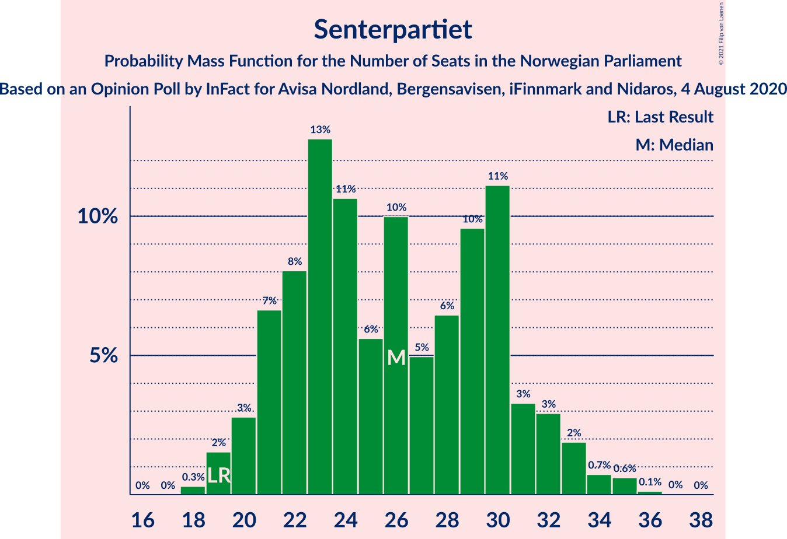
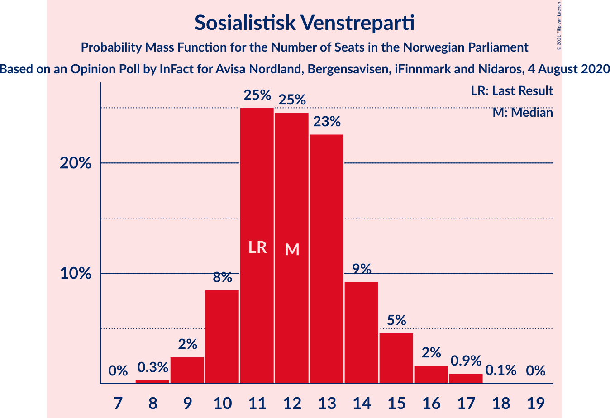
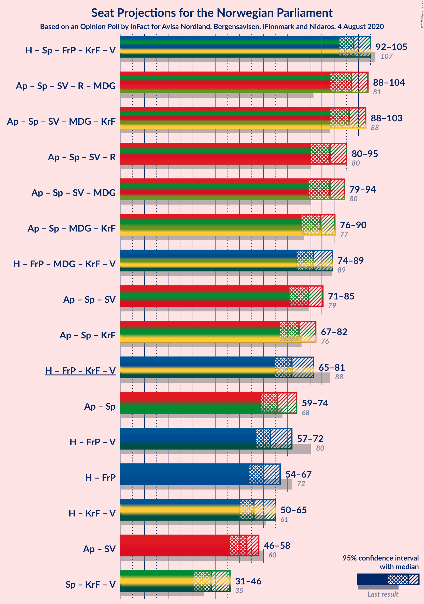

# Opinion Poll by InFact for Avisa Nordland, Bergensavisen, iFinnmark and Nidaros, 4 August 2020

<a href="#voting-intentions">Voting Intentions</a> | <a href="#seats">Seats</a> | <a href="#coalitions">Coalitions</a> | <a href="#technical-information">Technical Information</a>

## Voting Intentions

### Confidence Intervals

| Party | Last Result | Poll Result | 80% Confidence Interval | 90% Confidence Interval | 95% Confidence Interval | 99% Confidence Interval |
|:-----:|:-----------:|:-----------:|:-----------------------:|:-----------------------:|:-----------------------:|:-----------------------:|
| Høyre | 25.0% | 25.1% | 23.4–26.9% |22.9–27.4% |22.5–27.8% |21.7–28.7% |
| Arbeiderpartiet | 27.4% | 21.8% | 20.2–23.5% |19.7–24.0% |19.4–24.4% |18.6–25.3% |
| Senterpartiet | 10.3% | 14.1% | 12.7–15.5% |12.4–16.0% |12.1–16.3% |11.5–17.1% |
| Fremskrittspartiet | 15.2% | 9.3% | 8.2–10.5% |7.9–10.9% |7.7–11.2% |7.2–11.9% |
| Sosialistisk Venstreparti | 6.0% | 7.3% | 6.4–8.5% |6.1–8.8% |5.9–9.1% |5.5–9.7% |
| Rødt | 2.4% | 5.8% | 4.9–6.8% |4.7–7.1% |4.5–7.4% |4.1–7.9% |
| Miljøpartiet De Grønne | 3.2% | 5.4% | 4.6–6.4% |4.3–6.7% |4.1–6.9% |3.8–7.5% |
| Kristelig Folkeparti | 4.2% | 5.2% | 4.4–6.2% |4.2–6.5% |4.0–6.7% |3.6–7.2% |
| Venstre | 4.4% | 3.7% | 3.0–4.6% |2.9–4.8% |2.7–5.1% |2.4–5.5% |

*Note:* The poll result column reflects the actual value used in the calculations. Published results may vary slightly, and in addition be rounded to fewer digits.

## Seats

### Confidence Intervals

| Party | Last Result | Median | 80% Confidence Interval | 90% Confidence Interval | 95% Confidence Interval | 99% Confidence Interval |
|:-----:|:-----------:|:------:|:-----------------------:|:-----------------------:|:-----------------------:|:-----------------------:|
| <a href="#høyre">Høyre</a> | 45 | 43 | 39–48 |39–50 |39–52 |37–53 |
| <a href="#arbeiderpartiet">Arbeiderpartiet</a> | 49 | 41 | 36–43 |36–45 |35–46 |33–46 |
| <a href="#senterpartiet">Senterpartiet</a> | 19 | 27 | 21–30 |21–32 |20–33 |19–33 |
| <a href="#fremskrittspartiet">Fremskrittspartiet</a> | 27 | 17 | 13–20 |12–21 |12–21 |10–21 |
| <a href="#sosialistisk-venstreparti">Sosialistisk Venstreparti</a> | 11 | 12 | 10–14 |10–15 |9–17 |9–17 |
| <a href="#rødt">Rødt</a> | 1 | 9 | 7–11 |7–12 |7–13 |2–13 |
| <a href="#miljøpartiet-de-grønne">Miljøpartiet De Grønne</a> | 1 | 9 | 8–11 |7–11 |7–11 |2–12 |
| <a href="#kristelig-folkeparti">Kristelig Folkeparti</a> | 8 | 8 | 7–10 |7–11 |3–11 |3–12 |
| <a href="#venstre">Venstre</a> | 8 | 2 | 2–7 |2–7 |2–8 |1–8 |

### Høyre

*For a full overview of the results for this party, see the [Høyre](party-høyre.html) page.*

| Number of Seats | Probability | Accumulated | Special Marks |
|:---------------:|:-----------:|:-----------:|:-------------:|
| 35 | 0% | 100% |  |
| 36 | 0.1% | 99.9% |  |
| 37 | 0.7% | 99.9% |  |
| 38 | 1.2% | 99.2% |  |
| 39 | 10% | 98% |  |
| 40 | 5% | 88% |  |
| 41 | 15% | 83% |  |
| 42 | 11% | 67% |  |
| 43 | 17% | 56% | Median |
| 44 | 8% | 39% |  |
| 45 | 4% | 32% | Last Result |
| 46 | 10% | 28% |  |
| 47 | 3% | 18% |  |
| 48 | 6% | 15% |  |
| 49 | 3% | 9% |  |
| 50 | 2% | 6% |  |
| 51 | 1.2% | 4% |  |
| 52 | 0.7% | 3% |  |
| 53 | 2% | 2% |  |
| 54 | 0.1% | 0.2% |  |
| 55 | 0% | 0.1% |  |
| 56 | 0% | 0.1% |  |
| 57 | 0% | 0% |  |

### Arbeiderpartiet

*For a full overview of the results for this party, see the [Arbeiderpartiet](party-arbeiderpartiet.html) page.*

| Number of Seats | Probability | Accumulated | Special Marks |
|:---------------:|:-----------:|:-----------:|:-------------:|
| 31 | 0.1% | 100% |  |
| 32 | 0.2% | 99.9% |  |
| 33 | 0.5% | 99.7% |  |
| 34 | 0.8% | 99.2% |  |
| 35 | 3% | 98% |  |
| 36 | 6% | 96% |  |
| 37 | 2% | 90% |  |
| 38 | 3% | 88% |  |
| 39 | 10% | 85% |  |
| 40 | 22% | 74% |  |
| 41 | 40% | 52% | Median |
| 42 | 2% | 13% |  |
| 43 | 2% | 10% |  |
| 44 | 3% | 9% |  |
| 45 | 3% | 6% |  |
| 46 | 3% | 3% |  |
| 47 | 0.2% | 0.5% |  |
| 48 | 0.2% | 0.3% |  |
| 49 | 0% | 0.1% | Last Result |
| 50 | 0% | 0% |  |

### Senterpartiet

*For a full overview of the results for this party, see the [Senterpartiet](party-senterpartiet.html) page.*

| Number of Seats | Probability | Accumulated | Special Marks |
|:---------------:|:-----------:|:-----------:|:-------------:|
| 18 | 0.2% | 100% |  |
| 19 | 0.9% | 99.8% | Last Result |
| 20 | 2% | 98.8% |  |
| 21 | 10% | 97% |  |
| 22 | 5% | 87% |  |
| 23 | 3% | 82% |  |
| 24 | 6% | 79% |  |
| 25 | 4% | 73% |  |
| 26 | 16% | 69% |  |
| 27 | 14% | 53% | Median |
| 28 | 16% | 39% |  |
| 29 | 2% | 23% |  |
| 30 | 12% | 21% |  |
| 31 | 0.9% | 10% |  |
| 32 | 6% | 9% |  |
| 33 | 3% | 3% |  |
| 34 | 0.2% | 0.4% |  |
| 35 | 0.1% | 0.1% |  |
| 36 | 0% | 0.1% |  |
| 37 | 0% | 0% |  |

### Fremskrittspartiet

*For a full overview of the results for this party, see the [Fremskrittspartiet](party-fremskrittspartiet.html) page.*

| Number of Seats | Probability | Accumulated | Special Marks |
|:---------------:|:-----------:|:-----------:|:-------------:|
| 10 | 0.5% | 100% |  |
| 11 | 0.3% | 99.5% |  |
| 12 | 8% | 99.2% |  |
| 13 | 3% | 91% |  |
| 14 | 7% | 88% |  |
| 15 | 13% | 81% |  |
| 16 | 17% | 68% |  |
| 17 | 25% | 51% | Median |
| 18 | 9% | 26% |  |
| 19 | 2% | 17% |  |
| 20 | 7% | 14% |  |
| 21 | 7% | 7% |  |
| 22 | 0.2% | 0.4% |  |
| 23 | 0.1% | 0.1% |  |
| 24 | 0% | 0% |  |
| 25 | 0% | 0% |  |
| 26 | 0% | 0% |  |
| 27 | 0% | 0% | Last Result |

### Sosialistisk Venstreparti

*For a full overview of the results for this party, see the [Sosialistisk Venstreparti](party-sosialistiskvenstreparti.html) page.*

| Number of Seats | Probability | Accumulated | Special Marks |
|:---------------:|:-----------:|:-----------:|:-------------:|
| 8 | 0.3% | 100% |  |
| 9 | 3% | 99.7% |  |
| 10 | 12% | 97% |  |
| 11 | 27% | 85% | Last Result |
| 12 | 33% | 58% | Median |
| 13 | 12% | 25% |  |
| 14 | 4% | 13% |  |
| 15 | 4% | 9% |  |
| 16 | 2% | 5% |  |
| 17 | 3% | 3% |  |
| 18 | 0.1% | 0.1% |  |
| 19 | 0% | 0% |  |

### Rødt

*For a full overview of the results for this party, see the [Rødt](party-rødt.html) page.*

| Number of Seats | Probability | Accumulated | Special Marks |
|:---------------:|:-----------:|:-----------:|:-------------:|
| 1 | 0% | 100% | Last Result |
| 2 | 2% | 100% |  |
| 3 | 0% | 98% |  |
| 4 | 0% | 98% |  |
| 5 | 0% | 98% |  |
| 6 | 0.2% | 98% |  |
| 7 | 8% | 98% |  |
| 8 | 10% | 90% |  |
| 9 | 31% | 80% | Median |
| 10 | 36% | 49% |  |
| 11 | 6% | 13% |  |
| 12 | 3% | 7% |  |
| 13 | 4% | 4% |  |
| 14 | 0.3% | 0.3% |  |
| 15 | 0% | 0% |  |

### Miljøpartiet De Grønne

*For a full overview of the results for this party, see the [Miljøpartiet De Grønne](party-miljøpartietdegrønne.html) page.*

| Number of Seats | Probability | Accumulated | Special Marks |
|:---------------:|:-----------:|:-----------:|:-------------:|
| 1 | 0.1% | 100% | Last Result |
| 2 | 1.2% | 99.9% |  |
| 3 | 0.4% | 98.8% |  |
| 4 | 0% | 98% |  |
| 5 | 0% | 98% |  |
| 6 | 0.1% | 98% |  |
| 7 | 7% | 98% |  |
| 8 | 35% | 92% |  |
| 9 | 13% | 57% | Median |
| 10 | 24% | 44% |  |
| 11 | 19% | 20% |  |
| 12 | 1.5% | 2% |  |
| 13 | 0.2% | 0.2% |  |
| 14 | 0% | 0% |  |

### Kristelig Folkeparti

*For a full overview of the results for this party, see the [Kristelig Folkeparti](party-kristeligfolkeparti.html) page.*

| Number of Seats | Probability | Accumulated | Special Marks |
|:---------------:|:-----------:|:-----------:|:-------------:|
| 2 | 0.1% | 100% |  |
| 3 | 3% | 99.8% |  |
| 4 | 0% | 97% |  |
| 5 | 0% | 97% |  |
| 6 | 0.5% | 97% |  |
| 7 | 11% | 97% |  |
| 8 | 39% | 85% | Last Result, Median |
| 9 | 24% | 46% |  |
| 10 | 15% | 23% |  |
| 11 | 6% | 7% |  |
| 12 | 0.9% | 1.3% |  |
| 13 | 0.3% | 0.3% |  |
| 14 | 0% | 0% |  |

### Venstre

*For a full overview of the results for this party, see the [Venstre](party-venstre.html) page.*

| Number of Seats | Probability | Accumulated | Special Marks |
|:---------------:|:-----------:|:-----------:|:-------------:|
| 1 | 2% | 100% |  |
| 2 | 66% | 98% | Median |
| 3 | 0.4% | 32% |  |
| 4 | 0% | 32% |  |
| 5 | 0% | 32% |  |
| 6 | 5% | 32% |  |
| 7 | 22% | 26% |  |
| 8 | 4% | 4% | Last Result |
| 9 | 0.3% | 0.4% |  |
| 10 | 0.1% | 0.1% |  |
| 11 | 0% | 0% |  |

## Coalitions

### Confidence Intervals

| Coalition | Last Result | Median | Majority? | 80% Confidence Interval | 90% Confidence Interval | 95% Confidence Interval | 99% Confidence Interval |
|:---------:|:-----------:|:------:|:---------:|:-----------------------:|:-----------------------:|:-----------------------:|:-----------------------:|
| Høyre – Senterpartiet – Fremskrittspartiet – Kristelig Folkeparti – Venstre | 107 | 98 | 100% | 93–102 | 93–103 | 91–104 | 89–106 |
| Arbeiderpartiet – Senterpartiet – Sosialistisk Venstreparti – Miljøpartiet De Grønne – Kristelig Folkeparti | 88 | 97 | 99.8% | 91–99 | 90–101 | 89–104 | 85–105 |
| Arbeiderpartiet – Senterpartiet – Sosialistisk Venstreparti – Rødt – Miljøpartiet De Grønne | 81 | 97 | 99.9% | 92–101 | 90–102 | 89–102 | 87–106 |
| Arbeiderpartiet – Senterpartiet – Sosialistisk Venstreparti – Rødt | 80 | 88 | 87% | 83–93 | 81–94 | 81–95 | 78–96 |
| Arbeiderpartiet – Senterpartiet – Sosialistisk Venstreparti – Miljøpartiet De Grønne | 80 | 89 | 79% | 82–91 | 82–93 | 80–93 | 77–96 |
| Arbeiderpartiet – Senterpartiet – Miljøpartiet De Grønne – Kristelig Folkeparti | 77 | 85 | 63% | 79–89 | 78–89 | 77–90 | 74–93 |
| Høyre – Fremskrittspartiet – Miljøpartiet De Grønne – Kristelig Folkeparti – Venstre | 89 | 81 | 13% | 76–86 | 75–88 | 74–88 | 73–91 |
| Arbeiderpartiet – Senterpartiet – Sosialistisk Venstreparti | 79 | 79 | 4% | 73–83 | 72–83 | 72–85 | 69–86 |
| Arbeiderpartiet – Senterpartiet – Kristelig Folkeparti | 76 | 76 | 0.3% | 70–80 | 69–81 | 67–81 | 64–84 |
| Høyre – Fremskrittspartiet – Kristelig Folkeparti – Venstre | 88 | 72 | 0.1% | 68–77 | 67–79 | 67–80 | 63–82 |
| Arbeiderpartiet – Senterpartiet | 68 | 67 | 0% | 61–71 | 60–73 | 59–74 | 56–74 |
| Høyre – Fremskrittspartiet – Venstre | 80 | 62 | 0% | 60–69 | 59–70 | 58–71 | 54–74 |
| Høyre – Fremskrittspartiet | 72 | 60 | 0% | 55–65 | 55–67 | 55–68 | 51–69 |
| Høyre – Kristelig Folkeparti – Venstre | 61 | 56 | 0% | 51–60 | 50–63 | 50–65 | 48–66 |
| Arbeiderpartiet – Sosialistisk Venstreparti | 60 | 52 | 0% | 49–56 | 49–58 | 48–59 | 45–60 |
| Senterpartiet – Kristelig Folkeparti – Venstre | 35 | 38 | 0% | 33–43 | 32–44 | 30–45 | 27–47 |

### Høyre – Senterpartiet – Fremskrittspartiet – Kristelig Folkeparti – Venstre

| Number of Seats | Probability | Accumulated | Special Marks |
|:---------------:|:-----------:|:-----------:|:-------------:|
| 86 | 0.1% | 100% |  |
| 87 | 0.1% | 99.9% |  |
| 88 | 0.1% | 99.8% |  |
| 89 | 0.7% | 99.7% |  |
| 90 | 0.3% | 99.1% |  |
| 91 | 2% | 98.8% |  |
| 92 | 0.6% | 97% |  |
| 93 | 7% | 96% |  |
| 94 | 3% | 90% |  |
| 95 | 1.4% | 87% |  |
| 96 | 8% | 86% |  |
| 97 | 10% | 77% | Median |
| 98 | 21% | 67% |  |
| 99 | 7% | 46% |  |
| 100 | 12% | 39% |  |
| 101 | 11% | 26% |  |
| 102 | 8% | 15% |  |
| 103 | 3% | 8% |  |
| 104 | 4% | 5% |  |
| 105 | 0.3% | 0.9% |  |
| 106 | 0.2% | 0.6% |  |
| 107 | 0.1% | 0.4% | Last Result |
| 108 | 0.2% | 0.3% |  |
| 109 | 0.1% | 0.1% |  |
| 110 | 0% | 0% |  |

### Arbeiderpartiet – Senterpartiet – Sosialistisk Venstreparti – Miljøpartiet De Grønne – Kristelig Folkeparti

| Number of Seats | Probability | Accumulated | Special Marks |
|:---------------:|:-----------:|:-----------:|:-------------:|
| 83 | 0.1% | 100% |  |
| 84 | 0.1% | 99.9% |  |
| 85 | 0.4% | 99.8% | Majority |
| 86 | 0.3% | 99.4% |  |
| 87 | 0.1% | 99.1% |  |
| 88 | 0.8% | 99.0% | Last Result |
| 89 | 2% | 98% |  |
| 90 | 5% | 97% |  |
| 91 | 6% | 92% |  |
| 92 | 8% | 86% |  |
| 93 | 3% | 78% |  |
| 94 | 4% | 75% |  |
| 95 | 4% | 71% |  |
| 96 | 4% | 67% |  |
| 97 | 17% | 63% | Median |
| 98 | 21% | 46% |  |
| 99 | 17% | 25% |  |
| 100 | 3% | 8% |  |
| 101 | 1.0% | 5% |  |
| 102 | 0.9% | 4% |  |
| 103 | 1.0% | 3% |  |
| 104 | 2% | 3% |  |
| 105 | 0.4% | 0.7% |  |
| 106 | 0.1% | 0.3% |  |
| 107 | 0% | 0.2% |  |
| 108 | 0.1% | 0.2% |  |
| 109 | 0.1% | 0.1% |  |
| 110 | 0% | 0% |  |

### Arbeiderpartiet – Senterpartiet – Sosialistisk Venstreparti – Rødt – Miljøpartiet De Grønne

| Number of Seats | Probability | Accumulated | Special Marks |
|:---------------:|:-----------:|:-----------:|:-------------:|
| 81 | 0% | 100% | Last Result |
| 82 | 0% | 100% |  |
| 83 | 0% | 100% |  |
| 84 | 0.1% | 100% |  |
| 85 | 0% | 99.9% | Majority |
| 86 | 0.3% | 99.9% |  |
| 87 | 0.2% | 99.5% |  |
| 88 | 0.6% | 99.4% |  |
| 89 | 2% | 98.8% |  |
| 90 | 3% | 97% |  |
| 91 | 2% | 93% |  |
| 92 | 3% | 91% |  |
| 93 | 8% | 89% |  |
| 94 | 4% | 81% |  |
| 95 | 4% | 77% |  |
| 96 | 9% | 72% |  |
| 97 | 15% | 63% |  |
| 98 | 3% | 48% | Median |
| 99 | 21% | 45% |  |
| 100 | 14% | 25% |  |
| 101 | 4% | 11% |  |
| 102 | 4% | 7% |  |
| 103 | 0.8% | 2% |  |
| 104 | 0.7% | 2% |  |
| 105 | 0% | 0.9% |  |
| 106 | 0.4% | 0.8% |  |
| 107 | 0.2% | 0.5% |  |
| 108 | 0.1% | 0.2% |  |
| 109 | 0.2% | 0.2% |  |
| 110 | 0% | 0% |  |

### Arbeiderpartiet – Senterpartiet – Sosialistisk Venstreparti – Rødt

| Number of Seats | Probability | Accumulated | Special Marks |
|:---------------:|:-----------:|:-----------:|:-------------:|
| 75 | 0% | 100% |  |
| 76 | 0.1% | 99.9% |  |
| 77 | 0.1% | 99.9% |  |
| 78 | 0.5% | 99.8% |  |
| 79 | 0.2% | 99.4% |  |
| 80 | 1.5% | 99.2% | Last Result |
| 81 | 5% | 98% |  |
| 82 | 2% | 92% |  |
| 83 | 2% | 91% |  |
| 84 | 2% | 89% |  |
| 85 | 10% | 87% | Majority |
| 86 | 5% | 77% |  |
| 87 | 5% | 72% |  |
| 88 | 21% | 67% |  |
| 89 | 16% | 46% | Median |
| 90 | 16% | 30% |  |
| 91 | 1.0% | 14% |  |
| 92 | 2% | 13% |  |
| 93 | 5% | 11% |  |
| 94 | 3% | 5% |  |
| 95 | 2% | 3% |  |
| 96 | 0.6% | 1.1% |  |
| 97 | 0.1% | 0.4% |  |
| 98 | 0.1% | 0.3% |  |
| 99 | 0.2% | 0.2% |  |
| 100 | 0% | 0.1% |  |
| 101 | 0% | 0% |  |

### Arbeiderpartiet – Senterpartiet – Sosialistisk Venstreparti – Miljøpartiet De Grønne

| Number of Seats | Probability | Accumulated | Special Marks |
|:---------------:|:-----------:|:-----------:|:-------------:|
| 75 | 0% | 100% |  |
| 76 | 0.1% | 99.9% |  |
| 77 | 0.4% | 99.8% |  |
| 78 | 0.1% | 99.4% |  |
| 79 | 0.7% | 99.3% |  |
| 80 | 1.1% | 98.6% | Last Result |
| 81 | 2% | 97% |  |
| 82 | 7% | 95% |  |
| 83 | 2% | 88% |  |
| 84 | 6% | 85% |  |
| 85 | 7% | 79% | Majority |
| 86 | 4% | 72% |  |
| 87 | 12% | 69% |  |
| 88 | 4% | 57% |  |
| 89 | 13% | 53% | Median |
| 90 | 20% | 40% |  |
| 91 | 12% | 19% |  |
| 92 | 2% | 7% |  |
| 93 | 4% | 6% |  |
| 94 | 0.7% | 2% |  |
| 95 | 0.2% | 0.9% |  |
| 96 | 0.3% | 0.7% |  |
| 97 | 0.1% | 0.4% |  |
| 98 | 0.1% | 0.3% |  |
| 99 | 0% | 0.2% |  |
| 100 | 0.1% | 0.2% |  |
| 101 | 0.1% | 0.1% |  |
| 102 | 0% | 0% |  |

### Arbeiderpartiet – Senterpartiet – Miljøpartiet De Grønne – Kristelig Folkeparti

| Number of Seats | Probability | Accumulated | Special Marks |
|:---------------:|:-----------:|:-----------:|:-------------:|
| 71 | 0.1% | 100% |  |
| 72 | 0.1% | 99.9% |  |
| 73 | 0.2% | 99.8% |  |
| 74 | 0.7% | 99.6% |  |
| 75 | 0.6% | 98.9% |  |
| 76 | 0.5% | 98% |  |
| 77 | 2% | 98% | Last Result |
| 78 | 4% | 96% |  |
| 79 | 7% | 92% |  |
| 80 | 6% | 85% |  |
| 81 | 7% | 79% |  |
| 82 | 3% | 72% |  |
| 83 | 2% | 69% |  |
| 84 | 4% | 67% |  |
| 85 | 20% | 63% | Median, Majority |
| 86 | 10% | 44% |  |
| 87 | 20% | 34% |  |
| 88 | 2% | 13% |  |
| 89 | 8% | 11% |  |
| 90 | 1.0% | 3% |  |
| 91 | 0.8% | 2% |  |
| 92 | 0.6% | 1.2% |  |
| 93 | 0.4% | 0.7% |  |
| 94 | 0% | 0.3% |  |
| 95 | 0.1% | 0.2% |  |
| 96 | 0.2% | 0.2% |  |
| 97 | 0% | 0% |  |

### Høyre – Fremskrittspartiet – Miljøpartiet De Grønne – Kristelig Folkeparti – Venstre

| Number of Seats | Probability | Accumulated | Special Marks |
|:---------------:|:-----------:|:-----------:|:-------------:|
| 69 | 0% | 100% |  |
| 70 | 0.2% | 99.9% |  |
| 71 | 0.1% | 99.8% |  |
| 72 | 0.1% | 99.7% |  |
| 73 | 0.6% | 99.6% |  |
| 74 | 2% | 98.9% |  |
| 75 | 3% | 97% |  |
| 76 | 5% | 94% |  |
| 77 | 2% | 89% |  |
| 78 | 1.0% | 87% |  |
| 79 | 16% | 86% | Median |
| 80 | 16% | 70% |  |
| 81 | 21% | 53% |  |
| 82 | 5% | 33% |  |
| 83 | 5% | 28% |  |
| 84 | 10% | 23% |  |
| 85 | 2% | 13% | Majority |
| 86 | 2% | 11% |  |
| 87 | 2% | 9% |  |
| 88 | 5% | 7% |  |
| 89 | 1.5% | 2% | Last Result |
| 90 | 0.2% | 0.8% |  |
| 91 | 0.5% | 0.6% |  |
| 92 | 0% | 0.1% |  |
| 93 | 0% | 0.1% |  |
| 94 | 0% | 0% |  |

### Arbeiderpartiet – Senterpartiet – Sosialistisk Venstreparti

| Number of Seats | Probability | Accumulated | Special Marks |
|:---------------:|:-----------:|:-----------:|:-------------:|
| 66 | 0% | 100% |  |
| 67 | 0.1% | 99.9% |  |
| 68 | 0.1% | 99.9% |  |
| 69 | 0.7% | 99.8% |  |
| 70 | 0.2% | 99.1% |  |
| 71 | 1.3% | 98.9% |  |
| 72 | 3% | 98% |  |
| 73 | 6% | 95% |  |
| 74 | 4% | 89% |  |
| 75 | 3% | 85% |  |
| 76 | 3% | 82% |  |
| 77 | 11% | 79% |  |
| 78 | 3% | 68% |  |
| 79 | 29% | 65% | Last Result |
| 80 | 9% | 37% | Median |
| 81 | 14% | 28% |  |
| 82 | 2% | 14% |  |
| 83 | 7% | 12% |  |
| 84 | 0.5% | 5% |  |
| 85 | 3% | 4% | Majority |
| 86 | 1.4% | 2% |  |
| 87 | 0.1% | 0.4% |  |
| 88 | 0% | 0.3% |  |
| 89 | 0.1% | 0.3% |  |
| 90 | 0.1% | 0.2% |  |
| 91 | 0.1% | 0.2% |  |
| 92 | 0% | 0% |  |

### Arbeiderpartiet – Senterpartiet – Kristelig Folkeparti

| Number of Seats | Probability | Accumulated | Special Marks |
|:---------------:|:-----------:|:-----------:|:-------------:|
| 62 | 0.1% | 100% |  |
| 63 | 0.1% | 99.9% |  |
| 64 | 0.4% | 99.8% |  |
| 65 | 0.3% | 99.4% |  |
| 66 | 0.8% | 99.1% |  |
| 67 | 1.4% | 98% |  |
| 68 | 0.9% | 97% |  |
| 69 | 6% | 96% |  |
| 70 | 2% | 90% |  |
| 71 | 8% | 88% |  |
| 72 | 2% | 80% |  |
| 73 | 6% | 78% |  |
| 74 | 10% | 72% |  |
| 75 | 3% | 61% |  |
| 76 | 16% | 58% | Last Result, Median |
| 77 | 22% | 43% |  |
| 78 | 6% | 20% |  |
| 79 | 3% | 14% |  |
| 80 | 2% | 11% |  |
| 81 | 8% | 9% |  |
| 82 | 0.2% | 1.4% |  |
| 83 | 0.1% | 1.2% |  |
| 84 | 0.8% | 1.1% |  |
| 85 | 0.1% | 0.3% | Majority |
| 86 | 0.1% | 0.2% |  |
| 87 | 0.1% | 0.1% |  |
| 88 | 0% | 0% |  |

### Høyre – Fremskrittspartiet – Kristelig Folkeparti – Venstre

| Number of Seats | Probability | Accumulated | Special Marks |
|:---------------:|:-----------:|:-----------:|:-------------:|
| 60 | 0.2% | 100% |  |
| 61 | 0.1% | 99.8% |  |
| 62 | 0.2% | 99.7% |  |
| 63 | 0.4% | 99.5% |  |
| 64 | 0% | 99.2% |  |
| 65 | 0.7% | 99.1% |  |
| 66 | 0.9% | 98% |  |
| 67 | 4% | 98% |  |
| 68 | 4% | 93% |  |
| 69 | 14% | 89% |  |
| 70 | 21% | 75% | Median |
| 71 | 3% | 54% |  |
| 72 | 15% | 52% |  |
| 73 | 9% | 37% |  |
| 74 | 4% | 27% |  |
| 75 | 4% | 23% |  |
| 76 | 8% | 19% |  |
| 77 | 3% | 11% |  |
| 78 | 2% | 9% |  |
| 79 | 3% | 7% |  |
| 80 | 2% | 3% |  |
| 81 | 0.6% | 1.2% |  |
| 82 | 0.2% | 0.6% |  |
| 83 | 0.3% | 0.4% |  |
| 84 | 0% | 0.1% |  |
| 85 | 0.1% | 0.1% | Majority |
| 86 | 0% | 0% |  |
| 87 | 0% | 0% |  |
| 88 | 0% | 0% | Last Result |

### Arbeiderpartiet – Senterpartiet

| Number of Seats | Probability | Accumulated | Special Marks |
|:---------------:|:-----------:|:-----------:|:-------------:|
| 54 | 0.1% | 100% |  |
| 55 | 0.4% | 99.9% |  |
| 56 | 0.2% | 99.5% |  |
| 57 | 0.2% | 99.4% |  |
| 58 | 1.1% | 99.2% |  |
| 59 | 0.7% | 98% |  |
| 60 | 5% | 97% |  |
| 61 | 4% | 92% |  |
| 62 | 2% | 89% |  |
| 63 | 4% | 87% |  |
| 64 | 3% | 83% |  |
| 65 | 8% | 79% |  |
| 66 | 14% | 71% |  |
| 67 | 11% | 57% |  |
| 68 | 20% | 45% | Last Result, Median |
| 69 | 12% | 25% |  |
| 70 | 2% | 13% |  |
| 71 | 1.1% | 11% |  |
| 72 | 2% | 10% |  |
| 73 | 5% | 8% |  |
| 74 | 2% | 3% |  |
| 75 | 0.1% | 0.4% |  |
| 76 | 0.1% | 0.4% |  |
| 77 | 0% | 0.2% |  |
| 78 | 0.1% | 0.2% |  |
| 79 | 0% | 0.1% |  |
| 80 | 0% | 0% |  |

### Høyre – Fremskrittspartiet – Venstre

| Number of Seats | Probability | Accumulated | Special Marks |
|:---------------:|:-----------:|:-----------:|:-------------:|
| 52 | 0.3% | 100% |  |
| 53 | 0.2% | 99.7% |  |
| 54 | 0.2% | 99.6% |  |
| 55 | 0.3% | 99.4% |  |
| 56 | 0.5% | 99.1% |  |
| 57 | 1.0% | 98.6% |  |
| 58 | 2% | 98% |  |
| 59 | 2% | 96% |  |
| 60 | 13% | 94% |  |
| 61 | 6% | 82% |  |
| 62 | 33% | 75% | Median |
| 63 | 5% | 43% |  |
| 64 | 11% | 38% |  |
| 65 | 2% | 27% |  |
| 66 | 3% | 25% |  |
| 67 | 4% | 22% |  |
| 68 | 4% | 18% |  |
| 69 | 8% | 15% |  |
| 70 | 4% | 7% |  |
| 71 | 0.7% | 3% |  |
| 72 | 0.6% | 2% |  |
| 73 | 1.0% | 2% |  |
| 74 | 0.1% | 0.6% |  |
| 75 | 0.3% | 0.4% |  |
| 76 | 0.1% | 0.2% |  |
| 77 | 0% | 0% |  |
| 78 | 0% | 0% |  |
| 79 | 0% | 0% |  |
| 80 | 0% | 0% | Last Result |

### Høyre – Fremskrittspartiet

| Number of Seats | Probability | Accumulated | Special Marks |
|:---------------:|:-----------:|:-----------:|:-------------:|
| 50 | 0.3% | 100% |  |
| 51 | 0.2% | 99.6% |  |
| 52 | 0.3% | 99.4% |  |
| 53 | 0.5% | 99.2% |  |
| 54 | 0.9% | 98.7% |  |
| 55 | 11% | 98% |  |
| 56 | 4% | 87% |  |
| 57 | 7% | 83% |  |
| 58 | 14% | 76% |  |
| 59 | 6% | 62% |  |
| 60 | 23% | 56% | Median |
| 61 | 4% | 33% |  |
| 62 | 8% | 29% |  |
| 63 | 5% | 21% |  |
| 64 | 3% | 15% |  |
| 65 | 4% | 12% |  |
| 66 | 3% | 8% |  |
| 67 | 1.2% | 5% |  |
| 68 | 4% | 4% |  |
| 69 | 0.4% | 0.5% |  |
| 70 | 0.1% | 0.1% |  |
| 71 | 0% | 0.1% |  |
| 72 | 0% | 0% | Last Result |

### Høyre – Kristelig Folkeparti – Venstre

| Number of Seats | Probability | Accumulated | Special Marks |
|:---------------:|:-----------:|:-----------:|:-------------:|
| 46 | 0.1% | 100% |  |
| 47 | 0.3% | 99.9% |  |
| 48 | 0.4% | 99.6% |  |
| 49 | 0.4% | 99.2% |  |
| 50 | 4% | 98.8% |  |
| 51 | 9% | 94% |  |
| 52 | 7% | 86% |  |
| 53 | 19% | 79% | Median |
| 54 | 1.0% | 60% |  |
| 55 | 8% | 59% |  |
| 56 | 18% | 51% |  |
| 57 | 5% | 33% |  |
| 58 | 7% | 28% |  |
| 59 | 10% | 21% |  |
| 60 | 1.3% | 11% |  |
| 61 | 2% | 10% | Last Result |
| 62 | 2% | 8% |  |
| 63 | 3% | 6% |  |
| 64 | 0.4% | 3% |  |
| 65 | 1.2% | 3% |  |
| 66 | 0.9% | 1.3% |  |
| 67 | 0% | 0.4% |  |
| 68 | 0.3% | 0.4% |  |
| 69 | 0% | 0.1% |  |
| 70 | 0% | 0.1% |  |
| 71 | 0.1% | 0.1% |  |
| 72 | 0% | 0% |  |

### Arbeiderpartiet – Sosialistisk Venstreparti

| Number of Seats | Probability | Accumulated | Special Marks |
|:---------------:|:-----------:|:-----------:|:-------------:|
| 42 | 0% | 100% |  |
| 43 | 0.1% | 99.9% |  |
| 44 | 0.2% | 99.8% |  |
| 45 | 0.3% | 99.6% |  |
| 46 | 0.4% | 99.3% |  |
| 47 | 0.5% | 99.0% |  |
| 48 | 3% | 98% |  |
| 49 | 8% | 96% |  |
| 50 | 8% | 88% |  |
| 51 | 28% | 80% |  |
| 52 | 10% | 52% |  |
| 53 | 24% | 42% | Median |
| 54 | 3% | 19% |  |
| 55 | 5% | 16% |  |
| 56 | 2% | 11% |  |
| 57 | 4% | 9% |  |
| 58 | 2% | 5% |  |
| 59 | 3% | 4% |  |
| 60 | 0.5% | 0.8% | Last Result |
| 61 | 0.2% | 0.3% |  |
| 62 | 0% | 0% |  |

### Senterpartiet – Kristelig Folkeparti – Venstre

| Number of Seats | Probability | Accumulated | Special Marks |
|:---------------:|:-----------:|:-----------:|:-------------:|
| 26 | 0.1% | 100% |  |
| 27 | 1.0% | 99.9% |  |
| 28 | 0.2% | 99.0% |  |
| 29 | 1.1% | 98.7% |  |
| 30 | 0.7% | 98% |  |
| 31 | 2% | 97% |  |
| 32 | 5% | 95% |  |
| 33 | 5% | 90% |  |
| 34 | 3% | 86% |  |
| 35 | 3% | 83% | Last Result |
| 36 | 6% | 79% |  |
| 37 | 7% | 73% | Median |
| 38 | 17% | 66% |  |
| 39 | 7% | 49% |  |
| 40 | 12% | 42% |  |
| 41 | 3% | 31% |  |
| 42 | 8% | 28% |  |
| 43 | 10% | 20% |  |
| 44 | 6% | 10% |  |
| 45 | 3% | 4% |  |
| 46 | 0.6% | 1.1% |  |
| 47 | 0.2% | 0.6% |  |
| 48 | 0.2% | 0.4% |  |
| 49 | 0.1% | 0.1% |  |
| 50 | 0% | 0.1% |  |
| 51 | 0% | 0% |  |

## Technical Information

### Opinion Poll

+ **Polling firm:** InFact
+ **Commissioner(s):** Avisa Nordland, Bergensavisen, iFinnmark and Nidaros
+ **Fieldwork period:** 4 August 2020

### Calculations

+ **Sample size:** 1024
+ **Simulations done:** 131,072
+ **Error estimate:** 1.28%

