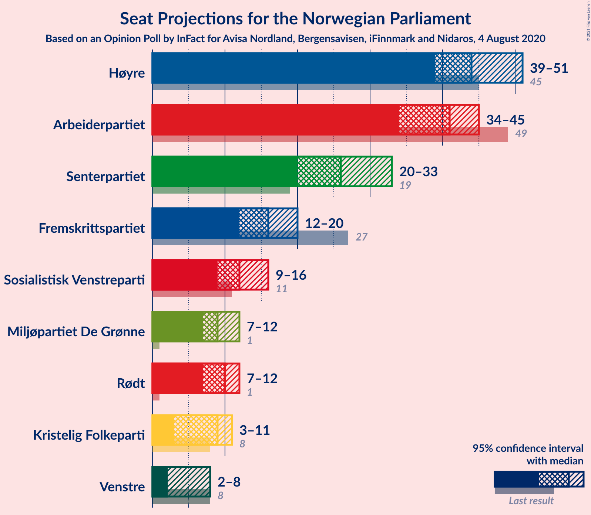
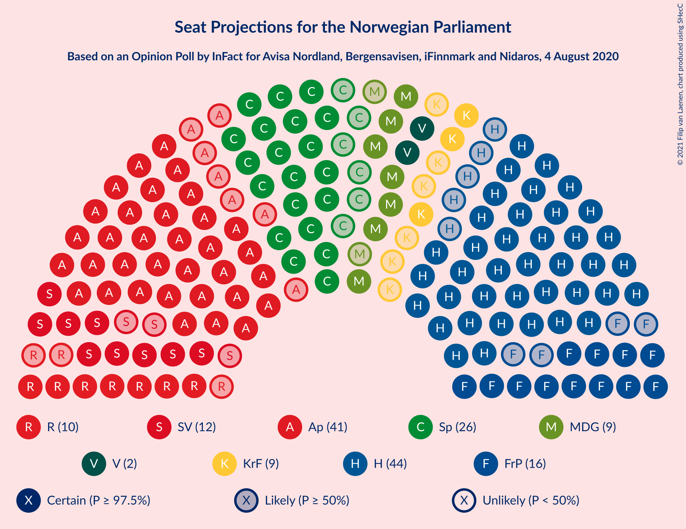
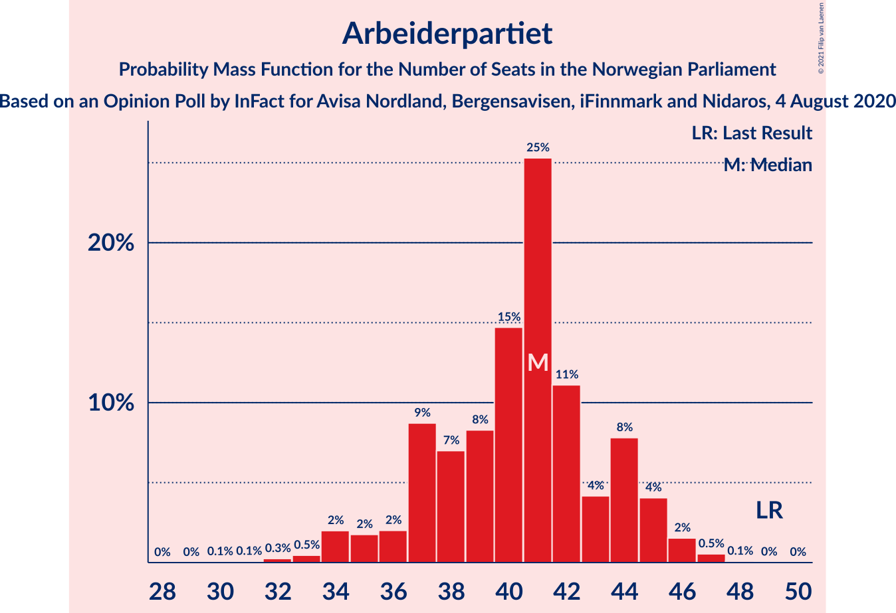
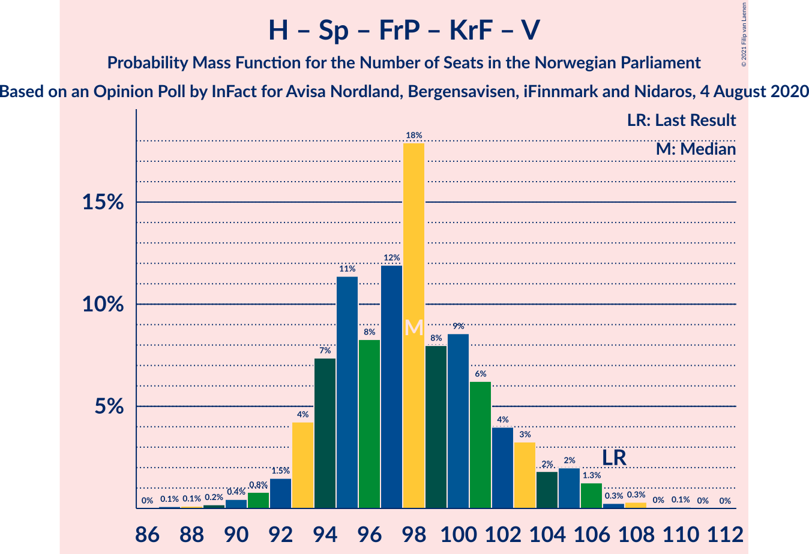
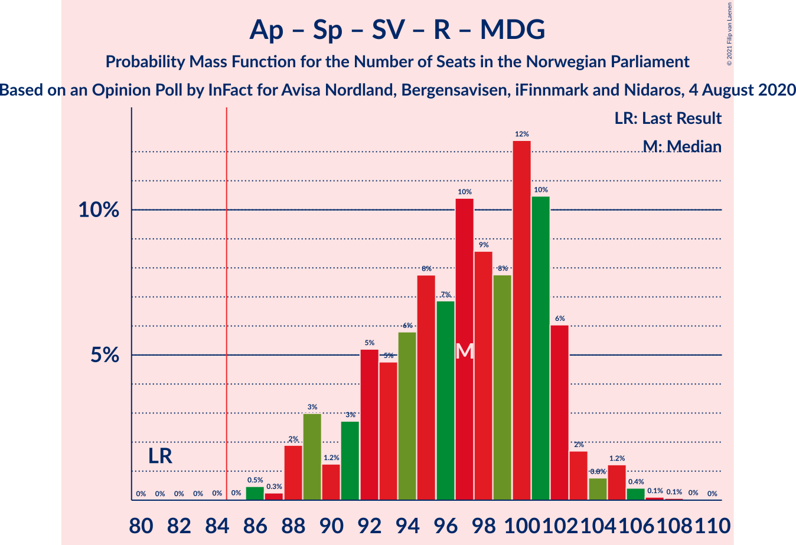
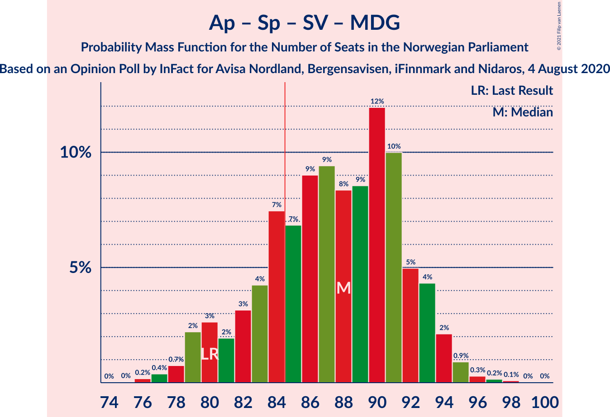

# Opinion Poll by InFact for Avisa Nordland, Bergensavisen, iFinnmark and Nidaros, 4 August 2020

<a href="#voting-intentions">Voting Intentions</a> | <a href="#seats">Seats</a> | <a href="#coalitions">Coalitions</a> | <a href="#technical-information">Technical Information</a>

## Voting Intentions

### Confidence Intervals

| Party | Last Result | Poll Result | 80% Confidence Interval | 90% Confidence Interval | 95% Confidence Interval | 99% Confidence Interval |
|:-----:|:-----------:|:-----------:|:-----------------------:|:-----------------------:|:-----------------------:|:-----------------------:|
| Høyre | 25.0% | 25.1% | 23.4–26.9% |22.9–27.4% |22.5–27.8% |21.7–28.7% |
| Arbeiderpartiet | 27.4% | 21.8% | 20.2–23.5% |19.7–24.0% |19.4–24.4% |18.6–25.3% |
| Senterpartiet | 10.3% | 14.1% | 12.7–15.5% |12.4–16.0% |12.1–16.3% |11.5–17.1% |
| Fremskrittspartiet | 15.2% | 9.3% | 8.2–10.5% |7.9–10.9% |7.7–11.2% |7.2–11.9% |
| Sosialistisk Venstreparti | 6.0% | 7.3% | 6.4–8.5% |6.1–8.8% |5.9–9.1% |5.5–9.7% |
| Rødt | 2.4% | 5.8% | 4.9–6.8% |4.7–7.1% |4.5–7.4% |4.1–7.9% |
| Miljøpartiet De Grønne | 3.2% | 5.4% | 4.6–6.4% |4.3–6.7% |4.1–6.9% |3.8–7.5% |
| Kristelig Folkeparti | 4.2% | 5.2% | 4.4–6.2% |4.2–6.5% |4.0–6.7% |3.6–7.2% |
| Venstre | 4.4% | 3.7% | 3.0–4.6% |2.9–4.8% |2.7–5.1% |2.4–5.5% |

*Note:* The poll result column reflects the actual value used in the calculations. Published results may vary slightly, and in addition be rounded to fewer digits.

## Seats

### Confidence Intervals

| Party | Last Result | Median | 80% Confidence Interval | 90% Confidence Interval | 95% Confidence Interval | 99% Confidence Interval |
|:-----:|:-----------:|:------:|:-----------------------:|:-----------------------:|:-----------------------:|:-----------------------:|
| <a href="#høyre">Høyre</a> | 45 | 44 | 40–49 |39–50 |39–51 |37–53 |
| <a href="#arbeiderpartiet">Arbeiderpartiet</a> | 49 | 40 | 37–44 |35–45 |34–45 |33–47 |
| <a href="#senterpartiet">Senterpartiet</a> | 19 | 26 | 21–30 |21–32 |20–32 |19–34 |
| <a href="#fremskrittspartiet">Fremskrittspartiet</a> | 27 | 16 | 12–19 |12–20 |12–21 |11–22 |
| <a href="#sosialistisk-venstreparti">Sosialistisk Venstreparti</a> | 11 | 12 | 10–14 |10–15 |10–16 |9–17 |
| <a href="#rødt">Rødt</a> | 1 | 10 | 8–11 |7–12 |7–12 |2–13 |
| <a href="#miljøpartiet-de-grønne">Miljøpartiet De Grønne</a> | 1 | 9 | 8–11 |7–11 |7–12 |2–12 |
| <a href="#kristelig-folkeparti">Kristelig Folkeparti</a> | 8 | 9 | 7–10 |7–11 |3–11 |3–12 |
| <a href="#venstre">Venstre</a> | 8 | 2 | 2–7 |2–8 |2–8 |1–9 |

### Høyre

*For a full overview of the results for this party, see the [Høyre](party-høyre.html) page.*

| Number of Seats | Probability | Accumulated | Special Marks |
|:---------------:|:-----------:|:-----------:|:-------------:|
| 35 | 0% | 100% |  |
| 36 | 0.3% | 99.9% |  |
| 37 | 0.4% | 99.7% |  |
| 38 | 1.3% | 99.3% |  |
| 39 | 6% | 98% |  |
| 40 | 4% | 92% |  |
| 41 | 18% | 89% |  |
| 42 | 10% | 71% |  |
| 43 | 10% | 61% |  |
| 44 | 13% | 51% | Median |
| 45 | 6% | 38% | Last Result |
| 46 | 9% | 32% |  |
| 47 | 7% | 23% |  |
| 48 | 3% | 16% |  |
| 49 | 5% | 13% |  |
| 50 | 4% | 8% |  |
| 51 | 1.5% | 4% |  |
| 52 | 1.3% | 2% |  |
| 53 | 0.6% | 0.9% |  |
| 54 | 0.1% | 0.4% |  |
| 55 | 0.2% | 0.3% |  |
| 56 | 0% | 0% |  |

### Arbeiderpartiet

*For a full overview of the results for this party, see the [Arbeiderpartiet](party-arbeiderpartiet.html) page.*

| Number of Seats | Probability | Accumulated | Special Marks |
|:---------------:|:-----------:|:-----------:|:-------------:|
| 30 | 0.1% | 100% |  |
| 31 | 0.1% | 99.9% |  |
| 32 | 0.2% | 99.8% |  |
| 33 | 0.6% | 99.6% |  |
| 34 | 2% | 99.1% |  |
| 35 | 2% | 97% |  |
| 36 | 2% | 95% |  |
| 37 | 13% | 93% |  |
| 38 | 7% | 80% |  |
| 39 | 9% | 73% |  |
| 40 | 14% | 64% | Median |
| 41 | 22% | 49% |  |
| 42 | 9% | 28% |  |
| 43 | 6% | 18% |  |
| 44 | 6% | 12% |  |
| 45 | 4% | 6% |  |
| 46 | 1.4% | 2% |  |
| 47 | 0.4% | 0.6% |  |
| 48 | 0.1% | 0.2% |  |
| 49 | 0% | 0.1% | Last Result |
| 50 | 0% | 0% |  |

### Senterpartiet

*For a full overview of the results for this party, see the [Senterpartiet](party-senterpartiet.html) page.*

| Number of Seats | Probability | Accumulated | Special Marks |
|:---------------:|:-----------:|:-----------:|:-------------:|
| 18 | 0.3% | 100% |  |
| 19 | 2% | 99.7% | Last Result |
| 20 | 3% | 98% |  |
| 21 | 6% | 95% |  |
| 22 | 7% | 90% |  |
| 23 | 11% | 83% |  |
| 24 | 11% | 73% |  |
| 25 | 9% | 61% |  |
| 26 | 10% | 53% | Median |
| 27 | 7% | 43% |  |
| 28 | 8% | 36% |  |
| 29 | 13% | 29% |  |
| 30 | 8% | 16% |  |
| 31 | 3% | 9% |  |
| 32 | 3% | 5% |  |
| 33 | 1.4% | 2% |  |
| 34 | 0.4% | 0.8% |  |
| 35 | 0.3% | 0.4% |  |
| 36 | 0.1% | 0.1% |  |
| 37 | 0% | 0% |  |

### Fremskrittspartiet

*For a full overview of the results for this party, see the [Fremskrittspartiet](party-fremskrittspartiet.html) page.*

| Number of Seats | Probability | Accumulated | Special Marks |
|:---------------:|:-----------:|:-----------:|:-------------:|
| 10 | 0.4% | 100% |  |
| 11 | 0.7% | 99.6% |  |
| 12 | 10% | 99.0% |  |
| 13 | 6% | 89% |  |
| 14 | 11% | 83% |  |
| 15 | 14% | 72% |  |
| 16 | 18% | 58% | Median |
| 17 | 21% | 40% |  |
| 18 | 6% | 20% |  |
| 19 | 5% | 13% |  |
| 20 | 5% | 8% |  |
| 21 | 2% | 3% |  |
| 22 | 0.4% | 0.6% |  |
| 23 | 0.1% | 0.1% |  |
| 24 | 0% | 0% |  |
| 25 | 0% | 0% |  |
| 26 | 0% | 0% |  |
| 27 | 0% | 0% | Last Result |

### Sosialistisk Venstreparti

*For a full overview of the results for this party, see the [Sosialistisk Venstreparti](party-sosialistiskvenstreparti.html) page.*

| Number of Seats | Probability | Accumulated | Special Marks |
|:---------------:|:-----------:|:-----------:|:-------------:|
| 8 | 0.3% | 100% |  |
| 9 | 2% | 99.6% |  |
| 10 | 8% | 98% |  |
| 11 | 30% | 90% | Last Result |
| 12 | 21% | 59% | Median |
| 13 | 13% | 39% |  |
| 14 | 16% | 26% |  |
| 15 | 7% | 10% |  |
| 16 | 2% | 3% |  |
| 17 | 1.4% | 2% |  |
| 18 | 0.1% | 0.1% |  |
| 19 | 0% | 0% |  |

### Rødt

*For a full overview of the results for this party, see the [Rødt](party-rødt.html) page.*

| Number of Seats | Probability | Accumulated | Special Marks |
|:---------------:|:-----------:|:-----------:|:-------------:|
| 1 | 0% | 100% | Last Result |
| 2 | 0.5% | 100% |  |
| 3 | 0% | 99.5% |  |
| 4 | 0% | 99.5% |  |
| 5 | 0% | 99.5% |  |
| 6 | 0.4% | 99.5% |  |
| 7 | 6% | 99.1% |  |
| 8 | 13% | 93% |  |
| 9 | 30% | 80% |  |
| 10 | 29% | 51% | Median |
| 11 | 15% | 22% |  |
| 12 | 5% | 7% |  |
| 13 | 1.4% | 2% |  |
| 14 | 0.2% | 0.2% |  |
| 15 | 0% | 0% |  |

### Miljøpartiet De Grønne

*For a full overview of the results for this party, see the [Miljøpartiet De Grønne](party-miljøpartietdegrønne.html) page.*

| Number of Seats | Probability | Accumulated | Special Marks |
|:---------------:|:-----------:|:-----------:|:-------------:|
| 1 | 0.2% | 100% | Last Result |
| 2 | 0.8% | 99.8% |  |
| 3 | 0.1% | 99.0% |  |
| 4 | 0% | 98.9% |  |
| 5 | 0% | 98.9% |  |
| 6 | 0.5% | 98.9% |  |
| 7 | 8% | 98% |  |
| 8 | 22% | 90% |  |
| 9 | 25% | 68% | Median |
| 10 | 30% | 43% |  |
| 11 | 9% | 13% |  |
| 12 | 4% | 4% |  |
| 13 | 0.2% | 0.3% |  |
| 14 | 0% | 0% |  |

### Kristelig Folkeparti

*For a full overview of the results for this party, see the [Kristelig Folkeparti](party-kristeligfolkeparti.html) page.*

| Number of Seats | Probability | Accumulated | Special Marks |
|:---------------:|:-----------:|:-----------:|:-------------:|
| 1 | 0.1% | 100% |  |
| 2 | 0.1% | 99.9% |  |
| 3 | 3% | 99.8% |  |
| 4 | 0% | 97% |  |
| 5 | 0% | 97% |  |
| 6 | 0.7% | 97% |  |
| 7 | 10% | 96% |  |
| 8 | 29% | 86% | Last Result |
| 9 | 35% | 57% | Median |
| 10 | 15% | 21% |  |
| 11 | 4% | 6% |  |
| 12 | 1.1% | 2% |  |
| 13 | 0.3% | 0.4% |  |
| 14 | 0.1% | 0.1% |  |
| 15 | 0% | 0% |  |

### Venstre

*For a full overview of the results for this party, see the [Venstre](party-venstre.html) page.*

| Number of Seats | Probability | Accumulated | Special Marks |
|:---------------:|:-----------:|:-----------:|:-------------:|
| 1 | 1.4% | 100% |  |
| 2 | 67% | 98.6% | Median |
| 3 | 0.1% | 31% |  |
| 4 | 0% | 31% |  |
| 5 | 0% | 31% |  |
| 6 | 6% | 31% |  |
| 7 | 20% | 25% |  |
| 8 | 5% | 5% | Last Result |
| 9 | 0.5% | 0.6% |  |
| 10 | 0.1% | 0.1% |  |
| 11 | 0% | 0% |  |

## Coalitions

### Confidence Intervals

| Coalition | Last Result | Median | Majority? | 80% Confidence Interval | 90% Confidence Interval | 95% Confidence Interval | 99% Confidence Interval |
|:---------:|:-----------:|:------:|:---------:|:-----------------------:|:-----------------------:|:-----------------------:|:-----------------------:|
| Høyre – Senterpartiet – Fremskrittspartiet – Kristelig Folkeparti – Venstre | 107 | 98 | 100% | 94–102 | 93–103 | 92–106 | 89–107 |
| Arbeiderpartiet – Senterpartiet – Sosialistisk Venstreparti – Miljøpartiet De Grønne – Kristelig Folkeparti | 88 | 97 | 99.8% | 90–100 | 89–102 | 88–103 | 86–105 |
| Arbeiderpartiet – Senterpartiet – Sosialistisk Venstreparti – Rødt – Miljøpartiet De Grønne | 81 | 98 | 100% | 92–101 | 89–102 | 88–103 | 87–106 |
| Arbeiderpartiet – Senterpartiet – Sosialistisk Venstreparti – Rødt | 80 | 88 | 84% | 84–92 | 81–93 | 80–94 | 79–97 |
| Arbeiderpartiet – Senterpartiet – Sosialistisk Venstreparti – Miljøpartiet De Grønne | 80 | 88 | 79% | 82–91 | 80–93 | 79–94 | 78–96 |
| Arbeiderpartiet – Senterpartiet – Miljøpartiet De Grønne – Kristelig Folkeparti | 77 | 85 | 53% | 79–88 | 77–89 | 76–91 | 74–92 |
| Høyre – Fremskrittspartiet – Miljøpartiet De Grønne – Kristelig Folkeparti – Venstre | 89 | 81 | 16% | 77–85 | 76–88 | 75–89 | 72–90 |
| Arbeiderpartiet – Senterpartiet – Sosialistisk Venstreparti | 79 | 79 | 3% | 73–83 | 72–84 | 71–85 | 69–87 |
| Arbeiderpartiet – Senterpartiet – Kristelig Folkeparti | 76 | 75 | 0.2% | 70–79 | 68–81 | 68–82 | 65–84 |
| Høyre – Fremskrittspartiet – Kristelig Folkeparti – Venstre | 88 | 71 | 0% | 68–77 | 67–80 | 66–81 | 63–82 |
| Arbeiderpartiet – Senterpartiet | 68 | 66 | 0% | 62–71 | 60–72 | 59–73 | 57–75 |
| Høyre – Fremskrittspartiet – Venstre | 80 | 63 | 0% | 60–69 | 58–71 | 57–72 | 55–74 |
| Høyre – Fremskrittspartiet | 72 | 60 | 0% | 56–65 | 55–66 | 54–67 | 52–69 |
| Høyre – Kristelig Folkeparti – Venstre | 61 | 56 | 0% | 52–61 | 51–63 | 50–64 | 48–66 |
| Arbeiderpartiet – Sosialistisk Venstreparti | 60 | 52 | 0% | 49–56 | 48–57 | 46–58 | 45–60 |
| Senterpartiet – Kristelig Folkeparti – Venstre | 35 | 38 | 0% | 33–43 | 32–44 | 30–46 | 28–48 |

### Høyre – Senterpartiet – Fremskrittspartiet – Kristelig Folkeparti – Venstre

| Number of Seats | Probability | Accumulated | Special Marks |
|:---------------:|:-----------:|:-----------:|:-------------:|
| 87 | 0.1% | 100% |  |
| 88 | 0.2% | 99.9% |  |
| 89 | 0.3% | 99.7% |  |
| 90 | 0.2% | 99.4% |  |
| 91 | 0.8% | 99.1% |  |
| 92 | 2% | 98% |  |
| 93 | 3% | 97% |  |
| 94 | 6% | 94% |  |
| 95 | 8% | 88% |  |
| 96 | 9% | 80% |  |
| 97 | 14% | 71% | Median |
| 98 | 22% | 57% |  |
| 99 | 11% | 35% |  |
| 100 | 8% | 24% |  |
| 101 | 4% | 16% |  |
| 102 | 4% | 12% |  |
| 103 | 3% | 8% |  |
| 104 | 1.3% | 5% |  |
| 105 | 0.7% | 4% |  |
| 106 | 2% | 3% |  |
| 107 | 0.3% | 0.7% | Last Result |
| 108 | 0.3% | 0.4% |  |
| 109 | 0% | 0.1% |  |
| 110 | 0% | 0.1% |  |
| 111 | 0% | 0% |  |

### Arbeiderpartiet – Senterpartiet – Sosialistisk Venstreparti – Miljøpartiet De Grønne – Kristelig Folkeparti

| Number of Seats | Probability | Accumulated | Special Marks |
|:---------------:|:-----------:|:-----------:|:-------------:|
| 83 | 0.1% | 100% |  |
| 84 | 0.1% | 99.9% |  |
| 85 | 0.1% | 99.8% | Majority |
| 86 | 0.8% | 99.7% |  |
| 87 | 0.6% | 98.8% |  |
| 88 | 3% | 98% | Last Result |
| 89 | 1.5% | 95% |  |
| 90 | 4% | 94% |  |
| 91 | 3% | 90% |  |
| 92 | 4% | 87% |  |
| 93 | 6% | 83% |  |
| 94 | 4% | 77% |  |
| 95 | 11% | 73% |  |
| 96 | 10% | 62% | Median |
| 97 | 10% | 52% |  |
| 98 | 14% | 42% |  |
| 99 | 16% | 27% |  |
| 100 | 4% | 12% |  |
| 101 | 2% | 8% |  |
| 102 | 3% | 6% |  |
| 103 | 1.0% | 3% |  |
| 104 | 1.0% | 2% |  |
| 105 | 0.4% | 0.6% |  |
| 106 | 0% | 0.2% |  |
| 107 | 0% | 0.2% |  |
| 108 | 0.1% | 0.1% |  |
| 109 | 0% | 0% |  |

### Arbeiderpartiet – Senterpartiet – Sosialistisk Venstreparti – Rødt – Miljøpartiet De Grønne

| Number of Seats | Probability | Accumulated | Special Marks |
|:---------------:|:-----------:|:-----------:|:-------------:|
| 81 | 0% | 100% | Last Result |
| 82 | 0% | 100% |  |
| 83 | 0% | 100% |  |
| 84 | 0% | 100% |  |
| 85 | 0% | 100% | Majority |
| 86 | 0.3% | 99.9% |  |
| 87 | 0.3% | 99.6% |  |
| 88 | 3% | 99.3% |  |
| 89 | 2% | 96% |  |
| 90 | 1.4% | 95% |  |
| 91 | 2% | 93% |  |
| 92 | 3% | 91% |  |
| 93 | 6% | 89% |  |
| 94 | 4% | 83% |  |
| 95 | 9% | 79% |  |
| 96 | 7% | 69% |  |
| 97 | 11% | 62% | Median |
| 98 | 13% | 52% |  |
| 99 | 12% | 39% |  |
| 100 | 14% | 27% |  |
| 101 | 7% | 13% |  |
| 102 | 4% | 6% |  |
| 103 | 1.0% | 3% |  |
| 104 | 0.5% | 2% |  |
| 105 | 0.3% | 1.0% |  |
| 106 | 0.4% | 0.7% |  |
| 107 | 0.2% | 0.3% |  |
| 108 | 0.1% | 0.2% |  |
| 109 | 0.1% | 0.1% |  |
| 110 | 0% | 0% |  |

### Arbeiderpartiet – Senterpartiet – Sosialistisk Venstreparti – Rødt

| Number of Seats | Probability | Accumulated | Special Marks |
|:---------------:|:-----------:|:-----------:|:-------------:|
| 76 | 0.1% | 100% |  |
| 77 | 0.1% | 99.9% |  |
| 78 | 0.3% | 99.8% |  |
| 79 | 0.7% | 99.6% |  |
| 80 | 3% | 98.8% | Last Result |
| 81 | 2% | 96% |  |
| 82 | 2% | 94% |  |
| 83 | 1.5% | 92% |  |
| 84 | 6% | 90% |  |
| 85 | 9% | 84% | Majority |
| 86 | 8% | 75% |  |
| 87 | 7% | 67% |  |
| 88 | 16% | 61% | Median |
| 89 | 8% | 44% |  |
| 90 | 18% | 37% |  |
| 91 | 3% | 18% |  |
| 92 | 6% | 15% |  |
| 93 | 6% | 9% |  |
| 94 | 1.2% | 3% |  |
| 95 | 1.1% | 2% |  |
| 96 | 0.4% | 1.1% |  |
| 97 | 0.2% | 0.6% |  |
| 98 | 0.2% | 0.4% |  |
| 99 | 0.1% | 0.1% |  |
| 100 | 0.1% | 0.1% |  |
| 101 | 0% | 0% |  |

### Arbeiderpartiet – Senterpartiet – Sosialistisk Venstreparti – Miljøpartiet De Grønne

| Number of Seats | Probability | Accumulated | Special Marks |
|:---------------:|:-----------:|:-----------:|:-------------:|
| 75 | 0.1% | 100% |  |
| 76 | 0.2% | 99.9% |  |
| 77 | 0.1% | 99.8% |  |
| 78 | 0.5% | 99.6% |  |
| 79 | 3% | 99.2% |  |
| 80 | 1.0% | 96% | Last Result |
| 81 | 2% | 95% |  |
| 82 | 5% | 93% |  |
| 83 | 3% | 88% |  |
| 84 | 5% | 85% |  |
| 85 | 4% | 79% | Majority |
| 86 | 8% | 75% |  |
| 87 | 11% | 67% | Median |
| 88 | 11% | 56% |  |
| 89 | 11% | 45% |  |
| 90 | 17% | 34% |  |
| 91 | 7% | 17% |  |
| 92 | 3% | 9% |  |
| 93 | 3% | 6% |  |
| 94 | 2% | 3% |  |
| 95 | 0.5% | 1.2% |  |
| 96 | 0.2% | 0.7% |  |
| 97 | 0.3% | 0.4% |  |
| 98 | 0.1% | 0.2% |  |
| 99 | 0% | 0.1% |  |
| 100 | 0% | 0.1% |  |
| 101 | 0% | 0% |  |

### Arbeiderpartiet – Senterpartiet – Miljøpartiet De Grønne – Kristelig Folkeparti

| Number of Seats | Probability | Accumulated | Special Marks |
|:---------------:|:-----------:|:-----------:|:-------------:|
| 70 | 0.1% | 100% |  |
| 71 | 0.1% | 99.9% |  |
| 72 | 0.1% | 99.9% |  |
| 73 | 0.2% | 99.8% |  |
| 74 | 0.4% | 99.6% |  |
| 75 | 0.6% | 99.2% |  |
| 76 | 3% | 98.6% |  |
| 77 | 3% | 95% | Last Result |
| 78 | 2% | 93% |  |
| 79 | 5% | 91% |  |
| 80 | 5% | 85% |  |
| 81 | 5% | 80% |  |
| 82 | 6% | 75% |  |
| 83 | 6% | 70% |  |
| 84 | 11% | 63% | Median |
| 85 | 24% | 53% | Majority |
| 86 | 7% | 29% |  |
| 87 | 10% | 21% |  |
| 88 | 3% | 12% |  |
| 89 | 4% | 8% |  |
| 90 | 1.5% | 4% |  |
| 91 | 1.3% | 3% |  |
| 92 | 0.8% | 1.3% |  |
| 93 | 0.3% | 0.5% |  |
| 94 | 0.1% | 0.2% |  |
| 95 | 0% | 0.1% |  |
| 96 | 0.1% | 0.1% |  |
| 97 | 0% | 0% |  |

### Høyre – Fremskrittspartiet – Miljøpartiet De Grønne – Kristelig Folkeparti – Venstre

| Number of Seats | Probability | Accumulated | Special Marks |
|:---------------:|:-----------:|:-----------:|:-------------:|
| 69 | 0.1% | 100% |  |
| 70 | 0.1% | 99.9% |  |
| 71 | 0.2% | 99.9% |  |
| 72 | 0.3% | 99.6% |  |
| 73 | 0.4% | 99.3% |  |
| 74 | 1.1% | 98.9% |  |
| 75 | 1.4% | 98% |  |
| 76 | 6% | 96% |  |
| 77 | 6% | 91% |  |
| 78 | 3% | 84% |  |
| 79 | 18% | 81% |  |
| 80 | 8% | 63% | Median |
| 81 | 16% | 55% |  |
| 82 | 7% | 39% |  |
| 83 | 8% | 32% |  |
| 84 | 9% | 25% |  |
| 85 | 6% | 16% | Majority |
| 86 | 1.5% | 10% |  |
| 87 | 2% | 8% |  |
| 88 | 2% | 6% |  |
| 89 | 3% | 4% | Last Result |
| 90 | 0.7% | 1.1% |  |
| 91 | 0.3% | 0.4% |  |
| 92 | 0.1% | 0.2% |  |
| 93 | 0.1% | 0.1% |  |
| 94 | 0% | 0% |  |

### Arbeiderpartiet – Senterpartiet – Sosialistisk Venstreparti

| Number of Seats | Probability | Accumulated | Special Marks |
|:---------------:|:-----------:|:-----------:|:-------------:|
| 66 | 0.1% | 100% |  |
| 67 | 0% | 99.9% |  |
| 68 | 0.1% | 99.9% |  |
| 69 | 0.3% | 99.7% |  |
| 70 | 0.5% | 99.5% |  |
| 71 | 3% | 99.0% |  |
| 72 | 3% | 96% |  |
| 73 | 3% | 93% |  |
| 74 | 4% | 90% |  |
| 75 | 6% | 86% |  |
| 76 | 6% | 80% |  |
| 77 | 12% | 74% |  |
| 78 | 10% | 62% | Median |
| 79 | 13% | 52% | Last Result |
| 80 | 12% | 39% |  |
| 81 | 11% | 27% |  |
| 82 | 3% | 15% |  |
| 83 | 5% | 12% |  |
| 84 | 4% | 7% |  |
| 85 | 2% | 3% | Majority |
| 86 | 0.6% | 1.2% |  |
| 87 | 0.2% | 0.6% |  |
| 88 | 0.2% | 0.4% |  |
| 89 | 0.2% | 0.3% |  |
| 90 | 0% | 0.1% |  |
| 91 | 0% | 0% |  |

### Arbeiderpartiet – Senterpartiet – Kristelig Folkeparti

| Number of Seats | Probability | Accumulated | Special Marks |
|:---------------:|:-----------:|:-----------:|:-------------:|
| 62 | 0% | 100% |  |
| 63 | 0.2% | 99.9% |  |
| 64 | 0.2% | 99.8% |  |
| 65 | 0.2% | 99.6% |  |
| 66 | 0.5% | 99.3% |  |
| 67 | 0.7% | 98.8% |  |
| 68 | 4% | 98% |  |
| 69 | 4% | 95% |  |
| 70 | 5% | 91% |  |
| 71 | 4% | 85% |  |
| 72 | 7% | 82% |  |
| 73 | 8% | 75% |  |
| 74 | 6% | 66% |  |
| 75 | 22% | 60% | Median |
| 76 | 9% | 38% | Last Result |
| 77 | 8% | 29% |  |
| 78 | 8% | 21% |  |
| 79 | 4% | 13% |  |
| 80 | 4% | 9% |  |
| 81 | 3% | 5% |  |
| 82 | 0.9% | 3% |  |
| 83 | 0.7% | 2% |  |
| 84 | 0.8% | 1.0% |  |
| 85 | 0.1% | 0.2% | Majority |
| 86 | 0.1% | 0.1% |  |
| 87 | 0% | 0% |  |

### Høyre – Fremskrittspartiet – Kristelig Folkeparti – Venstre

| Number of Seats | Probability | Accumulated | Special Marks |
|:---------------:|:-----------:|:-----------:|:-------------:|
| 60 | 0.1% | 100% |  |
| 61 | 0.1% | 99.9% |  |
| 62 | 0.2% | 99.8% |  |
| 63 | 0.4% | 99.7% |  |
| 64 | 0.3% | 99.3% |  |
| 65 | 0.5% | 99.0% |  |
| 66 | 1.0% | 98% |  |
| 67 | 4% | 97% |  |
| 68 | 7% | 93% |  |
| 69 | 14% | 86% |  |
| 70 | 12% | 72% |  |
| 71 | 13% | 61% | Median |
| 72 | 11% | 48% |  |
| 73 | 7% | 37% |  |
| 74 | 9% | 31% |  |
| 75 | 4% | 21% |  |
| 76 | 6% | 17% |  |
| 77 | 3% | 11% |  |
| 78 | 2% | 8% |  |
| 79 | 1.4% | 7% |  |
| 80 | 2% | 5% |  |
| 81 | 3% | 3% |  |
| 82 | 0.3% | 0.7% |  |
| 83 | 0.3% | 0.4% |  |
| 84 | 0% | 0% |  |
| 85 | 0% | 0% | Majority |
| 86 | 0% | 0% |  |
| 87 | 0% | 0% |  |
| 88 | 0% | 0% | Last Result |

### Arbeiderpartiet – Senterpartiet

| Number of Seats | Probability | Accumulated | Special Marks |
|:---------------:|:-----------:|:-----------:|:-------------:|
| 55 | 0.2% | 100% |  |
| 56 | 0.2% | 99.8% |  |
| 57 | 0.3% | 99.6% |  |
| 58 | 0.4% | 99.3% |  |
| 59 | 3% | 98.9% |  |
| 60 | 2% | 96% |  |
| 61 | 4% | 94% |  |
| 62 | 5% | 90% |  |
| 63 | 6% | 85% |  |
| 64 | 10% | 79% |  |
| 65 | 7% | 69% |  |
| 66 | 20% | 61% | Median |
| 67 | 8% | 41% |  |
| 68 | 8% | 33% | Last Result |
| 69 | 6% | 24% |  |
| 70 | 7% | 18% |  |
| 71 | 4% | 11% |  |
| 72 | 2% | 7% |  |
| 73 | 2% | 4% |  |
| 74 | 1.1% | 2% |  |
| 75 | 0.4% | 0.7% |  |
| 76 | 0.2% | 0.3% |  |
| 77 | 0.1% | 0.1% |  |
| 78 | 0% | 0.1% |  |
| 79 | 0% | 0% |  |

### Høyre – Fremskrittspartiet – Venstre

| Number of Seats | Probability | Accumulated | Special Marks |
|:---------------:|:-----------:|:-----------:|:-------------:|
| 52 | 0.1% | 100% |  |
| 53 | 0.1% | 99.8% |  |
| 54 | 0.2% | 99.8% |  |
| 55 | 0.4% | 99.5% |  |
| 56 | 0.5% | 99.1% |  |
| 57 | 2% | 98.7% |  |
| 58 | 2% | 97% |  |
| 59 | 4% | 95% |  |
| 60 | 16% | 91% |  |
| 61 | 5% | 75% |  |
| 62 | 16% | 69% | Median |
| 63 | 11% | 53% |  |
| 64 | 12% | 42% |  |
| 65 | 8% | 31% |  |
| 66 | 5% | 23% |  |
| 67 | 3% | 18% |  |
| 68 | 4% | 15% |  |
| 69 | 2% | 10% |  |
| 70 | 2% | 8% |  |
| 71 | 2% | 6% |  |
| 72 | 2% | 5% |  |
| 73 | 1.3% | 2% |  |
| 74 | 0.6% | 0.8% |  |
| 75 | 0.1% | 0.2% |  |
| 76 | 0.1% | 0.1% |  |
| 77 | 0% | 0% |  |
| 78 | 0% | 0% |  |
| 79 | 0% | 0% |  |
| 80 | 0% | 0% | Last Result |

### Høyre – Fremskrittspartiet

| Number of Seats | Probability | Accumulated | Special Marks |
|:---------------:|:-----------:|:-----------:|:-------------:|
| 49 | 0% | 100% |  |
| 50 | 0.2% | 99.9% |  |
| 51 | 0.2% | 99.8% |  |
| 52 | 0.5% | 99.6% |  |
| 53 | 0.9% | 99.1% |  |
| 54 | 3% | 98% |  |
| 55 | 5% | 95% |  |
| 56 | 5% | 90% |  |
| 57 | 7% | 86% |  |
| 58 | 18% | 78% |  |
| 59 | 8% | 60% |  |
| 60 | 15% | 52% | Median |
| 61 | 8% | 37% |  |
| 62 | 10% | 29% |  |
| 63 | 4% | 19% |  |
| 64 | 4% | 15% |  |
| 65 | 4% | 11% |  |
| 66 | 5% | 7% |  |
| 67 | 0.9% | 3% |  |
| 68 | 1.4% | 2% |  |
| 69 | 0.6% | 0.8% |  |
| 70 | 0.1% | 0.1% |  |
| 71 | 0% | 0% |  |
| 72 | 0% | 0% | Last Result |

### Høyre – Kristelig Folkeparti – Venstre

| Number of Seats | Probability | Accumulated | Special Marks |
|:---------------:|:-----------:|:-----------:|:-------------:|
| 45 | 0% | 100% |  |
| 46 | 0.2% | 99.9% |  |
| 47 | 0.2% | 99.8% |  |
| 48 | 0.4% | 99.5% |  |
| 49 | 0.6% | 99.1% |  |
| 50 | 1.2% | 98.5% |  |
| 51 | 4% | 97% |  |
| 52 | 15% | 93% |  |
| 53 | 9% | 79% |  |
| 54 | 5% | 70% |  |
| 55 | 12% | 65% | Median |
| 56 | 12% | 53% |  |
| 57 | 8% | 41% |  |
| 58 | 3% | 33% |  |
| 59 | 11% | 29% |  |
| 60 | 5% | 19% |  |
| 61 | 6% | 13% | Last Result |
| 62 | 1.4% | 8% |  |
| 63 | 3% | 6% |  |
| 64 | 0.7% | 3% |  |
| 65 | 1.0% | 2% |  |
| 66 | 0.8% | 1.3% |  |
| 67 | 0.1% | 0.5% |  |
| 68 | 0.1% | 0.4% |  |
| 69 | 0.1% | 0.3% |  |
| 70 | 0.2% | 0.2% |  |
| 71 | 0% | 0% |  |

### Arbeiderpartiet – Sosialistisk Venstreparti

| Number of Seats | Probability | Accumulated | Special Marks |
|:---------------:|:-----------:|:-----------:|:-------------:|
| 42 | 0% | 100% |  |
| 43 | 0.1% | 99.9% |  |
| 44 | 0.3% | 99.8% |  |
| 45 | 0.5% | 99.5% |  |
| 46 | 2% | 99.1% |  |
| 47 | 0.9% | 97% |  |
| 48 | 1.4% | 96% |  |
| 49 | 7% | 94% |  |
| 50 | 8% | 87% |  |
| 51 | 18% | 79% |  |
| 52 | 13% | 61% | Median |
| 53 | 17% | 48% |  |
| 54 | 10% | 31% |  |
| 55 | 7% | 22% |  |
| 56 | 6% | 14% |  |
| 57 | 5% | 8% |  |
| 58 | 2% | 3% |  |
| 59 | 0.8% | 1.5% |  |
| 60 | 0.4% | 0.7% | Last Result |
| 61 | 0.2% | 0.3% |  |
| 62 | 0.1% | 0.1% |  |
| 63 | 0% | 0% |  |

### Senterpartiet – Kristelig Folkeparti – Venstre

| Number of Seats | Probability | Accumulated | Special Marks |
|:---------------:|:-----------:|:-----------:|:-------------:|
| 26 | 0.1% | 100% |  |
| 27 | 0.3% | 99.9% |  |
| 28 | 0.4% | 99.6% |  |
| 29 | 0.7% | 99.3% |  |
| 30 | 1.3% | 98.5% |  |
| 31 | 1.1% | 97% |  |
| 32 | 3% | 96% |  |
| 33 | 4% | 93% |  |
| 34 | 7% | 89% |  |
| 35 | 9% | 83% | Last Result |
| 36 | 7% | 73% |  |
| 37 | 15% | 67% | Median |
| 38 | 7% | 52% |  |
| 39 | 3% | 46% |  |
| 40 | 19% | 43% |  |
| 41 | 8% | 24% |  |
| 42 | 5% | 16% |  |
| 43 | 4% | 11% |  |
| 44 | 2% | 7% |  |
| 45 | 2% | 5% |  |
| 46 | 2% | 3% |  |
| 47 | 0.6% | 2% |  |
| 48 | 0.6% | 1.0% |  |
| 49 | 0.2% | 0.4% |  |
| 50 | 0.2% | 0.2% |  |
| 51 | 0% | 0% |  |

## Technical Information

### Opinion Poll

+ **Polling firm:** InFact
+ **Commissioner(s):** Avisa Nordland, Bergensavisen, iFinnmark and Nidaros
+ **Fieldwork period:** 4 August 2020

### Calculations

+ **Sample size:** 1024
+ **Simulations done:** 524,288
+ **Error estimate:** 1.39%

