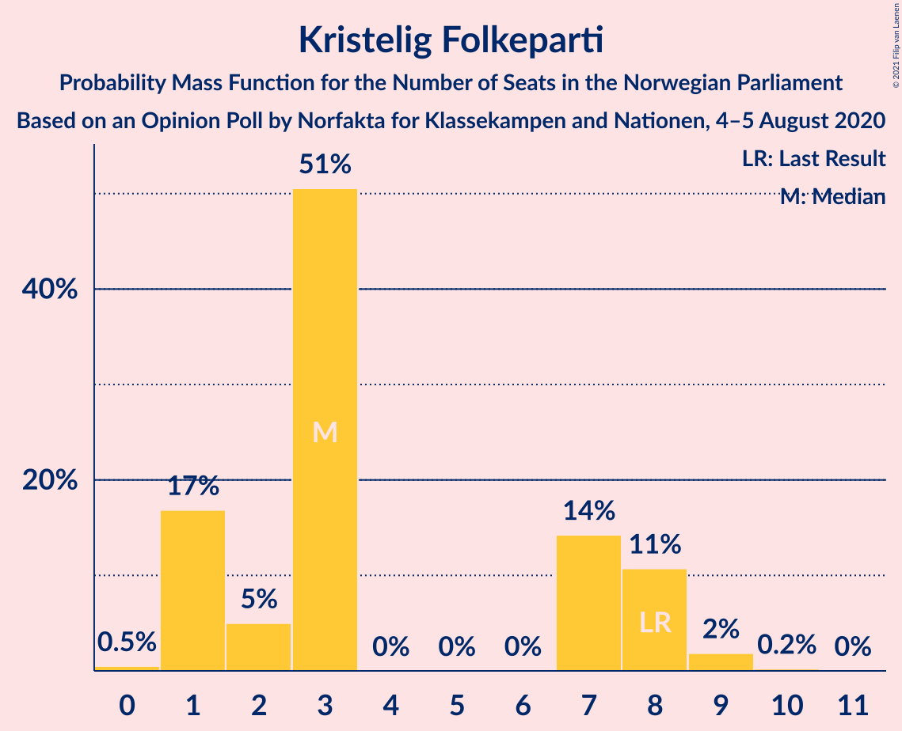
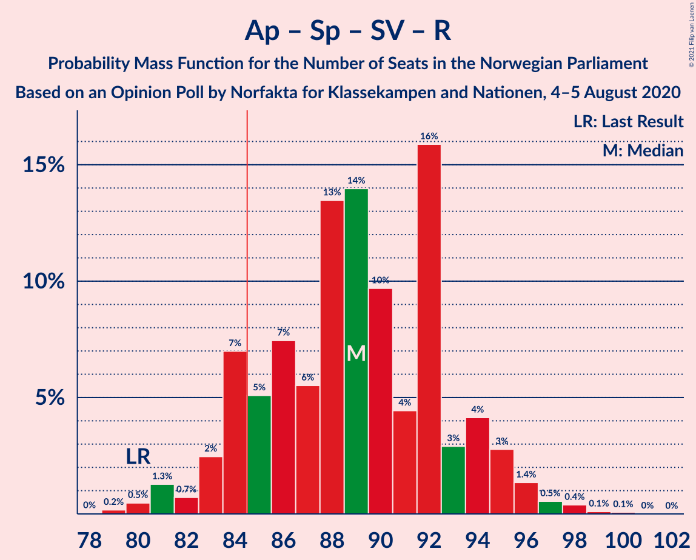
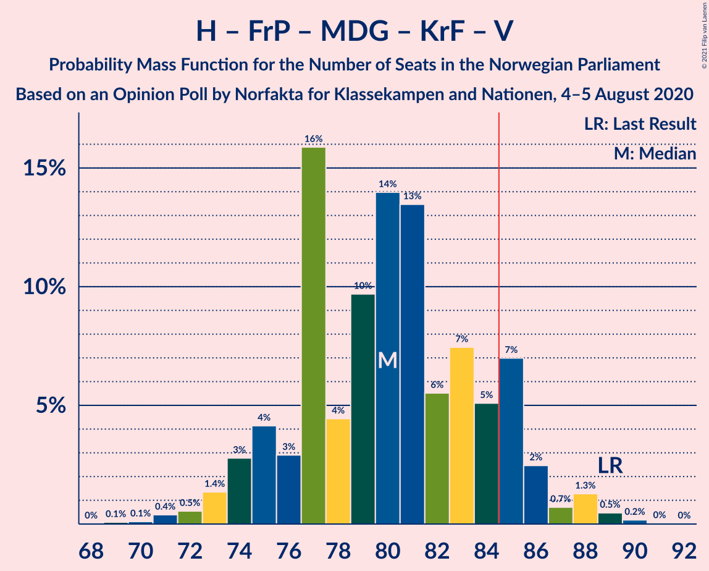
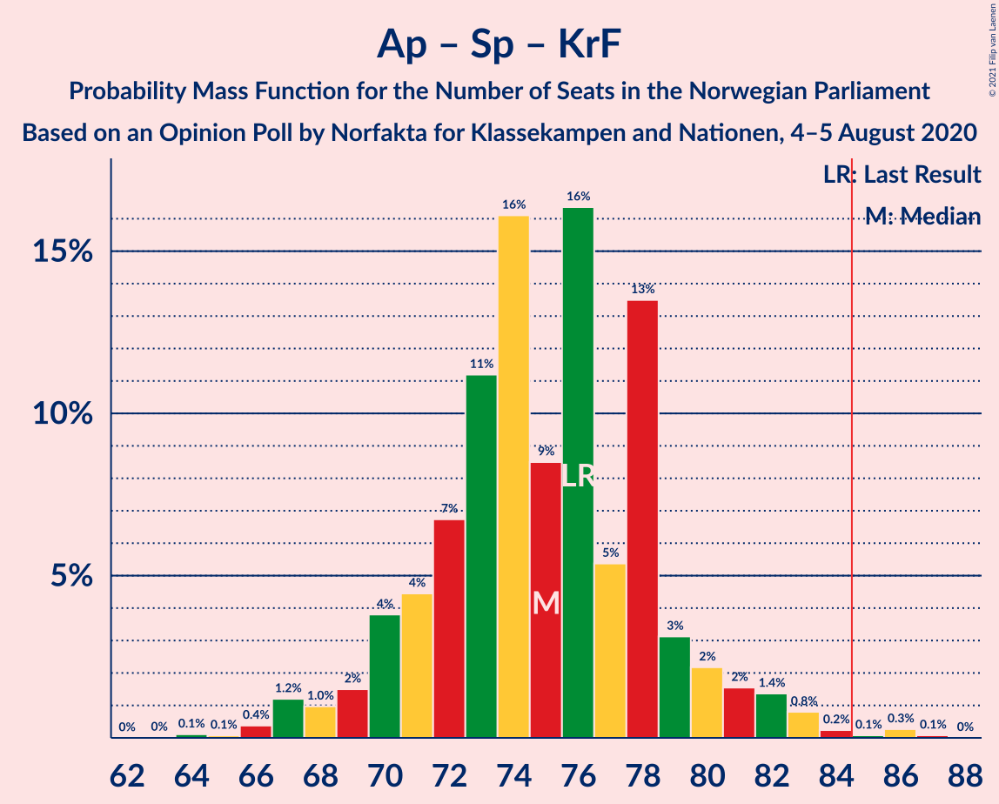
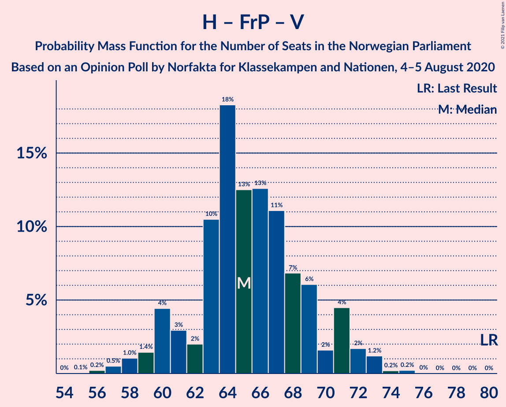
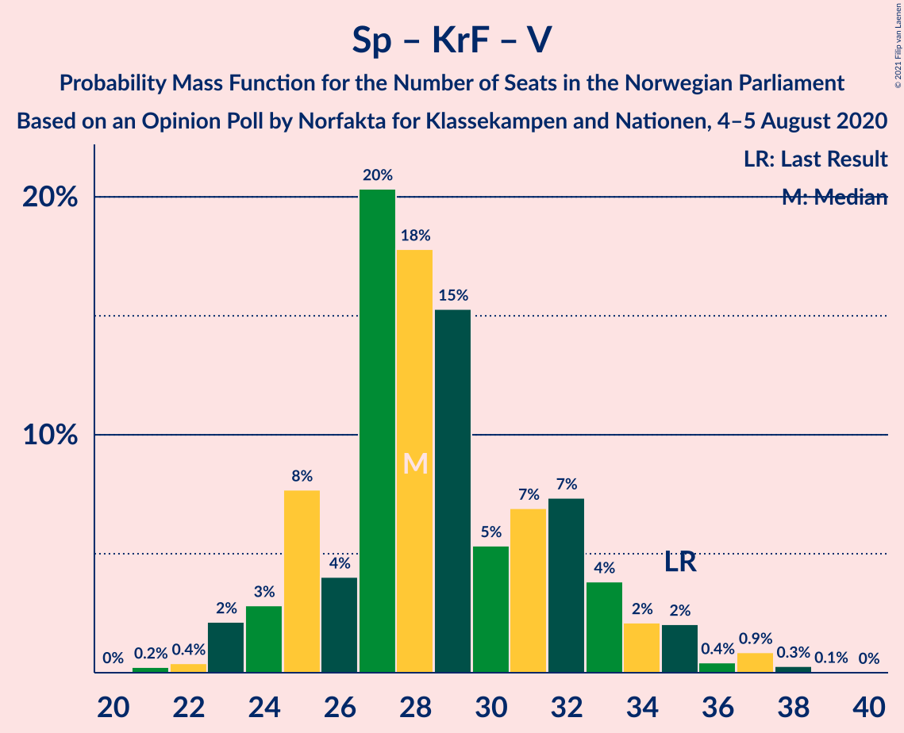

# Opinion Poll by Norfakta for Klassekampen and Nationen, 4–5 August 2020

<a href="#voting-intentions">Voting Intentions</a> | <a href="#seats">Seats</a> | <a href="#coalitions">Coalitions</a> | <a href="#technical-information">Technical Information</a>

## Voting Intentions

### Confidence Intervals

| Party | Last Result | Poll Result | 80% Confidence Interval | 90% Confidence Interval | 95% Confidence Interval | 99% Confidence Interval |
|:-----:|:-----------:|:-----------:|:-----------------------:|:-----------------------:|:-----------------------:|:-----------------------:|
| Arbeiderpartiet | 27.4% | 26.6% | 24.8–28.4% |24.3–28.9% |23.9–29.4% |23.1–30.3% |
| Høyre | 25.0% | 23.5% | 21.8–25.3% |21.4–25.8% |20.9–26.2% |20.2–27.1% |
| Senterpartiet | 10.3% | 13.2% | 11.9–14.6% |11.5–15.1% |11.2–15.4% |10.6–16.2% |
| Fremskrittspartiet | 15.2% | 12.5% | 11.2–13.9% |10.9–14.3% |10.6–14.7% |10.0–15.4% |
| Sosialistisk Venstreparti | 6.0% | 7.2% | 6.2–8.4% |6.0–8.7% |5.7–9.0% |5.3–9.6% |
| Miljøpartiet De Grønne | 3.2% | 6.1% | 5.2–7.2% |5.0–7.5% |4.8–7.8% |4.4–8.3% |
| Rødt | 2.4% | 4.1% | 3.4–5.0% |3.2–5.3% |3.0–5.5% |2.7–6.0% |
| Kristelig Folkeparti | 4.2% | 3.6% | 2.9–4.5% |2.8–4.7% |2.6–5.0% |2.3–5.4% |
| Venstre | 4.4% | 2.5% | 2.0–3.3% |1.8–3.5% |1.7–3.7% |1.5–4.1% |

*Note:* The poll result column reflects the actual value used in the calculations. Published results may vary slightly, and in addition be rounded to fewer digits.

## Seats

### Confidence Intervals

| Party | Last Result | Median | 80% Confidence Interval | 90% Confidence Interval | 95% Confidence Interval | 99% Confidence Interval |
|:-----:|:-----------:|:------:|:-----------------------:|:-----------------------:|:-----------------------:|:-----------------------:|
| <a href="#arbeiderpartiet">Arbeiderpartiet</a> | 49 | 48 | 44–52 |43–53 |42–54 |40–55 |
| <a href="#høyre">Høyre</a> | 45 | 41 | 37–46 |37–47 |36–47 |35–48 |
| <a href="#senterpartiet">Senterpartiet</a> | 19 | 23 | 20–25 |20–27 |19–28 |18–29 |
| <a href="#fremskrittspartiet">Fremskrittspartiet</a> | 27 | 23 | 20–26 |19–26 |19–27 |17–29 |
| <a href="#sosialistisk-venstreparti">Sosialistisk Venstreparti</a> | 11 | 12 | 11–14 |10–15 |10–15 |9–16 |
| <a href="#miljøpartiet-de-grønne">Miljøpartiet De Grønne</a> | 1 | 11 | 9–13 |9–13 |8–14 |8–15 |
| <a href="#rødt">Rødt</a> | 1 | 7 | 2–9 |2–9 |2–10 |1–11 |
| <a href="#kristelig-folkeparti">Kristelig Folkeparti</a> | 8 | 3 | 1–7 |1–8 |1–8 |0–9 |
| <a href="#venstre">Venstre</a> | 8 | 2 | 0–2 |0–2 |0–2 |0–7 |

### Arbeiderpartiet

*For a full overview of the results for this party, see the [Arbeiderpartiet](party-arbeiderpartiet.html) page.*

| Number of Seats | Probability | Accumulated | Special Marks |
|:---------------:|:-----------:|:-----------:|:-------------:|
| 40 | 0.5% | 100% |  |
| 41 | 1.2% | 99.5% |  |
| 42 | 1.3% | 98% |  |
| 43 | 4% | 97% |  |
| 44 | 8% | 93% |  |
| 45 | 11% | 86% |  |
| 46 | 11% | 75% |  |
| 47 | 13% | 64% |  |
| 48 | 7% | 50% | Median |
| 49 | 9% | 43% | Last Result |
| 50 | 2% | 34% |  |
| 51 | 9% | 32% |  |
| 52 | 15% | 23% |  |
| 53 | 4% | 8% |  |
| 54 | 3% | 4% |  |
| 55 | 0.2% | 0.7% |  |
| 56 | 0.3% | 0.5% |  |
| 57 | 0.1% | 0.2% |  |
| 58 | 0% | 0.1% |  |
| 59 | 0% | 0% |  |

### Høyre

*For a full overview of the results for this party, see the [Høyre](party-høyre.html) page.*

| Number of Seats | Probability | Accumulated | Special Marks |
|:---------------:|:-----------:|:-----------:|:-------------:|
| 33 | 0% | 100% |  |
| 34 | 0.3% | 99.9% |  |
| 35 | 0.5% | 99.7% |  |
| 36 | 3% | 99.1% |  |
| 37 | 8% | 97% |  |
| 38 | 3% | 88% |  |
| 39 | 3% | 85% |  |
| 40 | 7% | 82% |  |
| 41 | 32% | 74% | Median |
| 42 | 3% | 43% |  |
| 43 | 9% | 40% |  |
| 44 | 15% | 30% |  |
| 45 | 4% | 15% | Last Result |
| 46 | 4% | 11% |  |
| 47 | 6% | 7% |  |
| 48 | 0.4% | 0.8% |  |
| 49 | 0.2% | 0.4% |  |
| 50 | 0.1% | 0.2% |  |
| 51 | 0% | 0% |  |

### Senterpartiet

*For a full overview of the results for this party, see the [Senterpartiet](party-senterpartiet.html) page.*

| Number of Seats | Probability | Accumulated | Special Marks |
|:---------------:|:-----------:|:-----------:|:-------------:|
| 17 | 0.1% | 100% |  |
| 18 | 0.7% | 99.9% |  |
| 19 | 2% | 99.2% | Last Result |
| 20 | 10% | 97% |  |
| 21 | 9% | 87% |  |
| 22 | 11% | 79% |  |
| 23 | 37% | 68% | Median |
| 24 | 15% | 30% |  |
| 25 | 7% | 16% |  |
| 26 | 3% | 9% |  |
| 27 | 3% | 6% |  |
| 28 | 2% | 3% |  |
| 29 | 0.4% | 0.7% |  |
| 30 | 0.2% | 0.3% |  |
| 31 | 0% | 0.1% |  |
| 32 | 0.1% | 0.1% |  |
| 33 | 0% | 0% |  |

### Fremskrittspartiet

*For a full overview of the results for this party, see the [Fremskrittspartiet](party-fremskrittspartiet.html) page.*

| Number of Seats | Probability | Accumulated | Special Marks |
|:---------------:|:-----------:|:-----------:|:-------------:|
| 16 | 0.1% | 100% |  |
| 17 | 0.6% | 99.9% |  |
| 18 | 2% | 99.3% |  |
| 19 | 6% | 98% |  |
| 20 | 16% | 92% |  |
| 21 | 5% | 76% |  |
| 22 | 20% | 71% |  |
| 23 | 8% | 50% | Median |
| 24 | 14% | 42% |  |
| 25 | 10% | 28% |  |
| 26 | 14% | 18% |  |
| 27 | 3% | 4% | Last Result |
| 28 | 0.7% | 1.4% |  |
| 29 | 0.6% | 0.6% |  |
| 30 | 0% | 0% |  |

### Sosialistisk Venstreparti

*For a full overview of the results for this party, see the [Sosialistisk Venstreparti](party-sosialistiskvenstreparti.html) page.*

| Number of Seats | Probability | Accumulated | Special Marks |
|:---------------:|:-----------:|:-----------:|:-------------:|
| 8 | 0.1% | 100% |  |
| 9 | 2% | 99.9% |  |
| 10 | 6% | 98% |  |
| 11 | 14% | 93% | Last Result |
| 12 | 47% | 79% | Median |
| 13 | 11% | 32% |  |
| 14 | 15% | 21% |  |
| 15 | 4% | 6% |  |
| 16 | 1.4% | 2% |  |
| 17 | 0.3% | 0.4% |  |
| 18 | 0.1% | 0.2% |  |
| 19 | 0% | 0% |  |

### Miljøpartiet De Grønne

*For a full overview of the results for this party, see the [Miljøpartiet De Grønne](party-miljøpartietdegrønne.html) page.*

| Number of Seats | Probability | Accumulated | Special Marks |
|:---------------:|:-----------:|:-----------:|:-------------:|
| 1 | 0% | 100% | Last Result |
| 2 | 0% | 100% |  |
| 3 | 0% | 100% |  |
| 4 | 0% | 99.9% |  |
| 5 | 0% | 99.9% |  |
| 6 | 0% | 99.9% |  |
| 7 | 0.2% | 99.9% |  |
| 8 | 2% | 99.8% |  |
| 9 | 12% | 97% |  |
| 10 | 15% | 85% |  |
| 11 | 29% | 70% | Median |
| 12 | 27% | 40% |  |
| 13 | 10% | 13% |  |
| 14 | 3% | 4% |  |
| 15 | 0.7% | 0.8% |  |
| 16 | 0.1% | 0.1% |  |
| 17 | 0% | 0% |  |

### Rødt

*For a full overview of the results for this party, see the [Rødt](party-rødt.html) page.*

| Number of Seats | Probability | Accumulated | Special Marks |
|:---------------:|:-----------:|:-----------:|:-------------:|
| 1 | 2% | 100% | Last Result |
| 2 | 45% | 98% |  |
| 3 | 0% | 53% |  |
| 4 | 0% | 53% |  |
| 5 | 0% | 53% |  |
| 6 | 0.1% | 53% |  |
| 7 | 15% | 53% | Median |
| 8 | 17% | 38% |  |
| 9 | 18% | 21% |  |
| 10 | 2% | 3% |  |
| 11 | 0.6% | 0.6% |  |
| 12 | 0.1% | 0.1% |  |
| 13 | 0% | 0% |  |

### Kristelig Folkeparti

*For a full overview of the results for this party, see the [Kristelig Folkeparti](party-kristeligfolkeparti.html) page.*

| Number of Seats | Probability | Accumulated | Special Marks |
|:---------------:|:-----------:|:-----------:|:-------------:|
| 0 | 0.8% | 100% |  |
| 1 | 22% | 99.2% |  |
| 2 | 5% | 77% |  |
| 3 | 52% | 72% | Median |
| 4 | 0% | 21% |  |
| 5 | 0% | 21% |  |
| 6 | 0% | 21% |  |
| 7 | 14% | 21% |  |
| 8 | 5% | 7% | Last Result |
| 9 | 1.3% | 1.5% |  |
| 10 | 0.1% | 0.2% |  |
| 11 | 0% | 0% |  |

### Venstre

*For a full overview of the results for this party, see the [Venstre](party-venstre.html) page.*

| Number of Seats | Probability | Accumulated | Special Marks |
|:---------------:|:-----------:|:-----------:|:-------------:|
| 0 | 17% | 100% |  |
| 1 | 30% | 83% |  |
| 2 | 52% | 53% | Median |
| 3 | 0% | 0.7% |  |
| 4 | 0% | 0.7% |  |
| 5 | 0% | 0.7% |  |
| 6 | 0% | 0.7% |  |
| 7 | 0.5% | 0.7% |  |
| 8 | 0.2% | 0.2% | Last Result |
| 9 | 0% | 0% |  |

## Coalitions

### Confidence Intervals

| Coalition | Last Result | Median | Majority? | 80% Confidence Interval | 90% Confidence Interval | 95% Confidence Interval | 99% Confidence Interval |
|:---------:|:-----------:|:------:|:---------:|:-----------------------:|:-----------------------:|:-----------------------:|:-----------------------:|
| Arbeiderpartiet – Senterpartiet – Sosialistisk Venstreparti – Miljøpartiet De Grønne – Rødt | 81 | 100 | 100% | 95–104 | 94–106 | 93–107 | 90–109 |
| Arbeiderpartiet – Senterpartiet – Sosialistisk Venstreparti – Miljøpartiet De Grønne – Kristelig Folkeparti | 88 | 98 | 100% | 93–102 | 92–102 | 89–104 | 89–107 |
| Arbeiderpartiet – Senterpartiet – Sosialistisk Venstreparti – Miljøpartiet De Grønne | 80 | 94 | 99.4% | 90–99 | 88–99 | 86–100 | 84–103 |
| Høyre – Senterpartiet – Fremskrittspartiet – Kristelig Folkeparti – Venstre | 107 | 91 | 95% | 87–97 | 84–99 | 84–99 | 83–102 |
| Arbeiderpartiet – Senterpartiet – Sosialistisk Venstreparti – Rødt | 80 | 89 | 80% | 84–94 | 83–95 | 81–96 | 80–98 |
| Arbeiderpartiet – Senterpartiet – Miljøpartiet De Grønne – Kristelig Folkeparti | 77 | 86 | 54% | 81–90 | 80–91 | 77–92 | 76–95 |
| Arbeiderpartiet – Senterpartiet – Sosialistisk Venstreparti | 79 | 83 | 38% | 79–87 | 77–88 | 76–89 | 74–91 |
| Høyre – Fremskrittspartiet – Miljøpartiet De Grønne – Kristelig Folkeparti – Venstre | 89 | 80 | 20% | 75–85 | 74–86 | 73–88 | 71–89 |
| Arbeiderpartiet – Senterpartiet – Kristelig Folkeparti | 76 | 74 | 0.3% | 70–78 | 68–80 | 67–83 | 66–84 |
| Arbeiderpartiet – Senterpartiet | 68 | 70 | 0% | 67–75 | 65–76 | 64–76 | 63–79 |
| Høyre – Fremskrittspartiet – Kristelig Folkeparti – Venstre | 88 | 69 | 0% | 65–74 | 63–75 | 62–76 | 60–79 |
| Høyre – Fremskrittspartiet – Venstre | 80 | 65 | 0% | 61–71 | 59–72 | 58–73 | 56–75 |
| Høyre – Fremskrittspartiet | 72 | 64 | 0% | 59–70 | 57–71 | 57–71 | 55–73 |
| Arbeiderpartiet – Sosialistisk Venstreparti | 60 | 60 | 0% | 56–64 | 55–65 | 54–66 | 52–67 |
| Høyre – Kristelig Folkeparti – Venstre | 61 | 46 | 0% | 42–50 | 42–51 | 41–53 | 39–55 |
| Senterpartiet – Kristelig Folkeparti – Venstre | 35 | 28 | 0% | 24–32 | 23–33 | 23–35 | 21–37 |

### Arbeiderpartiet – Senterpartiet – Sosialistisk Venstreparti – Miljøpartiet De Grønne – Rødt

| Number of Seats | Probability | Accumulated | Special Marks |
|:---------------:|:-----------:|:-----------:|:-------------:|
| 81 | 0% | 100% | Last Result |
| 82 | 0% | 100% |  |
| 83 | 0% | 100% |  |
| 84 | 0% | 100% |  |
| 85 | 0% | 100% | Majority |
| 86 | 0% | 100% |  |
| 87 | 0% | 100% |  |
| 88 | 0% | 100% |  |
| 89 | 0.1% | 99.9% |  |
| 90 | 0.6% | 99.8% |  |
| 91 | 0.6% | 99.2% |  |
| 92 | 0.9% | 98.6% |  |
| 93 | 2% | 98% |  |
| 94 | 4% | 96% |  |
| 95 | 11% | 92% |  |
| 96 | 3% | 81% |  |
| 97 | 6% | 78% |  |
| 98 | 6% | 73% |  |
| 99 | 12% | 67% |  |
| 100 | 7% | 54% |  |
| 101 | 22% | 48% | Median |
| 102 | 6% | 25% |  |
| 103 | 6% | 20% |  |
| 104 | 5% | 14% |  |
| 105 | 1.3% | 9% |  |
| 106 | 4% | 8% |  |
| 107 | 3% | 5% |  |
| 108 | 1.2% | 2% |  |
| 109 | 0.2% | 0.6% |  |
| 110 | 0.3% | 0.4% |  |
| 111 | 0.1% | 0.1% |  |
| 112 | 0% | 0% |  |

### Arbeiderpartiet – Senterpartiet – Sosialistisk Venstreparti – Miljøpartiet De Grønne – Kristelig Folkeparti

| Number of Seats | Probability | Accumulated | Special Marks |
|:---------------:|:-----------:|:-----------:|:-------------:|
| 87 | 0% | 100% |  |
| 88 | 0.2% | 99.9% | Last Result |
| 89 | 2% | 99.7% |  |
| 90 | 0.8% | 97% |  |
| 91 | 0.8% | 97% |  |
| 92 | 2% | 96% |  |
| 93 | 7% | 94% |  |
| 94 | 6% | 87% |  |
| 95 | 5% | 80% |  |
| 96 | 16% | 75% |  |
| 97 | 7% | 59% | Median |
| 98 | 4% | 52% |  |
| 99 | 15% | 49% |  |
| 100 | 7% | 33% |  |
| 101 | 3% | 27% |  |
| 102 | 20% | 24% |  |
| 103 | 0.7% | 4% |  |
| 104 | 1.4% | 4% |  |
| 105 | 0.7% | 2% |  |
| 106 | 0.8% | 1.5% |  |
| 107 | 0.2% | 0.6% |  |
| 108 | 0.3% | 0.4% |  |
| 109 | 0.1% | 0.1% |  |
| 110 | 0% | 0% |  |

### Arbeiderpartiet – Senterpartiet – Sosialistisk Venstreparti – Miljøpartiet De Grønne

| Number of Seats | Probability | Accumulated | Special Marks |
|:---------------:|:-----------:|:-----------:|:-------------:|
| 80 | 0% | 100% | Last Result |
| 81 | 0% | 100% |  |
| 82 | 0% | 100% |  |
| 83 | 0.4% | 99.9% |  |
| 84 | 0.2% | 99.6% |  |
| 85 | 0.6% | 99.4% | Majority |
| 86 | 2% | 98.8% |  |
| 87 | 1.3% | 96% |  |
| 88 | 1.1% | 95% |  |
| 89 | 2% | 94% |  |
| 90 | 3% | 92% |  |
| 91 | 5% | 89% |  |
| 92 | 14% | 84% |  |
| 93 | 15% | 70% |  |
| 94 | 10% | 55% | Median |
| 95 | 7% | 45% |  |
| 96 | 4% | 38% |  |
| 97 | 7% | 33% |  |
| 98 | 4% | 26% |  |
| 99 | 18% | 21% |  |
| 100 | 0.8% | 3% |  |
| 101 | 1.0% | 2% |  |
| 102 | 0.6% | 1.4% |  |
| 103 | 0.6% | 0.9% |  |
| 104 | 0.2% | 0.3% |  |
| 105 | 0% | 0.1% |  |
| 106 | 0% | 0% |  |

### Høyre – Senterpartiet – Fremskrittspartiet – Kristelig Folkeparti – Venstre

| Number of Seats | Probability | Accumulated | Special Marks |
|:---------------:|:-----------:|:-----------:|:-------------:|
| 81 | 0.1% | 100% |  |
| 82 | 0.1% | 99.8% |  |
| 83 | 0.7% | 99.7% |  |
| 84 | 4% | 99.0% |  |
| 85 | 2% | 95% | Majority |
| 86 | 2% | 93% |  |
| 87 | 2% | 92% |  |
| 88 | 0.9% | 90% |  |
| 89 | 5% | 89% |  |
| 90 | 13% | 84% |  |
| 91 | 22% | 71% |  |
| 92 | 11% | 49% | Median |
| 93 | 4% | 38% |  |
| 94 | 4% | 34% |  |
| 95 | 7% | 30% |  |
| 96 | 4% | 23% |  |
| 97 | 9% | 18% |  |
| 98 | 3% | 9% |  |
| 99 | 3% | 6% |  |
| 100 | 0.8% | 2% |  |
| 101 | 0.8% | 2% |  |
| 102 | 0.3% | 0.8% |  |
| 103 | 0.4% | 0.5% |  |
| 104 | 0.1% | 0.1% |  |
| 105 | 0% | 0% |  |
| 106 | 0% | 0% |  |
| 107 | 0% | 0% | Last Result |

### Arbeiderpartiet – Senterpartiet – Sosialistisk Venstreparti – Rødt

| Number of Seats | Probability | Accumulated | Special Marks |
|:---------------:|:-----------:|:-----------:|:-------------:|
| 76 | 0% | 100% |  |
| 77 | 0% | 99.9% |  |
| 78 | 0.1% | 99.9% |  |
| 79 | 0.4% | 99.9% |  |
| 80 | 1.1% | 99.5% | Last Result |
| 81 | 1.2% | 98% |  |
| 82 | 1.2% | 97% |  |
| 83 | 4% | 96% |  |
| 84 | 12% | 92% |  |
| 85 | 3% | 80% | Majority |
| 86 | 7% | 78% |  |
| 87 | 7% | 71% |  |
| 88 | 6% | 64% |  |
| 89 | 20% | 58% |  |
| 90 | 12% | 38% | Median |
| 91 | 4% | 26% |  |
| 92 | 9% | 22% |  |
| 93 | 1.4% | 13% |  |
| 94 | 2% | 11% |  |
| 95 | 6% | 9% |  |
| 96 | 2% | 3% |  |
| 97 | 0.5% | 1.0% |  |
| 98 | 0.3% | 0.6% |  |
| 99 | 0.2% | 0.3% |  |
| 100 | 0.1% | 0.2% |  |
| 101 | 0% | 0% |  |

### Arbeiderpartiet – Senterpartiet – Miljøpartiet De Grønne – Kristelig Folkeparti

| Number of Seats | Probability | Accumulated | Special Marks |
|:---------------:|:-----------:|:-----------:|:-------------:|
| 74 | 0% | 100% |  |
| 75 | 0.2% | 99.9% |  |
| 76 | 0.4% | 99.7% |  |
| 77 | 2% | 99.4% | Last Result |
| 78 | 0.7% | 97% |  |
| 79 | 0.8% | 96% |  |
| 80 | 3% | 96% |  |
| 81 | 8% | 92% |  |
| 82 | 9% | 84% |  |
| 83 | 4% | 74% |  |
| 84 | 16% | 70% |  |
| 85 | 4% | 54% | Median, Majority |
| 86 | 8% | 51% |  |
| 87 | 13% | 43% |  |
| 88 | 5% | 30% |  |
| 89 | 2% | 25% |  |
| 90 | 16% | 23% |  |
| 91 | 3% | 7% |  |
| 92 | 2% | 4% |  |
| 93 | 1.1% | 2% |  |
| 94 | 0.4% | 1.2% |  |
| 95 | 0.6% | 0.8% |  |
| 96 | 0.1% | 0.2% |  |
| 97 | 0.1% | 0.1% |  |
| 98 | 0% | 0% |  |

### Arbeiderpartiet – Senterpartiet – Sosialistisk Venstreparti

| Number of Seats | Probability | Accumulated | Special Marks |
|:---------------:|:-----------:|:-----------:|:-------------:|
| 72 | 0% | 100% |  |
| 73 | 0.4% | 99.9% |  |
| 74 | 0.3% | 99.5% |  |
| 75 | 0.4% | 99.2% |  |
| 76 | 3% | 98.8% |  |
| 77 | 0.8% | 95% |  |
| 78 | 2% | 95% |  |
| 79 | 5% | 92% | Last Result |
| 80 | 5% | 87% |  |
| 81 | 10% | 83% |  |
| 82 | 12% | 73% |  |
| 83 | 16% | 61% | Median |
| 84 | 8% | 45% |  |
| 85 | 8% | 38% | Majority |
| 86 | 6% | 30% |  |
| 87 | 19% | 25% |  |
| 88 | 2% | 5% |  |
| 89 | 2% | 4% |  |
| 90 | 1.1% | 2% |  |
| 91 | 0.4% | 0.9% |  |
| 92 | 0.2% | 0.4% |  |
| 93 | 0.1% | 0.2% |  |
| 94 | 0% | 0.1% |  |
| 95 | 0% | 0% |  |

### Høyre – Fremskrittspartiet – Miljøpartiet De Grønne – Kristelig Folkeparti – Venstre

| Number of Seats | Probability | Accumulated | Special Marks |
|:---------------:|:-----------:|:-----------:|:-------------:|
| 69 | 0.1% | 100% |  |
| 70 | 0.2% | 99.8% |  |
| 71 | 0.3% | 99.7% |  |
| 72 | 0.5% | 99.4% |  |
| 73 | 2% | 99.0% |  |
| 74 | 6% | 97% |  |
| 75 | 2% | 91% |  |
| 76 | 1.4% | 89% |  |
| 77 | 9% | 87% |  |
| 78 | 4% | 78% |  |
| 79 | 12% | 74% |  |
| 80 | 20% | 62% | Median |
| 81 | 6% | 42% |  |
| 82 | 7% | 36% |  |
| 83 | 7% | 29% |  |
| 84 | 3% | 22% |  |
| 85 | 12% | 20% | Majority |
| 86 | 4% | 8% |  |
| 87 | 1.2% | 4% |  |
| 88 | 1.2% | 3% |  |
| 89 | 1.1% | 2% | Last Result |
| 90 | 0.4% | 0.5% |  |
| 91 | 0.1% | 0.1% |  |
| 92 | 0% | 0.1% |  |
| 93 | 0% | 0.1% |  |
| 94 | 0% | 0% |  |

### Arbeiderpartiet – Senterpartiet – Kristelig Folkeparti

| Number of Seats | Probability | Accumulated | Special Marks |
|:---------------:|:-----------:|:-----------:|:-------------:|
| 64 | 0.3% | 100% |  |
| 65 | 0.1% | 99.7% |  |
| 66 | 0.6% | 99.6% |  |
| 67 | 3% | 99.0% |  |
| 68 | 1.4% | 96% |  |
| 69 | 3% | 95% |  |
| 70 | 7% | 92% |  |
| 71 | 9% | 85% |  |
| 72 | 7% | 76% |  |
| 73 | 18% | 69% |  |
| 74 | 3% | 51% | Median |
| 75 | 7% | 48% |  |
| 76 | 7% | 40% | Last Result |
| 77 | 3% | 33% |  |
| 78 | 21% | 30% |  |
| 79 | 3% | 9% |  |
| 80 | 2% | 6% |  |
| 81 | 0.7% | 4% |  |
| 82 | 0.8% | 3% |  |
| 83 | 2% | 3% |  |
| 84 | 0.4% | 0.7% |  |
| 85 | 0.1% | 0.3% | Majority |
| 86 | 0% | 0.3% |  |
| 87 | 0.2% | 0.2% |  |
| 88 | 0% | 0% |  |

### Arbeiderpartiet – Senterpartiet

| Number of Seats | Probability | Accumulated | Special Marks |
|:---------------:|:-----------:|:-----------:|:-------------:|
| 59 | 0.1% | 100% |  |
| 60 | 0% | 99.9% |  |
| 61 | 0.1% | 99.9% |  |
| 62 | 0.2% | 99.8% |  |
| 63 | 0.9% | 99.6% |  |
| 64 | 3% | 98.7% |  |
| 65 | 2% | 95% |  |
| 66 | 4% | 94% |  |
| 67 | 4% | 90% |  |
| 68 | 5% | 86% | Last Result |
| 69 | 9% | 81% |  |
| 70 | 23% | 72% |  |
| 71 | 10% | 49% | Median |
| 72 | 5% | 39% |  |
| 73 | 5% | 34% |  |
| 74 | 5% | 29% |  |
| 75 | 17% | 24% |  |
| 76 | 5% | 7% |  |
| 77 | 1.2% | 2% |  |
| 78 | 0.3% | 1.1% |  |
| 79 | 0.4% | 0.8% |  |
| 80 | 0.2% | 0.3% |  |
| 81 | 0.1% | 0.1% |  |
| 82 | 0% | 0% |  |

### Høyre – Fremskrittspartiet – Kristelig Folkeparti – Venstre

| Number of Seats | Probability | Accumulated | Special Marks |
|:---------------:|:-----------:|:-----------:|:-------------:|
| 58 | 0.1% | 100% |  |
| 59 | 0.3% | 99.9% |  |
| 60 | 0.2% | 99.6% |  |
| 61 | 1.2% | 99.4% |  |
| 62 | 3% | 98% |  |
| 63 | 4% | 95% |  |
| 64 | 1.3% | 92% |  |
| 65 | 5% | 91% |  |
| 66 | 6% | 86% |  |
| 67 | 6% | 80% |  |
| 68 | 22% | 75% |  |
| 69 | 7% | 52% | Median |
| 70 | 12% | 46% |  |
| 71 | 6% | 33% |  |
| 72 | 6% | 27% |  |
| 73 | 3% | 22% |  |
| 74 | 11% | 19% |  |
| 75 | 4% | 8% |  |
| 76 | 2% | 4% |  |
| 77 | 0.9% | 2% |  |
| 78 | 0.6% | 1.4% |  |
| 79 | 0.6% | 0.8% |  |
| 80 | 0.1% | 0.2% |  |
| 81 | 0% | 0.1% |  |
| 82 | 0% | 0% |  |
| 83 | 0% | 0% |  |
| 84 | 0% | 0% |  |
| 85 | 0% | 0% | Majority |
| 86 | 0% | 0% |  |
| 87 | 0% | 0% |  |
| 88 | 0% | 0% | Last Result |

### Høyre – Fremskrittspartiet – Venstre

| Number of Seats | Probability | Accumulated | Special Marks |
|:---------------:|:-----------:|:-----------:|:-------------:|
| 54 | 0% | 100% |  |
| 55 | 0.1% | 99.9% |  |
| 56 | 0.4% | 99.8% |  |
| 57 | 0.3% | 99.4% |  |
| 58 | 2% | 99.1% |  |
| 59 | 3% | 97% |  |
| 60 | 2% | 94% |  |
| 61 | 6% | 92% |  |
| 62 | 2% | 87% |  |
| 63 | 12% | 84% |  |
| 64 | 5% | 72% |  |
| 65 | 18% | 67% |  |
| 66 | 4% | 48% | Median |
| 67 | 9% | 44% |  |
| 68 | 12% | 35% |  |
| 69 | 3% | 23% |  |
| 70 | 3% | 21% |  |
| 71 | 11% | 18% |  |
| 72 | 3% | 7% |  |
| 73 | 3% | 4% |  |
| 74 | 0.4% | 1.1% |  |
| 75 | 0.5% | 0.6% |  |
| 76 | 0.1% | 0.1% |  |
| 77 | 0% | 0% |  |
| 78 | 0% | 0% |  |
| 79 | 0% | 0% |  |
| 80 | 0% | 0% | Last Result |

### Høyre – Fremskrittspartiet

| Number of Seats | Probability | Accumulated | Special Marks |
|:---------------:|:-----------:|:-----------:|:-------------:|
| 53 | 0.1% | 100% |  |
| 54 | 0.2% | 99.9% |  |
| 55 | 0.3% | 99.7% |  |
| 56 | 0.7% | 99.4% |  |
| 57 | 4% | 98.6% |  |
| 58 | 2% | 95% |  |
| 59 | 3% | 93% |  |
| 60 | 4% | 89% |  |
| 61 | 13% | 85% |  |
| 62 | 5% | 72% |  |
| 63 | 16% | 67% |  |
| 64 | 4% | 51% | Median |
| 65 | 4% | 47% |  |
| 66 | 4% | 42% |  |
| 67 | 11% | 38% |  |
| 68 | 7% | 27% |  |
| 69 | 3% | 21% |  |
| 70 | 9% | 17% |  |
| 71 | 7% | 9% |  |
| 72 | 0.6% | 1.2% | Last Result |
| 73 | 0.6% | 0.7% |  |
| 74 | 0.1% | 0.1% |  |
| 75 | 0% | 0% |  |

### Arbeiderpartiet – Sosialistisk Venstreparti

| Number of Seats | Probability | Accumulated | Special Marks |
|:---------------:|:-----------:|:-----------:|:-------------:|
| 50 | 0.1% | 100% |  |
| 51 | 0.2% | 99.9% |  |
| 52 | 1.0% | 99.7% |  |
| 53 | 0.6% | 98.8% |  |
| 54 | 1.1% | 98% |  |
| 55 | 5% | 97% |  |
| 56 | 4% | 92% |  |
| 57 | 5% | 89% |  |
| 58 | 10% | 83% |  |
| 59 | 23% | 74% |  |
| 60 | 5% | 51% | Last Result, Median |
| 61 | 6% | 46% |  |
| 62 | 5% | 40% |  |
| 63 | 10% | 35% |  |
| 64 | 17% | 25% |  |
| 65 | 4% | 7% |  |
| 66 | 1.2% | 3% |  |
| 67 | 1.0% | 1.5% |  |
| 68 | 0.2% | 0.5% |  |
| 69 | 0.1% | 0.3% |  |
| 70 | 0.1% | 0.1% |  |
| 71 | 0% | 0.1% |  |
| 72 | 0% | 0% |  |

### Høyre – Kristelig Folkeparti – Venstre

| Number of Seats | Probability | Accumulated | Special Marks |
|:---------------:|:-----------:|:-----------:|:-------------:|
| 37 | 0.1% | 100% |  |
| 38 | 0.1% | 99.9% |  |
| 39 | 1.0% | 99.8% |  |
| 40 | 1.1% | 98.8% |  |
| 41 | 1.3% | 98% |  |
| 42 | 7% | 96% |  |
| 43 | 5% | 89% |  |
| 44 | 7% | 84% |  |
| 45 | 5% | 77% |  |
| 46 | 29% | 72% | Median |
| 47 | 5% | 43% |  |
| 48 | 14% | 37% |  |
| 49 | 4% | 23% |  |
| 50 | 13% | 19% |  |
| 51 | 1.5% | 5% |  |
| 52 | 1.0% | 4% |  |
| 53 | 1.1% | 3% |  |
| 54 | 0.8% | 2% |  |
| 55 | 0.6% | 1.0% |  |
| 56 | 0.3% | 0.4% |  |
| 57 | 0.1% | 0.1% |  |
| 58 | 0% | 0.1% |  |
| 59 | 0% | 0% |  |
| 60 | 0% | 0% |  |
| 61 | 0% | 0% | Last Result |

### Senterpartiet – Kristelig Folkeparti – Venstre

| Number of Seats | Probability | Accumulated | Special Marks |
|:---------------:|:-----------:|:-----------:|:-------------:|
| 21 | 0.5% | 100% |  |
| 22 | 0.4% | 99.5% |  |
| 23 | 5% | 99.0% |  |
| 24 | 5% | 94% |  |
| 25 | 13% | 89% |  |
| 26 | 5% | 76% |  |
| 27 | 18% | 71% |  |
| 28 | 22% | 53% | Median |
| 29 | 14% | 31% |  |
| 30 | 3% | 17% |  |
| 31 | 1.5% | 13% |  |
| 32 | 4% | 12% |  |
| 33 | 3% | 8% |  |
| 34 | 1.0% | 5% |  |
| 35 | 3% | 4% | Last Result |
| 36 | 0.7% | 1.4% |  |
| 37 | 0.5% | 0.8% |  |
| 38 | 0.2% | 0.3% |  |
| 39 | 0.1% | 0.1% |  |
| 40 | 0% | 0.1% |  |
| 41 | 0% | 0% |  |

## Technical Information

### Opinion Poll

+ **Polling firm:** Norfakta
+ **Commissioner(s):** Klassekampen and Nationen
+ **Fieldwork period:** 4–5 August 2020

### Calculations

+ **Sample size:** 1001
+ **Simulations done:** 524,288
+ **Error estimate:** 3.58%

