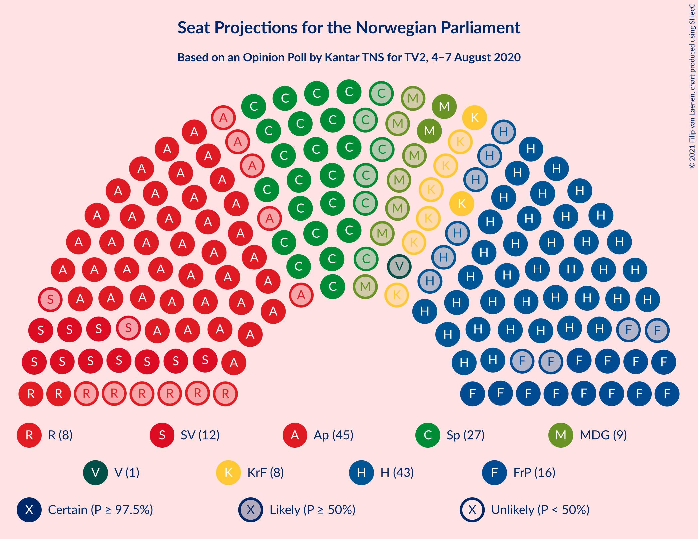
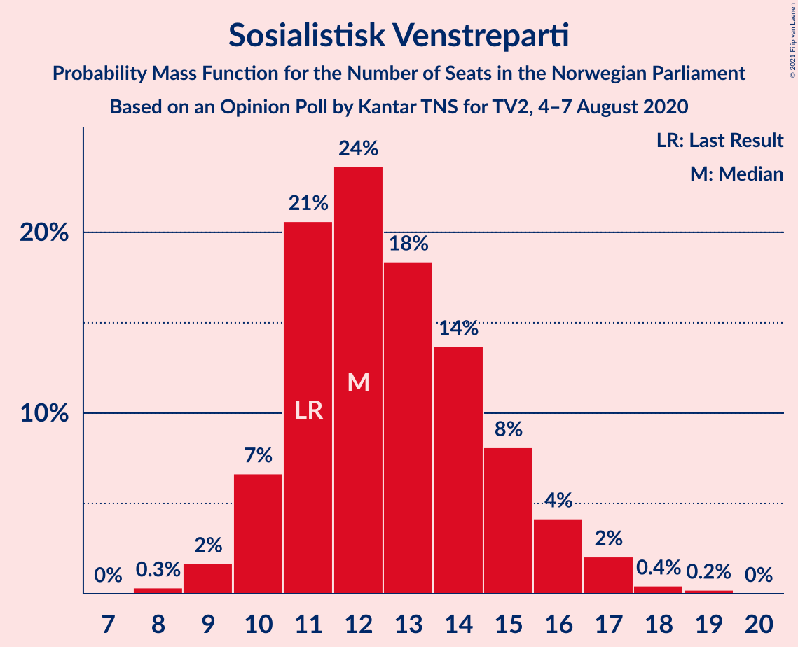

# Opinion Poll by Kantar TNS for TV2, 4–7 August 2020

<a href="#voting-intentions">Voting Intentions</a> | <a href="#seats">Seats</a> | <a href="#coalitions">Coalitions</a> | <a href="#technical-information">Technical Information</a>

## Voting Intentions

### Confidence Intervals

| Party | Last Result | Poll Result | 80% Confidence Interval | 90% Confidence Interval | 95% Confidence Interval | 99% Confidence Interval |
|:-----:|:-----------:|:-----------:|:-----------------------:|:-----------------------:|:-----------------------:|:-----------------------:|
| Arbeiderpartiet | 27.4% | 25.3% | 23.3–27.4% |22.8–28.0% |22.3–28.5% |21.4–29.5% |
| Høyre | 25.0% | 24.9% | 22.9–27.0% |22.4–27.6% |21.9–28.1% |21.0–29.1% |
| Senterpartiet | 10.3% | 14.9% | 13.3–16.7% |12.9–17.2% |12.5–17.6% |11.8–18.5% |
| Fremskrittspartiet | 15.2% | 9.3% | 8.1–10.8% |7.7–11.2% |7.4–11.6% |6.9–12.4% |
| Sosialistisk Venstreparti | 6.0% | 7.4% | 6.3–8.8% |6.0–9.2% |5.8–9.6% |5.3–10.3% |
| Miljøpartiet De Grønne | 3.2% | 5.2% | 4.3–6.4% |4.0–6.7% |3.8–7.0% |3.4–7.6% |
| Rødt | 2.4% | 4.5% | 3.7–5.7% |3.4–6.0% |3.2–6.3% |2.9–6.8% |
| Kristelig Folkeparti | 4.2% | 4.5% | 3.7–5.7% |3.4–6.0% |3.2–6.3% |2.9–6.8% |
| Venstre | 4.4% | 2.3% | 1.7–3.1% |1.5–3.4% |1.4–3.6% |1.2–4.1% |

*Note:* The poll result column reflects the actual value used in the calculations. Published results may vary slightly, and in addition be rounded to fewer digits.

## Seats

### Confidence Intervals

| Party | Last Result | Median | 80% Confidence Interval | 90% Confidence Interval | 95% Confidence Interval | 99% Confidence Interval |
|:-----:|:-----------:|:------:|:-----------------------:|:-----------------------:|:-----------------------:|:-----------------------:|
| <a href="#arbeiderpartiet">Arbeiderpartiet</a> | 49 | 45 | 42–51 |41–52 |40–53 |38–56 |
| <a href="#høyre">Høyre</a> | 45 | 43 | 39–48 |37–50 |37–51 |36–53 |
| <a href="#senterpartiet">Senterpartiet</a> | 19 | 27 | 22–33 |21–33 |21–35 |20–36 |
| <a href="#fremskrittspartiet">Fremskrittspartiet</a> | 27 | 16 | 13–18 |12–20 |12–21 |11–22 |
| <a href="#sosialistisk-venstreparti">Sosialistisk Venstreparti</a> | 11 | 12 | 11–15 |10–16 |10–17 |9–18 |
| <a href="#miljøpartiet-de-grønne">Miljøpartiet De Grønne</a> | 1 | 9 | 7–11 |3–11 |2–12 |1–13 |
| <a href="#rødt">Rødt</a> | 1 | 8 | 2–9 |2–10 |2–10 |1–12 |
| <a href="#kristelig-folkeparti">Kristelig Folkeparti</a> | 8 | 8 | 3–10 |3–10 |2–11 |1–12 |
| <a href="#venstre">Venstre</a> | 8 | 1 | 0–2 |0–2 |0–2 |0–6 |

### Arbeiderpartiet

*For a full overview of the results for this party, see the [Arbeiderpartiet](party-arbeiderpartiet.html) page.*

| Number of Seats | Probability | Accumulated | Special Marks |
|:---------------:|:-----------:|:-----------:|:-------------:|
| 36 | 0% | 100% |  |
| 37 | 0.1% | 99.9% |  |
| 38 | 0.4% | 99.9% |  |
| 39 | 0.5% | 99.5% |  |
| 40 | 3% | 98.9% |  |
| 41 | 5% | 96% |  |
| 42 | 13% | 92% |  |
| 43 | 3% | 79% |  |
| 44 | 11% | 76% |  |
| 45 | 16% | 65% | Median |
| 46 | 11% | 49% |  |
| 47 | 14% | 38% |  |
| 48 | 4% | 24% |  |
| 49 | 7% | 20% | Last Result |
| 50 | 3% | 13% |  |
| 51 | 4% | 10% |  |
| 52 | 2% | 6% |  |
| 53 | 2% | 4% |  |
| 54 | 0.9% | 2% |  |
| 55 | 0.3% | 1.5% |  |
| 56 | 0.7% | 1.1% |  |
| 57 | 0.3% | 0.4% |  |
| 58 | 0.1% | 0.1% |  |
| 59 | 0% | 0% |  |

### Høyre

*For a full overview of the results for this party, see the [Høyre](party-høyre.html) page.*

| Number of Seats | Probability | Accumulated | Special Marks |
|:---------------:|:-----------:|:-----------:|:-------------:|
| 34 | 0.1% | 100% |  |
| 35 | 0.3% | 99.8% |  |
| 36 | 0.8% | 99.5% |  |
| 37 | 5% | 98.8% |  |
| 38 | 3% | 94% |  |
| 39 | 3% | 91% |  |
| 40 | 11% | 88% |  |
| 41 | 7% | 77% |  |
| 42 | 14% | 69% |  |
| 43 | 9% | 55% | Median |
| 44 | 10% | 47% |  |
| 45 | 8% | 36% | Last Result |
| 46 | 8% | 28% |  |
| 47 | 8% | 20% |  |
| 48 | 3% | 12% |  |
| 49 | 3% | 9% |  |
| 50 | 3% | 6% |  |
| 51 | 1.3% | 3% |  |
| 52 | 0.7% | 2% |  |
| 53 | 0.4% | 0.8% |  |
| 54 | 0.1% | 0.4% |  |
| 55 | 0.3% | 0.3% |  |
| 56 | 0% | 0.1% |  |
| 57 | 0% | 0% |  |

### Senterpartiet

*For a full overview of the results for this party, see the [Senterpartiet](party-senterpartiet.html) page.*

| Number of Seats | Probability | Accumulated | Special Marks |
|:---------------:|:-----------:|:-----------:|:-------------:|
| 18 | 0.1% | 100% |  |
| 19 | 0.4% | 99.9% | Last Result |
| 20 | 2% | 99.5% |  |
| 21 | 3% | 98% |  |
| 22 | 11% | 95% |  |
| 23 | 3% | 84% |  |
| 24 | 11% | 81% |  |
| 25 | 11% | 69% |  |
| 26 | 7% | 59% |  |
| 27 | 10% | 52% | Median |
| 28 | 6% | 41% |  |
| 29 | 5% | 35% |  |
| 30 | 6% | 30% |  |
| 31 | 7% | 24% |  |
| 32 | 4% | 16% |  |
| 33 | 7% | 12% |  |
| 34 | 2% | 5% |  |
| 35 | 2% | 3% |  |
| 36 | 0.7% | 1.0% |  |
| 37 | 0.3% | 0.3% |  |
| 38 | 0.1% | 0.1% |  |
| 39 | 0% | 0% |  |

### Fremskrittspartiet

*For a full overview of the results for this party, see the [Fremskrittspartiet](party-fremskrittspartiet.html) page.*

| Number of Seats | Probability | Accumulated | Special Marks |
|:---------------:|:-----------:|:-----------:|:-------------:|
| 10 | 0.1% | 100% |  |
| 11 | 1.1% | 99.9% |  |
| 12 | 5% | 98.8% |  |
| 13 | 10% | 94% |  |
| 14 | 12% | 84% |  |
| 15 | 14% | 71% |  |
| 16 | 9% | 58% | Median |
| 17 | 23% | 48% |  |
| 18 | 16% | 25% |  |
| 19 | 3% | 9% |  |
| 20 | 2% | 5% |  |
| 21 | 3% | 3% |  |
| 22 | 0.4% | 0.8% |  |
| 23 | 0.3% | 0.4% |  |
| 24 | 0.1% | 0.1% |  |
| 25 | 0% | 0% |  |
| 26 | 0% | 0% |  |
| 27 | 0% | 0% | Last Result |

### Sosialistisk Venstreparti

*For a full overview of the results for this party, see the [Sosialistisk Venstreparti](party-sosialistiskvenstreparti.html) page.*

| Number of Seats | Probability | Accumulated | Special Marks |
|:---------------:|:-----------:|:-----------:|:-------------:|
| 8 | 0.3% | 100% |  |
| 9 | 2% | 99.6% |  |
| 10 | 7% | 98% |  |
| 11 | 21% | 91% | Last Result |
| 12 | 24% | 71% | Median |
| 13 | 18% | 47% |  |
| 14 | 14% | 29% |  |
| 15 | 8% | 15% |  |
| 16 | 4% | 7% |  |
| 17 | 2% | 3% |  |
| 18 | 0.4% | 0.7% |  |
| 19 | 0.2% | 0.2% |  |
| 20 | 0% | 0% |  |

### Miljøpartiet De Grønne

*For a full overview of the results for this party, see the [Miljøpartiet De Grønne](party-miljøpartietdegrønne.html) page.*

| Number of Seats | Probability | Accumulated | Special Marks |
|:---------------:|:-----------:|:-----------:|:-------------:|
| 1 | 0.6% | 100% | Last Result |
| 2 | 4% | 99.4% |  |
| 3 | 0.2% | 95% |  |
| 4 | 0% | 95% |  |
| 5 | 0% | 95% |  |
| 6 | 0.1% | 95% |  |
| 7 | 13% | 95% |  |
| 8 | 21% | 82% |  |
| 9 | 30% | 61% | Median |
| 10 | 18% | 31% |  |
| 11 | 7% | 12% |  |
| 12 | 4% | 5% |  |
| 13 | 0.6% | 0.8% |  |
| 14 | 0.2% | 0.2% |  |
| 15 | 0% | 0% |  |

### Rødt

*For a full overview of the results for this party, see the [Rødt](party-rødt.html) page.*

| Number of Seats | Probability | Accumulated | Special Marks |
|:---------------:|:-----------:|:-----------:|:-------------:|
| 1 | 0.7% | 100% | Last Result |
| 2 | 15% | 99.3% |  |
| 3 | 0% | 85% |  |
| 4 | 0% | 85% |  |
| 5 | 0% | 85% |  |
| 6 | 1.2% | 85% |  |
| 7 | 24% | 83% |  |
| 8 | 28% | 60% | Median |
| 9 | 23% | 32% |  |
| 10 | 7% | 9% |  |
| 11 | 2% | 2% |  |
| 12 | 0.5% | 0.6% |  |
| 13 | 0.1% | 0.1% |  |
| 14 | 0% | 0% |  |

### Kristelig Folkeparti

*For a full overview of the results for this party, see the [Kristelig Folkeparti](party-kristeligfolkeparti.html) page.*

| Number of Seats | Probability | Accumulated | Special Marks |
|:---------------:|:-----------:|:-----------:|:-------------:|
| 1 | 2% | 100% |  |
| 2 | 3% | 98% |  |
| 3 | 15% | 96% |  |
| 4 | 0% | 81% |  |
| 5 | 0% | 81% |  |
| 6 | 3% | 81% |  |
| 7 | 17% | 78% |  |
| 8 | 35% | 61% | Last Result, Median |
| 9 | 14% | 26% |  |
| 10 | 9% | 13% |  |
| 11 | 3% | 4% |  |
| 12 | 0.4% | 0.5% |  |
| 13 | 0.1% | 0.1% |  |
| 14 | 0% | 0% |  |

### Venstre

*For a full overview of the results for this party, see the [Venstre](party-venstre.html) page.*

| Number of Seats | Probability | Accumulated | Special Marks |
|:---------------:|:-----------:|:-----------:|:-------------:|
| 0 | 17% | 100% |  |
| 1 | 54% | 83% | Median |
| 2 | 29% | 30% |  |
| 3 | 0% | 0.5% |  |
| 4 | 0% | 0.5% |  |
| 5 | 0% | 0.5% |  |
| 6 | 0.1% | 0.5% |  |
| 7 | 0.3% | 0.4% |  |
| 8 | 0.1% | 0.1% | Last Result |
| 9 | 0% | 0% |  |

## Coalitions

### Confidence Intervals

| Coalition | Last Result | Median | Majority? | 80% Confidence Interval | 90% Confidence Interval | 95% Confidence Interval | 99% Confidence Interval |
|:---------:|:-----------:|:------:|:---------:|:-----------------------:|:-----------------------:|:-----------------------:|:-----------------------:|
| Arbeiderpartiet – Senterpartiet – Sosialistisk Venstreparti – Miljøpartiet De Grønne – Kristelig Folkeparti | 88 | 101 | 100% | 96–106 | 95–108 | 93–110 | 91–112 |
| Arbeiderpartiet – Senterpartiet – Sosialistisk Venstreparti – Miljøpartiet De Grønne – Rødt | 81 | 101 | 100% | 96–107 | 95–108 | 93–109 | 91–112 |
| Høyre – Senterpartiet – Fremskrittspartiet – Kristelig Folkeparti – Venstre | 107 | 95 | 99.4% | 89–100 | 88–101 | 87–103 | 84–106 |
| Arbeiderpartiet – Senterpartiet – Sosialistisk Venstreparti – Miljøpartiet De Grønne | 80 | 94 | 99.3% | 89–99 | 88–101 | 86–103 | 84–105 |
| Arbeiderpartiet – Senterpartiet – Sosialistisk Venstreparti – Rødt | 80 | 93 | 98% | 87–98 | 86–99 | 85–100 | 83–103 |
| Arbeiderpartiet – Senterpartiet – Miljøpartiet De Grønne – Kristelig Folkeparti | 77 | 89 | 83% | 83–94 | 82–96 | 80–97 | 77–99 |
| Arbeiderpartiet – Senterpartiet – Sosialistisk Venstreparti | 79 | 86 | 61% | 80–90 | 79–92 | 78–93 | 76–96 |
| Arbeiderpartiet – Senterpartiet – Kristelig Folkeparti | 76 | 80 | 16% | 74–85 | 73–87 | 72–88 | 68–90 |
| Høyre – Fremskrittspartiet – Miljøpartiet De Grønne – Kristelig Folkeparti – Venstre | 89 | 76 | 2% | 71–82 | 70–83 | 69–84 | 66–86 |
| Arbeiderpartiet – Senterpartiet | 68 | 73 | 0.1% | 68–78 | 66–79 | 65–81 | 63–83 |
| Høyre – Fremskrittspartiet – Kristelig Folkeparti – Venstre | 88 | 68 | 0% | 62–73 | 61–74 | 60–76 | 57–78 |
| Høyre – Fremskrittspartiet – Venstre | 80 | 60 | 0% | 56–65 | 54–67 | 53–68 | 51–70 |
| Høyre – Fremskrittspartiet | 72 | 59 | 0% | 54–64 | 53–66 | 51–67 | 50–69 |
| Arbeiderpartiet – Sosialistisk Venstreparti | 60 | 58 | 0% | 54–63 | 53–64 | 52–66 | 50–69 |
| Høyre – Kristelig Folkeparti – Venstre | 61 | 52 | 0% | 46–57 | 45–58 | 44–59 | 42–62 |
| Senterpartiet – Kristelig Folkeparti – Venstre | 35 | 35 | 0% | 30–41 | 28–43 | 27–44 | 25–46 |

### Arbeiderpartiet – Senterpartiet – Sosialistisk Venstreparti – Miljøpartiet De Grønne – Kristelig Folkeparti

| Number of Seats | Probability | Accumulated | Special Marks |
|:---------------:|:-----------:|:-----------:|:-------------:|
| 88 | 0% | 100% | Last Result |
| 89 | 0.1% | 99.9% |  |
| 90 | 0.2% | 99.8% |  |
| 91 | 0.5% | 99.7% |  |
| 92 | 0.7% | 99.2% |  |
| 93 | 2% | 98.6% |  |
| 94 | 2% | 97% |  |
| 95 | 2% | 95% |  |
| 96 | 4% | 93% |  |
| 97 | 9% | 89% |  |
| 98 | 13% | 80% |  |
| 99 | 3% | 67% |  |
| 100 | 5% | 64% |  |
| 101 | 11% | 59% | Median |
| 102 | 8% | 47% |  |
| 103 | 6% | 39% |  |
| 104 | 9% | 34% |  |
| 105 | 10% | 25% |  |
| 106 | 5% | 15% |  |
| 107 | 4% | 10% |  |
| 108 | 2% | 6% |  |
| 109 | 1.4% | 4% |  |
| 110 | 1.2% | 3% |  |
| 111 | 1.1% | 2% |  |
| 112 | 0.3% | 0.5% |  |
| 113 | 0.1% | 0.2% |  |
| 114 | 0.1% | 0.1% |  |
| 115 | 0% | 0% |  |

### Arbeiderpartiet – Senterpartiet – Sosialistisk Venstreparti – Miljøpartiet De Grønne – Rødt

| Number of Seats | Probability | Accumulated | Special Marks |
|:---------------:|:-----------:|:-----------:|:-------------:|
| 81 | 0% | 100% | Last Result |
| 82 | 0% | 100% |  |
| 83 | 0% | 100% |  |
| 84 | 0% | 100% |  |
| 85 | 0% | 100% | Majority |
| 86 | 0% | 100% |  |
| 87 | 0% | 100% |  |
| 88 | 0.1% | 100% |  |
| 89 | 0.1% | 99.9% |  |
| 90 | 0.1% | 99.8% |  |
| 91 | 0.4% | 99.7% |  |
| 92 | 0.7% | 99.4% |  |
| 93 | 1.3% | 98.6% |  |
| 94 | 1.2% | 97% |  |
| 95 | 3% | 96% |  |
| 96 | 10% | 93% |  |
| 97 | 5% | 84% |  |
| 98 | 6% | 79% |  |
| 99 | 6% | 74% |  |
| 100 | 13% | 68% |  |
| 101 | 7% | 55% | Median |
| 102 | 8% | 47% |  |
| 103 | 8% | 40% |  |
| 104 | 5% | 31% |  |
| 105 | 10% | 26% |  |
| 106 | 3% | 16% |  |
| 107 | 7% | 13% |  |
| 108 | 3% | 6% |  |
| 109 | 0.9% | 3% |  |
| 110 | 0.8% | 2% |  |
| 111 | 0.4% | 1.1% |  |
| 112 | 0.5% | 0.7% |  |
| 113 | 0.1% | 0.2% |  |
| 114 | 0.1% | 0.1% |  |
| 115 | 0.1% | 0.1% |  |
| 116 | 0% | 0% |  |

### Høyre – Senterpartiet – Fremskrittspartiet – Kristelig Folkeparti – Venstre

| Number of Seats | Probability | Accumulated | Special Marks |
|:---------------:|:-----------:|:-----------:|:-------------:|
| 80 | 0% | 100% |  |
| 81 | 0% | 99.9% |  |
| 82 | 0.2% | 99.9% |  |
| 83 | 0.2% | 99.7% |  |
| 84 | 0.2% | 99.6% |  |
| 85 | 0.9% | 99.4% | Majority |
| 86 | 0.9% | 98.5% |  |
| 87 | 2% | 98% |  |
| 88 | 6% | 96% |  |
| 89 | 3% | 90% |  |
| 90 | 3% | 87% |  |
| 91 | 6% | 85% |  |
| 92 | 6% | 79% |  |
| 93 | 5% | 72% |  |
| 94 | 13% | 67% |  |
| 95 | 15% | 54% | Median |
| 96 | 6% | 40% |  |
| 97 | 9% | 33% |  |
| 98 | 4% | 24% |  |
| 99 | 6% | 20% |  |
| 100 | 7% | 14% |  |
| 101 | 3% | 7% |  |
| 102 | 2% | 4% |  |
| 103 | 0.7% | 3% |  |
| 104 | 1.0% | 2% |  |
| 105 | 0.3% | 0.9% |  |
| 106 | 0.2% | 0.5% |  |
| 107 | 0.2% | 0.4% | Last Result |
| 108 | 0.2% | 0.2% |  |
| 109 | 0% | 0% |  |

### Arbeiderpartiet – Senterpartiet – Sosialistisk Venstreparti – Miljøpartiet De Grønne

| Number of Seats | Probability | Accumulated | Special Marks |
|:---------------:|:-----------:|:-----------:|:-------------:|
| 80 | 0% | 100% | Last Result |
| 81 | 0% | 100% |  |
| 82 | 0.1% | 99.9% |  |
| 83 | 0.1% | 99.9% |  |
| 84 | 0.5% | 99.8% |  |
| 85 | 0.7% | 99.3% | Majority |
| 86 | 1.1% | 98.6% |  |
| 87 | 1.5% | 97% |  |
| 88 | 4% | 96% |  |
| 89 | 10% | 92% |  |
| 90 | 4% | 82% |  |
| 91 | 10% | 78% |  |
| 92 | 5% | 69% |  |
| 93 | 9% | 64% | Median |
| 94 | 7% | 55% |  |
| 95 | 12% | 49% |  |
| 96 | 4% | 37% |  |
| 97 | 12% | 32% |  |
| 98 | 6% | 20% |  |
| 99 | 8% | 15% |  |
| 100 | 1.4% | 7% |  |
| 101 | 2% | 6% |  |
| 102 | 1.0% | 4% |  |
| 103 | 1.3% | 3% |  |
| 104 | 0.7% | 1.4% |  |
| 105 | 0.3% | 0.7% |  |
| 106 | 0.2% | 0.4% |  |
| 107 | 0.2% | 0.2% |  |
| 108 | 0% | 0% |  |

### Arbeiderpartiet – Senterpartiet – Sosialistisk Venstreparti – Rødt

| Number of Seats | Probability | Accumulated | Special Marks |
|:---------------:|:-----------:|:-----------:|:-------------:|
| 80 | 0.1% | 100% | Last Result |
| 81 | 0.1% | 99.9% |  |
| 82 | 0.2% | 99.8% |  |
| 83 | 0.7% | 99.6% |  |
| 84 | 1.1% | 98.9% |  |
| 85 | 1.5% | 98% | Majority |
| 86 | 4% | 96% |  |
| 87 | 8% | 92% |  |
| 88 | 3% | 84% |  |
| 89 | 5% | 82% |  |
| 90 | 8% | 76% |  |
| 91 | 10% | 69% |  |
| 92 | 6% | 59% | Median |
| 93 | 8% | 53% |  |
| 94 | 11% | 45% |  |
| 95 | 10% | 34% |  |
| 96 | 3% | 24% |  |
| 97 | 6% | 21% |  |
| 98 | 8% | 15% |  |
| 99 | 3% | 8% |  |
| 100 | 2% | 4% |  |
| 101 | 1.0% | 2% |  |
| 102 | 0.4% | 1.3% |  |
| 103 | 0.4% | 0.8% |  |
| 104 | 0.2% | 0.4% |  |
| 105 | 0.1% | 0.2% |  |
| 106 | 0.1% | 0.1% |  |
| 107 | 0% | 0% |  |

### Arbeiderpartiet – Senterpartiet – Miljøpartiet De Grønne – Kristelig Folkeparti

| Number of Seats | Probability | Accumulated | Special Marks |
|:---------------:|:-----------:|:-----------:|:-------------:|
| 75 | 0% | 100% |  |
| 76 | 0.2% | 99.9% |  |
| 77 | 0.5% | 99.8% | Last Result |
| 78 | 0.4% | 99.3% |  |
| 79 | 0.6% | 98.9% |  |
| 80 | 1.1% | 98% |  |
| 81 | 1.3% | 97% |  |
| 82 | 5% | 96% |  |
| 83 | 4% | 91% |  |
| 84 | 3% | 87% |  |
| 85 | 5% | 83% | Majority |
| 86 | 17% | 78% |  |
| 87 | 3% | 61% |  |
| 88 | 4% | 58% |  |
| 89 | 7% | 54% | Median |
| 90 | 9% | 47% |  |
| 91 | 11% | 39% |  |
| 92 | 10% | 28% |  |
| 93 | 7% | 18% |  |
| 94 | 3% | 11% |  |
| 95 | 2% | 8% |  |
| 96 | 1.4% | 5% |  |
| 97 | 2% | 4% |  |
| 98 | 1.0% | 2% |  |
| 99 | 0.8% | 1.3% |  |
| 100 | 0.2% | 0.4% |  |
| 101 | 0.2% | 0.2% |  |
| 102 | 0% | 0% |  |

### Arbeiderpartiet – Senterpartiet – Sosialistisk Venstreparti

| Number of Seats | Probability | Accumulated | Special Marks |
|:---------------:|:-----------:|:-----------:|:-------------:|
| 73 | 0% | 100% |  |
| 74 | 0.1% | 99.9% |  |
| 75 | 0.3% | 99.9% |  |
| 76 | 0.5% | 99.6% |  |
| 77 | 1.0% | 99.1% |  |
| 78 | 1.5% | 98% |  |
| 79 | 2% | 97% | Last Result |
| 80 | 6% | 94% |  |
| 81 | 7% | 88% |  |
| 82 | 8% | 81% |  |
| 83 | 5% | 72% |  |
| 84 | 6% | 67% | Median |
| 85 | 10% | 61% | Majority |
| 86 | 12% | 51% |  |
| 87 | 10% | 39% |  |
| 88 | 7% | 29% |  |
| 89 | 4% | 22% |  |
| 90 | 9% | 19% |  |
| 91 | 3% | 9% |  |
| 92 | 2% | 6% |  |
| 93 | 2% | 4% |  |
| 94 | 0.8% | 2% |  |
| 95 | 0.6% | 1.4% |  |
| 96 | 0.5% | 0.9% |  |
| 97 | 0.3% | 0.4% |  |
| 98 | 0.1% | 0.1% |  |
| 99 | 0% | 0% |  |

### Arbeiderpartiet – Senterpartiet – Kristelig Folkeparti

| Number of Seats | Probability | Accumulated | Special Marks |
|:---------------:|:-----------:|:-----------:|:-------------:|
| 67 | 0.1% | 100% |  |
| 68 | 0.4% | 99.9% |  |
| 69 | 0.3% | 99.4% |  |
| 70 | 0.6% | 99.1% |  |
| 71 | 0.7% | 98.5% |  |
| 72 | 1.5% | 98% |  |
| 73 | 2% | 96% |  |
| 74 | 5% | 94% |  |
| 75 | 4% | 89% |  |
| 76 | 3% | 84% | Last Result |
| 77 | 14% | 82% |  |
| 78 | 7% | 67% |  |
| 79 | 6% | 60% |  |
| 80 | 5% | 54% | Median |
| 81 | 12% | 49% |  |
| 82 | 8% | 37% |  |
| 83 | 4% | 29% |  |
| 84 | 9% | 25% |  |
| 85 | 6% | 16% | Majority |
| 86 | 4% | 9% |  |
| 87 | 1.3% | 5% |  |
| 88 | 2% | 4% |  |
| 89 | 1.3% | 2% |  |
| 90 | 0.8% | 1.2% |  |
| 91 | 0.2% | 0.4% |  |
| 92 | 0.1% | 0.2% |  |
| 93 | 0.1% | 0.1% |  |
| 94 | 0% | 0% |  |

### Høyre – Fremskrittspartiet – Miljøpartiet De Grønne – Kristelig Folkeparti – Venstre

| Number of Seats | Probability | Accumulated | Special Marks |
|:---------------:|:-----------:|:-----------:|:-------------:|
| 63 | 0.1% | 100% |  |
| 64 | 0.1% | 99.9% |  |
| 65 | 0.2% | 99.8% |  |
| 66 | 0.4% | 99.6% |  |
| 67 | 0.4% | 99.2% |  |
| 68 | 1.0% | 98.7% |  |
| 69 | 2% | 98% |  |
| 70 | 3% | 96% |  |
| 71 | 8% | 92% |  |
| 72 | 6% | 85% |  |
| 73 | 3% | 79% |  |
| 74 | 10% | 76% |  |
| 75 | 11% | 66% |  |
| 76 | 8% | 55% |  |
| 77 | 6% | 47% | Median |
| 78 | 10% | 41% |  |
| 79 | 8% | 31% |  |
| 80 | 5% | 24% |  |
| 81 | 3% | 18% |  |
| 82 | 8% | 16% |  |
| 83 | 4% | 8% |  |
| 84 | 1.5% | 4% |  |
| 85 | 1.1% | 2% | Majority |
| 86 | 0.7% | 1.1% |  |
| 87 | 0.2% | 0.4% |  |
| 88 | 0.1% | 0.2% |  |
| 89 | 0.1% | 0.1% | Last Result |
| 90 | 0% | 0% |  |

### Arbeiderpartiet – Senterpartiet

| Number of Seats | Probability | Accumulated | Special Marks |
|:---------------:|:-----------:|:-----------:|:-------------:|
| 61 | 0% | 100% |  |
| 62 | 0.2% | 99.9% |  |
| 63 | 0.5% | 99.8% |  |
| 64 | 1.0% | 99.3% |  |
| 65 | 1.3% | 98% |  |
| 66 | 3% | 97% |  |
| 67 | 4% | 94% |  |
| 68 | 3% | 90% | Last Result |
| 69 | 9% | 88% |  |
| 70 | 11% | 79% |  |
| 71 | 8% | 68% |  |
| 72 | 7% | 60% | Median |
| 73 | 8% | 53% |  |
| 74 | 11% | 45% |  |
| 75 | 10% | 35% |  |
| 76 | 6% | 25% |  |
| 77 | 6% | 18% |  |
| 78 | 5% | 13% |  |
| 79 | 3% | 8% |  |
| 80 | 0.9% | 4% |  |
| 81 | 2% | 3% |  |
| 82 | 0.8% | 2% |  |
| 83 | 0.3% | 0.7% |  |
| 84 | 0.3% | 0.4% |  |
| 85 | 0.1% | 0.1% | Majority |
| 86 | 0% | 0.1% |  |
| 87 | 0% | 0% |  |

### Høyre – Fremskrittspartiet – Kristelig Folkeparti – Venstre

| Number of Seats | Probability | Accumulated | Special Marks |
|:---------------:|:-----------:|:-----------:|:-------------:|
| 54 | 0.1% | 100% |  |
| 55 | 0.1% | 99.9% |  |
| 56 | 0.1% | 99.9% |  |
| 57 | 0.5% | 99.8% |  |
| 58 | 0.4% | 99.3% |  |
| 59 | 0.8% | 98.9% |  |
| 60 | 0.9% | 98% |  |
| 61 | 3% | 97% |  |
| 62 | 7% | 94% |  |
| 63 | 3% | 87% |  |
| 64 | 10% | 84% |  |
| 65 | 5% | 73% |  |
| 66 | 8% | 69% |  |
| 67 | 8% | 60% |  |
| 68 | 7% | 53% | Median |
| 69 | 13% | 45% |  |
| 70 | 6% | 32% |  |
| 71 | 6% | 26% |  |
| 72 | 5% | 21% |  |
| 73 | 10% | 16% |  |
| 74 | 3% | 7% |  |
| 75 | 1.2% | 4% |  |
| 76 | 1.3% | 3% |  |
| 77 | 0.7% | 1.4% |  |
| 78 | 0.4% | 0.6% |  |
| 79 | 0.1% | 0.3% |  |
| 80 | 0.1% | 0.2% |  |
| 81 | 0.1% | 0.1% |  |
| 82 | 0% | 0% |  |
| 83 | 0% | 0% |  |
| 84 | 0% | 0% |  |
| 85 | 0% | 0% | Majority |
| 86 | 0% | 0% |  |
| 87 | 0% | 0% |  |
| 88 | 0% | 0% | Last Result |

### Høyre – Fremskrittspartiet – Venstre

| Number of Seats | Probability | Accumulated | Special Marks |
|:---------------:|:-----------:|:-----------:|:-------------:|
| 49 | 0% | 100% |  |
| 50 | 0.3% | 99.9% |  |
| 51 | 0.9% | 99.7% |  |
| 52 | 0.6% | 98.8% |  |
| 53 | 3% | 98% |  |
| 54 | 1.4% | 95% |  |
| 55 | 3% | 94% |  |
| 56 | 11% | 91% |  |
| 57 | 4% | 80% |  |
| 58 | 7% | 77% |  |
| 59 | 11% | 70% |  |
| 60 | 10% | 59% | Median |
| 61 | 6% | 49% |  |
| 62 | 13% | 43% |  |
| 63 | 6% | 30% |  |
| 64 | 7% | 24% |  |
| 65 | 8% | 17% |  |
| 66 | 2% | 9% |  |
| 67 | 3% | 7% |  |
| 68 | 2% | 4% |  |
| 69 | 1.3% | 2% |  |
| 70 | 0.6% | 1.0% |  |
| 71 | 0.2% | 0.4% |  |
| 72 | 0.1% | 0.2% |  |
| 73 | 0.1% | 0.1% |  |
| 74 | 0% | 0.1% |  |
| 75 | 0% | 0% |  |
| 76 | 0% | 0% |  |
| 77 | 0% | 0% |  |
| 78 | 0% | 0% |  |
| 79 | 0% | 0% |  |
| 80 | 0% | 0% | Last Result |

### Høyre – Fremskrittspartiet

| Number of Seats | Probability | Accumulated | Special Marks |
|:---------------:|:-----------:|:-----------:|:-------------:|
| 48 | 0.1% | 100% |  |
| 49 | 0.3% | 99.9% |  |
| 50 | 0.7% | 99.6% |  |
| 51 | 2% | 98.9% |  |
| 52 | 2% | 97% |  |
| 53 | 1.4% | 95% |  |
| 54 | 5% | 94% |  |
| 55 | 8% | 89% |  |
| 56 | 5% | 81% |  |
| 57 | 6% | 76% |  |
| 58 | 11% | 70% |  |
| 59 | 12% | 59% | Median |
| 60 | 11% | 48% |  |
| 61 | 8% | 36% |  |
| 62 | 6% | 29% |  |
| 63 | 6% | 23% |  |
| 64 | 8% | 17% |  |
| 65 | 2% | 9% |  |
| 66 | 2% | 7% |  |
| 67 | 3% | 4% |  |
| 68 | 0.9% | 2% |  |
| 69 | 0.4% | 0.8% |  |
| 70 | 0.2% | 0.4% |  |
| 71 | 0.1% | 0.2% |  |
| 72 | 0% | 0.1% | Last Result |
| 73 | 0% | 0% |  |

### Arbeiderpartiet – Sosialistisk Venstreparti

| Number of Seats | Probability | Accumulated | Special Marks |
|:---------------:|:-----------:|:-----------:|:-------------:|
| 49 | 0.2% | 100% |  |
| 50 | 0.7% | 99.8% |  |
| 51 | 1.3% | 99.1% |  |
| 52 | 2% | 98% |  |
| 53 | 5% | 96% |  |
| 54 | 3% | 90% |  |
| 55 | 10% | 87% |  |
| 56 | 6% | 78% |  |
| 57 | 13% | 71% | Median |
| 58 | 17% | 58% |  |
| 59 | 8% | 41% |  |
| 60 | 6% | 33% | Last Result |
| 61 | 6% | 26% |  |
| 62 | 5% | 21% |  |
| 63 | 8% | 16% |  |
| 64 | 3% | 8% |  |
| 65 | 1.4% | 5% |  |
| 66 | 1.2% | 3% |  |
| 67 | 0.8% | 2% |  |
| 68 | 0.2% | 1.4% |  |
| 69 | 0.8% | 1.2% |  |
| 70 | 0.3% | 0.4% |  |
| 71 | 0.1% | 0.1% |  |
| 72 | 0% | 0% |  |

### Høyre – Kristelig Folkeparti – Venstre

| Number of Seats | Probability | Accumulated | Special Marks |
|:---------------:|:-----------:|:-----------:|:-------------:|
| 39 | 0% | 100% |  |
| 40 | 0% | 99.9% |  |
| 41 | 0.2% | 99.9% |  |
| 42 | 0.3% | 99.7% |  |
| 43 | 0.6% | 99.4% |  |
| 44 | 3% | 98.8% |  |
| 45 | 2% | 96% |  |
| 46 | 5% | 94% |  |
| 47 | 5% | 88% |  |
| 48 | 5% | 83% |  |
| 49 | 8% | 79% |  |
| 50 | 7% | 71% |  |
| 51 | 13% | 63% |  |
| 52 | 11% | 51% | Median |
| 53 | 7% | 40% |  |
| 54 | 5% | 33% |  |
| 55 | 6% | 28% |  |
| 56 | 12% | 22% |  |
| 57 | 3% | 10% |  |
| 58 | 2% | 7% |  |
| 59 | 3% | 5% |  |
| 60 | 0.8% | 2% |  |
| 61 | 0.3% | 1.1% | Last Result |
| 62 | 0.3% | 0.8% |  |
| 63 | 0.4% | 0.5% |  |
| 64 | 0.1% | 0.1% |  |
| 65 | 0% | 0.1% |  |
| 66 | 0% | 0% |  |

### Senterpartiet – Kristelig Folkeparti – Venstre

| Number of Seats | Probability | Accumulated | Special Marks |
|:---------------:|:-----------:|:-----------:|:-------------:|
| 23 | 0.1% | 100% |  |
| 24 | 0.1% | 99.9% |  |
| 25 | 0.6% | 99.8% |  |
| 26 | 0.8% | 99.2% |  |
| 27 | 1.1% | 98% |  |
| 28 | 2% | 97% |  |
| 29 | 3% | 95% |  |
| 30 | 5% | 92% |  |
| 31 | 10% | 87% |  |
| 32 | 3% | 77% |  |
| 33 | 9% | 74% |  |
| 34 | 11% | 65% |  |
| 35 | 7% | 54% | Last Result |
| 36 | 7% | 47% | Median |
| 37 | 8% | 40% |  |
| 38 | 7% | 32% |  |
| 39 | 5% | 25% |  |
| 40 | 8% | 21% |  |
| 41 | 3% | 13% |  |
| 42 | 4% | 10% |  |
| 43 | 3% | 6% |  |
| 44 | 1.4% | 3% |  |
| 45 | 1.1% | 2% |  |
| 46 | 0.5% | 0.8% |  |
| 47 | 0.2% | 0.3% |  |
| 48 | 0.1% | 0.1% |  |
| 49 | 0% | 0% |  |

## Technical Information

### Opinion Poll

+ **Polling firm:** Kantar TNS
+ **Commissioner(s):** TV2
+ **Fieldwork period:** 4–7 August 2020

### Calculations

+ **Sample size:** 752
+ **Simulations done:** 1,048,576
+ **Error estimate:** 2.33%

