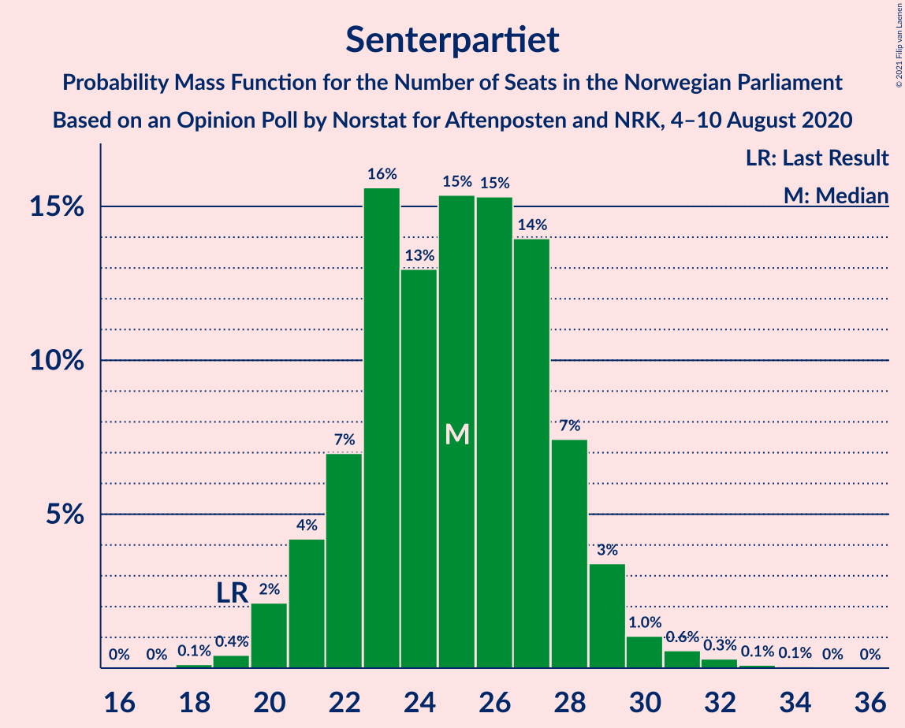
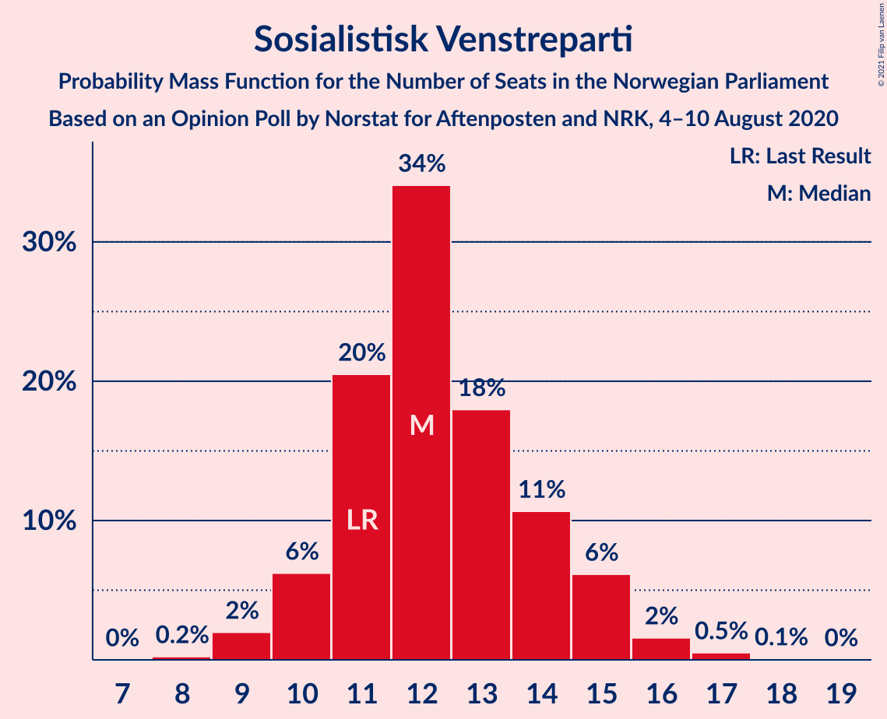
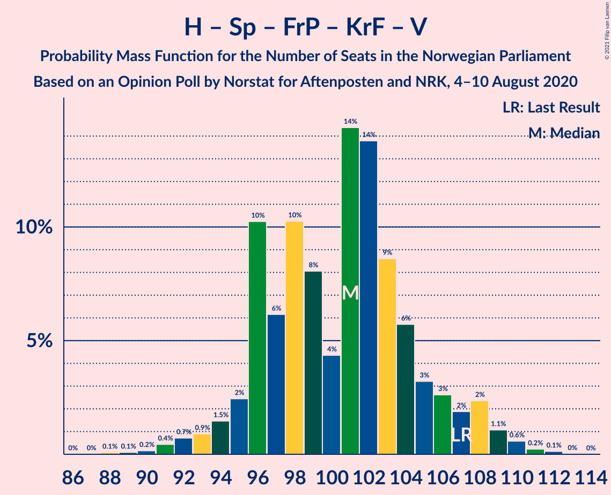
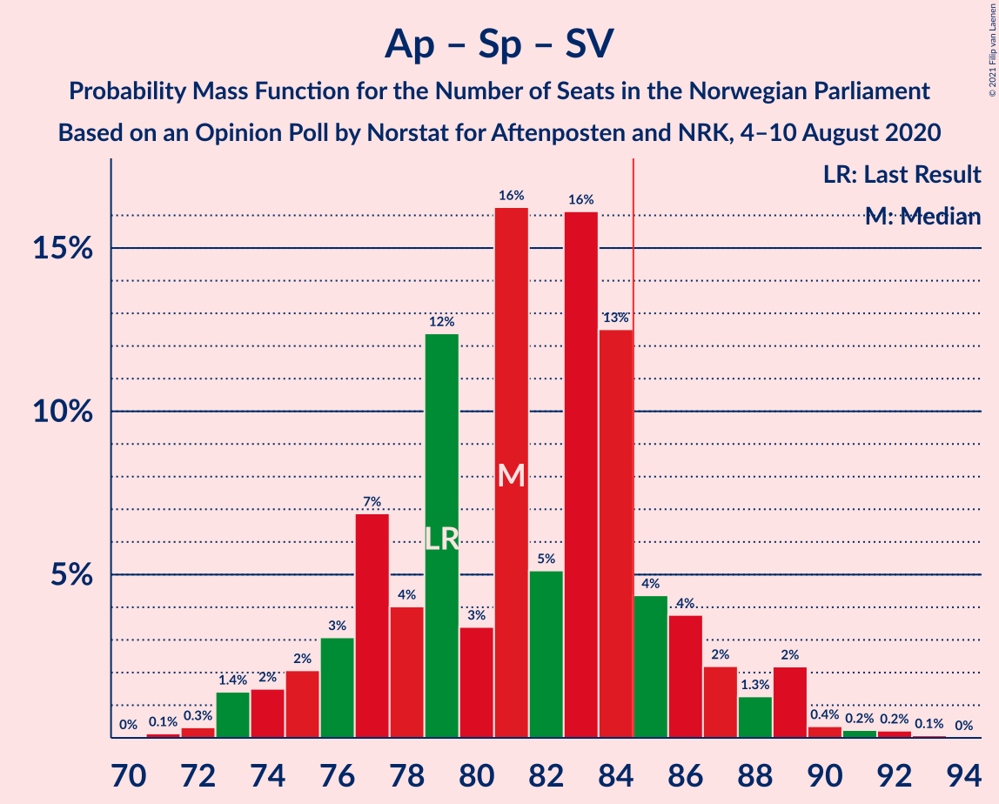
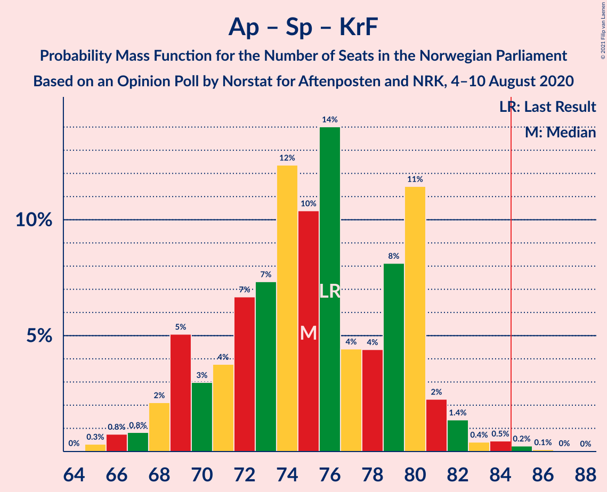

# Opinion Poll by Norstat for Aftenposten and NRK, 4–10 August 2020

<a href="#voting-intentions">Voting Intentions</a> | <a href="#seats">Seats</a> | <a href="#coalitions">Coalitions</a> | <a href="#technical-information">Technical Information</a>

## Voting Intentions

### Confidence Intervals

| Party | Last Result | Poll Result | 80% Confidence Interval | 90% Confidence Interval | 95% Confidence Interval | 99% Confidence Interval |
|:-----:|:-----------:|:-----------:|:-----------------------:|:-----------------------:|:-----------------------:|:-----------------------:|
| Høyre | 25.0% | 24.6% | 22.9–26.5% |22.4–27.0% |22.0–27.5% |21.2–28.4% |
| Arbeiderpartiet | 27.4% | 24.2% | 22.5–26.1% |22.0–26.6% |21.6–27.0% |20.8–28.0% |
| Senterpartiet | 10.3% | 13.8% | 12.4–15.3% |12.1–15.8% |11.7–16.1% |11.1–16.9% |
| Fremskrittspartiet | 15.2% | 12.9% | 11.6–14.4% |11.3–14.9% |11.0–15.2% |10.4–16.0% |
| Sosialistisk Venstreparti | 6.0% | 6.8% | 5.9–8.0% |5.6–8.3% |5.4–8.6% |5.0–9.2% |
| Miljøpartiet De Grønne | 3.2% | 4.7% | 4.0–5.7% |3.7–6.0% |3.6–6.3% |3.2–6.8% |
| Kristelig Folkeparti | 4.2% | 4.1% | 3.4–5.1% |3.2–5.3% |3.0–5.6% |2.7–6.1% |
| Rødt | 2.4% | 3.8% | 3.1–4.7% |2.9–5.0% |2.7–5.2% |2.5–5.7% |
| Venstre | 4.4% | 2.8% | 2.3–3.7% |2.1–3.9% |2.0–4.1% |1.7–4.5% |

*Note:* The poll result column reflects the actual value used in the calculations. Published results may vary slightly, and in addition be rounded to fewer digits.

## Seats

### Confidence Intervals

| Party | Last Result | Median | 80% Confidence Interval | 90% Confidence Interval | 95% Confidence Interval | 99% Confidence Interval |
|:-----:|:-----------:|:------:|:-----------------------:|:-----------------------:|:-----------------------:|:-----------------------:|
| <a href="#høyre">Høyre</a> | 45 | 43 | 41–48 |40–50 |38–50 |36–51 |
| <a href="#arbeiderpartiet">Arbeiderpartiet</a> | 49 | 45 | 41–47 |40–48 |40–49 |38–52 |
| <a href="#senterpartiet">Senterpartiet</a> | 19 | 26 | 22–28 |21–28 |20–29 |19–31 |
| <a href="#fremskrittspartiet">Fremskrittspartiet</a> | 27 | 23 | 21–27 |20–27 |19–27 |18–29 |
| <a href="#sosialistisk-venstreparti">Sosialistisk Venstreparti</a> | 11 | 12 | 11–14 |10–15 |10–15 |9–17 |
| <a href="#miljøpartiet-de-grønne">Miljøpartiet De Grønne</a> | 1 | 8 | 3–10 |2–11 |2–11 |1–12 |
| <a href="#kristelig-folkeparti">Kristelig Folkeparti</a> | 8 | 8 | 3–9 |3–9 |2–10 |1–11 |
| <a href="#rødt">Rødt</a> | 1 | 2 | 2–8 |1–9 |1–9 |1–10 |
| <a href="#venstre">Venstre</a> | 8 | 2 | 1–2 |1–2 |1–7 |0–8 |

### Høyre

*For a full overview of the results for this party, see the [Høyre](party-høyre.html) page.*

| Number of Seats | Probability | Accumulated | Special Marks |
|:---------------:|:-----------:|:-----------:|:-------------:|
| 35 | 0.1% | 100% |  |
| 36 | 0.4% | 99.9% |  |
| 37 | 0.7% | 99.5% |  |
| 38 | 2% | 98.8% |  |
| 39 | 1.4% | 97% |  |
| 40 | 3% | 96% |  |
| 41 | 8% | 92% |  |
| 42 | 20% | 84% |  |
| 43 | 18% | 65% | Median |
| 44 | 8% | 46% |  |
| 45 | 7% | 38% | Last Result |
| 46 | 15% | 31% |  |
| 47 | 3% | 16% |  |
| 48 | 5% | 14% |  |
| 49 | 4% | 9% |  |
| 50 | 4% | 5% |  |
| 51 | 0.7% | 1.2% |  |
| 52 | 0.3% | 0.5% |  |
| 53 | 0.1% | 0.2% |  |
| 54 | 0.1% | 0.1% |  |
| 55 | 0% | 0% |  |

### Arbeiderpartiet

*For a full overview of the results for this party, see the [Arbeiderpartiet](party-arbeiderpartiet.html) page.*

| Number of Seats | Probability | Accumulated | Special Marks |
|:---------------:|:-----------:|:-----------:|:-------------:|
| 36 | 0.1% | 100% |  |
| 37 | 0.1% | 99.9% |  |
| 38 | 1.0% | 99.8% |  |
| 39 | 1.3% | 98.8% |  |
| 40 | 4% | 98% |  |
| 41 | 7% | 93% |  |
| 42 | 6% | 86% |  |
| 43 | 22% | 80% |  |
| 44 | 8% | 59% |  |
| 45 | 32% | 51% | Median |
| 46 | 6% | 19% |  |
| 47 | 4% | 14% |  |
| 48 | 6% | 10% |  |
| 49 | 2% | 4% | Last Result |
| 50 | 1.0% | 2% |  |
| 51 | 0.2% | 0.9% |  |
| 52 | 0.5% | 0.6% |  |
| 53 | 0.1% | 0.2% |  |
| 54 | 0.1% | 0.1% |  |
| 55 | 0% | 0% |  |

### Senterpartiet

*For a full overview of the results for this party, see the [Senterpartiet](party-senterpartiet.html) page.*

| Number of Seats | Probability | Accumulated | Special Marks |
|:---------------:|:-----------:|:-----------:|:-------------:|
| 18 | 0.1% | 100% |  |
| 19 | 0.4% | 99.9% | Last Result |
| 20 | 3% | 99.5% |  |
| 21 | 4% | 96% |  |
| 22 | 6% | 92% |  |
| 23 | 10% | 86% |  |
| 24 | 11% | 76% |  |
| 25 | 12% | 65% |  |
| 26 | 19% | 53% | Median |
| 27 | 21% | 34% |  |
| 28 | 9% | 13% |  |
| 29 | 2% | 4% |  |
| 30 | 1.0% | 2% |  |
| 31 | 0.6% | 1.1% |  |
| 32 | 0.2% | 0.4% |  |
| 33 | 0.1% | 0.2% |  |
| 34 | 0.1% | 0.1% |  |
| 35 | 0% | 0% |  |

### Fremskrittspartiet

*For a full overview of the results for this party, see the [Fremskrittspartiet](party-fremskrittspartiet.html) page.*

| Number of Seats | Probability | Accumulated | Special Marks |
|:---------------:|:-----------:|:-----------:|:-------------:|
| 17 | 0.2% | 100% |  |
| 18 | 0.9% | 99.7% |  |
| 19 | 2% | 98.9% |  |
| 20 | 3% | 97% |  |
| 21 | 5% | 94% |  |
| 22 | 18% | 89% |  |
| 23 | 31% | 71% | Median |
| 24 | 10% | 40% |  |
| 25 | 9% | 30% |  |
| 26 | 8% | 21% |  |
| 27 | 11% | 13% | Last Result |
| 28 | 1.0% | 2% |  |
| 29 | 0.6% | 0.9% |  |
| 30 | 0.2% | 0.3% |  |
| 31 | 0.1% | 0.2% |  |
| 32 | 0% | 0% |  |

### Sosialistisk Venstreparti

*For a full overview of the results for this party, see the [Sosialistisk Venstreparti](party-sosialistiskvenstreparti.html) page.*

| Number of Seats | Probability | Accumulated | Special Marks |
|:---------------:|:-----------:|:-----------:|:-------------:|
| 8 | 0.3% | 100% |  |
| 9 | 2% | 99.7% |  |
| 10 | 5% | 98% |  |
| 11 | 20% | 92% | Last Result |
| 12 | 33% | 72% | Median |
| 13 | 24% | 39% |  |
| 14 | 7% | 14% |  |
| 15 | 5% | 7% |  |
| 16 | 2% | 2% |  |
| 17 | 0.5% | 0.6% |  |
| 18 | 0.1% | 0.1% |  |
| 19 | 0% | 0% |  |

### Miljøpartiet De Grønne

*For a full overview of the results for this party, see the [Miljøpartiet De Grønne](party-miljøpartietdegrønne.html) page.*

| Number of Seats | Probability | Accumulated | Special Marks |
|:---------------:|:-----------:|:-----------:|:-------------:|
| 1 | 2% | 100% | Last Result |
| 2 | 5% | 98% |  |
| 3 | 6% | 93% |  |
| 4 | 0.1% | 88% |  |
| 5 | 0% | 87% |  |
| 6 | 0% | 87% |  |
| 7 | 6% | 87% |  |
| 8 | 32% | 81% | Median |
| 9 | 21% | 49% |  |
| 10 | 21% | 28% |  |
| 11 | 5% | 7% |  |
| 12 | 2% | 2% |  |
| 13 | 0.2% | 0.2% |  |
| 14 | 0% | 0% |  |

### Kristelig Folkeparti

*For a full overview of the results for this party, see the [Kristelig Folkeparti](party-kristeligfolkeparti.html) page.*

| Number of Seats | Probability | Accumulated | Special Marks |
|:---------------:|:-----------:|:-----------:|:-------------:|
| 1 | 1.4% | 100% |  |
| 2 | 3% | 98.6% |  |
| 3 | 28% | 95% |  |
| 4 | 0% | 67% |  |
| 5 | 0% | 67% |  |
| 6 | 0% | 67% |  |
| 7 | 15% | 67% |  |
| 8 | 41% | 53% | Last Result, Median |
| 9 | 6% | 11% |  |
| 10 | 4% | 5% |  |
| 11 | 0.3% | 0.5% |  |
| 12 | 0.2% | 0.2% |  |
| 13 | 0% | 0% |  |

### Rødt

*For a full overview of the results for this party, see the [Rødt](party-rødt.html) page.*

| Number of Seats | Probability | Accumulated | Special Marks |
|:---------------:|:-----------:|:-----------:|:-------------:|
| 1 | 8% | 100% | Last Result |
| 2 | 64% | 92% | Median |
| 3 | 0% | 28% |  |
| 4 | 0% | 28% |  |
| 5 | 0% | 28% |  |
| 6 | 0.1% | 28% |  |
| 7 | 10% | 28% |  |
| 8 | 12% | 19% |  |
| 9 | 6% | 7% |  |
| 10 | 0.6% | 0.7% |  |
| 11 | 0.1% | 0.1% |  |
| 12 | 0% | 0% |  |

### Venstre

*For a full overview of the results for this party, see the [Venstre](party-venstre.html) page.*

| Number of Seats | Probability | Accumulated | Special Marks |
|:---------------:|:-----------:|:-----------:|:-------------:|
| 0 | 1.4% | 100% |  |
| 1 | 31% | 98.6% |  |
| 2 | 65% | 68% | Median |
| 3 | 0.1% | 3% |  |
| 4 | 0% | 3% |  |
| 5 | 0% | 3% |  |
| 6 | 0.1% | 3% |  |
| 7 | 2% | 3% |  |
| 8 | 0.9% | 1.0% | Last Result |
| 9 | 0.1% | 0.1% |  |
| 10 | 0% | 0% |  |

## Coalitions

### Confidence Intervals

| Coalition | Last Result | Median | Majority? | 80% Confidence Interval | 90% Confidence Interval | 95% Confidence Interval | 99% Confidence Interval |
|:---------:|:-----------:|:------:|:---------:|:-----------------------:|:-----------------------:|:-----------------------:|:-----------------------:|
| Høyre – Senterpartiet – Fremskrittspartiet – Kristelig Folkeparti – Venstre | 107 | 101 | 100% | 96–105 | 95–108 | 94–108 | 91–111 |
| Arbeiderpartiet – Senterpartiet – Sosialistisk Venstreparti – Miljøpartiet De Grønne – Kristelig Folkeparti | 88 | 96 | 99.7% | 90–100 | 89–102 | 87–102 | 86–104 |
| Arbeiderpartiet – Senterpartiet – Sosialistisk Venstreparti – Miljøpartiet De Grønne – Rødt | 81 | 94 | 99.1% | 89–98 | 87–100 | 86–100 | 84–103 |
| Arbeiderpartiet – Senterpartiet – Sosialistisk Venstreparti – Miljøpartiet De Grønne | 80 | 91 | 88% | 84–93 | 83–95 | 81–97 | 79–99 |
| Arbeiderpartiet – Senterpartiet – Sosialistisk Venstreparti – Rødt | 80 | 85 | 63% | 81–91 | 80–92 | 79–93 | 77–95 |
| Arbeiderpartiet – Senterpartiet – Miljøpartiet De Grønne – Kristelig Folkeparti | 77 | 84 | 45% | 78–88 | 77–89 | 76–90 | 73–92 |
| Høyre – Fremskrittspartiet – Miljøpartiet De Grønne – Kristelig Folkeparti – Venstre | 89 | 84 | 37% | 78–88 | 77–89 | 76–90 | 74–92 |
| Arbeiderpartiet – Senterpartiet – Sosialistisk Venstreparti | 79 | 82 | 14% | 77–86 | 76–88 | 75–89 | 72–91 |
| Høyre – Fremskrittspartiet – Kristelig Folkeparti – Venstre | 88 | 75 | 0.9% | 71–80 | 69–82 | 69–83 | 66–85 |
| Arbeiderpartiet – Senterpartiet – Kristelig Folkeparti | 76 | 75 | 0.4% | 70–80 | 69–81 | 68–82 | 66–84 |
| Høyre – Fremskrittspartiet – Venstre | 80 | 69 | 0% | 66–74 | 64–75 | 63–77 | 61–78 |
| Arbeiderpartiet – Senterpartiet | 68 | 70 | 0% | 65–73 | 64–75 | 63–76 | 61–77 |
| Høyre – Fremskrittspartiet | 72 | 67 | 0% | 64–72 | 62–74 | 61–74 | 59–77 |
| Arbeiderpartiet – Sosialistisk Venstreparti | 60 | 57 | 0% | 53–60 | 51–61 | 50–62 | 49–64 |
| Høyre – Kristelig Folkeparti – Venstre | 61 | 52 | 0% | 48–56 | 47–58 | 46–59 | 43–61 |
| Senterpartiet – Kristelig Folkeparti – Venstre | 35 | 33 | 0% | 29–37 | 27–38 | 27–40 | 25–42 |

### Høyre – Senterpartiet – Fremskrittspartiet – Kristelig Folkeparti – Venstre

| Number of Seats | Probability | Accumulated | Special Marks |
|:---------------:|:-----------:|:-----------:|:-------------:|
| 88 | 0.1% | 100% |  |
| 89 | 0.1% | 99.9% |  |
| 90 | 0.2% | 99.8% |  |
| 91 | 0.3% | 99.6% |  |
| 92 | 0.6% | 99.3% |  |
| 93 | 0.4% | 98.6% |  |
| 94 | 2% | 98% |  |
| 95 | 3% | 97% |  |
| 96 | 4% | 94% |  |
| 97 | 7% | 90% |  |
| 98 | 7% | 83% |  |
| 99 | 7% | 77% |  |
| 100 | 5% | 70% |  |
| 101 | 19% | 65% |  |
| 102 | 21% | 46% | Median |
| 103 | 10% | 25% |  |
| 104 | 4% | 15% |  |
| 105 | 3% | 11% |  |
| 106 | 2% | 8% |  |
| 107 | 0.9% | 6% | Last Result |
| 108 | 3% | 5% |  |
| 109 | 0.8% | 2% |  |
| 110 | 0.6% | 1.2% |  |
| 111 | 0.3% | 0.6% |  |
| 112 | 0.2% | 0.2% |  |
| 113 | 0% | 0% |  |

### Arbeiderpartiet – Senterpartiet – Sosialistisk Venstreparti – Miljøpartiet De Grønne – Kristelig Folkeparti

| Number of Seats | Probability | Accumulated | Special Marks |
|:---------------:|:-----------:|:-----------:|:-------------:|
| 83 | 0% | 100% |  |
| 84 | 0.2% | 99.9% |  |
| 85 | 0.2% | 99.7% | Majority |
| 86 | 0.3% | 99.6% |  |
| 87 | 3% | 99.3% |  |
| 88 | 0.8% | 97% | Last Result |
| 89 | 2% | 96% |  |
| 90 | 5% | 94% |  |
| 91 | 4% | 89% |  |
| 92 | 5% | 85% |  |
| 93 | 7% | 80% |  |
| 94 | 7% | 73% |  |
| 95 | 11% | 66% |  |
| 96 | 8% | 56% |  |
| 97 | 9% | 48% |  |
| 98 | 3% | 39% |  |
| 99 | 3% | 36% | Median |
| 100 | 26% | 33% |  |
| 101 | 2% | 8% |  |
| 102 | 4% | 5% |  |
| 103 | 1.1% | 2% |  |
| 104 | 0.5% | 0.6% |  |
| 105 | 0.1% | 0.2% |  |
| 106 | 0% | 0.1% |  |
| 107 | 0% | 0.1% |  |
| 108 | 0% | 0% |  |

### Arbeiderpartiet – Senterpartiet – Sosialistisk Venstreparti – Miljøpartiet De Grønne – Rødt

| Number of Seats | Probability | Accumulated | Special Marks |
|:---------------:|:-----------:|:-----------:|:-------------:|
| 81 | 0% | 100% | Last Result |
| 82 | 0.1% | 100% |  |
| 83 | 0.1% | 99.9% |  |
| 84 | 0.7% | 99.8% |  |
| 85 | 0.4% | 99.1% | Majority |
| 86 | 3% | 98.7% |  |
| 87 | 2% | 96% |  |
| 88 | 3% | 94% |  |
| 89 | 4% | 91% |  |
| 90 | 4% | 87% |  |
| 91 | 12% | 83% |  |
| 92 | 5% | 71% |  |
| 93 | 10% | 66% | Median |
| 94 | 32% | 56% |  |
| 95 | 4% | 24% |  |
| 96 | 5% | 20% |  |
| 97 | 3% | 16% |  |
| 98 | 3% | 12% |  |
| 99 | 4% | 10% |  |
| 100 | 3% | 5% |  |
| 101 | 0.8% | 2% |  |
| 102 | 0.5% | 1.1% |  |
| 103 | 0.3% | 0.7% |  |
| 104 | 0.1% | 0.4% |  |
| 105 | 0.2% | 0.3% |  |
| 106 | 0.1% | 0.1% |  |
| 107 | 0% | 0% |  |

### Arbeiderpartiet – Senterpartiet – Sosialistisk Venstreparti – Miljøpartiet De Grønne

| Number of Seats | Probability | Accumulated | Special Marks |
|:---------------:|:-----------:|:-----------:|:-------------:|
| 77 | 0.1% | 100% |  |
| 78 | 0.2% | 99.9% |  |
| 79 | 0.4% | 99.7% |  |
| 80 | 2% | 99.3% | Last Result |
| 81 | 0.5% | 98% |  |
| 82 | 2% | 97% |  |
| 83 | 2% | 95% |  |
| 84 | 5% | 93% |  |
| 85 | 4% | 88% | Majority |
| 86 | 4% | 84% |  |
| 87 | 7% | 80% |  |
| 88 | 2% | 73% |  |
| 89 | 13% | 71% |  |
| 90 | 5% | 58% |  |
| 91 | 9% | 53% | Median |
| 92 | 32% | 45% |  |
| 93 | 4% | 13% |  |
| 94 | 3% | 9% |  |
| 95 | 2% | 7% |  |
| 96 | 1.1% | 5% |  |
| 97 | 3% | 4% |  |
| 98 | 0.4% | 1.0% |  |
| 99 | 0.1% | 0.5% |  |
| 100 | 0.3% | 0.4% |  |
| 101 | 0.1% | 0.1% |  |
| 102 | 0% | 0% |  |

### Arbeiderpartiet – Senterpartiet – Sosialistisk Venstreparti – Rødt

| Number of Seats | Probability | Accumulated | Special Marks |
|:---------------:|:-----------:|:-----------:|:-------------:|
| 74 | 0% | 100% |  |
| 75 | 0.1% | 99.9% |  |
| 76 | 0.2% | 99.9% |  |
| 77 | 0.5% | 99.7% |  |
| 78 | 1.2% | 99.2% |  |
| 79 | 1.5% | 98% |  |
| 80 | 3% | 97% | Last Result |
| 81 | 14% | 94% |  |
| 82 | 3% | 80% |  |
| 83 | 6% | 76% |  |
| 84 | 8% | 71% |  |
| 85 | 15% | 63% | Median, Majority |
| 86 | 22% | 47% |  |
| 87 | 3% | 25% |  |
| 88 | 5% | 23% |  |
| 89 | 5% | 18% |  |
| 90 | 3% | 13% |  |
| 91 | 4% | 10% |  |
| 92 | 3% | 6% |  |
| 93 | 1.2% | 3% |  |
| 94 | 1.1% | 2% |  |
| 95 | 0.2% | 0.6% |  |
| 96 | 0.1% | 0.4% |  |
| 97 | 0.1% | 0.2% |  |
| 98 | 0% | 0.1% |  |
| 99 | 0.1% | 0.1% |  |
| 100 | 0% | 0% |  |

### Arbeiderpartiet – Senterpartiet – Miljøpartiet De Grønne – Kristelig Folkeparti

| Number of Seats | Probability | Accumulated | Special Marks |
|:---------------:|:-----------:|:-----------:|:-------------:|
| 70 | 0% | 100% |  |
| 71 | 0.2% | 99.9% |  |
| 72 | 0.1% | 99.8% |  |
| 73 | 0.3% | 99.6% |  |
| 74 | 0.6% | 99.4% |  |
| 75 | 0.6% | 98.8% |  |
| 76 | 2% | 98% |  |
| 77 | 3% | 96% | Last Result |
| 78 | 3% | 93% |  |
| 79 | 7% | 90% |  |
| 80 | 6% | 83% |  |
| 81 | 7% | 77% |  |
| 82 | 10% | 70% |  |
| 83 | 3% | 59% |  |
| 84 | 11% | 56% |  |
| 85 | 7% | 45% | Majority |
| 86 | 3% | 38% |  |
| 87 | 4% | 35% | Median |
| 88 | 25% | 31% |  |
| 89 | 2% | 7% |  |
| 90 | 4% | 5% |  |
| 91 | 0.3% | 1.1% |  |
| 92 | 0.5% | 0.8% |  |
| 93 | 0.2% | 0.4% |  |
| 94 | 0% | 0.1% |  |
| 95 | 0% | 0.1% |  |
| 96 | 0% | 0% |  |

### Høyre – Fremskrittspartiet – Miljøpartiet De Grønne – Kristelig Folkeparti – Venstre

| Number of Seats | Probability | Accumulated | Special Marks |
|:---------------:|:-----------:|:-----------:|:-------------:|
| 70 | 0.1% | 100% |  |
| 71 | 0% | 99.9% |  |
| 72 | 0.1% | 99.9% |  |
| 73 | 0.1% | 99.8% |  |
| 74 | 0.2% | 99.6% |  |
| 75 | 1.1% | 99.4% |  |
| 76 | 1.2% | 98% |  |
| 77 | 3% | 97% |  |
| 78 | 4% | 94% |  |
| 79 | 3% | 90% |  |
| 80 | 5% | 87% |  |
| 81 | 5% | 82% |  |
| 82 | 3% | 77% |  |
| 83 | 22% | 75% |  |
| 84 | 15% | 53% | Median |
| 85 | 8% | 37% | Majority |
| 86 | 6% | 29% |  |
| 87 | 3% | 24% |  |
| 88 | 14% | 20% |  |
| 89 | 3% | 6% | Last Result |
| 90 | 1.5% | 3% |  |
| 91 | 1.1% | 2% |  |
| 92 | 0.5% | 0.8% |  |
| 93 | 0.2% | 0.3% |  |
| 94 | 0% | 0.1% |  |
| 95 | 0% | 0.1% |  |
| 96 | 0% | 0% |  |

### Arbeiderpartiet – Senterpartiet – Sosialistisk Venstreparti

| Number of Seats | Probability | Accumulated | Special Marks |
|:---------------:|:-----------:|:-----------:|:-------------:|
| 70 | 0.1% | 100% |  |
| 71 | 0.1% | 99.9% |  |
| 72 | 0.5% | 99.8% |  |
| 73 | 0.2% | 99.2% |  |
| 74 | 1.2% | 99.0% |  |
| 75 | 3% | 98% |  |
| 76 | 3% | 95% |  |
| 77 | 5% | 92% |  |
| 78 | 4% | 87% |  |
| 79 | 16% | 83% | Last Result |
| 80 | 3% | 67% |  |
| 81 | 8% | 63% |  |
| 82 | 6% | 55% |  |
| 83 | 14% | 49% | Median |
| 84 | 21% | 35% |  |
| 85 | 2% | 14% | Majority |
| 86 | 4% | 12% |  |
| 87 | 3% | 8% |  |
| 88 | 1.2% | 5% |  |
| 89 | 3% | 4% |  |
| 90 | 0.2% | 0.8% |  |
| 91 | 0.1% | 0.5% |  |
| 92 | 0.4% | 0.4% |  |
| 93 | 0% | 0.1% |  |
| 94 | 0% | 0% |  |

### Høyre – Fremskrittspartiet – Kristelig Folkeparti – Venstre

| Number of Seats | Probability | Accumulated | Special Marks |
|:---------------:|:-----------:|:-----------:|:-------------:|
| 63 | 0.1% | 100% |  |
| 64 | 0.2% | 99.9% |  |
| 65 | 0.1% | 99.7% |  |
| 66 | 0.3% | 99.6% |  |
| 67 | 0.5% | 99.3% |  |
| 68 | 0.8% | 98.8% |  |
| 69 | 4% | 98% |  |
| 70 | 4% | 95% |  |
| 71 | 3% | 90% |  |
| 72 | 3% | 88% |  |
| 73 | 5% | 84% |  |
| 74 | 4% | 80% |  |
| 75 | 32% | 76% |  |
| 76 | 10% | 44% | Median |
| 77 | 5% | 34% |  |
| 78 | 12% | 29% |  |
| 79 | 4% | 16% |  |
| 80 | 4% | 13% |  |
| 81 | 3% | 9% |  |
| 82 | 2% | 6% |  |
| 83 | 3% | 4% |  |
| 84 | 0.4% | 1.3% |  |
| 85 | 0.7% | 0.9% | Majority |
| 86 | 0.1% | 0.2% |  |
| 87 | 0.1% | 0.1% |  |
| 88 | 0% | 0% | Last Result |

### Arbeiderpartiet – Senterpartiet – Kristelig Folkeparti

| Number of Seats | Probability | Accumulated | Special Marks |
|:---------------:|:-----------:|:-----------:|:-------------:|
| 64 | 0% | 100% |  |
| 65 | 0.2% | 99.9% |  |
| 66 | 0.9% | 99.7% |  |
| 67 | 0.5% | 98.8% |  |
| 68 | 2% | 98% |  |
| 69 | 4% | 97% |  |
| 70 | 3% | 93% |  |
| 71 | 5% | 89% |  |
| 72 | 6% | 84% |  |
| 73 | 7% | 78% |  |
| 74 | 11% | 71% |  |
| 75 | 11% | 61% |  |
| 76 | 5% | 50% | Last Result |
| 77 | 5% | 44% |  |
| 78 | 3% | 39% |  |
| 79 | 14% | 37% | Median |
| 80 | 17% | 22% |  |
| 81 | 2% | 5% |  |
| 82 | 2% | 3% |  |
| 83 | 0.4% | 1.4% |  |
| 84 | 0.6% | 0.9% |  |
| 85 | 0.1% | 0.4% | Majority |
| 86 | 0.1% | 0.2% |  |
| 87 | 0% | 0.1% |  |
| 88 | 0% | 0% |  |

### Høyre – Fremskrittspartiet – Venstre

| Number of Seats | Probability | Accumulated | Special Marks |
|:---------------:|:-----------:|:-----------:|:-------------:|
| 59 | 0.1% | 100% |  |
| 60 | 0.3% | 99.9% |  |
| 61 | 0.9% | 99.6% |  |
| 62 | 0.5% | 98.7% |  |
| 63 | 2% | 98% |  |
| 64 | 2% | 97% |  |
| 65 | 5% | 95% |  |
| 66 | 5% | 90% |  |
| 67 | 28% | 85% |  |
| 68 | 5% | 58% | Median |
| 69 | 6% | 53% |  |
| 70 | 11% | 47% |  |
| 71 | 9% | 37% |  |
| 72 | 10% | 28% |  |
| 73 | 6% | 18% |  |
| 74 | 5% | 13% |  |
| 75 | 4% | 8% |  |
| 76 | 1.1% | 4% |  |
| 77 | 1.1% | 3% |  |
| 78 | 1.3% | 2% |  |
| 79 | 0.2% | 0.4% |  |
| 80 | 0.2% | 0.2% | Last Result |
| 81 | 0% | 0.1% |  |
| 82 | 0% | 0.1% |  |
| 83 | 0% | 0% |  |

### Arbeiderpartiet – Senterpartiet

| Number of Seats | Probability | Accumulated | Special Marks |
|:---------------:|:-----------:|:-----------:|:-------------:|
| 59 | 0.1% | 100% |  |
| 60 | 0.2% | 99.9% |  |
| 61 | 0.4% | 99.7% |  |
| 62 | 2% | 99.4% |  |
| 63 | 2% | 98% |  |
| 64 | 5% | 96% |  |
| 65 | 5% | 92% |  |
| 66 | 11% | 87% |  |
| 67 | 6% | 76% |  |
| 68 | 12% | 70% | Last Result |
| 69 | 4% | 58% |  |
| 70 | 9% | 53% |  |
| 71 | 12% | 44% | Median |
| 72 | 18% | 32% |  |
| 73 | 4% | 14% |  |
| 74 | 4% | 10% |  |
| 75 | 1.1% | 6% |  |
| 76 | 4% | 5% |  |
| 77 | 0.4% | 0.8% |  |
| 78 | 0.1% | 0.3% |  |
| 79 | 0.1% | 0.2% |  |
| 80 | 0.1% | 0.2% |  |
| 81 | 0.1% | 0.1% |  |
| 82 | 0% | 0% |  |

### Høyre – Fremskrittspartiet

| Number of Seats | Probability | Accumulated | Special Marks |
|:---------------:|:-----------:|:-----------:|:-------------:|
| 57 | 0.1% | 100% |  |
| 58 | 0.2% | 99.9% |  |
| 59 | 1.0% | 99.7% |  |
| 60 | 0.6% | 98.7% |  |
| 61 | 1.3% | 98% |  |
| 62 | 2% | 97% |  |
| 63 | 2% | 95% |  |
| 64 | 8% | 93% |  |
| 65 | 19% | 84% |  |
| 66 | 12% | 66% | Median |
| 67 | 7% | 54% |  |
| 68 | 10% | 47% |  |
| 69 | 4% | 37% |  |
| 70 | 15% | 33% |  |
| 71 | 6% | 18% |  |
| 72 | 5% | 13% | Last Result |
| 73 | 2% | 8% |  |
| 74 | 4% | 6% |  |
| 75 | 0.9% | 2% |  |
| 76 | 0.2% | 1.2% |  |
| 77 | 0.8% | 1.0% |  |
| 78 | 0.1% | 0.2% |  |
| 79 | 0.1% | 0.1% |  |
| 80 | 0% | 0% |  |

### Arbeiderpartiet – Sosialistisk Venstreparti

| Number of Seats | Probability | Accumulated | Special Marks |
|:---------------:|:-----------:|:-----------:|:-------------:|
| 48 | 0.2% | 100% |  |
| 49 | 0.7% | 99.8% |  |
| 50 | 2% | 99.1% |  |
| 51 | 3% | 97% |  |
| 52 | 2% | 94% |  |
| 53 | 4% | 92% |  |
| 54 | 9% | 88% |  |
| 55 | 10% | 79% |  |
| 56 | 14% | 69% |  |
| 57 | 31% | 54% | Median |
| 58 | 7% | 24% |  |
| 59 | 5% | 17% |  |
| 60 | 3% | 12% | Last Result |
| 61 | 5% | 9% |  |
| 62 | 1.5% | 4% |  |
| 63 | 0.8% | 2% |  |
| 64 | 0.9% | 1.2% |  |
| 65 | 0.2% | 0.3% |  |
| 66 | 0.1% | 0.1% |  |
| 67 | 0% | 0% |  |

### Høyre – Kristelig Folkeparti – Venstre

| Number of Seats | Probability | Accumulated | Special Marks |
|:---------------:|:-----------:|:-----------:|:-------------:|
| 41 | 0% | 100% |  |
| 42 | 0.3% | 99.9% |  |
| 43 | 0.3% | 99.6% |  |
| 44 | 0.6% | 99.3% |  |
| 45 | 1.1% | 98.7% |  |
| 46 | 2% | 98% |  |
| 47 | 5% | 96% |  |
| 48 | 6% | 91% |  |
| 49 | 6% | 85% |  |
| 50 | 5% | 80% |  |
| 51 | 10% | 74% |  |
| 52 | 29% | 64% |  |
| 53 | 7% | 35% | Median |
| 54 | 6% | 28% |  |
| 55 | 6% | 23% |  |
| 56 | 9% | 17% |  |
| 57 | 1.2% | 8% |  |
| 58 | 2% | 6% |  |
| 59 | 2% | 4% |  |
| 60 | 1.1% | 2% |  |
| 61 | 0.5% | 0.7% | Last Result |
| 62 | 0.1% | 0.2% |  |
| 63 | 0.1% | 0.1% |  |
| 64 | 0% | 0% |  |

### Senterpartiet – Kristelig Folkeparti – Venstre

| Number of Seats | Probability | Accumulated | Special Marks |
|:---------------:|:-----------:|:-----------:|:-------------:|
| 24 | 0.1% | 100% |  |
| 25 | 0.5% | 99.8% |  |
| 26 | 2% | 99.4% |  |
| 27 | 5% | 98% |  |
| 28 | 2% | 93% |  |
| 29 | 6% | 91% |  |
| 30 | 7% | 85% |  |
| 31 | 6% | 78% |  |
| 32 | 7% | 72% |  |
| 33 | 17% | 65% |  |
| 34 | 6% | 47% |  |
| 35 | 15% | 42% | Last Result |
| 36 | 2% | 27% | Median |
| 37 | 17% | 25% |  |
| 38 | 5% | 8% |  |
| 39 | 1.1% | 4% |  |
| 40 | 0.8% | 3% |  |
| 41 | 1.2% | 2% |  |
| 42 | 0.4% | 0.6% |  |
| 43 | 0.1% | 0.2% |  |
| 44 | 0% | 0.1% |  |
| 45 | 0% | 0% |  |

## Technical Information

### Opinion Poll

+ **Polling firm:** Norstat
+ **Commissioner(s):** Aftenposten and NRK
+ **Fieldwork period:** 4–10 August 2020

### Calculations

+ **Sample size:** 950
+ **Simulations done:** 524,288
+ **Error estimate:** 2.30%

