# Opinion Poll by Sentio for Amedia and Nettavisen, 11–16 August 2020

<a href="#voting-intentions">Voting Intentions</a> | <a href="#seats">Seats</a> | <a href="#coalitions">Coalitions</a> | <a href="#technical-information">Technical Information</a>

## Voting Intentions

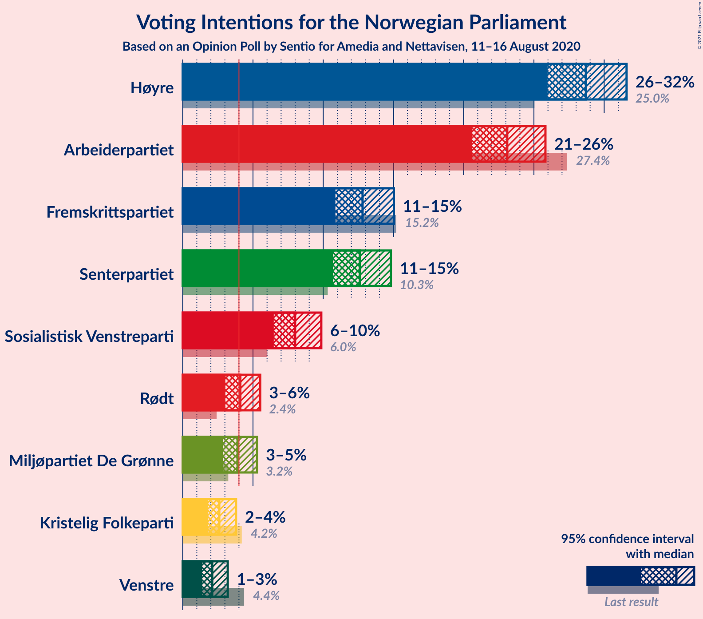

### Confidence Intervals

| Party | Last Result | Poll Result | 80% Confidence Interval | 90% Confidence Interval | 95% Confidence Interval | 99% Confidence Interval |
|:-----:|:-----------:|:-----------:|:-----------------------:|:-----------------------:|:-----------------------:|:-----------------------:|
| Høyre | 25.0% | 28.7% | 26.9–30.6% |26.4–31.1% |26.0–31.6% |25.1–32.5% |
| Arbeiderpartiet | 27.4% | 23.1% | 21.4–24.9% |21.0–25.4% |20.6–25.8% |19.8–26.7% |
| Fremskrittspartiet | 15.2% | 12.8% | 11.5–14.3% |11.2–14.7% |10.9–15.0% |10.3–15.7% |
| Senterpartiet | 10.3% | 12.6% | 11.3–14.0% |11.0–14.4% |10.7–14.8% |10.1–15.5% |
| Sosialistisk Venstreparti | 6.0% | 8.0% | 7.0–9.2% |6.7–9.6% |6.5–9.9% |6.0–10.5% |
| Rødt | 2.4% | 4.1% | 3.4–5.0% |3.2–5.3% |3.0–5.5% |2.7–6.0% |
| Miljøpartiet De Grønne | 3.2% | 3.9% | 3.2–4.8% |3.0–5.1% |2.9–5.3% |2.6–5.8% |
| Kristelig Folkeparti | 4.2% | 2.6% | 2.1–3.4% |1.9–3.6% |1.8–3.8% |1.6–4.2% |
| Venstre | 4.4% | 2.1% | 1.6–2.8% |1.5–3.0% |1.4–3.2% |1.2–3.6% |

*Note:* The poll result column reflects the actual value used in the calculations. Published results may vary slightly, and in addition be rounded to fewer digits.

## Seats

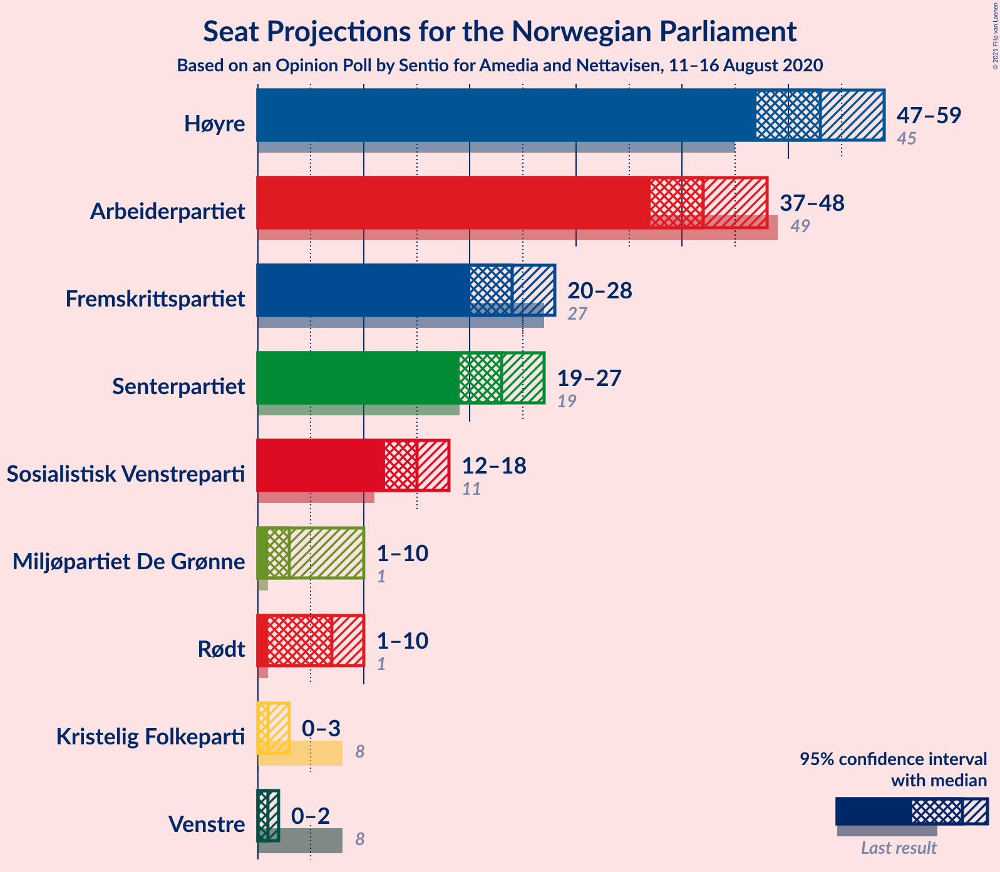

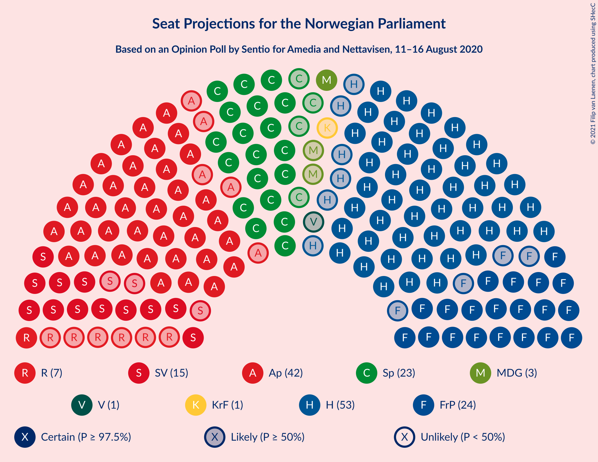

### Confidence Intervals

| Party | Last Result | Median | 80% Confidence Interval | 90% Confidence Interval | 95% Confidence Interval | 99% Confidence Interval |
|:-----:|:-----------:|:------:|:-----------------------:|:-----------------------:|:-----------------------:|:-----------------------:|
| <a href="#høyre">Høyre</a> | 45 | 53 | 49–56 |47–58 |47–59 |45–61 |
| <a href="#arbeiderpartiet">Arbeiderpartiet</a> | 49 | 42 | 39–46 |38–47 |37–48 |36–50 |
| <a href="#fremskrittspartiet">Fremskrittspartiet</a> | 27 | 24 | 21–26 |20–27 |20–28 |18–29 |
| <a href="#senterpartiet">Senterpartiet</a> | 19 | 23 | 21–26 |20–27 |19–27 |18–29 |
| <a href="#sosialistisk-venstreparti">Sosialistisk Venstreparti</a> | 11 | 15 | 13–17 |12–18 |12–18 |11–20 |
| <a href="#rødt">Rødt</a> | 1 | 7 | 2–9 |2–10 |1–10 |1–11 |
| <a href="#miljøpartiet-de-grønne">Miljøpartiet De Grønne</a> | 1 | 3 | 1–9 |1–9 |1–10 |1–10 |
| <a href="#kristelig-folkeparti">Kristelig Folkeparti</a> | 8 | 1 | 0–3 |0–3 |0–3 |0–8 |
| <a href="#venstre">Venstre</a> | 8 | 1 | 0–2 |0–2 |0–2 |0–2 |

### Høyre

*For a full overview of the results for this party, see the [Høyre](party-høyre.html) page.*

| Number of Seats | Probability | Accumulated | Special Marks |
|:---------------:|:-----------:|:-----------:|:-------------:|
| 43 | 0% | 100% |  |
| 44 | 0.2% | 99.9% |  |
| 45 | 0.4% | 99.7% | Last Result |
| 46 | 0.8% | 99.3% |  |
| 47 | 5% | 98% |  |
| 48 | 3% | 94% |  |
| 49 | 6% | 91% |  |
| 50 | 6% | 85% |  |
| 51 | 12% | 78% |  |
| 52 | 11% | 66% |  |
| 53 | 20% | 56% | Median |
| 54 | 9% | 36% |  |
| 55 | 12% | 27% |  |
| 56 | 6% | 15% |  |
| 57 | 2% | 9% |  |
| 58 | 4% | 7% |  |
| 59 | 1.3% | 3% |  |
| 60 | 0.6% | 2% |  |
| 61 | 0.8% | 1.1% |  |
| 62 | 0.3% | 0.3% |  |
| 63 | 0% | 0% |  |

### Arbeiderpartiet

*For a full overview of the results for this party, see the [Arbeiderpartiet](party-arbeiderpartiet.html) page.*

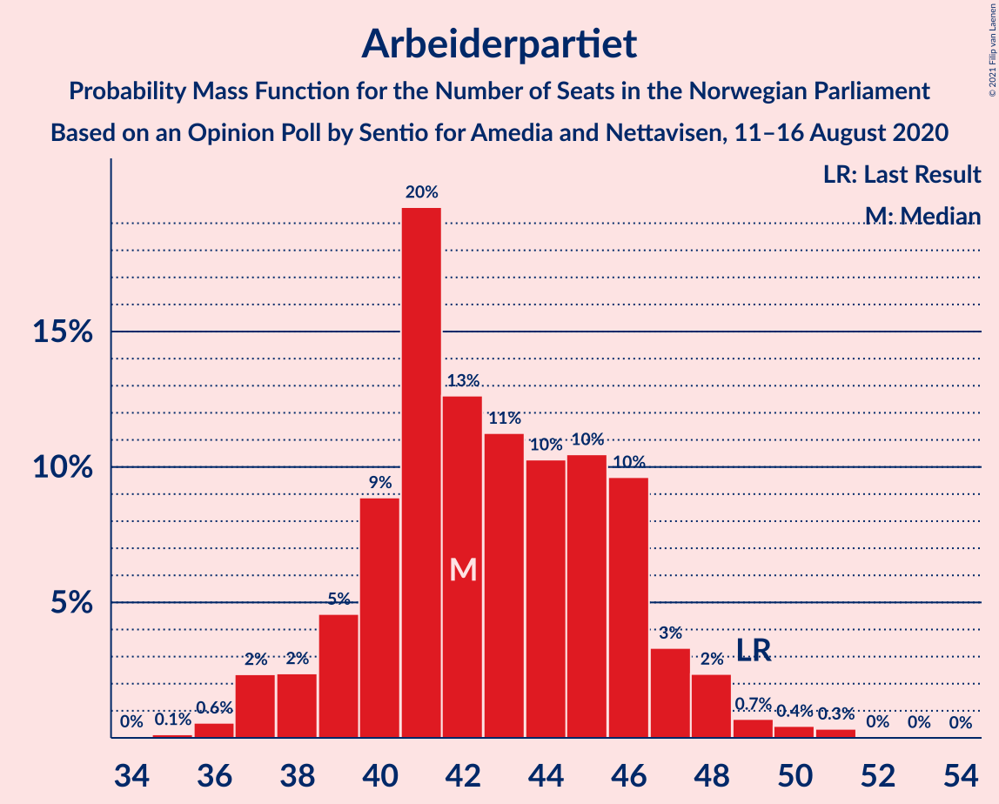

| Number of Seats | Probability | Accumulated | Special Marks |
|:---------------:|:-----------:|:-----------:|:-------------:|
| 34 | 0% | 100% |  |
| 35 | 0.1% | 99.9% |  |
| 36 | 0.6% | 99.8% |  |
| 37 | 2% | 99.2% |  |
| 38 | 2% | 97% |  |
| 39 | 5% | 95% |  |
| 40 | 9% | 90% |  |
| 41 | 20% | 81% |  |
| 42 | 13% | 61% | Median |
| 43 | 11% | 49% |  |
| 44 | 10% | 38% |  |
| 45 | 10% | 27% |  |
| 46 | 10% | 17% |  |
| 47 | 3% | 7% |  |
| 48 | 2% | 4% |  |
| 49 | 0.7% | 2% | Last Result |
| 50 | 0.4% | 0.8% |  |
| 51 | 0.3% | 0.4% |  |
| 52 | 0% | 0.1% |  |
| 53 | 0% | 0% |  |

### Fremskrittspartiet

*For a full overview of the results for this party, see the [Fremskrittspartiet](party-fremskrittspartiet.html) page.*

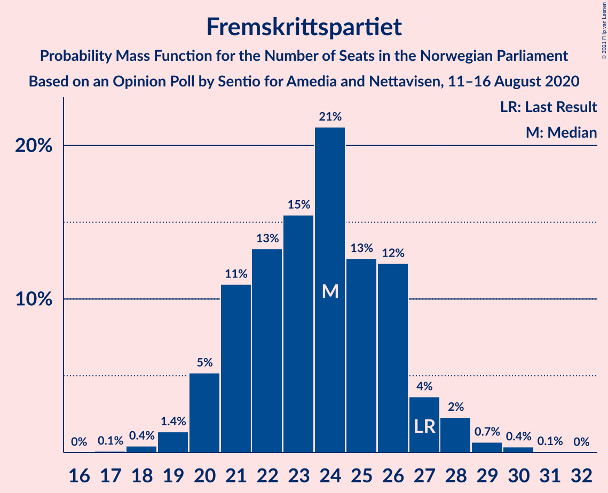

| Number of Seats | Probability | Accumulated | Special Marks |
|:---------------:|:-----------:|:-----------:|:-------------:|
| 17 | 0.1% | 100% |  |
| 18 | 0.4% | 99.9% |  |
| 19 | 1.4% | 99.5% |  |
| 20 | 5% | 98% |  |
| 21 | 11% | 93% |  |
| 22 | 13% | 82% |  |
| 23 | 15% | 69% |  |
| 24 | 21% | 53% | Median |
| 25 | 13% | 32% |  |
| 26 | 12% | 19% |  |
| 27 | 4% | 7% | Last Result |
| 28 | 2% | 3% |  |
| 29 | 0.7% | 1.1% |  |
| 30 | 0.4% | 0.4% |  |
| 31 | 0.1% | 0.1% |  |
| 32 | 0% | 0% |  |

### Senterpartiet

*For a full overview of the results for this party, see the [Senterpartiet](party-senterpartiet.html) page.*

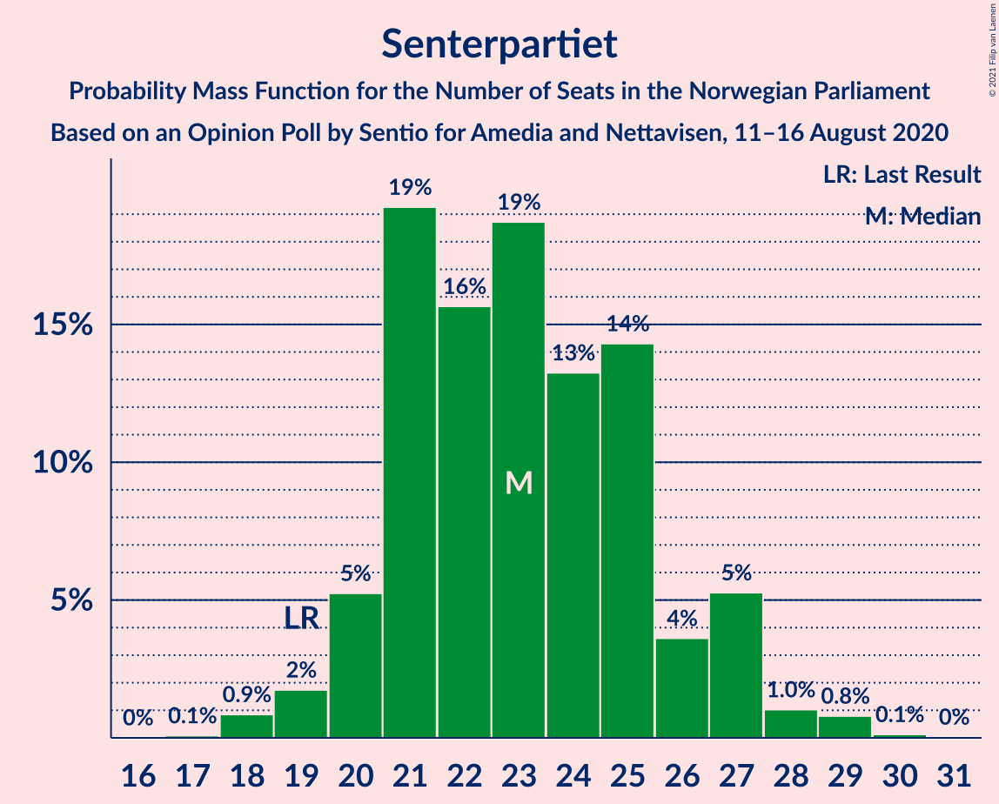

| Number of Seats | Probability | Accumulated | Special Marks |
|:---------------:|:-----------:|:-----------:|:-------------:|
| 17 | 0.1% | 100% |  |
| 18 | 0.9% | 99.9% |  |
| 19 | 2% | 99.1% | Last Result |
| 20 | 5% | 97% |  |
| 21 | 19% | 92% |  |
| 22 | 16% | 73% |  |
| 23 | 19% | 57% | Median |
| 24 | 13% | 38% |  |
| 25 | 14% | 25% |  |
| 26 | 4% | 11% |  |
| 27 | 5% | 7% |  |
| 28 | 1.0% | 2% |  |
| 29 | 0.8% | 1.0% |  |
| 30 | 0.1% | 0.2% |  |
| 31 | 0% | 0% |  |

### Sosialistisk Venstreparti

*For a full overview of the results for this party, see the [Sosialistisk Venstreparti](party-sosialistiskvenstreparti.html) page.*

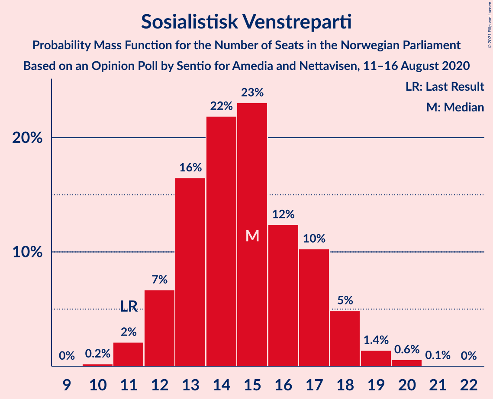

| Number of Seats | Probability | Accumulated | Special Marks |
|:---------------:|:-----------:|:-----------:|:-------------:|
| 10 | 0.2% | 100% |  |
| 11 | 2% | 99.8% | Last Result |
| 12 | 7% | 98% |  |
| 13 | 16% | 91% |  |
| 14 | 22% | 75% |  |
| 15 | 23% | 53% | Median |
| 16 | 12% | 30% |  |
| 17 | 10% | 17% |  |
| 18 | 5% | 7% |  |
| 19 | 1.4% | 2% |  |
| 20 | 0.6% | 0.6% |  |
| 21 | 0.1% | 0.1% |  |
| 22 | 0% | 0% |  |

### Rødt

*For a full overview of the results for this party, see the [Rødt](party-rødt.html) page.*

| Number of Seats | Probability | Accumulated | Special Marks |
|:---------------:|:-----------:|:-----------:|:-------------:|
| 1 | 3% | 100% | Last Result |
| 2 | 37% | 97% |  |
| 3 | 0% | 60% |  |
| 4 | 0% | 60% |  |
| 5 | 0% | 60% |  |
| 6 | 0% | 60% |  |
| 7 | 11% | 60% | Median |
| 8 | 30% | 49% |  |
| 9 | 14% | 19% |  |
| 10 | 4% | 5% |  |
| 11 | 0.8% | 0.9% |  |
| 12 | 0.1% | 0.1% |  |
| 13 | 0% | 0% |  |

### Miljøpartiet De Grønne

*For a full overview of the results for this party, see the [Miljøpartiet De Grønne](party-miljøpartietdegrønne.html) page.*

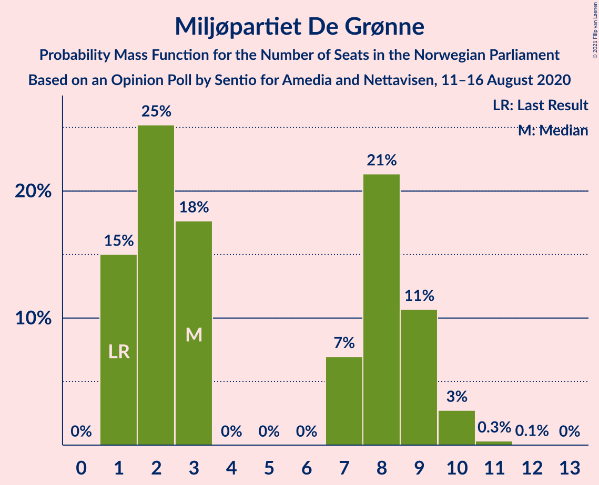

| Number of Seats | Probability | Accumulated | Special Marks |
|:---------------:|:-----------:|:-----------:|:-------------:|
| 1 | 15% | 100% | Last Result |
| 2 | 25% | 85% |  |
| 3 | 18% | 60% | Median |
| 4 | 0% | 42% |  |
| 5 | 0% | 42% |  |
| 6 | 0% | 42% |  |
| 7 | 7% | 42% |  |
| 8 | 21% | 35% |  |
| 9 | 11% | 14% |  |
| 10 | 3% | 3% |  |
| 11 | 0.3% | 0.4% |  |
| 12 | 0.1% | 0.1% |  |
| 13 | 0% | 0% |  |

### Kristelig Folkeparti

*For a full overview of the results for this party, see the [Kristelig Folkeparti](party-kristeligfolkeparti.html) page.*

| Number of Seats | Probability | Accumulated | Special Marks |
|:---------------:|:-----------:|:-----------:|:-------------:|
| 0 | 27% | 100% |  |
| 1 | 53% | 73% | Median |
| 2 | 9% | 20% |  |
| 3 | 10% | 11% |  |
| 4 | 0% | 1.2% |  |
| 5 | 0% | 1.2% |  |
| 6 | 0% | 1.2% |  |
| 7 | 0.5% | 1.2% |  |
| 8 | 0.6% | 0.7% | Last Result |
| 9 | 0% | 0% |  |

### Venstre

*For a full overview of the results for this party, see the [Venstre](party-venstre.html) page.*

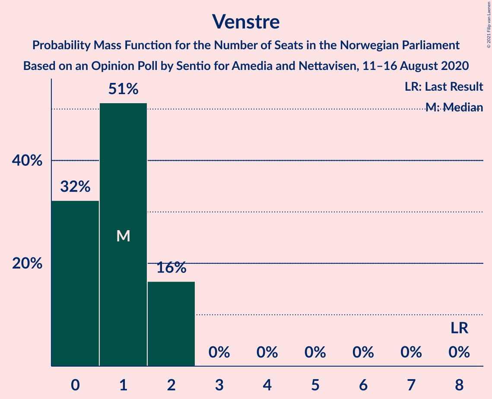

| Number of Seats | Probability | Accumulated | Special Marks |
|:---------------:|:-----------:|:-----------:|:-------------:|
| 0 | 32% | 100% |  |
| 1 | 51% | 68% | Median |
| 2 | 16% | 17% |  |
| 3 | 0% | 0.1% |  |
| 4 | 0% | 0.1% |  |
| 5 | 0% | 0.1% |  |
| 6 | 0% | 0.1% |  |
| 7 | 0% | 0.1% |  |
| 8 | 0% | 0% | Last Result |

## Coalitions

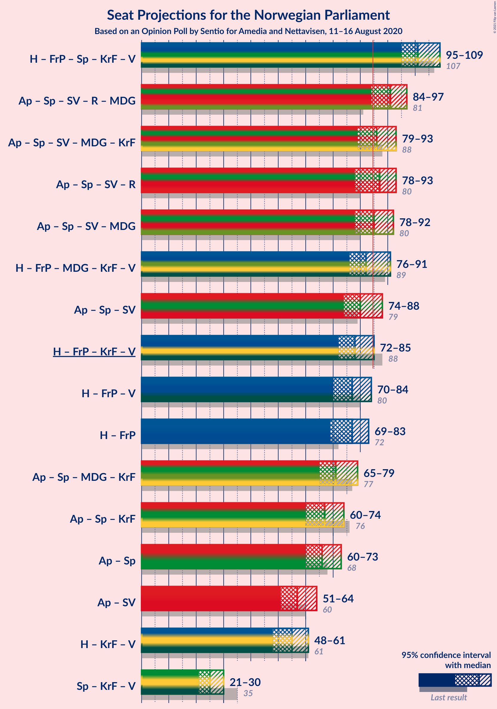

### Confidence Intervals

| Coalition | Last Result | Median | Majority? | 80% Confidence Interval | 90% Confidence Interval | 95% Confidence Interval | 99% Confidence Interval |
|:---------:|:-----------:|:------:|:---------:|:-----------------------:|:-----------------------:|:-----------------------:|:-----------------------:|
| Høyre – Fremskrittspartiet – Senterpartiet – Kristelig Folkeparti – Venstre | 107 | 101 | 100% | 96–107 | 95–108 | 95–109 | 92–110 |
| Arbeiderpartiet – Senterpartiet – Sosialistisk Venstreparti – Rødt – Miljøpartiet De Grønne | 81 | 91 | 96% | 86–95 | 85–96 | 84–97 | 82–100 |
| Arbeiderpartiet – Senterpartiet – Sosialistisk Venstreparti – Miljøpartiet De Grønne – Kristelig Folkeparti | 88 | 86 | 66% | 82–91 | 80–92 | 79–93 | 78–95 |
| Arbeiderpartiet – Senterpartiet – Sosialistisk Venstreparti – Rødt | 80 | 87 | 69% | 81–90 | 80–92 | 78–93 | 77–95 |
| Arbeiderpartiet – Senterpartiet – Sosialistisk Venstreparti – Miljøpartiet De Grønne | 80 | 85 | 55% | 81–90 | 79–91 | 78–92 | 76–94 |
| Høyre – Fremskrittspartiet – Miljøpartiet De Grønne – Kristelig Folkeparti – Venstre | 89 | 82 | 31% | 79–88 | 77–89 | 76–91 | 74–92 |
| Arbeiderpartiet – Senterpartiet – Sosialistisk Venstreparti | 79 | 80 | 13% | 76–85 | 75–86 | 74–88 | 72–89 |
| Høyre – Fremskrittspartiet – Kristelig Folkeparti – Venstre | 88 | 78 | 4% | 74–83 | 73–84 | 72–85 | 69–87 |
| Høyre – Fremskrittspartiet – Venstre | 80 | 77 | 2% | 72–82 | 72–83 | 70–84 | 69–86 |
| Høyre – Fremskrittspartiet | 72 | 77 | 1.4% | 72–81 | 70–82 | 69–83 | 68–85 |
| Arbeiderpartiet – Senterpartiet – Miljøpartiet De Grønne – Kristelig Folkeparti | 77 | 71 | 0% | 67–77 | 66–78 | 65–79 | 63–80 |
| Arbeiderpartiet – Senterpartiet – Kristelig Folkeparti | 76 | 67 | 0% | 63–71 | 62–73 | 60–74 | 59–75 |
| Arbeiderpartiet – Senterpartiet | 68 | 66 | 0% | 62–69 | 61–71 | 60–73 | 58–74 |
| Arbeiderpartiet – Sosialistisk Venstreparti | 60 | 57 | 0% | 53–62 | 52–63 | 51–64 | 50–66 |
| Høyre – Kristelig Folkeparti – Venstre | 61 | 55 | 0% | 51–59 | 49–60 | 48–61 | 47–63 |
| Senterpartiet – Kristelig Folkeparti – Venstre | 35 | 25 | 0% | 22–28 | 21–29 | 21–30 | 19–32 |

### Høyre – Fremskrittspartiet – Senterpartiet – Kristelig Folkeparti – Venstre

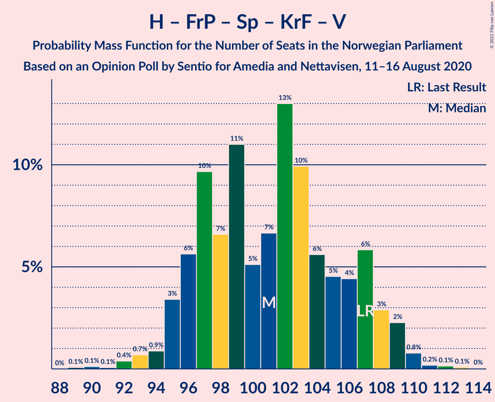

| Number of Seats | Probability | Accumulated | Special Marks |
|:---------------:|:-----------:|:-----------:|:-------------:|
| 89 | 0.1% | 100% |  |
| 90 | 0.1% | 99.9% |  |
| 91 | 0.1% | 99.8% |  |
| 92 | 0.4% | 99.7% |  |
| 93 | 0.7% | 99.3% |  |
| 94 | 0.9% | 98.7% |  |
| 95 | 3% | 98% |  |
| 96 | 6% | 94% |  |
| 97 | 10% | 89% |  |
| 98 | 7% | 79% |  |
| 99 | 11% | 72% |  |
| 100 | 5% | 61% |  |
| 101 | 7% | 56% |  |
| 102 | 13% | 50% | Median |
| 103 | 10% | 37% |  |
| 104 | 6% | 27% |  |
| 105 | 5% | 21% |  |
| 106 | 4% | 17% |  |
| 107 | 6% | 12% | Last Result |
| 108 | 3% | 6% |  |
| 109 | 2% | 4% |  |
| 110 | 0.8% | 1.2% |  |
| 111 | 0.2% | 0.5% |  |
| 112 | 0.1% | 0.3% |  |
| 113 | 0.1% | 0.1% |  |
| 114 | 0% | 0% |  |

### Arbeiderpartiet – Senterpartiet – Sosialistisk Venstreparti – Rødt – Miljøpartiet De Grønne

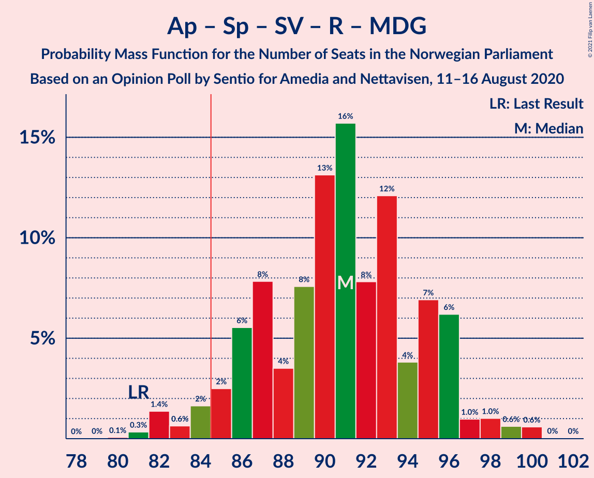

| Number of Seats | Probability | Accumulated | Special Marks |
|:---------------:|:-----------:|:-----------:|:-------------:|
| 80 | 0.1% | 100% |  |
| 81 | 0.3% | 99.9% | Last Result |
| 82 | 1.4% | 99.5% |  |
| 83 | 0.6% | 98% |  |
| 84 | 2% | 98% |  |
| 85 | 2% | 96% | Majority |
| 86 | 6% | 93% |  |
| 87 | 8% | 88% |  |
| 88 | 4% | 80% |  |
| 89 | 8% | 77% |  |
| 90 | 13% | 69% | Median |
| 91 | 16% | 56% |  |
| 92 | 8% | 40% |  |
| 93 | 12% | 32% |  |
| 94 | 4% | 20% |  |
| 95 | 7% | 16% |  |
| 96 | 6% | 9% |  |
| 97 | 1.0% | 3% |  |
| 98 | 1.0% | 2% |  |
| 99 | 0.6% | 1.3% |  |
| 100 | 0.6% | 0.7% |  |
| 101 | 0% | 0.1% |  |
| 102 | 0% | 0% |  |

### Arbeiderpartiet – Senterpartiet – Sosialistisk Venstreparti – Miljøpartiet De Grønne – Kristelig Folkeparti

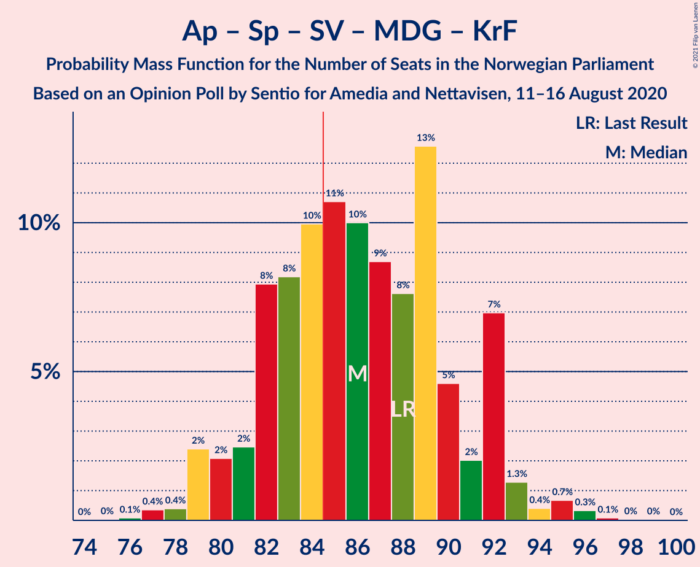

| Number of Seats | Probability | Accumulated | Special Marks |
|:---------------:|:-----------:|:-----------:|:-------------:|
| 76 | 0.1% | 100% |  |
| 77 | 0.4% | 99.9% |  |
| 78 | 0.4% | 99.5% |  |
| 79 | 2% | 99.1% |  |
| 80 | 2% | 97% |  |
| 81 | 2% | 95% |  |
| 82 | 8% | 92% |  |
| 83 | 8% | 84% |  |
| 84 | 10% | 76% | Median |
| 85 | 11% | 66% | Majority |
| 86 | 10% | 55% |  |
| 87 | 9% | 45% |  |
| 88 | 8% | 37% | Last Result |
| 89 | 13% | 29% |  |
| 90 | 5% | 16% |  |
| 91 | 2% | 12% |  |
| 92 | 7% | 10% |  |
| 93 | 1.3% | 3% |  |
| 94 | 0.4% | 2% |  |
| 95 | 0.7% | 1.2% |  |
| 96 | 0.3% | 0.5% |  |
| 97 | 0.1% | 0.1% |  |
| 98 | 0% | 0.1% |  |
| 99 | 0% | 0% |  |

### Arbeiderpartiet – Senterpartiet – Sosialistisk Venstreparti – Rødt

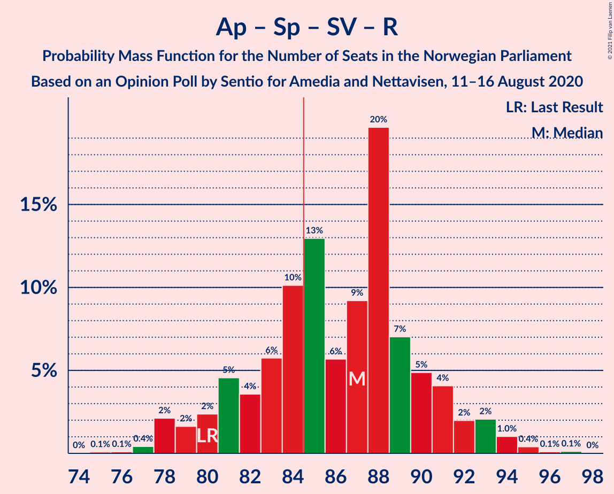

| Number of Seats | Probability | Accumulated | Special Marks |
|:---------------:|:-----------:|:-----------:|:-------------:|
| 75 | 0.1% | 100% |  |
| 76 | 0.1% | 99.9% |  |
| 77 | 0.4% | 99.8% |  |
| 78 | 2% | 99.4% |  |
| 79 | 2% | 97% |  |
| 80 | 2% | 96% | Last Result |
| 81 | 5% | 93% |  |
| 82 | 4% | 89% |  |
| 83 | 6% | 85% |  |
| 84 | 10% | 79% |  |
| 85 | 13% | 69% | Majority |
| 86 | 6% | 56% |  |
| 87 | 9% | 51% | Median |
| 88 | 20% | 41% |  |
| 89 | 7% | 22% |  |
| 90 | 5% | 15% |  |
| 91 | 4% | 10% |  |
| 92 | 2% | 6% |  |
| 93 | 2% | 4% |  |
| 94 | 1.0% | 2% |  |
| 95 | 0.4% | 0.7% |  |
| 96 | 0.1% | 0.3% |  |
| 97 | 0.1% | 0.2% |  |
| 98 | 0% | 0% |  |

### Arbeiderpartiet – Senterpartiet – Sosialistisk Venstreparti – Miljøpartiet De Grønne

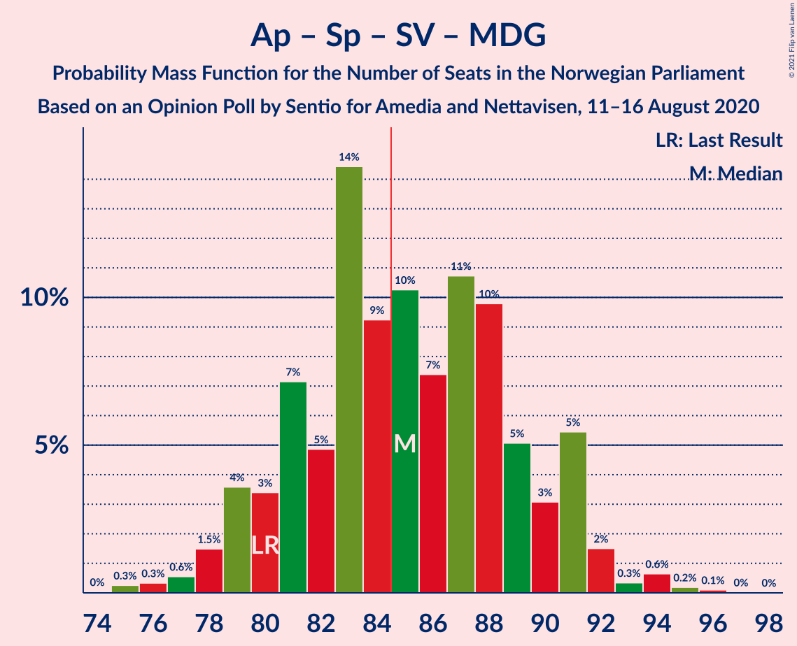

| Number of Seats | Probability | Accumulated | Special Marks |
|:---------------:|:-----------:|:-----------:|:-------------:|
| 74 | 0% | 100% |  |
| 75 | 0.3% | 99.9% |  |
| 76 | 0.3% | 99.7% |  |
| 77 | 0.6% | 99.4% |  |
| 78 | 1.5% | 98.8% |  |
| 79 | 4% | 97% |  |
| 80 | 3% | 94% | Last Result |
| 81 | 7% | 90% |  |
| 82 | 5% | 83% |  |
| 83 | 14% | 78% | Median |
| 84 | 9% | 64% |  |
| 85 | 10% | 55% | Majority |
| 86 | 7% | 44% |  |
| 87 | 11% | 37% |  |
| 88 | 10% | 26% |  |
| 89 | 5% | 16% |  |
| 90 | 3% | 11% |  |
| 91 | 5% | 8% |  |
| 92 | 2% | 3% |  |
| 93 | 0.3% | 1.3% |  |
| 94 | 0.6% | 1.0% |  |
| 95 | 0.2% | 0.3% |  |
| 96 | 0.1% | 0.1% |  |
| 97 | 0% | 0% |  |

### Høyre – Fremskrittspartiet – Miljøpartiet De Grønne – Kristelig Folkeparti – Venstre

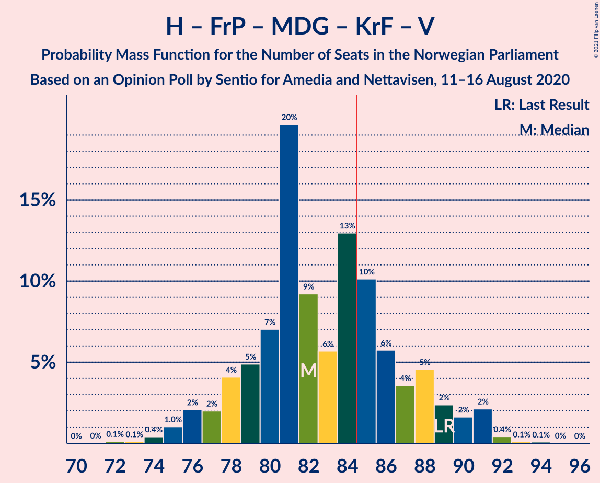

| Number of Seats | Probability | Accumulated | Special Marks |
|:---------------:|:-----------:|:-----------:|:-------------:|
| 72 | 0.1% | 100% |  |
| 73 | 0.1% | 99.8% |  |
| 74 | 0.4% | 99.7% |  |
| 75 | 1.0% | 99.3% |  |
| 76 | 2% | 98% |  |
| 77 | 2% | 96% |  |
| 78 | 4% | 94% |  |
| 79 | 5% | 90% |  |
| 80 | 7% | 85% |  |
| 81 | 20% | 78% |  |
| 82 | 9% | 59% | Median |
| 83 | 6% | 49% |  |
| 84 | 13% | 44% |  |
| 85 | 10% | 31% | Majority |
| 86 | 6% | 21% |  |
| 87 | 4% | 15% |  |
| 88 | 5% | 11% |  |
| 89 | 2% | 7% | Last Result |
| 90 | 2% | 4% |  |
| 91 | 2% | 3% |  |
| 92 | 0.4% | 0.6% |  |
| 93 | 0.1% | 0.2% |  |
| 94 | 0.1% | 0.1% |  |
| 95 | 0% | 0% |  |

### Arbeiderpartiet – Senterpartiet – Sosialistisk Venstreparti

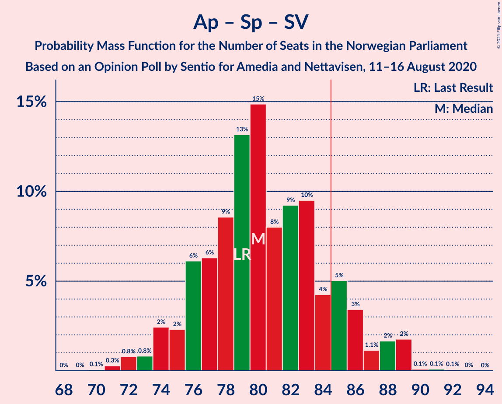

| Number of Seats | Probability | Accumulated | Special Marks |
|:---------------:|:-----------:|:-----------:|:-------------:|
| 70 | 0.1% | 100% |  |
| 71 | 0.3% | 99.9% |  |
| 72 | 0.8% | 99.6% |  |
| 73 | 0.8% | 98.8% |  |
| 74 | 2% | 98% |  |
| 75 | 2% | 96% |  |
| 76 | 6% | 93% |  |
| 77 | 6% | 87% |  |
| 78 | 9% | 81% |  |
| 79 | 13% | 72% | Last Result |
| 80 | 15% | 59% | Median |
| 81 | 8% | 44% |  |
| 82 | 9% | 36% |  |
| 83 | 10% | 27% |  |
| 84 | 4% | 18% |  |
| 85 | 5% | 13% | Majority |
| 86 | 3% | 8% |  |
| 87 | 1.1% | 5% |  |
| 88 | 2% | 4% |  |
| 89 | 2% | 2% |  |
| 90 | 0.1% | 0.3% |  |
| 91 | 0.1% | 0.2% |  |
| 92 | 0.1% | 0.1% |  |
| 93 | 0% | 0% |  |

### Høyre – Fremskrittspartiet – Kristelig Folkeparti – Venstre

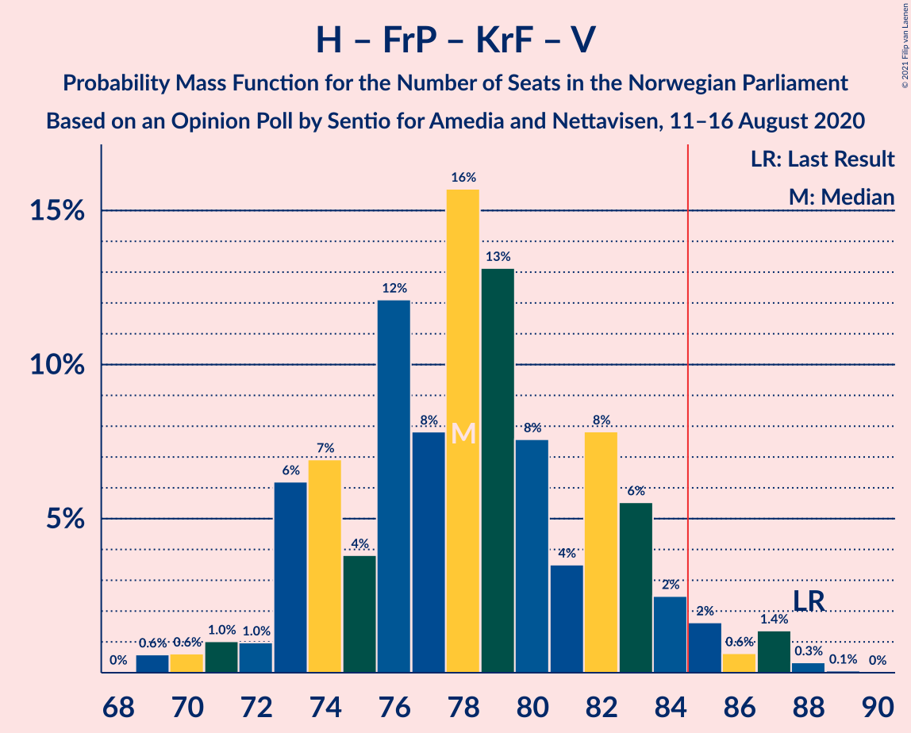

| Number of Seats | Probability | Accumulated | Special Marks |
|:---------------:|:-----------:|:-----------:|:-------------:|
| 68 | 0% | 100% |  |
| 69 | 0.6% | 99.9% |  |
| 70 | 0.6% | 99.3% |  |
| 71 | 1.0% | 98.7% |  |
| 72 | 1.0% | 98% |  |
| 73 | 6% | 97% |  |
| 74 | 7% | 91% |  |
| 75 | 4% | 84% |  |
| 76 | 12% | 80% |  |
| 77 | 8% | 68% |  |
| 78 | 16% | 60% |  |
| 79 | 13% | 44% | Median |
| 80 | 8% | 31% |  |
| 81 | 4% | 23% |  |
| 82 | 8% | 20% |  |
| 83 | 6% | 12% |  |
| 84 | 2% | 7% |  |
| 85 | 2% | 4% | Majority |
| 86 | 0.6% | 2% |  |
| 87 | 1.4% | 2% |  |
| 88 | 0.3% | 0.4% | Last Result |
| 89 | 0.1% | 0.1% |  |
| 90 | 0% | 0% |  |

### Høyre – Fremskrittspartiet – Venstre

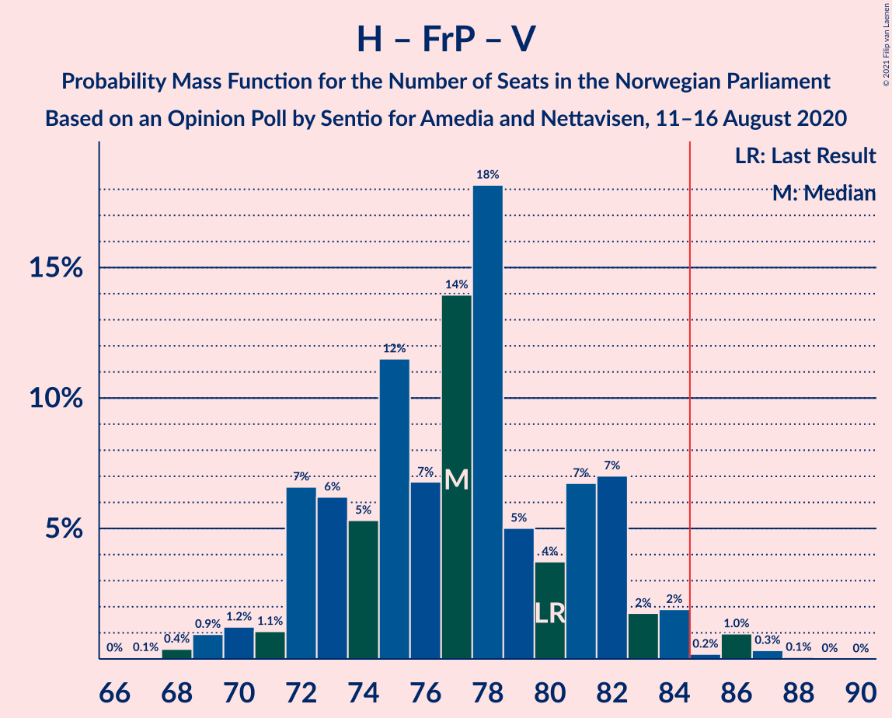

| Number of Seats | Probability | Accumulated | Special Marks |
|:---------------:|:-----------:|:-----------:|:-------------:|
| 66 | 0% | 100% |  |
| 67 | 0.1% | 99.9% |  |
| 68 | 0.4% | 99.9% |  |
| 69 | 0.9% | 99.5% |  |
| 70 | 1.2% | 98.6% |  |
| 71 | 1.1% | 97% |  |
| 72 | 7% | 96% |  |
| 73 | 6% | 90% |  |
| 74 | 5% | 83% |  |
| 75 | 12% | 78% |  |
| 76 | 7% | 67% |  |
| 77 | 14% | 60% |  |
| 78 | 18% | 46% | Median |
| 79 | 5% | 28% |  |
| 80 | 4% | 23% | Last Result |
| 81 | 7% | 19% |  |
| 82 | 7% | 12% |  |
| 83 | 2% | 5% |  |
| 84 | 2% | 3% |  |
| 85 | 0.2% | 2% | Majority |
| 86 | 1.0% | 1.4% |  |
| 87 | 0.3% | 0.4% |  |
| 88 | 0.1% | 0.1% |  |
| 89 | 0% | 0% |  |

### Høyre – Fremskrittspartiet

| Number of Seats | Probability | Accumulated | Special Marks |
|:---------------:|:-----------:|:-----------:|:-------------:|
| 65 | 0% | 100% |  |
| 66 | 0% | 99.9% |  |
| 67 | 0.4% | 99.9% |  |
| 68 | 1.0% | 99.5% |  |
| 69 | 1.0% | 98.5% |  |
| 70 | 3% | 97% |  |
| 71 | 2% | 95% |  |
| 72 | 7% | 92% | Last Result |
| 73 | 7% | 85% |  |
| 74 | 7% | 78% |  |
| 75 | 11% | 70% |  |
| 76 | 8% | 60% |  |
| 77 | 23% | 52% | Median |
| 78 | 6% | 29% |  |
| 79 | 5% | 23% |  |
| 80 | 6% | 19% |  |
| 81 | 6% | 12% |  |
| 82 | 2% | 6% |  |
| 83 | 3% | 4% |  |
| 84 | 0.2% | 2% |  |
| 85 | 0.9% | 1.4% | Majority |
| 86 | 0.2% | 0.5% |  |
| 87 | 0.3% | 0.3% |  |
| 88 | 0% | 0% |  |

### Arbeiderpartiet – Senterpartiet – Miljøpartiet De Grønne – Kristelig Folkeparti

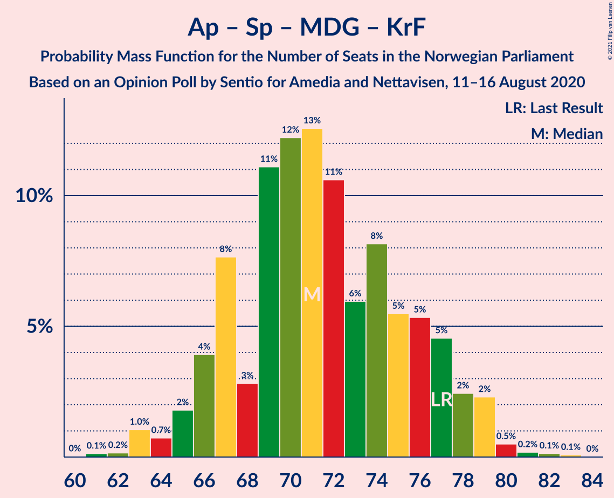

| Number of Seats | Probability | Accumulated | Special Marks |
|:---------------:|:-----------:|:-----------:|:-------------:|
| 61 | 0.1% | 100% |  |
| 62 | 0.2% | 99.8% |  |
| 63 | 1.0% | 99.7% |  |
| 64 | 0.7% | 98.6% |  |
| 65 | 2% | 98% |  |
| 66 | 4% | 96% |  |
| 67 | 8% | 92% |  |
| 68 | 3% | 85% |  |
| 69 | 11% | 82% | Median |
| 70 | 12% | 71% |  |
| 71 | 13% | 58% |  |
| 72 | 11% | 46% |  |
| 73 | 6% | 35% |  |
| 74 | 8% | 29% |  |
| 75 | 5% | 21% |  |
| 76 | 5% | 16% |  |
| 77 | 5% | 10% | Last Result |
| 78 | 2% | 6% |  |
| 79 | 2% | 3% |  |
| 80 | 0.5% | 0.9% |  |
| 81 | 0.2% | 0.4% |  |
| 82 | 0.1% | 0.3% |  |
| 83 | 0.1% | 0.1% |  |
| 84 | 0% | 0% |  |

### Arbeiderpartiet – Senterpartiet – Kristelig Folkeparti

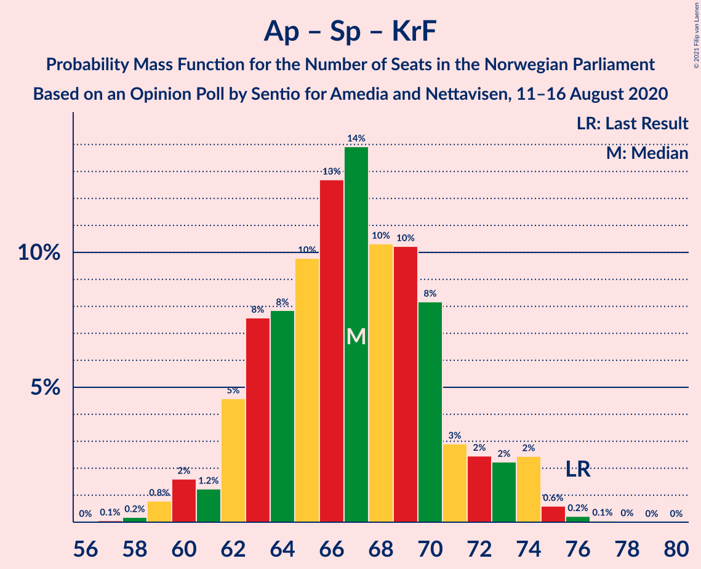

| Number of Seats | Probability | Accumulated | Special Marks |
|:---------------:|:-----------:|:-----------:|:-------------:|
| 57 | 0.1% | 100% |  |
| 58 | 0.2% | 99.9% |  |
| 59 | 0.8% | 99.7% |  |
| 60 | 2% | 99.0% |  |
| 61 | 1.2% | 97% |  |
| 62 | 5% | 96% |  |
| 63 | 8% | 92% |  |
| 64 | 8% | 84% |  |
| 65 | 10% | 76% |  |
| 66 | 13% | 66% | Median |
| 67 | 14% | 54% |  |
| 68 | 10% | 40% |  |
| 69 | 10% | 29% |  |
| 70 | 8% | 19% |  |
| 71 | 3% | 11% |  |
| 72 | 2% | 8% |  |
| 73 | 2% | 6% |  |
| 74 | 2% | 3% |  |
| 75 | 0.6% | 0.9% |  |
| 76 | 0.2% | 0.3% | Last Result |
| 77 | 0.1% | 0.1% |  |
| 78 | 0% | 0.1% |  |
| 79 | 0% | 0% |  |

### Arbeiderpartiet – Senterpartiet

| Number of Seats | Probability | Accumulated | Special Marks |
|:---------------:|:-----------:|:-----------:|:-------------:|
| 56 | 0.1% | 100% |  |
| 57 | 0.1% | 99.9% |  |
| 58 | 0.8% | 99.8% |  |
| 59 | 1.4% | 99.0% |  |
| 60 | 2% | 98% |  |
| 61 | 4% | 96% |  |
| 62 | 8% | 92% |  |
| 63 | 7% | 83% |  |
| 64 | 13% | 76% |  |
| 65 | 8% | 63% | Median |
| 66 | 17% | 55% |  |
| 67 | 10% | 38% |  |
| 68 | 11% | 28% | Last Result |
| 69 | 7% | 17% |  |
| 70 | 3% | 10% |  |
| 71 | 3% | 7% |  |
| 72 | 0.9% | 4% |  |
| 73 | 3% | 3% |  |
| 74 | 0.6% | 0.8% |  |
| 75 | 0.2% | 0.2% |  |
| 76 | 0% | 0.1% |  |
| 77 | 0% | 0% |  |

### Arbeiderpartiet – Sosialistisk Venstreparti

| Number of Seats | Probability | Accumulated | Special Marks |
|:---------------:|:-----------:|:-----------:|:-------------:|
| 48 | 0.1% | 100% |  |
| 49 | 0.1% | 99.8% |  |
| 50 | 1.0% | 99.7% |  |
| 51 | 2% | 98.7% |  |
| 52 | 3% | 97% |  |
| 53 | 4% | 94% |  |
| 54 | 7% | 90% |  |
| 55 | 13% | 83% |  |
| 56 | 10% | 70% |  |
| 57 | 14% | 60% | Median |
| 58 | 9% | 45% |  |
| 59 | 14% | 37% |  |
| 60 | 4% | 22% | Last Result |
| 61 | 6% | 18% |  |
| 62 | 6% | 12% |  |
| 63 | 3% | 7% |  |
| 64 | 2% | 4% |  |
| 65 | 0.7% | 1.4% |  |
| 66 | 0.5% | 0.7% |  |
| 67 | 0.1% | 0.2% |  |
| 68 | 0.1% | 0.1% |  |
| 69 | 0% | 0% |  |

### Høyre – Kristelig Folkeparti – Venstre

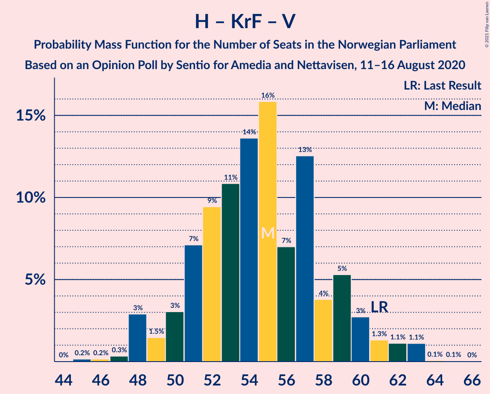

| Number of Seats | Probability | Accumulated | Special Marks |
|:---------------:|:-----------:|:-----------:|:-------------:|
| 45 | 0.2% | 100% |  |
| 46 | 0.2% | 99.8% |  |
| 47 | 0.3% | 99.7% |  |
| 48 | 3% | 99.3% |  |
| 49 | 1.5% | 96% |  |
| 50 | 3% | 95% |  |
| 51 | 7% | 92% |  |
| 52 | 9% | 85% |  |
| 53 | 11% | 75% |  |
| 54 | 14% | 65% |  |
| 55 | 16% | 51% | Median |
| 56 | 7% | 35% |  |
| 57 | 13% | 28% |  |
| 58 | 4% | 16% |  |
| 59 | 5% | 12% |  |
| 60 | 3% | 6% |  |
| 61 | 1.3% | 4% | Last Result |
| 62 | 1.1% | 2% |  |
| 63 | 1.1% | 1.3% |  |
| 64 | 0.1% | 0.2% |  |
| 65 | 0.1% | 0.1% |  |
| 66 | 0% | 0% |  |

### Senterpartiet – Kristelig Folkeparti – Venstre

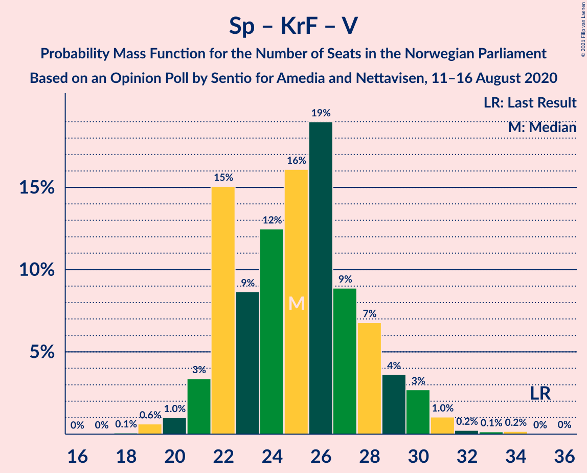

| Number of Seats | Probability | Accumulated | Special Marks |
|:---------------:|:-----------:|:-----------:|:-------------:|
| 18 | 0.1% | 100% |  |
| 19 | 0.6% | 99.9% |  |
| 20 | 1.0% | 99.3% |  |
| 21 | 3% | 98% |  |
| 22 | 15% | 95% |  |
| 23 | 9% | 80% |  |
| 24 | 12% | 71% |  |
| 25 | 16% | 59% | Median |
| 26 | 19% | 43% |  |
| 27 | 9% | 24% |  |
| 28 | 7% | 15% |  |
| 29 | 4% | 8% |  |
| 30 | 3% | 4% |  |
| 31 | 1.0% | 2% |  |
| 32 | 0.2% | 0.6% |  |
| 33 | 0.1% | 0.4% |  |
| 34 | 0.2% | 0.2% |  |
| 35 | 0% | 0.1% | Last Result |
| 36 | 0% | 0% |  |

## Technical Information

### Opinion Poll

+ **Polling firm:** Sentio
+ **Commissioner(s):** Amedia and Nettavisen
+ **Fieldwork period:** 11–16 August 2020

### Calculations

+ **Sample size:** 1000
+ **Simulations done:** 1,048,576
+ **Error estimate:** 1.25%

