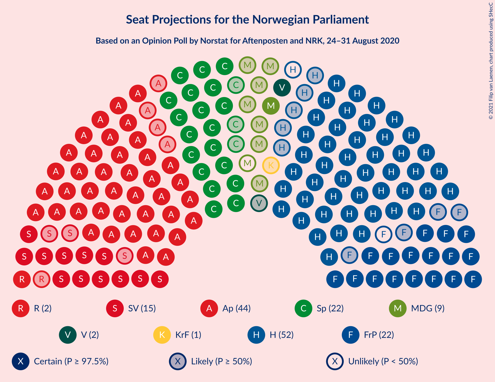
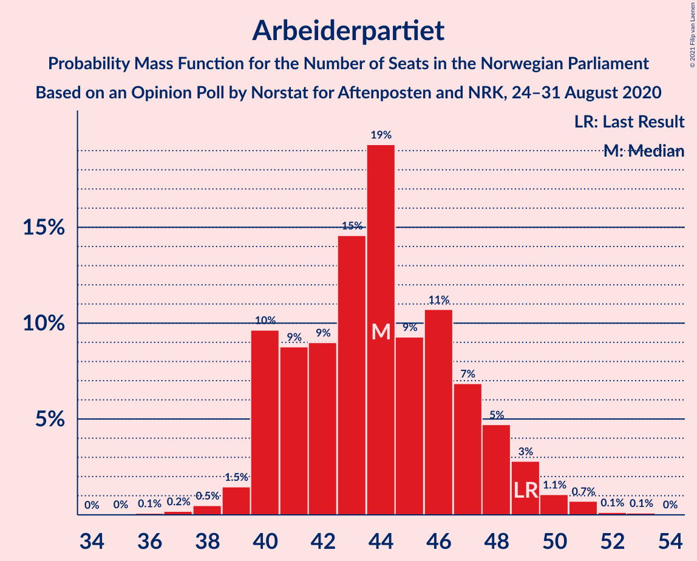
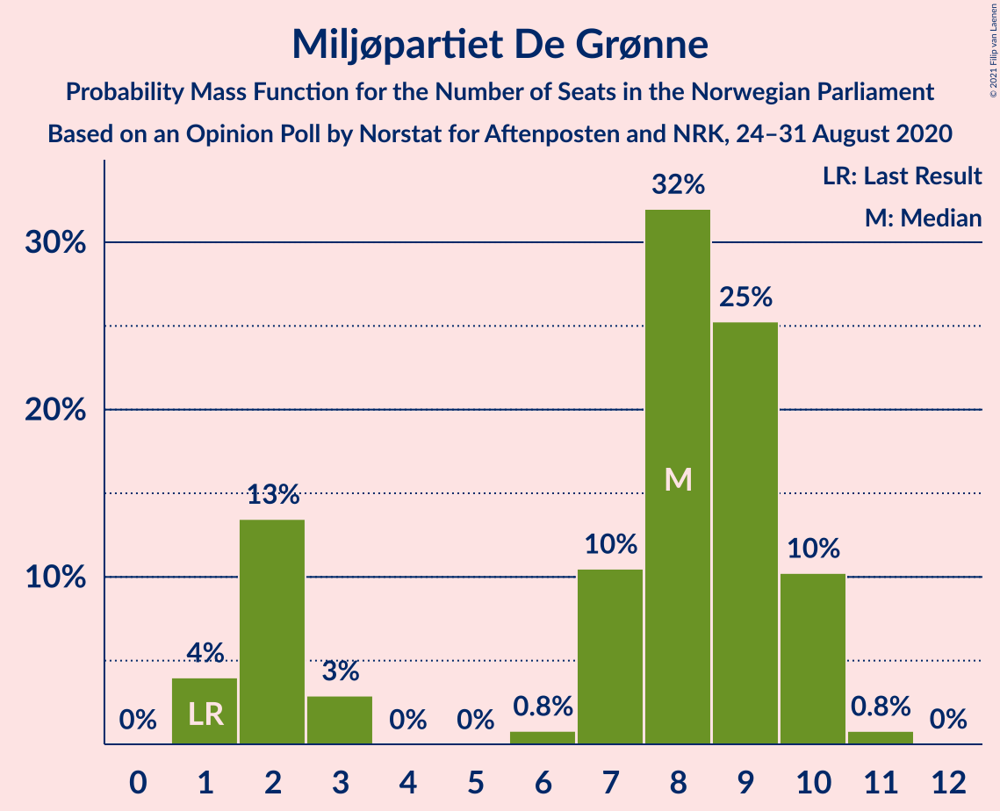
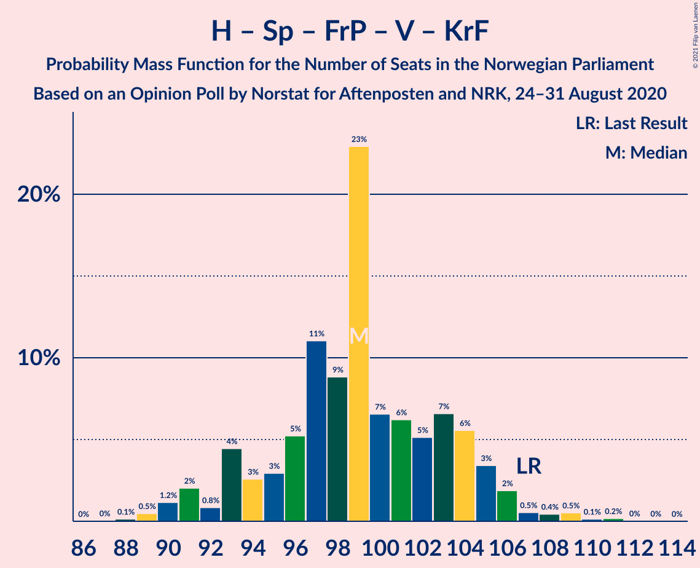
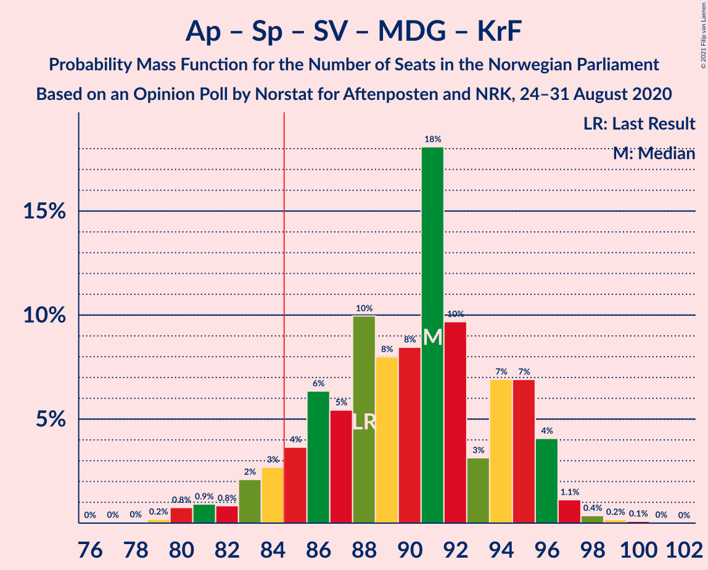

# Opinion Poll by Norstat for Aftenposten and NRK, 24–31 August 2020

<a href="#voting-intentions">Voting Intentions</a> | <a href="#seats">Seats</a> | <a href="#coalitions">Coalitions</a> | <a href="#technical-information">Technical Information</a>

## Voting Intentions

### Confidence Intervals

| Party | Last Result | Poll Result | 80% Confidence Interval | 90% Confidence Interval | 95% Confidence Interval | 99% Confidence Interval |
|:-----:|:-----------:|:-----------:|:-----------------------:|:-----------------------:|:-----------------------:|:-----------------------:|
| Høyre | 25.0% | 28.3% | 26.5–30.2% |25.9–30.8% |25.5–31.2% |24.6–32.2% |
| Arbeiderpartiet | 27.4% | 24.0% | 22.3–25.9% |21.8–26.4% |21.4–26.9% |20.6–27.8% |
| Senterpartiet | 10.3% | 12.2% | 10.9–13.7% |10.5–14.1% |10.2–14.4% |9.7–15.2% |
| Fremskrittspartiet | 15.2% | 11.4% | 10.2–12.9% |9.9–13.3% |9.6–13.6% |9.0–14.4% |
| Sosialistisk Venstreparti | 6.0% | 8.2% | 7.1–9.4% |6.8–9.8% |6.6–10.1% |6.1–10.7% |
| Miljøpartiet De Grønne | 3.2% | 4.1% | 3.4–5.1% |3.2–5.4% |3.0–5.6% |2.7–6.1% |
| Rødt | 2.4% | 3.8% | 3.1–4.7% |2.9–5.0% |2.8–5.2% |2.5–5.7% |
| Venstre | 4.4% | 3.4% | 2.7–4.3% |2.6–4.5% |2.4–4.8% |2.1–5.2% |
| Kristelig Folkeparti | 4.2% | 2.8% | 2.2–3.6% |2.0–3.8% |1.9–4.0% |1.6–4.4% |

*Note:* The poll result column reflects the actual value used in the calculations. Published results may vary slightly, and in addition be rounded to fewer digits.

## Seats

### Confidence Intervals

| Party | Last Result | Median | 80% Confidence Interval | 90% Confidence Interval | 95% Confidence Interval | 99% Confidence Interval |
|:-----:|:-----------:|:------:|:-----------------------:|:-----------------------:|:-----------------------:|:-----------------------:|
| <a href="#høyre">Høyre</a> | 45 | 50 | 47–54 |46–55 |45–57 |44–60 |
| <a href="#arbeiderpartiet">Arbeiderpartiet</a> | 49 | 43 | 40–48 |40–49 |39–49 |38–51 |
| <a href="#senterpartiet">Senterpartiet</a> | 19 | 21 | 20–24 |19–25 |19–27 |18–27 |
| <a href="#fremskrittspartiet">Fremskrittspartiet</a> | 27 | 20 | 18–23 |18–24 |18–25 |17–26 |
| <a href="#sosialistisk-venstreparti">Sosialistisk Venstreparti</a> | 11 | 15 | 13–17 |12–18 |12–19 |11–20 |
| <a href="#miljøpartiet-de-grønne">Miljøpartiet De Grønne</a> | 1 | 8 | 2–9 |2–9 |1–9 |1–11 |
| <a href="#rødt">Rødt</a> | 1 | 7 | 1–9 |1–9 |1–9 |1–10 |
| <a href="#venstre">Venstre</a> | 8 | 2 | 2–8 |1–8 |1–8 |1–9 |
| <a href="#kristelig-folkeparti">Kristelig Folkeparti</a> | 8 | 1 | 0–3 |0–3 |0–3 |0–7 |

### Høyre

*For a full overview of the results for this party, see the [Høyre](party-høyre.html) page.*

| Number of Seats | Probability | Accumulated | Special Marks |
|:---------------:|:-----------:|:-----------:|:-------------:|
| 41 | 0.1% | 100% |  |
| 42 | 0% | 99.9% |  |
| 43 | 0.1% | 99.9% |  |
| 44 | 2% | 99.8% |  |
| 45 | 1.4% | 98% | Last Result |
| 46 | 4% | 97% |  |
| 47 | 5% | 93% |  |
| 48 | 8% | 88% |  |
| 49 | 17% | 81% |  |
| 50 | 28% | 64% | Median |
| 51 | 4% | 36% |  |
| 52 | 10% | 32% |  |
| 53 | 6% | 22% |  |
| 54 | 7% | 16% |  |
| 55 | 4% | 8% |  |
| 56 | 1.1% | 5% |  |
| 57 | 2% | 4% |  |
| 58 | 0.2% | 1.3% |  |
| 59 | 0.2% | 1.1% |  |
| 60 | 0.9% | 0.9% |  |
| 61 | 0% | 0.1% |  |
| 62 | 0% | 0.1% |  |
| 63 | 0% | 0% |  |

### Arbeiderpartiet

*For a full overview of the results for this party, see the [Arbeiderpartiet](party-arbeiderpartiet.html) page.*

| Number of Seats | Probability | Accumulated | Special Marks |
|:---------------:|:-----------:|:-----------:|:-------------:|
| 36 | 0% | 100% |  |
| 37 | 0.1% | 99.9% |  |
| 38 | 0.5% | 99.9% |  |
| 39 | 3% | 99.4% |  |
| 40 | 9% | 96% |  |
| 41 | 12% | 87% |  |
| 42 | 8% | 75% |  |
| 43 | 19% | 67% | Median |
| 44 | 15% | 47% |  |
| 45 | 10% | 32% |  |
| 46 | 6% | 23% |  |
| 47 | 6% | 17% |  |
| 48 | 6% | 11% |  |
| 49 | 3% | 5% | Last Result |
| 50 | 0.3% | 2% |  |
| 51 | 2% | 2% |  |
| 52 | 0.2% | 0.3% |  |
| 53 | 0.1% | 0.1% |  |
| 54 | 0% | 0% |  |

### Senterpartiet

*For a full overview of the results for this party, see the [Senterpartiet](party-senterpartiet.html) page.*

| Number of Seats | Probability | Accumulated | Special Marks |
|:---------------:|:-----------:|:-----------:|:-------------:|
| 17 | 0.1% | 100% |  |
| 18 | 2% | 99.9% |  |
| 19 | 4% | 98% | Last Result |
| 20 | 20% | 93% |  |
| 21 | 24% | 73% | Median |
| 22 | 13% | 50% |  |
| 23 | 24% | 36% |  |
| 24 | 4% | 12% |  |
| 25 | 5% | 8% |  |
| 26 | 0.7% | 3% |  |
| 27 | 2% | 3% |  |
| 28 | 0.1% | 0.5% |  |
| 29 | 0.3% | 0.4% |  |
| 30 | 0% | 0.1% |  |
| 31 | 0% | 0.1% |  |
| 32 | 0% | 0% |  |

### Fremskrittspartiet

*For a full overview of the results for this party, see the [Fremskrittspartiet](party-fremskrittspartiet.html) page.*

| Number of Seats | Probability | Accumulated | Special Marks |
|:---------------:|:-----------:|:-----------:|:-------------:|
| 14 | 0% | 100% |  |
| 15 | 0.1% | 99.9% |  |
| 16 | 0.3% | 99.8% |  |
| 17 | 1.0% | 99.6% |  |
| 18 | 14% | 98.6% |  |
| 19 | 21% | 85% |  |
| 20 | 24% | 64% | Median |
| 21 | 25% | 40% |  |
| 22 | 4% | 15% |  |
| 23 | 5% | 11% |  |
| 24 | 3% | 6% |  |
| 25 | 2% | 3% |  |
| 26 | 0.8% | 1.0% |  |
| 27 | 0.1% | 0.2% | Last Result |
| 28 | 0% | 0.1% |  |
| 29 | 0% | 0% |  |

### Sosialistisk Venstreparti

*For a full overview of the results for this party, see the [Sosialistisk Venstreparti](party-sosialistiskvenstreparti.html) page.*

| Number of Seats | Probability | Accumulated | Special Marks |
|:---------------:|:-----------:|:-----------:|:-------------:|
| 10 | 0.2% | 100% |  |
| 11 | 0.7% | 99.8% | Last Result |
| 12 | 8% | 99.1% |  |
| 13 | 10% | 91% |  |
| 14 | 12% | 81% |  |
| 15 | 31% | 69% | Median |
| 16 | 8% | 38% |  |
| 17 | 24% | 30% |  |
| 18 | 4% | 6% |  |
| 19 | 2% | 3% |  |
| 20 | 0.5% | 0.7% |  |
| 21 | 0.1% | 0.1% |  |
| 22 | 0% | 0% |  |

### Miljøpartiet De Grønne

*For a full overview of the results for this party, see the [Miljøpartiet De Grønne](party-miljøpartietdegrønne.html) page.*

| Number of Seats | Probability | Accumulated | Special Marks |
|:---------------:|:-----------:|:-----------:|:-------------:|
| 1 | 3% | 100% | Last Result |
| 2 | 8% | 97% |  |
| 3 | 7% | 89% |  |
| 4 | 0% | 83% |  |
| 5 | 0% | 83% |  |
| 6 | 0% | 83% |  |
| 7 | 21% | 83% |  |
| 8 | 50% | 62% | Median |
| 9 | 9% | 12% |  |
| 10 | 2% | 2% |  |
| 11 | 0.6% | 0.6% |  |
| 12 | 0% | 0% |  |

### Rødt

*For a full overview of the results for this party, see the [Rødt](party-rødt.html) page.*

| Number of Seats | Probability | Accumulated | Special Marks |
|:---------------:|:-----------:|:-----------:|:-------------:|
| 1 | 18% | 100% | Last Result |
| 2 | 30% | 82% |  |
| 3 | 0% | 52% |  |
| 4 | 0% | 52% |  |
| 5 | 0% | 52% |  |
| 6 | 0% | 52% |  |
| 7 | 12% | 52% | Median |
| 8 | 14% | 40% |  |
| 9 | 25% | 26% |  |
| 10 | 0.7% | 0.8% |  |
| 11 | 0.1% | 0.1% |  |
| 12 | 0% | 0% |  |

### Venstre

*For a full overview of the results for this party, see the [Venstre](party-venstre.html) page.*

| Number of Seats | Probability | Accumulated | Special Marks |
|:---------------:|:-----------:|:-----------:|:-------------:|
| 0 | 0.1% | 100% |  |
| 1 | 5% | 99.9% |  |
| 2 | 56% | 95% | Median |
| 3 | 0% | 39% |  |
| 4 | 0% | 39% |  |
| 5 | 0% | 39% |  |
| 6 | 0% | 39% |  |
| 7 | 4% | 39% |  |
| 8 | 34% | 35% | Last Result |
| 9 | 1.0% | 1.3% |  |
| 10 | 0.2% | 0.2% |  |
| 11 | 0% | 0% |  |

### Kristelig Folkeparti

*For a full overview of the results for this party, see the [Kristelig Folkeparti](party-kristeligfolkeparti.html) page.*

| Number of Seats | Probability | Accumulated | Special Marks |
|:---------------:|:-----------:|:-----------:|:-------------:|
| 0 | 11% | 100% |  |
| 1 | 58% | 89% | Median |
| 2 | 11% | 31% |  |
| 3 | 18% | 20% |  |
| 4 | 0% | 2% |  |
| 5 | 0% | 2% |  |
| 6 | 0% | 2% |  |
| 7 | 1.3% | 2% |  |
| 8 | 0.3% | 0.4% | Last Result |
| 9 | 0.1% | 0.1% |  |
| 10 | 0% | 0% |  |

## Coalitions

### Confidence Intervals

| Coalition | Last Result | Median | Majority? | 80% Confidence Interval | 90% Confidence Interval | 95% Confidence Interval | 99% Confidence Interval |
|:---------:|:-----------:|:------:|:---------:|:-----------------------:|:-----------------------:|:-----------------------:|:-----------------------:|
| Høyre – Senterpartiet – Fremskrittspartiet – Venstre – Kristelig Folkeparti | 107 | 98 | 100% | 93–103 | 93–104 | 91–105 | 91–109 |
| Arbeiderpartiet – Senterpartiet – Sosialistisk Venstreparti – Miljøpartiet De Grønne – Rødt | 81 | 93 | 97% | 88–98 | 86–99 | 84–100 | 84–100 |
| Arbeiderpartiet – Senterpartiet – Sosialistisk Venstreparti – Miljøpartiet De Grønne – Kristelig Folkeparti | 88 | 89 | 95% | 85–93 | 85–95 | 83–96 | 80–98 |
| Arbeiderpartiet – Senterpartiet – Sosialistisk Venstreparti – Rødt | 80 | 85 | 59% | 81–92 | 80–95 | 78–95 | 76–98 |
| Arbeiderpartiet – Senterpartiet – Sosialistisk Venstreparti – Miljøpartiet De Grønne | 80 | 87 | 89% | 84–92 | 83–93 | 82–94 | 79–96 |
| Høyre – Fremskrittspartiet – Miljøpartiet De Grønne – Venstre – Kristelig Folkeparti | 89 | 84 | 41% | 77–88 | 74–89 | 74–91 | 71–93 |
| Arbeiderpartiet – Senterpartiet – Sosialistisk Venstreparti | 79 | 80 | 16% | 77–85 | 76–86 | 75–88 | 73–90 |
| Høyre – Fremskrittspartiet – Venstre – Kristelig Folkeparti | 88 | 76 | 3% | 71–81 | 70–83 | 69–85 | 69–85 |
| Høyre – Fremskrittspartiet – Venstre | 80 | 75 | 0.3% | 70–79 | 69–82 | 69–83 | 67–84 |
| Arbeiderpartiet – Senterpartiet – Miljøpartiet De Grønne – Kristelig Folkeparti | 77 | 73 | 0.1% | 70–78 | 70–80 | 68–81 | 67–82 |
| Høyre – Fremskrittspartiet | 72 | 70 | 0% | 67–74 | 67–78 | 66–80 | 64–82 |
| Arbeiderpartiet – Senterpartiet – Kristelig Folkeparti | 76 | 66 | 0% | 63–72 | 62–72 | 61–73 | 59–75 |
| Arbeiderpartiet – Senterpartiet | 68 | 64 | 0% | 61–70 | 61–71 | 60–72 | 58–74 |
| Arbeiderpartiet – Sosialistisk Venstreparti | 60 | 59 | 0% | 56–62 | 55–64 | 53–64 | 51–67 |
| Høyre – Venstre – Kristelig Folkeparti | 61 | 57 | 0% | 51–61 | 50–63 | 49–63 | 48–65 |
| Senterpartiet – Venstre – Kristelig Folkeparti | 35 | 27 | 0% | 23–32 | 23–34 | 23–34 | 21–35 |

### Høyre – Senterpartiet – Fremskrittspartiet – Venstre – Kristelig Folkeparti

| Number of Seats | Probability | Accumulated | Special Marks |
|:---------------:|:-----------:|:-----------:|:-------------:|
| 89 | 0% | 100% |  |
| 90 | 0.4% | 99.9% |  |
| 91 | 3% | 99.5% |  |
| 92 | 0.9% | 97% |  |
| 93 | 18% | 96% |  |
| 94 | 4% | 78% | Median |
| 95 | 3% | 74% |  |
| 96 | 9% | 72% |  |
| 97 | 12% | 63% |  |
| 98 | 3% | 51% |  |
| 99 | 3% | 48% |  |
| 100 | 6% | 45% |  |
| 101 | 16% | 39% |  |
| 102 | 8% | 23% |  |
| 103 | 9% | 15% |  |
| 104 | 2% | 6% |  |
| 105 | 2% | 4% |  |
| 106 | 0.8% | 2% |  |
| 107 | 0.2% | 1.3% | Last Result |
| 108 | 0.2% | 1.1% |  |
| 109 | 0.7% | 0.9% |  |
| 110 | 0.1% | 0.2% |  |
| 111 | 0.1% | 0.1% |  |
| 112 | 0% | 0.1% |  |
| 113 | 0% | 0.1% |  |
| 114 | 0% | 0% |  |

### Arbeiderpartiet – Senterpartiet – Sosialistisk Venstreparti – Miljøpartiet De Grønne – Rødt

| Number of Seats | Probability | Accumulated | Special Marks |
|:---------------:|:-----------:|:-----------:|:-------------:|
| 80 | 0% | 100% |  |
| 81 | 0.1% | 99.9% | Last Result |
| 82 | 0.1% | 99.9% |  |
| 83 | 0.1% | 99.7% |  |
| 84 | 2% | 99.6% |  |
| 85 | 2% | 97% | Majority |
| 86 | 0.7% | 95% |  |
| 87 | 2% | 95% |  |
| 88 | 4% | 92% |  |
| 89 | 21% | 89% |  |
| 90 | 8% | 67% |  |
| 91 | 1.2% | 59% |  |
| 92 | 6% | 58% |  |
| 93 | 9% | 53% |  |
| 94 | 4% | 44% | Median |
| 95 | 6% | 41% |  |
| 96 | 19% | 34% |  |
| 97 | 5% | 15% |  |
| 98 | 4% | 11% |  |
| 99 | 3% | 6% |  |
| 100 | 3% | 3% |  |
| 101 | 0.1% | 0.3% |  |
| 102 | 0.1% | 0.2% |  |
| 103 | 0.1% | 0.1% |  |
| 104 | 0% | 0% |  |

### Arbeiderpartiet – Senterpartiet – Sosialistisk Venstreparti – Miljøpartiet De Grønne – Kristelig Folkeparti

| Number of Seats | Probability | Accumulated | Special Marks |
|:---------------:|:-----------:|:-----------:|:-------------:|
| 77 | 0% | 100% |  |
| 78 | 0% | 99.9% |  |
| 79 | 0% | 99.9% |  |
| 80 | 0.4% | 99.8% |  |
| 81 | 0.1% | 99.5% |  |
| 82 | 0.7% | 99.3% |  |
| 83 | 2% | 98.6% |  |
| 84 | 2% | 97% |  |
| 85 | 6% | 95% | Majority |
| 86 | 3% | 89% |  |
| 87 | 10% | 87% |  |
| 88 | 19% | 77% | Last Result, Median |
| 89 | 26% | 57% |  |
| 90 | 10% | 32% |  |
| 91 | 8% | 21% |  |
| 92 | 2% | 14% |  |
| 93 | 2% | 11% |  |
| 94 | 0.5% | 10% |  |
| 95 | 5% | 9% |  |
| 96 | 4% | 5% |  |
| 97 | 0.3% | 1.0% |  |
| 98 | 0.4% | 0.6% |  |
| 99 | 0.1% | 0.3% |  |
| 100 | 0.2% | 0.2% |  |
| 101 | 0% | 0% |  |

### Arbeiderpartiet – Senterpartiet – Sosialistisk Venstreparti – Rødt

| Number of Seats | Probability | Accumulated | Special Marks |
|:---------------:|:-----------:|:-----------:|:-------------:|
| 75 | 0.1% | 100% |  |
| 76 | 1.1% | 99.9% |  |
| 77 | 0.7% | 98.8% |  |
| 78 | 1.1% | 98% |  |
| 79 | 1.2% | 97% |  |
| 80 | 3% | 96% | Last Result |
| 81 | 8% | 93% |  |
| 82 | 18% | 85% |  |
| 83 | 5% | 67% |  |
| 84 | 3% | 62% |  |
| 85 | 12% | 59% | Majority |
| 86 | 3% | 48% | Median |
| 87 | 7% | 44% |  |
| 88 | 18% | 38% |  |
| 89 | 4% | 20% |  |
| 90 | 4% | 16% |  |
| 91 | 2% | 12% |  |
| 92 | 1.1% | 10% |  |
| 93 | 3% | 9% |  |
| 94 | 1.3% | 6% |  |
| 95 | 4% | 5% |  |
| 96 | 0.1% | 1.1% |  |
| 97 | 0.1% | 0.9% |  |
| 98 | 0.7% | 0.8% |  |
| 99 | 0% | 0.1% |  |
| 100 | 0% | 0.1% |  |
| 101 | 0% | 0% |  |

### Arbeiderpartiet – Senterpartiet – Sosialistisk Venstreparti – Miljøpartiet De Grønne

| Number of Seats | Probability | Accumulated | Special Marks |
|:---------------:|:-----------:|:-----------:|:-------------:|
| 74 | 0% | 100% |  |
| 75 | 0% | 99.9% |  |
| 76 | 0% | 99.9% |  |
| 77 | 0% | 99.9% |  |
| 78 | 0.1% | 99.8% |  |
| 79 | 0.3% | 99.8% |  |
| 80 | 0.4% | 99.5% | Last Result |
| 81 | 1.2% | 99.0% |  |
| 82 | 3% | 98% |  |
| 83 | 3% | 95% |  |
| 84 | 3% | 92% |  |
| 85 | 6% | 89% | Majority |
| 86 | 12% | 83% |  |
| 87 | 22% | 71% | Median |
| 88 | 25% | 49% |  |
| 89 | 7% | 24% |  |
| 90 | 3% | 17% |  |
| 91 | 3% | 13% |  |
| 92 | 3% | 10% |  |
| 93 | 4% | 7% |  |
| 94 | 0.6% | 3% |  |
| 95 | 0.2% | 2% |  |
| 96 | 2% | 2% |  |
| 97 | 0.3% | 0.5% |  |
| 98 | 0.1% | 0.2% |  |
| 99 | 0.1% | 0.1% |  |
| 100 | 0% | 0% |  |

### Høyre – Fremskrittspartiet – Miljøpartiet De Grønne – Venstre – Kristelig Folkeparti

| Number of Seats | Probability | Accumulated | Special Marks |
|:---------------:|:-----------:|:-----------:|:-------------:|
| 69 | 0% | 100% |  |
| 70 | 0% | 99.9% |  |
| 71 | 0.7% | 99.9% |  |
| 72 | 0.1% | 99.2% |  |
| 73 | 0.1% | 99.1% |  |
| 74 | 4% | 98.9% |  |
| 75 | 1.3% | 95% |  |
| 76 | 3% | 94% |  |
| 77 | 1.1% | 91% |  |
| 78 | 2% | 90% |  |
| 79 | 4% | 88% |  |
| 80 | 4% | 84% |  |
| 81 | 18% | 80% | Median |
| 82 | 7% | 62% |  |
| 83 | 3% | 56% |  |
| 84 | 12% | 52% |  |
| 85 | 3% | 41% | Majority |
| 86 | 5% | 38% |  |
| 87 | 18% | 33% |  |
| 88 | 8% | 15% |  |
| 89 | 3% | 7% | Last Result |
| 90 | 1.2% | 4% |  |
| 91 | 1.1% | 3% |  |
| 92 | 0.7% | 2% |  |
| 93 | 1.1% | 1.2% |  |
| 94 | 0.1% | 0.1% |  |
| 95 | 0% | 0% |  |

### Arbeiderpartiet – Senterpartiet – Sosialistisk Venstreparti

| Number of Seats | Probability | Accumulated | Special Marks |
|:---------------:|:-----------:|:-----------:|:-------------:|
| 70 | 0% | 100% |  |
| 71 | 0.3% | 99.9% |  |
| 72 | 0.1% | 99.7% |  |
| 73 | 0.4% | 99.5% |  |
| 74 | 1.2% | 99.2% |  |
| 75 | 1.3% | 98% |  |
| 76 | 2% | 97% |  |
| 77 | 6% | 94% |  |
| 78 | 11% | 88% |  |
| 79 | 20% | 77% | Last Result, Median |
| 80 | 10% | 56% |  |
| 81 | 16% | 46% |  |
| 82 | 7% | 30% |  |
| 83 | 4% | 23% |  |
| 84 | 3% | 19% |  |
| 85 | 6% | 16% | Majority |
| 86 | 6% | 9% |  |
| 87 | 0.3% | 3% |  |
| 88 | 2% | 3% |  |
| 89 | 0.3% | 2% |  |
| 90 | 0.9% | 1.3% |  |
| 91 | 0.3% | 0.4% |  |
| 92 | 0.1% | 0.1% |  |
| 93 | 0% | 0.1% |  |
| 94 | 0% | 0.1% |  |
| 95 | 0% | 0% |  |

### Høyre – Fremskrittspartiet – Venstre – Kristelig Folkeparti

| Number of Seats | Probability | Accumulated | Special Marks |
|:---------------:|:-----------:|:-----------:|:-------------:|
| 66 | 0.1% | 100% |  |
| 67 | 0.1% | 99.9% |  |
| 68 | 0.1% | 99.8% |  |
| 69 | 3% | 99.7% |  |
| 70 | 3% | 97% |  |
| 71 | 4% | 94% |  |
| 72 | 5% | 89% |  |
| 73 | 19% | 85% | Median |
| 74 | 6% | 66% |  |
| 75 | 4% | 59% |  |
| 76 | 9% | 56% |  |
| 77 | 6% | 47% |  |
| 78 | 1.2% | 42% |  |
| 79 | 8% | 41% |  |
| 80 | 21% | 33% |  |
| 81 | 4% | 11% |  |
| 82 | 2% | 8% |  |
| 83 | 0.7% | 5% |  |
| 84 | 2% | 5% |  |
| 85 | 2% | 3% | Majority |
| 86 | 0.1% | 0.4% |  |
| 87 | 0.1% | 0.3% |  |
| 88 | 0.1% | 0.1% | Last Result |
| 89 | 0% | 0.1% |  |
| 90 | 0% | 0% |  |

### Høyre – Fremskrittspartiet – Venstre

| Number of Seats | Probability | Accumulated | Special Marks |
|:---------------:|:-----------:|:-----------:|:-------------:|
| 64 | 0.2% | 100% |  |
| 65 | 0.2% | 99.8% |  |
| 66 | 0.1% | 99.7% |  |
| 67 | 0.2% | 99.6% |  |
| 68 | 2% | 99.4% |  |
| 69 | 7% | 98% |  |
| 70 | 3% | 90% |  |
| 71 | 5% | 87% |  |
| 72 | 21% | 82% | Median |
| 73 | 5% | 61% |  |
| 74 | 2% | 56% |  |
| 75 | 9% | 54% |  |
| 76 | 6% | 45% |  |
| 77 | 7% | 39% |  |
| 78 | 6% | 32% |  |
| 79 | 20% | 27% |  |
| 80 | 0.5% | 7% | Last Result |
| 81 | 1.2% | 6% |  |
| 82 | 3% | 5% |  |
| 83 | 0.7% | 3% |  |
| 84 | 2% | 2% |  |
| 85 | 0.2% | 0.3% | Majority |
| 86 | 0% | 0.1% |  |
| 87 | 0% | 0.1% |  |
| 88 | 0% | 0% |  |

### Arbeiderpartiet – Senterpartiet – Miljøpartiet De Grønne – Kristelig Folkeparti

| Number of Seats | Probability | Accumulated | Special Marks |
|:---------------:|:-----------:|:-----------:|:-------------:|
| 63 | 0.1% | 100% |  |
| 64 | 0% | 99.9% |  |
| 65 | 0.1% | 99.9% |  |
| 66 | 0.2% | 99.8% |  |
| 67 | 1.4% | 99.7% |  |
| 68 | 1.1% | 98% |  |
| 69 | 2% | 97% |  |
| 70 | 9% | 95% |  |
| 71 | 6% | 86% |  |
| 72 | 15% | 79% |  |
| 73 | 16% | 65% | Median |
| 74 | 10% | 48% |  |
| 75 | 14% | 38% |  |
| 76 | 5% | 24% |  |
| 77 | 8% | 20% | Last Result |
| 78 | 3% | 12% |  |
| 79 | 3% | 9% |  |
| 80 | 2% | 6% |  |
| 81 | 2% | 4% |  |
| 82 | 1.0% | 1.4% |  |
| 83 | 0.3% | 0.4% |  |
| 84 | 0% | 0.2% |  |
| 85 | 0.1% | 0.1% | Majority |
| 86 | 0% | 0.1% |  |
| 87 | 0.1% | 0.1% |  |
| 88 | 0% | 0% |  |

### Høyre – Fremskrittspartiet

| Number of Seats | Probability | Accumulated | Special Marks |
|:---------------:|:-----------:|:-----------:|:-------------:|
| 62 | 0.2% | 100% |  |
| 63 | 0.2% | 99.8% |  |
| 64 | 1.3% | 99.6% |  |
| 65 | 0.1% | 98% |  |
| 66 | 3% | 98% |  |
| 67 | 7% | 95% |  |
| 68 | 6% | 88% |  |
| 69 | 11% | 81% |  |
| 70 | 26% | 71% | Median |
| 71 | 22% | 45% |  |
| 72 | 1.0% | 23% | Last Result |
| 73 | 9% | 22% |  |
| 74 | 4% | 12% |  |
| 75 | 1.1% | 8% |  |
| 76 | 2% | 7% |  |
| 77 | 0.4% | 6% |  |
| 78 | 2% | 5% |  |
| 79 | 0.3% | 3% |  |
| 80 | 2% | 3% |  |
| 81 | 0.2% | 1.2% |  |
| 82 | 0.7% | 0.9% |  |
| 83 | 0.2% | 0.3% |  |
| 84 | 0% | 0.1% |  |
| 85 | 0% | 0% | Majority |

### Arbeiderpartiet – Senterpartiet – Kristelig Folkeparti

| Number of Seats | Probability | Accumulated | Special Marks |
|:---------------:|:-----------:|:-----------:|:-------------:|
| 58 | 0% | 100% |  |
| 59 | 0.8% | 99.9% |  |
| 60 | 0.4% | 99.2% |  |
| 61 | 2% | 98.7% |  |
| 62 | 7% | 97% |  |
| 63 | 4% | 90% |  |
| 64 | 4% | 86% |  |
| 65 | 29% | 82% | Median |
| 66 | 6% | 53% |  |
| 67 | 8% | 47% |  |
| 68 | 6% | 39% |  |
| 69 | 11% | 33% |  |
| 70 | 3% | 21% |  |
| 71 | 3% | 18% |  |
| 72 | 11% | 15% |  |
| 73 | 2% | 5% |  |
| 74 | 0.7% | 2% |  |
| 75 | 1.4% | 2% |  |
| 76 | 0.2% | 0.4% | Last Result |
| 77 | 0.1% | 0.3% |  |
| 78 | 0.1% | 0.1% |  |
| 79 | 0% | 0.1% |  |
| 80 | 0% | 0.1% |  |
| 81 | 0% | 0.1% |  |
| 82 | 0% | 0% |  |

### Arbeiderpartiet – Senterpartiet

| Number of Seats | Probability | Accumulated | Special Marks |
|:---------------:|:-----------:|:-----------:|:-------------:|
| 57 | 0% | 100% |  |
| 58 | 0.6% | 99.9% |  |
| 59 | 0.8% | 99.4% |  |
| 60 | 2% | 98.6% |  |
| 61 | 10% | 97% |  |
| 62 | 1.2% | 87% |  |
| 63 | 7% | 86% |  |
| 64 | 34% | 79% | Median |
| 65 | 8% | 45% |  |
| 66 | 4% | 37% |  |
| 67 | 4% | 33% |  |
| 68 | 7% | 29% | Last Result |
| 69 | 11% | 22% |  |
| 70 | 0.8% | 11% |  |
| 71 | 5% | 10% |  |
| 72 | 3% | 5% |  |
| 73 | 0.6% | 2% |  |
| 74 | 1.1% | 1.3% |  |
| 75 | 0.1% | 0.2% |  |
| 76 | 0% | 0.1% |  |
| 77 | 0.1% | 0.1% |  |
| 78 | 0% | 0% |  |

### Arbeiderpartiet – Sosialistisk Venstreparti

| Number of Seats | Probability | Accumulated | Special Marks |
|:---------------:|:-----------:|:-----------:|:-------------:|
| 50 | 0% | 100% |  |
| 51 | 0.8% | 99.9% |  |
| 52 | 1.0% | 99.2% |  |
| 53 | 2% | 98% |  |
| 54 | 1.0% | 97% |  |
| 55 | 5% | 96% |  |
| 56 | 8% | 90% |  |
| 57 | 19% | 82% |  |
| 58 | 8% | 63% | Median |
| 59 | 16% | 55% |  |
| 60 | 16% | 39% | Last Result |
| 61 | 4% | 23% |  |
| 62 | 10% | 20% |  |
| 63 | 3% | 9% |  |
| 64 | 5% | 7% |  |
| 65 | 0.5% | 2% |  |
| 66 | 0.3% | 1.5% |  |
| 67 | 0.8% | 1.1% |  |
| 68 | 0.2% | 0.3% |  |
| 69 | 0% | 0% |  |

### Høyre – Venstre – Kristelig Folkeparti

| Number of Seats | Probability | Accumulated | Special Marks |
|:---------------:|:-----------:|:-----------:|:-------------:|
| 47 | 0.3% | 100% |  |
| 48 | 0.8% | 99.7% |  |
| 49 | 2% | 98.9% |  |
| 50 | 3% | 97% |  |
| 51 | 5% | 94% |  |
| 52 | 14% | 89% |  |
| 53 | 12% | 75% | Median |
| 54 | 2% | 63% |  |
| 55 | 4% | 61% |  |
| 56 | 5% | 56% |  |
| 57 | 12% | 51% |  |
| 58 | 2% | 39% |  |
| 59 | 15% | 37% |  |
| 60 | 8% | 22% |  |
| 61 | 6% | 14% | Last Result |
| 62 | 2% | 8% |  |
| 63 | 4% | 6% |  |
| 64 | 0.7% | 2% |  |
| 65 | 1.2% | 1.5% |  |
| 66 | 0.2% | 0.2% |  |
| 67 | 0% | 0.1% |  |
| 68 | 0% | 0% |  |

### Senterpartiet – Venstre – Kristelig Folkeparti

| Number of Seats | Probability | Accumulated | Special Marks |
|:---------------:|:-----------:|:-----------:|:-------------:|
| 20 | 0.1% | 100% |  |
| 21 | 0.6% | 99.9% |  |
| 22 | 2% | 99.3% |  |
| 23 | 13% | 98% |  |
| 24 | 13% | 85% | Median |
| 25 | 10% | 72% |  |
| 26 | 6% | 62% |  |
| 27 | 7% | 56% |  |
| 28 | 7% | 48% |  |
| 29 | 5% | 41% |  |
| 30 | 19% | 37% |  |
| 31 | 2% | 18% |  |
| 32 | 8% | 16% |  |
| 33 | 0.3% | 8% |  |
| 34 | 7% | 8% |  |
| 35 | 0.7% | 1.1% | Last Result |
| 36 | 0.2% | 0.4% |  |
| 37 | 0.2% | 0.2% |  |
| 38 | 0% | 0.1% |  |
| 39 | 0% | 0% |  |

## Technical Information

### Opinion Poll

+ **Polling firm:** Norstat
+ **Commissioner(s):** Aftenposten and NRK
+ **Fieldwork period:** 24–31 August 2020

### Calculations

+ **Sample size:** 944
+ **Simulations done:** 131,072
+ **Error estimate:** 2.00%

