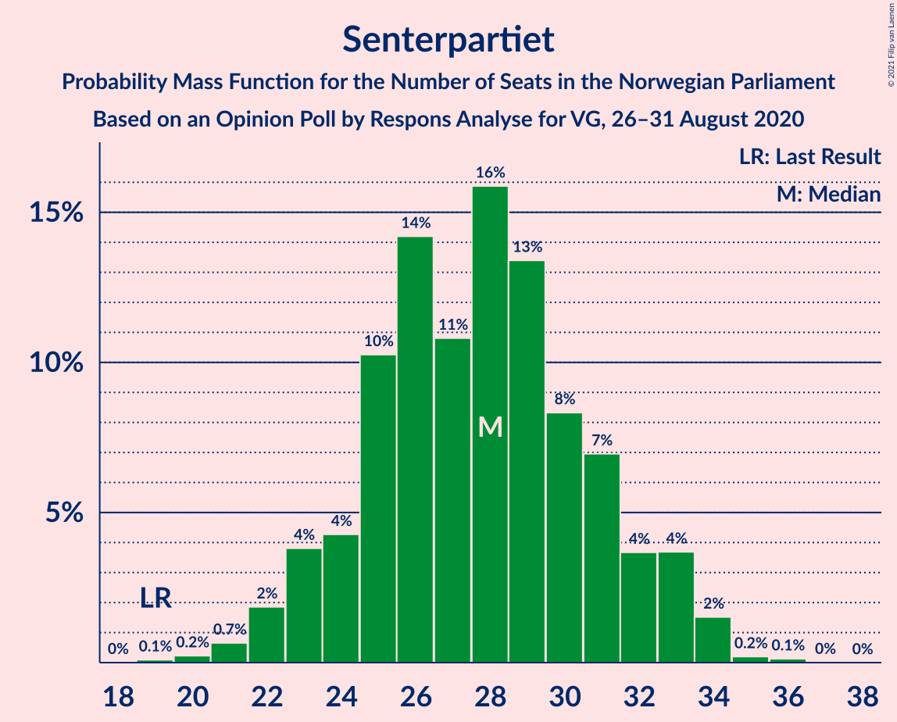
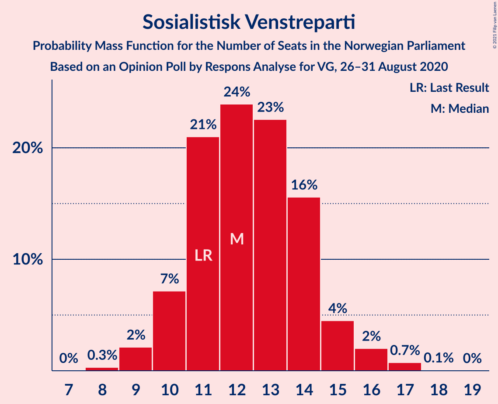
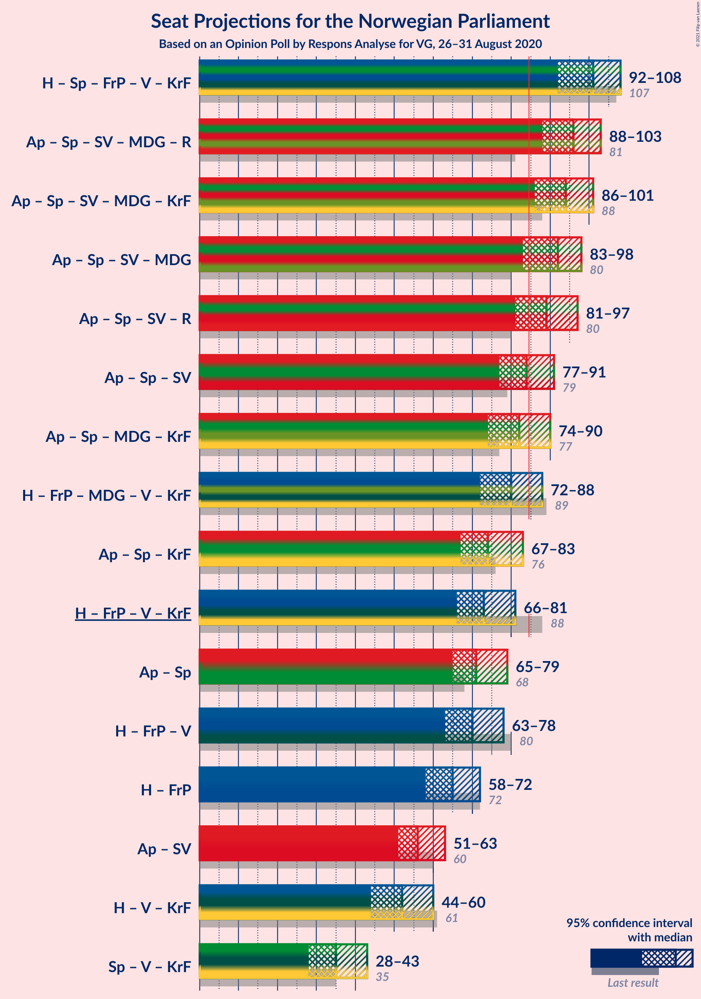

# Opinion Poll by Respons Analyse for VG, 26–31 August 2020

<a href="#voting-intentions">Voting Intentions</a> | <a href="#seats">Seats</a> | <a href="#coalitions">Coalitions</a> | <a href="#technical-information">Technical Information</a>

## Voting Intentions

### Confidence Intervals

| Party | Last Result | Poll Result | 80% Confidence Interval | 90% Confidence Interval | 95% Confidence Interval | 99% Confidence Interval |
|:-----:|:-----------:|:-----------:|:-----------------------:|:-----------------------:|:-----------------------:|:-----------------------:|
| Høyre | 25.0% | 24.8% | 23.1–26.6% |22.6–27.1% |22.2–27.6% |21.4–28.5% |
| Arbeiderpartiet | 27.4% | 24.3% | 22.6–26.1% |22.1–26.6% |21.7–27.1% |21.0–27.9% |
| Senterpartiet | 10.3% | 14.7% | 13.3–16.2% |13.0–16.7% |12.6–17.0% |12.0–17.8% |
| Fremskrittspartiet | 15.2% | 11.5% | 10.3–12.9% |10.0–13.3% |9.7–13.6% |9.1–14.3% |
| Sosialistisk Venstreparti | 6.0% | 6.8% | 5.9–7.9% |5.6–8.3% |5.4–8.5% |5.0–9.1% |
| Miljøpartiet De Grønne | 3.2% | 4.5% | 3.8–5.5% |3.6–5.7% |3.4–6.0% |3.0–6.5% |
| Venstre | 4.4% | 4.0% | 3.3–4.9% |3.1–5.2% |2.9–5.4% |2.7–5.9% |
| Rødt | 2.4% | 3.9% | 3.2–4.8% |3.0–5.1% |2.9–5.3% |2.6–5.8% |
| Kristelig Folkeparti | 4.2% | 3.3% | 2.7–4.1% |2.5–4.4% |2.4–4.6% |2.1–5.0% |

*Note:* The poll result column reflects the actual value used in the calculations. Published results may vary slightly, and in addition be rounded to fewer digits.

## Seats

### Confidence Intervals

| Party | Last Result | Median | 80% Confidence Interval | 90% Confidence Interval | 95% Confidence Interval | 99% Confidence Interval |
|:-----:|:-----------:|:------:|:-----------------------:|:-----------------------:|:-----------------------:|:-----------------------:|
| <a href="#høyre">Høyre</a> | 45 | 44 | 40–48 |38–51 |38–52 |37–53 |
| <a href="#arbeiderpartiet">Arbeiderpartiet</a> | 49 | 45 | 40–48 |40–50 |40–50 |39–52 |
| <a href="#senterpartiet">Senterpartiet</a> | 19 | 28 | 24–32 |23–33 |22–33 |21–36 |
| <a href="#fremskrittspartiet">Fremskrittspartiet</a> | 27 | 21 | 18–24 |17–25 |17–25 |16–26 |
| <a href="#sosialistisk-venstreparti">Sosialistisk Venstreparti</a> | 11 | 13 | 10–14 |9–14 |9–15 |9–16 |
| <a href="#miljøpartiet-de-grønne">Miljøpartiet De Grønne</a> | 1 | 8 | 2–10 |2–10 |1–11 |1–11 |
| <a href="#venstre">Venstre</a> | 8 | 3 | 2–9 |2–9 |2–10 |1–10 |
| <a href="#rødt">Rødt</a> | 1 | 2 | 2–9 |2–9 |1–10 |1–10 |
| <a href="#kristelig-folkeparti">Kristelig Folkeparti</a> | 8 | 2 | 1–7 |1–8 |1–8 |0–9 |

### Høyre

*For a full overview of the results for this party, see the [Høyre](party-høyre.html) page.*

| Number of Seats | Probability | Accumulated | Special Marks |
|:---------------:|:-----------:|:-----------:|:-------------:|
| 36 | 0.2% | 100% |  |
| 37 | 0.6% | 99.8% |  |
| 38 | 7% | 99.3% |  |
| 39 | 2% | 92% |  |
| 40 | 2% | 90% |  |
| 41 | 6% | 88% |  |
| 42 | 7% | 82% |  |
| 43 | 20% | 74% |  |
| 44 | 14% | 54% | Median |
| 45 | 5% | 40% | Last Result |
| 46 | 8% | 35% |  |
| 47 | 2% | 27% |  |
| 48 | 16% | 25% |  |
| 49 | 0.8% | 8% |  |
| 50 | 2% | 7% |  |
| 51 | 0.8% | 6% |  |
| 52 | 3% | 5% |  |
| 53 | 1.3% | 1.4% |  |
| 54 | 0% | 0.1% |  |
| 55 | 0.1% | 0.1% |  |
| 56 | 0% | 0% |  |

### Arbeiderpartiet

*For a full overview of the results for this party, see the [Arbeiderpartiet](party-arbeiderpartiet.html) page.*

| Number of Seats | Probability | Accumulated | Special Marks |
|:---------------:|:-----------:|:-----------:|:-------------:|
| 37 | 0.1% | 100% |  |
| 38 | 0.1% | 99.9% |  |
| 39 | 1.1% | 99.8% |  |
| 40 | 9% | 98.7% |  |
| 41 | 10% | 90% |  |
| 42 | 9% | 79% |  |
| 43 | 5% | 71% |  |
| 44 | 13% | 66% |  |
| 45 | 10% | 53% | Median |
| 46 | 26% | 43% |  |
| 47 | 7% | 18% |  |
| 48 | 3% | 11% |  |
| 49 | 1.4% | 8% | Last Result |
| 50 | 5% | 6% |  |
| 51 | 0.9% | 1.5% |  |
| 52 | 0.2% | 0.5% |  |
| 53 | 0.3% | 0.3% |  |
| 54 | 0% | 0.1% |  |
| 55 | 0% | 0% |  |

### Senterpartiet

*For a full overview of the results for this party, see the [Senterpartiet](party-senterpartiet.html) page.*

| Number of Seats | Probability | Accumulated | Special Marks |
|:---------------:|:-----------:|:-----------:|:-------------:|
| 19 | 0.1% | 100% | Last Result |
| 20 | 0.3% | 99.9% |  |
| 21 | 0.4% | 99.5% |  |
| 22 | 3% | 99.2% |  |
| 23 | 2% | 96% |  |
| 24 | 4% | 94% |  |
| 25 | 7% | 90% |  |
| 26 | 23% | 83% |  |
| 27 | 7% | 60% |  |
| 28 | 17% | 54% | Median |
| 29 | 19% | 37% |  |
| 30 | 2% | 18% |  |
| 31 | 3% | 16% |  |
| 32 | 4% | 12% |  |
| 33 | 6% | 8% |  |
| 34 | 1.1% | 2% |  |
| 35 | 0.2% | 1.0% |  |
| 36 | 0.8% | 0.8% |  |
| 37 | 0% | 0% |  |

### Fremskrittspartiet

*For a full overview of the results for this party, see the [Fremskrittspartiet](party-fremskrittspartiet.html) page.*

| Number of Seats | Probability | Accumulated | Special Marks |
|:---------------:|:-----------:|:-----------:|:-------------:|
| 15 | 0.3% | 100% |  |
| 16 | 0.8% | 99.7% |  |
| 17 | 6% | 98.9% |  |
| 18 | 6% | 93% |  |
| 19 | 16% | 87% |  |
| 20 | 5% | 71% |  |
| 21 | 30% | 66% | Median |
| 22 | 15% | 36% |  |
| 23 | 10% | 21% |  |
| 24 | 5% | 11% |  |
| 25 | 4% | 6% |  |
| 26 | 2% | 2% |  |
| 27 | 0.1% | 0.2% | Last Result |
| 28 | 0.1% | 0.1% |  |
| 29 | 0% | 0% |  |

### Sosialistisk Venstreparti

*For a full overview of the results for this party, see the [Sosialistisk Venstreparti](party-sosialistiskvenstreparti.html) page.*

| Number of Seats | Probability | Accumulated | Special Marks |
|:---------------:|:-----------:|:-----------:|:-------------:|
| 8 | 0.3% | 100% |  |
| 9 | 5% | 99.7% |  |
| 10 | 9% | 95% |  |
| 11 | 13% | 86% | Last Result |
| 12 | 19% | 73% |  |
| 13 | 19% | 54% | Median |
| 14 | 32% | 36% |  |
| 15 | 3% | 3% |  |
| 16 | 0.5% | 0.7% |  |
| 17 | 0.1% | 0.2% |  |
| 18 | 0.1% | 0.1% |  |
| 19 | 0% | 0% |  |

### Miljøpartiet De Grønne

*For a full overview of the results for this party, see the [Miljøpartiet De Grønne](party-miljøpartietdegrønne.html) page.*

| Number of Seats | Probability | Accumulated | Special Marks |
|:---------------:|:-----------:|:-----------:|:-------------:|
| 1 | 4% | 100% | Last Result |
| 2 | 20% | 96% |  |
| 3 | 7% | 76% |  |
| 4 | 0% | 69% |  |
| 5 | 0% | 69% |  |
| 6 | 0.2% | 69% |  |
| 7 | 4% | 69% |  |
| 8 | 35% | 65% | Median |
| 9 | 14% | 30% |  |
| 10 | 14% | 16% |  |
| 11 | 3% | 3% |  |
| 12 | 0.2% | 0.3% |  |
| 13 | 0.1% | 0.1% |  |
| 14 | 0% | 0% |  |

### Venstre

*For a full overview of the results for this party, see the [Venstre](party-venstre.html) page.*

| Number of Seats | Probability | Accumulated | Special Marks |
|:---------------:|:-----------:|:-----------:|:-------------:|
| 1 | 1.1% | 100% |  |
| 2 | 38% | 98.9% |  |
| 3 | 12% | 61% | Median |
| 4 | 0% | 49% |  |
| 5 | 0% | 49% |  |
| 6 | 0% | 49% |  |
| 7 | 19% | 49% |  |
| 8 | 13% | 30% | Last Result |
| 9 | 14% | 16% |  |
| 10 | 3% | 3% |  |
| 11 | 0.1% | 0.1% |  |
| 12 | 0% | 0% |  |

### Rødt

*For a full overview of the results for this party, see the [Rødt](party-rødt.html) page.*

| Number of Seats | Probability | Accumulated | Special Marks |
|:---------------:|:-----------:|:-----------:|:-------------:|
| 1 | 3% | 100% | Last Result |
| 2 | 51% | 97% | Median |
| 3 | 0% | 46% |  |
| 4 | 0% | 46% |  |
| 5 | 0% | 46% |  |
| 6 | 0.2% | 46% |  |
| 7 | 15% | 46% |  |
| 8 | 20% | 31% |  |
| 9 | 7% | 11% |  |
| 10 | 4% | 4% |  |
| 11 | 0.1% | 0.1% |  |
| 12 | 0% | 0% |  |

### Kristelig Folkeparti

*For a full overview of the results for this party, see the [Kristelig Folkeparti](party-kristeligfolkeparti.html) page.*

| Number of Seats | Probability | Accumulated | Special Marks |
|:---------------:|:-----------:|:-----------:|:-------------:|
| 0 | 1.2% | 100% |  |
| 1 | 36% | 98.8% |  |
| 2 | 15% | 63% | Median |
| 3 | 34% | 48% |  |
| 4 | 0% | 14% |  |
| 5 | 0% | 14% |  |
| 6 | 4% | 14% |  |
| 7 | 4% | 10% |  |
| 8 | 5% | 6% | Last Result |
| 9 | 0.5% | 0.6% |  |
| 10 | 0.1% | 0.1% |  |
| 11 | 0% | 0% |  |

## Coalitions

### Confidence Intervals

| Coalition | Last Result | Median | Majority? | 80% Confidence Interval | 90% Confidence Interval | 95% Confidence Interval | 99% Confidence Interval |
|:---------:|:-----------:|:------:|:---------:|:-----------------------:|:-----------------------:|:-----------------------:|:-----------------------:|
| Høyre – Senterpartiet – Fremskrittspartiet – Venstre – Kristelig Folkeparti | 107 | 99 | 100% | 95–106 | 95–107 | 92–109 | 91–110 |
| Arbeiderpartiet – Senterpartiet – Sosialistisk Venstreparti – Miljøpartiet De Grønne – Rødt | 81 | 96 | 99.6% | 90–101 | 89–102 | 87–104 | 85–105 |
| Arbeiderpartiet – Senterpartiet – Sosialistisk Venstreparti – Miljøpartiet De Grønne – Kristelig Folkeparti | 88 | 94 | 98.8% | 89–100 | 87–100 | 86–101 | 84–103 |
| Arbeiderpartiet – Senterpartiet – Sosialistisk Venstreparti – Miljøpartiet De Grønne | 80 | 91 | 97% | 87–97 | 85–98 | 83–98 | 79–100 |
| Arbeiderpartiet – Senterpartiet – Sosialistisk Venstreparti – Rødt | 80 | 88 | 85% | 84–97 | 82–97 | 79–97 | 79–99 |
| Arbeiderpartiet – Senterpartiet – Miljøpartiet De Grønne – Kristelig Folkeparti | 77 | 81 | 27% | 76–87 | 75–90 | 74–91 | 72–91 |
| Høyre – Fremskrittspartiet – Miljøpartiet De Grønne – Venstre – Kristelig Folkeparti | 89 | 81 | 15% | 72–85 | 72–87 | 72–90 | 70–90 |
| Arbeiderpartiet – Senterpartiet – Sosialistisk Venstreparti | 79 | 86 | 59% | 79–89 | 78–89 | 77–89 | 76–93 |
| Arbeiderpartiet – Senterpartiet – Kristelig Folkeparti | 76 | 75 | 0.3% | 71–79 | 69–82 | 68–83 | 66–84 |
| Høyre – Fremskrittspartiet – Venstre – Kristelig Folkeparti | 88 | 73 | 0.4% | 68–79 | 67–80 | 65–82 | 64–84 |
| Høyre – Fremskrittspartiet – Venstre | 80 | 71 | 0% | 64–75 | 63–78 | 62–79 | 61–80 |
| Arbeiderpartiet – Senterpartiet | 68 | 72 | 0% | 68–77 | 67–77 | 66–77 | 64–80 |
| Høyre – Fremskrittspartiet | 72 | 65 | 0% | 60–70 | 57–72 | 55–73 | 55–74 |
| Arbeiderpartiet – Sosialistisk Venstreparti | 60 | 58 | 0% | 52–61 | 51–62 | 50–62 | 49–64 |
| Høyre – Venstre – Kristelig Folkeparti | 61 | 51 | 0% | 48–58 | 47–59 | 46–61 | 43–62 |
| Senterpartiet – Venstre – Kristelig Folkeparti | 35 | 35 | 0% | 29–41 | 29–44 | 28–46 | 25–46 |

### Høyre – Senterpartiet – Fremskrittspartiet – Venstre – Kristelig Folkeparti

| Number of Seats | Probability | Accumulated | Special Marks |
|:---------------:|:-----------:|:-----------:|:-------------:|
| 87 | 0.1% | 100% |  |
| 88 | 0% | 99.9% |  |
| 89 | 0% | 99.9% |  |
| 90 | 0.1% | 99.9% |  |
| 91 | 1.1% | 99.8% |  |
| 92 | 2% | 98.7% |  |
| 93 | 0.4% | 97% |  |
| 94 | 1.0% | 96% |  |
| 95 | 6% | 95% |  |
| 96 | 1.0% | 89% |  |
| 97 | 3% | 88% |  |
| 98 | 6% | 86% | Median |
| 99 | 30% | 79% |  |
| 100 | 2% | 50% |  |
| 101 | 9% | 47% |  |
| 102 | 8% | 39% |  |
| 103 | 2% | 30% |  |
| 104 | 11% | 28% |  |
| 105 | 5% | 17% |  |
| 106 | 4% | 11% |  |
| 107 | 5% | 8% | Last Result |
| 108 | 0.2% | 3% |  |
| 109 | 0.3% | 3% |  |
| 110 | 2% | 2% |  |
| 111 | 0.2% | 0.3% |  |
| 112 | 0% | 0.2% |  |
| 113 | 0% | 0.1% |  |
| 114 | 0% | 0.1% |  |
| 115 | 0.1% | 0.1% |  |
| 116 | 0% | 0% |  |

### Arbeiderpartiet – Senterpartiet – Sosialistisk Venstreparti – Miljøpartiet De Grønne – Rødt

| Number of Seats | Probability | Accumulated | Special Marks |
|:---------------:|:-----------:|:-----------:|:-------------:|
| 81 | 0% | 100% | Last Result |
| 82 | 0.1% | 100% |  |
| 83 | 0% | 99.9% |  |
| 84 | 0.2% | 99.9% |  |
| 85 | 0.4% | 99.6% | Majority |
| 86 | 0.2% | 99.3% |  |
| 87 | 2% | 99.1% |  |
| 88 | 1.5% | 97% |  |
| 89 | 4% | 95% |  |
| 90 | 3% | 91% |  |
| 91 | 4% | 88% |  |
| 92 | 3% | 84% |  |
| 93 | 8% | 81% |  |
| 94 | 6% | 73% |  |
| 95 | 8% | 67% |  |
| 96 | 16% | 59% | Median |
| 97 | 3% | 43% |  |
| 98 | 4% | 40% |  |
| 99 | 14% | 36% |  |
| 100 | 8% | 22% |  |
| 101 | 6% | 14% |  |
| 102 | 3% | 7% |  |
| 103 | 2% | 5% |  |
| 104 | 2% | 3% |  |
| 105 | 0.3% | 0.6% |  |
| 106 | 0.1% | 0.3% |  |
| 107 | 0.1% | 0.2% |  |
| 108 | 0% | 0.1% |  |
| 109 | 0% | 0% |  |

### Arbeiderpartiet – Senterpartiet – Sosialistisk Venstreparti – Miljøpartiet De Grønne – Kristelig Folkeparti

| Number of Seats | Probability | Accumulated | Special Marks |
|:---------------:|:-----------:|:-----------:|:-------------:|
| 80 | 0.1% | 100% |  |
| 81 | 0% | 99.9% |  |
| 82 | 0.1% | 99.9% |  |
| 83 | 0.1% | 99.8% |  |
| 84 | 0.9% | 99.7% |  |
| 85 | 0.4% | 98.8% | Majority |
| 86 | 1.0% | 98% |  |
| 87 | 3% | 97% |  |
| 88 | 5% | 95% | Last Result |
| 89 | 5% | 90% |  |
| 90 | 9% | 85% |  |
| 91 | 3% | 76% |  |
| 92 | 4% | 74% |  |
| 93 | 10% | 70% |  |
| 94 | 14% | 60% |  |
| 95 | 18% | 46% |  |
| 96 | 6% | 28% | Median |
| 97 | 2% | 22% |  |
| 98 | 3% | 21% |  |
| 99 | 7% | 17% |  |
| 100 | 6% | 10% |  |
| 101 | 2% | 4% |  |
| 102 | 1.1% | 2% |  |
| 103 | 0.2% | 0.6% |  |
| 104 | 0.2% | 0.4% |  |
| 105 | 0.1% | 0.2% |  |
| 106 | 0% | 0.1% |  |
| 107 | 0% | 0.1% |  |
| 108 | 0% | 0% |  |

### Arbeiderpartiet – Senterpartiet – Sosialistisk Venstreparti – Miljøpartiet De Grønne

| Number of Seats | Probability | Accumulated | Special Marks |
|:---------------:|:-----------:|:-----------:|:-------------:|
| 78 | 0% | 100% |  |
| 79 | 0.8% | 99.9% |  |
| 80 | 0.1% | 99.1% | Last Result |
| 81 | 0.1% | 99.0% |  |
| 82 | 0.9% | 98.9% |  |
| 83 | 0.8% | 98% |  |
| 84 | 0.4% | 97% |  |
| 85 | 3% | 97% | Majority |
| 86 | 3% | 94% |  |
| 87 | 10% | 91% |  |
| 88 | 8% | 81% |  |
| 89 | 6% | 73% |  |
| 90 | 4% | 67% |  |
| 91 | 20% | 63% |  |
| 92 | 3% | 43% |  |
| 93 | 6% | 40% |  |
| 94 | 19% | 34% | Median |
| 95 | 2% | 15% |  |
| 96 | 1.4% | 13% |  |
| 97 | 4% | 12% |  |
| 98 | 7% | 8% |  |
| 99 | 0.8% | 2% |  |
| 100 | 0.6% | 0.9% |  |
| 101 | 0.1% | 0.3% |  |
| 102 | 0% | 0.2% |  |
| 103 | 0% | 0.1% |  |
| 104 | 0.1% | 0.1% |  |
| 105 | 0% | 0% |  |

### Arbeiderpartiet – Senterpartiet – Sosialistisk Venstreparti – Rødt

| Number of Seats | Probability | Accumulated | Special Marks |
|:---------------:|:-----------:|:-----------:|:-------------:|
| 76 | 0.1% | 100% |  |
| 77 | 0.1% | 99.9% |  |
| 78 | 0.1% | 99.8% |  |
| 79 | 3% | 99.8% |  |
| 80 | 0.4% | 97% | Last Result |
| 81 | 0.5% | 96% |  |
| 82 | 2% | 96% |  |
| 83 | 1.0% | 94% |  |
| 84 | 9% | 93% |  |
| 85 | 4% | 85% | Majority |
| 86 | 9% | 81% |  |
| 87 | 6% | 72% |  |
| 88 | 21% | 67% | Median |
| 89 | 1.1% | 45% |  |
| 90 | 8% | 44% |  |
| 91 | 4% | 36% |  |
| 92 | 2% | 32% |  |
| 93 | 7% | 29% |  |
| 94 | 2% | 22% |  |
| 95 | 5% | 20% |  |
| 96 | 2% | 15% |  |
| 97 | 12% | 13% |  |
| 98 | 0.2% | 0.7% |  |
| 99 | 0.3% | 0.5% |  |
| 100 | 0.1% | 0.2% |  |
| 101 | 0% | 0.1% |  |
| 102 | 0% | 0.1% |  |
| 103 | 0.1% | 0.1% |  |
| 104 | 0% | 0% |  |

### Arbeiderpartiet – Senterpartiet – Miljøpartiet De Grønne – Kristelig Folkeparti

| Number of Seats | Probability | Accumulated | Special Marks |
|:---------------:|:-----------:|:-----------:|:-------------:|
| 68 | 0.1% | 100% |  |
| 69 | 0.1% | 99.9% |  |
| 70 | 0% | 99.9% |  |
| 71 | 0.1% | 99.8% |  |
| 72 | 0.7% | 99.7% |  |
| 73 | 1.4% | 99.0% |  |
| 74 | 2% | 98% |  |
| 75 | 3% | 96% |  |
| 76 | 4% | 93% |  |
| 77 | 8% | 89% | Last Result |
| 78 | 3% | 81% |  |
| 79 | 4% | 78% |  |
| 80 | 21% | 74% |  |
| 81 | 17% | 53% |  |
| 82 | 4% | 36% |  |
| 83 | 2% | 31% | Median |
| 84 | 3% | 29% |  |
| 85 | 4% | 27% | Majority |
| 86 | 7% | 23% |  |
| 87 | 8% | 16% |  |
| 88 | 0.8% | 8% |  |
| 89 | 1.1% | 8% |  |
| 90 | 2% | 7% |  |
| 91 | 4% | 4% |  |
| 92 | 0.1% | 0.3% |  |
| 93 | 0.1% | 0.2% |  |
| 94 | 0.1% | 0.2% |  |
| 95 | 0% | 0% |  |

### Høyre – Fremskrittspartiet – Miljøpartiet De Grønne – Venstre – Kristelig Folkeparti

| Number of Seats | Probability | Accumulated | Special Marks |
|:---------------:|:-----------:|:-----------:|:-------------:|
| 66 | 0.1% | 100% |  |
| 67 | 0% | 99.9% |  |
| 68 | 0% | 99.9% |  |
| 69 | 0.1% | 99.9% |  |
| 70 | 0.3% | 99.8% |  |
| 71 | 0.2% | 99.5% |  |
| 72 | 12% | 99.3% |  |
| 73 | 2% | 87% |  |
| 74 | 5% | 85% |  |
| 75 | 2% | 80% |  |
| 76 | 7% | 78% |  |
| 77 | 3% | 71% |  |
| 78 | 4% | 68% | Median |
| 79 | 8% | 64% |  |
| 80 | 1.1% | 56% |  |
| 81 | 21% | 55% |  |
| 82 | 6% | 33% |  |
| 83 | 9% | 28% |  |
| 84 | 4% | 19% |  |
| 85 | 9% | 15% | Majority |
| 86 | 1.0% | 7% |  |
| 87 | 2% | 6% |  |
| 88 | 0.5% | 4% |  |
| 89 | 0.4% | 4% | Last Result |
| 90 | 3% | 3% |  |
| 91 | 0.1% | 0.2% |  |
| 92 | 0.1% | 0.2% |  |
| 93 | 0.1% | 0.1% |  |
| 94 | 0% | 0% |  |

### Arbeiderpartiet – Senterpartiet – Sosialistisk Venstreparti

| Number of Seats | Probability | Accumulated | Special Marks |
|:---------------:|:-----------:|:-----------:|:-------------:|
| 72 | 0.1% | 100% |  |
| 73 | 0.2% | 99.9% |  |
| 74 | 0.1% | 99.7% |  |
| 75 | 0.1% | 99.6% |  |
| 76 | 0.1% | 99.5% |  |
| 77 | 4% | 99.4% |  |
| 78 | 2% | 96% |  |
| 79 | 8% | 94% | Last Result |
| 80 | 3% | 86% |  |
| 81 | 1.3% | 83% |  |
| 82 | 12% | 81% |  |
| 83 | 3% | 70% |  |
| 84 | 7% | 66% |  |
| 85 | 6% | 59% | Majority |
| 86 | 24% | 53% | Median |
| 87 | 3% | 29% |  |
| 88 | 8% | 26% |  |
| 89 | 16% | 18% |  |
| 90 | 0.8% | 2% |  |
| 91 | 0.1% | 1.1% |  |
| 92 | 0.5% | 1.0% |  |
| 93 | 0.1% | 0.5% |  |
| 94 | 0% | 0.4% |  |
| 95 | 0.2% | 0.3% |  |
| 96 | 0.1% | 0.1% |  |
| 97 | 0% | 0% |  |

### Arbeiderpartiet – Senterpartiet – Kristelig Folkeparti

| Number of Seats | Probability | Accumulated | Special Marks |
|:---------------:|:-----------:|:-----------:|:-------------:|
| 63 | 0.1% | 100% |  |
| 64 | 0.1% | 99.9% |  |
| 65 | 0.1% | 99.9% |  |
| 66 | 1.4% | 99.8% |  |
| 67 | 0.5% | 98% |  |
| 68 | 1.4% | 98% |  |
| 69 | 5% | 97% |  |
| 70 | 1.4% | 92% |  |
| 71 | 9% | 90% |  |
| 72 | 6% | 81% |  |
| 73 | 19% | 75% |  |
| 74 | 6% | 56% |  |
| 75 | 6% | 50% | Median |
| 76 | 7% | 44% | Last Result |
| 77 | 9% | 38% |  |
| 78 | 18% | 29% |  |
| 79 | 1.3% | 10% |  |
| 80 | 3% | 9% |  |
| 81 | 1.2% | 7% |  |
| 82 | 0.6% | 5% |  |
| 83 | 4% | 5% |  |
| 84 | 0.4% | 0.6% |  |
| 85 | 0.1% | 0.3% | Majority |
| 86 | 0.1% | 0.2% |  |
| 87 | 0% | 0.1% |  |
| 88 | 0% | 0% |  |

### Høyre – Fremskrittspartiet – Venstre – Kristelig Folkeparti

| Number of Seats | Probability | Accumulated | Special Marks |
|:---------------:|:-----------:|:-----------:|:-------------:|
| 61 | 0% | 100% |  |
| 62 | 0.1% | 99.9% |  |
| 63 | 0.1% | 99.8% |  |
| 64 | 0.3% | 99.7% |  |
| 65 | 2% | 99.4% |  |
| 66 | 2% | 97% |  |
| 67 | 3% | 95% |  |
| 68 | 6% | 93% |  |
| 69 | 8% | 86% |  |
| 70 | 14% | 78% | Median |
| 71 | 4% | 64% |  |
| 72 | 3% | 60% |  |
| 73 | 16% | 57% |  |
| 74 | 8% | 41% |  |
| 75 | 6% | 33% |  |
| 76 | 8% | 27% |  |
| 77 | 3% | 19% |  |
| 78 | 4% | 16% |  |
| 79 | 3% | 12% |  |
| 80 | 4% | 9% |  |
| 81 | 1.4% | 5% |  |
| 82 | 2% | 3% |  |
| 83 | 0.2% | 0.9% |  |
| 84 | 0.4% | 0.7% |  |
| 85 | 0.2% | 0.4% | Majority |
| 86 | 0% | 0.1% |  |
| 87 | 0.1% | 0.1% |  |
| 88 | 0% | 0% | Last Result |

### Høyre – Fremskrittspartiet – Venstre

| Number of Seats | Probability | Accumulated | Special Marks |
|:---------------:|:-----------:|:-----------:|:-------------:|
| 58 | 0.1% | 100% |  |
| 59 | 0% | 99.9% |  |
| 60 | 0.2% | 99.9% |  |
| 61 | 0.3% | 99.7% |  |
| 62 | 4% | 99.4% |  |
| 63 | 0.4% | 95% |  |
| 64 | 6% | 95% |  |
| 65 | 2% | 89% |  |
| 66 | 3% | 87% |  |
| 67 | 16% | 84% |  |
| 68 | 8% | 68% | Median |
| 69 | 4% | 60% |  |
| 70 | 1.3% | 56% |  |
| 71 | 5% | 55% |  |
| 72 | 21% | 50% |  |
| 73 | 8% | 29% |  |
| 74 | 9% | 21% |  |
| 75 | 4% | 13% |  |
| 76 | 0.9% | 8% |  |
| 77 | 0.9% | 7% |  |
| 78 | 3% | 6% |  |
| 79 | 2% | 3% |  |
| 80 | 1.4% | 2% | Last Result |
| 81 | 0.1% | 0.3% |  |
| 82 | 0% | 0.3% |  |
| 83 | 0.2% | 0.3% |  |
| 84 | 0.1% | 0.1% |  |
| 85 | 0% | 0% | Majority |

### Arbeiderpartiet – Senterpartiet

| Number of Seats | Probability | Accumulated | Special Marks |
|:---------------:|:-----------:|:-----------:|:-------------:|
| 61 | 0.1% | 100% |  |
| 62 | 0.1% | 99.9% |  |
| 63 | 0.2% | 99.8% |  |
| 64 | 0.6% | 99.7% |  |
| 65 | 1.2% | 99.0% |  |
| 66 | 2% | 98% |  |
| 67 | 5% | 96% |  |
| 68 | 5% | 91% | Last Result |
| 69 | 10% | 86% |  |
| 70 | 6% | 76% |  |
| 71 | 6% | 69% |  |
| 72 | 22% | 64% |  |
| 73 | 7% | 41% | Median |
| 74 | 3% | 34% |  |
| 75 | 15% | 31% |  |
| 76 | 7% | 17% |  |
| 77 | 9% | 10% |  |
| 78 | 0.2% | 1.3% |  |
| 79 | 0.2% | 1.1% |  |
| 80 | 0.5% | 0.9% |  |
| 81 | 0.2% | 0.3% |  |
| 82 | 0% | 0.1% |  |
| 83 | 0.1% | 0.1% |  |
| 84 | 0% | 0% |  |

### Høyre – Fremskrittspartiet

| Number of Seats | Probability | Accumulated | Special Marks |
|:---------------:|:-----------:|:-----------:|:-------------:|
| 55 | 4% | 100% |  |
| 56 | 0.2% | 96% |  |
| 57 | 2% | 96% |  |
| 58 | 0.8% | 94% |  |
| 59 | 2% | 93% |  |
| 60 | 3% | 91% |  |
| 61 | 6% | 89% |  |
| 62 | 5% | 83% |  |
| 63 | 5% | 78% |  |
| 64 | 20% | 73% |  |
| 65 | 16% | 53% | Median |
| 66 | 2% | 37% |  |
| 67 | 6% | 35% |  |
| 68 | 2% | 30% |  |
| 69 | 2% | 28% |  |
| 70 | 16% | 26% |  |
| 71 | 4% | 10% |  |
| 72 | 2% | 6% | Last Result |
| 73 | 3% | 4% |  |
| 74 | 0.5% | 1.0% |  |
| 75 | 0.3% | 0.5% |  |
| 76 | 0% | 0.2% |  |
| 77 | 0% | 0.2% |  |
| 78 | 0.1% | 0.2% |  |
| 79 | 0% | 0.1% |  |
| 80 | 0% | 0% |  |

### Arbeiderpartiet – Sosialistisk Venstreparti

| Number of Seats | Probability | Accumulated | Special Marks |
|:---------------:|:-----------:|:-----------:|:-------------:|
| 47 | 0% | 100% |  |
| 48 | 0% | 99.9% |  |
| 49 | 0.8% | 99.9% |  |
| 50 | 2% | 99.1% |  |
| 51 | 4% | 97% |  |
| 52 | 8% | 92% |  |
| 53 | 7% | 84% |  |
| 54 | 10% | 77% |  |
| 55 | 3% | 67% |  |
| 56 | 9% | 65% |  |
| 57 | 4% | 56% |  |
| 58 | 10% | 52% | Median |
| 59 | 3% | 42% |  |
| 60 | 27% | 39% | Last Result |
| 61 | 4% | 12% |  |
| 62 | 6% | 8% |  |
| 63 | 0.8% | 2% |  |
| 64 | 0.6% | 1.0% |  |
| 65 | 0.2% | 0.3% |  |
| 66 | 0% | 0.1% |  |
| 67 | 0% | 0.1% |  |
| 68 | 0% | 0% |  |

### Høyre – Venstre – Kristelig Folkeparti

| Number of Seats | Probability | Accumulated | Special Marks |
|:---------------:|:-----------:|:-----------:|:-------------:|
| 41 | 0.2% | 100% |  |
| 42 | 0.2% | 99.8% |  |
| 43 | 0.1% | 99.6% |  |
| 44 | 0.2% | 99.5% |  |
| 45 | 0.7% | 99.3% |  |
| 46 | 2% | 98.6% |  |
| 47 | 3% | 96% |  |
| 48 | 5% | 94% |  |
| 49 | 16% | 88% | Median |
| 50 | 9% | 72% |  |
| 51 | 23% | 63% |  |
| 52 | 3% | 40% |  |
| 53 | 6% | 37% |  |
| 54 | 7% | 31% |  |
| 55 | 8% | 24% |  |
| 56 | 0.9% | 16% |  |
| 57 | 4% | 15% |  |
| 58 | 2% | 11% |  |
| 59 | 5% | 9% |  |
| 60 | 0.3% | 4% |  |
| 61 | 2% | 4% | Last Result |
| 62 | 2% | 2% |  |
| 63 | 0.3% | 0.4% |  |
| 64 | 0% | 0.1% |  |
| 65 | 0% | 0.1% |  |
| 66 | 0% | 0% |  |

### Senterpartiet – Venstre – Kristelig Folkeparti

| Number of Seats | Probability | Accumulated | Special Marks |
|:---------------:|:-----------:|:-----------:|:-------------:|
| 25 | 0.6% | 100% |  |
| 26 | 0.3% | 99.4% |  |
| 27 | 1.3% | 99.0% |  |
| 28 | 0.7% | 98% |  |
| 29 | 14% | 97% |  |
| 30 | 2% | 83% |  |
| 31 | 6% | 81% |  |
| 32 | 2% | 76% |  |
| 33 | 2% | 73% | Median |
| 34 | 12% | 71% |  |
| 35 | 16% | 59% | Last Result |
| 36 | 3% | 43% |  |
| 37 | 7% | 40% |  |
| 38 | 4% | 33% |  |
| 39 | 12% | 29% |  |
| 40 | 5% | 17% |  |
| 41 | 4% | 12% |  |
| 42 | 0.5% | 8% |  |
| 43 | 2% | 8% |  |
| 44 | 2% | 6% |  |
| 45 | 0.3% | 4% |  |
| 46 | 4% | 4% |  |
| 47 | 0.1% | 0.3% |  |
| 48 | 0.1% | 0.3% |  |
| 49 | 0.1% | 0.1% |  |
| 50 | 0% | 0% |  |

## Technical Information

### Opinion Poll

+ **Polling firm:** Respons Analyse
+ **Commissioner(s):** VG
+ **Fieldwork period:** 26–31 August 2020

### Calculations

+ **Sample size:** 1000
+ **Simulations done:** 131,072
+ **Error estimate:** 2.88%

